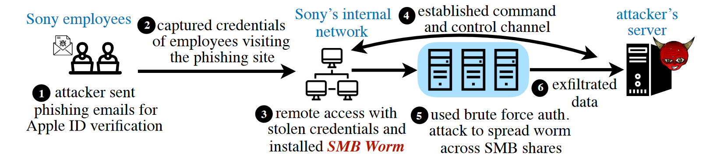
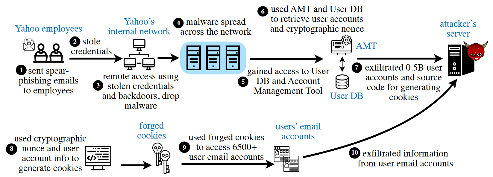
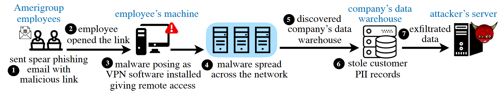
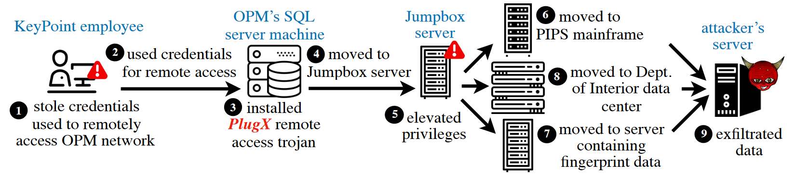
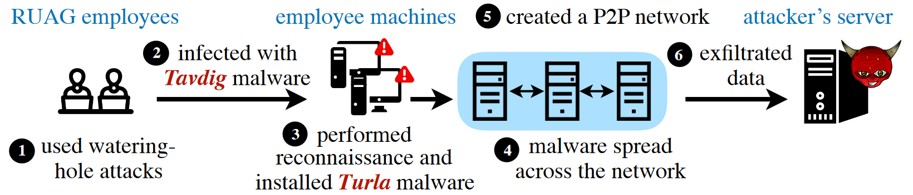
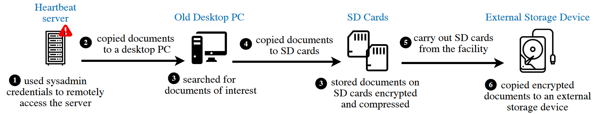
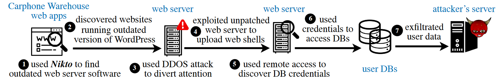
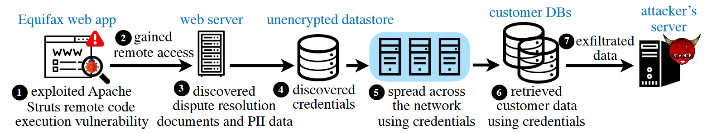
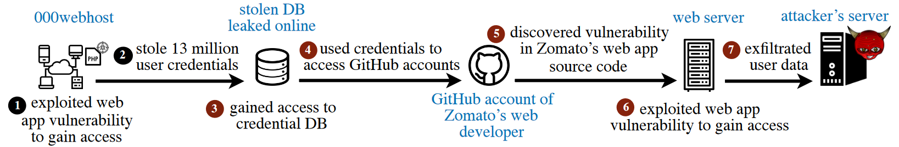

### # Ciberseguridad. Casos, motivaciones y contramedidas

✔️  Identificar algunos conceptos básicos de ciberseguridad que nos permitan entender el por qué, el cómo y el para qué de los ciberdelitos y como combatirlos.

> *La forma de saber que motiva a los ciberdelincuentes es ponerse en su piel y pensar como ellos*.

## Que motiva a un ciberdelincuente?

Las motivaciones de un ciberdelincuente pueden variar ampliamente dependiendo de varios factores, pero generalmente se pueden agrupar en varias categorías principales:

1. **Ganancia económica**:
   - **Fraude y robo de información financiera**: El objetivo es obtener datos financieros como números de tarjetas de crédito, información bancaria, etc., para robar dinero directamente.
   - **Ransomware**: Infectan sistemas con software malicioso que cifra los datos de la víctima y luego exigen un rescate para desbloquearlos.
   - **Venta de información**: Robar información personal o confidencial para venderla en mercados clandestinos.
   - **Estafas y fraudes online**: Como esquemas de phishing, donde engañan a las personas para que proporcionen información confidencial.

2. **Motivaciones políticas o ideológicas**:
   - **Hacktivismo**: Actividades de hacking que buscan promover una agenda política o social, como ataques a sitios web de gobiernos o corporaciones en protesta.
   - **Ciberterrorismo**: Usar ciberataques para causar miedo, pánico o desestabilizar sistemas políticos.

3. **Espionaje**:
   - **Corporativo**: Robar secretos comerciales, propiedad intelectual o estrategias empresariales de competidores.
   - **Gobierno/Estado**: Ciberespionaje realizado por naciones para obtener información confidencial de otros países.

4. **Reputación y desafío**:
   - **Reconocimiento entre pares**: Algunos ciberdelincuentes, especialmente en sus inicios, pueden estar motivados por el deseo de ganar reconocimiento y respeto dentro de la comunidad de hackers.
   - **Desafío personal**: La satisfacción de superar las barreras de seguridad de un sistema.

5. **Venganza**:
   - **Motivaciones personales**: Ataques realizados por individuos que buscan vengarse de una empresa, persona o entidad específica debido a un agravio percibido.

6. **Acceso a servicios o recursos**:
   - **Utilización de recursos ajenos**: Como el uso de computadoras para minería de criptomonedas sin el consentimiento del dueño (cryptojacking).
   - **Uso de infraestructura**: Para realizar otros ataques o almacenar datos ilegales.

Entender estas motivaciones es crucial para desarrollar estrategias de defensa y mitigación efectivas contra las diversas formas de cibercrimen.

## Casos de estudio

Las filtraciones de datos se encuentran entre los problemas de privacidad y seguridad informática más importantes. Es habitual que los atacantes roben millones o incluso miles de millones de registros. A pesar de ser un problema tan enorme, las filtraciones de datos se consideran resultados de otros problemas de seguridad, como errores humanos y vulnerabilidades de software. Además de las graves consecuencias para la seguridad, las violaciones de datos plantean problemas directos de privacidad; la mayoría de las filtraciones de datos revelan datos confidenciales a personas mal intencionadas que los venden en la web oscura y puede ser divulgarlos públicamente.

Conocer paso a paso, de forma sistemática y concisa, las violaciones de datos en flujos de trabajo nos sirve para describir y conocer los métodos de violación. Pero no siempre resulta fácil obtener  información sobre los pasos cruciales de todos los ataques. Para completar esta visión, que pueda ayudar a desarrollar nuestros propios flujos de trabajo contra violaciones, se emplea información de una variedad de fuentes. 

Basándonos en estos estudios se pude crear una agenda de requisitos que las organizaciones deben cumplir para impedir las violaciones de datos. Se describe qué requisitos cumplen las tecnologías de seguridad existentes y se proponen futuras direcciones de investigación para frustrar las violaciones de datos.

### Flujos de trabajo, más plausibles, en 10 violaciones de datos famosas:

- **Sony Pictures Data Breach, 2014**

  En 2014, el grupo Lazarus, un grupo de amenazas patrocinado por el estado, violó Sony Pictures. Extrajeron y publicaron películas inéditas, información de identificación personal de los empleados de Sony y sus familiares, correos electrónicos que mostraban políticas detrás de la escena sobre títulos, documentos financieros, credenciales internas de Sony, como las credenciales del servidor FTP de Sony, y credenciales externas, como las cuentas de YouTube de Sony, The Los Angeles Times y The New York Times. Los datos se publicaron a través de torrents y servicios de alojamiento de archivos, como MEGA y Rapidgator, y se utilizaron los servidores comprometidos de Sony para cargar los datos. WikiLeaks publicó más tarde una base de datos con capacidad de búsqueda de los datos filtrados. El atacante también limpió las máquinas de la empresa.

  El atacante encontró a los empleados de Sony con altos privilegios de red a través de LinkedIn y les envió correos electrónicos de phishing con un enlace a un clon del sitio web de verificación ID de Apple. De este modo recolectaron credenciales de ID de Apple con la esperanza de que se utilicen contraseñas iguales o similares que le permitieran acceder de forma remota a la red de Sony. Y si, la reutilización de contraseñas equipó al atacante con todo lo necesario para el acceso remoto.

  Equipado con acceso remoto, el atacante instaló una herramienta de gusano personalizada en los hosts infectados para
  explotar vulnerabilidades en el protocolo de Microsoft Server Message Block (SMB). Este protocolo SMB permite compartir archivos, impresoras y otros recursos en una red. El gusano en los hosts comprometidos aprovecho la conexión con otros hosts mediante ataques de fuerza bruta para forzar sus contraseñas de autenticación. Esta *invasión* también fue posible ya que muchos ordenadores comprometidos todavía usaban Windows XP.

  

- **Target Data Breach, 2013**

  En 2013, un atacante violó la información personal de 70 millones e información financiera de 40 millones de clientes de Target. El Departamento de Justicia alertó a Target después de que los analistas de fraude externo denunciaran la violación debido al enorme aumento en el número de tarjetas robadas de casi todos los bancos con un punto de compra en común en los mercados de la web oscura.

  El atacante envió correos electrónicos de phishing al proveedor HVAC de Target, Fazio Mechanical, infectando a un empleado con el troyano *Citadel*. El malware utiliza inyecciones web que modifican el HTML de los sitios web específicos en la computadora de la víctima, incluyendo formularios falsos que solicitaron información personal y credenciales simulando ser sitios web legítimos, que obtenían capturas de pantalla y grababan la pantalla para robar credenciales.

  El atacante utilizó las credenciales robadas para iniciar sesión en el portal web utilizado por los proveedores externos de Target. Allí cargaron un shell web PHP usando la función de carga destinada a cargar documentos, como facturas,  y aprovechando la falta de controles de seguridad para validar los tipos de archivos que se podían subir. El web-shell le dio al atacante acceso remoto al servidor web de Target.

  El atacante equipado con acceso remoto utilizó  Microsoft Active Directory Domain Services para localizar
  objetivos críticos, como servidores de bases de datos y puntos de Terminales de venta (POS).

  Después de explotar las vulnerabilidades des sistema y con privilegios elevados, el atacante pudo tener acceso a las bases de datos y ha muchos de los servicios internos de Target incluido el Cliente FTP de Windows y poder extraer alrededor de 11GB de datos y llevarlos a 3 servidores remotos bajo su control.

  Los datos extraídos incluían 70 millones de registros de usuarios con nombres, correo electrónico, direcciones, números de teléfono de los clientes y 40 millones de registros de tarjetas de pago que contenían nombres, números de tarjetas, fechas de vencimiento y valores de verificación de tarjeta (CVV).

  

- **Yahoo Data Breach, 2014**

  En 2014, actores patrocinados por el estado violaron Yahoo par robar información de cuentas de más de 500 millones de usuarios. El atacante generó cookies de autenticación falsificada para obtener acceso a cuentas de correo electrónico de varios periodistas rusos, funcionarios de los gobiernos de Estados Unidos y Rusia y empleados del sector privado. Además, desviaron el tráfico del motor de búsqueda de Yahoo a ciertos sitios web para obtener ganancias monetarias. Para por último vender las cuentas robadas en un mercado de la dark-web.

  El atacante envió correos electrónicos de phishing a empleados de empresas de Yahoo, para engañarlos y que visitaran sitios de phishing y divulgaran sus credenciales. Los detalles exactos sobre los sitios de phishing son desconocidos. El atacante utilizó las credenciales robadas para acceder de forma remota a la red de Yahoo y implantar una puerta trasera para acceso persistente.

  El atacante descubrió la base de datos de usuarios de Yahoo y una herramienta de administración de cuentas utilizada para acceder y editar la base de datos. La base de datos contenía nombres, correos electrónicos, fechas de nacimiento, preguntas y respuestas de seguridad, correos electrónicos de recuperación de contraseñas, contraseñas hash y cifrado de datos geográficos únicos para cada cuenta. El atacante extrajo una copia de seguridad de la base de datos que contenía más de 500 millones de registros utilizando File Transfer Protocol.

  En algunos casos, el dominio de correo electrónico de las direcciones de correo electrónico de recuperación de cuentas que no son de Yahoo también les proporcionó pistas sobre la organización del usuario y poder extender el ataque a nuevas organizaciones.

  La mayoría de las contraseñas en la base de datos - hash- estaban encriptadas usando bcrypt, un algoritmo de hash de contraseñas lento basado en el cifrado Blowfish que protege contra ataques de fuerza bruta y mesa de arcoíris - rainbow table-. El atacante utilizó el nonce criptográfico - un número arbitrario que puede ser usado solo una vez en la comunicación criptográfica-  asociado con cada cuenta junto con un script disponible en el servidor de Yahoo para generar cookies de autenticación web que les permitieron acceder a más de 6.500 cuentas de correo electrónico de víctimas sin necesidad de usar contraseñas reales. Utilizando este acceso para robar datos confidenciales de las cuentas de correo electrónico, incluidos números de tarjetas de crédito y de regalo, enviar correos electrónicos no deseados a los contactos de los usuarios, obtener información sobre otras cuentas de usuario, como la cuenta de Gmail del usuario, y utilizar el phishing para obtener acceso a esas cuentas.

  Para obtener ganancias, el atacante también redirigió el sitio tráfico del motor de búsqueda de Yahoo a una farmacia en línea que pagaba por tráfico. Y durante todo el proceso utilizó herramientas de limpieza de registros para borrar los registros de eventos y evitar así la detección.

  

- **Anthem Data Breach, 2014**

  Anthem es una compañía de seguros de salud estadounidense. En 2014, un grupo de espionaje patrocinado por el estado conocido como Deep Panda o Black Vine atacaron a los empleados de Anthem engañándolos para que instalaran malware haciéndose pasar por un software VPN legítimo. El atacante obtuvo acceso remoto al almacén de datos de la empresa y exfiltró 78,8 millones de registros de clientes.

  El atacante envió correos electrónicos de phishing a los empleados en Amerigroup, una empresa subsidiaria de Anthem, con un enlace a un clon del sitio web oficial de Anthem, que contiene instrucciones sobre la instalación del software VPN, Citrix y Juniper VPN, utilizado por la empresa. Antes de 2014, Anthem era conocida como Wellpoint Inc.; el atacante registró el dominio we11point.com para alojar el sitio de phishing, reemplazando las dos ‘l’ de wellpoint con el carácter numérico 1 para que pareciera legítimo. El sitio ficticio alojaba el malware Sakula, haciéndose pasar por el software VPN.

  El empleado instalaba el malware Sakula pensando que se trataba de un software VPN, lo que daba al atacante acceso remoto al host. Sakula es un troyano de acceso remoto que puede ejecutar comandos arbitrarios del sistema operativo, descargar y ejecutar la carga útil y cargar archivos. También utilizó la puerta trasera Mivast que puede descargar información de contraseña NTLM, ejecutar comandos remotos y descargar y ejecutar archivos.

  Suponemos que el atacante usó la función de volcado de credenciales del malware Mivast para robar credenciales para conectarse con otros hosts en la red y luego usó el malware Sakula para eludir el Control de cuentas de usuario (UAC) de Windows y obtener privilegios elevados. El UAC de Windows permite que los programas eleven privilegios al nivel de administrador solicitando confirmación al usuario. Si el nivel de protección UAC se establece en un nivel distinto al
  nivel más alto, algunos programas de Windows pueden elevar sus privilegios a través de UAC sin previo aviso ni petición de permiso. Un Malware como Sakula puede usar esta debilidad para inyectarse en un Windows confiable procesar y obtener privilegios elevados sin pedir permiso al usuario. El atacante se propagó así a través de la red infectando más de 50 cuentas de usuarios y 90 anfitriones. El dominio del servidor de comando y control.
  Los nombres de dominio del servidor de comando y control fueron cuidadosamente seleccionados para evitar sospechas, por ejemplo: `extcitrix.we11point.com` 
  El atacante descubrió el almacén de datos empresariales que contenía PII (*personally identifiable information*) de clientes, incluido nombres, direcciones de correo electrónico, identificaciones médicas, números de seguridad social e información de empleo,… exfiltrando 78,8 millones de registros de usuarios.

  

- **OPM Data Breach, 2014**

  El atacante apuntó a la Oficina de Gestión de Personal (OPM) de los Estados Unidos en dos ataques separados pero vinculados en 2014. En el primer ataque, el atacante robó los documentos de especificaciones de red de la OPM que utilizaron para comprender la estructura de la red y lanzar otro ataque. En el segundo ataque, el atacante robó las credenciales de una empresa externa, KeyPoint: contratista de investigación de antecedentes de OPM, empleado para obtener acceso y exfiltró datos de investigación de antecedentes de empleados federales.

  Las evaluaciones de red realizadas por el Equipo de Preparación para Emergencias Informáticas de EE. UU. identificaron dos infracciones distintas en KeyPoint Government Solutions. Aunque se desconoce el vector de ataque utilizado en estas infracciones, el atacante robó datos de PII de los empleados del Departamento de Seguridad Nacional y credenciales de acceso remoto de un servidor en la Oficina de Gestión de Personal (OPM). La OPM había emitido credenciales a los empleados de KeyPoint para acceder a un servidor que alberga datos de empleados federales y realizar tareas de investigación de antecedentes.

  El atacante accedió al servidor de OPM a través de una sesión VPN con las credenciales robadas e instaló el malware PlugX que se hizo pasar por el software McAfee Antivirus. PlugX es un troyano modular de acceso remoto que se utiliza para ejecutar comandos arbitrarios del sistema operativo, registrar pulsaciones de teclas, capturar capturas de pantalla y videos de la actividad del usuario, enumerar recursos de red y modificar archivos.

  El servidor de comando y control de malware utilizó nombres de dominio: opmlearning.org, opmsecurity.org, wdc-news-post.com, para evitar sospechas si se estaba analizando el tráfico de red.

  El atacante utilizó las capacidades de registro de claves del malware para robar credenciales y propagarse por la red obteniendo acceso a un servidor *jumpbox*: un servidor administrativo utilizado para administrar dispositivos en zonas de seguridad de red separadas. Una zona de seguridad es una parte de la red con una política de control de acceso específica implementada por firewalls.
  El atacante utilizó el acceso privilegiado en el servidor Jumpbox para conectarse a las partes de la red que de otro modo estarían aisladas de la red normal. El atacante obtuvo acceso al Sistema de Procesamiento de Investigaciones de Personal (PIPS) utilizado por la OPM para procesar y almacenar los datos de investigación de antecedentes de los empleados del gobierno. Los datos incluían el formulario estándar para empleados del gobierno, un cuestionario de autorización de seguridad de 127 páginas con datos confidenciales, como historial financiero, abuso de sustancias en el pasado e información sobre atención de salud mental. El atacante también obtuvo acceso a los datos de las huellas dactilares de los empleados, que pueden usarse para hacerse pasar por empleados federales y acceder a ubicaciones protegidas mediante autenticación de huellas dactilares.
  El atacante utilizó además su presencia en el servidor *jumpbox* para acceder al centro de datos del Departamento de Interior de los Estados Unidos y robó los registros de PII del personal de OPM. El atacante exfiltró 21,5 millones de registros de investigación de antecedentes de empleados, 5,6 millones de registros de huellas dactilares y 4 millones de registros de PII del personal en archivos comprimidos cifrados para evitar la detección.

  

- **RUAG Data Breach, 2014-2015**

  En 2014, un grupo de amenazas ruso, Turla, también conocido como Waterbug, atacó RUAG, un contratista de defensa suizo, mediante ataques de abrevadero. Utilizando el malware Turla y herramientas de explotación de vulnerabilidades disponibles públicamente, el atacante exfiltró 23 GB de datos confidenciales durante un período de tiempo prolongado para evitar ser detectado.
  El atacante utilizó un sitio web de abrevadero para tomar huellas dactilares, es decir, para obtener información sobre la dirección IP del usuario, la versión del navegador, los complementos del navegador y el sistema operativo. Luego, el sitio web del abrevadero redirigió a los empleados de la empresa a un sitio web malicioso utilizando acortadores de URL y código Javascript que aparentaba ser como los scripts de Google Analytics.
  El atacante utilizó el sitio web malicioso para engañar a los usuarios para que descargaran el malware Tavdig haciéndose pasar por software legítimo, como Java Installer y Microsoft Security Essentials. Tavdig, un malware de reconocimiento, fue utilizado para recopilar información sobre el sistema operativo y los servicios del host, credenciales de inicio de sesión, red e información específica del dominio. El malware inyecta carga útil en procesos que ya se están ejecutando, como navegadores web y clientes de correo electrónico para anular a los firewalls que filtran el tráfico según el proceso de origen.
  Con los datos de reconocimiento disponibles, el atacante instaló el malware Turla en hosts seleccionados. El malware se comunica con el servidor de comando y control para recibir tareas y utilizar técnicas de inyección de procesos y ejecutar la carga maliciosa. El atacante utilizó la herramienta Mimikatz para realizar una serie de ataques pass-the-hash, pass-the-ticket y Golden Ticket para escalar privilegios y propagarse por la red, infectando a otros hosts.
  El atacante creó una red peer to peer (P2P) de hosts infectados utilizando el malware Turla. La red constaba de nodos trabajadores y de comunicación donde los nodos trabajadores recopilaban datos para la exfiltración mientras que los nodos de comunicación se comunicaban con los servidores de comando y control para recibir tareas. En los nodos de comunicación, el malware inyectó su carga útil en el proceso del navegador web y en los nodos trabajadores inyectó carga útil en procesos de larga duración, como explore.exe.
  Los nodos trabajadores y de comunicación se comunicaron a través de canalizaciones con nombre utilizando cifrado CAST128. El movimiento lateral duró 8 meses durante los cuales el atacante no extrajo muchos datos.
  El atacante exfiltró 23 GB de datos confidenciales a través de los nodos de comunicación mediante solicitudes de publicación HTTP durante un período prolongado, es decir, de septiembre a diciembre de 2015. Se desconoce el tipo de datos robados ya que la empresa no tenía escuchas telefónicas en el momento del ataque.

  

- **NSA Breach, 2013**

  En 2013, Edward Snowden, un subcontratista de la Agencia Central de Inteligencia (CIA) y la Agencia de Seguridad Nacional (NSA), extrajo y filtró documentos altamente clasificados de la NSA que revelaban varios programas globales de vigilancia masiva dirigidos por la NSA y la Five Eyes Intelligence Alliance, que incluía Australia, Canadá, Nueva Zelanda, Reino Unido y Estados Unidos. Snowden, que trabajaba como administrador de sistemas en la Oficina de Intercambio de Información de la NSA, utilizó su acceso privilegiado para descargar y filtrar documentos confidenciales durante un período prolongado para evitar ser detectado.
  Snowden utilizó sus altos privilegios como administrador de sistemas Microsoft SharePoint para obtener acceso al servidor Heartbeat en la red de la NSA. La NSA utilizaba SharePoint para la gestión de documentos de la intranet. Heartbeat era una plataforma automatizada diseñada por el propio Snowden en el pasado para escanear y recopilar documentos relacionados con actividades de inteligencia clasificadas de las redes de la NSA, la CIA, el FBI y el Joint Worldwide Intelligence Communications System y el Departamento de Defensa. Heartbeat presentaba estos documentos o blogs de noticias conocidos como "tableros de lectura" a los funcionarios de la NSA en función de sus autorizaciones, intereses y afiliaciones a cargos. El servidor Heartbeat también almacenaba una copia de cada documento.
  Snowden no utilizó el servidor Heartbeat directamente para buscar los documentos de interés ni copiarlos a un dispositivo de almacenamiento externo, ya que el servidor registraba todas las actividades y esto podría generar una alarma. En lugar de ello, Snowden conectó una vieja PC de escritorio, que la agencia había limpiado y descartado previamente cuando actualizaron a nuevos “clientes ligeros”, máquinas livianas que dependen de su conexión remota con los servidores en la nube para realizar cálculos y almacenamiento de datos. Luego, Snowden copió los documentos del servidor Heartbeat a la máquina de escritorio, una acción que podría justificarse afirmando que estaba realizando pruebas de compatibilidad de Heartbeat con sistemas operativos más antiguos.
  Snowden utilizó la PC de escritorio para buscar documentos de interés. Luego cifraba y copiaba estos documentos en tarjetas mini y micro-SD durante sus turnos nocturnos. Aunque la velocidad de escritura de las tarjetas SD era lenta, tardando aproximadamente 8 horas en llenar una tarjeta SD una vez, era más fácil pasar los puntos de control de seguridad con una tarjeta SD sin ser detectado debido a su tamaño reducido.
  Snowden utilizó diversos métodos para llevar las tarjetas SD fuera del edificio cada día. Los llevaba en los calcetines, en el fondo del bolsillo, en la mejilla para poder tragárselos si fuera necesario y en el cuadrado arrancado de un cubo de Rubik. Antes de usar el cubo de Rubik para ocultar la tarjeta SD, solía pasar junto a los guardias resolviendo el cubo y hasta regalo algunos cubos a otros empleados para evitar levantar sospechas.
  Snowden llevó las tarjetas SD a su casa y trasladó todos los documentos a un dispositivo de almacenamiento externo más grande usando su computadora portátil. Se escondía debajo de una manta para copiar estos documentos por temor a que el FBI pudiera cablear la casa para detectar actividades maliciosas.
  Cifró los documentos con múltiples capas de cifrado utilizando diferentes implementaciones para que incluso si un algoritmo falla, otros puedan mantener los documentos seguros.

  La historia de Snowden acabo siendo uno de los 

  

- **Carphone Warehouse Breach, 2015**

  Los ciberdelincuentes irrumpieron en Carphone Warehouse, un minorista británico de teléfonos móviles, en 2015, robando información de identificación personal de los clientes y registros históricos de transacciones de pago. El atacante utilizó una herramienta automatizada, Nikto Scanner, para descubrir un servidor web de la empresa que ejecutaba una versión desactualizada de WordPress, que aprovechó para obtener acceso remoto. El atacante encontró credenciales de bases de datos en texto plano en el servidor, que utilizó para acceder a las bases de datos y extraer los datos.
  El atacante utilizó el escáner Nikto, una herramienta de pruebas de penetración de código abierto, para buscar sitios web que ejecutaran software de servidor web obsoleto y descubrió que el servidor web de la empresa ejecutaba una versión de WordPress de hace 6 años.
  El atacante lanzó un ataque DDOS para desviar la atención del personal de respuesta de seguridad [86]. Aunque Carphone inicialmente afirmó que el atacante aprovechó la versión vulnerable de WordPress para comprometerla, luego sostuvo que se utilizaron credenciales válidas de administrador de WordPress para iniciar sesión e instalar software malicioso.
  complementos. Los complementos de WordPress son software para ampliar la funcionalidad de un sitio web de WordPress. Se desconoce cómo el atacante robó las credenciales de administrador.
  Los complementos maliciosos tenían funcionalidad de shell web. Un shell web es un script cargado en un servidor web que se ejecuta en el contexto del software del servidor web que proporciona acceso remoto al atacante.
  El atacante utilizó este acceso para reconocimiento, descubrió credenciales de bases de datos en texto plano y las utilizó para acceder a las bases de datos de la empresa que contienen registros de clientes y empleados y datos históricos de transacciones de pago.
  El atacante exfiltró 3,3 millones de registros de clientes que contenían el nombre, dirección, número de teléfono, fecha de nacimiento y estado civil; 1000 registros de empleados que contienen el nombre, número de teléfono, código postal y número de matrícula del automóvil; y datos históricos de transacciones de pago de aproximadamente 18.000 clientes.

  

- **Equifax Data Breach, 2017**

  En 2017, los ciberdelincuentes violaron Equifax al explotar una vulnerabilidad de ejecución remota de código en su marco de desarrollo de aplicaciones web. Se extendieron a través de varios hosts debido a una segmentación débil de la red y descubrieron un almacén de datos no cifrado que contenía credenciales de base de datos. Utilizaron estas credenciales para acceder a las bases de datos de la empresa y extrajeron información de identificación personal de los clientes y registros de tarjetas de pago.
  El atacante aprovechó una vulnerabilidad de ejecución remota de código (CVE-2017-5638) en el servidor del portal de discusión de Equifax que ejecuta Apache Struts y obtuvo acceso remoto. La vulnerabilidad permite a un adversario ejecutar comandos arbitrarios utilizando un valor de encabezado de tipo de contenido diseñado en una solicitud HTTP.

  Antes del ataque, el Departamento de Seguridad Nacional de los Estados Unidos notificó a Equifax sobre la vulnerabilidad después de que Apache la revelara y lanzara un parche. Equifax escaneó sus servidores, pero el escaneo no detectó el servidor vulnerable del portal de disputas de Equifax ya que olvidaron usar el indicador recursivo y simplemente escanearon el directorio raíz.
  El atacante descubrió 3 bases de datos en el servidor que contenían documentos de resolución de disputas e información de identificación personal de 182.000 clientes. También descubrieron un almacén de datos no cifrado que contenía credenciales para acceder a otros servidores y bases de datos de la empresa.
  El atacante utilizó las credenciales robadas para conectarse con otros hosts y propagarse a través de una red débilmente segmentada. El atacante descubrió 48 bases de datos y utilizó las credenciales robadas para extraer datos en pequeños incrementos para evitar sospechas; consultando las bases de datos 9.000 veces más de 76 días.
  El atacante exfiltró 148 millones de registros de clientes que contenían números de seguridad social, fechas de nacimiento, direcciones particulares y números de licencia de conducir; números de tarjetas de crédito de 209.000 clientes; y 182.000 documentos de resolución de disputas utilizando protocolos de cifrado estándar. Aunque la empresa contaba con una herramienta de inspección de tráfico, una mala configuración permitió que el tráfico cifrado pasara sin inspección.

  

- **Zomato Data Breach, 2017**

  En 2017, los ciberdelincuentes accedieron a la cuenta de GitHub de un desarrollador de Zomato, un servicio de búsqueda y descubrimiento de restaurantes, utilizando credenciales filtradas en una violación de datos en 000webhost. Analizaron el repositorio de código fuente de la aplicación web de Zomato y descubrieron una vulnerabilidad que les daba acceso remoto al servidor de Zomato. El atacante robó una base de datos que contenía 17 millones de registros de cuentas de clientes. La empresa tuvo conocimiento del incumplimiento cuando el atacante publicó un anuncio para vender los datos en un mercado de la web oscura.
  El atacante apuntó a 000webhost, un servicio de alojamiento web, explotando una vulnerabilidad de una aplicación web en una versión antigua de PHP. Robaron una base de datos que contenía correos electrónicos y contraseñas no cifradas de unos 13 millones de usuarios que se filtraron posteriormente.
  En un incidente separado, un atacante utilizó las credenciales de usuario filtradas para iniciar sesión en otros sitios web, con la esperanza de que algunos usuarios hubieran reutilizado sus contraseñas, obteniendo acceso a una cuenta de GitHub de un empleado de Zomato debido a la reutilización de contraseñas.
  El atacante utilizó este acceso para revisar el repositorio de código fuente de la aplicación web de Zomato y descubrió una vulnerabilidad de ejecución remota de código. El atacante aprovechó la vulnerabilidad para obtener acceso remoto al servidor de Zomato.
  El atacante descubrió una base de datos que contenía nombres, nombres de usuario, direcciones de correo electrónico y hashes de contraseñas de 17 millones de clientes, que luego fue exfiltrada.

  

#### Reflexión

- Que objetivos tiene el ciberdelito?
- Que métodos usa la ciberdelincuencia?

---

**Referencias:**

- Hamza Saleem, Muhammad Naveed: [SoK: Anatomy of Data Breaches](https://www.researchgate.net/publication/346937548_SoK_Anatomy_of_Data_Breaches#pf11), 2020
- James Bone: [Cognitive Hack; The New Battleground in Cybersecurity... the Human Mind](https://www.routledge.com/rsc/downloads/10.1201_9781315368412-1.pdf) ​[:green_book:](https://www.routledge.com/Cognitive-Hack-The-New-Battleground-in-Cybersecurity--the-Human-Mind/Bone/p/book/9780367567965) 2017​