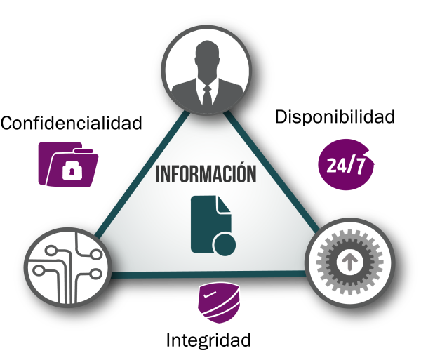
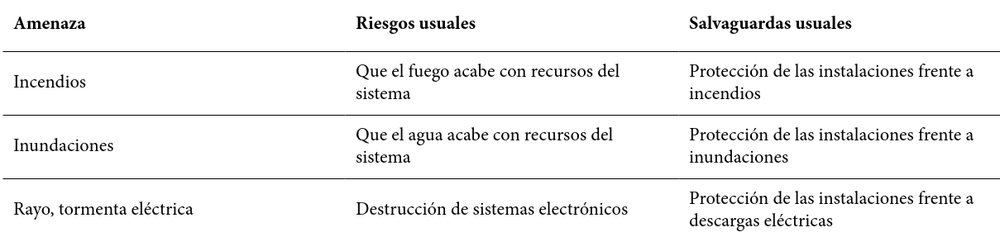
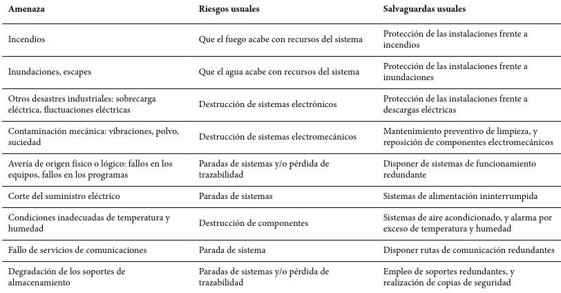
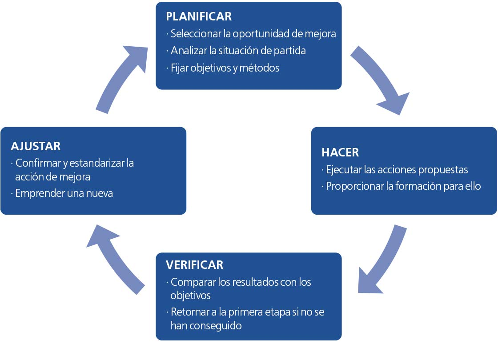

# CRITERIOS GENERALES COMÚNMENTE ACEPTADOS SOBRE SEGURIDAD DE LOS EQUIPOS INFORMÁTICOS

En la actualidad, podemos ver que el uso de equipos informáticos se ha extendido hasta tal punto que es casi imposible encontrarnos hogares o empresas que no cuenten con al menos uno de estos equipos.

> Los equipos informáticos son los encargados de realizar algunas tareas tan vitales como almacenar información de una organización u ofrecer directamente los servicios de la misma.

Si nos vamos a infraestructuras críticas como pueden ser plantas de producción eléctricas, servicios de telecomunicaciones o incluso sistemas de transporte aéreo, vemos la importancia del papel que los equipos informáticos juegan en el día a día. Esta importancia o dependencia de ellos, hace que sea necesario **emplear mecanismos y técnicas de protección que hagan frente a posibles amenazas dirigidas hacia estos equipos**.

## Modelo de seguridad orientada a la gestión del riesgo relacionado con el uso de los sistemas de información

Una vez hemos entendido la necesidad e importancia de proteger los equipos informáticos, vamos a ver cuales son los elementos que intervienen en el momento que aparece un problema de seguridad como puede ser una amenaza, vulnerabilidad o incidente de seguridad. Antes, repasaremos la definición de **Seguridad de la Información**.

> La norma [ISO/IEC 27001](https://www.iso.org/isoiec-27001-information-security.html) indica que la Seguridad de la Información es la preservación de **confidencialidad, integridad y disponibilidad de la información**.

### Amenazas, vulnerabilidades e incidentes de seguridad

- **Amenazas**

  Son las posibles **acciones que podrían dañar los equipos informáticos**. Las amenazas no se pueden eliminar ya que su existencia está ligada al contexto y entorno en que existen los equipos informáticos, pero podemos analizarlas para reducir el daño que supondrían en los equipos informáticos.

- **Vulnerabilidad**

  Permite o **facilita que una amenaza dañe el equipo**. Las Amenazas se aprovechan de las vulnerabilidades (intencionadas o no), para dañar o atacar los equipos.

- **Incidente de Seguridad**

  Cuando una o varias **amenazas suceden y aprovechan una vulnerabilidad**, se entiende que ha ocurrido un Incidente de Seguridad.

Frente a los incidentes de seguridad se deben disponer contramedidas capaces de fortalecer el sistema. Estas buscan **conocer, prevenir, impedir, reducir y controlar el daño** que podría tener un equipo informático. 

El trabajo del equipo de seguridad consistiría en reducir las posibilidades de que ocurra este tipo de incidentes de seguridad, así como reducir el daño cuando estos ocurran. En las contramedidas es donde se centrará el trabajo y en donde se analizarán las medidas más efectivas para reducir la probabilidad y los daños de un incidente de seguridad maximizando la relación beneficio/coste para la organización.

### Principios de Seguridad

Las amenazas no se pueden eliminar al 100% independientemente del número de contramedidas que establezcamos. 

**La seguridad total no existe.**

> El único sistema verdaderamente seguro es el que está apagado, encerrado en un bloque de hormigón y sellado en una sala revestida de plomo con guardias armados, e incluso así tengo mis dudas. [GENE SPAFFORD](https://en.wikipedia.org/wiki/Gene_Spafford), *Web Security & Commerce* (1997)

La **Seguridad de la Información** se basa en 3 pilares:

- **Integridad:** La información debe ser exacta y completa, de manera que solo pueda modificarla quien esté autorizada a ello.
- **Confidencialidad:** La información solo debe estar accesible para quien esté autorizado a ello.
- **Disponibilidad:** La información debe estar disponible cuando sea necesario.

 

Para entender mejor estos tres términos fundamentales en la seguridad de la información, veamos algún ejemplo en el que se ve comprometido cada uno de ellos:

- *Si por negligencia o error un empleado deja sus credenciales a la vista de otras personas, alguien sin autorización podría acceder a la información de una base de datos y modificar información que se encontrara en ella, viéndose comprometida la **integridad** de la información.*

- *Si alguien aprovecha a mirar la pantalla del equipo de una persona que ha abandonado su puesto de trabajo mientras estaba mirando información de una base de datos, esta persona estará viendo información que no está autorizado a ver, viéndose comprometida la **confidencialidad** de la información.*

- *Si durante un corte del suministro eléctrico el servidor de una organización permanece apagado, los trabajadores o clientes no pueden disponer de la información que allí se alojaba cuando se necesite, viéndose comprometida la **disponibilidad** de la información.*

### Riesgos de un incidente de seguridad

Como veíamos anteriormente, las amenazas aprovechan las vulnerabilidades para causar un daño.

El riesgo es una medida del daño probable que causará una amenaza, que aprovecha una vulnerabilidad para causar un daño.

Aunque es simplemente una aproximación, podemos utilizar la siguiente fórmula para calcular el Riesgo:

**Riesgo=(Probabilidad de consumación de la amenaza) x (impacto o daño)**

Este riesgo se puede reducir creando contramedidas que reduzcan las vulnerabilidades a las posibles amenazas. Como es obvio, cuantas más contramedidas se añadan, menor será el daño o riesgo para el sistema de la información.

Existe un balance entre el riesgo de un incidente de seguridad y los recursos que se dediquen a reducir el daño que genere. Este balance debe ser gestionado de forma metódica para que sobre todo podamos analizar la viabilidad de la inversión en seguridad. Para ello se crea un **Modelo de Seguridad** orientado a la gestión del riesgo, en el que emplea un cálculo del riesgo, y unos criterios empresariales (normativa, lesgilación, etc…) para poder decidir si es viable reducir el riesgo que se asume, o no.

 

 

## Relación de las amenazas más frecuentes, los riesgos que implican y las salvaguardas más empleadas

Las amenazas a las que está expuesto un sistema de información pueden ser muy variadas, por lo que es conveniente que, al menos en la fase inicial de la gestión de riesgo, nos centremos en aquellas amenazas más importantes. Más adelante, podremos ir mejorando el modelo, aumentando el catálogo de amenazas a combatir y contramedidas incluidas.

Para conocer las posibles amenazas, ayuda conocer algunos aspectos del funcionamiento de una empresa como puede ser su proceso productivo, localización geográfica o su competencia entre otras cosas.

Por ejemplo, si una empresa tiene delegaciones en una zona donde existe registros de inundaciones en el pasado, es importante analizar el riesgo de que el agua o la humedad puedan acabar afectando a los  recursos de su sistema informático. 

### Clasificación de Amenazas

Entendemos como **amenazas** a todo aquello que puede afectar negativamente a los activos del sistema y causar un perjuicio a la organización. Podemos clasificar estas amenazas:

- **Origen natural:** Como pueden ser terremotos, inundaciones, tormentas eléctricas, etc…
- **Origen industrial:** Incendios, escapes, sobrecargas eléctricas, polvo, degradación de soportes de almacenamiento, averías de origen físico o lógico…
- **Por personas de forma Accidental** – Personas que de forma no intencionada, normalmente por error o por omisión generan problemas como deficiencias en la organización, errores de configuración, escapes de información, etc…
- **Por personas de forma Deliberada** – Personas que de forma deliberada introducen [malware](https://pc-solucion.es/2020/08/02/malware/), suplantan la identidad de un usuario, destruyen, manipulan o extraen información, etc…

**ORIGEN NATURAL**

  

**ORIGEN INDUSTRIAL**

 

 **ORIGEN ACCIDENTAL o NO DELIBERADO**

 

 **PERSONAS DE FORMA DELIBERADA**

## Salvaguardas y tecnologías de seguridad más habituales

Las contramedidas o salvaguardas, se encargan de detectar, prevenir, impedir, reducir, y controlar una amenaza y el daño que esta puede generar.

Como vemos, se usan a modo defensivo para que en el caso de que una amenaza llegue a ocurrir, no cause tanto daño. Al igual que las amenazas, las salvaguardas también se pueden clasificar en distintas categorías.

- **Preventivas o Proactivas**– Persiguen anticiparse al incidente. Un ejemplo sería el uso de contraseñas para limitar el acceso a usuarios,
- **Reactivas** – Persiguen minimizar el daño una vez ocurre el incidente. Las copias de seguridad son un ejemplo de estas ya que no evitan que se produzca un incidente, pero de pasar, el daño será nulo o menor.
- **Nulas o de aceptación** – Aceptan el riesgo existente (cuando se cumplan los criterios de aceptación de riesgo de la empresa, y solo cuando esta decisión sea autorizada por la dirección de la misma).

 

### Seguridad de Recursos Humanos

Es conveniente adoptar medidas, salvaguardas o controles sobre la información a la que se puede acceder por parte de las personas.

Por ejemplo, al contratar a una persona, conviene establecer responsabilidades y condiciones de cara a la información a la que tendrá acceso, así como actuar cuando abandone la empresa. La exhaustividad de de las salvaguardas dependerá de la circunstancia de cada empresa, pero algunas de ellas pueden ser:

- Definir a tiempo las responsabilidades a la finalización del contrato.
- Devolución de los activos llegado el momento de finalización del contrato.
- Retirada de los derechos o permisos de acceso a la información.
- Establecer los roles y responsabilidades que el trabajador contraerá al ser contratado.
- Investigar los antecedentes laborales del trabajador.
- **Formar a los trabajadores en seguridad informática**.
- Definir claramente los procesos disciplinarios en caso de no cumplimiento.

 

### Seguridad ambiental

Aunque algunos más que otros, los equipos informáticos deben encontrarse en **entornos adecuados**.

Si por ejemplo en nuestra empresa tenemos por un lado un equipo servidor y por otro los equipos de los trabajadores que se conectan a este para acceder a sus recursos (datos por ejemplo), es recomendable que este equipo servidor se encuentre separado de los demás equipos ya que el riesgo de una amenaza en este tipo de equipos es mayor.

Lo ideal para este tipo de equipos es que cuenten con un sistema de alimentación ininterrumpido (SAI) y en un ambiente que esté a una temperatura adecuada para que este no se vea forzado a trabajar a temperaturas elevadas lo que además de acortar la vida útil del equipo podría acabar en un fallo del mismo. Por lo general, lo más adecuado para este tipo de equipos es ubicarlos en una ubicación separada que pasaremos a llamar Centro de Proceso de Datos o CPD.

Las amenazas que hemos visto en el apartado de Amenazas de Origen Natural e Industrial necesitan de salvaguardas. Algunas de ellas son:

- Sistemas que eviten la propagación del fuego o el agua como pueden ser alarmas o sistemas de extinción de fuego (obviamente sin agua). En el caso de inundaciones sistemas de evacuación de agua.
- Sistemas que eviten vibraciones y golpes por caídas como pueden ser armarios fijos o tipo rack.
- Sistema de control de temperatura y humedad como equipos de aire acondicionado.
- Sistemas que eviten cortes o variaciones en el suministro eléctrico de los equipos como SAI’s.
- Seguridad en el cableado.
- Mantenimiento periódico de los equipos según el fabricante para evitar componentes de los equipos a temperaturas inadecuadas, salidas y entradas de aire despejadas, etc…
- Seguridad al final del ciclo de vida de los equipos y sus componentes (destrucción segura). 

### Seguridad Física

En el momento que existe **acceso físico** a los ordenadores de una organización, el riesgo de un incidente aumenta exponencialmente.

Con el fin de minimizar incidentes de seguridad, debemos restringir y conceder acceso físico a los equipos exclusivamente a quien lo necesite por su trabajo en la organización. A este acceso también sería interesante añadir un cuando y como ya que si por ejemplo un trabajador tiene acceso a un CPD, lo ideal es también que solo lo pueda hacer en un horario determinado e incluso, en caso de ser necesario, acompañado o en presencia de otra persona.

Por lo general, la mayoría de los trabajadores o usuarios de un organización no debe tener acceso físico a los servidores de la misma, ya que su trabajo no lo requiere y dejando esta posibilidad abierta nos enfrentamos a un posible incidente.

Si ya de por sí un ataque a distancia por parte de un hacker o persona con fines maliciosos puede tener una gravedad muy importante, en el caso de tener acceso físico la gravedad es máxima ya que con acceso físico se puede efectuar cualquier tipo de ataque.

En resumen, este punto trata de proteger el acceso físico a equipos delicados dentro de una organización. Algunas de las salvaguardas más habituales para proteger este tipo de acceso son:

- Definir áreas de acceso públicas y privadas como zonas para los visitantes, puntos de carga, entrega…
- Protección contra actividades cercanas como cargas en movimiento u otro elemento que pueda afectar físicamente la integridad de los equipos a proteger.
- Establecer un perímetro de seguridad física como pueden ser puertas y paredes para restringir el acceso a los equipos.
- Acreditaciones de acceso físico como lectores de tarjetas, cerraduras automáticas, etc… en las puertas.

 

### Seguridad de Acceso Lógico

Por **acceso lógico** se entiende el **acceso a la información de forma remota**, o lo que es lo mismo, sin necesidad de tener conectado directamente ningún periférico al equipo al que se accede. En el acceso lógico a la información interviene una **red de comunicaciones** como puede ser Internet o una red local accesible. Esto nos indica que los equipos que se encuentran confinados en los CPD’s no están aislados totalmente.

Para reducir los incidentes de seguridad relacionados con una vulnerabilidad por acceso lógico, podemos seguir alguna de las siguientes medidas:

- Definir una política clara de control de acceso en la que esté claro que recursos están disponibles para unos trabajadores y para los que no. Por ejemplo, un departamento de ventas no debe tener acceso a información del departamento de Administración de la empresa.
- Existencia de un log o registro de accesos a los recursos de los servidores.
- Utilización de identificación para las conexiones remotas desde fuera de la empresa como puede ser la utilización de VPN’s
- Aislar redes dentro de la empresa para una mejor separación lógica.
- Controles de las conexiones realizadas fuera de la empresa.
- Controles de acceso al sistema operativo como la identificación y autentificación de usuario, cierres de sesión por inactividad, limitación de intentos de contraseña, etc…
- Controles de escritura, lectura y ejecución de archivos.
- Cifrado de archivos.
- Gestión de los privilegios de acceso a recursos específicos. Cada usuario solo debe tener acceso a lo que necesita saber para su trabajo, nada más. Incluyendo la revisión periódica de estos privilegios.
- Gestionar las claves de los usuarios de la organización, tanto su complejidad como la importancia de la no divulgación de las mismas.
- Establecer o educar al usuario en sus responsabilidades en cuanto a la política de no mostrar información delicada en pantallas o mesas en forma de pequeñas notas en papel y similares (post-it).
- Políticas de uso de navegación por internet y correo.

  

## La gestión de la seguridad Informática como complemento a salvaguardas y medidas tecnológicas

Existen una gran cantidad de salvaguardas para una gran cantidad de amenazas, pero un conjunto de medidas de seguridad aisladas no aportan suficientes garantías de continuidad a la empresa. Es por ello, que debemos gestionar correctamente las medidas que vamos a tomar adaptándonos a la realidad de la organización.

En este punto, surge el concepto de **Sistema de Gestión de Seguridad de la Información** o SGSI. Este trata de analizar la organización o empresa, fijar las necesidades de seguridad iniciales, ponerlas en práctica, poder medir su eficacia y poder detectar mejoras en las mismas para llevarlas a cabo.

Esta secuencia que acabamos de mencionar se puede visualizar con el ciclo de mejora de Deming.

Hay que tener en cuenta, que este proceso continuo no se debe perder de vista los objetivos de cualquier empresa (continuidad del negocio minimizando riesgos, maximizando el retorno de la inversión (ROI) y permitiendo nuevas oportunidades para la empresa).

Por esto, debemos tener en cuenta que pueden existir empresas que se encuentren con dificultades para implementar un SGSI ya sea por coste o funcionamiento. El SGSI debe sebe ser proporcional al valor de la continuidad del negocio. Y las salvaguardas deben ser proporcionales al riesgo.

Un ejemplo de esto, lo vemos si nos encontramos en un puesto donde un trabajador consulta datos no confidenciales (de referencias y precios de productos por ejemplo) y sería recomendable un sistema de autentificación sencillo con usuario y contraseña. Esta medida es rápida y prácticamente sin coste para la empresa. Por otro lado, si tenemos un puesto donde si se maneja información delicada como datos personales, aquí sí necesitaríamos un sistema de identificación más complejo como un lector de DNI, lectores biométricos, logs de acceso, etc… que también serían más caros y mas lentos a la hora de trabajar con ellos.

La correcta gestión de la seguridad informática no es sinónimo siempre de equipos costosos y tecnologías avanzadas, sino de:

- La **redacción de una política de seguridad de la información**, que recoja de las directrices del SGSI a partir de las cuales derivarán todas las demás acciones. Para redactar  la política de seguridad de la información se puede emplear como referencia el contenido y recomendaciones recogidas en ISO 17799 y en la serie [ISO 27000](https://es.wikipedia.org/wiki/ISO/IEC_27001), así como en la [Ley Orgánica de Protección de Datos de Carácter Personal](https://www.boe.es/buscar/pdf/2018/BOE-A-2018-16673-consolidado.pdf) (LOPD), de manera proporcional a la empresa objetivo de aplicación.
- La **adopción de una metodología** sencilla, que permita evaluar el riesgo. Como guía se puede adoptar el contenido y recomendaciones recogidas en [MAGERIT](https://administracionelectronica.gob.es/pae_Home/pae_Documentacion/pae_Metodolog/pae_Magerit.html), de manera proporcional a la empresa objetivo de aplicación.

## Resumen

Los criterios generales comúnmente aceptados sobre seguridad de equipos informáticos suelen incluir los siguientes aspectos:

1. **Confidencialidad**: Garantizar que la información sensible y los datos privados solo sean accesibles por personas autorizadas.
2. **Integridad**: Asegurar que la información no sea alterada de manera no autorizada durante su procesamiento, almacenamiento o transmisión.
3. **Disponibilidad**: Asegurar que los sistemas y los datos estén disponibles y accesibles para usuarios autorizados cuando sea necesario.
4. **Autenticación**: Verificar la identidad de los usuarios y asegurar que solo tengan acceso a los recursos para los que están autorizados.
5. **Autorización**: Definir y gestionar los permisos y privilegios de acceso de los usuarios de manera que se limite el acceso solo a lo necesario para llevar a cabo sus funciones.
6. **No repudio**: Asegurar que una entidad no pueda negar haber realizado una acción, como enviar un mensaje o realizar una transacción.
7. **Auditoría y monitorización**: Registrar y supervisar las actividades realizadas en los sistemas para detectar y responder rápidamente a eventos no autorizados o anómalos.
8. **Seguridad física**: Proteger los equipos informáticos de accesos no autorizados físicamente, como robos o manipulaciones físicas.
9. **Respaldo y recuperación**: Implementar políticas y procedimientos para realizar copias de seguridad de datos importantes y para recuperarlos en caso de fallos, errores o incidentes de seguridad.
10. **Seguridad en redes**: Implementar medidas para proteger la información que se transmite a través de redes, como el uso de cifrado y firewalls.
11. **Actualización y parcheo**: Mantener actualizados los sistemas operativos, aplicaciones y dispositivos con los últimos parches de seguridad para proteger contra vulnerabilidades conocidas.
12. **Educación y concienciación**: Capacitar a los usuarios sobre prácticas seguras de uso de sistemas informáticos y concienciar sobre las amenazas y riesgos de seguridad.

Estos criterios forman la base de los estándares y mejores prácticas en seguridad informática, y varían en su aplicación según el tipo de organización, el entorno tecnológico y las regulaciones específicas a las que estén sujetos.

---

XUN. 2024