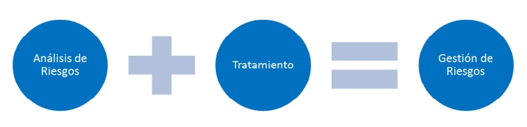

# Análisis y Tratamiento de Riesgos. Gestión de Riesgos

La Gestión de Riesgos en la Seguridad Informática nos permite analizar y clasificar el riesgo para posteriormente implementar mecanismos que nos permitan controlarlo.

 

## 1. Análisis

Tras realizar el [BIA](https://pc-solucion.es/unidad/2-analisis-de-impacto-de-negocio/) en el que mediante formularios y entrevistas a empleados clave conocíamos los recursos del sistema asociados a una actividad, ahora podemos pasar a identificar las vulnerabilidades que los debilitan y las amenazas que los pueden llegar a poner en peligro para así conocer su nivel de riesgo.

 

## 2. Clasificación

Aquí pasamos a clasificar si los riesgos que hemos encontrado son aceptables para determinar si vamos a implementar alguna medida de protección contra ellos o si los podemos aceptar.

Si los vamos a combatir o aceptar dependerá de la voluntad por parte de la organización y la viabilidad económica.

 

## 3. Reducción

En este paso definimos e implementamos las medidas de protección además de capacitar y concienciar a los usuarios conforme a las medidas .

 

Algunas de las medidas más comunes son:

**Físicas**

Controles de acceso como tarjetas inteligentes, lectores de huellas, vigilantes jurados, videocámaras, etc.

Sistemas de anclajes de equipos, sistemas de alimentación ininterrumpida, sistemas de armarios fijos tipo rack, etc.

 

**Técnicas**

Antivirus, cifrado de datos, contraseñas complejas, copias de seguridad, etc.

 

**Personales**

Capacitación y sensibilización de los trabajadores.

 

**Organizativas**

Normas y reglas de utilización de ciertos recursos de la empresa, seguimiento de control, etc.

 

 

## 4. Control

Por último y tras analizar el funcionamiento, la efectividad y el cumplimiento de las medidas adoptadas, pasamos a ajustar las que consideremos que son mejorables.

 

Entre otras cosas, todo este proceso tiene como fin:

- Potenciar las capacidades institucionales, reduciendo la vulnerabilidad y limitando las amenazas con el resultado de reducir el riesgo.
- Garantizar corrección de conductas o prácticas que nos hacen vulnerables.

---

XUN 2024