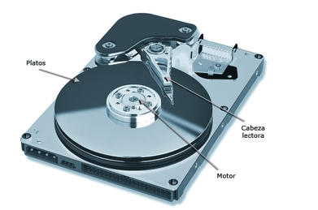
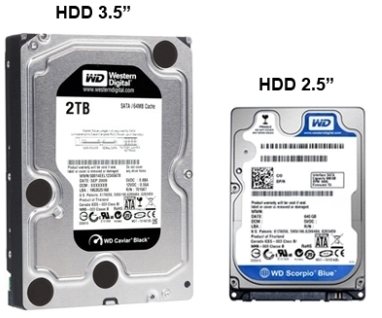
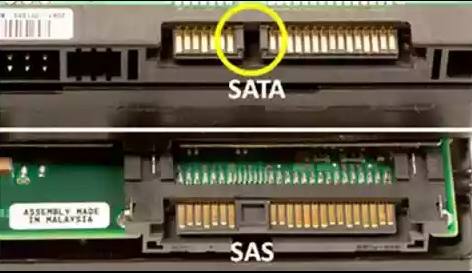

# Unidades de almacenamiento. Estructura de los discos duros y sistemas de archivos

Los discos duros son una de las unidades de almacenamiento más usadas tanto para uso particular como empresarial.

Incluso con la aparición de **los SSD que proporcionan velocidades de lectura y escritura más rápidas**, los discos duros mecánicos siguen teniendo su público, sobre todo para el que necesita unidades de almacenamiento de gran capacidad.

 

## Componentes internos de un disco duro mecánico

Como vemos en la imagen anterior, tenemos un **motor** que hace mover los **platos** a una velocidad que suelen rondar las 5400 – 7200 RPM dependiendo del modelo, aunque también los tenemos más rápidos.

Los datos escritos en los platos son leídos por la **cabeza lectora** (una por cada cara del plato) que se desplaza por la superficie de los platos.

Además de estos componentes, los discos duros mecánicos actuales también incluyen una **placa electrónica** encargada de gestionar el intercambio de información entre los platos y la memoria RAM. En esta placa se incluye una **memoria caché** que tiene la función de acumular datos mientras no se hace uso inmediato de ellos para así obtener una **mayor velocidad**.

La capacidad de esta memoria caché suele rondar los 64MB dependiendo del modelo.

 

## Factores de forma de los Discos duros

Actualmente los tamaños o factores de forma que nos encontramos son de 2.5″ y 3.5″, tanto en discos duros mecánicos como en SSD.

- El factor de forma de **2.5″** suele utilizarse en ordenadores portátiles y equipos compactos.
- El factor de forma de **3.5″** suele utilizarse para ordenadores de escritorio.

También existen otros factores de forma como 1.8″ pero ya no son tan comunes.

 

 

## Interfaces de los discos duros

En la actualidad, las tecnologías de conexión de los discos duros se pueden reducir a únicamente dos.

**Sata**: Sustituye al antiguo conector IDE mejorando la velocidad de transferencia de datos hasta los 600MB/s. Esta presente en la mayoría de ordenadores.

**SAS**: Evolución de la interfaz SCSI. Sus puntos fuertes son la fiabilidad (MTBF o Tiempo Medio entre fallos) y velocidad por lo que se utilizan sobre todo en ambientes empresariales donde existan aplicaciones avanzadas.

Interfaz IDE (izquierda) vs. Interfaz SATA (derecha).

 

 

 

## Sistemas de Archivos

Un sistema de archivos o sistema de ficheros define la estructura lógica de cómo se almacenan y recuperan los datos en una unidad de almacenamiento como puede ser un disco duro. En otras palabras, es la **forma en la que se estructuran los datos para que el sistema operativa pueda leerlos y entenderlos**.

Los sistemas de archivos tienen la tarea de asignar a los datos el espacio que necesiten, ordenarlos, permitir el acceso a ellos y también administrar el espacio libre.

Algunos de los sistemas de archivos más frecuentemente utilizados son los siguientes.

 

## FAT32

Apareció en 1996 y es uno de los sistemas de archivos más antiguos.

:heavy_check_mark: Versatilidad. Compatibilidad con la mayoría de dispositivos y sistemas operativos.

⛔Tamaño máximo de un único archivo de 4Gb. A día de hoy, esto se queda corto.

⛔Tamaño máximo de partición de 8 TB.

 

## NTFS

Aparece en Windows por primera vez en Windows NT de la mano de Microsoft y sigue siendo el sistema de archivos que sigue utilizando Windows a día de hoy.

:heavy_check_mark:  Hasta 256 TB de tamaño máximo por archivo.(Actualmente en Windows 10, pero puede ampliarse)

:heavy_check_mark:  Permisos, Shadow Copy (copias de seguridad o instantáneas de archivos, incluso cuando están en uso) y otras características útiles para el sistema operativo.

:heavy_check_mark:  Ideal para Windows.

⛔ Requiere más espacio de almacenamiento para lo mismo comparado con otros sistemas de archivos.

⛔ No se puede escribir en unidades NTFS desde Mac OS X. En Linux sí pero con drivers apropiados.

 

## exFAT

exFAT (Tabla Extendida de asignación de archivos) apareció en el año 2006.

:heavy_check_mark:  Supera la limitación de FAT llegando al tamaño máximo de archivo de 128 Petabytes.

:heavy_check_mark:  Compatibilidad con sistemas Mac OS X , Linux y consolas como PS4 o Xbox X.

:heavy_check_mark:  Ideal para unidades flash como pendrives.

⛔ No es compatible con dispositivos muy antiguos como lo era FAT32

---

XUN 2024