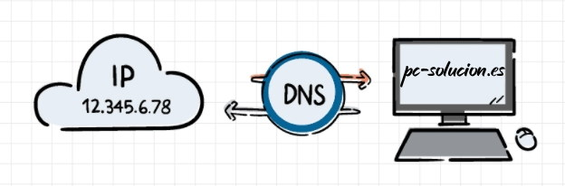

# Protocolos y Servicios

[Seguridad en Equipos Informáticos](https://pc-solucion.es/biblioteca/seguridad-en-equipos-informaticos/) [Protocolos y Servicios](https://pc-solucion.es/unidad/procolos/)

Un **protocolo** es un sistema de reglas que permiten que dos o más entidades de un sistema de comunicación se comuniquen entre ellas para transmitir información.

Un **puerto** es una interfaz a través de la cual se pueden enviar y recibir los diferentes tipos de datos.

 

## HTTP y HTTPS

Es el protocolo de comunicación que permite las transferencias de información a través de archivos en la World Wide Web.

Puertos:**80** para HTTP y **443** para HTTPS

Códigos de estado más comunes:

- **200** OK la solicitud ha tenido éxito
- **301** La dirección del recurso a sido cambiada
- **404** Recurso no encontrado
- **500** Error interno del servidor
- **503** El servidor no está listo para manejar la petición. Las causas más comunes pueden ser que el servidor está caído por mantenimiento o está sobrecargado

[LISTA COMPLETA](https://developer.mozilla.org/es/docs/Web/HTTP/Status)

 

 

## FTP y SFTP

El Protocolo de transferencia de archivos es un protocolo de red para la transferencia de ficheros.

**Puertos**: **20** y **21** para FTP. **22** para SFTP

 

## SMTP y POP

Son protocolos para gestionar los emails en Internet. La diferencia entre ellos es que con el protocolo SMTP se encarga del **envío** de emails, mientras que POP3 se encarga de **recibir** emails.

Puertos: **25, 465, 587 y 2525** para SMTP. **110** y **995** para POP

 

## DNS

Conjunto de **protocolos** y servicios que permite a los usuarios utilizar nombres en vez de tener que recordar direcciones IP numéricas.

Puerto: **53**