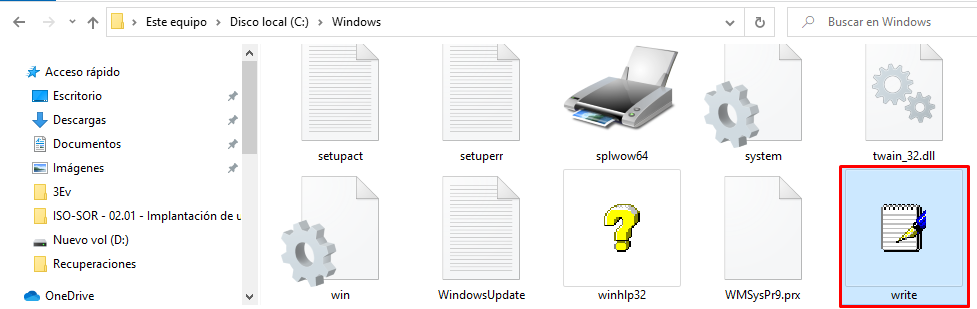
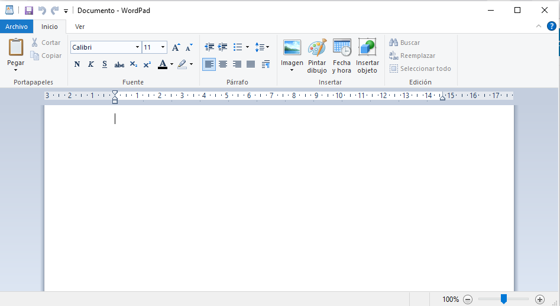
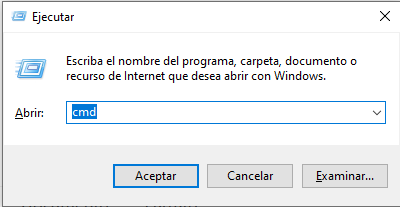
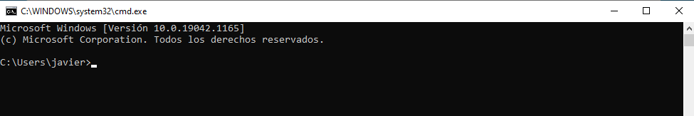
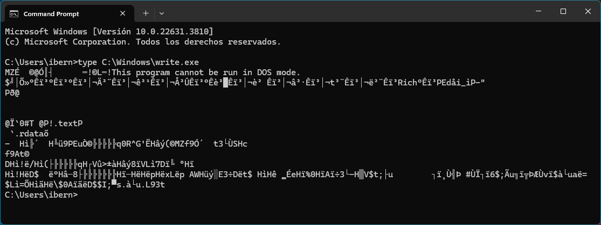
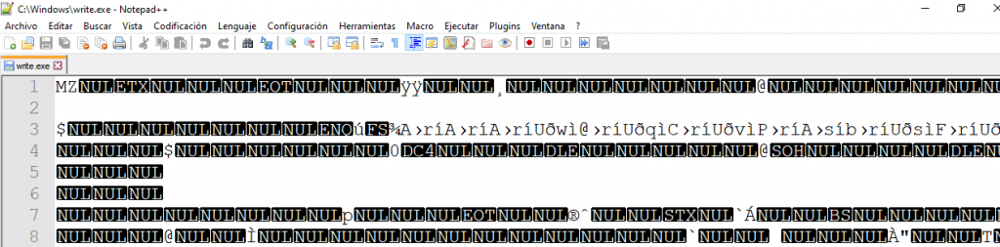

# Sistemas informáticos

Vamos a tratar de explicar de forma resumida qué son los sistemas informáticos, adentrándonos en la arquitectura básica sobre la que se sustentan y explicando los principios básicos de su funcionamiento.

## 1. Sistemas informáticos. Definición y componentes

Un Sistema es un conjunto de elementos que interaccionan entre sí para proporcionar una funcionalidad compleja o elaborada que se obtiene de la conjunción de las funcionalidades individuales de cada elemento.

**Sistema informático:** Conjunto de elementos que interaccionan entre sí para tratar, procesar, almacenar, recuperar, en definitiva, gestionar información.

Todo sistema informático dispone de métodos de entrada y salida de información. Estos son esenciales para la interacción entre el usuario y el sistema.

Los **métodos de entrada** permiten al usuario introducir datos en el sistema. Algunos ejemplos comunes son el teclado, el ratón, la cámara, el micrófono, el escáner, entre otros.

Los **métodos de salida**, por otro lado, permiten al sistema comunicar los resultados de los procesos al usuario. Algunos ejemplos son la pantalla del monitor, los altavoces, la impresora, etc.

Estos métodos de entrada y salida son fundamentales para el funcionamiento de cualquier sistema informático. 

**E/S** es la abreviatura de **Entrada/Salida** (en inglés, Input/Output). Se refiere a la recopilación de interfaces que utilizan las diferentes unidades de un sistema informático para comunicarse entre sí, o con el exterior, es decir, son los métodos que usa un sistema informático para recibir información (entrada) y para ofrecer los resultados de su procesamiento (salida).

De forma resumida se puede decir que los sistemas informáticos tienen tres tipos de componentes fundamentales:

- **Hardware**. Son los componentes físicos de los sistemas informáticos. Se pueden ver o tocar: son tangibles. Incluyen el procesador (CPU), la memoria RAM, los discos duros, las unidades de almacenamiento, los dispositivos de entrada (teclado, ratón) y salida (monitor, impresora), y otros periféricos.

- **Software**. Son el componente lógico de los sistemas. Son los programas y aplicaciones que se ejecutan en el hardware. El software se puede dividir en dos categorías principales:

  - **Software de sistema**: Incluye el sistema operativo (como Windows, macOS, Linux, Android, iOS,...), los controladores de dispositivos (drivers) y las utilidades del sistema que gestionan y controlan los recursos del hardware.

  - **Software de aplicación**: Son los programas que permiten a los usuarios realizar tareas específicas, como procesadores de texto, hojas de cálculo, navegadores web, aplicaciones multimedia, etc.

    Un programa es un conjunto ordenado de instrucciones que al ser ejecutado realiza alguna función. El programa es ejecutado por el hardware del sistema informático, en concreto por la CPU la que se encargará de analizar cada instrucción y mandar las órdenes necesarias al resto de componentes hardware del sistema para que se lleve a cabo la operación de la instrucción ejecutada. De esta forma, un componente lógico dice qué tienen que hacer el resto de componentes lógicos y físicos del sistema.

    Un programa informático es una secuencia de instrucciones escritas en un lenguaje de programación que una computadora puede entender y ejecutar. Estas instrucciones le indican al hardware de la computadora cómo realizar tareas específicas, desde las más simples, como sumar dos números, hasta las más complejas, como administrar una base de datos o controlar un sistema operativo.

    #### Cometidos de los programa informáticos

    1. **Automatización de Tareas**: Los programas informáticos permiten la automatización de tareas repetitivas, reduciendo el tiempo y el esfuerzo necesarios para realizarlas manualmente. Por ejemplo, un programa de contabilidad puede automatizar el cálculo de impuestos y la generación de informes financieros.

    2. **Resolución de Problemas**: Los programas se diseñan para resolver problemas específicos o realizar funciones concretas. Un software de diseño asistido por computadora (CAD) ayuda a los ingenieros a crear y modificar diseños de productos, mientras que un programa de procesamiento de textos permite a los usuarios crear y editar documentos.

    3. **Gestión de Datos**: Muchos programas están diseñados para gestionar grandes cantidades de datos, permitiendo su almacenamiento, organización, manipulación y análisis. Un sistema de gestión de bases de datos (DBMS) es un ejemplo típico de software utilizado para estos fines.

    4. **Interacción con el Usuario**: Los programas permiten a los usuarios interactuar con el hardware de la computadora de manera intuitiva y eficiente. Por ejemplo, los sistemas operativos proporcionan interfaces gráficas de usuario (GUI) que facilitan la interacción con el sistema.

    5. **Control de Hardware**: Algunos programas están diseñados para controlar dispositivos de hardware específicos. Por ejemplo, los controladores de dispositivos son programas que permiten al sistema operativo comunicarse y operar con el hardware, como impresoras, tarjetas de red o discos duros.

    6. **Seguridad y Protección**: Los programas también pueden desempeñar un papel crucial en la seguridad informática, protegiendo los datos y sistemas contra accesos no autorizados, malware y otras amenazas. Los antivirus y los cortafuegos son ejemplos de este tipo de software.

    En resumen, un programa informático es una herramienta esencial que permite a las computadoras realizar una amplia variedad de tareas, facilitando el trabajo humano y mejorando la eficiencia y precisión en múltiples áreas.

- **Usuarios (o personas)**: Son las personas que interactúan con el sistema informático, ya sean operadores, administradores, desarrolladores o usuarios finales que utilizan el software de aplicación para realizar sus tareas.

Estos tres componentes - hardware-software-usuario - trabajan juntos para realizar las funciones de un sistema informático, con el hardware proporcionando la capacidad física para ejecutar el software, el software gestionando y controlando los recursos del hardware, y los usuarios interactuando con el sistema para llevar a cabo diversas actividades.

A estos activos se les suma la información:

- **Información**. La información es el principal activo de los sistemas informáticos. Todo sistema informático trabaja con información. Básicamente las operaciones que se pueden realizar con la información en un sistema informático son:

  - **Almacenamiento y recuperación de información**. Ya sea almacenada en una memoria secundaria o auxilar o enviándola a través de la red para que se almacene en un servidor «en la nube»

  - **Enviar/Recibir información**. Es un tipo especial de operación de almacenamiento y recuperación de la información. Al final, es lo mismo quie almacenar y recuperar, porque estamos guardando la uinformación en algún sitio y/o la estamos recuperando. La diferencia es que no tenemos porque saber dónde se guarda o de donde procede físicamente dicha información. Por ejemplo, cuando almacenamos información en un servicio de almacenamiento en la nube como Google Drive o Dropbox; no sabemos dónde se guardan los datos.. en algún servidor, pero no sabemos dónde se guardan realmente.

  - **Procesar información**. Los sistemas informáticos también son capaces de modificar y procesar la información para obtener información nueva. Por ejemplo, si almacenamos la fecha de nacimiento de una persona un sistema informático puede calcular, procesar la información que tiene, su edad.

    Todas estas operaciones son llevadas a cabo gracias al software, que es el que resuelve tareas a nivel lógico con la información. El software necesita del hardware para poder ser ejecutado. Y los usuarios interactúan con el software a través de dispositivos hardware E/S con el software para manipular, tratar o almacenar la información.

## Software

El software es el conjunto de todos los programas que se pueden ejecutar en un sistema informático.

Un programa es un conjunto de instrucciones ordenadas que al ejecutarse en secencia, es decir una detrás de otra en el orden en el que aparecen, realiza una función concreta. Algunos ejemplos de programas pueden ser: libreoffice writer, notepad, explorer, etc.

¿Cómo se ejecutan esas instrucciones?. Para ejecutar esas instrucciones el hardware del sistema tiene que ser capaz de reconocerlas. Las instrucciones de un programa se tienen que expresar en un lenguaje capaz de ser ejecutado, comprendido, por la CPU. El lenguaje que utilizan las CPU se denomina código máquina y está compuesto por cadenas de 0s y 1s que indican a la CPU qué operación hay que realizar así como los operandos, sin son necesarios, con los que debe trabajar.

Cada CPU tiene un código máquina propio compuesto por el conjunto de instrucciones que es capaz de reconocer. A este conjunto de instrucciones que una CPU es capaz de reconocer y ejecutar se le denomina juego de instrucciones.

Por ejemplo, en la arquitectura de ordenadores PC existen dos grandes fabricantes de microprocesadores: AMD e Intel. Podemos utilizar cualquiera de estos microprocesadores en nuestros sistemas informáticos y ejecutar los mismos programas. Esto es así porque los juegos de instrucciones de ambos fabricantes tienen un conjunto de instrucciones comunes. Sin embargo, cada microprocesador tiene su propio juego de instrucciones que no comparten.

Para ejecutar un programa en un sistema informático hay que cargar este programa en la memoria principal y después indicar a la CPU la dirección de memoria dónde se almacena la primera instrucción de dicho programa y que comience la ejecución.

¿Quíen se encarga de realizar esta tarea? El sistema operativo. Entre otras muchas funciones el sistema operativo se encarga de proporcionar acceso a los recursos del sistema a las aplicaciones que se ejecuten en él, así como ejecutarlas cuando el usuario quiera hacerlo.

### Caso práctico – Ejecución de programas

Vamos a ejecutar un programa en nuestro sistema. Para ello, vamos a utilizar primero el explorador de Windows – herramienta del sistema que nos sirve para navegar por los sistemas de archivos conectados a nuestro sistema informático en Windows.

Podemos lanzarlo a través del icono correspondiente que nos proporciona el SO usando la GUI o utilizar un *atajo de teclado* de teclado: ``WND+E`` (en Windows). Una vez abierta la ventana del *Explorador de archivos* podemos movernos por el árbol de archivos. Por ejemplo podremos acceder al directorio Windows que está en la unidad C: Este directorio almacena gran parte del software que compone el sistema operativo Windows de nuestro computador.


Vamos a buscar un archivo llamado *Write*.



Para acceder al contenido o ejecutar dicho archivo hacemos doble clic sobre el icono o nombre del archivo con el botón izquierdo de nuestro ratón.

*&rarr;  Programa Wordpad lanzado desde el Explorador de Windows*

Al hacer doble clic hemos indicado al sistema operativo que queremos interactuar con el archivo Write. Como este archivo es un archivo ejecutable – contiene un programa expresado en código máquina – y además tiene extensión .EXE – extensión que indica al sistema operativo que el archivo contiene un ejecutable en código máquina – el sistema operativo se encarga de llevar a cabo todo el proceso necesario para ejecutarlo.

Este proceso, cómo mínimo, carga el programa en memoria y busca los recursos necesarios del sistema para que éste pueda ejecutarse. Por ejemplo, creará un nuevo proceso para que el programa se ejecute (veremos todo esto más adelante).

Vamos a repetir el proceso pero esta vez vamos a utilizar el interprete de comandos que proporciona Windows. Para ello vamos a abrir una terminal o consola de comandos o símbolo del sistema. Siguiendo con los atajos de teclado, vamos a pulsar las teclas ``WND+R`` , que nos dará acceso a una pequeña ventana *Run* o *Ejecutar*.



Aparecerá un cuadro de dialogo que espera que indiquemos el nombre del programa a ejecutar. Vamos a escribir ``cmd`` y pulsamos Enter. No hace falta que pulsemos con el ratón el botón aceptar, basta con que pulsemos Enter puesto que el botón aceptar es el botón marcado por defecto. Si nos fijamos en la interfaz de usuario el botón *Aceptar* aparece marcado de manera especial: resaltado con un borde azul.



Desde la terminal podemos ejecutar cualquier programa lo único que tenemos que hacer es indicar al interprete de comandos que programa queremos ejecutar. Para ello, si no es un comando interno del sistema y no está dentro del PATH (ya veremos más adelante qué es el PATH) tendremos que indicar la ruta en la que se encuentra almacenado el programa.

```bash
C:\Users\nombreusuario>C:\Windows\write
```

Ejecutando un programa desde la terminal con la ruta absoluta del archivo ejecutable

De uno u otro modo el resultado será el mismo y se abrirá una ventana en la que veremos el programa ejecutándose.

Da la casualidad de que el directorio C:\Windows está dentro del PATH. Esto significa que si escribimos el nombre de una aplicación o ejecutable que esté en este directorio el interprete de comandos la ejecutará.

```bash
  C:\Users\nombreusuario>write
```

El directorio C:\Windows está en el PATH así que el interprete de comandos se encarga de buscar el archivo ejecutable write dentro de todos los directorios que forman parte del PATH automáticamente

Por ejemplo, vamos a ejecutar el programa *Bloc de notas*, por su nombre para el sistema `notepad` - que también está ubicado en la carpeta de Windows-. Para ello escribimos ``notepad`` en la consola o terminal y pulsamos *Enter*.


*&rarr;  Ejecutamos el programa ``notepad.exe`` desde la consola.*

Vamos a comprobar que realmente el archivo ``write.exe`` y el archivo ``notepad.exe`` están dentro del directorio ``C:\Windows``. Para ello vamos a utilizar un nuevo comando, el comando DIR.

El comando DIR muestra información de archivos y contenido de directorios. Para usarlo tan solo tenemos que escribir ``dir`` en la terminal y nos mostrará el contenido del directorio actual.

```bash
  C:\Users\nombreusuario>dir C:\Windows
  # o también
  C:\Windows>dir
```

De esta forma le indicamos al comando DIR que queremos que nos muestre el contenido del directorio C:\Windows.

No obstante, con este comando se muestra todo el contenido y nos dificulta encontrar en pantalla la información que estamos buscando. De primera, podemos ver que existe un archivo llamado write.exe, sin embargo para encontrar notepad.exe tenemos que movernos por la ventana. Para dos archivos, no pasa nada, pero si quermeos mostrar información concreta de algun tipo de archivo y tenemos gran cantidad de archivos en un directorio esta opción no es la más adecuada.

«Salto de fe». Para mostrar solo los archivos ejecutables vamos a utilizar un comodín que nos permita decirle al comando DIR que muestre solo los archivos con extensión EXE.

```bash
  C:\Users\nombreusuario>dir C:\Windows\*.exe
  # o también
  C:\Windows>dir *.exe
```

Ahora solo se mostrarán aquellos archivos que están en el directorio C:\Windows que cumplan con el patrón que hemos indicado: *.EXE. El asterisco indica que el nombre del archivo puede ser cualquiera – literalmente * significa cualquier conjunto de 0 o más caracteres. Al poner .EXE al final, estamos diciendo que queremos mostrar información de cualquier archivo cuyo nombre termine en .EXE, es decir tenga extensión .EXE.

Ejemplo de navecacion por el arbol de archivos:

```bash
PS C:\Users\nombreusuario> dir C:\Windows\*.exe


    Directory: C:\Windows


Mode                 LastWriteTime         Length Name
----                 -------------         ------ ----
-a----        01/07/2024     15:24         114688 bfsvc.exe
-a----        01/07/2024     15:24        5513616 explorer.exe
-a----        01/07/2024     15:25        1089536 HelpPane.exe
-a----        07/05/2022     07:20          36864 hh.exe
-a----        10/06/2024     02:33         360448 notepad.exe
-a----        10/06/2024     02:30         552960 regedit.exe
-a----        10/06/2024     02:23         192512 splwow64.exe
-a----        07/05/2022     07:20          12288 winhlp32.exe
-a----        06/05/2022     22:16          28672 write.exe


PS C:\Users\nombreusuario> cd ..
PS C:\Users> cd ..
PS C:\> cd Windows
PS C:\Windows> dir *.exe


    Directory: C:\Windows


Mode                 LastWriteTime         Length Name
----                 -------------         ------ ----
-a----        01/07/2024     15:24         114688 bfsvc.exe
-a----        01/07/2024     15:24        5513616 explorer.exe
-a----        01/07/2024     15:25        1089536 HelpPane.exe
-a----        07/05/2022     07:20          36864 hh.exe
-a----        10/06/2024     02:33         360448 notepad.exe
-a----        10/06/2024     02:30         552960 regedit.exe
-a----        10/06/2024     02:23         192512 splwow64.exe
-a----        07/05/2022     07:20          12288 winhlp32.exe
-a----        06/05/2022     22:16          28672 write.exe


PS C:\Windows>
```

### Caso práctico – archivos ejecutables: código máquina

Hemos visto que para que un programa pueda ser ejecutado por la CPU tiene que estar expresado en código máquina. Sabemos que el código máquina son cadenas 0s y 1s con las instrucciones del juego de instrucciones de la CPU que las ejecutará.

Vamos a mostrar el contenido de uno de esos archivos ejecutables que hemos lanzado desde la terminal. En concreto C:\Windows\write.exe. Para mostrar el contenido de un archivo en pantalla podemos utilizar el comando TYPE. Type muestra el contenido del archivo que se le pase por parámetro en pantalla. Así que vamos a ejecutar ``type C:\Windows\write.exe``.



*&rarr; Contenido del archivo write.exe en pantalla*

Como vemos parece que el archivo es demasiado corto por lo que se muestra en pantalla. Sin embargo, el archivo contiene mucha más información. Ha dejado de mostrarse en pantalla por que el comando type habrá encontrado algún caracter especial que indique el fin del archivo de texto o algún caracter especial que no es capaz de manejar.

Tened en cuenta que tanto el texto en particular, así como cualquier información en general y las instrucciones se representan de la misma forma: como cadenas de 0s y 1s.

Vamos a abrir el archivo con *Notepad++*.



Nos encontramos con un contenido que es ilegible. Esto es así porque tanto ``type`` como ``notepad++`` tratan de representar la información almacenada en el archivo ``write.exe`` como si fuera un archivo de texto plano. Sin embargo, ``write.exe`` no almacena información con código ASCII o UTF-8, sino que almacena **código máquina**.

Para mostrar el contenido del archivo como instrucciones necesitaríamos un programa que interpretara dicha información de código máquina.

- https://onlinedisassembler.com

## Programa almacenado

Vamos a empezar hablando de las memorias. Una **memoria** es un dispositivo que permite almacenar y recuperar información. La información que almacena puede ser instrucciones de un programa o datos que utilizará algún programa.

Si queremos ejecutar un programa lo tenemos que cargar en memoria principal, las instrucciones del programa una tras otra en el mismo orden en el que están escritas en el programa.

Ahora se indica a la CPU cuál es la dirección de memoria donde está la primera instrucción del programa. La CPU se encargará de ejecutar en secuencia, una detrás de otra, las instrucciones de dicho programa. Para ello, le pide a la memoria que le proporcione la instrucción a ejecutar a través de señales de control.

​         
#Sistemas #Básicos  #Línea_de_comandos