# Auditoría Informática

## Criterios generales comúnmente aceptados sobre Auditoría Informática

La auditoría informática se ha convertido en un componente esencial para garantizar la integridad, confiabilidad y seguridad de los sistemas de información dentro de las organizaciones. En un entorno donde la dependencia de la tecnología es cada vez mayor, la auditoría informática no solo verifica el cumplimiento de normativas y estándares, sino que también evalúa la eficacia y eficiencia de los sistemas informáticos y su capacidad para salvaguardar los activos de información.

Los criterios generales comúnmente aceptados sobre auditoría informática proporcionan un marco estructurado que guía a los auditores en la evaluación y revisión de los sistemas informáticos. Estos criterios se basan en las mejores prácticas de la industria y en estándares internacionales, tales como los publicados por la Information Systems Audit and Control Association (ISACA), el Instituto de Auditores Internos (IIA) y otros organismos reconocidos a nivel global.

Algunos de los principios clave de estos criterios incluyen:

1. **Independencia y Objetividad**: Los auditores deben mantener una postura imparcial y libre de influencias indebidas para emitir juicios precisos y confiables.
2. **Competencia y Habilidad Técnica**: Los auditores deben poseer el conocimiento y las habilidades técnicas necesarias para evaluar adecuadamente los sistemas informáticos.
3. **Debida Diligencia y Profesionalismo**: Es fundamental que los auditores ejerzan un nivel adecuado de cuidado y profesionalismo durante el proceso de auditoría.
4. **Confidencialidad**: La información manejada durante una auditoría debe ser tratada con el mayor nivel de confidencialidad para proteger la privacidad y los datos sensibles.
5. **Comunicación y Documentación Efectiva**: Los hallazgos y conclusiones de la auditoría deben ser comunicados de manera clara y documentados exhaustivamente para proporcionar una base sólida para la toma de decisiones.

Estos principios guían el proceso de auditoría, que incluye la **planificación, ejecución e informe** de los hallazgos. El objetivo final es identificar áreas de riesgo, proponer mejoras y asegurar que los sistemas de información cumplen con los requisitos legales y operativos establecidos.

En conclusión, los criterios generales comúnmente aceptados sobre auditoría informática son fundamentales para garantizar que los sistemas de información sean seguros, eficientes y conformes con las normativas vigentes. La aplicación rigurosa de estos criterios permite a las organizaciones proteger sus activos de información y mantener la confianza de sus partes interesadas.

## Código deontológico

El Código deontológico de la función de auditoría de la seguridad de la información, seguridad informática y ciberseguridad en un contexto empresarial establece un conjunto de principios y directrices que guían el comportamiento ético y profesional de los auditores en estos campos. Este código es fundamental para asegurar la integridad, objetividad y profesionalismo en la práctica de auditoría, y ayuda a mantener la confianza y credibilidad en los resultados de las auditorías.

### Principios del código deontológico

1. **Integridad**:
   - Los auditores deben actuar con honestidad y rectitud en todas sus actividades profesionales.
   - Deben evitar cualquier conducta que pueda desacreditar su profesión o dañar la reputación de la organización.

2. **Objetividad**:
   - Es crucial que los auditores mantengan una actitud imparcial y libre de influencias indebidas.
   - Deben basar sus conclusiones en evidencias objetivas y verificables, evitando cualquier sesgo personal o externo.

3. **Confidencialidad**:
   - Los auditores deben proteger la información confidencial a la que tienen acceso durante sus actividades.
   - No deben revelar información sin la autorización adecuada, salvo cuando sea necesario para cumplir con obligaciones legales o profesionales.

4. **Competencia**:
   - Los auditores deben mantener y mejorar continuamente sus conocimientos y habilidades profesionales.
   - Deben llevar a cabo sus actividades con el nivel adecuado de profesionalismo y diligencia.

### Directrices Específicas

1. **Independencia**:
   - Los auditores deben ser independientes tanto en apariencia como en hecho.
   - Deben evitar cualquier relación o situación que pueda comprometer su independencia.

2. **Profesionalismo**:
   - Los auditores deben adherirse a los estándares profesionales reconocidos y a las mejores prácticas de la industria.
   - Deben mantener una conducta profesional en todas sus interacciones.

3. **Responsabilidad**:
   - Los auditores son responsables de realizar sus tareas de manera efectiva y eficiente.
   - Deben informar con precisión y claridad sobre los hallazgos y las recomendaciones.

4. **Transparencia**:
   - La comunicación con las partes interesadas debe ser abierta y honesta.
   - Los informes de auditoría deben ser claros, completos y proporcionar una representación precisa de los hallazgos.

5. **Conflicto de Intereses**:
   - Los auditores deben identificar y gestionar cualquier conflicto de intereses que pueda surgir.
   - Deben abstenerse de participar en auditorías donde exista un conflicto de intereses significativo.

6. **Responsabilidad Social**:
   - Los auditores deben considerar el impacto social y ético de sus actividades.
   - Deben actuar en beneficio del interés público y contribuir a la mejora de la seguridad y la privacidad en el entorno digital.

### Aplicación en el contexto empresarial

En un contexto empresarial, el Código deontológico es esencial para asegurar que las auditorías de seguridad de la información, seguridad informática y ciberseguridad se realicen de manera profesional y ética. Las organizaciones dependen de estos auditores para:

- Identificar y mitigar riesgos relacionados con la seguridad de la información.
- Cumplir con las regulaciones y estándares de la industria.
- Proteger activos de información críticos contra amenazas internas y externas.
- Mantener la confianza de clientes, socios y otras partes interesadas.

El cumplimiento del Código deontológico asegura que las auditorías sean realizadas con el más alto nivel de integridad y profesionalismo, lo que, a su vez, fortalece la postura de seguridad de la organización y su capacidad para enfrentar desafíos de ciberseguridad.

En resumen, el Código deontológico de la función de auditoría de la seguridad de la información, seguridad informática y ciberseguridad proporciona un marco ético y profesional que es esencial para la efectividad y credibilidad de las auditorías en el entorno empresarial.

Para ampliar la información sobre el Código deontológico de la función de auditoría de la seguridad de la información, seguridad informática y ciberseguridad, te recomiendo los siguientes enlaces:

1. **ISACA (Information Systems Audit and Control Association)**: Proporciona una amplia gama de recursos sobre auditoría de sistemas de información y ciberseguridad, incluyendo guías de buenas prácticas y estándares de auditoría.
   - [ISACA - IT Audit - A Risk-Based Approach to IT Audit](https://www.isaca.org/resources/it-audit)
2. **Instituto de Auditores Internos (IIA)**: Ofrece estándares y directrices para la auditoría interna, que son aplicables a la auditoría de la seguridad de la información.
   - [Global Resources in Internal Audit](https://www.theiia.org/en/resources/))
3. **NIST (National Institute of Standards and Technology)**: Publica directrices y estándares para la seguridad de la información y la ciberseguridad, que son útiles para auditores.
   - [NIST Cybersecurity Framework](https://www.nist.gov/cyberframework) + [Navigating NIST's CSF 2.0 Quick Start Guides | NIST](https://www.nist.gov/quick-start-guides)
4. **ISO/IEC 27001 y 27002**: Estándares internacionales para la gestión de la seguridad de la información.
   - [ISO/IEC 27001
7. **Agencia Española de Protección de Datos (AEPD)**: Proporciona directrices y normativas sobre la protección de datos y la ciberseguridad en España.
   - [AEPD](https://www.aepd.es/guias-y-herramientas/herramientas)
8. **INCIBE (Instituto Nacional de Ciberseguridad)**: Recursos y guías sobre ciberseguridad en España.
   - [INCIBE](https://www.incibe.es/empresas/guias)
9. **ENISA (European Union Agency for Cybersecurity)**: Proporciona directrices y mejores prácticas en ciberseguridad para la Unión Europea.
   - [ENISA](https://www.enisa.europa.eu/)
10. **ISO/IEC 27001 y 27002 (AENOR)**: Información sobre la certificación y aplicación de estos estándares en España.
   - [AENOR ISO/IEC 27001](https://www.aenor.com/certificacion/seguridad-informacion/iso-27001)

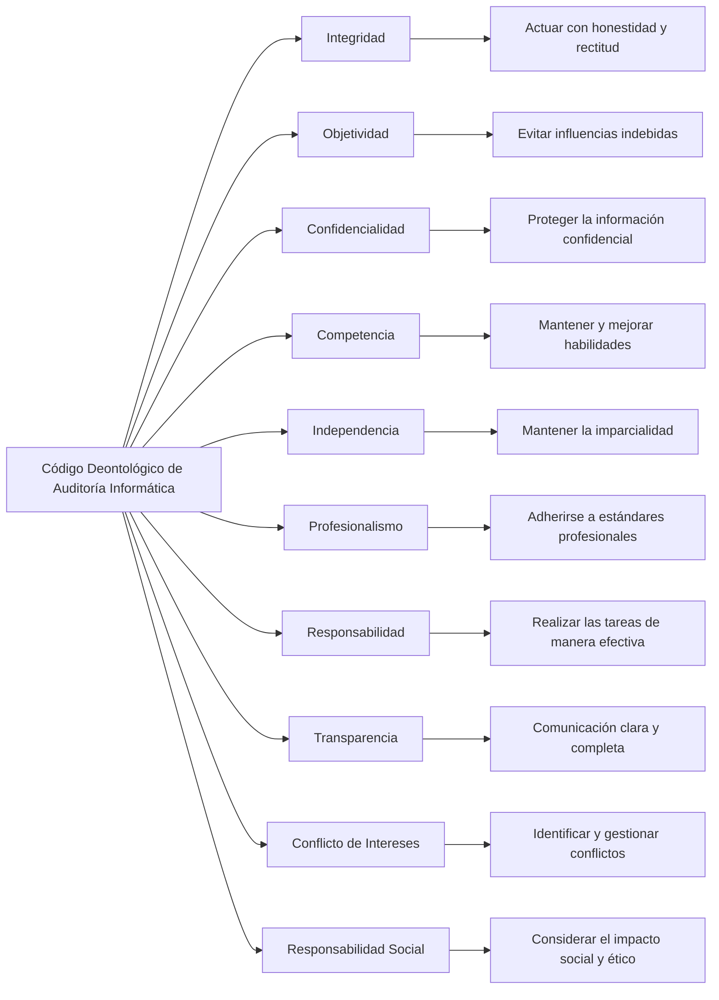
Este esquema visualiza los principios clave del Código deontológico, facilitando su comprensión y aplicación en el contexto de auditoría de la seguridad de la información, seguridad informática y ciberseguridad.

#### Recuerda

La ética debe estar presente siempre en la actuación profesional de los auditores informáticos,
protegiendo los derechos del auditado y evitando su perjuicio derivado de la aplicación
de sus conocimientos técnicos.

**Principios del código deontológico de la auditoría**

- Principio del beneficio del auditado
- Principio de calidad
- Principio de capacidad
- Principio de cautela
- Principio de comportamiento profesional
- Principio de concentración en el trabajo
- Principio de confianza
- Principio de criterio propio
- Principio de economía
- Principio de fortalecimiento y respeto de la profesión
- Principio de integridad moral
- Principio de legalidad
- Principio de precisión
- Principio de responsabilidad
- Principio de secreto profesional
- Principio de veracidad

---

### Tipos de Auditoría en el Marco de los Sistemas de Información

En el marco de los sistemas de información, existen varios tipos de auditorías que se realizan para evaluar diferentes aspectos de los sistemas y su funcionamiento. 

Esta es una visión general de los tipos de auditoría con cometidos generales, aunque la variedad de tipologías de auditoría no solo está presente en temáticas generales, sino que dentro de cada una de ellas se pueden distinguir subtipos de auditorías según las áreas específicas.

Los siguientes  esquemas y enlaces proporcionan una visión general y recursos útiles para profundizar en los diferentes tipos de auditorías en el marco de los sistemas de información.

#### 1. Auditoría de Seguridad de la Información
Evalúa la protección de la información y los sistemas de información contra accesos no autorizados, alteraciones, destrucción y robo.

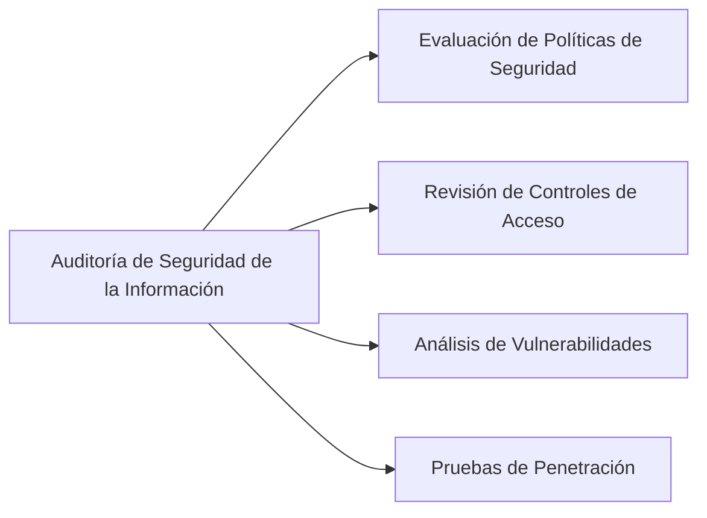

- **Recursos para Ampliar Información**:
  - [Guía de Seguridad de la Información (ENISA)](https://www.enisa.europa.eu/topics/standards)
  - [Ciberseguridad en la identidad digital y la reputación online. Guía de recomendaciones para empresas | INCIBE](https://www.incibe.es/empresas/guias/guia-ciberseguridad-identidad-online))

#### 2. Auditoría de Cumplimiento (Compliance)

Asegura que la organización cumple con las leyes, regulaciones y políticas internas relacionadas con los sistemas de información.

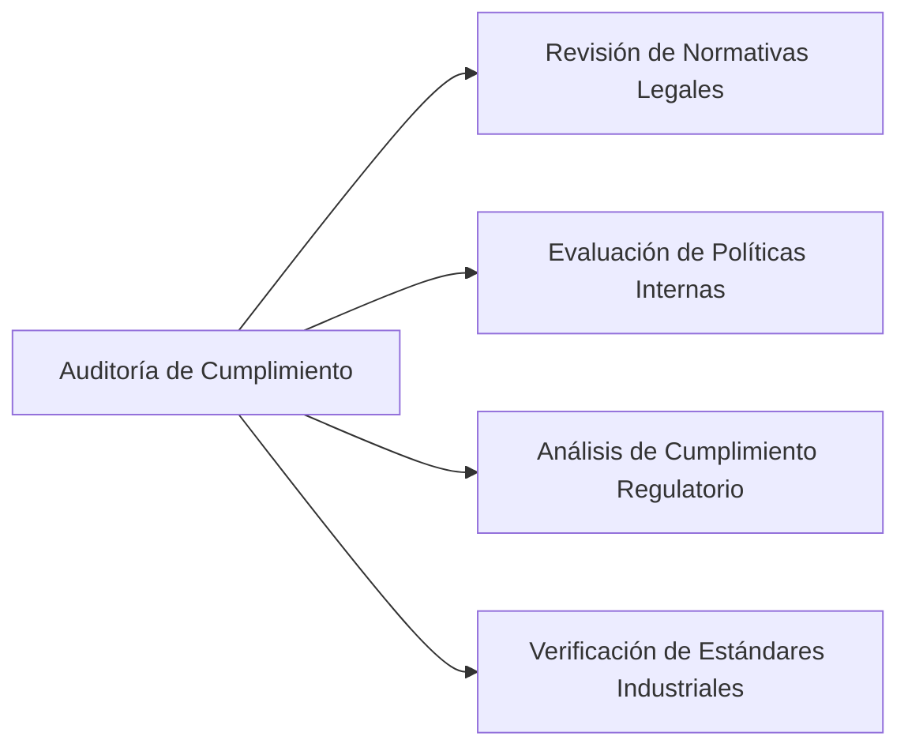

- **Recursos para Ampliar Información**:
  - [Agencia Española de Protección de Datos (AEPD)]((https://www.aepd.es/guias/hoja-de-ruta.pdf)) + [Gestión del riesgo y evaluación de impacto en tratamientos de datos personales (aepd.es)](https://www.aepd.es/guias/gestion-riesgo-y-evaluacion-impacto-en-tratamientos-datos-personales.pdf)
  - [ISO/IEC 27001 en AENOR](https://www.aenor.com/certificacion/seguridad-informacion/iso-27001)

#### 3. Auditoría Operacional

Evalúa la eficiencia y efectividad de los procesos y operaciones de los sistemas de información.

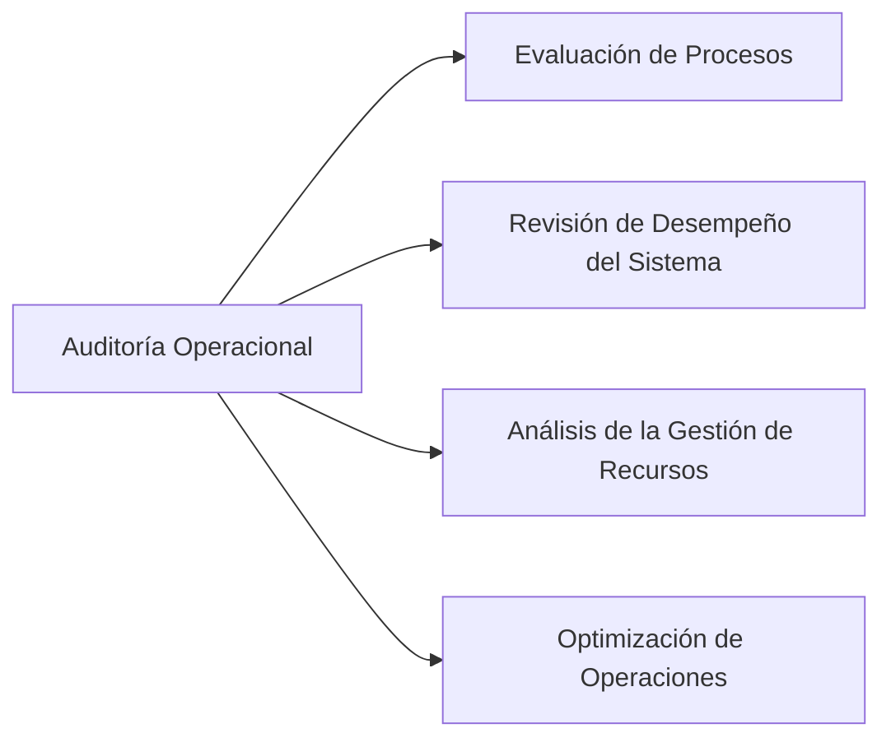

- **Recursos para Ampliar Información**:
  - [Operational Audits in the Digital Age: Leveraging Text Mining (linkedin.com)](https://www.linkedin.com/pulse/operational-audits-digital-age-leveraging-text-mining-iia-mqrgc)
  - [The Institute of Internal Auditors (IIA)](https://www.theiia.org/)

#### 4. Auditoría de Desarrollo y Adquisición de Sistemas
Examina los controles en el desarrollo y adquisición de software y hardware, asegurando que los sistemas nuevos cumplen con los requisitos.

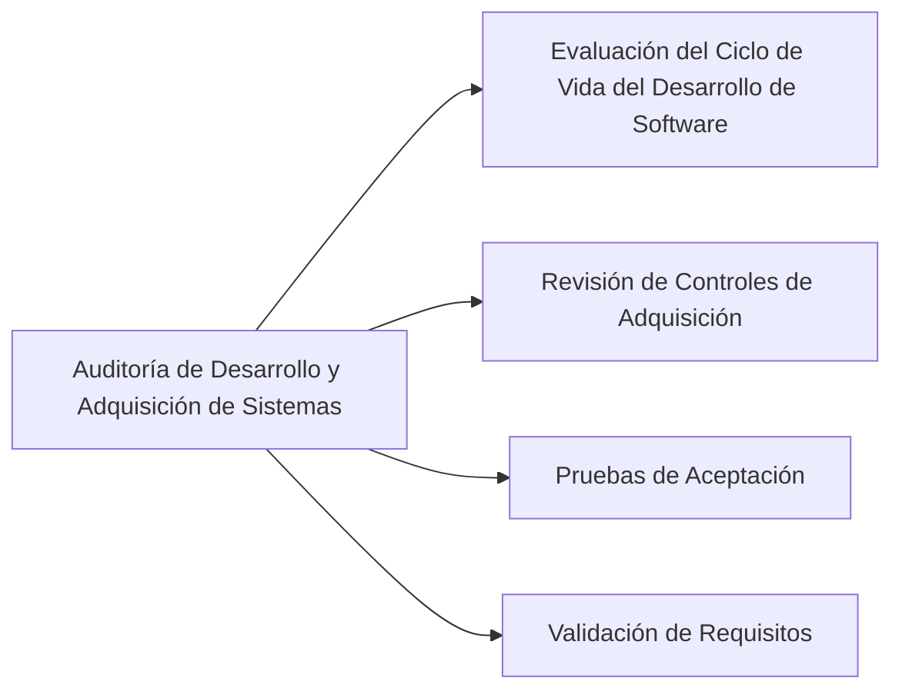

- **Recursos para Ampliar Información**:
  - [IS Audit Basics: Audit Programs (isaca.org)](https://www.isaca.org/resources/isaca-journal/issues/2017/volume-4/is-audit-basics-audit-programs)

#### 5. Auditoría de Sistemas y Aplicaciones
Se centra en la revisión y evaluación de sistemas específicos y aplicaciones para garantizar su funcionamiento correcto y seguro.

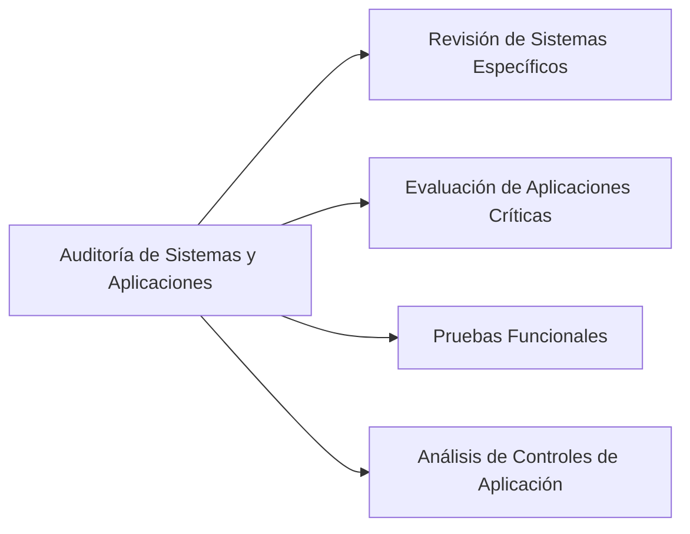

- **Recursos para Ampliar Información**:
  - [ISACA](https://www.isaca.org/resources/news-and-trends/isaca-now-blog/2024/building-an-ai-risk-management-program-a-security-audit-team-perspective)
  - [NIST Special Publications](https://csrc.nist.gov/publications/sp)

#### 6. Auditoría Forense

Investiga incidentes de seguridad, fraudes o cualquier irregularidad en los sistemas de información.

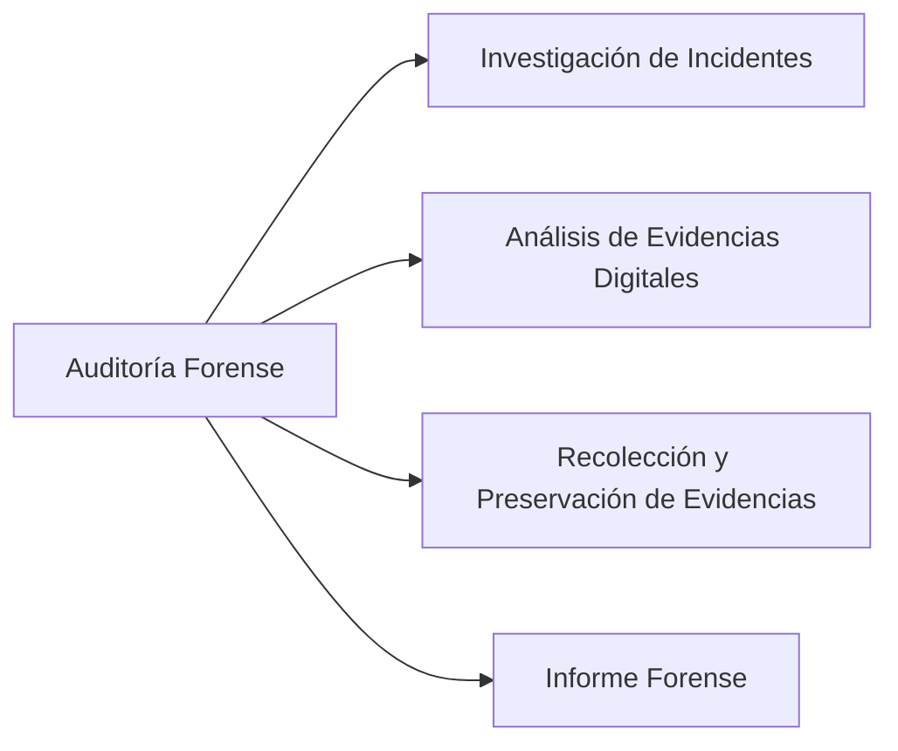

- **Recursos para Ampliar Información**:
  - [Guía de Informática Forense (INCIBE)](https://www.incibe.es/incibe/solr-search/content?resultado=forense)
  - [SANS Institute - Computer Forensics](https://www.sans.org/posters/memory-forensics/)

#### **Tipos de auditorías dentro de los sistemas de información**

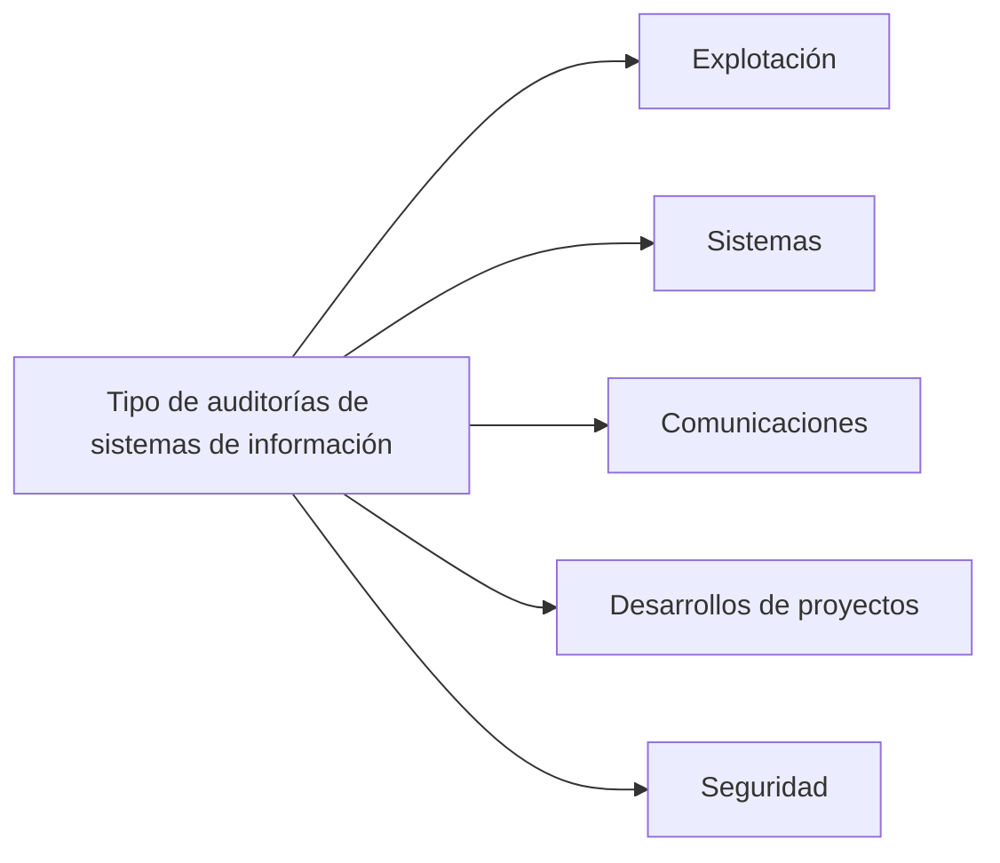

**Auditoría informática de explotación**

> La explotación informática es el proceso encargado de realizar los resultados informáticos de cualquier tipo.

La auditoría informática de explotación se encarga de analizar resultados  informáticos de todo tipo: listados impresos, órdenes automatizadas de procesos, etc. 

El análisis consistirá sobre todo en someter los resultados obtenidos a controles de calidad y en analizar si su distribución posterior (al cliente, a otros empleados, a superiores, etc.) se realiza mediante un proceso adecuado.

También se auditan las distintas secciones que componen la informática de explotación y las relaciones existentes entre ellos.

**Auditoría informática de sistemas**
La auditoría informática de sistemas se encarga de analizar las actividades relacionadas con en el entorno de sistemas informáticos. Más concretamente, en esta tipología se analizan los siguientes componentes:

- **Sistemas operativos:** se comprueba si están actualizados y, en caso de no estarlo, se averiguan las causas de la desactualización. También se analizan posibles incompatibilidades de software ocasionadas por el sistema operativo.
- **Software básico:** se analizan las distintas aplicaciones instaladas para verificar que no agreden ni condicionan al sistema operativo.
- **Tunning:** se evalúan las distintas técnicas y medidas de evaluación de los comportamientos del sistema y de los subsistemas.
- **Optimización de los sistemas y subsistemas:** la auditoría comprobará que las acciones de optimización de sistemas y subsistemas son efectivas y que no se compromete su operatividad.
- **Administración de las bases de datos:** el auditor se asegurará del conocimiento de los distintos procedimientos de la base de datos y comprobará la seguridad, la integridad y la consistencia de los datos.
- **Investigación y desarrollo:** la auditoría se encargará de mantener la actividad de investigación y desarrollo, impidiendo que por estas se dificulten procesos y tareas fundamentales.

**Auditoría informática de comunicaciones y redes**
La auditoría informática de comunicaciones y redes se encargará de analizar los distintos dispositivos de comunicación que forman parte de las redes de la organización para detectar sus debilidades y proponer medidas que las corrijan.

Para ello, los auditores deberán conocer la topología de la red de comunicaciones, en la que se describan con detalle las líneas que forman parte de ella, cómo son y su ubicación para comprobar su nivel de operatividad.

**Auditoría de desarrollo de proyectos**
En la auditoría de desarrollo de proyectos, los auditores informáticos analizan la metodología utilizada para desarrollar los distintos proyectos de la organización, distinguiendo entre cada área de negocio de la empresa.

También se analiza el desarrollo de proyectos globales que se extienden al conjunto de la organización, comprobando su correcta ejecución y el mantenimiento de la seguridad a lo largo de todo el proceso.

**Auditoría de seguridad informática**
La auditoría de seguridad informática analiza todos los procesos referentes a la seguridad informática, tanto física como lógica.

La seguridad física es la protección de los componentes hardware, dispositivos, instalaciones y entornos de los distintos sistemas informáticos. Los auditores deberán analizar la correcta protección de los elementos físicos ante posibles catástrofes, incendios, robos, etc.

La seguridad lógica, por el contrario, es la protección del software, los procesos y programas del sistema, y su auditoría consistirá en analizar la correcta protección y actualización de estos componentes, además de la protección de los datos que forman parte del sistema.

> Antes de empezar la auditoría, el auditor deberá elaborar una planificación en la que se detallen los objetivos y procedimientos que se llevarán a cabo para realizar la auditoría informática.

En esta planificación se deberá incluir sobre todo:

- Lugar o lugares en los que se realizarán las tareas de auditoría.
- Duración de la auditoría.
- Fecha límite para la finalización de la auditoría.
- Composición del equipo de auditoría.
- Áreas que serán auditadas.

En resumen, el auditor planificará los objetivos a cumplir y los métodos y procedimientos que se van a proseguir para lograr dichos objetivos de un modo eficaz y eficiente.

### Actividades básicas del auditor informático

- Establecimiento y análisis de la política de seguridad.
- Verificación y cumplimiento de los estándares, normas y cualificaciones relacionadas con la auditoría y la seguridad informáticas.
- Organización de la seguridad y clasificación de los recursos.
- Análisis de las inversiones realizadas y futuras de seguridad.
- Análisis de los riesgos de la organización.
- Análisis y control de la seguridad física de la organización.
- Establecimiento de medidas de protección y control de accesos al sistema.
- Evaluación de la seguridad en las comunicaciones y operaciones.
- Evaluación de la seguridad y vulnerabilidades de los sistemas operativos y demás software del sistema.
- Definición del plan de continuidad de la organización.
- Gestión de la seguridad de la organización con el establecimiento de medidas y definición del cuadro integral de mandos.

El equipo auditor debe estar formado por profesionales con (según los casos específicos) conocimientos básicos sobre:

- Desarrollo de proyectos informáticos.
- Gestión del departamento de sistemas.
- Análisis de riesgos en sistemas informáticos.
- Sistemas operativos.
- Redes locales y telecomunicaciones.
- Gestión de bases de datos.
- Seguridad física y del entorno.
- Planificación informática.
- Gestión de la seguridad de los sistemas.
- Gestión de problemas, incidencias y cambios en entornos informáticos.
- Administración de datos.
- Ofimática.
- Permisos de acceso y encriptación de datos.
- Comercio electrónico.

Teniendo en cuenta que no se requerirán los mismos conocimientos para auditar unas empresas que otras.

Para que la auditoría termine con éxito, es importante que el equipo auditor cuente con el apoyo de la dirección de la organización, la colaboración de los empleados y todos los departamentos. De ese modo la obtención de los datos necesarios para la auditoría será más fácil y rápida, mejorando la eficiencia y eficacia de los procesos de auditoría. 

Debido a la gran variedad de conocimientos específicos necesarios para abarcar todo tipo de empresas, el equipo auditor deberá contar con:

- Técnicos en informática.
- Técnicos en administración y finanzas.
- Experiencia en informática y análisis de sistemas.
- Experiencia y conocimiento en psicología industrial.
- Conocimientos específicos de sistemas operativos, bases de datos, redes, etc., según el área que se vaya a auditar.
- Conocimientos en análisis de riesgos.

---

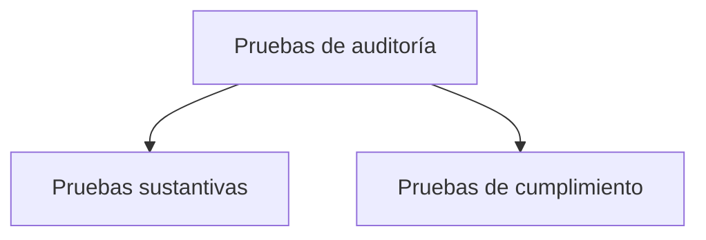
En el marco de la auditoría de seguridad informática, se realizan diversos tipos de pruebas para evaluar la efectividad de los controles y la seguridad de los sistemas de información. Las principales pruebas se pueden clasificar en pruebas sustantivas y pruebas de cumplimiento.

### Tipos de pruebas en la auditoría de seguridad informática

1. **Pruebas de Control**:
   - **Objetivo**: Verificar si los controles implementados están diseñados adecuadamente y operan de manera efectiva.
   - **Ejemplo**: Revisar la configuración de firewalls, políticas de contraseñas, y la implementación de software antivirus.

2. **Pruebas Sustantivas**:
   - **Objetivo**: Evaluar la exactitud y la integridad de la información contenida en los sistemas.
   - **Ejemplo**: Revisión de registros de transacciones, análisis de logs de auditoría y verificación de integridad de datos.

3. **Pruebas de Cumplimiento**:
   - **Objetivo**: Determinar si las actividades y controles cumplen con las políticas, procedimientos y normativas establecidas.
   - **Ejemplo**: Verificar si los accesos están conformes a las políticas de la empresa, y si se cumplen con regulaciones externas como GDPR o SOX.

4. **Pruebas de Penetración (Pentesting)**:
   - **Objetivo**: Identificar y explotar vulnerabilidades en los sistemas para evaluar la resistencia frente a ataques reales.
   - **Ejemplo**: Simulaciones de ataques de hackers para encontrar puntos débiles en la infraestructura de TI.

5. **Análisis de Vulnerabilidades**:
   - **Objetivo**: Identificar y evaluar las vulnerabilidades existentes en los sistemas y redes.
   - **Ejemplo**: Uso de herramientas automáticas para escanear sistemas y redes en busca de fallos conocidos.

6. **Evaluación de Riesgos**:
   - **Objetivo**: Identificar, analizar y evaluar los riesgos asociados con los sistemas de información.
   - **Ejemplo**: Análisis de escenarios de riesgo, evaluación de impacto y probabilidad de amenazas.

### Pruebas Sustantivas y Pruebas de Cumplimiento

#### Pruebas Sustantivas
Las pruebas sustantivas se centran en la verificación directa de los datos y transacciones dentro del sistema. Su objetivo es asegurarse de que los datos son precisos, completos y válidos. Estas pruebas incluyen la revisión de registros y documentos, la confirmación con terceros, y la inspección física de activos.

**Objetivos de las Pruebas Sustantivas:**
- Verificar la integridad y exactitud de la información financiera y operativa.
- Detectar errores o fraudes en los registros y transacciones.
- Asegurar que los estados financieros reflejan de manera precisa la situación de la empresa.

#### Pruebas de Cumplimiento
Las pruebas de cumplimiento están diseñadas para evaluar si los procesos y controles se están llevando a cabo conforme a las políticas y procedimientos establecidos, así como a las leyes y regulaciones aplicables.

**Objetivos de las Pruebas de Cumplimiento:**
- Confirmar que los controles internos están funcionando como se diseñaron.
- Asegurar que la empresa cumple con todas las regulaciones y normativas relevantes.
- Identificar áreas donde las políticas y procedimientos no se están siguiendo adecuadamente.

### Relación entre Pruebas Sustantivas y de Cumplimiento
Las pruebas de cumplimiento y las pruebas sustantivas están interrelacionadas. Las pruebas de cumplimiento ayudan a establecer que los controles están en lugar y operan de manera efectiva, lo cual proporciona una base de confianza para reducir el alcance y la profundidad de las pruebas sustantivas. Por otro lado, si las pruebas de cumplimiento revelan debilidades en los controles, se necesitarán pruebas sustantivas más extensas para asegurarse de que los datos y transacciones son precisos.

#### Esquema de la relación entre Pruebas Sustantivas y de Cumplimiento

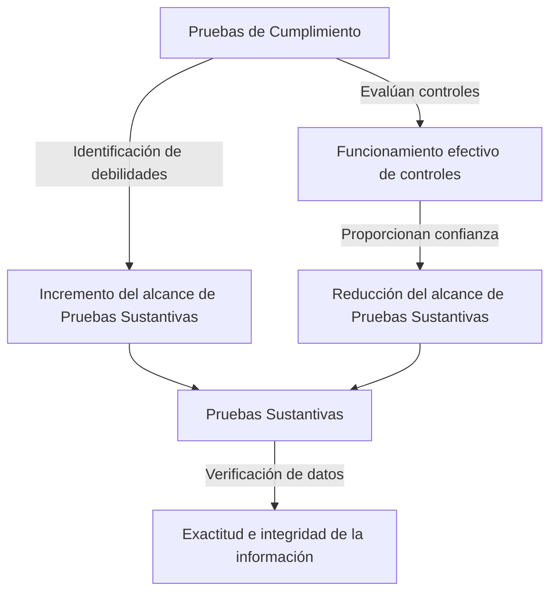

### Enlaces para ampliar la información

- [«Auditoría de seguridad informática» - Wikipedia](https://es.wikipedia.org/w/index.php?search=Auditoría+de+seguridad+informática&title=Especial:Buscar&ns0=1&ns100=1&ns104=1)
- [Examen de penetración](https://es.wikipedia.org/wiki/Examen_de_penetración)
- [Análisis de riesgo informático](https://es.wikipedia.org/wiki/Análisis_de_riesgo_informático)

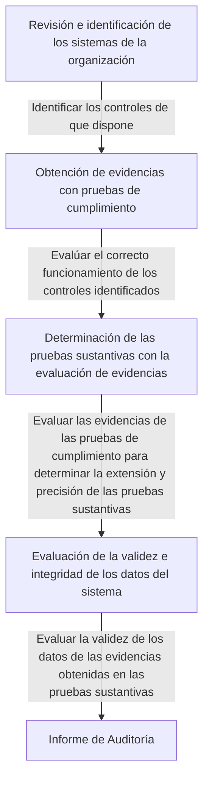

---

## Muestreo

El muestreo es una técnica crucial en el proceso de auditoría, ya que permite al auditor evaluar un subconjunto representativo de toda la población para hacer inferencias sobre el conjunto completo de datos. Existen varios tipos de muestreo que pueden aplicarse durante una auditoría para garantizar que el trabajo se realice dentro de estándares de calidad adecuados. A continuación, se describen los principales tipos de muestreo utilizados en auditorías.

### Tipos de Muestreo en Auditoría

1. **Muestreo Estadístico**:
   - **Muestreo Aleatorio Simple**:
     - **Descripción**: Cada elemento de la población tiene una probabilidad igual de ser seleccionado.
     - **Objetivo**: Garantizar que la muestra sea representativa de la población.
     - **Ejemplo**: Seleccionar transacciones al azar de un libro mayor.
   
   - **Muestreo Sistemático**:
     - **Descripción**: Se selecciona un punto de inicio aleatorio y luego se elige cada "n-ésimo" elemento.
     - **Objetivo**: Simplificar el proceso de selección manteniendo la representatividad.
     - **Ejemplo**: Seleccionar cada 10ª transacción de un listado.

   - **Muestreo Estratificado**:
     - **Descripción**: La población se divide en subgrupos (estratos) y se seleccionan muestras de cada estrato.
     - **Objetivo**: Asegurar que diferentes segmentos de la población estén representados en la muestra.
     - **Ejemplo**: Dividir las transacciones por tipo (ventas, compras) y seleccionar muestras de cada tipo.

   - **Muestreo por Conglomerados**:
     - **Descripción**: La población se divide en grupos (conglomerados) y se seleccionan algunos conglomerados al azar.
     - **Objetivo**: Simplificar el muestreo cuando la población es grande y dispersa.
     - **Ejemplo**: Seleccionar algunas sucursales de una empresa y auditar todas las transacciones en esas sucursales.

2. **Muestreo No Estadístico**:
   - **Muestreo por Juicio**:
     - **Descripción**: El auditor selecciona los elementos basándose en su criterio y conocimiento profesional.
     - **Objetivo**: Focalizar la auditoría en áreas con mayor riesgo o importancia.
     - **Ejemplo**: Seleccionar transacciones de alto valor o aquellas realizadas cerca del cierre del período.

   - **Muestreo por Conveniencia**:
     - **Descripción**: Selección de elementos que son fáciles de acceder.
     - **Objetivo**: Reducir el tiempo y costo de la auditoría.
     - **Ejemplo**: Auditar las transacciones que están más fácilmente disponibles.

   - **Muestreo por Cuotas**:
     - **Descripción**: Se selecciona un número específico de elementos de cada categoría predefinida.
     - **Objetivo**: Asegurar que la muestra incluya un número determinado de elementos de cada categoría.
     - **Ejemplo**: Seleccionar un número fijo de transacciones de cada departamento.

### Esquema de los Tipos de Muestreo

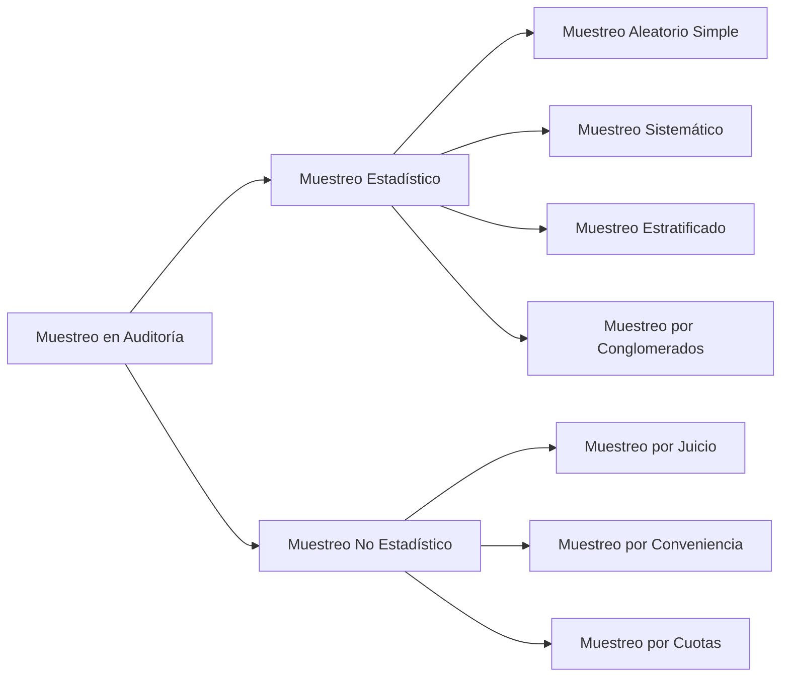

### Objetivo del Muestreo en Auditoría
El objetivo principal del muestreo en auditoría es proporcionar una base razonable para que el auditor pueda emitir una opinión sobre la información financiera o los controles internos sin tener que examinar todos los elementos de una población. Al utilizar técnicas de muestreo adecuadas, el auditor puede:
- Reducir el tiempo y los costos asociados con la auditoría.
- Mantener un nivel adecuado de precisión y representatividad en los resultados de la auditoría.
- Identificar y focalizar las áreas de mayor riesgo o importancia dentro de la entidad auditada.

### Enlaces para Ampliar la Información

- [Muestreo en Auditoría](https://www.bdo.es/es-es/blogs-es/coordenadas-bdo/el-muestreo-en-auditoria)
- [Guía para la auditoría de sistemas informáticos](https://triunfaemprendiendo.com/como-se-audita-un-sistema-informatico/)
- [NIA-ES 530. Muestreo de Auditoría, publicada mediante Resolución de 15 de octubre de 2013 | ICAC](https://www.icac.gob.es/node/77)
- [Qué es el muestreo](https://www.youtube.com/watch?v=3LFDVSuaOkw)

Es importante entender los diferentes tipos de muestreo utilizados en auditoría y cómo aplicarlos de manera efectiva para cumplir con los estándares de calidad.

## Utilización de herramientas tipo CAAT (Computer Assisted Audit Tools)

Las herramientas tipo CAAT (Computer Assisted Audit Tools) están formadas por un conjunto de herramientas y técnicas cuya función es facilitar al auditor informático el desarrollo de sus tareas y actividades. Las más utilizadas son las aplicaciones de auditoría generalizadas, los datos de prueba y los sistemas expertos de auditorías.
Estas herramientas se utilizan en tareas de auditoría tales como:

- Pruebas de controles en aplicaciones.
- Selección y monitorización de transacciones.
- Verificación de datos.
- Análisis de los programas de las aplicaciones.
- Auditoría de los centros de procesamiento de la información.
- Auditoría del desarrollo de aplicaciones.
- Técnicas de muestreo.

El auditor de sistemas de información debe tener un conocimiento adecuado de estas herramientas y de sus posibles aplicaciones para utilizarlas correctamente e interpretar los resultados obtenidos de modo pertinente.

Las herramientas tipo CAAT (Computer Assisted Audit Tools) son aplicaciones de software utilizadas para facilitar y mejorar el proceso de auditoría. Estas herramientas permiten a los auditores analizar grandes volúmenes de datos, identificar patrones y anomalías, y realizar pruebas y análisis más eficientes y efectivos. A continuación, te proporciono una visión general de las herramientas CAAT, incluyendo sus características, ventajas, desventajas y un esquema ilustrativo en Mermaid para visualizar cómo se integran en el proceso de auditoría.

### Características de las herramientas CAAT

1. **Automatización de tareas**: Permiten automatizar muchas tareas repetitivas y rutinarias, como el muestreo de datos, cálculos y generación de informes.
2. **Análisis de datos**: Facilitan el análisis de grandes volúmenes de datos, ayudando a identificar patrones, tendencias y anomalías.
3. **Pruebas de controles**: Ayudan a evaluar la eficacia de los controles internos mediante pruebas automáticas.
4. **Generación de informes**: Permiten la creación de informes detallados y personalizados basados en los datos analizados.
5. **Compatibilidad con múltiples formatos**: Pueden trabajar con diversos formatos de datos y sistemas contables.

### Ventajas de las herramientas CAAT

1. **Eficiencia**: Reducen el tiempo y el esfuerzo necesario para realizar auditorías.
2. **Precisión**: Disminuyen la probabilidad de errores humanos en el análisis de datos.
3. **Cobertura**: Permiten revisar el 100% de los datos en lugar de una muestra, aumentando la confiabilidad de los resultados.
4. **Detección de fraudes**: Mejoran la capacidad para detectar fraudes y otras irregularidades.

### Desventajas de las herramientas CAAT

1. **Costo inicial**: La implementación de estas herramientas puede ser costosa.
2. **Capacitación**: Requieren que los auditores estén capacitados en su uso.
3. **Dependencia tecnológica**: Su eficacia depende de la calidad de los sistemas y datos subyacentes.

### Proceso de auditoría utilizando herramientas CAAT

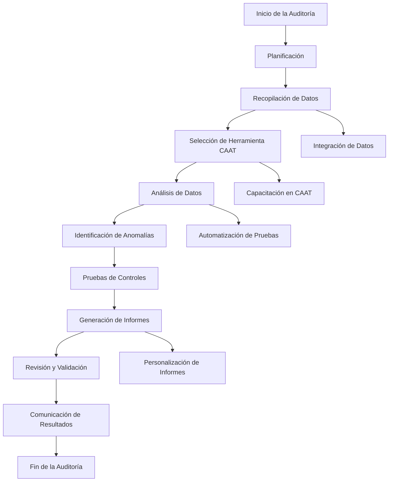

### Herramientas populares CAAT

1. **ACL Analytics**: Herramienta de auditoría y análisis de datos que permite realizar una amplia variedad de pruebas y análisis.
2. **IDEA (Interactive Data Extraction and Analysis)**: Software que facilita la extracción, análisis y manipulación de datos.
3. **Excel con complementos**: Aunque no es una herramienta CAAT en sí, Excel con complementos como Power Query y Power Pivot puede ser utilizado para análisis de auditoría.

### Recursos adicionales

- [ACL Analytics](https://help.highbond.com/helpdocs/analytics/15/en-us/Content/global_topics/index.htm)
- [Data analysis software](https://www.tableau.com/en-gb/trial/data-analysis-software)
- [IDEA Data Analysis Software](https://www.caseware.com/es/products/idea/)

Estas herramientas son esenciales para auditores modernos, ya que mejoran significativamente la calidad y eficiencia de las auditorías.

## Hallazgos

Dentro del ámbito de la auditoría, un hallazgo se refiere a un conjunto de información que recopila información específica sobre la actividad, tarea, proceso, condición, etc., analizados y evaluados, que sea considerada de interés para la organización.
En general, los hallazgos obtenidos se emplean a modo de crítica y muestran información sobre deficiencias o debilidades detectadas en el sistema auditado y presentadas en el informe de auditoría. No obstante, hay que tener en cuenta que, aunque son menos abundantes, también hay hallazgos positivos.

> Los hallazgos durante una auditoría no abarcan las conclusiones del auditor, son hechos que el auditor ha detectado durante su examen y servirán como base para que pueda emitir sus conclusiones y recomendaciones para mejorar el funcionamiento del sistema auditado.

8.1
