# Internet es asombroso

En solo unos pocos clics, podemos transmitir videos en YouTube, leer artículos en Wikipedia, pedir suministros en Amazon, hacer videollamadas con amigos y tuitear sobre el clima. Sin duda, la capacidad de las computadoras y sus usuarios para enviar y recibir información a través de una red mundial de telecomunicaciones ha cambiado el mundo para siempre.

Hace 150 años, enviar una carta desde Londres a California habría tomado dos o tres semanas, y eso si pagabas por correo expreso. Hoy, ese correo electrónico toma una fracción de segundo. Esta mejora millonaria en latencia, que es el tiempo que tarda un mensaje en transferirse, ha impulsado la economía global, ayudando al mundo moderno a moverse a la velocidad de la luz sobre cables de fibra óptica que abarcan el globo.

Podrías pensar que las computadoras y las redes siempre han ido de la mano, pero en realidad la mayoría de las computadoras antes de 1970 funcionaban completamente solas. Sin embargo, a medida que grandes computadoras comenzaron a aparecer por todas partes y las máquinas de bajo costo empezaron a estar en los escritorios de las personas, se volvió cada vez más útil compartir datos y recursos, y surgieron las primeras redes de computadoras.

Hoy, vamos a comenzar un arco de tres episodios sobre cómo surgieron las redes de computadoras y los principios y técnicas fundamentales que las impulsan.

## Introducción a las redes de computadoras

Las primeras redes de computadoras aparecieron en las décadas de 1950 y 1960. Generalmente, se utilizaban dentro de una organización, como una empresa o un laboratorio de investigación, para facilitar el intercambio de información entre diferentes personas y computadoras. Esto era más rápido y más confiable que el método anterior de tener a alguien caminando con un montón de tarjetas perforadas o un carrete de cinta magnética a una computadora al otro lado del edificio, método que más tarde fue apodado "sneakernet".

Un segundo beneficio de las redes fue la capacidad de compartir recursos físicos. Por ejemplo, en lugar de que cada computadora tuviera su propia impresora, todos podían compartir una conectada a la red. También era común en las primeras redes tener grandes unidades de almacenamiento compartido, demasiado caras para tenerlas conectadas a cada máquina. Estas redes relativamente pequeñas de computadoras cercanas se llaman Redes de Área Local, o LANs.

Una LAN puede ser tan pequeña como dos máquinas en la misma habitación, o tan grande como un campus universitario con miles de computadoras. Aunque se desarrollaron y desplegaron muchas tecnologías de LAN, la más famosa y exitosa fue Ethernet, desarrollada a principios de los años 70 en Xerox PARC, y que todavía se usa ampliamente hoy en día.

En su forma más simple, una serie de computadoras están conectadas a un solo cable Ethernet común. Cuando una computadora quiere transmitir datos a otra computadora, escribe los datos, como una señal eléctrica, en el cable.

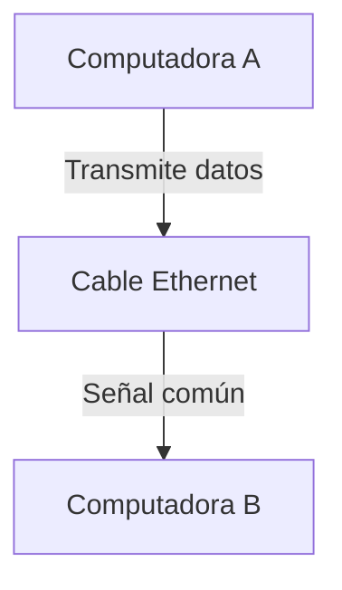

Claro, debido a que el cable es compartido, todas las computadoras conectadas a la red ven la transmisión, pero no saben si los datos están destinados a ellas o a otra computadora. Para resolver este problema, Ethernet requiere que cada computadora tenga una dirección de Control de Acceso al Medio única, o dirección MAC. Esta dirección única se coloca en un encabezado que precede a cualquier dato enviado por la red. Así, las computadoras simplemente escuchan el cable Ethernet y solo procesan los datos cuando ven su dirección en el encabezado.

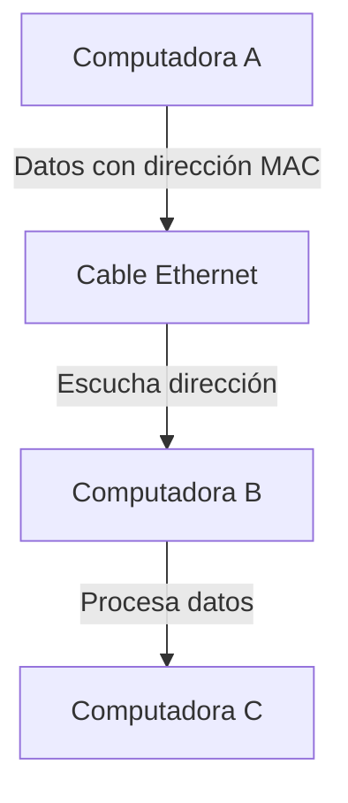

Este método funciona muy bien; todas las computadoras fabricadas hoy en día vienen con su propia dirección MAC única para Ethernet y WiFi. El término general para este enfoque es Acceso Múltiple por Detección de Portadora, o CSMA por sus siglas en inglés. La "portadora", en este caso, es cualquier medio de transmisión compartido que lleva datos: el cable de cobre en el caso de Ethernet y el aire que lleva las ondas de radio para WiFi.

Desafortunadamente, usar una portadora compartida tiene un gran inconveniente. Cuando el tráfico de la red es ligero, las computadoras pueden simplemente esperar a que haya silencio en la portadora y luego transmitir sus datos. Pero, a medida que aumenta el tráfico de la red, también aumenta la probabilidad de que dos computadoras intenten escribir datos al mismo tiempo. Esto se llama colisión, y los datos se mezclan, como dos personas intentando hablar por teléfono al mismo tiempo.

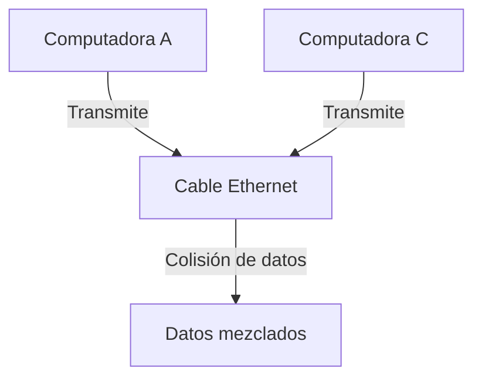

Afortunadamente, las computadoras pueden detectar estas colisiones escuchando la señal en el cable. La solución más obvia es que las computadoras dejen de transmitir, esperen a que haya silencio, y luego intenten nuevamente. El problema es que la otra computadora también intentará eso, y otras computadoras en la red que han estado esperando a que la portadora esté en silencio intentarán saltar durante cualquier pausa. Esto solo lleva a más y más colisiones.

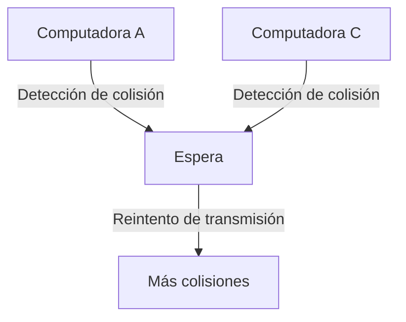

### Videos

1. [Cómo funciona Ethernet](https://www.youtube.com/watch?v=3QhU9jd03a0)
2. [Funcionamiento de las redes LAN](https://www.youtube.com/watch?v=hExRDVZHhig)
3. [Historia de Internet](https://www.youtube.com/watch?v=_E5zmOiEhcI)

Estos enlaces te llevarán a videos que explican con más detalle el funcionamiento de cada parte de las redes de computadoras.

### Ethernet y la solución a las colisiones

Ethernet tenía una solución sorprendentemente simple y efectiva. Cuando las computadoras que transmiten detectan una colisión, esperan un breve período antes de intentar retransmitir. Por ejemplo, digamos que 1 segundo. Claro, esto no funciona si todas las computadoras usan la misma duración de espera: colisionarán nuevamente un segundo después. Entonces, se agrega un período aleatorio: una computadora podría esperar 1.3 segundos, mientras que otra espera 1.5 segundos. Con un poco de suerte, la computadora que esperó 1.3 segundos se despertará, encontrará la portadora en silencio y comenzará a transmitir. Cuando la computadora que esperó 1.5 segundos se despierte un momento después, verá que la portadora está en uso y esperará a que la otra computadora termine.

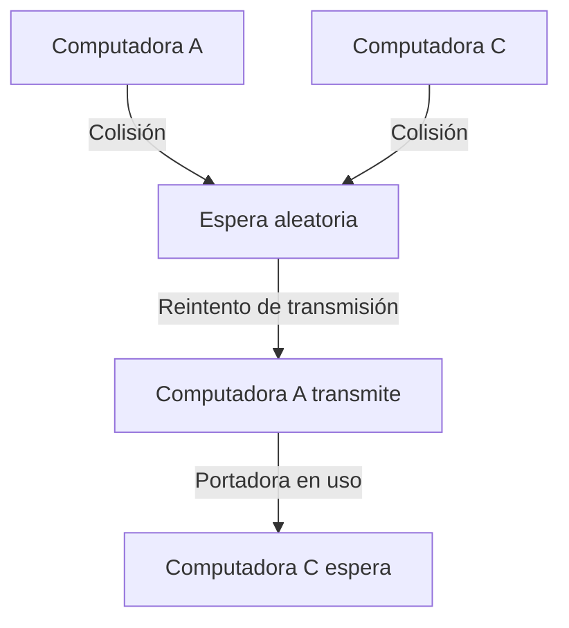

Esto ayuda, pero no resuelve completamente el problema, así que se utiliza un truco adicional. Como expliqué antes, si una computadora detecta una colisión mientras transmite, esperará 1 segundo más un tiempo extra aleatorio. Sin embargo, si colisiona nuevamente, lo que sugiere congestión de la red, en lugar de esperar otro segundo, esta vez esperará 2 segundos. Si vuelve a colisionar, esperará 4 segundos, luego 8, y así sucesivamente, hasta que tenga éxito. Con las computadoras retrocediendo, la tasa de colisiones disminuye y los datos comienzan a moverse nuevamente, liberando la red.

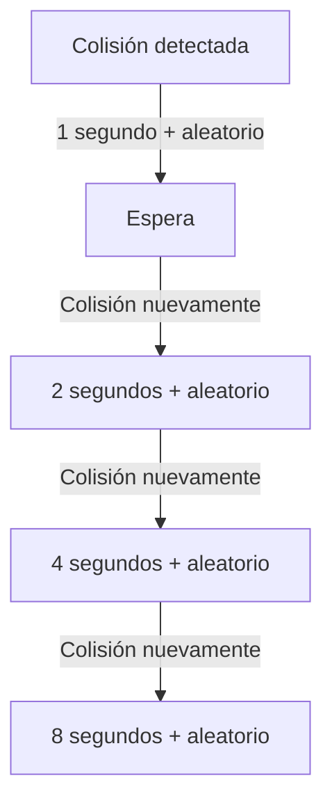

Este comportamiento de "retroceso" usando un tiempo de espera que crece exponencialmente se llama Retroceso Exponencial. Tanto Ethernet como WiFi lo utilizan, al igual que muchos protocolos de transmisión.

### Segmentación de redes y reducción de colisiones

Incluso con trucos ingeniosos como el Retroceso Exponencial, no podrías tener todas las computadoras de una universidad en un solo cable Ethernet compartido. Para reducir las colisiones y mejorar la eficiencia, necesitamos reducir el número de dispositivos en cualquier portadora compartida, lo que se llama el Dominio de Colisión.

Volvamos a nuestro ejemplo anterior de Ethernet, donde teníamos seis computadoras en un solo cable compartido, es decir, un dominio de colisión. Para reducir la probabilidad de colisiones, podemos dividir esta red en dos dominios de colisión usando un Switch de Red. Este se coloca entre nuestras dos redes más pequeñas y solo pasa datos entre ellas si es necesario. Hace esto manteniendo una lista de qué direcciones MAC están en qué lado de la red.

Entonces, si la computadora A quiere transmitir datos a la computadora C, el switch no reenvía los datos a la otra red, ya que no es necesario. Esto significa que si E quiere transmitir a F al mismo tiempo, la red está completamente libre, y pueden ocurrir dos transmisiones simultáneamente. Pero, si F quiere enviar datos a A, entonces el switch los pasa a través, y ambas redes están ocupadas brevemente.

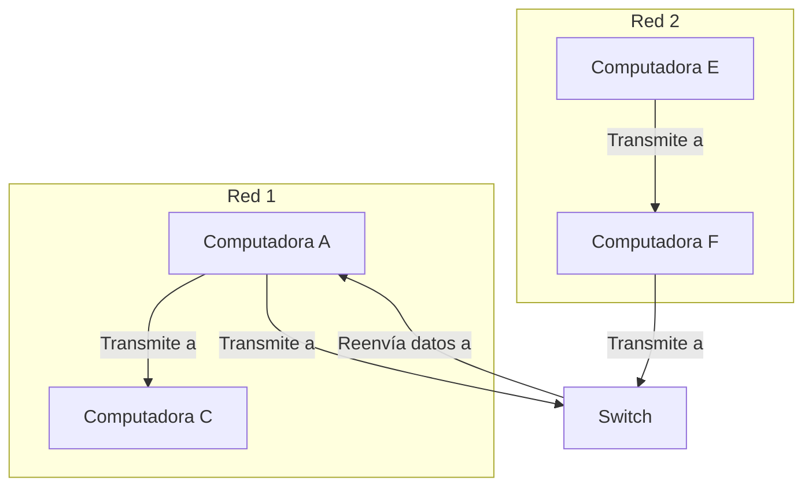

Esto es esencialmente cómo se construyen las grandes redes de computadoras, incluyendo la más grande de todas: **Internet**, que literalmente interconecta una gran cantidad de redes más pequeñas, permitiendo la comunicación entre ellas.

Lo interesante de estas grandes redes es que a menudo hay múltiples caminos para llevar los datos de un lugar a otro. Y esto nos lleva a otro tema fundamental de las redes: el enrutamiento.

### Enrutamiento y conmutación de paquetes

La forma más simple de conectar dos computadoras distantes, o redes, es asignar una línea de comunicación para su uso exclusivo. Esto es cómo funcionaban los primeros sistemas telefónicos. Por ejemplo, podría haber 5 líneas telefónicas entre Indianápolis y Missoula. Si John levantaba el teléfono queriendo llamar a Hank en los años 1910, John le diría a un operador humano a dónde quería llamar, y el operador conectaría físicamente la línea telefónica de John a una línea no utilizada que iba a Missoula. Durante la duración de la llamada, esa línea estaba ocupada, y si las 5 líneas estaban en uso, John tendría que esperar a que una se desocupara. Este enfoque se llama **Conmutación de Circuitos**, porque literalmente se están cambiando circuitos completos para enrutar el tráfico al destino correcto.

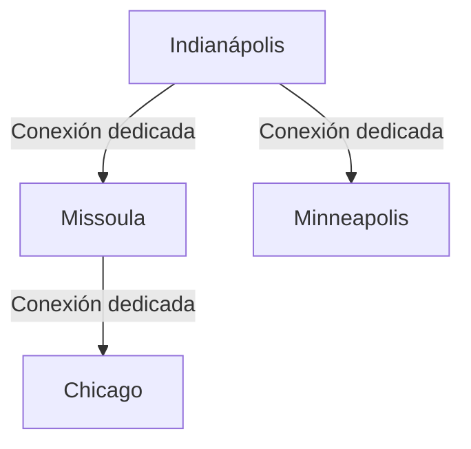

Otra forma de hacer llegar datos de un lugar a otro es la **Conmutación de Mensajes**, que es algo similar a cómo funciona el sistema postal. En lugar de una ruta dedicada de A a B, los mensajes se pasan por varios puntos. Entonces, si John escribe una carta a Hank, podría ir de Indianápolis a Chicago, luego saltar a Minneapolis, luego a Billings, y finalmente llegar a Missoula. Cada punto sabe a dónde enviarlo después porque mantienen una tabla de dónde pasar cartas dado una dirección de destino. 

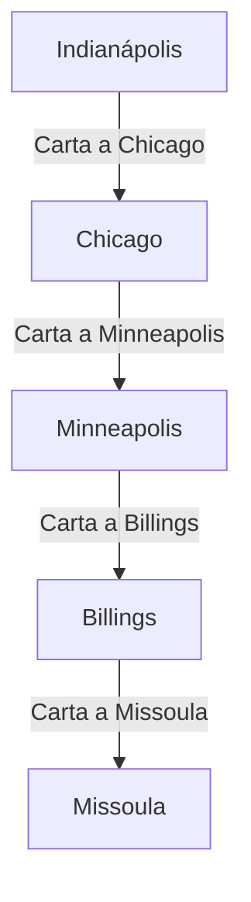

La **Conmutación de Paquetes** es la solución a los problemas de tamaño y eficiencia en la transmisión de mensajes grandes. En lugar de enviar un mensaje grande de una vez, se divide en muchos fragmentos más pequeños llamados paquetes. Cada paquete contiene una dirección de destino en la red, por lo que los enrutadores saben dónde reenviarlos.

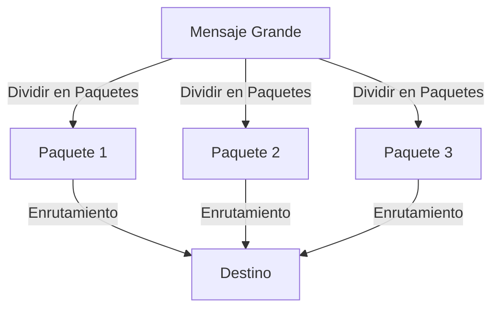

### Videos Educativos

Aquí tienes algunos videos que te ayudarán a entender mejor estos conceptos:

1. [Cómo funciona Ethernet](https://www.youtube.com/watch?v=3QhU9jd03a0)
2. [Funcionamiento de las redes LAN](https://www.youtube.com/watch?v=hExRDVZHhig)
3. [Historia de Internet](https://www.youtube.com/watch?v=_E5zmOiEhcI)

Estos enlaces te llevarán a videos que explican con más detalle el funcionamiento de cada parte de las redes de computadoras.

### Resumen

Este enfoque de fragmentar datos en paquetes pequeños y pasarlos por rutas flexibles con capacidad libre es tan eficiente y tolerante a fallos que es el que utiliza todo el Internet hoy en día. Este enfoque de enrutamiento se llama **Conmutación de Paquetes**. También tiene la ventaja de ser descentralizado, sin una autoridad central o un único punto de fallo. De hecho, la amenaza de un ataque nuclear fue la razón por la que se desarrolló la conmutación de paquetes durante la Guerra Fría. 

Hoy en día, los enrutadores de todo el mundo trabajan cooperativamente para encontrar rutas eficientes, intercambiando información entre sí utilizando protocolos especiales, como el **Protocolo de Mensaje de Control de Internet (ICMP)** y el **Protocolo de Puerta de Enlace Fronteriza (BGP)**. La primera red de conmutación de paquetes del mundo, y el ancestro de Internet moderno, fue **ARPANET**, nombrado en honor a la agencia de EE. UU. que la financió, la **Agencia de Proyectos de Investigación Avanzada (ARPA)**.

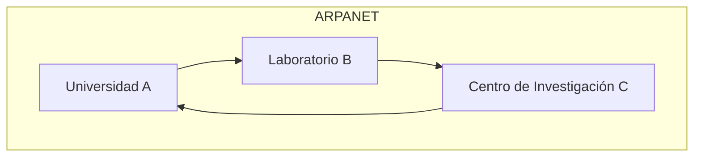

En 1974, ARPANET era una red bastante pequeña en comparación con el Internet de hoy en día. Hoy, en lugar de unas pocas docenas de computadoras en línea, se estima que hay cerca de 10 mil millones, y sigue creciendo rápidamente, especialmente con la llegada de electrodomésticos inteligentes conectados por wifi, formando un "Internet de las cosas".
