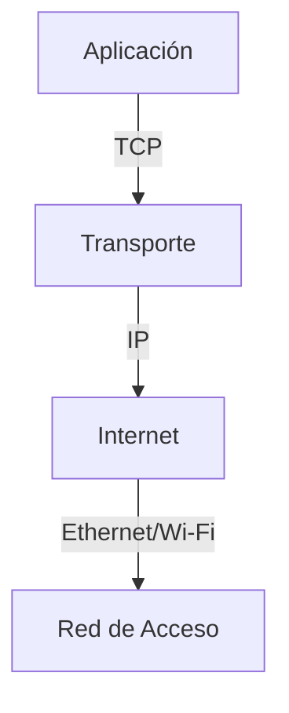
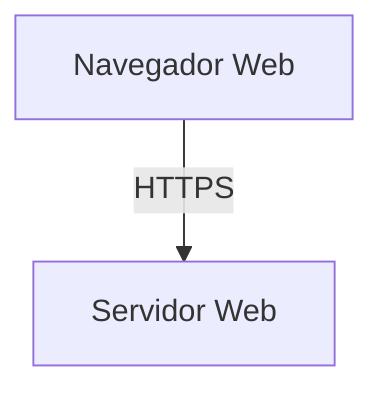
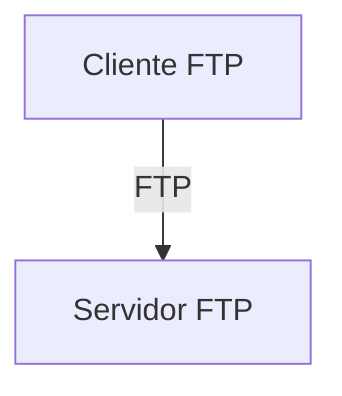
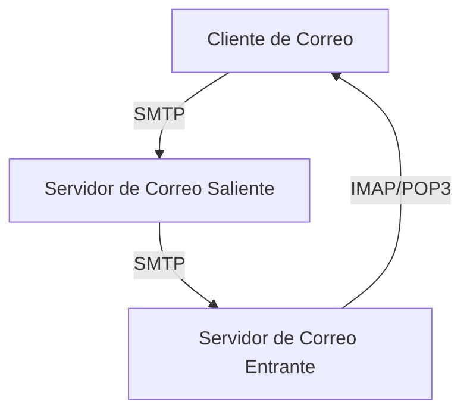
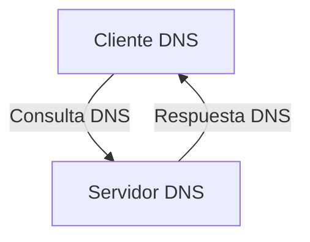
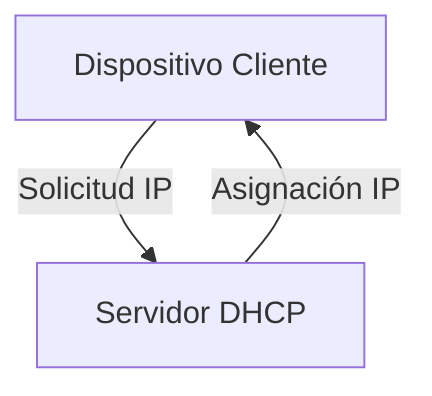

# Protocolos de red

Los protocolos de red son conjuntos de reglas y convenciones que permiten la comunicación entre dispositivos en una red. Estos protocolos aseguran que los dispositivos puedan comunicarse de manera eficiente y segura. A continuación, te proporciono una visión general de algunos de los protocolos de red más importantes y sus aplicaciones específicas.

### Protocolo TCP/IP (Transmission Control Protocol/Internet Protocol)

#### Aplicaciones:
- **TCP (Transmission Control Protocol)**: Protocolo orientado a la conexión que garantiza la entrega de datos sin errores y en el orden correcto. Utilizado en aplicaciones como HTTP, FTP, SMTP, y Telnet.
- **IP (Internet Protocol)**: Protocolo que direcciona y enruta los paquetes de datos entre los dispositivos. Utilizado en toda comunicación en Internet.

### HTTP/HTTPS (HyperText Transfer Protocol / Secure)

#### Aplicaciones:
- **HTTP**: Protocolo para la transferencia de páginas web. Utilizado en la navegación web.
- **HTTPS**: Versión segura de HTTP, utiliza SSL/TLS para cifrar la comunicación. Utilizado en sitios web que requieren seguridad, como banca en línea y comercio electrónico.

### FTP (File Transfer Protocol)

#### Aplicaciones:
- Protocolo para la transferencia de archivos entre sistemas. Utilizado en servidores de archivos y transferencia de grandes cantidades de datos.

### SMTP/IMAP/POP3 (Simple Mail Transfer Protocol / Internet Message Access Protocol / Post Office Protocol 3)

#### Aplicaciones:
- **SMTP**: Protocolo para el envío de correos electrónicos. Utilizado en servidores de correo saliente.
- **IMAP**: Protocolo para acceder a correos electrónicos desde un servidor. Permite la sincronización de correos en múltiples dispositivos.
- **POP3**: Protocolo para recibir correos electrónicos desde un servidor. Descarga los correos al dispositivo y normalmente los borra del servidor.

### DNS (Domain Name System)

#### Aplicaciones:
- Protocolo que traduce nombres de dominio en direcciones IP. Utilizado en la navegación web y acceso a servicios en línea.

### DHCP (Dynamic Host Configuration Protocol)

#### Aplicaciones:
- Protocolo que asigna automáticamente direcciones IP a los dispositivos en una red. Utilizado en redes locales para facilitar la administración de IPs.

### Enlaces a Videos Educativos

1. [Protocolo TCP/IP](https://www.youtube.com/watch?v=3QhU9jd03a0)
2. [Cómo funciona HTTP/HTTPS](https://www.youtube.com/watch?v=hExRDVZHhig)
3. [Introducción a FTP](https://www.youtube.com/watch?v=_E5zmOiEhcI)
4. [Funcionamiento de DNS](https://www.youtube.com/watch?v=mpQZVYPuDGU)
5. [Qué es DHCP](https://www.youtube.com/watch?v=hkDnRj1iKrA)

Estos enlaces te llevarán a videos que explican con más detalle el funcionamiento de cada protocolo.

Espero que esta información te sea útil para entender mejor los protocolos de red y sus aplicaciones específicas. Si necesitas más detalles o tienes alguna otra pregunta, ¡no dudes en decírmelo!