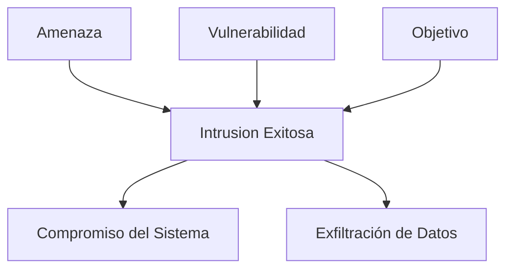

# Triángulo de la Intrusión

El concepto del **Triángulo de la Intrusión** es un modelo utilizado para describir los componentes clave que deben estar presentes para que ocurra una intrusión exitosa en un sistema informático. Similar al Triángulo del Fuego en seguridad contra incendios, este modelo ayuda a identificar y mitigar los factores que permiten una intrusión. El Triángulo de la Intrusión consta de tres elementos principales:

1. **Amenaza (Threat)**: El atacante o entidad que tiene la intención y capacidad de llevar a cabo una intrusión.
2. **Vulnerabilidad (Vulnerability)**: Las debilidades o fallos en el sistema que pueden ser explotadas por la amenaza.
3. **Objetivo (Target)**: El recurso o activo que el atacante desea comprometer o controlar.

Para que una intrusión sea exitosa, deben estar presentes los tres componentes: una amenaza capaz, una vulnerabilidad explotable y un objetivo valioso.

- **Amenaza (Threat)**: Representa al atacante, que puede ser un individuo, grupo o entidad con la intención de llevar a cabo una intrusión.
- **Vulnerabilidad (Vulnerability)**: Son las debilidades o fallos del sistema que pueden ser explotadas.
- **Objetivo (Target)**: Es el recurso o activo que el atacante quiere comprometer.
- **Intrusión Exitosa**: Es el evento en el que los tres componentes se alinean, resultando en un compromiso del sistema y/o exfiltración de datos.

### Recursos Adicionales

- [Information security standards - Wikipedia](https://en.wikipedia.org/wiki/Information_security_standards)
- [¿Qué es un ataque cibernético? | IBM](https://www.ibm.com/mx-es/topics/cyber-attack)
- [Ciclo de Vida del Ataque Informático](https://www.incibe.es/empresas/blog/las-7-fases-ciberataque-las-conoces)
- [Metodología de los ataques cibernéticos](https://www.cisco.com/c/en/us/about/security-center/cyberattack-methodology.html)
- [Metodologías de evaluación de riesgos cibernéticos](https://ciberseguridad.com/herramientas/metodologias-evaluacion-riesgos-ciberneticos/)
- [Protege tu empresa contra ataques cibernéticos](https://founderz.com/blog/es/prevencion-ataques-ciberneticos-herramientas/)
- [OWASP Testing Guide](https://owasp.org/www-project-web-security-testing-guide/)

Este esquema ayuda a visualizar cómo la combinación de una amenaza, una vulnerabilidad y un objetivo puede resultar en una intrusión exitosa, destacando la importancia de abordar cada uno de estos elementos en las estrategias de ciberseguridad.