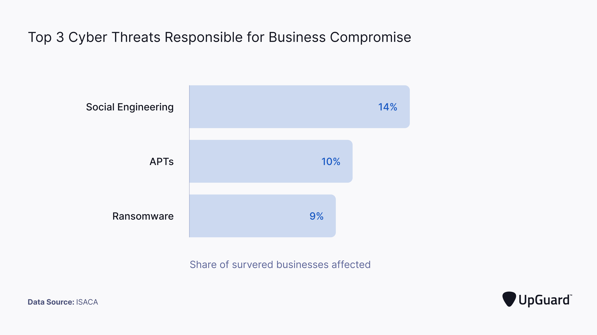

# Ingeniería social: Definición y ejemplos de ataques

La ingeniería social, en el contexto de la ciberseguridad, es el proceso de engañar a las personas para que divulguen información privada que puede ser útil en un ciberataque.

Existen muchos tipos diferentes de ataques de ingeniería social. Algunas formas de ingeniería social son correos electrónicos convincentes o mensajes de texto infectados con enlaces que conducen a sitios web maliciosos. Otras implican más esfuerzo, como una llamada telefónica de un cibercriminal que se hace pasar por soporte técnico y solicita información confidencial.

Los ataques de ingeniería social son populares porque ayudan a los cibercriminales a evitar el arduo esfuerzo de localizar y explotar vulnerabilidades de seguridad para acceder a una red. En cambio, los empleados manipulados básicamente entregan a los actores de amenazas las claves de la red.

Los ataques de ingeniería social son cada vez más populares porque facilitan considerablemente los ciberataques. Según la [Encuesta sobre el estado de la ciberseguridad de ISACA](https://www.isaca.org/go/state-of-cybersecurity-2021) , la ingeniería social fue la principal [amenaza cibernética](https://www.upguard.com/blog/cyber-threat) responsable de la vulneración de las empresas.

## 13 ejemplos de técnicas de ingeniería social

Los ataques de ingeniería social más comunes incluyen:

### Cebo - *Baiting*

Un tipo de ingeniería social en el que un atacante deja un dispositivo físico (como una memoria USB) infectado con un [tipo de malware](https://www.upguard.com/blog/types-of-malware) en un lugar donde es más probable que se lo encuentre. Cuando una víctima inserta la memoria USB en su computadora, se inicia un [proceso de instalación de malware .](https://www.upguard.com/blog/malware)

### Robo por desvío - *Diversion Theft*

El [robo por desvío](https://easydmarc.com/blog/es/que-son-los-robos-de-desvio-estrategias-de-ataque-y-defensa-ante-este-tipo-de-estafa/) ocurre cuando los ingenieros sociales engañan a una empresa de entrega para que envíe el paquete a una ubicación diferente para que pueda ser interceptado.

### Honey trap

Una trampa de miel o *honey trap* es cuando un estafador se hace pasar por una persona atractiva en línea con el objetivo de robar [información de identificación personal (PII)](https://www.upguard.com/blog/personally-identifiable-information-pii) , como números de teléfono y detalles de cuentas de correo electrónico, de las personas con las que interactúa.

### Suplantación de identidad - *Phishing*

[Los ataques de phishing](https://www.upguard.com/blog/phishing) recopilan información confidencial, como credenciales de inicio de sesión, números de tarjetas de crédito y detalles de cuentas bancarias, haciéndose pasar por una fuente confiable.

**La estafa de phishing más común es un correo electrónico falso que parece haber sido enviado por un remitente autorizado.** Algo así como las antiguas [cartas nigerianas](https://es.wikipedia.org/wiki/Estafa_nigeriana).

A continuación se muestra un ejemplo de un correo electrónico de phishing que parece una comunicación legítima de la Organización Mundial de la Salud.

)

*Ejemplo de correo electrónico de phishing. Fuente: malwarebytes.com*

Los enlaces incluidos en los correos electrónicos de phishing contienen códigos maliciosos. Cuando se hace clic en ellos, las víctimas suelen ser redirigidas a una página web que es una réplica del sitio web de la empresa que el correo electrónico pretende representar. Puede ser una página de inicio de sesión falsa para una institución financiera o un portal de inicio de sesión falso para su intranet.

Algunas de estas páginas falsas son indistinguibles de sus inspiraciones en el mundo real. Cuando las víctimas desprevenidas envían su información, sus credenciales se envían al hacker, quien luego inicia sesión en el sitio web legítimo que se refleja en el ataque.

Los correos electrónicos de phishing suelen generar una sensación de urgencia para que la víctima sienta que es importante divulgar información rápidamente. A pesar de no tener siempre un diseño sofisticado, los ataques de phishing son uno de los [riesgos de ciberseguridad más críticos](https://www.upguard.com/blog/cybersecurity-risk) .

Algunos filtros de spam, como el [filtro de Microsoft](https://support.microsoft.com/en-gb/office/overview-of-the-junk-email-filter-5ae3ea8e-cf41-4fa0-b02a-3b96e21de089) , están diseñados para enviar correos electrónicos potencialmente fraudulentos directamente a la carpeta de correo no deseado. Estos filtros no siempre son precisos, por lo que es importante mantener siempre una mentalidad [de confianza cero](https://www.upguard.com/blog/prevent-supply-chain-attacks-with-zero-trust-architecture) al revisar los correos electrónicos que recibimos.

### Suplantación de identidad (spear phishing)

El phishing selectivo es un ataque [de suplantación de identidad por correo electrónico](https://www.upguard.com/blog/email-spoofing) dirigido a una organización o persona específica. Los correos electrónicos de phishing selectivo tienen como objetivo infectar a la víctima con [ransomware](https://www.upguard.com/blog/ransomware) o engañarla para que revele [datos](https://www.upguard.com/blog/sensitive-data) e información confidenciales.  

### Smishing

El smishing o [phishing por SMS](https://www.upguard.com/blog/can-sim-cards-get-hacked) es una forma de phishing realizada a través de SMS en lugar del medio tradicional del correo electrónico.

### Pretextos - *Pretexting*

El *Pretexting* es el proceso de mentir para obtener acceso a datos personales u otra información privilegiada. Por ejemplo, un estafador puede hacerse pasar por un [proveedor externo](https://www.upguard.com/blog/third-party-vendor) y decir que necesita saber su nombre completo y su cargo para verificar su identidad.

### Quid pro quo

Un quid pro quo es un tipo de ataque de ingeniería social que explota la tendencia humana a corresponder los buenos gestos.

Por ejemplo, un atacante puede brindar soporte técnico gratuito a través de una llamada telefónica a una víctima y luego solicitarle que desactive su antivirus para permitir una próxima actualización del sistema. Luego, se presiona a la víctima para que se comprometa a corresponder a la generosa asistencia que recibió.

Si una víctima es muy complaciente, los cibercriminales seguirán utilizándola para llevar adelante el ciberataque. Siguiendo con el ejemplo anterior, después de desactivar todo el software antivirus, se le podría pedir a la víctima que [instale un troyano](https://www.upguard.com/blog/what-are-web-shell-attacks) disfrazado de "actualización de software", lo que haría que toda la red quedara bajo el control del cibercriminal.

### Software de seguridad fraudulento - *Rogue Security Software*

El software de seguridad fraudulento o scareware es un software de seguridad falso que identifica erróneamente la presencia de malware en una computadora. Después de la "detección", el usuario final recibe una ventana emergente que solicita el pago para su eliminación. Las ventanas emergentes seguirán apareciendo con mayor urgencia hasta que se realice el pago.

### Seguir de cerca - *Tailgating*

El tailgating o piggybacking es cuando un atacante sigue a una persona hasta una zona segura. Este tipo de ataque se basa en que la persona seguida asume que el intruso está autorizado a acceder a la zona objetivo.

### Vishing

El vishing o phishing de voz se realiza por teléfono y, a menudo, tiene como objetivo a los usuarios de [servicios de voz sobre IP (VoIP) como Skype](https://callhippo.com/blog/alternative/skype-alternatives) . El vishing combinado con [falsificaciones de voz profunda](https://www.forbes.com/sites/forbestechcouncil/2021/05/10/analyzing-the-rise-of-deepfake-voice-technology/) es un [riesgo de ciberseguridad](https://www.upguard.com/blog/cybersecurity-risk) masivo . Según [The Wall Street Journal](https://www.wsj.com/articles/fraudsters-use-ai-to-mimic-ceos-voice-in-unusual-cybercrime-case-11567157402) , un ataque de vishing provocó que el director ejecutivo de una empresa de energía con sede en el Reino Unido enviara 243.000 dólares a la cuenta bancaria de un atacante porque pensó que estaba hablando por teléfono con su jefe.

### Agujero de agua - *Waterholing*

Un ataque de abrevadero es cuando un atacante ataca a un grupo específico de personas infectando un sitio web que conocen y en el que confían. El ataque podría implicar la explotación de un [certificado SSL](https://www.upguard.com/blog/ssl-certificate) desactualizado , [typosquatting](https://www.upguard.com/blog/typosquatting) , falta de [DNSSEC](https://www.upguard.com/blog/dnssec) o [secuestro de dominio](https://www.upguard.com/blog/domain-hijacking) .

### Whaling

[El whaling](https://www.upguard.com/blog/whaling-attack) es una forma de phishing dirigido contra personas de alto perfil, como ejecutivos de empresas públicas, políticos o celebridades. Por ejemplo, los ataques de whaling suelen presentarse en forma de una solicitud falsa del director ejecutivo que solicita al departamento de recursos humanos que cambie los datos de nómina existentes por los que ha configurado el estafador.

## 4 ejemplos de ataques populares de ingeniería social

### El caballo de Troya

El ataque de ingeniería social más famoso proviene de una historia de engaño de la Antigua Grecia. Un ejército de soldados se escondió dentro de un caballo de Troya de madera que fue entregado como ofrenda de paz a la ciudad de Troya. Troya aceptó el regalo y esa noche todos los soldados se escabulleron y conquistaron la ciudad.

El troyano moderno funciona según el mismo principio: los cibercriminales presentan soluciones de software aparentemente inofensivas, como un escáner de virus o una actualización de software, que contienen un instalador de malware oculto.

### Violación de datos de RSA

Un exitoso ataque de ingeniería social condujo a la [filtración de datos de RSA en 2011. Los atacantes enviaron dos correos electrónicos de phishing durante dos días a un grupo de empleados de RSA con el asunto "Plan de contratación 2011". Al abrirlos, un documento Excel infectado explotaba una ](https://www.upguard.com/blog/data-breach)[vulnerabilidad](https://www.upguard.com/blog/vulnerability) de Adobe Flash (CVE-2011-0609).

### Violación de datos objetivo

En 2013, Target sufrió una filtración masiva de datos que comenzó cuando un [proveedor externo](https://www.upguard.com/blog/third-party-vendor) cayó en la trampa de un correo electrónico de phishing. El correo electrónico contenía un troyano que ayudó a los atacantes a obtener acceso al sistema POS de Target, lo que resultó en el robo de [40 millones de datos de tarjetas de crédito](https://www.nbcnews.com/business/business-news/target-settles-2013-hacked-customer-data-breach-18-5-million-n764031) .

### Mispadu: publicidad maliciosa para cupones falsos de McDonald's

Un troyano que roba credenciales bancarias, conocido como Mispadu, se implementó a través de anuncios de Facebook que ofrecían cupones falsos de McDonald's. Los anuncios estaban dirigidos a residentes de Brasil y México. Cuando los usuarios intentaban acceder a los cupones, se descargaba e instalaba en su computadora un archivo zip que contenía el troyano.

*Campaña de publicidad maliciosa Mispadu - Fuente: welivesecurity.com*

Mispadu escanea navegadores web, clientes de correo electrónico e incluso la base de datos del portapapeles en busca de información de credenciales bancarias. El troyano también intenta reemplazar las billeteras de bitcoin existentes con su propia billetera.

## Distintas formas de prevenir ataques de ingeniería social

Para evadir ataques de ingeniería social existen algunas estrategias de prevención que deberías conocer para no caer victima de este tipo de intrusiones.

### 1. Concienciación y educación

La ignorancia es la principal razón por la que los empleados son víctimas de ataques de ingeniería social. Las organizaciones deben implementar capacitaciones de concientización sobre seguridad para educar a su personal sobre cómo responder a los intentos de violación comunes

Por ejemplo, qué hacer cuando se solicita información privada o cuando alguien intenta seguir de cerca a un empleado en la oficina.

La siguiente lista describe algunos de los ciberataques más comunes. Cada enlace abrirá una publicación de blog que puede utilizarse para capacitar a los profesionales sobre ciberdelitos en el lugar de trabajo:

- [Ataques de phishing](https://www.upguard.com/blog/phishing)
- [Ataques DDoS](https://www.upguard.com/blog/is-ddosing-illegal)
- [Ataques de ransomware](https://www.upguard.com/blog/ransomware)
- [Ataques de malware](https://www.upguard.com/blog/malware)
- [Ataques de clickjacking](https://www.upguard.com/blog/what-is-clickjacking)
- [Cómo reaccionar ante el tailgating](https://www.metacompliance.com/blog/the-dangers-of-tailgating-in-the-workplace/)

### 2. Establecer políticas de seguridad

Describa cómo deben responder todos los empleados a los intentos de ingeniería social en su [política de seguridad de la información](https://www.upguard.com/blog/information-security-policy) y en [su plan de respuesta a incidentes](https://www.upguard.com/blog/incident-response-plan) . Si se asegura de que todos sigan las mejores prácticas de respuesta, tendrá mayores posibilidades de defenderse contra estos ataques.

### 3. Examinar toda la información

Educar y concienciar a los empleados a examinar minuciosamente cada correo electrónico que reciben y cada dispositivo que conectan a su computadora. Identificar qué información es confidencial y evaluar cómo podría quedar expuesta durante un ataque de ingeniería social puede ayudar a las organizaciones a implementar contramedidas y mitigar [los riesgos de ciberseguridad](https://www.upguard.com/blog/cybersecurity-risk) .

### 4. Establecer protocolos de seguridad

Establecer un programa [de gestión de riesgos de la información](https://www.upguard.com/blog/information-risk-management) que tenga protocolos, políticas y procedimientos de seguridad que describan cómo manejar [la seguridad de los datos](https://www.upguard.com/blog/data-security) .

### 5. Pruebas de resiliencia ante ataques

[Pon a prueba tu organización](https://www.upguard.com/blog/what-is-the-digital-operational-resilience-act) y realiza ataques controlados de ingeniería social contra ella. Envía correos electrónicos [de phishing](https://www.upguard.com/blog/phishing) falsos y corrige con delicadeza a los miembros del personal que hagan clic en enlaces maliciosos, abran archivos adjuntos o respondan. Estos eventos deben verse como momentos de aprendizaje en lugar de fallas de ciberseguridad.

### 6. Aumentar los ataques de prueba

Al igual que una vacuna, su organización puede volverse más resistente a los ataques de ingeniería social si se expone a ellos con frecuencia; por eso es importante realizar pruebas varias veces al año.

### 7. Revisar los protocolos de respuesta

Revise sus contramedidas y capacitación contra ataques de ingeniería social a lo largo del tiempo y mejore o descarte la información obsoleta.

### 8. Asegurar todos los residuos

Utiliza un servicio de gestión de residuos seguro para que los atacantes no puedan planificar ataques estudiando información contenida en contenedores físicos o digitales.

### 9. Utilizar autenticación multifactor

Implementar un proceso de autenticación multifactor que requiera que los usuarios sepan algo (una contraseña), tengan algo (un token) y sean algo ( [biometría](https://www.upguard.com/blog/biometrics) ) antes de que se les conceda acceso a recursos confidenciales.

### 10. Seguridad de las operaciones

[OPSEC](https://www.upguard.com/blog/opsec) es un proceso que identifica acciones amigables que podrían ser útiles para un atacante potencial. Si se analizan adecuadamente y se agrupan con otros datos, OPSEC revelará información crítica o [datos confidenciales](https://www.upguard.com/blog/sensitive-data) . Al emplear prácticas OPSEC, puede reducir la cantidad de información que los ingenieros sociales pueden recopilar.

### 11. Implementar un marco de gestión de riesgos de terceros

Ya no basta con centrarse únicamente en [la ciberresiliencia](https://www.upguard.com/blog/cyber-resilience) y la ciberseguridad de su organización: [los proveedores externos](https://www.upguard.com/blog/third-party-vendor) procesan cada vez más grandes cantidades de [información de identificación personal (PII)](https://www.upguard.com/blog/personally-identifiable-information-pii) e [información de salud protegida (PHI)](https://www.upguard.com/blog/protected-health-information-phi) de los clientes , lo que los convierte en objetivos principales para los ingenieros sociales que apuntan a sus datos.

Desarrolle un [marco de gestión de riesgos de terceros](https://www.upguard.com/blog/third-party-risk-management-framework) , [una política de gestión de proveedores](https://www.upguard.com/blog/vendor-management-policy) y realice una [evaluación de riesgos de ciberseguridad](https://www.upguard.com/blog/cyber-security-risk-assessment) antes de incorporar nuevos proveedores o continuar utilizando los proveedores existentes. Es mucho más fácil prevenir [las violaciones de datos](https://www.upguard.com/blog/prevent-data-breaches) que limpiarlas, especialmente después de que los datos robados se hayan vendido en la [red oscura](https://www.upguard.com/blog/dark-web) . Busque software que pueda [automatizar la gestión de riesgos de los proveedores](https://www.upguard.com/blog/automate-vendor-risk-management) y monitorear y calificar continuamente [la calificación de ciberseguridad ](https://www.upguard.com/blog/what-are-security-ratings)[de sus proveedores](https://www.upguard.com/product/vendorrisk) .

### 12. Detectar fugas de datos

Puede resultar difícil saber cuándo se han expuesto las credenciales durante un ataque de phishing. Algunos estafadores pueden esperar meses o años para usar las credenciales que recopilan, por lo que su organización debe realizar [escaneos continuos para detectar exposiciones de datos y credenciales filtradas](https://www.upguard.com/product/cyberresearch) .

## ¿Por qué los ciberdelincuentes utilizan la ingeniería social?

Los cibercriminales utilizan técnicas de ingeniería social para ocultar su verdadera identidad y presentarse como fuentes o personas de confianza. El objetivo es influenciar, manipular o engañar a las víctimas para que proporcionen información personal que pueda utilizarse para acceder a una red específica.

La mayoría de las técnicas de ingeniería social se aprovechan de la voluntad de las personas de ayudar. Por ejemplo, el atacante puede hacerse pasar por un compañero de trabajo que tiene un problema urgente, como una factura vencida que debe pagarse.

La ingeniería social es una forma cada vez más popular de subvertir [la seguridad de la información](https://www.upguard.com/blog/information-security) porque a menudo es más fácil explotar las debilidades humanas que [la seguridad](https://www.upguard.com/blog/network-security) o [las vulnerabilidades](https://www.upguard.com/blog/vulnerability) de la red . Por eso, la ingeniería social se utiliza a menudo como la primera etapa de un [ciberataque](https://www.upguard.com/blog/cyber-attack) más grande diseñado para infiltrarse en un sistema, instalar [malware](https://www.upguard.com/blog/malware) o exponer [datos confidenciales](https://www.upguard.com/blog/sensitive-data) .  

## ¿Cómo funciona la ingeniería social?

El primer paso para la mayoría de los ataques de ingeniería social es recopilar información sobre el objetivo.

Por ejemplo, si el objetivo es una organización, los atacantes pueden [aprovechar](https://www.upguard.com/blog/exploit) las malas prácticas [de OPSEC](https://www.upguard.com/blog/opsec) para recopilar información sobre la estructura corporativa, las operaciones internas, la jerga de la industria y [los proveedores externos](https://www.upguard.com/blog/third-party-vendor) . También se ataca la información pública, como los perfiles de las redes sociales.

Cuando los ciberatacantes están listos para atacar, su primer objetivo suele ser un empleado de bajo nivel al que manipulan para que logre acceder a la red. El objetivo de este paso es evitar enfrentarse a los cortafuegos y otros controles de seguridad ubicados en los límites de la red.

Los actores de amenazas rara vez pueden explotar instantáneamente recursos confidenciales cuando obtienen acceso por primera vez a una red. Para profundizar, se mueven lateralmente dentro de la red en busca de credenciales con mayores privilegios para comprometerlas. Esta actividad generalmente se oculta detrás de procesos legítimos para evadir la detección de antivirus.

Los ataques de ingeniería social exponen información confidencial, como números de seguridad social o números de tarjetas de crédito, y provocan [violaciones de datos](https://www.upguard.com/blog/data-breach) y [fugas](https://www.upguard.com/blog/data-leak) de [información de identificación personal (PII)](https://www.upguard.com/blog/personally-identifiable-information-pii) e [información médica protegida (PHI)](https://www.upguard.com/blog/protected-health-information-phi) .

## ¿Cuáles son los seis principios del abuso de influencia en la ingeniería social?

Todas las tácticas de ingeniería social se basan en la explotación de aspectos de la interacción humana y la toma de decisiones, conocidos como sesgos cognitivos. Piense en los sesgos como [vulnerabilidades](https://www.upguard.com/blog/vulnerability) del "software humano" que pueden explotarse, al igual que [los CVE](https://www.upguard.com/blog/cve) pueden explotarse para acceder a una red privada.

El marco de ingeniería social se basa en los seis principios de influencia delineados por Robert Cialdini, profesor emérito de Psicología y Marketing en la Universidad Estatal de Arizona.

### 1. Reciprocidad

La gente tiende a querer devolver un favor, lo que explica la omnipresencia de las muestras gratuitas en el marketing. Un estafador puede darle algo gratis a la víctima y luego solicitarle acceso a información confidencial.

#### Ejemplo de ingeniería social de reciprocidad:

La demostración de amabilidad de un atacante hace que la víctima se sienta obligada a reflejar ese sentimiento accediendo a solicitudes de datos confidenciales.

### 2. Compromiso y coherencia

Si las personas se comprometen, ya sea verbalmente o por escrito, con un objetivo o una idea, es más probable que respeten ese compromiso, incluso si se elimina la motivación original.

#### Ejemplo de ingeniería social de compromiso y coherencia:

Un empleado cumple con la solicitud de credenciales de inicio de sesión de un atacante porque originalmente acordó proporcionarlas, incluso si entiende que no debe hacerlo.

### 3. Prueba social

La gente tiende a hacer cosas que hacen otras personas.

#### Ejemplo de ingeniería social de prueba social

Un atacante proporciona evidencia falsa de que un colega de la víctima ha colaborado con él recientemente, lo que obliga a la víctima a cumplir también.

### 4. Autoridad

Las personas tienden a obedecer a las figuras de autoridad incluso si se les pide que realicen actos objetables. Por eso, las campañas [de phishing](https://www.upguard.com/blog/spear-phishing) que [se hacen pasar por un director ejecutivo](http://www.upguard.com/blog/impersonation-attack) y se dirigen a empleados de bajo nivel de la misma empresa suelen tener éxito.

#### Ejemplo de ingeniería social de autoridad

Un atacante se hace pasar por una figura autorizada, ya sea en el lugar de trabajo atacado o en la sociedad, como un oficial de policía, un abogado, etc.

### 5. Gusto

Las personas se dejan persuadir fácilmente por personas que les caen bien. Por eso, los estafadores suelen hacerse pasar por colegas o amigos en sus campañas.

#### Ejemplo de ingeniería social de gusto

Un ataque elogia a una víctima para parecer agradable.

### 6. Escasez

La escasez percibida aumenta la demanda. Esta táctica de escasez hace que los ataques de ingeniería social parezcan muy urgentes y, por lo tanto, importantes.

#### Ejemplo de ingeniería social de escasez

Un atacante presenta una necesidad urgente de un conjunto de credenciales para acceder al software interno y completar una llamada de ventas que está por vencer.

## 4 ejemplos de ingenieros sociales destacados

Entre los ingenieros sociales más destacados se incluyen:

### Kevin Mitnick

[Mitnick](https://twitter.com/kevinmitnick?ref_src=twsrc^google|twcamp^serp|twgr^author) , radicado en Estados Unidos, es un consultor de seguridad informática, autor y hacker, más conocido por su arresto de alto perfil en 1995 y su condena de cinco años por varios delitos relacionados con la informática y las comunicaciones.

En el vídeo a continuación, Kevin describe cómo utilizó la ingeniería social para explotar el sistema de venta de billetes de papel de una red de autobuses de Los Ángeles cuando tenía 12 años.

<iframe allowfullscreen="true" frameborder="0" scrolling="no" src="https://www.youtube.com/embed/YmGwdoS706M" title="Lo mejor de Kevin Mitnick: mi primer ataque de ingeniería social" style="box-sizing: border-box; width: 681.609px; height: 383.094px; top: 0px; left: 0px;"></iframe>

### Susan Headley

A finales de la década de 1970 y principios de la de 1980, [Susan Headly](https://www.theverge.com/c/22889425/susy-thunder-headley-hackers-phone-phreakers-claire-evans) (o Susan Thunder, como se la conocía) se hizo famosa por su experiencia en ingeniería social, pretextos y subversión psicológica.

[Obtenga más información sobre Susan Headley.](https://www.theverge.com/c/22889425/searching-for-susy-thunder)

### Hermanos Badir

Ramy, Muzher y Shaddle Badir, hermanos ciegos de nacimiento, organizaron en Israel en los años 90 un extenso plan de fraude telefónico y informático. Esta operación incluía ingeniería social, vishing y computadoras con pantalla Braille.

[Conozca más sobre los Hermanos Badir.](https://www.social-engineer.org/wiki/archives/Hackers/hackers-The-Badir-Brothers-Social-Engineer.htm)

### Frank Abagnale

Frank Abagnale es un consultor de seguridad estadounidense conocido por su experiencia como ex estafador, falsificador de cheques e impostor entre los 15 y 21 años.

Sus tácticas y sus aventuras se describen en la exitosa novela y película *Atrápame si puedes.* Esta publicidad convierte a Abagnale en el ingeniero social más famoso del mundo.

[Obtenga más información sobre Frank Abagnale ](https://securityintelligence.com/articles/fraudster-how-why-social-engineering-scams-work/).

---

Orixinal: [Abi Tyas Tunggal](https://www.upguard.com/blog/social-engineering), Apr 06, 2023

Lectura adicional: [Top 10 computer security mistakes](https://www.kaspersky.com/resource-center/threats/top-10-computer-security-mistakes)