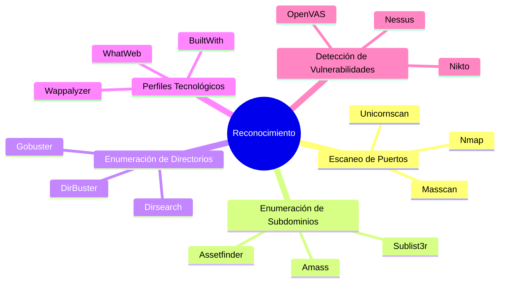
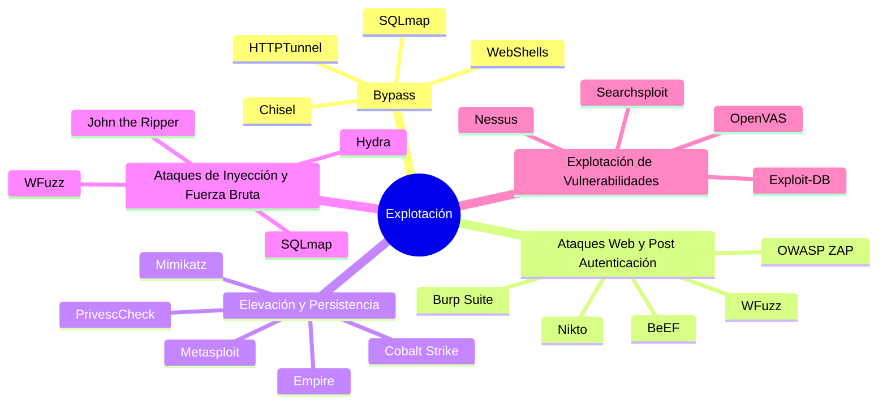
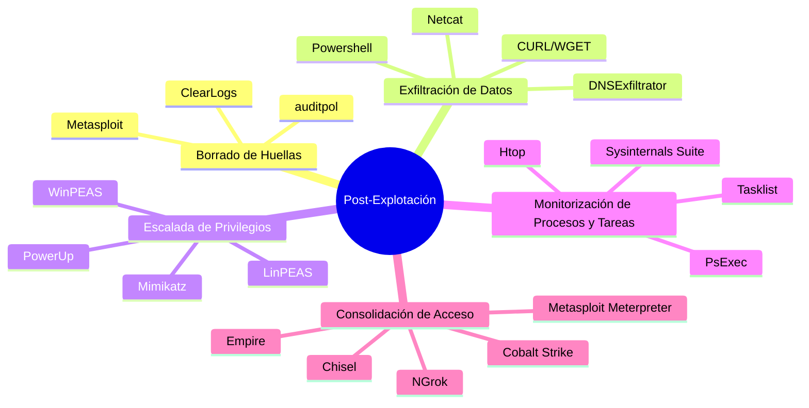

# Herramientas de hacking y sus aplicaciones

Lista de herramientas de hacking útiles para las distintas fases de reconocimiento, explotación y post-explotación.

## Herramientas de Hacking para la Fase de Reconocimiento

Lista de herramientas de hacking útiles para la fase de reconocimiento, organizadas por su aplicación principal. 

#### 1. Escaneo de Puertos
- **Nmap**: Escaneo de puertos y detección de servicios.
- **Masscan**: Escaneo de puertos a alta velocidad.
- **Unicornscan**: Herramienta avanzada para escaneo de puertos.

#### 2. Enumeración de Subdominios
- **Sublist3r**: Enumeración de subdominios utilizando múltiples motores de búsqueda.
- **Amass**: Herramienta de OSINT para la enumeración de subdominios y mapeo de redes externas.
- **Assetfinder**: Encuentra subdominios y activos relacionados.

#### 3. Enumeración de Directorios
- **DirBuster**: Fuerza bruta de directorios y archivos en servidores web.
- **Gobuster**: Enumeración rápida de directorios y archivos en servidores web.
- **Dirsearch**: Herramienta de fuerza bruta para encontrar directorios y archivos ocultos.

#### 4. Perfiles Tecnológicos
- **Wappalyzer**: Identificación de tecnologías web.
- **BuiltWith**: Análisis de tecnologías utilizadas en sitios web.
- **WhatWeb**: Identificación de tecnologías web a través de la exploración de sitios web.

#### 5. Detección de Vulnerabilidades
- **Nikto**: Escáner de vulnerabilidades en servidores web.
- **OpenVAS**: Solución completa de gestión de vulnerabilidades.
- **Nessus**: Escáner de vulnerabilidades ampliamente utilizado en la industria.

### Descripción de Herramientas

1. **Nmap**: Una herramienta de código abierto para escaneo de puertos, detección de servicios y sistemas operativos.
   - [Sitio web oficial](https://nmap.org/)
   - [Documentación](https://nmap.org/docs.html)
2. **Masscan**: Un escáner de puertos extremadamente rápido capaz de escanear toda una red en segundos.
   - [GitHub (Masscan)](https://github.com/robertdavidgraham/masscan)
3. **Unicornscan**: Una herramienta avanzada de recopilación de información y escaneo de puertos.
4. **Sublist3r**: Una herramienta que utiliza múltiples motores de búsqueda para encontrar subdominios de un dominio.
   - [GitHub (Sublist3r)](https://github.com/aboul3la/Sublist3r)
5. **Amass**: Una herramienta poderosa de OSINT para enumeración de subdominios, recolección de datos y mapeo de redes externas.
   - [GitHub (Amass)](https://github.com/OWASP/Amass)
6. **Assetfinder**: Encuentra subdominios y activos relacionados utilizando múltiples fuentes.
7. **DirBuster**: Fuerza bruta de directorios y archivos en servidores web para encontrar contenido oculto.
8. **Gobuster**: Herramienta rápida para enumeración de directorios y archivos en servidores web.
   - [GitHub (Gobuster)](https://github.com/OJ/gobuster)
9. **Dirsearch**: Otra herramienta eficiente para la fuerza bruta de directorios y archivos ocultos.
10. **Wappalyzer**: Extensión de navegador y herramienta de línea de comandos para identificar tecnologías web.
    - [Sitio web oficial](https://www.wappalyzer.com/)
11. **BuiltWith**: Servicio que proporciona información sobre las tecnologías utilizadas en un sitio web.
    - [Sitio web oficial](https://builtwith.com/)
12. **WhatWeb**: Una herramienta para identificar tecnologías web, CMS, bibliotecas JavaScript, servidores, etc.
13. **Nikto**: Escáner de servidores web que busca vulnerabilidades conocidas y problemas de configuración.
14. **OpenVAS**: Solución de código abierto para la gestión de vulnerabilidades que incluye un escáner y una interfaz de usuario.
    - [Sitio web oficial](https://www.openvas.org/)
15. **Nessus**: Escáner de vulnerabilidades conocido por su precisión y facilidad de uso, utilizado para evaluar vulnerabilidades en sistemas y redes.
    - [Sitio web oficial](https://www.tenable.com/products/nessus)
    - [Documentación](https://docs.tenable.com/nessus/)

## Herramientas de Hacking para la Fase de Explotación

Lista de herramientas de hacking útiles para la fase de explotación, organizadas por su aplicación principal. 

#### 1. Bypass
- **SQLmap**: Automatiza la detección y explotación de vulnerabilidades SQL Injection. Explotación Web.
- **HTTPTunnel**: Establece túneles HTTP para eludir restricciones de firewall.
- **WebShells**: Scripts que proporcionan acceso remoto a un servidor comprometido.
- **Chisel**: Una herramienta de túnel TCP/UDP que puede ayudar a evitar restricciones de red.

#### 2. Ataques Web y Post Autenticación
- **Burp Suite**: Plataforma para pruebas de seguridad en aplicaciones web. Explotación Web.
- **OWASP ZAP**: Herramienta para encontrar vulnerabilidades en aplicaciones web. Explotación Web.
- **BeEF (Browser Exploitation Framework)**: Herramienta para explotar vulnerabilidades en navegadores web.
- **Nikto**: Escáner de vulnerabilidades en servidores web.
- **WFuzz**: Fuerza bruta para encontrar recursos ocultos en aplicaciones web.

#### 3. Elevación y Persistencia
- **Metasploit**: Framework para desarrollo y ejecución de exploits.
- **Empire**: Framework de post-explotación para Windows y Unix.
- **Mimikatz**: Herramienta para extraer credenciales y realizar movimientos laterales en Windows.
- **Cobalt Strike**: Herramienta comercial para simulación de ataques y post-explotación.
- **PrivescCheck**: Script para verificar posibles vulnerabilidades de elevación de privilegios en Windows.

#### 4. Ataques de Inyección y Fuerza Bruta
- **SQLmap**: Detección y explotación de vulnerabilidades SQL Injection.
- **Hydra**: Herramienta para realizar ataques de fuerza bruta contra servicios de autenticación.
- **John the Ripper**: Herramienta para crackear contraseñas.
- **WFuzz**: Fuerza bruta para inyecciones SQL, LFI, RFI, XSS, y más.

#### 5. Explotación de Vulnerabilidades
- **Nessus**: Escáner de vulnerabilidades ampliamente utilizado en la industria.
- **OpenVAS**: Solución completa de gestión de vulnerabilidades.
- **Exploit-DB**: Base de datos de exploits y pruebas de penetración.
- **Searchsploit**: Interfaz de línea de comandos para Exploit-DB.
- **Metasploit**: Framework para desarrollo y ejecución de exploits.
- **BeEF (Browser Exploitation Framework)**: Herramienta para explotar vulnerabilidades en navegadores web.
- **Canvas**: Plataforma de pruebas de penetración y explotación.

#### 6. Ingeniería Social
   - **Social-Engineer Toolkit (SET)**: Herramienta para realizar ataques de ingeniería social.
   - **Maltego**: Herramienta de recopilación de información y análisis de relaciones.

#### 7. Explotación de Redes

- **Aircrack-ng**: Conjunto de herramientas para evaluar la seguridad de redes Wi-Fi.
- **Responder**: Herramienta para capturar credenciales en redes Windows.
- **Ettercap**: Herramienta para ataques Man-in-the-Middle en redes LAN.

### Descripción de Herramientas

1. **SQLmap**: Automatiza la detección y explotación de vulnerabilidades SQL Injection.
   - [Sitio web oficial](http://sqlmap.org/)
   - [GitHub (SQLmap)](https://github.com/sqlmapproject/sqlmap)
2. **HTTPTunnel**: Establece túneles HTTP para eludir restricciones de firewall.
   - [Sitio web oficial](http://www.nocrew.org/software/httptunnel.html)
3. **WebShells**: Scripts que proporcionan acceso remoto a un servidor comprometido.
   - [GitHub (WebShells)](https://github.com/tennc/webshell)
4. **Chisel**: Una herramienta de túnel TCP/UDP que puede ayudar a evitar restricciones de red.
   - [GitHub (Chisel)](https://github.com/jpillora/chisel)
5. **Burp Suite**: Plataforma integral para pruebas de seguridad en aplicaciones web.
   - [Sitio web oficial](https://portswigger.net/burp)
6. **OWASP ZAP**: Herramienta gratuita para encontrar vulnerabilidades en aplicaciones web.
   - [Sitio web oficial](https://www.zaproxy.org/)
7. **BeEF**: Herramienta para explotar vulnerabilidades en navegadores web.
   - [GitHub (BeEF)](https://github.com/beefproject/beef)
8. **Nikto**: Escáner de vulnerabilidades en servidores web.
   - [GitHub (Nikto)](https://github.com/sullo/nikto)
9. **WFuzz**: Fuerza bruta para encontrar recursos ocultos en aplicaciones web y realizar ataques de inyección.
   - [GitHub (WFuzz)](https://github.com/xmendez/wfuzz)
10. **Metasploit**: Framework para desarrollo y ejecución de exploits, ampliamente utilizado en pruebas de penetración.
    - [Sitio web oficial](https://www.metasploit.com/)
    - [Documentación](https://docs.rapid7.com/metasploit/)
11. **Empire**: Framework de post-explotación que incluye módulos para Windows y Unix.
    - [GitHub (Empire)](https://github.com/BC-SECURITY/Empire)
12. **Mimikatz**: Herramienta para extraer credenciales y realizar movimientos laterales en Windows.
    - [GitHub (Mimikatz)](https://github.com/gentilkiwi/mimikatz)
13. **Cobalt Strike**: Herramienta comercial para simulación de ataques y post-explotación.
    - [Sitio web oficial](https://www.cobaltstrike.com/)
14. **PrivescCheck**: Script para verificar posibles vulnerabilidades de elevación de privilegios en Windows.
    - [GitHub (PrivescCheck)](https://github.com/itm4n/PrivescCheck)
15. **Hydra**: Herramienta para realizar ataques de fuerza bruta contra servicios de autenticación.
    - [GitHub (Hydra)](https://github.com/vanhauser-thc/thc-hydra)
16. **John the Ripper**: Herramienta para crackear contraseñas.
    - [Sitio web oficial](https://www.openwall.com/john/)
    - [GitHub (John the Ripper)](https://github.com/openwall/john)
17. **Nessus**: Escáner de vulnerabilidades conocido por su precisión y facilidad de uso.
    - [Sitio web oficial](https://www.tenable.com/products/nessus)
    - [Documentación](https://docs.tenable.com/nessus/)
18. **OpenVAS**: Solución de código abierto para la gestión de vulnerabilidades que incluye un escáner y una interfaz de usuario.
    - [Sitio web oficial](https://www.openvas.org/)
19. **Exploit-DB**: Base de datos de exploits y pruebas de penetración, mantenida por Offensive Security.
    - [Sitio web oficial](https://www.exploit-db.com/)
20. **Searchsploit**: Interfaz de línea de comandos para Exploit-DB que permite buscar y copiar exploits fácilmente.
    - [GitHub (Searchsploit)](https://github.com/offensive-security/exploitdb)

## Herramientas de Hacking para la Fase de Post-Explotación

Lista de herramientas de hacking útiles para la fase de post-explotación, organizadas por su aplicación principal. 

#### 1. Borrado de Huellas

- **Metasploit**: Módulos para limpiar logs y eliminar huellas.
- **ClearLogs**: Script para eliminar registros de eventos en sistemas Windows.
- **auditpol**: Utilidad de Windows para desactivar auditorías.

#### 2. Exfiltración de Datos
- **Netcat (nc)**: Herramienta para transferir datos a través de la red.
- **Powershell**: Utilizado para transferir datos de manera encubierta.
- **CURL/WGET**: Utilidades para descargar y subir archivos desde la línea de comandos.
- **DNSExfiltrator**: Herramienta para exfiltración de datos mediante DNS.

#### 3. Escalada de Privilegios
- **Mimikatz**: Herramienta para extraer credenciales y elevar privilegios en Windows.
- **WinPEAS**: Script para buscar posibles vectores de escalada de privilegios en Windows.
- **LinPEAS**: Script para buscar posibles vectores de escalada de privilegios en Linux.
- **PowerUp**: Módulo de PowerShell para identificar y explotar problemas de escalada de privilegios en Windows.

#### 4. Monitorización de Procesos y Tareas
- **PsExec**: Herramienta para ejecutar procesos de forma remota.
- **Tasklist**: Comando de Windows para listar procesos en ejecución.
- **Sysinternals Suite**: Conjunto de utilidades avanzadas para la administración y monitorización de sistemas Windows.
- **Htop**: Monitor interactivo de procesos para sistemas Unix.

#### 5. Consolidación de Acceso
- **Empire**: Framework de post-explotación Windows y Unix para mantener acceso en sistemas comprometidos.
- **Cobalt Strike**: Plataforma comercial para simulación de ataques, consolidación de acceso y post-explotación.
- **Metasploit Meterpreter**: Payload avanzado para mantener acceso persistente y post-explotación.
- **NGrok**: Herramienta para exponer servidores locales a internet de forma segura.
- **Chisel**: Túnel TCP/UDP para establecer acceso persistente.

### Descripción de Herramientas

1. **Metasploit**: Framework para desarrollo y ejecución de exploits, con módulos para borrar huellas y mantener acceso.
   - [Sitio web oficial](https://www.metasploit.com/)
   - [Documentación](https://docs.rapid7.com/metasploit/)
2. **ClearLogs**: Script que limpia los registros de eventos en sistemas Windows.
   - [GitHub (ClearLogs)](https://github.com/mubix/clearev)
3. **auditpol**: Utilidad de Windows para desactivar la auditoría de eventos.
   - [Documentación de Microsoft](https://docs.microsoft.com/en-us/windows-server/administration/windows-commands/auditpol)
4. **Netcat (nc)**: Herramienta versátil para transferir datos a través de la red.
   - [Documentación](http://netcat.sourceforge.net/)
5. **Powershell**: Utilizada para la automatización y transferencia encubierta de datos en sistemas Windows.
   - [Documentación de Microsoft](https://docs.microsoft.com/en-us/powershell/)
6. **CURL/WGET**: Utilidades de línea de comandos para descargar y subir archivos desde y hacia servidores web.
   - [CURL sitio web oficial](https://curl.se/)
   - [CURL documentación](https://curl.se/docs/)
   - [WGET sitio web oficial](https://www.gnu.org/software/wget/)
   - [WGET documentación](https://www.gnu.org/software/wget/manual/wget.html)
7. **DNSExfiltrator**: Herramienta para la exfiltración de datos a través de peticiones DNS.
   - [GitHub (DNSExfiltrator)](https://github.com/Arno0x/DNSExfiltrator)
8. **Mimikatz**: Herramienta para extraer credenciales y realizar escalada de privilegios en sistemas Windows.
   - [GitHub (Mimikatz)](https://github.com/gentilkiwi/mimikatz)
9. **WinPEAS**: Script que busca posibles vectores de escalada de privilegios en sistemas Windows.
   - [GitHub (WinPEAS)](https://github.com/carlospolop/PEASS-ng/tree/master/winPEAS)
10. **LinPEAS**: Script que busca posibles vectores de escalada de privilegios en sistemas Linux.
    - [GitHub (LinPEAS)](https://github.com/carlospolop/PEASS-ng/tree/master/linPEAS)
11. **PowerUp**: Módulo de PowerShell para identificar y explotar problemas de escalada de privilegios en sistemas Windows.
    - [GitHub (PowerUp)](https://github.com/PowerShellMafia/PowerSploit/tree/master/Privesc)
12. **PsExec**: Herramienta para ejecutar procesos de forma remota en sistemas Windows.
    - [Documentación de Microsoft](https://docs.microsoft.com/en-us/sysinternals/downloads/psexec)
13. **Tasklist**: Comando de Windows para listar procesos en ejecución.
    - [Documentación de Microsoft](https://docs.microsoft.com/en-us/windows-server/administration/windows-commands/tasklist)
14. **Sysinternals Suite**: Conjunto de utilidades avanzadas para la administración y monitorización de sistemas Windows.
    - [Sitio web oficial](https://docs.microsoft.com/en-us/sysinternals/downloads/sysinternals-suite)
15. **Htop**: Monitor interactivo de procesos para sistemas Unix.
    - [Sitio web oficial](https://htop.dev/)
16. **Empire**: Framework de post-explotación que incluye módulos para Windows y Unix, utilizado para mantener acceso en sistemas comprometidos.
    - [GitHub (Empire)](https://github.com/BC-SECURITY/Empire)
17. **Cobalt Strike**: Plataforma comercial para simulación de ataques y consolidación de acceso en sistemas comprometidos.
    - [Sitio web oficial](https://www.cobaltstrike.com/)
18. **Metasploit Meterpreter**: Payload avanzado dentro del framework Metasploit para la post-explotación y mantener acceso persistente.
    - [Documentación de Metasploit](https://docs.rapid7.com/metasploit/meterpreter/)
19. **NGrok**: Herramienta para exponer servidores locales a internet de forma segura.
    - [Sitio web oficial](https://ngrok.com/)
20. **Chisel**: Túnel TCP/UDP que permite establecer acceso persistente en redes restringidas.
    - [GitHub (Chisel)](https://github.com/jpillora/chisel)

### …

## Recursos para practicar hacking

- https://overthewire.org/wargames/
- https://tryhackme.com/
- https://affiliate.hackthebox.com/rinku
- https://www.vulnhub.com/
- https://vulnyx.com/

---

COIRO XUL.2024
