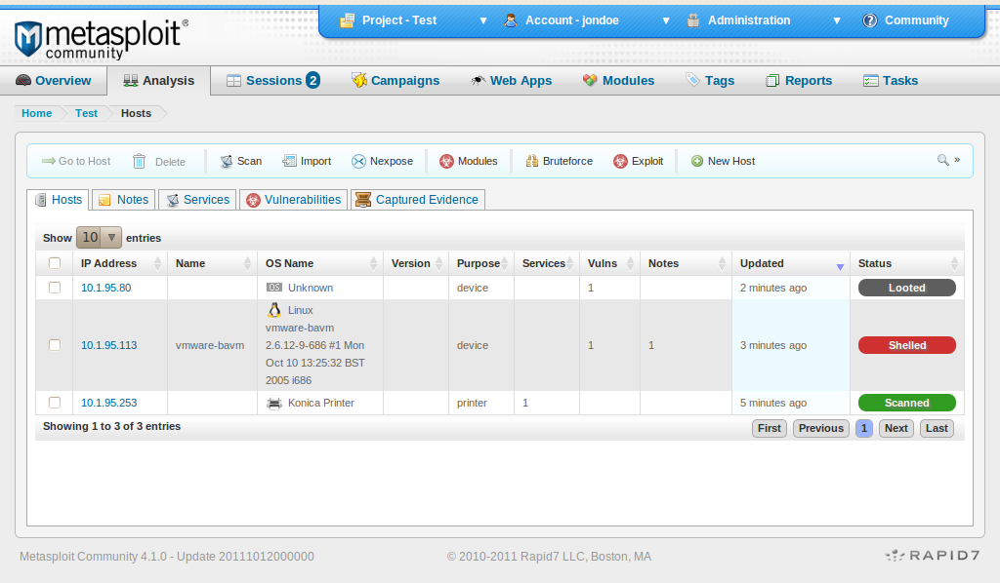

# Metasploit

> El objetivo del hacking ético es encontrar [vulnerabilidades](https://www.upguard.com/blog/vulnerability) en los sistemas y la infraestructura antes de que sean descubiertas y explotadas por los ciberatacantes. Esto implica una gran variedad de subdisciplinas de seguridad, desde la ingeniería social hasta el manejo [de malware](https://www.upguard.com/blog/malware) y [las pruebas de penetración (pen testing)](https://www.upguard.com/blog/penetration-testing). Metasploit y Nmap son dos herramientas que entran en esta última categoría.

El marco de pruebas de penetración Metasploit es parte del Proyecto Metasploit, un proyecto de seguridad cibernética de código abierto que tiene como objetivo proporcionar un recurso de información pública para descubrir vulnerabilidades y exploits de seguridad . Desarrollada en 2003 por el experto en seguridad HD Moore, la herramienta ha evolucionado desde una herramienta de red portátil basada en Perl a una plataforma basada en Ruby para desarrollar/probar y utilizar código de exploit. El proveedor de seguridad Rapid7 adquirió Metasploit en 2007 y continúa administrando y manteniendo la solución hasta el día de hoy.

La versión gratuita y limitada de [Metasploit framework](http://www.metasploit.com/) Community es una herramienta que permite ejecutar y desarrollar *exploits* contra sistemas objetivos. Actualmente se encuentra integrado con [Kali Linux](http://www.kali.org/), una distribución de Linux con diversas herramientas orientadas a la seguridad y es ampliamente utilizado para realizar pruebas de penetración. En la revista anterior mencionamos algunas de las [herramientas más importantes para adentrarse en el mundo de las pruebas de penetración](http://blogs.eset-la.com/laboratorio/2013/07/29/pruebas-de-penetracion-para-principiantes-5-herramientas-para-empezar/). Ahora, utilizaremos Metasploit para mostrar paso a paso la explotación de un servidor vulnerable.

**¿Qué etapas se contemplan durante una prueba de penetración?**

Para realizar una [prueba de penetración es necesario considerar diferentes etapas](http://blogs.eset-la.com/laboratorio/2012/07/24/penetration-test-en-que-consiste/). La primera de ellas consiste en recopilar información sobre el sistema objetivo y comúnmente se le conoce como etapa de reconocimiento. A partir de los datos obtenidos, se tomarán las decisiones acordes y los pasos a seguir en etapas posteriores. Una vez que los datos han sido recopilados y analizados, se procede a la instancia donde se realizará la explotación sobre el sistema objetivo. La selección de los *exploits* que se utilizarán dependerá exclusivamente de la información obtenida en la etapa anterior. Finalmente, una vez realizado el ataque, se analiza el impacto, posiblemente, se realizarán nuevas acciones a partir de este último.

La documentación y la generación de reportes concluyen las pruebas de penetración y suelen reflejar el trabajo completo por parte del *pentester* (persona que lleva a cabo la prueba de penetración).

Existen diferentes metodologías que pueden implementarse para realizar pruebas de penetración, donde cada una de las variantes difiere principalmente en las técnicas y métodos para llevar a cabo las respectivas tareas. Algunas metodologías son del tipo *blackbox*, donde básicamente no se conoce ningún tipo de información sobre el sistema objetivo. En contraposición, están las de *whitebox*, donde se tiene información sobre el sistema objetivo, como puede ser código fuente de aplicaciones, configuraciones, entre otras alternativas. A su vez, existen diferentes etapas de acuerdo a la metodología utilizada.

En este caso, sin realizar distinción de la metodología, haremos foco sobre la etapa de reconocimiento. Dentro de ésta existen dos formas de recopilar la información, ya sea de forma activa o pasiva. En el primer caso la información se obtiene directamente del sistema objetivo y en el segundo de forma indirecta. Finalmente ejecutaremos la etapa de explotación, ya que nos permitirá obtener un panorama general de lo que realmente involucra una prueba de penetración. Asimismo, un análisis completo involucra otras etapas, tales como la de enumeración, acceso, entre otras.

**¿Cómo comenzar?**

Para que los lectores puedan hacer el ataque paso a paso deberían instalar dos máquinas virtuales conectadas entre sí. Para ello es posible utilizar VMWare o en su defecto VirtualBox, en realidad existen otras alternativas, aunque estas dos son las más populares. Las dos máquinas virtuales que deben instalarse son las siguientes:

- Kali Linux: como mencionábamos en el número anterior de la revista, es la distribución para pruebas de penetración por excelencia bajo la licencia GPL, se puede descargar desde:
  http://www.kali.org/
- Metasploitable 2: es una máquina creada con fines académicos, que ya posee varias vulnerabilidades que permiten que sea sencillo realizar pruebas sobre la misma, se puede descargar desde:
  http://sourceforge.net/projects/metasploitable/files/Metasploitable2/

Para continuar, es importante verificar que ambas máquinas tengan visibilidad entre sí (es decir, que puedan comunicarse). Esto puede corroborarse con un simple ping entre las dos.

Después, desde la máquina en Kali Linux (todo el ejercicio se desarrolla en esta máquina, la segunda solo oficia como objetivo del ataque, pero no se realizarán acciones en ésta más allá de prenderla para “atacarla”) utilizaremos la consola de Metasploit (*msfconsole*) de donde se lanzarán todos los comandos correspondientes sobre el servidor en el que se desea realizar la prueba de penetración. Para abrir la consola, solo hace falta el comando

```
> msfconsole
```

**Information gathering**

Para recopilar información es posible utilizar [Nmap](http://nmap.org/) desde la propia consola de Metasploit. Para ello, basta con solo invocar el comando “db_nmap*”*. Los parámetros que pueden utilizarse son los mismos que acepta Nmap. De esta manera, los resultados serán almacenados en la base de datos de Metasploit.

Para obtener una observación rápida del sistema objetivo, se ingresa el siguiente comando:

```
> db_nmap {dirección ip} -p 1-65535
```

La dirección IP de la máquina objetivo es posible averiguarla mediante el comando *ifconfig* (este comando se utiliza en las distribuciones de Linux para conocer las direcciones IP de las diferentes interfaces de red).


Con el comando anterior se realiza un escaneo sobre todos los puertos del sistema objetivo. De esta manera, tal como se especificó anteriormente, los resultados serán almacenados en la base de datos. Para consultarlos, es necesario ingresar alguno de los siguientes comandos:

·  Hosts*:* Imprime por pantalla información de todos los sistemas que fueron analizados.

·  Services*:* Imprime por pantalla todos los puertos y servicios asociados que fueron descubiertos durante el análisis con Nmap.

·  Vulns*:* Describe las vulnerabilidades que fueron descubiertas durante el análisis.

Sin embargo, en esta instancia es posible que no se cuente con demasiada información sobre los servicios descubiertos en el sistema objetivo. De esta manera, utilizando la misma herramienta (Nmap) es posible determinar, por ejemplo, la versión específica de un servicio. Esto se puede lograr mediante el siguiente comando:

```
> db_nmap –sV {dirección ip} –p {puerto de interés}
```

El parámetro “*sV”* indica que examine la versión específica del servicio. A modo de ejemplo, ejecutamos el siguiente comando para averiguar la versión sobre el servicio que se está ejecutando en el puerto 21, utilizado comúnmente por el servicio FTP.

```
> db_nmap –sV 172.16.1.119 –p 21
```

Si ahora se ejecuta el comando “services”, nuevamente, se obtendrá información específica del servicio analizado.


**Explotación**

Suponiendo que se ha encontrado información de un servicio en especial, es posible determinar a partir de ésta, si el mismo es vulnerable. Utilizando la consola, se realiza una búsqueda de un *exploit* en particular para ese servicio y luego se llevará a cabo la explotación del mismo. Para realizar la búsqueda se ingresa el siguiente comando:

```
> search {cadena}
 (para buscar una cadena específica que corresponda a un exploit en particular)

> search cve:{código CVE}
 (para buscar un exploit en particular a partir del identificador CVE)
```

Asimismo, si se desea conocer todos los posibles parámetros de búsqueda, es posible acceder a la ayuda mediante el siguiente comando:

```
> help search
```

Tal como se muestra en el comando anterior, si se conociera el identificador OSVDB de una vulnerabilidad, entonces será posible buscar el *exploit* para dicho identificador. Esto también puede llevarse a cabo utilizando otros identificadores, como por ejemplo, el CVE.

.png)

Para seleccionar el *exploit* se introduce el comando “*use”* seguido de la ruta del *exploit* seleccionado. En este caso el comando sería el siguiente:

```
> use exploit/unix/ftp/vsftpd_234_backdoor
```

Una vez seleccionado el *exploit* que se va a utilizar, se deben configurar aquellos parámetros necesarios a través de la consola. Para ver las opciones, se debe ingresar el comando “*show options”*, el cual enumera todos los parámetros indicando si son opcionales u obligatorios mediante el campo *“required”.*

.png)

En esta instancia, ya es posible configurar los parámetros. Para realizar esta tarea se debe utilizar el comando “*set”* seguido del parámetro y el valor que se desea establecer. Para este ejemplo, el comando es el siguiente:

```
> set RHOST 172.16.1.119
```

**Payload**

Básicamente, el *payload* es la secuencia de instrucciones que se ejecutarán una vez que se haya explotado con éxito la vulnerabilidad. Metasploit Framework posee diversos *payloads* con diferentes funcionalidades para cada tipo de arquitectura. Mediante el comando “*show payloads”* se pueden visualizar cuáles son compatibles. De esta forma, se utiliza el siguiente comando para establecer el *payload*:

.png)

En este caso hemos elegido el *payload cmd/unix/interact.* Sin embargo, para conocer todos los *payloads* que son compatibles con el *exploit* que se va a utilizar, existe un comando para realizar el listado correspondiente:

```
> show payloads
```

De la misma manera, si se desea conocer cuáles son los parámetros configurables del *payload* seleccionado, es posible ejecutar el comando:

```
> show options
```

Luego de que todos los parámetros ya han sido configurados, será posible llevar a cabo la explotación. Para ello, basta con ejecutar el comando *“exploit”* y esperar que Metasploit haga su trabajo.

En esta instancia, si todo ha resultado bien, se obtiene una *shell* de comandos sobre el sistema que ha sido atacado, permitiendo ejecutar cualquier comando en dicho sistema. Por ejemplo, a continuación se puede observar un comando de listado de directorios:

.png)

**Conclusión**

En este caso se obtuvo acceso a un servidor a través de un servicio FTP vulnerable. Mediante la identificación de la versión del servicio se pudo encontrar el *exploit* adecuado. De la misma manera, se inyectó un *payload* capaz de disponer una *shell* de comandos a merced del atacante.

Si bien este es un ejemplo específico, donde el acceso se logró a través de una vulnerabilidad conocida por una versión antigua del software Vsftpd, también es posible que esto ocurra en un escenario real. Asimismo, los ataques reales pueden ser más complejos o combinados. Sin embargo, esto es un buen comienzo para tener noción sobre cómo se realizan ataques con Metasploit.

Finalmente, vale la pena destacar que no existe una herramienta capaz de ejecutar automáticamente una prueba de penetración de calidad. El auditor, es decir, quien realiza las pruebas de penetración (*pentester*), siempre debe recurrir al uso de su imaginación y conocimiento, cualidades que pondrán a su disposición una gama de herramientas que le permitirán ejecutar una prueba precisa y contundente sobre el sistema para obtener resultados de calidad.




*La interfaz gráfica de usuario de la comunidad Metasploit. Fuente: Wikimedia Commons.*

*[Plugins](https://github.com/rapid7/metasploit-framework/tree/master/plugins)*
