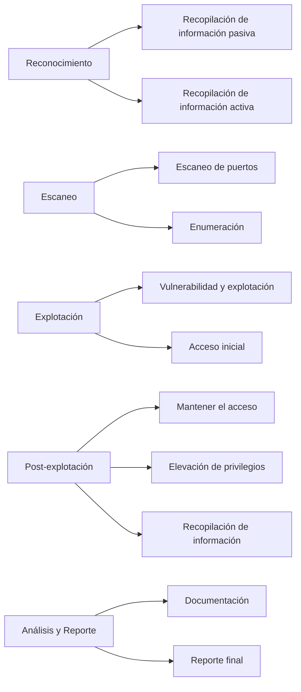

# Laboratorio Hacking Ético

> Entender y practicar la metodología de ataque utilizando Kali Linux y Metasploit en un entorno controlado de laboratorio.

La metodología de ataque en un laboratorio con máquinas virtuales que utilizan Kali Linux y Metasploit generalmente sigue un flujo estructurado para identificar, explotar y documentar vulnerabilidades. Aquí te proporciono un esquema de alto nivel de este proceso y enlaces para ampliar la información.

### Metodología de Ataque

1. **Reconocimiento**
   - **Recopilación de información pasiva**: Obtener información sin interactuar directamente con el objetivo (ej. WHOIS, búsqueda en Google).
   - **Recopilación de información activa**: Interactuar directamente con el objetivo para obtener más detalles (ej. escaneo de puertos).

2. **Escaneo**
   - **Escaneo de puertos**: Identificar puertos abiertos y servicios en ejecución (ej. Nmap).
   - **Enumeración**: Obtener detalles adicionales sobre los servicios descubiertos (ej. versiones de software, usuarios).

3. **Explotación**
   - **Vulnerabilidad y explotación**: Usar exploits para aprovechar vulnerabilidades en el sistema objetivo (ej. Metasploit Framework).
   - **Acceso inicial**: Obtener acceso inicial al sistema objetivo (shell inversa, meterpreter).

4. **Post-explotación**
   - **Mantener el acceso**: Implementar métodos para mantener el acceso (ej. crear cuentas de usuario, instalar backdoors).
   - **Elevación de privilegios**: Intentar obtener mayores privilegios (ej. root).
   - **Recopilación de información**: Extraer información valiosa del sistema comprometido.

5. **Análisis y Reporte**
   - **Documentación**: Registrar cada paso del ataque, herramientas usadas y resultados obtenidos.
   - **Reporte final**: Crear un reporte detallado con las vulnerabilidades encontradas y recomendaciones para mitigarlas.

### Esquema

### Enlaces para Ampliar Información

1. **Kali Linux Official Documentation**
   - [Kali Linux Documentation](https://www.kali.org/docs/)

2. **Metasploit Framework Documentation**
   - [Metasploit Unleashed](https://www.offensive-security.com/metasploit-unleashed/)

3. **Nmap Official Documentation**
   - [Nmap Documentation](https://nmap.org/book/man.html)

4. **OWASP Testing Guide**
   - [OWASP Testing Guide](https://owasp.org/www-project-web-security-testing-guide/)

5. **CEH (Certified Ethical Hacker) Resources**
   - [CEH Resources](https://www.eccouncil.org/programs/certified-ethical-hacker-ceh/)

6. **Online Cyber Security Labs**
   - [Hack The Box](https://www.hackthebox.eu/)
   - [TryHackMe](https://tryhackme.com/)

Aquí tienes un esquema en Mermaid que representa un árbol de directorios típico de un sistema Linux. Este árbol muestra algunas de las carpetas y archivos más comunes en la raíz (`/`) del sistema de archivos.

### Esquema del Árbol de Directorios y Archivos de Linux en Mermaid

```mermaid
graph TD

    root[ / ]
    root --> bin[ /bin]
    root --> boot[ /boot]
    root --> dev[ /dev]
    root --> etc[ /etc]
    etc --> etc_passwd[passwd]
    etc --> etc_group[group]
    etc --> etc_shadow[shadow]
    etc --> etc_fstab[fstab]
    etc --> etc_hosts[hosts]
    root --> home[ /home]
    home --> user1[user1]
    home --> user2[user2]
    root --> lib[ /lib]
    root --> lib64[ /lib64]
    root --> media[ /media]
    media --> cdrom[cdrom]
    root --> mnt[ /mnt]
    root --> opt[ /opt]
    root --> proc[ /proc]
    root --> root[ /root]
    root --> run[ /run]
    root --> sbin[ /sbin]
    root --> srv[ /srv]
    root --> sys[ /sys]
    root --> tmp[ /tmp]
    root --> usr[ /usr]
    usr --> usr_bin[bin]
    usr --> usr_sbin[sbin]
    usr --> usr_lib[lib]
    usr --> usr_share[share]
    root --> var[ /var]
    var --> var_log[log]
    var --> var_tmp[tmp]
```

Este esquema muestra las principales carpetas del sistema y algunos archivos clave dentro de `etc`. Aquí hay una breve descripción de algunas de estas carpetas y archivos:

- `/bin`: Contiene comandos binarios esenciales para todos los usuarios.
- `/boot`: Contiene los archivos necesarios para arrancar el sistema.
- `/dev`: Contiene archivos de dispositivos.
- `/etc`: Contiene archivos de configuración del sistema.
  - `passwd`: Archivo de contraseñas de usuarios.
  - `group`: Archivo de grupos de usuarios.
  - `shadow`: Contiene contraseñas cifradas y otra información de cuenta.
  - `fstab`: Archivo de tablas de sistemas de archivos.
  - `hosts`: Archivo de nombres de host.
- `/home`: Directorios personales de los usuarios.
- `/lib` y `/lib64`: Contienen bibliotecas compartidas esenciales.
- `/media`: Puntos de montaje para medios extraíbles.
- `/mnt`: Punto de montaje para sistemas de archivos temporales.
- `/opt`: Contiene paquetes de software opcionales.
- `/proc`: Sistema de archivos virtual que proporciona información sobre el sistema y los procesos.
- `/root`: Directorio personal del usuario root.
- `/run`: Información sobre el sistema desde el último arranque.
- `/sbin`: Contiene comandos binarios esenciales para el superusuario.
- `/srv`: Contiene datos para servicios proporcionados por el sistema.
- `/sys`: Sistema de archivos virtual que proporciona información sobre el kernel y los dispositivos.
- `/tmp`: Archivos temporales.
- `/usr`: Jerarquía secundaria de archivos de usuario.
  - `bin`: Comandos binarios de usuarios.
  - `sbin`: Comandos binarios de superusuario.
  - `lib`: Bibliotecas compartidas.
  - `share`: Archivos compartidos y datos independientes de la arquitectura.
- `/var`: Datos variables, como logs y archivos temporales.
  - `log`: Archivos de registro.
  - `tmp`: Archivos temporales.

Este esquema proporciona una visión general de la estructura del sistema de archivos en Linux, lo cual es útil para entender dónde se encuentran los diferentes archivos y directorios en el sistema.