# Recon-NG

El reconocimiento es el primer paso en el pentesting. No solo eso, es el paso en el que tendremos que pasar la mayor parte de nuestro tiempo. Hay una serie de herramientas que nos ayudan en esta tarea. En este cuento voy a hablar de Recon-NG

Recon-NG es una herramienta de código abierto para facilitar nuestra tarea de recopilación de información. En este breve tutorial demostraré cómo usarlo.

Del [repositorio de Gihub de Tim Tomes](https://github.com/lanmaster53/recon-ng): *"Recon-NG es un marco de reconocimiento web con todas las funciones escrito en Python. Completo con módulos independientes, interacción con la base de datos, funciones de conveniencia integradas, ayuda interactiva y finalización de comandos"*.

## Instalar

Si estás usando Kali Linux, y estás pensando en hacer pentesting es recomendable que instales Recon-NG, si aún no está instalado de forma predeterminada.

Las principales distribuciones de Linux tienen Recon-NG en sus repositorios. Si está basado en Debian, debería haber un paquete DEB. Si está basado en Red Hat, busca un RPM. Si estás utilizando Arch o cualquier otra cosa, siempre puedes construirlo desde el [código fuente](https://github.com/lanmaster53/recon-ng).

Para comenzar, abre una terminal y accede a Recon-ng en modo consola, escribiendo el siguiente comando:

> $ `recon-ng`

Ignora las líneas rojas (de eso hablaremos más adelante).

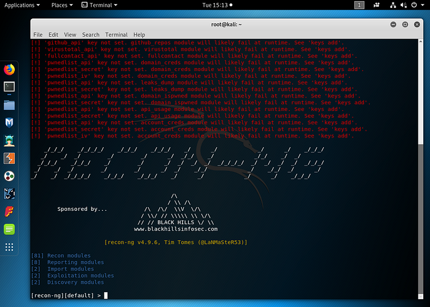

## Espacios de trabajo - workspaces

Recon-NG utiliza *espacios de trabajo* para ayudar a organizar la información recopilada de acuerdo con nuestro flujo de trabajo. El comando es ``workspaces`` y sus opciones son listar, agregar, seleccionar y eliminar.

### Agregar espacio de trabajo

Vamos a hacer un poco de reconocimiento en el medio. Primero crearemos un espacio de trabajo 'medium' y el dominio 'medium.com'.

> \> ``workspace add medium``
>
> \> ``add domains medium.com``
>
> \> ``show domains``

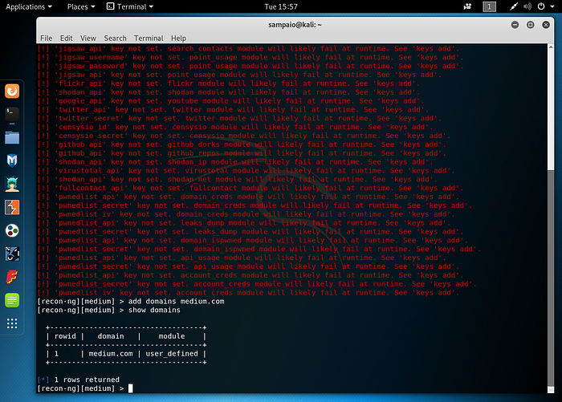

### Enumerar espacios de trabajo

La opción ``list`` muestra los espacios de trabajo disponibles creados en Recon-NG:

> \> `workspace list`

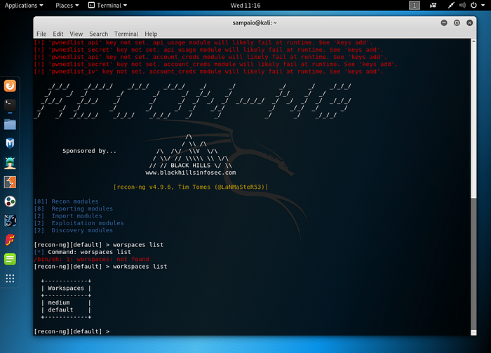

### Seleccionar espacio de trabajo

Para navegar al espacio de trabajo predeterminado, simplemente escribe el comando:

> \> `workspace select default`

Observe el cambio en los corchetes de ``[medium]`` a ``[default]``.

### Eliminar espacio de trabajo

Para eliminar un espacio de trabajo, simplemente escribe:

> \> `workspaces delete medium`

## Claves de API

Recon-NG dispone de una arquitectura modular y algunos de sus módulos requieren una clave API. Puedes comenzar por ver las claves disponibles e instaladas:

> \> `keys list`

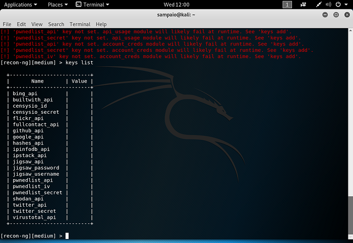

Para adquirir claves API, ve a la URL respectiva y crea una cuenta. Puedes utilizar la [siguiente página](https://github.com/lanmaster53/recon-ng-marketplace/wiki/API-Keys). Algunos módulos son más interesantes que otros. Puedes empezar por algunos como Builtin, Google, IPInfoDB y Shodan.

Una vez que tengas tu clave, sólo tienes que añadirla con el siguiente comando

> \> ``keys add module_name API_Key``
>
> \> ``exit``
>
> $ ``recon-ng``

Notarás que la lista de errores se acorta al iniciar Recon-NG.

## Dominios

Vamos a hacer un reconocimiento de la red de Medium. Nuestra primera tarea será crear un espacio de trabajo dedicado a la información recopilada. Recuerda que es fácil recopilar datos, pero es crucial mantenerlos organizados. Agreguemos 'medium.com' a la lista de dominios:

> \> `add domains medium.com`
>
> \> `show domains`

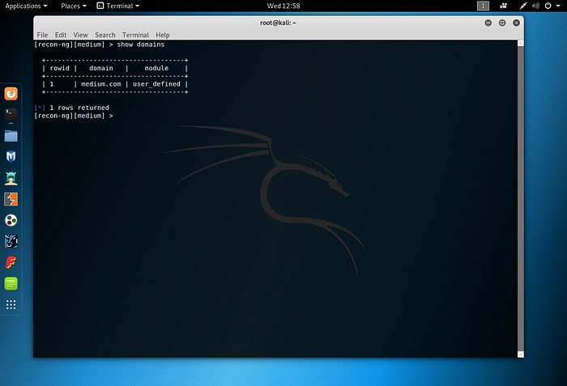

Ahora tenemos 'medium.com' en nuestra base de datos. Busquemos sus hosts.

## Hosts

Comenzaremos usando el enumerador de nombres de host de Google:

> \> `use recon/domains-host/google_site_web`
>
> \> `run`

Vamos a mostrar nuestros hallazgos ejecutando '`show hosts`':

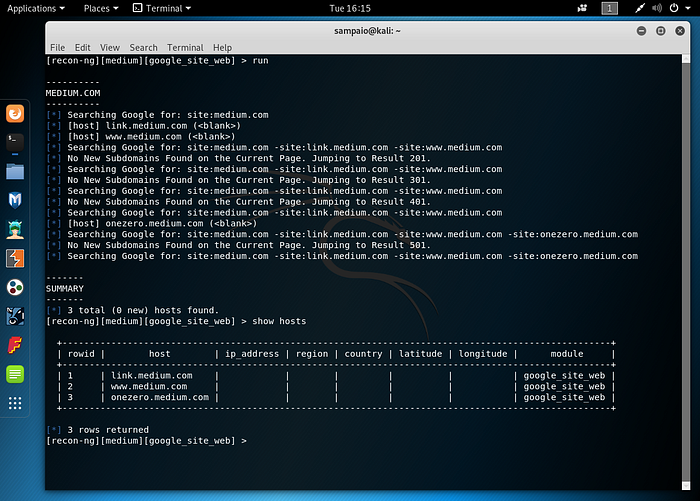

Profundicemos en el objetivo de nuestro dominio y usemos el módulo 'findsubdomains':

> \> `back`
>
> \> ``use recon/domains-host/findsubdomains``
>
> \> `show info`

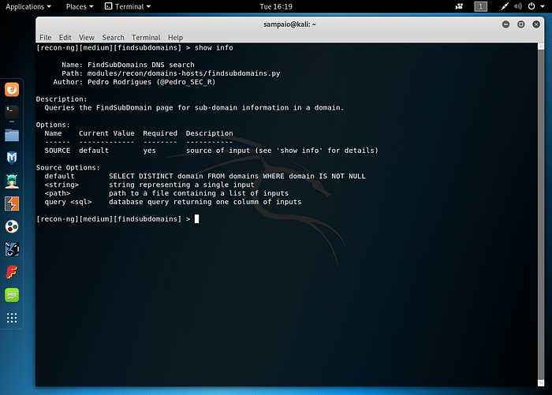

> \> `run`
>
> \> ``show hosts``

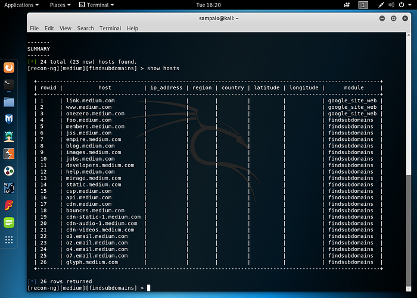

## Resolver hosts a IP

Ahora que tenemos una lista de hosts, busquemos su dirección IP:

> \> `back`
>
> \> `use recon/hosts-hosts/resolve`
>
> \> `run`
>
> \> ``show hosts``

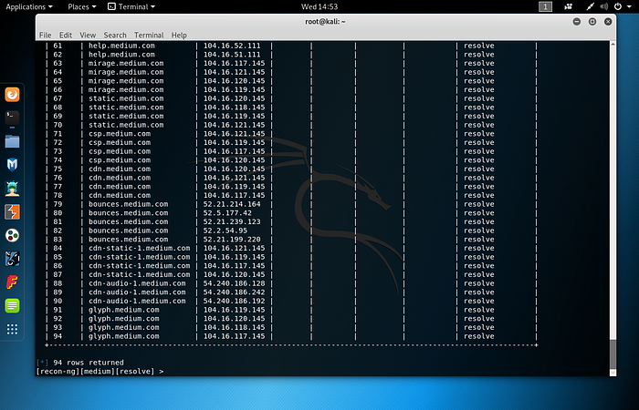

Verás una lista cada vez más completa. Intentemos obtener su ubicación.

## Módulos de búsqueda

Recon-NG dispone de varios módulos para diferentes usos. Podemos ver una lista completa con el comando 'show'

> \> `show modules`

Podemos buscar a través de sus módulos usando el comando 'search':

> \> `search location`

Puedes usar la API de ipinfodb.com o la API de ipstack.com para actualizar la tabla de hosts. Recuerda obtener una clave API y actualizar Recon-NG.

## Ubicación IP

No existe una forma correcta de obtener ubicaciones IP. Pasaremos por varios módulos hasta que hayamos obtenido toda la información posible.

> \> ``use recon/hosts-hosts/ipinfodb``

Para ver lo que has recopilado, hasta ahora, escribe '``show dashboard``' en la consola.

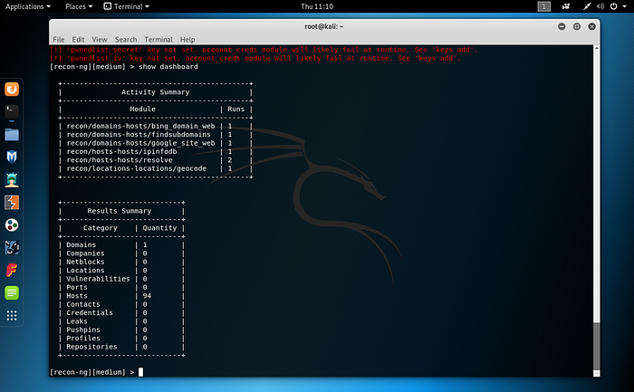

Ya tienes bastante información sobre tu objetivo (medium.com). Pero puedes seguir adelante:

## Intercambio de correo y remitente Polivy Framework Retriever

> \> ``use recon/domains-hosts/mx_spf_ip``

Y deberías obtener unas pocas IPs más para tu tabla de hosts

## Nombre de host DNS **Fuerza bruta**

Este módulo utiliza una lista de palabras para verificar la existencia de hosts a través de DNS.

> \> `use recon/domains-hosts/brute_hosts`

## HackerTarget API

El módulo Hackertarget utiliza su API para devolver información. Aconsejo su uso

> \> ``use recon/domains-hosts/hackertarget``

## Contactos

Contamos con dominios, hosts, ip, ubicaciones. Obtengamos algunos contactos con la ayuda de los siguientes módulos.

### Whois_poc

> \> ``use recon/domains-contacts/whois_poc``

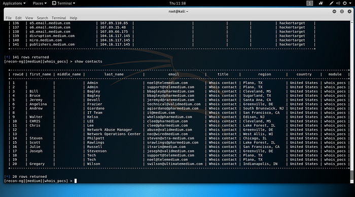

### Pgp_search

> \> ``use recon/domains-contacts/pgp_search``

### fullcontact

De nuevo, necesitarás obtener una clave de API. Ve a fullcontact y regístrate.

> \> ``use recon /contacts-profiles/fullcontact``

## Más reconocimientos

## Archivos interesantes

Este módulo comprueba la existencia de archivos predecibles en los hosts.

> \> ``use discovery/interesting_files``

### BuiltWith

Otro módulo que necesita una clave API.

> \> ``use recon/domains-host/builtwith``

### XSSposed y XSSed

Dos módulos para la comprobación de registros XSS asociados a un dominio.

> \> ``use recon/domains-vulnarabilites/xssposed``
>
> \> ``use recon/domains-vulnarabilites/xssed``

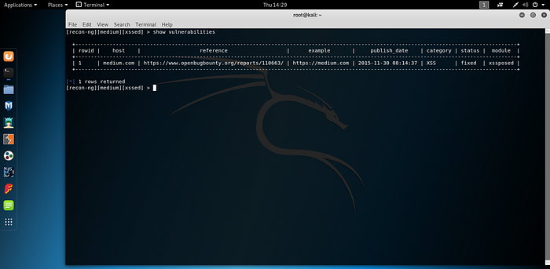

## Informes

Todo lo que hemos hecho hasta ahora se ha recopilado en Recon-NG DB. Ahora es el momento de tomar toda esa información y crear un informe. Los informes son una parte esencial del pentesting. Un buen informe incluye la mayor cantidad de información posible.

> \> ``show modules reporting``

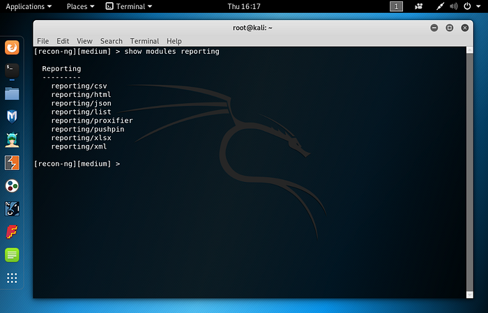

> \> ``use reporting/html``
>
> \> `show info`

Pero primero estableceremos la opción 'CREATOR' y 'CUSTOMER'.

> \> ``set CREATOR 'your_name'``
>
> \> `set CUSTOMER Medium`
>
> \> `run`

---

## Cheat Sheet

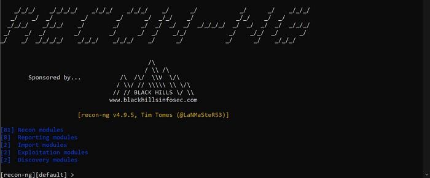

Recon-ng es una herramienta de recopilación inteligete de fuentes abiertas (OSINT) diseñada para realizar reconocimiento de redes y sistemas. A continuación se detallan algunos comandos y su utilidad:

## API keys

### ``show keys``
- **Utilidad:** Lista las claves API disponibles en la configuración de Recon-ng.
- **Uso:** Permite ver qué claves API están configuradas, lo cual es útil para asegurarse de que se tienen las herramientas adecuadas configuradas para las tareas de reconocimiento.

### ``keys add api_key_name #api_key_value``

- **Utilidad:** Añade una clave API a un módulo específico.
- **Uso:** Configurar claves API necesarias para que ciertos módulos funcionen correctamente.

### APIs interesantes

#### &rarr; builtwith

- **Utilidad:** Descubre la tecnología utilizada en un sitio web sin interactuar directamente con los hosts.
- **Uso:** Identifica tecnologías de backend como frameworks, servidores y bibliotecas utilizadas en un sitio web.

#### &rarr; google

- **Utilidad:** Accede a la API de Google para realizar búsquedas y obtener información útil.
- **Uso:** Realiza búsquedas web avanzadas y obtiene datos sobre dominios y direcciones.

#### &rarr; shodan 

- **Utilidad:** Utiliza el motor de búsqueda Shodan para IoT.
- **Uso:** Busca dispositivos conectados a Internet y obtiene información detallada sobre ellos.

## Contacts
### ``show contacts``

- **Utilidad:** Lista los contactos almacenados en la base de datos.
- **Uso:** Muestra todos los contactos encontrados durante las actividades de reconocimiento.

### ``recon/domains-contacts/whois_pocs``

- **Utilidad:** Recupera información de contacto de los registros WHOIS.
- **Uso:** Obtiene datos de puntos de contacto del dominio objetivo, como correos electrónicos y nombres.

## Companies

### ``show companies``

- **Utilidad:** Lista las empresas en la base de datos.
- **Uso:** Muestra todas las empresas registradas, útiles para la planificación y segmentación de las actividades de reconocimiento.

### ``add companies``

- **Utilidad:** Añade una empresa a la base de datos.
- **Uso:** Registra nuevas empresas objetivo en la base de datos para su posterior análisis.

## Domains
### ``show domains``

- **Utilidad:** Lista los dominios en la base de datos.
- **Uso:** Muestra todos los dominios objetivo almacenados para facilitar su gestión y análisis.

### ``add domains``

- **Utilidad:** Añade un dominio a la base de datos para pentesting.
- **Uso:** Registra nuevos dominios para ser objetivos de actividades de reconocimiento y pruebas de penetración.

### ``delete domains #ID``

- **Utilidad:** Elimina un dominio no deseado de la base de datos.
- **Uso:** Mantiene la base de datos organizada eliminando dominios que ya no son relevantes.

### ``recon/domains-hosts/findsubdomains``

- **Utilidad:** Encuentra subdominios del dominio objetivo.
- **Uso:** Identifica subdominios que pueden ser puntos de entrada para ataques.

### ``recon/domains-hosts/bing_domain_web``

- **Utilidad:** Usa el motor de búsqueda Bing para encontrar información sobre el dominio.
- **Uso:** Obtiene datos adicionales sobre el dominio objetivo utilizando Bing.

### ``recon/domains-hosts/brute_hosts``

- **Utilidad:** Realiza un ataque de fuerza bruta para descubrir subdominios y hosts.
- **Uso:** Encuentra subdominios y hosts adicionales no fácilmente visibles.

### ``recon/domains-hosts/hackertarget``

- **Utilidad:** Usa el servicio de HackerTarget para encontrar subdominios y hosts.
- **Uso:** Aprovecha las herramientas de HackerTarget para descubrir más información sobre los dominios.

## Hosts
### ``show hosts``

- **Utilidad:** Lista los hosts en la base de datos.
- **Uso:** Muestra todos los hosts identificados durante las actividades de reconocimiento.

### ``discovery/info_disclosure/interesting_files``

- **Utilidad:** Busca archivos de interés que puedan revelar información sensible.
- **Uso:** Identifica archivos que pueden contener información útil para el reconocimiento o explotación.

## IP
### ``recon/hosts-hosts/resolve``

- **Utilidad:** Resuelve nombres de hosts a direcciones IP.
- **Uso:** Convierte nombres de host en direcciones IP para un análisis más detallado.

## Modules
### ``search xyz``

- **Utilidad:** Busca módulos en recon-ng que contengan ‘xyz’.
- **Uso:** Encuentra módulos específicos para realizar tareas particulares en la herramienta.

### ``use xyz``

- **Utilidad:** Selecciona el módulo ‘xyz’ para su uso.
- **Uso:** Prepara el módulo seleccionado para su configuración y ejecución.

### ``show info``

- **Utilidad:** Muestra ayuda y uso del módulo seleccionado.
- **Uso:** Proporciona detalles sobre cómo utilizar el módulo seleccionado, incluyendo parámetros y opciones.

### ``run``

- **Utilidad:** Ejecuta el módulo previamente seleccionado.
- **Uso:** Inicia la ejecución del módulo para realizar la tarea especificada.

## Reports
### ``show dashboard``

- **Utilidad:** Muestra información de la base de datos en el tablero.
- **Uso:** Proporciona una vista general del estado actual de la base de datos y las actividades de reconocimiento.

### ``search reporting``

- **Utilidad:** Lista los formatos de informes disponibles.
- **Uso:** Encuentra y selecciona formatos de informes para presentar los datos recopilados.

### ``set customer``

- **Utilidad:** Establece el nombre del cliente para los informes.
- **Uso:** Personaliza los informes con el nombre del cliente objetivo.

## Workspace
### ``show workspaces``

- **Utilidad:** Lista los espacios de trabajo disponibles.
- **Uso:** Muestra todos los espacios de trabajo para una mejor organización de las actividades de reconocimiento.

### ``workspaces add my-workspace``

- **Utilidad:** Añade un nuevo espacio de trabajo ‘my-workspace’.
- **Uso:** Crea un espacio de trabajo separado para organizar actividades de reconocimiento de un proyecto específico.

### ``workspace select my-workspace``

- **Utilidad:** Selecciona ‘my-workspace’ para su uso.
- **Uso:** Cambia al espacio de trabajo deseado para trabajar en un proyecto específico sin mezclar datos.

Estos comandos permiten a los usuarios gestionar y ejecutar de manera efectiva las tareas de reconocimiento y recopilación de inteligencia, proporcionando una amplia gama de herramientas para descubrir información valiosa sobre objetivos potenciales.

---

COIRO XUL 2024

*Fuentes: [Reconnaissance – Hacker Toolbelt – Medium](https://medium.com/hacker-toolbelt/tagged/reconnaissance)*