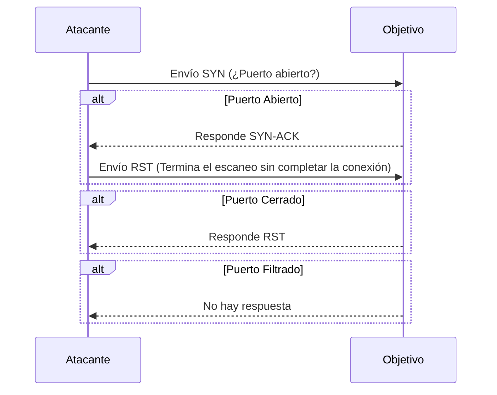
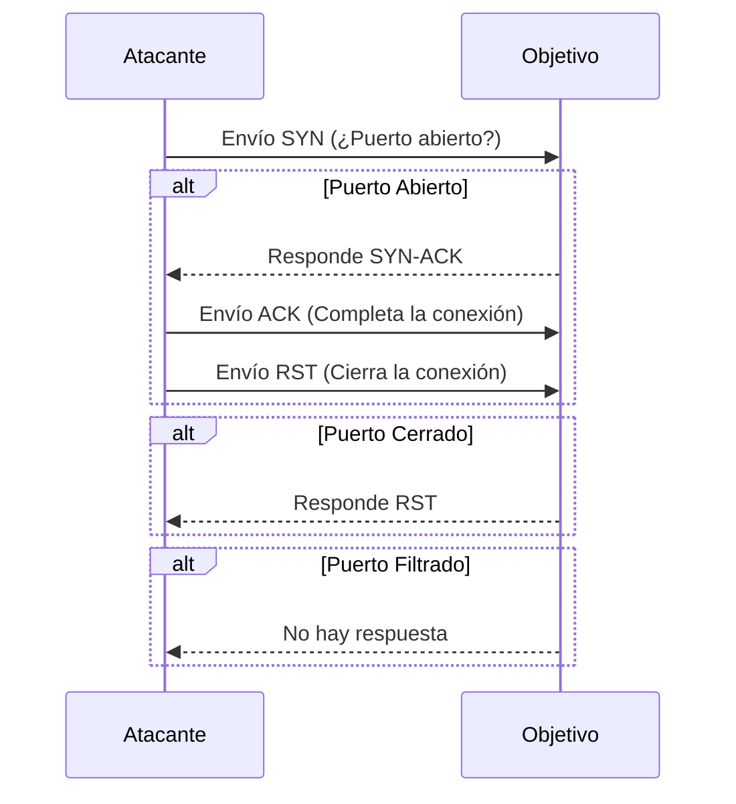
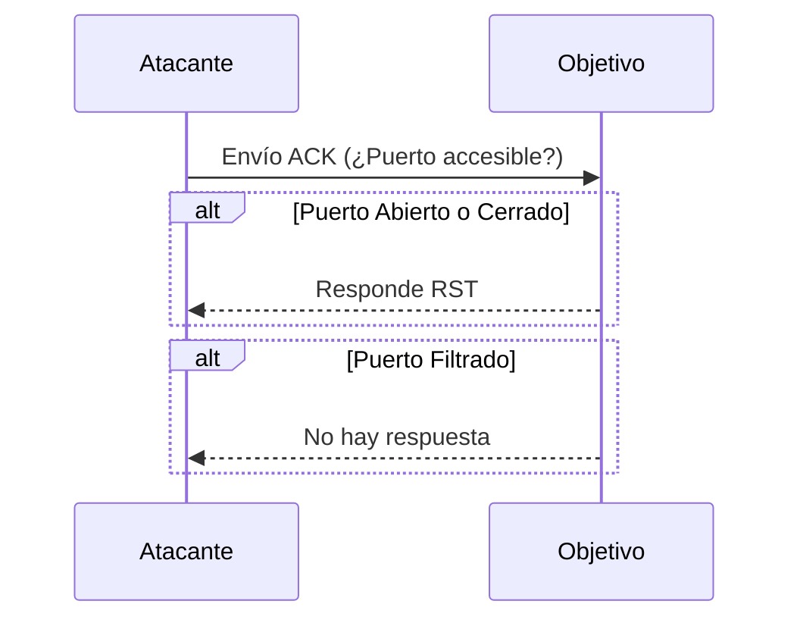
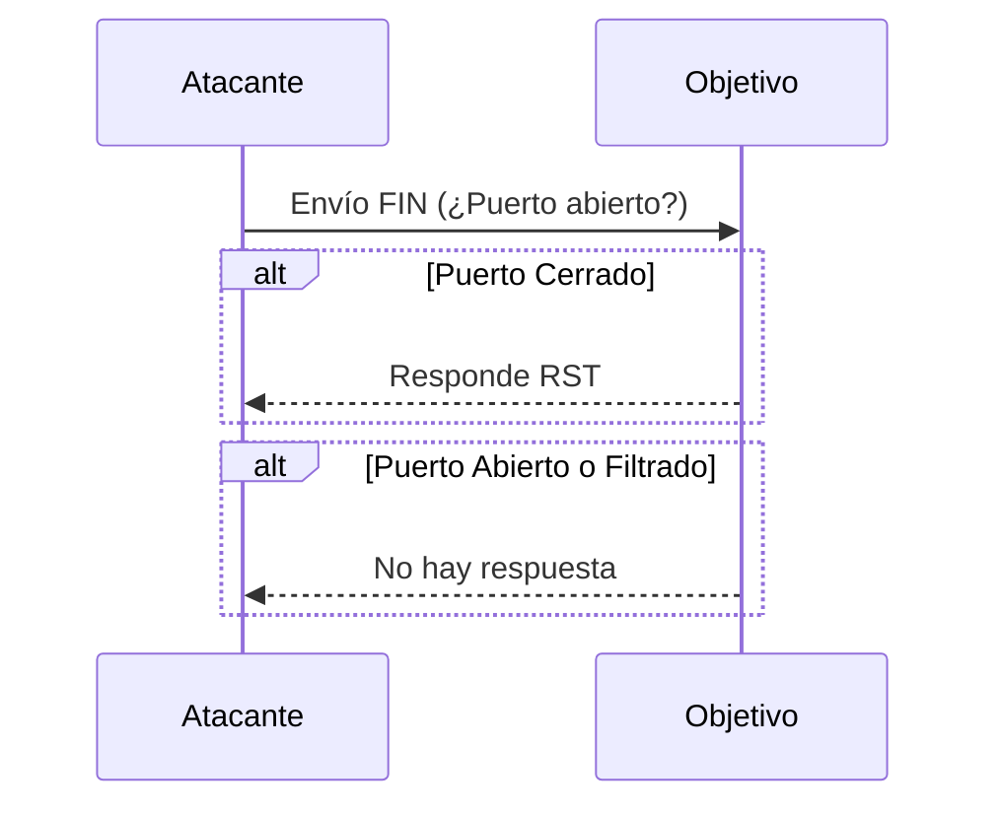
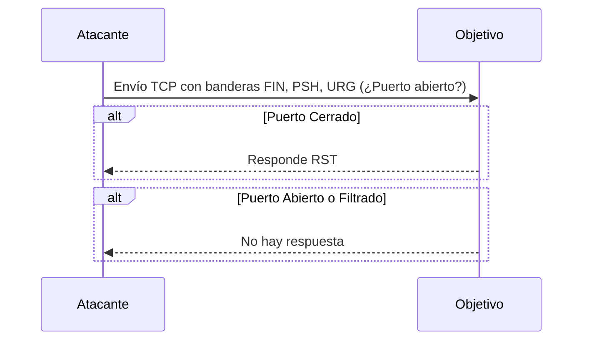
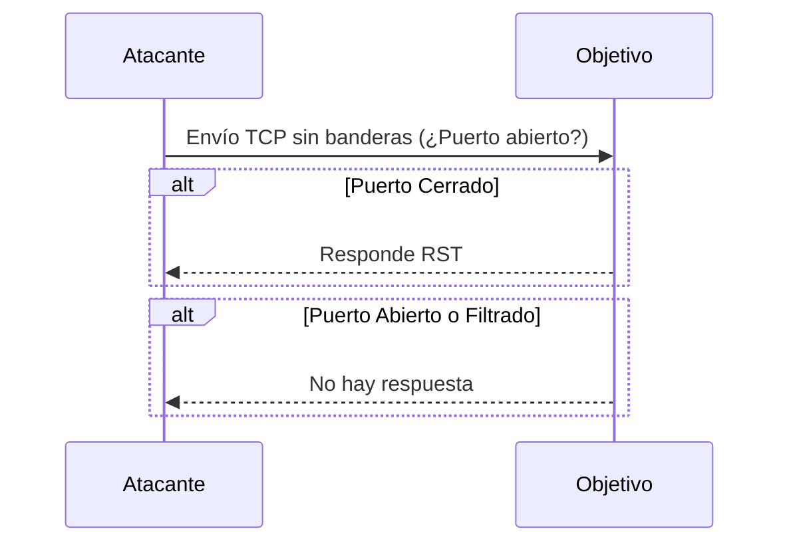
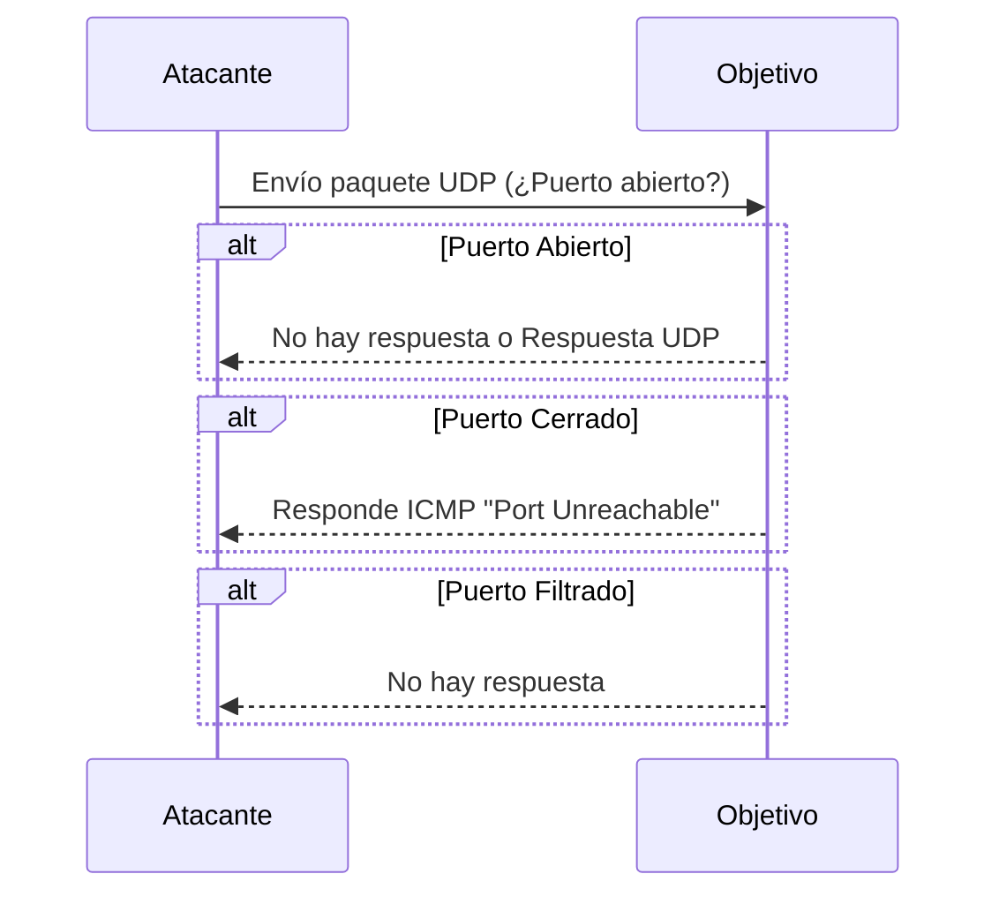
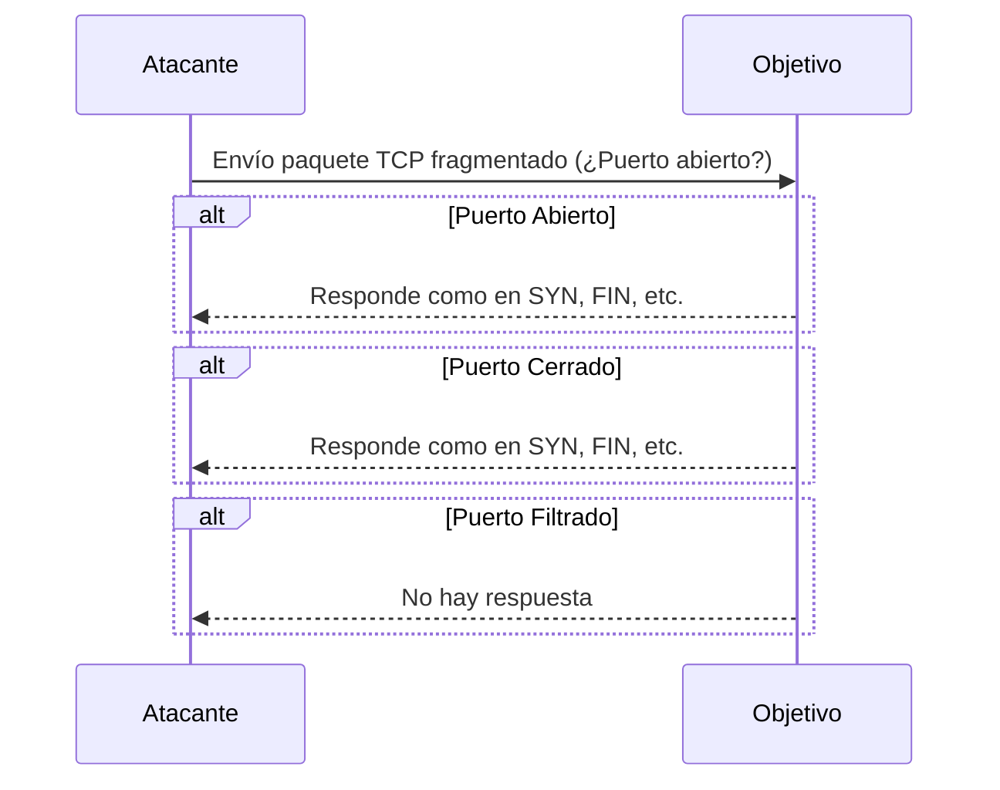
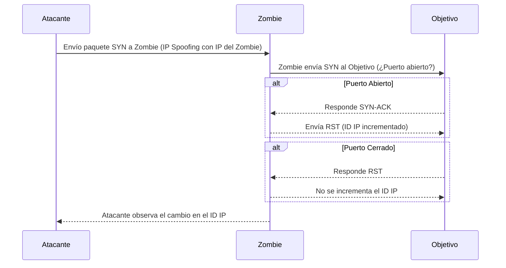

# Escaneo de puertos

Durante la fase de reconocimiento se puede obtener información sobre un sistema objetivo con solo recopilar la información que esa organización comparte de forma abierta en Internet. Por ejemplo se puede obtener información interesante sobre una organización recurriendo al análisis de sus páginas web, en especial de la revisión del código fuente y de los comentarios incluidos en el propio código de las páginas HTML, ya que permitirán averiguar qué herramientas utilizó el programador para su construcción, así como alguna otra información adicional sobre el sistema (tipo de servidor o base de datos utilizada,
por ejemplo).

Otras técnicas recurren a métodos más invasivos y *ruidosos* - por lo tanto más fáciles de detectar- como el escaneo de puertos. Estudiando las respuestas que genera un sistema a determinadas peticiones en un servicio o protocolo. Evidentemente estas actividades tienen lugar una vez que se ha localizado e identificado un determinado equipo o servidor conectado a Internet. 

Para descubrir los servicios que se encuentran accesibles en un determinado sistema informático (es decir, cuáles son los puntos de entrada al sistema), se puede recurrir a distintas técnicas como el escaneo de puertos.

El escaneo de puertos es una parte fundamental del reconocimiento en ciberseguridad. Es una técnica utilizada para identificar qué puertos de un sistema están abiertos, cerrados o filtrados. Esto es crucial tanto para la auditoría de seguridad como para los atacantes que buscan identificar posibles puntos de entrada a un sistema. Cada técnica tiene sus propias ventajas y desventajas en términos de velocidad, sigilo y fiabilidad, y la elección de la técnica depende de los objetivos específicos del ataque o auditoría, así como de las defensas que pueda tener el sistema objetivo.

A continuación, se describen las técnicas más comunes de escaneo de puertos:

### 1. **Escaneo de Puertos TCP SYN (Half-Open Scan)**
   - **Descripción:** También conocido como "escaneo sigiloso" o "half-open", esta técnica envía un paquete TCP con la bandera SYN (synchronize) y espera una respuesta.
   - **Funcionamiento:** 
     - Si el puerto está **abierto**, el servidor responde con un paquete SYN-ACK (synchronize-acknowledge).
     - Si está **cerrado**, el servidor responde con un paquete RST (reset).
     - Si el puerto está **filtrado** (por un firewall), no se recibe ninguna respuesta.
   - **Ventaja:** Como el escaneo nunca completa el establecimiento de la conexión TCP (la secuencia SYN-SYN/ACK-ACK), es más difícil de detectar por los sistemas de defensa.

### 2. **Escaneo de Puertos TCP Connect**
   - **Descripción:** Esta es la técnica más básica y directa, en la que se intenta establecer una conexión TCP completa con el puerto objetivo.
   - **Funcionamiento:** 
     - Se envía un paquete SYN.
     - Si el puerto está **abierto**, se recibe un SYN-ACK y el escáner responde con un ACK para completar la conexión.
     - Si está **cerrado**, se recibe un paquete RST.
   - **Desventaja:** Es fácil de detectar por los sistemas de defensa porque la conexión TCP se completa.

### 3. **Escaneo de Puertos TCP ACK**
   - **Descripción:** Este escaneo envía un paquete TCP con la bandera ACK (acknowledge) a un puerto.
   - **Funcionamiento:** 
     - Si el puerto responde con un paquete RST, significa que está **abierto o cerrado** (es decir, el puerto está accesible).
     - Si no se recibe respuesta, el puerto puede estar **filtrado**.
   - **Uso:** Este tipo de escaneo es comúnmente utilizado para determinar las reglas del firewall, ya que no se utiliza para identificar si un puerto está abierto o cerrado, sino si está filtrado.

### 4. **Escaneo de Puertos TCP FIN**
   - **Descripción:** Se envía un paquete TCP con la bandera FIN (finish) para intentar cerrar una conexión que nunca existió.
   - **Funcionamiento:** 
     - Si el puerto está **cerrado**, se responderá con un paquete RST.
     - Si está **abierto** o **filtrado**, es probable que no se reciba ninguna respuesta.
   - **Ventaja:** Esta técnica puede evadir algunos firewalls o sistemas de detección que solo buscan paquetes SYN.

### 5. **Escaneo de Puertos TCP XMAS**
   - **Descripción:** En este tipo de escaneo, se envía un paquete con varias banderas TCP activadas simultáneamente (FIN, PSH, y URG).
   - **Funcionamiento:** 
     - Si el puerto está **cerrado**, el sistema responderá con un paquete RST.
     - Si está **abierto** o **filtrado**, no se recibe ninguna respuesta.
   - **Uso:** Es una técnica similar al escaneo FIN, y puede usarse para evadir ciertos sistemas de detección.

### 6. **Escaneo de Puertos TCP Null**
   - **Descripción:** En este escaneo, se envía un paquete TCP sin ninguna bandera activada.
   - **Funcionamiento:** 
     - Si el puerto está **cerrado**, se recibe un paquete RST.
     - Si está **abierto** o **filtrado**, no se recibe respuesta.
   - **Ventaja:** Como no hay banderas activas, algunos sistemas de detección pueden no reconocer este escaneo como tráfico malicioso.

### 7. **Escaneo de Puertos UDP**
   - **Descripción:** Escanea puertos utilizando el protocolo UDP (User Datagram Protocol), que es sin conexión.
   - **Funcionamiento:** 
     - Se envía un paquete UDP al puerto.
     - Si el puerto está **cerrado**, se recibe un mensaje ICMP "port unreachable".
     - Si está **abierto**, no se recibe ninguna respuesta (o se puede recibir una respuesta UDP si la aplicación en ese puerto responde).
   - **Desventaja:** El escaneo UDP es más lento y menos fiable que el TCP, debido a la falta de confirmación de las respuestas.

### 8. **Escaneo de Puertos Fragmentado**
   - **Descripción:** El escaneo fragmentado divide los paquetes en fragmentos más pequeños antes de enviarlos al objetivo.
   - **Funcionamiento:** Este escaneo envía paquetes que están fragmentados para intentar evadir la detección de firewalls y sistemas de detección de intrusos (IDS).
   - **Ventaja:** Puede evadir algunos sistemas de detección que no ensamblan correctamente los fragmentos para inspección.

### 9. **Escaneo de Puertos Idle**
   - **Descripción:** Utiliza un tercer sistema (un "zombie") para realizar el escaneo, ocultando así la verdadera identidad del atacante.
   - **Funcionamiento:** 
     - El escáner envía paquetes al objetivo usando la IP de un tercero, y analiza cómo se comporta el contador de identificación IP (IP ID) del zombie para inferir si los puertos están abiertos o cerrados.
   - **Ventaja:** Oculta la dirección IP del escáner, haciendo difícil la atribución del escaneo al atacante.

