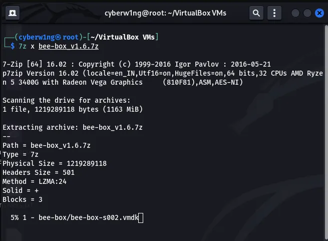
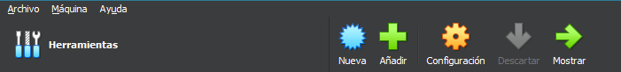
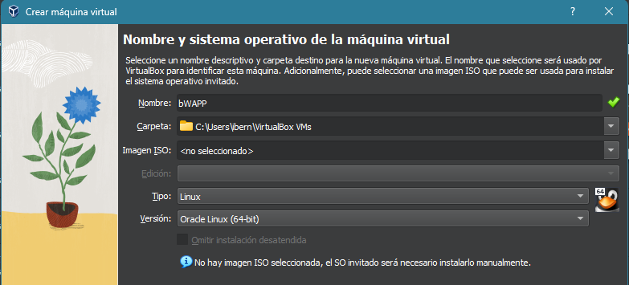
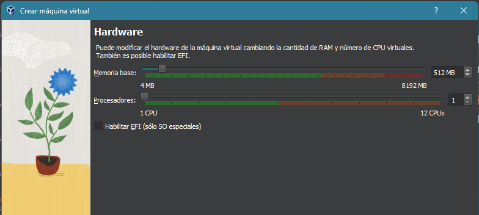
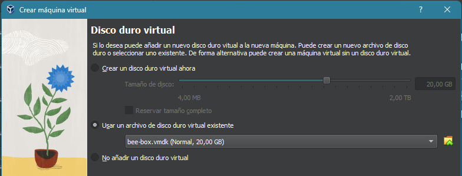
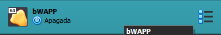
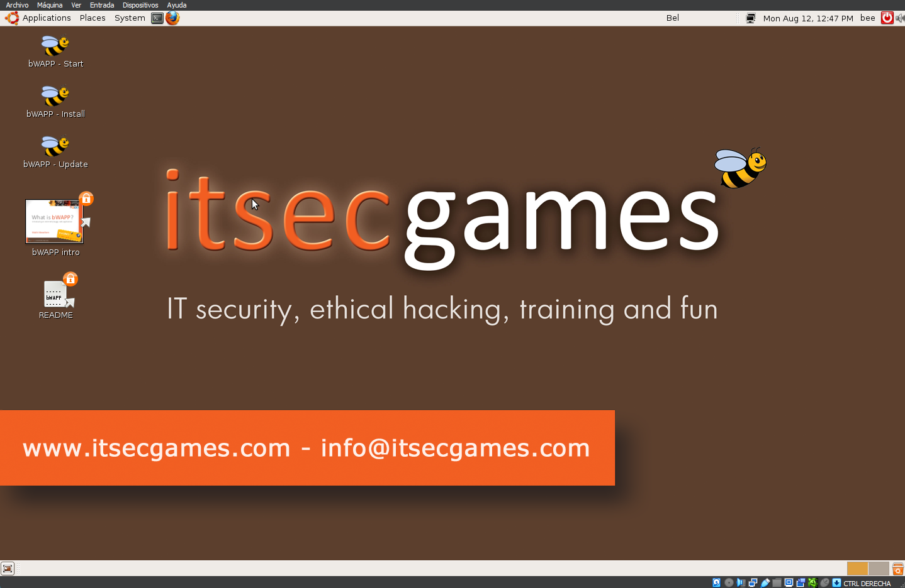
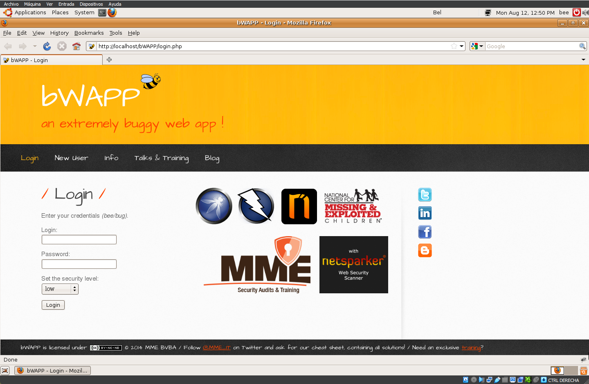

# bWAPP

 bWAPP sea tan único? ¡Pues tiene más de 100 errores web! bWAPP cubre todas las principales vulnerabilidades web conocidas, incluidos todos los riesgos del proyecto OWASP Top 10.

*[La lista OWASP Top 10 ofrece una imagen precisa del panorama actual de amenazas en la seguridad de las aplicaciones y refleja los esfuerzos colaborativos y los conocimientos de miles de ingenieros de seguridad experimentados. Para reflejar los cambios constantes en la tecnología y las prácticas comerciales comunes en línea, la lista se actualiza periódicamente.]*

Algunas de las vulnerabilidades incluidas en bWAPP:

- Inyecciones de SQL, HTML, iFrame, SSI, comandos del sistema operativo, XML, XPath, LDAP y SMTP
- Inyección de comandos de SQL y SO a ciegas
- Vulnerabilidad de Bash Shellshock (CGI) y Heartbleed (OpenSSL)
- Secuencias de comandos entre sitios (XSS) y seguimiento entre sitios (XST)
- Falsificación de solicitud entre sitios (CSRF)
- Vulnerabilidades de AJAX y servicios web (JSON/XML/SOAP/WSDL)
- Subidas de archivos maliciosas y sin restricciones y archivos de puerta trasera
- Problemas de autenticación, autorización y gestión de sesiones
- Acceso arbitrario a archivos y recorridos de directorios
- Inclusiones de archivos locales y remotos (LFI/RFI)
- Problemas de configuración: Man-in-the-Middle, archivos de políticas entre dominios, divulgaciones de información,...
- Contaminación de parámetros HTTP y división de respuestas HTTP
- Ataques de denegación de servicio (DoS): expansión lenta de entidades XML y HTTP
- Configuraciones inseguras de distcc, FTP, NTP, Samba, SNMP, VNC y WebDAV
- Problemas de almacenamiento web, uso compartido de recursos de origen cruzado (CORS) y ClickJacking en HTML5
- Redirecciones y reenvíos no validados y envenenamiento de cookies
- Envenenamiento de cookies y almacenamiento criptográfico inseguro
- Falsificación de solicitud del lado del servidor (SSRF)
- Ataques de entidad externa XML (XXE)
- Y mucho mucho mucho más…

bWAPP es una aplicación PHP que utiliza una base de datos MySQL. Puede alojarse en Linux, Windows y Mac con Apache/IIS y MySQL. También puede instalarse con WAMP o XAMPP.
Otra posibilidad es descargar bee-box…

Bee-box es una máquina virtual personalizada de Linux Ubuntu, preinstalada con bWAPP. Es compatible con VMware Player, Workstation, Fusion y con Oracle VirtualBox. ¡No requiere instalación! Bee-box te ofrece varias formas de hackear y desfigurar el sitio web de bWAPP. ¡Actualmente hay 10 posibilidades diferentes de desfiguración de sitios web! Incluso es posible hackear Bee-box, utilizando un exploit de escalada de privilegios local, para obtener acceso completo a la raíz… En realidad, con Bee-box tienes la oportunidad de explorar y explotar 'todas' las vulnerabilidades de bWAPP. Hackear, desfigurar y explotar sin ir a la cárcel... ¿qué tan genial es eso?

Puedes descargar bWAPP desde [aquí](https://sourceforge.net/projects/bwapp/files/bWAPP/) . Puedes descargar Bee-box desde [aquí](https://sourceforge.net/projects/bwapp/files/bee-box/) .

Ambos son parte del proyecto 'ITSEC Games'. Los 'ITSEC Games' son una forma divertida de enseñar seguridad informática. Seguridad informática, hacking ético, formación y diversión.

*Fonte: https://itsecgames.blogspot.com/*

# Configurar bWAPP en Linux

1. Descarga la [bWAPP con este Enlace](https://download.vulnhub.com/bwapp/bee-box_v1.6.7z)

https://download.vulnhub.com/bwapp/bee-box_v1.6.7z

2. Extrer el archivo usando 7zip o cualquier otro extractor. Aquí se usa 7z en Linux para extraer el archivo.

3. Abre el cuadro virtual y haz clic en el botón *Nueva*:

… y crea la nueva máquina: 

Selecciona el archivo **bee-box.vmdk** en la carpeta extraída

bWAPP está instalado. Soló haz doble clic para iniciar la máquina virtual:

Y, una vez dentro de la máquina, haz clic en **bWAPP-Start**  para iniciar la aplicación vulnerable:

