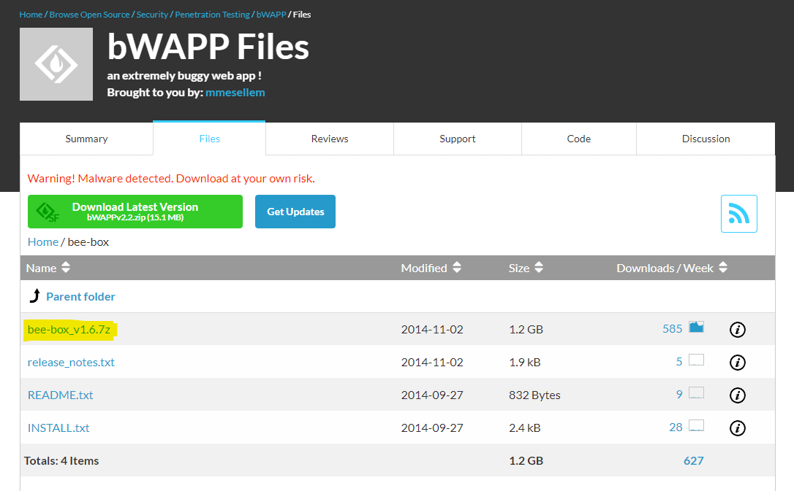

# Máquina virtual vulnerable

BeeBox es una máquina virtual vulnerable diseñada para practicar y mejorar habilidades en seguridad informática, especialmente en la explotación de vulnerabilidades web. Es un entorno controlado donde los usuarios pueden explorar y explotar diversas vulnerabilidades sin riesgo de causar daño en sistemas reales.

### Características y Propósito:
1. **Entrenamiento en seguridad web**: BeeBox contiene múltiples vulnerabilidades intencionalmente integradas, como inyecciones SQL, cross-site scripting (XSS), fallos en la autenticación, entre otras. Esto permite a los usuarios practicar y desarrollar habilidades en el descubrimiento y explotación de fallos de seguridad.

2. **Entorno controlado**: Al ser una máquina virtual, BeeBox ofrece un ambiente seguro y aislado donde los profesionales y entusiastas de la seguridad pueden experimentar sin temor a comprometer sistemas reales.

3. **Educación y aprendizaje**: BeeBox es útil tanto para principiantes como para expertos. Los principiantes pueden aprender los conceptos básicos de seguridad web, mientras que los usuarios más avanzados pueden perfeccionar sus técnicas y estrategias de ataque.

4. **Preparación para certificaciones**: Muchas certificaciones en seguridad informática, como CEH (Certified Ethical Hacker) o OSCP (Offensive Security Certified Professional), requieren conocimientos prácticos de explotación de vulnerabilidades. BeeBox puede servir como una herramienta de práctica para quienes se preparan para estos exámenes.

**Recuerda**: BeeBox es una excelente herramienta para cualquier persona interesada en mejorar sus habilidades en seguridad web. Proporciona un entorno de práctica seguro y realista, donde se pueden aprender, probar y perfeccionar técnicas de hacking ético.

- [Download and Prepare bWAPP Virtual Machine](https://www.computersecuritystudent.com/SECURITY_TOOLS/beebox/v2.2/lesson1/index.html) + [1](https://www.vulnhub.com/entry/bwapp-bee-box-v16,53/)
- [bWAPP](http://www.itsecgames.com/download.htm)
- [Más…](https://www.computersecuritystudent.com/cgi-bin/CSS/process_request_v3.pl?HID=a6dc2e7576fdcb4eba1d6ab893e01a01&TYPE=MAIN)