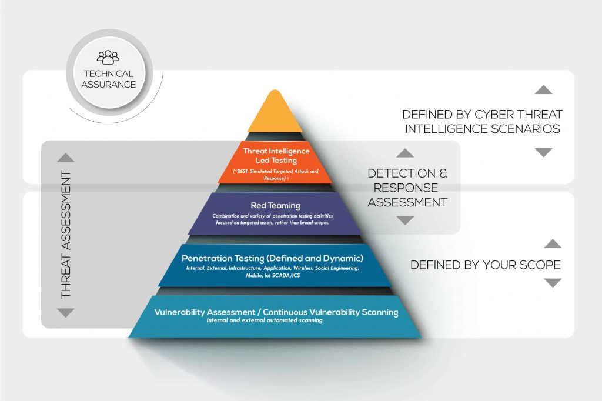
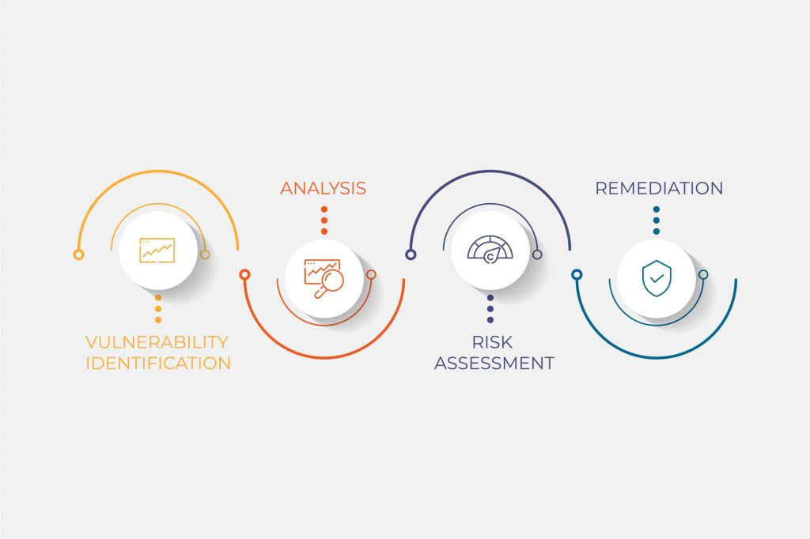

# Herramientas de análisis de vulnerabilidades

El escaneo de vulnerabilidades o evaluación de vulnerabilidades es un proceso sistemático para encontrar lagunas de seguridad en cualquier sistema y abordar las vulnerabilidades potenciales.

El objetivo de [las evaluaciones de vulnerabilidad](https://phoenixnap.com/blog/vulnerability-assessment) es evitar la posibilidad de acceso no autorizado a los sistemas. Las pruebas de vulnerabilidad preservan la [confidencialidad, integridad y disponibilidad](https://phoenixnap.com/glossary/confidentiality-integrity-and-availability) del sistema. El término sistema hace referencia a cualquier computadora, red, dispositivo de red, software, [aplicación web](https://phoenixnap.com/glossary/web-application) , computación en la nube, etc.

## Tipos de escáneres de vulnerabilidades

Los escáneres de vulnerabilidades tienen sus propias formas de hacer su trabajo. Podemos clasificarlos en cuatro tipos según su funcionamiento.

### Escáneres de vulnerabilidad basados en la nube

Se utiliza para encontrar vulnerabilidades en sistemas basados en la nube, como aplicaciones web, WordPress y Joomla.

### Escáneres de vulnerabilidad basados en el host

Se utiliza para encontrar vulnerabilidades en un solo host o sistema, como una computadora individual o un dispositivo de red como un conmutador o un enrutador central.

### Escáneres de vulnerabilidad basados en red

Se utiliza para encontrar vulnerabilidades en una red interna mediante el escaneo de puertos abiertos. Los servicios que se ejecutan en puertos abiertos determinan si existen vulnerabilidades o no con la ayuda de la herramienta.

### Escáneres de vulnerabilidad basados en bases de datos

Se utiliza para encontrar vulnerabilidades en los sistemas de gestión de bases de datos. Las bases de datos son la columna vertebral de cualquier sistema que almacena información confidencial. El análisis de vulnerabilidades se realiza en los sistemas de bases de datos para [evitar ataques como la inyección SQL](https://phoenixnap.com/blog/what-is-sql-injection) .

## Herramientas de escaneo de vulnerabilidades

Las herramientas de escaneo de vulnerabilidades permiten detectar vulnerabilidades en aplicaciones de muchas maneras. Las herramientas de análisis de vulnerabilidades de código analizan errores de codificación. Las herramientas de auditoría de vulnerabilidades pueden encontrar rootkits, [puertas traseras](https://phoenixnap.com/glossary/what-is-backdoor) y troyanos conocidos .

Hay muchos escáneres de vulnerabilidad disponibles en el mercado. Pueden ser gratuitos, pagos o de código abierto. La mayoría de las herramientas gratuitas y de código abierto están disponibles en GitHub. La decisión sobre qué herramienta utilizar depende de algunos factores, como el tipo de vulnerabilidad, el presupuesto, la frecuencia con la que se actualiza la herramienta, etc.

### **1. Nikto2**

[Nikto2](https://cirt.net/Nikto2) es un software de escaneo de vulnerabilidades de código abierto que se centra en la seguridad de las aplicaciones web. Nikto2 puede encontrar alrededor de 6700 archivos peligrosos que causan problemas a los servidores web e informar sobre versiones obsoletas de los servidores. Además, Nikto2 puede alertar sobre problemas de configuración del servidor y realizar escaneos del servidor web en un tiempo mínimo.
Nikto2 no ofrece contramedidas para las vulnerabilidades encontradas ni proporciona funciones de evaluación de riesgos. Sin embargo, Nikto2 es una herramienta que se actualiza con frecuencia y permite una cobertura más amplia de las vulnerabilidades.

### **2. NetSparker**

[Netsparker](https://www.netsparker.com/) es otra herramienta de detección de vulnerabilidades de aplicaciones web con una función de automatización disponible para encontrar vulnerabilidades. Esta herramienta también es capaz de encontrar vulnerabilidades en miles de aplicaciones web en cuestión de horas.
Aunque es una herramienta de detección de vulnerabilidades de nivel empresarial paga, tiene muchas funciones avanzadas. Tiene tecnología de rastreo que encuentra vulnerabilidades al rastrear la aplicación. Netsparker puede describir y sugerir técnicas de mitigación para las vulnerabilidades encontradas. Además, hay disponibles soluciones de seguridad para la evaluación avanzada de vulnerabilidades.

### **3. OpenVAS**

[OpenVAS](https://www.openvas.org/) es una potente herramienta de análisis de vulnerabilidades que permite realizar análisis a gran escala, lo que resulta adecuado para las organizaciones. Puede utilizar esta herramienta para encontrar vulnerabilidades no solo en aplicaciones web o servidores web, sino también en bases de datos, sistemas operativos, redes y máquinas virtuales.
OpenVAS recibe actualizaciones diarias, lo que amplía la cobertura de detección de vulnerabilidades. También ayuda en la evaluación de riesgos y sugiere contramedidas para las vulnerabilidades detectadas.

### **4. W3AF**

[W3AF](http://w3af.org/) es una herramienta gratuita y de código abierto conocida como Web Application Attack and Framework. Esta herramienta es una herramienta de escaneo de vulnerabilidades de código abierto para aplicaciones web. Crea un marco que ayuda a proteger la aplicación web mediante la búsqueda y explotación de vulnerabilidades. Esta herramienta es conocida por su facilidad de uso. Junto con las opciones de escaneo de vulnerabilidades, W3AF también tiene funciones de explotación que se utilizan para el trabajo de pruebas de penetración.
Además, W3AF cubre una amplia colección de vulnerabilidades. Los dominios que son atacados con frecuencia, especialmente con vulnerabilidades recientemente identificadas, pueden seleccionar esta herramienta.

### **5. Arachni**

[Arachni](https://www.arachni-scanner.com/) también es una herramienta dedicada a la detección de vulnerabilidades para aplicaciones web. Esta herramienta cubre una variedad de vulnerabilidades y se actualiza periódicamente. Arachni proporciona herramientas para la evaluación de riesgos, así como sugerencias y contramedidas para las vulnerabilidades encontradas.
Arachni es una herramienta de detección de vulnerabilidades gratuita y de código abierto compatible con Linux, Windows y macOS. Arachni también ayuda en las pruebas de penetración gracias a su capacidad para hacer frente a las vulnerabilidades identificadas recientemente.

### **6. Acunetix**

[Acunetix](https://www.acunetix.com/) es un escáner de seguridad de aplicaciones web de pago (también está disponible la versión de código abierto) con muchas funciones. Esta herramienta tiene un rango de escaneo de alrededor de 6500 vulnerabilidades. Además de aplicaciones web, también puede encontrar vulnerabilidades en la red.
Acunetix ofrece la posibilidad de automatizar el escaneo. Es adecuado para organizaciones de gran escala, ya que puede manejar muchos dispositivos. HSBC, NASA y la Fuerza Aérea de EE. UU. son algunos de los gigantes industriales que utilizan Arachni para realizar pruebas de vulnerabilidad.

### **7. Nmap**

[Nmap](https://nmap.org/) es una de las herramientas de escaneo de red gratuitas y de código abierto más conocidas entre muchos profesionales de la seguridad. Nmap utiliza la técnica de sondeo para descubrir hosts en la red y para el descubrimiento del sistema operativo.
Esta función ayuda a detectar vulnerabilidades en una o varias redes. Si eres nuevo en el escaneo de vulnerabilidades o estás aprendiendo, entonces Nmap es un buen comienzo.

### **8. OpenSCAP**

[OpenSCAP](https://www.open-scap.org/) es un marco de herramientas que ayuda a escanear, evaluar y medir vulnerabilidades y a crear medidas de seguridad. OpenSCAP es una herramienta gratuita y de código abierto desarrollada por comunidades. OpenSCAP solo es compatible con plataformas Linux.
El marco OpenSCAP admite el escaneo de vulnerabilidades en aplicaciones web, servidores web, bases de datos, sistemas operativos, redes y máquinas virtuales. Además, proporciona una herramienta para la evaluación de riesgos y ayuda para contrarrestar amenazas.

### **9. GoLismero**

[GoLismero](http://www.golismero.com/) es una herramienta gratuita y de código abierto que se utiliza para el análisis de vulnerabilidades. GoLismero se centra en la búsqueda de vulnerabilidades en aplicaciones web, pero también puede buscar vulnerabilidades en la red. GoLismero es una herramienta práctica que funciona con los resultados proporcionados por otras herramientas de detección de vulnerabilidades, como OpenVAS, y luego combina los resultados y proporciona información.
GoLismero cubre una amplia gama de vulnerabilidades, incluidas las vulnerabilidades de bases de datos y de red. Además, GoLismero facilita la aplicación de contramedidas para las vulnerabilidades detectadas.

### **10. Intruder

[Intruder](https://www.intruder.io/) es un escáner de vulnerabilidades de pago diseñado específicamente para escanear el almacenamiento en la nube. El software Intruder comienza a escanear inmediatamente después de que se publica una vulnerabilidad. El mecanismo de escaneo de Intruder está automatizado y monitorea constantemente las vulnerabilidades.
Intruder es adecuado para el escaneo de vulnerabilidades a nivel empresarial, ya que puede administrar muchos dispositivos. Además de monitorear el almacenamiento en la nube, Intruder puede ayudar a identificar vulnerabilidades de red, así como también brindar informes y sugerencias de calidad.

### 11. Comodo HackerProof

Con [Comodo Hackerproof](https://www.comodo.com/hackerproof) podrá reducir el abandono del carrito de compras, realizar análisis de vulnerabilidades diarios y utilizar las herramientas de análisis PCI incluidas. También puede utilizar la función de prevención de ataques drive-by y generar confianza valiosa con sus visitantes. Gracias al beneficio de Comodo Hackerproof, muchas empresas pueden convertir más visitantes en compradores.

Los compradores tienden a sentirse más seguros al realizar una transacción con su empresa, y esto debería aumentar sus ingresos. Con la tecnología de escaneo con patente en trámite, SiteInspector, disfrutará de un nuevo nivel de seguridad.

### 12. Aircrack

Aircrack, también conocido como [Aircrack-NG](https://www.aircrack-ng.org/) , es un conjunto de herramientas que se utilizan para evaluar la seguridad de la red WiFi. Estas herramientas también se pueden utilizar en auditorías de redes y son compatibles con varios sistemas operativos, como Linux, OS X, Solaris, NetBSD, Windows y más.

La herramienta se centrará en diferentes áreas de la seguridad WiFi, como la monitorización de paquetes y datos, pruebas de controladores y tarjetas, crackeo, respuesta a ataques, etc. Esta herramienta permite recuperar las claves perdidas capturando los paquetes de datos.

### 13. Retina CS

[Retina CS Community](https://www.beyondtrust.com/docs/archive/vulnerability-management/documents/6-2-0/retina-community-users-guide.pdf) es una consola web de código abierto que le permitirá crear un sistema de gestión de vulnerabilidades más centralizado y sencillo. Retina CS Community tiene funciones como informes de cumplimiento, aplicación de parches y cumplimiento de la configuración, y gracias a esto, puede realizar una evaluación de vulnerabilidades multiplataforma.

La herramienta es excelente para ahorrar tiempo, dinero y esfuerzo a la hora de gestionar la seguridad de la red. Cuenta con una evaluación de vulnerabilidades automatizada para bases de datos, aplicaciones web, estaciones de trabajo y servidores. Las empresas y organizaciones obtendrán soporte completo para entornos virtuales con funciones como escaneo de aplicaciones virtuales e integración con vCenter.

### 14. Microsoft Baseline Security Analyzer (MBSA)

Un escáner de vulnerabilidades totalmente gratuito creado por Microsoft que se utiliza para probar su servidor Windows o su computadora con Windows en busca de vulnerabilidades. [Microsoft Baseline Security Analyzer](https://www.microsoft.com/en-us/download/details.aspx?id=19892) tiene varias funciones vitales, que incluyen el escaneo de los paquetes de servicios de red, la búsqueda de actualizaciones de seguridad u otras actualizaciones de Windows, y más. Es la herramienta ideal para los usuarios de Windows.

Es excelente para ayudarte a identificar actualizaciones o parches de seguridad faltantes. Usa la herramienta para instalar nuevas actualizaciones de seguridad en tu computadora. Las pequeñas y medianas empresas encuentran la herramienta muy útil y ayuda al departamento de seguridad a ahorrar dinero con sus funciones. No necesitarás consultar a un experto en seguridad para resolver las vulnerabilidades que encuentre la herramienta.

### 15. Nexpose

[Nexpose](https://www.rapid7.com/products/nexpose/) es una herramienta de código abierto que puedes utilizar sin coste alguno. Los expertos en seguridad utilizan regularmente esta herramienta para escanear vulnerabilidades. Todas las nuevas vulnerabilidades se incluyen en la base de datos de Nexpose gracias a la comunidad de Github. Puedes utilizar esta herramienta con Metasploit Framework y puedes confiar en ella para realizar un escaneo detallado de tu aplicación web. Antes de generar el informe, tendrá en cuenta varios elementos.

La herramienta clasifica las vulnerabilidades según su nivel de riesgo y las clasifica de menor a mayor. Es capaz de escanear nuevos dispositivos, por lo que su red permanece segura. Nexpose se actualiza cada semana, por lo que sabe que encontrará los peligros más recientes.

### 16. Nessus Profesional

[Nessus](https://www.tenable.com/products/nessus/nessus-professional) es un escáner de vulnerabilidades patentado y de marca creado por Tenable Network Security. Nessus evitará que los piratas informáticos intenten acceder a las redes y puede analizar las vulnerabilidades que permiten el pirateo remoto de datos confidenciales.

La herramienta ofrece una amplia gama de sistemas operativos, bases de datos, aplicaciones y otros dispositivos entre infraestructuras en la nube, redes virtuales y físicas. Millones de usuarios confían en Nessus para evaluar vulnerabilidades y resolver problemas de configuración.

### 17. Administrador de configuración de red de SolarWinds

[SolarWinds Network Configuration Manager](https://www.solarwinds.com/network-configuration-manager) ha recibido constantemente elogios de los usuarios. Las funciones de la herramienta de evaluación de vulnerabilidades que incluye abordan un tipo específico de vulnerabilidad que muchas otras opciones no abordan, como equipos de red mal configurados. Esta función lo distingue del resto. La utilidad principal como herramienta de escaneo de vulnerabilidades es la validación de configuraciones de equipos de red para detectar errores y omisiones. También se puede utilizar para verificar periódicamente las configuraciones de los dispositivos en busca de cambios.

[Se integra con la Base de datos de vulnerabilidades nacional y tiene acceso a los CVE](https://phoenixnap.com/glossary/what-is-cve) más actuales para identificar vulnerabilidades en sus dispositivos Cisco. Funcionará con cualquier dispositivo Cisco que ejecute ASA, IOS o Nexus OS.

## La evaluación de vulnerabilidades protege tu red

Si un ataque comienza modificando la configuración de red del dispositivo, las herramientas podrán identificarlo y detenerlo. Le ayudan a cumplir con las normativas gracias a su capacidad para detectar cambios fuera de proceso, auditar configuraciones e incluso corregir infracciones.

Para implementar una evaluación de vulnerabilidad, debe seguir un proceso sistemático como el que se describe a continuación.

**Paso 1** – Comienza el proceso documentando, decidiendo qué herramienta/s utilizar y obteniendo el permiso necesario de las partes interesadas.

**Paso 2** : Realiza un análisis de vulnerabilidades con las herramientas pertinentes. Asegúrate de guardar todos los resultados de esas herramientas.

**Paso 3** : Analiza el resultado y decide qué vulnerabilidades identificadas podrían representar una posible amenaza. También puedes priorizar las amenazas y encontrar una estrategia para mitigarlas.

**Paso 4** – Asegúrate de documentar todos los resultados y preparar informes para las partes interesadas.

**Paso 5** – Solucionar las vulnerabilidades identificadas.

## Ventajas de escanear en busca de vulnerabilidades

El análisis de vulnerabilidades mantiene los sistemas protegidos frente a amenazas externas. Otros beneficios incluyen:

- **Asequible:** muchos escáneres de vulnerabilidad están disponibles de forma gratuita.

- **Rápido:** la evaluación tarda algunas horas en completarse.

- **Automatizar:** puede utilizar funciones automatizadas disponibles en las herramientas de vulnerabilidad para realizar análisis regularmente sin intervención manual.

- **Rendimiento:** los escáneres de vulnerabilidad realizan casi todos los escaneos de vulnerabilidad conocidos.

- **Costo/Beneficio:** reduzca los costos y aumente los beneficios optimizando las amenazas a la seguridad.

  

Las evaluaciones de vulnerabilidades son un componente central de toda estrategia [de gestión de riesgos de seguridad de la información](https://phoenixnap.com/blog/information-security-risk-management) .

Uno de los modelos de gestión de riesgos de seguridad de la información más modernos es el modelo de [Gestión Continua de la Exposición a Amenazas (CTEM)](https://phoenixnap.com/blog/continuous-threat-exposure-management) . Las evaluaciones de vulnerabilidades desempeñan un papel fundamental en la cuarta fase del CTEM, la validación.

### Las pruebas de vulnerabilidad reducen el riesgo

Sea cual sea la herramienta de detección de vulnerabilidades que decida utilizar, la elección de la ideal dependerá de los requisitos de seguridad y de la capacidad de analizar sus sistemas. Identifique y solucione las vulnerabilidades de seguridad antes de que sea demasiado tarde.

_ref:_ 

- https://phoenixnap.com/blog/vulnerability-assessment-scanning-tools
- [Cómo instalar Nmap en Ubuntu](https://phoenixnap.com/kb/how-to-install-nmap-ubuntu) .
- [Comandos de Nmap](https://phoenixnap.com/kb/nmap-commands) .
- [Network Security Tools](https://phoenixnap.com/blog/best-network-security-tools)