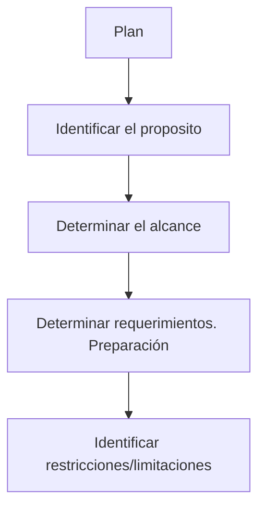

## Planear un test de penetración

**Proposito** &rarr; ¿Qué necesita el cliente?

- Le gustaría conocer la solidez de sus servicios web?
- Saber qué puede hacer una amenaza interna en su infraestructura TI? 
- Comprobar si es posible extraer datos simples de la base de datos del cliente?
- …

**Alcance** &rarr; ¿Hasta dónde se extenderá nuestro análisis? 

- Ataque entre redes
- Ataque a la red interna
- Aplicaciones web
- Redes inalámbricas
- Servidores
- Dispositivos de red
- Sistemas de gestión de bases de datos
- Aplicaciones
- Ingeniería social
- DDoS
- Seguridad física
- … podrían ser todos, pero no todos a la vez!!

**Requerimientos** &rarr; ¿Qué vamos a necesitar?

- Hardware:
  - Portátiles
  - Servidores externos
  - Discos externos,
  - …
- Herramientas software
- Soluciones de monitorización
- Copias de seguridad
- Plan de respuesta ante emergencias

**Restricciones** &rarr; ¿Qué condiciones o limites deberemos respetar?

El pentesting simula acciones *ilegales* y de riesgo que deben ser autorizados por el cliente.

- Acuerdos o contratos
  - reglas de compromiso
  - acuerdo de confidencialidad
- Restricciones
  - Alcance
  - Duración total
  - Tiempos de ataque
  - Métodos (por ejemplo, sin DDoS a sistemas DBMS)

---

Planear un test de penetración es un proceso detallado y meticuloso que requiere una comprensión clara de los objetivos, el alcance, y los recursos disponibles. A continuación, se describen los pasos clave para planificar un test de penetración exitoso:

### 1. **Definir los Objetivos del Test**
   - **Entender las Motivaciones:** Identificar por qué se necesita el test de penetración. Puede ser para cumplir con regulaciones, evaluar la seguridad de un nuevo sistema, o comprobar la robustez de las defensas actuales.
   - **Establecer Metas Específicas:** Definir qué se espera lograr, como identificar vulnerabilidades críticas, evaluar la respuesta ante incidentes, o probar la robustez de la seguridad perimetral.

### 2. **Determinar el Alcance del Test**
   - **Identificación de Activos:** Especificar qué sistemas, aplicaciones, redes, o componentes serán evaluados. Esto incluye servidores, bases de datos, aplicaciones web, dispositivos IoT, etc.
   - **Definición de Límites:** Clarificar qué áreas no deben ser tocadas durante el test, para evitar interrupciones no deseadas en servicios críticos.
   - **Tipos de Pruebas:** Decidir si se realizará un test de caja blanca, negra o gris, y si se centrará en ataques externos, internos, o ambos.

### 3. **Evaluar el Riesgo**
   - **Análisis de Impacto:** Considerar los posibles efectos adversos del test, como la interrupción de servicios, pérdida de datos, o daño reputacional.
   - **Planes de Contingencia:** Establecer planes para mitigar riesgos durante la prueba, como la posibilidad de detener el test si se detecta un impacto no esperado.

### 4. **Seleccionar el Equipo de Pentesters**
   - **Interno vs. Externo:** Decidir si el test será realizado por un equipo interno o si se contratará a una empresa especializada. Los equipos externos suelen ofrecer una visión más imparcial.
   - **Competencias y Certificaciones:** Asegurarse de que el equipo cuenta con las habilidades necesarias y certificaciones relevantes (por ejemplo, CEH, OSCP, CISSP).

### 5. **Establecer los Términos y Condiciones**
   - **Aprobación y Autorización:** Obtener la aprobación formal de la alta dirección y asegurar que todos los involucrados estén informados y de acuerdo con el test.
   - **Acuerdo de Nivel de Servicio (SLA):** Definir los tiempos de respuesta y otros parámetros de servicio.
   - **Aspectos Legales:** Asegurarse de cumplir con todas las leyes y regulaciones aplicables, incluyendo la obtención de los permisos necesarios para realizar pruebas en sistemas o redes.

### 6. **Desarrollar un Plan de Ejecución**
   - **Cronograma:** Establecer un calendario con fechas específicas para cada fase del test, incluyendo la preparación, ejecución, y análisis.
   - **Asignación de Recursos:** Identificar los recursos técnicos y humanos necesarios para cada fase del test.
   - **Metodología:** Definir las técnicas y herramientas que se utilizarán, como escáneres de vulnerabilidades, herramientas de explotación, y técnicas de ingeniería social.

### 7. **Comunicación y Coordinación**
   - **Informar a las Partes Involucradas:** Asegurar que todas las partes relevantes, como el equipo de TI, seguridad, y la dirección, estén informadas sobre el plan y sepan cómo actuar durante el test.
   - **Establecer un Canal de Comunicación:** Crear un canal de comunicación claro para reportar cualquier problema o hallazgo durante el test.

### 8. **Ejecución del Test**
   - **Monitoreo en Tiempo Real:** Supervisar la ejecución del test para identificar cualquier problema inmediato y tomar decisiones en tiempo real si es necesario.
   - **Documentación:** Registrar detalladamente cada paso, técnica utilizada, y hallazgo, para facilitar el análisis posterior.

### 9. **Análisis y Reporte de Resultados**
   - **Análisis de Vulnerabilidades:** Evaluar todas las vulnerabilidades encontradas, clasificarlas según su criticidad, y entender su impacto potencial.
   - **Reporte:** Elaborar un informe detallado que incluya:
     - Resumen ejecutivo para la alta dirección.
     - Detalle técnico de cada vulnerabilidad.
     - Recomendaciones para la mitigación.
     - Plan de acción para corregir las vulnerabilidades.

### 10. **Mitigación y Revisión**
   - **Corrección de Vulnerabilidades:** Trabajar en conjunto con los equipos de TI para mitigar las vulnerabilidades identificadas.
   - **Revisión Post-Test:** Realizar una revisión del proceso de pentesting para identificar lecciones aprendidas y mejorar futuros test.
   - **Repetición de Pruebas:** Considerar la posibilidad de realizar pruebas adicionales después de las correcciones para asegurar que las vulnerabilidades han sido mitigadas efectivamente.

### 11. **Documentación y Seguimiento**
   - **Mantener un Registro Completo:** Documentar todo el proceso, los hallazgos, y las medidas tomadas. Esto es crucial para auditorías futuras y para el seguimiento continuo de la seguridad.
   - **Monitorización Continua:** Establecer mecanismos de monitorización continua para detectar posibles reapariciones de vulnerabilidades o nuevas amenazas.

Siguiendo estos pasos, se puede planificar y ejecutar un test de penetración efectivo que no solo identifique vulnerabilidades, sino que también ayude a fortalecer la postura de seguridad de la organización.