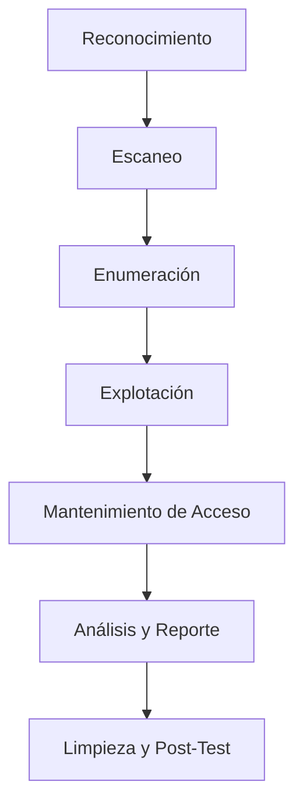

# Fases del test de penetración

Un test de penetración se divide en varias fases, cada una de las cuales cumple un papel crucial en la identificación, explotación y mitigación de vulnerabilidades en un sistema. A continuación se describen las fases junto con un diagrama de flujo creado con Mermaid para ilustrar el proceso:

### 1. **Fase de Reconocimiento (Reconnaissance)**
   - **Objetivo:** Recopilar la mayor cantidad de información posible sobre el objetivo. Esta fase puede ser pasiva (sin interactuar directamente con el objetivo) o activa (interactuando directamente con el objetivo). Determinar la superficie susceptible de recibir ataques.
   - **Actividades Clave:**
     - Recolección de información pública (Whois, DNS, IP).
     - Análisis de redes sociales.
     - Identificar máquinas activas.
     - Identificación de empleados y direcciones de correo electrónico.

### 2. **Fase de Escaneo (Scanning)**
   - **Objetivo:** Identificar puertos abiertos, servicios activos y posibles vulnerabilidades utilizando la información recopilada durante la fase de reconocimiento.
   - **Actividades Clave:**
     - Escaneo de puertos y servicios.
     - Descubrir puertos abiertos y puntos de acceso.
     - Análisis de versiones de S.O. y software.
     - Mapeo de la red.
     - Identificar y clasificar posibles vulnerabilidades.

### 3. **Fase de Enumeración (Enumeration)**
   - **Objetivo:** Obtener información detallada sobre el sistema y los servicios descubiertos durante el escaneo. Aquí se busca identificar posibles puntos de entrada.
   - **Actividades Clave:**
     - Enumeración de usuarios y grupos.
     - Extracción de banners de servicios.
     - Enumeración de shares en sistemas SMB.
     - Búsqueda de credenciales y sesiones activas.

### 4. **Fase de Explotación (Exploitation)**
   - **Objetivo:** Explotar las vulnerabilidades identificadas para obtener acceso no autorizado al sistema, elevar privilegios, o comprometer el entorno.
   - **Actividades Clave:**
     - Ejecución de exploits específicos.
     - Pruebas de fuerza bruta de contraseñas.
     - Inyección de código (SQL, XSS, etc.).
     - Compromiso de cuentas y sistemas.

### 5. **Fase de Mantenimiento de Acceso (Post-Exploitation)**
   - **Objetivo:** Una vez que se ha obtenido acceso al sistema, se implementan mecanismos para mantener ese acceso y explorar más a fondo el entorno.
   - **Actividades Clave:**
     - Instalación de backdoors o rootkits.
     - Creación de cuentas de usuario adicionales.
     - Establecimiento de persistencia.
     - Movimiento lateral en la red.

### 6. **Fase de Análisis y Reporte**
   - **Objetivo:** Analizar todos los hallazgos, documentar las vulnerabilidades encontradas y proporcionar recomendaciones para mitigar los riesgos.
   - **Actividades Clave:**
     - Clasificación de vulnerabilidades por criticidad.
     - Elaboración de informes detallados y ejecutivos.
     - Recomendaciones para correcciones.
     - Plan de acción para mitigación.

### 7. **Fase de Limpieza y Post-Test**

   - **Objetivo:** Eliminar cualquier rastro del test de penetración (por ejemplo, eliminar backdoors, restaurar configuraciones) y realizar una revisión del proceso.
   - **Actividades Clave:**
     - Eliminación de archivos y cuentas creadas.
     - Reversión de cambios en el sistema.
     - Revisión de lecciones aprendidas.
     - Recomendaciones para futuras pruebas.

Este diagrama de flujo representa las fases principales de un test de penetración. Cada fase es esencial para lograr un análisis exhaustivo de la seguridad del sistema objetivo y para garantizar que todas las vulnerabilidades sean descubiertas, explotadas, documentadas, y finalmente mitigadas.

### Informes

Al finalizar las pruebas de penetración elaborar un informe detallado de los test realizados, los resultados obtenidos y las recomendaciones de mitigación adecuadas para el escenario analizado.

Un informe de test de penetración es un documento detallado que describe los resultados de un análisis de seguridad realizado en un sistema o red. Este informe tiene como objetivo identificar vulnerabilidades, evaluar la eficacia de las medidas de seguridad existentes y proporcionar recomendaciones para mejorar la seguridad. A continuación se describe la estructura típica de un informe de test de penetración:

### 1. **Resumen Ejecutivo**
   - **Objetivo del Pentest**: Una descripción clara de los objetivos del test, como identificar vulnerabilidades críticas o evaluar la resistencia frente a un ataque.
   - **Alcance**: Detalle de los sistemas, aplicaciones o redes que fueron probados, incluyendo IPs, URLs, y cualquier restricción aplicada durante el test.
   - **Resultados Resumidos**: Un resumen de los principales hallazgos, clasificados por su gravedad (Alta, Media, Baja).
   - **Conclusiones**: Evaluación general del estado de seguridad del sistema y recomendaciones clave para la dirección ejecutiva.

### 2. **Metodología**
   - **Enfoque del Test**: Descripción de la metodología utilizada, como OWASP, PTES (Penetration Testing Execution Standard), o cualquier otro marco específico.
   - **Tipos de Pruebas Realizadas**: Se detallan las pruebas ejecutadas, que pueden incluir análisis estático, dinámico, de caja blanca, caja negra, y caja gris.
   - **Herramientas Utilizadas**: Lista de herramientas de software y hardware empleadas para llevar a cabo el pentest.

### 3. **Hallazgos Detallados**
   - **Descripción de Vulnerabilidades**: Cada vulnerabilidad encontrada se describe en detalle, incluyendo:
     - **ID de la Vulnerabilidad**: Un identificador único para cada hallazgo.
     - **Descripción**: Explicación de la vulnerabilidad.
     - **Impacto Potencial**: Qué podría suceder si la vulnerabilidad es explotada.
     - **Evidencia**: Pruebas de que la vulnerabilidad existe, como capturas de pantalla, logs, o resultados de pruebas.
     - **Gravedad**: Clasificación de la severidad (por ejemplo, usando la escala CVSS).
     - **Recomendaciones**: Sugerencias para mitigar o corregir la vulnerabilidad.
     - **Estado**: Indicación de si la vulnerabilidad fue resuelta o sigue abierta (si es un retest).
   - **Casos de Prueba**: Descripción de los escenarios probados y los resultados obtenidos.

### 4. **Análisis de Impacto**
   - **Evaluación de Riesgos**: Análisis del riesgo potencial que representa cada vulnerabilidad encontrada para el negocio.
   - **Matriz de Riesgos**: Puede incluir una tabla que cruce la probabilidad de explotación con el impacto potencial, proporcionando una visión visual del riesgo.

### 5. **Recomendaciones Generales**
   - **Mejoras de Seguridad**: Recomendaciones a nivel general para mejorar la postura de seguridad.
   - **Prioridades de Mitigación**: Sugerencias sobre cómo priorizar las correcciones basadas en la gravedad y el impacto de las vulnerabilidades.
   - **Buenas Prácticas**: Consejos adicionales para fortalecer la seguridad en el futuro.

### 6. **Conclusión**
   - Resumen de los hallazgos clave y su impacto en la seguridad general del sistema o red.
   - Llamada a la acción para implementar las recomendaciones y planificar un retest, si es necesario.

### 7. **Apéndices**
   - **Detalle Técnico**: Información técnica adicional que no fue incluida en el cuerpo principal del informe.
   - **Logs, Scripts, y Herramientas**: Resultados de los escaneos, scripts personalizados, o configuraciones específicas usadas durante el pentest.
   - **Referencias**: Citas a normativas, estándares o bibliografía relevante que soporta las recomendaciones.

Este tipo de informe es crítico para que las organizaciones comprendan su postura de seguridad actual y tomen medidas para proteger sus activos más valiosos contra posibles ataques.