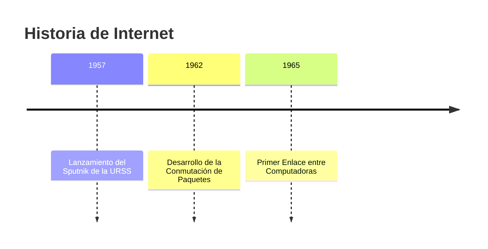
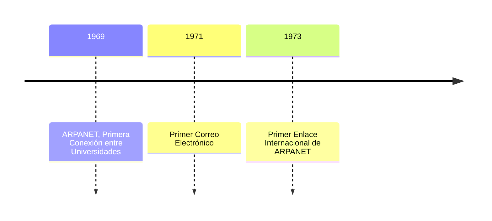
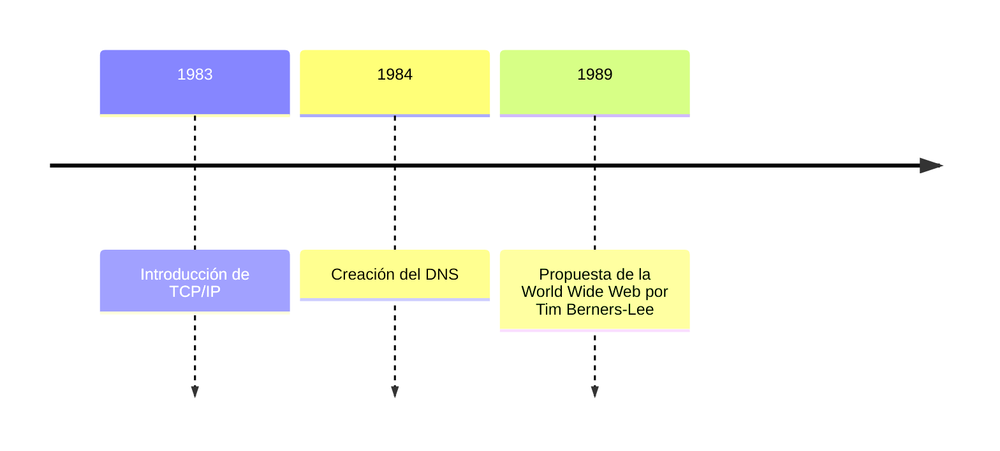
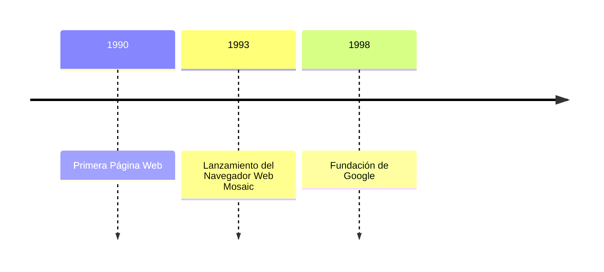
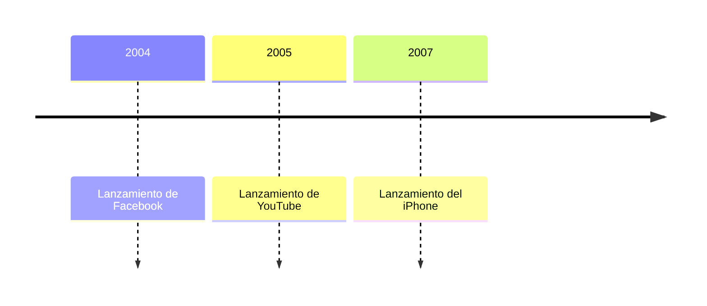
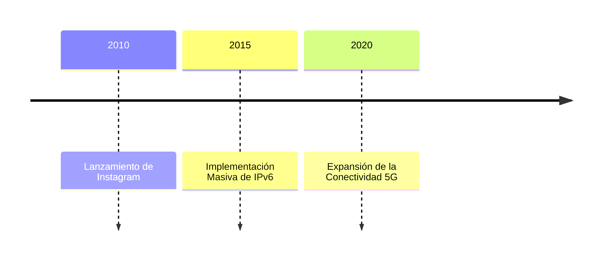

# Historia de Internet

### Hitos

1. **Pre-Internet**: Cubriendo eventos clave como el desarrollo de la conmutación de paquetes y el primer enlace entre computadoras.
2. **ARPANET y Primeros Años**: Incluye la creación de ARPANET, el primer correo electrónico, y la introducción de TCP/IP.
3. **Expansión y Nacimiento de la World Wide Web**: Destaca la propuesta de la World Wide Web por Tim Berners-Lee y la creación del DNS.
4. **Era Moderna de Internet**: Incluye el lanzamiento de plataformas modernas y tecnologías como el iPhone, Instagram, IPv6 y 5G.

