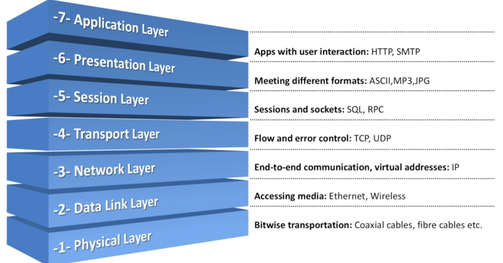
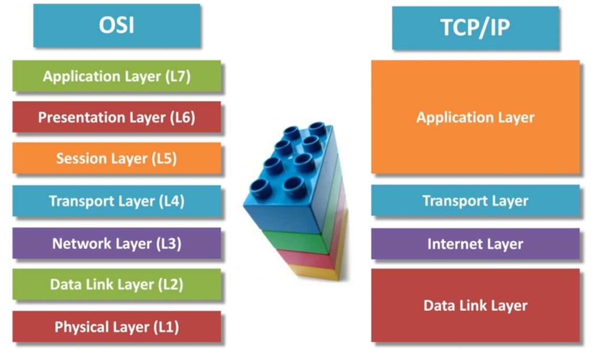

# Modelos OSI y TCP/IP

Los modelos OSI y TCP/IP son marcos teóricos utilizados para entender y estructurar el funcionamiento de las redes de comunicaciones. Ambos modelos dividen el proceso de comunicación en capas, pero difieren en su estructura y enfoque.

### Modelo OSI (Open Systems Interconnection)
El modelo OSI, desarrollado por la ISO (International Organization for Standardization) en 1984, es un marco conceptual que divide las funciones de una red de comunicaciones en siete capas. Cada capa tiene un conjunto de funciones específicas y se comunica con las capas adyacentes.

1. **Capa Física**:
   - Responsable de la transmisión de bits a través de medios físicos (cables, ondas de radio).
   - Define características como voltajes, frecuencias y distancias.
   
2. **Capa de Enlace de Datos**:
   - Gestiona la transmisión de datos entre dos dispositivos en la misma red.
   - Controla el acceso al medio y la detección/corrección de errores.
   - Protocolo típico: Ethernet.

3. **Capa de Red**:
   - Encargada de enrutar los paquetes de datos a través de diferentes redes.
   - Se encarga del direccionamiento lógico y la gestión del tráfico.
   - Protocolo típico: IP (Internet Protocol).

4. **Capa de Transporte**:
   - Garantiza la transferencia confiable de datos entre dos dispositivos finales.
   - Maneja la segmentación, reensamblaje y control de flujo.
   - Protocolos típicos: TCP (Transmission Control Protocol), UDP (User Datagram Protocol).

5. **Capa de Sesión**:
   - Gestiona y controla las conexiones (sesiones) entre dos dispositivos.
   - Sincroniza el diálogo entre aplicaciones.

6. **Capa de Presentación**:
   - Se encarga de la traducción, cifrado y compresión de datos.
   - Asegura que los datos sean presentados en un formato comprensible para la aplicación.

7. **Capa de Aplicación**:
   - Proporciona servicios de red a las aplicaciones del usuario final.
   - Protocolos típicos: HTTP, FTP, SMTP.

### Modelo TCP/IP (Transmission Control Protocol/Internet Protocol)
El modelo TCP/IP, desarrollado por el Departamento de Defensa de los Estados Unidos en los años 70, es el marco de referencia para la suite de protocolos que forman la base de Internet. Tiene una estructura más simple que el modelo OSI, con solo cuatro capas.

1. **Capa de Acceso a la Red (o Enlace de Datos)**:
   - Combina las funciones de las capas Física y de Enlace de Datos del modelo OSI.
   - Se ocupa de la transmisión de datos a través de la red local.

2. **Capa de Internet**:
   - Equivalente a la Capa de Red del modelo OSI.
   - Responsable del direccionamiento y enrutamiento de los paquetes a través de la red.
   - Protocolo principal: IP.

3. **Capa de Transporte**:
   - Similar a la Capa de Transporte del modelo OSI.
   - Proporciona comunicación entre dispositivos de forma confiable o no confiable.
   - Protocolos principales: TCP, UDP.

4. **Capa de Aplicación**:
   - Combina las funciones de las capas de Aplicación, Presentación y Sesión del modelo OSI.
   - Proporciona servicios para las aplicaciones del usuario final.
   - Protocolos principales: HTTP, FTP, SMTP, DNS.

### Comparación
- **Número de Capas**: El modelo OSI tiene 7 capas, mientras que el modelo TCP/IP tiene 4.
- **Desarrollo**: El modelo OSI es más teórico y fue desarrollado como una referencia estándar, mientras que el modelo TCP/IP es más práctico y se basa en la experiencia acumulada en el desarrollo de la red ARPANET.
- **Implementación**: TCP/IP es el modelo utilizado en Internet y en la mayoría de las redes modernas, mientras que el modelo OSI es más usado como una herramienta educativa.

Ambos modelos son fundamentales para entender cómo funcionan las redes de computadoras y cómo se interconectan diferentes sistemas y dispositivos.

---

_ref:_ 

http://searchnetworking.techtarget.com/definition/OSI

[Network security | Resources and Information from TechTarget](https://www.techtarget.com/searchnetworking/resources/Network-Security)

