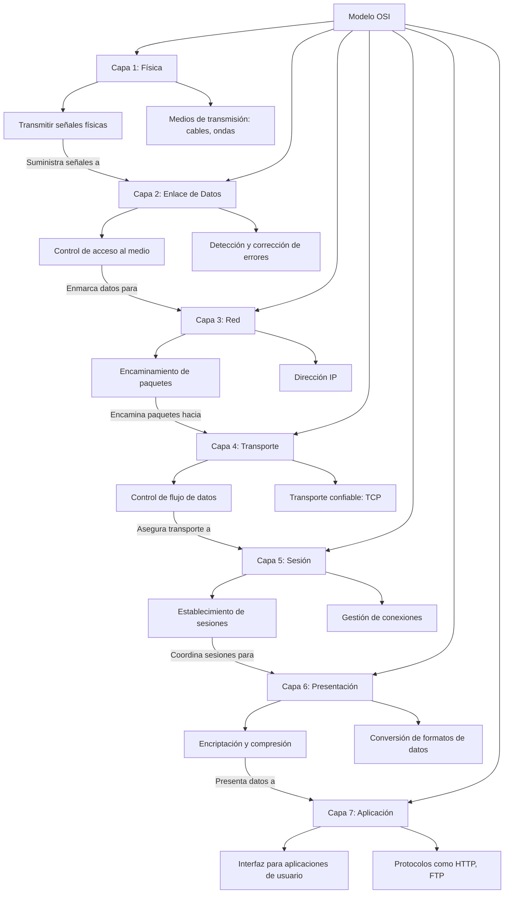

# MODELO OSI

**Capas del Modelo OSI:**

1. **Capa 1: Física**: Medios, señales y transmisión binaria &rarr; RS-232, RJ45, V.34, 100BASE-TX, SHD, DSL, 802.11
2. **Capa 2: Enlace de Datos**: Direccionamiento físico &rarr; Ethernet, 802.11, MAC/LLC, VALN, ATM, HDP, Canal de fibra, Frame Relay, HDLC, PPP, Q.921, Token Ring
3. **Capa 3: Red**: Determinación de ruta y direccionamiento lógico &rarr; IP, ARP, IPsec, ICMP, IGMP, OSPF
4. **Capa 4: Transporte**: Conexiones de extremo a extremo y confiabilidad &rarr; TCP, UDP, SCTP, SSL, TSL
5. **Capa 5: Sesión**: Comunicación entre hosts &rarr; Establecimiento de sesión en TCP, SIP, RTP, RPC-Named pipes
6. **Capa 6: Presentación**: Representación de datos y encriptación &rarr; Reconocimiento de datos: HTML, DOC, JPEG, MP3, AVI, Sockets
7. **Capa 7: Aplicación**: Proceso de red hasta la aplicación &rarr; DNS, WWW/HTTP, P2P, EMAIL/POP, SMTP, Telnet, FTP