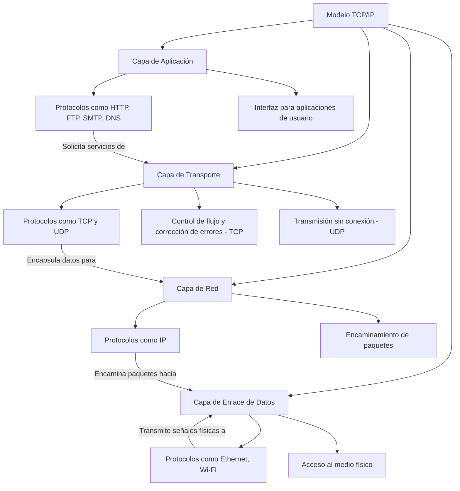

# MODELO TCP/IP

**Capas del modelo TCP/IP**

- **Capa de Aplicación:** Protocolo de alto nivel que proporciona servicios de red a las aplicaciones.

- **Capa de Transporte:** Maneja la comunicación entre sistemas finales, asegurando la entrega de datos.

- **Capa de Red:** Encaminamiento y direccionamiento de paquetes a través de la red.

- **Capa de Enlace de Datos:** Controla la transmisión de datos a través de los medios físicos.