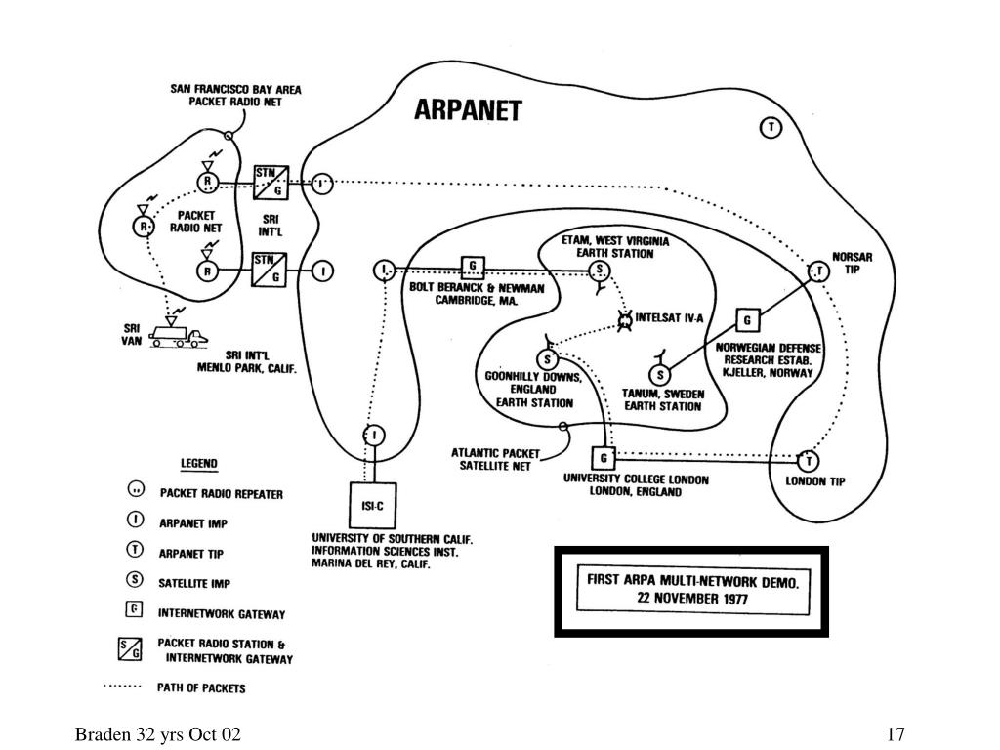

### ¿Qué es Internet?

Internet es una red global de redes que conecta millones de dispositivos en todo el mundo, permitiendo la comunicación y el intercambio de datos entre ellos. Se puede considerar como una infraestructura tecnológica que facilita la transmisión de información a través de diversos medios, como cables, satélites y señales inalámbricas. 

#### **Componentes Clave de Internet:**
- **Servidores**: Computadoras que almacenan sitios web, aplicaciones y otros recursos accesibles a través de Internet.
- **Clientes**: Dispositivos que acceden a los recursos almacenados en los servidores, como computadoras, smartphones, y tabletas.
- **Proveedores de Servicios de Internet (ISP)**: Compañías que proporcionan acceso a Internet a usuarios y organizaciones.
- **Direcciones IP**: Identificadores únicos asignados a cada dispositivo en la red para que pueda ser localizado y comunicarse con otros dispositivos.
- **DNS (Sistema de Nombres de Dominio)**: Sistema que traduce nombres de dominio legibles para humanos (como www.example.com) en direcciones IP que los dispositivos pueden usar.

### ¿Qué son las Redes IT?

Las redes IT (Tecnología de la Información) son conjuntos de dispositivos interconectados que permiten la comunicación y el intercambio de datos entre sí. Estas redes pueden variar en tamaño, desde una pequeña red local (LAN) en una oficina hasta grandes redes que abarcan múltiples ubicaciones geográficas (WAN, o red de área amplia).

#### **Tipos de Redes IT:**
- **LAN (Red de Área Local)**: Red que conecta dispositivos en un área geográfica limitada, como una oficina o un edificio.
- **WAN (Red de Área Amplia)**: Red que conecta dispositivos a través de áreas geográficas más grandes, como diferentes ciudades o países.
- **MAN (Red de Área Metropolitana)**: Red que cubre un área geográfica extensa, como una ciudad, y se utiliza para conectar múltiples LAN.
- **VPN (Red Privada Virtual)**: Red que utiliza Internet para crear una conexión segura y privada entre dispositivos remotos.

#### **Funciones de las Redes IT:**
- **Compartir Recursos**: Permitir que varios dispositivos compartan recursos, como impresoras y almacenamiento.
- **Comunicaciones**: Facilitar la comunicación entre dispositivos, como el correo electrónico, la mensajería instantánea y las videollamadas.
- **Acceso a Información**: Proveer acceso a bases de datos, aplicaciones y otros recursos digitales.

### ¿Qué son los Protocolos y Qué Cometido Tienen?

Los protocolos son conjuntos de reglas y estándares que determinan cómo se envían y reciben datos a través de una red. Los protocolos aseguran que los dispositivos en una red puedan comunicarse entre sí de manera eficiente y sin errores, a pesar de las diferencias en sus fabricantes o sistemas operativos.

#### **Funciones de los Protocolos:**
- **Definir Formatos de Datos**: Especificar cómo se estructuran y formatean los datos para que puedan ser interpretados correctamente por los dispositivos receptores.
- **Establecer Conexiones**: Gestionar cómo se establecen y mantienen las conexiones entre dispositivos, como las conexiones TCP (Transmission Control Protocol).
- **Controlar el Flujo de Datos**: Asegurar que los datos se envíen a una velocidad que los dispositivos puedan manejar, previniendo la sobrecarga de la red.
- **Detectar y Corregir Errores**: Proporcionar mecanismos para detectar y corregir errores que puedan ocurrir durante la transmisión de datos.

#### **Ejemplos de Protocolos Comunes:**
- **TCP/IP (Transmission Control Protocol/Internet Protocol)**: Protocolo fundamental para Internet que gestiona la conexión y el intercambio de datos entre dispositivos.
- **HTTP/HTTPS (Hypertext Transfer Protocol/Secure HTTP)**: Protocolo utilizado para la transferencia de páginas web entre un servidor y un navegador.
- **FTP (File Transfer Protocol)**: Protocolo utilizado para transferir archivos entre un cliente y un servidor en una red.
- **SMTP (Simple Mail Transfer Protocol)**: Protocolo utilizado para enviar correos electrónicos.
- **DNS (Domain Name System)**: Protocolo que traduce nombres de dominio en direcciones IP.

### **Conclusión**

- **Internet**: Una red global que conecta millones de dispositivos y facilita el intercambio de información.
- **Redes IT**: Conjuntos de dispositivos interconectados que permiten la comunicación y el intercambio de datos en diferentes entornos, desde oficinas pequeñas hasta empresas globales.
- **Protocolos**: Reglas y estándares que permiten la comunicación eficiente y segura entre dispositivos en una red, asegurando la interoperabilidad y el flujo correcto de datos.

____

_ref:_ https://www.computerhistory.org/timeline/networking-the-web/