# Wireshark

Wireshark es una herramienta de análisis de protocolos de red de código abierto que permite capturar y examinar el tráfico que circula a través de una red informática en tiempo real. Es ampliamente utilizada por administradores de redes, ingenieros de seguridad y otros profesionales de TI para diagnosticar problemas de red, analizar paquetes de datos, y detectar vulnerabilidades o intrusiones.

## ¿Qué es Wireshark?

Wireshark es un analizador de paquetes que permite a los usuarios capturar y visualizar los datos que viajan a través de una red en tiempo real. Los datos capturados pueden provenir de diferentes fuentes, como interfaces de red, archivos de captura de otros programas, o incluso de dispositivos remotos.

Probar Wireshark es una excelente manera de familiarizarte con el análisis de tráfico de red. A continuación, te guiaré paso a paso para instalar Wireshark, realizar una captura de tráfico básica, y analizar los datos capturados.

## **Instalación de Wireshark**

#### En Windows:

1. **Descargar Wireshark**: Ve al [sitio oficial de Wireshark](https://www.wireshark.org/) y descarga la versión adecuada para Windows.
2. **Ejecutar el Instalador**: Abre el archivo descargado y sigue las instrucciones del asistente de instalación. Asegúrate de instalar WinPcap o Npcap si se te solicita, ya que es necesario para capturar paquetes.
3. **Finalizar la Instalación**: Completa la instalación y ejecuta Wireshark.

#### En macOS:

1. **Descargar Wireshark**: Dirígete al [sitio oficial de Wireshark](https://www.wireshark.org/download.html) y descarga la versión para macOS.
2. **Instalar Wireshark**: Arrastra Wireshark a la carpeta de aplicaciones. En algunos casos, puede ser necesario instalar también `ChmodBPF` para obtener permisos de captura de paquetes.
3. **Ejecutar Wireshark**: Abre la aplicación desde la carpeta de aplicaciones.

#### En Linux:

1. **Instalar Wireshark**: En la mayoría de las distribuciones de Linux, Wireshark está disponible en los repositorios de software.

   - En Ubuntu/Debian:

     ```bash
     sudo apt update
     sudo apt install wireshark
     ```

   - En Fedora:

     ```bash
     sudo dnf install wireshark
     ```

   - En Arch Linux:

     ```bash
     sudo pacman -S wireshark-qt
     ```

2. **Ejecutar Wireshark**: Puedes ejecutar Wireshark desde la línea de comandos con el comando `wireshark` o buscarlo en el menú de aplicaciones.

## ¿Para qué sirve Wireshark?

Wireshark tiene varias aplicaciones en el ámbito de la gestión y seguridad de redes, tales como:

1. **Diagnóstico de problemas de red:** Permite a los administradores identificar cuellos de botella, pérdidas de paquetes, y otros problemas que puedan estar afectando el rendimiento de la red.
2. **Análisis de protocolos:** Los ingenieros pueden usar Wireshark para examinar cómo se comportan los protocolos de red y verificar que están funcionando correctamente. Esto incluye protocolos como HTTP, TCP, DNS, y muchos otros.
3. **Seguridad y análisis forense:** Wireshark es una herramienta esencial para los profesionales de seguridad que buscan detectar ataques, analizar tráfico sospechoso o realizar auditorías de seguridad en una red.
4. **Educación y aprendizaje:** Es una herramienta valiosa para estudiantes y profesionales que desean aprender más sobre cómo funcionan los protocolos de red y la estructura de los paquetes de datos.

## Ejemplos de uso de Wireshark

1. **Captura de paquetes en una red local:** Supongamos que un administrador de red nota que los usuarios están experimentando una latencia inusual en la red. Usando Wireshark, puede capturar el tráfico en tiempo real y analizar los paquetes para identificar si hay retransmisiones excesivas, pérdidas de paquetes, o problemas con algún dispositivo específico.
2. **Análisis de un ataque de red:** Imagina que un equipo de seguridad sospecha que hay actividad maliciosa en la red. Pueden usar Wireshark para capturar el tráfico y buscar patrones comunes en los ataques, como escaneos de puertos, intentos de acceso no autorizado, o comunicaciones con servidores de comando y control.
3. **Resolución de problemas de DNS:** Si los usuarios reportan problemas al intentar acceder a ciertos dominios, un ingeniero puede usar Wireshark para capturar las consultas DNS y ver si los paquetes están llegando al servidor DNS, si hay respuestas, y si las respuestas son correctas.
4. **Verificación de tráfico encriptado:** Aunque Wireshark no puede descifrar tráfico cifrado (como HTTPS), puede ser usado para verificar que la comunicación está efectivamente encriptada. Por ejemplo, al analizar una conexión HTTPS, un analista puede ver el handshake SSL/TLS y confirmar que se establece una conexión segura.

Wireshark es una herramienta extremadamente poderosa y flexible, y su uso adecuado requiere conocimientos sobre redes y protocolos. Sin embargo, es invaluable para entender y gestionar el tráfico de red de manera efectiva.

Wireshark se ejecuta sobre la mayoría de sistemas operativos Unix y compatibles, incluyendo Linux, Solaris, FreeBSD, NetBSD, OpenBSD, Android, y Mac OS X, así como en Microsoft Windows.

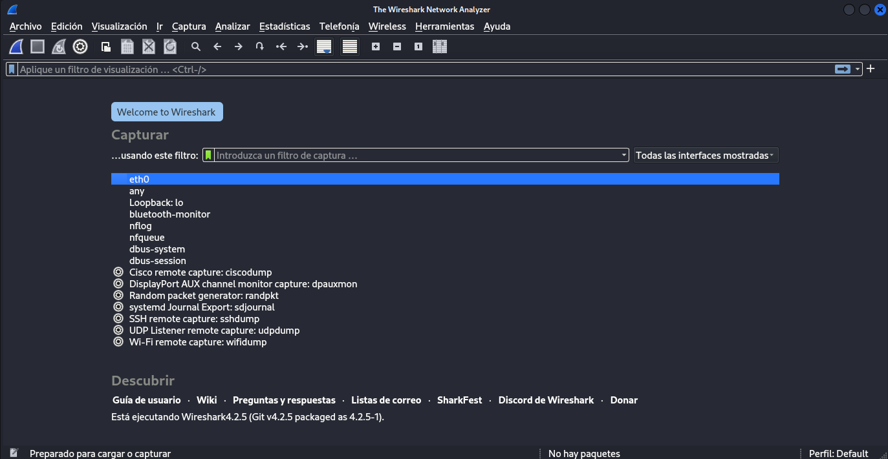

Cuando inicias Wireshark, se ve una pantalla con las diferentes interfaces de red del sistema, así como un gráfico que indica la actividad de la red en cada interfaz. 

*En el entorno Linux, la captura de paquetes de bajo nivel suele requerir acceso como ``root``, por lo que será necesario ejecutarlo elevando los permisos.*

Solo hay que hacer doble clic en la interfaz de red que se conecta a la red que desea capturar, y Wireshark abre una  nueva ventana en la se muestran los paquetes transmitidos por la red. Wireshark tiene la capacidad de escuchar y grabar el tráfico en cualquiera de los  interfaces de red del sistema. Además, Wireshark ofrece muchas opciones y filtros para mejorar la visualización de los datos capturados. Wireshark puede [guardar los paquetes de datos](https://www.reydes.com/d/?q=Guardar_Paquetes_Capturados_en_Wireshark) en su formato nativo para archivos (``.pcapng``), y en los formatos de archivos de otros analizadores de protocolos, de tal manera otras herramientas puedan leer los datos capturados.

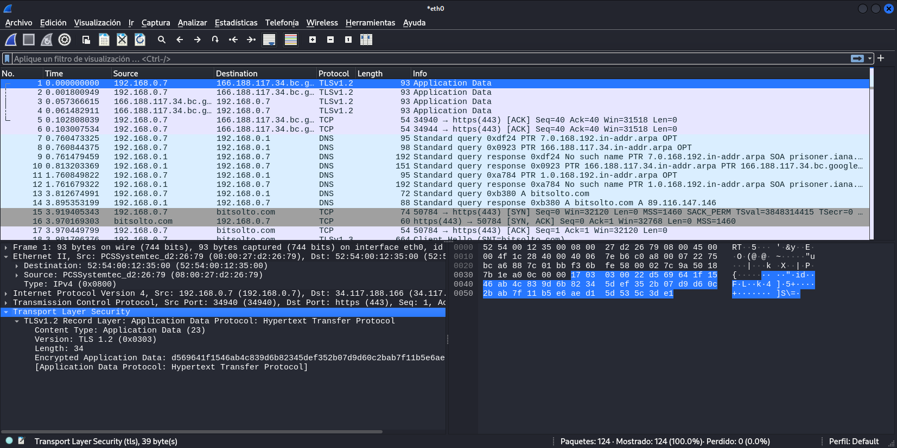

En el panel superior, que se muestra en la captura de pantalla, se muestra la información contenida en las cabeceras de cada paquete, incluido, por defecto, un índice de tiempo que muestra el tiempo transcurrido entre el inicio de la captura y el momento en que se analizó el paquete. Se puede ajustar el formato de tiempo y guardar los datos del temporizador con la captura para recuperar la hora real en que se envió el paquete analizado. También se muestran las direcciones IP de origen y destino del paquete, el protocolo en uso, la longitud y diversa información. Para conocer los detalles de cada uno de los paquetes que se muestran solo hay que hacer clic en la línea deseada.

El panel central contiene detalles pormenorizados sobre el paquete seleccionado en el panel superior. 

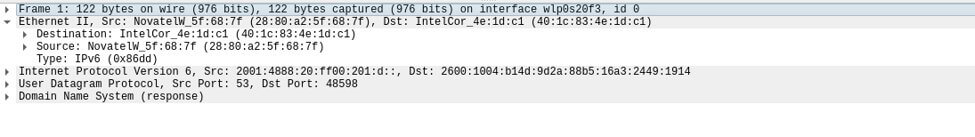

Esta cabecera indica las direcciones MAC de origen y destino, así como la identidad del siguiente protocolo de la pila: IPv6. A continuación, puede analizar la cabecera IPv6.

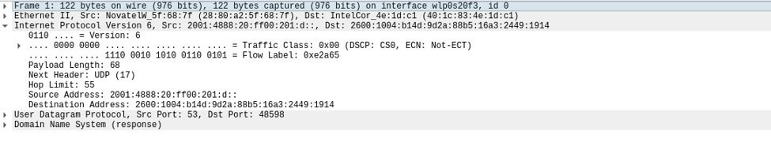

Aquí encontrarás las direcciones IP de origen -*Source Address*- y destino -*Destination Address*-, así como información específica de IP (en la imagen superior se muestra la versión IPV6). Puedes navegar dentro de la pila, viendo información detallada sobre cada capa, o navegar por los protocolos superpuestos. En la siguiente imagen se muestra la versión IPv4.

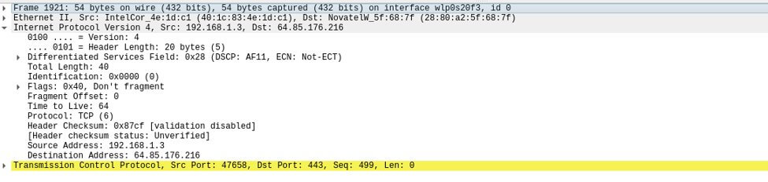

También se puede ver información sobre protocolos de capas superiores, como TCP.


En esta sección se incluye información sobre los puertos TCP de origen y destino, las banderas establecidas en el paquete y otros detalles útiles para la resolución de problemas.

En el panel inferior se muestra una visualización hexadecimal del contenido del paquete. Al resaltar aquí cualquiera de los datos,  en el panel central se muestran los detalles del protocolo, como se observa en la siguiente imagen:

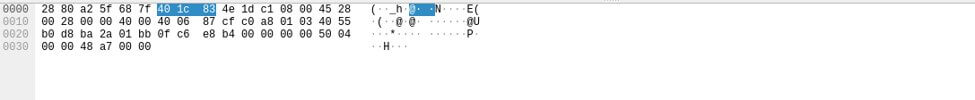

Otra función útil de Wireshark es dirigir al usuario a la información más relevante sobre los distintos protocolos examinados. Por ejemplo, la siguiente imagen ilustra el escenario de acceso a un sitio HTTP, en este caso neverssl.com, y la información de tráfico sin procesar a nivel de aplicación que allí se presenta.

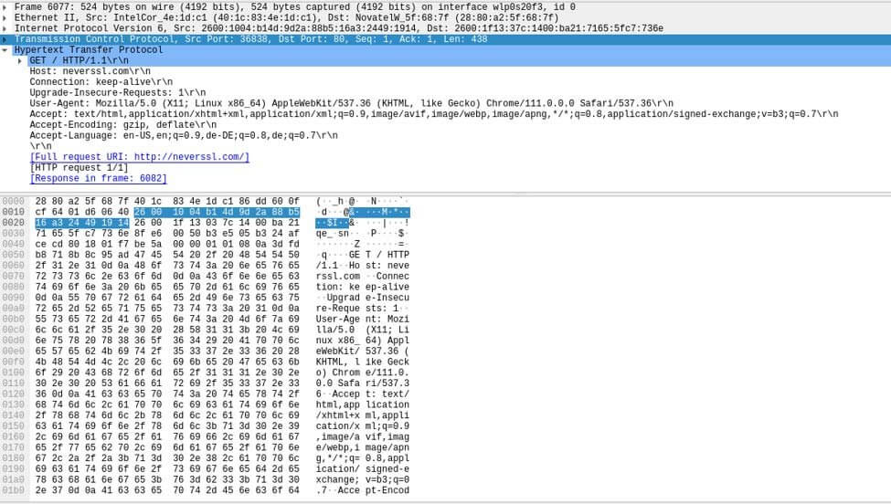

##  Opciones de captura de datos

Además de la captura por defecto, o básica, de paquetes; Wireshark permite configurar dicha captura. Puedes configurar la captura accediendo a “Opciones de captura”

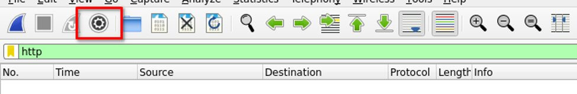

Al hacer clic en este botón se abre la ventana “Interfaces de captura” con tres pestañas. La pestaña Entrada le permite editar las interfaces de Wireshark y activar el modo promiscuo, para capturar el tráfico de red que no está dirigido específicamente al sistema de captura.

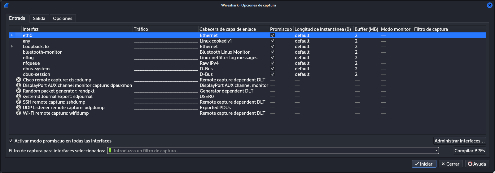

La pestaña Salida (Output) controla dónde almacena Wireshark los paquetes capturados. Puede hacerlo automáticamente en un archivo temporal, en un archivo ``*.pcapng`` o `*.pcap`. También se pueden crear varios archivos, en función de la cantidad de datos capturados o del tiempo transcurrido.

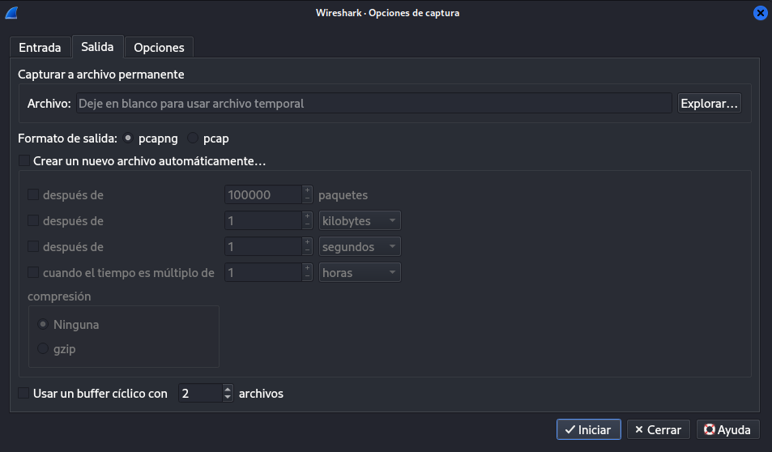

En la pestaña Opciones le permite elegir el modo de visualización de los paquetes y las opciones para los nombres MAC y DNS, así como limitar el tamaño de las capturas de paquetes. Algunas de estas opciones pueden ayudar a mejorar el rendimiento de Wireshark. Por ejemplo, se pueden ajustar las opciones para evitar problemas con los nombres, que de otro modo retrasarían el sistema de captura y generarían muchas consultas. Los límites de tiempo y tamaño también pueden poner límites a las capturas desatendidas.

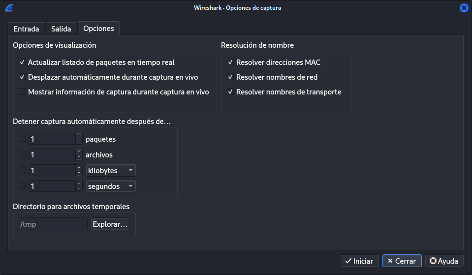

### Interpretar y analizar el contenido de los paquetes

El uso de filtros proporciona mejoras muy útiles para el análisis de los datos capturados, lo que ayuda a encontrar información útil entre el flujo de datos. Obtener los datos correctos sin los filtros adecuados es casi imposible incluso en una red de tamaño moderado, por no hablar de una red con mucho trafico o de gran tamaño.

Wireshark dispone de varios tipos de filtros. Puedes ordenar los datos adquiridos utilizando alguno de los filtros de visualización. Cada filtro escoge o limita lo que se muestra en la pantalla. El control más potente de toda la herramienta es probablemente el cuadro de edición que contribuye a facilitar el análisis de datos.

Wireshark dispone de dos tipos de filtros principales: **filtros de captura** y **filtros de visualización**. Ambos son fundamentales para trabajar de manera eficiente con Wireshark, pero cumplen funciones diferentes.

### Filtros de Captura

Los filtros de captura se aplican **antes** de comenzar la captura de tráfico. Estos filtros determinan qué paquetes serán capturados y guardados por Wireshark. Si un paquete no coincide con el filtro de captura especificado, no se capturará ni se almacenará. Esto es útil cuando solo se desea capturar un subconjunto específico del tráfico para evitar grandes volúmenes de datos innecesarios. Y son especialmente útiles para capturas prolongadas de tráfico específico.

Mientras que la finalidad de un filtro de visualización es ayudar al análisis y, por tanto, es versátil y flexible, la de un filtro de captura es  limitar la memoria utilizada en la grabación de capturas, por lo que la sintaxis y el nivel de complejidad no son los mismos. Los filtros de captura utilizan una sintaxis diferente, mucho más ligera que la necesaria para configurar los filtros de visualización.

- **Sintaxis**:

   Los filtros de captura usan la sintaxis de BPF (Berkeley Packet Filter). Algunos ejemplos incluyen:

  - `host 192.168.1.1`: Captura solo los paquetes que provienen o se dirigen a la dirección IP 192.168.1.1.
  - `port 80`: Captura solo los paquetes que utilizan el puerto 80 (usualmente HTTP).
  - `tcp`: Captura solo los paquetes TCP.

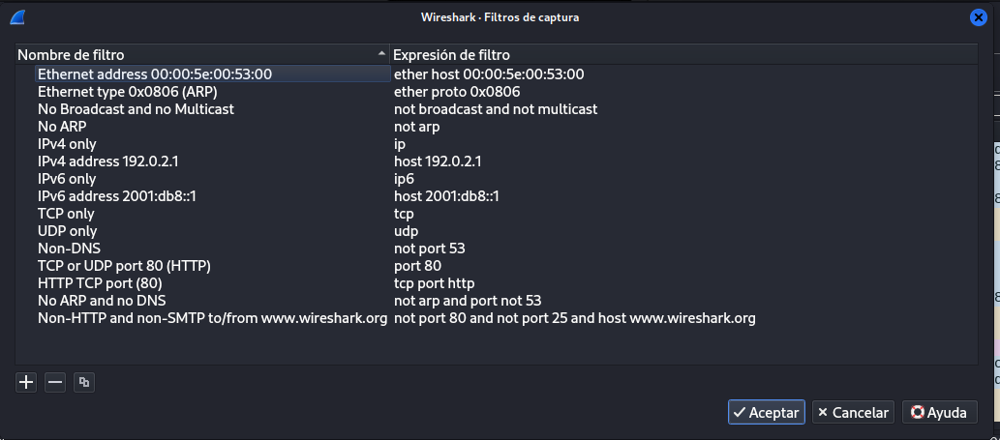


### Filtros de Visualización

Los filtros de visualización, por otro lado, se aplican **después** de que los paquetes han sido capturados. Estos filtros permiten refinar y reducir el conjunto de datos mostrado en la interfaz de Wireshark, facilitando la inspección y análisis del tráfico. Todos los paquetes se capturan, pero solo se mostrarán los que coincidan con el filtro de visualización.

Imagina que soló te interesa el trafico de un determinado protocolo, p.ej. TLS; poniendo la palabra `tls` en la barra de filtro de visualización, verás exclusivamente los resultados del tráfico TLS.

Los filtros pueden ser también más complejos que eso: imita la visualización a los resultados en los que el puerto TCP es 443 y el número de secuencia TCP es 499.

- **Sintaxis**:

   Los filtros de visualización tienen una sintaxis más compleja y poderosa que los filtros de captura. Ejemplos incluyen:

  - `ip.addr == 192.168.1.1`: Muestra solo los paquetes que tienen la dirección IP 192.168.1.1 como fuente o destino.

  - `tcp.port == 80`: Muestra solo los paquetes que utilizan el puerto TCP 80.

  - `http`: Muestra solo los paquetes que contienen tráfico HTTP.

  - `dns && ip.src == 192.168.1.1`: Muestra solo los paquetes DNS con dirección IP de origen 192.168.1.1.

    #### ¿Qué datos devolvería este filtro?

    `tcp.port == 443 && tcp seq == 499`

    Este filtro es bastante específico, y es probable que devuelva un número muy limitado de paquetes, posiblemente solo uno - dependiendo de la captura de red que estés analizando-, ya que está diseñado para mostrar solo los paquetes TCP que cumplen dos condiciones específicas:

    - 1. **tcp.port == 443**: paquetes TCP que están siendo transmitidos a través del puerto 443 , generalmente usado para tráfico HTTPS (HTTP seguro).
      2. **tcp.seq == 499**: y que tienen un número de secuencia TCP (sequence number) exactamente igual a 499.

    En resumen, estamos filtrando los datos para ver solo los paquetes HTTPS que tienen ese número de secuencia en particular.

    Es importante notar que:

    - **Número de secuencia TCP**: Es un número que asigna el emisor para rastrear los datos enviados en un flujo TCP. Cada byte de datos transmitido tiene un número de secuencia único, y este valor ayuda a ambos extremos de la conexión a ensamblar los datos en el orden correcto y detectar cualquier pérdida o duplicación de paquetes.
    - **Puerto 443**: Como este es un puerto comúnmente usado para HTTPS, el filtro estaría aplicándose sobre tráfico cifrado.

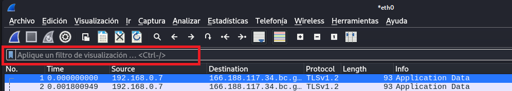

Como la redacción de filtros no es siempre sencilla, la barra de filtro de visualización se pondrá en rojo si el filtro es inconsistente o tiene algún error. Y se pondrá verde si el filtro introducido es correcto. Si el fondo se vuelve amarillo significa que el filtro está funcionando, pero Wireshark nos advierte de que es ambiguo en algún sentido y, por lo tanto, puede no funcionar como se pretende;  o que hay una errata u otro problema sintáctico. 

Par la creación de filtro se pueden utilizar operaciones lógicas como ``AND (&&)``, ``OR (||)``, ``NOT (!)`` e incluso ``XOR (^^)``. También se pueden realizar comparaciones, como igual (``==``), no igual (``!=``), mayor que (``>``), mayor o igual que (``>=``), etc. 

### Diferencias Clave

- **Filtros de Captura:**
  - Se aplican antes de la captura.
  - Limita los datos capturados.
  - Menor carga en la memoria y disco.
- **Filtros de Visualización:**
  - Se aplican después de la captura.
  - Filtra los datos mostrados, pero no afecta los datos capturados.
  - Permite inspección detallada sobre un subconjunto de los datos capturados.

Ambos tipos de filtros son esenciales dependiendo de lo que necesites: capturar solo lo que es relevante o revisar de manera detallada un tráfico ya capturado.

Es útil conocer la diferencia entre filtros de visualización y filtros de captura y saber cuándo y cómo utilizarlos es fundamental para dominar la herramienta.

> Wireshark es una herramienta poderosa que nos puede ayudara a descubrir desde que paquetes viajan por la red hasta la configuración de reglas de firewall o la detección de una intrusión. 
>
> **Recuerda que para capturar el tráfico de una red, siempre vas a necesitar el permiso del propietario de la red.**

## **Captura de Tráfico Básica**

Una vez instalado Wireshark, puedes realizar tu primera captura de tráfico:

#### Paso 1: Iniciar Wireshark
- Abre Wireshark y selecciona la interfaz de red que deseas monitorear. Por ejemplo, `eth0` para Ethernet, `wlan0` para Wi-Fi, o `lo` para el tráfico local en Linux.

#### Paso 2: Iniciar la Captura
- Haz clic en la interfaz deseada y luego en el botón "Start" (o doble clic sobre la interfaz). Wireshark comenzará a capturar todo el tráfico que pasa por esa interfaz.

#### Paso 3: Generar Tráfico
- **Navegación Web**: Abre un navegador web y visita algunas páginas. Esto generará tráfico HTTP/HTTPS que Wireshark capturará.
- **Ping**: Abre una terminal o línea de comandos y ejecuta un comando `ping` hacia un sitio web o dirección IP. Esto generará tráfico ICMP.
  ```bash
  ping www.google.com
  ```

#### Paso 4: Detener la Captura
- Cuando hayas capturado suficiente tráfico, haz clic en el botón "Stop" en la parte superior de la ventana de Wireshark.

## **Analizar los Datos Capturados**

#### Filtrado de Paquetes
- **Filtrar por Protocolo**: En el campo de filtro, escribe el nombre de un protocolo para ver solo esos paquetes. Por ejemplo:
  - `http` para tráfico HTTP.
  - `icmp` para tráfico ICMP (como los resultados de un ping).
  - `arp` para ver los paquetes ARP.

#### Inspección de Paquetes
- **Seleccionar un Paquete**: Haz clic en cualquier paquete para ver sus detalles.
- **Detalles del Paquete**: La vista detallada te mostrará las capas del paquete (Ethernet, IP, TCP, etc.) y la información correspondiente, como direcciones IP, MAC, números de puerto, etc.
- **Segmento de Datos**: En la parte inferior, puedes ver los datos crudos en formato hexadecimal y ASCII.

#### Exportar Capturas
- Si deseas guardar la captura para analizarla más tarde o compartirla, ve a `Archivo > Guardar Como` y guarda el archivo en formato `.pcap` o `.pcapng`.

## **Pruebas y Ejercicios Comunes**

#### Capturar Tráfico HTTP
- **Visitar un Sitio No Seguro**: Visita un sitio web que no use HTTPS (aunque cada vez son más raros), y captura el tráfico. Filtra con `http` y observa las solicitudes y respuestas HTTP, incluyendo el contenido de las mismas.

#### Capturar un Ping (ICMP)
- Realiza un ping a una dirección IP, captura el tráfico, y filtra con `icmp`. Observa el eco de solicitud y respuesta.

#### Analizar un Proceso de ARP
- Filtra con `arp` y observa cómo tu computadora solicita la dirección MAC de una IP y cómo recibe la respuesta.

#### Detección de Tráfico DNS
- Navega a un sitio web y filtra con `dns`. Examina cómo se resuelve el nombre de dominio a una dirección IP.

## **Practicar con Capturas Existentes**

- Wireshark ofrece ejemplos de capturas pregrabadas que puedes descargar y analizar. Esto es útil para aprender a identificar patrones de tráfico sin necesidad de capturarlos en tiempo real. Puedes encontrarlas en sitios como [Wireshark Sample Captures](https://wiki.wireshark.org/SampleCaptures).

### Resumen
Probar Wireshark implica instalar el software, capturar tráfico de red real, y luego analizar ese tráfico utilizando los filtros y herramientas de Wireshark. Es una forma poderosa de aprender sobre redes, resolver problemas de conectividad, y mejorar la seguridad de la red. Al practicar con diferentes tipos de tráfico y situaciones, te volverás más competente en el uso de esta herramienta esencial.

### Ejercicio: Captura de Tráfico HTTP

1. **Configura Wireshark**: Abre Wireshark y selecciona la interfaz de red activa.
2. **Inicia la Captura**: Haz clic en el botón "Start" para comenzar a capturar paquetes.
3. **Navega en la Web**: Abre un navegador web e ingresa a un sitio web sin HTTPS (por ejemplo, http://example.com).
4. **Filtra el Tráfico**: Usa el filtro `http` en Wireshark para mostrar solo los paquetes HTTP.
5. **Analiza los Paquetes**: Identifica solicitudes GET y respuestas HTTP, observando detalles como cabeceras y contenido.

### Objetivo:

Comprender cómo se transmiten datos a través del protocolo HTTP y la importancia de HTTPS para la seguridad.

- https://openwebinars.net/blog/wireshark-que-es-y-ejemplos-de-uso/
- https://www.innovaciondigital360.com/iot/que-es-wireshark-y-casos-de-uso/


---

_ref.:_ https://hackeracademy.uk/

https://www.wireshark.org/docs/