# Instalar Suricata IDS en servidor Ubuntu 24.04

Suricata es un IDS (Sistema de Detección de Intrusos) e IPS (Sistema de Prevención de Intrusos) de código abierto desarrollado por la OSIF (open infosec foundation). Puede supervisar y examinar el tráfico de red y procesar cada paquete para detectar actividades maliciosas en la red. Puedes configurar eventos de registro, activar alertas e incluso eliminar tráfico en caso de actividad sospechosa en la red.

Este tutorial te mostrará cómo instalar Suricata IDS en el servidor Ubuntu 24.04. Instalarás y configurarás Suricata, descargarás firmas y reglas ET y, a continuación, iniciarás Suricata en segundo plano como un servicio systemd.

## Requisitos previos

Para empezar con esta guía, asegúrate de que tienes lo siguiente:

- Un servidor Ubuntu 24.04.
- Un usuario no root con privilegios de administrador.

## Instalación desde el código fuente

En esta sección, aprenderás a instalar Suricata desde el código fuente compilándolo manualmente en tu sistema. Y antes de eso, instalarás las dependencias de los paquetes para compilar Suricata.

En primer lugar, ejecuta el siguiente comando para actualizar el índice de paquetes de Ubuntu e instalar las dependencias de compilación. Introduce **`y`** para confirmar la instalación.

```
sudo apt update
sudo apt install autoconf automake build-essential cargo \
cbindgen libjansson-dev libpcap-dev libcap-ng-dev libmagic-dev liblz4-dev libpcre2-dev libtool \
libyaml-dev make pkg-config rustc zlib1g-dev
```

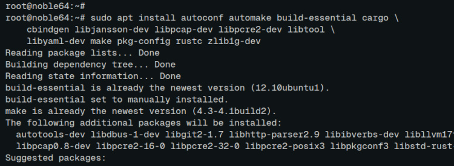

Ahora ve al directorio ``/usr/src`` y ejecuta el siguiente comando para descargar el código fuente de Suricata y extraerlo.

```
cd /usr/src
wget https://www.openinfosecfoundation.org/download/suricata-7.0.6.tar.gz
tar -xf suricata-7.0.6.tar.gz
```

Ve al directorio **‘suricata-7.0.6**‘ y configura la compilación de Suricata con lo siguiente. Con esto, configurarás e instalarás el archivo binario de suricata en el directorio ``/usr/bin``, la configuración de suricata en ``/etc/suricata``, y el directorio de datos en ``/var/lib/suricata``.

```
cd suricata-7.0.6/
./configure --enable-nfqueue --prefix=/usr --sysconfdir=/etc --localstatedir=/var
```

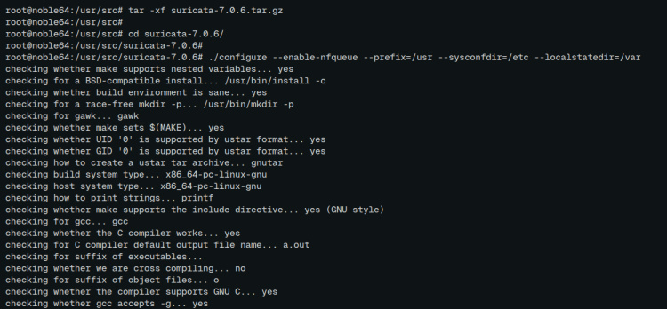

Una vez finalizado el proceso, copia e instala suricata con el siguiente comando.

```
sudo make && sudo make install-full
```

Una vez completada la instalación, verás lo siguiente:

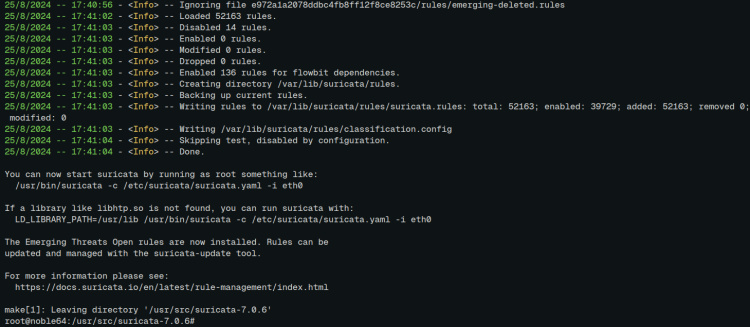

Por último, ejecuta el siguiente comando para localizar el archivo binario ``suricata`` y comprobar su versión.

```
which suricata
suricata --build-info
```

En la siguiente salida, puedes ver que versión de Suricata está instalado en ``/usr/bin/suricata``.

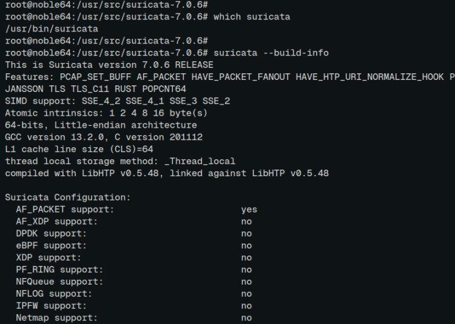

## Instalación a través del repositorio PPA

Si prefieres instalar Suricata a través de APT, tienes que añadir el repositorio suricata PPA a tu sistema Ubuntu. Además, asegúrate de que el paquete ``software-properties`` está instalado.

Añade el repositorio PPA de suricata con lo siguiente:

```
sudo add-apt-repository ppa:oisf/suricata-stable
```

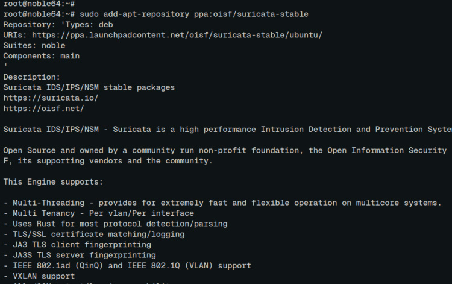

Ahora actualiza tu repositorio índice de paquetes de Ubuntu e instala suricata con el siguiente comando ``apt``.

```
sudo apt update
sudo apt install suricata
```

Introduce **‘Y’** para proceder con la instalación.

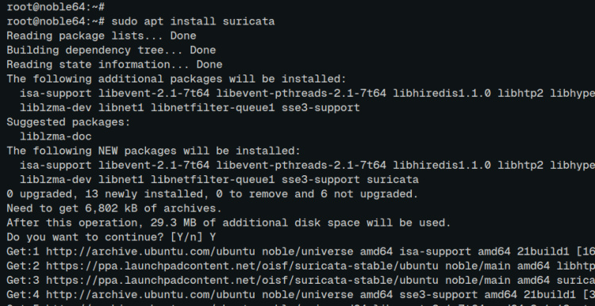

Una vez finalizada la instalación, comprueba el archivo binario de suricata y su versión con el comando que aparece a continuación.

```
which suricata
suricata --build-info
```

Puedes ver a continuación que suricata **7.0.6** está instalado a través del gestor de paquetes APT.

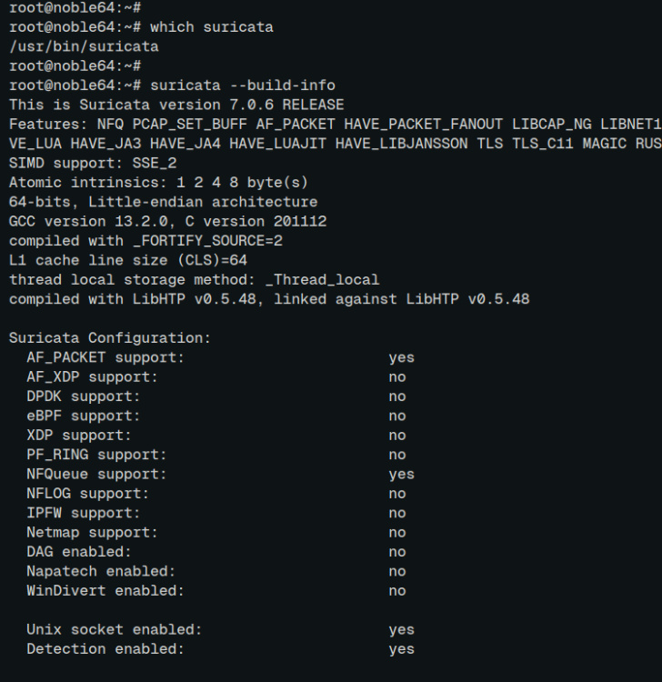

Por último, ejecuta el siguiente comando para activar y detener el servicio*«suricata*«. Tienes que terminar suricata antes de configurarlo.

```
sudo systemctl enable suricata
sudo systemctl stop suricata
```

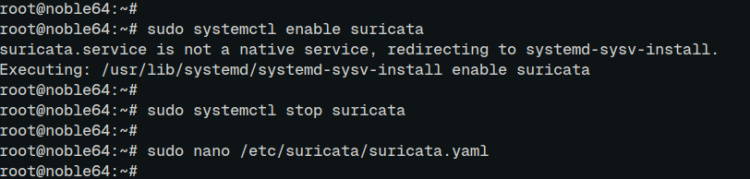

## Configurar Suricata

En esta sección, configurarás Suricata para que supervise la interfaz de red. Suricata capturará el tráfico malicioso en la interfaz de destino.

Abre la configuración por defecto de Suricata ``/etc/suricata/suricata.yaml`` utilizando el editor ``nano``.

```
sudo nano /etc/suricata/suricata.yaml
```

Si utilizas una red local, añade la subred de tu red doméstica a las variables **‘HOME_NET**‘ y **‘EXTERNAL_NET**‘.

```
HOME_NET: "[192.168.5.0/24]"
...
EXTERNAL_NET: "!$HOME_NET"
```

Dentro de la sección ``af-packet``, cambia la ``interface`` por defecto por tu interfaz de destino. En este ejemplo, supervisaremos la interfaz **‘enp0s3’** con suricata.

```
af-packet:
 - interface: enp0s3
```

Añade la opción ``detect-engine`` con ``rule-reload: true`` para activar la recarga de reglas en tiempo real.

```
detect-engine:
 - rule-reload: true
```

Cuando hayas terminado, guarda el archivo y sal del editor.

## Actualizar los conjuntos de reglas de suricata

Antes de iniciar y ejecutar Suricata, debes descargar y actualizar las firmas y reglas de Suricata. Esto puede hacerse mediante la utilidad de comandos ``suricata-update``.

Ejecuta el comando ``suricata-update`` que aparece a continuación para descargar y actualizar las reglas ET de suricata. Suricata no se iniciará si no dispone de reglas ET.

```
sudo suricata-update
```

Las reglas de suricata se escriben en el archivo ``/var/lib/suricata/suricata.rules`` como el siguiente:

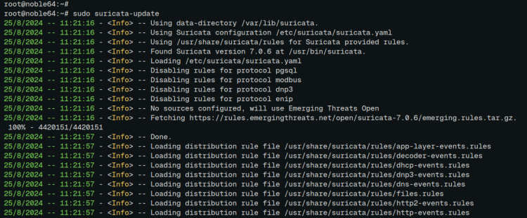

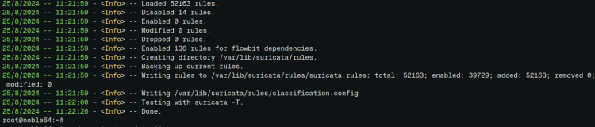

Puedes comprobar las fuentes de las reglas con el siguiente comando:

```
sudo suricata-update list-sources
```

## Ejecutar Suricata

Ahora que ya has configurado Suricata, y descargado y actualizado las reglas de ET, vamos a probar las reglas de Suricata y, a continuación, iniciar y verificar el servicio ``suricata``.

Para probar las reglas de Suricata, ejecuta el comando ``suricata`` que se indica a continuación. Esto procesará las reglas disponibles dentro del archivo ``/var/wlib/suricata/suricata.rules``.

```
sudo suricata -T -c /etc/suricata/suricata.yaml -v
```

Si no se produce ningún error, aparecerá el mensaje ``suricata: La configuración proporcionada se ha cargado correctamente``.

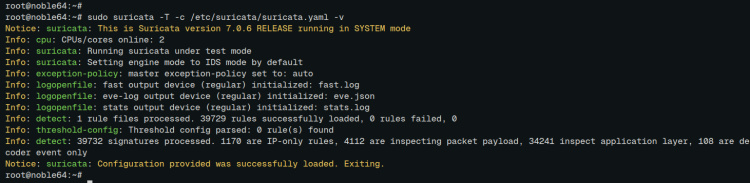

Ahora ejecuta el siguiente comando para iniciar el servicio ``suricata`` en segundo plano y verifícalo.

```
sudo systemctl start suricata
sudo systemctl status suricata
```

En la siguiente salida, puedes ver que el servicio ``suricata`` se está ejecutando.

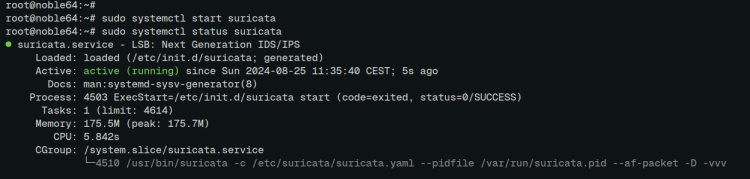

## Conclusión

¡Enhorabuena! Has completado la instalación de Suricata IDS en el servidor Ubuntu 24.04. Has aprendido dos métodos para instalar Suricata, compilando manualmente desde el código fuente y mediante el gestor de paquetes APT. También has aprendido a configurar Suricata, actualizar las firmas y reglas de Suricata y probar las reglas de Suricata.


ref: [Cómo instalar Suricata IDS en un servidor Ubuntu 24.04 – HowtoForge](https://howtoforge.es/como-instalar-suricata-ids-en-un-servidor-ubuntu-24-04/)