# Firewall de Windows

Mantener la seguridad en la red es fundamental y para ello podemos hacer uso de diferentes opciones. Siempre se puede instalar antivirus, pero también un **cortafuegos**. Esto puede evitar problemas como son los accesos indeseados que puedan derivar en el robo de datos o infectar el sistema con cualquier otra amenaza.

## ¿Qué es un firewall?

Un firewall nos permite **permitir o denegar el tráfico** que va y viene desde una o varias interfaces de red, podremos controlar el tráfico de forma exhaustiva, porque el firewall se encarga de comprobar la cabecera de todos los paquetes para ver si cumple con las reglas definidas en el sistema.

Por ejemplo, podemos crear una lista con las aplicaciones que queremos bloquear para que no tengan acceso a Internet o las direcciones IP que no queremos que se conecten a una red. Se basa principalmente en **reglas**.

Cuando utilizamos un firewall **en la red local**, lo más normal es permitir todo el tráfico desde y hacia los equipos de la red local, porque es una red privada y confiable, sin embargo, es posible configurar una red local como «red pública», por tanto, el firewall se va a configurar de forma automática para denegar cualquier intento de comunicación desde fuera hacia nosotros, no obstante, se permitirá las respuestas al tráfico generado por nosotros. Los firewalls que permiten este funcionamiento se denominan SPI, y son los que hoy en día se utilizan ampliamente.

Los firewalls se pueden configurar de dos formas bien diferentes:

- **Firewall permisivo**: tendremos una regla de «permitir todo» implícita al final, por tanto, si queremos bloquear algo deberemos crear una regla específica para ello. Este tipo de configuración suelen estar en la LAN o en los equipos configurados como «red privada».
- **Firewall restrictivo**: tendremos una regla de «denegar todo» implícita al final, por tanto, si queremos permitir algo de tráfico, vamos a tener que crear una regla como mínimo para que podamos enviar y recibir datos. Este tipo de configuración suelen estar en la WAN de Internet en firewalls como pfSense, o en los equipos configurados como «red pública», para protegerlos de diferentes ataques.

El sistema operativo Windows 10 dispone de un firewall bastante avanzado que nos permitirá crear decenas de reglas con el objetivo de permitir o bloquear cierto tráfico, de esta forma, podremos controlar todas las conexiones entrantes y salientes en detalle. Además, a la hora de configurar un firewall es muy importante conocer el sentido del tráfico, si no sabemos bien el sentido del tráfico (entrante o saliente, IP de origen o IP de destino etc.) seguramente no creemos bien las reglas necesarias, y no funcionará el firewall como nosotros hemos pensado, por tanto, lo primero que deberemos pensar es en el sentido del tráfico, y, posteriormente, crear las diferentes reglas.

### ¿Cómo de completo es el firewall de Windows?

Esta característica de seguridad que incorpora el sistema operativo de Microsoft, es utilizada para controlar el tráfico de entrada y salida en nuestro equipo. Este cuenta con muchas características, que hacen de él, un firewall muy válido para la gran mayoría de los usuarios. Incluso para pequeñas empresas, puede ser más que suficiente. Estas son:

- **Control de entrada y salida:** El firewall de Windows 10, cuenta con funciones que permiten definir reglas de entrada y salida. Esto quiere decir que puede controlar el tráfico de entrada y salida, desde el propio equipo.
- **Filtrado de paquetes:** Este firewall se utiliza para realizar un filtrado a los paquetes. Este los puede bloquear si es necesario, siempre basándose en los criterios que define el usuario. Tales como la dirección IP, los protocolos y los puertos.
- **Monitorización:** El firewall de Windows 10 puede realizar una monitorización de la actividad en línea, y así poder generar informes sobre los eventos de seguridad. Esto nos permite identificar y solucionar los problemas de seguridad, de una forma más efectiva.
- **Protección de red pública:** El firewall puede detectar y proteger las redes públicas de forma automática. Esto quiere decir, que puede configurarse para bloquear todos los accesos que no están autorizados a los servicios del equipo.
- **Integración de herramientas:** En esta herramienta, se integran otras funciones de seguridad de Windows. Tales como Windows Defender. Esto nos proporciona una protección más completa contra las posibles amenazas que nos podemos encontrar en Internet.

Incluso con estas capacidades, siempre debemos tener en cuenta que el firewall de Windows, no es totalmente infalible. Por lo cual no lo debemos considerar como la única herramienta de seguridad que necesitamos. Este es recomendable combinarlo con otras herramientas, como puede ser un antivirus o antispyware. Ayudando así a proteger el equipo de muchas más amenazas.

### Ventajas de usar el firewall de Windows

Aunque normalmente utilizamos antivirus para protegernos de ataques externos e infecciones de virus en nuestros equipos, el firewall es la primera capa de seguridad de nuestro sistema y tiene una serie de ventajas que lo convierten en una herramienta fundamental para la seguridad de nuestro sistema operativo.

- **Integración nativa**: El firewall de Windows viene integrado de manera nativa en el sistema operativo, lo que significa que no es necesario descargar ni instalar ningún software adicional. Esto simplifica la gestión y asegura que cada sistema Windows tenga acceso a una capa básica de protección.
- **Configuración fácil de usar**: Su interfaz intuitiva facilita la configuración y personalización de las reglas de seguridad. Puedes definir reglas específicas para programas, puertos o protocolos, lo que te da un control más preciso sobre el tráfico permitido y bloqueado.
- **Protección bidireccional**: El firewall de Windows no solo controla el tráfico de entrada, sino también el de salida. Esto significa que no solo protege tu sistema contra amenazas externas, sino que también evita que aplicaciones no autorizadas envíen información no deseada desde tu ordenador.
- **Filtro avanzado**: Ofrece capacidades avanzadas de filtrado de paquetes, lo que permite detectar y bloquear tráfico no deseado o potencialmente peligroso. Puedes personalizar las reglas según tus necesidades específicas, ofreciendo más flexibilidad en la protección de tu sistema.
- **Compatibilidad con perfiles en red**: El firewall de Windows adapta su configuración según el tipo de red al que estés conectado, ya sea una red doméstica, de trabajo o pública. Esto garantiza que la seguridad se ajuste automáticamente a tu entorno, manteniendo un equilibrio entre protección y accesibilidad.

Registro de eventos: Registra eventos relacionados con la seguridad, lo que facilita la identificación y resolución de posibles problemas. Los registros permiten realizar un seguimiento de las actividades del firewall y proporciona información importante en caso de necesitar datos de seguridad.

---

Hay muchas razones por las que puedes querer abrir o cerrar puertos, no solo la seguridad. La acción de abrir un puerto sirve para acelerar tus descargas, jugar con mayor velocidad en Internet, optimizar tu conexión o acceder a algún programa específico o configuración que lo requiera. Es decir, este proceso permitirá que más datos entren o salgan de tu ordenador, mientras que su cierre evitará posibles ataques a través de ellos.

Los puertos son como **la puerta de entrada y salida de los paquetes de datos** de nuestras conexiones. Esto significa que, si abrimos un puerto, podremos establecer una conexión a través de él, permitiendo así la entrada y salida de datos. En Windows 10, podemos abrir o cerrar puertos del Firewall de sistema, bien desde el propio centro de seguridad o bien desde el antiguo panel de control. Cabe mencionar que, mientras permanezca abierto, la seguridad del dispositivo será menor, por lo que la apertura es aconsejable que sea temporal y que, en ese momento, estemos atentos ante posibles amenazas.

Pese a que Microsoft quiera que sus consumidores abandonen prograsivamente Windows 10 y se pasen a la versión 11, todavía hay millones de usuarios que usan dicho sistema. El proceso puede variar dependiendo del software que tengamos intalado en el ordenador. Por ello, es importante que lo tengamos en cuenta a la hora de seguir los pasos.

## En Windows 10

Con la llegada de Windows 10, Microsoft incorporó la nueva **página de Configuración** del sistema, que se suponía iba a ser la que sustituiría al panel de control. Sin embargo, después de varios años, ambas opciones siguen conviviendo en el sistema.

Mientras existen ciertos ajustes que únicamente los encontramos en la página de configuración, otros solo están disponibles **en el panel de control**. En este caso, es posible abrir o cerrar puertos en el Firewall de Windows 10 tanto desde un sitio como desde otro. Por lo tanto, si hemos instalado alguna aplicación, bien necesitamos realizar la descarga de ciertos archivos, o bien abrir algún puerto para poder disfrutar de algún juego. A continuación, explicamos los pasos que tenemos que seguir para ello.

### Desde el panel de control

Para ejecutar la acción desde el **Panel de control**, lo primero que tenemos que hacer es abrir el propio panel y, después, seleccionar la opción Firewall de Windows Defender. En la ventana que se nos muestra, hacemos clic en la opción Configuración avanzada del menú lateral izquierdo (tal y como puedes ver en la captura de pantalla siguiente), lo que nos abrirá el panel del Firewall de Windows 10.

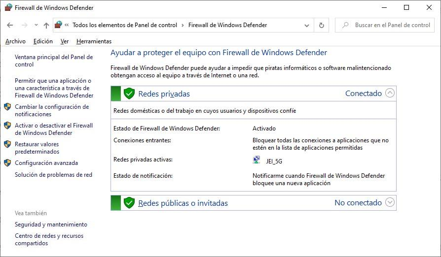

Una vez hecho esto, estos son los pasos a seguir:

- Seleccionamos **Reglas de Entrada,** si queremos abrir un puerto; o **Reglas de Salida,** si lo que queremos es cerrarlo.
- En el panel de la derecha hacemos clic en el apartado «Nueva regla».
- A continuación, se nos pedirá que indiquemos el tipo de regla.
- Seleccionamos **Puerto.**
- Pulsamos en Siguiente para seguir configurándolo.

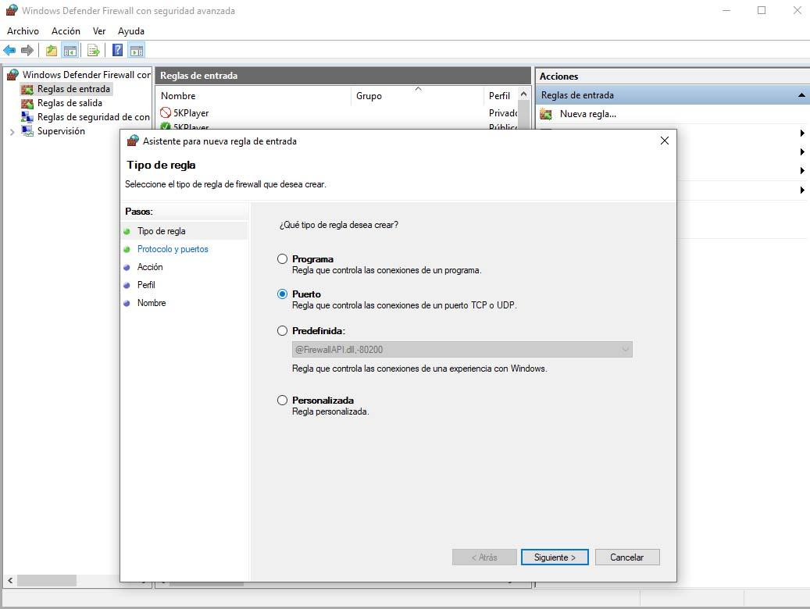

- Ahora, elegimos el tipo de **tráfico TCP o UDP.**
- Elige también el número de puerto sobre el que queremos aplicar la regla que vamos a configurar.
- En el siguiente paso, debemos definir si queremos **bloquear el tráfico, permitirlo o ambas cosas**.

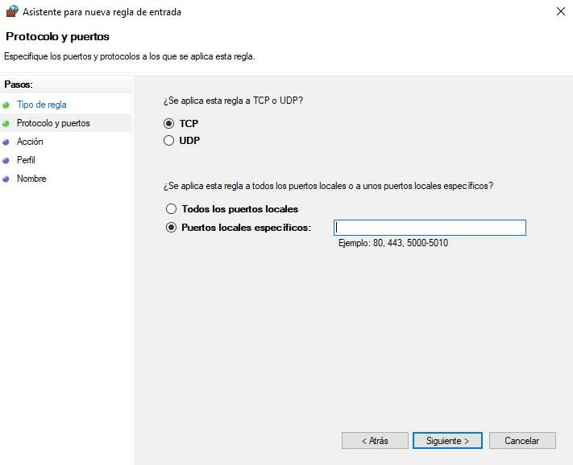

- Pulsamos en siguiente y, a continuación, debemos indicar cuándo se aplicará la regla.
- Por último, le damos un nombre a la regla que acabamos de crear en el Firewall de Windows 10.

Si todo ha ido bien, veremos en el panel central de la ventana de configuración avanzada del Firewall la regla que hemos creado. Si lo que hemos hecho es permitir una conexión, es decir, **abrir un puerto**, se mostrará con el icono en color verde, mientras que, si la regla ha sido para bloquear una conexión o cerrar un puerto, aparecerá el icono rojo con el símbolo de prohibido.

### Desde la página de Configuración

Otra opción recomendable para abrir o cerrar puertos del cortafuegos o firewall en Windows es hacerlo desde la Configuración del sistema. Si somos de los que ya nos hemos olvidado del Panel de Control, no sabemos cómo utilizarlo o nos parece complejo, hay alternativa. En caso de preferir acceder a los ajustes para abrir o cerrar puertos de Firewall de Windows 10 desde la página de configuración, estos son los pasos a seguir:

- Abrimos la página de Configuración del sistema a través de dos posibles vías: pulsando la tecla de Windows+I, o haciendo clic en el icono del engranaje desde Inicio.
- Seleccionamos la opción **Actualización y Seguridad.**

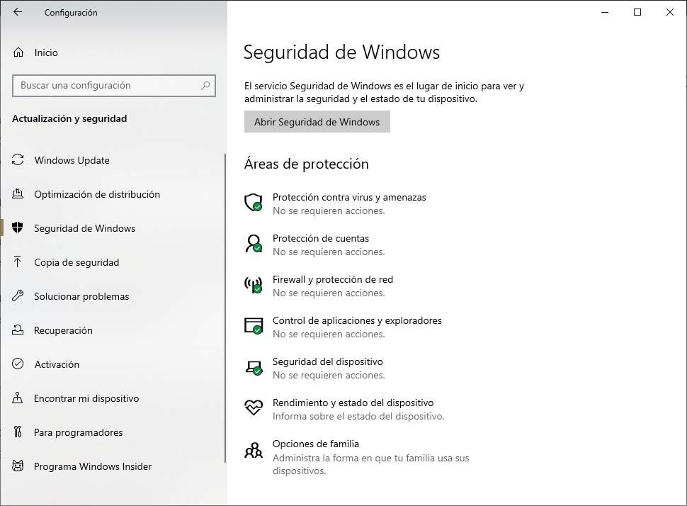

- Hacemos clic sobre la opción **Seguridad de Windows** del menú lateral izquierdo.
- Dentro del apartado Áreas de protección, seleccionamos la opción **Firewall y protección de red**.
- Esto nos abrirá el centro de seguridad de Windows Defender, donde tenemos que hacer clic sobre la opción Configuración avanzada.

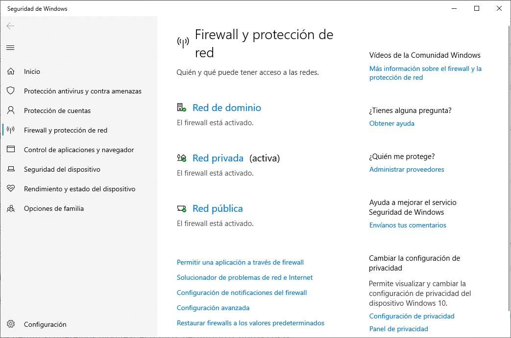

- Emergerá la ventana de **configuración avanzada** de Windows Defender Firewall.
- Seleccionamos **Reglas de Entrada o Salida**, dentro de Windows Defender Firewall, en función de si nuestro objetivo es abrir o cerrar los puertos.
- En el panel de la derecha hacemos clic en **nueva regla.**
- A continuación, se nos pedirá que indiquemos el tipo de regla. Seleccionamos **Puerto** y pulsamos en Siguiente.

- Ahora, elegimos el tipo de **tráfico TCP o UDP** y el número de puerto sobre el que queremos aplicar la regla.
- En el siguiente paso, debemos definir si queremos **bloquear el tráfico, permitirlo o ambas cosas.**
- Pulsamos en Siguiente y, a continuación, debemos indicar cuándo se aplicará la regla.
- Por último, le damos un nombre a la regla que acabamos de crear en el Firewall de Windows 10.

Si el proceso se realiza correctamente, veremos la regla que acabamos de crear para abrir o cerrar un puerto en el Firewall del sistema, desde el panel central de la ventana de configuración avanzada.

En cualquier caso, si queremos cerrar un puerto que hemos abierto mediante una regla de entrada, lo único que tenemos que hacer es ir al listado de reglas de entrada en el panel central, hacer clic sobre ella con el botón derecho del ratón y elegir la opción **Desactivar regla o Eliminar.**

### Desde el Símbolo del sistema

Aunque los métodos anteriores son los más indicados y sencillos, con los que sabrás qué estás haciendo en todo momento, si buscas otra forma de habilitar o deshabilitar puertos más allá de lo convencional debes saber que puedes hacerlo por medio de **comandos de código con el símbolo del sistema o CMD**.

Para ello, escribe «CMD» o «símbolo de sistema» en el buscador para **ejecutarlo como administrador.** Una vez que se abre la ventana, comprobando que lo has hecho como administrador, debes escribir **Netstat -ano** para ver la lista de puertos disponibles y su PID asociado. Encontrarás información sobre los puertos, dirección local, remota, estado, protocolo y más.

- Si buscas uno en concreto, escribe *netstat -ano | find:xxxx* (donde las x son el número del puerto).
- Para abrir puertos, puedes escribir *netsh advfirewall firewall add rule name=»Puerto TCP XXX» dir=in action=allow protocol=TCP localport=XXX,* donde *XXX* es el número de puerto.
- Para bloquear, es *block* donde pone *allow*. Para liberar un puerto, lo que tienes que hacer es escribir *taskkill /pid XXX /F* donde *XXX* es el PID asociado que debes conocer para realizar esta acción.

### Recomendaciones de seguridad

Cuando decides abrir puertos en el firewall de Windows, es importante seguir algunas recomendaciones de seguridad para proteger tu red contra posibles amenazas.

- **Limita el número de puertos**: Aunque es algo obvio, lo principal es limitar la apertura de puertos a aquellos que son estrictamente necesarios para el funcionamiento de las aplicaciones o servicios que estás utilizando. Evita abrir todos los puertos porque esto aumenta la exposición a posibles amenazas.
- **Utiliza números de puerto no estándar**: Otra de las recomendaciones es utilizar números de puerto diferentes a los predeterminados. Los hackers y aplicaciones diseñadas para ello, suelen atacar los puertos más utilizados. Al utilizar números no estándar, dificultas la detección automática y reduces el riesgo de ataques.
- **Usa VPNs**: Siempre que sea posible, considera utilizar una VPN para acceder a servicios desde ubicaciones externas. Esto añadirá una capa adicional de seguridad al cifrar el tráfico entre tu dispositivo y la red, reduciendo el riesgo de ataques.
- **Aplica filtrados por IP**: Si es posible, configura el firewall para permitir acceso solo a direcciones IP específicas. Esto restringirá aún más el acceso a los puertos abiertos, garantizando que solo ciertos dispositivos que hayas autorizado, tengan permiso para comunicarse.

## En Windows 11

El proceso en Windows 11, el sistema operativo de Microsoft más moderno, varía un poco con respecto a la versión anterior. En este caso, vamos a enseñar a hacerlo desde el Panel de Control. Primero, tendrás que abrir esta carpeta, que puedes ubicarla desde la barra de búsqueda de Windows. Después, en un espacio en blanco, haz clic derecho en el ratón.

Una vez ahí, accede a «**Sistema y seguridad**» y, después, a «Firewall de Windows». Seguidamente, seleccione «Configuración avanzada» > «Reglas de entrada» > «Nueva regla» (dentro de la ventana de Acciones). El siguiente paso es escoger el tipo de regla de «Puerto». En la página de «Protocolos y puertos», toca pulsar en «TCP» y, dentro de «Puertos locales específicos», escribir el valor 80.

Más adelante, en la página de «Acción», haz clic en «Permitir la conexión». Cuando llegues en la página de «Perfil», escoge las opciones adecuadas para ti; y en la página «Nombre», escribe «**ReportServer (TCP en el puerto 80)**«. Por último, solo tendrás que darle a «Finalizar» y reiniciar el equipo.

## Otras opciones de configuración

Además de abrir y cerrar puertos, existen otras posibilidades de configuración utilizando esta herramienta de seguridad de tu sistema operativo: desde su propia activación o desactivación, hasta otras gestiones importantes. De este modo, se pueden cerrar puertos de un proceso en concreto o realizar configuraciones calve con el cortafuegos de Windows. Descubre a cómo a continuación.

### Cerrar puertos con Powershell

Podemos cerrar puertos o matar un proceso en concreto dentro de un puerto a través de la herramienta de autorización de tareas de Windows Powersell. Para eso, debemos buscarlo y abrirlo como administrador del sistema. Una vez que lo hemos hecho, escribimos *Stop-Process -Id (Get-NetTCPConnection -LocalPort “puerto”).OwningProcess -Force.*

En donde pone puerto debemos indicar el puerto en concreto, cambiando la palabra con el nombre del puerto correspondiente. Una vez dado este paso, hay que pulsar Enter para que se ejecute el proceso indicado. Lo más recomendable, una vez realizado, es reiniciar el ordenador para que se apliquen los cambios.

### Activar o desactivar el Firewall de Windows

En la parte izquierda de la ventana disponemos de un menú con los diferentes apartados del mismo. Lo primero que vamos a hacer es pulsar sobre la opción **«Activar o desactivar Firewall de Windows».** Se abrirá una ventana desde donde se podrá elegir si queremos activarlo o desactivarlo en las redes domésticas o en las redes públicas, así como si queremos bloquear todo el tráfico en alguna de ellas.

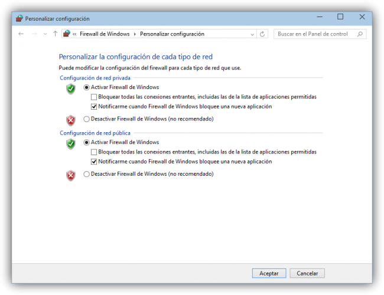

También puedes activar o desactivar el Firewall desde la **Configuración de Windows**, en actualización y seguridad, en Seguridad de Windows. Desde esa ventana hay que abrir seguridad de Windows y Firewall y protección de red. Después, hay que pulsar en Red de dominio, red privada o red pública y hacer clic en Activado (queda marcado en azul) o Desactivado, moviendo la opción desde la nueva pantalla que aparece. También puedes bloquear las conexiones entrantes (o no) en cada configuración.

### Permitir o bloquear el tráfico a aplicaciones o características

Volviendo a la ventana principal de configuración del Firewall de Windows, seleccionamos en el menú el apartado «Permitir una aplicación o una característica». Desde esta ventana vamos a poder ver todas las aplicaciones y servicios de Windows, a la vez que se permitirá añadir fácilmente nuevas aplicaciones que puedan conectarse a Internet fuera del filtro del cortafuegos.

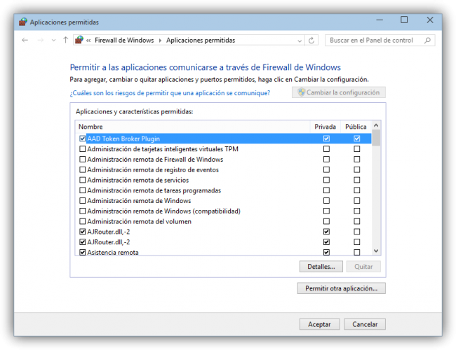

Como podemos ver, nos aparece una **completa lista con todos los componentes** que, por defecto, vienen instalados en el sistema operativo y que pueden necesitar conexión a Internet para funcionar correctamente. De cada componente, podemos elegir si queremos que se conecte tanto desde una red privada personal como desde redes públicas e inseguras.

Asimismo, en la parte inferior visualizamos un botón llamado **«Permitir otra aplicación»**, desde el cual podemos añadir nuevas aplicaciones a esta lista.

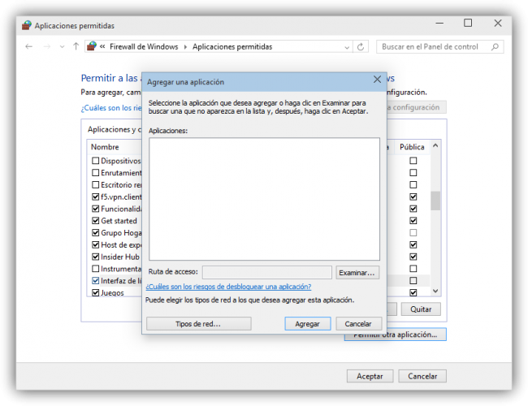

#### Abrir puertos específicos

Otra forma de permitir las aplicaciones, a través de Firewall de Windows Defender, es **abrir puertos específicos** para estas aplicaciones o características, tal y como hemos descrito en líneas anteriores. Pero esto supone un mayor riesgo. Cuando abrimos un puerto para una aplicación lo que estamos haciendo es permitir que el tráfico entre y salga de nuestro ordenador libremente, como si se tratara de un agujero en nuestro cortafuegos. Esto lo que va a provocar es que el PC sea menos seguro y que pueda generar oportunidades para que algún tipo de malware acceda a los archivos de nuestro sistema, e incluso que un hacker pueda hacer uso del dispositivo para propagar este software malicioso a otros dispositivos.

Por lo tanto, siempre que nos sea posible, si queremos añadir una excepción a la lista de aplicaciones permitidas por el firewall lo haremos por el primer método. Si las añadimos manualmente el agujero de seguridad únicamente se abre cuando se usa la aplicación, pero si abrimos el puerto, siempre estará abierto. Además, si es posible, permite el acceso de las aplicaciones **únicamente cuando te haga falta** y revisa de vez en cuando el listado de todas las que tienen permiso, ya que seguramente encuentres algunas a las que en su día les concediste el permiso, pero que ya no te haga falta. Es una forma de reducir riesgos que debemos tener en cuenta.

### Acceder a la configuración avanzada del Firewall

Si queremos tener un control más avanzado sobre puertos y protocolos de conexión, debemos abrir la ventana de configuración avanzada desde dicho apartado, en la ventana principal de la **Configuración.**

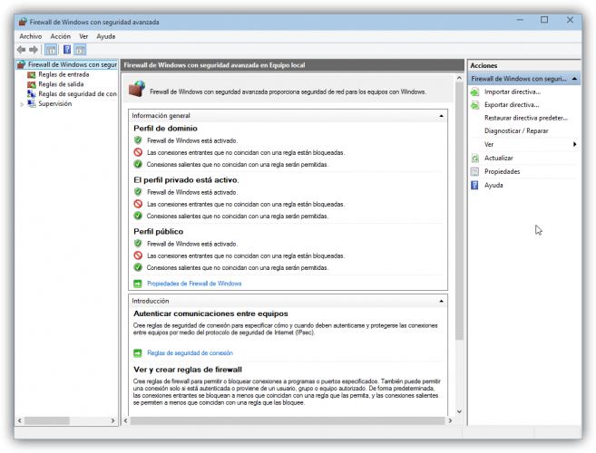

Desde aquí podremos ver todas las **reglas de entrada y de salida** con las que cuenta nuestro cortafuegos. Podemos crear nuevas reglas personalizadas para las aplicaciones que queramos (por ejemplo, eMule o uTorrent), configurando los puertos y protocolos por los que queramos permitir (o bloquear) la conexión.

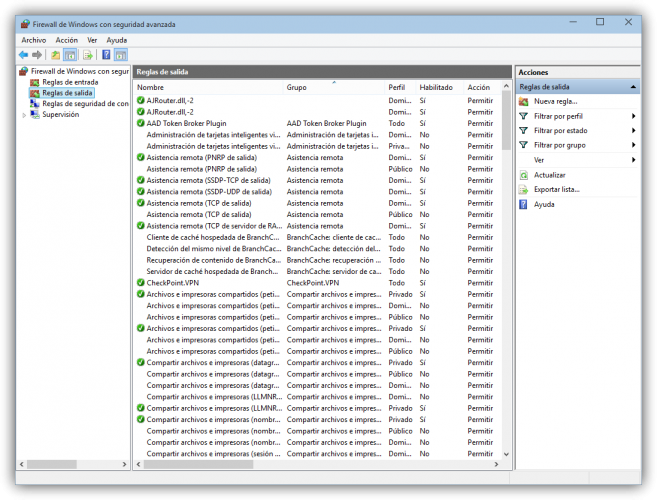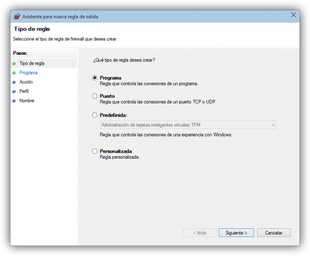

De esta manera, si no queremos tener que **gestionar un cortafuegos de terceros**, podremos configurarlo de la manera más óptima posible, con el fin de permitir sólo las conexiones que de verdad queramos gestionar y bloquear aquellas que puedan resultar maliciosas o peligrosas para nuestro sistema.

## ¿Qué es el firewall o cortafuegos?

Como su propio nombre indica, el cortafuegos de un ordenador (o firewall en su término en inglés) es una tecnología o sistema de seguridad cuya finalidad es bloquear los **posibles accesos no autorizados** que se hagan a un ordenador. Es una medida de seguridad que podemos tener en nuestro equipo **para evitar malware o virus.** En marcha desde los años ochenta, está especialmente pensado para redes locales o intranets y es uno de los “primeros” antivirus utilizados en cualquier sistema. En el caso de Windows ya está instalado y no tenemos que hacer nada, salvo saber cómo abrir o cerrar los puertos, tal y como te explicaremos a continuación.

El **Firewall de Windows** es la herramienta perfecta para proteger tu equipo ante los virus cuando estás navegando por Internet. Previene los accesos no autorizados a una red para que otras personas no puedan controlar tus dispositivos y robar tus datos personales, entre muchas otras cosas. Es esencial para que las empresas se protejan de amenazas internas o externas. Lo más recomendable es **tenerlo activado**, e incluso configurarlo de acuerdo a tus necesidades, si tienes mayores conocimientos informáticos.

Puede que una de las cosas que no sepas es que con esta herramienta de seguridad de tu ordenador puedes abrir o cerrar puertos a tu conveniencia, siempre sabiendo lo que haces, por lo que vamos a comentarte cómo puedes hacerlo fácilmente de dos formas diferentes. Abrir un puerto de tu firewall en concreto hará posible que más datos entren y salgan desde tu ordenador.

Hay muchas razones por las que puedes querer abrir puertos, como facilitar el juego online con más personas. También, existen muchos otros casos por los que vas a querer cerrar puertos, cuando no los necesites abiertos o para fortalecer la seguridad. Lo mejor de todo la sencillez del proceso, pues no necesitas cambiar ningún proceso crítico de tu sistema operativo.

### Para qué usarlo

Antes de adentrarnos en profundidad en cómo podemos hacer para abrir o cerrar estos puertos, debes saber que **no es una configuración o un elemento común**, o mejor dicho: no es algo del que los usuarios habitualmente configuren o pongan en práctica.

La razón es porque estos no son elementos que nos permiten establecer una conexión entre el **ordenador y otro punto** como pueden ser páginas o servidores de correo electrónico. Por eso, y como cualquier otra actividad o acción en Internet o en el propio PC, antes de abrir puertos Windows 10 debemos de saber lo que estamos haciendo (y qué es lo que va a pasar).

Ante esto, y si nos decantamos por abrir o cerrar puertos Firewall en Windows 10, hay que saber que los más conocidos serán fáciles de usar por otros usuarios. Así, si queremos que **nuestra red funcione a la perfección** y estar lo más seguros posible, podemos configurar su comportamiento, sobre todo para elegir los puertos a través de los cuales queremos que las aplicaciones se conecten a Internet, impidiendo que puedan comunicarse por medio de los demás. Como veremos en su configuración, abrir puertos sirve para:

- Acelerar las descargas
- Jugar con mayor velocidad en Internet
- Optimizar tu conexión
- Acceder a programas específico o configuraciones que lo requieran

### Consejos en la configuración

El firewall es un elemento delicado de nuestra configuración informática, como hemos podido comprobar en el desglose de sus elementos, características y usos. La **seguridad** es uno de los aspectos más importantes y, como tal, debemos cuidarla. En la configuración del firewall, dirigida a prácticas que veremos a continuación, como la apertura o cierre de puertos en Windows 10, es preciso tener en cuenta una serie de recomendaciones.

Es primordial realizar **revisiones periódicas**, con cierta frecuencia, de la configuración. Una manera de mantener actualizado el ordenador respecto a nuestros usos diarios. Con estas comprobaciones nos aseguramos de que no existen deficiencias que, bien nos limiten a la hora de trabajar, o bien haya activaciones innecesarias que pongan en peligro la seguridad del dispositivo. Esta constante actualización garantiza la defensa ante amenazas externas y permite el rendimiento adecuado del ordenador según nuestras necesidades.

En caso de ser una empresa, donde es común el uso de firewall perimetral, los conocidos como **recursos de automatización** nos ayudarán a ejercer un control general y efectivo de la red. Un modo de sistematizar recursos con el que no perder tiempo en administración manual. Una estructura operativa recomendada para redes con muchos dispositivos interconectados. En estos, durante la configuración también debemos prestar atención a los **mensajes de alarma del firewall**. Alertas imprescindibles para solucionar problemas con premura y evitar males mayores.

## Configuración avanzada del firewall

Lo primero que debemos hacer es acceder a la configuración avanzada del firewall de Windows 10. Para ello, nos vamos a «Panel de control», y pinchamos en «Firewall de Windows Defender». También podemos optar por escribir en la barra de búsqueda de Windows la palabra «firewall», y automáticamente nos llevará al menú principal del cortafuegos de Windows 10.

Una vez que estamos en el menú principal del firewall de Windows, podremos ver si estamos conectados a redes privadas o públicas, y la política de actuación que estamos teniendo en esos mismos instantes. En el menú principal del firewall debemos pinchar en «**Configuración Avanzada**» que está en la parte izquierda del menú.

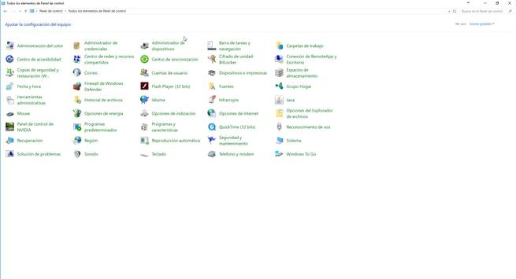

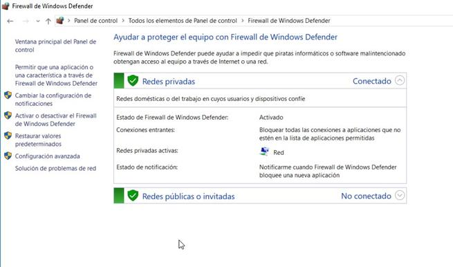

En el menú de configuración avanzada del firewall de Windows 10 tendremos acceso a todas las reglas de entrada, de salida, y el resumen de todas las reglas creadas tanto de entrada y salida en el firewall.

En el menú principal de esta configuración avanzada tenemos las políticas predeterminadas de los tres perfiles que tenemos disponibles: perfil de dominio, perfil privado, público. Dependiendo del perfil que tengamos asignado a nuestra red local, tendremos unos permisos u otros.

Por defecto, **todos los perfiles están configurados con una política restrictiva en las reglas de entrada**. Esto significa que todas las conexiones entrantes que no coincidan con una regla que haya predefinida, o que hayamos definido nosotros, serán bloqueadas. Respecto a **las reglas de salida, utiliza una política permisiva**, esto significa que todas las conexiones salientes que no coincidan con una regla serán permitidas, y solo las que hayamos definido específicamente para bloquearlas, se bloquearán.

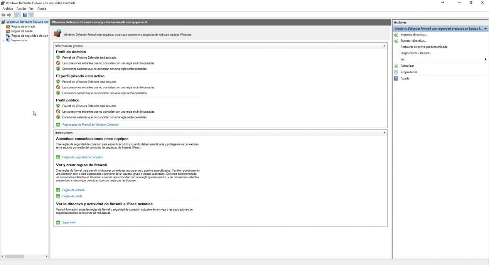

Si pinchamos en el botón de «**Propiedades de Firewall de Windows Defender**«, podremos cambiar las configuraciones globales de todos los perfiles. Tendremos la posibilidad de habilitar o deshabilitar el firewall dependiendo del perfil asignado, cambiar la política (permisiva o restrictiva) tanto de las conexiones entrantes como de las salientes, y también otras acciones como detectar conexiones de red protegidas donde seleccionamos las interfaces de red instaladas, configuración de las notificaciones del firewall, y el destino de los logs que registra el propio cortafuegos.

Por último, podremos configurar la política a seguir si establecemos un túnel VPN IPsec con el propio equipo, ya que este tipo de conexiones al estar autenticadas, son confiables y podremos configurar el firewall para que sea más permisivo si queremos.

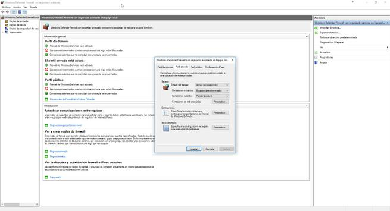

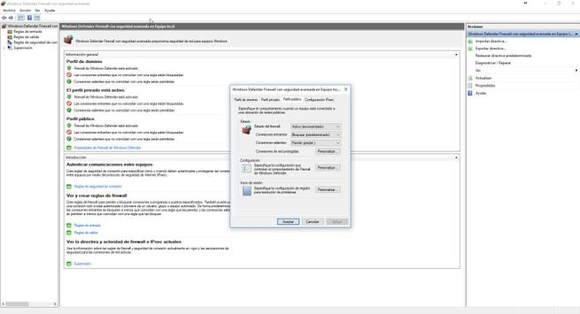

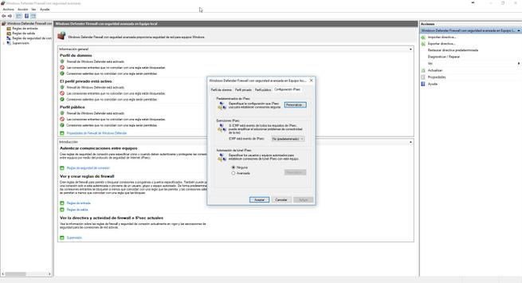

En la sección de «**Supervisión / Firewall**» podremos ver todas y cada una de las reglas que tenemos registradas en el firewall de Windows, todas las reglas activas aparecerán aquí, y podremos ver su configuración en detalle. Si queremos modificar una de estas reglas, simplemente tendremos que pinchar con el botón derecho del ratón sobre la regla en concreto, y pinchar en «Propiedades» para modificarla como queramos.

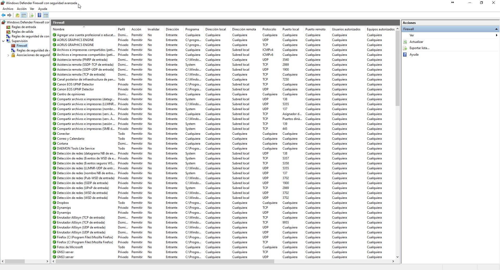

### Reglas de entrada y reglas de salida

En la sección de «**Reglas de entrada**» y «**Reglas de salida**«, tendremos todas y cada una de las reglas que están actualmente dadas de alta, no obstante, algunas reglas pueden estar deshabilitadas, por tanto, no están en uso. Únicamente las reglas que tienen un «check» en verde son las que están habilitadas, las que no tienen ese «check» están deshabilitadas.

Es muy importante saber definir la regla correctamente dependiendo del sentido del tráfico. Si por ejemplo queremos impedir conexiones desde fuera hacia nosotros, debemos dar de alta reglas en «Reglas de entrada». Por el contrario, si queremos bloquear alguna comunicación desde nosotros hacia fuera, deberemos dar de alta una regla en «Reglas de salida». Es importantísimo saber bien el sentido del tráfico, porque podríamos dar de alta una regla que jamás se cumpla.

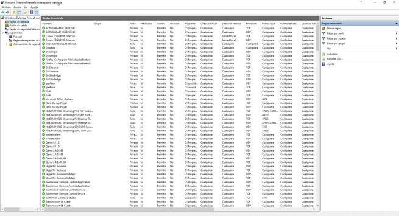

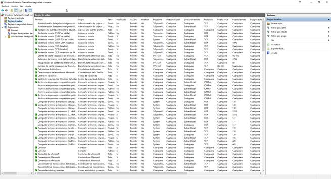

### Cómo crear una regla personalizada

Aunque tenemos una gran cantidad de reglas que están dadas de alta, pero no se están utilizando, vamos a poder crear fácilmente una regla personalizada en función de varios parámetros. El firewall de Windows 10 nos va a permitir crear hasta cuatro tipos de reglas diferentes:

- Programa: Regla que controla las conexiones de un programa en concreto
- Puerto: regla que controla conexiones de un puerto TCP o UDP
- Predefinida: podremos seleccionar reglas predefinidas de Windows para sus servicios.
- Personalizada: regla que podremos configurar en detalle con todos los parámetros.

Para crear una nueva regla, pinchamos con el click derecho en «Reglas de entrada» o «reglas de salida» en «**Nueva Regla**«.

#### Reglas de Programa

Si creamos una nueva «regla de programa», podremos **permitir o denegar las conexiones** de un determinado programa, tanto en las reglas de entrada como en las reglas de salida. Esta opción es ideal para no tener la necesidad de conocer los puertos TCP o UDP que utiliza un determinado programa.

Simplemente debemos indicar si queremos que esta regla afecte a todos los programas instalados, o solo a uno en concreto. Una vez elegido, debemos decidir si queremos permitir la conexión, permitir la conexión si es segura (si usamos IPsec), o bloquear la conexión. Una vez definido si queremos permitir o denegar la conexión, debemos decidir en qué perfil (dominio, privado o público) queremos que esta regla se aplique. Por ejemplo, tal vez nos interese bloquear las conexiones únicamente en redes públicas.

Por último, debemos proporcionar un nombre a la regla, y también una descripción opcional para saber rápidamente qué hace esa regla.

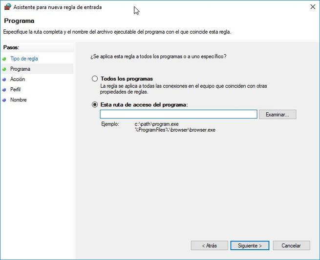

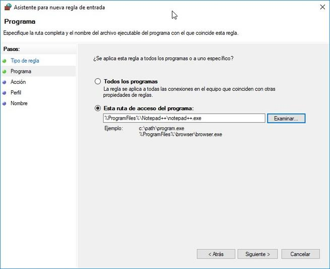

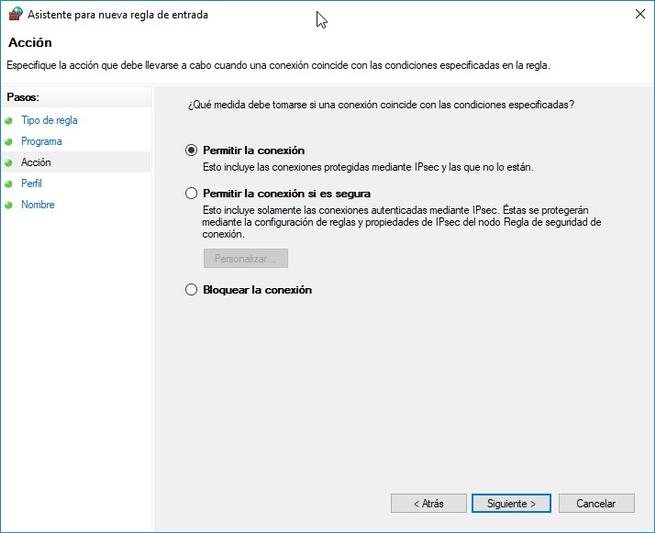

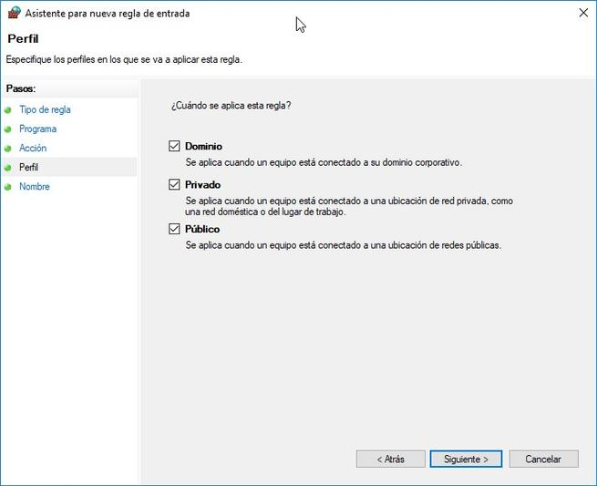

#### Reglas de Puerto

El firewall de Windows 10 también nos **va a** **permitir filtrar puertos TCP o UDP**, tanto en las reglas de entrada como en las reglas de salida.

Para configurar el bloqueo de cualquier conexión entrante por el puerto 21 (por ejemplo), simplemente debemos elegir si queremos que este número de puerto sea TCP o UDP, y a continuación, definimos en «**Puertos locales específicos**» el número 21. El firewall nos va a permitir crear una misma regla para bloquear varios puertos con la sintaxis «21,20,22» por ejemplo, y también un rango de puertos con la sintaxis «5000-5100», además, vamos a poder definir también varios puertos y varios rangos de puertos en la misma regla.

A continuación, podremos permitir la conexión, permitir la conexión si es segura (usamos IPsec), o bloquear la conexión. A continuación, definimos en qué perfil queremos que esta regla se aplique, si en perfil de dominio, perfil público o perfil privado. Por último, proporcionamos un nombre a esta regla, y una descripción opcional, para saber rápidamente qué hace la regla en concreto que hemos configurado.

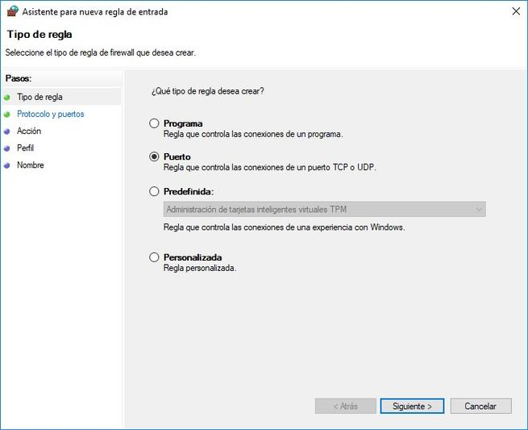

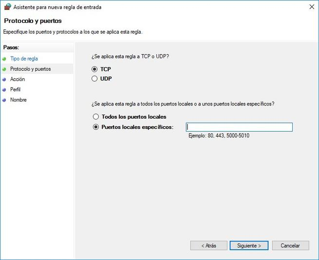

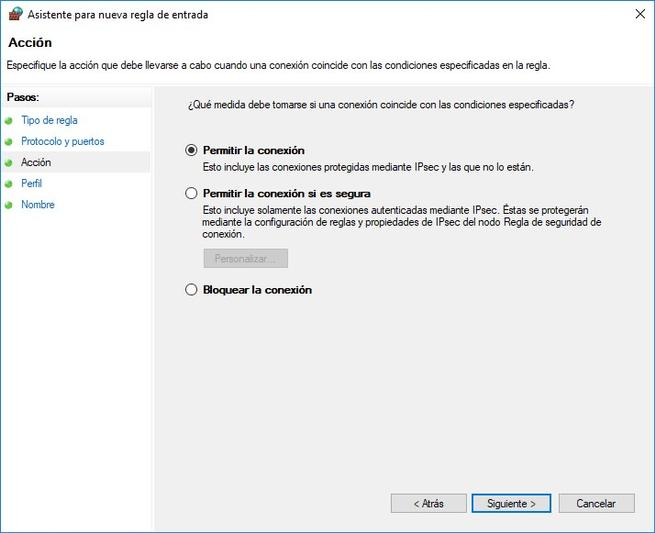

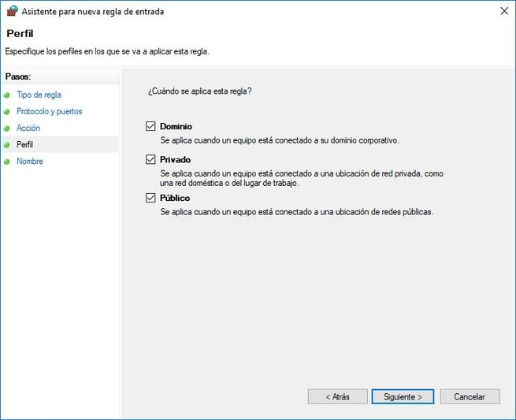

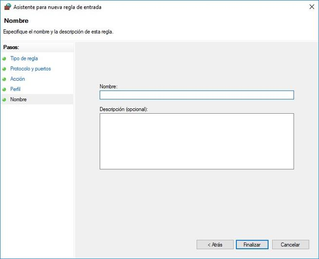

#### Reglas predefinidas

En la sección de «**Reglas predefinidas**«, tendremos varias reglas que se corresponden con el propio sistema operativo de Windows. Si necesitamos habilitar o deshabilitar un determinado servicio, podremos hacerlo directamente desde aquí. Tal y como podéis ver, el listado de reglas es bastante extenso:

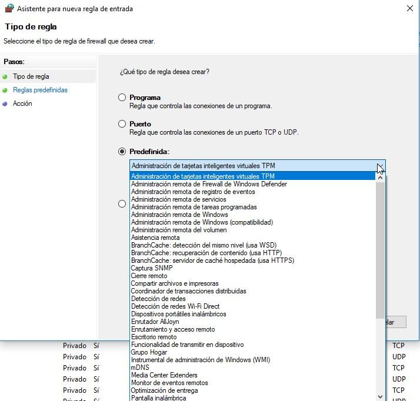

Una vez que hayamos seleccionado la regla, los siguientes pasos son los mismos que en las secciones anteriores, deberemos definir si queremos permitir, permitir con seguridad, o denegar. Después definimos dónde queremos aplicarla (dominio, privado o público), y, por último, proporcionar un nombre y descripción opcional.

#### Reglas personalizadas

Las reglas personalizadas son las que mayor configurabilidad nos va a proporcionar. En esta sección podremos permitir o bloquear muy en detalle, cualquier programa, servicio de Windows, protocolo IP, IPv6, ICMPv4, ICMPv6 y un largo etcétera de opciones de configuración disponibles.

En el primer menú debemos seleccionar «Personalizada», a continuación, podremos elegir si esta regla queremos que se aplique a todos los programas, o solo a alguno de ellos. Además, si pinchamos en «Personalizar» también vamos a poder decidir si queremos aplicarla a todos los programas y servicios, aplicar solo a servicios, o aplicar a un servicio en concreto. Una vez que hayamos configurado esta regla, pasamos al siguiente menú para continuar con la creación de la regla.

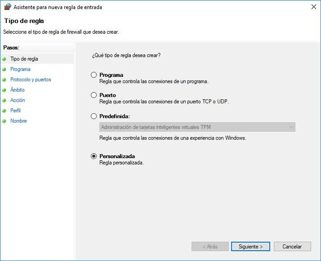

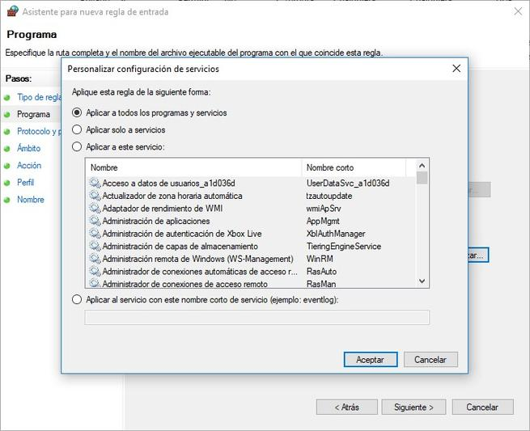

En este menú vamos a configurar el tipo de protocolo que queremos filtrar, tendremos una larga lista de protocolos que podremos permitir o denegar, concretamente el listado de protocolos son los siguientes:

- Cualquiera: cualquier protocolo, filtra a nivel de red.
- Personalizado: podremos definir el **número de protocolo** que queremos bloquear, en caso de que en el listado no aparezca.
- HOPOPT
- ICMPv4
- IGMP
- TCP
- UDP
- IPv6
- Ruta-IPv6
- IPv6-Flag
- GRE
- ICMPv6
- IPv6-NoNxt
- IPv6-Opts
- VRRP
- PGM
- L2TP

Dependiendo de qué hayamos elegido, nos va a permitir elegir un puerto local, y un puerto remoto.

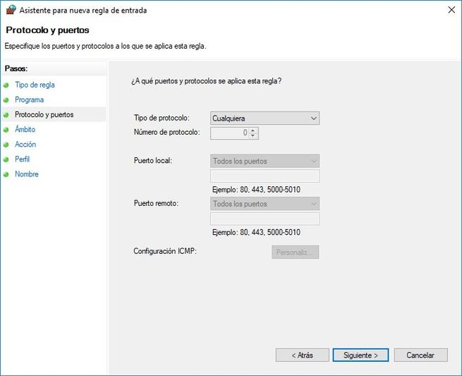

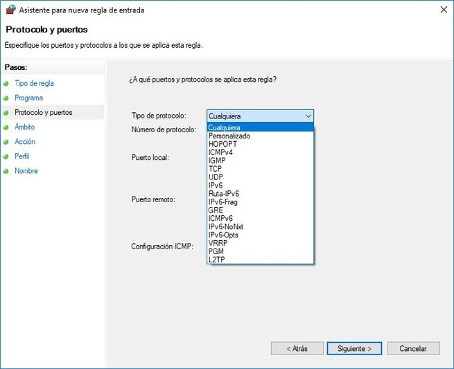

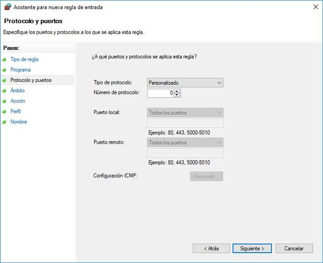

Además, si seleccionamos por ejemplo el protocolo ICMPv4, vamos a poder elegir si queremos permitir o denegar todos los tipos de ICMP, o solo unos específicos, tal y como podéis ver aquí:

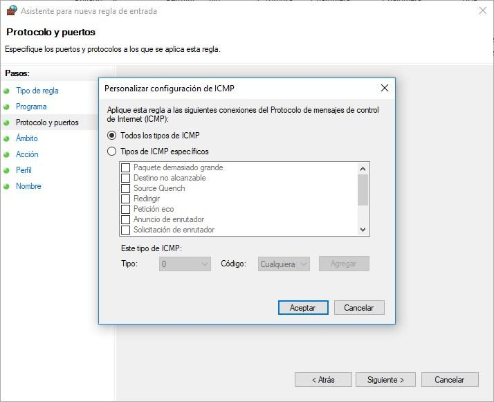

Una vez que hayamos elegido qué protocolo queremos utilizar, vamos a poder **definir las direcciones IP locales y remotas** donde esta regla debe aplicarse, de esta forma, vamos a tener el control total de cualquier tipo de conexión que hagan al sistema, o que hagamos desde el sistema. En el caso de querer crear un rango de direcciones IP también lo vamos a poder hacer de manera fácil y rápida en este menú de «ámbito», simplemente debemos seleccionar «Estas direcciones IP» y a continuación pinchar en «Agregar» y se nos desplegará un nuevo menú de configuración donde especificamos la subred o el rango de direcciones IP:

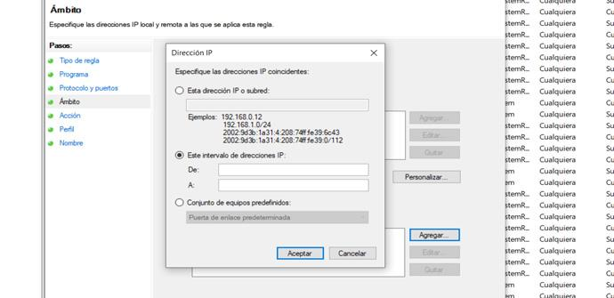

Una vez que hayamos terminado, pinchamos en «**Aceptar**» y ya habremos introducido todas las direcciones IP que nosotros queramos, de esta forma, habremos metido un rango de direcciones IP, ya sean direcciones IP de origen o destino. Ahora lo que tenemos que hacer es seguir con el asistente de configuración de las diferentes reglas.

A continuación, podremos permitir la conexión configurada, permitir la conexión si es segura, y bloquear la conexión, como en el **resto de reglas** que ya os hemos enseñado, y también podremos configurar esta regla para que actúe en los perfiles de dominio, público y privado. Por último, podremos ponerle un nombre a la regla y una descripción opcional.

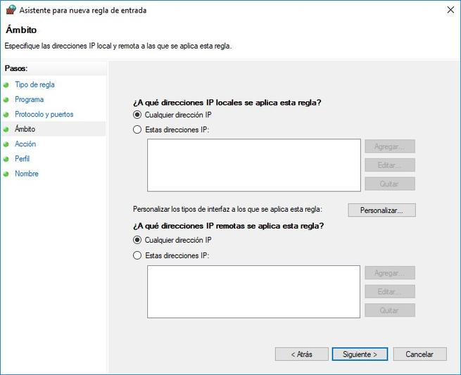

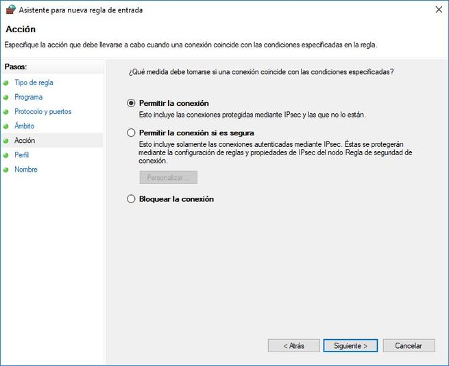

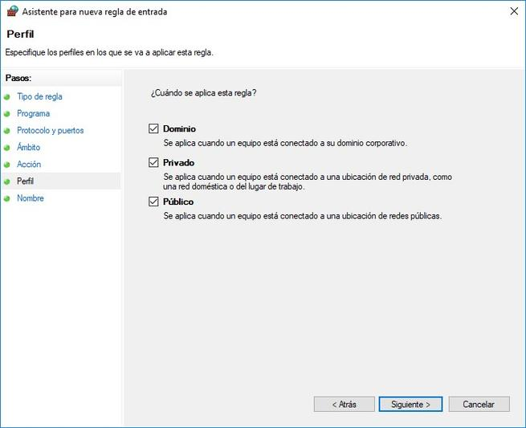

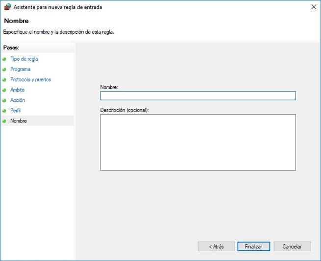

#### Abrir los puertos en Windows

Para abrir los puertos en este firewall pulsaremos sobre la opción «**configuración avanzada**» que aparece en el menú de la izquierda para llegar a las opciones de seguridad avanzadas dentro del cortafuegos de Windows.

Empezaremos creando una «regla de entrada». Seleccionamos esta categoría en la parte izquierda y crearemos una nueva regla. En la primera ventana que nos aparecerá seleccionaremos la opción **«Personalizada»** para poder crear una regla concreta por aplicación y puerto.

Lo ideal para tener la máxima seguridad sería crear dos reglas, una de entrada y otra de salida, bloqueando todo el tráfico que no esté definido en dichas reglas. También hay que especificar si queremos que la regla se aplique en redes públicas, privadas o dentro de un dominio (dejaremos marcadas las 3 casillas) y daremos un nombre para identificar la red.

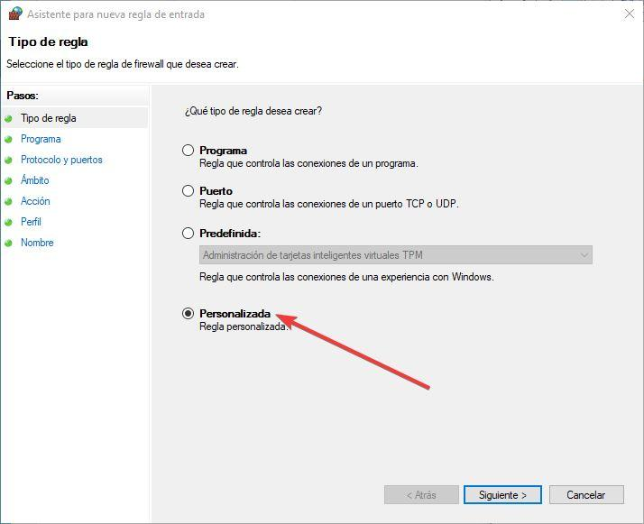

En caso de experimentar algún tipo de problema en la conexión de la aplicación (o de otras) y sospechar que puede ser por un problema de compatibilidad con las reglas que acabamos de crear, desde la lista de reglas del Firewall de Windows podemos **deshabilitar la regla**, desde las opciones que aparecen al pulsar sobre ella con el botón derecho, para comprobar si realmente el problema es de ella, en cuyo caso habría que afinar, seguramente, el tema de puertos.

### Bloquear carpeta con firewall

Si quieres bloquear una carpeta usando el firewall, lo vas a poder hacer, y es que en los sistemas operativos de Microsoft más recientes, como Windows 10 o Windows 11, se puede usar el **cortafuegos** que traen integrados. Funciona muy bien, es gratuito y lo podemos configurar como más nos interese para que pueda bloquear conexiones o crear listas. Una de esas opciones que podemos encontrar en este tipo de programas es bloquear una carpeta en concreto para que no tenga acceso a Internet.

Lo primero que tenemos que hacer es [bajar el programa](https://www.sordum.org/8125/firewall-app-blocker-fab-v1-7/) **Fab firewall**. Está disponible para las últimas versiones de Windows y es totalmente gratuito.

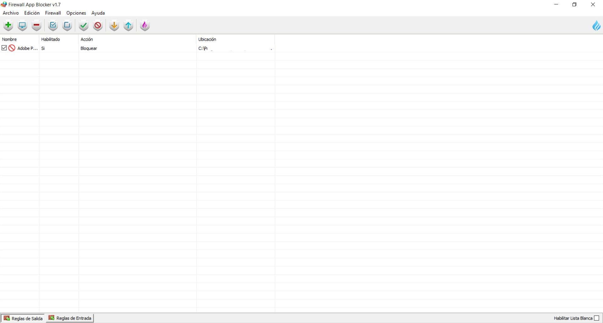

Posteriormente, tenemos que **agregar las carpetas** que nos interesen. Esto es muy útil si por ejemplo tenemos una serie de aplicaciones instaladas en una única carpeta y queremos que se bloquee el acceso a Internet en todas ellas y de esta forma ahorrar tiempo.

Para ello tenemos que ir a Archivo y pinchar en **Agregar contenido** de carpetas. Hecho esto, nos aparecerá una nueva ventana para seleccionar la carpeta dentro del equipo y elegir la que corresponda, la que queramos bloquear.

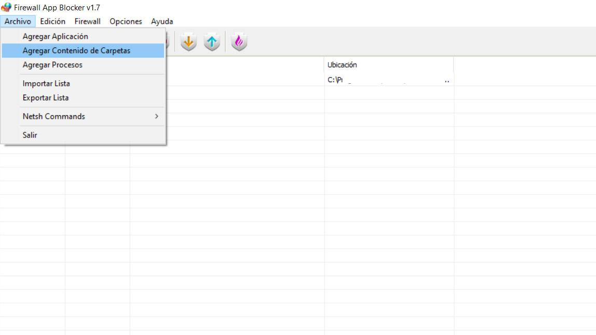

Cualquier programa que tuviéramos instalado y que estuviera dentro de esa carpeta, va a **quedar bloqueado**. No podrían tener acceso a Internet. Podremos bloquear de golpe tantos programas como queramos, ya que actúa sobre todos los que hay dentro de esa carpeta que hemos agregado.

Lo que hace Fab firewall es crear una nueva regla cada vez que le damos a añadir carpetas. Crea esas reglas tanto en su propia aplicación como en el firewall de Windows, por lo que podemos verlo también en la propia aplicación de Microsoft.

## Qué es SimpleWall y cuáles son sus características

Tener un firewall en nuestro equipo Windows es una cuestión innegociable para mantener nuestra seguridad. Microsoft desde Windows XP comenzó con la implementación de un cortafuegos básico. A lo largo de los años, en sus diferentes versiones ha ido mejorando. Su función es controlar el uso que hacen las aplicaciones de nuestra conexión a Internet y también la de ofrecernos protección frente a posibles ataques informáticos provenientes de la red. La llegada de Windows 10 ha supuesto un antes y un después en el sistema operativo de Microsoft. El buen desempeño de Windows Defender y su cortafuegos ha conseguido que cada vez más usuarios le den su confianza. Por este motivo, para complementar este firewall que viene instalado y activado de forma predeterminada, por esto mismo toca hablar de SimpleWall.

En cuanto a **SimpleWall** podemos definirlo como una herramienta fácil de usar para configurar la plataforma de filtrado de Windows (WFP) que puede configurar la actividad de la red de tu ordenador. Un aspecto importante es que no se trata de una interfaz gráfica para el control del Firewall de Windows y no realiza ningún cambio en el mismo. Su funcionamiento, como ya hemos comentado antes, es sobre la plataforma de filtrado de Windows (WFP). Por si no lo sabéis, se trata de un conjunto de API y servicios del sistema que proporcionan una plataforma para crear aplicaciones de filtrado de red. Esta plataforma de filtrado no es un firewall en sí, pero gracias a SimpleWall vamos a poder crear nuestras reglas de red utilizando esta tecnología.

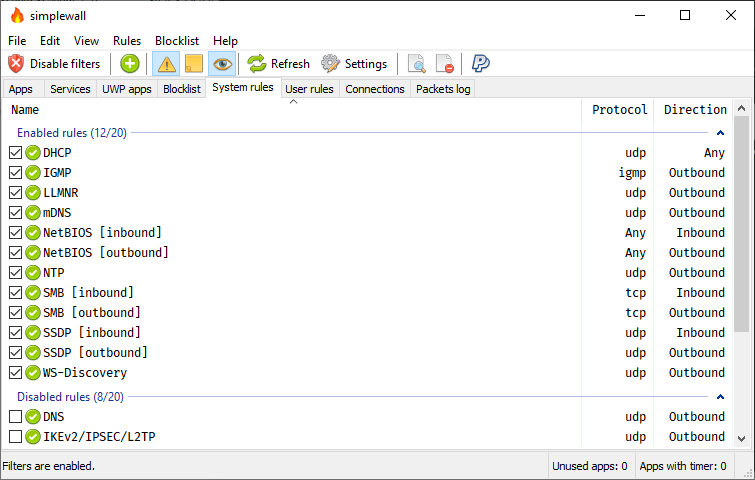

En cuanto a las características del programa tenemos:

- Es libre y de código abierto.
- Una interfaz gráfica sencilla en la que no hay presentes ventanas emergentes.
- Editor de reglas con el que podremos crear las nuestras.
- Tiene una lista de bloqueo interna para bloquear el espionaje y la telemetría de Windows.
- Cuenta con un registro de paquetes perdidos.
- Soporte para los servicios de Windows y su tienda.
- Compatible con IPv6 y soporte de localización.

En cuanto a la instalación de reglas, podemos elegir de dos tipos. Unas son las permanentes que funcionan hasta que las desactives manualmente. Las otras son las temporales que desaparecen después de reiniciar. Respecto a si están bloqueadas las conexiones a Internet cuando no se está ejecutando simplewall, la respuesta es sí. Eso significa que, tras haber creado nuestras reglas, tenemos que tener abierta la herramienta.

### Requisitos mínimos e instalación de la herramienta

En cuanto a los requisitos mínimos para poder instalar este programa es tener instalado en nuestro equipo Windows 7, 8, 8.1 o 10. Respecto al espacio requerido en disco duro es muy poco, hay que tener en cuenta que su instalador ocupa menos de 1 MB. En nuestro caso la instalación me ha requerido 1.6 MB. La versión que vamos a utilizar para hacer este tutorial de simplewall es la 3.43 pero si hay una versión más reciente conviene que utilicemos la más moderna. Lo primero que tenemos que hacer es ir al sitio web del autor Henry ++ pulsando sobre el siguiente [enlace](https://www.henrypp.org/product/simplewall).

Entonces bajamos hasta el apartado **Download** y descargamos la versión más moderna del programa que termina en setup.exe.

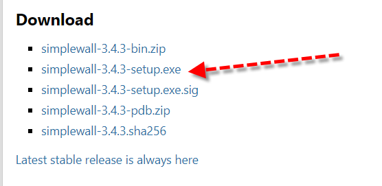

Una vez descargado el instalador lo ejecutamos y nos saldrá una pantalla de bienvenida como esta donde pulsaremos el botón **Next**:

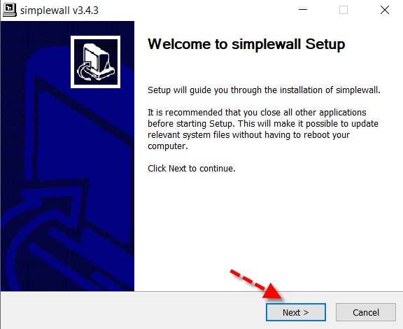

- Luego aceptamos el acuerdo de licencia activando la casilla correspondiente y pulsamos sobre el botón con la flecha roja.

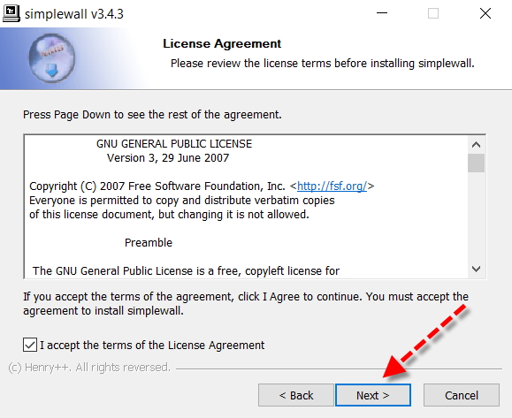

- A continuación, elegimos el directorio de instalación, salvo que haya un motivo especial dejaremos el que viene por defecto.

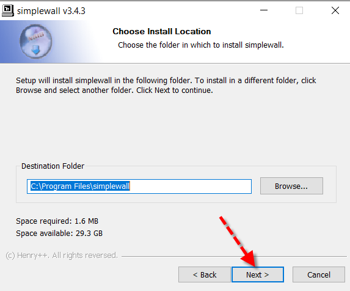

- Aquí lo dejamos con las opciones que marca, para que nos cree un acceso directo en el escritorio y en el menú de inicio de Windows.

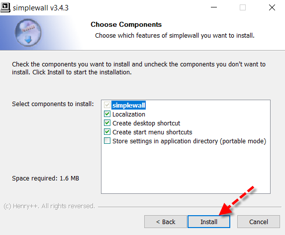

- En el momento que finalice la instalación con éxito de SimpleWall veremos una pantalla como esta.

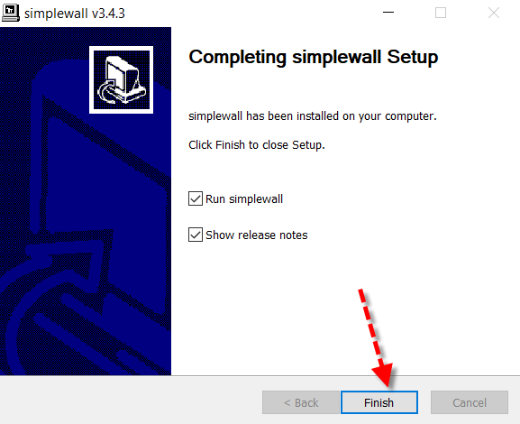

Si pulsamos como viene por defecto en el botón **Finish** para terminar la instalación se ejecutará por primera vez el programa.

### Primeros pasos con SimpleWall para configurar el firewall

La primera vez que se inicie la herramienta veremos una pantalla como esta:

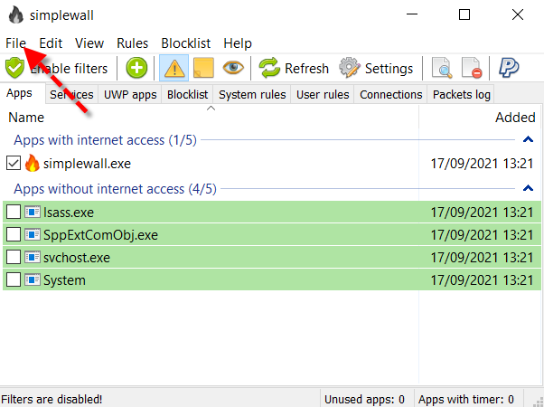

Como SimpleWall viene en inglés y se puede poner en español, aquí es por donde vamos a empezar. Para ello nos dirigimos a **File** y dentro seleccionamos **Settings**. En el apartado general en **Language** seleccionamos **Spanish** y le damos a cerrar. También una opción interesante que se usa mucho en «Configuración General» es **Cargar al iniciar el sistema** para que lo ejecute al arrancar Windows.

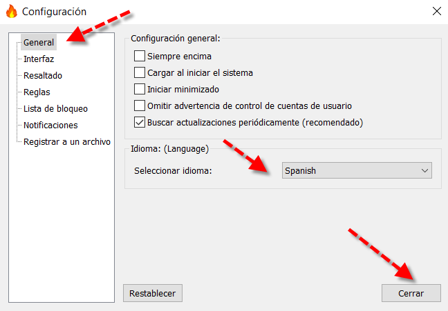

Ahora ya tenemos todo en castellano y vamos a ver el menú principal de esta herramienta que tenéis señalado con un recuadro rojo.

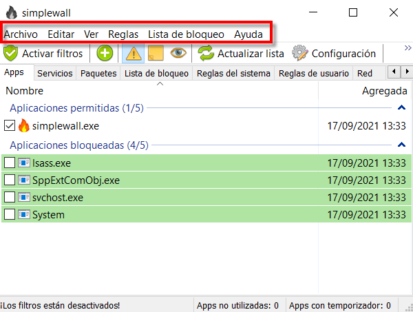

Aquí tenemos estas opciones:

- **Archivo**: podemos acceder a la configuración de opciones y trabajar con archivos.
- **Editar**: para purgar apps no utilizadas, buscar y actualizar lista.
- **Ver**: sirve para elegir opciones de visualización y la fuente de letra.
- **Reglas**: para configurar como trabajan las reglas conviene dejarlo como viene por defecto.
- **Lista de bloqueo**: sirve para configurar cómo actúan las listas de bloqueo y conviene dejarlo como está.
- **Ayuda**: para ir a la web del autor para obtener información, comprobar si hay actualizaciones y ver qué versión tenemos instalada.

Justo debajo tenemos una botonera que simplemente lo que nos hace es ofrecernos accesos directos a las opciones más importantes del menú principal o de la creación de reglas. Por ejemplo, si pulsamos el botón «**Configuración**» iremos directamente al lugar donde se cambia el idioma y otros muchos más parámetros. Luego más adelante profundizaremos con algún botón más.

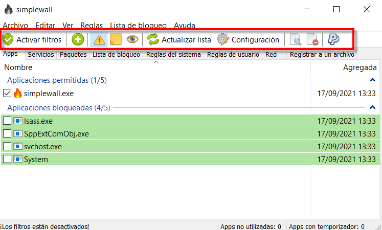

#### Cómo crear una regla, activar filtros y más

Ahora llega el momento de empezar a trabajar con SimpleWall. Debajo de la botonera tenéis una serie de pestañas señaladas con un recuadro con las que deberéis operar. Cada una de ellas tiene una función bien diferenciada.

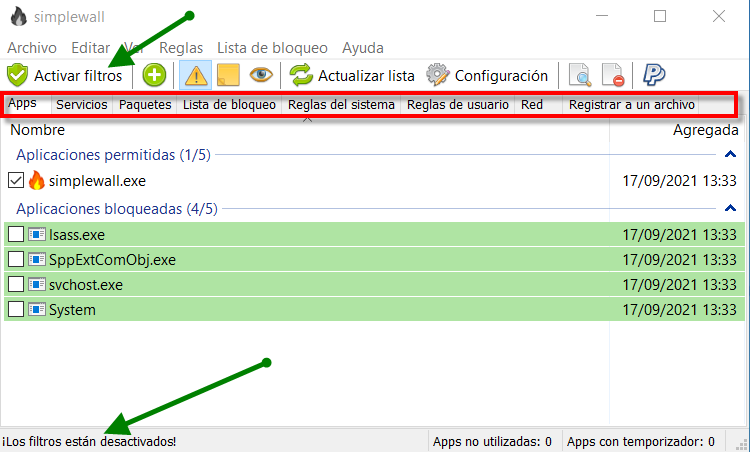

Según queremos trabajar con aplicaciones, servicios de Windows, lista de bloqueo y más, tendremos que seleccionar la pestaña adecuada. Por defecto, viene en el de Apps que se refiere a programas y que es con la que vamos a trabajar. Una cosa muy importante a tener en cuenta es que, en cualquiera de las pestañas como se aprecia en el lugar que señala la flecha verde abajo, los filtros están desactivados. Por lo tanto, si queréis que se apliquen deberéis pulsar sobre el botón **Activar filtros**.

Seguidamente en ese momento SimpleWall ha bloqueado la conexión de la aplicación OneDrive de Microsoft. Como la que utilizo y me hace falta le he dado a **Permitir** para que me cree la regla. Justo después hemos hecho lo mismo con la de Google Drive.

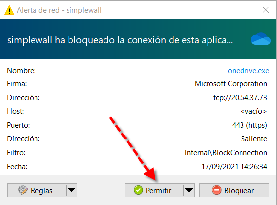

Luego tras varias peticiones que nos irá haciendo clasificará los programas en permitidos, bloqueados y bloqueados silenciosos. También activando la casilla de un programa pasará a permitidos.

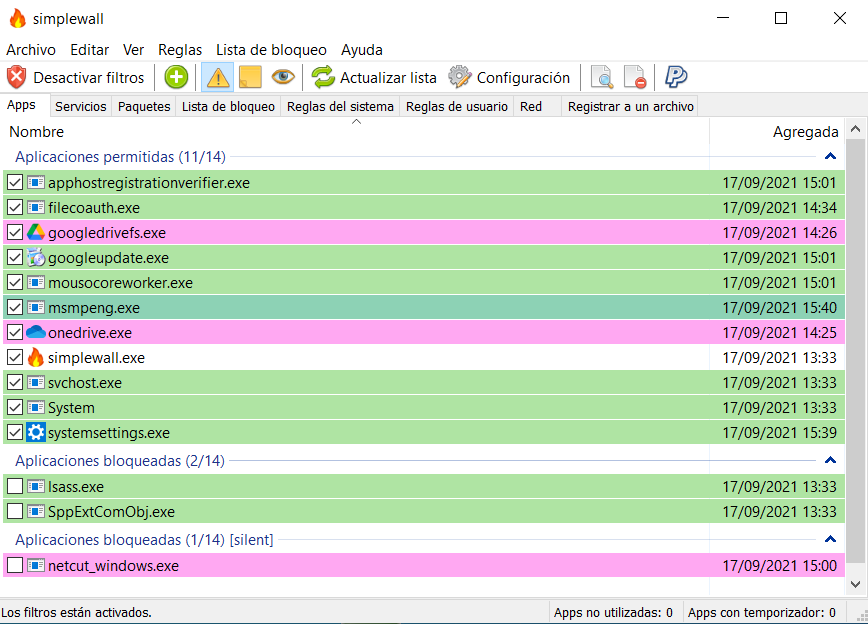

Además, a la hora de conceder acceso con nuestras reglas, el botón **Permitir** admite la creación de reglas temporales pulsando sobre el icono del triángulo negro invertido.

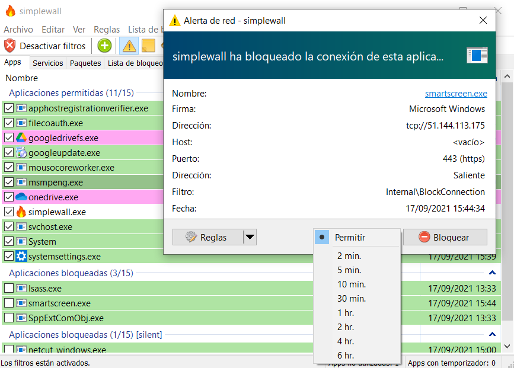

Por otra parte, si pulsamos sobre el botón con un **+** señalado con la flecha negra podremos crear nuestras reglas personales. En este caso para **Apps**, pero también podríamos hacerlas en otros apartados.

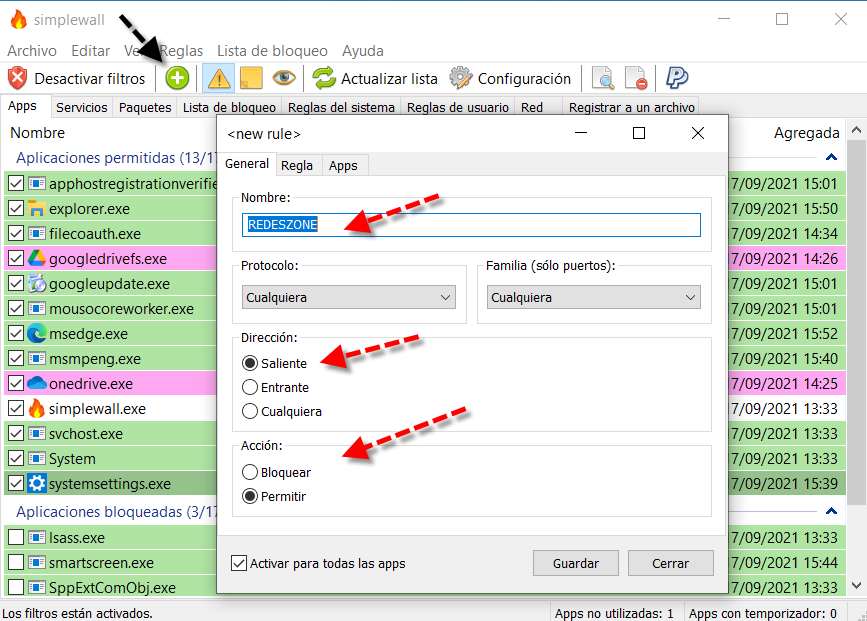

En **General** pones el nombre a la regla, luego el protocolo y la familia opcional. Entonces establecemos la dirección, ya sea entrante, saliente o cualquiera, y una acción que será permitir o bloquear. En la pestaña **Regla** podremos trabajar con IPs locales y remotas junto con su puerto si hace falta.

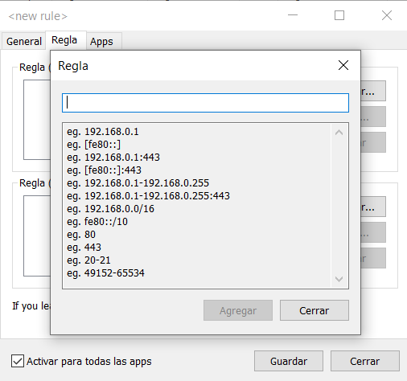

Por otra parte, en el apartado **Apps** podemos asignar que esa regla se aplique a un programa concreto. Si no se selecciona nada se aplica a todas las aplicaciones. Y cuando terminemos le damos a **Guardar**.

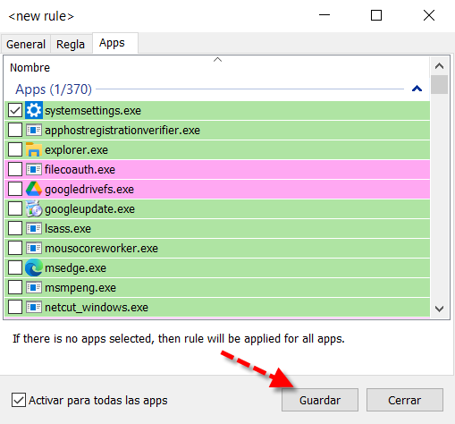

Por último, si queremos ver la regla que hemos creado iremos a la pestaña **Reglas de usuario**. Allí podremos borrarla, editarla y ver si está activa o no.

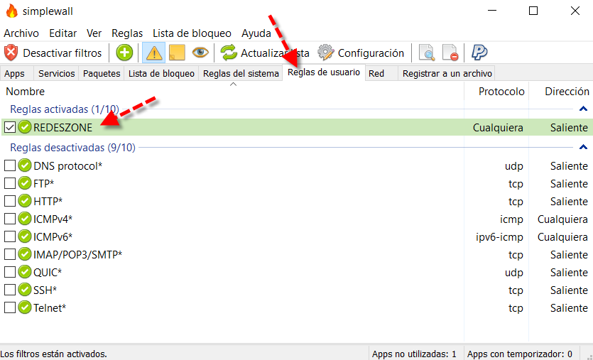

Tal y como habéis visto, **SimpleWall** nos permitirá administrar el firewall de Windows de manera muy fácil, avanzada y su funcionamiento es realmente intuitivo. Si no utilizas el firewall del propio Windows Defender, podéis usar este SimpleWall porque os facilitará enormemente la tarea de permitir o denegar las conexiones en tu PC con Windows.

## Importancia de la seguridad

Siempre cabe destacar que es muy importante mantener ciertos **niveles de seguridad** en nuestros equipos, y más cuando estos se usan para navegar por Internet, sin importar el sistema operativo o tipo de dispositivo. Actualmente las amenazas que nos pueden afectar son muy variadas y con muchos grados de gravedad diferentes. Desde un simple archivo el cual descargamos, o visitar un sitio web, hasta grandes ataques con finalidades más catastróficas.

Por ello es muy importante dar uso de este tipo de herramientas como el firewall, la cual nos protege. Incluso si tenemos un antivirus instalado, siempre será necesario un cortafuegos. Esto nos permite mantener controlados muchos más aspectos en la red, y tratan de evitar que se realicen conexiones no autorizadas, las cuales pueden comprometer la seguridad y, por lo tanto, los datos de nuestro equipo. Como puede ser, el prohibir acceso a Internet a algún programa concreto.

En todo caso, existen muchos factores en cuanto a estar correctamente protegidos. **Cuando navegamos por Internet** o utilizamos programas con salida a Internet, es cuando más riesgo de ataques hay, por lo cual, no solo las medidas que indicamos en la entrada son importantes, si no que el sentido común y el buen uso de internet juega un papel muy importante a la hora de estar protegidos. El motivo de esto, es que, a pesar de disponer de este tipo de defensas, la seguridad total en internet no existe, por lo cual siempre debemos saber si los sitios a los cuales accedemos son fiables, así como pueden ser los correos, los cuales tienen que ser legítimos, este último es uno de los métodos de infección y ataques más común actualmente.

En el caso de Windows, incorpora de serie un antivirus (Windows Defender) y un firewall para que nuestro equipo esté protegido desde el primer momento que lo encendemos.

### Comprueba que tu conexión a Internet es segura

A nivel tecnológico la **seguridad de los dispositivos** es fundamental. De esta forma podemos preservar el buen funcionamiento de los equipos y no poner en riesgo nuestra privacidad. Cuando hablamos de redes, todo esto se incrementa. Son muchos los dispositivos que tenemos conectados a la red y por tanto es fundamental protegerlos. La **seguridad** engloba muchos factores.

Hay que tener en cuenta que algo básico es proteger nuestro router, que cuente con una buena contraseña del Wi-Fi o mantener el firmware actualizado. Sin embargo, también es esencial que los dispositivos que conectamos a la red cumplan unos mínimos. El problema es que en ocasiones creemos que nuestros dispositivos están seguros, pero en realidad no lo están. Puede que haya vulnerabilidades o puntos no tan protegidos como imaginamos. Vamos a hablar de ello.

Os vamos a dar dos puntos básicos para proteger nuestra red un poco más:

- En primer lugar, **cambiar el tipo de red de Windows de pública a privada**, en caso de no tenerlo. Esto hará que nuestra seguridad sea mayor, siempre y cuando no tengamos intrusos en ella, limitando los archivos compartidos con el exterior, y mejorando la seguridad general de la misma. Mucha gente cree que es al revés, y que en pública será más segura, ya que le decimos a nuestro ordenador que estamos usando internet con gente que no conocemos, pero no es así, simplemente evitará mostrar nuestro equipo, pero eso, sin otras medidas, no sirve de nada.
- **Evitar que entren a nuestro router con una buena clave**. Como ya dijimos, esto es fundamental, ya que todo lo demás, no servirá de mucho si los intrusos están en la misma red, desde donde podrán realizar múltiples maldades. Para ello, si no sabes bien qué contraseña es segura, te dejamos [esta](https://www.security.org/how-secure-is-my-password/) web, donde podrás escribir la que consideres, y el servidor te dirá el tiempo que tardaría un hacker en averigurarla. De ser muy bajo, tienes un problema, y cualquier persona con un diccionario de contraseñas, podría averiguarla en un instante. En caso de que nos indique años o siglos, ya estaremos ante una mejor clave, difícil de adivinar.

### Herramientas de seguridad y sistemas actualizados

Para empezar, algo básico es contar siempre con **herramientas de seguridad**. Debemos tener un buen antivirus, así como otras variedades de software que puedan evitar la entrada de malware en nuestros dispositivos.

Pero además de eso también es necesario que los sistemas estén correctamente actualizados. De esta forma podremos asegurar nuestra conexión a Internet y evitar problemas. Los parches de seguridad corrigen vulnerabilidades que pueden ser aprovechadas por los piratas informáticos.

Es por ello que no debemos utilizar versiones de Windows antiguas, que no tengan soporte, ni omitir las actualizaciones si tenemos un SO más moderno, ya que estaríamos dándole entrada a posibles hackers.

### Comprobar que el antivirus funciona correctamente

Una de las formas que tenemos de saber si nuestra conexión está asegurada es **comprobar que el antivirus funciona bien**. Como sabemos, contar con herramientas de seguridad es fundamental. Es importante que tengamos siempre un buen antivirus instalado en el sistema. De esta forma podremos evitar la entrada de malware que comprometa nuestros sistemas.

Por suerte tenemos herramientas que nos permiten comprobar si ese antivirus funciona correctamente. Así podremos estar seguros de que va a cumplir su función. Una de esas herramientas es [EICAR](https://www.eicar.org/?page_id=3950). Nos permite descargar un virus falso para comprobar si el antivirus lo detecta.

En caso de que no lo haga, habrá que ver si existe una actualización más reciente del mismo, o, por el contrario, es mejor hacernos con otro software diferente.

### Observar las medidas de seguridad del router

Por supuesto la **seguridad en el router** no puede faltar. Una buena idea es comprobar que todos los puntos importantes del router en cuanto a seguridad estén protegidos. Lo primero que debemos ver es el tipo de cifrado que estamos utilizando. Es importante que evitemos aquellos obsoletos como puede ser el cifrado WEP y que pueden poner en riesgo nuestra seguridad.

También deberemos comprobar que la contraseña que estamos utilizando sea fiable. Ésta tiene que ser única, totalmente aleatoria y contar con letras (mayúsculas y minúsculas), números y otros símbolos especiales).

### Navegador fiable y actualizado

Otro punto muy importante para comprobar si nuestra conexión a Internet, nuestra navegación, funciona correctamente es observar el navegador. Tenemos que contar con un navegador que sea fiable, que esté totalmente **seguro y actualizado**.

Es importante agregar extensiones únicamente desde fuentes oficiales. También comprobar que esté actualizado correctamente. En ocasiones surgen vulnerabilidades que son resueltas mediante parches y actualizaciones de seguridad.

La mayoría de virus entran por el navegador. Y uno actualizado y seguro puede evitar directamente la entrada, independientemente de nuestro antivirus o medidas posteriores.

### Usar VPN en redes públicas

Por último, algo que debemos aplicar cuando naveguemos por redes públicas es el uso de **servicios VPN**. Es importante para comprobar que nuestra conexión a Internet es segura. Como sabemos, este tipo de herramientas cifra nuestra conexión y evita que posibles intrusos acceda a la información que intercambiamos.

Hay servicios VPN tanto gratuitos como de pago y están disponibles para todo tipo de plataformas. Es interesante tener en cuenta el uso de estas herramientas.

Hasta aquí hemos llegado con este manual de todas las opciones de configuración que nos permite realizar el firewall de Windows. Os recomendamos la lectura de los siguientes artículos, donde podréis ver en detalle cómo usar el firewall para bloquear puertos abiertos, e incluso herramientas externas para facilitar la configuración de este cortafuegos.

---

ref: 

- https://www.adslzone.net/esenciales/windows-10/abrir-puertos-firewall/
- https://www.redeszone.net/tutoriales/seguridad/configuracion-firewall-windows-10/