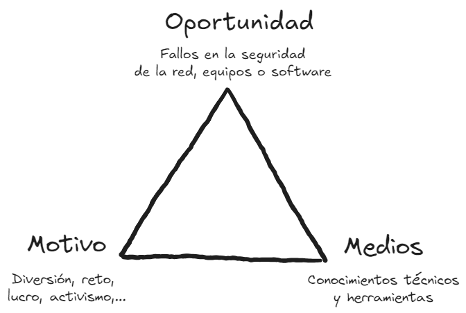

# Gestión de incidentes de seguridad informática

Gestión de incidentes de seguridad informática:

- Principales amenazas y tipos de ataques a los sistemas informáticos.
- Gestión de incidentes de seguridad.
- Principales aspectos a tener en cuenta en la respuesta ante incidentes de seguridad y en la definición de planes de continuidad del negocio.
- Principales características y procedimientos incluidos en el análisis forense informático.
- Ciberterrorismo y espionaje en las redes y sistemas informáticos.

Objetivos:

- Planificar e implantar sistemas de detección de intrusos según las normas de seguridad.
- Aplicar los procedimientos de análisis de la información y contención del ataque ante una incidencia detectada.
- Analizar el alcance de los daños y determinar los procesos de recuperación ante una incidencia detectada.

## 1. Amenazas a la seguridad informática

### 1.1 Intrusos en las redes

Se suele conocer a los intrusos en la redes como hackers. Pero no todos tiene el mismo perfil ni las mismas intenciones.

La palabra hacker se deriva del término inglés hack ( “golpear o contar con un hacha”). Este término se utilizaba de forma familiar
para describir cómo los técnicos arreglaban las cajas de teléfono defectuosas: asestándoles un golpe seco.

En el ámbito de la informática el movimiento hacker surge en los años cincuenta y sesenta en Estados Unidos, con la aparición de los primeros ordenadores. 

La historia del hacking informático está llena de eventos llamativos, personajes emblemáticos, y evoluciones tecnológicas que han transformado tanto la seguridad informática como la cultura popular. A continuación se detalla un resumen de la historia del hacking y algunos hackers históricos destacados.

### 1.2 **Origenes del hacking informático**

1. **Décadas de 1950 y 1960: Los inicios**
   - El término "hacker" originalmente se refería a personas que modificaban equipos o software para hacer que funcionaran de manera diferente a la prevista. En los años 50, en el [MIT](https://www.mit.edu) (Massachusetts Institute of Technology), los primeros hackers eran entusiastas de la programación que exploraban las primeras computadoras como la [TX-0](https://es.wikipedia.org/wiki/TX-0) y el [PDP-1](https://es.wikipedia.org/wiki/PDP-1).
   - Estos primeros hackers se enfocaban en resolver problemas y mejorar la tecnología, más que en actividades maliciosas.

2. **Década de 1970: Nacimiento del Hacking Moderno**
   - **[John Draper (Capitán Crunch)](https://es.wikipedia.org/wiki/John_Draper):** Fue uno de los primeros hackers en ganar notoriedad. Descubrió que una serie de silbatos incluidos en cajas de cereales producía una frecuencia de 2600 Hz, la cual se podía utilizar para engañar a los sistemas de telefonía y realizar llamadas gratuitas. Esto dio lugar al "[phreaking](https://es.wikipedia.org/wiki/Phreaking)", una forma temprana de hacking telefónico.
   - En esta época, también surgieron los **[Homebrew Computer Clubs](https://es.wikipedia.org/wiki/Homebrew_Computer_Club)**, donde se reunían aficionados a las computadoras, incluyendo a personas como [Steve Jobs](https://es.wikipedia.org/wiki/Steve_Jobs) y [Steve Wozniak](https://es.wikipedia.org/wiki/Steve_Wozniak), quienes más tarde fundarían [Apple](https://es.wikipedia.org/wiki/Apple). Aunque no eran "hackers" en el sentido moderno, estos grupos fomentaron una cultura de experimentación tecnológica.

3. **Década de 1980: Hacking se vuelve más sofisticado**
   - La aparición de las [computadoras personales](https://es.wikipedia.org/wiki/Computadora_personal) (PC) llevó el hacking a una audiencia más amplia. Los primeros sistemas [BBS](https://es.wikipedia.org/wiki/Bulletin_Board_System) (Bulletin Board Systems) permitían a los hackers compartir información y herramientas.
   - **[Kevin Mitnick](https://es.wikipedia.org/wiki/Kevin_Mitnick):** Conocido como uno de los hackers más famosos de la historia. Mitnick comenzó a hackear desde su adolescencia, accediendo a redes y sistemas de grandes compañías como Nokia y Motorola. Fue arrestado en varias ocasiones y pasó tiempo en prisión, pero su historia se convirtió en un símbolo del hacking de alto perfil.

4. **Década de 1990: La Era de Internet y el Hacking Global**
   - La expansión de Internet cambió drásticamente el panorama del hacking, permitiendo a los hackers acceder a sistemas en todo el mundo.
   - **[Kevin Poulsen (Dark Dante)](https://www.elhacker.net/hackers-famosos-Kevin-Lee-Poulsen.html):** Otro hacker destacado de esta época. Poulsen ganó notoriedad cuando tomó el control de todas las líneas telefónicas de una estación de radio de Los Ángeles para asegurarse de ganar un concurso. Fue arrestado y, después de su liberación, se convirtió en periodista.
   - **[Vladimir Levin](https://es.wikipedia.org/wiki/Vladímir_Levin):** Un matemático ruso que, en 1994, dirigió uno de los primeros grandes robos bancarios cibernéticos, robando $10 millones de Citibank. Levin fue capturado y extraditado a Estados Unidos, donde fue juzgado.

### 1.3 **Hackers históricos notables**

1. **Kevin Mitnick:**
   - **Motivación:** Comenzó como un hacker en busca de desafíos técnicos y conocimiento. Con el tiempo, sus actividades se volvieron más audaces, incluyendo la entrada en sistemas corporativos y gubernamentales.
   - **Contribución:** Después de cumplir su sentencia, Mitnick se convirtió en consultor de seguridad y autor, promoviendo la conciencia sobre la seguridad informática.
2. **[Adrian Lamo](https://es.wikipedia.org/wiki/Adrian_Lamo):**
   - **Motivación:** Conocido como el "hacker sin hogar", Lamo hackeó varias organizaciones, incluyendo Yahoo!, Microsoft, y The New York Times, a menudo desde cafeterías y bibliotecas.
   - **Contribución:** Lamo es conocido por haber denunciado a [Chelsea Manning](https://es.wikipedia.org/wiki/Chelsea_Manning), la soldado estadounidense que filtró documentos clasificados a WikiLeaks.
3. **[Gary McKinnon](https://es.wikipedia.org/wiki/Gary_McKinnon):**
   - **Motivación:** Un escocés que hackeó sistemas militares estadounidenses, incluyendo los de la NASA, alegando que buscaba información sobre ovnis. Su caso generó gran controversia, especialmente por los intentos de Estados Unidos de extraditarlo.
   - **Contribución:** McKinnon puso de relieve las vulnerabilidades en los sistemas de defensa estadounidense.
4. **[Anonymous](https://es.wikipedia.org/wiki/Anonymous):**
   - **Motivación:** Un colectivo descentralizado de hackers y activistas (hacktivistas) que realizan operaciones de hacking para promover causas sociales y políticas, como la libertad de expresión y la privacidad.
   - **Contribución:** Han sido responsables de numerosos ataques [DDoS](https://es.wikipedia.org/wiki/Ataque_de_denegación_de_servicio) y [filtraciones de datos](https://es.wikipedia.org/wiki/Violación_de_datos) en sitios web gubernamentales y corporativos.
5. **[Julian Assange](https://es.wikipedia.org/wiki/Julian_Assange):**
   - **Motivación:** Fundador de [WikiLeaks](https://es.wikipedia.org/wiki/WikiLeaks), una plataforma que publica filtraciones de documentos clasificados y secretos gubernamentales.
   - **Contribución:** Assange no es un hacker en el sentido tradicional, pero su trabajo ha estado estrechamente relacionado con la cultura del hacking y la transparencia de la información.
6. **[Albert González](https://es.wikipedia.org/wiki/Albert_González)**:
   - **Motivación:** Empezó su carrera como "líder de un conjunto de frikis informáticos problemáticos" en su escuela secundaria de Miami, bajo el seudónimo "soupnazi". Participó activamente en el sitio de comercio criminal Shadowcrew.com, como hacker y moderador. Y también actuó como  informante remunerado.  
   - **Contribución:** Protagonizo la primera filtración de datos en serie de información de tarjetas de crédito. El y su equipo utilizaron inyecciones de SQL para crear puertas traseras en diversas redes corporativas y robar ingentes cantidades de dinero.
7. **Otros:** [Matthew Bevan](https://en.wikipedia.org/wiki/Mathew_Bevan) y Richard Pryce, [Jeanson James Ancheta](https://en.wikipedia.org/wiki/Jeanson_James_Ancheta), [Michael Calce](https://en.wikipedia.org/wiki/Michael_Calce), [Jonathan James](https://en.wikipedia.org/wiki/Jonathan_James), [ASTRA](https://informaticaforense.com/quien-es-el-hacker-latino-astra-y-su-historia/),…
8. Hackers españoles: José Luis Huertas o “[Alcasec](https://www.eleconomista.es/tecnologia/noticias/12720003/03/24/el-cambio-de-vida-del-hacker-alcasec-de-robar-el-90-de-los-datos-de-los-espanoles-a-emprender-una-empresa-de-ciberseguridad.html)”, [José Manuel García Rodríguez “Tasmania”](https://www.cita.es/apedanica/tasmania/index.htm), [Sergi Álvarez “Pancake”](https://www.nowsecure.com/resource/nowsecure-researcher-pancake-on-hacking-radare-sergi-alvarez/), y también Víctor Manuel Álvarez “[Plusvic](https://github.com/plusvic)” o Chema Alonso “[Maligno](https://www.elladodelmal.com/2023/12/chema-alonso-en-threads-le-voy-dar-una.html)”, aunque estos últimos son más conocidos por sus trabajos de hacking ético.

### 1.4 **Evolución reciente y cultura del hacking**

1. **Década de 2000 en adelante:**
   - El hacking ha evolucionado hacia una amenaza global con ciberataques patrocinados por estados y cibercrimen organizado.
   - **[Edward Snowden](https://es.wikipedia.org/wiki/Edward_Snowden):** Excontratista de la [NSA](https://www.nsa.gov) que filtró documentos que revelaron la magnitud de la vigilancia masiva global realizada por el gobierno de Estados Unidos. Su acto, aunque no es hacking tradicional, está muy relacionado con el [activismo digital](https://ayudaenaccion.org/blog/solidaridad/redes-y-activismo-digital/) y el [ciberespionaje](https://www.unodc.org/e4j/es/cybercrime/module-14/key-issues/cyberespionage.html).
   - La cultura del hacking también ha dado lugar a la creación de **[bug bounty programs](https://en.wikipedia.org/wiki/Bug_bounty_program)**, donde las empresas pagan a hackers éticos (white hats) por descubrir y reportar vulnerabilidades.

La historia del hacking es una mezcla de curiosidad técnica, activismo, y en algunos casos, actividades delictivas. Los hackers históricos han tenido un impacto duradero tanto en la tecnología como en la cultura, y su legado sigue influyendo en la forma en que abordamos la seguridad y la privacidad en la era digital.

## 2. Clasificación de los intrusos en las redes

A diferencia los piratas informáticos o crackers, los hackers son intrusos que se dedican a tareas invasivas como pasatiempo o como reto técnico: entran en los sistemas informáticos para demostrar y poner a prueba su inteligencia y conocimientos de los entresijos de Internet. Aunque no todos pretenden provocar daños en dichos sistemas, pueden tener acceso a información
confidencial, por lo que su actividad es considerada como un delito en muchos países.

La clasificación de los intrusos en las redes no resulta definitiva, debido a la variedad de los modelos de ataque y a la intencionalidad de los mismos. Aún así es un aspecto que interesa a las estrategias y aplicación de las medidas de seguridad informática. Los intrusos pueden ser categorizados según sus motivaciones, habilidades y el tipo de amenaza que representan. Aquí hay una clasificación común:

### 2.1. **Según sus intenciones o motivaciones:**

- **Hackers de sombrero blanco (White hat):** Estos son expertos en seguridad que realizan pruebas de penetración o análisis de seguridad con el propósito de encontrar y corregir vulnerabilidades. Su intención es mejorar la seguridad de los sistemas.

- **Hackers de sombrero negro (Crakers, Black hat):** Estos intrusos buscan vulnerar redes y sistemas para fines maliciosos, como robar información, causar daños o extorsionar a las víctimas.

- **Hackers de sombrero gris (Gray hat):** Este grupo actúa en un área intermedia. Pueden vulnerar sistemas sin permiso, pero no con intenciones maliciosas. A menudo, informan las vulnerabilidades a las organizaciones afectadas, a veces esperando una recompensa.

- **Lamers (wannabes): Script-kiddies o Click-kiddies:** Son personas con conocimientos limitados que utilizan herramientas desarrolladas por otros para llevar a cabo ataques, generalmente por diversión o por notoriedad. No suelen tener un objetivo claro más allá de causar trastornos. A pesar de sus limitados conocimientos, son los responsables de la mayoría de los ataques que se producen en la actualidad, debido a la disponibilidad de abundante documentación técnica y de herramientas informáticas que se pueden descargar fácilmente de Internet, y que pueden ser utilizadas por personas sin conocimientos técnicos para lanzar distintos tipos de ataques contra redes y sistemas informáticos.

- **Hacktivistas:** Intrusos motivados por razones políticas o sociales. Utilizan sus habilidades para promover una agenda ideológica, lo que puede incluir desfigurar sitios web, realizar ataques DDoS o filtrar información sensible.

- **Espías corporativos (Corporate spies):** Intrusos que trabajan para una organización y buscan obtener secretos comerciales o información competitiva de otras empresas.

- **Ciberdelincuentes (Cybercriminals):** Estos intrusos tienen como objetivo principal obtener beneficios económicos. Pueden involucrarse en actividades como el robo de identidad, fraude financiero, o secuestro de información (ransomware).

### 2.2. **Según su nivel de habilidad:**

- **Novatos o aprendices:** Tienen conocimientos básicos y suelen usar herramientas y exploits desarrollados por otros. Suelen ser **script kiddies**.

- **Intermedios:** Tienen habilidades más avanzadas y pueden desarrollar sus propios exploits o modificar los existentes. Tienen conocimientos más profundos de redes y sistemas.

- **Expertos o élite:** Son altamente capacitados, conocen en profundidad la seguridad informática y las redes. Pueden descubrir vulnerabilidades por sí mismos y crear herramientas sofisticadas para explotar esas vulnerabilidades.

### 2.3. **Según su relación con la organización afectada:**

- **Intrusos internos ([Insiders](https://www.incibe.es/empresas/blog/insiders-como-atacan-desde-dentro)):** Son personas que pertenecen a la organización y que tienen acceso a la red, como empleados actuales o antiguos, consultores, o cualquier otra persona con acceso autorizado que lo use con fines maliciosos.

- **Intrusos externos ([Outsiders](https://es.bebee.com/producer/insiders-outsiders-los-peores-ataques-suelen-venir-desde-dentro-o-bien-desde-fuera-vinculados-a-personas-de-nuestra-confianza-pero-casi-siempre-vendran-cuando-y-desde-donde-y-quien-menos-te-lo-esperes)):** No tienen ningún acceso legítimo a la red de la organización. Deben romper las barreras de seguridad desde fuera para lograr sus objetivos. Entre estos podemos encontrar **hackers remunerados**: expertos informáticos contratados por un tercero para la sustracción de información confidencial, llevar a cabo sabotajes informáticos contra una determinada empresa u organización.

### 2.4. **Según la forma de ataque:**

- **[Pasivos](https://www.asperis.es/glosario-ciberseguridad/ataque-pasivo/):** Estos intrusos buscan [obtener información sin ser detectados](https://mineryreport.com/ciberseguridad/glosario/tipos-de-amenazas/termino/ataque-pasivo/). Ejemplos incluyen la interceptación de tráfico de red o el monitoreo de comunicaciones.

- **[Activos](https://www.asperis.es/glosario-ciberseguridad/ataque-activo/):** Participan en [actividades](https://mineryreport.com/ciberseguridad/glosario/tipos-de-amenazas/termino/ataque-activo/) que modifican o interrumpen las operaciones normales de la red o los sistemas, como la inyección de malware, desfigurar sitios web, o realizar ataques DDoS.

Conocer la clasificación de los intrusos permite a las organizaciones diseñar estrategias de seguridad más efectivas y responder adecuadamente a las amenazas que enfrentan.

## 3. Fases de un ataque informático

Para que un ataque tenga éxito se deben dar ciertas condiciones que suelen resumirse con el llamado **Triángulo de la Intrusión**. 

Para que un ataque informático tenga lugar o sea posible es necesario que confluyan tres elementos clave:

- **Motivo:** Puede parecer obvio pero para que se produzca un ataque debe haber un motivo.

- **Medio:** Además el atacante debe disponer de los medios y los conocimientos que le permitan consumar dicho ataque.
- **Oportunidad:** Y debe existir una oportunidad para el intruso, una puerta abierta, un fallo en el sistema, una serie de actividades que exponen el sistema a un ataque, etc.

No es posible controlar directamente los motivos del atacante, ni tampoco sus medios. Pero si podemos tener cierto control sobre las oportunidades. La misión del equipo de seguridad es precisamente reducir al mínimo las oportunidades de intrusión a tu sistema, de esta manera, incluso si tiene los medios y el motivo, el atacante no encuentre la oportunidad o su intento sea repelido.

Es importante tener en cuenta que ningún sistema de seguridad es infalible. Como demuestra la historia, todos los sistemas pueden ser víctimas de ataques sin importar lo grande y poderosos que sean. Soló cabe estar preparados en todo momento. Para lo que es clave conocer nuestro nivel de exposición y los modos de ataque que pueden afectarnos, y “pensar como un criminal”: predecir cómo van a atacar tu sistema, pensar en cómo lo atacarías tú.

Por lo general, los ataques informáticos siguen un proceso estructurado en varias fases. Estas fases pueden variar en detalle según la complejidad del ataque, pero en general, se pueden resumir en las siguientes etapas:

### 1. **Reconocimiento (Reconnaissance)**

   - **Objetivo:** Recopilar la mayor cantidad de información posible sobre el objetivo.
   - **Acciones:** El atacante realiza actividades de reconocimiento para identificar posibles puntos de entrada, como escaneo de redes, recopilación de información pública sobre el sistema o empleados (ingeniería social), y análisis de las configuraciones de seguridad.
   - **Tipos:** 
     - **Reconocimiento pasivo:** Obtener información sin interactuar directamente con el objetivo (e.g., búsqueda en Google, análisis de redes sociales).
     - **Reconocimiento activo:** Interactuar con el objetivo para obtener información (e.g., escaneo de puertos).

### 2. **Exploración (Scanning)**
   - **Objetivo:** Identificar vulnerabilidades específicas dentro del sistema objetivo.
   - **Acciones:** El atacante escanea el sistema en busca de puntos débiles, como puertos abiertos, servicios vulnerables, configuraciones incorrectas, o aplicaciones sin parches.
   - **Herramientas comunes:** Escáneres de puertos, herramientas de mapeo de red (como Nmap), y análisis de vulnerabilidades.

### 3. **Ganar acceso (Gaining Access)**

   - **Objetivo:** Conseguir acceso no autorizado al sistema o red objetivo.
   - **Acciones:** El atacante explota una o más vulnerabilidades identificadas durante la fase de exploración para ingresar al sistema. Este acceso puede ser local (en la máquina objetivo) o remoto (a través de la red).
   - **Técnicas:** Uso de exploits (software malicioso diseñado para aprovechar una vulnerabilidad específica), ataques de fuerza bruta, phishing, entre otros.

### 4. **Escalada de privilegios (Privilege Escalation)**

   - **Objetivo:** Obtener un nivel más alto de control dentro del sistema.
   - **Acciones:** Después de ganar acceso inicial, el atacante intenta aumentar sus privilegios para tener control total del sistema, como acceso de administrador o root.
   - **Técnicas:** Explotación de vulnerabilidades de software, errores de configuración, o credenciales débiles.

### 5. **Mantenimiento del acceso (Maintaining Access)**

   - **Objetivo:** Asegurar que el atacante pueda volver a acceder al sistema en el futuro, incluso si se descubre el ataque inicial.
   - **Acciones:** Se instalan backdoors (puertas traseras), rootkits, o se crean cuentas de usuario adicionales que permiten el acceso continuo.
   - **Técnicas:** Modificación de archivos de sistema, instalación de software malicioso, persistencia en la memoria del sistema.

### 6. **Cobertura de huellas (Covering Tracks)**

   - **Objetivo:** Ocultar las actividades del atacante para evitar la detección.
   - **Acciones:** El atacante borra o modifica logs, elimina herramientas usadas en el ataque, y restaura los sistemas a un estado que parezca normal.
   - **Técnicas:** Manipulación de registros de auditoría, eliminación de archivos temporales, ofuscación de código malicioso.

### 7. **Exfiltración de datos (Data Exfiltration)**

   - **Objetivo:** Extraer información sensible o valiosa del sistema comprometido.
   - **Acciones:** El atacante recopila y transfiere datos fuera de la red objetivo, como información personal, secretos comerciales, o credenciales.
   - **Técnicas:** Uso de canales de comunicación cifrados, transferencia de datos a servidores controlados por el atacante, o almacenamiento temporal de datos en ubicaciones difíciles de detectar.

### 8. **Impacto o destrucción (Impact or Destruction)**

   - **Objetivo:** Dependiendo del motivo del ataque, causar un daño directo, como deshabilitar sistemas, cifrar datos (ransomware), o eliminar información.
   - **Acciones:** El atacante ejecuta acciones que dañan la integridad, disponibilidad o confidencialidad del sistema objetivo.
   - **Técnicas:** Implementación de ransomware, borrado de datos, ataques de denegación de servicio (DoS), sabotaje de sistemas.

### 9. **Retiro y persistencia**

   - **Objetivo:** Salir del sistema comprometido sin ser detectado, dejando mecanismos para volver en el futuro.
   - **Acciones:** El atacante se retira del sistema, asegurándose de que sus backdoors o mecanismos de persistencia no sean descubiertos.
   - **Técnicas:** Desactivación de ciertas herramientas de ataque, limpieza de indicadores obvios, pero dejando puertas traseras escondidas.

Estas fases son un marco general y pueden superponerse o variar en función de la estrategia del atacante y las defensas del sistema objetivo. La comprensión de estas fases es fundamental para el desarrollo de estrategias de defensa eficaces.

## 4. Actividades de reconocimiento de sistemas, software implicado y contramedidas

El reconocimiento es una fase crítica en el ciclo de un ataque, y los atacantes usan tanto métodos pasivos como activos para recopilar información. Las organizaciones deben implementar una combinación de contramedidas técnicas y administrativas para reducir la exposición de su infraestructura y dificultar la tarea de los atacantes. Estas contramedidas incluyen desde la configuración correcta de sistemas y el uso de herramientas de detección hasta la formación de empleados sobre las mejores prácticas de seguridad.

El reconocimiento de sistemas es la primera fase de un ataque informático, donde los atacantes recopilan información sobre el objetivo para planificar sus acciones. Esto incluye identificar los sistemas, servicios y aplicaciones en uso, así como las vulnerabilidades que pueden ser explotadas. A continuación se describen las actividades comunes de reconocimiento, el software que se suele emplear y las contramedidas para protegerse de estos intentos de intrusión.

### **1. Actividades de reconocimiento de sistemas**

#### a) **Reconocimiento pasivo**

   - **Descripción:** Consiste en la recopilación de información sin interactuar directamente con el objetivo, por lo que es difícil de detectar.
   - **Técnicas:**
     - **[Google Dorking](https://odint.net/google-dorking/):** Uso de motores de búsqueda para encontrar información sensible o expuesta, como archivos confidenciales o configuraciones de servidores.
     - **Consulta de registros públicos:** Revisar registros de DNS, base de datos [WHOIS](https://www.whois.com/whois/), [RIPE-NCC](https://www.ripe.net/), [ARIN](https://www.arin.net/), [APNIC](https://www.apnic.net/), [LACNIC](https://www.lacnic.net/) y otras bases de datos públicas para obtener información sobre el dominio y la infraestructura de la red. Se puede hacer de forma manual, ya que son recursos públicos, o utilizar herramientas que facilitan las consultas, como podría ser el caso de “**DNS Stuff**” (www.dnsstuff.com)
     - **Monitoreo de redes sociales y foros:** Recopilación de información sobre empleados, tecnologías en uso, y posibles vulnerabilidades a través de lo que se comparte en redes sociales y foros.

#### b) **Reconocimiento activo**

   - **Descripción:** Implica interactuar directamente con el sistema objetivo para obtener información detallada.
   - **Técnicas:**
     - **Escaneo de puertos:** Identificación de puertos abiertos y servicios en ejecución en un sistema mediante herramientas como [Nmap](https://nmap.org).
     - **[Fingerprinting](https://www.welivesecurity.com/la-es/2012/10/18/pentesting-fingerprinting-para-detectar-sistema-operativo/) de sistemas operativos:** Determinar qué sistema operativo está en uso basándose en la respuesta a solicitudes específicas (p.ej., ICMP).
     - **Enumeración de servicios:** Identificar versiones de software y servicios que se ejecutan en los puertos abiertos.

### **2. Software Implicado en el Reconocimiento**

#### a) **Herramientas de reconocimiento pasivo**

   - **Google Dorking:** Uso de operadores de búsqueda avanzada en Google para encontrar información específica.
   - **WHOIS Tools:** Herramientas como **[whois](https://lookup.icann.org/es)** para recopilar información sobre la propiedad de un dominio y sus servidores.
   - **[Shodan](https://www.shodan.io):** Un motor de búsqueda que indexa dispositivos conectados a Internet, proporcionando detalles sobre sistemas expuestos.

#### b) **Herramientas de reconocimiento activo**

   - **Nmap:** Una de las herramientas más populares para escanear puertos, identificar servicios, y realizar fingerprinting de sistemas operativos.
   - **[Nessus](https://es-la.tenable.com/products/nessus/nessus-essentials):** Un escáner de vulnerabilidades que no solo realiza reconocimiento, sino que también identifica posibles debilidades en los sistemas.
   - **[Metasploit Framework](https://www.metasploit.com):** Aunque se usa principalmente para pruebas de penetración, Metasploit también tiene módulos para realizar escaneos y enumeraciones de red.
   - **[Wireshark](https://www.wireshark.org/download.html):** Se utiliza para capturar y analizar tráfico de red en tiempo real, lo que permite a los usuarios ver detalles de cada paquete que viaja a través de una red, detectar distintos protocolos,…

Otras herramientas menos sofisticadas pero igualmente efectivas pueden ser:

   - Al servicio **[ping](https://es.wikipedia.org/wiki/Ping)**(Packet Internet Groper) que permite detectar si un determinado ordenador se encuentra activo y conectado a la red.
   - La herramienta **[Traceroute](https://www.cloudflare.com/es-es/learning/network-layer/what-is-mtr/)** que proporciona una relación de todos los equipos incluidos en una ruta entre dos equipos determinados.

### **3. Contramedidas para mitigar el reconocimiento**

#### a) **Mitigación de reconocimiento pasivo**

   - **Privacidad de WHOIS:** Utilizar [servicios de privacidad](https://support.hostinger.com/es/articles/1583419-como-activar-la-proteccion-de-privacidad-de-whois) para ocultar la información de propiedad de dominios en los registros WHOIS.
   - **[Configuración adecuada de robots.txt](https://developers.google.com/search/docs/crawling-indexing/robots/create-robots-txt?hl=es):** Controlar qué partes del sitio web pueden ser indexadas por motores de búsqueda para evitar la exposición de información sensible.
   - **[Monitoreo de la reputación en línea](https://rockcontent.com/es/blog/reputacion-online/):** Vigilar menciones de la organización en redes sociales, foros y sitios públicos para detectar y eliminar información sensible que podría estar expuesta.

#### b) **Mitigación de reconocimiento activo**

   - **Filtrado de puertos:** Configurar firewalls para bloquear puertos no utilizados y limitar el acceso solo a direcciones IP de confianza.
   - **Detección de intrusiones (IDS/IPS):** Implementar [sistemas de detección y prevención de intrusiones](https://www.incibe.es/empresas/blog/son-y-sirven-los-siem-ids-e-ips) que puedan identificar y responder a escaneos de puertos y otras actividades sospechosas.
   - **Ofuscación de respuestas:** Utilizar [técnicas de ofuscación para dificultar la identificación del sistema operativo y los servicios en ejecución](https://www.welivesecurity.com/es/recursos-herramientas/ofuscacion-de-codigo-arte-ciberseguridad/). Por ejemplo, cambiar las firmas de los banners de servicios como FTP o SSH para confundir a los atacantes.
   - **[Segmentación de la red](https://www.cloudflare.com/es-es/learning/access-management/what-is-network-segmentation/):** Dividir la red en segmentos más pequeños para limitar el alcance de un ataque en caso de que un segmento sea comprometido.

Ver además:  

- [Defensa en profundidad](https://www.cloudflare.com/es-es/learning/security/glossary/what-is-defense-in-depth/).
- [Confianza cero](https://www.cloudflare.com/es-es/learning/security/glossary/what-is-zero-trust/).

## 5 Gestión de incidentes de seguridad

### Incidentes de seguridad informática

Los incidentes de seguridad informática son eventos o acciones que comprometen la confidencialidad, integridad o disponibilidad de la información o de los sistemas informáticos. Estos incidentes pueden variar en gravedad, desde brechas menores hasta ataques cibernéticos graves que pueden paralizar organizaciones enteras. Aquí te detallo algunos aspectos clave sobre estos incidentes:

#### 1. **Tipos de incidentes**

   - **Malware**: Programas maliciosos como virus, ransomware, troyanos, y spyware que pueden dañar o robar datos.
   - **Phishing**: Correos electrónicos o mensajes engañosos que buscan obtener información confidencial, como contraseñas o números de tarjeta de crédito.
   - **Ataques DDoS (Denegación de Servicio Distribuida)**: Ataques que sobrecargan un servidor o red, dejándolos inoperativos.
   - **Inyecciones SQL**: Ataques que explotan vulnerabilidades en aplicaciones web para acceder a bases de datos.
   - **Ransomware**: Un tipo de malware que cifra los archivos de la víctima y pide un rescate para restaurar el acceso.

#### 2. **Consecuencias de los incidentes**

   - **Pérdida de Datos**: Información crítica puede ser robada, destruida o corrompida.
   - **Pérdida Económica**: Costos asociados con la recuperación, multas legales, y la pérdida de confianza de los clientes.
   - **Daño a la Reputación**: Las organizaciones pueden sufrir un daño significativo a su imagen pública, lo que puede llevar a la pérdida de clientes.
   - **Interrupción de Operaciones**: Los sistemas afectados pueden dejar de funcionar, interrumpiendo las operaciones normales.

#### 3. **Detección y respuesta**

   - **Sistemas de Detección de Intrusiones (IDS)**: Herramientas que monitorean el tráfico de la red en busca de actividades sospechosas.
   - **Plan de Respuesta a Incidentes**: Procedimientos preestablecidos que guían a una organización sobre cómo responder a un incidente de seguridad.
   - **Análisis Forense**: Investigación post-incidente para entender cómo ocurrió el ataque y qué fue comprometido.

#### 4. **Prevención**

   - **Capacitación del Personal**: Educar a los empleados sobre las mejores prácticas de seguridad cibernética, como reconocer correos de phishing.
   - **Actualización y Parcheo**: Mantener los sistemas y software actualizados para cerrar vulnerabilidades.
   - **Autenticación Fuerte**: Implementar métodos de autenticación robustos como la autenticación multifactor (MFA).
   - **Cifrado de Datos**: Asegurar que los datos sensibles estén cifrados tanto en tránsito como en reposo.

#### 5. **Normativas y cumplimiento**

   - **[GDPR](https://commission.europa.eu/law/law-topic/data-protection_es)**: Regulación europea que exige la protección de datos personales y la notificación de brechas de seguridad.
   - **[HIPAA](https://www.proofpoint.com/es/threat-reference/hipaa-compliance)**: Ley en EE.UU. que regula la protección de información de salud.
   - **[ISO/IEC 27001](ISO/IEC 27001)**: Estándar internacional para la gestión de la seguridad de la información.

Los incidentes de seguridad informática son una amenaza constante, y su manejo eficaz requiere una combinación de tecnología, procesos y concienciación del personal. La prevención y la preparación son clave para mitigar los impactos de estos eventos.

### Identificación y caracterización de los datos de funcionamiento del sistema

La **identificación y caracterización de los datos de funcionamiento del sistema** es un proceso clave en la gestión de la seguridad informática y en la optimización de la operación de sistemas de información. Este proceso implica reconocer y entender qué tipos de datos se generan y manejan en un sistema, así como su comportamiento, características y valor para la organización.

### 1. **Identificación de datos de funcionamiento del sistema**

La identificación de los datos de funcionamiento se refiere a la catalogación y clasificación de todos los datos que un sistema genera, recibe, procesa o almacena durante su operación. Algunos ejemplos de estos datos incluyen:

   - **Logs de eventos**: Registros de eventos que ocurren en el sistema, como accesos de usuarios, errores, cambios de configuración, entre otros.
   - **Datos de rendimiento**: Información sobre la utilización de recursos del sistema, como el uso de CPU, memoria, ancho de banda, etc.
   - **Transacciones**: Datos generados por las operaciones diarias del sistema, como registros de ventas, actualizaciones de bases de datos, etc.
   - **Datos de red**: Información sobre el tráfico de red, incluyendo paquetes enviados y recibidos, latencia, y otros parámetros relacionados con la comunicación de datos.

### 2. **Caracterización de los datos**

La caracterización de los datos implica analizar y describir sus propiedades y cómo estos interactúan con el sistema. Los aspectos clave incluyen:

   - **Formato y estructura**: Determinar el formato (texto, binario, JSON, XML, etc.) y la estructura (tablas, registros, archivos, etc.) de los datos.
   - **Frecuencia y volumen**: Analizar con qué frecuencia se generan los datos y en qué volumen. Esto es crucial para dimensionar el almacenamiento y gestionar el rendimiento.
   - **Origen y destino**: Identificar de dónde provienen los datos (usuarios, sensores, otros sistemas) y hacia dónde se dirigen (almacenamiento, otros sistemas, usuarios).
   - **Importancia y sensibilidad**: Clasificar los datos según su importancia para la operación del sistema y su sensibilidad en términos de confidencialidad, integridad y disponibilidad.
   - **Temporalidad**: Establecer si los datos son en tiempo real, históricos o archivados, lo que influye en cómo deben gestionarse y protegerse.

### 3. **Uso y análisis de datos**

   - **Monitoreo**: Utilización de herramientas que capturan y analizan los datos en tiempo real para detectar anomalías, medir el rendimiento y garantizar el buen funcionamiento del sistema.
   - **Optimización**: Los datos de funcionamiento se pueden analizar para identificar cuellos de botella, optimizar procesos, y mejorar la eficiencia del sistema.
   - **Seguridad**: Los datos ayudan a identificar posibles brechas de seguridad, patrones de ataques o comportamientos sospechosos que podrían indicar una amenaza.

### 4. **Almacenamiento y gestión de datos**

   - **Base de datos**: Los datos de funcionamiento suelen almacenarse en bases de datos diseñadas para manejo de grandes volúmenes de información y consulta rápida.
   - **Archivado**: Datos antiguos o menos relevantes se archivan para liberar recursos del sistema.
   - **Backup y recuperación**: Implementación de estrategias para hacer copias de seguridad y recuperación de datos críticos en caso de pérdida o corrupción.

### 5. **Cumplimiento y regulaciones**

Dependiendo del sector, los datos de funcionamiento pueden estar sujetos a regulaciones específicas que dictan cómo deben gestionarse y protegerse. Por ejemplo, en sistemas que manejan datos personales, puede ser necesario cumplir con normativas como GDPR.

### 6. **Visualización y reportes**

   - **Dashboards**: Herramientas que permiten la visualización en tiempo real del estado del sistema usando gráficos y métricas clave.
   - **Reportes**: Documentos generados periódicamente para mostrar tendencias, incidencias y el estado general del sistema.

En resumen, la identificación y caracterización de los datos de funcionamiento del sistema son procesos fundamentales para asegurar una operación eficiente, segura y conforme a las normativas aplicables. Estos datos no solo permiten mantener el sistema funcionando correctamente, sino que también son esenciales para la toma de decisiones estratégicas y operativas.

## Sistemas de Detección de Intrusos (IDS)

Los **[Sistemas de Detección de Intrusos (IDS)](https://www.ibm.com/es-es/topics/intrusion-detection-system)** son herramientas de seguridad diseñadas para monitorear redes y sistemas informáticos en busca de actividades sospechosas o maliciosas que puedan indicar un intento de intrusión o un ataque cibernético. Su función principal es detectar y, en algunos casos, responder a posibles amenazas antes de que puedan causar daño.

### 1. **Tipos de IDS**
Existen dos tipos principales de sistemas de detección de intrusos:

   - **IDS Basados en Red (NIDS)**:
     - **Descripción**: Monitorean el tráfico de red en busca de patrones de ataque o anomalías.
     - **Funcionamiento**: Se despliegan en puntos estratégicos de la red, como detrás de un firewall o en segmentos clave de la infraestructura de red.
     - **Ejemplos**: Snort, Suricata.
     - **Ventajas**: Pueden proteger varios sistemas simultáneamente, detectando ataques a nivel de red.
     - **Limitaciones**: Pueden ser menos efectivos en entornos con tráfico cifrado o en redes distribuidas.

   - **IDS Basados en Host (HIDS)**:
     - **Descripción**: Monitorean la actividad en un único sistema o dispositivo.
     - **Funcionamiento**: Analizan archivos de log, cambios en archivos críticos, y otros eventos del sistema operativo.
     - **Ejemplos**: OSSEC, Tripwire.
     - **Ventajas**: Ofrecen una visión detallada del estado del sistema y pueden detectar amenazas que no se manifiestan a nivel de red.
     - **Limitaciones**: Deben ser desplegados en cada host individual, lo que puede ser costoso y difícil de gestionar en grandes entornos.

### 2. **Técnicas de detección**

   - **Detección Basada en Firmas**:
     - **Descripción**: Utiliza una base de datos de firmas conocidas de ataques y malware para identificar amenazas.
     - **Ventajas**: Efectiva para detectar ataques conocidos y bien documentados.
     - **Limitaciones**: No puede detectar ataques nuevos o variantes de amenazas existentes (zero-day attacks).

   - **Detección Basada en Anomalías**:
     - **Descripción**: Monitorea el comportamiento normal del sistema o red y alerta sobre cualquier actividad que se desvíe de este patrón.
     - **Ventajas**: Capaz de detectar ataques desconocidos o técnicas nuevas.
     - **Limitaciones**: Puede generar un mayor número de falsos positivos, lo que puede llevar a una sobrecarga de alertas.

   - **Detección Basada en Políticas**:
     - **Descripción**: Se basa en reglas y políticas predefinidas que dictan qué tipo de actividad es permitida o no.
     - **Ventajas**: Útil en entornos donde las políticas de seguridad son estrictas y bien definidas.
     - **Limitaciones**: Requiere una configuración detallada y puede ser menos flexible ante cambios en el entorno.

### 3. **Componentes principales de un IDS**

   - **Sensores**: Dispositivos o software que recopilan datos de la red o del host para su análisis.
   - **Motor de Detección**: Analiza los datos recopilados utilizando firmas, reglas, o modelos de comportamiento.
   - **Consola de Gestión**: Interfaz centralizada donde los administradores pueden configurar, monitorear y gestionar el IDS.
   - **Base de Datos**: Almacena firmas de ataques, reglas, y datos históricos para referencia y análisis.

### 4. **Implementación y configuración**

   - **Posicionamiento Estratégico**: Colocar sensores en puntos clave de la red o en hosts críticos.
   - **Actualización de Firmas y Reglas**: Mantener actualizadas las bases de datos de firmas y las políticas de detección para enfrentar nuevas amenazas.
   - **Tuning y Optimización**: Ajustar los parámetros del IDS para minimizar falsos positivos y negativos.

### 5. **Desafíos y limitaciones**

   - **Falsos Positivos y Negativos**: Un desafío común es el balance entre la detección precisa y la reducción de alertas incorrectas.
   - **Escalabilidad**: En redes grandes, el volumen de datos a monitorear puede ser abrumador, lo que requiere sistemas más sofisticados y recursos computacionales.
   - **Cifrado**: El tráfico cifrado puede ser difícil de analizar, lo que limita la efectividad de un IDS basado en red.

### 6. **Relación con otros sistemas de seguridad**

   - **Sistemas de Prevención de Intrusos (IPS)**: A diferencia del IDS, que solo detecta, un IPS también puede tomar medidas automáticas para bloquear o mitigar un ataque en curso.
   - **Sistemas de Gestión de Información y Eventos de Seguridad (SIEM)**: Los datos y alertas generados por un IDS pueden integrarse en un SIEM para un análisis más completo y correlación con otros eventos de seguridad.

### 7. **Ejemplos de IDS populares**

   - **Snort**: Un IDS basado en red que es ampliamente utilizado y respetado por su flexibilidad y capacidad de configuración.
   - **OSSEC**: Un HIDS de código abierto que ofrece monitoreo de integridad de archivos, detección de rootkits y análisis de logs.
   - **Suricata**: Similar a Snort, pero con capacidades avanzadas como multi-hilo y detección de tráfico en tiempo real.

### 8. **Mantenimiento y actualización**

   - **Actualización de Firmas**: Las firmas deben actualizarse regularmente para mantenerse efectivas contra las últimas amenazas.
   - **Revisión de Políticas**: Las políticas y reglas deben revisarse y ajustarse periódicamente para reflejar cambios en la infraestructura o en las amenazas.

En resumen, los IDS son una parte crucial de la defensa en profundidad en ciberseguridad, proporcionando una capa adicional de protección al identificar y alertar sobre posibles intrusiones antes de que puedan causar daño significativo. Sin embargo, su efectividad depende en gran medida de una implementación adecuada, un mantenimiento continuo y una integración eficaz con otros componentes de seguridad.

## Sistemas de Prevención de Intrusiones (IPS)

Los **[Sistemas de Prevención de Intrusiones (IPS)](https://www.ibm.com/es-es/topics/intrusion-prevention-system)** son dispositivos o software de seguridad que no solo detectan posibles intrusiones o actividades maliciosas en una red o sistema, sino que también pueden tomar medidas automáticas para bloquear o mitigar esas amenazas en tiempo real. Mientras que un Sistema de Detección de Intrusiones (IDS) se limita a alertar sobre posibles amenazas, un IPS actúa de manera proactiva para prevenir que dichas amenazas se materialicen.

### 1. **Tipos de IPS**
   - **IPS Basados en Red (NIPS)**:
     - **Descripción**: Monitorean y protegen toda una red, observando el tráfico que pasa a través de ciertos puntos de control.
     - **Funcionamiento**: Generalmente se colocan en línea, entre el firewall y el resto de la red, para analizar y actuar sobre el tráfico en tiempo real.
     - **Ventajas**: Pueden proteger múltiples sistemas al mismo tiempo y son eficaces para prevenir ataques distribuidos.
     - **Ejemplos**: Palo Alto Networks, Cisco Firepower.

   - **IPS Basados en Host (HIPS)**:
     - **Descripción**: Se instalan en dispositivos individuales, monitoreando la actividad interna del sistema para detectar y prevenir amenazas.
     - **Funcionamiento**: Analizan el comportamiento de procesos y aplicaciones, deteniendo actividades que se consideren sospechosas o maliciosas.
     - **Ventajas**: Ofrecen una visión detallada de cada host y pueden prevenir amenazas que no se manifiestan en la red.
     - **Ejemplos**: Symantec Endpoint Protection, McAfee Host Intrusion Prevention.

### 2. **Técnicas de Detección y Prevención**
   - **Detección Basada en Firmas**:
     - **Descripción**: Utiliza bases de datos de firmas de ataques conocidos para identificar y bloquear amenazas.
     - **Ventajas**: Efectiva para prevenir ataques conocidos.
     - **Limitaciones**: No puede detener amenazas nuevas o desconocidas (zero-day attacks).

   - **Detección Basada en Anomalías**:
     - **Descripción**: Monitorea el comportamiento normal del sistema o red y actúa sobre cualquier actividad que se desvíe de este comportamiento.
     - **Ventajas**: Capaz de detectar y prevenir ataques desconocidos.
     - **Limitaciones**: Puede generar falsos positivos que podrían interrumpir el funcionamiento legítimo de la red o el sistema.

   - **Prevención Basada en Políticas**:
     - **Descripción**: Se basa en un conjunto de reglas predefinidas que determinan qué tráfico o actividades son permitidas.
     - **Ventajas**: Ofrece un control preciso sobre el comportamiento permitido en la red.
     - **Limitaciones**: Requiere una configuración detallada y puede ser menos flexible ante nuevas amenazas o cambios en la red.

### 3. **Componentes Principales de un IPS**
   - **Sensores**: Capturan datos en tiempo real del tráfico de red o de la actividad del sistema.
   - **Motor de Prevención**: Analiza los datos capturados utilizando firmas, reglas o modelos de comportamiento, y ejecuta acciones preventivas como bloquear, redirigir o interrumpir la actividad sospechosa.
   - **Consola de Gestión**: Permite a los administradores configurar, monitorear y gestionar el IPS.
   - **Base de Datos de Firmas y Reglas**: Almacena las definiciones de ataques conocidos y las políticas que guían las respuestas automáticas.

### 4. **Acciones Preventivas**
   - **Bloqueo de Tráfico**: Detiene el tráfico malicioso antes de que llegue a su destino.
   - **Reset de Conexiones**: Interrumpe conexiones sospechosas o maliciosas.
   - **Alertas y Notificaciones**: Aunque la principal función de un IPS es la prevención, también genera alertas para informar a los administradores de las acciones tomadas.
   - **Modificación de Reglas en Tiempo Real**: Ajusta dinámicamente las políticas de seguridad en respuesta a amenazas emergentes.

### 5. **Implementación y Configuración**
   - **Despliegue en Línea vs. En Paralelo**: Un IPS en línea inspecciona todo el tráfico en tiempo real y puede bloquearlo, mientras que un IPS en paralelo puede actuar como un IDS, alertando pero sin intervenir directamente.
   - **Actualización de Firmas y Reglas**: Mantener actualizadas las firmas de amenazas conocidas y ajustar las políticas de prevención es crucial para la efectividad continua del IPS.
   - **Tuning**: Ajustar el IPS para minimizar falsos positivos y asegurar que el tráfico legítimo no sea bloqueado erróneamente.

### 6. **Desafíos y Limitaciones**
   - **Rendimiento**: Dado que un IPS analiza todo el tráfico en tiempo real, puede introducir latencia o afectar el rendimiento de la red si no está adecuadamente dimensionado.
   - **Falsos Positivos/Negativos**: Al igual que los IDS, los IPS pueden sufrir de falsos positivos, lo que puede resultar en el bloqueo de tráfico legítimo, o falsos negativos, donde amenazas reales no son detectadas.
   - **Tráfico Cifrado**: Un IPS puede tener dificultades para analizar tráfico cifrado, lo que limita su capacidad de prevención en entornos que dependen en gran medida de la encriptación.

### 7. **Relación con Otros Sistemas de Seguridad**
   - **Con Firewalls**: Un IPS complementa un firewall al ofrecer protección contra amenazas internas y ataques que el firewall por sí solo no puede detectar.
   - **Con SIEM**: La integración con un Sistema de Gestión de Información y Eventos de Seguridad (SIEM) permite correlacionar eventos de seguridad para una respuesta más efectiva.
   - **Con IDS**: Algunos sistemas combinan IDS y IPS, permitiendo a los administradores elegir cuándo actuar automáticamente (IPS) y cuándo simplemente monitorear (IDS).

### 8. **Ejemplos de IPS Populares**
   - **Palo Alto Networks**: Ofrece capacidades avanzadas de prevención de intrusiones integradas en su plataforma de seguridad.
   - **Cisco Firepower**: Un IPS líder que proporciona una defensa robusta en tiempo real contra una amplia gama de amenazas.
   - **Suricata**: Aunque conocido principalmente como IDS, también tiene capacidades de IPS.

### 9. **Mantenimiento y Actualización**

   - **Actualización Continua**: Es crucial mantener el IPS actualizado con las últimas firmas y reglas para asegurar que puede detectar y prevenir nuevas amenazas.
   - **Revisión de Políticas**: Las políticas deben ser revisadas y ajustadas periódicamente para alinearse con los cambios en la red y en el entorno de amenazas.

En resumen, un Sistema de Prevención de Intrusiones (IPS) es una herramienta esencial en la defensa cibernética moderna, proporcionando una capa adicional de seguridad que no solo detecta sino también previene activamente ataques y actividades maliciosas en tiempo real. Su efectividad depende de una correcta implementación, configuración, y mantenimiento continuo.

## Honeypots y Honeynets

**Honeypots** y **Honeynets** son herramientas de seguridad informática diseñadas para atraer, detectar, y analizar actividades maliciosas, como ataques cibernéticos, en un entorno controlado. Actúan como señuelos para atraer a los atacantes, permitiendo a los administradores de seguridad estudiar sus tácticas y métodos sin poner en riesgo los sistemas reales.

### 1. **Honeypots**
Un **honeypot** es un sistema o recurso informático configurado para parecer vulnerable o atractivo para los atacantes, pero que en realidad está diseñado para ser monitoreado y analizado sin comprometer activos críticos de la organización.

#### Tipos de Honeypots:
   - **Honeypots de Baja Interacción**:
     - **Descripción**: Emulan servicios y sistemas básicos, simulando vulnerabilidades sin un sistema operativo completo detrás.
     - **Ventajas**: Menos complejos y fáciles de implementar, con menos riesgo de que sean comprometidos.
     - **Limitaciones**: Limitados en términos de interacción con el atacante; solo permiten la captura de información superficial.
     - **Ejemplo**: Un servidor web falso que registra intentos de inyección SQL.

   - **Honeypots de Alta Interacción**:
     - **Descripción**: Emulan sistemas completos, permitiendo a los atacantes interactuar con ellos de manera más profunda.
     - **Ventajas**: Proporcionan información detallada sobre las tácticas, técnicas y procedimientos (TTPs) de los atacantes.
     - **Limitaciones**: Más complejos y arriesgados, ya que un atacante podría usar el honeypot para lanzar ataques desde dentro si no está adecuadamente aislado.
     - **Ejemplo**: Un sistema operativo completo con aplicaciones vulnerables expuestas a la red.

#### Propósitos de un Honeypot:
   - **Detección de Ataques**: Identificar y alertar sobre intentos de intrusión que de otra manera podrían pasar desapercibidos.
   - **Análisis de Comportamiento**: Estudiar las técnicas y herramientas utilizadas por los atacantes.
   - **Engaño y Desviación**: Desviar la atención de los atacantes de los sistemas reales hacia el honeypot, reduciendo el riesgo de comprometer activos importantes.
   - **Recolección de Inteligencia**: Capturar malware, técnicas de hacking, y patrones de ataque para mejorar las defensas de la red.

### 2. **Honeynets**
Una **honeynet** es una red completa de honeypots que simula una infraestructura real con múltiples sistemas y servicios, todos diseñados para atraer y analizar ataques.

#### Características de una Honeynet:
   - **Entorno Complejo**: Incluye varios sistemas operativos, aplicaciones y servicios, todos configurados como honeypots, proporcionando un entorno más realista para los atacantes.
   - **Monitoreo Integral**: Permite la observación y el registro detallado de las interacciones entre los atacantes y los sistemas dentro de la red.
   - **Aislamiento Estricto**: A menudo está completamente aislada de la red principal de la organización para evitar que un atacante comprometa sistemas reales.
   - **Investigación y Análisis**: Facilita un análisis profundo de las técnicas de ataque avanzadas, especialmente en entornos donde múltiples vectores de ataque son utilizados simultáneamente.

#### Tipos de Honeynets:
   - **Honeynets de Baja Interacción**: Similar a los honeypots de baja interacción, pero implementados en un entorno de red más complejo.
   - **Honeynets de Alta Interacción**: Incluyen sistemas operativos y servicios completos, ofreciendo a los atacantes una mayor superficie de ataque.

### 3. **Implementación y Consideraciones**
   - **Objetivos Claros**: Antes de implementar un honeypot o honeynet, es importante definir qué se espera lograr, como la recolección de datos de amenazas o la desorientación de atacantes.
   - **Aislamiento**: Los honeypots y honeynets deben estar aislados de los sistemas de producción para evitar que un atacante comprometa la red principal.
   - **Legalidad y Ética**: La captura y el análisis de la actividad de los atacantes debe realizarse dentro del marco legal y ético correspondiente, considerando las regulaciones de privacidad y ciberseguridad.
   - **Gestión de Riesgos**: Un honeypot de alta interacción, por ejemplo, podría ser explotado por un atacante para lanzar ataques contra terceros, por lo que se deben tomar precauciones adecuadas.

### 4. **Ventajas y Limitaciones**
#### Ventajas:
   - **Detección Proactiva**: Identifican amenazas que podrían no ser detectadas por otros sistemas de seguridad.
   - **Análisis Detallado**: Ofrecen información valiosa sobre nuevas tácticas de ataque y herramientas utilizadas por los cibercriminales.
   - **Reducción de Falsos Positivos**: A diferencia de los IDS/IPS, que pueden generar muchas alertas falsas, los honeypots están diseñados para interactuar con tráfico sospechoso, lo que hace que cualquier actividad registrada sea más probable que sea maliciosa.

#### Limitaciones:
   - **Alcance Limitado**: Solo atraen y registran ataques dirigidos específicamente al honeypot o honeynet.
   - **Riesgo de Exposición**: Un honeypot mal configurado o comprometido podría convertirse en un punto de entrada para los atacantes.
   - **Recursos y Mantenimiento**: Requieren un monitoreo constante y pueden ser complejos de mantener, especialmente en el caso de honeynets de alta interacción.

### 5. **Ejemplos de Herramientas de Honeypot y Honeynet**
   - **Kippo**: Un honeypot de alta interacción diseñado para simular un servidor SSH vulnerable.
   - **Honeyd**: Un framework flexible para la creación de honeypots de baja interacción, capaz de simular múltiples servicios en una red.
   - **Dionaea**: Diseñado para capturar malware, es un honeypot que simula vulnerabilidades en servicios populares.
   - **The Honeynet Project**: Una organización que proporciona recursos y herramientas para implementar honeynets y honeypots, así como para analizar el tráfico capturado.

### 6. **Aplicaciones Prácticas**
   - **Investigación**: Se utilizan ampliamente en la investigación académica y en la industria para comprender mejor las amenazas emergentes.
   - **Detección de Zero-Day Attacks**: Al atraer a los atacantes, los honeypots pueden ayudar a descubrir y analizar vulnerabilidades previamente desconocidas.
   - **Entrenamiento**: Sirven como entornos de prueba para profesionales de seguridad, permitiéndoles mejorar sus habilidades en la detección y mitigación de ataques.

En resumen, los honeypots y honeynets son herramientas poderosas en la defensa cibernética, proporcionando información valiosa sobre la actividad de los atacantes y ayudando a proteger los sistemas reales. Sin embargo, deben ser implementados con cuidado para maximizar su efectividad y minimizar los riesgos asociados.

## Otras herramientas y aplicaciones de utilidad

En el ámbito de la seguridad informática, existen numerosas herramientas y aplicaciones que son de gran utilidad para proteger sistemas, detectar intrusiones, gestionar vulnerabilidades, y realizar análisis forense. A continuación, se presentan algunas de las más relevantes:

### 1. **Herramientas de Análisis de Vulnerabilidades**
Estas herramientas ayudan a identificar y evaluar vulnerabilidades en sistemas y aplicaciones, permitiendo a los administradores tomar medidas correctivas.

   - **[Nessus](https://es-la.tenable.com/products/nessus)**: ​[:tv:](https://www.youtube.com/watch?v=RmnxdShZHf4)​
     - **Descripción**: Una de las herramientas más populares para la evaluación de vulnerabilidades. Escanea redes y sistemas para identificar fallos de seguridad, configuraciones incorrectas y debilidades en el software.
     - **Aplicaciones**: Ideal para auditorías de seguridad y cumplimiento normativo.
   - **[OpenVAS](https://www.openvas.org)**: ​[:vhs:](https://www.youtube.com/watch?v=KHNsztX144M)​
     - **Descripción**: Un framework de código abierto para escaneo de vulnerabilidades, derivado de Nessus. Ofrece una amplia base de datos de vulnerabilidades y es altamente configurable.
     - **Aplicaciones**: Utilizado por profesionales de seguridad para evaluar la exposición de redes y sistemas.
   - **[Qualys](https://www.youtube.com/watch?v=2gU2vc-S7Sw)**:
     - **Descripción**: Un servicio basado en la nube que ofrece escaneo de vulnerabilidades, cumplimiento normativo y gestión de seguridad.
     - **Aplicaciones**: Popular entre empresas por su capacidad para manejar grandes infraestructuras de TI.

### 2. **Herramientas de Gestión de Parches**
Las herramientas de gestión de parches ayudan a mantener los sistemas actualizados con los últimos parches de seguridad, reduciendo el riesgo de explotación de vulnerabilidades conocidas.

   - **[Microsoft WSUS (Windows Server Update Services)](https://learn.microsoft.com/es-es/windows-server/administration/windows-server-update-services/get-started/windows-server-update-services-wsus)**:
     - **Descripción**: Una herramienta de Microsoft que permite a los administradores gestionar la distribución de actualizaciones y parches en entornos Windows.
     - **Aplicaciones**: Utilizada en entornos empresariales para asegurar que todos los sistemas Windows estén actualizados.
   - **[SolarWinds Patch Manager](https://www.solarwinds.com/es/patch-manager)**:
     - **Descripción**: Ofrece gestión automatizada de parches para sistemas operativos y aplicaciones de terceros, con un enfoque en la facilidad de uso y la integración con Active Directory.
     - **Aplicaciones**: Adecuada para empresas que necesitan una solución robusta y fácil de integrar.
   - **[~~IBM~~ HCL BigFix](https://www.hcl-software.com/bigfix)**:
     - **Descripción**: Proporciona gestión integral de parches, capaz de aplicar actualizaciones a sistemas operativos, aplicaciones y dispositivos IoT en tiempo real.
     - **Aplicaciones**: Usado en grandes organizaciones por su escalabilidad y capacidades avanzadas.

### 3. **Herramientas de Monitoreo y Gestión de Logs**
Estas herramientas recopilan, almacenan y analizan logs de sistemas y aplicaciones para detectar incidentes de seguridad y realizar análisis forense.

   - **[Splunk](https://www.splunk.com)**:
     - **Descripción**: Una plataforma poderosa para la búsqueda, monitoreo y análisis de grandes cantidades de datos, incluyendo logs de seguridad.
     - **Aplicaciones**: Utilizada en SIEM (Security Information and Event Management) para correlacionar eventos y detectar amenazas.
   - **[Graylog](https://graylog.org)**:
     - **Descripción**: Una solución de código abierto para la gestión de logs, que permite la recolección y análisis centralizado de logs de diversos sistemas.
     - **Aplicaciones**: Usada por equipos de seguridad para monitorear y analizar eventos de seguridad en tiempo real.
   - **[ELK Stack (Elasticsearch, Logstash, Kibana)](https://www.elastic.co/es/elastic-stack)**:
     - **Descripción**: Un conjunto de herramientas de código abierto para la búsqueda, análisis y visualización de datos de log. Elasticsearch se utiliza para la búsqueda y análisis, Logstash para la ingesta de datos, y Kibana para la visualización.
     - **Aplicaciones**: Popular en empresas para la monitorización de logs y la detección de incidentes de seguridad.

### 4. **Herramientas de Análisis Forense**
Las herramientas de análisis forense son utilizadas para investigar incidentes de seguridad, recopilando y analizando evidencias digitales.

   - **[Autopsy](https://www.autopsy.com)**:
     - **Descripción**: Una herramienta de análisis forense digital de código abierto que facilita la investigación de discos duros y la recuperación de datos.
     - **Aplicaciones**: Usada por investigadores forenses para analizar sistemas comprometidos y recuperar datos eliminados.
   - **[EnCase](https://www.youtube.com/watch?v=yinFD2iuCfc)**:
     - **Descripción**: Una herramienta forense comercial que ofrece capacidades avanzadas para la recolección, preservación, análisis y presentación de evidencias digitales.
     - **Aplicaciones**: Utilizada en investigaciones legales y corporativas para recopilar pruebas electrónicas.
   - **[FTK (Forensic Toolkit)](https://en.wikipedia.org/wiki/Forensic_Toolkit)**:
     - **Descripción**: Una herramienta forense que permite realizar un análisis exhaustivo de dispositivos digitales, con capacidades avanzadas de indexación y búsqueda de datos.
     - **Aplicaciones**: Ideal para la investigación de incidentes y análisis de evidencia en casos legales.

### 5. **Herramientas de Pruebas de Penetración (Pentesting)**
Estas herramientas son utilizadas por profesionales de seguridad para simular ataques y evaluar la robustez de los sistemas y redes.

   - **[Metasploit](https://www.metasploit.com)**:
     - **Descripción**: Una plataforma de pentesting ampliamente utilizada que ofrece una base de datos de exploits y herramientas para realizar pruebas de penetración.
     - **Aplicaciones**: Ideal para evaluar la seguridad de redes y aplicaciones, y para desarrollar exploits personalizados.
   - **[Nmap](https://nmap.org)**:
     - **Descripción**: Un escáner de red de código abierto que se utiliza para descubrir hosts y servicios en una red, y para identificar posibles vulnerabilidades.
     - **Aplicaciones**: Usado en fases de reconocimiento durante pentests para mapear redes y servicios.
   - **[Burp Suite](https://albertoestrada.es/hacking/burp-suite-que-es/)**:
     - **Descripción**: Una [herramienta de pentestin](https://portswigger.net/burp/communitydownload)g centrada en la seguridad de aplicaciones web, que permite la detección de vulnerabilidades como inyección SQL y XSS.
     - **Aplicaciones**: Utilizada por profesionales de seguridad para auditar la seguridad de aplicaciones web.

### 6. **Firewalls y Sistemas de Control de Acceso**
Los firewalls y las herramientas de control de acceso son fundamentales para proteger redes y sistemas de accesos no autorizados.

   - **pfSense**:
     - **Descripción**: Un firewall de código abierto basado en FreeBSD, que proporciona características avanzadas como filtrado de paquetes, VPN, y QoS.
     - **Aplicaciones**: Usado en entornos empresariales y domésticos para proteger redes de accesos no autorizados.
   - **Cisco ASA (Adaptive Security Appliance)**:
     - **Descripción**: Un firewall avanzado de Cisco que combina capacidades de firewall con prevención de intrusiones y VPN.
     - **Aplicaciones**: Utilizado en redes empresariales para asegurar el perímetro y controlar el acceso a los recursos internos.
   - **iptables**:
     - **Descripción**: Una herramienta de firewall para sistemas Linux que permite la configuración de reglas de filtrado de paquetes.
     - **Aplicaciones**: Comúnmente utilizado en servidores Linux para proteger servicios y controlar el tráfico de red.

### 7. **Herramientas de Seguridad en la Nube**
Con la migración hacia la nube, estas herramientas son esenciales para asegurar los entornos de cloud computing.

   - **[AWS Security Hub](https://docs.aws.amazon.com/securityhub/latest/userguide/what-is-securityhub.html)**:
     - **Descripción**: Un servicio de Amazon Web Services que proporciona una visión integral de la postura de seguridad en la nube, integrando alertas y monitoreando la conformidad.
     - **Aplicaciones**: Usado por organizaciones para gestionar y mejorar la [seguridad en entornos AWS](https://aws.amazon.com/es/security/?hp=tile&tile=security).
   - **Microsoft Azure Security Center**:
     - **Descripción**: Un servicio integrado en Azure que proporciona protección avanzada contra amenazas y asesoramiento en la configuración de seguridad.
     - **Aplicaciones**: Utilizado para asegurar los recursos en la nube de Azure y mejorar la postura de seguridad.
   - **Cloudflare**:
     - **Descripción**: Un servicio que ofrece protección contra ataques DDoS, firewall de aplicaciones web (WAF), y optimización de rendimiento en la nube.
     - **Aplicaciones**: Usado para proteger sitios web y aplicaciones contra ataques cibernéticos y mejorar la velocidad de acceso.

### 8. **Herramientas de respuesta a incidentes**

Estas herramientas ayudan a gestionar y responder de manera efectiva a incidentes de seguridad.

   - **TheHive**:
     - **Descripción**: Una plataforma de código abierto para la gestión de incidentes y respuesta, que permite organizar y coordinar equipos durante un incidente de seguridad.
     - **Aplicaciones**: Utilizada por equipos de respuesta a incidentes para gestionar y documentar actividades de respuesta.
   - **Cortex**:
     - **Descripción**: Una herramienta que se integra con TheHive para realizar análisis automatizados de datos recolectados durante incidentes de seguridad.
     - **Aplicaciones**: Proporciona análisis y enriquecimiento de datos para soportar la investigación de incidentes.
   - **Cuckoo Sandbox**:
     - **Descripción**: Una herramienta de análisis automatizado de malware que ejecuta archivos sospechosos en un entorno aislado para observar su comportamiento.
     - **Aplicaciones**: Usado para analizar archivos sospechosos y determinar si contienen malware.

Estas herramientas y aplicaciones forman parte de una estrategia de seguridad integral, ayudando a las organizaciones a proteger sus activos, detectar y mitigar amenazas, y responder eficazmente a incidentes de seguridad. La elección de las herramientas adecuadas depende de las necesidades específicas de la organización y del entorno en el que operan.

<b>****</b>

Manejar de manera efectiva los incidentes de seguridad informática requiere un enfoque estructurado que va desde la identificación hasta la mitigación y recuperación. A continuación, te proporciono un resumen de las mejores prácticas y tecnologías involucradas, así como enlaces donde puedes profundizar más sobre el tema.

### 1. **Preparación**
   - **Planificación:** Desarrolla un plan de respuesta a incidentes que incluya políticas claras, procedimientos, y roles definidos para todos los miembros del equipo de respuesta.
   - **Equipo dedicado:** Establece un equipo de respuesta a incidentes compuesto por expertos en seguridad, IT, legal, y comunicaciones.
   - **Capacitación:** Realiza entrenamientos regulares para todos los empleados y simula incidentes para probar la efectividad del plan ([Next DLP](https://www.nextdlp.com/resources/blog/cyber-security-incident-management-guide), [simeononsecurity](https://simeononsecurity.com/articles/mastering-cybersecurity-incident-response-guide/)).

### 2. **Identificación y análisis**

   - **Monitoreo proactivo:** Utiliza sistemas de detección de intrusos (IDS), herramientas SIEM (Security Information and Event Management), y soluciones de inteligencia de amenazas para identificar incidentes en tiempo real.
   - **Análisis:** Realiza un análisis exhaustivo del incidente mediante la revisión de registros, análisis forense de memoria, y tráfico de red para entender la naturaleza y alcance del ataque ([SecCourses](https://securitycourses.com/cybersecurity-basics/best-practices-for-threat-identification-and-incident-response/), [simeononsecurity](https://simeononsecurity.com/articles/mastering-cybersecurity-incident-response-guide/)).

### 3. **Contención**
   - **Aislamiento:** Tan pronto como se identifica un incidente, aísla los sistemas afectados para evitar que el problema se propague. Esto puede incluir desconectar dispositivos de la red y deshabilitar cuentas comprometidas.
   - **Preservación de pruebas:** Asegura la preservación de evidencia digital para posibles investigaciones legales posteriores ([Next DLP](https://www.nextdlp.com/resources/blog/cyber-security-incident-management-guide)).

### 4. **Erradicación**

   - **Eliminación de la amenaza:** Erradica el malware, cierra puertas traseras, y corrige las vulnerabilidades que permitieron el ataque.
   - **Recuperación de sistemas:** Restaura los sistemas a un estado seguro mediante backups limpios y verifica la integridad de los datos ([Next DLP](https://www.nextdlp.com/resources/blog/cyber-security-incident-management-guide), [simeononsecurity](https://simeononsecurity.com/articles/mastering-cybersecurity-incident-response-guide/)).

### 5. **Recuperación**
   - **Restauración de operaciones:** Reintegra los sistemas afectados a la producción sólo después de realizar pruebas exhaustivas y asegurar que se han solucionado las vulnerabilidades.
   - **Comunicación:** Mantén informados a los stakeholders, incluyendo empleados y clientes, sobre el estado de la recuperación y cualquier medida de mitigación futura ([Next DLP](https://www.nextdlp.com/resources/blog/cyber-security-incident-management-guide)).

### 6. **Revisión post-incidente**

   - **Análisis de lecciones aprendidas:** Realiza un análisis post-incidente para identificar fallos en la respuesta y áreas de mejora. Actualiza el plan de respuesta según las lecciones aprendidas.
   - **Actualización continua:** Implementa mejoras en la infraestructura de seguridad y mantén al equipo capacitado sobre nuevas amenazas y mejores prácticas ([simeononsecurity](https://simeononsecurity.com/articles/mastering-cybersecurity-incident-response-guide/)).

### Recursos adicionales

Para obtener más información sobre cómo manejar incidentes de seguridad de manera efectiva, te recomiendo visitar los siguientes enlaces:

1. [Cybersecurity Incident Management and Response Guide](https://er.educause.edu/articles/2024/1/cybersecurity-incident-management-and-response-guide) - Un recurso integral que cubre desde la preparación hasta la recuperación.
2. [Threat Detection and Response: Technologies and Best Practices](https://www.exabeam.com/explainers/new-scale-siem/threat-detection-and-response-technologies-and-best-practices/) - Consejos sobre la identificación de amenazas y la respuesta efectiva a incidentes.
3. [Building an Effective Incident Response Program](https://simeononsecurity.com/cyber-security-career-playbook/managing-a-cyber-security-team/how-to-build-an-incident-responce-program/) - Una guía sobre cómo desarrollar e implementar un plan de respuesta a incidentes.
4. [Guía nacional de notificación y gestión de ciberincidentes](https://www.incibe.es/incibe-cert/blog/conoces-guia-nacional-notificacion-y-gestion-ciberincidentes) - ¿Qué debemos hacer si en nuestra organización se diera un incidente de  seguridad? [¿Cuáles son los pasos que se deben seguir y en qué orden?](https://www.incibe.es/incibe-cert/incidentes/respuesta-incidentes) ¿Tengo la obligación de informar a alguna autoridad? ¿Puedo contar con ayuda? 

Estos recursos te proporcionarán una comprensión más profunda y detallada de las estrategias y tecnologías que puedes utilizar para mejorar tu manejo de incidentes de seguridad.

---

ref: 

- https://www.wikileaks.org
- https://www.fourthportal.com
- [Los 10 hackers más infames de todos los tiempos](https://latam.kaspersky.com/resource-center/threats/top-ten-greatest-hackers?srsltid=AfmBOooHnhwD641nqnsyMVSVly4TupKeGoJIX1PFqoif7fymUXjdJ2y0)
- http://www.emprendeseguridad.com/magazine/conoce-algunos-genios-espanoles-de-la-ciberseguridad/
- https://alternativasycapacidades.org/wp-content/uploads/2019/04/GuiaDeActivismo-201403.pdf
- https://www.intigriti.com/resources?filter=ebooks
- https://hackerone.com/bug-bounty-programs
- https://elhacker.info/Cursos :star:
- https://www.domaintools.com/
- [Corporación de Internet para la Asignación de Nombre y Números - ICANN](https://www.icann.org/)
- [what-is-an-intrusion-detection-system-ids](https://www.paloaltonetworks.lat/cyberpedia/what-is-an-intrusion-detection-system-ids)