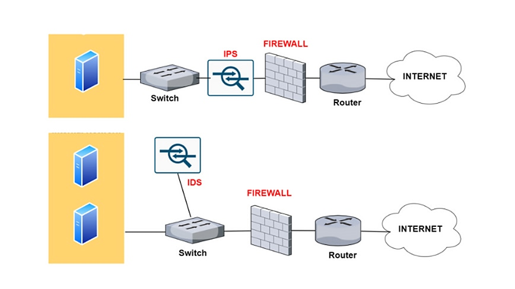
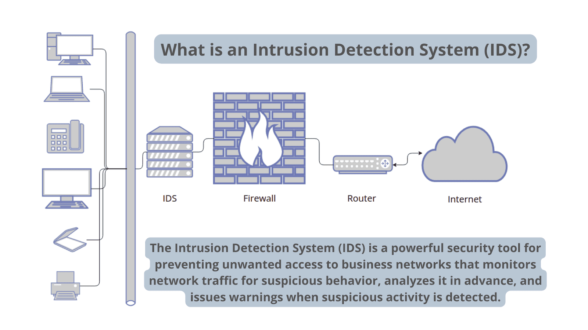
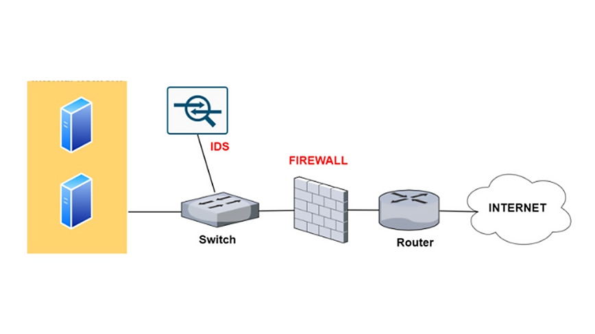

# Sistema de detección de intrusiones (IDS)

Un sistema de detección de intrusiones (IDS) es una tecnología de seguridad de red creada originalmente para detectar exploits de vulnerabilidades contra una aplicación o una computadora objetivo.

El IDS también es un dispositivo solo de escucha. El IDS supervisa el tráfico e informa los resultados a un administrador. No puede actuar automáticamente para evitar que un exploit detectado se apodere del sistema.

Los atacantes son capaces de explotar las vulnerabilidades rápidamente una vez que entran en la red. Por lo tanto, el IDS no es adecuado para la prevención. Los [sistemas de detección y prevención](https://www.paloaltonetworks.lat/cyberpedia/what-is-an-intrusion-prevention-system-ips) de intrusiones son esenciales para la gestión de la información de seguridad y los eventos.

## Sistemas de detección de intrusiones frente a sistemas de prevención de intrusiones

La siguiente tabla resume las diferencias entre la implementación de IPS y de IDS.

|                                          | Sistema de prevención de intrusiones                         | Implementación de IDS                                      |
| ---------------------------------------- | ------------------------------------------------------------ | ---------------------------------------------------------- |
| Colocación en una infraestructura de red | Parte de la línea directa de comunicación (en línea)         | Fuera de la línea directa de comunicación (fuera de banda) |
| Tipo de sistema                          | Activo (vigilancia y defensa automática) o pasiva            | Pasivo (supervisar y notificar)                            |
| Mecanismos de detección                  | 1. Detección estadística basada en anomalías 2. Detección de firmas: - Firmas orientadas a los exploits - Firmas orientadas a las vulnerabilidades | 1. Detección de firmas: - Firmas orientadas a los exploits |

 

*Diagrama que muestra la diferencia entre un IPS y un IDS*

## Cómo funciona el IDS

*Diagrama que representa la funcionalidad de un sistema de detección de intrusiones*

Un IDS solo necesita detectar amenazas potenciales. Se coloca fuera de banda en la infraestructura de red. Por lo tanto, no se encuentra en la ruta de comunicación en tiempo real entre el emisor y el receptor de la información.

Las soluciones de IDS suelen aprovechar un puerto TAP o SPAN para analizar una copia del flujo de tráfico en línea. Esto garantiza que el IDS no afecte el rendimiento de la red en línea.

Cuando se desarrollaron los IDS, la profundidad de análisis necesaria para detectar una intrusión no podía realizarse con la suficiente rapidez. La velocidad no seguiría el ritmo de los componentes en la ruta de comunicación directa de la infraestructura de red.

Los sistemas de detección de intrusiones en la red se utilizan para detectar actividades sospechosas y atrapar a los hackers antes de que dañen la red. Existen sistemas de detección de intrusiones basados en la red y basados en el host. Los IDS basados en host se instalan en las computadoras cliente; los IDS basados en red, en la propia red.

Un IDS funciona buscando desviaciones de la actividad normal y firmas de ataque conocidas. Los patrones anómalos se envían por la pila y se examinan en las capas de protocolo y aplicación. Puede detectar eventos como envenenamientos de DNS, paquetes de información malformados y exploraciones de árbol de Navidad.

Un IDS puede implementarse como un dispositivo de seguridad de red o como una aplicación de software. Para proteger los datos y los sistemas en entornos de nube, también existen IDS basados en la nube.

## Tipos de detección de IDS

Existen cinco tipos de IDS: basados en red, basados en hosts, basados en protocolos, basados en protocolos de aplicaciones e híbridos.

Los dos tipos más frecuentes de IDS son:

1. **Sistema de detección de intrusiones basado en red (NIDS)**
   Un IDS de red supervisa una red protegida completa. Se implementa en toda la infraestructura en puntos estratégicos, como las subredes más vulnerables. El NIDS supervisa todo el tráfico que fluye hacia y desde los dispositivos de la red y toma decisiones según el contenido de los paquetes y los metadatos.
2. **Sistema de detección de intrusiones basado en host (HIDS)**
   Un IDS basado en host supervisa la infraestructura informática en la que está instalado. En otras palabras, se implementa en un endpoint específico para protegerlo contra amenazas internas y externas. El IDS hace esto mediante un análisis del tráfico, registrando las actividades maliciosas y notificándolas a las autoridades designadas.

Los tres tipos restantes pueden describirse del siguiente modo:

1. **Basado en protocolos (PIDS)**
   Un sistema de detección de intrusiones basado en protocolos suele instalarse en un servidor web. Supervisa y analiza el protocolo entre un usuario/dispositivo y el servidor. Normalmente, un PIDS se sitúa en la parte inicial de un servidor y supervisa el comportamiento y el estado del protocolo.
2. **Basado en protocolos de aplicaciones (APIDS)**
   Un APIDS es un sistema o agente que normalmente se sitúa dentro de la parte del servidor. Rastrea e interpreta la correspondencia en protocolos específicos de la aplicación. Por ejemplo, supervisaría el protocolo SQL al middleware mientras realiza transacciones con el servidor web.
3. **Sistema híbrido de detección de intrusiones**
   Un sistema híbrido de detección de intrusiones combina dos o más enfoques de detección de intrusiones. Con este sistema, los datos del sistema o del agente host se combinan con la información de la red para obtener una visión completa del sistema. El sistema híbrido de detección de intrusiones es más versátil que otros sistemas. Un ejemplo de IDS híbrido es Prelude.

También existe un subgrupo de métodos de detección de IDS, donde las dos variantes más frecuentes son las siguientes:

1. **Basado en firmas**
   Un IDS basado en firmas supervisa el tráfico de red entrante y busca patrones y secuencias específicos que coincidan con firmas de ataque conocidas. Aunque es eficaz para este fin, es incapaz de detectar ataques no identificados sin patrones conocidos.

2. **Basado en anomalías**
   El IDS basado en anomalías es una tecnología relativamente nueva diseñada para detectar ataques desconocidos, el cual trasciende la identificación de firmas de ataque. En cambio, este tipo de detección utiliza el aprendizaje automático para analizar grandes cantidades de datos y tráfico de red.

   Los IDS basados en anomalías crean un modelo definido de actividad normal y lo utilizan para identificar comportamientos anómalos. Sin embargo, son propensos a falsos positivos. Por ejemplo, si una máquina muestra un comportamiento poco frecuente pero saludable, se identifica como anomalía. El resultado es una falsa alarma.

## IDS frente a firewalls

Tanto los IDS como los [firewalls de nueva generación](https://www.paloaltonetworks.lat/network-security/next-generation-firewall) son soluciones de [seguridad de red](https://www.paloaltonetworks.lat/network-security). Lo que diferencia a un IDS de un firewall es su finalidad.

Un dispositivo IDS supervisa de forma pasiva; describe una supuesta amenaza cuando se produce e indica una alerta. Los IDS vigilan los paquetes de red en movimiento. Esto permite que la respuesta ante incidentes evalúe la amenaza y actúe según resulte necesario. Sin embargo, no protege el endpoint ni la red.

Un firewall supervisa activamente y busca amenazas para evitar que se conviertan en incidentes. Los firewalls son capaces de filtrar y bloquear el tráfico. Permiten el tráfico en función de reglas preconfiguradas, según los puertos, las direcciones de destino y el origen.

Los firewalls rechazan el tráfico que no sigue las reglas del firewall. Sin embargo, si un ataque procede del interior de la red, el IDS no generará una alerta.

*Diagrama que representa la funcionalidad de un sistema de detección de intrusiones y un firewall*

## Técnicas de evasión de IDS

Existen numerosas técnicas que los intrusos pueden utilizar para evitar ser detectados por los IDS. Estos métodos pueden suponer un desafío para los IDS, ya que pretenden eludir los métodos de detección existentes:

- **Fragmentación**
  La fragmentación divide un paquete en paquetes más pequeños y fragmentados. Esto permite a un intruso permanecer oculto, ya que no habrá ninguna firma de ataque que detectar.

  Los paquetes fragmentados son reconstruidos posteriormente por el nodo receptor en la capa IP. Posteriormente, se reenvían a la capa de la aplicación. Los ataques de fragmentación generan paquetes maliciosos sustituyendo los datos de los paquetes fragmentados por otros nuevos.

- **Inundación**
  Este ataque está diseñado para abrumar al detector y desencadenar una falla del mecanismo de control. Cuando falle un detector, se permitirá todo el tráfico.

  Una forma popular de provocar inundaciones es falsificar el protocolo de datagramas de usuario (UDP) legítimo y el protocolo de mensajes de control de Internet (ICMP). La inundación de tráfico se utiliza entonces para camuflar las actividades anómalas del perpetrador. Como resultado, el IDS tendría grandes dificultades para encontrar paquetes maliciosos dentro de un volumen abrumador de tráfico.

- **Ofuscación**
  La ofuscación puede utilizarse para evitar ser detectado haciendo que un mensaje sea difícil de comprender, con lo cual se oculta un ataque. La terminología de ofuscación hace referencia a alterar el código de un programa de manera tal que lo mantenga funcionalmente indistinguible.

  El objetivo es reducir la detectabilidad ante el proceso de ingeniería inversa o análisis estático ocultándolo y vulnerando la legibilidad. El malware de ofuscación, por ejemplo, le permite eludir los IDS.

- **Cifrado**
  El cifrado ofrece múltiples posibilidades de seguridad, como la confidencialidad, la integridad y la privacidad de los datos. Lamentablemente, los creadores de malware utilizan atributos de seguridad para ocultar los ataques y evadir la detección.

  Por ejemplo, un IDS no puede leer un ataque a un protocolo cifrado. Cuando el IDS no puede relacionar el tráfico cifrado con las firmas existentes en la base de datos, el tráfico cifrado no se cifra. Esto hace que sea muy difícil para los detectores identificar los ataques.

## Por qué son importantes los sistemas de detección de intrusiones

Los ciberataques son cada vez más complejos y sofisticados, y los [ataques de día cero](https://start.paloaltonetworks.com/unit-42-network-threat-trends-report-2022.html) son frecuentes. En consecuencia, las tecnologías de protección de redes deben seguir el ritmo de las nuevas amenazas y las empresas deben mantener altos niveles de seguridad.

El objetivo consiste en garantizar una comunicación segura y confiable de la información. Por lo tanto, un IDS es importante para el ecosistema de seguridad. Funciona como defensa de la seguridad de los sistemas cuando fallan otras tecnologías.

- Identifique incidentes de seguridad.
- Analice la cantidad y los tipos de ataques.
- Ayude a identificar errores o problemas con las configuraciones de los dispositivos.
- Respalde el cumplimiento regulatorio (mediante una mejor visibilidad de la red y la documentación de los registros de IDS).
- Mejore las respuestas de seguridad (mediante la inspección de los datos dentro de los paquetes de red, en lugar del censo manual de los sistemas).

Aunque los IDS son útiles, su impacto se amplía cuando se combinan con IPS. Los [sistemas de prevención de intrusiones](https://www.paloaltonetworks.lat/cyberpedia/what-is-an-intrusion-prevention-system-ips) (IPS) agregan la capacidad de bloquear amenazas. Esta se ha convertido en la opción de implementación dominante para las tecnologías de IDS/IPS.

Mejor aún es la combinación de múltiples tecnologías de prevención de amenazas para conformar una solución completa. Un enfoque eficaz es una combinación de lo siguiente:

- Protección de vulnerabilidades
- Antimalware
- Antispyware

Estas tecnologías combinadas constituyen una [protección contra amenazas avanzadas](https://www.paloaltonetworks.lat/network-security/advanced-threat-prevention). El servicio analiza todo el tráfico en busca de amenazas (incluidos puertos, protocolos y tráfico cifrado). Las soluciones de prevención de amenazas avanzadas buscan las amenazas dentro del ciclo de vida del ciberataque, no solo cuando ingresa en la red. Esto forma una defensa por capas: un [enfoque de Confianza Cero](https://www.paloaltonetworks.lat/zero-trust) con prevención en todos los puntos.