# Linux fundamentals

Linux es una herramienta y un sistema indispensable en el campo de la ciberseguridad. Muchos servidores funcionan con Linux y ofrecen una amplia gama de posibilidades para los profesionales de la seguridad ofensiva, los defensores de la red y los administradores de sistemas. 

Conozcamos los aspectos esenciales para utilizar el sistema operativo y la terminal Linux.

- Estructura de Linux
- Usando el shell
- Navegando por el sistema operativo Linux
- Trabajar con archivos y directorios
- Administración de Linux
- Gestión de servicios
- Gestión de permisos

---
## Historia de linux

Muchos fueron los eventos que de algún modo contribuyeron o crearon el camino que acabaría con la creación del primer núcleo Linux:
- el lanzamiento del sistema operativo Unix por Ken Thompson y Dennis Ritchie (que trabajaban para AT&T en ese momento) en 1970.
- la publicación de Berkeley Software Distribution (BSD) en 1977, que acabaría limitado en su desarrollo debido a la demanda de  AT&T, ya que contenía código Unix de la que esta era propietaria.
- el comienzo, en 1983, del proyecto GNU de Richard Stallman. Parte de su trabajo resultó en la creación de la Licencia Pública General GNU (GPL).
Pese a los importantes avances que supusieron todas estas iniciativas, no lograron obtener el resultado deseado de un núcleo libre y funcional que fuera ampliamente adoptado.

Linux fue un proyecto personal iniciado en 1991 por un estudiante finlandés llamado Linus Torvalds.
Desde sus inicios como pasatiempo de un estudiante, el núcleo de Linux ha pasado de ser un pequeño número de archivos escritos en C bajo una licencia que prohibía su distribución comercial a la última versión con más de 23 millones de líneas de código fuente (comentarios excluidos), licenciada bajo la Licencia Pública General GNU v2.

Hoy, Linux está disponible en más de 600 distribuciones. Algunas de las más populares y conocidas son Ubuntu, Debian, Fedora, OpenSUSE, elementary, Manjaro, Gentoo Linux, RedHat o Linux Mint.

Y estas son algunas de sus características destacables:
- Linux se considera generalmente más seguro que otros sistemas operativos. Y aunque ha tenido muchas vulnerabilidades de Kernel en el pasado cada vez son menos frecuentes.
  - Es menos susceptible al malware que los sistemas operativos Windows y se actualiza con mucha frecuencia.
  - Es muy estable
  - Ofrece un alto rendimiento
  - Sin embargo, puede ser más difícil para los principiantes y no tiene tantos controladores de hardware como Windows.
- Linux es gratuito y de código abierto, cualquier persona puede modificar y distribuir el código fuente de forma comercial o no comercial.
- Los sistemas operativos basados en Linux se ejecutan en servidores, mainframes, computadoras de escritorio, sistemas integrados como enrutadores, televisores, consolas de videojuegos y más.
- El sistema operativo Android general que se ejecuta en teléfonos inteligentes y tabletas se basa en el núcleo de Linux y, debido a esto, Linux se puede considerar el sistema operativo más instalado.

Linux es un sistema operativo como Windows, iOS, Android o macOS. 

Un SO es un software que administra todos los recursos de hardware asociados con nuestro ordenador. Eso significa que un SO administra toda la comunicación entre el software y el hardware.

Si estás pensando en practicar con Linux y además tu orientación es la seguridad de la información y la ciberseguridad existen algunas distribuciones que pueden ayudarte a comenzar:
- Parrot OS es una distribución Linux basada en Debian que se centra en la seguridad, la privacidad y el desarrollo. 
- Kali Linux es otra distribución muy reconocida en el mundo de la seguridad.

## Filosofía

Linux sigue cinco principios básicos:

| **Principio**                                                     | **Descripción**                                                                                                                                                                           |
| ----------------------------------------------------------------- | ----------------------------------------------------------------------------------------------------------------------------------------------------------------------------------------- |
| `Todo es un archivo`                                              | Todos los archivos de configuración de los distintos servicios que se ejecutan en el sistema operativo Linux se almacenan en uno o más archivos de texto.                                 |
| `Programas pequeños de proposito único`                           | Linux ofrece muchas herramientas diferentes con las que trabajaremos y que se pueden combinar para trabajar juntas.                                                                       |
| `Capacidad de encadenar programas para realizar tareas complejas` | La integración y combinación de diferentes herramientas nos permite llevar a cabo muchas tareas grandes y complejas, como el procesamiento o filtrado de resultados de datos específicos. |
| `Evitar las interfaces de usuario cautivas`                       | Linux está diseñado para funcionar principalmente con el shell (o terminal), lo que le da al usuario un mayor control sobre el sistema operativo.                                         |
| `Datos de configuración almacenados en un archivo de texto`       | Un ejemplo de dicho archivo es el `/etc/passwd`archivo que almacena todos los usuarios registrados en el sistema.                                                                         |

------

## Componentes

| **Componente**    | **Descripción**                                              |
| ----------------- | ------------------------------------------------------------ |
| `Bootloader`      | Un fragmento de código que se ejecuta para guiar el proceso de arranque del sistema operativo. Parrot Linux utiliza el cargador de arranque GRUB. |
| `OS Kernel`       | El núcleo es el componente principal de un sistema operativo. Gestiona los recursos de los dispositivos de E/S del sistema a nivel de hardware. |
| `Daemons`         | Los servicios en segundo plano se denominan "daemons" en Linux. Su finalidad es garantizar que las funciones clave, como la programación, la impresión y el contenido multimedia, funcionen correctamente. Estos pequeños programas se cargan después de que iniciamos o iniciamos sesión en la computadora. |
| `OS Shell`        | El intérprete del lenguaje de comandos (también conocido como línea de comandos) es la interfaz entre el sistema operativo y el usuario. Esta interfaz permite al usuario indicarle al sistema operativo qué debe hacer. Los intérpretes de comandos más utilizados son Bash, Tcsh/Csh, Ksh, Zsh y Fish. |
| `Graphics server` | Esto proporciona un subsistema gráfico (servidor) llamado "X" o "servidor X" que permite que los programas gráficos se ejecuten local o remotamente en el sistema de ventanas X. |
| `Window Manager`  | También se conoce como interfaz gráfica de usuario (GUI). Existen muchas opciones, entre ellas GNOME, KDE, MATE, Unity y Cinnamon. Un entorno de escritorio suele tener varias aplicaciones, entre ellas navegadores de archivos y web. Estas permiten al usuario acceder y administrar las funciones y servicios esenciales y de acceso frecuente de un sistema operativo. |
| `Utilities`       | Las aplicaciones o utilidades son programas que realizan funciones específicas para el usuario u otro programa. |

------

## Arquitectura de Linux

El sistema operativo Linux se puede dividir en capas:

| **Capa**         | **Descripción**                                              |
| ---------------- | ------------------------------------------------------------ |
| `Hardware`       | Dispositivos periféricos como la RAM del sistema, el disco duro, la CPU y otros. |
| `Kernel`         | El núcleo del sistema operativo Linux, cuya función es virtualizar y controlar los recursos comunes del hardware de la computadora, como la CPU, la memoria asignada, los datos a los que se accede y otros. El núcleo otorga a cada proceso sus propios recursos virtuales y evita o mitiga los conflictos entre los distintos procesos. |
| `Shell`          | Una interfaz de línea de comandos ( **CLI** ), también conocida como shell, en la que un usuario puede ingresar comandos para ejecutar las funciones del núcleo. |
| `System Utility` | Pone a disposición del usuario toda la funcionalidad del sistema operativo. |

------

## Jerarquía del sistema de archivos

El sistema operativo Linux está estructurado en una jerarquía de tipo árbol y está documentado en el Estándar [de jerarquía de sistemas de archivos](http://www.pathname.com/fhs/) (FHS). Linux está estructurado con los siguientes directorios de nivel superior estándar:

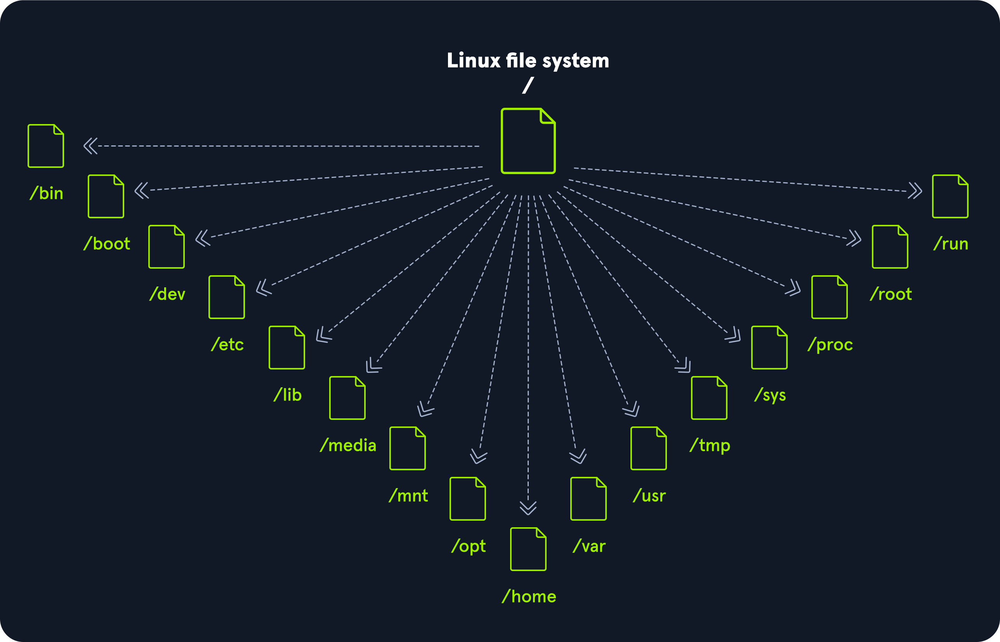

| **Camino** | **Descripción**                                              |
| ---------- | ------------------------------------------------------------ |
| `/`        | El directorio de nivel superior es el sistema de archivos raíz y contiene todos los archivos necesarios para iniciar el sistema operativo antes de que se monten otros sistemas de archivos, así como los archivos necesarios para iniciar los otros sistemas de archivos. Después del arranque, todos los demás sistemas de archivos se montan en puntos de montaje estándar como subdirectorios de la raíz. |
| `/bin`     | Contiene binarios de comandos esenciales.                    |
| `/boot`    | Consiste en el cargador de arranque estático, el ejecutable del kernel y los archivos necesarios para iniciar el sistema operativo Linux. |
| `/dev`     | Contiene archivos de dispositivo para facilitar el acceso a todos los dispositivos de hardware conectados al sistema. |
| `/etc`     | Archivos de configuración del sistema local. Aquí también se pueden guardar los archivos de configuración de las aplicaciones instaladas. |
| `/home`    | Cada usuario del sistema tiene aquí un subdirectorio para almacenamiento. |
| `/lib`     | Archivos de biblioteca compartida que son necesarios para el arranque del sistema. |
| `/media`   | Aquí se montan dispositivos de medios extraíbles externos, como unidades USB. |
| `/mnt`     | Punto de montaje temporal para sistemas de archivos normales. |
| `/opt`     | Aquí se pueden guardar archivos opcionales como herramientas de terceros. |
| `/root`    | El directorio de inicio del usuario root.                    |
| `/sbin`    | Este directorio contiene ejecutables utilizados para la administración del sistema (archivos binarios del sistema). |
| `/tmp`     | El sistema operativo y muchos programas utilizan este directorio para almacenar archivos temporales. Este directorio generalmente se borra al iniciar el sistema y puede eliminarse en otras ocasiones sin previo aviso. |
| `/usr`     | Contiene ejecutables, bibliotecas, archivos man, etc.        |
| `/var`     | Este directorio contiene archivos de datos variables, como archivos de registro, buzones de correo electrónico, archivos relacionados con aplicaciones web, archivos cron y más. |

# Distribuciones de Linux

------

Las distribuciones de Linux (o distros) son sistemas operativos basados en el núcleo de Linux. Se utilizan para diversos fines, desde servidores y dispositivos integrados hasta computadoras de escritorio y teléfonos móviles. Cada distribución de Linux es diferente, con su propio conjunto de características, paquetes y herramientas. Algunos ejemplos populares incluyen:

- [Ubuntu](https://ubuntu.com/)
- [Fedora](https://getfedora.org/)
- [CentOS](https://www.centos.org/)
- [Debian](https://www.debian.org/)
- [Red Hat Enterprise Linux](https://www.redhat.com/en/technologies/linux-platforms/enterprise-linux)

Muchos usuarios eligen Linux para sus computadoras de escritorio porque es gratuito, de código abierto y altamente personalizable. Ubuntu y Fedora son dos opciones populares para Linux de escritorio y para principiantes. También se usa ampliamente como sistema operativo de servidor porque es seguro, estable y confiable y viene con actualizaciones frecuentes y regulares. Finalmente, nosotros, como especialistas en ciberseguridad, a menudo preferimos Linux porque es de código abierto, lo que significa que su código fuente está disponible para su escrutinio y personalización. Debido a dicha personalización, podemos optimizar y personalizar nuestra distribución de Linux de la manera que queramos y configurarla para casos de uso específicos solo si es necesario.

Podemos utilizar estas distribuciones en todas partes, incluidos servidores (web), dispositivos móviles, sistemas integrados, computación en la nube y computación de escritorio. Para los especialistas en seguridad cibernética, algunas de las distribuciones de Linux más populares son, entre otras:

|                                                              |                                   |                                     |
| ------------------------------------------------------------ | --------------------------------- | ----------------------------------- |
| [Parrot OS](https://www.parrotsec.org/)                      | [Ubuntu](https://ubuntu.com/)     | [Debian](https://www.debian.org/)   |
| [Sistema operativo Raspberry Pi](https://www.raspberrypi.com/software/) | [CentOS](https://www.centos.org/) | [Backbox](https://www.backbox.org/) |
| [BlackArch](https://www.blackarch.org/)                      | [Pentoo](https://www.pentoo.ch/)  |                                     |
| [Kali Linux](https://www.kali.org)                           | [Debian](https://www.debian.org/) | [Debian](https://www.debian.org/)   |

Las principales diferencias entre las distintas distribuciones de Linux son los paquetes incluidos, la interfaz de usuario y las herramientas disponibles. Kali Linux es la distribución más popular entre los especialistas en seguridad cibernética, ya que incluye una amplia gama de herramientas y paquetes enfocados en la seguridad. Ubuntu está muy extendido entre los usuarios de escritorio, mientras que Debian es popular para servidores y sistemas integrados. Por último, Red Hat Enterprise Linux y CentOS son populares para la informática de nivel empresarial.

------

## Debian

Debian es una distribución Linux muy utilizada y respetada, conocida por su estabilidad y fiabilidad. Se utiliza para diversos fines, como la informática de escritorio, los servidores y los sistemas integrados. Utiliza un `apt`sistema de gestión de paquetes llamado Advanced Package Tool (Herramienta avanzada de paquetes) para gestionar las actualizaciones de software y los parches de seguridad. El sistema de gestión de paquetes ayuda a mantener el sistema actualizado y seguro descargando e instalando automáticamente las actualizaciones de seguridad tan pronto como están disponibles. Esto se puede ejecutar de forma manual o configurar de forma automática.

Debian puede tener una curva de aprendizaje más pronunciada que otras distribuciones, pero se considera ampliamente como una de las distribuciones Linux más flexibles y personalizables. La configuración y la instalación pueden ser complejas, pero también proporciona un excelente control sobre el sistema, lo que puede ser bueno para usuarios avanzados. Cuanto más control tengamos sobre un sistema Linux, más complejo parecerá. Sin embargo, sólo lo parece en comparación con las opciones y posibilidades que tenemos. Sin aprenderlo con la profundidad necesaria, podríamos pasar mucho más tiempo configurando tareas y procesos "fáciles" que si aprendiéramos a usar algunos comandos y herramientas con más profundidad. Lo veremos en las secciones `Filter Contents`y .`Find Files and Directories`

La estabilidad y la fiabilidad son puntos fuertes de Debian. La distribución es conocida por sus lanzamientos de soporte a largo plazo, que pueden proporcionar actualizaciones y parches de seguridad durante hasta cinco años. Esto puede ser especialmente importante para servidores y otros sistemas que deben estar en funcionamiento las 24 horas del día, los 7 días de la semana. Ha tenido algunas vulnerabilidades, pero la comunidad de desarrollo ha publicado rápidamente parches y actualizaciones de seguridad. Además, Debian tiene un fuerte compromiso con la seguridad y la privacidad, y la distribución tiene un historial de seguridad bien establecido. Debian es una distribución Linux versátil y fiable que se utiliza ampliamente para una variedad de propósitos. Su estabilidad, fiabilidad y compromiso con la seguridad la convierten en una opción atractiva para varios casos de uso, incluida la ciberseguridad.

# Introducción a Shell

------

Es fundamental aprender a utilizar el shell de Linux, ya que hay muchos servidores basados en Linux. Estos se utilizan a menudo porque Linux es menos propenso a errores que los servidores Windows. Por ejemplo, los servidores web suelen estar basados en Linux. Saber cómo utilizar el sistema operativo para controlarlo de forma eficaz requiere comprender y dominar la parte esencial de Linux, el `Shell`. Cuando cambiamos por primera vez de Windows a Linux, ¿se parecía a esto?

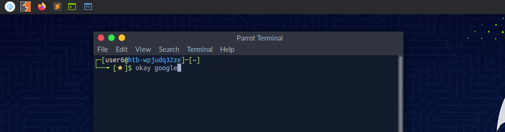

Una terminal de Linux, también llamada `shell`línea de comandos, proporciona una **interfaz de entrada/salida (E/S) basada en texto entre los usuarios y el núcleo de un sistema informático**. El término consola también es habitual, pero no se refiere a una ventana, sino a una pantalla en modo texto. En la ventana de la terminal, se pueden ejecutar comandos para controlar el sistema.

Podemos pensar en un shell como una GUI basada en texto en la que ingresamos comandos para realizar acciones como navegar a otros directorios, trabajar con archivos y obtener información del sistema, pero con muchas más capacidades.

------

## Emuladores de terminal

La emulación de terminal es un software que emula la función de un terminal. Permite el uso de programas basados en texto dentro de una interfaz gráfica de usuario ( `GUI`). También existen las denominadas interfaces de línea de comandos ( `CLI`) que se ejecutan como terminales adicionales en un terminal. En resumen, un terminal sirve como interfaz para el intérprete de shell.

Los emuladores de terminal y multiplexores son extensiones útiles para el terminal. Nos proporcionan diferentes métodos y funciones para trabajar con el terminal, como dividir el terminal en una sola ventana, trabajar en múltiples directorios, crear diferentes espacios de trabajo y mucho más. Un ejemplo del uso de un multiplexor de este tipo llamado Tmux podría ser algo como esto:

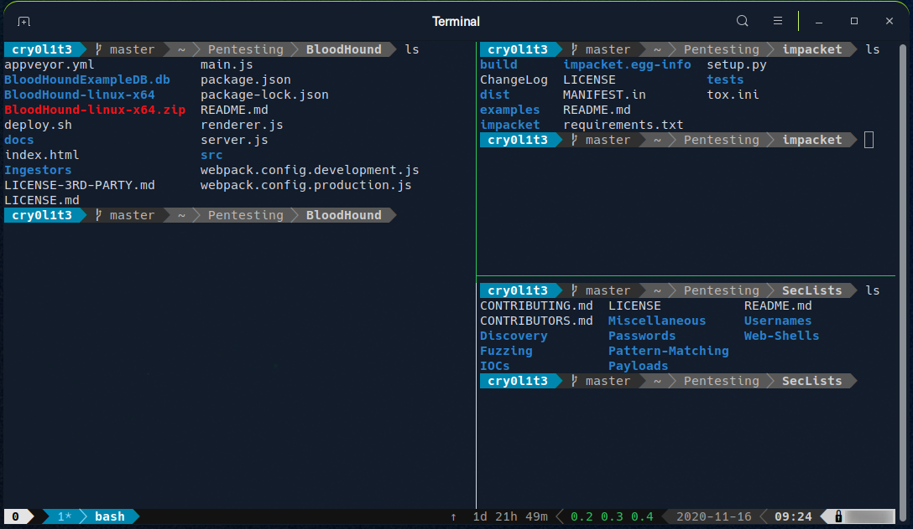

------

## Shell

El shell más utilizado en Linux es el `Bourne-Again Shell`( `BASH`), y forma parte del proyecto GNU. Todo lo que hacemos a través de la GUI lo podemos hacer con el shell. El shell nos da muchas más posibilidades de interactuar con programas y procesos para obtener información más rápido. Además, muchos procesos se pueden automatizar fácilmente con scripts más pequeños o más grandes que hacen mucho más fácil el trabajo manual.

Además de Bash, también existen otros shells como [Tcsh/Csh](https://en.wikipedia.org/wiki/Tcsh) , [Ksh](https://en.wikipedia.org/wiki/KornShell) , [Zsh](https://en.wikipedia.org/wiki/Z_shell) , [Fish  shell](https://en.wikipedia.org/wiki/Friendly_interactive_shell) y otros.

# Descripción del prompt

------

El mensaje de aviso de bash -**prompt**- es fácil de entender y, de forma predeterminada, incluye información como el usuario, el nombre de host y el directorio de trabajo actual. Es una cadena de caracteres que se muestra en la pantalla del terminal y que indica que el sistema está listo para nuestra entrada. Por lo general, incluye información como el usuario actual, el nombre de host de la computadora y el directorio de trabajo actual. El mensaje de aviso generalmente se muestra en una nueva línea y el cursor se coloca después del mensaje de aviso, listo para que el usuario comience a escribir un comando.

Se puede personalizar para brindar información útil al usuario. El formato puede ser similar al siguiente:

```shell-session
<username>@<hostname><current working directory>$
```

El directorio de inicio de un usuario está marcado con una tilde < `~`> y es la carpeta predeterminada cuando iniciamos sesión.

```shell-session
<username>@<hostname>[~]$
```

El signo de dólar, en este caso, representa a un usuario. En cuanto iniciamos sesión como `root`, el carácter cambia a un `hash`< `#`> y se ve así:

```shell-session
root@htb[/htb]#
```

Por ejemplo, cuando cargamos y ejecutamos un shell en el sistema de destino, es posible que no veamos el nombre de usuario, el nombre de host y el directorio de trabajo actual. Esto puede deberse a que la variable PS1 en el entorno no está configurada correctamente. En este caso, veríamos los siguientes mensajes:

### Sin privilegios: indicador de shell del usuario

```shell-session
$
```

### Privilegiado: Indicador de shell de root

```shell-session
#
```

Además de proporcionar información básica como el usuario actual y el directorio de trabajo, podemos personalizar para mostrar otra información en el mensaje, como la dirección IP, la fecha, la hora, el estado de salida del último comando y más. Esto es especialmente útil para nosotros durante nuestras pruebas de penetración porque podemos usar varias herramientas y posibilidades como `script` o `.bash_history` para filtrar e imprimir todos los comandos que usamos y ordenarlos por fecha y hora. Por ejemplo, el mensaje podría configurarse para mostrar la ruta completa del directorio de trabajo actual en lugar de solo el nombre del directorio actual, que también puede incluir la dirección IP del objetivo si trabajamos organizados.

El mensaje de solicitud se puede personalizar utilizando caracteres especiales y variables en el archivo de configuración del shell ( `.bashrc` para el shell Bash). Por ejemplo, podemos utilizar: el carácter `\u` para representar el nombre de usuario actual, `\h` para el nombre de host y `\w` para el directorio de trabajo actual.

| **Carácter especial** | **Descripción**                                |
| --------------------- | ---------------------------------------------- |
| `\d`                  | Fecha (lunes 6 de febrero)                     |
| `\D{%Y-%m-%d}`        | Fecha (AAAA-MM-DD)                             |
| `\H`                  | Nombre de host completo                        |
| `\j`                  | Número de trabajos gestionados por el shell    |
| `\n`                  | Nueva línea                                    |
| `\r`                  | Retorno de carro                               |
| `\s`                  | Nombre del shell                               |
| `\t`                  | Hora actual 24 horas (HH:MM:SS)                |
| `\T`                  | Hora actual en formato de 12 horas (HH:MM:SS)  |
| `\@`                  | Hora actual                                    |
| `\u`                  | Nombre de usuario actual                       |
| `\w`                  | Ruta completa del directorio de trabajo actual |

Personalizar el mensaje puede ser una forma útil de hacer que la experiencia en el terminal sea más personalizada y eficiente. También puede ser una herramienta útil para la resolución de problemas, ya que puede proporcionar información importante sobre el estado del sistema en un momento determinado.

Además de personalizar el mensaje, podemos personalizar su entorno de terminal con diferentes esquemas de colores, fuentes y otras configuraciones para hacer que su entorno de trabajo sea visualmente más atractivo y más fácil de usar.

Sin embargo, vemos lo mismo que cuando trabajamos en la GUI de Windows aquí. Iniciamos sesión como usuario en una computadora con un nombre específico y sabemos en qué directorio estamos cuando navegamos por nuestro sistema. El indicador de bash también se puede personalizar y cambiar según nuestras propias necesidades. El ajuste del indicador de bash está fuera del alcance de este módulo. Sin embargo, podemos ver [bash-prompt-generator](https://bash-prompt-generator.org/) y [powerline](https://github.com/powerline/powerline) , que nos brindan la posibilidad de adaptar nuestro indicador a nuestras necesidades.

# Obtener ayuda

------

Siempre nos encontraremos con herramientas cuyos parámetros opcionales no conocemos de memoria o herramientas que nunca hemos visto antes. Por lo tanto, es vital saber cómo podemos ayudarnos a familiarizarnos con esas herramientas. Las dos primeras formas son las páginas de manual y las funciones de ayuda. Siempre es una buena idea familiarizarnos primero con la herramienta que queremos probar. También aprenderemos algunos posibles trucos con algunas de las herramientas que pensábamos que no eran posibles. En las páginas de manual, encontraremos los manuales detallados con explicaciones detalladas.

#### Sintaxis:

```shell-session
nunhes@htb[/htb]$ man <tool>
```

Veamos un ejemplo:

#### Ejemplo:

```shell-session
nunhes@htb[/htb]$ man curl
```

```shell-session
curl(1)                                                             Curl Manual                                                            curl(1)

NAME
       curl - transfer a URL

SYNOPSIS
       curl [options] [URL...]

DESCRIPTION
       curl  is  a tool to transfer data from or to a server, using one of the supported protocols (DICT, FILE, FTP, FTPS, GOPHER, HTTP, HTTPS,  
       IMAP, IMAPS,  LDAP,  LDAPS,  POP3,  POP3S,  RTMP, RTSP, SCP, SFTP, SMB, SMBS, SMTP, SMTPS, TELNET, and TFTP). The command is designed to work without user interaction.

       curl offers a busload of useful tricks like proxy support, user authentication, FTP upload, HTTP post, SSL connections, cookies, file transfer resume, Metalink,  and more. As we will see below, the number of features will make our head spin!

       curl is powered by libcurl for all transfer-related features.  See libcurl(3) for details.

Manual page curl(1) line 1 (press h for help or q to quit)
```

Después de ver algunos ejemplos, también podemos ver rápidamente los parámetros opcionales sin tener que navegar por toda la documentación. Tenemos varias formas de hacerlo.

#### Sintaxis:

```shell-session
nunhes@htb[/htb]$ <tool> --help
```

#### Ejemplo:

```shell-session
nunhes@htb[/htb]$ curl --help

Usage: curl [options...] <url>
     --abstract-unix-socket <path> Connect via abstract Unix domain socket
     --anyauth       Pick any authentication method
 -a, --append        Append to target file when uploading
     --basic         Use HTTP Basic Authentication
     --cacert <file> CA certificate to verify peer against
     --capath <dir>  CA directory to verify peer against
 -E, --cert <certificate[:password]> Client certificate file and password
<SNIP>
```

También podemos utilizar la versión corta:

#### Sintaxis:

```shell-session
nunhes@htb[/htb]$ <tool> -h
```

#### Ejemplo:

```shell-session
nunhes@htb[/htb]$ curl -h

Usage: curl [options...] <url>
     --abstract-unix-socket <path> Connect via abstract Unix domain socket
     --anyauth       Pick any authentication method
 -a, --append        Append to target file when uploading
     --basic         Use HTTP Basic Authentication
     --cacert <file> CA certificate to verify peer against
     --capath <dir>  CA directory to verify peer against
 -E, --cert <certificate[:password]> Client certificate file and password
<SNIP>
```

Como podemos ver, los resultados de cada uno de ellos no difieren en este ejemplo. Otra herramienta que puede resultar útil al principio es `apropos`. Cada página del manual tiene una breve descripción disponible en su interior. Esta herramienta busca en las descripciones instancias de una palabra clave determinada.

#### Sintaxis:

```shell-session
nunhes@htb[/htb]$ apropos <keyword>
```

#### Ejemplo:

```shell-session
nunhes@htb[/htb]$ apropos sudo

sudo (8)             - execute a command as another user
sudo.conf (5)        - configuration for sudo front end
sudo_plugin (8)      - Sudo Plugin API
sudo_root (8)        - How to run administrative commands
sudoedit (8)         - execute a command as another user
sudoers (5)          - default sudo security policy plugin
sudoreplay (8)       - replay sudo session logs
visudo (8)           - edit the sudoers file
```

Otro recurso útil para obtener ayuda si tenemos problemas para entender un comando largo es: https://explainshell.com/

# Información del sistema

------

Dado que trabajaremos con muchos sistemas Linux diferentes, necesitamos aprender la estructura y la información sobre el sistema, sus procesos, configuraciones de red, usuarios, directorios, configuraciones de usuario y los parámetros correspondientes. Aquí hay una lista de las herramientas necesarias que nos ayudarán a obtener la información anterior. La mayoría de ellas están instaladas de forma predeterminada.

| **Dominio** | **Descripción**                                              |
| ----------- | ------------------------------------------------------------ |
| `whoami`    | Muestra el nombre de usuario actual.                         |
| `id`        | Devuelve la identidad del usuario                            |
| `hostname`  | Establece o imprime el nombre del sistema host actual.       |
| `uname`     | Imprime información básica sobre el nombre del sistema operativo y el hardware del sistema. |
| `pwd`       | Devuelve el nombre del directorio de trabajo.                |
| `ifconfig`  | La utilidad ifconfig se utiliza para asignar o ver una dirección a una interfaz de red y/o configurar parámetros de la interfaz de red. |
| `ip`        | Ip es una utilidad para mostrar o manipular enrutamiento, dispositivos de red, interfaces y túneles. |
| `netstat`   | Muestra el estado de la red.                                 |
| `ss`        | Otra utilidad para investigar sockets.                       |
| `ps`        | Muestra el estado del proceso.                               |
| `who`       | Muestra quién ha iniciado sesión.                            |
| `env`       | Imprime el entorno o establece y ejecuta el comando.         |
| `lsblk`     | Enumera los dispositivos de bloque.                          |
| `lsusb`     | Enumera los dispositivos USB                                 |
| `lsof`      | Enumera los archivos abiertos.                               |
| `lspci`     | Enumera los dispositivos PCI.                                |

Veamos algunos ejemplos.

#### hostname

El `hostname`comando se explica por sí solo y simplemente imprimirá el nombre de la computadora en la que hemos iniciado sesión.

```shell-session
nunhes@htb[/htb]$ hostname

nixfund
```

#### whoami

Este comando rápido y sencillo se puede utilizar tanto en sistemas Windows como Linux para obtener nuestro nombre de usuario actual. Durante una evaluación de seguridad, obtenemos acceso de shell inverso en un host y uno de los primeros pasos que debemos dar para conocer la situación es averiguar con qué usuario estamos ejecutando el sistema. A partir de ahí, podemos averiguar si el usuario tiene algún privilegio o acceso especial.

```shell-session
cry0l1t3@htb[/htb]$ whoami

cry0l1t3
```

#### id

El `id`comando amplía el `whoami`comando e imprime nuestra membresía de grupo efectiva y nuestras identificaciones. Esto puede ser de interés para los evaluadores de penetración que buscan ver qué acceso puede tener un usuario y para los administradores de sistemas que buscan auditar los permisos de la cuenta y la membresía del grupo. En este resultado, el `hackthebox`grupo es de interés porque no es estándar, el `adm`grupo significa que el usuario puede leer archivos de registro `/var/log`y potencialmente podría obtener acceso a información confidencial, la membresía en el `sudo`grupo es de particular interés ya que esto significa que nuestro usuario puede ejecutar algunos o todos los comandos como el usuario todopoderoso `root`. Los derechos de sudo podrían ayudarnos a escalar privilegios o podrían ser una señal para un administrador de sistemas de que puede necesitar auditar los permisos y las membresías del grupo para eliminar cualquier acceso que no sea necesario para que un usuario determinado lleve a cabo sus tareas diarias.

```shell-session
cry0l1t3@htb[/htb]$ id

uid=1000(cry0l1t3) gid=1000(cry0l1t3) groups=1000(cry0l1t3),1337(hackthebox),4(adm),24(cdrom),27(sudo),30(dip),46(plugdev),116(lpadmin),126(sambashare)
```

#### uname

Profundicemos `uname`un poco más en el comando. Si escribimos `man uname`en nuestra terminal, se abrirá la página del manual del comando, que mostrará las posibles opciones que podemos ejecutar con el comando y los resultados.

```shell-session
UNAME(1)                                    User Commands                                   UNAME(1)

NAME
       uname - print system information

SYNOPSIS
       uname [OPTION]...

DESCRIPTION
       Print certain system information.  With no OPTION, same as -s.

       -a, --all
              print all information, in the following order, except omit -p and -i if unknown:

       -s, --kernel-name
              print the kernel name

       -n, --nodename
              print the network node hostname

       -r, --kernel-release
              print the kernel release

       -v, --kernel-version
              print the kernel version

       -m, --machine
              print the machine hardware name

       -p, --processor
              print the processor type (non-portable)

       -i, --hardware-platform
              print the hardware platform (non-portable)

       -o, --operating-system
```

Al ejecutarlo, `uname -a`se imprimirá toda la información sobre la máquina en un orden específico: nombre del núcleo, nombre del host, versión del núcleo, nombre del hardware de la máquina y sistema operativo. La `-a`bandera omitirá `-p`(tipo de procesador) y `-i`(plataforma de hardware) si son desconocidos.

```shell-session
cry0l1t3@htb[/htb]$ uname -a

Linux box 4.15.0-99-generic #100-Ubuntu SMP Wed Apr 22 20:32:56 UTC 2020 x86_64 x86_64 x86_64 GNU/Linux
```

Del comando anterior, podemos ver que el nombre del kernel es `Linux`, el nombre del host es `box`, la versión del kernel es `4.15.0-99-generic`, la versión del kernel es `#100-Ubuntu SMP Wed Apr 22 20:32:56 UTC 2020`, y así sucesivamente. Si ejecutamos cualquiera de estas opciones por separado, obtendremos la salida de bits específica que nos interesa.

#### uname para obtener la versión del kernel

Supongamos que queremos imprimir la versión del kernel para buscar rápidamente posibles vulnerabilidades de seguridad. Podemos escribir `uname -r`para obtener esta información.

```shell-session
cry0l1t3@htb[/htb]$ uname -r

4.15.0-99-generic
```

Con esta información, podríamos ir a buscar "4.15.0-99-generic exploit", y el primer [resultado](https://www.exploit-db.com/exploits/47163) inmediatamente nos parece útil.

**Se recomienda estudiar los comandos y comprender para qué sirven y qué información pueden proporcionar**. Aunque es un poco tedioso, podemos aprender mucho estudiando las páginas de manual de los comandos más comunes. Incluso podemos descubrir cosas que ni siquiera sabíamos que eran posibles con un comando determinado. Esta información no solo se utiliza para trabajar con Linux. Sin embargo, también se utilizará más adelante para descubrir vulnerabilidades y configuraciones erróneas en el sistema Linux que pueden contribuir a la escalada de privilegios. A continuación se presentan algunos ejercicios opcionales que podemos resolver con fines prácticos y que nos ayudarán a familiarizarnos con algunos de los comandos.

------

## Iniciar sesión a través de SSH

`Secure Shell`( `SSH`) se refiere a un protocolo que permite a los clientes acceder y ejecutar comandos o acciones en equipos remotos. En hosts y servidores basados en Linux u otro sistema operativo tipo Unix, SSH es una de las herramientas estándar instaladas de forma permanente y es la opción preferida por muchos administradores para configurar y mantener un equipo a través del acceso remoto. Es un protocolo más antiguo y muy probado que no requiere ni ofrece una interfaz gráfica de usuario (GUI). Por este motivo, funciona de forma muy eficiente y ocupa muy pocos recursos. Usamos este tipo de conexión en las siguientes secciones y en la mayoría de los otros módulos para ofrecer la posibilidad de probar los comandos y acciones aprendidos en un entorno seguro. Podemos conectarnos a nuestros objetivos con el siguiente comando:

#### Inicio de sesión SSH

```shell-session
nunhes@htb[/htb]$ ssh [username]@[IP address]
```

# Navegación 

------

La navegación es esencial, como trabajar con el mouse como usuario  estándar de Windows. Con él nos movemos por el sistema y trabajamos en  directorios y archivos que necesitamos y queremos. Por lo tanto,  utilizamos diferentes comandos y herramientas para imprimir información  sobre un directorio o un archivo y podemos usar opciones avanzadas para  optimizar la salida según nuestras necesidades. 

Una de las mejores formas de aprender algo nuevo es experimentar con  ello. Aquí cubrimos las secciones sobre cómo navegar a través de Linux,  crear, mover, editar y eliminar archivos y carpetas, encontrarlos en el  sistema operativo, diferentes tipos de redireccionamientos y qué son los descriptores de archivos. También encontraremos atajos para hacer  nuestro trabajo con el shell mucho más fácil y cómodo. Recomendamos  experimentar en nuestra VM alojada localmente. Asegúrese de haber creado una instantánea para nuestra VM en caso de que nuestro sistema se dañe  inesperadamente. 

Comencemos con la navegación. Antes de movernos por el sistema,  tenemos que averiguar en qué directorio nos encontramos. Podemos saber  dónde estamos con el comando `pwd`.      

```shell-session
cry0l1t3@htb[~]$ pwd

/home/cry0l1t3
```

Sólo el `ls` El comando es necesario para enumerar todos  los contenidos dentro de un directorio. Tiene muchas opciones  adicionales que pueden complementar la visualización del contenido en la carpeta actual.            

```shell-session
cry0l1t3@htb[~]$ ls

Desktop  Documents  Downloads  Music  Pictures  Public  Templates  Videos
```

Si lo usa sin opciones adicionales, solo se mostrarán los directorios y archivos. Sin embargo, también podemos agregar el `-l` opción para mostrar más información sobre esos directorios y archivos.            

```shell-session
cry0l1t3@htb[~]$ ls -l

total 32
drwxr-xr-x 2 cry0l1t3 htbacademy 4096 Nov 13 17:37 Desktop
drwxr-xr-x 2 cry0l1t3 htbacademy 4096 Nov 13 17:34 Documents
drwxr-xr-x 3 cry0l1t3 htbacademy 4096 Nov 15 03:26 Downloads
drwxr-xr-x 2 cry0l1t3 htbacademy 4096 Nov 13 17:34 Music
drwxr-xr-x 2 cry0l1t3 htbacademy 4096 Nov 13 17:34 Pictures
drwxr-xr-x 2 cry0l1t3 htbacademy 4096 Nov 13 17:34 Public
drwxr-xr-x 2 cry0l1t3 htbacademy 4096 Nov 13 17:34 Templates
drwxr-xr-x 2 cry0l1t3 htbacademy 4096 Nov 13 17:34 Videos
```

Primero, vemos la cantidad total de bloques (1024 bytes) utilizados  por los archivos y directorios enumerados en el directorio actual, lo  que indica el tamaño total utilizado. Eso significa que utilizó 32  bloques * 1024 bytes/bloque = 32.768 bytes (o 32 KB) de espacio en  disco. A continuación, vemos unas cuantas columnas que se estructuran de la siguiente manera: 

| **Contenido**  | **Descripción**                                              |
| -------------- | ------------------------------------------------------------ |
| `drwxr-xr-x`   | Tipo y permisos                                              |
| `2`            | Número de enlaces físicos al archivo/directorio              |
| `cry0l1t3`     | Propietario del archivo/directorio                           |
| `htbacademy`   | Propietario del grupo del archivo/directorio                 |
| `4096`         | Tamaño del archivo o número de bloques utilizados para almacenar la información del directorio |
| `Nov 13 17:37` | Fecha y hora                                                 |
| `Desktop`      | Nombre del directorio                                        |

Sin embargo, no veremos todo lo que hay en esta carpeta. Un  directorio también puede tener archivos ocultos que comienzan con un  punto al principio de su nombre (por ejemplo, `.bashrc` o `.bash_history`). Por lo tanto, necesitamos usar el comando `ls -la` a `list all` archivos de un directorio:            

```shell-session
cry0l1t3@htb[~]$ ls -la

total 403188
drwxr-xr-x 2 cry0l1t3 htbacademy 4096 Nov 13 17:37 .bash_history
drwxr-xr-x 2 cry0l1t3 htbacademy 4096 Nov 13 17:37 .bashrc
...SNIP...
drwxr-xr-x 2 cry0l1t3 htbacademy 4096 Nov 13 17:37 Desktop
drwxr-xr-x 2 cry0l1t3 htbacademy 4096 Nov 13 17:34 Documents
drwxr-xr-x 3 cry0l1t3 htbacademy 4096 Nov 15 03:26 Downloads
drwxr-xr-x 2 cry0l1t3 htbacademy 4096 Nov 13 17:34 Music
drwxr-xr-x 2 cry0l1t3 htbacademy 4096 Nov 13 17:34 Pictures
drwxr-xr-x 2 cry0l1t3 htbacademy 4096 Nov 13 17:34 Public
drwxr-xr-x 2 cry0l1t3 htbacademy 4096 Nov 13 17:34 Templates
drwxr-xr-x 2 cry0l1t3 htbacademy 4096 Nov 13 17:34 Videos
```

Para enumerar el contenido de un directorio, no es necesario que naveguemos allí primero. También podemos utilizar “ `ls`”para especificar la ruta donde queremos conocer el contenido.            

```shell-session
cry0l1t3@htb[~]$ ls -l /var/

total 52
drwxr-xr-x  2 root root     4096 Mai 15 18:54 backups
drwxr-xr-x 18 root root     4096 Nov 15 16:55 cache
drwxrwsrwt  2 root whoopsie 4096 Jul 25  2018 crash
drwxr-xr-x 66 root root     4096 Mai 15 03:08 lib
drwxrwsr-x  2 root staff    4096 Nov 24  2018 local
<SNIP>
```

Podemos hacer lo mismo para navegar al directorio. Para movernos por los directorios utilizamos el comando `cd`. Cambiemos a la `/dev/shm` directorio. Por supuesto, podemos ir al `/dev` directorio primero y luego `/shm`. Sin embargo, también podemos entrar en el camino completo y saltar allí.            

```shell-session
cry0l1t3@htb[~]$ cd /dev/shm

cry0l1t3@htb[/dev/shm]$
```

Como antes estábamos en el directorio de inicio, podemos volver rápidamente al directorio en el que estuvimos por última vez.            

```shell-session
cry0l1t3@htb[/dev/shm]$ cd -

cry0l1t3@htb[~]$
```

El shell también nos ofrece la función de autocompletar, lo que facilita la navegación. Si ahora escribimos `cd /dev/s` y presione `[TAB] twice`, obtendremos todas las entradas que comiencen con la letra “ `s`” en el directorio de `/dev/`.            

```shell-session
cry0l1t3@htb[~]$ cd /dev/s [TAB 2x]

shm/ snd/
```

Si agregamos la letra “ `h`"a la letra" `s`”, el shell completará la entrada ya que de lo contrario no habrá carpetas en este directorio que comiencen con las letras “ `sh`”. Si ahora mostramos todo el contenido del directorio, solo veremos los siguientes contenidos.            

```shell-session
cry0l1t3@htb[/dev/shm]$ ls -la /dev/shm

total 0
drwxrwxrwt  2 root root   40 Mai 15 18:31 .
drwxr-xr-x 17 root root 4000 Mai 14 20:45 ..
```

La primera entrada con un solo punto ( `.`) indica el directorio actual en el que nos encontramos actualmente. La segunda entrada con dos puntos ( `..`) representa el directorio principal `/dev`. Esto significa que podemos saltar al directorio principal con el siguiente comando.            

```shell-session
cry0l1t3@htb[/dev/shm]$ cd ..

cry0l1t3@htb[/dev]$
```

Dado que nuestro shell está lleno de algunos registros, podemos limpiar el shell con el comando `clear`. Sin embargo, primero volvamos al directorio `/dev/shm` antes y luego ejecutar el `clear` comando para limpiar nuestra terminal.            

```shell-session
cry0l1t3@htb[/dev]$ cd shm && clear
```

Otra forma de limpiar nuestro terminal es utilizar el atajo `[Ctrl] + [L]`. También podemos utilizar las teclas de flecha ( `↑` o `↓`) para desplazarnos por el historial de comandos, que nos mostrará los  comandos que hemos utilizado anteriormente. Pero también podemos buscar  en el historial de comandos usando el acceso directo `[Ctrl] + [R]` y escriba parte del texto que estamos buscando. 


# Trabajar con archivos y directorios 

------

La principal diferencia entre trabajar con archivos en Linux y  Windows es la forma en que podemos acceder a los archivos. Por ejemplo,  normalmente tenemos que abrir el Explorador para buscar y editar  archivos en Windows. En Linux, en cambio, tenemos una terminal donde  podemos acceder y editar archivos mediante comandos. Además, incluso  podemos editar los archivos de forma interactiva sin utilizar un editor, como `vim` o `nano`. 

La terminal en Linux es una herramienta más eficiente y rápida porque puedes acceder a los archivos directamente con unos pocos comandos y  editarlos y modificarlos selectivamente con expresiones regulares ( `regex`). También puede ejecutar varios comandos simultáneamente y redirigir la  salida a un archivo. Esto ahorra tiempo y es muy útil cuando queremos  editar muchos archivos a la vez. 

------

## Crear, mover y copiar 

A continuación, trabajemos con archivos y directorios y aprendamos a  crear, cambiar el nombre, mover, copiar y eliminar. Primero, creemos un  archivo vacío y un directorio. podemos usar `touch` para crear un archivo vacío y `mkdir` para crear un directorio. 

La sintaxis para esto es la siguiente: 

#### Sintaxis - touch

```shell-session
nunhes@htb[/htb]$ touch <name>
```

#### Sintaxis - mkdir 

```shell-session
nunhes@htb[/htb]$ mkdir <name>
```

En este ejemplo, le asignamos al archivo el nombre `info.txt` y el directorio `Storage`. Para crearlos, seguimos los comandos y su sintaxis que se muestran arriba. 

#### Crear un archivo vacío 

```shell-session
nunhes@htb[/htb]$ touch info.txt
```

#### Crear un directorio 

```shell-session
nunhes@htb[/htb]$ mkdir Storage
```

Es posible que queramos tener directorios específicos en el  directorio y llevaría mucho tiempo crear este comando para cada  directorio. el comando `mkdir` tiene una opción marcada `-p` para agregar directorios principales. 

```shell-session
nunhes@htb[/htb]$ mkdir -p Storage/local/user/documents
```

Podemos ver toda la estructura después de crear los directorios principales con la herramienta. `tree`. 

```shell-session
nunhes@htb[/htb]$ tree .

.
├── info.txt
└── Storage
    └── local
        └── user
            └── documents

4 directories, 1 file
```

También podemos crear archivos directamente en los directorios  especificando la ruta donde se debe almacenar el archivo. El truco  consiste en utilizar un solo punto ( `.`) para decirle al  sistema que queremos comenzar desde el directorio actual. Entonces el  comando para crear otro archivo vacío se ve así: 

#### Crear información de user.txt 

```shell-session
nunhes@htb[/htb]$ touch ./Storage/local/user/userinfo.txt
```


```shell-session
nunhes@htb[/htb]$ tree .

.
├── info.txt
└── Storage
    └── local
        └── user
            ├── documents
            └── userinfo.txt

4 directories, 2 files
```

con el comando `mv`, podremos mover y también renombrar archivos y directorios. La sintaxis para esto se ve así: 

#### Sintaxis - mv 

```shell-session
nunhes@htb[/htb]$ mv <file/directory> <renamed file/directory>
```

Primero, cambiemos el nombre del archivo. `info.txt` a `information.txt` y luego muévalo al directorio `Storage`. 

#### Cambiar nombre de archivo 

```shell-session
nunhes@htb[/htb]$ mv info.txt information.txt
```

Ahora creemos un archivo llamado `readme.txt` en el directorio actual y luego copie los archivos `information.txt` y `readme.txt` en el `Storage/` directorio. 

#### Crear archivo readme.txt 

```shell-session
nunhes@htb[/htb]$ touch readme.txt
```

#### Mover archivos a un directorio específico 

```shell-session
nunhes@htb[/htb]$ mv information.txt readme.txt Storage/
```


```shell-session
nunhes@htb[/htb]$ tree .

.
└── Storage
    ├── information.txt
    ├── local
    │   └── user
    │       ├── documents
    │       └── userinfo.txt
    └── readme.txt

4 directories, 3 files
```

Supongamos que queremos tener el `readme.txt` en el `local/` directorio. Luego podemos copiarlos allí con las rutas especificadas. 

#### Copiar archivo readme.txt 

```shell-session
nunhes@htb[/htb]$ cp Storage/readme.txt Storage/local/
```

Ahora podemos comprobar si el archivo está utilizando la herramienta. `tree` de nuevo. 


```shell-session
nunhes@htb[/htb]$ tree .

.
└── Storage
    ├── information.txt
    ├── local
    │   ├── readme.txt
    │   └── user
    │       ├── documents
    │       └── userinfo.txt
    └── readme.txt

4 directories, 4 files
```

También hay muchas otras formas de trabajar con archivos mediante  redirecciones o editores de texto, que veremos y discutiremos más  adelante en otras secciones. 

##### Ejercicio opcional: 

Utiliza las herramientas que ya conocemos para descubrir cómo eliminar archivos y directorios. 

## Editar archivos 

------

Hay varias formas de editar un archivo. Uno de los editores de texto más comunes para esto es `Vi` y `Vim`. Más raramente, existe la `Nano` editor. Primero nos ocuparemos del editor Nano, ya que es un poco más  fácil de entender. Podemos crear un nuevo archivo directamente con el editor Nano  especificando el nombre del archivo directamente como primer parámetro.  En este caso, creamos un nuevo archivo llamado `notes.txt`.                                                                                                                               

```shell-session
nunhes@htb[/htb]$ nano notes.txt
```

Ahora deberíamos ver el llamado " `pager`" se abre y podemos ingresar o insertar libremente cualquier texto. Nuestro shell debería verse así. 

#### Nano editor                                                                                                                               

```shell-session
  GNU nano 2.9.3                                    notes.txt                                              

Here we can type everything we want and make our notes.▓


^G Get Help    ^O Write Out   ^W Where Is    ^K Cut Text    ^J Justify     ^C Cur Pos     M-U Undo
^X Exit        ^R Read File   ^\ Replace     ^U Uncut Text  ^T To Spell    ^_ Go To Line  M-E Redo
```

A continuación vemos dos líneas con breves descripciones. El `caret` ( `^`) representa nuestro " `[CTRL]`" llave. Por ejemplo, si pulsamos `[CTRL + W]`, a " `Search:`Aparece una línea en la parte inferior del editor, donde podemos ingresar la palabra o palabras que estemos buscando. Si ahora buscamos la palabra " `we`" y presione `[ENTER]`, el cursor se moverá a la primera palabra que coincida.                                                                                                                               

```shell-session
GNU nano 2.9.3                                    notes.txt                                              

Here ▓we can type everything we want and make our notes.

Search:   notes                                                                                            
^G Get Help    M-C Case Sens  M-B Backwards  M-J FullJstify ^W Beg of Par  ^Y First Line  ^P PrevHstory
^C Cancel      M-R Regexp     ^R Replace     ^T Go To Line  ^O End of Par  ^V Last Line   ^N NextHstory
```

Para saltar al siguiente partido con el cursor pulsamos `[CTRL + W]` nuevamente y confirme con `[ENTER]` sin ninguna información adicional.                                                                                                                               

```shell-session
GNU nano 2.9.3                                    notes.txt                                              

Here we can type everything ▓we want and make our notes.

Search [we]:                                                                                               
^G Get Help    M-C Case Sens  M-B Backwards  M-J FullJstify ^W Beg of Par  ^Y First Line  ^P PrevHstory
^C Cancel      M-R Regexp     ^R Replace     ^T Go To Line  ^O End of Par  ^V Last Line   ^N NextHstory
```

Ahora podemos guardar el archivo pulsando `[CTRL + O]` y confirme el nombre del archivo con `[ENTER]`.                                                                                                                               

```shell-session
GNU nano 2.9.3                                    notes.txt                                              

Here we can type everything we want and make our notes.

File Name to Write: notes.txt▓                                                                           
^G Get Help    M-C Case Sens  M-B Backwards  M-J FullJstify ^W Beg of Par  ^Y First Line  ^P PrevHstory
^C Cancel      M-R Regexp     ^R Replace     ^T Go To Line  ^O End of Par  ^V Last Line   ^N NextHstory
```

Después de haber guardado el archivo, podemos salir del editor con `[CTRL + X]`. 

#### De vuelta a shell

Para ver el contenido del archivo, podemos usar el comando `cat`.                                                                                                                               

```shell-session
nunhes@htb[/htb]$ cat notes.txt

Here we can type everything we want and make our notes.
```

Hay muchos archivos en los sistemas Linux que pueden desempeñar un  papel esencial para nosotros como probadores de penetración cuyos  derechos no han sido configurados correctamente por los administradores. Dichos archivos pueden incluir el archivo " `/etc/passwd`". 

------

## Vim 

`Vim` es un editor de código abierto para todo tipo de  texto ASCII, al igual que Nano. Es un clon mejorado del Vi anterior. Es  un editor extremadamente poderoso que se centra en lo esencial, es  decir, editar texto. Para tareas que van más allá de eso, Vim  proporciona una interfaz para programas externos, como `grep`, `awk`, `sed`, etc., que pueden manejar sus tareas específicas mucho mejor que una  función correspondiente implementada directamente en un editor. Esto  hace que el editor sea pequeño y compacto, rápido, potente, flexible y  menos propenso a errores. 

Vim sigue aquí el principio de Unix: muchos pequeños programas  especializados que están bien probados y demostrados, cuando se combinan y se comunican entre sí, dan como resultado un sistema flexible y  potente. 

#### Vim 

```shell-session
nunhes@htb[/htb]$ vim
```

```shell-session
  1 $
~
~                              VIM - Vi IMproved                                
~                                                                               
~                               version 8.0.1453                                
~                           by Bram Moolenaar et al.                            
~           Modified by pkg-vim-maintainers@lists.alioth.debian.org             
~                 Vim is open source and freely distributable                   
~                                                                               
~                           Sponsor Vim development!                            
~                type  :help sponsor<Enter>    for information                  
~                                                                               
~                type  :q<Enter>               to exit                          
~                type  :help<Enter>  or  <F1>  for on-line help                 
~                type  :help version8<Enter>   for version info                 
~                                                                               
                                                                         
                                                                    0,0-1         All
```

A diferencia de Nano, `Vim` es un editor modal que puede  distinguir entre texto y entrada de comando. Vim ofrece un total de seis modos fundamentales que nos facilitan el trabajo y hacen que este  editor sea tan potente: 

| **Modo**  | **Descripción**                                              |
| --------- | ------------------------------------------------------------ |
| `Normal`  | En modo normal, todas las entradas se consideran comandos del  editor. Por lo tanto, los caracteres introducidos no se insertan en el  búfer del editor, como ocurre con la mayoría de los demás editores.  Después de iniciar el editor, normalmente nos encontramos en el modo  normal. |
| `Insert`  | Con algunas excepciones, todos los caracteres ingresados se insertan en el búfer. |
| `Visual`  | El modo visual se utiliza para marcar una parte contigua del texto,  que se resaltará visualmente. Posicionando el cursor cambiamos el área  seleccionada. El área resaltada se puede editar de varias maneras, como  eliminarla, copiarla o reemplazarla. |
| `Command` | Nos permite ingresar comandos de una sola línea en la parte inferior del editor. Esto se puede utilizar para ordenar, reemplazar secciones  de texto o eliminarlas, por ejemplo. |
| `Replace` | En el modo de reemplazo, el texto recién ingresado sobrescribirá los caracteres de texto existentes a menos que no haya más caracteres  antiguos en la posición actual del cursor. Luego se agregará el texto  recién ingresado. |
| `Ex`      | Emula el comportamiento del editor de texto [ Ex ](https://man7.org/linux/man-pages/man1/ex.1p.html) , uno de los antecesores de `Vim`. Proporciona un modo en el que podemos ejecutar varios comandos  secuencialmente sin volver al modo Normal después de cada comando. |

Cuando tengamos abierto el editor Vim, podremos entrar en modo comando escribiendo " `:`" y luego escribiendo " `q`" para cerrar Vim.                                                                                                                               

```shell-session
  1 $
~
~                              VIM - Vi IMproved                                
~                                                                               
~                               version 8.0.1453                                
~                           by Bram Moolenaar et al.                            
~           Modified by pkg-vim-maintainers@lists.alioth.debian.org             
~                 Vim is open source and freely distributable                   
~                                                                               
~                           Sponsor Vim development!                            
~                type  :help sponsor<Enter>    for information                  
~                                                                               
~                type  :q<Enter>               to exit                          
~                type  :help<Enter>  or  <F1>  for on-line help                 
~                type  :help version8<Enter>   for version info                 
~                                                                               
:q▓
```

Vim ofrece una excelente oportunidad llamada `vimtutor`  para practicar y familiarizarse con el editor. Puede parecer muy difícil y complicado al principio, pero sólo lo sentirás así por un corto  tiempo. La eficiencia que obtenemos de Vim una vez que nos acostumbramos es enorme. Puede ingresar al modo tutor usando el `Command` modo `:Tutor`. 

#### VimTutor                                                                                                                               

```shell-session
nunhes@htb[/htb]$ vimtutor
```

```shell-session
===============================================================================
=    W e l c o m e   t o   t h e   V I M   T u t o r    -    Version 1.7      =
===============================================================================

     Vim is a very powerful editor that has many commands, too many to
     explain in a tutor such as this.  This tutor is designed to describe
     enough of the commands that you will be able to easily use Vim as
     an all-purpose editor.

     The approximate time required to complete the tutor is 25-30 minutes,
     depending upon how much time is spent with experimentation.

     ATTENTION:
     The commands in the lessons will modify the text.  Make a copy of this
     file to practice on (if you started "vimtutor" this is already a copy).

     It is important to remember that this tutor is set up to teach by
     use.  That means that you need to execute the commands to learn them
     properly.  If you only read the text, you will forget the commands!

     Now, make sure that your Caps-Lock key is NOT depressed and press
     the   j   key enough times to move the cursor so that lesson 1.1
     completely fills the screen.
~~~~~~~~~~~~~~~~~~~~~~~~~~~~~~~~~~~~~~~~~~~~~~~~~~~~~~~~~~~~~~~~~~~~~~~~~~~~~~
```

##### Ejercicio opcional: 

Juega con el vimtutor. Familiarízate con el editor y experimenta con sus funciones. 


# Buscar archivos y directorios 

------

## Importancia de la búsqueda 

Es crucial poder encontrar los archivos y carpetas que necesitamos.  Una vez que hayamos accedido a un sistema basado en Linux, será  imprescindible encontrar archivos de configuración, scripts creados por  los usuarios o el administrador, y otros archivos y carpetas. No tenemos que navegar manualmente por cada carpeta y comprobar cuándo se modificó por última vez. Hay algunas herramientas que podemos utilizar para  facilitar este trabajo. 

------

## which 

Una de las herramientas comunes es `which`. Esta  herramienta devuelve la ruta al archivo o enlace que debe ejecutarse.  Esto nos permite determinar si programas específicos, como  cURL  ,  netcat  ,  wget  ,  python  ,  gcc  , están disponibles en el sistema operativo. Usémoslo para buscar Python en nuestra instancia interactiva. 

```shell-session
nunhes@htb[/htb]$ which python

/usr/bin/python
```

Si el programa que buscamos no existe no se mostrarán resultados. 

------

## find

Otra herramienta útil es `find`. Además de la función para buscar archivos y carpetas, esta herramienta también contiene la  función para filtrar los resultados. Podemos utilizar parámetros de  filtro como el tamaño del archivo o la fecha. También podemos  especificar si solo buscamos archivos o carpetas. 

#### Sintaxis - find 

```shell-session
nunhes@htb[/htb]$ find <location> <options>
```

Veamos un ejemplo de cómo se vería un comando con múltiples opciones. 

```shell-session
nunhes@htb[/htb]$ find / -type f -name *.conf -user root -size +20k -newermt 2020-03-03 -exec ls -al {} \; 2>/dev/null

-rw-r--r-- 1 root root 136392 Apr 25 20:29 /usr/src/linux-headers-5.5.0-1parrot1-amd64/include/config/auto.conf
-rw-r--r-- 1 root root 82290 Apr 25 20:29 /usr/src/linux-headers-5.5.0-1parrot1-amd64/include/config/tristate.conf
-rw-r--r-- 1 root root 95813 May  7 14:33 /usr/share/metasploit-framework/data/jtr/repeats32.conf
-rw-r--r-- 1 root root 60346 May  7 14:33 /usr/share/metasploit-framework/data/jtr/dynamic.conf
-rw-r--r-- 1 root root 96249 May  7 14:33 /usr/share/metasploit-framework/data/jtr/dumb32.conf
-rw-r--r-- 1 root root 54755 May  7 14:33 /usr/share/metasploit-framework/data/jtr/repeats16.conf
-rw-r--r-- 1 root root 22635 May  7 14:33 /usr/share/metasploit-framework/data/jtr/korelogic.conf
-rwxr-xr-x 1 root root 108534 May  7 14:33 /usr/share/metasploit-framework/data/jtr/john.conf
-rw-r--r-- 1 root root 55285 May  7 14:33 /usr/share/metasploit-framework/data/jtr/dumb16.conf
-rw-r--r-- 1 root root 21254 May  2 11:59 /usr/share/doc/sqlmap/examples/sqlmap.conf
-rw-r--r-- 1 root root 25086 Mar  4 22:04 /etc/dnsmasq.conf
-rw-r--r-- 1 root root 21254 May  2 11:59 /etc/sqlmap/sqlmap.conf
```

Ahora echemos un vistazo más de cerca a las opciones que usamos en el comando anterior. Si pasamos el ratón sobre las respectivas opciones  nos aparecerá una pequeña ventana con una explicación. Estas  explicaciones también las encontraremos en otros módulos, lo que debería ayudarnos si aún no estamos familiarizados con alguna de las  herramientas. 

| **Opción**            | **Descripción**                                              |
| --------------------- | ------------------------------------------------------------ |
| `-type f`             | Aquí definimos el tipo de objeto buscado. En este caso, ' `f`' significa ' `file`'. |
| `-name *.conf`        | Con ' `-name`', indicamos el nombre del archivo que estamos buscando. El asterisco ( `*`) significa 'todos' los archivos con el ' `.conf`' extensión. |
| `-user root`          | Esta opción filtra todos los archivos cuyo propietario sea el usuario root. |
| `-size +20k`          | Luego podemos filtrar todos los archivos ubicados y especificar que solo queremos ver los archivos que tengan más de 20 KiB. |
| `-newermt 2020-03-03` | Con esta opción fijamos la fecha. Sólo se presentarán los archivos más recientes que la fecha especificada. |
| `-exec ls -al {} \;`  | Esta opción ejecuta el comando especificado, utilizando las llaves  como marcadores de posición para cada resultado. La barra invertida  evita que el shell interprete el siguiente carácter porque, de lo  contrario, el punto y coma terminaría el comando y no alcanzaría la  redirección. |
| `2>/dev/null`         | Este es un `STDERR` redirección al ' `null device`', a lo que volveremos en la siguiente sección. Esta redirección garantiza que no se muestren errores en el terminal. Esta redirección debe `not` ser una opción del comando 'buscar'. |

------

## Locate 

Tomará mucho tiempo buscar en todo el sistema nuestros archivos y  directorios para realizar muchas búsquedas diferentes. el comando `locate` nos ofrece una forma más rápida de realizar búsquedas a través del sistema. En contraste con el `find` dominio, `locate` funciona con una base de datos local que contiene toda la información  sobre archivos y carpetas existentes. Podemos actualizar esta base de  datos con el siguiente comando. 

```shell-session
nunhes@htb[/htb]$ sudo updatedb
```

Si ahora buscamos todos los archivos con el " `.conf`", encontrará que esta búsqueda produce resultados mucho más rápido que usar `find`. 

```shell-session
nunhes@htb[/htb]$ locate *.conf

/etc/GeoIP.conf
/etc/NetworkManager/NetworkManager.conf
/etc/UPower/UPower.conf
/etc/adduser.conf
<SNIP>
```

Sin embargo, esta herramienta no cuenta con tantas opciones de  filtrado que podamos utilizar. Por eso siempre vale la pena considerar  si podemos utilizar el `locate` comando o en su lugar utiliza el `find` dominio. Siempre depende de lo que estemos buscando. 

##### Ejercicio opcional: 

Prueba las diferentes utilidades y encuentra todo lo relacionado con la  **herramienta netcat**  /  **nc**  . 

# Descriptores de archivos y redirecciones 

------

## Descriptores de archivos 

Un descriptor de archivo (FD) en los sistemas operativos Unix/Linux  es un indicador de la conexión mantenida por el kernel para realizar  operaciones de Entrada/Salida (E/S). En los sistemas operativos basados  en Windows, se llama identificador de archivo. Es la conexión  (generalmente a un archivo) del Sistema Operativo para realizar  operaciones de E/S (Entrada/Salida de Bytes). De forma predeterminada,  los primeros tres descriptores de archivos en Linux son: 

1. Flujo de datos para entrada 
   - `STDIN – 0`
2. Flujo de datos para salida 
   - `STDOUT – 1`
3. Flujo de datos para salida que se relaciona con un error que ocurre. 
   - `STDERR – 2`

------

#### STDIN y STDOUT 

Veamos un ejemplo con `cat`. al correr `cat`, le damos al programa en ejecución nuestra entrada estándar ( `STDIN - FD 0`), marcado `green`, donde este caso es "ALGUNA ENTRADA". Tan pronto como hayamos confirmado nuestra aportación con `[ENTER]`, se devuelve al terminal como salida estándar ( `STDOUT - FD 1`), marcado en  **rojo**  . 

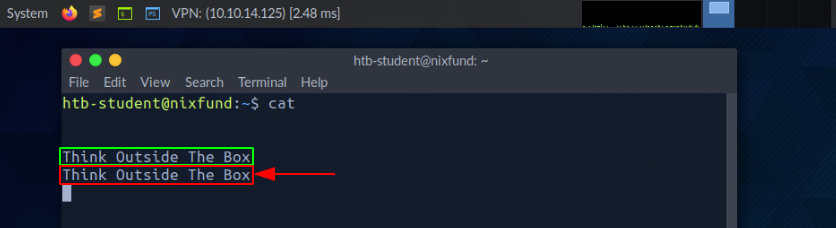

------

#### STDOUT y STDERR 

En el siguiente ejemplo, utilizando el `find` comando, veremos la salida estándar ( `STDOUT - FD 1`) marcado en `green` y error estándar ( `STDERR - FD 2`) marcado en rojo. 

​                                                                                                        Descriptores de archivos y redirecciones                       

```shell-session
nunhes@htb[/htb]$ find /etc/ -name shadow
```

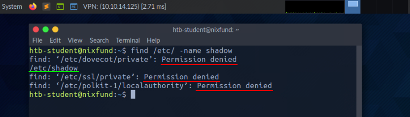

En este caso, el error se marca y se muestra con " `Permission denied`". Podemos verificar esto redirigiendo el descriptor de archivo para los errores ( `FD 2 - STDERR`) a " `/dev/null`." De esta manera, redirigimos los errores resultantes al "dispositivo nulo", que descarta todos los datos. 

​                                                                                                        Descriptores de archivos y redirecciones                       

```shell-session
nunhes@htb[/htb]$ find /etc/ -name shadow 2>/dev/null
```

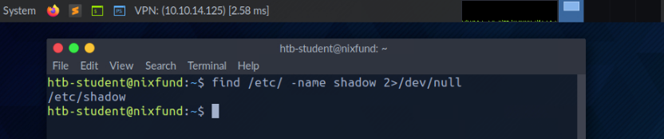

------

#### Redirigir STDOUT a un archivo 

Ahora podemos ver que todos los errores ( `STDERR`) presentado previamente con " `Permission denied`" ya no se muestran. El único resultado que vemos ahora es la salida estándar ( `STDOUT`), que también podemos redirigir a un archivo con el nombre `results.txt` que solo contendrá salida estándar sin los errores estándar. 

​                                                                                                        Descriptores de archivos y redirecciones                       

```shell-session
nunhes@htb[/htb]$ find /etc/ -name shadow 2>/dev/null > results.txt
```

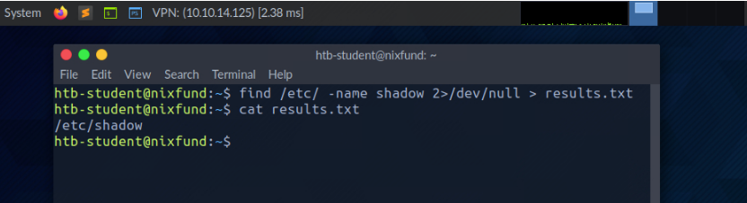

------

#### Redirigir STDOUT y STDERR a archivos separados 

Deberíamos haber notado que no usamos un número antes del signo mayor que ( `>`) en el último ejemplo. Esto se debe a que redirigimos todos los errores estándar al " `null device`"antes, y el único resultado que obtenemos es el resultado estándar ( `FD 1 - STDOUT`). Para hacer esto más preciso, redireccionaremos el error estándar ( `FD 2 - STDERR`) y salida estándar ( `FD 1 - STDOUT`) a diferentes archivos. 

​                                                                                                        Descriptores de archivos y redirecciones                       

```shell-session
nunhes@htb[/htb]$ find /etc/ -name shadow 2> stderr.txt 1> stdout.txt
```

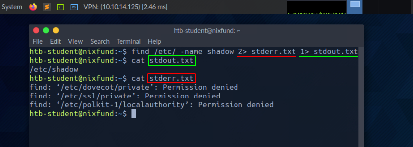

------

#### Redirigir STDIN 

Como ya hemos visto, en combinación con los descriptores de archivos, podemos redirigir errores y generar resultados con caracteres mayores  que ( `>`). Esto también funciona con el signo menor que ( `<`). Sin embargo, el signo menor que sirve como entrada estándar ( `FD 0 - STDIN`). Estos carácters pueden verse como "`direction`" en forma de flecha que nos dice" `from where`" and "`where to`" los datos deben ser redirigidos. Usamos el comando `cat`  para utilizar el contenido del archivo "`stdout.txt`" como `STDIN`. 


```shell-session
nunhes@htb[/htb]$ cat < stdout.txt
```

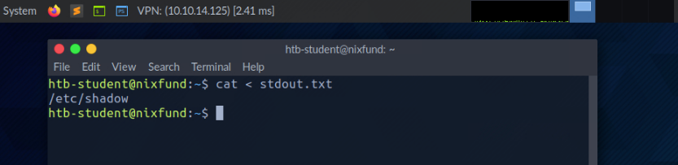

------

#### Redirigir STDOUT y agregar a un archivo 

Cuando usamos el signo mayor que ( `>`) para redirigir nuestro `STDOUT`, se crea automáticamente un nuevo archivo si aún no existe. Si este  archivo existe, se sobrescribirá sin pedir confirmación. Si queremos  agregar `STDOUT` a nuestro archivo existente, podemos usar el doble signo mayor que ( `>>`). 

​                                                                                                        Descriptores de archivos y redirecciones                       

```shell-session
nunhes@htb[/htb]$ find /etc/ -name passwd >> stdout.txt 2>/dev/null
```

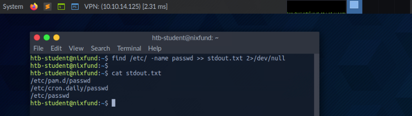

------

#### Redireccionar el flujo STDIN a un archivo

También podemos usar los caracteres dobles de menor que (`<<`) ara agregar nuestra entrada estándar a través de un flujo. Podemos usar la llamada función `End-Of-File` (`EOF`) de un archivo de sistema Linux, que define el final de la entrada. En el siguiente ejemplo, usaremos el comando `cat` para leer nuestra entrada de flujo a través del flujo y dirigirla a un archivo llamado "`stream.txt`".

```shell-session
nunhes@htb[/htb]$ cat << EOF > stream.txt
```

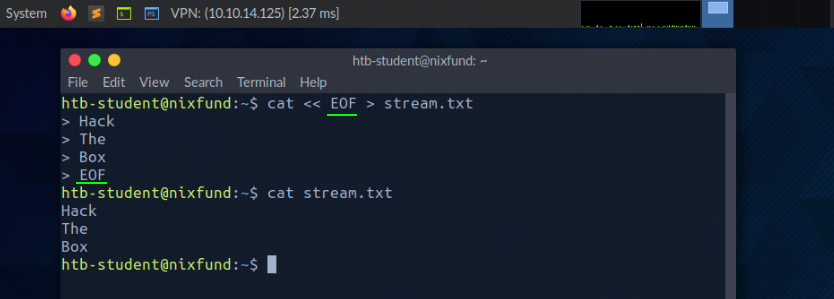

------

#### Tubería 

Otra forma de redirigir `STDOUT` es utilizar tuberías ( `|`). Son útiles cuando queremos utilizar el `STDOUT` de un programa para ser procesado por otro. Una de las herramientas más utilizadas es `grep`, que usaremos en el siguiente ejemplo. Grep se utiliza para filtrar `STDOUT` según el patrón que definimos. En el siguiente ejemplo, utilizamos el `find` comando para buscar todos los archivos en el " `/etc/`"directorio con un" `.conf`" extensión. Cualquier error se redirige a la " `null device`" ( `/dev/null`). Usando `grep`, filtramos los resultados y especificamos que solo las líneas que contienen el patrón " `systemd`" debe mostrarse. 

​                                                                                                        Descriptores de archivos y redirecciones                       

```shell-session
nunhes@htb[/htb]$ find /etc/ -name *.conf 2>/dev/null | grep systemd
```

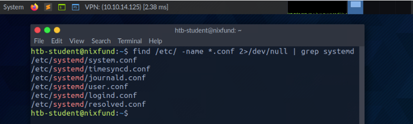

Las redirecciones funcionan, no sólo una vez. Podemos utilizar los  resultados obtenidos para redirigirlos a otro programa. Para el  siguiente ejemplo, usaremos la herramienta llamada `wc`, que debe contar el número total de resultados obtenidos. 

​                                                                                                        Descriptores de archivos y redirecciones                       

```shell-session
nunhes@htb[/htb]$ find /etc/ -name *.conf 2>/dev/null | grep systemd | wc -l
```

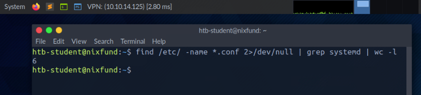


# Filtrar contenidos 

------

En la última sección, aprendimos sobre las redirecciones que podemos  usar para redirigir los resultados de un programa a otro para su  procesamiento. Para leer archivos, no necesariamente tenemos que  utilizar un editor para ello. Hay dos herramientas llamadas `more` y `less`, que son muy idénticos. Estos son fundamentales `pagers` que nos permiten desplazarnos por el archivo en una vista interactiva. Echemos un vistazo a algunos ejemplos. 

------

## Más 


```shell-session
nunhes@htb[/htb]$ more /etc/passwd
```

Después de leer el contenido usando `cat` y lo redirigió a `more`, el ya mencionado `pager` Se abre y automáticamente comenzaremos desde el principio del archivo. 


```shell-session
root:x:0:0:root:/root:/bin/bash
daemon:x:1:1:daemon:/usr/sbin:/usr/sbin/nologin
bin:x:2:2:bin:/bin:/usr/sbin/nologin
sys:x:3:3:sys:/dev:/usr/sbin/nologin
sync:x:4:65534:sync:/bin:/bin/sync
<SNIP>
--More--
```

Con el `[Q]` clave, podemos dejar esto `pager`. Notaremos que la salida permanece en la terminal. 

------

## Menos 

Si ahora echamos un vistazo a la herramienta. `less`, notaremos en la página de manual que contiene muchas más funciones que `more`. 


```shell-session
nunhes@htb[/htb]$ less /etc/passwd
```

La presentación es casi la misma que con `more`. 


```shell-session
root:x:0:0:root:/root:/bin/bash
daemon:x:1:1:daemon:/usr/sbin:/usr/sbin/nologin
bin:x:2:2:bin:/bin:/usr/sbin/nologin
sys:x:3:3:sys:/dev:/usr/sbin/nologin
sync:x:4:65534:sync:/bin:/bin/sync
<SNIP>
:
```

Al cerrar `less` con el `[Q]` clave, notaremos que la salida que hemos visto, a diferencia `more`, no permanece en el terminal. 

------

## Cabeza 

En ocasiones solo nos interesarán cuestiones concretas ya sea al principio del archivo o al final. Si sólo queremos obtener el `first` líneas del archivo, podemos usar la herramienta `head`. Por defecto, `head` imprime las primeras diez líneas del archivo o entrada dado, si no se especifica lo contrario. 


```shell-session
nunhes@htb[/htb]$ head /etc/passwd

root:x:0:0:root:/root:/bin/bash
daemon:x:1:1:daemon:/usr/sbin:/usr/sbin/nologin
bin:x:2:2:bin:/bin:/usr/sbin/nologin
sys:x:3:3:sys:/dev:/usr/sbin/nologin
sync:x:4:65534:sync:/bin:/bin/sync
games:x:5:60:games:/usr/games:/usr/sbin/nologin
man:x:6:12:man:/var/cache/man:/usr/sbin/nologin
lp:x:7:7:lp:/var/spool/lpd:/usr/sbin/nologin
mail:x:8:8:mail:/var/mail:/usr/sbin/nologin
news:x:9:9:news:/var/spool/news:/usr/sbin/nologin
```

------

## Cola 

Si solo queremos ver las últimas partes de un archivo o resultados, podemos usar la contraparte de `head` llamado `tail`, que devuelve el `last` diez líneas. 


```shell-session
nunhes@htb[/htb]$ tail /etc/passwd

miredo:x:115:65534::/var/run/miredo:/usr/sbin/nologin
usbmux:x:116:46:usbmux daemon,,,:/var/lib/usbmux:/usr/sbin/nologin
rtkit:x:117:119:RealtimeKit,,,:/proc:/usr/sbin/nologin
nm-openvpn:x:118:120:NetworkManager OpenVPN,,,:/var/lib/openvpn/chroot:/usr/sbin/nologin
nm-openconnect:x:119:121:NetworkManager OpenConnect plugin,,,:/var/lib/NetworkManager:/usr/sbin/nologin
pulse:x:120:122:PulseAudio daemon,,,:/var/run/pulse:/usr/sbin/nologin
beef-xss:x:121:124::/var/lib/beef-xss:/usr/sbin/nologin
lightdm:x:122:125:Light Display Manager:/var/lib/lightdm:/bin/false
do-agent:x:998:998::/home/do-agent:/bin/false
user6:x:1000:1000:,,,:/home/user6:/bin/bash
```

------

## Clasificar 

Dependiendo de los resultados y archivos que se traten, rara vez se  ordenan. A menudo es necesario ordenar los resultados deseados  alfabética o numéricamente para obtener una mejor visión general. Para  ello podemos utilizar una herramienta llamada `sort`. 


```shell-session
nunhes@htb[/htb]$ cat /etc/passwd | sort

_apt:x:104:65534::/nonexistent:/usr/sbin/nologin
backup:x:34:34:backup:/var/backups:/usr/sbin/nologin
bin:x:2:2:bin:/bin:/usr/sbin/nologin
cry0l1t3:x:1001:1001::/home/cry0l1t3:/bin/bash
daemon:x:1:1:daemon:/usr/sbin:/usr/sbin/nologin
dnsmasq:x:107:65534:dnsmasq,,,:/var/lib/misc:/usr/sbin/nologin
dovecot:x:114:117:Dovecot mail server,,,:/usr/lib/dovecot:/usr/sbin/nologin
dovenull:x:115:118:Dovecot login user,,,:/nonexistent:/usr/sbin/nologin
ftp:x:113:65534::/srv/ftp:/usr/sbin/nologin
games:x:5:60:games:/usr/games:/usr/sbin/nologin
gnats:x:41:41:Gnats Bug-Reporting System (admin):/var/lib/gnats:/usr/sbin/nologin
htb-student:x:1002:1002::/home/htb-student:/bin/bash
<SNIP>
```

Como podemos ver ahora, la salida ya no comienza con root sino que ahora está ordenada alfabéticamente. 

------

## grep 

Más a menudo, solo buscaremos resultados específicos que contengan  patrones que hayamos definido. Una de las herramientas más utilizadas  para esto es `grep`, que ofrece muchas características diferentes. En consecuencia, podemos buscar usuarios que tengan el shell predeterminado " `/bin/bash`"Pone como ejemplo. 


```shell-session
nunhes@htb[/htb]$ cat /etc/passwd | grep "/bin/bash"

root:x:0:0:root:/root:/bin/bash
mrb3n:x:1000:1000:mrb3n:/home/mrb3n:/bin/bash
cry0l1t3:x:1001:1001::/home/cry0l1t3:/bin/bash
htb-student:x:1002:1002::/home/htb-student:/bin/bash
```

Otra posibilidad es excluir resultados específicos. Para esto, la opción " `-v`"se usa con `grep`. En el siguiente ejemplo, excluimos a todos los usuarios que han desactivado el shell estándar con el nombre " `/bin/false`" o " `/usr/bin/nologin`". 


```shell-session
nunhes@htb[/htb]$ cat /etc/passwd | grep -v "false\|nologin"

root:x:0:0:root:/root:/bin/bash
sync:x:4:65534:sync:/bin:/bin/sync
postgres:x:111:117:PostgreSQL administrator,,,:/var/lib/postgresql:/bin/bash
user6:x:1000:1000:,,,:/home/user6:/bin/bash
```

------

## Cortar 

Los resultados específicos con diferentes caracteres pueden separarse como delimitadores. Aquí es útil saber cómo eliminar delimitadores  específicos y mostrar las palabras en una línea en una posición  específica. Una de las herramientas que se pueden utilizar para esto es `cut`. Por eso utilizamos la opción " `-d`" y establezca el delimitador en el carácter de dos puntos ( `:`) y definir con la opción " `-f`" la posición en la línea que queremos generar. 


```shell-session
nunhes@htb[/htb]$ cat /etc/passwd | grep -v "false\|nologin" | cut -d":" -f1

root
sync
mrb3n
cry0l1t3
htb-student
```

------

## tr 

Otra posibilidad de sustituir ciertos caracteres de una línea por caracteres definidos por nosotros es la herramienta `tr`. Como primera opción definimos qué carácter queremos reemplazar, y como  segunda opción definimos con qué carácter queremos reemplazarlo. En el  siguiente ejemplo, reemplazamos el carácter de dos puntos con un  espacio. 


```shell-session
nunhes@htb[/htb]$ cat /etc/passwd | grep -v "false\|nologin" | tr ":" " "

root x 0 0 root /root /bin/bash
sync x 4 65534 sync /bin /bin/sync
mrb3n x 1000 1000 mrb3n /home/mrb3n /bin/bash
cry0l1t3 x 1001 1001  /home/cry0l1t3 /bin/bash
htb-student x 1002 1002  /home/htb-student /bin/bash
```

------

## Columna 

Dado que los resultados de búsqueda a menudo pueden tener una representación poco clara, la herramienta `column` es muy adecuado para mostrar dichos resultados en forma tabular utilizando el botón " `-t`". 


```shell-session
nunhes@htb[/htb]$ cat /etc/passwd | grep -v "false\|nologin" | tr ":" " " | column -t

root         x  0     0      root               /root        /bin/bash
sync         x  4     65534  sync               /bin         /bin/sync
mrb3n        x  1000  1000   mrb3n              /home/mrb3n  /bin/bash
cry0l1t3     x  1001  1001   /home/cry0l1t3     /bin/bash
htb-student  x  1002  1002   /home/htb-student  /bin/bash
```

------

## awk 

Como habrámos notado, el usuario " `postgres`" tiene una fila de más. Para que sea lo más simple posible ordenar dichos resultados, el ( `g`) `awk` La programación es beneficiosa, ya que nos permite mostrar el primero ( `$1`) y último ( `$NF`) resultado de la línea. 


```shell-session
nunhes@htb[/htb]$ cat /etc/passwd | grep -v "false\|nologin" | tr ":" " " | awk '{print $1, $NF}'

root /bin/bash
sync /bin/sync
mrb3n /bin/bash
cry0l1t3 /bin/bash
htb-student /bin/bash
```

------

## sed 

Llegarán momentos en los que querremos cambiar nombres específicos en todo el archivo o en la entrada estándar. Una de las herramientas que  podemos utilizar para esto es el editor de transmisiones llamado `sed`. Uno de los usos más comunes de esto es la sustitución de texto. Aquí, `sed` busca patrones que hemos definido en forma de expresiones regulares  (regex) y los reemplaza con otro patrón que también hemos definido.  Sigamos con los últimos resultados y digamos que queremos reemplazar la  palabra " `bin`" con " `HTB`". 

El " `s`" La bandera al principio representa el comando  sustituto. Luego especificamos el patrón que queremos reemplazar.  Después de la barra diagonal ( `/`), ingresamos el patrón que queremos usar como reemplazo en la tercera posición. Finalmente utilizamos el " `g`" bandera, que significa reemplazar todos los partidos. 


```shell-session
nunhes@htb[/htb]$ cat /etc/passwd | grep -v "false\|nologin" | tr ":" " " | awk '{print $1, $NF}' | sed 's/bin/HTB/g'

root /HTB/bash
sync /HTB/sync
mrb3n /HTB/bash
cry0l1t3 /HTB/bash
htb-student /HTB/bash
```

------

## WC 

Por último, pero no menos importante, muchas veces será útil saber  cuántas coincidencias exitosas tenemos. Para evitar contar las líneas o  caracteres manualmente, podemos utilizar la herramienta `wc`. Con el " `-l`", especificamos que solo se cuentan las líneas. 


```shell-session
nunhes@htb[/htb]$ cat /etc/passwd | grep -v "false\|nologin" | tr ":" " " | awk '{print $1, $NF}' | wc -l

5
```

------

## Práctica 

Puede resultar un poco abrumador al principio lidiar con tantas  herramientas diferentes y sus funciones si no estamos familiarizados con ellas. Tómate tu tiempo y experimenta con las herramientas. Eche un  vistazo a las páginas de manual ( `man <tool>`) o llame a la ayuda para ello ( `<tool> -h` / `<tool> --help`). La mejor manera de familiarizarse con todas las herramientas es  practicando. Intenta utilizarlos con la mayor frecuencia posible y al  poco tiempo podremos filtrar muchas cosas de forma intuitiva. 

A continuación se muestran algunos ejercicios opcionales que podemos  utilizar para mejorar nuestras habilidades de filtrado y familiarizarnos más con la terminal y los comandos. El archivo con el que necesitaremos trabajar es el `/etc/passwd` archivo en nuestro `target` y podemos usar cualquier comando mostrado arriba. Nuestro objetivo es  filtrar y mostrar sólo contenidos específicos. Leer el archivo y filtrar su contenido de tal forma que solo veamos: 

|      |                                                              |
| ---- | ------------------------------------------------------------ |
| 1.   | Una línea con el nombre de usuario. `cry0l1t3`.              |
| 2.   | Los nombres de usuario.                                      |
| 3.   | El nombre de usuario `cry0l1t3` y su UID.                    |
| 4.   | El nombre de usuario `cry0l1t3` y su UID separados por una coma ( `,`). |
| 5.   | El nombre de usuario `cry0l1t3`, su UID y el shell configurado separados por una coma ( `,`). |
| 6.   | Todos los nombres de usuario con su UID y conjuntos de shells separados por una coma ( `,`). |
| 7.   | Todos los nombres de usuario con su UID y conjuntos de shells separados por una coma ( `,`) y excluir los que contienen `nologin` o `false`. |
| 8.   | Todos los nombres de usuario con su UID y conjuntos de shells separados por una coma ( `,`) y excluir los que contienen `nologin` y cuente todas las líneas de la salida filtrada. |


# Expresiones regulares 

------

Expresiones regulares ( `RegEx`) son un arte del lenguaje  de expresión para buscar patrones en texto y archivos. Se pueden  utilizar para buscar y reemplazar texto, analizar datos, validar  entradas, realizar búsquedas y más. En términos simples, son un criterio de filtro que se puede utilizar para analizar y manipular cadenas.  Están disponibles en varios lenguajes y programas de programación y se  utilizan de muchas formas y funciones diferentes. 

Una expresión regular es una secuencia de letras y símbolos que  forman un patrón de búsqueda. Además, se pueden crear expresiones  regulares con patrones llamados metacaracteres. Los metacaracteres son  símbolos que definen el patrón de búsqueda pero no tienen un significado literal. Podemos usarlo en herramientas como `grep` o `sed` u otros. A menudo, las expresiones regulares se implementan en aplicaciones web para validar la entrada del usuario. 

## Agrupamiento 

Entre otras cosas, regex nos ofrece la posibilidad de agrupar los  patrones de búsqueda deseados. Básicamente, las expresiones regulares  siguen tres conceptos diferentes, que se distinguen por tres corchetes  diferentes: 

### Operadores de agrupación 

|      | **Operadores** | **Descripción**                                              |
| ---- | -------------- | ------------------------------------------------------------ |
| 1    | `(a)`          | Los corchetes se utilizan para agrupar partes de una expresión  regular. Entre paréntesis puede definir otros patrones que deben  procesarse juntos. |
| 2    | `[a-z]`        | Los corchetes se utilizan para definir clases de caracteres. Dentro  de los corchetes, puede especificar una lista de caracteres para buscar. |
| 3    | `{1,10}`       | Las llaves se utilizan para definir cuantificadores. Dentro de los  corchetes, puede especificar un número o rango que indique con qué  frecuencia se debe repetir un patrón anterior. |
| 4    | `|`            | También se llama operador OR y muestra resultados cuando una de las dos expresiones coincide. |
| 5    | `.*`           | También se llama operador AND y muestra resultados solo si ambas expresiones coinciden. |

Supongamos que utilizamos el `OR` operador. La expresión  regular busca uno de los parámetros de búsqueda dados. En el siguiente  ejemplo, buscamos líneas que contengan la palabra `my` o `false`. Para utilizar estos operadores, debe aplicar la expresión regular extendida usando el `-E` opción en grep. 

#### Operador OR  

```shell-session
cry0l1t3@htb:~$ grep -E "(my|false)" /etc/passwd

lxd:x:105:65534::/var/lib/lxd/:/bin/false
pollinate:x:109:1::/var/cache/pollinate:/bin/false
mysql:x:116:120:MySQL Server,,:/nonexistent:/bin/false
```

Dado que uno de los dos parámetros de búsqueda siempre aparece en las tres líneas, las tres líneas se muestran correspondientemente. Sin  embargo, si utilizamos el `AND` operador, obtendremos un resultado diferente para los mismos parámetros de búsqueda. 

#### Operador AND

```shell-session
cry0l1t3@htb:~$ grep -E "(my.*false)" /etc/passwd

mysql:x:116:120:MySQL Server,,:/nonexistent:/bin/false
```

Básicamente lo que estamos diciendo con este comando es que buscamos una línea donde queremos ver ambos `my` y `false`. Un ejemplo simplificado también sería utilizar `grep` dos veces y se ve así:    

```shell-session
cry0l1t3@htb:~$ grep -E "my" /etc/passwd | grep -E "false"

mysql:x:116:120:MySQL Server,,:/nonexistent:/bin/false
```

------

Aquí hay algunas tareas opcionales para practicar expresiones  regulares que pueden ayudarnos a manejarlas mejor y más eficientemente.  Para todos los ejercicios, usaremos el `/etc/ssh/sshd_config` archivo en nuestro `Pwnbox` instancia. 

|      |                                                              |
| ---- | ------------------------------------------------------------ |
| 1    | Mostrar todas las líneas que no contienen el `#` carácter.   |
| 2    | Busque todas las líneas que contengan una palabra que comience con `Permit`. |
| 3    | Busque todas las líneas que contengan una palabra que termine con `Authentication`. |
| 4    | Busque todas las líneas que contengan la palabra `Key`.      |
| 5    | Busque todas las líneas que comiencen con `Password` y que contiene `yes`. |
| 6    | Busque todas las líneas que terminen en `yes`.               |


# Gestión de permisos 

------

En Linux, los permisos se asignan a usuarios y grupos. Cada usuario  puede ser miembro de diferentes grupos, y la membresía en estos grupos  le otorga al usuario permisos adicionales específicos. Cada archivo y  directorio pertenece a un usuario específico y a un grupo específico.  Por lo tanto, los permisos para los usuarios y grupos que definieron un  archivo también se definen para los respectivos propietarios. Cuando  creamos nuevos archivos o directorios, estos pertenecen al grupo al que  pertenecemos y a nosotros. 

Cuando un usuario desea acceder al contenido de un directorio de  Linux, primero debe recorrer el directorio, lo que significa navegar a  ese directorio, lo que requiere que el usuario tenga `execute` permisos en el directorio. Sin este permiso, el usuario no puede  acceder al contenido del directorio y en su lugar se le presentará un " `Permission Denied`"mensaje de error. 


```shell-session
cry0l1t3@htb[/htb]$ ls -l

drw-rw-r-- 3 cry0l1t3 cry0l1t3   4096 Jan 12 12:30 scripts


cry0l1t3@htb[/htb]$ ls -al mydirectory/

ls: cannot access 'mydirectory/script.sh': Permission denied
ls: cannot access 'mydirectory/..': Permission denied
ls: cannot access 'mydirectory/subdirectory': Permission denied
ls: cannot access 'mydirectory/.': Permission denied
total 0
d????????? ? ? ? ?            ? .
d????????? ? ? ? ?            ? ..
-????????? ? ? ? ?            ? script.sh
d????????? ? ? ? ?            ? subdirectory
```

Es importante señalar que los permisos `execute`  son necesarios para recorrer un directorio, sin importar el nivel de acceso del usuario. Además, los permisos `execute` en un directorio no permiten a un usuario ejecutar o  modificar ningún archivo o contenido dentro del directorio, solo  recorrer y acceder al contenido del directorio. 

Para ejecutar archivos dentro del directorio, un usuario necesita permisos `execute`  en el archivo correspondiente. Para modificar el contenido de  un directorio (crear, eliminar o cambiar el nombre de archivos y  subdirectorios), el usuario necesita permisos `write` en el directorio. 

Todo el sistema de permisos en los sistemas Linux se basa en el  sistema numérico octal y, básicamente, hay tres tipos diferentes de  permisos que se pueden asignar a un archivo o directorio: 

- ( `r`) - Leer 
- ( `w`) - Escribir 
- ( `x`) - Ejecutar 

Los permisos se pueden establecer para el `owner`, `group`, y `others` como se presenta en el siguiente ejemplo con sus permisos correspondientes. 

```shell-session
cry0l1t3@htb[/htb]$ ls -l /etc/passwd

- rwx rw- r--   1 root root 1641 May  4 23:42 /etc/passwd
- --- --- ---   |  |    |    |   |__________|
|  |   |   |    |  |    |    |        |_ Date
|  |   |   |    |  |    |    |__________ File Size
|  |   |   |    |  |    |_______________ Group
|  |   |   |    |  |____________________ User
|  |   |   |    |_______________________ Number of hard links
|  |   |   |_ Permission of others (read)
|  |   |_____ Permissions of the group (read, write)
|  |_________ Permissions of the owner (read, write, execute)
|____________ File type (- = File, d = Directory, l = Link, ... )
```

------

## Cambiar permisos 

Podemos modificar los permisos usando el `chmod` comando, referencias de grupos de permisos ( `u` - dueño, `g` - Grupo, `o` - otros, `a` - Todos los usuarios), y bien un [ `+`] o un [ `-`] para agregar y eliminar los permisos designados. En el siguiente ejemplo, supongamos que tenemos un archivo llamado `shell` y queremos cambiarle los permisos para que este script sea propiedad de ese usuario, no sea ejecutable y esté configurado con permisos de  lectura/escritura para todos los usuarios. 

```shell-session
cry0l1t3@htb[/htb]$ ls -l shell

-rwxr-x--x   1 cry0l1t3 htbteam 0 May  4 22:12 shell
```

Entonces podemos aplicar `read` permisos para todos los usuarios y ver el resultado. 

```shell-session
cry0l1t3@htb[/htb]$ chmod a+r shell && ls -l shell

-rwxr-xr-x   1 cry0l1t3 htbteam 0 May  4 22:12 shell
```

También podemos establecer los permisos para que todos los demás usuarios `read` utilizando únicamente la asignación de valor octal. 

```shell-session
cry0l1t3@htb[/htb]$ chmod 754 shell && ls -l shell

-rwxr-xr--   1 cry0l1t3 htbteam 0 May  4 22:12 shell
```

Veamos todas las representaciones asociadas con él para comprender mejor cómo se calcula la asignación de permisos. 

```shell-session
Binary Notation:                4 2 1  |  4 2 1  |  4 2 1
----------------------------------------------------------
Binary Representation:          1 1 1  |  1 0 1  |  1 0 0
----------------------------------------------------------
Octal Value:                      7    |    5    |    4
----------------------------------------------------------
Permission Representation:      r w x  |  r - x  |  r - -
```

Si sumamos los bits establecidos del `Binary Representation` asignado a los valores de `Binary Notation` juntos conseguimos el `Octal Value`. El `Permission Representation` representa los bits establecidos en el `Binary Representation` utilizando los tres caracteres, lo que sólo reconoce más fácilmente los permisos establecidos. 

------

## Cambiar propietario 

Para cambiar el propietario y/o las asignaciones de grupo de un archivo o directorio, podemos usar el `chown` dominio. La sintaxis es la siguiente: 

#### Sintaxis - chown 

```shell-session
cry0l1t3@htb[/htb]$ chown <user>:<group> <file/directory>
```

En este ejemplo, "shell" se puede reemplazar con cualquier archivo o carpeta arbitraria. 

```shell-session
cry0l1t3@htb[/htb]$ chown root:root shell && ls -l shell

-rwxr-xr--   1 root root 0 May  4 22:12 shell
```

------

## SUR y SGID 

Además de asignar permisos directos de usuario y grupo, también  podemos configurar permisos especiales para archivos configurando el `Set User ID` ( `SUID`) y `Set Group ID` ( `SGID`) bits. Estos `SUID`/ `SGID` Los bits permiten, por ejemplo, a los usuarios ejecutar programas con  los derechos de otro usuario. Los administradores suelen utilizar esto  para otorgar a sus usuarios derechos especiales para determinadas  aplicaciones o archivos. La letra " `s`"se utiliza en lugar de " `x`". Al ejecutar dicho programa, se utiliza el SUID/SGID del propietario del archivo. 

A menudo ocurre que los administradores no están familiarizados con  las aplicaciones pero aun así asignan los bits SUID/SGID, lo que genera  un alto riesgo de seguridad. Dichos programas pueden contener funciones  que permiten la ejecución de un shell desde el buscapersonas, como la  aplicación " `journalctl`". 

Si el administrador establece el bit SUID en " `journalctl`," cualquier usuario con acceso a esta aplicación podría ejecutar un shell como `root`. Puede encontrar más información sobre esta y otras aplicaciones similares en [ GTFObins ](https://gtfobins.github.io/gtfobins/journalctl/) . 

------

## Sticky Bit 

Los bits adhesivos - Sticky Bit- son un tipo de permiso de archivo en Linux que se  puede configurar en directorios. Este tipo de permiso proporciona una  capa adicional de seguridad al controlar la eliminación y el cambio de  nombre de archivos dentro de un directorio. Por lo general, se usa en  directorios compartidos por varios usuarios para evitar que un usuario  borre o cambie accidentalmente el nombre de archivos que son importantes para otros. 

Por ejemplo, en un directorio de inicio compartido, donde varios  usuarios tienen acceso al mismo directorio, un administrador del sistema puede configurar el bit adhesivo en el directorio para garantizar que  solo el propietario del archivo, el propietario del directorio o el  usuario raíz. Puede eliminar o cambiar el nombre de archivos dentro del  directorio. Esto significa que otros usuarios no pueden eliminar ni  cambiar el nombre de los archivos dentro del directorio porque no tienen los permisos necesarios. Esto proporciona una capa adicional de  seguridad para proteger archivos importantes, ya que sólo aquellos con  el acceso necesario pueden eliminar o cambiar el nombre de los archivos. Configurar el bit adhesivo en un directorio garantiza que solo el  propietario, el propietario del directorio o el usuario raíz puedan  cambiar los archivos dentro del directorio. 

Cuando se establece un bit adhesivo en un directorio, se representa con la letra " `t`" en el permiso de ejecución de los permisos del directorio. Por ejemplo, si un directorio tiene permisos " `rwxrwxrwt`", significa que el bit adhesivo está configurado, brindando un nivel  adicional de seguridad para que nadie más que el propietario o el  usuario raíz pueda eliminar o cambiar el nombre de los archivos o  carpetas en el directorio. 

```shell-session
cry0l1t3@htb[/htb]$ ls -l

drw-rw-r-t 3 cry0l1t3 cry0l1t3   4096 Jan 12 12:30 scripts
drw-rw-r-T 3 cry0l1t3 cry0l1t3   4096 Jan 12 12:32 reports
```

En este ejemplo, vemos que ambos directorios tienen configurado el bit adhesivo. Sin embargo, el `reports` la carpeta tiene mayúsculas `T`, y el `scripts` la carpeta tiene minúsculas `t`. 

Si el bit adhesivo está en mayúscula ( `T`), entonces esto significa que todos los demás usuarios no tienen `execute` ( `x`) permisos y, por lo tanto, no puede ver el contenido de la carpeta ni  ejecutar ningún programa desde ella. La parte adhesiva minúscula ( `t`) es la parte pegajosa donde `execute` ( `x`) se han establecido permisos. 

# Gestión de usuarios 

------

La gestión de usuarios es una parte esencial de la administración de  Linux. A veces necesitamos crear nuevos usuarios o agregar otros  usuarios a grupos específicos. Otra posibilidad es ejecutar comandos  como un usuario diferente. Después de todo, no es raro que los usuarios  de un solo grupo específico tengan permisos para ver o editar archivos o directorios específicos. Esto, a su vez, nos permite recopilar más  información localmente en la máquina, lo que puede ser muy importante.  Echemos un vistazo al siguiente ejemplo de cómo ejecutar código como un  usuario diferente. 

#### Ejecución como usuario 

```shell-session
nunhes@htb[/htb]$ cat /etc/shadow

cat: /etc/shadow: Permission denied
```

#### Ejecución como root 

```shell-session
nunhes@htb[/htb]$ sudo cat /etc/shadow

root:<SNIP>:18395:0:99999:7:::
daemon:*:17737:0:99999:7:::
bin:*:17737:0:99999:7:::
<SNIP>
```

Aquí tienes una lista que nos ayudará a comprender y abordar mejor la gestión de usuarios. 

| **Dominio** | **Descripción**                                              |
| ----------- | ------------------------------------------------------------ |
| `sudo`      | Ejecute el comando como un usuario diferente.                |
| `su`        | El `su` La utilidad solicita las credenciales de usuario  adecuadas a través de PAM y cambia a esa ID de usuario (el usuario  predeterminado es el superusuario). Luego se ejecuta un shell. |
| `useradd`   | Crea un nuevo usuario o actualiza la información predeterminada del nuevo usuario. |
| `userdel`   | Elimina una cuenta de usuario y archivos relacionados.       |
| `usermod`   | Modifica una cuenta de usuario.                              |
| `addgroup`  | Agrega un grupo al sistema.                                  |
| `delgroup`  | Elimina un grupo del sistema.                                |
| `passwd`    | Cambia la contraseña del usuario.                            |

La gestión de usuarios es esencial en cualquier sistema operativo y  la mejor manera de familiarizarse con ella es probar los comandos  individuales junto con sus diversas opciones. 

Estas opciones son fundamentales para la gestión de usuarios en sistemas Linux.

1. **¿Qué opción se debe configurar para crear un directorio de inicio para un nuevo usuario usando el comando `useradd`?**
   - Opción: `-m` o `--create-home`
   - **Explicación**: La opción `--create-home` crea automáticamente un directorio de inicio para el nuevo usuario si este no existe. El directorio de inicio se creará en la ubicación predeterminada o la que se especifique.

   ```bash
   sudo useradd --create-home nombre_usuario
   ```

2. **¿Qué opción se debe configurar para bloquear una cuenta de usuario usando el comando `usermod`? (versión larga de la opción)**
   - Opción: `--lock`
   - **Explicación**: La opción `--lock` bloquea la cuenta de usuario, deshabilitando el acceso a la misma. Esto se hace añadiendo un símbolo `!` al hash de la contraseña en el archivo `/etc/shadow`, impidiendo que el usuario inicie sesión.

   ```bash
   sudo usermod --lock nombre_usuario
   ```

3. **¿Qué opción se debe configurar para ejecutar un comando como un usuario diferente usando el comando `su`? (versión larga de la opción)**
   - Opción: `--command`
   - **Explicación**: La opción `--command` permite ejecutar un comando específico como un usuario diferente sin necesidad de cambiar completamente al entorno de ese usuario. Esto ejecuta el comando y luego regresa al entorno actual.

   ```bash
   sudo su nombre_usuario --command "comando_a_ejecutar"
   ```

# Gestión de paquetes 

------

Ya sea que trabajemos como administrador de sistemas, mantengamos  nuestras propias máquinas Linux en casa o  construyamos/actualicemos/mantengamos nuestra distribución de prueba de  penetración preferida, es crucial tener un conocimiento firme de los  administradores de paquetes Linux disponibles y las diversas formas de  utilizarlos para instalar, actualizar o eliminar paquetes. Los paquetes  son archivos que contienen binarios de software, archivos de  configuración, información sobre dependencias y realizan un seguimiento  de las actualizaciones y mejoras. Las características que ofrecen la  mayoría de los sistemas de gestión de paquetes son: 

- Descarga de paquetes 
- Resolución de dependencia 
- Un formato de paquete binario estándar 
- Ubicaciones comunes de instalación y configuración 
- Configuración y funcionalidad adicionales relacionadas con el sistema 
- Control de calidad 

Podemos utilizar muchos sistemas de gestión de paquetes diferentes  que cubren diferentes tipos de archivos como ".deb", ".rpm" y otros. El  requisito de gestión de paquetes es que el software que se va a instalar esté disponible como el paquete correspondiente. Normalmente, esto se  crea, ofrece y mantiene de forma centralizada en distribuciones de  Linux. De esta forma, el software se integra directamente en el sistema y sus distintos directorios se distribuyen por todo el sistema. El  software de administración de paquetes recupera los cambios necesarios  para la instalación del sistema desde el propio paquete y luego  implementa estos cambios para instalar el paquete exitosamente. Si el  software de administración de paquetes reconoce que se requieren  paquetes adicionales para el correcto funcionamiento del paquete que aún no se ha instalado, se incluye una dependencia y advierte al  administrador o intenta recargar el software que falta desde un  repositorio, por ejemplo, e instalar con antelación. 

Si se ha eliminado un software instalado, el sistema de  administración de paquetes retoma la información del paquete, la  modifica según su configuración y elimina los archivos. Existen  diferentes programas de gestión de paquetes que podemos utilizar para  ello. A continuación se muestra una lista de ejemplos de dichos  programas: 

| **Dominio** | **Descripción**                                              |
| ----------- | ------------------------------------------------------------ |
| `dpkg`      | El `dpkg` es una herramienta para instalar, compilar,  eliminar y administrar paquetes de Debian. La interfaz principal y más  fácil de usar para `dpkg` es aptitud. |
| `apt`       | Apt proporciona una interfaz de línea de comandos de alto nivel para el sistema de gestión de paquetes. |
| `aptitude`  | Aptitude es una alternativa a apt y es una interfaz de alto nivel para el administrador de paquetes. |
| `snap`      | Instale, configure, actualice y elimine paquetes instantáneos. Snaps permite la distribución segura de las últimas aplicaciones y utilidades para la nube, servidores, escritorios e Internet de las cosas. |
| `gem`       | Gem es la interfaz de RubyGems, el administrador de paquetes estándar para Ruby. |
| `pip`       | Pip es un instalador de paquetes de Python recomendado para instalar paquetes de Python que no están disponibles en el archivo de Debian.  Puede funcionar con repositorios de control de versiones (actualmente  solo repositorios Git, Mercurial y Bazaar), registra ampliamente la  salida y evita instalaciones parciales descargando todos los requisitos  antes de comenzar la instalación. |
| `git`       | Git es un sistema de control de revisiones distribuido, rápido y  escalable con un conjunto de comandos inusualmente rico que proporciona  operaciones de alto nivel y acceso completo a los componentes internos. |

Es muy recomendable configurar nuestra máquina virtual (VM)  localmente para experimentar con ella. Experimentemos un poco en nuestra VM local y ampliémosla con algunos paquetes adicionales. Primero,  instalemos `git` usando `apt`. 

------

#### Advanced Package Manager (APT)

Debian-based Linux distributions use the `APT` package manager. A package is an archive file containing multiple ".deb" files. The `dpkg` utility is used to install programs from the associated ".deb" file. `APT` makes updating and installing programs easier because many programs  have dependencies. When installing a program from a standalone ".deb"  file, we may run into dependency issues and need to download and install one or multiple additional packages. `APT` makes this easier and more efficient by packaging together all of the dependencies needed to install a program.

Cada distribución de Linux utiliza repositorios de software que se  actualizan con frecuencia. Cuando actualizamos un programa o instalamos  uno nuevo, el sistema consulta estos repositorios en busca del paquete  deseado. Los repositorios se pueden etiquetar como estables, de prueba o inestables. La mayoría de las distribuciones de Linux utilizan el  repositorio más estable o "principal". Esto se puede comprobar viendo el contenido del `/etc/apt/sources.list` archivo. La lista de repositorios para Parrot OS está en `/etc/apt/sources.list.d/parrot.list`. 


```shell-session
nunhes@htb[/htb]$ cat /etc/apt/sources.list.d/parrot.list

# parrot repository
# this file was automatically generated by parrot-mirror-selector
deb http://htb.deb.parrot.sh/parrot/ rolling main contrib non-free
#deb-src https://deb.parrot.sh/parrot/ rolling main contrib non-free
deb http://htb.deb.parrot.sh/parrot/ rolling-security main contrib non-free
#deb-src https://deb.parrot.sh/parrot/ rolling-security main contrib non-free
```

APT utiliza una base de datos llamada caché de APT. Esto se utiliza  para proporcionar información sobre los paquetes instalados en nuestro  sistema sin conexión. Podemos buscar en la caché de APT, por ejemplo,  para encontrar todos `Impacket` paquetes relacionados. 

```shell-session
nunhes@htb[/htb]$ apt-cache search impacket

impacket-scripts - Links to useful impacket scripts examples
polenum - Extracts the password policy from a Windows system
python-pcapy - Python interface to the libpcap packet capture library (Python 2)
python3-impacket - Python3 module to easily build and dissect network protocols
python3-pcapy - Python interface to the libpcap packet capture library (Python 3)
```

Luego podemos ver información adicional sobre un paquete. 

```shell-session
nunhes@htb[/htb]$ apt-cache show impacket-scripts

Package: impacket-scripts
Version: 1.4
Architecture: all
Maintainer: Kali Developers <devel@kali.org>
Installed-Size: 13
Depends: python3-impacket (>= 0.9.20), python3-ldap3 (>= 2.5.0), python3-ldapdomaindump
Breaks: python-impacket (<< 0.9.18)
Replaces: python-impacket (<< 0.9.18)
Priority: optional
Section: misc
Filename: pool/main/i/impacket-scripts/impacket-scripts_1.4_all.deb
Size: 2080
<SNIP>
```

También podemos enumerar todos los paquetes instalados. 

```shell-session
nunhes@htb[/htb]$ apt list --installed

Listing... Done
accountsservice/rolling,now 0.6.55-2 amd64 [installed,automatic]
adapta-gtk-theme/rolling,now 3.95.0.11-1 all [installed]
adduser/rolling,now 3.118 all [installed]
adwaita-icon-theme/rolling,now 3.36.1-2 all [installed,automatic]
aircrack-ng/rolling,now 1:1.6-4 amd64 [installed,automatic]
<SNIP>
```

Si nos faltan algunos paquetes, podemos buscarlos e instalarlos usando el siguiente comando. 

```shell-session
nunhes@htb[/htb]$ sudo apt install impacket-scripts -y

Reading package lists... Done
Building dependency tree       
Reading state information... Done
The following NEW packages will be installed:
  impacket-scripts
0 upgraded, 1 newly installed, 0 to remove and 0 not upgraded.
Need to get 2,080 B of archives.
After this operation, 13.3 kB of additional disk space will be used.
Get:1 https://euro2-emea-mirror.parrot.sh/mirrors/parrot rolling/main amd64 impacket-scripts all 1.4 [2,080 B]
Fetched 2,080 B in 0s (15.2 kB/s)
Selecting previously unselected package impacket-scripts.
(Reading database ... 378459 files and directories currently installed.)
Preparing to unpack .../impacket-scripts_1.4_all.deb ...
Unpacking impacket-scripts (1.4) ...
Setting up impacket-scripts (1.4) ...
Scanning application launchers
Removing duplicate launchers from Debian
Launchers are updated
```

------

## git 

Ahora que tenemos `git` instalado, podemos usarlo para  descargar herramientas útiles desde Github. Uno de esos proyectos se  llama 'Nishang'. Nos ocuparemos y trabajaremos con el proyecto en sí más adelante. Primero, debemos navegar hasta el [ repositorio del proyecto ](https://github.com/samratashok/nishang) y copiar el enlace de Github antes de usar git para descargarlo. 

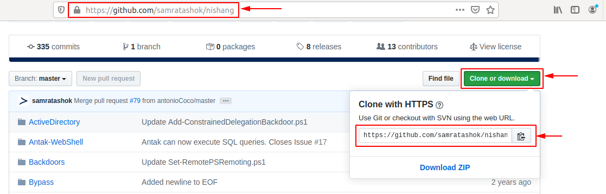

Sin embargo, antes de descargar el proyecto y sus scripts y listas, debemos crear una carpeta particular. 

```shell-session
nunhes@htb[/htb]$ mkdir ~/nishang/ && git clone https://github.com/samratashok/nishang.git ~/nishang

Cloning into '/opt/nishang/'...
remote: Enumerating objects: 15, done.
remote: Counting objects: 100% (15/15), done.
remote: Compressing objects: 100% (13/13), done.
remote: Total 1691 (delta 4), reused 6 (delta 2), pack-reused 1676
Receiving objects: 100% (1691/1691), 7.84 MiB | 4.86 MiB/s, done.
Resolving deltas: 100% (1055/1055), done.
```

------

## DPKG 

También podemos descargar los programas y herramientas de los  repositorios por separado. En este ejemplo, descargamos 'strace' para  Ubuntu 18.04 LTS. 

```shell-session
nunhes@htb[/htb]$ wget http://archive.ubuntu.com/ubuntu/pool/main/s/strace/strace_4.21-1ubuntu1_amd64.deb

--2020-05-15 03:27:17--  http://archive.ubuntu.com/ubuntu/pool/main/s/strace/strace_4.21-1ubuntu1_amd64.deb
Resolving archive.ubuntu.com (archive.ubuntu.com)... 91.189.88.142, 91.189.88.152, 2001:67c:1562::18, ...
Connecting to archive.ubuntu.com (archive.ubuntu.com)|91.189.88.142|:80... connected.
HTTP request sent, awaiting response... 200 OK
Length: 333388 (326K) [application/x-debian-package]
Saving to: ‘strace_4.21-1ubuntu1_amd64.deb’

strace_4.21-1ubuntu1_amd64.deb       100%[===================================================================>] 325,57K  --.-KB/s    in 0,1s    

2020-05-15 03:27:18 (2,69 MB/s) - ‘strace_4.21-1ubuntu1_amd64.deb’ saved [333388/333388]
```

Además, ahora podemos utilizar ambos. `apt` y `dpkg` para instalar el paquete. Como ya hemos trabajado con `apt`, recurriremos a `dpkg` en el siguiente ejemplo. 

```shell-session
nunhes@htb[/htb]$ sudo dpkg -i strace_4.21-1ubuntu1_amd64.deb 

(Reading database ... 154680 files and directories currently installed.)
Preparing to unpack strace_4.21-1ubuntu1_amd64.deb ...
Unpacking strace (4.21-1ubuntu1) over (4.21-1ubuntu1) ...
Setting up strace (4.21-1ubuntu1) ...
Processing triggers for man-db (2.8.3-2ubuntu0.1) ...
```

Con esto ya tenemos instalada la herramienta y podemos probar si funciona correctamente. 

```shell-session
nunhes@htb[/htb]$ strace -h

usage: strace [-CdffhiqrtttTvVwxxy] [-I n] [-e expr]...
              [-a column] [-o file] [-s strsize] [-P path]...
              -p pid... / [-D] [-E var=val]... [-u username] PROG [ARGS]
   or: strace -c[dfw] [-I n] [-e expr]... [-O overhead] [-S sortby]
              -p pid... / [-D] [-E var=val]... [-u username] PROG [ARGS]

Output format:
  -a column      alignment COLUMN for printing syscall results (default 40)
  -i             print instruction pointer at time of syscall
```

##### Ejercicio opcional: 

Busque la herramienta "  **evil-winrm**  " en Github e instálela en nuestras instancias interactivas. Pruebe todos los diferentes métodos de instalación. 


# Gestión de Servicios y Procesos 

------

En general, hay dos tipos de servicios: internos, los servicios  relevantes que se requieren al iniciar el sistema, que por ejemplo  realizan tareas relacionadas con el hardware, y servicios que instala el usuario, que generalmente incluyen todos los servicios del servidor.  Estos servicios se ejecutan en segundo plano sin interacción del  usuario. Estos también se llaman `daemons` y se identifican con la letra ' `d`' al final del nombre del programa, por ejemplo, `sshd` o `systemd`. 

La mayoría de las distribuciones de Linux ahora han cambiado a `systemd`. Este demonio es un `Init process` comenzó primero y por lo tanto tiene el ID de proceso (PID) 1. Este  demonio monitorea y se encarga del inicio y detención ordenados de otros servicios. Todos los procesos tienen un PID asignado que se puede ver  en `/proc/` con el número correspondiente. Un proceso de este tipo puede tener un ID de proceso principal (PPID) y, de ser así, se lo conoce como proceso secundario. 

Además `systemctl` también podemos usar `update-rc.d` para administrar los enlaces del script de inicio de SysV. Echemos un vistazo a algunos ejemplos. Usaremos el `OpenSSH` servidor en estos ejemplos. Si no lo tenemos instalado, instálelo antes de continuar con esta sección. 

------

## sistemactl 

Después de instalar `OpenSSH` En nuestra VM, podemos iniciar el servicio con el siguiente comando. 

```shell-session
nunhes@htb[/htb]$ systemctl start ssh
```

Una vez que hayamos iniciado el servicio, ahora podemos comprobar si se ejecuta sin errores. 

```shell-session
nunhes@htb[/htb]$ systemctl status ssh

● ssh.service - OpenBSD Secure Shell server
   Loaded: loaded (/lib/systemd/system/ssh.service; enabled; vendor preset: enabled)
   Active: active (running) since Thu 2020-05-14 15:08:23 CEST; 24h ago
   Main PID: 846 (sshd)
   Tasks: 1 (limit: 4681)
   CGroup: /system.slice/ssh.service
           └─846 /usr/sbin/sshd -D

Mai 14 15:08:22 inlane systemd[1]: Starting OpenBSD Secure Shell server...
Mai 14 15:08:23 inlane sshd[846]: Server listening on 0.0.0.0 port 22.
Mai 14 15:08:23 inlane sshd[846]: Server listening on :: port 22.
Mai 14 15:08:23 inlane systemd[1]: Started OpenBSD Secure Shell server.
Mai 14 15:08:30 inlane systemd[1]: Reloading OpenBSD Secure Shell server.
Mai 14 15:08:31 inlane sshd[846]: Received SIGHUP; restarting.
Mai 14 15:08:31 inlane sshd[846]: Server listening on 0.0.0.0 port 22.
Mai 14 15:08:31 inlane sshd[846]: Server listening on :: port 22.
```

Para agregar OpenSSH al script SysV para indicarle al sistema que  ejecute este servicio después del inicio, podemos vincularlo con el  siguiente comando: 

```shell-session
nunhes@htb[/htb]$ systemctl enable ssh

Synchronizing state of ssh.service with SysV service script with /lib/systemd/systemd-sysv-install.
Executing: /lib/systemd/systemd-sysv-install enable ssh
```

Una vez que reiniciemos el sistema, el servidor OpenSSH se ejecutará  automáticamente. Podemos comprobar esto con una herramienta llamada `ps`. 

```shell-session
nunhes@htb[/htb]$ ps -aux | grep ssh

root       846  0.0  0.1  72300  5660 ?        Ss   Mai14   0:00 /usr/sbin/sshd -D
```

También podemos usar `systemctl` para enumerar todos los servicios. 

```shell-session
nunhes@htb[/htb]$ systemctl list-units --type=service

UNIT                                                       LOAD   ACTIVE SUB     DESCRIPTION              
accounts-daemon.service                                    loaded active running Accounts Service         
acpid.service                                              loaded active running ACPI event daemon        
apache2.service                                            loaded active running The Apache HTTP Server   
apparmor.service                                           loaded active exited  AppArmor initialization  
apport.service                                             loaded active exited  LSB: automatic crash repor
avahi-daemon.service                                       loaded active running Avahi mDNS/DNS-SD Stack  
bolt.service                                               loaded active running Thunderbolt system service
```

Es muy posible que los servicios no se inicien debido a un error. Para ver el problema, podemos usar la herramienta. `journalctl` para ver los registros. 

```shell-session
nunhes@htb[/htb]$ journalctl -u ssh.service --no-pager

-- Logs begin at Wed 2020-05-13 17:30:52 CEST, end at Fri 2020-05-15 16:00:14 CEST. --
Mai 13 20:38:44 inlane systemd[1]: Starting OpenBSD Secure Shell server...
Mai 13 20:38:44 inlane sshd[2722]: Server listening on 0.0.0.0 port 22.
Mai 13 20:38:44 inlane sshd[2722]: Server listening on :: port 22.
Mai 13 20:38:44 inlane systemd[1]: Started OpenBSD Secure Shell server.
Mai 13 20:39:06 inlane sshd[3939]: Connection closed by 10.22.2.1 port 36444 [preauth]
Mai 13 20:39:27 inlane sshd[3942]: Accepted password for master from 10.22.2.1 port 36452 ssh2
Mai 13 20:39:27 inlane sshd[3942]: pam_unix(sshd:session): session opened for user master by (uid=0)
Mai 13 20:39:28 inlane sshd[3942]: pam_unix(sshd:session): session closed for user master
Mai 14 02:04:49 inlane sshd[2722]: Received signal 15; terminating.
Mai 14 02:04:49 inlane systemd[1]: Stopping OpenBSD Secure Shell server...
Mai 14 02:04:49 inlane systemd[1]: Stopped OpenBSD Secure Shell server.
-- Reboot --
```

------

## Matar un proceso 

Un proceso puede estar en los siguientes estados: 

- Correr 
- Esperando (esperando un evento o recurso del sistema) 
- Interrumpido 
- Zombie (detenido pero aún tiene una entrada en la tabla de procesos). 

Los procesos se pueden controlar mediante `kill`, `pkill`, `pgrep`, y `killall`. Para interactuar con un proceso, debemos enviarle una señal. Podemos ver todas las señales con el siguiente comando: 

```shell-session
nunhes@htb[/htb]$ kill -l

 1) SIGHUP       2) SIGINT       3) SIGQUIT      4) SIGILL       5) SIGTRAP
 6) SIGABRT      7) SIGBUS       8) SIGFPE       9) SIGKILL     10) SIGUSR1
11) SIGSEGV     12) SIGUSR2     13) SIGPIPE     14) SIGALRM     15) SIGTERM
16) SIGSTKFLT   17) SIGCHLD     18) SIGCONT     19) SIGSTOP     20) SIGTSTP
21) SIGTTIN     22) SIGTTOU     23) SIGURG      24) SIGXCPU     25) SIGXFSZ
26) SIGVTALRM   27) SIGPROF     28) SIGWINCH    29) SIGIO       30) SIGPWR
31) SIGSYS      34) SIGRTMIN    35) SIGRTMIN+1  36) SIGRTMIN+2  37) SIGRTMIN+3
38) SIGRTMIN+4  39) SIGRTMIN+5  40) SIGRTMIN+6  41) SIGRTMIN+7  42) SIGRTMIN+8
43) SIGRTMIN+9  44) SIGRTMIN+10 45) SIGRTMIN+11 46) SIGRTMIN+12 47) SIGRTMIN+13
48) SIGRTMIN+14 49) SIGRTMIN+15 50) SIGRTMAX-14 51) SIGRTMAX-13 52) SIGRTMAX-12
53) SIGRTMAX-11 54) SIGRTMAX-10 55) SIGRTMAX-9  56) SIGRTMAX-8  57) SIGRTMAX-7
58) SIGRTMAX-6  59) SIGRTMAX-5  60) SIGRTMAX-4  61) SIGRTMAX-3  62) SIGRTMAX-2
63) SIGRTMAX-1  64) SIGRTMAX
```

Los más utilizados son: 

| **Señal** | **Descripción**                                              |
| --------- | ------------------------------------------------------------ |
| `1`       | `SIGHUP` - Este se envía a un proceso cuando el terminal que lo controla está cerrado. |
| `2`       | `SIGINT` - Enviado cuando un usuario presiona `[Ctrl] + C` en el terminal de control para interrumpir un proceso. |
| `3`       | `SIGQUIT` - Enviado cuando un usuario presiona `[Ctrl] + D` para dejar de fumar. |
| `9`       | `SIGKILL` - Finalizar inmediatamente un proceso sin operaciones de limpieza. |
| `15`      | `SIGTERM` - Terminación del programa.                        |
| `19`      | `SIGSTOP` - Detener el programa. Ya no se puede manejar.     |
| `20`      | `SIGTSTP` - Enviado cuando un usuario presiona `[Ctrl] + Z` para solicitar la suspensión de un servicio. El usuario puede manejarlo después. |

Por ejemplo, si un programa se congelara, podríamos forzar su finalización con el siguiente comando: 

```shell-session
nunhes@htb[/htb]$ kill 9 <PID> 
```

------

## Antecedentes de un proceso 

En ocasiones será necesario poner en segundo plano el escaneo o  proceso que acabamos de iniciar para continuar usando la sesión actual  para interactuar con el sistema o iniciar otros procesos. Como ya hemos  visto, esto lo podemos hacer con el atajo `[Ctrl + Z]`. Como se mencionó anteriormente, enviamos el `SIGTSTP` señal al kernel, que suspende el proceso. 

```shell-session
nunhes@htb[/htb]$ ping -c 10 www.hackthebox.eu

nunhes@htb[/htb]$ vim tmpfile
[Ctrl + Z]
[2]+  Stopped                 vim tmpfile
```

Ahora todos los procesos en segundo plano se pueden mostrar con el siguiente comando. 

```shell-session
nunhes@htb[/htb]$ jobs

[1]+  Stopped                 ping -c 10 www.hackthebox.eu
[2]+  Stopped                 vim tmpfile
```

El `[Ctrl] + Z` El acceso directo suspende los procesos y  no se ejecutarán más. Para que siga ejecutándose en segundo plano,  debemos ingresar el comando `bg` para poner el proceso en segundo plano. 

```shell-session
nunhes@htb[/htb]$ bg

nunhes@htb[/htb]$ 
--- www.hackthebox.eu ping statistics ---
10 packets transmitted, 0 received, 100% packet loss, time 113482ms

[ENTER]
[1]+  Exit 1                  ping -c 10 www.hackthebox.eu
```

Otra opción es configurar automáticamente el proceso con un signo Y ( `&`) al final del comando. 

```shell-session
nunhes@htb[/htb]$ ping -c 10 www.hackthebox.eu &

[1] 10825
PING www.hackthebox.eu (172.67.1.1) 56(84) bytes of data.
```

Una vez finalice el proceso veremos los resultados. 

```shell-session
nunhes@htb[/htb]$ 

--- www.hackthebox.eu ping statistics ---
10 packets transmitted, 0 received, 100% packet loss, time 9210ms

[ENTER]
[1]+  Exit 1                  ping -c 10 www.hackthebox.eu
```

------

## Poner en primer plano un proceso 

Después de eso, podemos usar el `jobs` comando para  enumerar todos los procesos en segundo plano. Los procesos en segundo  plano no requieren la interacción del usuario y podemos usar la misma  sesión de shell sin esperar hasta que el proceso finalice primero. Una  vez que el escaneo o proceso finalice su trabajo, el terminal nos  notificará que el proceso ha finalizado. 

```shell-session
nunhes@htb[/htb]$ jobs

[1]+  Running                 ping -c 10 www.hackthebox.eu &
```

Si queremos poner el proceso en segundo plano en primer plano e interactuar con él nuevamente, podemos usar el `fg <ID>` dominio. 

```shell-session
nunhes@htb[/htb]$ fg 1
ping -c 10 www.hackthebox.eu

--- www.hackthebox.eu ping statistics ---
10 packets transmitted, 0 received, 100% packet loss, time 9206ms
```

------

## Ejecutar múltiples comandos 

Hay tres posibilidades para ejecutar varios comandos, uno tras otro. Estos están separados por: 

- Punto y coma -*semicolon*- ( `;`) 
- Doble carácter `ampersand`  ( `&&`) 
- Tuberías -*pipes*- ( `|`) 

La diferencia entre ellos radica en el tratamiento de los procesos  anteriores y depende de si el proceso anterior se completó con éxito o  con errores. El punto y coma ( `;`) es un separador de comandos y ejecuta los comandos ignorando los resultados y errores de los comandos anteriores. 

```shell-session
nunhes@htb[/htb]$ echo '1'; echo '2'; echo '3'

1
2
3
```

Por ejemplo, si ejecutamos el mismo comando pero lo reemplazamos en segundo lugar, el comando `ls` con un archivo que no existe, obtenemos un error y el tercer comando se ejecutará de todos modos. 

```shell-session
nunhes@htb[/htb]$ echo '1'; ls MISSING_FILE; echo '3'

1
ls: cannot access 'MISSING_FILE': No such file or directory
3
```

Sin embargo, se ve diferente si usamos los caracteres dobles AND ( `&&`) para ejecutar los comandos uno tras otro. Si hay un error en uno de los comandos, los siguientes no se ejecutarán más y se detendrá todo el  proceso. 

```shell-session
nunhes@htb[/htb]$ echo '1' && ls MISSING_FILE && echo '3'

1
ls: cannot access 'MISSING_FILE': No such file or directory
```

Tuberías ( `|`) dependen no sólo del funcionamiento  correcto y sin errores de los procesos anteriores sino también de los  resultados de los procesos anteriores. 


# Programación de tareas 

------

La programación de tareas es una característica de los sistemas Linux que permite a los usuarios programar y automatizar tareas. Permite a  los administradores y usuarios ejecutar tareas en un momento específico o dentro de frecuencias específicas sin tener que iniciarlas manualmente. Se puede utilizar en sistemas Linux como Ubuntu, Redhat Linux y Solaris para gestionar una variedad de tareas. Los ejemplos incluyen la  actualización automática de software, la ejecución de scripts, la  limpieza de bases de datos y la automatización de copias de seguridad.  Esto también permite a los usuarios programar tareas regulares y  repetitivas para garantizar que se ejecuten con regularidad. Además, se  pueden configurar alertas para mostrar cuando ocurren ciertos eventos o  para contactar a administradores o usuarios. Hay muchos casos de uso  diferentes para la automatización de este tipo, pero cubren la mayoría  de los casos. 

------

## sistemad 

Systemd es un servicio utilizado en sistemas Linux como Ubuntu,  Redhat Linux y Solaris para iniciar procesos y scripts en un momento  específico. Con él, podemos configurar procesos y scripts para que se  ejecuten en un momento o intervalo de tiempo específico y también  podemos especificar eventos y desencadenantes específicos que  desencadenarán una tarea específica. Para hacer esto, debemos tomar  algunos pasos y precauciones antes de que el sistema ejecute  automáticamente nuestros scripts o procesos. 

1. Crear un temporizador 
2. Crear un servicio 
3. Activar el temporizador 

#### Crear un temporizador - timer

Para crear un temporizador para systemd, necesitamos crear un directorio donde se almacenará el script del temporizador. 

```shell-session
nunhes@htb[/htb]$ sudo mkdir /etc/systemd/system/mytimer.timer.d
nunhes@htb[/htb]$ sudo vim /etc/systemd/system/mytimer.timer
```

A continuación, necesitamos crear un script que configure el  temporizador. El script debe contener las siguientes opciones: "Unidad", "Temporizador" e "Instalar". La opción "Unidad" especifica una  descripción para el temporizador. La opción "Temporizador" especifica  cuándo iniciar el temporizador y cuándo activarlo. Finalmente, la opción "Instalar" especifica dónde instalar el temporizador. 

#### Mytimer.timer 

```txt
[Unit]
Description=My Timer

[Timer]
OnBootSec=3min
OnUnitActiveSec=1hour

[Install]
WantedBy=timers.target
```

Aquí depende de cómo queramos usar nuestro script. Por ejemplo, si  queremos ejecutar nuestro script solo una vez después del inicio del  sistema, debemos usar `OnBootSec` estableciendo `Timer`. Sin embargo, si queremos que nuestro script se ejecute regularmente, entonces deberíamos usar el `OnUnitActiveSec` para que el sistema ejecute el script a intervalos regulares. A continuación, necesitamos crear nuestro `service`. 

#### Crear un servicio  

```shell-session
nunhes@htb[/htb]$ sudo vim /etc/systemd/system/mytimer.service
```

Aquí configuramos una descripción y especificamos la ruta completa al script que queremos ejecutar. El "multi-user.target" es el sistema de  la unidad que se activa al iniciar un modo multiusuario normal. Define  los servicios que deben iniciarse en un inicio normal del sistema. 

```txt
[Unit]
Description=My Service

[Service]
ExecStart=/full/path/to/my/script.sh

[Install]
WantedBy=multi-user.target
```

Después de eso, tenemos que dejar `systemd` lea las carpetas nuevamente para incluir los cambios. 

#### Recargar sistema  

```shell-session
nunhes@htb[/htb]$ sudo systemctl daemon-reload
```

Después de eso, podemos usar `systemctl` a `start` el servicio manualmente y `enable` el inicio automático. 

#### Iniciar el temporizador y el servicio  

```shell-session
nunhes@htb[/htb]$ sudo systemctl start mytimer.service
nunhes@htb[/htb]$ sudo systemctl enable mytimer.service
```

------

## cron 

Cron es otra herramienta que se puede utilizar en sistemas Linux para programar y automatizar procesos. Permite a los usuarios y  administradores ejecutar tareas en un momento específico o dentro de  intervalos específicos. Para los ejemplos anteriores, también podemos  usar Cron para automatizar las mismas tareas. Solo necesitamos crear un  script y luego decirle al demonio cron que lo llame en un momento  específico. 

Con Cron, podemos automatizar las mismas tareas, pero el proceso para configurar el demonio Cron es un poco diferente al de Systemd. Para  configurar el demonio cron, necesitamos almacenar las tareas en un  archivo llamado `crontab` y luego decirle al demonio cuándo  ejecutar las tareas. Luego podemos programar y automatizar las tareas  configurando el demonio cron en consecuencia. La estructura de Cron  consta de los siguientes componentes: 

| **Periodo de tiempo**   | **Descripción**                                              |
| ----------------------- | ------------------------------------------------------------ |
| Minutos (0-59)          | Esto especifica en qué minuto se debe ejecutar la tarea.     |
| Horas (0-23)            | Esto especifica en qué hora se debe ejecutar la tarea.       |
| Días del mes (1-31)     | Esto especifica en qué día del mes se debe ejecutar la tarea. |
| Meses (1-12)            | Esto especifica en qué mes se debe ejecutar la tarea.        |
| Días de la semana (0-7) | Esto especifica en qué día de la semana se debe ejecutar la tarea. |

Por ejemplo, un crontab de este tipo podría verse así: 

```txt
# System Update
* */6 * * /path/to/update_software.sh

# Execute scripts
0 0 1 * * /path/to/scripts/run_scripts.sh

# Cleanup DB
0 0 * * 0 /path/to/scripts/clean_database.sh

# Backups
0 0 * * 7 /path/to/scripts/backup.sh
```

"System Update (Actualización del sistema)" debe ejecutarse cada seis horas. Esto está indicado por la entrada. `*/6` en la columna de horas. La tarea es ejecutada por el script. `update_software.sh`, cuya ruta se da en la última columna. 

La tarea `execute scripts` se ejecutará cada primer día del mes a medianoche. Esto está indicado por las entradas. `0` y `0` en las columnas de minutos y horas y `1` en la columna de días del mes. La tarea es ejecutada por el `run_scripts.sh` script, cuya ruta se proporciona en la última columna. 

La tercera tarea, `Cleanup DB`, se ejecutará todos los domingos a medianoche. Esto se especifica en las entradas. `0` y `0` en las columnas de minutos y horas y `0` en la columna de días de la semana. La tarea es ejecutada por el `clean_database.sh` script, cuya ruta se proporciona en la última columna. 

La cuarta tarea, `backups`, se ejecutará todos los domingos a medianoche. Esto está indicado por las entradas. `0` y `0` en las columnas de minutos y horas y `7` en la columna de días de la semana. La tarea es ejecutada por el `backup.sh` script, cuya ruta se proporciona en la última columna. 

También es posible recibir notificaciones cuando una tarea se ejecuta con éxito o sin éxito. Además, podemos crear registros para monitorear  la ejecución de las tareas. 

------

## Systemd vs. Cron 

Systemd y Cron son herramientas que se pueden utilizar en sistemas  Linux para programar y automatizar procesos. La diferencia clave entre  estas dos herramientas es cómo están configuradas. Con Systemd, necesita crear un temporizador y un script de servicios que le indique al  sistema operativo cuándo ejecutar las tareas. Por otro lado, con Cron,  necesitas crear un `crontab` archivo que le dice al demonio cron cuándo ejecutar las tareas. 

---

**NOTA:** El **`dconf.service`** en Linux es un servicio de tipo **DBus**. Este servicio es utilizado por el sistema de configuración **dconf**, que almacena configuraciones para entornos de escritorio como **GNOME** y otros.

El servicio corre en segundo plano, escuchando y aplicando cambios de configuración solicitados por aplicaciones o componentes del sistema, utilizando el sistema de mensajería D-Bus (Desktop Bus).

Para verificar el tipo de este servicio, puedes usar el siguiente comando:

```bash
systemctl show dconf.service --property=Type
```

Esto generalmente devolverá `dbus`, lo que indica que el servicio opera sobre el sistema D-Bus.

---

# Servicios de red 

------

Cuando trabajamos con Linux, también tenemos que lidiar con  diferentes servicios de red. La competencia para trabajar con estos  servicios de red es esencial por muchas razones. Entre otras cosas,  necesitamos este conocimiento y capacidad para comunicarnos con otras  computadoras a través de la red, conectarnos, transferir archivos,  analizar el tráfico de la red y aprender a configurar dichos servicios  para identificar vulnerabilidades potenciales en nuestras pruebas de  penetración posteriores. Este conocimiento también impulsa nuestra  comprensión de la seguridad de la red a medida que aprendemos qué  opciones implica cada servicio y su configuración. 

Imaginemos que estamos realizando una prueba de penetración y nos  encontramos con un host Linux en el que estamos investigando  vulnerabilidades. Al escuchar la red, podemos ver que un usuario de este host Linux se conecta a otro servidor a través de un servidor FTP no  cifrado. En consecuencia, podemos detectar las credenciales del usuario  en texto claro. Por supuesto, la probabilidad de que ocurra este  escenario sería mucho menor si el usuario supiera que FTP no cifra las  conexiones ni los datos enviados. Y como administrador de Linux, esto  podría ser un error fatal, ya que nos dice mucho no sólo sobre las  medidas de seguridad en la red sino también sobre los administradores  responsables de la seguridad de su red. 

No podremos cubrir todos los servicios de la red, pero nos  centraremos y cubriremos los más importantes. Porque no sólo desde la  perspectiva de administrador y usuario, es de gran beneficio sino  también como probador de penetración para la interacción entre otros  hosts y nuestra máquina. 

------

## SSH 

Shell seguro ( `SSH`) es un protocolo de red que permite  la transmisión segura de datos y comandos a través de una red. Se usa  ampliamente para administrar de forma segura sistemas remotos y acceder  de forma segura a sistemas remotos para ejecutar comandos o transferir  archivos. Para conectarse a nuestro host Linux o a uno remoto a través  de SSH, un servidor SSH correspondiente debe estar disponible y en  ejecución. 

El servidor SSH más utilizado es el servidor OpenSSH. OpenSSH es una  implementación gratuita y de código abierto del protocolo Secure Shell  (SSH) que permite la transmisión segura de datos y comandos a través de  una red. 

Los administradores utilizan OpenSSH para administrar de forma segura sistemas remotos estableciendo una conexión cifrada a un host remoto.  Con OpenSSH, los administradores pueden ejecutar comandos en sistemas  remotos, transferir archivos de forma segura y establecer una conexión  remota segura sin que terceros intercepten la transmisión de datos y  comandos. 

#### Instalar OpenSSH 

```shell-session
nunhes@htb[/htb]$ sudo apt install openssh-server -y
```

Para comprobar si el servidor se está ejecutando, podemos usar el siguiente comando: 

#### Estado del servidor 

```shell-session
nunhes@htb[/htb]$ systemctl status ssh

● ssh.service - OpenBSD Secure Shell server
     Loaded: loaded (/lib/system/system/ssh.service; enabled; vendor preset: enabled)
     Active: active (running) since Sun 2023-02-12 21:15:27 GMT; 1min 22s ago
       Docs: man:sshd(8)
             man:sshd_config(5)
   Main PID: 7740 (sshd)
      Tasks: 1 (limit: 9458)
     Memory: 2.5M
        CPU: 236ms
     CGroup: /system.slice/ssh.service
             └─7740 sshd: /usr/sbin/sshd -D [listener] 0 of 10-100 startups
```

Como probadores de penetración, utilizamos OpenSSH para acceder de  forma segura a sistemas remotos cuando realizamos una auditoría de red.  Para hacer esto, podemos usar el siguiente comando: 

#### SSH - Iniciar sesión 

```shell-session
nunhes@htb[/htb]$ ssh cry0l1t3@10.129.17.122

The authenticity of host '10.129.17.122 (10.129.17.122)' can't be established.
ECDSA key fingerprint is SHA256:bKzhv+n2pYqr2r...Egf8LfqaHNxk.

Are you sure you want to continue connecting (yes/no/[fingerprint])? yes

Warning: Permanently added '10.129.17.122' (ECDSA) to the list of known hosts.

cry0l1t3@10.129.17.122's password: ***********
```

OpenSSH se puede configurar y personalizar editando el archivo `/etc/ssh/sshd_config` con un editor de texto. Aquí podemos ajustar configuraciones como el  número máximo de conexiones simultáneas, el uso de contraseñas o claves  para inicios de sesión, verificación de claves de host y más. Sin  embargo, es importante que tengamos en cuenta que los cambios en el  archivo de configuración de OpenSSH deben realizarse con cuidado. 

Por ejemplo, podemos usar SSH para iniciar sesión de forma segura en  un sistema remoto y ejecutar comandos o usar tunelización y reenvío de  puertos para tunelizar datos a través de una conexión cifrada para  verificar la configuración de red y otras configuraciones del sistema  sin la posibilidad de que terceros intercepten la transmisión de datos. y comandos. 

------

## NFS 

Sistema de archivos de red ( `NFS`) es un protocolo de red que nos permite almacenar y administrar archivos en sistemas remotos  como si estuvieran almacenados en el sistema local. Permite una gestión  fácil y eficiente de archivos a través de redes. Por ejemplo, los  administradores utilizan NFS para almacenar y administrar archivos de  forma centralizada (para sistemas Linux y Windows) para permitir una  fácil colaboración y administración de datos. Para Linux, existen varios servidores NFS, incluido NFS-UTILS ( `Ubuntu`), NFS-Ganesha ( `Solaris`) y OpenNFS ( `Redhat Linux`). 

También se puede utilizar para compartir y administrar recursos de  manera eficiente, por ejemplo, para replicar sistemas de archivos entre  servidores. También ofrece funciones como controles de acceso,  transferencia de archivos en tiempo real y soporte para que varios  usuarios accedan a los datos simultáneamente. Podemos usar este servicio como FTP en caso de que no haya un cliente FTP instalado en el sistema  de destino o que se esté ejecutando NFS en lugar de FTP. 

Podemos instalar NFS en Linux con el siguiente comando: 

#### Instalar NFS 

```shell-session
nunhes@htb[/htb]$ sudo apt install nfs-kernel-server -y
```

Para comprobar si el servidor se está ejecutando, podemos usar el siguiente comando: 

#### Estado del servidor 

```shell-session
nunhes@htb[/htb]$ systemctl status nfs-kernel-server

● nfs-server.service - NFS server and services
     Loaded: loaded (/lib/system/system/nfs-server.service; enabled; vendor preset: enabled)
     Active: active (exited) since Sun 2023-02-12 21:35:17 GMT; 13s ago
    Process: 9234 ExecStartPre=/usr/sbin/exportfs -r (code=exited, status=0/SUCCESS)
    Process: 9235 ExecStart=/usr/sbin/rpc.nfsd $RPCNFSDARGS (code=exited, status=0/SUCCESS)
   Main PID: 9235 (code=exited, status=0/SUCCESS)
        CPU: 10ms
```

Podemos configurar NFS a través del archivo de configuración. `/etc/exports`. Este archivo especifica qué directorios deben compartirse y los  derechos de acceso para usuarios y sistemas. También es posible  configurar ajustes como la velocidad de transferencia y el uso de  cifrado. Los derechos de acceso de NFS determinan qué usuarios y  sistemas pueden acceder a los directorios compartidos y qué acciones  pueden realizar. A continuación se muestran algunos derechos de acceso  importantes que se pueden configurar en NFS: 

| **Permisos**     | **Descripción**                                              |
| ---------------- | ------------------------------------------------------------ |
| `rw`             | Otorga a los usuarios y sistemas permisos de lectura y escritura en el directorio compartido. |
| `ro`             | Proporciona a los usuarios y sistemas acceso de solo lectura al directorio compartido. |
| `no_root_squash` | Evita que el usuario raíz del cliente se limite a los derechos de un usuario normal. |
| `root_squash`    | Restringe los derechos del usuario root en el cliente a los derechos de un usuario normal. |
| `sync`           | Sincroniza la transferencia de datos para garantizar que los cambios solo se transfieran después de que se hayan guardado en el sistema de  archivos. |
| `async`          | Transfiere datos de forma asincrónica, lo que hace que la  transferencia sea más rápida, pero puede causar inconsistencias en el  sistema de archivos si los cambios no se han confirmado por completo. |

Por ejemplo, podemos crear una nueva carpeta y compartirla temporalmente en NFS. Esto lo haríamos de la siguiente manera: 

#### Crear recurso compartido NFS 

```shell-session
cry0l1t3@htb:~$ mkdir nfs_sharing
cry0l1t3@htb:~$ echo '/home/cry0l1t3/nfs_sharing hostname(rw,sync,no_root_squash)' >> /etc/exports
cry0l1t3@htb:~$ cat /etc/exports | grep -v "#"

/home/cry0l1t3/nfs_sharing hostname(rw,sync,no_root_squash)
```

Si hemos creado un recurso compartido NFS y queremos trabajar con él  en el sistema de destino, primero debemos montarlo. Podemos hacer esto  con el siguiente comando: 

#### Montar recurso compartido NFS 

```shell-session
cry0l1t3@htb:~$ mkdir ~/target_nfs
cry0l1t3@htb:~$ mount 10.129.12.17:/home/john/dev_scripts ~/target_nfs
cry0l1t3@htb:~$ tree ~/target_nfs

target_nfs/
├── css.css
├── html.html
├── javascript.js
├── php.php
└── xml.xml

0 directories, 5 files
```

Entonces hemos montado el recurso compartido NFS ( `dev_scripts`) de nuestro objetivo ( `10.129.12.17`) localmente a nuestro sistema en el punto de montaje `target_nfs` a través de la red y podemos ver los contenidos como si estuviéramos en el sistema de destino. Incluso existen algunos métodos que se pueden  utilizar en casos específicos para escalar nuestros privilegios en el  sistema remoto mediante NFS. 

------

## Servidor web 

Como evaluadores de penetración, debemos comprender cómo funcionan  los servidores web porque son una parte crítica de las aplicaciones web  y, a menudo, nos sirven como objetivos para atacar. Un servidor web es  un tipo de software que proporciona datos y documentos u otras  aplicaciones y funciones a través de Internet. Utilizan el Protocolo de  transferencia de hipertexto (HTTP) para enviar datos a clientes, como  navegadores web, y recibir solicitudes de esos clientes. Luego, estos se representan en forma de lenguaje de marcado de hipertexto (HTML) en el  navegador del cliente. Este tipo de comunicación permite al cliente  crear páginas web dinámicas que responden a las solicitudes del cliente. Por lo tanto, es importante que comprendamos las diversas funciones del servidor web para poder crear aplicaciones web seguras y eficientes y  también garantizar la seguridad del sistema. Algunos de los servidores  web más populares para servidores Linux son Apache, Nginx, Lighttpd y  Caddy. Apache es uno de los servidores web más populares y utilizados y  está disponible en una variedad de sistemas operativos, incluidos  Ubuntu, Solaris y Redhat Linux. 

Como probadores de penetración, podemos utilizar servidores web para  diversos fines. Por ejemplo, podemos usar un servidor web para realizar  transferencias de archivos, lo que nos permite iniciar sesión e  interactuar con un sistema de destino a través de un puerto HTTP o HTTPS entrante. Finalmente, podemos utilizar un servidor web para realizar  ataques de phishing alojando una copia de la página de destino en  nuestro propio servidor y luego intentando robar las credenciales del  usuario. Además, existe una variedad de otras posibilidades. 

El servidor web Apache tiene una variedad de características que nos  permiten alojar una aplicación web segura y eficiente. Además, también  podemos configurar el registro para obtener información sobre el tráfico en nuestro servidor, lo que nos ayuda a analizar los ataques. Podemos  instalar Apache usando el siguiente comando: 

#### Instalar el servidor web Apache 

```shell-session
nunhes@htb[/htb]$ sudo apt install apache2 -y
```

Para Apache2, para especificar a qué carpetas se puede acceder, podemos editar el archivo `/etc/apache2/apache2.conf` con un editor de texto. Este archivo contiene la configuración global.  Podemos cambiar la configuración para especificar a qué directorios se  puede acceder y qué acciones se pueden realizar en esos directorios. 

#### Configuración de Apache 

```txt
<Directory /var/www/html>
        Options Indexes FollowSymLinks
        AllowOverride All
        Require all granted
</directory>
```

Esta sección especifica que el valor predeterminado `/var/www/html` carpeta es accesible, que los usuarios pueden utilizar la `Indexes` y `FollowSymLinks` opciones, que los cambios en los archivos de este directorio se pueden anular con `AllowOverride All`, y eso `Require all granted` otorga a todos los usuarios acceso a este directorio. Por ejemplo, si  queremos transferir archivos a uno de nuestros sistemas de destino  utilizando un servidor web, podemos colocar los archivos apropiados en  el `/var/www/html` carpeta y uso `wget` o `curl` u otras aplicaciones para descargar estos archivos en el sistema de destino. 

También es posible personalizar configuraciones individuales a nivel de directorio usando el `.htaccess` archivo, que podremos crear en el directorio en cuestión. Este archivo  nos permite configurar ciertos ajustes a nivel de directorio, como  controles de acceso, sin tener que personalizar el archivo de  configuración de Apache. También podemos agregar módulos para obtener  funciones como `mod_rewrite`, `mod_security`, y `mod_ssl` que nos ayudan a mejorar la seguridad de nuestra aplicación web. 

Python Web Server es una alternativa simple y rápida a Apache y puede usarse para alojar una sola carpeta con un solo comando para transferir archivos a otro sistema. Para instalar Python Web Server, necesitamos  instalar Python3 en nuestro sistema y luego ejecutar el siguiente  comando: 

#### Instalar Python y servidor web 

```shell-session
nunhes@htb[/htb]$ sudo apt install python3 -y
nunhes@htb[/htb]$ python3 -m http.server
```

Cuando ejecutamos este comando, nuestro servidor web Python se iniciará en el `TCP/8000` port, y podremos acceder a la carpeta en la que nos encontramos  actualmente. También podemos alojar otra carpeta con el siguiente  comando: 

```shell-session
nunhes@htb[/htb]$ python3 -m http.server --directory /home/cry0l1t3/target_files
```

Esto iniciará un servidor web Python en el `TCP/8000` puerto, y podremos acceder al `/home/cry0l1t3/target_files` carpeta desde el navegador, por ejemplo. Cuando accedemos a nuestro  servidor web Python, podemos transferir archivos al otro sistema  escribiendo el enlace en nuestro navegador y descargando los archivos.  También podemos alojar nuestro servidor web Python en un puerto distinto al puerto predeterminado usando el `-p` opción: 

```shell-session
nunhes@htb[/htb]$ python3 -m http.server 443
```

Esto alojará nuestro servidor web Python en el puerto 443 en lugar del puerto predeterminado  `TCP/8000` . Podemos acceder a este servidor web tecleando el enlace en nuestro navegador. 

------

## vpn 

Red privada virtual ( `VPN`) es una tecnología que nos  permite conectarnos de forma segura a otra red como si estuviéramos  directamente en ella. Esto se hace creando una conexión de túnel cifrada entre el cliente y el servidor, lo que significa que todos los datos  transmitidos a través de esta conexión están cifrados. 

Las VPN son utilizadas principalmente por las empresas para  proporcionar a sus empleados un acceso seguro a la red interna sin tener que estar ubicados físicamente en la red corporativa. Esto permite a  los empleados acceder a la red interna y sus recursos y aplicaciones  desde cualquier ubicación. Además, las VPN también se pueden utilizar  para anonimizar el tráfico y evitar el acceso externo. 

Algunos de los servidores VPN más populares para servidores Linux son OpenVPN, L2TP/IPsec, PPTP, SSTP y SoftEther. OpenVPN es un popular  servidor VPN de código abierto disponible para varios sistemas  operativos, incluidos Ubuntu, Solaris y Redhat Linux. Los  administradores utilizan OpenVPN para diversos fines, incluido permitir  el acceso remoto seguro a la red corporativa, cifrar el tráfico de red y anonimizar el tráfico. 

También podemos utilizar OpenVPN como probador de penetración para  conectarnos a redes internas. Puede suceder que el cliente cree un  acceso VPN para que podamos probar la red interna en busca de  vulnerabilidades de seguridad. Esta es una alternativa para los casos en los que el probador de penetración está demasiado lejos del cliente.  OpenVPN nos proporciona una variedad de funciones, que incluyen cifrado, creación de túneles, configuración del tráfico, enrutamiento de red y  la capacidad de adaptarnos a redes que cambian dinámicamente. Podemos  instalar el servidor y el cliente con el siguiente comando: 

#### Instalar OpenVPN 

```shell-session
nunhes@htb[/htb]$ sudo apt install openvpn -y
```

OpenVPN se puede personalizar y configurar editando el archivo de configuración `/etc/openvpn/server.conf`. Este archivo contiene la configuración para el servidor OpenVPN.  Podemos cambiar la configuración para configurar ciertas funciones como  cifrado, tunelización, modelado de tráfico, etc. 

Si queremos conectarnos a un servidor OpenVPN, podemos usar el `.ovpn` archivo que recibimos del servidor y guardarlo en nuestro sistema.  Podemos hacer esto con el siguiente comando en la línea de comando: 

#### Conéctese a VPN 

```shell-session
nunhes@htb[/htb]$ sudo openvpn --config internal.ovpn
```

Una vez establecida la conexión, podemos comunicarnos con los hosts internos en la red interna. 


# Trabajar con servicios web 

------

Otro componente esencial es la comunicación con los servidores web.  Hay muchas formas diferentes de configurar servidores web en sistemas  operativos Linux. Uno de los servidores web más utilizados y extendidos, además de IIS y Nginx, es Apache. Para un servidor web Apache, podemos  usar módulos apropiados, que pueden cifrar la comunicación entre el  navegador y el servidor web (mod_ssl), usarlo como servidor proxy  (mod_proxy) o realizar manipulaciones complejas de datos de encabezado  HTTP (mod_headers) y URL (mod_rewrite). ). 

Apache ofrece la posibilidad de crear páginas web dinámicamente  utilizando lenguajes de programación del lado del servidor. Los  lenguajes de programación más utilizados son PHP, Perl o Ruby. Otros  lenguajes que se pueden utilizar para esto son Python, JavaScript, Lua y .NET. Podemos instalar el servidor web Apache con el siguiente comando. 

```shell-session
nunhes@htb[/htb]$ apt install apache2 -y

Reading package lists... Done
Building dependency tree       
Reading state information... Done
Suggested packages:
  apache2-doc apache2-suexec-pristine | apache2-suexec-custom
The following NEW packages will be installed:
  apache2
0 upgraded, 1 newly installed, 0 to remove and 17 not upgraded.
Need to get 95,1 kB of archives.
After this operation, 535 kB of additional disk space will be used.
Get:1 http://de.archive.ubuntu.com/ubuntu bionic-updates/main amd64 apache2 amd64 2.4.29-1ubuntu4.13 [95,1 kB]
Fetched 95,1 kB in 0s (270 kB/s)   
<SNIP>
```

Una vez iniciado, podemos navegar usando nuestro navegador a la página predeterminada (http://localhost). 

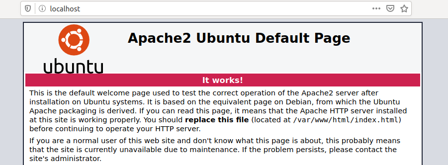

Esta es la página predeterminada después de la instalación y sirve  para confirmar que el servidor web está funcionando correctamente. 

------

## cURL 

`cURL` es una herramienta que nos permite transferir archivos desde el shell a través de protocolos como `HTTP`, `HTTPS`, `FTP`, `SFTP`, `FTPS`, o `SCP`. Esta herramienta nos brinda la posibilidad de controlar y probar sitios web de forma remota. Además del contenido de los servidores remotos,  también podemos ver solicitudes individuales para observar la  comunicación entre el cliente y el servidor. Generalmente, `cURL` ya está instalado en la mayoría de los sistemas Linux. Esta es otra  razón fundamental para familiarizarnos con esta herramienta, ya que  puede facilitar mucho algunos procesos más adelante. 

```shell-session
nunhes@htb[/htb]$ curl http://localhost

<!DOCTYPE html PUBLIC "-//W3C//DTD XHTML 1.0 Transitional//EN" "http://www.w3.org/TR/xhtml1/DTD/xhtml1-transitional.dtd">
<html xmlns="http://www.w3.org/1999/xhtml">
  <!--
    Modified from the Debian original for Ubuntu
    Last updated: 2016-11-16
    See: https://launchpad.net/bugs/1288690
  -->
  <head>
    <meta http-equiv="Content-Type" content="text/html; charset=UTF-8" />
    <title>Apache2 Ubuntu Default Page: It works</title>
    <style type="text/css" media="screen">
...SNIP...
```

En la etiqueta del título podemos ver que es el mismo texto que desde nuestro navegador. Esto nos permite inspeccionar el código fuente del  sitio web y obtener información del mismo. Sin embargo, volveremos a  esto en otro módulo. 

------

## Wget 

Una alternativa al curl es la herramienta. `wget`. Con  esta herramienta podemos descargar archivos desde servidores FTP o HTTP  directamente desde el terminal, y nos sirve como un buen gestor de  descargas. Si usamos wget de la misma manera, la diferencia con curl es  que el contenido del sitio web se descarga y almacena localmente, como  se muestra en el siguiente ejemplo. 

```shell-session
nunhes@htb[/htb]$ wget http://localhost

--2020-05-15 17:43:52--  http://localhost/
Resolving localhost (localhost)... 127.0.0.1
Connecting to localhost (localhost)|127.0.0.1|:80... connected.
HTTP request sent, awaiting response... 200 OK
Length: 10918 (11K) [text/html]
Saving to: 'index.html'

index.html                 100%[=======================================>]  10,66K  --.-KB/s    in 0s      

2020-05-15 17:43:52 (33,0 MB/s) - ‘index.html’ saved [10918/10918]
```

------

## Python 3 

Otra opción que se suele utilizar cuando se trata de transferencia de datos es el uso de Python 3. En este caso, el directorio raíz del  servidor web es donde se ejecuta el comando para iniciar el servidor.  Para este ejemplo, estamos en un directorio donde está instalado  WordPress y contiene un "readme.html". Ahora, iniciemos el servidor web  Python 3 y veamos si podemos acceder a él mediante el navegador. 

```shell-session
nunhes@htb[/htb]$ python3 -m http.server

Serving HTTP on 0.0.0.0 port 8000 (http://0.0.0.0:8000/) ...
```


Podemos ver qué solicitudes se realizaron si ahora miramos los eventos de nuestro servidor web Python 3. 

```shell-session
nunhes@htb[/htb]$ python3 -m http.server

Serving HTTP on 0.0.0.0 port 8000 (http://0.0.0.0:8000/) ...
127.0.0.1 - - [15/May/2020 17:56:29] "GET /readme.html HTTP/1.1" 200 -
127.0.0.1 - - [15/May/2020 17:56:29] "GET /wp-admin/css/install.css?ver=20100228 HTTP/1.1" 200 -
127.0.0.1 - - [15/May/2020 17:56:29] "GET /wp-admin/images/wordpress-logo.png HTTP/1.1" 200 -
127.0.0.1 - - [15/May/2020 17:56:29] "GET /wp-admin/images/wordpress-logo.svg?ver=20131107 HTTP/1.1" 200 -
```

- Encuentra una manera de  iniciar un servidor HTTP simple dentro de su VM local usando  "npm". Envíe el comando que inicia el servidor web en el puerto 8080  (use el argumento corto para especificar el número de puerto). 

- Encuentra una manera de iniciar un servidor HTTP simple dentro de  su VM local usando "php". Envíe el comando que inicia el  servidor web en el host local (127.0.0.1) en el puerto 8080. 

---

# Copia de seguridad y restauración 

------

Los sistemas Linux ofrecen una variedad de herramientas de software  para realizar copias de seguridad y restaurar datos. Estas herramientas  están diseñadas para ser eficientes y seguras, garantizando que los  datos estén protegidos y al mismo tiempo permitiéndonos acceder  fácilmente a los datos que necesitamos. 

Al realizar una copia de seguridad de los datos en un sistema Ubuntu, podemos utilizar herramientas como: 

- Rsync
- Deja Dup
- Duplicity

Rsync es una herramienta de código abierto que nos permite realizar  copias de seguridad de archivos y carpetas de forma rápida y segura en  una ubicación remota. Es particularmente útil para transferir grandes  cantidades de datos a través de la red, ya que solo transmite las partes modificadas de un archivo. También se puede utilizar para crear copias  de seguridad localmente o en servidores remotos. Si necesitamos realizar copias de seguridad de grandes cantidades de datos a través de la red,  Rsync podría ser la mejor opción. 

Duplicity es otra herramienta de copia de seguridad gráfica para  Ubuntu que proporciona a los usuarios una protección de datos integral y copias de seguridad seguras. También utiliza Rsync como backend y  además ofrece la posibilidad de cifrar copias de seguridad y  almacenarlas en medios de almacenamiento remotos, como servidores FTP, o servicios de almacenamiento en la nube, como Amazon S3. 

Deja Dup es una herramienta gráfica de copia de seguridad para Ubuntu que simplifica el proceso de copia de seguridad, permitiéndonos  realizar una copia de seguridad de nuestros datos de forma rápida y  sencilla. Proporciona una interfaz fácil de usar para crear copias de  seguridad de datos en medios de almacenamiento locales o remotos.  Utiliza Rsync como backend y también admite el cifrado de datos. 

Para garantizar la seguridad y la integridad de las copias de  seguridad, debemos tomar medidas para cifrarlas. El cifrado de copias de seguridad garantiza que los datos confidenciales estén protegidos  contra el acceso no autorizado. Alternativamente, podemos cifrar las  copias de seguridad en sistemas Ubuntu utilizando herramientas como  GnuPG, eCryptfs y LUKS. 

Realizar copias de seguridad y restaurar datos en sistemas Ubuntu es  una parte esencial de la protección de datos. Al utilizar las  herramientas analizadas, podemos asegurarnos de que nuestros datos  tengan una copia de seguridad segura y puedan restaurarse fácilmente  cuando sea necesario. 

Para instalar Rsync en Ubuntu, podemos usar el `apt` administrador de paquetes: 

#### Instalar Rsync 

```shell-session
nunhes@htb[/htb]$ sudo apt install rsync -y
```

Esto instalará la última versión de Rsync en el sistema. Una vez que  se completa la instalación, podemos comenzar a usar la herramienta para  realizar copias de seguridad y restaurar datos. Para hacer una copia de  seguridad de un directorio completo usando `rsync`, podemos usar el siguiente comando: 

#### Rsync - Copia de seguridad de un directorio local en nuestro servidor de respaldo 

```shell-session
nunhes@htb[/htb]$ rsync -av /path/to/mydirectory user@backup_server:/path/to/backup/directory
```

Este comando copiará todo el directorio ( `/path/to/mydirectory`) a un host remoto ( `backup_server`), al directorio `/path/to/backup/directory`. la opción `archive` ( `-a`) se utiliza para preservar los atributos del archivo original, como permisos, marcas de tiempo, etc., y usar el `verbose` ( `-v`) La opción proporciona una salida detallada del progreso de la `rsync` operación. 

También podemos agregar opciones adicionales para personalizar el  proceso de copia de seguridad, como usar compresión y copias de  seguridad incrementales. Podemos hacer esto de la siguiente manera: 

```shell-session
nunhes@htb[/htb]$ rsync -avz --backup --backup-dir=/path/to/backup/folder --delete /path/to/mydirectory user@backup_server:/path/to/backup/directory
```

Con esto respaldamos el `mydirectory` al control remoto `backup_server`, preservando los atributos del archivo original, las marcas de tiempo y los permisos, y habilitando la compresión ( `-z`) para transferencias más rápidas. El `--backup` La opción crea copias de seguridad incrementales en el directorio. `/path/to/backup/folder`, y el `--delete` La opción elimina archivos del host remoto que ya no está presente en el directorio de origen. 

Si queremos restaurar nuestro directorio desde nuestro servidor de  respaldo a nuestro directorio local, podemos usar el siguiente comando: 

#### Rsync - Restaurar nuestra Copia de Seguridad 

```shell-session
nunhes@htb[/htb]$ rsync -av user@remote_host:/path/to/backup/directory /path/to/mydirectory
```

------

## Rsync cifrado 

Para garantizar la seguridad de nuestros `rsync`  transferencia de archivos entre nuestro host local y nuestro servidor de respaldo, podemos combinar el uso de SSH y otras medidas de seguridad.  Al utilizar SSH, podemos cifrar nuestros datos a medida que se  transfieren, lo que hace mucho más difícil que cualquier persona no  autorizada acceda a ellos. Además, también podemos utilizar firewalls y  otros protocolos de seguridad para garantizar que nuestros datos se  mantengan seguros durante la transferencia. Al seguir estos pasos,  podemos estar seguros de que nuestros datos están protegidos y nuestra  transferencia de archivos es segura. Por eso decimos `rsync` para usar SSH como el siguiente: 

#### Transferencia Segura de nuestro Backup 

```shell-session
nunhes@htb[/htb]$ rsync -avz -e ssh /path/to/mydirectory user@backup_server:/path/to/backup/directory
```

La transferencia de datos entre nuestro host local y el servidor de  respaldo se produce a través de una conexión SSH cifrada, que brinda  protección de confidencialidad e integridad a los datos que se  transfieren. Este proceso de cifrado garantiza que los datos estén  protegidos de posibles actores maliciosos que, de otro modo, podrían  acceder y modificar los datos sin autorización. La propia clave de  cifrado también está protegida por un conjunto integral de protocolos de seguridad, lo que dificulta aún más que cualquier persona no autorizada obtenga acceso a los datos. Además, la conexión cifrada está diseñada  para ser altamente resistente a cualquier intento de violar la  seguridad, lo que nos permite tener confianza en la protección de los  datos que se transfieren. 

------

## Sincronización automática 

Para habilitar la sincronización automática usando `rsync`, puedes usar una combinación de `cron` y `rsync` para automatizar el proceso de sincronización. Programar el trabajo  cron para que se ejecute a intervalos regulares garantiza que el  contenido de los dos sistemas se mantenga sincronizado. Esto puede  resultar especialmente beneficioso para las organizaciones que necesitan mantener sus datos sincronizados en varias máquinas. Además, configurar la sincronización automática con `rsync` puede ser una  excelente manera de ahorrar tiempo y esfuerzo, ya que elimina la  necesidad de sincronización manual. También ayuda a garantizar que los  archivos y datos almacenados en los sistemas se mantengan actualizados y coherentes, lo que ayuda a reducir errores y mejorar la eficiencia. 

Por lo tanto creamos un nuevo script llamado `RSYNC_Backup.sh`, lo que desencadenará el `rsync` comando para sincronizar nuestro directorio local con el remoto. 

#### RSYNC_Backup.sh

```bash
#!/bin/bash

rsync -avz -e ssh /path/to/mydirectory user@backup_server:/path/to/backup/directory
```

Luego, para garantizar que el script pueda ejecutarse correctamente,  debemos proporcionar los permisos necesarios. Además, también es  importante asegurarse de que el script sea propiedad del usuario  correcto, ya que esto garantizará que solo el usuario correcto tenga  acceso al script y que ningún otro usuario altere el script. 

```shell-session
nunhes@htb[/htb]$ chmod +x RSYNC_Backup.sh
```

Después de eso, podemos crear un crontab que le indique `cron` para ejecutar el script cada hora en el minuto 0. Podemos ajustar el  tiempo según nuestras necesidades. Para hacerlo, el crontab necesita el  siguiente contenido: 

#### Sincronización automática - Crontab 

```shell-session
0 * * * * /path/to/RSYNC_Backup.sh
```

Con esta configuración, `cron` será responsable de ejecutar el script en el intervalo deseado, asegurando que el `rsync` Se ejecuta el comando y el contenido del directorio local se sincroniza con el host remoto. 


# Gestión del sistema de archivos 

------

La administración del sistema de archivos en Linux es un proceso  complejo que implica organizar y mantener los datos almacenados en un  disco u otro dispositivo de almacenamiento. Linux es un potente sistema  operativo que admite una amplia gama de sistemas de archivos, incluidos  ext2, ext3, ext4, XFS, Btrfs, NTFS y más. Cada uno de estos sistemas de  archivos ofrece características y beneficios únicos, y la mejor opción  para cualquier situación determinada dependerá de los requisitos  específicos de la aplicación o el usuario. Por ejemplo, ext2 es adecuado para tareas básicas de administración de sistemas de archivos, mientras que Btrfs ofrece sólidas capacidades de integridad de datos y  instantáneas. Además, NTFS es útil cuando se requiere compatibilidad con Windows. No importa la situación, es importante analizar adecuadamente  las necesidades de la aplicación o del usuario antes de seleccionar un  sistema de archivos. 

El sistema de archivos de Linux se basa en el sistema de archivos de  Unix, que es una estructura jerárquica que se compone de varios  componentes. En la parte superior de esta estructura se encuentra la  tabla de inodos, la base de todo el sistema de archivos. La tabla de  inodos es una tabla de información asociada con cada archivo y  directorio en un sistema Linux. Los inodos contienen metadatos sobre el  archivo o directorio, como sus permisos, tamaño, tipo, propietario, etc. La tabla de inodo es como una base de datos de información sobre cada  archivo y directorio en un sistema Linux, lo que permite al sistema  operativo acceder y administrar archivos rápidamente. Los archivos se  pueden almacenar en el sistema de archivos de Linux de dos maneras: 

- Archivos regulares 
- Directorios 

Los archivos normales son el tipo de archivo más común y se almacenan en el directorio raíz del sistema de archivos. Los directorios se  utilizan para almacenar colecciones de archivos. Cuando un archivo se  almacena en un directorio, el directorio se conoce como el directorio  principal de los archivos. Además de los archivos y directorios  normales, Linux también admite enlaces simbólicos, que son referencias a otros archivos o directorios. Los enlaces simbólicos se pueden utilizar para acceder rápidamente a archivos que se encuentran en diferentes  partes del sistema de archivos. Cada archivo y directorio debe  administrarse en términos de permisos. Los permisos controlan quién  tiene acceso a archivos y directorios. Cada archivo y directorio tiene  un conjunto asociado de permisos que determina quién puede leer,  escribir y ejecutar el archivo. Los mismos permisos se aplican a todos  los usuarios, por lo que si se cambian los permisos de un usuario, todos los demás usuarios también se verán afectados. 

```shell-session
nunhes@htb[/htb]$ ls -il

total 0
10678872 -rw-r--r--  1 cry0l1t3  htb  234123 Feb 14 19:30 myscript.py
10678869 -rw-r--r--  1 cry0l1t3  htb   43230 Feb 14 11:52 notes.txt
```

------

## Discos y unidades 

La administración de discos en Linux implica la administración de  dispositivos de almacenamiento físico, incluidos discos duros, unidades  de estado sólido y dispositivos de almacenamiento extraíbles. La  principal herramienta para la gestión de discos en Linux es el `fdisk`, que nos permite crear, eliminar y administrar particiones en una  unidad. También puede mostrar información sobre la tabla de particiones, incluido el tamaño y tipo de cada partición. Particionar una unidad en  Linux implica dividir el espacio de almacenamiento físico en secciones  lógicas separadas. Luego, cada partición se puede formatear con un  sistema de archivos específico, como ext4, NTFS o FAT32, y se puede  montar como un sistema de archivos independiente. La herramienta de  partición más común en Linux también es `fdisk`, `gpart`, y `GParted`. 

#### Fdisk 

```shell-session
nunhes@htb[/htb]$ sudo fdisk -l

Disk /dev/vda: 160 GiB, 171798691840 bytes, 335544320 sectors
Units: sectors of 1 * 512 = 512 bytes
Sector size (logical/physical): 512 bytes / 512 bytes
I/O size (minimum/optimal): 512 bytes / 512 bytes
Disklabel type: dos
Disk identifier: 0x5223435f

Device     Boot     Start       End   Sectors  Size Id Type
/dev/vda1  *         2048 158974027 158971980 75.8G 83 Linux
/dev/vda2       158974028 167766794   8792767  4.2G 82 Linux swap / Solaris

Disk /dev/vdb: 452 KiB, 462848 bytes, 904 sectors
Units: sectors of 1 * 512 = 512 bytes
Sector size (logical/physical): 512 bytes / 512 bytes
I/O size (minimum/optimal): 512 bytes / 512 bytes
```

------

## Mounting

Cada partición lógica o unidad debe asignarse a un directorio  específico en Linux. Este proceso se llama montaje. El montaje implica  conectar una unidad a un directorio específico, haciéndola accesible a  la jerarquía del sistema de archivos. Una vez montada una unidad, se  puede acceder a ella y manipularla como cualquier otro directorio del  sistema. El `mount` La herramienta se utiliza para montar sistemas de archivos en Linux, y la `/etc/fstab` El archivo se utiliza para definir los sistemas de archivos predeterminados que se montan en el momento del arranque. 

#### Sistemas de archivos montados en el arranque  - Mounted File systems at Boot

```shell-session
nunhes@htb[/htb]$ cat /etc/fstab

# /etc/fstab: static file system information.
#
# Use 'blkid' to print the universally unique identifier for a device; this may
# be used with UUID= as a more robust way to name devices that works even if
# disks are added and removed. See fstab(5).
#
# <file system>                      <mount point>  <type>  <options>  <dump>  <pass>
UUID=3d6a020d-...SNIP...-9e085e9c927a /              btrfs   subvol=@,defaults,noatime,nodiratime,nodatacow,space_cache,autodefrag 0 1
UUID=3d6a020d-...SNIP...-9e085e9c927a /home          btrfs   subvol=@home,defaults,noatime,nodiratime,nodatacow,space_cache,autodefrag 0 2
UUID=21f7eb94-...SNIP...-d4f58f94e141 swap           swap    defaults,noatime 0 0
```

Para ver los sistemas de archivos actualmente montados, podemos usar  el comando "montar" sin ningún argumento. El resultado mostrará una  lista de todos los sistemas de archivos actualmente montados, incluido  el nombre del dispositivo, el tipo de sistema de archivos, el punto de  montaje y las opciones. 

#### Lista de unidades montadas 

```shell-session
nunhes@htb[/htb]$ mount

sysfs on /sys type sysfs (rw,nosuid,nodev,noexec,relatime)
proc on /proc type proc (rw,nosuid,nodev,noexec,relatime)
udev on /dev type devtmpfs (rw,nosuid,relatime,size=4035812k,nr_inodes=1008953,mode=755,inode64)
devpts on /dev/pts type devpts (rw,nosuid,noexec,relatime,gid=5,mode=620,ptmxmode=000)
tmpfs on /run type tmpfs (rw,nosuid,nodev,noexec,relatime,size=814580k,mode=755,inode64)
/dev/vda1 on / type btrfs (rw,noatime,nodiratime,nodatasum,nodatacow,space_cache,autodefrag,subvolid=257,subvol=/@)
```

Para montar un sistema de archivos, podemos usar el `mount` comando seguido del nombre del dispositivo y el punto de montaje. Por  ejemplo, para montar una unidad USB con el nombre del dispositivo `/dev/sdb1` al directorio `/mnt/usb`, usaríamos el siguiente comando: 

#### Montar una unidad USB 

```shell-session
nunhes@htb[/htb]$ sudo mount /dev/sdb1 /mnt/usb
nunhes@htb[/htb]$ cd /mnt/usb && ls -l

total 32
drwxr-xr-x 1 root root   18 Oct 14  2021 'Account Takeover'
drwxr-xr-x 1 root root   18 Oct 14  2021 'API Key Leaks'
drwxr-xr-x 1 root root   18 Oct 14  2021 'AWS Amazon Bucket S3'
drwxr-xr-x 1 root root   34 Oct 14  2021 'Command Injection'
drwxr-xr-x 1 root root   18 Oct 14  2021 'CORS Misconfiguration'
drwxr-xr-x 1 root root   52 Oct 14  2021 'CRLF Injection'
drwxr-xr-x 1 root root   30 Oct 14  2021 'CSRF Injection'
drwxr-xr-x 1 root root   18 Oct 14  2021 'CSV Injection'
drwxr-xr-x 1 root root 1166 Oct 14  2021 'CVE Exploits'
...SNIP...
```

Para desmontar un sistema de archivos en Linux, podemos usar el `umount` comando seguido del punto de montaje del sistema de archivos que  queremos desmontar. El punto de montaje es la ubicación en el sistema de archivos donde está montado el sistema de archivos y es accesible para  nosotros. Por ejemplo, para desmontar la unidad USB que estaba  previamente montada en el directorio `/mnt/usb`, usaríamos el siguiente comando: 

#### Desmontar 

```shell-session
nunhes@htb[/htb]$ sudo umount /mnt/usb
```

Es importante destacar que debemos tener permisos suficientes para  desmontar un sistema de archivos. Tampoco podemos desmontar un sistema  de archivos que esté siendo utilizado por un proceso en ejecución. Para  asegurarnos de que no haya procesos en ejecución que estén usando el  sistema de archivos, podemos usar el `lsof` comando para enumerar los archivos abiertos en el sistema de archivos. 

```shell-session
cry0l1t3@htb:~$ lsof | grep cry0l1t3

vncserver 6006        cry0l1t3  mem       REG      0,24       402274 /usr/bin/perl (path dev=0,26)
vncserver 6006        cry0l1t3  mem       REG      0,24      1554101 /usr/lib/locale/aa_DJ.utf8/LC_COLLATE (path dev=0,26)
vncserver 6006        cry0l1t3  mem       REG      0,24       402326 /usr/lib/x86_64-linux-gnu/perl-base/auto/POSIX/POSIX.so (path dev=0,26)
vncserver 6006        cry0l1t3  mem       REG      0,24       402059 /usr/lib/x86_64-linux-gnu/perl/5.32.1/auto/Time/HiRes/HiRes.so (path dev=0,26)
vncserver 6006        cry0l1t3  mem       REG      0,24      1444250 /usr/lib/x86_64-linux-gnu/libnss_files-2.31.so (path dev=0,26)
vncserver 6006        cry0l1t3  mem       REG      0,24       402327 /usr/lib/x86_64-linux-gnu/perl-base/auto/Socket/Socket.so (path dev=0,26)
vncserver 6006        cry0l1t3  mem       REG      0,24       402324 /usr/lib/x86_64-linux-gnu/perl-base/auto/IO/IO.so (path dev=0,26)
...SNIP...
```

Si encontramos algún proceso que esté utilizando el sistema de  archivos, debemos detenerlo antes de poder desmontar el sistema de  archivos. Además, también podemos desmontar un sistema de archivos  automáticamente cuando el sistema se apaga agregando una entrada al `/etc/fstab` archivo. El `/etc/fstab` El archivo contiene información sobre todos los sistemas de archivos  que están montados en el sistema, incluidas las opciones para el montaje automático en el momento del arranque y otras opciones de montaje. Para desmontar un sistema de archivos automáticamente al apagarlo, debemos  agregar el `noauto` opción a la entrada en el `/etc/fstab` archivo para ese sistema de archivos. Esto se parecería, por ejemplo, a lo siguiente: 

#### Archivo Fstab 

```txt
/dev/sda1 / ext4 defaults 0 0
/dev/sda2 /home ext4 defaults 0 0
/dev/sdb1 /mnt/usb ext4 rw,noauto,user 0 0
192.168.1.100:/nfs /mnt/nfs nfs defaults 0 0
```

------

## SWAP - Intercambio

El espacio de intercambio es un aspecto crucial de la gestión de la  memoria en Linux y desempeña un papel importante para garantizar que el  sistema funcione sin problemas, incluso cuando la memoria física  disponible se agota. Cuando el sistema se queda sin memoria física, el  kernel transfiere páginas de memoria inactivas al espacio de  intercambio, liberando memoria física para que la utilicen procesos  activos. Este proceso se conoce como intercambio. 

El espacio de intercambio se puede crear durante la instalación del  sistema operativo o en cualquier momento posterior utilizando el `mkswap` y `swapon` comandos. El `mkswap` El comando se utiliza para configurar un área de intercambio de Linux en un dispositivo o en un archivo, mientras que el `swapon` El comando se utiliza para activar un área de intercambio. El tamaño  del espacio de intercambio es una cuestión de preferencia personal y  depende de la cantidad de memoria física instalada en el sistema y del  tipo de uso al que estará sujeto el sistema. Al crear un espacio de  intercambio, es importante asegurarse de que se coloque en una partición o archivo dedicado, separado del resto del sistema de archivos. Esto  ayuda a evitar la fragmentación del espacio de intercambio y garantiza  que el sistema tenga disponible el espacio de intercambio adecuado  cuando sea necesario. También es importante asegurarse de que el espacio de intercambio esté cifrado, ya que es posible que se almacenen datos  confidenciales en el espacio de intercambio temporalmente. 

Además de usarse como una extensión de la memoria física, el espacio  de intercambio también se puede usar para la hibernación, que es una  función de administración de energía que permite que el sistema guarde  su estado en el disco y luego se apague en lugar de apagarse por  completo. Cuando el sistema se enciende más tarde, puede restaurar su  estado desde el espacio de intercambio y volver al estado en el que se  encontraba antes de apagarlo. 


# Contenedorización 

------

La contenedorización es un proceso de empaquetar y ejecutar  aplicaciones en entornos aislados, como un contenedor, una máquina  virtual o un entorno sin servidor. Tecnologías como Docker, Docker  Compose y Linux Containers hacen posible este proceso en sistemas Linux. Estas tecnologías permiten a los usuarios crear, implementar y  administrar aplicaciones de forma rápida, segura y eficiente. Con estas  herramientas, los usuarios pueden configurar sus aplicaciones de varias  maneras, lo que les permite adaptar la aplicación a sus necesidades.  Además, los contenedores son increíblemente livianos, perfectos para  ejecutar múltiples aplicaciones simultáneamente y brindar escalabilidad y portabilidad. La contenedorización es una excelente manera de  garantizar que las aplicaciones se administren e implementen de manera  eficiente y segura. 

La seguridad de los contenedores es un aspecto importante de la  contenerización. Proporcionan a los usuarios un entorno seguro para  ejecutar sus aplicaciones, ya que están aislados del sistema host y de  otros contenedores. Este aislamiento ayuda a proteger el sistema host de cualquier actividad maliciosa en el contenedor y, al mismo tiempo,  proporciona una capa adicional de seguridad para las aplicaciones que se ejecutan en los contenedores. Además, los contenedores tienen la  ventaja de ser livianos, lo que los hace más difíciles de comprometer  que las máquinas virtuales tradicionales. Además, los contenedores son  fáciles de configurar, lo que los hace ideales para ejecutar  aplicaciones de forma segura. 

Además de proporcionar un entorno seguro, los contenedores brindan a  los usuarios muchas otras ventajas porque hacen que las aplicaciones  sean más fáciles de implementar y administrar y más eficientes para  ejecutar múltiples aplicaciones simultáneamente. Sin embargo, todavía  existen métodos para aumentar nuestros privilegios en los contenedores y escapar de ellos. 

------

## Dockers 

Docker es una plataforma de código abierto para automatizar la  implementación de aplicaciones como unidades autónomas llamadas  contenedores. Utiliza un sistema de archivos en capas y funciones de  aislamiento de recursos para brindar flexibilidad y portabilidad.  Además, proporciona un sólido conjunto de herramientas para crear,  implementar y administrar aplicaciones, lo que ayuda a optimizar el  proceso de contenedorización. 

#### Instalar Docker-Engine 

Instalar Docker es relativamente sencillo. Podemos usar el siguiente script para instalarlo en un host de Ubuntu: 

Código:  fiesta 

```bash
#!/bin/bash

# Preparation
sudo apt update -y
sudo apt install ca-certificates curl gnupg lsb-release -y
sudo mkdir -m 0755 -p /etc/apt/keyrings
curl -fsSL https://download.docker.com/linux/ubuntu/gpg | sudo gpg --dearmor -o /etc/apt/keyrings/docker.gpg
echo "deb [arch=$(dpkg --print-architecture) signed-by=/etc/apt/keyrings/docker.gpg] https://download.docker.com/linux/ubuntu $(lsb_release -cs) stable" | sudo tee /etc/apt/sources.list.d/docker.list > /dev/null

# Install Docker Engine
sudo apt update -y
sudo apt install docker-ce docker-ce-cli containerd.io docker-buildx-plugin docker-compose-plugin -y

# Add user htb-student to the Docker group
sudo usermod -aG docker htb-student
echo '[!] You need to log out and log back in for the group changes to take effect.'

# Test Docker installation
docker run hello-world
```

Se necesitan el motor Docker e imágenes Docker específicas para ejecutar un contenedor. Estos se pueden obtener desde [ Docker Hub ](https://hub.docker.com/) , un repositorio de imágenes prefabricadas, o creadas por el usuario.  Docker Hub es un registro basado en la nube para repositorios de  software o una biblioteca para imágenes de Docker. Esta dividido en un `public` y un `private` área. El área pública permite a los usuarios cargar y compartir  imágenes con la comunidad. También contiene imágenes oficiales del  equipo de desarrollo de Docker y proyectos de código abierto  establecidos. Las imágenes cargadas en un área privada del registro no  son de acceso público. Se pueden compartir dentro de una empresa o con  equipos y conocidos. 

La creación de una imagen de Docker se realiza mediante la creación de un [ Dockerfile ](https://docs.docker.com/engine/reference/builder/) , que contiene todas las instrucciones que el motor de Docker necesita  para crear el contenedor. Podemos utilizar contenedores Docker como  nuestro servidor de “alojamiento de archivos” al transferir archivos  específicos a nuestros sistemas de destino. Por lo tanto, debemos crear  una `Dockerfile` basado en Ubuntu 22.04 con `Apache` y `SSH` servidor en ejecución. Con esto podemos usar `scp` para transferir archivos a la imagen de la ventana acoplable, y Apache nos permite alojar archivos y usar herramientas como `curl`, `wget`y otros en el sistema de destino para descargar los archivos necesarios. tal `Dockerfile` podría verse como el siguiente: 

#### Dockerfile 

```bash
# Use the latest Ubuntu 22.04 LTS as the base image
FROM ubuntu:22.04

# Update the package repository and install the required packages
RUN apt-get update && \
    apt-get install -y \
        apache2 \
        openssh-server \
        && \
    rm -rf /var/lib/apt/lists/*

# Create a new user called "student"
RUN useradd -m docker-user && \
    echo "docker-user:password" | chpasswd

# Give the htb-student user full access to the Apache and SSH services
RUN chown -R docker-user:docker-user /var/www/html && \
    chown -R docker-user:docker-user /var/run/apache2 && \
    chown -R docker-user:docker-user /var/log/apache2 && \
    chown -R docker-user:docker-user /var/lock/apache2 && \
    usermod -aG sudo docker-user && \
    echo "docker-user ALL=(ALL) NOPASSWD: ALL" >> /etc/sudoers

# Expose the required ports
EXPOSE 22 80

# Start the SSH and Apache services
CMD service ssh start && /usr/sbin/apache2ctl -D FOREGROUND
```

Una vez que hayamos definido nuestro Dockerfile, debemos convertirlo en una imagen. Con el `build` comando, tomamos el directorio con el Dockerfile, ejecutamos los pasos del `Dockerfile`y almacenar la imagen en nuestro Docker Engine local. Si uno de los pasos falla debido a un error, se cancelará la creación del contenedor. con  la opción `-t`, le damos a nuestro contenedor una etiqueta, para que sea más fácil identificarlo y trabajar con él más adelante. 

#### Docker Build

```shell-session
nunhes@htb[/htb]$ docker build -t FS_docker .
```

Una vez creada la imagen de Docker, se puede ejecutar a través del  motor Docker, lo que la convierte en una forma muy eficiente y sencilla  de ejecutar un contenedor. Es similar al concepto de máquina virtual,  basado en imágenes. Aun así, estas imágenes son plantillas de sólo  lectura y proporcionan el sistema de archivos necesario para el tiempo  de ejecución y todos los parámetros. Un contenedor puede considerarse un proceso en ejecución de una imagen. Cuando se va a iniciar un  contenedor en un sistema, primero se carga un paquete con la imagen  respectiva si no está disponible localmente. Podemos iniciar el  contenedor con el siguiente comando [ docker run ](https://docs.docker.com/engine/reference/commandline/run/) : 

#### Ejecución de Docker: sintaxis 

```shell-session
nunhes@htb[/htb]$ docker run -p <host port>:<docker port> -d <docker container name>
```

#### Ejecución de ventana acoplable 

```shell-session
nunhes@htb[/htb]$ docker run -p 8022:22 -p 8080:80 -d FS_docker
```

En este caso, iniciamos un nuevo contenedor a partir de la imagen. `FS_docker` y asignar los puertos de host 8022 y 8080 a los puertos de contenedor  22 y 80, respectivamente. El contenedor se ejecuta en segundo plano, lo  que nos permite acceder a los servicios SSH y HTTP dentro del contenedor utilizando los puertos de host especificados. 

#### Gestión de ventana acoplable 

Al administrar contenedores Docker, Docker proporciona un conjunto  completo de herramientas que nos permiten crear, implementar y  administrar contenedores fácilmente. Con estas poderosas herramientas,  podemos enumerar, iniciar y detener contenedores y administrarlos de  manera efectiva, garantizando una ejecución perfecta de las  aplicaciones. Algunos de los comandos de administración de Docker más  utilizados son: 

| **Dominio**      | **Descripción**                            |
| ---------------- | ------------------------------------------ |
| `docker ps`      | Listar todos los contenedores en ejecución |
| `docker stop`    | Detener un contenedor en ejecución.        |
| `docker start`   | Iniciar un contenedor detenido.            |
| `docker restart` | Reinicie un contenedor en ejecución.       |
| `docker rm`      | Retire un recipiente.                      |
| `docker rmi`     | Eliminar una imagen de Docker.             |
| `docker logs`    | Ver los registros de un contenedor.        |

Vale la pena señalar que estos comandos, utilizados en Docker, se  pueden combinar con varias opciones para proporcionar funcionalidad  adicional. Por ejemplo, podemos especificar qué puertos exponer, montar  volúmenes o establecer variables de entorno. Esto nos permite  personalizar nuestros contenedores Docker para adaptarlos a nuestras  necesidades y requisitos. Al trabajar con imágenes de Docker, es  importante tener en cuenta que los cambios realizados en una imagen  existente no son permanentes. En su lugar, necesitamos crear una nueva  imagen que herede de la original e incluya los cambios deseados. 

Esto se hace creando un nuevo Dockerfile que comienza con el `FROM` declaración, que especifica la imagen base y luego agrega los comandos  necesarios para realizar los cambios deseados. Una vez creado el  Dockerfile, podemos usar el `docker build` comando para crear la nueva imagen, etiquetándola con un nombre único para ayudar a  identificarla. Este proceso asegura que la imagen original permanezca  intacta y al mismo tiempo nos permite crear una nueva imagen con los  cambios deseados. 

Es importante tener en cuenta que los contenedores Docker están  diseñados para ser inmutables, lo que significa que cualquier cambio  realizado en un contenedor durante el tiempo de ejecución se pierde  cuando se detiene el contenedor. Por lo tanto, se recomienda utilizar  herramientas de orquestación de contenedores como Docker Compose o  Kubernetes para administrar y escalar contenedores en un entorno de  producción. 

------

## Contenedores de Linux 

Contenedores de Linux ( `LXC`) es una tecnología de  virtualización que permite ejecutar múltiples sistemas Linux aislados en un solo host. Utiliza funciones de aislamiento de recursos, como `cgroups` y `namespaces`, para proporcionar una solución de virtualización ligera. LXC también  proporciona un rico conjunto de herramientas y API para administrar y  configurar contenedores, lo que contribuye a su popularidad como  tecnología de contenedorización. Al combinar las ventajas de LXC con el  poder de Docker, los usuarios pueden lograr una experiencia de  contenedorización completa en sistemas Linux. 

Tanto LXC como Docker son tecnologías de contenedorización que  permiten empaquetar y ejecutar aplicaciones en entornos aislados. Sin  embargo, existen algunas diferencias entre ambos que se pueden  distinguir en función de las siguientes categorías: 

- Acercarse 
- Construcción de imagen 
- Portabilidad 
- Fácil de usar 
- Seguridad 

LXC es una tecnología de virtualización liviana que utiliza funciones de aislamiento de recursos del kernel de Linux para proporcionar un  entorno aislado para las aplicaciones. En LXC, las imágenes se crean  manualmente creando un sistema de archivos raíz e instalando los  paquetes y configuraciones necesarios. Esos contenedores están  vinculados al sistema host, es posible que no sean fáciles de  transportar y pueden requerir más experiencia técnica para configurarlos y administrarlos. LXC también proporciona algunas funciones de  seguridad, pero puede que no sea tan sólido como Docker. 

Por otro lado, Docker es una plataforma centrada en aplicaciones que  se basa en LXC y proporciona una interfaz más fácil de usar para la  contenedorización. Sus imágenes se crean utilizando un Dockerfile, que  especifica la imagen base y los pasos necesarios para crear la imagen.  Esas imágenes están diseñadas para ser portátiles, de modo que puedan  trasladarse fácilmente de un entorno a otro. Docker proporciona una  interfaz más fácil de usar para la contenedorización, con un amplio  conjunto de herramientas y API para administrar y configurar  contenedores con un entorno más seguro para ejecutar aplicaciones. 

Para instalar LXC en una distribución de Linux, podemos usar el  administrador de paquetes de la distribución. Por ejemplo, en Ubuntu,  podemos usar el `apt` administrador de paquetes para instalar LXC con el siguiente comando: 

#### Instalar LXC 

```shell-session
nunhes@htb[/htb]$ sudo apt-get install lxc lxc-utils -y
```

Una vez instalado LXC, podemos comenzar a crear y administrar  contenedores en el host Linux. Vale la pena señalar que LXC requiere que el kernel de Linux admita las funciones necesarias para la  contenedorización. La mayoría de los kernels de Linux modernos tienen  soporte integrado para la contenedorización, pero algunos kernels más  antiguos pueden requerir configuración o parches adicionales para  habilitar el soporte para LXC. 

#### Creando un contenedor LXC 

Para crear un nuevo contenedor LXC, podemos usar el `lxc-create` comando seguido del nombre del contenedor y la plantilla a utilizar.  Por ejemplo, para crear un nuevo contenedor de Ubuntu llamado `linuxcontainer`, podemos usar el siguiente comando: 

```shell-session
nunhes@htb[/htb]$ sudo lxc-create -n linuxcontainer -t ubuntu
```

#### Gestión de contenedores LXC 

Cuando se trabaja con contenedores LXC, se implican varias tareas  para gestionarlos. Estas tareas incluyen crear nuevos contenedores,  configurar sus ajustes, iniciarlos y detenerlos según sea necesario y  monitorear su rendimiento. Afortunadamente, existen muchas herramientas  de línea de comandos y archivos de configuración disponibles que pueden  ayudar con estas tareas. Estas herramientas nos permiten gestionar  rápida y fácilmente nuestros contenedores, asegurando que estén  optimizados para nuestras necesidades y requisitos específicos. Al  aprovechar estas herramientas de manera efectiva, podemos garantizar que nuestros contenedores LXC funcionen de manera eficiente y efectiva, lo  que nos permitirá maximizar el rendimiento y las capacidades de nuestro  sistema. 

| Dominio                                       | Descripción                                                  |
| --------------------------------------------- | ------------------------------------------------------------ |
| `lxc-ls`                                      | Listar todos los contenedores existentes                     |
| `lxc-stop -n <container>`                     | Detener un contenedor en ejecución.                          |
| `lxc-start -n <container>`                    | Iniciar un contenedor detenido.                              |
| `lxc-restart -n <container>`                  | Reinicie un contenedor en ejecución.                         |
| `lxc-config -n <container name> -s storage`   | Gestionar el almacenamiento de contenedores                  |
| `lxc-config -n <container name> -s network`   | Administrar la configuración de la red de contenedores       |
| `lxc-config -n <container name> -s security`  | Administrar la configuración de seguridad del contenedor     |
| `lxc-attach -n <container>`                   | Conéctese a un contenedor.                                   |
| `lxc-attach -n <container> -f /path/to/share` | Conéctese a un contenedor y comparta un directorio o archivo específico. |

Como probadores de penetración, podemos encontrarnos con situaciones  en las que debamos probar software o sistemas con dependencias o  configuraciones que son difíciles de reproducir en nuestras máquinas.  Aquí es donde los contenedores de Linux resultan útiles. Dado que un  contenedor de Linux es un paquete ejecutable liviano e independiente que contiene todas las dependencias y archivos de configuración necesarios  para ejecutar un software o sistema específico, proporciona un entorno  aislado que se puede ejecutar en cualquier máquina Linux,  independientemente de la configuración del host. 

Los contenedores son útiles, especialmente porque nos permiten crear  rápidamente un entorno aislado específico para nuestras necesidades de  prueba. Por ejemplo, es posible que necesitemos probar una aplicación  web que requiera una base de datos específica o una versión de servidor  web. En lugar de configurar estos componentes en nuestra máquina, lo que puede llevar mucho tiempo y ser propenso a errores, podemos crear un  contenedor que contenga la configuración exacta que necesitamos. 

También podemos usarlos para probar exploits o malware en un entorno  controlado donde creamos un contenedor que simula un sistema o red  vulnerable y luego usamos ese contenedor para probar exploits de forma  segura sin correr el riesgo de dañar nuestras máquinas o redes. Sin  embargo, es importante configurar la seguridad del contenedor LXC para  evitar el acceso no autorizado o actividades maliciosas dentro del  contenedor. Esto se puede lograr implementando varias medidas de  seguridad, tales como: 

- Restringir el acceso al contenedor 
- Limitar recursos 
- Aislar el contenedor del anfitrión 
- Hacer cumplir el control de acceso obligatorio 
- Mantener el contenedor actualizado. 

Se puede acceder a los contenedores LXC mediante varios métodos, como SSH o consola. Se recomienda restringir el acceso al contenedor  deshabilitando servicios innecesarios, utilizando protocolos seguros y  aplicando mecanismos de autenticación sólidos. Por ejemplo, podemos  deshabilitar el acceso SSH al contenedor eliminando el `openssh-server` paquete o configurando SSH solo para permitir el acceso desde  direcciones IP confiables. Esos contenedores también comparten el mismo  kernel que el sistema host, lo que significa que pueden acceder a todos  los recursos disponibles en el sistema. Podemos utilizar límites o  cuotas de recursos para evitar que los contenedores consuman recursos  excesivos. Por ejemplo, podemos utilizar `cgroups` para limitar la cantidad de CPU, memoria o espacio en disco que puede utilizar un contenedor. 

#### Asegurar LXC 

Limitemos los recursos al contenedor. Para configurar `cgroups` para LXC y limitar la CPU y la memoria, un contenedor puede crear un nuevo archivo de configuración en el `/usr/share/lxc/config/<container name>.conf` directorio con el nombre de nuestro contenedor. Por ejemplo, para crear un archivo de configuración para un contenedor llamado `linuxcontainer`, podemos usar el siguiente comando: 

```shell-session
nunhes@htb[/htb]$ sudo vim /usr/share/lxc/config/linuxcontainer.conf
```

En este archivo de configuración, podemos agregar las siguientes  líneas para limitar la CPU y la memoria que puede usar el contenedor. 

```txt
lxc.cgroup.cpu.shares = 512
lxc.cgroup.memory.limit_in_bytes = 512M
```

Cuando se trabaja con contenedores, es importante comprender el `lxc.cgroup.cpu.shares` parámetro. Este parámetro determina el tiempo de CPU que un contenedor  puede usar en relación con los otros contenedores del sistema. De forma  predeterminada, este valor está establecido en 1024, lo que significa  que el contenedor puede utilizar hasta su justa parte del tiempo de CPU. Sin embargo, si establecemos este valor en 512, por ejemplo, el  contenedor sólo podrá utilizar la mitad del tiempo de CPU disponible en  el sistema. Esta puede ser una forma útil de administrar recursos y  garantizar que todos los contenedores tengan el acceso necesario al  tiempo de CPU. 

Uno de los parámetros clave para controlar la asignación de recursos de un contenedor es la `lxc.cgroup.memory.limit_in_bytes` parámetro. Este parámetro le permite establecer la cantidad máxima de  memoria que puede usar un contenedor. Es importante tener en cuenta que  este valor se puede especificar en una variedad de unidades, incluidos  bytes, kilobytes (K), megabytes (M), gigabytes (G) o terabytes (T), lo  que permite un alto grado de granularidad al definir el contenedor.  límites de recursos. Después de agregar estas dos líneas, podemos  guardar y cerrar el archivo escribiendo: 

- `[Esc]`
- `:`
- `wq`

Para aplicar estos cambios, debemos reiniciar el servicio LXC. 

```shell-session
nunhes@htb[/htb]$ sudo systemctl restart lxc.service
```

uso LXC `namespaces` para proporcionar un entorno aislado  para procesos, redes y sistemas de archivos del sistema host. Los  espacios de nombres son una característica del kernel de Linux que  permite crear entornos aislados al proporcionar una abstracción de los  recursos del sistema. 

Los espacios de nombres son un aspecto crucial de la  contenedorización, ya que proporcionan un alto grado de aislamiento para los procesos, interfaces de red, tablas de enrutamiento y reglas de  firewall del contenedor. A cada contenedor se le asigna una ID de  proceso única ( `pid`) espacio numérico, aislado de los ID de proceso del sistema host. Esto garantiza que los procesos del  contenedor no puedan interferir con los procesos del sistema host, lo  que mejora la estabilidad y confiabilidad del sistema. Además, cada  contenedor tiene sus propias interfaces de red ( `net`),  tablas de enrutamiento y reglas de firewall, que están completamente  separadas de las interfaces de red del sistema host. Cualquier actividad relacionada con la red dentro del contenedor está acordonada de la red  del sistema host, lo que proporciona una capa adicional de seguridad de  la red. 

Además, los contenedores vienen con su propio sistema de archivos raíz ( `mnt`), que es completamente diferente del sistema de archivos raíz del sistema host. Esta separación entre los dos garantiza que cualquier cambio o  modificación realizada dentro del sistema de archivos del contenedor no  afecte el sistema de archivos del sistema host. Sin embargo, es  importante recordar que, si bien los espacios de nombres brindan un alto nivel de aislamiento, no brindan seguridad completa. Por lo tanto,  siempre es recomendable implementar medidas de seguridad adicionales  para proteger aún más el contenedor y el sistema host de posibles  violaciones de seguridad. 

Aquí hay 9 ejercicios opcionales para practicar LXC: 

|      |                                                              |
| ---- | ------------------------------------------------------------ |
| 1    | Instale LXC en su máquina y cree su primer contenedor.       |
| 2    | Configure los ajustes de red para su contenedor LXC.         |
| 3    | Cree una imagen LXC personalizada y úsela para iniciar un nuevo contenedor. |
| 4    | Configure límites de recursos para sus contenedores LXC (CPU, memoria, espacio en disco). |
| 5    | Explora el `lxc-*` Comandos para gestionar contenedores.     |
| 6    | Utiliza LXC para crear un contenedor que ejecute una versión específica de un servidor web (por ejemplo, Apache, Nginx). |
| 7    | Configure el acceso SSH a sus contenedores LXC y conéctese a ellos de forma remota. |
| 8    | Cree un contenedor con persistencia, de modo que los cambios realizados en el contenedor se guarden y puedan reutilizarse. |
| 9    | Utiliza LXC para probar software en un entorno controlado, como una aplicación web vulnerable o malware. |

#linux #herramientas  #básico