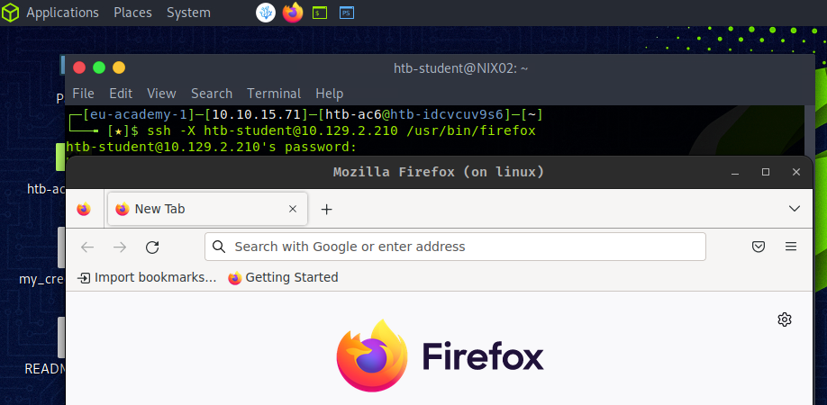
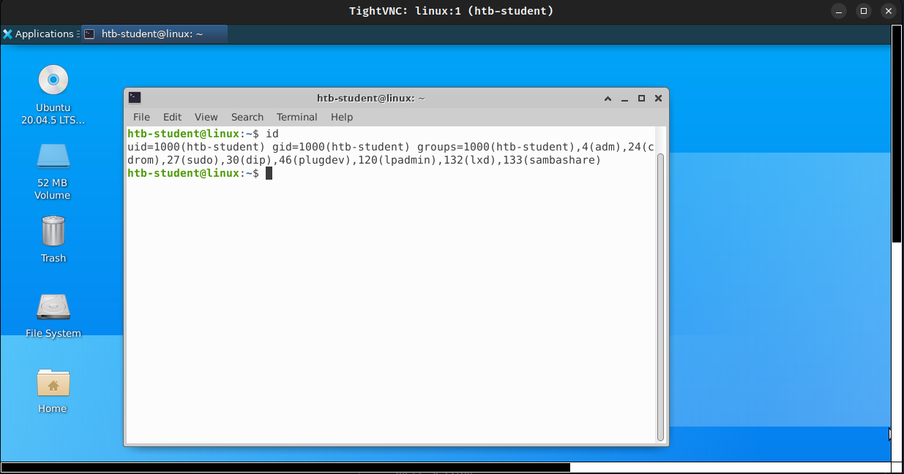

# Configuración de red 

------

Como probador de penetración, una de las habilidades clave requeridas es configurar y administrar la configuración de red en sistemas Linux.  Esta habilidad es valiosa para configurar entornos de prueba, controlar el tráfico de red o identificar y explotar vulnerabilidades. Al comprender las opciones de configuración de red de Linux, podemos adaptar nuestro enfoque de prueba para satisfacer nuestras necesidades específicas y optimizar nuestros resultados. 

Una de las principales tareas de configuración de la red es configurar las interfaces de red. Esto incluye la asignación de direcciones IP, la configuración de dispositivos de red como enrutadores y conmutadores, y la configuración de protocolos de red. Es esencial comprender a fondo los protocolos de red y sus casos de uso específicos, como TCP/IP, DNS, DHCP y FTP. Además, debemos estar familiarizados con diferentes interfaces de red, incluidas las conexiones inalámbricas y por cable, y poder solucionar problemas de conectividad. 

El control de acceso a la red es otro componente crítico de la configuración de la red. Como probadores de penetración, debemos estar familiarizados con la importancia de NAC para la seguridad de la red y las diferentes tecnologías NAC disponibles. Estos incluyen: 

- Control de acceso discrecional (DAC) 
- Control de acceso obligatorio (MAC) 
- Control de acceso basado en roles (RBAC) 

También debemos comprender los diferentes mecanismos de aplicación de NAC y saber cómo configurar dispositivos de red Linux para NAC. Esto incluye la configuración de políticas SELinux, la configuración de perfiles de AppArmor y el uso de contenedores TCP para controlar el acceso. 

Monitorear el tráfico de la red también es una parte esencial de la configuración de la red. Por lo tanto, debemos saber cómo configurar el monitoreo y el registro de la red y poder analizar el tráfico de la red por motivos de seguridad. Se pueden utilizar herramientas como syslog, rsyslog, ss, lsof y ELK stack para monitorear el tráfico de la red e identificar problemas de seguridad. 

Además, un buen conocimiento de las herramientas de resolución de problemas de red es crucial para identificar vulnerabilidades e interactuar con otras redes y hosts. Además de las herramientas que mencionamos, podemos usar ping, nslookup y nmap para diagnosticar y enumerar redes. Estas herramientas pueden proporcionar información valiosa sobre el tráfico de la red, la pérdida de paquetes, la latencia, la resolución de DNS, etc. Al comprender cómo utilizar estas herramientas de manera efectiva, podemos identificar rápidamente la causa raíz de cualquier problema de la red y tomar las medidas necesarias para resolverlo. 

------

## Configuración de interfaces de red 

Cuando trabaja con Ubuntu, puede configurar interfaces de red local usando el `ifconfig` o el `ip` dominio. Estos poderosos comandos nos permiten ver y configurar las interfaces de red de nuestro sistema. Ya sea que estemos buscando realizar cambios en nuestra configuración de red existente o necesitemos verificar el estado de nuestras interfaces, estos comandos pueden simplificar enormemente el proceso. Además, desarrollar una comprensión firme de las complejidades de las interfaces de red es una habilidad esencial en el mundo moderno e interconectado. Con el rápido avance de la tecnología y la creciente dependencia de la comunicación digital, tener un conocimiento integral de cómo trabajar con interfaces de red puede permitirle navegar de manera efectiva por la diversa gama de redes que existen hoy en día. 

Una forma de obtener información sobre las interfaces de red, como direcciones IP, máscaras de red y estado, es mediante el uso del `ifconfig` dominio. Al ejecutar este comando, podremos visualizar las interfaces de red disponibles y sus respectivos atributos de manera clara y organizada. Esta información puede ser particularmente útil al solucionar problemas de conectividad de red o establecer una nueva configuración de red. Cabe señalar que el `ifconfig` El comando ha quedado obsoleto en las versiones más recientes de Linux y reemplazado por el `ip` comando, que ofrece funciones más avanzadas. Sin embargo, el `ifconfig` El comando todavía se usa ampliamente en muchas distribuciones de Linux y continúa siendo una herramienta confiable para la administración de redes. 

#### Configuración de red 

 Cuando se trata de activar interfaces de red, `ifconfig` y `ip` Los comandos son dos herramientas de uso común. Estos comandos permiten a los usuarios modificar y activar configuraciones para una interfaz específica, como `eth0`. Podemos ajustar la configuración de red para adaptarla a nuestras necesidades utilizando la sintaxis adecuada y especificando el nombre de la interfaz. 

#### Activar interfaz de red     

```shell-session
nunhes@htb[/htb]$ sudo ifconfig eth0 up     # OR
nunhes@htb[/htb]$ sudo ip link set eth0 up
```

Una forma de asignar una dirección IP a una interfaz de red es utilizando el `ifconfig` dominio. Debemos especificar el nombre de la interfaz y la dirección IP como argumentos para hacer esto. Este es un paso crucial para configurar una conexión de red. La dirección IP sirve como identificador único para la interfaz y permite la comunicación entre dispositivos en la red. 

#### Asignar dirección IP a una interfaz     

```shell-session
nunhes@htb[/htb]$ sudo ifconfig eth0 192.168.1.2
```

Para configurar la máscara de red para una interfaz de red, podemos ejecutar el siguiente comando con el nombre de la interfaz y la máscara de red: 

#### Asignar una máscara de red a una interfaz     

```shell-session
nunhes@htb[/htb]$ sudo ifconfig eth0 netmask 255.255.255.0
```

Cuando queremos configurar la puerta de enlace predeterminada para una interfaz de red, podemos usar el `route` comando con el `add` opción. Esto nos permite especificar la dirección IP de la puerta de enlace y la interfaz de red a la que se debe aplicar. Al configurar la puerta de enlace predeterminada, designamos la dirección IP del enrutador que se utilizará para enviar tráfico a destinos fuera de la red local. Es importante asegurarse de que la puerta de enlace predeterminada esté configurada correctamente, ya que una configuración incorrecta puede provocar problemas de conectividad. 

#### Asignar la ruta a una interfaz     

```shell-session
nunhes@htb[/htb]$ sudo route add default gw 192.168.1.1 eth0
```

Al configurar una interfaz de red, a menudo es necesario configurar el Sistema de nombres de dominio ( `DNS`) servidores para garantizar la funcionalidad adecuada de la red. Los servidores DNS traducen nombres de dominio en direcciones IP, lo que permite que los dispositivos se conecten entre sí en Internet. Al configurarlos, podemos asegurarnos de que sus dispositivos puedan comunicarse con otros dispositivos y acceder a sitios web y otros recursos en línea. Sin una configuración adecuada del servidor DNS, los dispositivos pueden experimentar problemas de conectividad de red y no poder acceder a ciertos recursos en línea. Esto se puede lograr actualizando el `/etc/resolv.conf` archivo con la información del servidor DNS adecuada. El `/etc/resolv.conf` El archivo es un archivo de texto sin formato que contiene la información DNS del sistema. El sistema puede resolver correctamente los nombres de dominio en direcciones IP agregando los servidores DNS necesarios a este archivo. Es importante tener en cuenta que cualquier cambio realizado en este archivo solo se aplicará a la sesión actual y debe actualizarse si se reinicia el sistema o se cambia la configuración de la red. 

#### Editar la configuración de DNS     

```shell-session
nunhes@htb[/htb]$ sudo vim /etc/resolv.conf
```

#### /etc/resolv.conf 

Código:  texto 

```txt
nameserver 8.8.8.8
nameserver 8.8.4.4
```

Después de completar las modificaciones necesarias en la configuración de la red, es esencial asegurarse de que estos cambios se guarden para que persistan durante los reinicios. Esto se puede lograr editando el `/etc/network/interfaces` archivo, que define interfaces de red para sistemas operativos basados en Linux. Por lo tanto, es vital guardar cualquier cambio realizado en este archivo para evitar posibles problemas con la conectividad de la red. 

#### Editar interfaces     

```shell-session
nunhes@htb[/htb]$ sudo vim /etc/network/interfaces
```

Esto abrirá el `interfaces` archivo en el editor vim. Podemos agregar los ajustes de configuración de red al archivo de esta manera: 

#### /etc/red/interfaces 

```txt
auto eth0
iface eth0 inet static
  address 192.168.1.2
  netmask 255.255.255.0
  gateway 192.168.1.1
  dns-nameservers 8.8.8.8 8.8.4.4
```

Al configurar el `eth0` interfaz de red para utilizar una dirección IP estática de `192.168.1.2`, con una máscara de red de `255.255.255.0` y una puerta de enlace predeterminada de `192.168.1.1`, podemos garantizar que su conexión de red permanezca estable y confiable. Además, al especificar servidores DNS de `8.8.8.8` y `8.8.4.4`, podemos asegurarnos de que nuestra computadora pueda acceder fácilmente a Internet y resolver nombres de dominio. Una vez que hayamos realizado estos cambios en el archivo de configuración, es importante guardar el archivo y salir del editor. Luego de ello, debemos reiniciar el servicio de red para aplicar los cambios. 

#### Reiniciar el servicio de red     

```shell-session
nunhes@htb[/htb]$ sudo systemctl restart networking
```

------

## Control de acceso a la red 

El control de acceso a la red (NAC) es un componente crucial de la seguridad de la red, especialmente en la era actual de crecientes amenazas cibernéticas. Como probador de penetración, es vital comprender la importancia de NAC en la protección de la red y las diversas tecnologías NAC que se pueden utilizar para mejorar las medidas de seguridad. NAC es un sistema de seguridad que garantiza que solo los dispositivos autorizados y compatibles tengan acceso a la red, evitando el acceso no autorizado, las filtraciones de datos y otras amenazas a la seguridad. Al implementar NAC, las organizaciones pueden confiar en su capacidad para proteger sus activos y datos de los ciberdelincuentes que siempre buscan explotar las vulnerabilidades del sistema. Las siguientes son las diferentes tecnologías NAC que se pueden utilizar para mejorar las medidas de seguridad: 

- Control de acceso discrecional (DAC) 
- Control de acceso obligatorio (MAC) 
- Control de acceso basado en roles (RBAC) 

Estas tecnologías están diseñadas para proporcionar diferentes niveles de control de acceso y seguridad. Cada tecnología tiene sus características únicas y es adecuada para diferentes casos de uso. Como probador de penetración, es esencial comprender estas tecnologías y sus casos de uso específicos para probar y evaluar la seguridad de la red de manera efectiva. 

#### Control de acceso discrecional 

DAC es un componente crucial de los sistemas de seguridad modernos,  ya que ayuda a las organizaciones a brindar acceso a sus recursos mientras administra los riesgos asociados de acceso no autorizado. Es un sistema de control de acceso ampliamente utilizado que permite a los usuarios gestionar el acceso a sus recursos otorgando a los propietarios de recursos la responsabilidad de controlar los permisos de acceso a sus recursos. Esto significa que los usuarios y grupos que poseen un recurso específico pueden decidir quién tiene acceso a sus recursos y qué acciones están autorizados a realizar. Estos permisos se pueden configurar para leer, escribir, ejecutar o eliminar el recurso. 

#### Control de acceso obligatorio 

MAC se utiliza en infraestructura que proporciona un control más detallado sobre el acceso a recursos que los sistemas DAC. Esos sistemas definen reglas que determinan el acceso a los recursos según el nivel de seguridad del recurso y el nivel de seguridad del usuario o proceso que solicita acceso. A cada recurso se le asigna una etiqueta de seguridad que identifica su nivel de seguridad, y a cada usuario o proceso se le asigna una autorización de seguridad que identifica su nivel de seguridad. El acceso a un recurso solo se otorga si el nivel de seguridad del usuario o proceso es igual o mayor que el nivel de seguridad del recurso. MAC se utiliza a menudo en sistemas operativos y aplicaciones que requieren un alto nivel de seguridad, como sistemas militares o gubernamentales, sistemas financieros y sistemas de atención médica. Los sistemas MAC están diseñados para evitar el acceso no autorizado a los recursos y minimizar el impacto de las violaciones de seguridad. 

#### Control de acceso basado en roles 

RBAC asigna permisos a los usuarios según sus roles dentro de una organización. A los usuarios se les asignan roles según sus responsabilidades laborales u otros criterios, y a cada rol se le otorga un conjunto de permisos que determinan las acciones que pueden realizar. RBAC simplifica la gestión de los permisos de acceso, reduce el riesgo de errores y garantiza que los usuarios puedan acceder sólo a los recursos necesarios para realizar sus funciones laborales. Puede restringir el acceso a recursos y datos confidenciales, limitar el impacto de las violaciones de seguridad y garantizar el cumplimiento de los requisitos reglamentarios. En comparación con los sistemas de control de acceso discrecional (DAC), RBAC proporciona un enfoque más flexible y escalable para gestionar el acceso a los recursos. En un sistema RBAC, a cada usuario se le asigna uno o más roles, y a cada rol se le asigna un conjunto de permisos que definen las acciones del usuario. El acceso a los recursos se otorga en función del rol asignado al usuario en lugar de su identidad o propiedad del recurso. Los sistemas RBAC se utilizan normalmente en entornos con muchos usuarios y recursos, como grandes organizaciones, agencias gubernamentales e instituciones financieras. 

------

## Monitoring 

El monitoreo de la red implica capturar, analizar e interpretar el tráfico de la red para identificar amenazas a la seguridad, problemas de rendimiento y comportamientos sospechosos. El objetivo principal de analizar y monitorear el tráfico de la red es identificar amenazas y vulnerabilidades de seguridad. Por ejemplo, como probadores de penetración, podemos capturar credenciales cuando alguien usa una conexión no cifrada e intenta iniciar sesión en un servidor FTP. Como resultado, obtendremos las credenciales de este usuario que podrían ayudarnos a infiltrarnos aún más en la red o escalar nuestros privilegios a un nivel superior. En resumen, al analizar el tráfico de la red, podemos obtener información sobre el comportamiento de la red e identificar patrones que pueden indicar amenazas a la seguridad. Dicho análisis incluye detectar actividad sospechosa en la red, identificar tráfico malicioso e identificar posibles riesgos de seguridad. Sin embargo, cubrimos este amplio tema en el [ módulo Introducción al análisis del tráfico de red ](https://academy.hackthebox.com/module/details/81) , donde utilizamos varias herramientas para monitorear la red en sistemas Linux como Ubuntu y Windows, como Wireshark, tshark y Tcpdump. 

------

## Solución de problemas 

La resolución de problemas de la red es un proceso esencial que implica diagnosticar y resolver problemas de la red que pueden afectar negativamente el rendimiento y la confiabilidad de la red. Este proceso es fundamental para garantizar que la red funcione de manera óptima y evitar interrupciones que podrían afectar las operaciones comerciales durante nuestras pruebas de penetración. También implica identificar,  analizar e implementar soluciones para resolver problemas. Dichos problemas incluyen problemas de conectividad, velocidades de red lentas y errores de red. Varias herramientas pueden ayudarnos a identificar y resolver problemas relacionados con la resolución de problemas de red en sistemas Linux. Algunas de las herramientas más utilizadas incluyen: 

1. Ping
2. Traceroute
3. Netstat
4. Tcpdump
5. Wireshark
6. Nmap

Al utilizar estas herramientas y otras similares, podemos comprender mejor cómo funciona la red y diagnosticar rápidamente cualquier problema que pueda surgir. Por ejemplo, `ping` es una herramienta de línea de comandos que se utiliza para probar la conectividad entre dos dispositivos. Envía paquetes a un host remoto y mide el tiempo para devolverlos. para usar `ping`, podemos ingresar el siguiente comando: 

#### Ping    

```shell-session
nunhes@htb[/htb]$ ping <remote_host>
```

Por ejemplo, hacer ping al servidor DNS de Google enviará paquetes ICMP al servidor DNS de Google y mostrará los tiempos de respuesta.     

```shell-session
nunhes@htb[/htb]$ ping 8.8.8.8

PING 8.8.8.8 (8.8.8.8) 56(84) bytes of data.
64 bytes from 8.8.8.8: icmp_seq=1 ttl=119 time=1.61 ms
64 bytes from 8.8.8.8: icmp_seq=2 ttl=119 time=1.06 ms
64 bytes from 8.8.8.8: icmp_seq=3 ttl=119 time=0.636 ms
64 bytes from 8.8.8.8: icmp_seq=4 ttl=119 time=0.685 ms
^C
--- 8.8.8.8 ping statistics ---
4 packets transmitted, 4 received, 0% packet loss, time 3017ms
rtt min/avg/max/mdev = 0.636/0.996/1.607/0.388 ms
```

Otra herramienta es la `traceroute`, que rastrea la ruta que toman los paquetes para llegar a un host remoto. Envía paquetes con valores crecientes de tiempo de vida (TTL) a un host remoto y muestra las direcciones IP de los dispositivos por los que pasan los paquetes.  Por ejemplo, para rastrear la ruta al servidor DNS de Google,  ingresaríamos el siguiente comando: 

#### Traceroute     

```shell-session
nunhes@htb[/htb]$ traceroute www.inlanefreight.com

traceroute to www.inlanefreight.com (134.209.24.248), 30 hops max, 60 byte packets
 1  * * *
 2  10.80.71.5 (10.80.71.5)  2.716 ms  2.700 ms  2.730 ms
 3  * * *
 4  10.80.68.175 (10.80.68.175)  7.147 ms  7.132 ms 10.80.68.161 (10.80.68.161)  7.393 ms
```

Esto mostrará las direcciones IP de los dispositivos por los que pasan los paquetes para llegar al servidor DNS de Google. El resultado de un comando traceroute muestra cómo se utiliza para rastrear la ruta de los paquetes al sitio web [ www.inlanefreight.com ](http://www.inlanefreight.com/) , que tiene una dirección IP de 134.209.24.248. Cada línea del resultado contiene información valiosa. 

Al configurar una conexión de red, es importante especificar el host de destino y la dirección IP. En este ejemplo, el host de destino es  134.209.24.248 y la cantidad máxima de saltos permitidos es 30. Esto garantiza que la conexión se establezca de manera eficiente y confiable. Al proporcionar esta información, el sistema puede enrutar el tráfico al destino correcto y limitar la cantidad de paradas intermedias que los datos deben realizar. 

La segunda línea muestra el primer salto en la ruta de seguimiento,  que es la puerta de enlace de la red local con la dirección IP 10.80.71.5, seguida de las tres columnas siguientes muestran el tiempo que tardó cada uno de los tres paquetes enviados en llegar a la puerta de enlace en milisegundos ( 2,716 ms, 2,700 ms y 2,730 ms). 

A continuación, vemos el segundo salto en la ruta de seguimiento. Sin embargo, no hubo respuesta del dispositivo en ese salto, indicado por tres asteriscos en lugar de la dirección IP. Esto podría significar que el dispositivo está inactivo, bloqueando el tráfico ICMP o que un problema de red provocó la caída de los paquetes. 

En la cuarta línea, podemos ver el tercer salto en la ruta de seguimiento, que consta de dos dispositivos con direcciones IP 10.80.68.175 y 10.80.68.161, y nuevamente las siguientes tres columnas muestran el tiempo que le tomó a cada uno de los tres paquetes llegar a la ruta. primer dispositivo (7,147 ms, 7,132 ms y 7,393 ms). 

#### Netstat 

`Netstat` se utiliza para mostrar las conexiones de red activas y sus puertos asociados. Se puede utilizar para identificar el tráfico de la red y solucionar problemas de conectividad. para usar `netstat`, podemos ingresar el siguiente comando:   

```shell-session
nunhes@htb[/htb]$ netstat -a

Active Internet connections (servers and established)
Proto Recv-Q Send-Q Local Address           Foreign Address         State      
tcp        0      0 localhost:5901          0.0.0.0:*               LISTEN     
tcp        0      0 0.0.0.0:sunrpc          0.0.0.0:*               LISTEN     
tcp        0      0 0.0.0.0:http            0.0.0.0:*               LISTEN     
tcp        0      0 0.0.0.0:ssh             0.0.0.0:*               LISTEN
...SNIP...
```

Podemos esperar recibir información detallada sobre cada conexión al utilizar esta herramienta. Esto incluye el protocolo utilizado, la cantidad de bytes recibidos y enviados, las direcciones IP, los números de puerto de los dispositivos locales y remotos y el estado actual de la conexión. El resultado proporciona información valiosa sobre la actividad de la red en el sistema, destacando cuatro conexiones específicas actualmente activas y escuchando en puertos específicos.  Estas conexiones incluyen el software de escritorio remoto VNC, el servicio de llamada a procedimiento remoto de Sun, el protocolo HTTP para tráfico web y el protocolo SSH para acceso remoto seguro al shell.  Al saber qué puertos utilizan qué servicios, los usuarios pueden identificar rápidamente cualquier problema de red y solucionarlo en consecuencia. Los problemas de red más comunes que encontraremos durante nuestras pruebas de penetración incluyen los siguientes: 

- Problemas de conectividad de red 
- Problemas de resolución de DNS (siempre es DNS) 
- Pérdida de paquetes 
- Problemas de rendimiento de la red 

Cada problema, junto con las causas comunes que pueden incluir firewalls o enrutadores mal configurados, cables o conectores de red dañados, configuraciones de red incorrectas, fallas de hardware,  configuraciones incorrectas del servidor DNS, fallas del servidor DNS,  registros DNS mal configurados, congestión de la red, hardware de red obsoleto, configuración incorrecta configuraciones de red, software o firmware sin parches y falta de controles de seguridad adecuados.  Comprender estos problemas comunes de la red y sus causas es importante para identificar y explotar de manera efectiva las vulnerabilidades en los sistemas de red durante nuestras pruebas. 

------

## Endurecimiento - Hardening

Varios mecanismos son muy eficaces para proteger los sistemas Linux y mantener seguros nuestros datos y los de otras empresas. Tres de estos mecanismos son SELinux, AppArmor y contenedores TCP. Estas herramientas están diseñadas para proteger los sistemas Linux contra diversas amenazas a la seguridad, desde acceso no autorizado hasta ataques maliciosos, especialmente mientras se realizan una prueba de penetración. Casi no existe peor escenario que cuando una empresa se ve comprometida debido a una prueba de penetración. Al implementar estas medidas de seguridad y garantizar que configuramos la protección correspondiente contra posibles atacantes, podemos reducir significativamente el riesgo de fugas de datos y garantizar que nuestros sistemas permanezcan seguros. Si bien estas herramientas comparten algunas similitudes, también tienen diferencias importantes. 

SELinux es un sistema MAC integrado en el kernel de Linux. Está  diseñado para proporcionar un control de acceso detallado sobre los recursos y aplicaciones del sistema. SELinux funciona imponiendo una política que define los controles de acceso para cada proceso y archivo en el sistema. Proporciona un mayor nivel de seguridad al limitar el daño que puede causar un proceso comprometido. 

AppArmor también es un sistema MAC que proporciona un nivel similar de control sobre los recursos y aplicaciones del sistema, pero funciona de manera ligeramente diferente. AppArmor se implementa como un módulo de seguridad de Linux (LSM) y utiliza perfiles de aplicación para definir los recursos a los que puede acceder una aplicación. AppArmor suele ser más fácil de usar y configurar que SELinux, pero es posible que no proporcione el mismo nivel de control detallado. 

Los contenedores TCP son un mecanismo de control de acceso a la red basado en host que se puede utilizar para restringir el acceso a los servicios de red en función de la dirección IP del sistema cliente.  Funciona interceptando solicitudes de red entrantes y comparando la dirección IP del sistema cliente con las reglas de control de acceso.  Son útiles para limitar el acceso a los servicios de red desde sistemas no autorizados. 

En cuanto a las similitudes, los tres mecanismos de seguridad comparten el objetivo común de garantizar la seguridad de los sistemas Linux. Además de brindar protección adicional, pueden restringir el acceso a recursos y servicios, reduciendo así el riesgo de acceso no autorizado y violaciones de datos. También vale la pena señalar que estos mecanismos están disponibles como parte de la mayoría de las distribuciones de Linux, lo que los hace accesibles para mejorar la seguridad de sus sistemas. Además, estos mecanismos se pueden personalizar y configurar fácilmente utilizando herramientas y utilidades estándar, lo que los convierte en una opción conveniente para los usuarios de Linux. 

En términos de diferencias, SELinux y AppArmor son sistemas MAC que brindan control de acceso detallado sobre los recursos del sistema pero funcionan de diferentes maneras. SELinux está integrado en el kernel y es más complejo de configurar y usar, mientras que AppArmor se implementa como un módulo y suele ser más fácil de usar. Por otro lado,  los contenedores TCP son un mecanismo de control de acceso a la red basado en host diseñado para restringir el acceso a los servicios de red en función de la dirección IP del sistema cliente. Es un mecanismo más simple que SELinux y AppArmor pero es útil para limitar el acceso a servicios de red desde sistemas no autorizados. 

------

## Configuración 

A medida que navegamos por el mundo de Linux, inevitablemente nos encontramos con una amplia gama de tecnologías, aplicaciones y servicios con los que debemos familiarizarnos. Esta es una habilidad crucial,  especialmente si trabajamos en ciberseguridad y nos esforzamos por mejorar nuestra experiencia continuamente. Por esta razón, recomendamos encarecidamente dedicar tiempo a aprender a configurar medidas de seguridad importantes como `SELinux`, `AppArmor`, y `TCP wrappers` por tu cuenta. Al asumir este desafío (opcional pero altamente eficiente), profundizará su comprensión de estas tecnologías,  desarrollará sus habilidades para resolver problemas y obtendrá una experiencia valiosa que le será de gran utilidad en el futuro.  Recomendamos encarecidamente utilizar una máquina virtual personal y realizar instantáneas antes de realizar cambios. 

Cuando se trata de implementar medidas de ciberseguridad, no existe un enfoque único para todos. Es importante considerar la información específica que desea proteger y las herramientas que utilizará para hacerlo. Sin embargo, puedes practicar e implementar varias tareas opcionales con otras personas en el canal de Discord para aumentar tus conocimientos y habilidades en esta área. Aprovechando la ayuda de los demás y compartiendo su propia experiencia, puede profundizar su comprensión de la ciberseguridad y ayudar a otros a hacer lo mismo.  Recuerde, explicar conceptos a los demás es esencial para la enseñanza y el aprendizaje. 

#### SELinux 

|      |                                                              |
| ---- | ------------------------------------------------------------ |
| 1.   | Instale SELinux en su VM.                                    |
| 2.   | Configure SELinux para evitar que un usuario acceda a un archivo específico. |
| 3.   | Configure SELinux para permitir que un solo usuario acceda a un servicio de red específico pero niegue el acceso a todos los demás. |
| 4.   | Configure SELinux para denegar el acceso a un usuario o grupo específico para un servicio de red específico. |

#### AppArmor 

|      |                                                              |
| ---- | ------------------------------------------------------------ |
| 5.   | Configure AppArmor para evitar que un usuario acceda a un archivo específico. |
| 6.   | Configure AppArmor para permitir que un solo usuario acceda a un servicio de red específico pero niegue el acceso a todos los demás. |
| 7.   | Configure AppArmor para denegar el acceso a un usuario o grupo específico para un servicio de red específico. |

#### TCP Wrappers 

|      |                                                              |
| ---- | ------------------------------------------------------------ |
| 8.   | Configure contenedores TCP para permitir el acceso a un servicio de red específico desde una dirección IP específica. |
| 9.   | Configure contenedores TCP para denegar el acceso a un servicio de red específico desde una dirección IP específica. |
| 10.  | Configure contenedores TCP para permitir el acceso a un servicio de red específico desde un rango de direcciones IP. |

ref: https://academy.hackthebox.com/module/18/section/2098

# Protocolos de escritorio remoto en Linux 

------

Los protocolos de escritorio remoto se utilizan en Windows, Linux y macOS para proporcionar acceso remoto gráfico a un sistema. Los administradores pueden utilizar protocolos de escritorio remoto en muchos escenarios, como resolución de problemas, actualización de software o sistemas y administración remota de sistemas. El administrador necesita conectarse al sistema remoto que administrará de forma remota y, por lo tanto, utiliza el protocolo adecuado. Además,  pueden iniciar sesión utilizando diferentes protocolos si desean instalar una aplicación en su sistema remoto. Los protocolos más comunes para este uso son RDP (Windows) y VNC (Linux). 

------

## Servidor XS 

El XServer es la parte del lado del usuario del `X Window System network protocol` ( `X11` / `X`). El `X11` es un sistema fijo que consta de una colección de protocolos y aplicaciones que nos permiten llamar ventanas de aplicaciones en pantallas en una interfaz gráfica de usuario. X11 predomina en los sistemas Unix, pero los servidores X también están disponibles para otros sistemas operativos. Hoy en día, XServer forma parte de casi todas las instalaciones de escritorio de Ubuntu y sus derivados y no es necesario instalarlo por separado. 

When a desktop is started on a Linux computer, the communication of the graphical user interface with the operating system happens via an X server. The computer's internal network is used, even if the computer should not be in a network. The practical thing about the X protocol is network transparency. This protocol mainly uses TCP/IP as a transport base but can also be used on pure Unix sockets. The ports that are utilized for X server are typically located in the range of `TCP/6001-6009`, allowing communication between the client and server. When starting a new desktop session via X server the `TCP port 6000` would be opened for the first X display `:0`. Esta gama de puertos permite al servidor realizar sus tareas, como alojar aplicaciones, además de proporcionar servicios a los clientes. A menudo se utilizan para proporcionar acceso remoto a un sistema, lo que permite a los usuarios acceder a aplicaciones y datos desde cualquier parte del mundo. Además, estos puertos también son esenciales para compartir archivos y datos de forma segura, lo que los convierte en una parte integral de Open X Server. Por lo tanto, un servidor X no depende de la computadora local, puede usarse para acceder a otras computadoras y otras computadoras pueden usar el servidor X local. Siempre que tanto los ordenadores locales como los remotos contengan sistemas Unix/Linux, los protocolos adicionales como VNC y RDP son superfluos. VNC y RDP generan la salida gráfica en la computadora remota y la transportan a través de la red. Mientras que con X11, se procesa en la computadora local. Esto ahorra tráfico y carga en la computadora remota. Sin embargo, la principal desventaja de X11 es la transmisión de datos no cifrada. Sin embargo, esto se puede solucionar mediante un túnel del protocolo SSH. 

Para esto, debemos permitir el reenvío X11 en el archivo de configuración SSH ( `/etc/ssh/sshd_config`) en el servidor que proporciona la aplicación cambiando esta opción a `yes`. 

#### X11Forwarding  

```shell-session
nunhes@htb[/htb]$ cat /etc/ssh/sshd_config | grep X11Forwarding

X11Forwarding yes
```

Con esto ya podremos iniciar la aplicación desde nuestro cliente con el siguiente comando:    

```shell-session
nunhes@htb[/htb]$ ssh -X htb-student@10.129.23.11 /usr/bin/firefox

htb-student@10.129.14.130's password: ********
<SKIP>
```



#### Seguridad X11 

X11 no es un protocolo seguro sin las medidas de seguridad adecuadas, ya que la comunicación X11 no está cifrada en absoluto. Un servidor X completamente abierto permite a cualquier persona en la red leer, por ejemplo, el contenido de sus ventanas, y esto pasa desapercibido para el usuario sentado frente a él. Por tanto, ni siquiera es necesario olfatear la red. Esta funcionalidad estándar de X11 se realiza con herramientas X11 simples como `xwd` y `xgrabsc`.  En resumen, como probadores de penetración, podríamos leer las pulsaciones de teclas de los usuarios, obtener capturas de pantalla,  mover el cursor del mouse y enviar pulsaciones de teclas desde el servidor a través de la red. 

Un buen ejemplo son varias vulnerabilidades de seguridad encontradas en XServer, donde un atacante local puede aprovechar las vulnerabilidades en XServer para ejecutar código arbitrario con privilegios de usuario y obtener privilegios de usuario. Los sistemas operativos afectados por estas vulnerabilidades fueron UNIX y Linux, Red Hat Enterprise Linux, Ubuntu Linux y SUSE Linux. Estas vulnerabilidades se conocen como CVE-2017-2624, CVE-2017-2625 y CVE-2017-2626. 

------

## XDMCP 

El `X Display Manager Control Protocol` ( `XDMCP`) el protocolo es utilizado por el `X Display Manager` para la comunicación a través del puerto UDP 177 entre terminales X y ordenadores que funcionan bajo Unix/Linux. Se utiliza para gestionar sesiones remotas de X Window en otras máquinas y los administradores de sistemas Linux suelen utilizarlo para proporcionar acceso a escritorios remotos. XDMCP es un protocolo inseguro y no debe utilizarse en ningún entorno que requiera altos niveles de seguridad. Con esto, es posible redirigir una interfaz gráfica de usuario completa ( `GUI`)  (como KDE o Gnome) a un cliente correspondiente. Para que un sistema Linux actúe como servidor XDMCP, se debe instalar y configurar un sistema X con una GUI en el servidor. Después de iniciar la computadora, una interfaz gráfica debería estar disponible localmente para el usuario. 

Una forma potencial de explotar XDMCP es mediante un ataque de intermediario. En este tipo de ataque, un atacante intercepta la comunicación entre la computadora remota y el servidor del sistema X Window y se hace pasar por una de las partes para obtener acceso no autorizado al servidor. Luego, el atacante podría usar el servidor para ejecutar comandos arbitrarios, acceder a datos confidenciales o realizar otras acciones que podrían comprometer la seguridad del sistema. 

------

## VNC

`Virtual Network Computing` ( `VNC`) es un sistema para compartir escritorio remoto basado en el protocolo RFB que permite a los usuarios controlar una computadora de forma remota.  Permite al usuario ver e interactuar con un entorno de escritorio de forma remota a través de una conexión de red. El usuario puede controlar la computadora remota como si estuviera sentado frente a ella. Este es también uno de los protocolos más comunes para conexiones gráficas remotas para hosts Linux. 

Generalmente se considera que VNC es seguro. Utiliza cifrado para garantizar que los datos estén seguros mientras están en tránsito y requiere autenticación antes de que un usuario pueda acceder. Los administradores utilizan VNC para acceder a computadoras a las que no se puede acceder físicamente. Esto podría usarse para solucionar problemas y mantener servidores, acceder a aplicaciones en otras computadoras o proporcionar acceso remoto a estaciones de trabajo. VNC también se puede utilizar para compartir pantalla, lo que permite que varios usuarios colaboren en un proyecto o solucionen un problema. 

Hay dos conceptos diferentes para servidores VNC. El servidor habitual ofrece la pantalla real de la computadora host para soporte al usuario. Debido a que el teclado y el mouse siguen siendo utilizables en la computadora remota, se recomienda una disposición. El segundo grupo de programas de servidor permite al usuario iniciar sesión en sesiones virtuales, similar al concepto de servidor de terminal. 

Los programas de servidor y visor para VNC están disponibles para todos los sistemas operativos habituales. Por tanto, muchos servicios de TI se realizan con VNC. El propietario TeamViewer y RDP tienen usos similares. 

Tradicionalmente, el servidor VNC escucha en el puerto TCP 5900. Por eso ofrece su `display 0` allá. Se pueden ofrecer otras pantallas a través de puertos adicionales, en su mayoría `590[x]`, dónde `x` es el número de visualización. Agregar múltiples conexiones se asignaría a un puerto TCP superior como 5901, 5902, 5903, etc. 

Para estas conexiones VNC se utilizan muchas herramientas diferentes. Entre ellos se encuentran por ejemplo: 

- [TigerVNC](https://tigervnc.org/)
- [TightVNC](https://www.tightvnc.com/)
- [RealVNC](https://www.realvnc.com/en/)
- [UltraVNC](https://uvnc.com/)

Las herramientas más utilizadas para este tipo de conexiones son UltraVNC y RealVNC por su cifrado y mayor seguridad. 

En este ejemplo, configuramos un `TigerVNC` servidor, y para ello necesitamos, entre otras cosas, también el `XFCE4` administrador de escritorio ya que las conexiones VNC con GNOME son algo inestables. Por lo tanto necesitamos instalar los paquetes necesarios y crear una contraseña para la conexión VNC. 

#### Instalación de TigerVNC    

```shell-session
htb-student@ubuntu:~$ sudo apt install xfce4 xfce4-goodies tigervnc-standalone-server -y
htb-student@ubuntu:~$ vncpasswd 

Password: ******
Verify: ******
Would you like to enter a view-only password (y/n)? n
```

Durante la instalación, se crea una carpeta oculta en el directorio de inicio llamada `.vnc`. Luego, tenemos que crear dos archivos adicionales, `xstartup` y `config`. El `xstartup` determina cómo se crea la sesión VNC en conexión con el administrador de pantalla, y el `config` determina su configuración. 

#### Configuración    

```shell-session
htb-student@ubuntu:~$ touch ~/.vnc/xstartup ~/.vnc/config
htb-student@ubuntu:~$ cat <<EOT >> ~/.vnc/xstartup

#!/bin/bash
unset SESSION_MANAGER
unset DBUS_SESSION_BUS_ADDRESS
/usr/bin/startxfce4
[ -x /etc/vnc/xstartup ] && exec /etc/vnc/xstartup
[ -r $HOME/.Xresources ] && xrdb $HOME/.Xresources
x-window-manager &
EOT
```

   

```shell-session
htb-student@ubuntu:~$ cat <<EOT >> ~/.vnc/config

geometry=1920x1080
dpi=96
EOT
```

Además, el `xstartup` El ejecutable necesita derechos para ser iniciado por el servicio. 

   

```shell-session
htb-student@ubuntu:~$ chmod +x ~/.vnc/xstartup
```

Ahora podemos iniciar el servidor VNC. 

#### Inicie el servidor VNC    

```shell-session
htb-student@ubuntu:~$ vncserver

New 'linux:1 (htb-student)' desktop at :1 on machine linux

Starting applications specified in /home/htb-student/.vnc/xstartup
Log file is /home/htb-student/.vnc/linux:1.log

Use xtigervncviewer -SecurityTypes VncAuth -passwd /home/htb-student/.vnc/passwd :1 to connect to the VNC server.
```

Además, también podemos mostrar las sesiones completas con los puertos asociados y el ID del proceso. 

#### Listar sesiones 

```shell-session
htb-student@ubuntu:~$ vncserver -list

TigerVNC server sessions:

X DISPLAY #     RFB PORT #      PROCESS ID
:1              5901            79746
```

Para cifrar la conexión y hacerla más segura, podemos crear un túnel SSH sobre el cual se tuneliza toda la conexión. Aprenderemos en detalle cómo funciona la tunelización en el [ módulo Pivotación, tunelización y reenvío de puertos ](https://academy.hackthebox.com/module/details/158) . 

#### Configurar un túnel SSH    

```shell-session
nunhes@htb[/htb]$ ssh -L 5901:127.0.0.1:5901 -N -f -l htb-student 10.129.14.130

htb-student@10.129.14.130's password: *******
```

Finalmente, podemos conectarnos al servidor a través del túnel SSH usando el `xtightvncviewer`. 

#### Conexión al servidor VNC    

```shell-session
nunhes@htb[/htb]$ xtightvncviewer localhost:5901

Connected to RFB server, using protocol version 3.8
Performing standard VNC authentication

Password: ******

Authentication successful
Desktop name "linux:1 (htb-student)"
VNC server default format:
  32 bits per pixel.
  Least significant byte first in each pixel.
  True colour: max red 255 green 255 blue 255, shift red 16 green 8 blue 0
Using default colormap which is TrueColor.  Pixel format:
  32 bits per pixel.
  Least significant byte first in each pixel.
  True colour: max red 255 green 255 blue 255, shift red 16 green 8 blue 0
Same machine: preferring raw encoding
```

