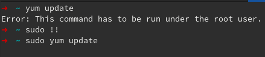
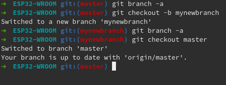
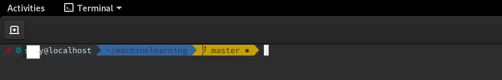
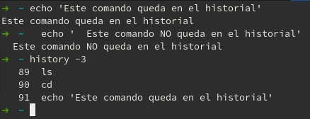

# Cheat Sheet

| **Dominio**              | **Descripción**                                              |
| ------------------------ | ------------------------------------------------------------ |
| `man <tool>`             | Abre el manual de la herramienta especificada.               |
| `<tool> -h`              | Muestra la página de ayuda de la herramienta.                |
| `apropos <keyword>`      | Busca en las páginas del manual instancias de una palabra determinada. |
| `cat`                    | Concatenar e imprimir archivos.                              |
| `whoami`                 | Muestra el nombre de usuario actual.                         |
| `id`                     | Devuelve la identidad del usuario.                           |
| `hostname`               | Establece o imprime el nombre del sistema host actual.       |
| `uname`                  | Imprime el nombre del sistema operativo.                     |
| `pwd`                    | Devuelve el nombre del directorio de trabajo actual.         |
| `ifconfig`               | Utilidad para asignar o ver una dirección de una interfaz de red y/o configurar parámetros de la interfaz de red. |
| `ip`                     | Utilidad para mostrar o manipular enrutamiento, dispositivos de red, interfaces y túneles. |
| `netstat`                | Muestra el estado de la red.                                 |
| `ss`                     | Utilidad para investigar sockets.                            |
| `ps`                     | Muestra el estado del proceso.                               |
| `who`                    | Muestra quién ha iniciado sesión.                            |
| `env`                    | Muestra el entorno o establece y ejecuta un comando.         |
| `lsblk`                  | Enumera los dispositivos de bloque.                          |
| `lsusb`                  | Enumera los dispositivos USB.                                |
| `lsof`                   | Enumera los archivos abiertos.                               |
| `lspci`                  | Enumera los dispositivos PCI.                                |
| `sudo`                   | Para ejecutar tareas con privilegios de superusuario (root), es decir, obtener permisos elevados temporalmente |
| `su`                     | Solicita las credenciales de usuario adecuadas a través de PAM y cambia a esa ID de usuario (el usuario predeterminado es el superusuario). Luego se ejecuta un shell. |
| `useradd`                | Crea un nuevo usuario o actualiza la información predeterminada del nuevo usuario. |
| `userdel`                | Elimina una cuenta de usuario y los archivos relacionados.   |
| `usermod`                | Modifica una cuenta de usuario.                              |
| `addgroup`               | Agrega un grupo al sistema.                                  |
| `delgroup`               | Elimina un grupo del sistema.                                |
| `passwd`                 | Cambia la contraseña del usuario.                            |
| `dpkg`                   | Instalar, eliminar y configurar paquetes basados en Debian.  |
| `apt`                    | Utilidad de línea de comandos de gestión de paquetes de alto nivel. |
| `aptitude`               | Alternativa a `apt`.                                         |
| `snap`                   | Instalar, eliminar y configurar paquetes snap.               |
| `gem`                    | Gestor de paquetes estándar para Ruby.                       |
| `pip`                    | Gestor de paquetes estándar para Python.                     |
| `git`                    | Utilidad de línea de comandos del sistema de control de versiones Git. |
| `systemctl`              | Administrador de control systemd y servicios basado en línea de comandos. |
| `ps`                     | Imprime una instantánea de los procesos actuales.            |
| `journalctl`             | Consultar el diario de systemd.                              |
| `kill`                   | Envía una señal a un proceso. Siendo su uso más común el finalizar o "matar" un proceso |
| `bg`                     | Pone un proceso en segundo plano.                            |
| `jobs`                   | Enumera todos los procesos que se ejecutan en segundo plano. |
| `fg`                     | Pone un proceso en primer plano.                             |
| `curl`                   | Utilidad de línea de comandos para transferir datos desde o hacia un servidor. |
| `wget`                   | Una alternativa a `curl`eso es descargar archivos desde un servidor FTP o HTTP(s). |
| `python3 -m http.server` | Inicia un servidor web Python3 en el puerto TCP 8000.        |
| `ls`                     | Enumera el contenido del directorio.                         |
| `cd`                     | Cambia el directorio.                                        |
| `clear`                  | Limpia la terminal.                                          |
| `touch`                  | Crea un archivo vacío.                                       |
| `mkdir`                  | Crea un directorio.                                          |
| `tree`                   | Enumera el contenido de un directorio de forma recursiva.    |
| `mv`                     | Mover o renombrar archivos o directorios.                    |
| `cp`                     | Copiar archivos o directorios.                               |
| `nano`                   | Editor de texto basado en terminal.                          |
| `which`                  | Devuelve la ruta a un archivo o enlace.                      |
| `find`                   | Busca archivos en una jerarquía de directorios.              |
| `updatedb`               | Actualiza la base de datos regional para los contenidos existentes en el sistema. |
| `locate`                 | Utiliza la base de datos local para buscar contenidos en el sistema. |
| `more`                   | Buscapersonas que se utiliza para leer STDOUT o archivos.    |
| `less`                   | Una alternativa `more`con más funciones.                     |
| `head`                   | Imprime las primeras diez líneas de STDOUT o de un archivo.  |
| `tail`                   | Imprime las últimas diez líneas de STDOUT o de un archivo.   |
| `sort`                   | Ordena el contenido de STDOUT o de un archivo.               |
| `grep`                   | Busca resultados específicos que contengan patrones determinados. |
| `cut`                    | Elimina secciones de cada línea de archivos.                 |
| `tr`                     | Reemplaza ciertos caracteres.                                |
| `column`                 | Utilidad basada en línea de comandos que formatea su entrada en múltiples columnas. |
| `awk`                    | Lenguaje de escaneo y procesamiento de patrones.             |
| `sed`                    | Un editor de flujo para filtrar y transformar texto.         |
| `wc`                     | Imprime nuevas líneas, palabras y bytes para una entrada determinada. |
| `chmod`                  | Cambia el permiso de un archivo o directorio.                |
| `chown`                  | Cambia el propietario y el grupo de un archivo o directorio. |

# Atajos 

------

Hay muchos atajos que podemos utilizar para que trabajar con Linux sea más fácil y rápido. Una vez que nos hayamos familiarizado con los más importantes y los hayamos convertido en un hábito, nos ahorraremos mucho tecleo. Algunas de ellas incluso nos ayudarán a evitar el uso del ratón en el terminal. 

Asumiré que ya sabes copiar y pegar texto en la terminal (`Ctrl-Shift-C` y `Ctrl-Shift-V`) y que sabes que con la *flecha hacia arriba* `[↑]`  ( *y flecha hacia abajo*  `[↓]` ) se accede a los registros del historial de comandos.

------

#### Autocompletar 

`[TAB]` - Inicia el autocompletado. Esto nos sugerirá diferentes opciones en función de la `STDIN` proporcionamos. Estas pueden ser sugerencias específicas como directorios en nuestro entorno de trabajo actual, comandos que comienzan con la misma cantidad de caracteres que ya escribimos u opciones. 

------

#### Movimiento del cursor 

`[CTRL] + A` - Mueva el cursor al inicio de la línea actual. 

`[CTRL] + E` - Mueva el cursor al final de la línea actual. 

`[CTRL] + [←]` / `[→]` - Saltar al principio de la palabra actual/anterior. 

`[ALT] + B` / `F` - Saltar hacia atrás/adelante una palabra. 

------

#### Borrar la línea actual 

`[CTRL] + U` - Borrar todo, desde la posición actual del cursor hasta el inicio de la línea. 

`[Ctrl] + K` - Borrar todo, desde la posición actual del cursor hasta el final de la línea. 

`[Ctrl] + W` - Borrar la palabra que precede a la posición del cursor. 

------

#### Pegar contenido borrado 

`[Ctrl] + Y` - Pega el texto o palabra borrada. 

------

#### Finaliza la tarea 

`[CTRL] + C` - Finaliza la tarea/proceso actual enviando la señal `SIGINT`. Por ejemplo, puede ser un análisis que ejecuta una herramienta. Si estamos observando el escaneo, podemos detenerlo o finalizar este proceso usando este acceso directo. Mientras no esté configurado y desarrollado por la herramienta que estemos utilizando. El proceso finalizará sin pedirnos confirmación. 

------

#### Fin de archivo (EOF) 

`[CTRL] + D` - Cerca `STDIN` tubería que también se conoce como fin de archivo (EOF) o fin de transmisión. 

------

#### Limpiar historial de  la terminal 

`[CTRL] + L` - Limpia el terminal. Una alternativa a este atajo es el comando `clear`  que puedes escribir para borrar nuestra terminal. 

------

#### Antecedentes de un proceso 

`[CTRL] + Z` - Suspender el proceso actual enviando el `SIGTSTP` señal. 

------

#### Buscar en el historial de comandos 

`[CTRL] + R` - Busque en el historial de comandos comandos que escribimos anteriormente y que coincidan con nuestros patrones de búsqueda. 

`[↑]` / `[↓]` - Ir al comando anterior/siguiente en el historial de comandos. 

------

#### Cambiar entre aplicaciones 

`[ALT] + [TAB]` - Cambiar entre aplicaciones abiertas. 

------

#### Zoom 

`[CTRL] + [+]` - Acercar. 

`[CTRL] + [-]` - Alejar. 

---

#### `sudo !!`

Si has escrito un comando que requería privilegios de administrador y obtienes el `error` respectivo, simplemente escribiendo `sudo !!` ejecutamos el mismo comando, esta vez con `sudo` incorporado al inicio automaticamente



---

####  `su` o `sudo -i`

Si estamos realizando instalaciones largas, que requerirán privilegios de administrador en varias líneas de comando, podemos utilizar `su` o `sudo -i` para prescindir de escribir `sudo` y la contraseña tantas veces.

---

#### `mv` y `cp` para algo más que mover y copiar archivos:

Se puede renombrar un archivo moviéndolo a la misma carpeta con

 `mv miarch1 miarch2` 

o hacer una copia del mismo pero con diferente nombre: 

`cp miarch1 miarch2`

---

#### `nano`, `vim` y `code` básico:

Dicen que el mejor sistema de seguridad de una computadora es dejar a un novato dentro de *Vim*, creo que todos hemos pasado por allí :(. Hay que dar `Esc` y luego dos puntos (`:`) y `q`. Para salir y guardar `:wq`, así como `Shift-I` para insertar texto. Para En *Nano*, guardar y salir es tan simple como `Ctrl-X` seguido de `y`, mientras que si decimos `n` sales sin guardar.

Por otro lado, si necesitas artillería pesada, puedes instalar **VisualStudio** (`code`) con:

```
vim /etc/yum.repos.d/vscode.repo

# y agregamos: 
name=Visual Studio Code
baseurl=https://packages.microsoft.com/yumrepos/vscode
enabled=1
gpgcheck=1
gpgkey=https://packages.microsoft.com/keys/microsoft.asc
```

Seguido de:

```
sudo vim /etc/yum.repos.d/vscode.repo
sudo rpm --import https://packages.microsoft.com/keys/microsoft.asc
sudo dnf install code
```

#### `Git` básico:


Imagino que ya sabes crear y clonar (`git clone`) repositorios *online*.

Un segundo paso sería saber hacer `commit` y `push` a tu repositorio en **GitHub** o **GitLab**:

```
git add .
git commit -m 'comentario'
git push origin master
```

Un tercer nivel sería crear nuevas ramas en tu repositorio con `git checkout -b mirama` y revisar en qué rama estás con `git branch -a`. Ahora podemos repetir el proceso anterior pero haciendo *push* a la nueva rama con `git push origin mirama`.

#### Plugins para `zsh` y `gi`t. 

En https://github.com/ohmyzsh/ohmyzsh encontrarás las instrucciones para instalar diferentes estilos que harán de la terminal un sitio más divertido.



O este otro estilo, más vistoso.



#### *Scripts* en `bash`:

Crear *scripts* con los comandos usados habitualmente permite acelerar muchos procesos repetitivos. Por ejemplo, para instalar tus programas favoritos:

```
nano favoriteSW.sh

#!bash
# programas base

dnf install git nano htop youtube-dl wget elinks curl \
python-pip  R macchanger nmap terminator transmission \
gimp okular vim -y

yum update -y
reboot
sudo bash scriptUpdate
```

#### `history`:

Los comandos escritos en la terminal quedan en la memoria incluso después de finalizada cada sesión. 

**Contra:** no limpiar el historial de la consola durante mucho tiempo puede ser contraproducente.

**Pros:** es posible acceder a éstos comandos mediante el comando`history`. 

Aunque en algunos casos nos interesa limpiar el historial con `history -c`. 

**Tip:** si vas a escribir alguna contraseña en texto, usa un ***doble espacio\*** para evitar que se quede guardada en el historial.

