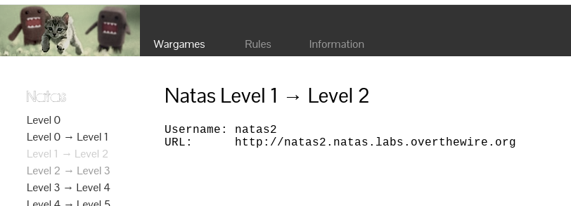
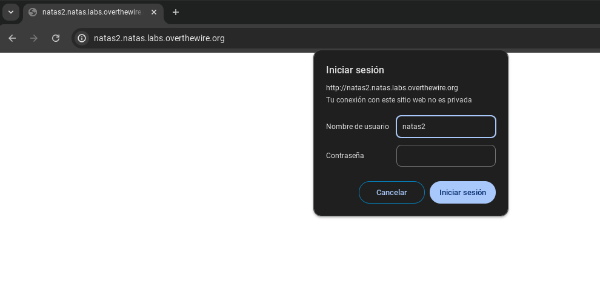
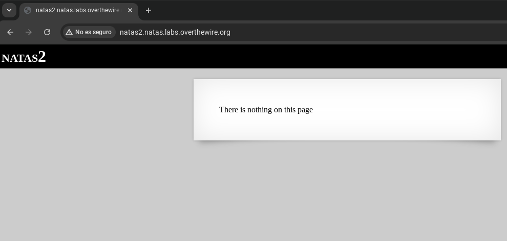
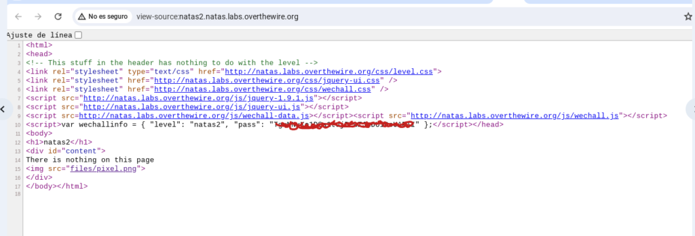
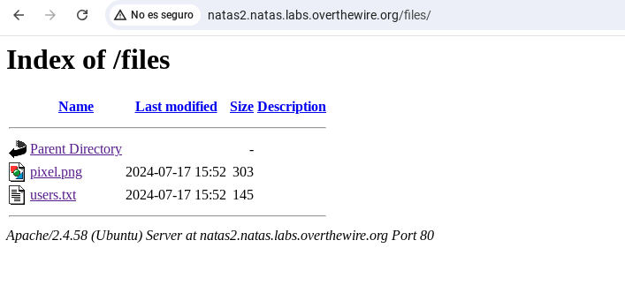

# Nikto

> Para poder hacer un test de penetración, debemos estar autorizado, o usar servidores propios.
>
> Hacer un test de intrusión de un servidor en e que no estamos autorizados puede ser considerado un delito.

[Nikto](https://cirt.net/nikto2) es un escáner de servidor web de código abierto (GPL) y de uso gratuito que realiza un **escaneo de vulnerabilidades en servidores web** en busca de múltiples elementos, incluidos archivos y programas peligrosos, y busca versiones desactualizadas del software del servidor web. También comprueba si hay **errores de configuración del servidor y las posibles vulnerabilidades** que puedan haber introducido.

El proyecto del escáner de vulnerabilidades de [Nikto](https://github.com/sullo/nikto) es un esfuerzo en rápido movimiento, actualizado con frecuencia con las últimas vulnerabilidades conocidas. Esto permite escanear tus servidores web con confianza mientras buscas posibles problemas.

Principales características:

- Nikto es de uso gratuito, de código abierto y se actualiza con frecuencia.
- Se puede utilizar para escanear cualquier servidor web (Apache, Nginx, Lighttpd, Litespeed, etc.)
- Escanea frente a más de 6700 vulnerabilidades conocidas y verificaciones de versión para más de 1250 servidores web (y sigue creciendo)
- Analiza en busca de problemas relacionados con la configuración, como directorios de índice abiertos
- Escaneo de certificados SSL
- Capacidad para escanear varios puertos en un servidor con varios servidores web en ejecución
- Opción de escanear a través de un proxy y con autenticación http
- Capacidad para especificar el tiempo máximo de escaneo, excluir ciertos tipos de escaneos y también se ven encabezados de informes inusuales.

### Instalar en Kali Linux

Kali Linux es una distribución de Linux muy usada para pruebas y análisis de seguridad y  tests de penetración - *pentesting*-. Y agregar el escáner de vulnerabilidades Nikto a su conjunto de herramientas de análisis de seguridad en Kali Linux se puede lograr con solo un par de comandos, como se muestra a continuación.

Primero, actualiza tus listas de paquetes APT e instala las actualizaciones pendientes:

&rarr; `sudo apt-get update && sudo apt-get upgrade`

A continuación, instala el escáner web Nikto con el comando:

&rarr; `sudo apt-get install nikto -y`

Para verificar que el escáner de vulnerabilidades del sitio web de Nikto está instalado y listo para usar, ejecutz el comando:

&rarr; `nikto`

Lo que debería darte una salida similar que enumera la versión de Nikto instalada:

&rarr; `root@home:~# nikto`
&rarr; `– Nikto v2.1.5`

## [Escaneo de vulnerabilidades](https://github.com/sullo/nikto/wiki)

### Ejecución de un escaneo básico de sitios web

La forma más básica de escanear un host con Nikto es usar la bandera `-h`:

&rarr; `nikto -h example.com`

Nikto realiza un análisis en profundidad del servidor web y puede tardar mucho en finalizar debido a la cantidad de vulnerabilidades que Nikto comprueba. Si se ejecuta el escáner Nikto desde una máquina remota, mejor hacerlo en una sesión de «pantalla».

### Escanear un sitio web con SSL

Nikto también tiene un modo de escáner SSL, para certificados SSL instalados en un sitio web. Con esto puede obtener el cifrado SSL y la información del emisor.

Para ejecutar un análisis SSL del sitio web, ejecuta:

&rarr; `nikto -h example.com -ssl`

Como se vio anteriormente, al escanear con la opción `-ssl` habilitada, podemos encontrar más vulnerabilidades y errores de configuración presentes en el servidor web que acabamos de escanear en comparación con el escaneo *no ssl*. Esto se observa a menudo con servidores web mal configurados, que rápidamente incluyen soporte SSL.

Por lo tanto, escanear tanto `http` como `https` es vital para obtener una imagen completa de las vulnerabilidades presentes en la configuración de un servidor web.

### Escaneo de una aplicación web en un puerto no estandar

En ciertas implementaciones, los servidores web se ejecutan en puertos no estándar como 8081 o 8080, o se ejecutan varios servidores web en el mismo host en diferentes puertos de red. Por lo tanto, es vital tener la capacidad de escanear puertos específicos, así como los puertos principales 80 y 443.

Esto se puede lograr ejecutando el comando:

&rarr; `nikto -h example.com -port 8083`

Reemplaza example.com con el host o IP que deseas escanear y 8083 con el puerto que deseas escanear.

### Escaneo con de una aplicación web que requiere autenticación

Las aplicaciones web corren en el puerto tcp 80 para http y en el tcp 443 para https, pero algunas aplicaciones web están levantadas en puertos no estandar, como por ejemplo tcp 8080, 8081, etc.

Para decir a nikto que analice estos puertos se usa el parámetro **-port**.

&rarr; `nikto -h natas2.natas.labs.overthewire.org -id natas2:<contraseña aquí>`

### Almacenar el resultado en un archivo

El escáner Nikto también incluye la capacidad de guardar la salida del escaneo en un archivo para referencia futura. Esto es útil cuando se ejecutan múltiples escaneos y/o escaneos muy extensos para poder analizarlos detenidamente, o poder compararlos con otras ejecuciones posteriores.

Esto se logra ejecutando el parámetro `-output`  seguido de la ruta del archivo de salida:

&rarr; `nikto -h example.com -output /path/to/file.txt`

### Escaneo a través de un proxy de red

Es posible que algunos sitios web solo estén disponibles a través de un proxy de red o una IP específica, y esta función le permite a Nikto escanear el sitio web a través de esa dirección de proxy también:

&rarr; `nikto -h example.com -useproxy proxy.ip.address.here`

### Escaneo de sitios web que requieren autenticación

Nikto también incluye la capacidad de escanear sitios web que están protegidos por autenticación http:

&rarr; `nikto -h example.com -id username:password`

### Ignora ciertos códigos HTTP

Al ejecutar un escaneo de servidor web con Nikto, es importante ignorar ciertos códigos HTTP, como las redirecciones 301, para evitar que el escaneo escanee objetos innecesarios. En tal escenario, podemos usar la bandera -IgnoreCode:

&rarr; `nikto -h example.com -IgnoreCode 301`

### Tiempo máximo de escaneo

Al escanear un servidor web para un sitio web grande, es posible que obtengamos una gran cantidad de resultados que pueden llevar horas recopilar y analizar. En este escenario, a menudo es mejor limitar el análisis a unos pocos minutos o segundos para recopilar información, resolver los errores o vulnerabilidades notificados y luego volver a intentar el análisis para encontrar el siguiente conjunto de errores o vulnerabilidades. Nikto lo hace posible con el indicador -maxtime, que toma la entrada en número de segundos:

&rarr; `nikto -h example.com -maxtime number.of.seconds`

### Deshabilitar la caché de respuesta

Los servidores web modernos suelen almacenar en caché los sitios web para ahorrar en el rendimiento de la CPU y para servir sitios web más rápidamente. Esta es la razón por la que es posible obtener una versión «almacenada en caché» del sitio web al intentar un escaneo.

Es posible que este sitio web almacenado en caché no tenga todas las vulnerabilidades presentes, o aún puede tener vulnerabilidades presentes que se almacenaron en caché, por lo que es importante vaciar el caché y usar la marca -nocache para escanear una versión no almacenada en caché del sitio web.

&rarr; `nikto -h example.com -nocache`

### Actualización de Nikto

Mantener una base de datos actualizada o una lista de vulnerabilidades para verificar es muy importante. Con nuevas vulnerabilidades descubiertas casi todos los días, es crucial mantener Nikto actualizado con las últimas vulnerabilidades para verificar cada vez que ejecute un escaneo.

La actualización de Nikto se logra ejecutando el comando:

&rarr; `nikto -update`

## Defender o atacar

Si estás trabajando en el lado defensivo, ahora conoces algunas de tus vulnerabilidades (recuerda que Nikto solo se enfoca en el lado del servidor web). Toma medidas protegiendo las áreas débiles y expuestas de tu superficie pública, actualiza los scripts si es necesario, configura nuevos métodos de autenticación, reconfigura tus certificados SSL, deshabilita todos sus cifrados débiles y más.

Y si eres parte del equipo rojo, probablemente irás directamente a las técnicas de prueba para explotar estas vulnerabilidades y buscar diferentes vectores de ataque. En ambos casos, usar Nikto es solo el comienzo: la verdadera diversión comienza después de obtener los resultados del escaneo.

## Nikto vs. Nmap

Nmap es una de las herramientas más conocidas para el escaneo de puertos. Te permite saber el estado del puerto en un dispositivo, si hay puertos filtrados, cerrados o abiertos. Y junto con su efectividad para verificar en un servidor web, Nmap también puede verificar vulnerabilidades conocidas en puertos/servicios que se ejecutan en una máquina.

Si bien el escáner de vulnrabilidades de Nikto es un escáner de extremo a extremo solo para el servidor web, escanea el servidor web y verifica las vulnerabilidades conocidas y te informa de inmediato sobre las posibles implicaciones de seguridad de cualquier vulnerabilidad que encuentre allí.

No puede escanear ni verificar otros puertos además de los que usa el servidor web, comúnmente el puerto 80 (no SSL) y 443 (SSL).

## Nikto vs. Nessus

Nessus es una herramienta de escaneo de seguridad remota, que escanea una computadora en busca de vulnerabilidades. Nessus no se limita a escanear servidores web únicamente. Escanea todos los puertos de la máquina para encontrar vulnerabilidades para cualquier software que la máquina esté ejecutando.

Nikto, por otro lado, es una herramienta para escanear vulnerabilidades en el lado del servidor web y archivos en servidores web únicamente. Nikto es más eficaz para encontrar vulnerabilidades en el servidor web, en lugar de en otros servicios que se ejecutan en diferentes puertos de la máquina.

### Ventajas

Una de las mejores cosas de Nikto es que puedes exportar información a un formato que Metasploit pueda leer cuando esté escaneando. Para hacer eso, simplemente usa los comandos anteriores para escanear, pero agrega `-Format msf +` al final. El formato nos permitirá emparejar datos rápidamente con un exploit armado.

Se trata de escanear el sitio web objetivo en busca de vulnerabilidades, desde identificar primero la superficie atacante y luego buscar esas vulnerabilidades que se pueden usar como un exploit armado.

Como esta herramienta no es sigilosa, se recomienda que utilices esta herramienta con una VPN o mediante un navegador TOR para ser anónimo y proteger tu identidad.

Para resumir nuestra experiencia con el escáner de vulnerabilidades Nikto, podemos decir con seguridad que agregar esta herramienta al conjunto de herramientas de análisis de seguridad es imprescindible para escanear servidores web. La fácil instalación de Nikto en una variedad de plataformas de múltiples formas es otra gran ventaja, ya que permite la integración en su conjunto de herramientas existente sin mucho esfuerzo.

Nikto también sigue siendo una herramienta formidable para averiguar todo lo que puedas sobre tu servidor web, desde la información del certificado SSL hasta las vulnerabilidades de seguridad en el software del servidor web, y también para encontrar archivos peligrosos en tu servidor web.

## Ejemplo completo de uso de Nikto

Para mostrar este ejemplo vamos a usar una aplicación web de laboratorio de ciberseguridad en concreto esta de OverTheWire:

https://overthewire.org/wargames/natas/natas2.html

Resolvemos los niveles 0 y 1 que son muy fáciles y nos proporcionan una contraseña para conectarnos al nivel 2.

Ponemos las credenciales y tenemos esta aplicación web:

Pulsamos Ctrl-U para ver en el código fuente de la página y como indica el mensaje, vemos las credenciales del nivel 2 pero tenemos que conseguir las del nivel 3 usuario natas3

Ahora es cuando usamos nikto contra esta aplicación.

Entramos en el directorio /files

y vemos que tiene dos archivos, el archivo `users.txt` tiene las credenciales.

## Conclusión

Nikto es una herramienta ideal para un análisis rápido de una aplicación web, nos va a informar archivos, directorios interesantes a la hora de hacer un test de intrusión y posibles problemas de seguridad de la aplicación web.

Es interesante para un primer análisis inicial rápido, luego para profundizar en el estudio de la seguridad de la aplicación podemos usar otras heramientas más precisas pero que requieren más esfuerzo como OWASP ZAP.

---

ref: 

- https://ciberseguridad.com/herramientas/software/nikto/
- https://ciberseguridadmax.com/nikto/