# Reon-ng

Reon-ng es una herramienta de tipo OSINT, desarrollada en Python que permite automatizar tareas de reconocimiento y recolección de información desde múltiples fuentes.

Recon-ng tiene una apariencia similar al framework [Metasploit](https://www.metasploit.com/), lo que reducirá la curva de aprendizaje si ya conoces dicha herramienta.

Entre las ventajas de Recon-ng cabe destacar que la que la información que recopila se almacena en una base de datos, lo que permite la realización de consultas y reportes.

## Instalación

- Desde el repositorio de Github con el comando:

  `sudo apt install recon-ng -y`

- Clonando el repositorio de con la última versión de código:

  -  Asegúrate de tener git y pip instalados:

  ```bash
  sudo apt update -y && sudo apt dist-upgrade -y
  sudo apt install git python3-pip -y
  ```

  - Luego clona el repositorio e instala el frmawork:

  ```bash
  sudo git clone https://github.com/lanmaster53/recon-ng.git
  cd recon-ng
  sudo pip install -r REQUIREMENTS
  ```
## Usar Recon-ng

Si has optado por el primer modo de instalación, para ejecutar el programa basta usar el comando:

``sudo recon-ng``

Si lo has instalado clonando el repositorio de Github, desde la carpeta donde se ha clonado recon-ng, ejecuta:

`sudo ./recon-ng`

### Interface y comandos básicos

Podemos acceder a la ayuda del marco de trabajo con el comando: 

``help``

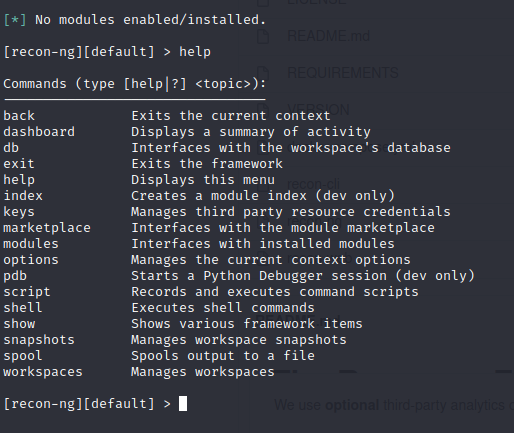

Con `help`, listamos todos los comandos que podemos correr dentro de recon-ng.

## Espacios de trabajo

Recon-ng permite la posibilidad de trabajar con workspaces, espacios de trabajo, para poder compartimentar la información obtenida a modo de resultados y que no se mezcle con otra.

Por defecto ``recon-ng`` crea un workspace llamado “default”. Podemos saber en qué workspace estamos trabajando, si miramos el prompt de la consola, que nos muestra el nombre del espacio de trabajo en el que nos encontramos:


Para saber cómo usar los worksapces, basta con correr el comando ``worksapces``. Y Recon-ng nos muetra para qué sirve el comamdo y las opciones que podemos usar con él.


<h4 class="wp-block-heading">Listar workspaces</h4>

``workspaces list``


<h4 class="wp-block-heading">Crear workspaces</h4>

``workspaces create [NombreWorkspace]``
``workspaces create NoSoloHacking``


<p>Cuando creamos el workspace, automáticamente, nos situa en ese workspace y podemos identificarlo porque el prompt a cambiado de default a NoSoloHacking.</p>

#### Cambiando de workspace

A menudo, nos interesará cambiar de espacio de trabajo - workspace- para consultar información.

``workspaces load [NombreWorkspace]``
``workspaces load default``

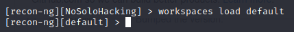

#### Borrar un workspace

Cuando no nos interese mantener guardado un workspace, podemos borrarlo:

``workspaces remove [NombreWorkspace]``
``workspace remove NoSoloHacking``

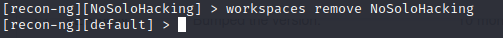

## Trabajando con la Base de datos

Podemos trabajar con una base de datos para guardar toda la información y poder consultarla más tarde.  
Para poder ver todos los comandos con los que podemos trabajar en la base de datos, hacemos lo mismo que con workspaces, ejecutar:``db``


#### Guardar la información
Para ver las tablas de las base de datos, podemos correr el comando:
``db schema``


 #### Borrando información de la base de datos
Si necesitamos borrar información almacenada en la base de datos, basta con ejecutar:
``db delete [información a borrar]``

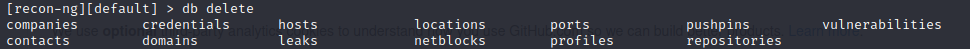


## Uso de claves de 3rd parties

En Recon-ng también podemos cargar claves de servicios externos como Shodan. Para ello usaremos el comando: `keys`


#### Listar claves

Para saber todas las claves que tenemos operativas:

`keys list`

#### Agregando claves

Para agregar, por ejemplo, la clave API de Shodan, ejecutaremos:

`keys add shodan_api [API de Shodan]`

## Recuperar y mostrar la información almacenada

Para poder ver una parte de la información recolectada, como dominio, credenciales, hosts,... basta con usar el comando ``show`` y señalar aquello que queremos ver.

```bash
show [información]
show hosts
show domains
show credentials
```
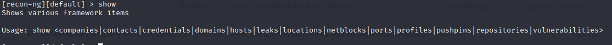


## Creando snapshots

Recon-ng permite crear instantáneas o snapshots, que pueden servir para conservar los dustintos espacios de trabajo - wokspaces-, para lo que podemos usar el comando:

`snapshot`

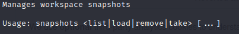

#### Crear snapshot

``snapshots take``

#### Borrar snapshots

`snapshots remove [nombre snapshot]`

<h4 class="wp-block-heading">Listar Snapshots</h4>

``snapshots list``

#### Cargar snapshot

``snapshot load [nombre snapshot]``

## ...

---

ref: https://www.youtube.com/embed/l229O4ZUFa4

---

## Módulos marketplace

Los módulos son pequeñas herramientas que se pueden descargar del Marketplace y poder utilizarlas para automatizar tareas de recolección de información desde fuentes Open Source.

Para saber qué módulos podemos usar ejecutaremos el comando ``modules``

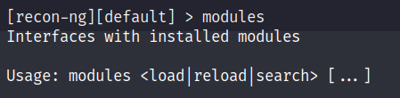

Si queremos cargar un módulo deberíamos correr el comando:
``modules load [nombre del módulo]``

Si necesitamos buscar un módulo que tengamos instalado,&nbsp; tenemos que correr el comando ``modules search [nombre módulo]``

Pero como sabemos el nombre del módulo?&nbsp; para eso está nuestro Marketplace,&nbsp; que ya comentábamos que era una especie repositorio con los módulos y las versiones que podíamos instalar.

## Marketplace

Para conocer la sintaxis del comando Marketplace basta con ejecutar el comando `marketplace`


#### Buscar módulos

Para listar todos los módulos disponibles en el Marketplace, necesitamos correr el comando:

``marketplace search``


El resultado es una tabla donde se  listan todos los módulos disponibles seguidos de a una pequeña información adicional sobre las caracteristicas decada uno:

- **Path**: Ruta o nombre del módulo
- **Versión**: Versión del módulo
- **Status**: Muestra lo hemos instalado o no
- **Updated**: Fecha de la última actualización
- **D**: Señala si el módulo tiene o no dependencias
- **K**: Claves de terceros que tendremos que proporcionar para poder correr el módulo

#### Buscar por cadena detalle

Para hacer una búsqueda más acotada o algo más concreto usaremos el comando de busqueda seguido de la cadena deseada:

``marketplace search [keyword]``
``marketplace search credentials``

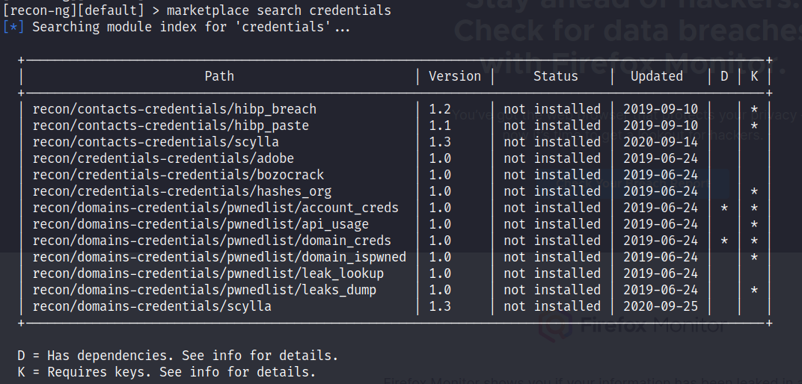

#### Instalar módulos

Para instalar alguno de los módulos disponibles en el Marketplace, basta con ejecutar el comando

``marketplace install [path]``

`marketplace install recon/companies-domains/pen`


El error que se muestra nos indica que debemos cargar en nuestras keys, la key que se va a generar al darnos de alta en la web <a href="https://hashes.org">https://hashes.org</a>

`Error: [!] 'hashes_api' key not set. hashes_org module will likely fail at runtime. See 'keys add'. `

Una vez nos demos de alta, podremos acceder a Account Setting, y obtener nuestra clave:


Podremos añadir nuestra clave con el comando:

 `keys add hashes_api [api]`

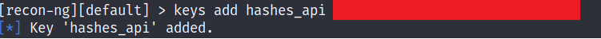

e instalar definitivamente el módulo con el comando:

`marketplace install recon/companies-domains/pen`

El mensaje de error no aparecerá

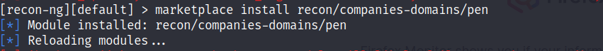

#### Usando un módulo
Una vez cargada la clave e con el  módulo ya instalado pdremos cargarlos y usarlos con el comando: ``modules load [módulo]``
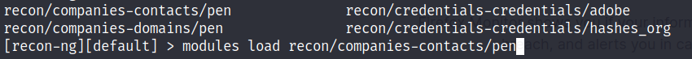

Una vez cargado, el prompt de la consola cambia y nos muestra  en qué workspace y módulo estamos trabajando:


## Usar un módulo

Una vez tenemos cargado el módulo, tenemos que consultar la ayuda para ese módulo. Para consultar la ayuda ejecutamos el comando: `info``


Esto nos despliega información de quién lo ha desarrollado, la versión, descripción, cómo se usa y las opciones.

#### Ajustar valores del módulo
Para cambiar los valores del módulo, debemos ejecutar el comando ``options``


#### Listar los valores que podemos definir
``options list``

#### Definir un valor
Para especificar un valor usamos el comando `set` y para quitarlo `unset`
``options set [campo] [valor]``  
``options set SOURCE nosolohacking.info``

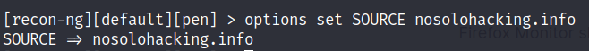

#### Quitar un valor
``options unset SOURCE nosolohacking.info``


#### Ejecutar un módulo

Podemos ejecutar un módulo con el comando: ``run``


#### Salir de un módulo
Para dejar de usar un módulo basta con ejecutar el comando: ``back``


## [+](https://www.nosolohacking.info/recon-ng-parte4-administrando-api-keys)
