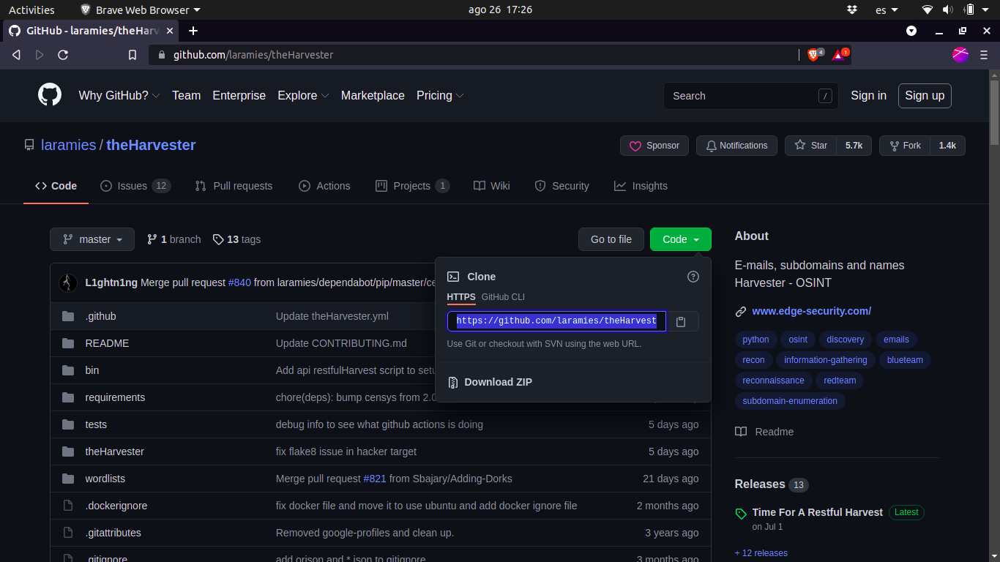

# theHarvester

El proceso de recopilación de información que los hackers o piratas informáticos utilizan para obtener datos sobre una empresa o entidad objetivo antes de llevar a cabo un ataque es conocido como **"reconocimiento"** o **"OSINT"** (Open Source Intelligence). Esta actividad se enfoca tanto en aspectos técnicos, como nombres de dominio y direcciones IP, como en información personal, como nombres de empleados y sus correos electrónicos.

Una de las herramientas usada habitualmente para tareas de reconocimiento es **theHarvester**.

**theHarvester** es una herramienta de código abierto diseñada específicamente para llevar a cabo este tipo de recopilación de información de manera automatizada. A continuación, detallo cómo se relaciona con los puntos mencionados en el texto:

1. **Recopilación de datos técnicos**: theHarvester puede utilizarse para obtener información técnica como nombres de dominio, subdominios, direcciones IP, y nombres de host asociados con la empresa objetivo. Esto es directamente mencionado en el texto cuando se habla de la obtención de "rangos de direcciones IP" y "nombres de host".

2. **Obtención de información personal**: theHarvester también es capaz de recopilar información sobre el capital humano de la empresa, como correos electrónicos y perfiles en redes sociales. El texto menciona cómo se pueden obtener "nombres de sus trabajadores y/o ejecutivos" y "sus correos electrónicos", lo que es una de las funciones clave de theHarvester.

3. **Uso de múltiples fuentes de información**: Una de las ventajas de theHarvester es su capacidad para realizar búsquedas en diversas fuentes de información simultáneamente, como motores de búsqueda, redes sociales, y bases de datos públicas. Esto optimiza el tiempo y esfuerzo, tal como se menciona en el texto, permitiendo al usuario obtener en minutos lo que podría tomar horas o días si se hiciera manualmente.

4. **Facilidad de uso**: Finalmente, el texto menciona la intención de aprender a utilizar theHarvester de manera básica para encontrar información de manera sencilla. Esto refleja la naturaleza accesible y fácil de usar de theHarvester, que permite a los usuarios, incluso aquellos con poca experiencia, realizar tareas de reconocimiento eficientemente.

En resumen, theHarvester es una herramienta esencial para la recopilación automatizada de información en el contexto descrito en el texto, facilitando el acceso a datos técnicos y personales sobre una empresa, lo que podría ser utilizado en fases posteriores de un ataque.

## Como instalar theHarvester

1. **Atualizar los paquetes del sistema operativo con el comando**:

​     `sudo apt-get update`

2. Descargar las actualizaciones de los paquetes desde nuestros repositorios con: 

   `sudo apt-get upgrade`

3. **Ir al siguiente enlace para descargar el programa:**

   `https://github.com/laramies/theHarvester`

4. **Hacer clic en el botón verde *Code* y copiar el link que se muestra a continuación:**

   

   *En caso de no tener instalado git usar el comando:* `sudo apt-get install git`

5. **Clonar el reposito:**

   `git clone https://github.com/laramies/theHarvester.git`

6. **Verificar que tenemos instalado la versión 3 de Python:**

   `python3 --version`

7. **Instalar paquetes y librerías de Python necesarios para que el programa se ejecute correctamente:**

   `sudo apt-get install python3-pip`

8. **Ir a la carpeta theHarvester/requeriments:**

   `cd theHarvester/requeriments`

9. **Instalar los archivos alojados en esta carpeta:**

   `python3 -m pip install -r base.txt`

10. **Regresar al directorio theHarvester.**

    `cd ..`

## Uso básico

1. `python3 theHarvester -h`

   Los parámetros principales que se suelen usar en theHarvester son:

   - **-d:** Para ingresar el nombre del dominio de la empresa a investigar
   - **-l:** Para limitar la cantidad de resultados a mostrar(por defecto se muestran 500)
   - **-b:** Elegir el o los buscadores
   - **-f:** Generar reportes con los resultados encontrados. Esto genera dos archivos: uno en formato xml y el otro en formato html.

---

_ref.: https://www.kolibers.com/blog/theHarvester.html#_