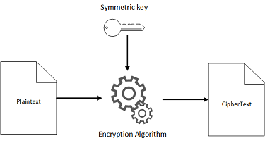

## ¿Qué es la criptografía?

La criptografía es una práctica que consiste en proteger información mediante el uso de algoritmos codificados, hashes y firmas. La información puede estar en reposo (como un archivo ubicado en un disco duro), en tránsito (una comunicación electrónica intercambiada entre dos o más partes) o en uso (mientras se ejecutan operaciones de computación con los datos). La criptografía tiene cuatro objetivos principales:

- **Confidencialidad**: poner la información únicamente a disposición de usuarios autorizados.
- **Integridad**: asegurar que la información no se ha manipulado.
- **Autenticación**: confirmar la autenticidad de la información o de la identidad de un usuario.
- **No repudio**: evitar que un usuario deniegue compromisos o acciones previas.

La criptografía utiliza varios algoritmos criptográficos de bajo nivel para lograr uno o más de dichos objetivos de seguridad de la información. Estas herramientas incluyen algoritmos de cifrado, algoritmos de firma digital, algoritmos de hash y otras funciones. En esta página se describirán varios de los algoritmos criptográficos de bajo nivel más utilizados.

## ¿Para qué se utiliza la criptografía?

La criptografía tiene sus raíces en el envío de información sensible entre militares y políticos. Los mensajes podían encriptarse para que parecieran texto aleatorio a cualquiera que no fuera el destinatario.

Hoy en día, las técnicas originales de encriptación no funcionan. Tanto es así que solo se encuentran en las secciones de enigmas de algunos periódicos. Afortunadamente, el campo ha hecho grandes avances en materia de seguridad, y los algoritmos que se utilizan hoy en día se basan en un análisis riguroso y en las matemáticas para su seguridad.

A medida que la seguridad avanza, el campo de la criptografía se amplía para incluir una gama más amplia de objetivos de seguridad. Entre ellos se encuentran la autenticación de mensajes, integridad de los datos, cálculo seguro, etc.

La criptografía está en la base de la sociedad moderna. Es la base de innumerables aplicaciones de Internet a través del protocolo seguro de transferencia de hipertexto (HTTPS), de la comunicación segura de texto y voz, e incluso de las monedas digitales.

## ¿Qué es el cifrado?

Un *algoritmo de cifrado* es un procedimiento que convierte un mensaje de texto plano en un texto cifrado. Los algoritmos modernos utilizan matemáticas avanzadas y una o varias claves de cifrado. Esto hace que sea relativamente fácil cifrar un mensaje, pero prácticamente imposible descifrarlo sin conocer las claves.

Las técnicas de cifrado se dividen en dos categorías, simétricas y asimétricas, según el funcionamiento de sus claves.

## ¿Qué es la criptografía de clave simétrica?

Los algoritmos criptográficos de clave simétrica utilizan las mismas claves criptográficas tanto para el cifrado del texto plano como para el descifrado del texto cifrado. El cifrado simétrico requiere que todos los destinatarios del mensaje tengan acceso a una clave compartida.

Las siguientes ilustraciones muestran cómo funcionan el cifrado y descifrado con claves y algoritmos simétricos, partiendo de la base de que todas las partes comparten la misma clave.

En la primera ilustración, se utilizan una clave simétrica y un algoritmo para convertir un mensaje de texto plano en texto cifrado. La segunda ilustración muestra la misma clave secreta y el mismo algoritmo simétrico utilizados para convertir el texto cifrado en texto plano.        

  

Uno de los cifrados por bloques más populares es el [estándar de cifrado avanzado](https://en.wikipedia.org/wiki/Advanced_Encryption_Standard) (AES). Este cifrado en bloque admite claves de 128, 192 o 256 bits. AES se combina a menudo con [Galois/Counter Mode](https://en.wikipedia.org/wiki/Galois/Counter_Mode) (GCM) y se conoce como AES-GCM para hacer un algoritmo de cifrado autenticado.

AES es el estándar del sector para el cifrado efectuado en todo el mundo. Su seguridad es muy conocida y existen despliegues eficientes de software y hardware.

## ¿Qué es la criptografía asimétrica (de clave pública)?

###  

La criptografía *asimétrica (o de clave pública)* consiste en un amplio conjunto de algoritmos. Estos se basan en problemas matemáticos que son relativamente fáciles de hacer en una dirección, pero que no se pueden invertir fácilmente.

Un ejemplo famoso de este tipo de problema es el de la factorización: para números primos cuidadosamente elegidos *p* y *q*, podemos calcular el producto *N=p\*q* rápidamente. Sin embargo, si solo se da *N*, es muy difícil recuperar *p* y *q*.

Un algoritmo criptográfico de clave pública común basado en el problema de la factorización es la [función Rivest-Shamir-Adleman (RSA)](https://en.wikipedia.org/wiki/RSA_(cryptosystem)). Si se combina con un esquema de relleno adecuado, RSA puede utilizarse para múltiples propósitos, incluido el cifrado asimétrico.

Un esquema de cifrado se denomina asimétrico si utiliza una clave (la clave pública) para cifrar los datos, y una clave diferente pero matemáticamente relacionada (la clave privada) para descifrarlos.

Determinar la clave privada debe ser inviable desde el punto de vista informático si lo único que se conoce es la clave pública. Por ello, la clave pública puede distribuirse ampliamente mientras que la clave privada se mantiene secreta y segura. El conjunto de las claves se denomina par de claves.

Un esquema de cifrado asimétrico popular es RSA-OAEP, que es una combinación de la función RSA con el esquema de relleno [Optimal Asymmetric Encryption Padding](https://en.wikipedia.org/wiki/Optimal_asymmetric_encryption_padding) (OAEP). RSA-OAEP se suele utilizar solo para cifrar pequeñas cantidades de datos, ya que es un esquema lento y los textos cifrados son mucho más grandes que el texto plano.

## ¿Qué es el cifrado híbrido?

Dado que los algoritmos de clave pública como RSA-OAEP son menos eficientes que sus homólogos simétricos, no suelen utilizarse para cifrar directamente los datos. Sin embargo, desempeñan un papel importante en el ecosistema criptográfico al proporcionar un medio para el intercambio de claves.

Para utilizar el cifrado simétrico, las partes deben compartir una clave. Aunque esta clave podría enviarse a través de un canal cifrado existente, no necesitaríamos una nueva clave si ya tuviéramos un canal seguro. En su lugar, resolvemos el problema del intercambio de claves mediante la criptografía de clave pública.

Estos son dos métodos comunes para intercambiar claves simétricas.

- **Cifrado asimétrico**. Una de las partes genera una clave simétrica y la cifra mediante un algoritmo como RSA-OAEP con la clave pública de otra parte. El destinatario puede descifrar el texto cifrado con su clave privada para recuperar la clave simétrica.
- **Intercambio de claves Diffie-Hellman**: (DH). Diffie-Hellman es un tipo diferente de algoritmo criptográfico de clave pública diseñado específicamente para ayudar a las partes a acordar una clave simétrica en ausencia de un canal seguro. Diffie-Hellman se basa en un problema matemático diferente al de la función RSA y es menos flexible que esta. Sin embargo, tiene estructuras más eficientes, lo que lo hace más recomendable en algunos casos de uso.

Esta combinación de criptografía de clave pública para el intercambio de claves y el cifrado simétrico para el cifrado de datos en masa se conoce como cifrado híbrido*.*

El cifrado híbrido utiliza las propiedades únicas de la criptografía de clave pública para intercambiar información secreta a través de un canal no fiable con la eficacia del cifrado simétrico. Así, se consigue una solución práctica de extremo a extremo para la privacidad de los datos.

El cifrado híbrido se utiliza de manera generalizada en los protocolos de transferencia de datos para la web, como en la seguridad de la capa de transporte (TLS). Cuando se conecta a un sitio web que utiliza HTTPS (HTTP seguro con TLS), el navegador negociará los algoritmos criptográficos que aseguran la conexión. Estos incluyen algoritmos para el intercambio de claves, cifrado simétrico y firmas digitales.

## ¿Qué es una firma digital?

Los esquemas de firma digital son un tipo de criptografía de clave pública que garantiza la integridad, autenticidad y no repudio de los datos.

El proceso de firma puede considerarse como el cifrado del archivo mediante la clave privada. Para ello, la persona que firma utiliza su clave privada para producir una “firma” en un documento digital, como un archivo o un fragmento de código.

Esta firma es única para el par documento/clave privada, y puede adjuntarse al documento y verificarse con la clave pública de la persona que firma. Dos algoritmos comunes para las firmas digitales son RSA con el [esquema de firma probabilística](https://en.wikipedia.org/wiki/Probabilistic_signature_scheme) (RSA-PSS) y [algoritmo de firma digital](https://en.wikipedia.org/wiki/Digital_Signature_Algorithm) (DSA).

## ¿Qué es un código de autenticación de mensajes?

Un código de autenticación de mensajes (MAC) es la versión simétrica de una firma digital. Con un MAC, dos o más partes comparten una clave. Una parte crea una etiqueta de MAC, que es la versión simétrica de una firma digital, y la adjunta al documento. Otra parte puede verificar la integridad del mensaje mediante la misma clave que se utiliza para crear la etiqueta.

Tenga en cuenta que varias partes comparten la clave utilizada para crear etiquetas de MAC, por lo que los MAC no pueden utilizarse para la autenticación o el no repudio, ya que no está claro qué parte creó la etiqueta.

Los MAC pueden ser algoritmos independientes, como [código de autenticación de mensajes basado en hash](https://en.wikipedia.org/wiki/HMAC) (HMAC). Sin embargo, dado que la integridad de los mensajes es casi siempre una garantía valiosa, suele integrarse en algoritmos de cifrado simétrico como AES-GCM.

## ¿Qué es el hash en criptografía?

Una función hash criptográfica es una herramienta para convertir datos arbitrarios en una “huella digital” de longitud fija. Las funciones hash están diseñadas para que sea difícil encontrar dos entradas diferentes que tengan la misma huella digital, y es difícil encontrar un mensaje cuya huella digital coincida con un valor fijo.

A diferencia de los esquemas de cifrado, los esquemas de firma y los MAC, las funciones hash no tienen una clave. Cualquiera puede calcular el hash de una entrada dada y la función hash siempre producirá la misma salida con la misma entrada.

Las funciones hash son un componente importante de los algoritmos y protocolos criptográficos más amplios. Entre ellos se encuentran los algoritmos de firma digital, algoritmos MAC específicos, protocolos de autenticación y almacenamiento de contraseñas.

## ¿Qué es la criptografía de curva elíptica?

La criptografía de curva elíptica (ECC) es una técnica de criptografía de clave pública basada en la teoría matemática de las curvas elípticas.

La mayor ventaja de ECC es que puede proporcionar un nivel de protección similar al de las técnicas más tradicionales, pero con claves más pequeñas y operaciones más rápidas. La eficiencia de ECC hace que sea una solución muy adecuada para su uso en dispositivos con una potencia de cálculo relativamente baja, como los celulares.

ECC se puede utilizar para el intercambio eficiente de claves mediante una variante de curva elíptica de Diffie-Hellman (ECDH) o para las firmas digitales mediante el algoritmo de firma digital de curva elíptica (ECDSA). Debido a su velocidad y flexibilidad, ECC se utiliza ampliamente en muchas aplicaciones de Internet.

## ¿Qué es una criptomoneda?

La criptomoneda es una moneda digital en la que un sistema descentralizado, y no una autoridad centralizada, verifica las transacciones y mantiene los registros. La criptomoneda es un ejemplo de aplicación de la criptografía.

La criptomoneda utiliza muchos algoritmos criptográficos de bajo nivel diferentes para crear una plataforma segura y de confianza. La criptomoneda utiliza muchos de los conceptos presentados en esta página: criptografía de curva elíptica, firmas digitales, funciones hash y muchos más. En conjunto, estos algoritmos permiten crear confianza y responsabilidad sin una autoridad centralizada.

## ¿Qué es la criptografía postcuántica?

En las últimas décadas, se hicieron importantes inversiones en computación cuántica. Las computadoras cuánticas utilizan la física cuántica y pueden resolver problemas matemáticos, como el problema de la factorización, que son inviables desde el punto de vista de la computación para las computadoras clásicas.

Una computadora cuántica a gran escala interrumpiría los criptosistemas de clave pública que utilizamos hoy en día, incluidos los criptosistemas basados en las funciones Rivest-Shamir-Adleman (RSA). Una interrupción de estos algoritmos supondría la pérdida de confidencialidad y autenticación de muchas de las aplicaciones y protocolos que utilizamos hoy en día.

Aunque en la actualidad día existen pequeños computadoras cuánticas, son demasiado pequeños para interrumpir los algoritmos criptográficos. No se sabe si una computadora cuántica criptográficamente relevante (CRQC) estará disponible o cuándo lo estará. Se necesitan importantes avances científicos para desarrollar un CRQC.

La criptografía postcuántica (PQC) se refiere a los algoritmos criptográficos que funcionan en las computadoras que utilizamos hoy en día, y que no se sabe si son vulnerables frente a una computadora cuántica a gran escala.

Para obtener más información sobre la participación en investigación e ingeniería de AWS en proyectos de criptografía resistente a la tecnología cuántica y grupos de trabajo con la comunidad criptográfica global, consulte [AWS Post-Quantum Cryptography.](https://aws.amazon.com/security/post-quantum-cryptography/)

## ¿Qué es la computación criptográfica?

Las herramientas presentadas hasta ahora permiten utilizar el cifrado en reposo y el cifrado en tránsito. Tradicionalmente, los datos se tenían que descifrar antes de poder utilizarlos en un cálculo. La computación criptográfica colma esta laguna proporcionando herramientas que permiten operar directamente sobre datos protegidos criptográficamente.

El término “computación criptográfica” abarca un amplio abanico de tecnologías, entre las que se encuentran el cálculo seguro para varias partes, el cifrado homomórfico y el cifrado con capacidad de búsqueda. Aunque difieren en los detalles, estas tecnologías protegen criptográficamente los datos de manera que permiten hacer cálculos sobre los datos protegidos y, al mismo tiempo, preservar su confidencialidad.

ref:

- https://aws.amazon.com/es/what-is/cryptography/

---

Todos tenemos la obligación de proteger nuestros datos cuando estamos navegando en la red de redes, pero, ¿sabemos cómo se debe hacer? Hay muchas maneras de **proteger la información cuando navegamos en Internet** o los datos que enviamos a otras personas. Y de esto precisamente se encarga la criptografía. A continuación vamos a repasar los diferentes tipos de criptografía que existen. ¡No te lo pierdas!

## ¿Qué es realmente la criptografía?

El origen de este término proviene del griego *Kryptos* -que significa oculto-, y grafía, que hace referencia a la escritura. Por lo tanto, hablamos de “escritura oculta”. La criptografía nació de la necesidad que había del envío y recepción de los mensajes sin que el contenido se pudiese leer sin la clave correspondiente. 

Pensemos que los tipos de criptografía que se emplean ayudan a que la información transmitida en el mensaje se mantenga con la debida seguridad . 

En realidad se puede hablar de que la criptografía es una ciencia y a la vez un arte en el que se escriben **mensajes cifrados mediante un código o clave**, que puede tener distintas naturalezas. Así, con la criptografía se puede actualmente hacer toda clase de transacciones comerciales y comunicaciones de forma segura. 

Sin que estuviese implementada, no se podrían enviar mensajes mediante aplicaciones de mensajería instantánea como WhatsApp. Por su parte, hábitos como la consulta de la cuenta bancaria en la banca electrónica sería de gran peligro para el usuario. Por eso, a día de hoy la criptografía es una parte indispensable en nuestras vidas.

### ¿Qué son las técnicas criptográficas?

La encriptación en su origen fue inventada para poder **preservar la seguridad** que había en las transmisiones que se hacían en los mensajes entre militares. Actualmente, la aplicación es más generalizada, especialmente en todos los [temas concernientes a la ciberseguridad](https://immune.institute/blog/vectores-de-ataque-cibersegurdad/) y a la [seguridad cibernética](https://immune.institute/blog/4-claves-de-la-seguridad-cibernetica/) e informática.. 

Lo que hacen los tipos de criptografía es transformar un mensaje que está en texto en cifra. Se logra mediante una operación de cifrado, con la que impide que otros puedan llegar a conocer el contenido del mensaje en concreto. 

El cifrado utiliza un **algoritmo relacionado con otra variable**, hace el texto o la información incomprensible para los que no puedan tener dicha clave o variable. Por todo ello, las técnicas criptográficas son las que se encargan del cifrado del contenido. 

### Las reglas y tipos de criptografía para la preservación de la seguridad informática

Mediante las técnicas criptográficas se puede conseguir que las organizaciones tengan una óptima seguridad informática. Existen varios tipos de criptografía diferentes, como por ejemplo las siguientes:

#### Criptografía asimétrica

Esta técnica usa dos claves distintas para el cifrado y descifrado de un texto. Normalmente, la clave privada se usa para programar el mensaje y la clave pública para descifrarlo.

#### Criptografía simétrica

Esta técnica utiliza la misma clave tanto para el cifrado como para el descifrado de un mensaje. Esta clave se comparte con los interlocutores de forma segura antes de iniciar cualquier tipo de comunicación.

#### Criptografía hash

Esta técnica genera un solo valor que simboliza a un texto o un conjunto de datos. Estas son claves únicas que se generan con un algoritmo. Estas claves no pueden ser descifradas, sino que se usan para validar la integridad de los archivos y mensajes.

#### Criptografía de ofuscación

Esta técnica es más sencilla que la anterior, ya que se trata de ocultar el texto sin generar una clave. Esto se logra cambiando el lenguaje original del mensaje para hacerlo incomprensible. Con esta técnica no se consigue evitar ataques, sino más bien retrasarlos; pero puede ser útil en algunos contextos.

### Las ventajas y desventajas de cada método criptográfico

Ahora que hemos conocido los distintos tipos de cifrado, vamos a ver las ventajas y desventajas de los dos tipos principales, la criptografía simétrica y la asimétrica.

En primer lugar, la criptografía simétrica es más rápida para descifrar los mensajes. Esto la hace adecuada para aplicaciones que tienen un **tráfico de datos alto** y necesitan alta seguridad. Por ejemplo, el *streaming* de contenido. La desventaja, sin embargo, es que necesita disponer de una clave secreta compartida entre todos los usuarios.

En cuanto a la criptografía asimétrica, esta ofrece mayor seguridad, ya que necesita dos claves distintas para cifrar y descifrar el mensaje. La **desventaja es su velocidad**, ya que toma mucho tiempo cifrar los datos. Esta técnica se recomienda para aplicaciones en las que la privacidad es un factor clave.

---

ref:

- https://immune.institute/blog/tipos-de-criptografia-seguridad-online/