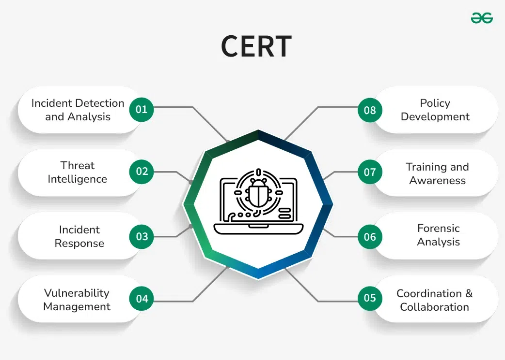
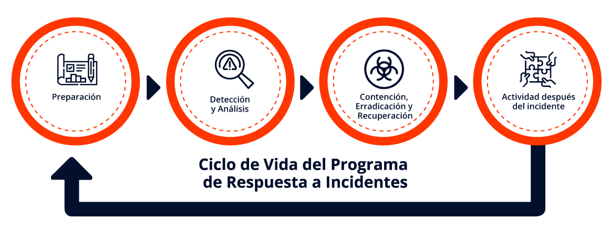

# CERT|CSIRT|SOC

La gestión de respuesta a incidentes es un pilar esencial para la seguridad de cualquier organización moderna, ya sea en el ámbito empresarial o en entornos privados. Con el creciente aumento de amenazas cibernéticas, como el malware avanzado, los ataques de denegación de servicio (DDoS) y las violaciones de datos, las organizaciones necesitan contar con un plan robusto para lidiar con estos riesgos. Aquí te presento una visión completa y aplicada de cómo debe ser la respuesta a incidentes y cómo un equipo especializado, como un **CSIRT (Computer Security Incident Response Team)**, se convierte en un aliado crucial para mitigar los daños y asegurar la continuidad del negocio.

### ¿Por qué es vital la respuesta a incidentes?

Las empresas hoy en día dependen de tecnologías digitales en casi todos los aspectos de su operación: desde la comunicación por correo electrónico hasta transacciones en línea y el almacenamiento de información sensible en la nube. Cuando se produce un incidente de ciberseguridad, el tiempo es clave. Las consecuencias de no responder rápida y eficazmente pueden ser devastadoras: **pérdida de confianza de los clientes**, **interrupciones operativas prolongadas**, **multas regulatorias** y, en muchos casos, daños irreversibles a la reputación de la empresa.

Pongamos un ejemplo realista. Supongamos que una empresa sufre una brecha de seguridad que compromete la base de datos de clientes. No solo se trata de la información robada, sino también del impacto financiero y legal, ya que la normativa como el **Reglamento General de Protección de Datos (RGPD)** impone sanciones importantes por la falta de protección adecuada de los datos. ¿Cómo podría una organización lidiar con tal crisis si no tiene un plan de respuesta a incidentes bien establecido?

### El rol del CSIRT en la mitigación del daño

Aquí es donde entra en juego un equipo de respuesta a incidentes o **CSIRT**. Este equipo no solo reacciona ante los incidentes, sino que está preparado para **anticipar** y **prevenir** problemas, creando una estrategia de defensa proactiva.

El CSIRT actúa de manera inmediata tras un incidente con los siguientes objetivos:
1. **Contención y mitigación** del impacto en curso. El objetivo aquí es evitar que el incidente se propague a otras partes de la red o comprometa más datos.
2. **Recuperación rápida** para restaurar las operaciones normales. Esto incluye la coordinación con el equipo de TI para restablecer la funcionalidad de los sistemas lo más rápido posible, pero asegurándose de que el sistema está limpio y seguro antes de ponerlo en línea nuevamente.
3. **Preservación de pruebas** para análisis forense y posibles acciones legales. Los incidentes a menudo implican ciberdelincuentes, por lo que es crucial preservar las pruebas de cualquier actividad maliciosa que pueda servir en investigaciones posteriores.

El CSIRT también tiene una función proactiva importante. No se limita a actuar después de un incidente, sino que colabora con otros departamentos para prevenir futuros ataques. Esto puede incluir auditorías de seguridad, instalación y mantenimiento de herramientas de seguridad, y simulaciones de ataques para fortalecer las defensas existentes.F

### El Plan de Respuesta a Incidentes

Un **plan de respuesta a incidentes** es una herramienta indispensable para gestionar estos eventos de forma eficiente. Es un conjunto de instrucciones que guían al personal de TI y seguridad a **detectar, contener, y recuperarse** de un incidente de manera eficaz. Veámoslo desde el contexto de una pequeña empresa de servicios financieros que maneja datos de tarjetas de crédito. Para ellos, un incidente podría significar pérdidas multimillonarias y la confianza de sus clientes.

En este escenario, tener un plan claro es la diferencia entre un problema controlado y una crisis catastrófica. Un plan eficaz incluye:
- **Definición de roles**: Cada persona sabe exactamente qué hacer ante un incidente. Esto no solo incluye a los equipos de TI, sino también a los departamentos legales y de relaciones públicas, que jugarán un papel clave en la comunicación con los clientes y las autoridades.
- **Clasificación del incidente**: No todos los incidentes son iguales. Una infección de malware en un equipo no tiene el mismo impacto que una violación de seguridad masiva que afecta a miles de clientes. Clasificar el incidente ayuda a determinar la gravedad y priorizar la respuesta.
- **Preparación proactiva**: Las empresas que realizan simulaciones regulares y ejercicios de respuesta ante incidentes están mejor equipadas para reaccionar rápidamente cuando ocurre una amenaza real.

### Fases de la Respuesta a Incidentes

La **respuesta a incidentes** sigue un proceso estructurado en varias fases. Estas fases no solo permiten una reacción inmediata, sino que también aseguran que la organización aprenda de cada incidente y esté mejor preparada para el futuro. Estas fases son:

1. **Preparación**: La preparación lo es todo. Esto implica tener herramientas adecuadas como **antivirus, sistemas de detección de intrusos, y registros SIEM** (Security Information and Event Management) que permitan monitorizar y detectar cualquier actividad sospechosa en la red. No es suficiente con instalar herramientas, el personal debe estar entrenado y familiarizado con su uso.

2. **Detección e informes**: La monitorización constante de los sistemas es crucial para detectar incidentes a tiempo. En este punto, cualquier anomalía debe ser registrada y escalada para su análisis. Un ejemplo típico podría ser la detección de un acceso no autorizado desde una dirección IP sospechosa a la red de la empresa.

3. **Análisis forense y *triage***: Una vez detectado un incidente, se realiza un análisis detallado para comprender el alcance del daño. En esta fase, el equipo de respuesta emplea técnicas forenses para determinar cómo el atacante accedió al sistema, qué sistemas se vieron comprometidos, y qué información pudo haberse visto afectada.

4. **Contención y neutralización**: A veces, la solución más inmediata es desconectar un sistema afectado de la red para evitar que el ataque se propague. Sin embargo, es fundamental no perder datos importantes que puedan ser utilizados para investigaciones futuras. Los equipos especializados llevan a cabo la contención del incidente, que puede incluir la limpieza de dispositivos, la reconstrucción de sistemas comprometidos y el cambio de contraseñas.

5. **Recuperación y recapitulación**: Finalmente, después de haber controlado el incidente, la organización debe restaurar sus operaciones de manera segura y documentar todas las lecciones aprendidas. Este paso es clave para mejorar los protocolos y estar mejor preparados para futuros incidentes.

### Herramientas y tecnologías esenciales

En el ámbito empresarial, las herramientas son fundamentales para facilitar la respuesta a incidentes. Herramientas como los [sistemas SIEM](https://www.microsoft.com/es-es/security/business/security-101/what-is-siem) [\(1\)](https://www.ibm.com/es-es/topics/siem) permiten a las organizaciones recopilar información de múltiples fuentes, como registros de firewalls y antivirus, facilitando la detección temprana de comportamientos anómalos. También destacan las soluciones de **[DLP (Data Loss Prevention)](https://www.azion.com/es/blog/que-es-prevencion-de-perdida-de-datos-y-como-proteger-empresa/)**[\(2\)](https://www.forcepoint.com/es/blog/insights/types-of-dlp-solutions) que proporcionan visibilidad sobre la fuga de datos, siendo un recurso crítico en incidentes que involucran robo de información.

### Diferencias entre CSIRT, CERT y SOC

Aunque a menudo se usan indistintamente, los términos **CSIRT, CERT y SOC** tienen diferencias clave. Un **CSIRT** es un equipo de respuesta a incidentes dentro de una organización. Un **CERT** (Computer Emergency Response Team), por su parte, está más enfocado en la cooperación externa y el análisis de amenazas emergentes, y es una marca registrada de Carnegie Mellon. Finalmente, un **SOC (Security Operations Center)** tiene un alcance más amplio, supervisando no solo incidentes, sino la seguridad general de la infraestructura, desde la gestión de firewalls hasta la detección de intrusos.

### En resumen
La clave para una gestión exitosa de incidentes de ciberseguridad es la **preparación constante** y la capacidad de respuesta rápida y coordinada. Las empresas, grandes o pequeñas, deben comprender que los incidentes de seguridad no son una cuestión de "si sucederán", sino de "cuándo sucederán". Contar con un equipo de respuesta entrenado y un plan detallado es la única forma de minimizar el impacto y garantizar la continuidad del negocio en un mundo cada vez más digital y vulnerable a las amenazas.

## Funciones, estrategias y fases en la respuesta a incidentes

Funciones, estrategias, y fases que las organizaciones deben implementar para mitigar los daños de incidentes de seguridad informática.

### 1. **Equipos de Respuesta a Incidentes (CSIRT)**
Los **CSIRT** (Computer Security Incident Response Team) son equipos especializados que gestionan los incidentes de seguridad para minimizar su impacto en la organización. Estos equipos tienen como funciones principales:
- **Contener y minimizar daños** a la infraestructura y datos.
- **Coordinar la recuperación** rápida y eficiente con otros equipos de TI.
- **Prevenir incidentes futuros** mediante la identificación de la causa raíz y el registro de lecciones aprendidas.
- **Compartir información** con otros CSIRT para mitigar nuevas amenazas.

### 2. **Plan de Respuesta a Incidentes**
El plan es una guía estructurada que ayuda al equipo a **detectar, responder y recuperarse** de incidentes de seguridad. Un plan eficaz incluye:
- **Roles y responsabilidades claros**: cada miembro debe saber qué hacer ante un incidente.
- **Clasificación de incidentes**: para priorizar las respuestas según la criticidad.
- **Integración de equipos técnicos y no técnicos**: el equipo de respuesta debe incluir, además de TI, recursos humanos, legal, y relaciones públicas.
- **Pasos clave**: preparación, detección, análisis, contención, erradicación y recuperación.

### 3. **Fases de Respuesta a Incidentes**
La respuesta a incidentes sigue un ciclo de cinco fases clave:
- **Preparación**: contar con herramientas, políticas y guías claras para la respuesta.
- **Detección e informes**: monitorización de eventos de seguridad y escalamiento.
- **Triaje y análisis**: análisis forense para identificar indicadores de compromiso.
- **Contención y neutralización**: controlar la extensión del incidente y neutralizar las amenazas.
- **Recuperación y lecciones aprendidas**: restaurar operaciones y documentar lo sucedido.

### 4. **Herramientas para la Respuesta**
- **Antivirus y registros SIEM**: ayudan a identificar y mitigar ataques.
- **DLP (Data Loss Prevention)**: para monitorizar el movimiento de datos sensibles.

### 5. **Tipos de Servicios del CSIRT**
Los servicios que ofrecen los CSIRT incluyen:
- **Servicios reactivos**: respuesta inmediata a incidentes como ataques o infecciones.
- **Servicios proactivos**: auditorías, evaluaciones y mejora continua de la seguridad.
- **Gestión de la ciberseguridad**: planes de continuidad del negocio y formación del personal.

### 6. **Recursos Necesarios**
Un CSIRT efectivo necesita **personal capacitado**, **herramientas especializadas** y **tiempo** para responder a incidentes de forma eficiente. Las organizaciones, especialmente pequeñas y medianas empresas (PyMEs), pueden beneficiarse de manuales operativos si no tienen un CSIRT propio.

### 7. **Diferencias entre CSIRT, CERT y SOC**
- **CSIRT** y **CERT** se usan indistintamente para describir equipos de respuesta a incidentes. Sin embargo, **CERT** es una marca registrada de Carnegie Mellon, y su uso debe estar autorizado.
- Un **SOC** (Centro de Operaciones de Seguridad) tiene un alcance más amplio que los CSIRT, gestionando no solo incidentes, sino también la supervisión continua de la seguridad. ​

| SOC                                                          | CERT\|CSIRT                                                  |
| ------------------------------------------------------------ | ------------------------------------------------------------ |
| :heavy_check_mark: Gestión y operación de tecnologías de seguridad :heavy_check_mark: Monitoreo de seguridad, Investigación y análisis :heavy_check_mark: Detección y alertas :heavy_check_mark: Respuesta a incidentes | :heavy_check_mark: ​Gestión y operación de tecnologías de seguridad :heavy_check_mark: Mo​nitoreo de seguridad, Investigación y análisis :heavy_check_mark: ​Estrategias de seguridad y coordinación para el tratamiento de incidentes :heavy_check_mark: Respuesta a incidentes y recuperación de las operaciones :heavy_check_mark: Actividades de prevención :heavy_check_mark: Comunicación e interrelación con stakeholders (internos y externos) :heavy_check_mark: Auditorías o evaluaciones de seguridad |

---

Para ampliar este tema, te sugiero visitar estos enlaces:
- [INCIBE sobre prevención de fuga de datos](https://www.incibe.es/protege-tu-empresa/blog/dlp-protege-tus-datos-fugas-informacion)
- [Ejemplo de un CERT de la UAM](https://www.uam.es/uam/vida-uam/cert)
- [Así se controlan y evitan los ciberataques desde el SIEM](https://www.youtube.com/watch?v=gqAjg9yayWc)

Este contenido es fundamental para equipos de ciberseguridad y su implementación puede prevenir grandes pérdidas de datos y asegurar la continuidad del negocio ante incidentes.

