# Tipos de ataques MitM

En un ataque de intermediario, el atacante espía la conversación entre el servidor y el cliente, utilizando malware u otros métodos para hacerlo. Para combatir y prevenir este tipo de ataques, es útil comprenderlos primero. Por lo tanto, exploremos los tipos de ataques de intermediario que necesita conocer...

¿Alguna vez has visto una película de acción en la que un buen espía (como James Bond o la Viuda Negra) intercepta una comunicación secreta? Esta persona es lo que se conoce como un atacante intermediario, pero en este caso no nos importa porque es un "buen tipo/chica" en la película. Pero en un ataque intermediario en el mundo real, las intenciones de un atacante MitM normalmente no son tan buenas. En cambio, un cibercriminal se coloca entre dos partes que se comunican para poder interceptar, leer y alterar los datos. El atacante puede colocarse en cualquier punto a lo largo de la cadena de comunicación para llevar a cabo este tipo de ciberataque.

Pero ¿cuáles son los diferentes tipos de ataques del tipo "man in the middle"? Vamos a analizarlos todos en profundidad.

## Análisis de 8 tipos de ataques de intermediarios

Un [ataque de intermediario](https://cheapsslsecurity.com/blog/what-is-a-man-in-the-middle-attack-mitm-explained/) puede utilizarse de forma aislada o como parte de un plan más amplio. En cualquier caso, el objetivo del ataque es obtener información o dinero. Un ataque de intermediario, que puede llevarse a cabo desde cualquier capa de los protocolos que rigen la cadena de comunicación, puede dividirse en distintos tipos según cómo lo lleve a cabo el atacante (es decir, qué métodos utilice).

Pero primero, si no estás seguro de qué es un ataque de hombre en el medio, lo explicamos todo aquí.

### Método 1: Ataque al cifrado

Los ataques al cifrado se pueden lanzar en cualquiera de las tres capas OSI: aplicación, presentación y transporte.

Los protocolos de seguridad como SSL/TLS se utilizan para proteger el canal de comunicación entre el cliente y el servidor. Sin embargo, a veces los cibercriminales consiguen eludir o manipular estos protocolos de seguridad para interceptar las llamadas comunicaciones “seguras”. Existen tres tipos de ataques de intermediarios al cifrado. Echemos un vistazo.

#### 1. Suplantación de HTTPS

En el caso del primer tipo de ataque de intermediario de nuestra lista, algunos expertos afirman que se trata de un ataque MitM, mientras que otros afirman que se trata de un método de ataque de phishing. Con la suplantación de HTTPS, un delincuente crea un sitio web HTTPS falso falsificando la dirección de un sitio web legítimo. Luego, envía un enlace a este sitio web falso a usuarios desprevenidos que visitan el sitio falso, lo que los expone a un ataque.

##### ¿Cómo funciona un ataque de suplantación de HTTPS?

En abril de 2017, Xudong Zheng [presentó](https://www.xudongz.com/blog/2017/idn-phishing/) una prueba de concepto para demostrar cómo podía manipular al usuario para que creyera que estaba accediendo al sitio web legítimo de Apple cuando en realidad se trataba de un sitio web falso. Para ello, utilizó caracteres especiales que visualmente parecen idénticos al alfabeto del idioma inglés.

Xudong Zheng quería demostrar cómo era posible registrar dominios con caracteres extranjeros utilizando Punycode. Cuando se utilizaron caracteres Unicode para registrar el nombre de dominio “xn-pple-43d.com”, el nombre de dominio equivalente que se representaba visualmente era “apple.com”. Este sitio falso utilizaba la “a” cirílica (U+0430) en lugar de la “a” ASCII (U+0061). Este ataque de suplantación de identidad también se denomina suplantación de identidad de script.

Como muchos caracteres Unicode son difíciles de distinguir de los caracteres ASCII, los cibercriminales pueden utilizarlos para registrar sitios web falsos. Los atacantes no sólo pueden registrar nombres DNS que se parezcan al DNS original, sino que también pueden obtener certificados SSL de bajo nivel (es decir, certificados de validación de dominio) para estos sitios web para intentar hacerlos parecer más legítimos. Cuando un atacante envía la URL de un sitio sospechoso a su objetivo, la víctima desprevenida hace clic en la URL y cae directamente en la trampa del delincuente. Este tipo de ataque también se conoce como ataque homógrafo o ataque homógrafo de nombre de dominio internacionalizado (IDN).

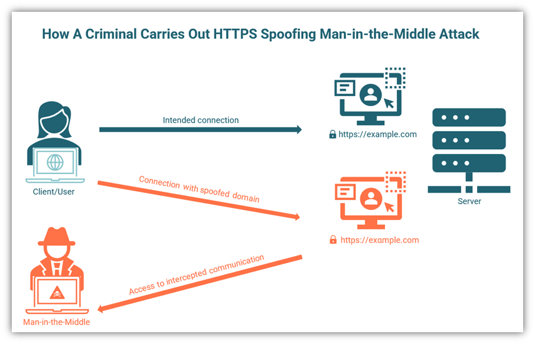

*Un diagrama ilustrativo básico que muestra cómo un ciberdelincuente desvía a la víctima a un sitio web falso falsificando el nombre de dominio.*

Mientras los malos usan ataques homográficos (también conocidos como homoglíficos), los buenos han estado trabajando para protegernos. Google Chrome versión 51 y posteriores, Microsoft Edge, Firefox y Opera bloquean los sitios que usan más de un idioma para su IDN, y muchos navegadores también advierten a los usuarios cuando intentan acceder a esos sitios maliciosos.

La forma más sencilla de evitar este tipo de estafas es no hacer clic nunca en las URL que te envían por correo electrónico, mensajes o ventanas emergentes. Si quieres visitar un sitio web, debes escribir manualmente el nombre del sitio web en tu navegador para protegerte de un ataque de intermediario.

#### 2. Secuestro de SSL

Los ataques de secuestro de SSL son ataques de intermediario en los que el delincuente secuestra la sesión legítima de un usuario y se hace pasar por él. El servidor no sabrá que la persona que realiza la transacción no es el usuario previsto.

Los ataques de secuestro de SSL también se conocen como ataques de secuestro de sesión o de secuestro de cookies. El secuestro de SSL implica robar la ID o la clave de sesión para obtener control no autorizado sobre la sesión de la víctima.

*Una representación visual de cómo funciona un ataque de secuestro de SSL.*

##### ¿Cómo funciona un ataque de secuestro de SSL?

Una vez que el delincuente obtiene el control de la sesión, puede hacer todo lo que un usuario está autorizado a hacer en su cuenta: transferir o retirar dinero, comprar cosas e incluso cambiar los datos de la cuenta de la víctima. La figura anterior es una representación de un ataque de secuestro de SSL.

Entonces, la pregunta es, ¿cómo consigue un delincuente hacerse con una clave de sesión para el ataque? Estos son algunos errores que cometen los propietarios y usuarios de sitios web y que hacen que la sesión sea vulnerable:

- **Uso de variables predecibles para generar un ID de sesión:** resulta más fácil adivinar un ID de sesión cuando se genera utilizando variables predecibles como la fecha y hora de inicio de sesión, la dirección IP o el ID de sesión anterior. Aunque esta práctica es cada vez menos común, algunos sitios web cometen el error de utilizar dichos ID. Un ciberdelincuente puede utilizar fácilmente un ataque de fuerza bruta para adivinar estas versiones predecibles del ID de sesión.

- **Proteger solo una parte del sitio web en lugar de todo el sitio web:** algunos propietarios de sitios web prefieren utilizar certificados SSL en las páginas de inicio de sesión y de pago, pero optan por ahorrar dinero en las demás páginas. Los cibercriminales pueden acceder fácilmente a la comunicación cuando el usuario hace clic en una página no segura. El actor de amenazas también puede acceder a las cookies que tendrán información sobre la página de inicio de sesión.

- **Hacer clic en enlaces incluidos en correos electrónicos de phishing:** se sabe que los cibercriminales envían correos electrónicos de phishing con identificadores de sesión a los usuarios. Cuando el usuario hace clic en el enlace, inicia una sesión en la cuenta con este identificador de sesión definido por el atacante. Este tipo de ataques se conocen como ataques de fijación de sesión.

Además, un correo electrónico de phishing también puede contener un enlace a un sitio web malicioso. La página infectada del sitio web atraerá al dispositivo del usuario para que ejecute un script (normalmente JavaScript) que enviará las cookies de sesión al atacante. El atacante puede secuestrar toda la sesión con la cookie. Este tipo de ataque se conoce como ataque de secuencias de comandos entre sitios (XSS).

- **Compra de hardware de fuentes no confiables:** cuando un usuario obtiene hardware de comerciantes no confiables, el hardware puede estar cargado con malware. Por lo general, este malware está diseñado para robar información del usuario al propietario del hardware y enviársela al cibercriminal. Los delincuentes también pueden robar las cookies del dispositivo del usuario y obtener acceso a sus sesiones.

#### 3. Eliminación de SSL

La eliminación de SSL, también conocida como ataque de degradación, es un tipo de ataque de intermediario en el que el delincuente reduce la seguridad de la conexión de un sitio web para poder acceder a las comunicaciones entre un cliente y el servidor al que se conecta.

¿Cuál es el método número uno que se utiliza para la seguridad de los sitios web? Por supuesto, es TLS. El protocolo TLS se desarrolló para proteger la comunicación entre el sitio web y el servidor, y funciona. Pero, ¿adivinen qué? Los cibercriminales aún encuentran una forma de evitarlo para lanzar ataques MitM.

El investigador de seguridad informática [Moxie Marlinspike](https://vimeo.com/50018478) presentó un fallo de seguridad en Black Hat 2009 en Washington DC. Demostró que los sitios HTTP se cargan primero, seguidos rápidamente por el certificado SSL. El resultado es una conexión HTTPS segura. Pero en el breve tiempo antes de que se cargue el certificado SSL, un atacante tiene una pequeña ventana de oportunidad donde puede enviar el sitio HTTP no seguro al usuario en lugar de la versión segura. ¿El resultado?

- El usuario continuará su comunicación pensando que está seguro.
- El servidor también pensará que hay una conexión segura con un usuario legítimo.
- Mientras tanto, el MitM tiene acceso a una conexión segura con el servidor y a una conexión abierta con el usuario. Esto significa que el atacante puede acceder a todo lo que pasa entre el usuario y el servidor.

##### ¿Cómo funciona un ataque de eliminación de SSL?

Cuando el usuario realiza una solicitud para acceder a un sitio web HTTPS, el atacante cambia la versión HTTPS a una versión HTTP del mismo sitio web. La versión HTTP no es segura y el atacante puede leer todo lo que ocurre entre el cliente y el servidor. También puede alterar y manipular toda la conversación. Un ataque de eliminación de SSL se ve así:

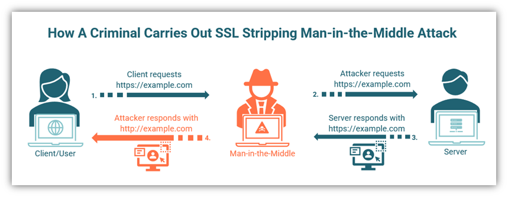

*Una figura que muestra a un atacante interceptando comunicaciones mediante un tipo de ataque de intermediario conocido como eliminación de SSL.*

Hay cuatro pasos involucrados en un ataque de eliminación de SSL:

1. El usuario solicita acceso a “https://example.com”
2. El MitM transmite la solicitud del usuario al servidor
3. El servidor responde con el sitio seguro “https://example.com”
4. El MitM explota la vulnerabilidad y envía el sitio no seguro “http://example.com” al usuario.

Esto puede hacer que te preguntes cómo un cibercriminal puede degradar el protocolo de seguridad. Pueden hacerlo de una de estas tres maneras:

- Configuración manual del proxy del navegador para enrutar todo el tráfico
- Uso del envenenamiento por ARP
- Crear un punto de acceso y lograr que las víctimas se conecten a él

Para evitar ataques de eliminación de SSL, siempre verifique que esté trabajando en un sitio HTTPS y que no haya cambiado a una página HTTP durante la sesión. Tener cuidado con la URL ayuda mucho a evitar problemas mayores. Otra forma de defenderse contra la eliminación de SSL es implementar la política HSTS, una política estricta en la que solo se permite la carga de sitios HTTPS.

### Método 2: Intercepción

Con este método, el cibercriminal utiliza las capas del protocolo de comunicación para interceptar la conversación entre dos nodos de Internet. Un delincuente puede simplemente observar los datos transferidos desde un lugar de la red cercano a los dispositivos que se comunican, o puede redirigir todo el tráfico a través de un nodo controlado por él. Existen cinco tipos de ataques de intermediario que utilizan la interceptación:

#### 4. Suplantación de IP

Cuando un cibercriminal falsifica los encabezados IP de los paquetes TCP transferidos entre dos dispositivos que confían entre sí, puede redirigir el tráfico a la ubicación elegida. Esto se conoce como suplantación de IP. Un ataque de suplantación de IP se utiliza con mayor frecuencia para crear una puerta trasera a los sistemas informáticos de la víctima obteniendo acceso raíz al host. El ataque aprovecha la confianza entre los dos dispositivos y normalmente se utiliza como parte de un plan más amplio para lanzar un ciberataque contra el objetivo.

Los datos se transfieren en Internet mediante un protocolo de Internet (IP) que los empaqueta en paquetes. Los encabezados de los paquetes contienen la identidad del remitente y del receptor en forma de direcciones IP. Si un atacante cambia la dirección IP del remitente en el encabezado de los datos, parecerá que proviene de la dirección IP falsificada. IP es un protocolo sin estado, por lo que no se conservan datos de las sesiones anteriores.

##### ¿Cómo funciona un ataque de suplantación de IP?

En primer lugar, el atacante encuentra la dirección IP del host de confianza en una red. Los cibercriminales son expertos en predecir números de secuencia TCP para construir un paquete TCP por sí mismos. Enviarán un mensaje al equipo modificando los encabezados del paquete para dar la impresión de que provienen de ese host de confianza. Como se trata de un host de confianza, el objetivo podría comenzar a comunicarse sin más consultas.

Lamentablemente, este ataque es posible porque los enrutadores ignoran por completo la dirección IP del remitente y se concentran en la dirección IP de destino. El atacante podría incluso cambiar la tabla de enrutamiento para redirigir el tráfico de la red víctima al nodo que controla. Es posible que las computadoras de la red víctima ni siquiera sepan que existe una ruta falsificada y sigan comunicándose.

El atacante puede ser un observador silencioso, pero también puede enviar correos electrónicos o documentos desde la dirección de correo electrónico oficial de cualquier persona de la empresa objetivo.

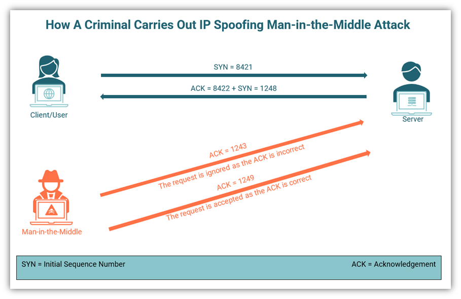

*Una representación visual de suplantación de IP para un ataque de tipo “hombre en el medio”.*

La suplantación de IP se produce durante el protocolo de enlace TCP de tres vías entre el cliente y el servidor. En un protocolo de enlace TCP normal se siguen los siguientes pasos:

1. El cliente envía el número de secuencia, SYNx, al servidor
2. El servidor responde con el acuse de recibo ACK(x+1) + SYNy
3. El cliente responde con ACK (y+1)

El atacante responde al servidor con una estimación de “y” antes de que el cliente pueda responder. Si su estimación es correcta, el servidor pensará que es el cliente real. La suplantación de IP solo es posible si el atacante responde con una respuesta correcta antes que el cliente, por lo que es un ataque difícil de llevar a cabo.

#### 5. Suplantación de ARP

El siguiente en nuestra lista de tipos de ataques de intermediarios es la suplantación de ARP. Un ataque de suplantación de ARP permite a los malhechores interceptar tipos específicos de comunicaciones entre dispositivos de red. Más específicamente, la suplantación de ARP permite a un atacante enviar un mensaje falso de protocolo de resolución de direcciones (ARP) a través de una red de área local (LAN) para engañar al servidor y lograr que confíe en él, lo que en última instancia desvía todo el tráfico hacia su dispositivo.

##### ¿Cómo funciona un ataque de suplantación de ARP?

La siguiente figura le ayudará a comprender mejor el concepto. Como puede ver, hay cuatro dispositivos conectados a una LAN con la puerta de enlace 172.14.0.4. Todo el tráfico que sale hacia el servidor debe pasar por la LAN. Un delincuente disfrazará su dispositivo como uno de los dispositivos de la red para penetrarla.

En circunstancias ideales, se llevan a cabo los siguientes pasos:

1. Un dispositivo de red envía una solicitud ARP de difusión para localizar una dirección MAC que corresponde a una dirección IPv4.
2. Un dispositivo legítimo con una dirección IP que coincide con la solicitud envía una respuesta.
3. El dispositivo que envía la solicitud almacenará en caché la respuesta ARP en la tabla ARP.

La historia se pone interesante cuando un intermediario consigue entrar. El atacante envía la respuesta cuando cualquier dispositivo de red pide localizar una dirección MAC. Si el atacante consigue asignar su dirección MAC a una dirección IP auténtica, podrá recibir todas las comunicaciones destinadas al dispositivo legítimo.

A veces, el atacante va un paso más allá y envía un mensaje ARP con la dirección IP de la puerta de enlace predeterminada para capturar todo el tráfico de la LAN. Todos los dispositivos de la red asignarán la dirección IP del atacante como la puerta de enlace predeterminada. Esto se denomina envenenamiento ARP, ya que las tablas ARP de los dispositivos se "envenenan" con la dirección IP del atacante.

*Una representación visual de la suplantación de ARP, que ocupa el quinto lugar en nuestra lista de tipos de ataques del tipo “man in the middle”.*

Algunas personas utilizan los términos "suplantación de ARP" y "envenenamiento de ARP" indistintamente. Sin embargo, existe una diferencia entre ambos. En la suplantación de ARP, el atacante envía su dirección MAC en respuesta a una solicitud de un dispositivo en la LAN. Por lo tanto, falsifican el ARP para hacerse pasar por la víctima. Por otro lado, en el envenenamiento de ARP, el atacante modificará las tablas ARP de uno o más dispositivos en la LAN.

#### 6. Ataque de descubrimiento automático de proxy

En las empresas donde la seguridad es una preocupación primordial, se instala un proxy web. Todo el tráfico web pasa por el servidor proxy después de una inspección exhaustiva de todas las capas de la aplicación para detectar posibles amenazas. WPAD (Web Proxy Auto-Discovery) es un protocolo diseñado para ayudar a los clientes a descubrir el proxy automáticamente.

Aunque el descubrimiento automático de proxy ahorra tiempo al programador, ya que no tiene que configurar todos los dispositivos, WPAD es susceptible a ataques MitM. Si el administrador del sistema no desea configurar el servidor proxy localmente, tiene dos opciones para publicar la ubicación del archivo proxy:

- **DHCP (protocolo de configuración dinámica de host):** el navegador web primero busca la configuración del proxy en el servidor DHCP antes de recurrir al DNS. El DHCP se basa en UDP e IP. Un cibercriminal podría configurar un servidor DHCP malicioso y enviar un único paquete UDP falsificado con detalles sobre la configuración del proxy al navegador para lanzar un ataque DHCP. La instalación de firewalls adecuados puede protegerlo de este tipo de ataque.
- **DNS (sistema de nombres de dominio):** al igual que DHCP, el DNS también utiliza UDP; por lo tanto, los cibercriminales pueden interceptar la comunicación alterando el paquete de configuración del proxy. Además, cuando una organización utiliza el nivel más alto del dominio para habilitar WPAD, los atacantes pueden beneficiarse falsificando un subdominio bajo el dominio principal. Por ejemplo, si se envía la consulta del navegador para xyzcom, el servidor DNS primero consultará xyzcom. Si no hay respuesta, consultará yzcom. Si tampoco hay respuesta allí, el navegador consultará z.com. Si la organización ha utilizado z.com para habilitar WPAD, el delincuente podría falsificar otro subdominio para lanzar un ataque.

Un método para protegerse de un ataque de detección automática de proxy es desactivar la detección automática de proxy en su dispositivo. La siguiente captura de pantalla muestra cómo desactivar la detección automática de proxy en Windows.

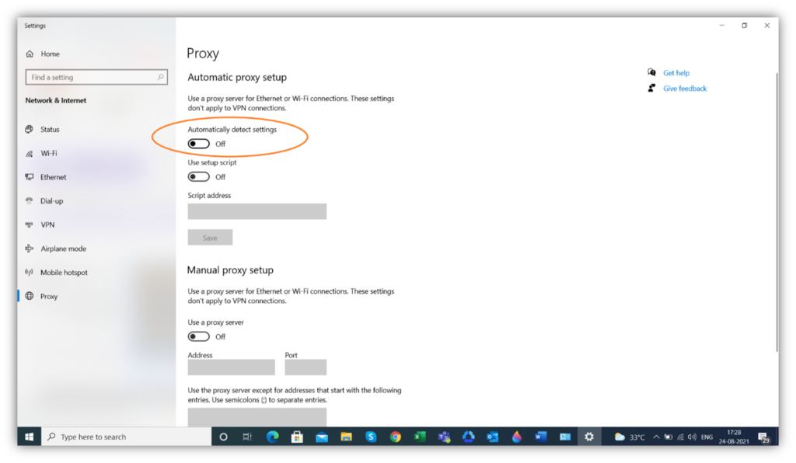*Una captura de pantalla que muestra cómo desactivar la detección automática de proxy en Windows.*

#### 7. Suplantación de DNS

El siguiente en nuestra lista de tipos de ataques de intermediarios es la suplantación de DNS. Este tipo de ataque se produce cuando un ciberdelincuente reemplaza una dirección IP legítima en los registros de un servidor DNS. Al hacerlo, el atacante puede dirigir a los clientes de los visitantes del sitio a un sitio web falso en lugar del verdadero.

El sistema de nombres de dominio (DNS) es un protocolo para asignar la dirección IP de destino cuando un cliente realiza una solicitud. Cuando se realiza una solicitud para un sitio web específico, el navegador y el sistema operativo (OS) buscan una entrada correspondiente en la memoria caché o el almacenamiento interno del dispositivo. Si no la encuentran allí, lanzan la consulta para buscar esa dirección IP a través de diferentes servidores. Cuando encuentran la dirección IP correspondiente, conectan al cliente con ella.

##### ¿Cómo funciona un ataque de suplantación de DNS?

Con un registro DNS falso, el usuario no sabrá que está en un sitio web falso y usará sus credenciales de inicio de sesión para acceder a su cuenta. El MitM observa el sitio web falso y puede recuperar las credenciales del cliente desde allí. Luego, puede usar las credenciales para iniciar sesión en el sitio web original como usuario, lo que le permitirá recuperar toda la información del cliente.

El cibercriminal puede ir un paso más allá y cambiar los registros DNS de un sitio web para que su propio sitio web aparezca como el original. De esta manera, cada vez que un cliente abra el sitio web, será dirigido al sitio web falso. Este método se denomina envenenamiento de DNS o envenenamiento de caché.

El sistema DNS es muy parecido a una libreta de direcciones que utilizas para anotar las direcciones de tus familiares y amigos. Si alguien cambia la dirección de la libreta de direcciones, es posible que no lo sepas, pero tus cartas llegarán a la persona equivocada, que podrá leerlas y usarlas con fines maliciosos. De la misma manera, un cibercriminal falsifica los registros DNS para llevar a cabo un ataque de suplantación de DNS.

*Una representación visual básica de un ataque de suplantación de DNS.*

#### 8. Desvío de BGP

La misdireccionamiento de BGP es un ataque en el que un ciberdelincuente redirige el tráfico de Internet a una ruta maliciosa falsificando los prefijos de IP.

El protocolo de gateway de borde (BGP) es el protocolo de enrutamiento para Internet. Es como una cuadrícula que conecta todas las redes entre sí. Generalmente, el protocolo BGP se encarga de encontrar la mejor ruta para las solicitudes realizadas por los dispositivos. El protocolo accede a los registros DNS del sitio web para dirigir cualquier consulta de los clientes a la dirección IP correcta.

##### ¿Cómo funciona un ataque de desdirección de BGP?

Entonces, ¿qué es la desorientación de BGP? Bueno, este tipo de ataque de intermediario es exactamente lo que su nombre implica: es una desorientación maliciosa del protocolo BGP para redirigir el tráfico a través de una red controlada por un cibercriminal. A medida que el tráfico pasa a través de esta red falsificada, el cibercriminal podrá interceptar, leer o incluso cambiar los datos antes de que lleguen a su destino.

Uno de los factores que contribuyen al éxito de un ataque de desvío de BGP es que el servidor y el cliente no saben que sus datos están siendo interceptados. Un cibercriminal puede pasar fácilmente desapercibido e interceptar una gran cantidad de tráfico.

Entendamos la dirección errónea de BGP con la ayuda de un ejemplo. Si estás cerca del bajo Manhattan y quieres conducir hasta Central Park, seguirás las señales de tráfico y llegarás a tu destino. Normalmente, no tendrás que pasar por Brooklyn para llegar a Central Park. Pero, ¿qué pasa si una persona malintencionada quiere que tomes una ruta a través de Brooklyn? Podrían modificar las señales de tráfico para desviar el tráfico de modo que pase por Brooklyn. Una persona desprevenida podría ni siquiera darse cuenta de que se le está desviando la dirección porque, en última instancia, llegará a Central Park.

BGP es similar a un sistema GPS en tu teléfono. Dirige todos los dispositivos informáticos a su destino a través de la ruta más corta posible. Sin embargo, los cibercriminales utilizan la redirección BGP para enrutar todo el tráfico deseado a través de un nodo bajo su control. De esta manera, pueden monitorear e interceptar el tráfico de la red. Los usuarios y el servidor no son conscientes de que se ha producido la redirección y continúan comunicándose como si nadie estuviera mirando.

*Una representación visual de un ataque de desvío de BGP donde un pirata informático coloca el enrutador BGP para redirigir el tráfico a través de un nodo controlado por él.*

En un reciente incidente de desvío de BGP, la red autónoma [de Vodafone](https://www.bleepingcomputer.com/news/security/major-bgp-leak-disrupts-thousands-of-networks-globally/) con sede en India sufrió una fuga de enrutamiento BGP que afectó a muchas empresas estadounidenses, incluida Google. De manera inusual, la fuga fue resultado de un error, no de un ataque malicioso. Si bien el desvío duró solo 10 minutos, innumerables usuarios de todo el mundo se vieron afectados, lo que provocó un gran aumento en el tráfico. Básicamente, se convirtió en un ataque DDoS autoinfligido por Vodafone.

### SSL Beast (vulnerabilidad del navegador contra SSL/TLS)

"Beast" significa *exploit de navegador contra SSL/TLS* . En un ataque beast de SSL, los cibercriminales utilizan las vulnerabilidades creadas cuando un sitio web utiliza certificados SSL/TLS obsoletos para obtener acceso a las comunicaciones del sitio. Incluimos esto en nuestra lista de los diferentes tipos de ataques de intermediarios porque es algo que debe tener en cuenta al intentar comprender qué son los ataques para poder evitar que ocurran en el futuro.

Una de las mejores defensas contra este tipo de ataque MitM es tener un certificado SSL para su sitio web. Sin embargo, si todavía utiliza TLS 1.0 o cualquier versión de SSL, es propenso a sufrir un ataque SSL beast. El ataque SSL beast aprovecha las vulnerabilidades de estos protocolos para lanzar un ataque de intermediario.

El cifrado TLS utiliza cifrados de bloques con cifrado simétrico. Los cifrados de bloques más populares son DES, 3DES y AES. SSL/TLS utiliza encadenamiento de bloques de cifrado (CBC) para encadenar los bloques con el anterior mediante la operación lógica XOR. Por lo tanto, el valor de cada bloque depende del valor del bloque anterior. El problema surge cuando llega el momento de enviar el último bloque. Es posible que el último bloque no tenga suficientes datos para llenarlo, por lo que se rellena con contenido aleatorio.

##### ¿Cómo funciona un ataque de explotación SSL Beast?

Si el atacante quiere descifrar el código de cifrado, necesita conocer el vector de inicialización de la cadena. Puede descifrar el cifrado de bloque probando diferentes combinaciones y comparándolas mediante el vector de inicialización. Si el bloque tiene 16 bytes, el atacante tendría que probar 256 combinaciones diferentes para adivinarlo correctamente. Se trata de una tarea titánica.   

Para facilitar el proceso, el atacante lleva a cabo el ataque SSL beast, en el que prueba un byte a la vez. Una vez que el atacante adivina un byte correctamente, puede bloquear con 256 combinaciones de este byte. Realiza el mismo proceso para el siguiente byte. La siguiente figura representa el ataque SSL beast.

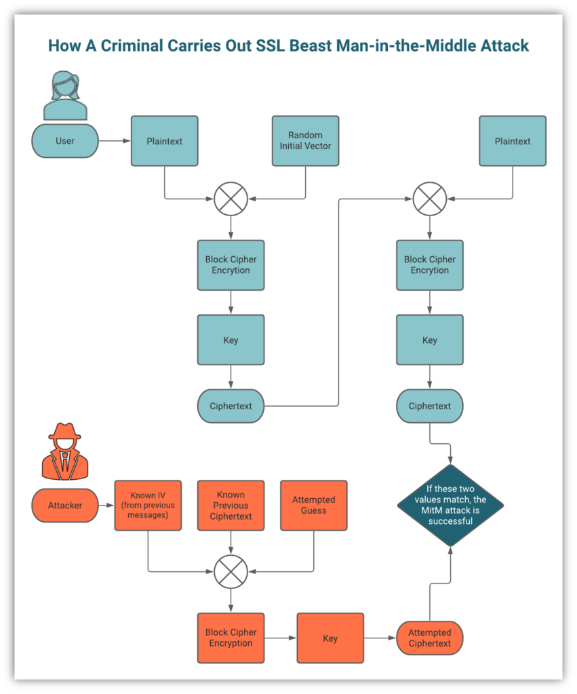

*Una representación visual de un ataque bestial SSL que muestra cómo funciona.*

Debido a la complejidad del proceso, los ataques de SSL no son tan comunes. Sin embargo, si utiliza un protocolo anterior a TLS 1.1 (algo que no debería hacer, ya que quedó obsoleto), debe saber que es vulnerable a este tipo de ataque. La opción de seguridad obvia es actualizar su protocolo de seguridad con regularidad para mantener segura su comunicación.

## Métodos de prevención

Todos estos tipos de ataques MitM se llevan a cabo utilizando diferentes técnicas; y, por tanto, requieren diferentes métodos de prevención. Hay que tener en cuenta que los ataques de intermediarios son algunos de los tipos de ciberataques más difíciles de detectar y pueden causar mucho daño: veamos qué puede hacer para protegerse a sí mismo y a su negocio. 

Tras los atentados del 11 de septiembre, el gobierno de Estados Unidos aprobó la [Ley Patriota](https://www.congress.gov/107/plaws/publ56/PLAW-107publ56.pdf) , que le otorgaba el derecho a vigilar a sus propios ciudadanos sin orden judicial. En los 20 años transcurridos desde entonces, muchos ciudadanos estadounidenses han luchado contra estas medidas en favor de la privacidad. [Denunciantes](https://www.theguardian.com/world/2021/sep/04/surveillance-state-september-11-panic-made-us-vulnerable) como Edward Snowden expusieron al mundo el alcance de la recopilación masiva de datos por parte de la NSA.

En el caso de la NSA, son los "buenos" los que escuchan nuestras conversaciones. Pero, aun así, a mucha gente no le gusta. Imaginemos a los malos haciendo lo mismo: es una idea bastante aterradora. Cuando alguien intercepta nuestros datos y comunicaciones en tránsito para poder usarlos con fines maliciosos, se denomina [ataque de intermediario](https://cheapsslsecurity.com/blog/what-is-a-man-in-the-middle-attack-mitm-explained/) . Por eso es fundamental saber cómo prevenir un ataque de intermediario y cuáles son los mejores métodos de prevención de ataques de intermediario.

Anteriormente, analizamos qué son los ataques de intermediario, cómo funcionan y algunos tipos diferentes de ataques de intermediario. Ahora, exploremos cómo prevenir un ataque de intermediario.

Quizás el aspecto más inquietante de un ataque de tipo man in the middle es que es difícil de detectar y puede pasar desapercibido durante mucho tiempo. No hace falta decir que siempre es mejor prevenir que curar. Por eso, vamos a pasar directamente a nuestra lista de métodos de prevención de ataques de tipo man in the middle para que sepas cómo evitar que ocurran en primer lugar.

### 1. Cifre sus datos en tránsito con SSL/TLS

En primer lugar, en nuestra lista de métodos de prevención de ataques de intermediarios, se encuentra el uso del protocolo seguro de transferencia de hipertexto (HTTPS). Una de las formas más eficientes de proteger los datos de su sitio web y aplicación web en tránsito es habilitar el protocolo HTTPS, que es lo que hace que aparezca el candado de seguridad en la barra de URL de su navegador. Esto implica el uso de un certificado SSL/TLS, que cumple dos propósitos principales:

1. Autentica la identidad del propietario del sitio web y
2. Establece un canal seguro para transmitir datos entre un cliente y el servidor mediante cifrado.

Un certificado SSL permite que dos partes se comuniquen mediante cifrado asimétrico. Este proceso les permite cifrar y descifrar datos con dos claves criptográficas: una pública y otra privada. Los datos se cifran mediante la clave pública y solo se pueden descifrar con la clave privada, a la que solo tiene acceso un receptor legítimo. Por lo tanto, incluso si un malhechor puede echar un vistazo a su flujo de datos en tránsito, no podrá descifrarlo sin tener acceso a la clave privada, por lo que no podrá usarlos.

Las dos partes que se comunican utilizan el cifrado asimétrico para intercambiar información y así establecer una conexión cifrada simétricamente. El cifrado simétrico es más rápido que el cifrado asimétrico porque se basa en una única clave para cifrar y descifrar los datos.

Reconociendo la importancia de los certificados SSL/TLS en la transmisión segura de datos, muchos navegadores como Google Chrome y Mozilla Firefox ahora marcan los sitios web sin certificados SSL como “No seguros”. Los motores de búsqueda también recompensan a los sitios web que usan certificados SSL/TLS con clasificaciones de búsqueda más altas, lo que ha impulsado a muchos propietarios de sitios web a usar certificados SSL.

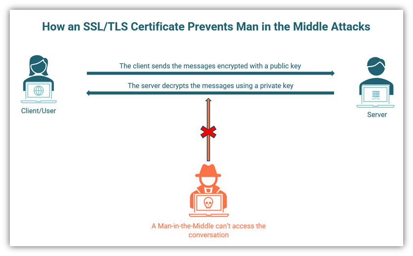

Una ilustración de cómo un certificado SSL/TLS evita ataques de intermediarios al proteger el canal de comunicación.

### 2. Utilice DNS sobre HTTPS (DoH) o DNS sobre TLS (DoT)

El sistema de nombres de dominio (DNS) es un sistema en el que los nombres de dominio (como “cheapsslsecurity.com” o “wikipedia.org) se convierten en direcciones de protocolo de Internet (P) para una identificación más rápida. Las direcciones IP son los valores numéricos asignados a cada dispositivo. Cuando un cliente solicita un sitio web en particular, el navegador realiza una solicitud DNS utilizando el [protocolo TCP](https://www.fortinet.com/resources/cyberglossary/tcp-ip) .

El problema surge cuando un delincuente “olfatea” los paquetes para buscar entradas DNS. Si tiene éxito, puede llevar a cabo un ataque de intermediario. Para contrarrestar esta situación, los buenos han ideado un plan propio. Si se envía una consulta DNS a través de HTTPS o TLS a servidores compatibles con DoH, se cifra. Esto significa que es imposible que los ciberdelincuentes la lean sin tener acceso a la clave de descifrado necesaria.

El uso de DoH o DoT evitará los tipos de ataques de intermediarios en los que se comprometen el sistema de nombres de dominio o sus registros, incluidos:

- Suplantación de DNS (reemplazo de datos de caché de DNS con registros falsos),
- Secuestro de DNS (hacer creer a los usuarios finales que se están conectando con un dominio legítimo) y
- Envenenamiento de DNS (dirigido a servidores de nombres que almacenan en caché registros DNS).

Por lo tanto, muchos de los principales navegadores, incluidos Google Chrome y Mozilla Firefox, son compatibles con DoH. A continuación, se muestra un diagrama ilustrativo básico para mostrar cómo funciona este tipo de ataque de intermediario. En el ejemplo superior, se muestra que un cibercriminal puede acceder a los registros DNS. El ejemplo inferior muestra que el proveedor de DNS responde utilizando DNS sobre HTTPS, lo que impide que el cibercriminal acceda a esos registros.

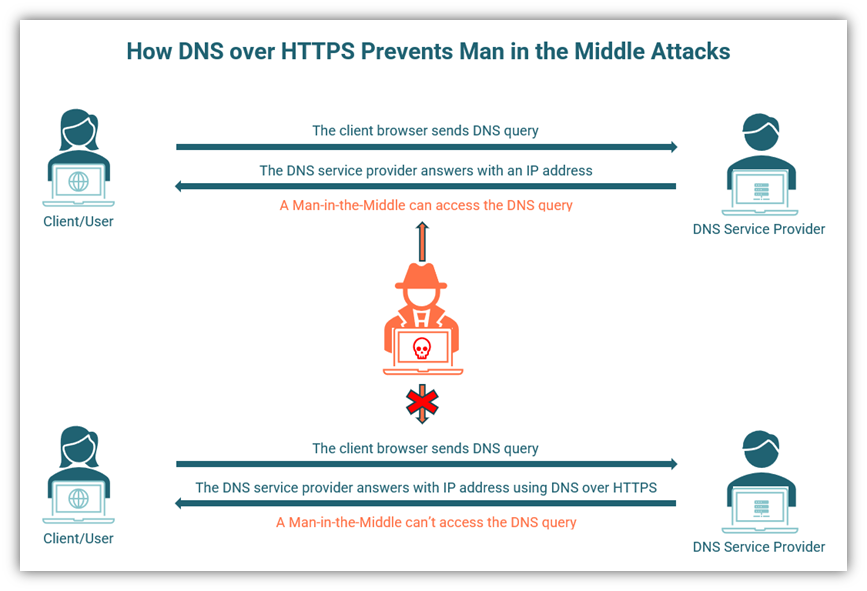Una ilustración de cómo habilitar DNS sobre HTTPS puede prevenir el ataque al impedir que un atacante intercepte la conexión del usuario al servidor DNS.

### 3. Implementar una red privada virtual (VPN)

Como empresario, usted sabe que todos los días se transmite una gran cantidad de información confidencial entre sus empleados. Esto tiene graves implicaciones para la seguridad, especialmente si los empleados no conocen o no siguen los protocolos de ciberseguridad adecuados. Algunos comportamientos de los empleados que podrían hacer que su empresa sea vulnerable a ataques de intermediarios incluyen:

- Permitir que los invitados utilicen la red Wi-Fi principal de su empresa
- Uso de canales de comunicación inseguros para recopilar datos confidenciales, incluidos [sitios web que no son HTTPS](https://cheapsslsecurity.com/blog/http-vs-https-security-the-differences-between-these-protocols/)
- Mantener el Wi-Fi de la empresa abierto y detectable para los usuarios eternos
- Usar Wi-Fi público para conectarse a Internet o a los recursos seguros de su organización cuando trabaja de forma remota

Una VPN puede protegerte a ti y a tu empresa contra ataques MitM ocultando tu dirección IP y la ubicación de tu dispositivo. Una VPN crea un canal de comunicación seguro entre el dispositivo y el servidor VPN. Esto significa que todo el tráfico (tanto HTTPS como no HTTPS) que pasa por este canal está cifrado. Por lo tanto, un delincuente no puede leer ni modificar los datos incluso si de alguna manera logra acceder a ellos.

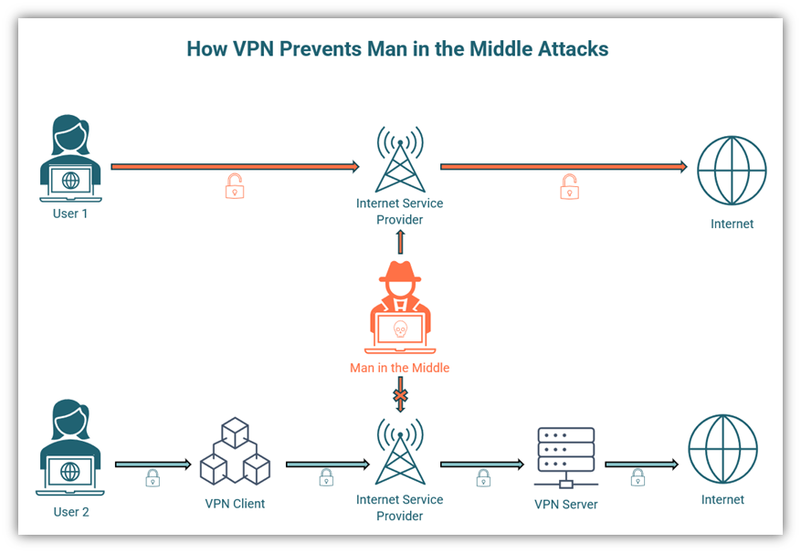Una ilustración de cómo una VPN puede prevenir un ataque de intermediario.

### 4. Utilice la seguridad de transporte estricta HTTP (HSTS)

La seguridad de transporte estricta HTTP, o HSTS, es una política de seguridad de sitios web que se puede incluir en la información del encabezado de su sitio. Su propósito es obligar a los navegadores a cargar su sitio web mediante conexiones HTTPS seguras. ¿Por qué es necesario? Vamos a explicarlo...

La mayoría de las personas escriben únicamente el nombre de dominio para acceder a un sitio web. Por ejemplo, podrían escribir “cheapsslsecurity.com” en lugar de escribir el nombre completo “https://www.cheapsslsecurity.com”. En algunos casos, el navegador puede cargar una versión insegura del sitio que se entrega a través de HTTP. En ese caso, el usuario está compartiendo información con un sitio web inseguro, que es susceptible a un ataque de intermediario.

Un cibercriminal lanzará un ataque de degradación de SSL en un sitio web legítimo para llevar a cabo un ataque MitM. Un certificado SSL/TLS garantiza que la conversación entre el cliente y el servidor esté cifrada y que cualquier persona con intenciones maliciosas no pueda acceder a ella. Sin embargo, en un ataque de degradación de SSL (también conocido como eliminación de SSL), un atacante elimina la protección SSL/TLS para acceder a la conversación entre el cliente y el servidor a través del protocolo HTTP inseguro.

Entonces, ¿qué tácticas de prevención de ataques de intermediario pueden ayudarlo a proteger su sitio web y a sus usuarios contra un ataque de eliminación de SSL/TLS? La respuesta está en HSTS. El uso de un encabezado HSTS en su sitio le indica a los navegadores que carguen la versión HTTPS de su sitio web. Cuando un usuario abre el sitio web por primera vez, el navegador almacenará la versión HTTPS. Esto garantiza que incluso si el usuario carga el sitio web utilizando el nombre de dominio o la versión HTTP, el navegador lo redireccionará a la versión HTTPS. 

[La hoja de trucos de seguridad de transporte estricto HTTP de OWASP](https://cheatsheetseries.owasp.org/cheatsheets/HTTP_Strict_Transport_Security_Cheat_Sheet.html) muestra cómo HSTS protege al usuario contra ataques de intermediarios que se llevan a cabo robando cookies no seguras, suplantación de DNS o secuencias de comandos entre sitios. Debe asegurarse de incluir todos los subdominios en el encabezado HSTS para proporcionar la seguridad más sólida. Sin embargo, es importante tener en cuenta que cuando utiliza HSTS, debe especificar el período de vencimiento. Si el período especificado por HSTS ha expirado, puede quedar expuesto a ataques MitM.

Otra limitación de HSTS es que solo funcionará después de que el usuario inicie sesión en el servidor por primera vez. Hasta entonces, el usuario no está protegido. Para solucionar este problema, Google ha creado una “lista de precarga de HSTS”, que es compatible con los navegadores más modernos. La función de lista de precarga notifica al navegador que estaba intentando cargar un sitio web HTTP. También ayuda al navegador en caso de que haya expirado el tiempo máximo en el encabezado HSTS y se esté cargando el sitio HTTP.

### 5. Implemente un punto de cifrado fuerte con acceso protegido Wi-Fi (WPA)

Ya hemos recorrido la mitad de nuestra lista de métodos de prevención de ataques de intermediarios. WPA, WPA2 y WPA3 son protocolos de cifrado desarrollados por la [Wi-Fi Alliance](https://www.wi-fi.org/) para proteger las redes informáticas inalámbricas. La mayoría de las pequeñas y medianas empresas tienen Internet inalámbrico en sus oficinas; esto puede resultar conveniente, pero la dirección y los empleados pueden cometer algunos errores graves que pueden dar lugar a ataques de intermediarios. Los ciberdelincuentes pueden obtener acceso a su red en las siguientes circunstancias:

- Tu contraseña de Wi-Fi es débil
- Tu red wifi está abierta
- Tu Wi-Fi puede ser detectado por cualquier persona en tu área
- Permite que tus invitados utilicen Wi-Fi con la misma contraseña que tus empleados
- No cambias tu contraseña de Wi-Fi regularmente

WPA puede proteger su red inalámbrica de ataques MitM. Aun así, los cibercriminales podrían usar la fuerza bruta para descifrar su contraseña de Wi-Fi e ingresar a su red. Por lo tanto, es imperativo que compre enrutadores certificados que admitan los protocolos de seguridad más altos.

El protocolo WPA utiliza el protocolo de integridad de clave temporal (TKIP) que genera una nueva clave dinámica de 128 bits para cada paquete. WPA3, lanzado en 2018, es el protocolo más sólido y es obligatorio para todos los dispositivos con CERTIFICACIÓN Wi-Fi, según [Wi-Fi Alliance](https://www.wi-fi.org/discover-wi-fi/security) . Utiliza un estándar de cifrado avanzado (AES) con una fuerza de hasta 256 bits con SHA-384 para brindar seguridad sólida a sus clientes personales y empresariales.

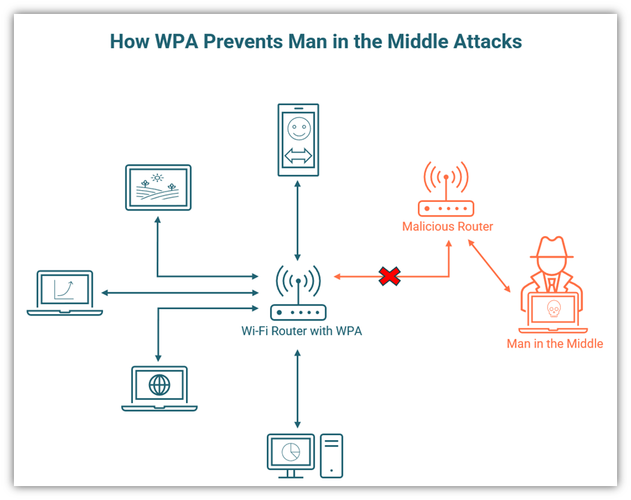Una ilustración básica de cómo WPA previene los ataques del tipo "man in the middle".

### 6. Implemente una política de contraseñas precisa

Las contraseñas son la primera línea de defensa contra cualquier tipo de ciberataque, incluidos los ataques de intermediarios. Una contraseña segura puede proteger sus sistemas y cuentas de correo electrónico de los ciberdelincuentes que intentan entrar en su sistema mediante ataques de fuerza bruta. [IBM](https://www.ibm.com/downloads/cas/OJDVQGRY) informó que las credenciales robadas fueron el vector de ataque inicial más común: son responsables del 20 % de las violaciones de datos, lo que resultó en una pérdida promedio de $4,37 millones para las empresas entre mayo de 2020 y marzo de 2021.

También es digno de mención que, cuando las credenciales robadas fueron el vector de ataque inicial, se tardó más tiempo (341) en identificar y contener la vulneración. Esto subraya la importancia de tener una política de contraseñas precisa para su empresa que se implemente de manera estricta.

A continuación se presentan algunos consejos a tener en cuenta al crear [una política de contraseñas segura](https://cheapsslsecurity.com/blog/password-security-tips-you-should-know/) :

- El [FBI](https://www.fbi.gov/contact-us/field-offices/phoenix/news/press-releases/fbi-tech-tuesday-strong-passphrases-and-account-protection) recomienda el uso de frases de contraseña en lugar de contraseñas
- Las contraseñas deben mantenerse en secreto
- Todas las cuentas deben tener contraseñas únicas
- Si una contraseña se ve comprometida, debe cambiarse inmediatamente en el sitio web de la cuenta oficial.
- Las contraseñas deben ser difíciles de adivinar y no deben contener palabras o números de [la lista de contraseñas más comunes.](https://nordpass.com/most-common-passwords-list/)
- Utilice la autenticación multifactor o la verificación en dos pasos siempre que sea posible

Un gestor de contraseñas fiable puede resultar de gran ayuda si tienes que gestionar muchas contraseñas. Es como un armario en línea donde guardar todas tus contraseñas de forma segura. La mayoría de los gestores de contraseñas también te ayudan a generar contraseñas aleatorias para tus cuentas, de modo que solo tengas que recordar la contraseña maestra para tu gestor de contraseñas.

Se debe alentar a los empleados a utilizar la autenticación de dos factores o la verificación en dos pasos para iniciar sesión en dispositivos y cuentas a fin de que sus sistemas sean más seguros. Estos métodos agregan una capa de seguridad a las cuentas protegidas con contraseña y garantizan que la persona que intenta acceder a una cuenta es quien dice ser. También le ayuda a evitar tener que usar restablecimientos de contraseña, que los cibercriminales pueden sabotear para llevar a cabo [ataques MitM de restablecimiento de contraseña](https://medium.com/@brianrusseldavis/how-to-prevent-password-reset-mitm-prmitm-attacks-51592ad76c2c) .

### 7. Capacita a tus empleados

Puede implementar todas las medidas posibles, pero si sus empleados no siguen las reglas (o no saben qué reglas seguir), sus datos estarán en riesgo. La capacitación en concientización cibernética puede ayudarlo a llenar los vacíos de conocimiento para que sus empleados sean conscientes de las amenazas, sepan qué buscar (como sitios web falsos o inseguros) y qué deben o no deben hacer cuando operan en línea.

La capacitación en materia de ciberseguridad no debe realizarse una o dos veces, sino con regularidad durante todo el año. Todos los empleados, antiguos y nuevos, desde los miembros más jóvenes del equipo hasta los directivos, deben recibir capacitación para seguir la política de ciberseguridad. Algunos aspectos que se deben incluir en la capacitación:

- La política de contraseñas de la empresa
- Política sobre el uso de redes inalámbricas públicas o gratuitas
- La importancia de cerrar la sesión de las cuentas y bloquear los dispositivos cuando no están en uso
- Informar a la gerencia sobre actividades anormales
- Diferenciar entre correos electrónicos normales y correos electrónicos de phishing
- Utilizando únicamente sitios HTTPS
- Las últimas tendencias en ciberataques y seguridad

Las sesiones de capacitación deberían ser obligatorias para todos los empleados y los ejercicios deberían estar diseñados para poner a prueba sus conocimientos. La capacitación puede ser impartida por un equipo de seguridad interno o por expertos externos. Recuerde siempre que la seguridad de su empresa es tan fuerte como su eslabón más débil.

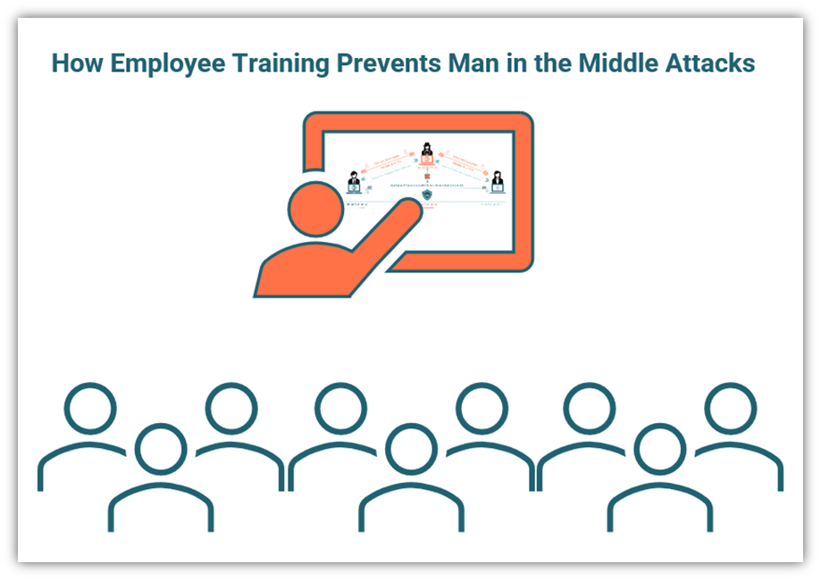Una ilustración de cómo entrenar a los empleados para reconocer y prevenir un ataque de tipo "hombre en el medio".

### 8. Implementar una arquitectura de confianza cero

El [informe de SonicWall sobre ciberamenazas de 2021](https://www.sonicwall.com/resources/white-papers/2021-sonicwall-cyber-threat-report/) reveló que hubo 4,77 billones de intentos de intrusión durante 2020, un marcado aumento respecto de los 3,99 billones de 2019. Cabe señalar que el 56,44 % de los intentos en 2020 se produjeron en América del Norte. El uso de una arquitectura de confianza cero es una forma de abordar este creciente problema.

El concepto de [arquitectura de confianza cero fue introducido por John Kindervag](https://www.helpnetsecurity.com/2021/04/06/john-kindervag-zero-trust/) , vicepresidente y analista principal del equipo de seguridad y riesgo de Forrester Research. La técnica de confianza cero implica no confiar en nadie ni en ningún dispositivo sin verificación. Pero la confianza cero es mucho más que MFA o 2SV: esta arquitectura garantiza que todos los empleados utilicen la autenticación adecuada para acceder a la información y se aseguren de que están autorizados a acceder a ella.

Básicamente, la idea es que ningún empleado pueda recuperar información para la que no esté específicamente autorizado. Cada persona es tratada como una amenaza potencial, lo que hace que el modelo de confianza cero sea increíblemente poderoso.

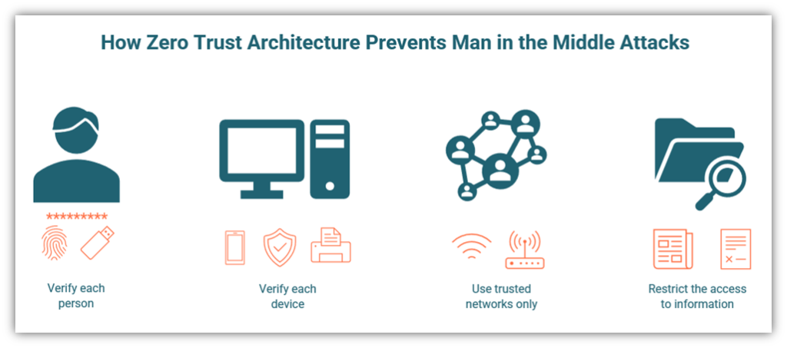Una mirada a cómo la implementación de confianza cero ayuda a prevenir un ataque del tipo "hombre en el medio".

### 9. Supervisar la actividad de la red

Los ataques de intermediario son notoriamente difíciles de descubrir. Sin embargo, hay señales reveladoras de un ataque de intermediario que se pueden observar si se supervisan adecuadamente las actividades de los empleados. Una empresa pequeña o mediana debe tener personas asignadas para supervisar las actividades en línea de todos los empleados.

A continuación se presentan algunas ideas para ayudarlo a implementar una [arquitectura de monitoreo](https://www.tek-tools.com/network/network-monitoring-guide-and-tools) eficaz como el método de prevención de ataques del intermediario final para nuestra lista:

- Definir un sistema claro para conectar dispositivos
- Proteja todos los dispositivos y su red con firewalls y software antimalware
- Formular políticas para compartir información en la organización y limitar el acceso a datos confidenciales según la necesidad de conocerlos.
- Observar y documentar los comportamientos de acceso a cuentas de los empleados en línea
- Monitorizar todo el tráfico que entra y sale de la red de la empresa
- Garantizar la notificación inmediata de cualquier tipo de falla de software o hardware.

Una vigilancia adecuada ayuda a garantizar que un ataque de intermediario se descubra más pronto que tarde. Aunque no hay una forma infalible de saber si te está vigilando un intermediario, hay ciertas señales que pueden alertarte. Analizaremos estas señales en la siguiente sección.

## Consejos para detectar el hombre en el medio y señales a tener en cuenta

Detectar un ataque de intermediario es, cuanto menos, un desafío. No existe una lista única de consejos para detectarlo, ya que hay demasiadas posibilidades en función de las tecnologías que tenga implementadas y de cómo se protejan las cosas. Algunos ejemplos rápidos de lo que puede hacer para detectar posibles ataques MitM incluyen los siguientes:

- Utilice herramientas de monitoreo de red para inspeccionar el tráfico que entra y sale de su red
- Analice su sitio web y su red en busca de malware
- Analizar los registros de conexión para detectar desconexiones repetidas
- Utilice herramientas de detección de manipulaciones

Si usted o alguno de sus empleados observan que sus sistemas se comportan de manera anormal, debe verificar si ha sido víctima de un ataque de intermediario. A continuación, se incluye una lista rápida de señales a las que debe prestar atención y que pueden indicar un ataque de intermediario. (Nota: esta lista no es exhaustiva). 

- Observas que aparecen direcciones web extrañas en tu navegador
- Su navegador cambia inesperadamente a sitios web que no son HTTPS
- Hay retrasos inusuales en sus solicitudes en línea o desconexiones frecuentes
- Su uso de Internet aumenta inesperadamente
- Observas transacciones bancarias que no realizaste
- Alguno de sus asociados o clientes recibe comunicaciones que dicen ser suyas, pero usted no las envió.

Un ataque de intermediario no es solo un tipo de ciberataque, sino también un método que utilizan los cibercriminales para lanzar otros tipos de ataques. A lo largo de esta serie de artículos, hemos explorado varias áreas clave que se deben conocer sobre los ataques MitM:

- Lo que es un ataque de hombre en medio,
- Los diferentes tipos de hombre en el medio atacan, y
- Cómo detectar y prevenir los ataques del tipo "hombre en el medio".

Con el aumento de la incidencia de este tipo de ataques, está claro que tenemos que invertir más tiempo y esfuerzo para mantenerlos bajo control. Cuanto más sepa, más seguros estarán usted y su empresa. Esperamos que este artículo sobre la prevención de ataques de intermediario le haya resultado útil.

---

_.ref:_

- https://cheapsslsecurity.com/blog/types-of-man-in-the-middle-attacks/
- https://cheapsslsecurity.com/blog/man-in-the-middle-attack-prevention/