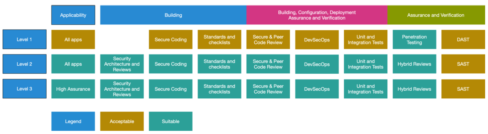

# OWASP

El Estándar de Verificación de Seguridad en Aplicaciones (ASVS; por sus siglas en inglés) es una lista de requisitos o pruebas de seguridad en aplicaciones que puede ser utilizado por arquitectos, desarrolladores, probadores, profesionales de la seguridad, proveedores de herramientas y consumidores para definir, construir, probar y verificar aplicaciones seguras.

El ASVS es un esfuerzo impulsado por la comunidad para establecer un marco de requisitos y controles de seguridad que se centran en definir los controles de seguridad funcionales y no funcionales requeridos al diseñar, desarrollar y probar aplicaciones web y servicios web modernos.

ASVS tiene dos **objetivos principales**:

- Ayudar a las organizaciones a desarrollar y mantener aplicaciones seguras.
- Permitir que los proveedores de servicios de seguridad, los proveedores de herramientas de seguridad y los consumidores alineen sus requisitos y ofertas.

## Niveles de ASVS
El estándar de verificación de seguridad de aplicaciones define tres niveles de verificación de seguridad, con cada nivel aumentando en profundidad.

- **ASVS Nivel 1** es para bajos niveles de garantía, y es completamente comprobable con pentesting.
- **ASVS Nivel 2** es para aplicaciones que contienen datos confidenciales, que requiere protección y es el nivel recomendado para la mayoría de las aplicaciones.
- **ASVS Nivel 3** es para las aplicaciones más críticas - aplicaciones que realizan transacciones de alto valor, contienen datos médicos sensibles, o cualquier aplicación que requiere el más alto nivel de confianza.

Cada nivel ASVS contiene una lista de requisitos de seguridad. Cada uno de estos requisitos también se puede asignar a características y capacidades específicas de seguridad que los desarrolladores deben integrar en el software.

El nivel 1 (L1) es el único nivel que es completamente comprobable de penetración usando humanos. Todos los demás requieren acceso a la documentación, el código fuente, la configuración y las personas involucradas en el proceso de desarrollo.

---

ref: 

- [Software de gestión de vulnerabilidades](https://geekflare.com/es/best-vulnerability-management-software/)
- [Administración de vulnerabilidades](https://www.microsoft.com/es-es/security/business/security-101/what-is-vulnerability-management) &rarr; [Microsoft - Security 101](https://www.microsoft.com/es-es/security/business/security-101)

- Original: https://github.com/OWASP/ASVS/tree/v4.0.3/4.0 &rarr; [OWASP Application Security Verification Standard 4.0.3-es](https://github.com/OWASP/ASVS/blob/v4.0.3/4.0/OWASP%20Application%20Security%20Verification%20Standard%204.0.3-es.pdf)