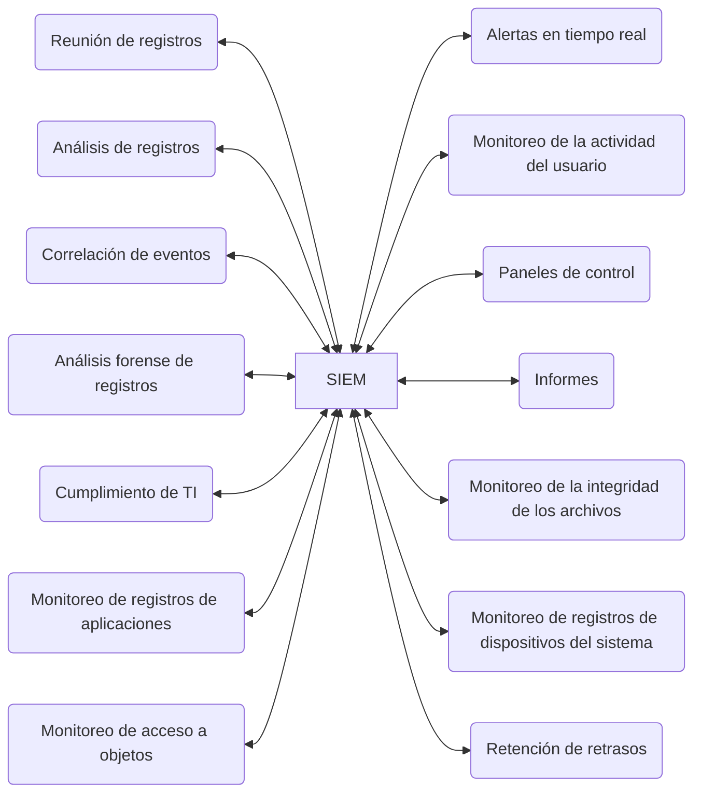

# Sistemas SIEM y SOAR

### **Sistemas SIEM y SOAR: Monitoreo y Respuesta a Incidentes**

Los sistemas para el monitoreo y la respuesta a incidentes de seguridad en las organizaciones, más conocidos como sistemas **SIEM (Security Information and Event Management)** y sistemas **SOAR (Security Orchestration, Automation, and Response)**, son esenciales para la monitorización y el mantenimiento de la seguridad en entornos digitales. Estos sistemas ayudan a centralizar los datos de eventos y alertas de seguridad provenientes de múltiples fuentes, proporcionando una visión integral de la red y sus posibles vulnerabilidades.

#### **1. ¿Qué es un sistema SIEM?**
Se conocen como **SIEM** **(Security information and event management)** a los sistemas de gestión de eventos e información de seguridad que reúnen información de todos nuestros sistemas y lo analizan todo, ofreciendo una visión integral de los eventos e incidentes en una organización. Son herramientas de gestión de información y eventos de seguridad que centralizan, analizan y correlacionan los datos de seguridad en tiempo real. Reciben información de una variedad de dispositivos y sistemas dentro de una organización, tales como: 
- **Firewalls**
- **IDS/IPS (Intrusion Detection and Prevention Systems)**
- **Routers, switches y servidores**
- **Sistemas basados en host** y **sistemas basados en red**

**Objetivo principal**: Ofrecer una **visión completa** de los eventos de seguridad en la red y facilitar la detección de amenazas o incidentes que puedan afectar a la organización.

#### **2. ¿Qué es un sistema SOAR?**

Se conocen como **SOAR (Security Orchestration, Automation, and Response)** a los sistemas de orquestación, automatización y respuesta de seguridad. **SOAR** se considera una evolución del SIEM, ya que no solo centraliza la información de seguridad, sino que además puede **automatizar la respuesta a incidentes**. Son una solución de software que utiliza  la **inteligencia artificial (AI)** y el **machine learning** para permitirnos responder a algunos incidentes de seguridad de forma automática. Un **SOAR** puede reaccionar de forma proactiva a las amenazas detectadas sin intervención humana, mejorando la capacidad de respuesta ante incidentes críticos..

**Diferencias con SIEM**:
- Mientras que un SIEM **notifica** sobre incidentes, un SOAR **responde automáticamente**.
- Los sistemas SOAR pueden gestionar múltiples fuentes de datos, integrándose con **herramientas de inteligencia de amenazas**, **sistemas de gestión de vulnerabilidades**, y **ITSM (IT Service Management)**.

#### **3. Datos y alertas en los sistemas SIEM/SOAR**
Ambos sistemas recopilan una vasta cantidad de datos de seguridad, incluidos:
- **Logs de eventos** de dispositivos de red.
- **Alertas** de firewalls, IDS/IPS, y sistemas basados en host.
- **Estado de los recursos**, como el uso de memoria, discos, temperatura en los centros de datos, y más.

Para que los sistemas funcionen correctamente, es esencial una **configuración adecuada**, ya que la sobrecarga de alertas irrelevantes puede generar falsos positivos o perder eventos críticos. Cuando se configuran correctamente, los **SOAR** son capaces de filtrar y priorizar las alertas más importantes, ayudando al equipo de seguridad a enfocarse en las amenazas reales.

#### **4. Seguridad de los sistemas SIEM y SOAR**
Dado que estos sistemas tienen acceso a **información crítica** y datos sensibles, es fundamental protegerlos adecuadamente. Se recomienda que solo el personal de **superadministradores** tenga acceso directo, y se implementen medidas de **redundancia y copias de seguridad**. Por ejemplo, el uso de **WORM media** (Write Once Read Many), asegura que los datos almacenados no puedan ser modificados o eliminados una vez escritos.

#### **5. Ventajas de SOAR sobre SIEM**
Aunque los sistemas **SIEM** son comunes en la mayoría de las organizaciones, los **SOAR** están ganando popularidad debido a sus capacidades adicionales:
- **Análisis avanzado con IA**: Los SOAR no solo registran eventos, sino que también analizan los datos de manera inteligente para reducir el volumen de alertas y priorizar las más críticas.
- **Automatización de la respuesta**: Los sistemas SOAR pueden ejecutar acciones automatizadas, como **bloquear un puerto** o **aislar un dispositivo infectado**, sin intervención humana.
- **Integración completa**: Los SOAR se integran fácilmente con otros sistemas, como la gestión de vulnerabilidades y la inteligencia de amenazas, para crear una **defensa en profundidad** más robusta.

#### **Resumen y Recomendaciones**
- **SIEM** es una herramienta fundamental para **recopilar y centralizar** los datos de seguridad, permitiendo a los equipos de TI monitorizar y responder a amenazas.
- **SOAR** es una evolución más avanzada, que no solo gestiona y correlaciona los eventos, sino que también **automatiza la respuesta** y utiliza **IA** para mejorar la eficiencia y efectividad de la detección de incidentes.
- **Importancia de la configuración**: Un SIEM o SOAR correctamente configurado garantiza que solo se generen alertas relevantes, optimizando la carga de trabajo del equipo de seguridad.
- **Seguridad de los sistemas SIEM/SOAR**: Estos sistemas deben ser protegidos rigurosamente y administrados solo por personal autorizado debido a su acceso crítico a la información de la organización.

### **Enlaces útiles**:
- [SIEM y SOAR en IBM Security](https://www.ibm.com/security/security-intelligence/siem) – Más sobre SIEM y SOAR desde el punto de vista de IBM.
- [Implementación de SIEMI](https://ciberseguridad.blog/las-mejores-practicas-para-implementar-una-estrategia-siem/) – Recomendaciones para la implementación de un SIEM.
- [Qué es SOAR en Palo Alto Networks](https://www.paloaltonetworks.com/cyberpedia/what-is-soar) – Explicación detallada de SOAR y sus beneficios.

La correcta elección e implementación de un SIEM o SOAR permite a las organizaciones estar mejor preparadas para detectar y responder a incidentes de seguridad en tiempo real, mejorando su postura de seguridad y reduciendo el tiempo de respuesta ante amenazas críticas.

### Sistemas de Gestión de Información y Eventos de Seguridad (SIEM)

Los **SIEM (Security Information and Event Management Systems)** son soluciones críticas para el monitoreo de la seguridad de redes empresariales. Estos sistemas permiten la recopilación, análisis y correlación de eventos de seguridad en tiempo real o casi en tiempo real, generados por hardware de red y aplicaciones.

#### **Funciones y Beneficios de un SIEM**
1. **Revisión de logs**: Los SIEM facilitan la **revisión de registros** provenientes de diversas fuentes dentro de una organización, como firewalls, sistemas IDS/IPS (Intrusion Detection and Prevention Systems), routers y servidores.
   
2. **Correlación de eventos**: Los SIEM permiten **correlacionar eventos** de múltiples sistemas. Por ejemplo, si un usuario accede a la red desde dos ubicaciones geográficas diferentes al mismo tiempo, un SIEM detectará esta anomalía y la marcará para revisión.

3. **Alertas de seguridad**: Los SIEM generan alertas automáticas cuando detectan comportamientos sospechosos o que coinciden con casos predefinidos, lo que permite una **respuesta rápida** a incidentes.

#### **Implementación de un SIEM**
Para implementar un SIEM con éxito, se deben tener en cuenta varios factores:
1. **Recolección de eventos relevantes**: Filtrar los eventos irrelevantes y definir claramente qué datos se deben recopilar.
   
2. **Casos de uso**: Desarrollar **casos de uso** que definan qué constituye una amenaza y cómo se responderá a esos eventos.

3. **Respuestas predefinidas**: Planificar respuestas ante ciertos incidentes comunes, como accesos no autorizados o uso de credenciales comprometidas.

4. **Seguimiento de eventos**: Implementar un sistema de **ticketing** que permita rastrear incidentes de seguridad y garantizar que se aborden adecuadamente.

5. **Hunting de amenazas**: Realizar análisis proactivos para detectar amenazas que no generaron alertas inmediatas.

6. **Auditoría y análisis**: Proveer evidencia detallada para auditores y analistas con el fin de revisar el historial de eventos de seguridad.

#### **Soluciones SIEM Destacadas**
1. **[Splunk](https://www.splunk.com/)**: Una de las principales herramientas del mercado, **Splunk** permite la recolección, análisis y visualización de grandes volúmenes de datos. Ofrece conectores para diversos sistemas operativos y aplicaciones, con una poderosa interfaz de visualización y búsqueda en tiempo real.

2. **[Elastic Stack](https://www.elastic.co/elastic-stack/)**: Compuesto por **Elasticsearch** (análisis de datos), **Logstash** (recolección de logs), **Kibana** (visualización) y **Beats** (agentes de recopilación de datos), es una solución **open-source** ideal para organizaciones con presupuestos ajustados.

3. **ArcSight**: Este SIEM es conocido por su uso en la **gestión de cumplimiento normativo**, con soporte para estándares como HIPAA, PCI DSS, y SOX. Ofrece un robusto sistema de análisis y presentación de eventos.

4. **[IBM QRadar](https://www.ibm.com/products/qradar)**: Solución de SIEM que ofrece gestión de logs, análisis de seguridad y cumplimiento normativo, con una interfaz visual poderosa.

5. **[AlienVault OSSIM](https://cybersecurity.att.com/products/ossim)**: Sistema de gestión de seguridad basado en herramientas **open-source**. Integrado con herramientas como **Snort** y **OpenVAS**, AlienVault es una opción económica con una amplia gama de funcionalidades.

6. **GrayLog**: Herramienta de SIEM **open-source** enfocada en **DevOps** y operaciones de TI, con una versión empresarial que mejora sus capacidades.

#### **Conclusión**
Los sistemas SIEM son esenciales para las organizaciones que buscan gestionar proactivamente la seguridad de sus redes. Con una implementación adecuada y el uso de casos de uso y respuestas predefinidas, los SIEM pueden identificar y responder rápidamente a incidentes de seguridad. Entre las principales opciones del mercado se encuentran tanto soluciones comerciales como alternativas **open-source**, adecuadas para diferentes necesidades y presupuestos.

Estos sistemas permiten a las empresas reforzar su postura de seguridad mediante el análisis de datos en tiempo real, ayudando a detectar y responder a posibles amenazas con mayor eficiencia.