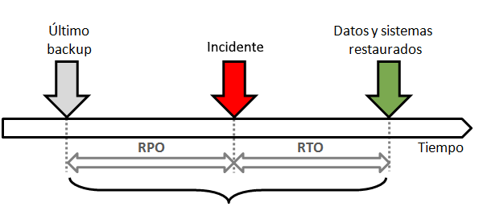

# Análisis de Impacto de Negocio

El [BIA](https://www.globalsuitesolutions.com/es/que-es-business-impact-analysis/)(**Bussiness Impact Analysis**) sirve para determinar y evaluar los impactos potenciales de una interrupción en las operaciones comerciales críticas, debido a desastres, accidentes o emergencias.

**No existe un método único para realizar un** **análisis de impacto empresarial**. Para cada negocio será más conveniente uno u otro, y cada empresa necesita personalizar su proceso de acuerdo con las necesidades únicas de su organización. 

### 1. Recopilación de Información

Mediante entrevistas, formularios, cuestionarios, etc… se reúne información acerca de las actividades que hacen que la empresa ofrezca su Servicio. Esta información se suele recopilar con entrevistas a los empleados que ejecutan y gestionan cada actividad.

#### Formularios

Podemos usar **formularios para conocer el papel de los sistemas de información en el negocio, su criticidad y el coste de interrupción**.

Distribuyendo un formulario entre los trabajadores de una empresa (o solo a responsables de área) en los que respondan preguntas que ayuden a identificar las funciones clave en esa área para después pasar a valorarlas y ordenarlas en función de su criticidad.

No existe un formulario único, ya que dependerá de como trabaje cada empresa o de lo exhaustivo que se quiera ser.

#### Entrevistas a usuarios clave y reuniones con personal técnico

Entrevistarse con trabajadores clave de la organización y realizar reuniones con personal técnico de la misma.

 ```mermaid
 flowchart TD
     A[Servicio] --> B(Actividad A)
     A[Servicio] --> C(Actividad B)
     A[Servicio] --> D(Actividad C)
     B --> E(Recurso 1)
     B --> F(Recurso 2)
     C --> G(Recurso 3)
     D --> H(Recurso 4)
     D --> I(Recurso 5)
 ```

 

También determinaremos cuales son los recursos humanos y tecnológicos que necesita cada actividad para operar con éxito lo que nos servirá para tener identificados a los empleados clave para que las actividades se recuperen.

Algunos de los posibles recursos tenológicos que intervienen en un proceso de negocio pueden ser:

- **Equipos hardware de procesamiento**: servidores, estaciones de trabajo, ordenadores portátiles, dispositivos móviles como tablet-PC, PDA, smartphones, e impresoras.
- **Soportes de información**: Soportes de Backups.
- **Equipos de comunicaciones de red**: router, switch, firewalls, líneas de comunicaciones, centralitas telefónicas, faxes, terminales telefónicos fijos, y móviles.
- **Programas**: sistemas operativos, aplicaciones y utilidades.
- **Servicios de soporte**: Sistema eléctrico y de alimentación ininterrumpida (SAI), aire acondicionado, y elementos de fijación (armarios de rack). 

### 2. Revisión y análisis de información

Con toda la información recopilada acerca de las actividades comerciales de la organización, podemos empezar a realizar el Análisis de Impacto de Negocio.

Aquí determinaremos **que actividades son las más críticas para garantizar la continuidad de la empresa valorando que impacto Legal, Reputacional o Financiero supondría para la organización la interrupción de cada actividad por un cierto tiempo en concreto.** Esto nos dará la información de que actividades tendrían que ser las primeras en funcionar y cuales podrían esperar en caso de un desastre.

En la siguiente tabla calculamos el [RTO](https://www.veritas.com/es/es/information-center/rto) de cada actividad.


 

RTO (Tiempo de Recuperación Objetivo) es el tiempo que transcurre desde que se te cae una actividad hasta que la recuperas a un estado aceptable como para seguir dando el servicio y sin afectar a la continuidad del negocio.

RPO (Punto de Recuperación Objetivo) es la cantidad de información que te puedes permitir perder.



 

---

XUN 2024