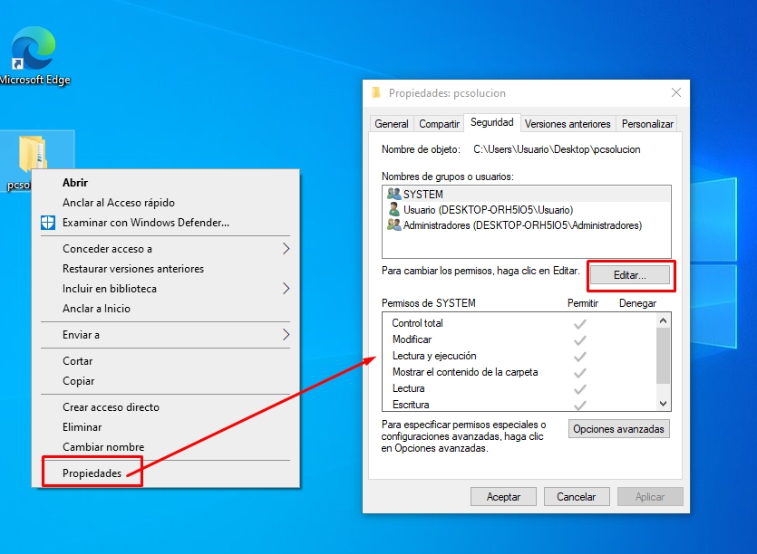

# Máquinas Virtuales y Gestión de permisos en Windows

## Máquinas Virtuales

Un máquina virtual es un entorno virtual que funciona como **un ordenador dentro de otro ordenador**.

Las máquinas virtuales son capaces de funcionar utilizando sus propios recursos (procesador, memoria RAM, sistema operativo, etc.) de una forma aislada del ordenador real.

Al encontrarse estas aisladas del sistema anfitrión, son el entorno perfecto para ejecutar aplicaciones y configuraciones a modo de prueba sin poner en peligro la máquina física.

La virtualización utiliza software para simular hardware virtual lo que permite que varias máquinas virtuales se ejecuten en una sola máquina.

 

### Seguridad

Al estar aisladas del sistema operativo anfitrión, las vulnerabilidades como el [MALWARE](https://pc-solucion.es/2020/08/02/malware/) no afecta n el hardware subyacente (la máquina física), por lo que estas son ideales para probar aplicaciones de origen dudoso o incluso nuevas configuraciones en un software antes de que entre en producción.

Además de estas ventajas, una máquina virtual que se vea comprometida puede volver a un estado anterior correcto de forma rápida y sencilla gracias al software que gestiona las máquinas.

 

### Software de Virtualización

Existen diversas aplicaciones de virtualización, tanto gratuitas como de pago.

Algunas de las más conocidas son Virtual Box, VMWare o Hyper-V que viene preinstalada (pero desactivado) en la mayoría de versiones de Windows. 

 

## Gestión de permisos en Windows

Antes de empezar a gestionar los permisos en Windows, vamos a ver la definición de una cuenta de usuario y grupo.

- Una **cuenta de usuario** es una colección de configuraciones y permisos específicos que determinan lo que este puede y no puede hacer en el ordenador.
- Un **grupo** es un conjunto de cuentas de usuario que comparten los mismos derechos de acceso al ordenador y tienen derechos de seguridad comunes.

 

### Tipos de permisos de archivos y carpetas en Windows

Para poder editar los permisos, debemos tener la propiedad del archivo o carpeta.

Si no indicamos lo contrario, los permisos se heredan. Esto significa que los permisos de una carpeta raíz se heredan a los archivos y subcarpetas que *se* encuentran en ella.

 

#### Permisos de archivos

- Control total -> Puede realizar todas las acciones. Abarca todos los permisos menos eliminar archivos, cambiar permisos y tomar posesión.
- Lectura y ejecución -> Ver el nombre del archivo, contenido, atributos y permisos y ejecutar programas.
- Lectura -> Ver el nombre del archivo, contenido, atributos y permisos.
- Escritura -> Editar o modificar el archivo.

 

#### Permisos de carpetas

- Control total. Puede realizar todas las acciones. Comprende todos los permisos, menos eliminar archivos y subdirectorios, cambiar permisos y tomar posesión.
- Lectura y ejecución. Ver el nombre de archivos y directorios, datos de los archivos, atributos y permisos y ejecutar programas.
- Mostrar el contenido de la carpeta -> Lo mismo que el anterior pero aplicado solo a archivos.
- Lectura -> Ver nombres de archivos y directorios, ver contenido de archivos y ver atributos y permisos.
- Escritura -> Crear archivos y subdirectorios, añadir datos a los archivos y leer los permisos.
- Permisos especiales -> Algunos como tomar posesión o derecho a eliminar.

 

 

---

XUN 2024