# Sistema(s) Operativo(s)

Básicamente un **sistema operativo** es un conjunto de software que se encarga de hacer de intermediario entre el usuario y las aplicaciones y el hardware del sistema.

Para ello, el S.O. se encarga de gestionar el hardware del sistema para ofrecer una serie de servicios al usuario y aplicaciones de forma que éstos se abstraen de los detalles del hardware.

Por tanto, de lo anterior se podría decir que un sistema operativo es un software cuya función es:

1. Hacer de intermediario entre el usuario y las aplicaciones y el hardware del sistema.
2. Gestionar el hardware del sistema, para ofrecer una serie de servicios más elaborados tanto al resto de aplicaciones como al propio usuario.

Un sistema operativo está compuesto por varias piezas o componentes de software donde podemos destacar los siguientes elementos: kernel o núcleo del sistema, getor de procesos, gestor de memoria, gestor de entrada/salida, gestor de sistemas de archivos, interfaz de usuario y herramientas del sistema.

### El mapa completo

De esta forma tenemos el mapa completo del sistema informático, por un lado usuarios y aplicaciones interactuan con el sistema operativo a través de la interfaz de usuario o la API del sistema operativo respectivamente.

El sistema operativo interactua con el hardware a través de los controladores o drivers. Los controladores son proporcionados por los fabricantes del hardware, que son los que realmente conocen como funciona, al sistema operativo para permitir o facilitar la comunicación entre dispositivo harware y sistema operativo.

Las distintas partes del sistema operativo encargadas de gestionar el hardware se encargan de proporcionar esa capa de abstracción necesaria para trabajar con la complejidad de la gestión de los recursos disponibles en el sistema. Por ejemplo, el gestor de procesos se encarga de gestionar la CPU entre los distintos procesos que se ejecutan en el sistema, así como gestionar los propios procesos.

## Funciones del sistema operativo: Gestión del Hardware

Para poder realizar su función principal, que es la de hacer de intermediario entre aplicaciones y usuarios y el hardware del sistema, el S.O. debe encargarse de gestionar los recursos hardware del sistema.

Para ello, como ya hemos visto, el S.O. debe proporcionar una **capa de abstracción** sobre el hardware existente y debe proporcionar una serie de **servicios** que permitan acceder a estos **recursos hardware**. Además, el S.O. deberá encargarse de gestionar estos recursos a través de esos servicios.

Dicho de otro modo: el S.O. se encarga de gestionar los recursos hardware del sistema para ofrecer una serie de servicios a las aplicaciones y usuario del sistema.

Hay una serie de servicios que son comunes a los sistemas operativos y que se encargan de **gestionar recursos importantes** del sistema informático.

Los principales recursos hardware que debe gestionar todo sistema operativo son la **CPU, la memoria principal, los sistemas de archivos (almacenamiento secundario y auxiliar) y los dispositivos de E/S**.

A continuación se enumeran estos recursos hardware y la parte del sistema operativo que los gestiona.

### Gestión de la CPU

La CPU es un recurso más que debe ser gestionado por el S.O.

La gestión de la CPU es una de las funciones críticas del sistema operativo, que involucra la planificación de procesos, la conmutación de contexto, y la gestión de estados y sincronización entre procesos. Estos mecanismos aseguran que la CPU se utilice de manera eficiente y que los procesos se ejecuten de manera justa y ordenada.

Un **proceso** es un programa en ejecución.

Los programas que se ejecutan en el sistema, denominados procesos, quieren utilizar la CPU para poder ejecutar sus instrucciones. Sin embargo, solo hay una CPU (o varias CPUs o una CPU con varias unidades funcionales o núcleos) y muchos procesos compitiendo por utilizarla.

El sistema operativo se tiene que encargar de decidir qué proceso (programa en ejecución) utilizará la CPU, durante cuanto tiempo, quien será el siguiente proceso en ejecutarse, etc. 

Sí, el sistema operativo (SO) tiene la responsabilidad de gestionar el uso de la CPU entre los diferentes procesos que se están ejecutando. Esta gestión es fundamental para asegurar que el sistema funcione de manera eficiente y que los recursos se utilicen de forma óptima. A continuación, se explican algunas de las principales tareas que el sistema operativo debe realizar en relación con la gestión de la CPU:

#### Planificación de la CPU (CPU Scheduling)

1. **Decisión de qué proceso utilizará la CPU (scheduling):**
   El sistema operativo debe decidir cuál de los procesos en estado de espera (listo para ejecutarse) debe ser asignado a la CPU. Esto se hace a través de algoritmos de planificación que pueden ser:
   - **Primero en llegar, primero en ser servido (FCFS, First-Come, First-Served)**
   - **Tiempo más corto siguiente (SJF, Shortest Job Next)**
   - **Planificación por prioridad**
   - **Planificación circular (Round Robin)**
   - **Planificación multinivel y planificación multinivel con retroalimentación**

2. **Duración del uso de la CPU por parte de cada proceso:**
   Dependiendo del algoritmo de planificación, el sistema operativo también debe decidir cuánto tiempo puede un proceso permanecer en la CPU antes de ser preemptado (interrumpido) para darle la oportunidad a otro proceso. Por ejemplo, en la planificación round robin, cada proceso recibe un "quantum" de tiempo fijo para ejecutarse antes de ser cambiado por otro proceso.

3. **Selección del siguiente proceso a ejecutarse:**
   Una vez que el proceso actual ha terminado su ejecución o ha sido interrumpido, el SO debe seleccionar el siguiente proceso de la cola de listos para asignarle la CPU.

#### Gestión de Estados de los Procesos

Los procesos pasan por varios estados durante su ciclo de vida, y el sistema operativo debe gestionar estos cambios de estado:

- **Nuevo (New):** El proceso está siendo creado.
- **Listo (Ready):** El proceso está preparado para ejecutarse y esperando a ser asignado a la CPU.
- **En ejecución (Running):** El proceso está siendo ejecutado en la CPU.
- **Esperando (Waiting):** El proceso está esperando a que se complete algún evento (por ejemplo, una operación de E/S).
- **Terminado (Terminated):** El proceso ha finalizado su ejecución.

#### Conmutación de Contexto (Context Switching)

Cuando el sistema operativo decide cambiar de un proceso a otro, debe realizar una conmutación de contexto, que implica:
- Guardar el estado del proceso actual (registros de la CPU, contador de programa, etc.).
- Restaurar el estado del siguiente proceso a ejecutarse.

#### Sincronización y Comunicación entre Procesos

El sistema operativo también debe gestionar la sincronización y la comunicación entre procesos para evitar condiciones de carrera y asegurar que los procesos puedan cooperar de manera segura y eficiente.

#### Manejo de Interrupciones

Las interrupciones permiten al sistema operativo responder rápidamente a eventos del hardware (como señales de E/S) y a eventos del software (como excepciones y señales). La CPU puede ser interrumpida para cambiar la ejecución a una rutina de manejo de interrupciones.

### Gestión de procesos en Windows

Windows es un **sistema operativo multitarea**, es decir, es capaz de tener varios procesos en ejecución a la vez. Realmente es un sistema operativo **pseudomultitarea**, porque en la realidad no se pueden ejecutar a la vez más procesos que núcleos o unidades funcionales tengan los microprocesadores del sistema.

Por ejemplo, supongamos que en nuestro sistema tenemos un microcesador con 8 núcleos o unidades funcionales. Esto significa que cómo mucho se pueden ejecutar 8 instrucciones a la vez, cada una de un proceso distinto. Si solo tuvieramos 8 procesos en ejecución y no hubiera ning´ún bloqueo entre procesos, estaríamos en multitarea real. Pero esto no es lo habitual.

¿Entonces, cómo consigue el sistema operativo tener varios procesos a la vez en ejecución cuando solo tiene un microprocesador con varios núcleos?. Utilizando técnicas de planificación de proceso y compartiendo la CPU o núcleos entre varios procesos a la vez. Básicamente lo que se hace es alternar la CPU, dejar el uso de la CPU, un *ratito* a cada proceso. Estos intercambios son tan rápidos que para el usuario es c´ómo si se estuvieran ejecutando los procesos a la vez. Estudiaremos estas técnicas más adelante.

#### Jugando con Windows

En Windows tenemos la herramienta **Administrador de tareas** para poder comprobar qué procesos se están ejecutando en el sistema, entre otras opciones. Para lanzar el administrador de tareas podemos pulsar aceleradores de teclado o pulsar con el botón secundario sobre la barra de tareas y seleccionamos administrador de tareas.

<strong>&rarr; Lanzando el administrador de tareas desde la barra de tareas</strong>

Podemos usar el **acelerador CTRL+ALT+SUPR**, sin embargo si estamos en un sistema invitado (máquina virtual) esta pulsación de teclado la capturará el sistema anfitrión. Así que deberíamos utilizar HOST+SUPR.

Si estamos en VirtualBox pulsamos HOST + Supr. Si no lo hemos cambiado, la tecla de Host será CTRL derecho.

Quizá la mejor opción sea utilizar el acelerador de teclado **CTRL+SHIFT+ESC**.

Esta es la ventana principal del Administrador de tareas. Ahora mismo no hay ninguna aplicación en ejecución, no obstante si nos fijamos en la **barra de información** que aparece en la parte inferior de la ventana, nos indica que hay **30 procesos**.

Vamos a lanzar dos exploradores de windows y un Internet Explorer.

Si nos fijamos el número de procesos solo ha aumentado en dos.

Según la pantalla, tenemos tres aplicaciones en ejecución, así que deberíamos tener tres procesos en ejecución. Nuestro sistema solo tiene un núcleo, ¿cómo es posible esto?.

Primero, porque el sistema operativo se encarga de gestionar la CPU dejando que cada proceso en ejecución pueda usarla durante un tiempo finito llamado Quantum. Así lo que hace es alternar el uso de la CPU entre los procesos en ejecución.

Segundo, aunque hayamos ejecutado tres aplicaciones, hay aplicaciones del sistema en ejecución en **segundo plano**. Una aplicación se ejecuta en segundo plano cuando no tiene interfaz de usuario, no necesita interactuar directamente con el usuario.

Vamos a la pestaña procesos.

Procesos en ejecución en nuestro sistema del usuario alumno.

Si queremos que se muestren todos los procesos en ejecución de todos los usuarios tenemos que pulsar en mostrar procesos de todos los usuarios.

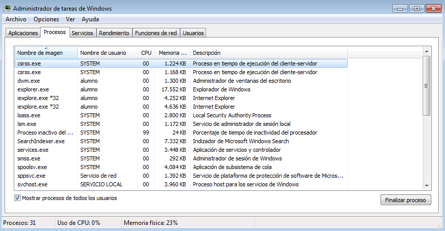

El sistema operativo es el que se encarga de gestionar todos estos procesos. Para ello, tiene que conocer cada proceso en ejecución e identificarlo de forma única.

Para identificar cada proceso de forma única se utiliza un número que se le asigna al proceso antes de que esté listo para ejecutarse. Este número o identificador se llama Identificador del Proceso o PID (Process Identificator)

Vamos a mostrar el identificador de proceso en el Administrador de tareas. Seleccionamos la opcion Ver del menú y elegimos Seleccionar columnas..

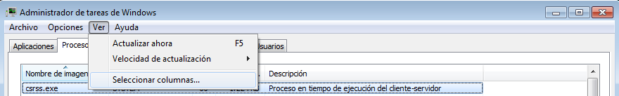

Seleccionamos Identificador de proceso y aceptamos.

Mostrando el PID en la información de procesos.

Podemos ordenar la lista de procesos por cada columna de forma ascendente o descendente haciendo clic en la columna. Por ejemplo, vamos a ordenar los procesos por su PID de menor a mayor.

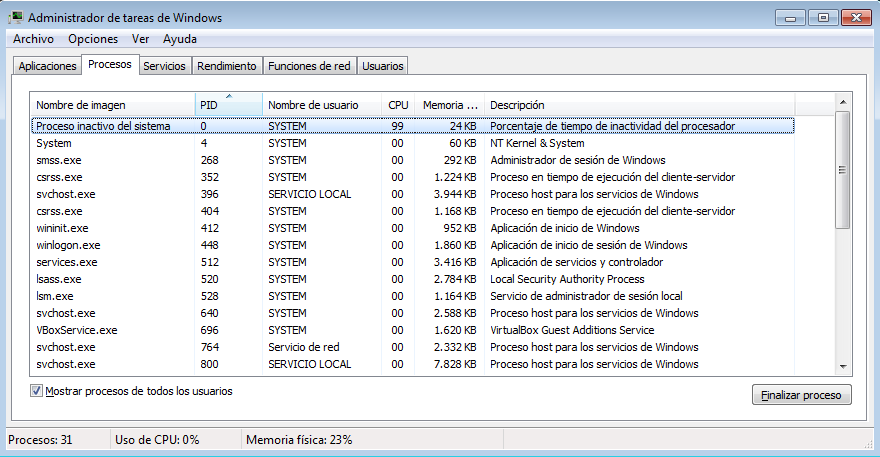

Procesos en ejecución ordenados por PID. Los primeros procesos serán los que primero se ejecutaron al lanzar el S.O.

Si nos fijamos el proceso con PID 0 se llama Proceso inactivo del sistema. Este proceso es un proceso ficticio que nos indica el tiempo de CPU que está sin utilizarse. Es decir, el tiempo que la CPU está ociosa porque no está ejecutando realmente nada.

El gestor de procesos es la parte del sistema operativo que se encarga de gestionar los procesos en ejecución dentro del sistema. Se tiene que encargar de crear y gestionar procesos, anotar la información necesaria para gestionar cada proceso (BCP y tabla de procesos), planificar qué procesos cogen la CPU en cada instante (planificador), qué procesos se quedan en espera de E/S, etc.

### Gestión de memoria principal

Para que un proceso se pueda ejecutar, tiene que estar en memoria principal.

Necesitan cargar sus instrucciones para que la CPU pueda ejecutarlas, necesita cargar sus datos (variables) para que las instrucciones hagan uso de ellas, etc.

El sistema operativo deberá gestionar la memoria como un recurso más, puesto que tiene una capacidad limitada. Deberá asignar memoria a procesos, liberar memoria cuando un proceso termine de utilizarla, proteger las zonas de memoria de accesos no autorizados, etc.

La parte del sistema operativo que se encarga de gestionar la memoria principal es el Gestor de memoria.

##### Jugando con Windows

Vamos a echar un vistazo al Administrador de tareas para ver la cantidad de memoria que tiene asignada cada proceso en ejecución en el sistema.

Administrador de tareas. Cantidad de memoria que está usando cada proceso en ejecución en el sistema

Vamos a ordenar los procesos por el uso que hacen de la memoria principal.

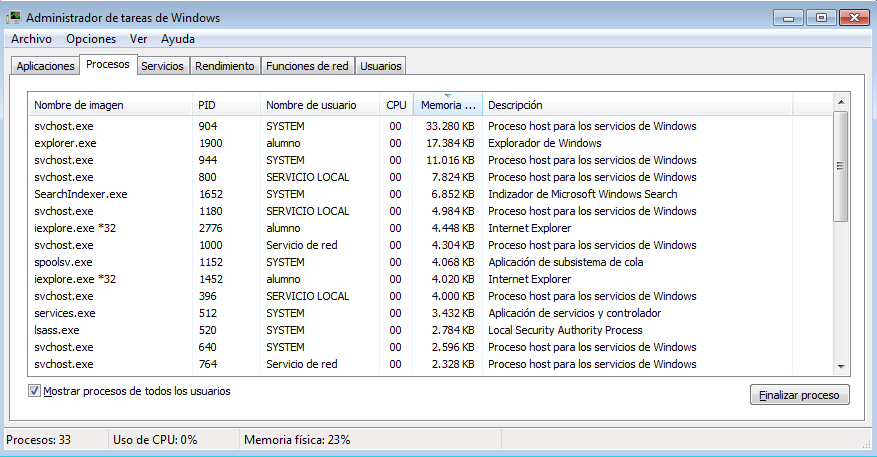

Vamos a echar un vistazo al proceso que más memoria tiene asignada svchot.exe. Vamos a buscar información sobre ese proceso, qué es, qué funcion tiene en el sistema, etc.

Por lo pronto sabemos que es el sistema el que lo ha ejecutado: Nombre de usuario System. Además nos dice en descripción que es un Proceso host para los servicios de Windows, pero no tenemos muy claro qué significa. Vamos a buscar información en Internet de este proceso.

Entrada de la wikipedia. Lo ideal es consultar la página del desarrollador.

Podemos consultar información sobre rendimiento y uso de la CPU y la memoria en la pestaña Rendimiento.

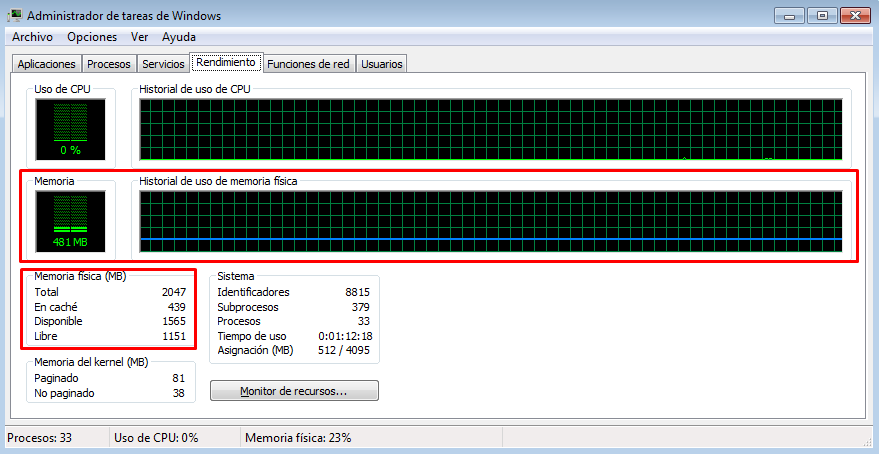Recursos CPU y Memoria. Podemos observar el uso de memoria que se está haciendo en el sistema actualmente, tanto de forma gráfica como con información numérica.

Información detallada del uso de memoria

Toda esta información que se está mostrando está almacenada en alguna estructura de datos que utiliza para gestionar la memoria principal el sistema operativo, concretamente el Gestor de memoria.

### Gestión de sistemas de archivos

La información debe almacenarse en memorias no volátiles si se desea que no se pierda al apagar el sistema. Para ello se utilizan memorias secundarias y auxiliares cuya tecnología permite el almacenamiento de información de forma persistente.

Sin embargo, estas memorias suelen estar estructuradas históricamente en bloques (sectores) y hay que llevar un registro
de qué sectores están libres y cuales ocupados, la estructura de directorios, qué archivos hay y qué sectores tienen asignado y en que orden, etc.

Para gestionar esta información hay una parte del sistema opertivo denominada Gestor de sistemas de archivos. La información que permite gestionar los archivos en una partición de disco se denomina Sistema de archivos.

#### Jugando con Windows

Vamos a lanzar el explorador de Windows.

Según la información que nos muestra el Explorador de Windows en Equipo podríamos pensar que tenemos dos discos duros, uno de 24,3 GB del que estamos utilizando 15,4 GB y otro de 19,5 GB del que estamos usando 0,1GB. Sin embargo esto no es así.

Vamos a lanzar la herramienta del sistema Administrador de equipos. Vamos a herramientas del sistema en el menú de windows.

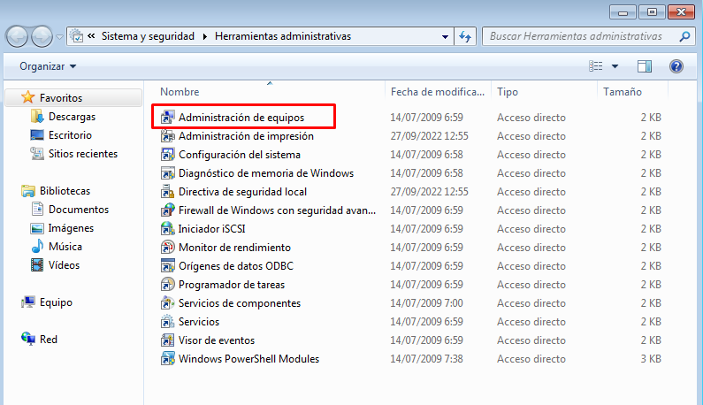

Herramientas administrativas. Conjunto de herramientas del sistema que utilizaremos para administrar distintas partes del sistema

Si nos fijamos, realmente si tenemos dos discos duros físicos en nuestro sistema, pero lo que nosotros hemos pensado inicialmente que eran discos duros, no lo son.

Se trata de unidades lógicas que representan a los sistemas de archivos de dos particiones distintas.

Cada partición para poder almacenar archivos debe contar con un sistema de archivos. Un sistema de archivos es la estructura de datos, toda la información necesaria, que permita gestionar archivos en dicha partición. Por ejemplo, el sistema de archivos debería almacenar la siguiente información:

- Lista de sectores libres.
- archivos almacenados y los sectores asociados a cada archivo en orden.

En nuestro caso en el disco duro 0 tenemos una partición de 100MB y otra de 25 GB aprox. ambas tienen sistema de archivos NTFS.

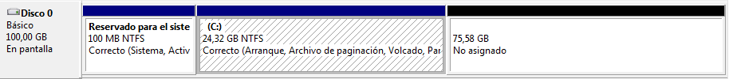

También tenemos una zona sin asignar de 75GB dónde podemos crear más particiones si las necesitamos. La partición de 100MB con sistema de archivos NTFS no tiene asignada letra de unidad lógica por eso no aparece en el explorador de Windows.

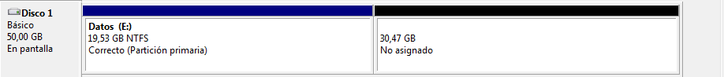

### Gestión de Entrada / Salida: Periféricos

Hay gran cantidad de dispositivos de E/S diferentes. Dentro de cada tipo, por ejemplo un teclado existen multitud de variantes en función de distintas características: teclas especiales, disposición de las teclas, características especiales (altavoces incorporados, pantalla táctil, dispositivo apuntador incorporado, etc).

El sistema operativo debe proporcionar mecanismos de acceso uniforme a los distintos tipos de dispositivos hardware disponibles gestionando todas estas diferencias.

La gestión de E/S se puede llevar a cabo en gran medida gracias al uso de controladores o drivers que hacen de interfaz y permiten la comunicación entre el sistema operativo y cada uno de estos dispositivos de E/S con sus características “únicas”.

##### Jugando con Windows

Administrador de dispositivos. Desde el administrador de equipos podemos comprobar el administrador de dispositivos.

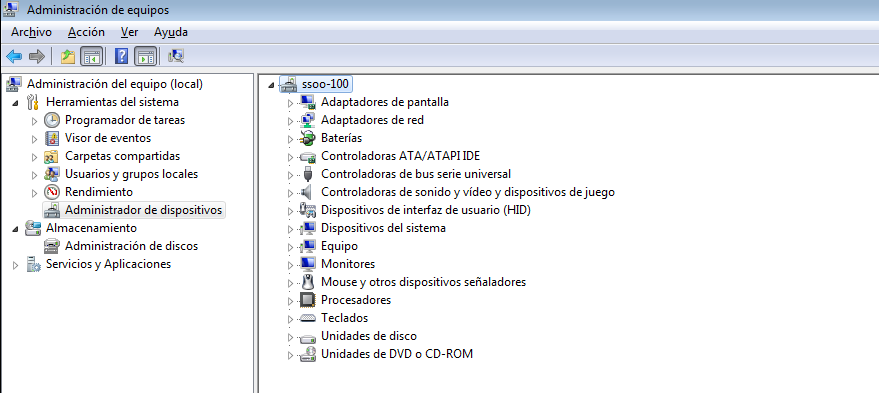

También podemos lanzarlo dentro de su propia ventana.

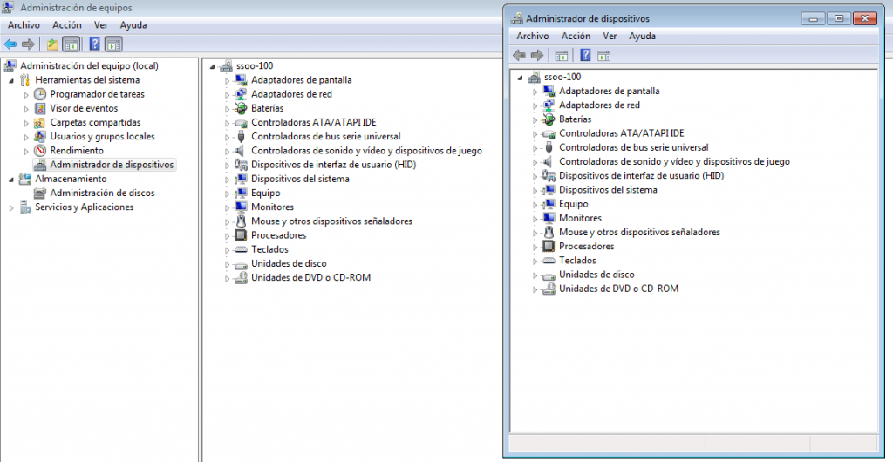

Realmente esta herramienta se encarga de mostrar y permitir al administrador administrar la información que mantiene el sistema sobre los dispositivos hardware conectados al mismo.

La parte del sistema operativo que se encarga de gestionar los dispositivos periféricos es el Gestor de Entrada / Salida y gracias a esta herramienta del sistema, el administrador de dispositivos, podemos comprobar la configuración del hardware del sistema así como gestionar sus controladores o drivers.

Vamos a echar un vistazo por ejemplo a las controladores de sonido, al dispositivo de High Definition Audio.

   

Vamos a ver información sobre el dispositivo de Audio. Si hacemos clic con el botón secundario nos aparecerá un menu contextual donde elegimos propiedades o bien podemos hacer doble clic sobre el dispositivo.

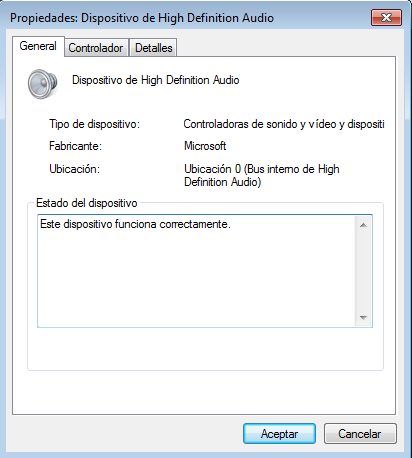

Si nos vamos a Controlador, podemos obtener información sobre el controlador o driver del dispositivo.

Por ejemplo, podemos obtener información sobre el controlador concreto que estamos usando en Detalles del controlador.

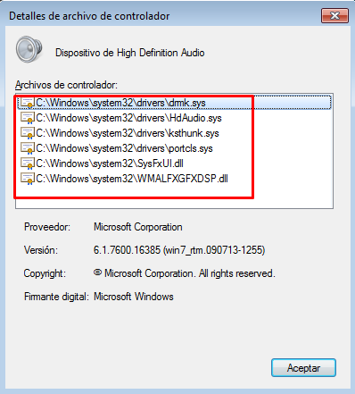

Ahí aparecen las piezas de software que hacen de intermediario entre el hardware concreto y el sistema operativo. Esos son los controladores, las librerías que proporciona el fabricante del dispositivo para facilitar la comunicación entre dispositivo y sistema operativo.

Si una aplicación quiere hacer uso de un dispositivo lo hace a través del sistema operativo, el cual se comunica con el dispositivo a través del controlador.

Lista de recursos donde puedes ampliar tus conocimientos sobre sistema de archivos, gestión de archivos y carpetas, navegación de archivos, variables de entorno, herramientas administrativas, herramientas de seguridad:

### Para Windows:

1. **Sistema de Archivos, Gestión de Archivos y Carpetas, Navegación de Archivos:**
   
    - **Microsoft Learn - File Systems and Storage:** Este sitio ofrece recursos sobre sistemas de archivos y almacenamiento en Windows.
        - Enlace: [Microsoft Learn - File Systems and Storage](https://learn.microsoft.com/en-us/windows/file-systems/)
    - **Windows File Explorer Guide:** Una guía detallada sobre cómo utilizar el Explorador de archivos en Windows.
        - Enlace: [Windows File Explorer Guide](https://support.microsoft.com/en-us/windows/file-explorer-help-8d72c8c7-0f1f-8a8e-9d44-9bdcfa9b2a5b)
    - **Windows File Management:** Tutoriales sobre la gestión de archivos en Windows.
        - Enlace: [Windows File Management](https://www.groovypost.com/howto/windows-10-file-management-tips/)
    - **Windows File Explorer Tips and Tricks:** Consejos y trucos para utilizar el Explorador de archivos de Windows eficientemente.
        - Enlace: [Windows File Explorer Tips and Tricks](https://www.makeuseof.com/tag/windows-explorer-tips-tricks/)
2. **Variables de Entorno y Herramientas Administrativas:**
   
    - **Microsoft Docs - Environment Variables:** Documentación oficial sobre variables de entorno en Windows.
        - Enlace: [Microsoft Docs - Environment Variables](https://docs.microsoft.com/en-us/windows/deployment/usmt/usmt-recognized-environment-variables)
    - **Windows Environment Variables:** Guía sobre cómo configurar y gestionar variables de entorno en Windows.
        - Enlace: [Windows Environment Variables Guide](https://www.windowscentral.com/how-edit-your-system-path-environment-variables-windows-10)
    - **Windows Administration Tools and Utilities:** Recursos sobre herramientas administrativas en Windows.
        - Enlace: [Windows Administration Tools and Utilities](https://docs.microsoft.com/en-us/windows-server/administration/windows-commands/windows-commands)
    - **Windows Administrative Tools Overview:** Visión general de las herramientas administrativas disponibles en Windows.
        - Enlace: [Windows Administrative Tools Overview](https://www.serverwatch.com/guides/windows-server-administrative-tools/) - [1](https://www.lifewire.com/administrative-tools-2625804)
3. **Herramientas de Seguridad en Windows:**
   - **Windows Security Guide:** Guía detallada sobre la configuración de seguridad en Windows.
        - Enlace: [Windows Security Guide](https://www.lifewire.com/how-to-set-up-windows-security-4772050)
    - **Windows Security Features:** Información sobre características de seguridad integradas en Windows.
        - Enlace: [Windows Security Features](https://docs.microsoft.com/en-us/windows/security/)
    - **Windows Defender Security Center:** Guía sobre cómo usar Windows Defender y otras herramientas de seguridad.
        - Enlace: [Windows Defender Security Center](https://support.microsoft.com/en-us/windows/windows-defender-security-center-5bcbce6f-094e-cafe-1f28-3f4807e147dd)
    - **Windows Defender Advanced Threat Protection:** Información sobre características avanzadas de protección en Windows Defender.
  - Enlace: [Windows Defender ATP Overview](https://docs.microsoft.com/en-us/windows/security/threat-protection/microsoft-defender-atp/microsoft-defender-advanced-threat-protection)

### Para Linux:

1. **Sistema de Archivos, Gestión de Archivos y Carpetas, Navegación de Archivos:**
   - **Linux File System Basics:** Conceptos básicos sobre el sistema de archivos en Linux.
     - Enlace: [Linux File System Basics](https://www.geeksforgeeks.org/linux-file-system/)
   - **Linux Command Line File Management:** Tutoriales sobre gestión de archivos desde la línea de comandos en Linux.
     - Enlace: [Linux Command Line File Management](https://linuxjourney.com/lesson/filesystem-navigation)
- **Linux Filesystem Hierarchy:** Una guía sobre la jerarquía del sistema de archivos en Linux.
     - Enlace: [Linux Filesystem Hierarchy](https://www.pathname.com/fhs/)
   - **Linux Command Line Tutorial:** Tutoriales sobre el manejo de archivos y carpetas desde la línea de comandos en Linux.
     - Enlace: [Linux Command Line Tutorial](https://linuxcommand.org/)

2. **Variables de Entorno y Herramientas Administrativas:**
   - **Linux Environment Variables:** Documentación sobre variables de entorno en sistemas Linux.
     - Enlace: [Linux Environment Variables](https://linuxize.com/post/how-to-set-and-list-environment-variables-in-linux/)
   - **Linux Administrative Tasks:** Recursos sobre herramientas administrativas y comandos en Linux.
     - Enlace: [Linux Administrative Tasks](https://www.tecmint.com/basic-linux-commands-for-beginners/)
   - **Linux Environment Variables How-To:** Guía práctica sobre cómo configurar y utilizar variables de entorno en Linux.
     - Enlace: [Linux Environment Variables How-To](https://www.cyberciti.biz/faq/set-environment-variable-linux/)
   - **Linux Administration Tools and Utilities:** Herramientas esenciales para la administración de sistemas Linux.
     - Enlace: [Linux Administration Tools](https://www.tecmint.com/linux-administration-tools/)

3. **Herramientas de Seguridad en Linux:**
   - **Linux Security Concepts:** Conceptos fundamentales de seguridad en Linux.
     - Enlace: [Linux Security Concepts](https://linuxsecurity.com/linux-security)
   - **Linux Security Modules:** Información sobre módulos de seguridad en Linux.
     - Enlace: [Linux Security Modules](https://wiki.archlinux.org/title/Security_modules)
   - **Linux Security Tools Overview:** Visión general de herramientas de seguridad populares para Linux.
     - Enlace: [Linux Security Tools Overview](https://www.linux.com/training-tutorials/linux-security-tools)

### Recursos Generales:

- **YouTube - NetworkChuck:** Un canal de YouTube con contenido variado sobre redes, sistemas operativos y seguridad informática.
  - Enlace: [NetworkChuck YouTube Channel](https://www.youtube.com/channel/UCT1-XRVnGd1E4sMR1fQVEvQ)

- **LinkedIn Learning:** Plataforma educativa con cursos sobre sistemas operativos, seguridad informática y más.
  - Enlace: [LinkedIn Learning](https://www.linkedin.com/learning/)

Estos recursos te proporcionarán una base sólida para explorar y aprender más sobre la gestión de sistemas operativos, seguridad informática y herramientas disponibles tanto en Windows como en Linux. ¡Espero que te sean útiles para seguir profundizando en estos temas!

Mas información sobre seguridad en Windows:

- [Mantente protegido](https://support.microsoft.com/es-es/windows/mantente-protegido-con-seguridad-de-windows-2ae0363d-0ada-c064-8b56-6a39afb6a963)
- [Quitar malware de tu PC Windows](https://support.microsoft.com/es-es/office/quitar-malware-de-tu-pc-windows-360379ec-153b-4ab4-93ff-85be97789dbb)
- [Firewall y protección de red](https://support.microsoft.com/es-es/windows/firewall-y-protección-de-red-en-seguridad-de-windows-aef9838b-d081-fd75-3b1b-e5fa794c003b)
- [Herramientas administrativas Windows 10](https://www.youtube.com/watch?v=rUpZvT3kVAg) + [1](https://www.youtube.com/watch?v=ff85fP4fF1c)

  
#Sistemas 

#Básicos 

#Windows 
