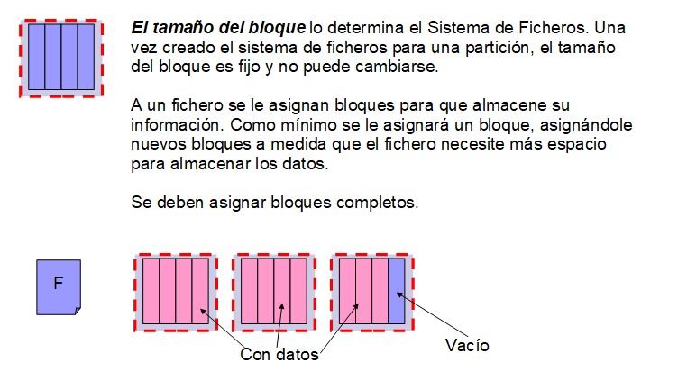
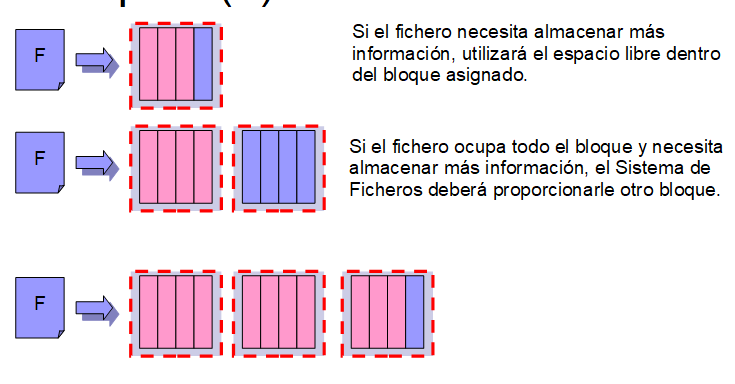
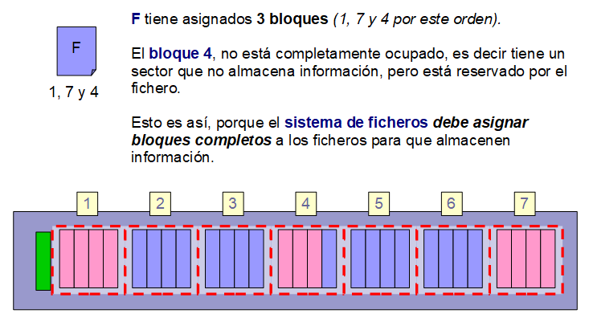

# Sistemas de archivos

Los sistemas de archivos son una parte esencial en el trabajo de los sistemas operativos. Gracias tanto a los propios sistemas de archivos y a la parte del sistema operativo que se encarga de trabajar con ellos podemos almacenar archivos y directorios en particiones de nuestros discos duros y dispositivos de almacenamiento masivo en general.

En este apartado estudiaremos que son los sistemas de archivos, repasaremos los sectores y los clusters o unidades de asignación, así como los principales mecanismos de asignación de clusters/bloques/unidades de asignación a archivos.

## Archivos y directorios

Seguramente todos conozcamos que es un archivo y qué es un directorio. No obstante, vamos a tratar de definirlos.

### Archivo

Un **archivo** es un contenedor de información relacionada entre sí. Es decir, información que tiene sentido en conjunto.

Los archivos se crearon para poder **almacenar información de manera persistente** en una memoria secundaria o auxiliar.

Todo archivo tiene un **nombre** que sirve para identificarlo, sobre todo para que el usuario lo identifique, y tiene una **extensión** que da información sobre el tipo de información que contiene. El nombre del archivo es una cadena de texto y su extensión sería una cadena de texto corta (unos tres caracteres antiguamente) que aparece después del último punto del nombre del archivo.

Ojo, la extensión nos informa del tipo de información que se supone contiene el archivo, pero si cambiamos la extensión de un archivo no lo estamos transformando por arte de magia…

### Directorio

Un directorio es un contenedor de archivos y directorios. Debido a que el número de archivos utilizados en un sistema informático es alto, se necesita poder organizarlos para facilitarnos su uso.

A medida que el uso de archivos en el sistema aumentó se hizo patente la necesidad de utilizar algún mecanismo para organizarlos. Supongamos que no existieran los directorios, situación inicial. No podríamos tener dos archivos con el mismo nombre y, además, nos encontraríamos con todos los archivos de todos los usuarios del sistema en un mismo lugar.

La evolución fue crear el directorio, un contenedor de archivos. Al principio, en la primera solución, tan solo existía un directorio para cada usuario del sistema. De esta forma, cada usuario tendría en su directorio sus propios archivos. No obstante, cuando el número de archivos de cada usuario creció de nuevo surgió el problema de organizar todos estos archivos.

La solución, crear una jerarquía de directorios en forma de árbol. De esta manera se pueden crear directorios y subdirectorios a medida que sean necesarios para organizar toda la información.

En la jerarquía de directorios actual:

1. Existe un directorio raíz que contiene a todos los archivos y directorios de la «unidad».
2. Un directorio puede contener archivos y otros directorios, que podemos denominar subdirectorios.
3. Todo archivo o directorio tiene un directorio padre, que es el directorio que lo contiene directamente, excepto el directorio raíz.
4. El directorio raíz no tiene directorio padre. Su directorio padre, por simplificar, sería él mismo.

De esta forma podemos crear tantos directorios sean necesarios para organizar los archivos que contiene una memoria secundaria o auxiliar.

Cuando instalamos un sistema operativo, durante el proceso de instalación, el sistema operativo se encarga de crear una serie de directorios propios y copia en ellos los archivos que necesita para poder funcionar. A medida que el sistema va funcionando tanto los usuarios, que crean archivo con información propia y directorios para organizarlos, como el sistema operativo, que añade nuevos archivos y directorios para que el sistema pueda realizar su trabajo, hacen uso de la memoria secundaria.

Sabemos qué es un archivo y un directorio, pero no sabemos cómo se almacenan realmente en una memoria secundaria. Sabemos que las memorias secundarias y auxiliares son memorias de bloques, cuyo bloque básico es el sector que tiene una capacidad de 512 Bytes.

Pero, nos debería surgir las siguientes preguntas:

- ¿Cómo se almacena un archivo en los sectores de un disco duro (partición)?
- ¿Cómo puede saber el sistema operativo qué sectores pertenecen a cada archivo y en qué orden?
- ¿Cómo sabe qué contiene cada directorio y cuál es su directorio padre?

Para ello se utilizan los sistemas de archivos…

## Sistema de archivos

### Definición

Con el término de [sistema de archivos](https://es.wikipedia.org/wiki/Sistema_de_archivos) hay un tanto de ambigüedad, se puede hacer referencia a la parte del sistema operativo encargada de gestionar los archivos o a los sistema de archivos que se almacenan en memorias de almacenamiento masivo. Vamos a tratar de clarificar los términos.

Para nosotros, un **sistema de archivos** es una estructura de datos que se encarga de organizar los bloques y sectores en una partición de una memoria de almacenamiento masivo para almacenar archivos en ella.

La parte del sistema opertivo que se encarga de gestionar los sistemas de archivos conectados a él lo denominaríamos como **gestor de sistema de archivos.**

### Sector vs Cluster

Los discos duros, y en general los dispositivos de almacenamiento masivo de memoria secundaria y auxiliar, están divididos en sectores. Un **sector** es un bloque de **512 Bytes** y es la **unidad mínima con la que trabaja un dispositivo de almacenamiento masivo** (de bloques).

De esta forma, si se desea escribir un solo byte de un archivo, lo mínimo con lo que va a trabajar el disco duro será con el sector.

[Cluster](https://es.wikipedia.org/wiki/Clúster_(sistema_de_archivos))

Un cluster, bloque o unidad de asginación consiste en un conjunto o bloque de sectores contiguos. Debido a dos factores es encesario trabajar con cluster o unidades de asginación:

– La cantidad de sectores que hay en los discos duros actuales y a los problemas de direccionamiento que generaría direccionarlos todos (cantidad de bits necesarios para direccionar tal tantidad de sectores).

– Gestionar los sectores ocupados y libres en el sistema de archivos. Si no se utilizan bloques o clusters la cantidad de sectores es enorme e inmanejable.

<small><strong>&rarr; Tecnicas de asignación de bloques a archivos</strong></small>

### Sistema de archivos nativo

Un sistema de archivos se denomina nativo de un sistema operativo cuando ha sido desarrollado para ese tipo de sistema operativo. Por ejemplo, FAT32 es un sistema de archivos nativo de Microsoft Windows, puesto que fué desarrollado para ser utilizado en los sistemas operativos de Microsoft Windows.

Sin embargo, que un sistema de archivos sea nativo de un sistema operativo no significa, necesariamente, que no pueda ser utilizado en otros sistemas de operativos. Por ejemplo, aunque FAT32 o NTFS son sistemas de archivos nativos de Microsoft Windows, se pueden utilizar en sistemas operativos GNU/Linux como Debian o Ubuntu.

Esto es así puesto que estos sistemas operativos integran en su gestor de sistemas de archivos este tipo de sistemas de archivos. Se podría entender como que integran un módulo que es capaz de entender y gestionar estos sistemas de archivos.

El contraejemplo son los sistemas de archivos nativos de GNU/Linux como ext2/3/4 que no son accesibles directamente desde sistemas operativos de Microsoft Windows. Para acceder a este tipo de sistemas de archivos sería necesario instalar un software especial a modo de módulo de acceso que permitiera acceder a esos sistemas de archivos.

### Algunos sistemas de archivos

[FAT](https://es.wikipedia.org/wiki/Tabla_de_asignación_de_archivos) (File Allocation Table). FAT12, FAT16 y FAT32. Son sistemas de archivos de Microsoft. aunque en un sistema de archivos que es limitado se sigue utilizando mucho en la versión de FAT 32 puesto que es un sistema de archivos bien conocido por todos los fabricantes de dispositivos de almacenamiento masivo y electrónica general (por ejemplo, reproductores de DVD multimedia, etc).

Algunas de las limitaciones más destables de su versión de 32 bits es la limitación de archivos de hasta 4GB de capacidad y que no gestiona permisos de usuarios (no identifica el propietario del archivo ni los permisos de acceso que se dan a otros usuarios).

[NTFS](https://es.wikipedia.org/wiki/NTFS) (New Technology File System). viene a suplir las carencias de FAT32, en cuanto a seguridad, tamaño de archivos y gestión del propio sistema de archivos por parte del Sistema Operativo.

Almacena la estructura de datos del sistema de archivos en forma de árbol, mejorando el rendimiento de acceso a la inforación en disco. De esta forma no hace falta mantener toda la tabla de FAT en memoria para acceder a la información de los sistemas de archivos.

Con NTFS, Microsoft Windows permite gestionar propietario y permisos de acceso de archivos. Además permite archivos de un tamaño mayor a 4GB.

[ext2 ](https://es.wikipedia.org/wiki/Ext2)/ [ext3 ](https://es.wikipedia.org/wiki/Ext3)/ [ext4](https://es.wikipedia.org/wiki/Ext4)

Sistemas de archivos nativos de GNU/Linux. Desde sistemas de Microsoft Windows no se puede acceder a la información almacenada en este tipo de sistemas de archivos directamente (se podría pero empleando un software especial).

Hay más sistemas de archivos, como [hpfs](https://es.wikipedia.org/wiki/HPFS), sin embargo a nosotros, por ahora, los que más nos interesan son los que acabamos de citar.

**Un sistema de archivos es una estructura de datos que permite gestionar los archivos que se almacenan en una partición.**

#Sistemas #Básicos 