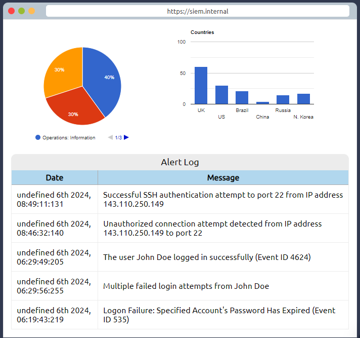

# **Seguridad ofensiva** y  **Seguridad defensiva**

\*.ref.: https://tryhackme.com/r/room/introtooffensivesecurity

La seguridad ofensiva es el proceso de irrumpir en sistemas informáticos, explotar errores de software y encontrar lagunas en las aplicaciones para obtener acceso no autorizado a ellas.

Para vencer a un hacker, debes comportarte como un hacker, encontrando vulnerabilidades y recomendando parches antes de que lo haga un cibercriminal, ¡como lo harás en esta sala!

Por otro lado, también está la seguridad defensiva, que es el proceso de proteger la red y los sistemas informáticos de una organización mediante el análisis y la protección de posibles amenazas digitales; Obtenga más información en la sala de análisis forense digital.

En una función cibernética defensiva, podría estar investigando computadoras o dispositivos infectados para comprender cómo fueron pirateados, rastreando a los ciberdelincuentes o monitoreando la infraestructura en busca de actividad maliciosa.

¿Cuál de las siguientes opciones representa mejor el proceso en el que se simulan las acciones de un hacker para encontrar vulnerabilidades en un sistema?

- Seguridad ofensiva :heavy_check_mark:
- Seguridad defensiva

Antes de profundizar en las carreras de seguridad cibernética y qué es la seguridad ofensiva, veamos cómo hackear (y sí, es legal, todos los ejercicios son simulaciones falsas).

## Tu primer truco

Iniciar máquina

Haga clic en el botón "Iniciar máquina". Una vez cargado en Split View en tu navegador, tendrás acceso a una máquina que usarás para hackear una aplicación bancaria falsa llamada FakeBank. Si no ves aparecer la máquina, usa el botón azul **Mostrar vista dividida** en la parte superior izquierda de esta página.

Usaremos una aplicación de línea de comandos llamada "GoBuster" para aplicar fuerza bruta al sitio web de FakeBank para encontrar directorios y páginas ocultos. GoBuster tomará una lista de posibles nombres de páginas o directorios e intentará acceder a un sitio web con cada uno de ellos; si la pagina existe te lo dice.

Paso 1) Abrir una terminal

Una terminal, también conocida como línea de comandos, nos permite interactuar con una computadora sin utilizar unainterfaz gráfica de usuario.

Paso 2) Encuentra páginas web ocultas

La mayoría de las empresas tendrán una página de portal de administración que brindará a su personal acceso a controles administrativos básicos para las operaciones diarias. En el caso de un banco, es posible que un empleado necesite transferir dinero hacia y desde las cuentas de los clientes. A menudo, estas páginas no se hacen privadas, lo que permite a los atacantes encontrar páginas ocultas que muestran o dan acceso a controles administrativos o datos confidenciales.

Escriba el siguiente comando en la terminal para encontrar páginas potencialmente ocultas en el sitio web de FakeBank usando GoBuster (una aplicación de seguridad de línea de comandos).

```bash
gobuster -u http://fakebank.com -w wordlist.txt dir
```

El comando se ejecutará y le mostrará un resultado similar a este:

Comando GoBuster para páginas web de fuerza bruta

```markup
ubuntu@tryhackme:~/Desktop$ gobuster -u http://fakebank.com -w wordlist.txt dir
=====================================================
Gobuster v2.0.1
=====================================================
[+] Mode         : dir
[+] Url/Domain   : http://fakebank.com/
[+] Threads      : 10
[+] Wordlist     : wordlist.txt
[+] Status codes : 200,204,301,302,307,403
[+] Timeout      : 10s
=====================================================
2022/04/11 18:23:28 Starting gobuster
=====================================================
/images (Status: 301)
/DIRECTORY_NAME_OUTPUT (Status: 200)
=====================================================
2022/04/11 18:23:38 Finished
=====================================================
```

*No te preocupes si no has usado un terminal antes. Só é cousa de practicar.*

En el comando anterior, `-u` se usa para indicar el sitio web que estamos escaneando, `-w` toma una lista de palabras para recorrer y encontrar páginas ocultas.

Verás que GoBuster escanea el sitio web con cada palabra de la lista, encontrando páginas que existen en el sitio. GoBuster le habrá dicho las páginas que encontró en la lista de nombres de páginas/directorios (indicados por Estado: 200).


Paso 3) Hackear el banco

Deberías haber encontrado una página secreta de transferencias bancarias que te permita transferir dinero entre cuentas del banco (/bank-transfer). Escriba la página oculta en el sitio web de FakeBank en la máquina.

Esta página permite a un atacante robar dinero de cualquier cuenta bancaria, lo que supone un riesgo crítico para el banco. Como hacker ético, usted (con permiso) encontrará vulnerabilidades en su aplicación y las informará al banco para que las solucione antes de que un hacker las explote.

Transfiera $2000 desde la cuenta bancaria 2276 a su cuenta (número de cuenta 8881).

### Entregar Informe

Si fuera un evaluador de penetración o un consultor de seguridad, este es un ejercicio que realizaría para que las empresas prueben las vulnerabilidades en sus aplicaciones web; encuentre páginas ocultas para investigar vulnerabilidades.

Finalice la máquina haciendo clic en el botón rojo "Terminar" en la parte superior de la página.

## ¿Cómo puedo empezar a aprender?

La gente suele preguntarse cómo otras personas se convierten en hackers (consultores de seguridad) o defensores (analistas de seguridad que luchan contra el cibercrimen), y la respuesta es sencilla. Analícelo, aprenda un área de la seguridad cibernética que le interese y practique periódicamente mediante ejercicios prácticos. Adquiera el hábito de aprender un poco cada día y adquirirá el conocimiento para conseguir su primer trabajo en la industria.

Confía en nosotros; ¡puedes hacerlo! Solo eche un vistazo a algunas personas que han utilizado TryHackMe para conseguir su primer trabajo de seguridad:

- Paul pasó de ser trabajador de la construcción a ingeniero de seguridad. [Leer más](https://tryhackme.com/resources/blog/construction-worker-to-security-engineer-how-paul-used-tryhackme-to-land-his-first-job-in-security) .
- Kassandra pasó de profesora de música a profesional de seguridad. [Leer más](https://tryhackme.com/resources/blog/the-teacher-becomes-the-student) .
- Brandon usó TryHackMe mientras estaba en la escuela para conseguir su primer trabajo en el ámbito cibernético. [Leer más](https://tryhackme.com/resources/blog/brandons-success-story) .

## ¿Qué carreras hay?

La sala de carreras cibernéticas profundiza en las diferentes carreras cibernéticas. Sin embargo, aquí hay una breve descripción de algunas funciones de seguridad ofensivas:

- Probador de penetración - Penetration Tester: responsable de probar productos tecnológicos para encontrar vulnerabilidades de seguridad explotables.
- Red Teamer: desempeña el papel de un adversario, ataca a una organización y brinda retroalimentación desde la perspectiva del enemigo.
- Ingeniero de seguridad - Security Engineer: diseña, monitorea y mantiene controles, redes y sistemas de seguridad para ayudar a prevenir ataques cibernéticos.


## Seguridad ofensiva 

La seguridad ofensiva se centra en una cosa: irrumpir en los sistemas. La irrupción en los sistemas se puede lograr mediante la explotación de errores, el abuso de configuraciones inseguras y el aprovechamiento de políticas de control de acceso no aplicadas, entre otras cosas. Los equipos rojos y los probadores de penetración se especializan en seguridad ofensiva.

La seguridad defensiva es algo opuesto a la seguridad ofensiva, ya que se ocupa de dos tareas principales:

1. Evitar que se produzcan intrusiones
2. Detectar intrusiones cuando se producen y responder adecuadamente

Los equipos azules son parte del panorama de seguridad defensiva.

**Algunas de las tareas que están relacionadas con la seguridad defensiva incluyen:**

- Concientización sobre la ciberseguridad del usuario: capacitar a los usuarios sobre la ciberseguridad ayuda a protegerlos contra diversos ataques dirigidos a sus sistemas.
- Documentar y gestionar activos: Necesitamos conocer los tipos de sistemas y dispositivos que tenemos que gestionar y proteger adecuadamente.
- Actualización y parcheo de sistemas: garantizar que las computadoras, servidores y dispositivos de red estén correctamente actualizados y parcheados contra cualquier vulnerabilidad (debilidad) conocida.
- Configuración de dispositivos de seguridad preventivos: el firewall y los sistemas de prevención de intrusiones ( IPS ) son componentes críticos de la seguridad preventiva. Los firewalls controlan qué tráfico de red puede entrar y qué puede salir del sistema o la red. IPS bloquea cualquier tráfico de red que coincida con las reglas actuales y las firmas de ataque.
- Configuración de dispositivos de registro y monitoreo: sin un registro y monitoreo adecuados de la red, no será posible detectar actividades maliciosas e intrusiones. Si aparece un nuevo dispositivo no autorizado en nuestra red, deberíamos poder saberlo.

La seguridad defensiva implica mucho más y la lista anterior sólo cubre algunos temas comunes.

En esta sala, cubrimos:

- Centro de operaciones de seguridad ( SOC )
- Inteligencia de amenazas
- Análisis forense digital y respuesta a incidentes ( DFIR )
- Análisis de malware

**Quetion**

- Which team focuses on defensive security? 
  - Blue Team :heavy_check_mark:
  - Red teams
  - Penetration testers

## Areas de Seguridad defensiva

En esta tarea, cubriremos dos temas principales relacionados con la seguridad defensiva:

- Centro de Operaciones de Seguridad ( SOC ), donde cubrimos Inteligencia de Amenazas
- Análisis forense digital y respuesta a incidentes ( DFIR ), donde también cubrimos el análisis de malware

### Centro de operaciones de seguridad ( SOC )

Un *Centro de Operaciones de Seguridad* ( SOC ) es un equipo de profesionales de seguridad cibernética que monitorea la red y sus sistemas para detectar eventos de seguridad cibernética maliciosos. Algunas de las principales áreas de interés para un SOC son:

- Vulnerabilidades: Siempre que se descubre una vulnerabilidad (debilidad) del sistema, es esencial solucionarla instalando una actualización o parche adecuado. Cuando no hay una solución disponible, se deben tomar las medidas necesarias para evitar que un atacante la explote. Aunque remediar las vulnerabilidades es de vital interés para un SOC , no necesariamente se les asigna.
- Violaciones de políticas: Podemos pensar en una política de seguridad como un conjunto de reglas necesarias para la protección de la red y los sistemas. Por ejemplo, podría constituir una infracción de la política si los usuarios comienzan a cargar datos confidenciales de la empresa en un servicio de almacenamiento en línea.
- Actividad no autorizada: considere el caso en el que se roban el nombre de inicio de sesión y la contraseña de un usuario y el atacante los utiliza para iniciar sesión en la red. Un SOC debe detectar dicho evento y bloquearlo lo antes posible antes de que se produzcan más daños.
- Intrusiones en la red: no importa qué tan buena sea su seguridad, siempre existe la posibilidad de que se produzca una intrusión. Puede ocurrir una intrusión cuando un usuario hace clic en un enlace malicioso o cuando un atacante explota un servidor público. De cualquier modo, cuando se produce una intrusión debemos detectarla lo antes posible para evitar daños mayores.

Las operaciones de seguridad cubren diversas tareas para garantizar la protección; Una de esas tareas es la inteligencia sobre amenazas.

#### Inteligencia de amenazas

En este contexto, *la inteligencia* se refiere a la información que recopilas sobre enemigos reales y potenciales. Una *amenaza* es cualquier acción que pueda alterar o afectar negativamente a un sistema. La inteligencia sobre amenazas tiene como objetivo recopilar información para ayudar a la empresa a prepararse mejor contra posibles adversarios. El propósito sería lograr una *defensa informada sobre las amenazas* . Diferentes empresas tienen diferentes adversarios. Algunos adversarios podrían intentar robar datos de clientes de un operador de telefonía móvil; sin embargo, otros adversarios están interesados en detener la producción en una refinería de petróleo. Los ejemplos de adversarios incluyen un ejército cibernético de un estado-nación que trabaja por razones políticas y un grupo de ransomware que actúa con fines financieros. Según la empresa (objetivo), podemos esperar adversarios.

La inteligencia necesita datos. Los datos deben recopilarse, procesarse y analizarse. La recopilación de datos se realiza a partir de fuentes locales, como registros de red, y fuentes públicas, como foros. El procesamiento de datos tiene como objetivo organizarlos en un formato adecuado para el análisis. La fase de análisis busca encontrar más información sobre los atacantes y sus motivos; Además, su objetivo es crear una lista de recomendaciones y pasos viables.

Aprender sobre tus adversarios te permite conocer sus tácticas, técnicas y procedimientos. Como resultado de la inteligencia de amenazas, identificamos al actor de la amenaza (adversario), predecimos su actividad y, en consecuencia, podremos mitigar sus ataques y preparar una estrategia de respuesta.

### Análisis forense digital y respuesta a incidentes ( DFIR )

Esta sección trata sobre análisis forense digital y respuesta a incidentes ( DFIR ) y cubriremos:

- Forense digital
- Respuesta al incidente
- Análisis de malware

#### Forense digital

La ciencia forense es la aplicación de la ciencia para investigar delitos y establecer hechos. Con el uso y la difusión de los sistemas digitales, como las computadoras y los teléfonos inteligentes, nació una nueva rama de la ciencia forense para investigar delitos relacionados: la ciencia forense informática, que luego evolucionó hacia la *ciencia forense digital* .

En seguridad defensiva, el enfoque de la ciencia forense digital se desplaza hacia el análisis de la evidencia de un ataque y sus perpetradores y otras áreas como el robo de propiedad intelectual, el ciberespionaje y la posesión de contenido no autorizado. En consecuencia, la ciencia forense digital se centrará en diferentes áreas como:

- Sistema de archivos: el análisis de una imagen forense digital (copia de bajo nivel) del almacenamiento de un sistema revela mucha información, como programas instalados, archivos creados, archivos parcialmente sobrescritos y archivos eliminados.
- Memoria del sistema: si el atacante ejecuta su programa malicioso en la memoria sin guardarlo en el disco, tomar una imagen forense (copia de bajo nivel) de la memoria del sistema es la mejor manera de analizar su contenido y conocer el ataque.
- Registros del sistema: cada computadora cliente y servidor mantiene diferentes archivos de registro sobre lo que está sucediendo. Los archivos de registro brindan mucha información sobre lo que sucedió en un sistema. Algunos rastros quedarán incluso si el atacante intenta borrarlos.
- Registros de red: los registros de los paquetes de red que han atravesado una red ayudarían a responder más preguntas sobre si se está produciendo un ataque y lo que implica.

#### Respuesta al incidente

Un *incidente* suele referirse a una violación de datos o un ciberataque; sin embargo, en algunos casos, puede ser algo menos crítico, como una mala configuración, un intento de intrusión o una infracción de política. Ejemplos de un ciberataque incluyen un atacante que hace que nuestra red o nuestros sistemas sean inaccesibles, desfigurar (cambiar) el sitio web público y una violación de datos (robar datos de la empresa). *¿* Cómo responderías a un ciberataque? La respuesta a incidentes especifica la metodología que se debe seguir para manejar tal caso. El objetivo es reducir los daños y recuperarlos en el menor tiempo posible. Lo ideal sería desarrollar un plan listo para la respuesta a incidentes.

Las cuatro fases principales del proceso de respuesta a incidentes son:

1. Preparación: Esto requiere de un equipo capacitado y listo para manejar incidentes. Idealmente, se implementan varias medidas para evitar que ocurran incidentes en primer lugar.
2. Detección y Análisis: El equipo cuenta con los recursos necesarios para detectar cualquier incidencia; además, es fundamental analizar más a fondo cualquier incidente detectado para conocer su gravedad.
3. Contención, Erradicación y Recuperación: Una vez detectado un incidente, es crucial evitar que afecte a otros sistemas, eliminarlo y recuperar los sistemas afectados. Por ejemplo, cuando notamos que un sistema está infectado con un virus informático, nos gustaría detener (contener) la propagación del virus a otros sistemas, limpiarlo (erradicarlo) y garantizar una recuperación adecuada del sistema.
4. Actividad posterior al incidente: después de una recuperación exitosa, se genera un informe y se comparte la lección aprendida para evitar incidentes similares en el futuro.

#### Análisis de malware

Malware significa software malicioso. *El software* se refiere a programas, documentos y archivos que puede guardar en un disco o enviar a través de la red. El malware incluye muchos tipos, como por ejemplo:

- Un virus es un fragmento de código (parte de un programa) que se adjunta a un programa. Está diseñado para propagarse de una computadora a otra; además, funciona alterando, sobrescribiendo y eliminando archivos una vez que infecta una computadora. El resultado va desde que el ordenador se vuelve lento hasta inutilizable.
- Trojan Horse es un programa que muestra una función deseable pero oculta una función maliciosa debajo. Por ejemplo, una víctima podría descargar un reproductor de vídeo de un sitio web sospechoso que le dé al atacante control total sobre su sistema.
- El ransomware es un programa malicioso que cifra los archivos del usuario. El cifrado hace que los archivos sean ilegibles sin conocer la contraseña de cifrado. El atacante ofrece al usuario la contraseña de cifrado si está dispuesto a pagar un "rescate".

El análisis de malware tiene como objetivo conocer dichos programas maliciosos utilizando varios medios:

1. El análisis estático funciona inspeccionando el programa malicioso sin ejecutarlo. Generalmente, esto requiere un conocimiento sólido del lenguaje ensamblador (el conjunto de instrucciones del procesador, es decir, las instrucciones fundamentales de la computadora).
2. El análisis dinámico funciona ejecutando el malware en un entorno controlado y monitoreando sus actividades. Le permite observar cómo se comporta el malware cuando se ejecuta.

**Preguntas**

- ¿Cómo llamarías a un equipo de profesionales de seguridad cibernética que monitorea una red y sus sistemas en busca de eventos maliciosos?
  - *Security Operations Center* (SOC) :heavy_check_mark:
- ¿Qué significa DFIR?

  - Digital Forensics and Incident Response  :heavy_check_mark:
- ¿Qué tipo de malware requiere que el usuario pague dinero para recuperar el acceso a sus archivos?
  - Ransomware :heavy_check_mark:

## Ejemplo práctico

¿Cuál sería una tarea típica que realizaría como analista de seguridad? Haga clic en "Ver sitio" para seguir hasta obtener la bandera. (Si es la primera vez que obtienes banderas - flag-, una bandera puede verse como una cadena de texto que recibes una vez que completas una tarea. Un ejemplo de bandera es `FLAG{WORDS_AND_MORE}`).



Eres parte de un *Centro de Operaciones de Seguridad* ( SOC ) responsable de proteger un banco. El SOC de este banco utiliza un sistema de *gestión de eventos e información de seguridad* ( SIEM[^1]). Un SIEM recopila información y eventos relacionados con la seguridad de varias fuentes y los presenta a través de un sistema. Por ejemplo, se le notificará si hay un intento de inicio de sesión fallido o un intento de inicio de sesión desde una ubicación geográfica inesperada. Además, con la llegada del aprendizaje automático, un SIEM podría detectar comportamientos inusuales, como que un usuario inicie sesión a las 3 a.m. cuando normalmente lo hace solo durante el horario laboral.

En este ejercicio, interactuaremos con un SIEM para monitorear los diferentes eventos en nuestra red y sistemas en tiempo real. Algunos de los acontecimientos son típicos e inofensivos; otros podrían requerir una mayor intervención de nuestra parte. Busque el evento marcado en rojo, anótelo y haga clic en él para inspeccionarlo más a fondo.

A continuación, queremos obtener más información sobre la actividad o el evento sospechoso. El evento sospechoso podría haber sido desencadenado por un evento, como un usuario local, una computadora local o una dirección IP remota. Para enviar y recibir correo postal, necesita una dirección física; de manera similar, necesita una dirección IP para enviar y recibir datos a través de Internet. Una dirección IP es una dirección lógica que le permite comunicarse a través de Internet. Inspeccionamos la causa del desencadenante para confirmar si el evento es realmente malicioso. Si es malicioso, debemos tomar las medidas adecuadas, como informar a otra persona en el SOC y bloquear la dirección IP. (143.110.250.149)

[^1]: Sistema de gestión de eventos e información de seguridad que se utiliza para agregar información de seguridad en forma de registros, alertas, artefactos y eventos en una plataforma centralizada que permitiría a los analistas de seguridad realizar análisis casi en tiempo real durante el monitoreo de seguridad.

&rarr; https://ip-scanner.thm    

	Existen muchas bases de datos de código abierto, como AbuseIPDB y Cisco Talos Intelligence, donde puede realizar una verificación de reputación y ubicación de la dirección IP. La mayoría de los analistas de seguridad utilizan estas herramientas como ayuda con las investigaciones de alertas. También puede hacer que Internet sea más seguro informando las IP maliciosas, por ejemplo, en AbuseIPDB.
	Ahora que sabemos que la dirección IP es maliciosa, ¡debemos derivarla a un miembro del personal!

## Carreras en cibernética

Las carreras de seguridad cibernética son cada vez más demandadas y ofrecen [salarios altos](https://tryhackme.com/resources/blog/cyber-security-salary-career-options) . Hay muchos trabajos diferentes dentro de la industria de la seguridad, desde pentesting ofensivo (piratear máquinas e informar sobre vulnerabilidades) hasta seguridad defensiva (defenderse e investigar ciberataques).

Por qué hacer una carrera en cibernética:

- Salario alto: los trabajos en seguridad tienen salarios iniciales altos
- Emocionante: el trabajo puede incluir piratear sistemas legalmente o defenderse de ataques cibernéticos.
- Tenga demanda: hay más de 3,5 millones de puestos cibernéticos vacantes

Esta sala lo ayuda a ingresar a la seguridad cibernética brindándole información sobre diversas funciones de seguridad cibernética; también enlaza con diferentes rutas de aprendizaje que puede utilizar para comenzar a desarrollar sus habilidades cibernéticas.

- **Analista de seguridad:**   *Responsable de mantener la seguridad de los datos de una organización.*

  Los analistas de seguridad son fundamentales para construir medidas de seguridad en todas las organizaciones para proteger a la empresa de ataques. Los analistas exploran y evalúan las redes de la empresa para descubrir datos procesables y recomendaciones para que los ingenieros desarrollen medidas preventivas. Este puesto de trabajo requiere trabajar con varias partes interesadas para comprender los requisitos de seguridad y el panorama de seguridad.

  ### Responsabilidades

  - Trabajar con varias partes interesadas para analizar la ciberseguridad en toda la empresa.
  - Recopilar informes continuos sobre la seguridad de las redes, documentando los problemas de seguridad y las medidas tomadas en respuesta.
  - Desarrolle planes de seguridad, incorporando investigaciones sobre nuevas herramientas y tendencias de ataque, y medidas necesarias en todos los equipos para mantener la seguridad de los datos.

  ### Rutas de aprendizaje

  Las rutas de aprendizaje de TryHackMe le brindarán tanto el conocimiento técnico fundamental como la experiencia práctica, lo cual es crucial para convertirse en un analista de seguridad exitoso.

  - [Introducción a la ciberseguridad](https://tryhackme.com/path/outline/introtocyber)
  - [Pre seguridad](https://tryhackme.com/path/outline/presecurity/)
  - [Nivel 1 de SOC](https://tryhackme.com/path/outline/soclevel1)

- **Ingeniero de seguridad:** *Diseñar, monitorear y mantener controles, redes y sistemas de seguridad para ayudar a prevenir ataques cibernéticos.*

  Los ingenieros de seguridad desarrollan e implementan soluciones de seguridad utilizando datos de amenazas y vulnerabilidades, a menudo provenientes de miembros del personal de seguridad. Los ingenieros de seguridad trabajan para evitar una variedad de ataques, incluidos ataques a aplicaciones web, amenazas a la red y tendencias y tácticas en evolución. El objetivo final es conservar y adoptar medidas de seguridad para mitigar el riesgo de ataque y pérdida de datos.

  ### Responsabilidades

  - Pruebas y análisis de medidas de seguridad en todo el software
  - Monitoree redes e informes para actualizar sistemas y mitigar vulnerabilidades.
  - Identificar e implementar los sistemas necesarios para una seguridad óptima.

  ### Rutas de aprendizaje

  Las rutas de aprendizaje de TryHackMe le brindarán tanto el conocimiento técnico fundamental como la experiencia práctica, lo cual es crucial para convertirse en un ingeniero de seguridad exitoso.

  - [Nivel 1 de SOC](https://tryhackme.com/path/outline/soclevel1)
  - [Probador de penetración JR](https://tryhackme.com/path/outline/jrpenetrationtester)
  - [Pentesting ofensivo](https://tryhackme.com/path/outline/pentesting)

- **Respondedor de incidentes:** *Identifica y mitiga los ataques mientras las operaciones de los atacantes aún se están desarrollando.*

  Los servicios de respuesta a incidentes responden de manera productiva y eficiente a las violaciones de seguridad. Las responsabilidades incluyen la creación de planes, políticas y protocolos para que las organizaciones los implementen durante y después de los incidentes. Esta es a menudo una posición muy presionada que requiere evaluaciones y respuestas en tiempo real, a medida que se desarrollan los ataques. Las métricas de respuesta a incidentes incluyen MTTD, MTTA y MTTR, mientras tanto para detectar, reconocer y recuperarse (de ataques). El objetivo es lograr una respuesta rápida y efectiva, mantener la situación financiera y evitar implicaciones negativas de incumplimiento. En última instancia, los equipos de respuesta a incidentes protegen los datos, la reputación y la situación financiera de la empresa de los ataques cibernéticos.

  ### Responsabilidades

  - Desarrollar y adoptar un plan de respuesta a incidentes exhaustivo y viable
  - Mantener sólidas mejores prácticas de seguridad y respaldar las medidas de respuesta a incidentes.
  - Informes posteriores a incidentes y preparación para ataques futuros, teniendo en cuenta los aprendizajes y las adaptaciones que se pueden extraer de los incidentes.

  ### Rutas de aprendizaje

  Las rutas de aprendizaje de TryHackMe le brindarán tanto el conocimiento técnico fundamental como la experiencia práctica, lo cual es crucial para convertirse en un respondedor de incidentes exitoso.

  - [Nivel 1 de SOC](https://tryhackme.com/path/outline/soclevel1)

- **Examinador forense digital:**  *Responsable de utilizar la ciencia forense digital para investigar incidentes y delitos.*

  Si te gusta jugar al detective, este podría ser el trabajo perfecto. Si trabaja como parte de un departamento de aplicación de la ley, se concentrará en recopilar y analizar pruebas para ayudar a resolver crímenes: acusar a los culpables y exonerar a los inocentes. Por otro lado, si su trabajo consiste en defender la red de una empresa, utilizará sus habilidades forenses para analizar incidentes, como violaciones de políticas.

  ### Responsabilidades

  - Recopile evidencia digital mientras observa los procedimientos legales.
  - Analizar evidencia digital para encontrar respuestas relacionadas con el caso.
  - Documente sus hallazgos e informe sobre el caso.

- **Analista de malware**:  *Analiza todo tipo de malware para saber más sobre cómo funcionan y qué hacen*

  El trabajo de un analista de malware implica analizar programas sospechosos, descubrir qué hacen y redactar informes sobre sus hallazgos. A un analista de malware a veces se le llama ingeniería inversa, ya que su tarea principal gira en torno a convertir programas compilados de lenguaje de máquina a código legible, generalmente en un lenguaje de bajo nivel. Este trabajo requiere que el analista de malware tenga una sólida experiencia en programación, especialmente en lenguajes de bajo nivel como el lenguaje ensamblador y el lenguaje C. El objetivo final es conocer todas las actividades que realiza un programa malicioso, saber cómo detectarlo y denunciarlo.

  ### Responsabilidades

  - Realizar análisis estáticos de programas maliciosos, lo que implica ingeniería inversa.
  - Realizar análisis dinámicos de muestras de malware observando sus actividades en un entorno controlado.
  - Documentar e informar todos los hallazgos.

- **Probador de penetración:**  *Responsable de probar productos tecnológicos para detectar lagunas de seguridad.*

  Es posible que vea pruebas de penetración denominadas pentesting y piratería ética. La función laboral de un probador de penetración es probar la seguridad de los sistemas y el software dentro de una empresa; esto se logra mediante intentos de descubrir fallas y vulnerabilidades mediante piratería informática sistematizada. Los probadores de penetración explotan estas vulnerabilidades para evaluar el riesgo en cada caso. Luego, la empresa puede aprovechar estos conocimientos para rectificar problemas y evitar un ciberataque en el mundo real.

  ### Responsabilidades

  - Realizar pruebas en sistemas informáticos, redes y aplicaciones basadas en web.
  - Realizar evaluaciones de seguridad, auditorías y analizar políticas.
  - Evaluar e informar sobre conocimientos, recomendando acciones para la prevención de ataques.

  ### Rutas de aprendizaje

  Las rutas de aprendizaje de TryHackMe le brindarán tanto el conocimiento técnico fundamental como la experiencia práctica, lo cual es crucial para convertirse en un probador de penetración exitoso.

  - [Probador de penetración JR](https://tryhackme.com/path/outline/jrpenetrationtester)
  - [Pentesting ofensivo](https://tryhackme.com/path/outline/pentesting)

- **Red Team:** *Desempeña el papel de un adversario, atacando a una organización y brindando retroalimentación desde la perspectiva del enemigo.*

  Los miembros del equipo rojo comparten similitudes con los probadores de penetración, con un rol laboral más específico. Los evaluadores de penetración buscan descubrir muchas vulnerabilidades en todos los sistemas para mantener la ciberdefensa en buen estado, mientras que los equipos rojos actúan para probar las capacidades de detección y respuesta de la empresa. Este puesto de trabajo requiere imitar las acciones de los ciberdelincuentes, emular ataques maliciosos, retener el acceso y evitar la detección. Las evaluaciones del equipo rojo pueden durar hasta un mes, normalmente por parte de un equipo externo a la empresa. A menudo son más adecuados para organizaciones que cuentan con programas de seguridad maduros.

  ### Responsabilidades

  - Emule el papel de un actor de amenazas para descubrir vulnerabilidades explotables, mantener el acceso y evitar la detección.
  - Evaluar los controles de seguridad, la inteligencia sobre amenazas y los procedimientos de respuesta a incidentes de las organizaciones.
  - Evalúe e informe sobre conocimientos, con datos procesables para que las empresas eviten casos del mundo real.

  ### Rutas de aprendizaje

  Las rutas de aprendizaje de TryHackMe le brindarán tanto el conocimiento técnico fundamental como la experiencia práctica, lo cual es crucial para convertirse en un Red Teamer exitoso.

  - [Probador de penetración JR](https://tryhackme.com/path/outline/jrpenetrationtester)
  - [Pentesting ofensivo](https://tryhackme.com/path/outline/pentesting)
  - [Equipo rojo](https://tryhackme.com/path/outline/redteaming)

# Seguridad de aplicaciones web

Cada uno de nosotros utilizamos diferentes programas en nuestras computadoras. En términos generales, los programas se ejecutan en nuestras computadoras y utilizan la capacidad de procesamiento y el almacenamiento de nuestra computadora. Además, para utilizar un programa, primero debemos instalarlo. ¿Y si podemos usar cualquier programa sin instalación?

Una aplicación web es como un “programa” que podemos usar sin instalación siempre que tengamos un navegador web estándar moderno, como Firefox, Safari o Chrome. En consecuencia, en lugar de instalar todos los programas que necesita, sólo necesita navegar por la página relacionada. Los siguientes son algunos ejemplos de aplicaciones web:

- Correo web como Tutanota, Protonmail, Outlook y Gmail
- Paquetes de oficina en línea como Microsoft Office 365 (Word, Excel y PowerPoint), Google Drive (Documentos, Hojas de cálculo y Presentaciones) y Zoho Office (Writer, Sheet y Show)
- Compras en línea como Amazon.com, AliExpress y Etsy

Miles de ejemplos más proporcionan una gran variedad de servicios. Otros ejemplos incluyen banca en línea, transferencias de dinero, pronóstico del tiempo y redes sociales.

La idea de una aplicación web es que sea un programa que se ejecuta en un servidor remoto. Un servidor se refiere a un sistema informático que se ejecuta continuamente para "servir" a los clientes. En este caso, el servidor ejecutará un tipo específico de programa al que pueden acceder los navegadores web.

Considere una aplicación de compras en línea. La aplicación web leerá los datos sobre los productos y sus detalles desde un servidor de base de datos. Una *base de datos* se utiliza para almacenar información de forma organizada. Los ejemplos incluyen información sobre productos, clientes y facturas. Un *servidor de base de datos* es responsable de muchas funciones, incluidas leer, buscar y escribir en la base de datos. Es posible que la aplicación web de compras en línea necesite más de una base de datos para acceder, por ejemplo:

- Base de datos de productos: esta base de datos contiene detalles sobre los productos, como nombre, imágenes, especificaciones y precio.
- Base de datos de clientes: contiene todos los detalles relacionados con los clientes, como nombre, dirección, correo electrónico y número de teléfono.
- Base de datos de ventas: Esperamos ver qué ha comprado cada cliente y cómo pagó en esta base de datos.

Ya podemos ver la cantidad de información almacenada en cualquier sistema de compra online. Supongamos que un atacante logra explotar (piratear) la aplicación web y robar la base de datos de los clientes. En ese caso, esto supondrá una pérdida importante para la empresa y sus clientes.

La siguiente imagen muestra la búsqueda de un artículo en un sitio de compras en línea. En la versión más sencilla, la búsqueda se realizará en cuatro pasos:

1. El usuario ingresa el nombre de un artículo o palabras clave relacionadas en el campo de búsqueda. El navegador web envía las palabras clave de búsqueda a la aplicación web de compras en línea.
2. La aplicación web consulta (busca) en la base de datos de productos las palabras clave enviadas.
3. La base de datos del producto devuelve los resultados de la búsqueda que coinciden con las palabras clave proporcionadas a la aplicación web.
4. La aplicación web formatea los resultados como una página web amigable y los devuelve al usuario.


Desde la perspectiva del usuario, sólo accederá a una elegante tienda online donde se esconde toda la infraestructura técnica.

Muchas empresas ofrecen programas de recompensas por errores. Un programa de recompensas por errores permite a la empresa ofrecer una recompensa a cualquiera que descubra una vulnerabilidad (debilidad) de seguridad en los sistemas de la empresa. La condición principal es que la vulnerabilidad encontrada esté dentro del alcance y las reglas de la recompensa por errores. Entre muchos otros, Google, Microsoft y Facebook tienen programas de recompensas por errores. Descubrir un error puede hacerte ganar desde unos pocos cientos de dólares hasta decenas de miles de dólares, dependiendo de la gravedad de la vulnerabilidad, es decir, de la debilidad que hayas descubierto.

**Pregunta**:  ¿Qué necesitas para acceder a una aplicación web?  Browser.

## Riesgos de seguridad de las aplicaciones web

Digamos que desea comprar un artículo en una tienda en línea. Hay ciertas funciones que esperaría poder realizar en esta aplicación web. De manera más sencilla, el pedido en línea podría ser el siguiente:


Existen algunas categorías principales de ataques comunes contra aplicaciones web. Considere los siguientes pasos y los ataques relacionados.

- Inicie sesión en el sitio web: el atacante puede intentar descubrir la contraseña probando muchas palabras. El atacante utilizaría una larga lista de contraseñas con una herramienta automatizada para probarlas en la página de inicio de sesión.
- Busque el producto: el atacante puede intentar violar el sistema agregando caracteres y códigos específicos al término de búsqueda. El objetivo del atacante es que el sistema objetivo devuelva datos que no debería o ejecute un programa que no debería.
- Proporcionar detalles de pago: el atacante verificaría si los detalles de pago se envían en texto sin cifrar o utilizando un cifrado débil. El cifrado se refiere a hacer que los datos sean ilegibles sin conocer la clave secreta o la contraseña.

No podemos cubrirlo todo, pero presentaremos algunas categorías formales del Top Ten de OWASP . No te preocupes si estas técnicas te parecen ajenas; TryHackMe te guía a través de cada vulnerabilidad.

### Fallo de identificación y autenticación

La identificación se refiere a la capacidad de identificar a un usuario de forma única. Por el contrario, la autenticación se refiere a la capacidad de demostrar que el usuario es quien dice ser. La tienda online debe confirmar la identidad del usuario y autentificarlo antes de que pueda utilizar el sistema. Sin embargo, este paso es propenso a diferentes tipos de debilidades. Los ejemplos de debilidades incluyen:

- Permitir que el atacante use fuerza bruta, es decir, probar muchas contraseñas, generalmente usando herramientas automatizadas, para encontrar credenciales de inicio de sesión válidas.
- Permitir al usuario elegir una contraseña débil. Una contraseña débil suele ser fácil de adivinar.
- Almacenar las contraseñas de los usuarios en texto plano. Si el atacante logra leer el archivo que contiene las contraseñas, no queremos que pueda aprender la contraseña almacenada.


### Control de acceso roto

El control de acceso garantiza que cada usuario sólo pueda acceder a archivos (documentos, imágenes, etc.) relacionados con su función o trabajo. Por ejemplo, no desea que alguien del departamento de marketing acceda (lea) los documentos del departamento de finanzas. Ejemplos de vulnerabilidades relacionadas con el control de acceso incluyen:

- No aplicar *el principio de privilegio mínimo* y otorgar a los usuarios más permisos de acceso de los que necesitan. Por ejemplo, un cliente en línea debería poder ver los precios de los artículos, pero no debería poder cambiarlos.
- Poder ver o modificar la cuenta de otra persona utilizando su identificador único. Por ejemplo, no desea que un cliente del banco pueda ver las transacciones de otro cliente.
- Poder navegar por páginas que requieren autenticación (iniciar sesión) como usuario no autenticado. Por ejemplo, no podemos permitir que nadie vea el correo web antes de iniciar sesión.

### Inyección

Un ataque de inyección se refiere a una vulnerabilidad en la aplicación web donde el usuario puede insertar código malicioso como parte de su entrada. Una causa de esta vulnerabilidad es la falta de validación y desinfección adecuadas de la entrada del usuario.

### Fallos criptográficos

Esta categoría se refiere a las fallas relacionadas con la criptografía. La criptografía se centra en los procesos de cifrado y descifrado de datos. El cifrado convierte el texto sin cifrar en texto cifrado, lo que debería ser un galimatías para cualquiera que no tenga la clave secreta para descifrarlo. En otras palabras, el cifrado garantiza que nadie pueda leer los datos sin conocer la clave secreta. El descifrado convierte el texto cifrado nuevamente en el texto sin cifrar original utilizando la clave secreta. Ejemplos de fallas criptográficas incluyen:

- Enviar datos confidenciales en texto claro, por ejemplo, utilizando HTTP en lugar de HTTPS. HTTP es el protocolo utilizado para acceder a la web, mientras que HTTPS es la versión segura de HTTP . Otros pueden leer todo lo que envías a través de HTTP , pero no HTTPS.
- Depender de un algoritmo criptográfico débil. Un antiguo algoritmo criptográfico consiste en desplazar cada letra en una. Por ejemplo, "TRY HACK ME" se convierte en "USZ IBDL NF". Este algoritmo criptográfico es trivial de romper.
- Usar claves predeterminadas o débiles para funciones criptográficas. No será difícil romper el cifrado que se utiliza `1234`como clave secreta.

No se preocupe si estas técnicas parecen desafiantes o sofisticadas al principio. TryHackMe tiene salas dedicadas en profundidad para ayudarlo a comprender y experimentar con los diversos ataques contra aplicaciones web.

***Preguntas***

- Descubrió que la página de inicio de sesión permite un número ilimitado de intentos de inicio de sesión sin intentar ralentizar al usuario ni bloquear la cuenta. ¿Cuál es la categoría de este riesgo de seguridad?

  - Identification and Authentication Failure :heavy_check_mark:

- Notaste que el nombre de usuario y la contraseña se envían en texto sin cifrar y sin cifrado. ¿Cuál es la categoría de este riesgo de seguridad?

  - Cryptographic Failures  :heavy_check_mark:

### Ejemplo práctico de seguridad de aplicaciones web

Esta tarea investigará un sitio web vulnerable que utiliza referencias de objetos directos inseguros ( IDOR[^2] ). IDOR entra en la categoría de control de acceso roto. El control de acceso roto significa que un atacante puede acceder a información o realizar acciones que no están destinadas a él. Considere el caso en el que un servidor web recibe información proporcionada por el usuario para recuperar objetos (archivos, datos, documentos) y que están numerados secuencialmente. Digamos que el usuario tiene permiso para acceder a una foto llamada `IMG_1003.JPG`. Podríamos suponer que también existen `IMG_1002.JPG`y `IMG_1004.JPG`; sin embargo, la aplicación web no debería proporcionarnos esa imagen incluso si descubrimos su nombre. En general, puede ocurrir una vulnerabilidad IDOR si se ha depositado demasiada confianza en esos datos de entrada. Es decir, la aplicación web no valida si el usuario tiene permiso para acceder al objeto solicitado.

El simple hecho de proporcionar la URL correcta para un usuario o producto no significa necesariamente que el usuario deba poder acceder a esa URL. Por ejemplo, considere la página del producto `https://store.tryhackme.thm/products/product?id=52`. Podemos esperar que esta URL proporcione detalles sobre el número de producto `52`. En la base de datos, a los elementos se les asignarían números secuencialmente. El atacante probaría con otros números como `51`o `53`en lugar de `52`; esto podría revelar otros productos retirados o inéditos si la aplicación web es vulnerable.

Consideremos un ejemplo más crítico; la URL `https://store.tryhackme.thm/customers/user?id=16`devolvería al usuario `id=16`. Nuevamente, esperamos que los usuarios tengan números de identificación secuenciales. El atacante probaría con otros números y posiblemente accedería a otras cuentas de usuario. Esta vulnerabilidad podría funcionar con archivos secuenciales; por ejemplo, si el atacante ve `007.txt`, podría probar con otros números como `001.txt`, `006.txt`y `008.txt`. De igual forma, si fueras el DNI número 16 y el DNI número 17 fuera otro usuario, al cambiar el DNI al 17, podrías ver datos sensibles que pertenecen a otro usuario. Asimismo, pueden cambiar el ID a 16 y ver datos sensibles que te pertenecen. (Por supuesto, asumimos aquí que el sistema es vulnerable a IDOR ).

Haga clic en "Ver sitio" y veamos esto en acción. Verá una página que muestra un sistema de gestión de inventario. Si hace clic en la pestaña "Envíos planificados", descubrirá que un atacante ha logrado mezclar las cosas como parte de planes de sabotaje. Observe cómo envían neumáticos equivocados a cada línea de montaje; ¡Por ejemplo, asignan neumáticos de scooter y de motocicleta al montaje de bicicletas! Si no se reparan, todos los neumáticos irán al ensamblaje incorrecto.

Hackearemos el sistema y desharemos los pasos del atacante. En "Tu actividad", puedes ver la actividad de uno de los usuarios. Tenemos motivos para creer que este sitio web tiene una vulnerabilidad IDOR .

[^2]: Las referencias directas a objetos inseguras (IDOR) son un tipo de vulnerabilidad de control de acceso que surge cuando una aplicación utiliza entradas proporcionadas por el usuario para acceder a los objetos directamente. El término IDOR se popularizó por su aparición en el Top Ten de OWASP 2007.

**Preguntas**

Verifique a los otros usuarios para descubrir qué cuenta de usuario se utilizó para realizar los cambios maliciosos y revertirlos. Después de revertir los cambios, ¿cuál es la bandera que has recibido?


#Seguridad_Activa
#Seguridad_Pasiva