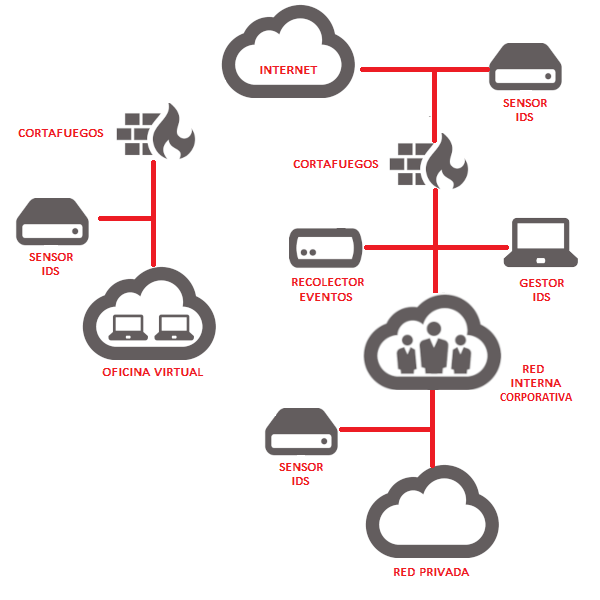

# Objetivos y principios de la gestión de la seguridad informática.

---

Podemos definir la [Seguridad Informática](https://www.ibm.com/mx-es/topics/cybersecurity) como cualquier medida que impida la ejecución de operaciones no autorizadas sobre un sistema o red informática, cuyos efectos puedan conllevar daños sobre la información, comprometer su **confidencialidad**, **autenticidad** o **integridad**, disminuir el rendimiento de los equipos o bloquear el acceso de usuarios autorizados al sistema.

---

Así mismo, es necesario considerar otros aspectos o cuestiones relacionados con la seguridad informática:

- Cumplimiento de las [regulaciones legales aplicables](https://www.boe.es/biblioteca_juridica/codigos/codigo.php?id=173&modo=2&nota=0&tab=2) [\[&rarr;1\]](https://www.incibe.es/empresas/blog/leyes-ciberseguridad-afectan-tu-empresa) a cada sector o tipo de organización, dependiendo del marco legal de cada país.
- Control en el acceso a los servicios ofrecidos y la información guardada por un sistema informático.
- Control en el acceso y utilización de ficheros protegidos por la ley: contenidos digitales con derechos de autor, ficheros con datos de carácter personal, etcétera.
- Identificación de los autores de la información o de los mensajes.
- Registro del uso de los servicios de un sistema informático.
- …

---

La norma [ISO/IEC 17799](ISO/IEC 17799) se define la Seguridad de la Información como la preservación de su **confidencialidad**, su **integridad** y su **disponibilidad** (medidas conocidas por su acrónimo “CIA” en inglés: Confidentiality, Integrity, Availability).

*NOTA: La norma la norma ISO/IEC 17799:2005/Cor 1:2007 ha sido revisada y ampliada por la norma [ISO/IEC 27002:2005](https://www.iso.org/standard/50297.html), que a su vez ha sido revisada y ampliada por la norma [ISO/IEC 27002:2013](https://www.iso.org/standard/54533.html)… La norma ISO/IEC 27002 vigente es la [ISO/IEC 27002:2022](https://www.iso.org/standard/75652.html)* [\[&rarr;1\]](https://globaltrustassociation.org/es/sabes-cuales-son-las-mejoras-de-la-nueva-iso-270022022/)

---

&rarr; Seguridad de la Información según la norma ~~ISO/IEC 17799~~ ISO/IEC 27002

---

Otra definición propuesta por el [INFOSEC Glossary 2000](https://datatracker.ietf.org/doc/html/rfc2828): 

* *Seguridad Informática son las medidas y controles que aseguran la confidencialidad, integridad y disponibilidad de los activos de los sistemas de información, incluyendo hardware, software, firmware y aquella información que procesan, almacenan y comunican.*

---

## Factores que afectan a la SI

---

La seguridad de un sistema informático es una disciplina compleja que depende de varios factores interrelacionados.

---

#### 1. **Seguridad Física**

   - **Control de acceso físico**: Restricciones para acceder a las instalaciones donde se encuentran los equipos y servidores.
   - **Protección contra desastres**: Medidas contra incendios, inundaciones, terremotos, etc.
   - **Cámaras de vigilancia y alarmas**: Monitoreo constante y alertas en caso de intentos de intrusión.

---

#### 2. **Seguridad de Red**

   - **Cortafuegos (firewalls)**: Barreras que controlan el tráfico entre diferentes zonas de confianza.
   - **Sistemas de Detección y Prevención de Intrusiones ([IDS/IPS](https://www.incibe.es/empresas/blog/son-y-sirven-los-siem-ids-e-ips))**: Detectan y previenen ataques en la red.
   - **Segmentación de redes**: Dividir la red en segmentos más pequeños para limitar la propagación de ataques.

---

#### 3. **Seguridad de los Datos**

   - **Cifrado**: Protección de datos en tránsito y en reposo utilizando técnicas criptográficas.
   - **Copias de seguridad (backups)**: Resguardos periódicos de los datos para recuperación en caso de pérdida o corrupción.
   - **Control de acceso a datos**: Políticas y herramientas para asegurar que solo las personas autorizadas pueden acceder a la información.

---

#### 4. **Gestión de Identidades y Accesos ([IAM](https://www.ibm.com/es-es/topics/identity-access-management))**

   - **Autenticación**: Verificación de la identidad de los usuarios a través de contraseñas, tokens, biometría, etc.
   - **Autorización**: Control de lo que los usuarios autenticados pueden hacer y a qué pueden acceder.
   - **Gestión de privilegios**: Minimizar los privilegios de los usuarios para reducir el riesgo de uso indebido.

---

               
   Más info: [\[&rarr;1\]](https://aws.amazon.com/es/iam/getting-started/) | [\[&rarr;2\]](https://www.entrust.com/es/resources/learn/what-is-identity-and-access-management)

---

### 5. **Seguridad del Software**
   - **Actualizaciones y parches**: Mantenimiento del software actualizado para corregir vulnerabilidades conocidas.
   - **Desarrollo seguro**: Implementación de prácticas de codificación segura durante el desarrollo del software. [\[&rarr;1\]](https://owasp.org/www-project-secure-coding-practices-quick-reference-guide/stable-es/01-introduction/05-introduction) | [\[&rarr;2\]](https://ciberseguridad.com/guias/desarrollo-seguro/)
   - **Pruebas de seguridad**: Realización de [análisis de vulnerabilidades](https://ostec.blog/es/seguridad/diferencias-entre-analisis-de-vulnerabilidad-y-pentest/) y [pruebas de penetración](https://www.ibm.com/mx-es/topics/penetration-testing) [\[&rarr;1\]](https://revista.seguridad.unam.mx/numero-18/pruebas-de-penetracion-para-principiantes-5-herramientas-para-empezar).

---

### 6. **Políticas y Procedimientos**

   - **Políticas de seguridad**: Documentos que establecen las normas y directrices para la seguridad.  [\[&rarr;2\]](https://ayudaleyprotecciondatos.es/2018/09/18/normativa-ciberseguridad/)
   - **Procedimientos de respuesta a incidentes**: Planes para actuar rápidamente en caso de un incidente de seguridad.
   - **Formación y concienciación**: Capacitación regular a los empleados sobre prácticas seguras y amenazas emergentes.

---

### 7. **Monitorización y Auditoría**
   - **Monitorización continua**: Vigilancia constante de la actividad del sistema para detectar anomalías.
   - **Registros (logs)**: Mantenimiento de registros detallados de todas las actividades para auditorías y análisis forenses.
   - **Auditorías de seguridad**: Evaluaciones periódicas de la seguridad del sistema por parte de auditores internos o externos.

---

### 8. **Planificación de la Continuidad del Negocio (BCP) y Recuperación ante Desastres (DR)**
   - **Planes de continuidad del negocio**: Estrategias para mantener las operaciones críticas durante y después de una interrupción.
   - **Planes de recuperación ante desastres**: Procedimientos para restaurar los sistemas y datos después de un desastre.

---

### 9. **Concienciación sobre Amenazas Internas**
   - **Protección contra amenazas internas**: Medidas para detectar y prevenir acciones maliciosas de empleados o contratistas.
   - **Políticas de salida de empleados**: Asegurar que los privilegios y accesos de los empleados que dejan la organización sean revocados inmediatamente.

---

Cada uno de estos factores es crucial y debe ser considerado en conjunto para construir un sistema de seguridad robusto. Las amenazas están en constante evolución, por lo que es esencial actualizar continuamente las prácticas de seguridad y así poder enfrentar y mitigar los riesgos emergentes.

---

# OBJETIVOS DE LA SEGURIDAD INFORMÁTICA

---

- Minimizar y gestionar los riesgos y detectar los posibles problemas y amenazas a la seguridad.
- Garantizar la adecuada utilización de los recursos y de las aplicaciones del sistema.
- Limitar las pérdidas y conseguir la adecuada recuperación del sistema en caso de un incidente de seguridad.
- Cumplir con el marco legal y con los requisitos impuestos por los clientes en sus contratos.

---

Para cumplir con los objetivos de la Seguridad Informática, una organización debe contemplar cuatro planos de actuación fundamentales. Estos planos abarcan diferentes aspectos de la seguridad, asegurando que todas las áreas críticas están protegidas. Los cuatro planos son:

---

### 1. **Plano de Seguridad Física**

Este plano se centra en la protección de los activos físicos de la organización, como hardware, instalaciones y personal. Las medidas de seguridad física son esenciales para prevenir el acceso no autorizado y los daños físicos que podrían comprometer la seguridad de la información.

---

**Medidas comunes:**

- **Control de Acceso**: Utilización de sistemas de control de acceso como tarjetas magnéticas, biometría, y guardias de seguridad.
- **CCTV y Vigilancia**: Instalación de cámaras de seguridad y sistemas de vigilancia.
- **Protección Contra Incendios**: Sistemas de detección y extinción de incendios.
- **Seguridad del Entorno**: Barreras físicas, cerraduras y seguridad perimetral.
- **Protección de Equipos**: Uso de racks con llave para servidores, y aseguramiento de dispositivos móviles y portátiles.

---

### 2. **Plano de Seguridad Lógica**

Este plano aborda la protección de los sistemas informáticos y la información digital. Se enfoca en asegurar que solo las personas autorizadas puedan acceder y manipular la información, y que ésta esté protegida contra amenazas digitales como malware, hackers, y pérdida de datos.

---

**Medidas comunes:**
- **Autenticación y Autorización**: Implementación de contraseñas fuertes, autenticación de dos factores y sistemas de gestión de identidades.
- **Encriptación**: Uso de criptografía para proteger datos en tránsito y en reposo.
- **Sistemas de Detección y Prevención de Intrusiones (IDS/IPS)**: Monitoreo y protección contra actividades sospechosas y ataques.
- **Firewalls y Antivirus**: Implementación de firewalls para controlar el tráfico de red y antivirus para detectar y eliminar malware.
- **Políticas de Seguridad**: Desarrollo de políticas claras sobre el uso de sistemas y datos.

---

### 3. **Plano de Seguridad Organizacional**

Este plano se enfoca en las políticas, procedimientos y prácticas que una organización debe establecer para asegurar la seguridad de la información. Abarca la creación de una cultura de seguridad dentro de la organización y la alineación de las prácticas de seguridad con los objetivos y regulaciones corporativas.

---

**Medidas comunes:**
- **Políticas y Procedimientos de Seguridad**: Desarrollo y comunicación de políticas de seguridad claras y detalladas.
- **Formación y Concienciación**: Programas de capacitación para empleados sobre prácticas de seguridad y manejo seguro de información.
- **Gestión de Riesgos**: Identificación, evaluación y mitigación de riesgos de seguridad.
- **Auditorías y Cumplimiento**: Realización de auditorías regulares para asegurar el cumplimiento con políticas internas y regulaciones externas.
- **Plan de Continuidad de Negocio**: Desarrollo de planes para mantener la operación en caso de desastres o incidentes graves.

---

### 4. **Plano de Seguridad de las Comunicaciones**
Este plano se enfoca en la protección de los datos mientras se transmiten a través de redes y sistemas de comunicación. Es crucial para asegurar que la información no sea interceptada, alterada o destruida durante su transmisión.

---

**Medidas comunes:**
- **Cifrado de Comunicaciones**: Uso de protocolos de cifrado como SSL/TLS para proteger los datos en tránsito.
- **VPN (Redes Privadas Virtuales)**: Utilización de VPNs para asegurar conexiones remotas y proteger la privacidad de las comunicaciones.
- **Seguridad de Redes Inalámbricas**: Implementación de estándares de seguridad robustos como WPA3 para proteger las redes Wi-Fi.
- **Monitoreo y Gestión del Tráfico de Red**: Herramientas de monitoreo para detectar y responder a actividades sospechosas en la red.
- **Protección contra Ataques DDoS**: Implementación de medidas para detectar y mitigar ataques de denegación de servicio.

---

Una organización debe entender la Seguridad Informática como un proceso y no como un producto que se pueda “comprar” o “instalar”. Se trata, por lo tanto, de un ciclo iterativo, en el que se incluyen actividades como la valoración de riesgos, prevención, detección y respuesta ante incidentes de seguridad.

---

La planificación es el paso inicial que damos en una organización para poder enfilar la estrategia de defensa de la empresa. Nos permite enfocar esfuerzos en lo verdaderamente importante, ayuda a establecer pautas para usar adecuadamente los recursos y saber si se está logrando lo que se desea o no, gracias a un posterior seguimiento. El proceso de planificación estratégica puede recaer en la máxima autoridad de la compañía o en un equipo designado. 

---

- Diagnosticar el entorno nacional, sectorial o institucional, que incluya el entendimiento estratégico de la arquitectura empresarial, dinámica organizacional y análisis del desempeño estratégico.
- Identificar las metas u objetivos a alcanzar.
- Formular estrategias para lograr las metas.
- Organizar y/o crear los medios necesarios para concretar la consecución de los objetivos planteados.
- Desarrollar una estrategia alineada con los objetivos estratégicos. 

---

# Implementación de la seguridad informática en la empresa

---

La seguridad informática es una asignatura pendiente para muchas empresas.

---

## Pasos para implementar la seguridad informática:

---

1. **Definir la estrategia de seguridad informática**. En ella no puede faltar la protección de la información mediante contraseñas, cifrado de datos, uso de firewalls, antivirus, etc. Una buena forma de definir esta estrategia, es hacer una auditoría de ciberseguridad interna tipo “GAP Análisis” del SGSI (Sistema de Gestión de la Seguridad Interna) respecto a alguna normativa de seguridad como, por ejemplo, ISO27001

---

2. **Establecer políticas de seguridad**. Deben estar orientadas a proteger la información y los activos de la compañía. Entre las medidas que se pueden tomar se encuentran: política de [contraseñas segura y actualizada](https://servicio.grupocibernos.com/iam-secure?hsLang=es-es), protección de datos o limitación de acceso a la información. Este paso se simplifica enormemente si has realizado la Auditoría GAP Análisis que indicábamos en el paso anterior.

---

3. **Diseñar un plan de acción**. La empresa debe tener un plan de respuesta ante incidentes de seguridad para actuar rápidamente en caso de que se produzca un ataque. Puedes hacerlo por tu cuenta o contratar un [servicio gestionado](https://servicio.grupocibernos.com/servicio-de-recuperacion-de-desastres-draas?hsLang=es-es) por profesionales que se encarguen de ello.

---

4. **Implementar el plan de acción**. Llevar a la práctica las medidas establecidas para proteger los datos de la empresa frente a posibles amenazas. Los planes hay que probarlos y hacer simulacros periódicos para asegurarte de que el plan funciona.

---

5. **Monitorear y evaluar el plan de acción**. Verificar que se está siguiendo el plan y que se está cumpliendo los objetivos de seguridad. Esta tarea es engorrosa, pues se trata de medir y evaluar si los controles para verificar el estado de ciberseguridad funcionan y, en su caso, poder tomar acciones correctivas. Afortunadamente, existen en el mercado herramientas de [cibercumplimiento](https://servicio.grupocibernos.com/cibercumplimiento?hsLang=es-es) que lo hacen de forma automática.

---

Esto no es todo. También debemos definir y aplicar una serie de medidas.
 
---

### **Consejos y medidas de seguridad informática**

---

#### *“El único sistema completamente seguro es aquel que está apagado, encerrado en un bloque de cemento y sellado en una habitación rodeada de alambradas y guardias armados”*. 

Stewart Kirkpatrick, abogado canadiense.

---

Teniendo en cuenta que no nos queda más remedio que afrontar los riesgos de ciberseguridad con medidas sólidas,veamos algunas de las más recomendadas:

---

1. No abrir correos electrónicos de procedencia desconocida, ni descargar archivos adjuntos de estos, o abrir archivos sospechosos.
2. Controlar el acceso a la información, estableciendo quién y cómo debe autorizar el acceso. Asigna permisos según perfiles: [gestiona la Identidad](https://servicio.grupocibernos.com/wbsvision?hsLang=es-es)
3. Realizar [copias de seguridad](https://servicio.grupocibernos.com/baas?hsLang=es-es) para proteger la información almacenada.
4. No visitar páginas web sospechosas.
5. Cifrar la información sensible. Por ejemplo: datos personales y bancarios
6. No descargar programas sospechosos.
7. Evitar compartir información personal o confidencial sin verificar su procedencia.

---

8. Utilizar contraseñas seguras robustas con doble factor de autenticación y no compartirlas con otros miembros de la organización.
9. Activar los cortafuegos y el antivirus.
10. Mantener actualizados los programas y el sistema operativo.
11. Evitar el uso de redes inalámbricas no protegidas.
12. Implementar un software integral de seguridad.
13. Conocer la política de seguridad y privacidad del proveedor.
14. Definir los servicios cloud permitidos.

---

Prescindir de las medidas de seguridad informática supone un riesgo muy elevado para cualquier empresa, independientemente de su tamaño o sector.

---

La Seguridad Informática es un proceso que implica resolver una serie de etapas y actividades sistemáticas y continuas diseñadas para proteger la integridad, confidencialidad y disponibilidad de la información y los sistemas de una organización. Este enfoque procesal asegura que las medidas de seguridad no sean estáticas, sino que evolucionen con el tiempo para adaptarse a nuevas amenazas y cambios en el entorno tecnológico. A continuación, se describen las etapas clave del proceso de seguridad informática:

---

#### 1. **Identificación o inventario de activos**

En esta etapa se lleva a cabo la identificación y el inventario de todos los activos de información, incluyendo hardware, software, datos y personal que interactúa con estos sistemas. Además, se identifican las posibles amenazas y vulnerabilidades asociadas a estos activos.

**Actividades:**
- **Inventario de Activos**: Crear y mantener un inventario detallado de todos los activos de información.
- **Evaluación de Amenazas**: Identificar posibles amenazas internas y externas.
- **Identificación de Vulnerabilidades**: Realizar análisis y auditorías para identificar vulnerabilidades en los sistemas y redes.

---

#### 2. **Evaluación de Riesgos**
Consiste en evaluar el impacto potencial y la probabilidad de que las amenazas identificadas exploten las vulnerabilidades. El objetivo es priorizar los riesgos en función de su severidad y probabilidad de ocurrencia.

**Actividades:**
- **Análisis de Impacto**: Evaluar el impacto potencial de la explotación de vulnerabilidades sobre la organización.
- **Valoración de Probabilidad**: Determinar la probabilidad de que las amenazas identifiquen y exploten vulnerabilidades.
- **Clasificación de Riesgos**: Clasificar los riesgos en función de su severidad y probabilidad.

---

#### 3. **Diseño e Implementación de Controles**
En esta etapa se diseñan e implementan controles y medidas de seguridad para mitigar los riesgos identificados. Estos controles pueden ser preventivos, detectivos, correctivos y disuasorios.

**Actividades:**
- **Selección de Controles de Seguridad**: Elegir controles específicos para mitigar los riesgos identificados (por ejemplo, firewalls, sistemas de cifrado, autenticación multifactor).
- **Implementación de Controles**: Implementar las medidas de seguridad seleccionadas.
- **Desarrollo de Políticas y Procedimientos**: Establecer políticas y procedimientos de seguridad claros y detallados.

---

#### 4. **Monitoreo y Detección**
Una vez que los controles están implementados, es crucial monitorear continuamente los sistemas y redes para detectar posibles incidentes de seguridad y comportamientos anómalos.

**Actividades:**
- **Monitoreo Continuo**: Uso de herramientas y sistemas de monitoreo para vigilar la actividad de la red y los sistemas.
- **Sistemas de Detección de Intrusiones (IDS)**: Implementar IDS para identificar posibles violaciones de seguridad.
- **Revisión de Logs y Alertas**: Analizar registros y alertas de sistemas para detectar actividades sospechosas.

---

#### 5. **Respuesta a Incidentes**
Esta etapa se enfoca en cómo responder a los incidentes de seguridad cuando ocurren, minimizando el impacto y recuperando rápidamente los sistemas afectados.

**Actividades:**
- **Planes de Respuesta a Incidentes**: Desarrollar y mantener planes detallados para responder a incidentes de seguridad.
- **Equipo de Respuesta a Incidentes (IRT)**: Establecer un equipo dedicado para manejar incidentes de seguridad.
- **Análisis de Incidentes**: Investigar y analizar incidentes para entender su causa y alcance.

---

#### 6. **Recuperación**
Después de un incidente, la organización debe trabajar para restaurar los sistemas y servicios a su estado normal y mejorar las defensas para prevenir incidentes futuros.

**Actividades:**
- **Planes de Recuperación de Desastres**: Desarrollar y probar planes para la recuperación de desastres.
- **Restauración de Sistemas**: Restaurar datos y sistemas desde copias de seguridad y otros recursos de recuperación.
- **Evaluación y Mejora**: Evaluar la efectividad de la respuesta al incidente y mejorar los procesos y controles de seguridad.

---

#### 7. **Revisión y Mejora Continua**
La seguridad informática es un proceso dinámico que requiere revisiones periódicas y mejoras continuas para adaptarse a nuevas amenazas y cambios en el entorno tecnológico.

**Actividades:**
- **Auditorías y Evaluaciones**: Realizar auditorías regulares de los sistemas y políticas de seguridad.
- **Revisión de Políticas**: Actualizar políticas y procedimientos de seguridad para reflejar nuevas amenazas y tecnologías.
- **Capacitación Continua**: Proporcionar capacitación y concienciación continua a los empleados sobre seguridad informática.

---

La seguridad informatica es un proceso continuo que se adapta y repite de forma continua para favorecer la eficacia y continuidad de los sevicios y los negocios en linea.

Ver la seguridad informática como un proceso permite a las organizaciones abordar la seguridad de manera integral y adaptable, garantizando que las medidas de protección evolucionen continuamente para enfrentar nuevas amenazas y desafíos. Este enfoque procesal asegura que la seguridad esté integrada en todas las operaciones de la organización y no se limite a soluciones puntuales o reactivas.

---

Enlaces:

- http://descargas.pntic.mec.es/mentor/visitas/demoSeguridadInformatica/ud1_introduccin_a_la_seguridad_informtica.html
- ~~https://blogsaverroes.juntadeandalucia.es/plataformaeiv/files/2016/04/Presentaci%C3%B3n-T1-Seguridad-Inform%C3%A1tica.pdf~~